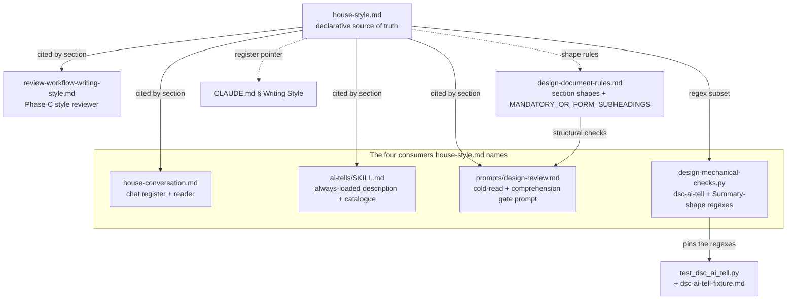
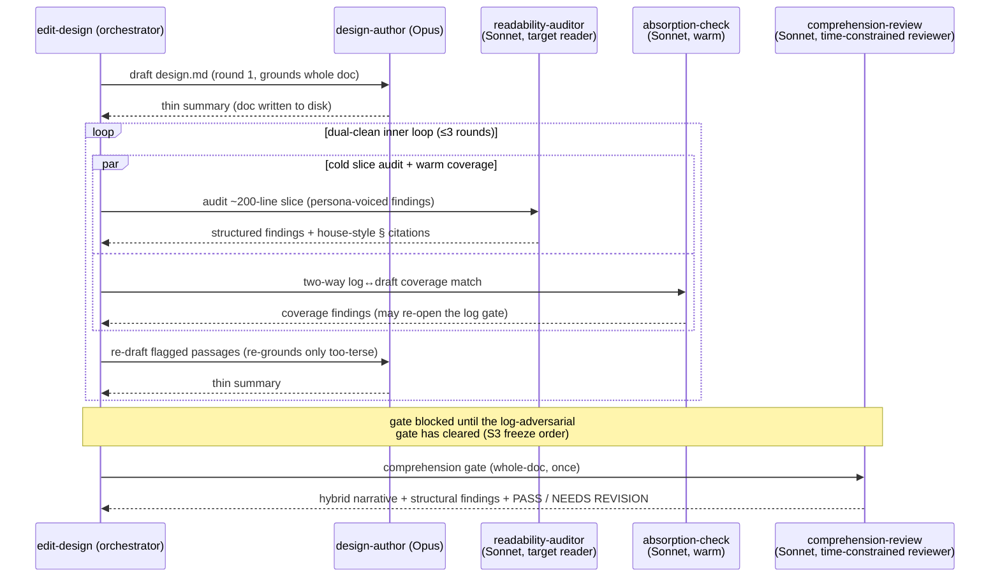

<!-- workflow-sha: 3c57672e9b12b504d5feb5134ca96be891b3ffbc -->
# Technical-writer voice for design and plan documents — Design

## Overview

YouTrackDB's authored documents are governed by one declarative style file,
`.claude/output-styles/house-style.md`, plus a chat-register file
`house-conversation.md`. This design is for the workflow maintainer who edits that
machinery and the review agents; it assumes the `edit-design` authoring loop and the
`dsc-ai-tell` mechanical checks. Today the machinery carries a class of rules whose
only job is to make text read as human-authored — §"Removing the disguise-only
style rules" names each of the six with its gloss. These rules
fight model training and add no comprehension value, yet the plan documents stay
hard to read and expensive to review. The writer persona is a senior engineer
(`house-style.md:42`), the chat reader a senior engineer (`house-conversation.md:7`),
and the two cold review agents run on Opus.

This change stops fighting training and spends the freed effort on readability. It
makes five changes:

1. Removes the six disguise-only rules at the source and every mirrored consumer.
2. Recasts the design/track writer as a technical writer with the internals-book voice.
3. Recasts the two cold review agents as named reader personas on Sonnet, a mid-level-reader proxy.
4. Renames the per-section `TL;DR` block to a `### Summary` sub-heading.
5. Hardens the section-level bottom-line-up-front (BLUF) lead — the lead that
   states the section's conclusion before its body — per YTDB-1163.

`house-style.md` is the single source of truth for these rules. Four consumers (the
`ai-tells` skill, the cold-read prompt in `prompts/design-review.md`, the
`dsc-ai-tell` regex checker, and `house-conversation.md`) already cite it by section
and restate no rule. Because those consumers hold no copy of their own, deleting a
rule at the source propagates the removal to all of them at once. The same removal
touches seven further artifacts; §"Class Design" lists them.

The branch is workflow-modifying in `conventions.md` §1.7 staged mode: edits
accumulate under `_workflow/staged-workflow/.claude/**` and promote only at Phase 4,
and this design is authored under the current live rules (see §"Staging and
promotion under §1.7"). The rest of the document covers the core vocabulary, the
artifact and agent architecture, the runtime authoring-review loop, then eight
topic sections that realize the five changes above plus the cross-cutting
dual-register guard, and one for staging.

## Core Concepts

This design introduces six load-bearing ideas. Each is named and used without
re-definition in the sections that follow. Each entry pairs the new concept with
what it replaces and points at the section that elaborates it. The delta from
today's style machinery is then visible at a glance.

**Disguise-only rule.** A style rule whose only benefit is making text read as
human-authored, with no gain in comprehension and no reduction in length. These
are the rules this change removes. Replaces the prior assumption that every
AI-tell rule earns its place. → §"Removing the disguise-only style rules".

**Technical-writer voice.** The writer persona for design and track prose: a
technical writer whose job is to leave the reader with a working mental model,
teaching each mechanism rather than only naming it. Replaces "a senior engineer
writing to peers". → §"The technical-writer voice".

**Book-rule transfer.** The eight non-negotiable voice rules of the YouTrackDB
internals book (`BOOK_BRIEF.md`), imported into the design-doc rules — some
verbatim, some adapted from chapter scope to section scope, some already present.
Replaces the design-doc rules' silence on narrative shape. → §"Transferring the
internals-book voice rules".

**Persona reader.** A cold review agent given a named reader identity and stance
(a target reader, or a time-constrained reviewer) instead of a neutral checklist
runner. The identity shapes what the reviewer reports. Replaces the two
personless cold readers. → §"Persona readers: target reader and time-constrained
reviewer".

**Reader-proxy model pin.** Pinning the two reader agents to Sonnet so the model
stands in for a mid-level developer: if Sonnet can follow the document, a
mid-level human can. Replaces the Opus pins on both readers. → §"Reader-proxy
model pins and the false-clean risk".

**Dual-register design document.** The frozen `design.md` in which the
technical-writer voice governs only the mechanism prose, while the machine-facing
skeleton — decision records, `### Summary` blocks, footers, diagrams — stays
registry-terse for the track-derivation spawn that reads it. Replaces a single
uniform register across the whole document. → §"Dual-register design document".

## Class Design

This is a workflow-machinery change with no Java, so the architecture is the set
of `.claude/**` artifacts that change and how they relate. `house-style.md` is
the declarative source of truth; every other style surface either cites it by
section name or realizes a regex subset of it. The graph below shows which files
this design edits and along which relationship.

A solid arrow reads "cites `house-style.md` by section": the four consumers in the
subgraph are the four that `house-style.md § What this style governs` enumerates as
citing the source without restating any rule. `review-workflow-writing-style.md` (the
Phase-C style reviewer, drawn outside the subgraph) also cites `house-style.md` by
section, but `house-style.md` does not count it among those four — it carries its own
enforce-these-rules checklist rather than only pointing at the source.
`prompts/design-review.md` is one of the four and also consumes the structural checks
`design-document-rules.md` supplies (the `DDR → DR` arrow), so it appears as both a
`house-style.md` consumer and the comprehension-gate prompt. The `DSC → TEST` arrow
is the coupling that makes a removal a two-file edit — `test_dsc_ai_tell.py` and
`dsc-ai-tell-fixture.md` pin the exact regex behavior, so deleting a regex without
deleting its assertion and fixture lines breaks the build (see §"Removing the
disguise-only style rules"). Dashed arrows are weaker relationships:
`design-document-rules.md` carries its own copy of the shape rules and the
`dsc-ai-tell` catalogue row, and `CLAUDE.md` points at the register without
restating it.

The review side is a roster of five agents. Two change model and gain a persona;
one gains a pin note and the voice mandate; two are unchanged and listed so the
reader knows the loop's full membership.

| Agent | Model (before → after) | Persona / role | Owns prose AI-tell axis? | Changed here |
|---|---|---|---|---|
| `design-author` | Opus → Opus (pinned, never Fable) | code-grounded writer, technical-writer voice | n/a (writer) | pin note + voice mandate |
| `readability-auditor` | Opus → Sonnet | target reader (mid-level dev, "will not fill in gaps"); persona-voiced structured findings | yes — sole owner (S4) | model + persona + finding voice |
| `comprehension-review` | Opus → Sonnet | time-constrained reviewer (30-minute mental model); hybrid narrative + findings | no | model + persona + hybrid output |
| `absorption-check` | Sonnet → Sonnet | warm coverage matcher (personless) | no | unchanged |
| `fidelity-check` | Sonnet → Sonnet | seed↔track coverage cross-check (personless) | no | unchanged |

Invariant S4 gives the prose AI-tell axis exactly one owner per surface, the
target reader. The comprehension gate runs that axis nowhere; the absorption and
fidelity checks are personless because coverage matching needs no reader stance.
§"Persona readers" derives why the axis lands on the sliced auditor and the
narrative half on the whole-doc gate.

## Workflow

The runtime change is the `phase1-creation` authoring-review loop that
`edit-design` drives. The author drafts, a dual-clean inner loop of two Sonnet
agents runs each round until both return clean, and a de-warmed comprehension gate
— it reads only the finished document, never the research log — runs once at the
end. The model pins and persona identities from the roster
above sit on the participants below.

The `par` block is the dual-clean pairing. The target reader
(`readability-auditor`) reads its slice plus the standing anchors cold — never the
research log. The standing anchors are the `## Overview` and `## Core Concepts`
sections, read alongside every slice. The target reader owns the prose AI-tell
axis. The warm `absorption-check` reads the log and matches its load-bearing
decisions against the draft's decision records both ways. Keeping them separate spawns is what preserves the cold read —
warmth corrupts readability judgment but not coverage matching. Each round the
author re-drafts, re-grounding in code only for passages an auditor flagged as
too terse. The loop converges when both agents return clean in the same round.

The comprehension gate is de-warmed: it reads only the document, runs the
comprehension questions and the whole-doc structural checks, and returns the
hybrid narrative-plus-findings report of the time-constrained reviewer. The
`Note` records the S3 freeze order — the gate must not assess the readability of
a design whose decisions have not survived challenge, and that challenge now runs
on the research log at the Phase 0 → 1 boundary rather than in a local pass. A
decision surfaced during authoring (by the author, or flagged by the absorption
check as a draft record with no log basis) re-opens the log gate before the
comprehension gate may run.

## Removing the disguise-only style rules

**TL;DR.** Six style rules whose only benefit is disguising machine authorship
are removed from `house-style.md` and every mirrored consumer: the
negative-parallelism ban,
the roundabout-negation ban, the closing-phrases ban, the hyphenated-word-pair
rule, the curly-quotes rule, and the sentence-case-heading mandate (Title Case is
allowed again). The removal criterion is mechanical: a rule goes if its only
payoff is disguise and it carries enforcement cost; a rule stays if deleting the
flagged text shortens the document or if the rule forces the writer to supply
substance.

The user's aim is to stop fighting model training on rules that add no
understandability. Removal happens at the source (`house-style.md`) so documents
and chat both inherit, and a chat-register-only removal is rejected because the
review cost lives in the durable documents. The split between remove and keep
follows one criterion, applied rule by rule:

- **Remove** when the rule's only benefit is disguise and it carries enforcement
  cost. Negative parallelism is the clearest case. By contrast, deleting
  throat-clearing shortens the text with zero information loss, so its ban pays in
  review time and the rule stays. Negative parallelism instead *reframes* real
  content at near-zero length cost — the `not X, but Y` form carries an X-contrast
  that a positive rewrite often has to re-state — so banning it buys no brevity,
  only disguise. It is also the most false-positive-prone pattern in the checker: the
  trailing-negation variant needed a curated `just` / `merely` / `simply`
  intensifier discriminator to stop flagging legitimate plain contrasts.
- **Keep** when deleting the flagged text shortens the document, or when the rule
  forces the writer to supply substance. Orientation and Plain language stay
  wholesale. Passive voice, nominalization, broken grammar around identifiers,
  elegant variation, and the boldface cap stay. Throat-clearing, prompt-restating,
  and superficial `-ing` clauses stay because they are additive padding and
  padding is review cost. Hedge stacking, filler hedges, trailing hedges, vague
  attribution, false ranges, generic positive conclusions, and persuasive
  authority tropes stay because each forces a claim to carry its number, source,
  or named trade-off. The consumer-only "adjective triads" rule
  (`comprehensive, robust, scalable`) also stays under this criterion — it forces
  each vague adjective to become a named quality, which is the Plain-language
  "name the quality" move — and it gains no new house-style section here.

**Closure default:** any rule not on the remove list keeps its current
disposition.

The six removals propagate through the mirrored consumers. Each removal lands in
every row below or the rule is only half-gone.

| Removed rule | `house-style.md` site | Mirrored consumers |
|---|---|---|
| Negative parallelism | § Banned sentence patterns (`:100`) | `dsc-ai-tell` `NEGATIVE_PARALLELISM_RE` (`:103`) + `NEGATIVE_PARALLELISM_TRAILING_RE` (`:127`); test + fixture; `ai-tells/SKILL.md` description + catalogue; `review-workflow-writing-style.md`; `house-conversation.md`; `design-document-rules.md:289`; `CLAUDE.md` § Writing Style parenthetical |
| Roundabout negation | § Banned sentence patterns (`:101`) | `ai-tells/SKILL.md` catalogue; `review-workflow-writing-style.md`; `house-conversation.md` |
| Closing phrases | § Banned sentence patterns (`:103`) | `ai-tells/SKILL.md` description + catalogue; `review-workflow-writing-style.md`; `house-conversation.md` |
| Hyphenated word-pair | § Hyphenated word-pair overuse (`:262`) | `dsc-ai-tell` `HYPHENATED_PAIR_CLUSTER_RE` (`:191`); test + fixture; `design-document-rules.md:289` |
| Curly quotes | § Curly quotes (`:273`) | `ai-tells/SKILL.md` catalogue |
| Sentence-case heading mandate | § Title Case headings forbidden (`:304`) | `dsc-ai-tell` `_title_case_violation` (`:1734`); test + fixture; `ai-tells/SKILL.md` description + catalogue; `design-document-rules.md:289` |

The regex-to-test coupling makes three of the removals a same-change multi-file
edit. `dsc-ai-tell-fixture.md` carries example lines that must fire a regex, and
`test_dsc_ai_tell.py` asserts those lines produce findings. Delete
`NEGATIVE_PARALLELISM_RE` from `design-mechanical-checks.py` but leave its
fixture line and assertion, and the test suite fails at build time because the
expected finding no longer appears. So each of the negative-parallelism,
hyphenated-pair, and Title-Case removals deletes the regex, its fixture lines,
and its assertions in one change.

The `ai-tells/SKILL.md` `description:` frontmatter is a special hazard because it
is loaded into every session unconditionally. It hard-codes three of the six
removals by name — negative parallelism, Title Case headings, and closing phrases
— so if the description is not edited, those rules keep costing context in every
session even after they leave `house-style.md`.

### Edge cases / Gotchas

- The regex and its test-plus-fixture are one unit. Removing a regex without its
  assertions and fixture lines breaks the build; removing the fixture lines
  without the regex leaves a dead pattern. Edit all three in the same change.
- The `ai-tells/SKILL.md` description is always loaded; the three removals named
  in it must be edited or the removed rules keep consuming context every session.
- Removal is not a backfill. Legacy committed designs under `docs/adr/**` were
  authored under the removed rules and are not re-reviewed (the mutation
  discipline gates new modifications only).
- `roundabout negation`, `closing phrases`, and `curly quotes` have no
  `dsc-ai-tell` regex today, so their removal touches prose consumers only, not
  the checker.

### Decisions & invariants

- D-records: D1 (remove the disguise-only rules at the source plus every mirrored
  consumer, enumerated by grep over the removed pattern names), D7 (per-rule
  remove/keep disposition under the removal criterion, with the closure default)
- Invariants: the removal criterion — remove on disguise-only benefit plus
  enforcement cost; keep on deletes-text or forces-substance.

## The technical-writer voice

**TL;DR.** The writer persona for design docs and track files changes from "a
senior engineer writing to peers" (`house-style.md:42`) to a technical writer
whose output leaves the reader with a working mental model. The voice governs the
prose sections of design docs and track files only; issue bodies, PR
descriptions, and commit-message bodies keep the terse BLUF register, because
those surfaces are read to act and a narrative arc adds length without
comprehension gain.

The teaching-narrative voice suits documents read to build a mental model. The
YTDB internals book praised by its readers uses this voice, and its rules
transfer here (see §"Transferring the internals-book voice rules"). The scope is
bounded deliberately: a narrative issue body worsens an act-oriented surface, so
the voice applies to design and track prose and stops there.

In a track file the voice governs the prose sections only — `## Purpose / Big
Picture`, `## Context and Orientation`, and `## Plan of Work`. The structured
surfaces of the ExecPlan — the 15-section per-track execution-plan template defined
in `conventions-execution.md §2.1` — stay registry-terse: the `## Concrete Steps`
roster lines, `## Episodes` structured-field blocks, `## Decision Log` four-bullet
records, `## Invariants & Constraints` bullets, and `## Interfaces and
Dependencies` boundary lists. Track files are read by implementer spawns under a
context budget; narrativizing the structured fields would inflate every
implementer read with no reader who benefits. The prose trio is exhaustive: every
other track-file section — including the author-written `## Validation and
Acceptance` and `## Idempotence and Recovery` — stays registry-terse.

The alternative of applying the voice everywhere is rejected because it worsens
the act-oriented surfaces. The alternative of applying it over whole track files
without the carve-out is rejected because an author agent could then legitimately
narrativize rosters and episode fields, inflating implementer reads.

### Edge cases / Gotchas

- The voice governs prose sections only. An author narrativizing an issue body, a
  PR description, or a track file's `## Episodes` structured fields is a finding.
- The track-file carve-out is positive and exhaustive: only the three named prose
  sections take the voice. `## Validation and Acceptance` and `## Idempotence and
  Recovery` are author-written but stay registry-terse.
- The persona swap is at `house-style.md:42` (§ Voice and tone). The assumed
  mid-level-reader knowledge floor at `house-style.md:6` does not change — the
  writer persona changes, the reader calibration stays.

### Decisions & invariants

- D-records: D5 (technical-writer voice governs design/track prose only; issue,
  PR, and commit bodies stay terse BLUF; the track-file prose-trio carve is
  exhaustive)

## Transferring the internals-book voice rules

**TL;DR.** The eight non-negotiable voice rules from the internals book's
`BOOK_BRIEF.md` transfer into the design-doc rules: five verbatim, two adapted, and
one already present. The two adaptations shift chapter-scope rules to section scope.
Where
a transferred rule would collide with a kept house-style rule, a stated precedence
ranking resolves it, so the author and the style reviewer never hold contradictory
targets.

The book's readers praised its narrative teaching. Its eight rules map to the
design doc as follows:

| Book rule (`BOOK_BRIEF.md`) | Transfer disposition |
|---|---|
| Narrative, not reference | Adapted to section scope: each `##` section is one complete argument — problem → forces → mechanism → consequences — while the document as a whole stays dip-in navigable. |
| Concrete before abstract | Verbatim. |
| One concept per section | Verbatim; interacts with sibling consolidation (see precedence below). |
| Earn every name (role before class name) | Verbatim. |
| Connect forward and backward | Adapted to light prose links: the opener names what the section builds on, the closer names what depends on it. |
| Source citations stay precise (`file:line`) | Already present in the design-doc rules. |
| Diagrams must teach | Verbatim. |
| No bullet-point fact dumps | Verbatim. |

Two of these outrank kept house-style rules where they would otherwise conflict,
and any enforcement agent reads the ranked rule so the loop cannot thrash between
two contradictory targets:

1. **A worked-example opener beats the section-length heuristics.** In
   mechanism-overview prose, a worked example that opens with the concrete case is
   on the section-length cap's exemption list. So neither the 200-word trigger nor
   the bias toward less text flags what the target reader asked for. The
   anti-padding clause still applies *inside* the example: a worked example that
   teaches nothing is padding.
2. **One-concept-per-section beats same-shape sibling consolidation when the
   siblings teach distinct concepts.** Consolidation stays for same-shape
   *reference* material (comparison tables, catalogues) where no concept is being
   taught; it yields where three same-shaped siblings each carry a different idea.

The adapted forward/backward links cite the neighbor's section heading verbatim
so they are greppable. Because a heading is a moving target, the `edit-design`
mutation discipline gains a reminder: on any section-move, section-remove, or
section-rename, re-read the neighbor openers and closers so a link does not point
at a heading that no longer exists.

The alternatives rejected are a whole-document story arc (design docs are
consulted, not read cover to cover), dropping the forward/backward links entirely
(the book's dip-in readers showed the links carry navigation), and leaving the
two rule sets unranked (two enforcement agents with contradictory targets thrash
the authoring loop).

### Edge cases / Gotchas

- The worked-example exemption covers length, not padding. A long worked example
  that teaches nothing is still a finding under the anti-padding clause.
- Consolidation still applies to reference-material siblings. The one-concept rule
  wins only when the siblings teach distinct concepts.
- Forward/backward links are greppable by design (verbatim heading text). A
  section rename that skips the neighbor re-read leaves a dangling prose link that
  no mechanical check catches — the reminder in the mutation discipline is the
  guard.

### Decisions & invariants

- D-records: D9 (transfer the eight book voice rules — verbatim, adapted, or
  already-present; rank the two colliding rules over the kept house-style rules;
  add the link-staleness re-read reminder)
- Invariants: precedence — worked-example opener over the length cap; one-concept
  over consolidation for concept-bearing siblings.

## Dual-register design document

**TL;DR.** The frozen `design.md` stays the track-derivation seed, and the
technical-writer voice governs only the mechanism prose between the
machine-facing anchors. The decision records keep the four-bullet registry-terse
form, `### Summary` blocks stay plain-claim and self-contained, the
decisions-and-invariants footers stay lists, and the diagrams stay. The seed
consumer — the track-authoring spawn — is a cold agent, so narrative orientation
in the prose helps it, while the structured anchors keep the operative content
extractable.

The user asked whether a narrative format degrades the design as a machine seed
for track generation, and whether the research log should seed tracks instead.
The resolution keeps the frozen design as the seed. The research log is a
decision ledger — append-only, with superseded entries and no integrated
mechanism — so it cannot supply the mechanism content that tracks need; the frozen
design is reviewed, integrated, and user-accepted. Applying the narrative voice
uniformly to the whole document, including the records and summaries, would
dissolve operative content into the story arc, which is the extraction hazard the
user's doubt named.

The guard is a register boundary inside the document. The technical-writer voice
governs the mechanism prose. The machine-facing skeleton stays registry-terse:

- Decision records keep the canonical four-bullet form.
- `### Summary` blocks stay plain-claim and self-contained (the YTDB-1163
  self-contained-lead rule applies here too — see §"Hardening the section BLUF
  lead").
- Decisions-and-invariants footers stay lists of D and S codes.
- Diagrams stay as diagrams.

This extends the existing registry-terse-versus-orientation distinction to the
design doc's own internal structure. The `### Summary` separation also improves
partial-read extractability for the derivation spawn, which can read the summary
without reading the mechanism.

### Edge cases / Gotchas

- The voice governs mechanism prose only. A D-record rewritten as narrative, or a
  `### Summary` that runs into the details, is a finding.
- When `design_gate=yes`, the frozen design is the seed, not the research log. The
  log is a Phase-2 cross-check input, never a Step-4b seeding input in that case.
- `### Summary` blocks stay self-contained so the cold derivation spawn can
  extract them without the surrounding mechanism.

### Decisions & invariants

- D-records: D8 (frozen design stays the `full`-tier track seed; the narrative
  voice governs mechanism prose only; the machine-facing skeleton stays
  registry-terse)
- Invariants: skeleton exempt from the narrative voice — records, summaries,
  footers, and diagrams stay registry-terse.

## Persona readers: target reader and time-constrained reviewer

**TL;DR.** The two existing cold readers are recast as named personas rather than
replaced. `readability-auditor` becomes the *target reader* — a mid-level
developer assigned to implement or review, who "will not fill in gaps" and
returns persona-voiced structured findings. `comprehension-review` becomes the
*time-constrained reviewer* — thirty minutes to build a working mental model —
and returns a hybrid of a reading narrative plus structured findings. No new
spawns are added; the mechanical checks stay personless.

The book project's review layer uses first-person reader personas, and their
per-chapter stumble reports carried a reading-experience signal a neutral
checklist misses. That signal transfers, but the output contract splits by role
because a narrative is a whole-read property:

- The **whole-doc comprehension gate** returns the hybrid: a reading narrative
  plus structured findings. Its narrative is meaningful because it reads the full
  document in order, the way the book's beta readers read the full book, and its
  consumer is real — the orchestrator's gate verdict and the author's rework seed.
- The **range-sliced target reader** returns persona-voiced structured findings
  only. At a ~200-line slice, a "stumble" is exactly what a structured finding
  already records (verbatim quote, location, why it breaks). A per-slice narrative
  would flow into the orchestrator with no consumer, multiplied by up to six
  slices across three rounds. The structured findings keep the dual-clean
  convergence keyed on discrete findings.

The recast preserves axis ownership. The persona governs register and stance, not
the checklist. The target reader keeps sole ownership of the prose AI-tell
judgment axis; this is invariant S4, one owner per surface. It also retains the
house-style `§`-citation obligation for the kept judgment rules (padding, hedging,
elegant variation, the boldface cap — the subset the `dsc-ai-tell` regexes cannot
reach). A stumble report and a `§`-cited finding are the same artifact seen from
the persona: "I had to re-read this" plus the verbatim quote plus the rule it
breaks.
The skeptical-veteran persona from the book's roster is not added as a third
spawn; its skepticism toward shallow content dressed up to look deep folds into the
time-constrained reviewer's mental-model verdict.

The alternatives rejected:

- A third veteran spawn — extra per-round cost for a signal the comprehension
  verdict already carries.
- New persona agents alongside the old roles — duplicates the review surface.
- A persona without the checklist — silently drops the judgment half of the axis,
  leaving the kept rules with no per-round enforcer.
- A pure narrative on both roles — the sliced auditor's narrative has no consumer
  and only costs context.

### Edge cases / Gotchas

- The persona is register and stance, not a new checklist. The target reader still
  owns the prose AI-tell axis and still cites `house-style.md §` per finding.
- The narrative half lives only on the whole-doc gate. The sliced auditor returns
  structured findings only; a per-slice narrative has no consumer.
- No third spawn. The veteran's skepticism toward shallow content dressed to look
  deep is a facet of the time-constrained reviewer's verdict, not a separate agent.

### Decisions & invariants

- D-records: D2 (hybrid narrative-plus-findings on the whole-doc gate;
  persona-voiced structured findings only on the sliced auditor), D6 (recast the
  two existing readers, no new spawns; the persona governs stance, not the
  checklist)
- Invariants: S4 — the prose AI-tell axis has exactly one owner per surface (the
  target reader).

## Reader-proxy model pins and the false-clean risk

**TL;DR.** `readability-auditor` and `comprehension-review` move from Opus to
Sonnet; `design-author` is pinned to Opus and never Fable. Sonnet is a mid-level
reader proxy: if Sonnet can follow the document, a mid-level developer can. The
proxy claim covers only the benign direction, so three mitigations address the
load-bearing risk — that a weaker reader glosses over what it failed to follow
rather than reporting it.

The reader roles judge reading experience, not design quality, so a mid-level
proxy is the right model for them. The author stays Opus because it drafts from an
already-resolved research log — the hard decisions are settled before authoring,
so Fable adds nothing there.

The false-clean risk is that Sonnet fails to follow a passage yet reports it as
clean. Three mitigations target it:

1. **The persona contract targets exactly that failure mode.** A target reader
   instructed "you will not fill in gaps" reports a stumble ("I had to re-read
   this") instead of judging subtle prose quality. Reporting a stumble is
   introspectively easier than judging prose quality, so a mid-level proxy does it
   reliably. The whole-doc gate, in turn, answers the comprehension questions with
   `file:line` citations, and those answers ride alongside the reading narrative
   and structured findings in the same report; a wrong or uncited answer makes a
   comprehension failure *visible* rather than silent.
2. **Opus readers carry the opposite error at similar cost.** A strong model
   follows dense prose a mid-level human cannot, silently under-reporting
   too-dense passages. That calibration failure is the one this change exists to
   fix.
3. **Backstops remain.** The `dsc-ai-tell` regex pre-flight runs before the
   readers, and the Phase-C `review-workflow-writing-style` pass runs on the
   workflow-markdown diff.

The residual risk is named and accepted: if dual-clean documents keep drawing
human readability complaints, the model pin is the first suspect to revisit.

The alternatives rejected:

- Keeping Opus readers — defeats the proxy calibration and costs more.
- Keeping one Opus backstop on the outer gate only. The gate's cited comprehension
  answers already make its failures visible, so an Opus backstop buys nothing there.
  Splitting the pins would re-introduce the calibration mismatch on exactly the gate
  that most needs the mid-level proxy.
- Fable for the author — unnecessary given the resolved-log input.

### Edge cases / Gotchas

- The proxy claim is one-directional. It covers "if Sonnet follows it, a human
  will"; the load-bearing direction is whether Sonnet *reports* what it could not
  follow, which the three mitigations address.
- The author's Opus pin is a floor, never Fable — the resolved-log input is why
  Fable adds nothing, not a cost argument.
- The model pin is the first thing to revisit if human readability complaints
  persist on dual-clean documents.

### Decisions & invariants

- D-records: D3 (move both reader agents to Sonnet as a mid-level proxy; pin the
  author to Opus, never Fable; carry the three false-clean mitigations)
- Invariants: backstops kept — the `dsc-ai-tell` pre-flight and the Phase-C
  `review-workflow-writing-style` pass.

## Renaming TL;DR to Summary

**TL;DR.** The per-section `TL;DR` block is renamed to a `### Summary`
sub-heading, with the section's details pushed under their own sub-headings. A
sub-heading gives structural separation of summary from detail — skimmable
end-to-end and regex-enforceable — where "Summary" is also self-explanatory to a
reader for whom "TL;DR" is jargon. Legacy `TL;DR` spellings stay accepted, so
committed designs keep passing.

The goal is clear separation of summary from details, with a rename to "Summary". A
bold-prefix `**Summary.**` rename alone leaves the summary running into the details,
which is the separation failure at issue; a `### Summary` sub-heading fixes it
structurally. Backward compatibility follows the D11
References→Decisions & invariants precedent: both spellings are accepted in the
shape regexes, so a hard rename does not break every legacy design under
`docs/adr/**` on re-review.

The rename touches every site that hard-codes the `TL;DR` spelling, enumerated by
grep over `.claude/`:

- `design-document-rules.md` — per-section shape, Part-level TL;DR, the
  consolidation-form TL;DR, and the templates.
- `design-mechanical-checks.py` — the `section_has_tldr` regexes (`:708`), the
  `SHAPE_EXEMPT_SECTION_NAMES` Part-level `"TL;DR"` entry (`:54`), and
  `MANDATORY_OR_FORM_SUBHEADINGS` (`:62`).
- `prompts/design-review.md` (structural findings and TOC row), `edit-design/SKILL.md`
  (~5 sites), `planning.md:774`, `house-style.md § Navigability`,
  `prompts/create-final-design.md:187`, `skills/review-workflow-pr/SKILL.md:114`,
  `conventions.md:149`, `agents/comprehension-review.md:34`, and the
  `dsc` test suite where it pins the TL;DR shapes.

`MANDATORY_OR_FORM_SUBHEADINGS` is the subtle one. It lists the sub-heading names
excluded from the same-shape sibling similarity computation, so that a
well-formed section's mandatory sub-headings do not make every section look
identical. If designs gain `### Summary` sections but the set does not list
`"summary"` alongside `"tl;dr"`, the shared `### Summary` heading counts toward
the similarity score in every section, and the same-shape sibling check
false-positives on every well-formed design. So `"summary"` must be added there
in the same change as the shape regex.

### Edge cases / Gotchas

- `MANDATORY_OR_FORM_SUBHEADINGS` must gain `"summary"` alongside `"tl;dr"` or the
  same-shape sibling check counts the shared `### Summary` heading in every
  section and false-positives on every well-formed design.
- Both spellings stay accepted (`**TL;DR.**` / `### TL;DR` and `### Summary`),
  mirroring the D11 both-spellings precedent, so legacy designs pass without a
  backfill.
- This design is authored under the current live rules and therefore uses
  `**TL;DR.**` itself; the `### Summary` form applies to designs authored after
  promotion.

### Decisions & invariants

- D-records: D4 (rename `TL;DR` to a `### Summary` sub-heading with details under
  their own sub-headings; keep both spellings accepted; the complete rename-site
  list including `MANDATORY_OR_FORM_SUBHEADINGS`)
- Invariants: backward compatibility — both `TL;DR` and `Summary` spellings
  accepted in the shape regexes.

## Hardening the section BLUF lead

**TL;DR.** Two rules harden the section-level BLUF lead per YTDB-1163: the lead
must be a self-contained plain claim, parseable before the body is read, and the
body must stand as complete prose with the lead deleted. The section-level BLUF
rule today permits opaque forward-reference leads and bodies that read only as
the lead's continuation; these two rules close that gap.

Today's section-level BLUF rule permits a lead like "This section establishes the
three-tier `mutation_kind` dispatch" — an opaque forward reference — and a body
that reads only as its continuation. The two hardening rules fix each half:

1. **Self-contained lead.** The lead must be a plain claim a reader can parse
   before reading the body. Gloss any domain term in the lead, or fall back to
   why-before-what.
2. **Body stands without the lead.** With the lead deleted, the body must read as
   complete prose. An anaphor opener ("This", "It", "Such") that resolves only
   into the lead is a finding.

The two rules bind every section lead on the workflow-markdown surfaces and the
issue and PR BLUF, including surfaces that carry no `### Summary` block at all. The
`### Summary` sub-heading is the design-doc carrier of the lead these rules govern
(D4), not the whole of their scope.

The lead-opening slot is shared with D9's connect-backward opener — the rule that a
section opener names what it builds on. The two hardening rules rank first: the
self-contained plain claim comes first, and the backward link rides as a subordinate
clause of it or as the following sentence, never substituting for the claim. So every
agent touching the section-opening slot — the writing-style reviewer and readability
auditor on the lead rules, the comprehension reviewer on the D9 link demand — reads
one ranked rule rather than two that contend.

Acceptance names three sites:

- `house-style.md` § BLUF lead and § Orientation, with an exemplar before/after
  pair beside the § Orientation worked exemplar at `house-style.md:70-74`;
- the `review-workflow-writing-style.md` BLUF criteria;
- the house-style self-check item that requires the first paragraph to state the
  decision or symptom directly (the BLUF item).

The third site is anchored by name rather than ordinal because this change's D1
and D7 removals renumber the self-check list. These rules also serve a second
purpose: the dual-register guard (see §"Dual-register design document"). A `###
Summary` block that is self-contained is exactly a lead that satisfies rule 1, which
is why the derivation spawn can extract summaries in isolation.

### Edge cases / Gotchas

- The two rules are distinct. A lead can be self-contained while the body still
  leans on it (an anaphor opener), and the reverse; check both.
- An anaphor opener resolving into the lead is the canonical rule-2 violation.
- The rules land in three sites; the exemplar pair belongs with the `house-style.md`
  § Orientation site, beside the existing worked exemplar, so a reader sees the
  before/after in context.

### Decisions & invariants

- D-records: D10 (adopt YTDB-1163's two BLUF-hardening rules — self-contained lead
  and body-stands-without-the-lead; the scope across all workflow-markdown section
  leads and the issue/PR BLUF; the composition rule ranking the plain claim ahead of
  the D9 backward-link opener; and the three acceptance sites), D4 (the `### Summary`
  sub-heading that carries the lead in a design doc)
- Invariants: self-contained lead; body stands with the lead deleted.

## Staging and promotion under §1.7

**TL;DR.** The branch runs in `conventions.md` §1.7 staged mode, not the
prose-only opt-out, because the changes are behavior-bearing: the `dsc-ai-tell`
regexes and the two agent frontmatters change runtime behavior, which disqualifies
a §1.7(k) opt-out. Every edit accumulates under
`_workflow/staged-workflow/.claude/**` and promotes to the live tree only at Phase
4. This design is authored and reviewed under the current live rules; the new
voice applies only after promotion.

A §1.7(k) prose-only opt-out is available only when a workflow-modifying branch
changes prose alone. This branch changes the `design-mechanical-checks.py`
regexes (a script) and the `readability-auditor` / `comprehension-review`
frontmatters (agent model pins and personas), both of which change how the
workflow runs. So the branch stages: the edited `.claude/**` files live under
`_workflow/staged-workflow/.claude/**` during the branch lifetime, and the Phase
4 promotion commit moves them into the live tree.

The staging has a bootstrap consequence the author must respect. The new rules —
the `### Summary` shape, the Title-Case allowance, the technical-writer voice —
are not live while the branch is open. So this design document is authored and
reviewed under the current live rules: it uses `**TL;DR.**` bold-prefix summaries,
sentence-case headings, and the current section shapes, and it does not apply the
new voice. The new machinery reviews only documents authored after promotion.

### Edge cases / Gotchas

- Behavior-bearing changes disqualify the §1.7(k) prose-only opt-out. The script
  regexes and the agent frontmatter are the behavior-bearing surfaces here.
- The new rules are not live until Phase-4 promotion. This design must use the
  current `**TL;DR.**` shape and sentence-case headings, not the forms it defines.
- The staged files live under `_workflow/staged-workflow/.claude/**`; the live
  `.claude/**` tree is untouched until the promotion commit.

### Decisions & invariants

- D-records: none — this section realizes the §1.7 staged-mode classification, a
  process rule rather than a design decision.
- Invariants: staged mode until Phase-4 promotion; this design authored under the
  current live rules.
