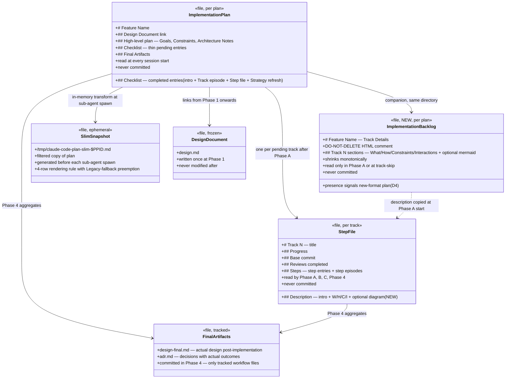
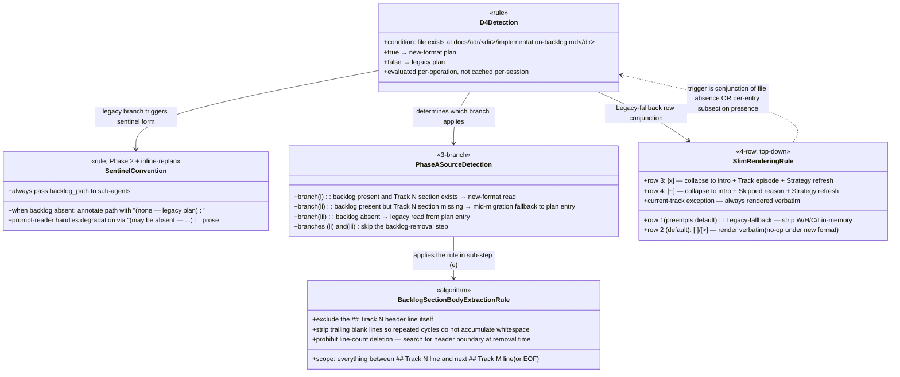
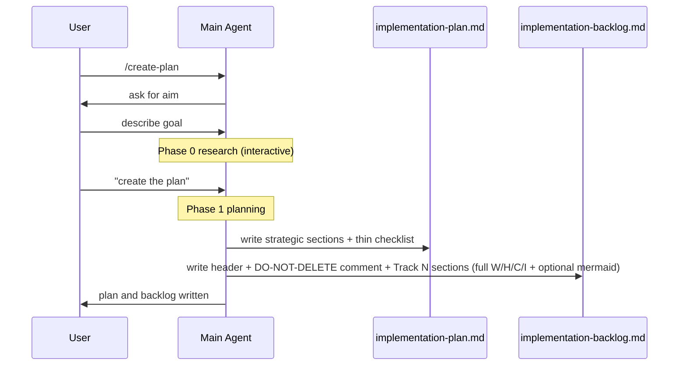
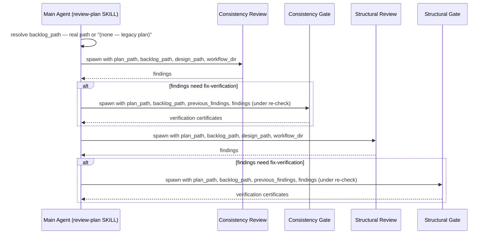
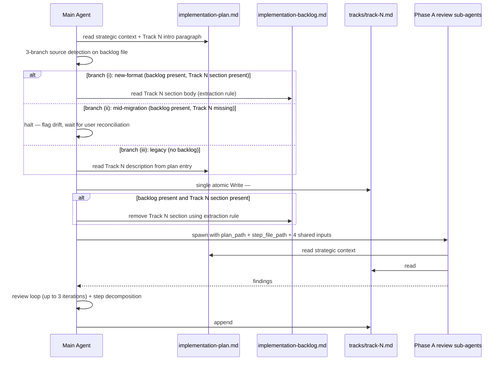

# Thin Workflow — Split Plan from Backlog — Final Design

## Overview

The implementation plan used to be a single file, `implementation-plan.md`,
carrying both strategic context (Goals, Constraints, Architecture Notes,
Decision Records) and every track's detailed
`**What/How/Constraints/Interactions**` subsections plus optional
track-level Mermaid diagrams. Every `/execute-tracks` session read the
whole file at startup, even though the detailed subsections are only
consumed by Phase A of one track per session.

The implemented split moves the detailed subsections into a new
companion file:

- **`implementation-plan.md`** — strategic sections + a thin checklist.
  For pending tracks the entry carries only title + intro paragraph +
  `**Scope:**` + `**Depends on:**`. Completed tracks keep the
  `**Track episode:**`, `**Step file:**`, and `**Strategy refresh:**`
  lines. Read at every session start.
- **`implementation-backlog.md`** (NEW) — the
  `**What/How/Constraints/Interactions**` subsections and any track-level
  Mermaid diagrams for pending tracks. Read only when a track enters
  Phase A (or when it is skipped).

At Phase A start the current track's backlog entry is copied into
`tracks/track-N.md` as a new `## Description` section; the backlog entry
is then removed. Because Phase B/C sub-agents already read the step
file, they pick up the description without any prompt change.

The plan is detected as new-format or legacy by a single file-existence
check on `implementation-backlog.md`. In legacy plans the full
description stays inline in the plan-file checklist entry, and
Phase A / track-skip / inline-replanning skip the backlog touch-points.

### Deviations from the planned design

Five pieces of the delivered design are richer than what `design.md`
proposed. Each emerged from review findings or cross-track signals
during execution:

1. **3-branch Phase A source detection** (new-format / mid-migration /
   legacy) instead of a 2-branch present/absent check. The
   mid-migration branch covers the hand-edited case where the backlog
   file exists but Track N's section is missing — the orchestration
   falls back to reading the plan-file entry and skips the backlog
   removal step.
2. **Consolidated `### Inputs passed to Phase A review sub-agents`
   section** in `track-review.md`, enumerating the six shared inputs
   (`plan_path`, `step_file_path`, `track_name`, `codebase_path`,
   `prior_episodes`, `previous_findings`). The four Phase A review
   mini-sections point at it so per-prompt input drift is impossible.
3. **Finding-input split** — `previous_findings` (context only,
   finalized earlier-iteration findings) vs. `findings` (under
   re-check in the current iteration) — applied uniformly across all
   five gate spawn sites (one Phase A gate, two Phase 2 gate prompts
   inside `review-plan/SKILL.md` items 7 and 16). The split emerged
   from a Track 3 label-drift audit and propagated into Track 4.
4. **Legacy-fallback sentinel convention for `backlog_path`**:
   orchestration always passes the argument; when the backlog file is
   absent, pass the would-be path annotated `(none — legacy plan)`.
   Prompt-readers carry the `(may be absent — …)` degradation prose.
   Path-passing and degradation prose are deliberately separate
   layers — the SKILL owns the former, the prompts own the latter.
5. **Centralized "Backlog section body extraction rule"** in
   `conventions-execution.md` §2.1. Three call sites (Phase A
   sub-step (e), `track-skip.md` step 3, inline-replanning) all
   delegate to it instead of restating the header-boundary algorithm
   and the "do NOT use line-count deletion" prohibition.

These are refinements of the original design, not reversals. The
`design.md` decisions D1–D5 all landed as specified.

## Class Design

### File roles and relationships



**`ImplementationPlan`** carries everything that must be visible at every
session start: strategic sections, track statuses, track episodes for
completed work, the strategy-refresh line for each completed track.
Pending-track checklist entries are intentionally thin — full
descriptive detail is not needed for state detection, strategy refresh,
or cross-track episodic reasoning.

**`ImplementationBacklog`** is the authoritative source for each pending
track's detailed description at Phase 1 write time. As tracks enter
Phase A, sections are copied into the per-track step file and removed
from the backlog. When the last section is removed, the file remains on
disk as a header-only "load-bearing" marker — its presence is what
signals new-format to every downstream consumer (the D4 rule).

**`StepFile`** gains a `## Description` section at the top. The section
is written once at Phase A start (atomic with the shell creation) and
is re-written only by inline replanning for a mid-execution track.

**`SlimSnapshot`** is preserved in purpose but its rendering rule is
simplified: `[ ]`/`[>]` entries need no in-memory stripping when the
plan is new-format (the on-disk entry is already thin). A new
Legacy-fallback row strips `**What/How/Constraints/Interactions**` in
memory when a `[ ]`/`[>]` entry still carries them (legacy plan or
mid-migration entry).

### Detection, sentinel, and rendering logic



**`D4Detection`** is deliberately stateless: each operation that needs
to know "new-format or legacy?" re-evaluates it via a file-existence
check. Caching per-session was considered but rejected — the cost is
one `stat` call, and caching would corrupt the result if the user or
a tool materialized the backlog mid-session.

**`SentinelConvention`** is the two-layer contract defined in
`review-plan/SKILL.md`'s top-level "Backlog file and legacy-fallback
sentinel rule" section: the path-passing layer always passes the
argument (so downstream invocations have a stable wire shape), and the
prompt-reader layer describes the degradation in prose. The convention
propagates to `inline-replanning.md` §Review (step 4).

**`PhaseASourceDetection`** is the 3-branch conditional evaluated once
at Phase A start. Roman-numeral labels (i)/(ii)/(iii) — not (a)/(b)/(c) —
avoid collision with the surrounding sub-step labels.

**`BacklogSectionBodyExtractionRule`** is the single authoritative
algorithm. It covers section removal at three call sites and names the
line-count-deletion prohibition once so the three call sites do not
diverge.

**`SlimRenderingRule`** is evaluated top-down: the Legacy-fallback row
is listed first and pre-empts the default `[ ]`/`[>]` row, so a
table-only skimmer cannot accidentally skip legacy stripping. The
current-track exception keeps the currently-executing track visible in
full to sub-agents reviewing their own target.

## Workflow

### Phase 1 (`/create-plan`): dual-file output



Phase 0 research is unchanged. At Phase 1 write time the agent
partitions the output: strategic sections + thin checklist go into the
plan; `**What/How/Constraints/Interactions**` subsections and
track-level diagrams go into the backlog. The SKILL's step-4
decomposition bullets describe this split directly.

### Phase 2 (`/review-plan`): both files, sentinel-annotated paths



All four sub-agent spawns pass `backlog_path` with the sentinel
annotation when the file is absent. The two gate prompts also receive
the split finding-input (`previous_findings` context-only +
`findings` under re-check). The review-plan SKILL is the authoritative
orchestrator; `implementation-review.md` and `structural-review.md`
(the workflow docs) describe the Phase 2 pipeline conceptually without
re-specifying path-passing.

### Phase A (track-review): claim the track atomically



The critical ordering is **single-Write step-file creation first, then
backlog removal**. This makes Phase A crash-safe — at no intermediate
point is the description missing from disk:

- Pre-copy: backlog holds it.
- Post-step-file-write, pre-backlog-remove: both hold it (benign
  duplication; a resumed Phase A detects `## Description` present and
  runs sub-step (e) verbatim to finish the removal).
- Post-remove: step file holds it.

Review sub-agents receive `step_file_path` via the consolidated Inputs
section; the four prompt files (technical / risk / adversarial / gate
verification) read from the step file with an explicit fallback to the
plan entry when the step file lacks `## Description` (a pre-Track-2
worktree edge case).

### Phase B (step-implementation): transparent to the split

Sub-agents read the slim snapshot + step file. The step file now carries
`## Description` at the top, so the track-level intent is visible
without any prompt change beyond a one-sentence note in the Phase B
context block.

### Phase C (track-code-review): collapse without backlog touch

```mermaid
sequenceDiagram
    participant A as Main Agent
    participant P as implementation-plan.md
    participant S as tracks/track-N.md

    A->>P: read Track N thin entry
    A->>S: read ## Description + steps + episodes
    Note over A: review loop via sub-agents (slim snapshot + step file)
    A->>A: user approves
    A->>P: collapse — drop Scope, Depends on; add Track episode + Step file pointer
    Note over A: implementation-backlog.md NOT touched — Phase A already removed Track N
```

The Phase C collapse is deliberately simplified. `track-code-review.md`
§Track Completion step 4 delegates to `conventions-execution.md` §2.1
"After track completion (user-approved)" by pointer plus a one-sentence
quick form. The three-clause rule (Always keep / Always drop /
Conditional drop) in §2.1 covers new-format, legacy, and mid-migration
plans deterministically. The "does not touch backlog" invariant is
universal — new-format plans already had their Track N section removed
at Phase A start; legacy plans have no backlog to touch.

### ESCALATE (inline replanning): case-specific writes

```mermaid
flowchart TD
    Start([ESCALATE]) --> Decide{Revise target?}
    Decide -->|New track| New[Plan: add thin entry<br/>Backlog: add full W/H/C/I section<br/>Legacy plans: inline to plan only]
    Decide -->|Revise not-yet-started<br/>'[ ]', no step file| NS{backlog<br/>file exists?}
    NS -->|yes| NSNew[Update backlog section]
    NS -->|no legacy| NSLegacy[Update plan entry W/H/C/I + intro if revised]
    Decide -->|Revise mid-execution<br/>'[ ]'/'[>]' with step file| Mid[Update step file ## Description]
    Decide -->|Revise completed '[x]'| Done[Prompt user — usually means add new remedial track]
    Decide -->|Revise skipped '[~]'| Skip[Update plan entry<br/>see 'Backlog deletion is terminal' in track-skip.md]
    Decide -->|Remove| Rem[Remove plan entry<br/>Remove backlog section if present]

    New --> Review
    NSNew --> Review
    NSLegacy --> Review
    Mid --> Review
    Done --> Review
    Skip --> Review
    Rem --> Review

    Review[§Review: spawn structural-review with plan_path + backlog_path<br/>(sentinel when absent)] --> Gate{PASS?}
    Gate -->|yes| Out([End session])
    Gate -->|no, <3 iters| Rev[Revise and re-spawn]
    Rev --> Review
    Gate -->|3 iters| Exit[Advise restart from /create-plan]
```

The `## Updating plan and backlog` section in `inline-replanning.md`
enumerates the six cases. Case 5 (revise-skipped) carries an explicit
back-pointer to `track-skip.md`'s "Backlog deletion is terminal"
warning so un-skipping a `[~]` track shows the read-from-scratch
constraint up front.

## Phase A atomicity — resume recovery

**What**: Phase A performs two ordered writes for description safety:
(1) a single-Write step-file creation containing `## Description` +
`## Progress` + `## Reviews completed` (no shell-then-append), and
(2) a header-boundary backlog section removal. Because these are not
a single atomic operation, a session interrupted mid-Phase-A leaves
disk in one of four observable states — enumerated in
`track-review.md` §Phase A Resume — Description-move recovery as a
5-row decision table.

**Why** this design: single-Write step-file creation means `## Description`
is never empty after the shell is visible on disk. Step-file-write
before backlog-remove means the description is always reachable — from
the backlog before the copy, from both during the in-between, from the
step file after the remove. Reversing the ordering would open a window
where a crash loses the description.

**Gotchas**:

- **3×3 state space** (step-file state × backlog state) — 9
  combinations — is partitioned into 5 rows (1+2+1+2+3=9) by collapsing
  equivalent-action rows. The pre-Track-2 "no `## Description` but
  steps already decomposed" case gets its own row so Phase A review
  prompts' legacy fallback fires correctly.
- **Idempotence**: re-running Phase A on an already-claimed track is a
  no-op for the copy (step file contains `## Description`) and a no-op
  for backlog removal (section is already gone). A post-Phase-A
  `## Description` edit is explicitly **not** re-copied — inline
  replanning's update to the section is authoritative.
- **Mid-migration drift crosscheck**: if the plan entry still carries
  `**What/How/Constraints/Interactions**` AND the backlog has a
  Track N section, the orchestration halts and flags the drift before
  sub-steps (d) and (e) run. This is a safety valve, not a routine
  code path.
- **Review sub-agents never see intermediate states**: they only spawn
  after both writes complete. The main agent's sequencing guarantees
  consistency before dispatching.

## Legacy-compat detection and fallback

**What**: The workflow executes pre-split plans (no backlog file on
disk) without any user action or migration.

**Why**: Forcing migration mid-workflow would disrupt in-flight plans
on other branches. A file-existence check is trivially cheap and
unambiguous.

**Detection rule (D4)**: at any decision point that needs a track
description or that spawns a sub-agent, evaluate
`test -f docs/adr/<dir>/implementation-backlog.md`:

- **Present** → new-format plan. Descriptions live in the backlog
  until Phase A moves them to step files.
- **Absent** → legacy plan. Descriptions live in the plan file as
  `**What/How/Constraints/Interactions**` subsections.

**Fallback paths** (actual implementation):

| Component | New-format behavior | Legacy behavior |
|---|---|---|
| `/create-plan` Phase 1 | Write plan (thin) + backlog (full) | N/A — new plans always new-format |
| `/review-plan` Phase 2 | Pass `plan_path` + real `backlog_path` to all 4 sub-agent spawns | Pass `plan_path` + sentinel `backlog_path` `(none — legacy plan)`; prompt-reader degrades |
| `/execute-tracks` startup | Read plan only | Read plan only (same) |
| Phase A description read | Read Track N from backlog (branch i) | Read Track N from plan entry (branch iii) |
| Phase A mid-migration | Halt and flag drift (branch ii) | N/A — no backlog file |
| Phase A backlog removal | Remove via extraction rule | Skip — no-op |
| Phase C collapse | Drop Scope + Depends-on (thin entry already lacks W/H/C/I) | Drop Scope + Depends-on + W/H/C/I |
| `track-skip.md` step 3 | Remove Track N section | Skip — no-op |
| `inline-replanning.md` §Updating | Per-case dual-write | Case-by-case: plan-only where legacy applies |
| `plan-slim-rendering.md` | `[ ]`/`[>]` verbatim (no-op) | `[ ]`/`[>]` stripped in-memory via Legacy-fallback row |

**Gotchas**:

- **Mid-migration mixed state**: a plan can have a backlog file AND
  still carry `**What/How/...**` in some checklist entries (partial
  hand-migration). The slim-rendering Legacy-fallback row is triggered
  by the **conjunction** `D4 ∧ per-entry-subsection-presence`, so it
  catches both pure-legacy (D4 false) and mid-migration (D4 true but
  this entry not migrated) cases without affecting cleanly-migrated
  entries.
- **Empty-backlog final state**: by Phase 4 the backlog contains only
  its header and HTML comment. The file is **not** deleted — its
  presence is what keeps D4 evaluating true, so later operations on
  the plan keep running under new-format semantics. Natural cleanup
  happens when the branch is deleted after PR merge.
- **Per-operation detection, not per-session**: the main agent never
  caches "this is a legacy plan" across a session. Each operation
  re-evaluates. Cost is one `stat` call.

## Backlog section body extraction rule

**What**: A single algorithm for both reading and removing Track N's
section from `implementation-backlog.md`. Defined in
`conventions-execution.md` §2.1 and cited by three call sites
(Phase A sub-step (e), `track-skip.md` step 3, inline-replanning).

**Why**: Repeating the header-boundary algorithm at each call site
invited drift — the earliest draft had subtly different "no-op if
already gone" wording in three places and would have needed a fourth
copy for inline-replanning. Centralizing it was a CQ53 review outcome
during Track 2.

**Rule**: Track N's section body is everything between the
`## Track N: <title>` header and the next `## Track M: <title>` header
(or EOF if Track N is the last section), excluding the `## Track N:`
header itself. Trailing blank lines before the next header are stripped
so repeated extract-then-insert cycles do not accumulate whitespace.

**Prohibition**: do NOT implement removal by line-count deletion. The
algorithm must search for the header boundary at removal time —
line-count deletion breaks when track-level `mermaid` diagrams or
multi-paragraph blockquotes change a section's line count between
when the agent originally read it and when the removal runs.

**Gotchas**:

- **All three call sites must produce identical results** on the same
  input. The centralized rule is what makes this structurally
  guaranteed rather than manually kept-in-sync.
- **Header preservation**: the backlog's opening
  `# <Feature Name> — Track Details` header and its DO-NOT-DELETE HTML
  comment are never touched by the extraction — the rule operates only
  on `## Track N:` section headers.

## Finding-input split and gate prompts

**What**: All three gate prompts (`review-gate-verification.md`,
`consistency-gate-verification.md`, `structural-gate-verification.md`)
receive two semantically distinct finding inputs:
`previous_findings` (context only — findings finalized in earlier
iterations) and `findings` (under re-check in the current iteration).
The loop header reads `For each finding under re-check:`.

**Why**: The pre-split gate prompts used `Previous findings: {findings}`,
where the label read "previous" but the placeholder carried the
current-iteration findings. Track 3's code review caught this as
semantic drift; the fix propagated into Track 4 to keep all gate
prompts uniform.

**Gotchas**:

- **`inline-replanning.md` §Review does NOT wire the split**. Its
  review loop is a full re-review per iteration with cumulative
  finding IDs, not a gate re-check — the `(previous, under-re-check)`
  distinction does not fit. Preserving this deferral is explicit in
  Track 5.
- **Uniform application**: the split landed at five gate spawn sites
  — one in Phase A (`track-review.md`), two Phase 2 prompts and two
  Phase 2 spawns in `review-plan/SKILL.md` items 7 and 16. Any new
  gate-style re-check must follow the same contract.

## Phase 4 reading list

**What**: `prompts/create-final-design.md` Step 2's reading list
explicitly notes that each step file begins with a `## Description`
section carrying the track's original description. Phase 4 reads
step files rather than the backlog, because by Phase 4 the backlog
is header-only (every track has either completed or been skipped,
and both paths removed their backlog entries).

**Why**: Without the note, a Phase 4 reader might look for "what this
track was supposed to do" in the backlog and find nothing. The note
points them at the authoritative location.

**Gotchas**:

- **The prompt does not instruct reading the backlog.** This was
  verified in Track 5 Step 3 before the note was added — the prompt
  had no backlog references to repoint. If a future Phase 4 change
  adds backlog reads, it should check whether the intent is served
  by reading step files instead.
- **Legacy plans**: for a legacy plan the `## Description` section
  was still written at Phase A start (sourced from the plan-file
  entry rather than the backlog). Phase 4's step-file read works
  identically in both shapes.
