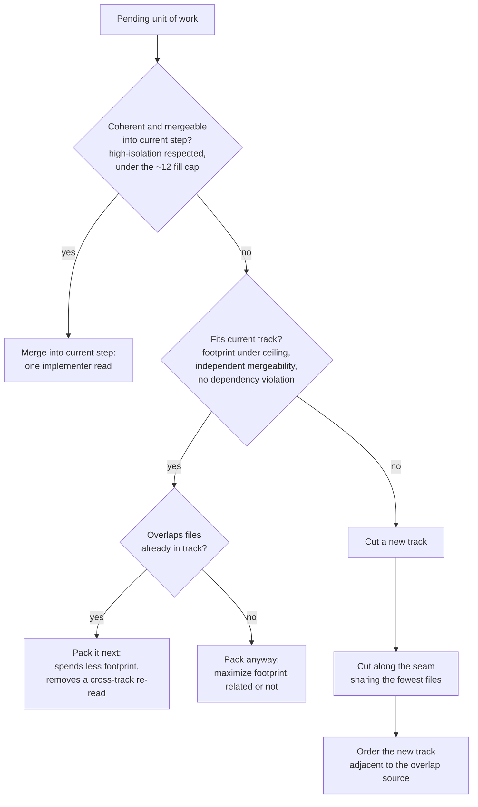

<!-- workflow-sha: a91143fb60e3040a0c2a8072e82158ab5665a3f9 -->
# Token-economy-oriented planning — Design

## Overview

YouTrackDB's workflow already plans for token cost in two places. Step fill in `track-review.md` merges small steps to remove cold-read re-pays; track sizing in `planning.md` maximizes each track to cut the number of track cycles, each of which pays a fixed review-and-implementation tax. Both cut the same thing: the number of fresh agent contexts the plan spawns. Neither looks at which source files the work touches.

That count is the dominant cost. Each step runs a fresh implementer sub-agent, and each track runs a review fan-out, the Phase A technical, risk, and adversarial reviewers and then the Phase C dimensional reviewers. A sub-agent's cost is its resident context times its turn count, so an implementer or a reviewer is far more expensive than re-reading any one file. Merging work, related or not, removes whole agents, which is why the existing rules merge up to their caps.

This design adds one smaller lever: source-file overlap. The sizing cap counts distinct files, so a change that touches files a step or track already holds spends less of the budget than a disjoint change of the same size. Preferring overlapping work when packing fits more change under the same cap, which spawns still fewer agents, and it skips a later re-read of the same file in another agent's context. Co-location is the lever; adjacency, two units that cannot share an agent placed next to each other, removes no agent and is the marginal fallback. The directive reads co-locate first, fall back to adjacency only when a hard rule forbids sharing.

The change is advisory and small. It refines two prose rules without touching the sizing metric (the count of distinct files a track changes) or the ~12 / ~20-25 bounds: the track sizing rule (planner, Phase 1) and the step fill rule (decomposer, Phase A). For a backstop it adds one criterion the Phase 2 structural review applies by judgment, reusing the track files that review already reads, rather than any automated detector that computes file overlap. Because the sizing rule itself does not change, the §1.1 glossary, the §1.2 plan summary, and the sizing paraphrases in the other review prompts stay as they are.

The rest of this document covers Core Concepts (the vocabulary), Workflow (the placement decision as a flowchart), then four topic sections: the token model, track-level packing, step-level fill, and advisory enforcement.

## Core Concepts

This design introduces five ideas, each defined once here and used without re-definition below. Each pairs the idea with the token lever it extends or the baseline behavior it refines.

**Source-file overlap.** Two units of work overlap when they edit at least one file in common. Overlap is mechanical and measurable from the in-scope file lists already recorded in each track file's `## Interfaces and Dependencies`. It is not thematic relatedness: two features can be unrelated yet both edit `GlobalConfiguration.java`. → §"The token model".

**Cold-read re-pay.** The existing term from `track-review.md`. A fresh per-step implementer cold-reads its files, so a file touched by K separate sub-agent sessions is read K times. Overlap-awareness lowers K. → §"The token model".

**Co-location.** Placing overlapping changes in the same step, where one implementer reads the shared file once, or the same track, where one Phase A decomposition and one Phase C review cover it once. The strong lever. → §"Track-level packing and cut seams", §"Step-level overlap-aware fill".

**Adjacency.** Ordering two overlapping units that cannot share a step or track next to each other in the sequence. The weak fallback: it trims rebase distance and keeps the orchestrator's working knowledge fresh, but each sub-agent still cold-reads independently, so it saves far less than co-location. → §"Track-level packing and cut seams".

**Cut seam.** When a track must be split, the boundary between the two resulting tracks. Among valid seams, the one sharing the fewest files keeps overlapping work on one side. → §"Track-level packing and cut seams".

## Workflow

The planner (tracks, Phase 1) and the decomposer (steps, Phase A) both answer the same question for each pending unit of work: where does it go? The flowchart shows the decision. The hard constraints are guards that must pass before overlap is consulted at all; overlap is only the tie-breaker among the placements those guards leave open.

Co-location sits at the top. The first two decisions try to keep an overlapping unit in the current step or the current track, where the shared file is read once. Only when both fail does the procedure cut, and even then it picks the seam that keeps the most overlap on one side and orders the result adjacent. The footprint cap, the high-isolation rule, mergeability, and dependency order are all upstream guards: a unit never merges or packs past them to chase overlap.

## The token model

**TL;DR.** The dominant cost is the number of fresh agent contexts, not the bytes of any file: a step is an implementer invocation, a track is a review fan-out, and each carries 70K to 160K of resident context over its turns. Merging work, related or not, removes whole agents, the lever the existing maximize and fill rules already pull. Overlap is the second, smaller lever: because the sizing cap counts distinct files, overlapping work fits more change per capped agent and skips a later re-read of the same file. Adjacency between units that cannot share an agent removes none, so it is marginal. The principle holds at both granularities and sits below the hard constraints.

The cost of a plan is dominated by how many fresh agent contexts it spawns. A step runs one implementer sub-agent; a track runs a review fan-out, three Phase A reviewers plus the Phase C dimensional reviewers, on top of its implementers. A sub-agent's billed cost is its resident context times its turn count, and roughly 85 percent of that is cache traffic, re-reading the context each turn rather than generating tokens. Measured across recent Claude transcripts, the median sub-agent runs about $2.50, a review sub-agent $2.60 to $3.40, and a step implementer about $6.80, each carrying 70K to 160K of resident context. Collapsing two steps into one removes an entire implementer invocation; folding two tracks into one removes an entire review fan-out. Neither saving depends on the two pieces of work sharing a file, which is why the existing fill and maximize rules merge related and unrelated work alike.

Overlap is the second lever, and it serves the same goal from a different angle. The sizing cap counts distinct files: the ~12 step fill target and the ~20-25 track ceiling. A change that touches files the step or track already holds adds only its new files to that count, so overlap-aware packing fits more change under the same cap. That spawns still fewer agents, the dominant saving, and grows each agent's resident context less per unit of change. The smaller, direct effect is the one the file-overlap framing names: a file edited in K separate agents is cold-read K times, and co-locating those edits lowers K. A shared file is a few thousand tokens, well under the cost of an avoided agent, so this direct effect is a bonus on top of the packing gain, not the headline.

Adjacency is the marginal fallback. Two units that cannot share an agent, because coherence, isolation, the cap, or a dependency forbids it, each still spawn their own agent whether they sit next to each other or far apart, and Phase C reads the whole track diff regardless of step order. What adjacency buys is a shorter rebase distance in the stacked-diff series and an orchestrator whose just-built knowledge of a shared file is fresh when it briefs the next agent. Real, but small next to removing an agent. The rule text leads with merge-and-pack so a future author does not promote adjacency into a saving it cannot deliver.

### Edge cases / Gotchas

- Step adjacency that is not a merge buys almost nothing: it removes no implementer invocation, the dominant per-step cost, and Phase C reads the cumulative diff order-independently. The step rule states this rather than implying a saving.
- Overlap can pull toward a smaller track if taken too far; it must not override "maximize footprint". Overlap orders which units to pack and where to cut, never how many to pack, so it never shrinks a track below what the cap allows.
- A `high`-isolation step never absorbs a neighboring overlapping change; isolation wins over the tie-breaker.

### References

**D1. Overlap-awareness as a second, co-locate-first lever on top of agent-count minimization.** Alternatives: do nothing, which leaves the existing maximize and fill rules with no signal to prefer overlapping work at the cap; the naive "make overlapping changes adjacent", which misstates the mechanism, since adjacency removes no agent and the dominant saving is removing agents; make overlap a sizing or relatedness criterion, which contradicts the standing rule that thematic coherence is not a sizing criterion. Rationale: the dominant token cost is the number of fresh agent contexts, which the existing rules already minimize by merging related and unrelated work alike; overlap-aware packing fits more change per capped agent (fewer agents) and skips a later re-read, so it refines that lever rather than competing with it. Risk: authors may read "adjacent" as the goal or over-weight the direct cold-read saving, so the rule text leads with merge-and-pack and names the per-agent cost as the dominant lever.

**D2. Apply at both track and step granularity.** Alternatives: track-only (leaves the step fill rule's which-unit choice overlap-blind); step-only (leaves the track packing and cut-seam choices overlap-blind). Rationale: a step spawns an implementer and a track spawns a review fan-out, so reducing either count is the dominant saving and overlap-aware packing helps at both; the step-level gain is distinct from the existing maximize-fill because it orders which mergeable unit to pull in first. Risk: two authoritative edit sites instead of one, accepted because the principle is identical and is stated once in this section.

**S1.** The overlap tie-breaker is subordinate to step coherence (mandatory at `high`), high-isolation, inter-track mergeability, dependency ordering, and the footprint bounds; it never moves a step or track out of bounds or past a dependency.

**S2.** The file-footprint sizing metric and the ~12 / ~20-25 bounds are unchanged; overlap-awareness alters only packing order and cut-seam choice.

## Track-level packing and cut seams

**TL;DR.** At Phase 1 the planner already maximizes each track's footprint. Overlap adds two refinements. When choosing which autonomous unit to pack next, prefer one that overlaps files already in the track. When the footprint ceiling or a dependency forces a cut, cut along the seam that shares the fewest files and order the resulting tracks adjacent. Both are tie-breakers; the maximize rule and the bounds stay as they are.

Packing order is the first refinement. Among candidate units that fit under the ceiling, the one overlapping the track's current file set wins the tie, because it spends less footprint, so more change fits before the ceiling forces a new track and its review fan-out, and it avoids a cross-track re-read of the shared file later. When no candidate overlaps, the planner packs anyway and maximizes the footprint, related or not, exactly as the standing rule says, since removing a track's review fan-out is the dominant saving whether or not the packed units share files.

The cut seam is the second refinement. "Prefer a dependency boundary as the cut" stays the primary cut rule. Among otherwise-equal cuts, the planner prefers the seam that shares the fewest files, so a file does not straddle two tracks and get cold-read by both their Phase A and Phase C passes. When overlap genuinely cannot be co-located, because the ceiling, a dependency, or independent mergeability forbids it, the planner orders the two tracks next to each other so rebase distance is minimal and the orchestrator's cross-track impact read of the shared file is freshest.

Splitting overlapping files across non-adjacent tracks with no stated reason is the placement the planner should justify in the track file, the same way an out-of-bounds footprint already carries a written justification.

### Edge cases / Gotchas

- A dependency boundary and the least-shared seam can disagree; the dependency boundary wins, per the subordination rule introduced under the token model.
- Maximizing can still pack unrelated, non-overlapping units; overlap does not forbid that, it only orders the choice when overlapping work is available.
- "Least-shared seam" reads the in-scope file lists; when a track file's `## Interfaces and Dependencies` is still an estimate at Phase 1, the planner estimates the seam too, which is consistent with scope indicators being estimates rather than contracts.

### References

**D3. Track cut-seam and adjacency ordering.** Alternatives: leave cut-point choice to the dependency boundary and the ceiling alone, which is overlap-blind; always co-locate overlapping files even at the cost of breaking mergeability, which violates the subordination rule. Rationale: when a cut is forced, the least-shared seam keeps overlap on one side at no cost to the metric, and adjacent ordering recovers the residual rebase and freshness benefit. Risk: the seam choice needs the in-scope file lists, which are estimates at Phase 1; the planner estimates, matching how scope indicators already work.

**S1.** The overlap tie-breaker is subordinate to the hard constraints, stated in full under §"The token model".

## Step-level overlap-aware fill

**TL;DR.** The fill rule already merges `low`/`medium` work toward ~12 edited files, which collapses implementer invocations whether or not the merged work shares files. Overlap sharpens the choice of what to merge: prefer a unit that touches files already in the step, since it spends less of the ~12 budget, so more change fits before a new step (a new implementer) is needed, and the shared file is read once. Pure adjacency between two steps that cannot merge removes no implementer, so it buys almost nothing at the step level, and the rule says so plainly.

The existing fill direction decomposes toward the largest change that stays within ~12 edited files, merging available `low`/`medium` work, related or not. Overlap adds an ordering to that merge: when several `low`/`medium` units are available, prefer the one overlapping the step's current file set. A step holding `Foo` and `Bar` that pulls in a unit touching `Foo` and `Baz` adds only `Baz` to the footprint and removes a future re-read of `Foo`; pulling in a unit touching `Qux` and `Quux` adds two files and removes nothing.

The rule keeps the adjacency caveat explicit. Two distinct steps each spawn their own implementer, and Phase C reads the whole track diff regardless of step order, so ordering two unmergeable steps next to each other removes no implementer invocation, the dominant per-step cost. The one step-level adjacency gain is the orchestrator briefing the next implementer from its just-built knowledge of the shared file, which is modest. Stating this stops the rule from drifting into a claim that step adjacency is a token win on par with merging.

### Edge cases / Gotchas

- The under-fill `— size:` clause is unaffected: overlap changes which unit fills a step, not the closed two-reason set that justifies an under-filled `low`/`medium` step.
- When the only overlapping unit is `high`-tagged, it cannot merge into a `low`/`medium` step; high-isolation wins, and the `low`/`medium` step fills from non-overlapping work or stays under-target with its existing justification.

### References

**D4. Step overlap-aware fill, with step adjacency named as not a merge.** Alternatives: extend the fill rule to prefer overlap silently, which loses the caveat and lets a future author reintroduce "make steps adjacent" as a false token claim; leave fill overlap-blind, the status quo. Rationale: preferring an overlapping unit fits more change under the ~12 cap, so a step absorbs work that would otherwise spill into another implementer invocation, the dominant per-step cost; the cold-read saving on the shared file is a smaller bonus. Stating the adjacency caveat keeps the rule from drifting to a claim it cannot support. Risk: none material; the change is one ordering clause plus one caveat on an existing rule.

**S1.** Subordinate to coherence and high-isolation, stated in full under §"The token model".

## Advisory enforcement

**TL;DR.** The directive is planner and decomposer guidance, enforced by reviewer judgment rather than an automated check. The Phase 2 structural review already reads every pending track file, `## Interfaces and Dependencies` among the sections, so it can see cross-track overlap without new plumbing. The design adds one criterion bullet under that review's track-sizing checks: an overlap-split across non-adjacent tracks with no written reason is a `design-decision` finding, the same class and severity as the existing undocumented out-of-bounds track. No automated cross-track file intersection is computed.

The structural review is a reviewer-judgment pass, not a purely mechanical one. Its `**Scope:**`-line count and coverage-cardinality checks are plan-file-only, but its sizing and consistency checks read each pending track file's four sections, and the split-into-phases sizing check already opens `## Interfaces and Dependencies`. So the reviewer who would flag an oversized track already holds the in-scope file lists that reveal overlap; adding an overlap-split criterion costs one bullet and no new read.

What the design declines is a detector that computes the file intersection across tracks mechanically. That is heavier than a tie-breaker warrants, and the existing argumentation gate already supplies the right shape: a documented placement passes autonomously, an undocumented one escalates to the user. The overlap-split criterion reuses that shape. The S1 subordination to the hard constraints is likewise authoring discipline at Phase 1 and Phase A decomposition, not a Phase 2 gate; the structural review sees the plan and track files, not step-level isolation choices, so high-isolation and coherence are enforced where they are decided.

### Edge cases / Gotchas

- The criterion fires on a reviewer reading the track files and applying judgment, the same way the existing out-of-bounds-track justification check does; nothing computes overlap automatically.
- The three sizing-rule paraphrases (the technical, risk, and adversarial review prompts) and the two summary sites (the §1.1 glossary, the §1.2 plan summary) stay byte-identical, because the sizing rule they paraphrase does not change; only the structural-review prompt gains the new criterion.

### References

**D5. Advisory, enforced by one reviewer-judgment criterion in the structural review, not an automated detector.** Alternatives: a mechanical detector that computes cross-track file intersection (heavier than a tie-breaker warrants, and redundant with the reviewer already reading the track lists); pure advisory with no review criterion at all (the existing argumentation gate fires only on an out-of-bounds footprint count, never on overlap, so without a new criterion the directive has no backstop). Rationale: the structural review already reads every track file's `## Interfaces and Dependencies`, so one criterion bullet gives a real backstop at the cost of one bullet and no computation, matching the class of the existing out-of-bounds-track criterion. Risk: enforcement rests on reviewer judgment reading the track lists, accepted because the directive is a tie-breaker, not a correctness rule.

**S2.** The sizing metric and bounds are unchanged, stated in full under §"The token model"; the structural-review prompt gains one new criterion bullet, which adds a check rather than editing the unchanged rule, so the sizing-rule paraphrases stay edit-free.
