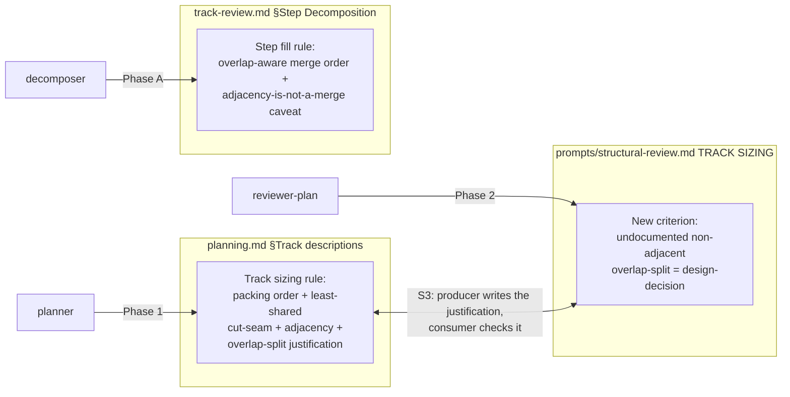

<!-- workflow-sha: a91143fb60e3040a0c2a8072e82158ab5665a3f9 -->
# Token-economy-oriented planning

## Design Document
[design.md](design.md)

## High-level plan

### Goals

Add source-file overlap as a second, smaller token lever on top of the
workflow's existing agent-count minimization. The track sizing rule
(`planning.md`, Phase 1) and the step fill rule (`track-review.md`, Phase A)
already merge work, related or not, to remove whole agents up to their
footprint caps. This change refines both with one advisory, co-locate-first
tie-breaker: when packing fits under the cap, prefer the unit that overlaps
files the step or track already holds, because it spends less of the
file-count budget and skips a later cold-read of the shared file. When a cut
is forced, cut along the seam sharing the fewest files and order the resulting
tracks adjacent. Adjacency between units that cannot share an agent is the
marginal fallback. A single reviewer-judgment criterion in the Phase 2
structural review backstops the planner-facing half.

### Constraints

- This plan is workflow-modifying: it edits .claude/workflow/**, .claude/skills/**, or .claude/agents/**.
- Prose-only: three rule refinements across `.claude/workflow/`, no code and no
  automated overlap detector.
- The change is advisory. It alters packing order and cut-seam choice; it never
  moves a step or track out of bounds or past a dependency, and it is
  subordinate to step coherence, high-isolation, inter-track mergeability,
  dependency ordering, and the footprint bounds (S1).
- The file-footprint sizing metric and the ~12 / ~20-25 bounds are unchanged
  (S2). Every synchronized copy of the sizing rule stays byte-identical,
  because the rule they paraphrase does not change. The authoritative list of
  those copies is the SYNC comment in `prompts/structural-review.md`: the §1.1
  glossary and §1.2 plan summary, the create-plan Step 4 rule, and the Track
  terminology paraphrase in all five review prompts (technical, risk,
  adversarial, consistency, and structural-review.md's own bullet).
- The planner-facing justification requirement and the reviewer-facing
  structural-review criterion land in the same change; neither half ships
  without the other (S3).

### Architecture Notes

#### Component Map

Three prose rules in three files, each owned by a different role, plus the
producer/consumer pairing the change introduces between the planner rule and
the reviewer criterion.

- **`planning.md` §Track descriptions** (planner, Phase 1) — the *Maximize
  first* and cut-seam text gain the packing-order preference, the least-shared
  seam rule, adjacent ordering, and the requirement that an unavoidable
  overlap-split carries a written justification. Refines D1/D2/D3, carries the
  S3 producer half.
- **`track-review.md` §Step Decomposition** (decomposer, Phase A) — the *Fill
  ordinary steps* bullet gains an overlap-aware merge ordering and a caveat
  that step adjacency without a merge removes no implementer. Refines D2/D4.
- **`prompts/structural-review.md` TRACK SIZING** (reviewer-plan, Phase 2) —
  one new criterion bullet alongside the existing out-of-bounds check; same
  `design-decision` class and severity. Implements D5, carries the S3 consumer
  half.

#### D1: Overlap-awareness as a second, co-locate-first lever

- **Alternatives considered**: do nothing (the maximize/fill rules get no
  signal to prefer overlapping work at the cap); the naive "make overlapping
  changes adjacent" (misstates the mechanism — adjacency removes no agent);
  make overlap a sizing or relatedness criterion (contradicts the standing
  rule that thematic coherence is not a sizing criterion).
- **Rationale**: the dominant token cost is the number of fresh agent contexts,
  which the existing rules already minimize by merging related and unrelated
  work alike. Overlap-aware packing fits more change per capped agent and skips
  a later re-read, so it refines that lever rather than competing with it.
- **Risks/Caveats**: authors may read "adjacent" as the goal or over-weight the
  cold-read saving; the rule text leads with merge-and-pack and names per-agent
  cost as the dominant lever.
- **Implemented in**: Track 1
- **Full design**: design.md §"The token model"

#### D2: Apply at both track and step granularity

- **Alternatives considered**: track-only (leaves the step fill rule's
  which-unit choice overlap-blind); step-only (leaves track packing and
  cut-seam choices overlap-blind).
- **Rationale**: a step spawns an implementer and a track spawns a review
  fan-out, so reducing either count is the dominant saving; the step-level gain
  is distinct from the existing maximize-fill because it orders which mergeable
  unit to pull in first.
- **Risks/Caveats**: two authoritative edit sites instead of one, accepted
  because the principle is identical and stated once in the design.
- **Implemented in**: Track 1
- **Full design**: design.md §"The token model"

#### D3: Track cut-seam and adjacency ordering

- **Alternatives considered**: leave cut-point choice to the dependency
  boundary and the ceiling alone (overlap-blind); always co-locate overlapping
  files even at the cost of breaking mergeability (violates S1).
- **Rationale**: when a cut is forced, the least-shared seam keeps overlap on
  one side at no cost to the metric, and adjacent ordering recovers the
  residual rebase and freshness benefit. "Prefer a dependency boundary as the
  cut" stays the primary cut rule.
- **Risks/Caveats**: the seam choice needs the in-scope file lists, which are
  estimates at Phase 1; the planner estimates, matching how scope indicators
  already work.
- **Implemented in**: Track 1
- **Full design**: design.md §"Track-level packing and cut seams"

#### D4: Step overlap-aware fill, with step adjacency named as not a merge

- **Alternatives considered**: extend the fill rule to prefer overlap silently
  (loses the caveat, lets a future author reintroduce "make steps adjacent" as
  a false token claim); leave fill overlap-blind (status quo).
- **Rationale**: preferring an overlapping unit fits more change under the ~12
  cap, so a step absorbs work that would otherwise spill into another
  implementer invocation; the shared-file cold-read saving is a smaller bonus.
  Stating the adjacency caveat keeps the rule from drifting.
- **Risks/Caveats**: none material; one ordering clause plus one caveat on an
  existing rule.
- **Implemented in**: Track 1
- **Full design**: design.md §"Step-level overlap-aware fill"

#### D5: Advisory, enforced by one reviewer-judgment criterion, not a detector

- **Alternatives considered**: a mechanical detector computing cross-track file
  intersection (heavier than a tie-breaker warrants, redundant with the
  reviewer already reading the track lists); pure advisory with no review
  criterion (the existing argumentation gate fires on out-of-bounds footprint
  count, never on overlap, so the directive would have no backstop).
- **Rationale**: the Phase 2 structural review already reads every pending
  track file's `## Interfaces and Dependencies`, so one criterion bullet gives
  a real backstop at the cost of one bullet and no computation, matching the
  class of the existing out-of-bounds-track criterion.
- **Risks/Caveats**: enforcement rests on reviewer judgment reading the track
  lists, accepted because the directive is a tie-breaker, not a correctness
  rule.
- **Implemented in**: Track 1
- **Full design**: design.md §"Advisory enforcement"

#### Invariants

- **S1 — Subordination.** The overlap tie-breaker is subordinate to step
  coherence (mandatory at `high`), high-isolation, inter-track mergeability,
  dependency ordering, and the footprint bounds. Testable: the edited rule text
  states the subordination explicitly and never instructs moving a step or
  track out of bounds or past a dependency to chase overlap.
- **S2 — Metric and bounds unchanged.** The file-footprint sizing metric and
  the ~12 / ~20-25 bounds do not move. Testable by diff: every synchronized
  copy of the sizing rule named in the `prompts/structural-review.md` SYNC
  comment stays byte-identical after this change — the §1.1 glossary, the §1.2
  plan-file Planning rule summary, the create-plan Step 4 rule, and the Track
  terminology paraphrase in all five review prompts (technical, risk,
  adversarial, consistency, and structural-review.md's own bullet).
  structural-review.md is edited only in its TRACK SIZING check region, so its
  paraphrase bullet stays byte-identical alongside the rest.
- **S3 — Producer/consumer co-ship.** The planner-facing justification
  requirement (`planning.md`) and the reviewer-facing criterion
  (`structural-review.md`) land in the same track. Testable: both files appear
  in this track's diff; neither edit merges without the other.

#### Integration Points

- The new structural-review criterion plugs into the **existing argumentation
  gate**: an undocumented non-adjacent overlap-split becomes a `design-decision`
  finding, the same class and severity as the existing undocumented
  out-of-bounds track. No new finding class, no new escalation path.
- The track-level cut-seam refinement extends the existing **"Prefer a
  dependency boundary as the cut"** rule rather than replacing it; the
  dependency boundary stays the primary cut and wins any disagreement with the
  least-shared seam.
- The step-level ordering clause attaches to the existing **"Fill ordinary
  steps toward ~12 edited files"** bullet; the closed two-reason under-fill
  `— size:` set is untouched.

#### Non-Goals

- No automated cross-track file-intersection detector (D5 rejects it).
- No change to the file-footprint sizing metric or the ~12 / ~20-25 bounds (S2).
- Overlap is not a sizing or thematic-relatedness criterion; thematic coherence
  remains not a sizing criterion (D1 rejects that framing).
- Step adjacency is not promoted to a token saving on par with merging; the
  rule text states it buys almost nothing (D4).

## Checklist
- [ ] Track 1: Overlap-aware packing as an advisory tie-breaker
  > Refine three workflow prose rules so packing prefers source-file overlap as
  > a co-locate-first tie-breaker. The planner track-sizing rule gains a
  > packing-order preference, a least-shared cut-seam rule with adjacent
  > ordering, and a justification requirement for an unavoidable overlap-split;
  > the decomposer step-fill rule gains an overlap-aware merge ordering plus a
  > caveat that step adjacency without a merge removes no implementer; the
  > Phase 2 structural review gains one criterion that flags an undocumented
  > non-adjacent overlap-split as a `design-decision` finding. This is the
  > whole change, so no neighboring track exists to fold into.
  > **Scope:** ~3 files covering the planner track-sizing rule (`planning.md`), the decomposer step-fill rule (`track-review.md`), and the structural-review overlap-split criterion (`prompts/structural-review.md`)

## Plan Review
- [x] Plan review (consistency + structural) — passed at iteration 2 (consistency: full pass + gate; structural: full pass + gate)

**Auto-fixed (mechanical)**: S1 — `design.md` §"Advisory enforcement" line-129 still names the pre-CR1 narrow byte-identical set; this is the design.md half of CR1. Recorded and deferred to the Phase 4 `design-final.md` reconciliation because `design.md` is frozen after Phase 1. The plan and track halves already carry the full SYNC set, so no plan/track edit was owed.

**Escalated (design decisions)**: CR1 — invariant S2 enumerated the byte-identical sizing-rule paraphrase set as only the technical/risk/adversarial trio, while the authoritative SYNC comment in `prompts/structural-review.md` names a larger set (and omitted `structural-review.md`, the one edited file that itself carries the paraphrase). User chose the full-SYNC-set rendering. Broadened S2 in `implementation-plan.md` (§Constraints, Invariant S2) and `track-1.md` (§Plan of Work invariants, §Validation and Acceptance, §Interfaces and Dependencies out-of-scope set) to name `conventions.md` §1.1 + §1.2, the create-plan Step 4 rule, and the Track terminology paraphrase in all five review prompts, with the note that `structural-review.md` is edited only in its TRACK SIZING check region. The `design.md` mirror defers to Phase 4 (frozen).

## Final Artifacts
- [ ] Phase 4: Final artifacts (`design-final.md`, `adr.md`)
