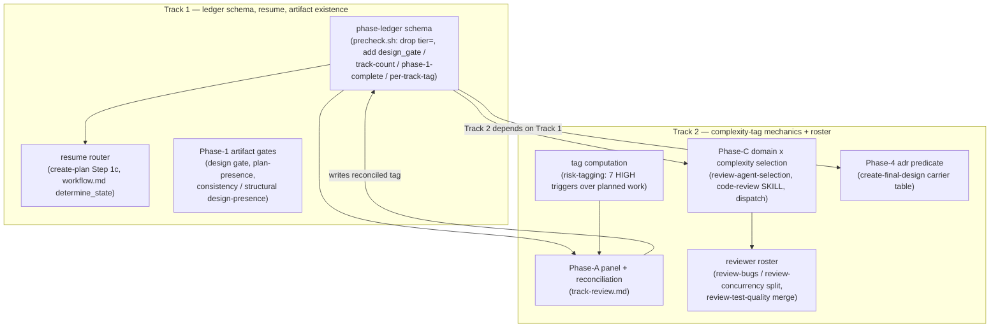

<!-- workflow-sha: a1311db00ca6d233d6c5883e0e29c5a09f4b4280 -->
# Per-track complexity tag

## Design Document
[design.md](design.md)

## Component Map
<!-- Thin cross-track Component Map: the slice of the workflow machinery this
     change touches, for cross-track impact assessment. Per-track detail,
     Decision Records, invariants, and constraints live in the track files. -->

- **phase-ledger schema** (Track 1) — the append-only ledger gains
  `design_gate`, a plan-presence / track-count signal, a Phase-1-complete
  marker, and a per-track reconciled-tag home, and loses `tier=`. Every
  downstream consumer reads one of these fields, so the schema lands first.
- **resume router** (Track 1) — Step 1c and `determine_state` route a resumed
  session off the new ledger fields instead of `tier=`; the Phase-1-complete
  marker is what separates the new `design + single-track` steady state from a
  mid-authoring crash.
- **Phase-1 artifact gates** (Track 1) — the design gate decides `design.md`
  existence at the Phase 0→1 boundary; plan presence is decided at the end of
  Step 4b from track count; the consistency and structural reviews — and the
  `implementation-review.md` Phase-2 pass selector — read `design_gate` instead
  of the tier.
- **tag computation** (Track 2) — the per-track complexity tag is the seven
  `risk-tagging` HIGH triggers run over each track's planned work; the planner
  predicts it at Phase 1.
- **Phase-A panel + reconciliation** (Track 2) — complexity sets how many of
  the strategic trio run; reconciliation closes the prediction-vs-`max(step
  tags)` gap and writes the reconciled tag to the ledger at the A→C boundary.
- **Phase-C selection + rigor** (Track 2) — domain alone selects the
  dimensional reviewer set; complexity moves only the rigor dial; the floor and
  the domain-matched set are never suppressed.
- **reviewer roster** (Track 2) — `review-bugs-concurrency` splits into
  `review-bugs` + `review-concurrency` by cognitive mode;
  `review-test-behavior` + `review-test-completeness` merge into
  `review-test-quality`; the `review-iteration.md` finding-prefix owner table is
  updated to match.
- **Phase-4 adr predicate** (Track 2) — the `create-final-design` carrier table
  re-derives from the axes: `design-final` iff a design exists; `adr` iff a
  track reconciled to medium or higher.

## Checklist
- [x] Track 1: Ledger schema, resume routing, and Phase-1 artifact existence
  > Unbundle the persistence and routing substrate: replace the ledger's
  > `tier=` field with the four fields the three axes need, route resume off
  > them, and decide `design.md` / plan existence from the design gate and the
  > track count. This is the foundation every tag consumer reads.
  >
  > **Track episode:** Replaced the ledger `tier=` with four complexity-axis
  > fields (`design_gate`/`tracks`/`phase1_complete`/per-track `reconciled_tag`),
  > re-pointed the resume routers and Phase-1 artifact gates off them, and froze
  > the flag→key map + Phase-4 carrier predicates Track 2 consumes — see
  > `plan/track-1.md` `## Episodes` § Track completion. (4 steps, 0 failed)
  >
  > **Track file:** `plan/track-1.md`
  >
  > **Strategy refresh:** CONTINUE — Track 1 froze the ledger flag→key map and
  > the Phase-4 carrier predicates Track 2 consumes; the four live tier-readers
  > the `tier=` removal stranded (`inline-replanning.md`, `track-review.md`,
  > `create-final-design.md`, `design-review.md`) all sit in Track 2's scope and
  > promote with it at Phase 4. No downstream impact on Track 2's plan.

- [ ] Track 2: Complexity-tag mechanics, reviewer selection, and roster
  > Compute the per-track complexity tag from planned work, reconcile it to
  > `max(step tags)` at Phase A, drive Phase-A panel breadth and Phase-C rigor
  > from it, split the bugs/concurrency reviewer and merge the two test
  > reviewers, and re-derive the Phase-4 `adr.md` predicate from the reconciled
  > tag.
  > **Scope:** ~20 files covering `risk-tagging.md`, `track-review.md`,
  > `review-agent-selection.md`, `code-review/SKILL.md`, `step-implementation.md`,
  > `track-code-review.md`, `fix-ci-failure/SKILL.md`, `finding-synthesis-recipe.md`,
  > `code-review-protocol.md`, `conventions-execution.md`, `inline-replanning.md`,
  > `review-iteration.md` (the finding-prefix owner table), the six reviewer agent
  > files, and the `create-final-design` / `design-review` prompts.
  > **Depends on:** Track 1
