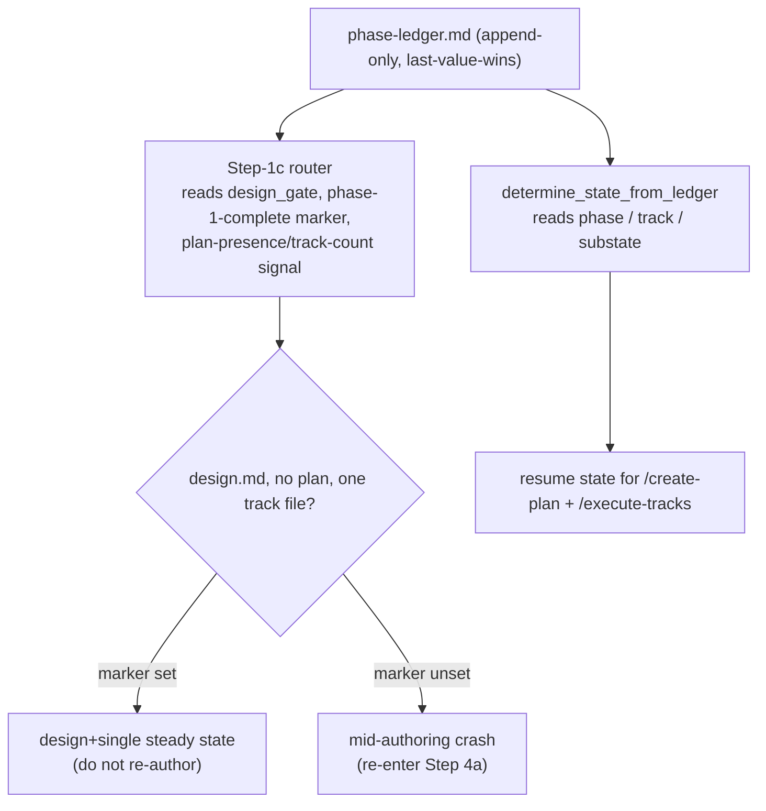

<!-- workflow-sha: a1311db00ca6d233d6c5883e0e29c5a09f4b4280 -->
# Track 1: Ledger schema, resume routing, and Phase-1 artifact existence

## Purpose / Big Picture
After this track lands, the phase ledger carries the unbundled state the
removed `tier=` field used to conflate, and a resumed `/create-plan` session
routes off those fields instead of the tier.

<!-- Reserved for Move 2 — ADDED/MODIFIED/REMOVED triad. Empty until Move 2 lands. -->

Unbundle the persistence and routing substrate. The ledger's `tier=` field
splits into four fields: `design_gate` (does the change need a `design.md`), a
plan-presence / track-count signal (does `implementation-plan.md` exist), a
Phase-1-complete marker (did Phase 1 finish, or did authoring crash), and a
per-track reconciled-tag home (each track's `max(step tags)` — the largest
step-complexity tag across its steps, which Track 2 computes). The resume
router reads these fields; the Phase-1 artifact gates decide `design.md` and
plan existence from the design gate and the track count. This track is the
foundation every complexity-tag consumer in Track 2 reads.

## Progress
- [ ] Review + decomposition
- [ ] Step implementation
- [ ] Track-level code review
- [ ] Track completion

## Surprises & Discoveries
<!-- Continuous-log. Promoted by the orchestrator from per-step "What was
discovered" when the finding affects future steps or other tracks. Empty
at Phase 1. -->

## Decision Log
<!-- The track-canonical live decision carrier (D7). Seeded from the frozen
design.md D-records. AUTHOR: fill the four bullets of each record below,
grounding in the design seed and the live precheck/script code; keep the DR
titles, ownership, and `**Full design**` pointers as given. -->

#### D1: Plan presence is decided at the end of Step 4b, within planning
- **Alternatives considered**: (a) an up-front tier-style pick at Step 4 part 1
  — impossible, because track count is unknown before the planner decomposes;
  (b) deferring the decision into Phase A — unnecessary, because track count is
  already settled at the end of Phase 1, and Phase A is per-track *step*
  decomposition that runs in a later, fresh session, so deferring would split
  plan authoring across a `/clear` boundary.
- **Rationale**: the "`implementation-plan.md` exists iff more than one track"
  rule can only fire once the planner has authored the track files — the end of
  Step 4b. Track count is known there, the planner owns track decomposition, and
  keeping the decision in one writer's hands avoids a mid-execution
  materialization. This is a shift *within* Phase 1, not a deferral to a later
  phase.
- **Risks/Caveats**: this decision separates the design-need question from the
  track-count question, so a new shape becomes expressible: a design with one
  track and no plan. The tier model could not represent that shape. On disk it
  collides with a mid-authoring crash (both look like a `design.md`, no plan,
  one track file), and D10's Phase-1-complete marker is what tells the two
  apart. The track-count signal recorded here is the field the resume router
  reads.
- **Implemented in**: this track (step references added during execution)
- **Full design**: design.md §"The three axes" (Part 1)

#### D10: Phase-ledger schema delta and resume disambiguation
- **Alternatives considered**: persist the per-track tag in the **track file**
  (a marker a Phase-C / Phase-4 reader greps) — workable, but a fresh session
  would parse N track files for a value the ledger already centralizes for
  resume. The ledger is the established resume-state home (it already carried
  `tier`), so the four new fields join it rather than scattering across track
  files.
- **Rationale**: four downstream needs each require a concrete persistence
  address, and all four are most naturally served by the ledger, so they are
  co-resolved here as one schema delta. The Phase-C tag governance reads a
  per-track-tag site from fresh sessions. The `adr.md` predicate reads the same
  per-track-tag site from fresh sessions. The new design+single shape creates a
  resume collision that file presence alone cannot resolve. And dropping the
  `tier=minimal` resume trigger removes the only plan-less resume signal a
  branch had, which must be replaced. The schema delta that serves all four:
  drop `tier=` and add four fields —
  - `design_gate=` — the change-level design decision, seeded at Phase 1.
  - a plan-presence / track-count signal — decided at the end of Step 4b.
  - a Phase-1-complete marker — so Step 1c tells the new design+single steady
    state apart from a mid-authoring crash.
  - a per-track reconciled-tag home — written at the A→C boundary, read by
    Phase C for rigor and by Phase 4 for the `adr.md` predicate.
- **Risks/Caveats**: an absent `design_gate` on an old ledger (a branch
  predating this scheme) reads as the malformed / pre-scheme case the resume
  router already handles for an absent `tier`. That existing handling does not
  default a phase or guess: it routes the session to the normal both-files
  resume and surfaces the missing-field inconsistency to the user, who decides.
  The new `design_gate` field inherits that same posture — an old ledger with
  no `design_gate` is reported, not silently re-derived. A torn append still leaves the prior ledger tail
  intact (temp-file + rename), so a crash mid-write loses the new field's append
  but never corrupts the existing fields the resume read depends on. The
  per-track reconciled tag is read **track-scoped** (the same
  last-value-wins-for-this-track read the existing `substate` key uses) so a
  completed prior track's tag cannot leak into a later track's selection.
- **Implemented in**: this track (step references added during execution)
- **Full design**: design.md §"Phase-ledger schema delta" (Data model), §"Resume routing" (Part 5)

#### D8a: Phase-1 artifact existence derives from the design gate and the track count
- **Alternatives considered**: the two artifact tables design.md D8 rejects for
  the durable-ADR boundary — (a) a two-axis (design × track-count) table and (b)
  an `adr ⟺ multi-track` rule. Both key the artifact off track count rather than
  off whether the change actually needed a design, so they hand an ADR to a
  trivial multi-track change and deny one to a complex single-track change. That
  rejection does not apply to this DR, because this DR owns only the `design.md`
  / plan half of D8: `design.md` presence maps directly onto the design gate and
  plan presence maps directly onto the track count, with no track-count proxy
  for design substance involved. The proxy problem belongs to the adr predicate
  (Track 2's D8b), not here.
- **Rationale**: `design.md` (and its Phase-4 `design-final.md`) exists iff the
  design gate is yes — the change-level decision seeded at the Phase 0→1
  boundary; `implementation-plan.md` exists iff track count > 1, because a
  cross-track summary is vacuous for one track. Tying each artifact to the axis
  that justifies it removes the tier's conflation: the design-need question and
  the how-many-tracks question are independent, and the plan-presence decision
  is read off the track files once they exist (D1) rather than picked up front.
- **Risks/Caveats**: this unbundling makes the design+single cell representable
  (`design.md` → `design-final.md`, no plan) — a shape the tier model could not
  express. Its on-disk signature collides with a mid-authoring crash; the
  collision is resolved by the resume router (Part 5 / D10's Phase-1-complete
  marker), which this track also delivers. The consistency and structural review
  prompts that gate on design presence must read `design_gate`, not the removed
  tier.
- **Implemented in**: this track (step references added during execution)
- **Full design**: design.md §"Artifact derivation" (Part 4)
<!-- Note: the Phase-4 adr-predicate half of design D8 (adr ⟺ ∃ track ≥ medium)
is owned by Track 2, which reads the per-track reconciled-tag field this track
defines in the ledger schema. -->

## Outcomes & Retrospective
<!-- Continuous-log. Review iteration outcomes and the track-completion
summary at Phase C. -->

## Context and Orientation

At track start the workflow models change complexity as one whole-change enum,
the **tier** (`full` / `lite` / `minimal`), which the planner picks once at the
Phase 0→1 boundary and which the machinery reads everywhere a process decision
depends on how big the change is. That one value answers three independent
questions at once — does the change need a `design.md`, does it span more than
one track, and how hard is the work — and this track unbundles the first two of
those three (Track 2 owns the third). Four terms recur below: the **design
gate** is the change-level yes/no for whether a `design.md` exists; the **track
count** is how many track files the planner authored; the **Phase-1-complete
marker** is a flag recording that Phase 1 finished cleanly; and the
**reconciled tag** is each track's `max(step tags)` complexity value (Track 2
computes it — this track only reserves its per-track home in the ledger schema).

The persistence home is the **phase ledger**
(`<plan_dir>/_workflow/phase-ledger.md`), an append-only event log the resume
state machine reads. Its grammar is fixed in `workflow-startup-precheck.sh`:
each line is `[<ISO>] [ctx=<level>]` followed by the `key=value` fields the
append was given, with the current key set
`{ phase, track, tier, substate, categories, s17, paused }`. Read semantics are
**last-value-wins per key** across the whole file — a reader scans every line
and keeps the most recent value for each key, so a mid-flight change is recorded
by appending a new line, never by rewriting an old one. The append is
**validated** with a loud-reject posture: a newline in any field, a space in a
bare-token field, or a double quote in the one quoted field (`categories`) is
rejected with a stderr diagnostic and exit 3, because each would split or
truncate the line and silently corrupt last-value-wins resolution. The append
is **atomic via temp-file-plus-rename**: the new contents are written to a
sibling temp file then `mv`'d over the ledger, so a crash mid-write leaves
either the prior ledger or the temp file, never a torn ledger. The
`reject_bad_ledger_value` helper, the `append_ledger` line builder, and the
`ledger_tail_value` / `ledger_tail_value_for_track` readers are the only code
that writes or reads the ledger; the file header documents the grammar as the
contract other tracks consume.

Two readers route off `tier=` today. `determine_state` (via
`determine_state_from_ledger`) reads the ledger's `phase` and `track`, and on a
`minimal` branch defaults the active track to 1 because that tier has no plan;
this is the only resume signal a plan-less branch has. The **Step-1c resume
router** in `create-plan/SKILL.md` parses the ledger's `tier=` field once
(`LEDGER_TIER`), then routes a resumed `/create-plan` session by what exists on
disk plus that tier: `minimal` resumes off the ledger + the `plan/track-1.md`
glob, `lite`/`full` resume off `implementation-plan.md` presence, and a
`design.md` with no plan is a `full`-tier mid-authoring crash. Removing `tier=`
means these reads must move to the new fields. Note the live ledger header and
`determine_state` carry comment references to the *prior* `no-track-for-minimal`
branch's D-records (also numbered D1/D3/D10); those are unrelated to this
branch's decisions and are part of what the re-keying cleans up.

The Phase-1 artifact decisions live in `create-plan/SKILL.md` Step 4 (the
two-gate tier classifier at the Phase 0→1 boundary, where Gate 1 reuses
`risk-tagging.md` §"Gate 1 reuse") and in the per-tier Step 4a/4b transition.
The consistency and structural review prompts gate the presence of design
artifacts on the tier today. `conventions.md`, `planning.md`, `research.md`,
`plan-slim-rendering.md`, and `design-document-rules.md` carry tier glossary,
classification, and rendering prose that names the tier directly.

Concrete deliverables of this track:

- the new ledger key set (drop `tier=`; add `design_gate`, a
  plan-presence/track-count signal, a Phase-1-complete marker, and the per-track
  reconciled-tag home) with its append-time validation and a track-scoped read
  for the per-track tag;
- the re-pointed `determine_state` and Step-1c resume router;
- the design-gate classification at Phase 0→1 and the plan-presence decision at
  the end of Step 4b in `create-plan`;
- the design-presence re-keying in the consistency and structural review
  prompts;
- the tier→three-axes prose re-keying across the conventions / planning /
  research / plan-slim-rendering / design-document-rules docs.

The planner also gains an instruction to predict each track's complexity tag at
Phase 1 (Track 2 defines the computation; this track wires the prediction
request into `planning.md`).

## Plan of Work

The edits land in dependency order: the schema delta first, then its readers,
then the artifact gates and prose re-keying. The schema delta is the foundation
every later edit (and all of Track 2) reads, so it lands before any consumer.

**(1) Precheck ledger schema delta.** In `workflow-startup-precheck.sh`, drop
the `tier=` key from the `--append-ledger` accumulators, the validation block,
the line builder, and the file-header grammar, and add four fields:

- `design_gate` — a bare `yes`/`no` token.
- the plan-presence / track-count signal — the exact rendering (`tracks=N` or
  `plan=yes/no`) is this step's choice; the design fixes only that the field
  exists and what it disambiguates.
- the Phase-1-complete marker — a single complete flag.
- the per-track reconciled tag — a bare `low`/`medium`/`high`, written per
  track.

The per-field mechanics: each new bare field gets a `reject_bad_ledger_value`
call in `append_ledger` and one builder line that appends it only when set
(the `[ -n "$LEDGER_X" ] && line="$line X=..."` pattern the existing fields
use). The reconciled tag is read with the existing track-scoped
`ledger_tail_value_for_track` so a prior track's value cannot leak. The
`design_gate` field is emitted in the pre-`categories` block (it is
reader-consumed and bare). This ordering matters because the precheck reads
the ledger by scanning bare `key=value` tokens: a bare field must precede the
quoted `categories` field so the quoted value's embedded spaces do not end the
bare-token scan early. Update both precheck test files
(`test_workflow_startup_precheck.py` and the `_stub.py` variant) to cover the
new fields' append + round-trip, the loud-reject on a malformed value, the
last-value-wins read, the track-scoped read with no cross-track leak, and the
torn-append-leaves-prior-tail behavior.

**(2) Resume readers.** Re-point `determine_state_from_ledger` and the Step-1c
router onto the new fields. The Step-1c router replaces its `LEDGER_TIER` parse
with reads of `design_gate`, the Phase-1-complete marker, and the plan-presence
/ track-count signal, and routes every resume case by those three (Part 5's
routing table). The load-bearing case is the new collision: the on-disk file set (a `design.md`,
no plan, one track file) is identical in two cases — the design+single-track
steady state and a mid-authoring crash — so file presence alone cannot tell them
apart. The **Phase-1-complete marker** is the disambiguator (set ⇒ steady state,
do not re-author; unset ⇒ re-enter Step 4a authoring). The existing committed-and-clean `design.md` check still applies
*within* the crash arm; the marker check runs first to separate "Phase 1 is
done" from "Phase 1 is not done". The branch structure (collapse the old
single-track resume branch and the new design+single branch into one
`design_gate`-keyed branch, or keep them separate) is a rendering choice this
step makes; both satisfy the D10 contract that the three fields disambiguate
every case. `determine_state`'s `minimal`-default-track-to-1 logic re-keys onto
the plan-presence / track-count signal instead of the removed tier.

**(3) Phase-1 artifact gates.** In `create-plan/SKILL.md`, the Step-4 part-1
classifier becomes a **design-gate classifier** (Gate 1, change-level, reused
unchanged in logic from `risk-tagging.md` §"Gate 1 reuse") writing
`design_gate=yes/no` rather than a tier; the ledger-seed call drops `--tier`.
The plan-presence decision moves to the **end of Step 4b**, computed from the
track count (> 1 ⇒ `implementation-plan.md` exists) once the track files are
authored (D1). The consistency-review and structural-review prompts re-key their
design-presence gate to read `design_gate` instead of the tier, and the
structural review's per-tier artifact checks re-key onto the axes.

**(4) Prose re-keying.** Re-key `conventions.md` (the ledger schema / glossary:
drop the `tier` enum, add the four fields; and the per-axis artifact set),
`planning.md` (the Phase 0→1 classification re-keyed to the design gate plus
track-count→plan, and the new instruction that the planner predicts each track's
complexity tag at Phase 1 referencing the `risk-tagging` HIGH triggers),
`research.md` (the Phase 0→1 transition / classification references re-keyed to
the design gate), `plan-slim-rendering.md` (plan-presence rendering for the
single-track no-plan case), and `design-document-rules.md` (the design-gate
references for when a `design.md` exists).

Invariants to preserve throughout: last-value-wins-per-key read semantics, the
loud-reject append grammar, the atomic temp-file+rename append, and the
never-a-dead-end resume property (every artifact combination routes to a defined
path). A per-step sequencing summary will be appended here once Phase A writes
the `## Concrete Steps` roster.

## Concrete Steps
<!-- Phase A placeholder — decomposition writes a thin numbered roster here. -->

## Episodes
<!-- Continuous-log. Phase B sub-step 7 appends one block per completed step. -->

## Validation and Acceptance

Track-level behavioral acceptance — what must hold once every step lands:

- **Schema round-trip.** A `--append-ledger` call carrying `design_gate`, the
  plan-presence / track-count signal, the Phase-1-complete marker, and a
  per-track reconciled tag writes them, and a last-value-wins read returns each
  field's most-recent value. The `tier=` key no longer appears in the grammar,
  the accumulators, or the builder.
- **Loud-reject preserved.** A malformed value in any new bare field (a newline
  or a space) exits 3 with a stderr diagnostic, exactly as the existing fields
  do; no malformed value is silently written.
- **Track-scoped read, no leak.** The per-track reconciled tag is read
  track-scoped, so a completed prior track's tag cannot resolve as a later
  track's value when the two appear on different ledger lines.
- **Resume routes every combination.** `determine_state` / Step 1c route every
  on-disk artifact combination (design.md ± plan ± track files, with or without
  the marker) to a defined resume path — never a dead end.
- **The collision is resolved.** A `design.md` present with no plan and one
  track file routes to the design+single-track steady state when the
  Phase-1-complete marker is **set** and to the mid-authoring-crash recovery
  (re-enter Step 4a) when it is **unset**; the two are told apart by the marker
  alone, since their on-disk signatures are identical.
- **Torn-append safety.** A simulated crash mid-append leaves the prior ledger
  tail intact, so the resume read resolves the prior state rather than a
  corrupted one.
- **Artifact derivation.** `design.md` exists iff `design_gate=yes`;
  `implementation-plan.md` exists iff the track count exceeds one — verified by
  the create-plan Step 4 / Step 4b derivation behavior.

<!-- Reserved for Move 3 — EARS or Gherkin acceptance lines used verbatim as
test method names. Empty until Move 3 lands. -->

## Idempotence and Recovery
<!-- Phase A placeholder — names per-step idempotence and recovery paths once
steps are decomposed. -->

## Artifacts and Notes
<!-- Continuous-log (rare). Often empty. -->

## Interfaces and Dependencies

**In scope (this track edits these files):**
- `.claude/scripts/workflow-startup-precheck.sh` — `--append-ledger` key set
  (drop `tier=`; add `design_gate`, plan-presence/track-count, Phase-1-complete
  marker, per-track reconciled tag), append-time validation, track-scoped read
  for the per-track tag, and `determine_state` resume routing.
- `.claude/scripts/tests/test_workflow_startup_precheck.py` — schema,
  validation, and resume-routing tests for the new fields.
- `.claude/scripts/tests/test_workflow_startup_precheck_stub.py` — stub-path
  tests for the new fields.
- `.claude/skills/create-plan/SKILL.md` — Step-4 design-gate classification
  (was the tier classifier), Step-4b plan-presence decision (track count > 1),
  Step-1c resume router, and the ledger-seed call (drop `--tier`).
- `.claude/workflow/workflow.md` — `determine_state`, single-track resume, and
  the startup-protocol ledger reads.
- `.claude/workflow/conventions.md` — the ledger schema / glossary (drop the
  `tier` enum, add the four fields) and the per-axis artifact set.
- `.claude/workflow/planning.md` — the Phase-0→1 tier classification re-keyed
  to the design gate plus track-count→plan; the planner predicts each track's
  complexity tag at Phase 1 (referencing the existing `risk-tagging` triggers).
- `.claude/workflow/research.md` — the Phase 0→1 transition / classification
  references re-keyed to the design gate.
- `.claude/workflow/plan-slim-rendering.md` — plan-presence rendering for the
  single-track no-plan case.
- `.claude/workflow/design-document-rules.md` — design-gate references (when a
  `design.md` exists).
- `.claude/workflow/prompts/consistency-review.md` — the design-presence gate
  reads `design_gate` instead of the tier.
- `.claude/workflow/prompts/structural-review.md` — the design-presence gate
  and the per-tier artifact checks re-keyed to the axes.

**Out of scope (Track 2 owns these):** `risk-tagging.md` (tag computation
mechanism), `track-review.md` (Phase-A panel + reconciliation),
`review-agent-selection.md` / `code-review/SKILL.md` / `step-implementation.md`
/ `track-code-review.md` / `fix-ci-failure/SKILL.md` (domain×complexity
selection + roster), the six reviewer agent files, `finding-synthesis-recipe.md`,
`code-review-protocol.md`, `conventions-execution.md`, `inline-replanning.md`,
and `prompts/create-final-design.md` / `prompts/design-review.md` (the Phase-4
adr predicate).

**Inter-track dependencies:** none upstream (this track is the foundation).
Track 2 depends on this track — it reads the `design_gate` and per-track
reconciled-tag fields this track adds to the ledger schema, and writes the
reconciled tag through the schema this track defines.

**§1.7 staging (mandatory).** This plan is workflow-modifying: every
`.claude/**` edit in this track stages under
`_workflow/staged-workflow/.claude/` (mirroring `workflow/`, `skills/`,
`agents/`, `scripts/`); the live workflow stays at develop state until the
Phase 4 promotion. The executable `.claude/scripts/**` edits are why this
branch cannot take the §1.7(k) prose-only opt-out. The planning artifacts in
`_workflow/` (this track file, the plan) are not staged.

**Key signatures in scope (live, in `workflow-startup-precheck.sh`):**

- `--append-ledger` flag surface — today
  `[--ctx <level>] [--phase <token>] [--track <n>] [--tier <token>]
  [--categories <text>] [--s17 <token>] [--paused <event>] [--substate <slug>]`.
  This track drops `--tier` and adds flags for `design_gate`, the plan-presence
  / track-count signal, the Phase-1-complete marker, and the per-track
  reconciled tag.
- `reject_bad_ledger_value <field-name> <value> <bare|quoted>` — the
  append-time validator; each new bare field gets a `bare` call.
- `append_ledger` — composes the line from the `LEDGER_*` accumulators and
  publishes it atomically (temp-file + rename, `RETURN` trap reaps the temp).
- `ledger_tail_value <key>` → sets `LEDGER_VALUE` to the last value of `<key>`
  across the whole file (the global last-value-wins read).
- `ledger_tail_value_for_track <key> <track>` → sets `LEDGER_VALUE` to the last
  value of `<key>` on a line whose `track=` equals `<track>` (the track-scoped
  read the per-track reconciled tag uses).
- `determine_state_from_ledger` → sets `STATE_JSON` (`{phase, substate}`) from
  the ledger; returns 1 when no ledger exists so the caller falls back to the
  plan-checkbox walk.

The resume-read flow has three interacting components — the ledger, the
precheck reader, and the Step-1c router — so the read path earns a diagram:

## Invariants & Constraints
- The ledger append validates each new field with the existing loud-reject
  grammar (a newline, a space in a bare-token field, or a double quote in a
  quoted field exits 3) — verified by a precheck test.
- Last-value-wins-per-key read semantics hold for the new keys — verified by a
  precheck test.
- The per-track reconciled tag is read track-scoped, so a completed prior
  track's tag cannot leak into a later track's selection — verified by a
  precheck test.
- A torn append leaves the prior ledger tail intact (temp-file + rename), so a
  crash mid-write never corrupts the fields the resume read depends on —
  verified by a precheck test.
- Step 1c / `determine_state` routes every artifact combination to a defined
  resume path (never a dead end), and the Phase-1-complete marker separates the
  `design + single-track` steady state from a mid-authoring crash — verified by
  a resume-routing test.
- `design.md` exists iff `design_gate=yes`; `implementation-plan.md` exists iff
  track count > 1 — verified by the create-plan derivation behavior.
