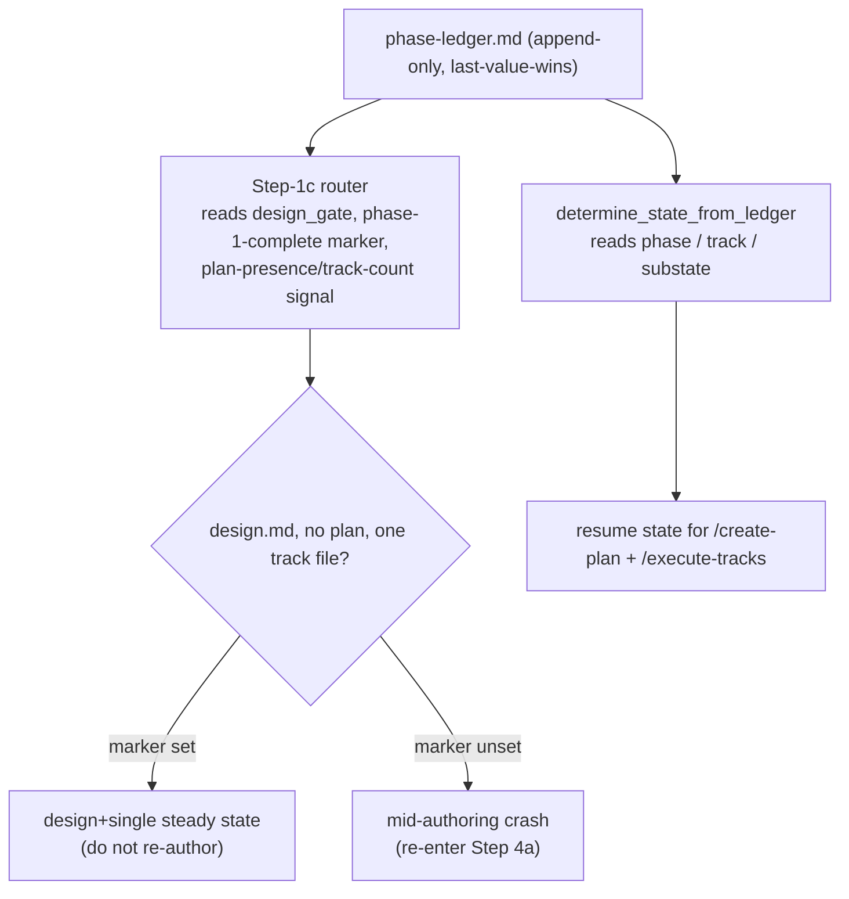

<!-- workflow-sha: a1311db00ca6d233d6c5883e0e29c5a09f4b4280 -->
# Track 1: Ledger schema, resume routing, and Phase-1 artifact existence

## Purpose / Big Picture
After this track lands, the phase ledger carries the unbundled state the
removed `tier=` field used to conflate, and a resumed `/create-plan` session
routes off those fields instead of the tier.

<!-- Reserved for Move 2 — ADDED/MODIFIED/REMOVED triad. Empty until Move 2 lands. -->

Unbundle the persistence and routing substrate. The ledger's `tier=` field
splits into four fields: `design_gate` (does the change need a `design.md`), a
plan-presence / track-count signal (does `implementation-plan.md` exist), a
Phase-1-complete marker (did Phase 1 finish, or did authoring crash), and a
per-track reconciled-tag home (each track's `max(step tags)` — the largest
step-complexity tag across its steps, which Track 2 computes). The resume
router reads these fields; the Phase-1 artifact gates decide `design.md` and
plan existence from the design gate and the track count. This track is the
foundation every complexity-tag consumer in Track 2 reads.

## Progress
- [x] Review + decomposition
- [ ] Step implementation
- [ ] Track-level code review
- [ ] Track completion
- [x] 2026-06-29T08:25Z [ctx=info] Review + decomposition complete
- [x] 2026-06-29T09:13Z [ctx=safe] Step 1 complete (commit 55a7e3ec4b)
- [x] 2026-06-29T09:29Z [ctx=safe] Step 2 complete (commit bdec6c1922)
- [x] 2026-06-29T09:50Z [ctx=safe] Step 3 complete (commit f763417b11)

## Surprises & Discoveries
<!-- Continuous-log. Promoted by the orchestrator from per-step "What was
discovered" when the finding affects future steps or other tracks. Empty
at Phase 1. -->
- 2026-06-29T09:13Z Step 1 froze the ledger schema Track 2 consumes: flags
  `--design-gate` / `--tracks` / `--phase1-complete` / `--reconciled-tag` map to
  keys `design_gate` / `tracks` / `phase1_complete` / `reconciled_tag`, and the
  per-track `reconciled_tag` is track-scoped (emitted on its `track=` line).
  Track 2 reads `design_gate` + `reconciled_tag` and writes `reconciled_tag`,
  and must re-key every remaining live `tier` reader/writer in its scope before
  the Phase-4 promotion (the forward obligation in §Interfaces and
  Dependencies). See Episodes §Step 1.
- 2026-06-29T09:50Z Step 3 froze the Phase-4 carrier contract Track 2's
  `create-final-design.md` / `design-review.md` re-key must match:
  `design-final.md` iff `design_gate=yes` and `adr.md` iff ∃ track reconciled ≥
  medium are **independent** predicates, and the final-artifacts commit fires
  when EITHER carrier exists. Handle the design+all-low edge case
  (`design-final.md` present with no `adr.md`), which the old `tier`-coupled
  table could not express. See Episodes §Step 3.

## Decision Log
<!-- The track-canonical live decision carrier (D7). Seeded from the frozen
design.md D-records. AUTHOR: fill the four bullets of each record below,
grounding in the design seed and the live precheck/script code; keep the DR
titles, ownership, and `**Full design**` pointers as given. -->

#### D1: Plan presence is decided at the end of Step 4b, within planning
- **Alternatives considered**: (a) an up-front tier-style pick at Step 4 part 1
  — impossible, because track count is unknown before the planner decomposes;
  (b) deferring the decision into Phase A — unnecessary, because track count is
  already settled at the end of Phase 1, and Phase A is per-track *step*
  decomposition that runs in a later, fresh session, so deferring would split
  plan authoring across a `/clear` boundary.
- **Rationale**: the "`implementation-plan.md` exists iff more than one track"
  rule can only fire once the planner has authored the track files — the end of
  Step 4b. Track count is known there, the planner owns track decomposition, and
  keeping the decision in one writer's hands avoids a mid-execution
  materialization. This is a shift *within* Phase 1, not a deferral to a later
  phase.
- **Risks/Caveats**: this decision separates the design-need question from the
  track-count question, so a new shape becomes expressible: a design with one
  track and no plan. The tier model could not represent that shape. On disk it
  collides with a mid-authoring crash (both look like a `design.md`, no plan,
  one track file), and D10's Phase-1-complete marker is what tells the two
  apart. The track-count signal recorded here is the field the resume router
  reads.
- **Implemented in**: this track (step references added during execution)
- **Full design**: design.md §"The three axes" (Part 1)

#### D10: Phase-ledger schema delta and resume disambiguation
- **Alternatives considered**: persist the per-track tag in the **track file**
  (a marker a Phase-C / Phase-4 reader greps) — workable, but a fresh session
  would parse N track files for a value the ledger already centralizes for
  resume. The ledger is the established resume-state home (it already carried
  `tier`), so the four new fields join it rather than scattering across track
  files.
- **Rationale**: four downstream needs each require a concrete persistence
  address, and all four are most naturally served by the ledger, so they are
  co-resolved here as one schema delta — drop `tier=` and add the four fields the
  design Data model table specifies (`design_gate`, the plan-presence /
  track-count signal, the Phase-1-complete marker, and the per-track
  reconciled-tag home). Centralizing them in the ledger keeps the Phase-C tag
  governance, the `adr.md` predicate, the resume-collision disambiguation, and
  the replacement for the dropped `tier=minimal` plan-less resume signal all
  reading one file.
- **Risks/Caveats**: the load-bearing risk is the new design+single shape's
  resume collision, which file presence alone cannot resolve — the
  Phase-1-complete marker resolves it (D1, Part 5). An old ledger with no
  `design_gate` inherits the existing absent-`tier` posture: routed to the normal
  both-files resume with the missing field surfaced to the user, never silently
  re-derived. Torn-append safety and the track-scoped per-track-tag read are
  stated as invariants in `## Invariants & Constraints`.
- **Implemented in**: this track (step references added during execution)
- **Full design**: design.md §"Phase-ledger schema delta" (Data model), §"Resume routing" (Part 5)

#### D8a: Phase-1 artifact existence derives from the design gate and the track count
- **Alternatives considered**: the two artifact tables design.md D8 rejects for
  the durable-ADR boundary (a design × track-count table and an `adr ⟺
  multi-track` rule); see design §"Artifact derivation". Both key the artifact
  off track count rather than off whether the change needed a design — but that
  proxy problem belongs to the adr predicate (Track 2's D8b), not this DR, which
  owns only the `design.md` / plan half: design presence maps onto the design
  gate, plan presence onto the track count, no proxy involved.
- **Rationale**: tie each artifact to the axis that justifies it — `design.md`
  (and Phase-4 `design-final.md`) exists iff `design_gate=yes`;
  `implementation-plan.md` exists iff track count > 1 (a cross-track summary is
  vacuous for one track). This unbundles the tier's design-need / how-many-tracks
  conflation; the plan-presence decision is read off the track files once they
  exist (D1), not picked up front.
- **Risks/Caveats**: the unbundling makes the design+single cell representable
  (`design.md` → `design-final.md`, no plan), whose on-disk signature collides
  with a mid-authoring crash; the resume router resolves it via D10's
  Phase-1-complete marker. The consistency / structural review prompts that gate
  on design presence read `design_gate`, not the removed tier.
- **Implemented in**: this track (step references added during execution)
- **Full design**: design.md §"Artifact derivation" (Part 4)
<!-- Note: design D8's Phase-4 adr predicate (adr ⟺ ∃ track ≥ medium) is Track
2's decision (D8b), computed from the per-track reconciled-tag field this track
defines in the ledger schema. Track 1 *authors* that predicate into the carrier
tables in the Track-1-owned files it edits — the `conventions.md` per-axis
artifact set and `workflow.md` §"Final Artifacts (Phase 4)" — since it owns those
files and lands first; Track 2 owns the predicate's computation and the
create-final-design.md / design-review.md re-keys. -->

## Outcomes & Retrospective
<!-- Continuous-log. Review iteration outcomes and the track-completion
summary at Phase C. -->

- [x] Technical: PASS at iteration 2 (5 findings, 5 accepted). T1/T2 (should-fix)
  + T3/T4/T5 (suggestion); all applied as track-file scope refinements (no design
  change). Reviewed against the live develop-state machinery (Markdown/shell/Python,
  no Java/PSI).
- [x] Risk: PASS at iteration 2 (3 findings, 3 accepted). R1/R2 (should-fix) +
  R3 (suggestion); all applied. 0 blockers.
- [x] Adversarial: PASS at iteration 2 (4 findings, 4 accepted). A1/A2 (should-fix)
  + A3/A4 (suggestion); narrowed track-realization pass (cross-track-episode
  challenge dropped — Track 1 is first). Spawned with the D14 `full`→Fable 5 model
  pin, which degraded to the session default (opus) because Fable 5 is unavailable
  in this environment — a documented D14 degradation, not a decision change.
- Review themes that converged across reviewers: (a) the `design_gate`-before-
  `categories` emit-order rationale was mechanically wrong (T4/R2/A2) — corrected
  to first-match-and-stop + same-named-decoy; (b) the `tier=` removal's reverse
  coupling onto Track-2-owned live readers was undocumented (T1/R1/A3) — added a
  forward-obligation note; (c) the consistency/structural re-key understated its
  scope (A1) and the `workflow.md` §Final Artifacts re-key would self-contradict if
  table-only (T2) — both widened.

## Context and Orientation

At track start the workflow models change complexity as one whole-change enum,
the **tier** (`full` / `lite` / `minimal`), which the planner picks once at the
Phase 0→1 boundary and which the machinery reads everywhere a process decision
depends on how big the change is. That one value answers three independent
questions at once — does the change need a `design.md`, does it span more than
one track, and how hard is the work — and this track unbundles the first two of
those three (Track 2 owns the third). Four terms recur below: the **design
gate** is the change-level yes/no for whether a `design.md` exists; the **track
count** is how many track files the planner authored; the **Phase-1-complete
marker** is a flag recording that Phase 1 finished cleanly; and the
**reconciled tag** is each track's `max(step tags)` complexity value (Track 2
computes it — this track only reserves its per-track home in the ledger schema).

The persistence home is the **phase ledger**
(`<plan_dir>/_workflow/phase-ledger.md`), an append-only event log the resume
state machine reads. Its grammar is fixed in `workflow-startup-precheck.sh`:
each line is `[<ISO>] [ctx=<level>]` followed by the `key=value` fields the
append was given, with the current key set
`{ phase, track, tier, substate, categories, s17, paused }`. Read semantics are
**last-value-wins per key** across the whole file — a reader scans every line
and keeps the most recent value for each key, so a mid-flight change is recorded
by appending a new line, never by rewriting an old one. The append is
**validated** with a loud-reject posture: a newline in any field, a space in a
bare-token field, or a double quote in the one quoted field (`categories`) is
rejected with a stderr diagnostic and exit 3, because each would split or
truncate the line and silently corrupt last-value-wins resolution. The append
is **atomic via temp-file-plus-rename**: the new contents are written to a
sibling temp file then `mv`'d over the ledger, so a crash mid-write leaves
either the prior ledger or the temp file, never a torn ledger. The
`reject_bad_ledger_value` helper, the `append_ledger` line builder, and the
`ledger_tail_value` / `ledger_tail_value_for_track` readers are the only code
that writes or reads the ledger; the file header documents the grammar as the
contract other tracks consume.

Two readers route off `tier=` today. `determine_state` (via
`determine_state_from_ledger`) reads the ledger's `phase` and `track`, and on a
`minimal` branch defaults the active track to 1 because that tier has no plan;
this is the only resume signal a plan-less branch has. The **Step-1c resume
router** in `create-plan/SKILL.md` parses the ledger's `tier=` field once
(`LEDGER_TIER`), then routes a resumed `/create-plan` session by what exists on
disk plus that tier: `minimal` resumes off the ledger + the `plan/track-1.md`
glob, `lite`/`full` resume off `implementation-plan.md` presence, and a
`design.md` with no plan is a `full`-tier mid-authoring crash. Removing `tier=`
means these reads must move to the new fields. Note the live ledger header and
`determine_state` carry comment references to the *prior* `no-track-for-minimal`
branch's D-records (also numbered D1/D3/D10); those are unrelated to this
branch's decisions and are part of what the re-keying cleans up.

The Phase-1 artifact decisions live in `create-plan/SKILL.md` Step 4 (the
two-gate tier classifier at the Phase 0→1 boundary, where Gate 1 reuses
`risk-tagging.md` §"Gate 1 reuse") and in the per-tier Step 4a/4b transition.
The consistency and structural review prompts gate the presence of design
artifacts on the tier today. `conventions.md`, `planning.md`, `research.md`,
`plan-slim-rendering.md`, and `design-document-rules.md` carry tier glossary,
classification, and rendering prose that names the tier directly.

Concrete deliverables of this track:

- the new ledger key set (drop `tier=`; add `design_gate`, a
  plan-presence/track-count signal, a Phase-1-complete marker, and the per-track
  reconciled-tag home) with its append-time validation and a track-scoped read
  for the per-track tag;
- the re-pointed `determine_state` and Step-1c resume router;
- the design-gate classification at Phase 0→1 and the plan-presence decision at
  the end of Step 4b in `create-plan`;
- the design-presence re-keying in the consistency and structural review
  prompts;
- the tier→three-axes prose re-keying across the conventions / planning /
  research / plan-slim-rendering / design-document-rules docs.

The planner also gains an instruction to predict each track's complexity tag at
Phase 1 (Track 2 defines the computation; this track wires the prediction
request into `planning.md`).

## Plan of Work

The edits land in dependency order: the schema delta first, then its readers,
then the artifact gates and prose re-keying. The schema delta is the foundation
every later edit (and all of Track 2) reads, so it lands before any consumer.

**(1) Precheck ledger schema delta.** In `workflow-startup-precheck.sh`, drop
the `tier=` key from the `--append-ledger` accumulators, the validation block,
the line builder, and the file-header grammar, and add four fields:

- `design_gate` — a bare `yes`/`no` token.
- the plan-presence / track-count signal — the exact rendering (`tracks=N` or
  `plan=yes/no`) is this step's choice; the design fixes only that the field
  exists and what it disambiguates.
- the Phase-1-complete marker — a single complete flag.
- the per-track reconciled tag — a bare `low`/`medium`/`high`, written per
  track.

The per-field mechanics: each new bare field gets a `reject_bad_ledger_value`
call in `append_ledger` and one builder line that appends it only when set
(the `[ -n "$LEDGER_X" ] && line="$line X=..."` pattern the existing fields
use). The reconciled tag is read with the existing track-scoped
`ledger_tail_value_for_track` so a prior track's value cannot leak. Every new
bare reader-consumed field (`design_gate`, the plan-presence / track-count
signal, the Phase-1-complete marker) is emitted in the pre-`categories` block.
This ordering is load-bearing for the reader, but not for the reason a
"scan stops at the first space" model would suggest: `ledger_tail_value` (and
its track-scoped variant) takes the **first** ` key=` token on a line and stops
— it runs no left-to-right scan that an embedded space could truncate, and the
quoted-value branch already reads a `categories="a,b c"` value through to its
closing quote regardless of field order. The real hazard the emit order guards
against is a **same-named decoy** `key=` substring sitting inside the quoted
`categories="…"` value: a reader-consumed key emitted *after* `categories` would
let that decoy win the first-match scan. So every bare reader-consumed field must
precede `categories`, exactly as the script's own emit-order comment states
(`workflow-startup-precheck.sh` `ledger_tail_value` / `ledger_tail_value_for_track`
header comments). Carry this corrected rationale into the file-header grammar
comment the step rewrites — do not restate the embedded-spaces framing.

Update both precheck test files (`test_workflow_startup_precheck.py` and the
`_stub.py` variant) to cover the new fields' append + round-trip, the
loud-reject on a malformed value, the last-value-wins read, the track-scoped
read with no cross-track leak, and the torn-append-leaves-prior-tail behavior.
Beyond that additive coverage, the existing `tier=minimal` ledger fixtures in
the stub file (and any main-file fixtures that seed `tier=`) must be
**migrated** to the new fields (`design_gate=no` + the single/no-plan
plan-presence signal) so the resume-routing tests exercise the live signal, not
a dead `tier=` token the reader no longer consumes. Add a first-match-wins test
asserting that a `design_gate` placed after a `categories` value carrying a
`design_gate=`-shaped decoy still reads the real bare token (the emit-order
invariant above).

**(2) Resume readers.** Re-point `determine_state_from_ledger` and the Step-1c
router onto the new fields. The Step-1c router replaces its `LEDGER_TIER` parse
with reads of `design_gate`, the Phase-1-complete marker, and the plan-presence
/ track-count signal, and routes every resume case by those three (Part 5's
routing table). The load-bearing case is the new collision: the on-disk file set (a `design.md`,
no plan, one track file) is identical in two cases — the design+single-track
steady state and a mid-authoring crash — so file presence alone cannot tell them
apart. The **Phase-1-complete marker** is the disambiguator (set ⇒ steady state,
do not re-author; unset ⇒ re-enter Step 4a authoring). The existing committed-and-clean `design.md` check still applies
*within* the crash arm; the marker check runs first to separate "Phase 1 is
done" from "Phase 1 is not done". The branch structure (collapse the old
single-track resume branch and the new design+single branch into one
`design_gate`-keyed branch, or keep them separate) is a rendering choice this
step makes; both satisfy the D10 contract that the three fields disambiguate
every case. `determine_state_from_ledger` reads only `phase` and `track` — it has **no
`tier` read** to re-key. Its `minimal`-default-track-to-1 behavior already keys
off an empty `track=` (`[ -n "$track" ] || track="1"`), which is tier-agnostic
and stays correct under the new schema. The work here is therefore to delete the
append-side `--tier` / `LEDGER_TIER` plumbing (arg case, validation, builder,
usage text) and remove the now-stale `tier`/`minimal` comments in the resume
functions, then confirm the empty-`track`→1 default still behaves — not to hunt
for a tier read that does not exist.

**(3) Phase-1 artifact gates.** In `create-plan/SKILL.md`, the Step-4 part-1
classifier becomes a **design-gate classifier** (Gate 1, change-level, reused
unchanged in logic from `risk-tagging.md` §"Gate 1 reuse") writing
`design_gate=yes/no` rather than a tier. Both live `--append-ledger --tier`
write sites drop `--tier`: the Step-4 seed call (≈`create-plan/SKILL.md:1239`)
and the Step-1c `minimal`-resume re-seed (≈`:250`, today `--phase 0 --tier
minimal`), the latter re-keyed to seed `design_gate=no` + the single/no-plan
plan-presence signal. A `--tier` invocation left behind after the flag drops
would hit the precheck's `*) Unknown argument` arm and `exit 2`.
The plan-presence decision moves to the **end of Step 4b**, computed from the
track count (> 1 ⇒ `implementation-plan.md` exists) once the track files are
authored (D1). The consistency-review and structural-review prompts re-key **every** tier read,
not just the design-presence gate. In `consistency-review.md` that is three
coupled sub-blocks: the design-presence guard (its `full`/`lite`/`minimal`
tier-named branches become `design_gate`-keyed), the **tier-presence check**
(`consistency-review.md` §"Tier-presence check", which emits a finding when no
`tier` resolves — after the field is removed that check would fire on every
plan, so it must read `design_gate` presence or be retired), and the degenerate
"tier unreadable" fallback. In `structural-review.md` the per-tier artifact
checks, the design-half skip guard, and the `full`-tier-only seed↔track fidelity
gate all re-key onto the axes (the `minimal` pass-skip itself is driven by the
`implementation-review.md` selector below, not by an in-prompt tier read). The
orchestrator-side Phase-2 pass selector in `implementation-review.md`
§"Tier-driven pass selection" re-keys the same way: its design-half guard reads
`design_gate` and its structural-pass skip reads the plan-presence / track-count
signal (no plan ⇒ skip structural), replacing the removed tier.

**(4) Prose re-keying.** Re-key `conventions.md` (the ledger schema / glossary:
drop the `tier` enum, add the four fields; and the per-axis artifact set, whose
`adr.md` row encodes Track 2's D8b predicate `adr ⟺ ∃ track ≥ medium`),
`planning.md` (the Phase 0→1 classification re-keyed to the design gate plus
track-count→plan, and the new instruction that the planner predicts each track's
complexity tag at Phase 1 referencing the `risk-tagging` HIGH triggers),
`research.md` (the Phase 0→1 transition / classification references re-keyed to
the design gate), `plan-slim-rendering.md` (plan-presence rendering for the
single-track no-plan case), and `design-document-rules.md` (the design-gate
references for when a `design.md` exists). The same artifact-derivation re-key applies to `workflow.md` §"Final Artifacts
(Phase 4)", authored here since Track 1 owns `workflow.md`. Re-key the **whole
section coherently**, not the table row alone: the per-tier durable-carrier
table becomes the axis-derived form (`design-final` iff a design exists; `adr`
iff a track reconciled ≥ medium), and the surrounding tier-keyed prose that would
otherwise contradict the re-keyed table re-keys onto the same axes — the "Gate 2
(multi-track) is the durable-ADR boundary" framing, the verdict-fold "in
`full`/`lite` … in `minimal`" lines, and the per-tier-and-modification-class
commit-shape list. The predicate's `adr ⟺ ∃ track ≥ medium` reads the
**reconciled** per-track tag, which Track 2 writes at the Phase-A→C boundary;
Track 1 authors only the predicate text, and the Phase-4 executor that actually
reads the tag (`prompts/create-final-design.md`) stays tier-keyed until Track 2
re-keys it. Both files' staged edits promote together in the single Phase-4
commit (§1.7 I6), so the staged workflow is internally consistent at promotion
even though Track 1 lands first.

Invariants to preserve throughout: last-value-wins-per-key read semantics, the
loud-reject append grammar, the atomic temp-file+rename append, and the
never-a-dead-end resume property (every artifact combination routes to a defined
path). Phase A decomposed this into four steps (see `## Concrete Steps`): Step 1
the executable schema + in-script reader + tests (high), Step 2 the create-plan
resume router + design-gate classifier + plan-presence decision (high), Step 3 the
schema/glossary + protocol/carrier docs (high), Step 4 the review prompts +
Phase-2 pass selector + remaining tier-prose + the planner instruction (medium).
Steps 2–4 depend on Step 1's schema.

## Concrete Steps
<!-- Phase A decomposition: 4 steps. Every `.claude/**` edit routes to the staged
subtree per §1.7 (this branch is workflow-modifying); the live workflow stays at
develop state until Phase-4 promotion, and the `_workflow/` planning artifacts are
not staged. Steps 2–4 each depend on Step 1's schema; they touch disjoint files and
are sequenced (not parallel) so the prose tracks the committed schema/classifier
wording. No production Java class is named in this track — every symbol (shell
function, ledger field/flag, prompt §-anchor, file path) was reference-verified by
grep + Read against the live develop-state files during Phase A review, so the
§Pre-write PSI rule resolves nothing here. -->

1. Ledger schema delta + in-script resume reader + precheck tests — in
   `workflow-startup-precheck.sh` drop the `tier=` key (arg case, `reject_bad_ledger_value`
   call, builder line, file-header grammar) and add the four fields (`design_gate`,
   the plan-presence/track-count signal, the Phase-1-complete marker, the per-track
   reconciled tag), each a `bare` field emitted in the pre-`categories` block per the
   first-match-wins / same-named-decoy invariant, with the reconciled tag read via
   `ledger_tail_value_for_track`; delete the `--tier`/`LEDGER_TIER` plumbing and the
   stale `tier`/`minimal` comments in `determine_state_from_ledger`, confirming its
   empty-`track`→1 default stays tier-agnostic; cover the new fields in
   `test_workflow_startup_precheck.py` and `_stub.py` (append+round-trip, loud-reject,
   last-value-wins, track-scoped no-leak, torn-append, the first-match-wins decoy
   test) and migrate the existing `tier=minimal` fixtures. — risk: high (workflow
   machinery: a script that runs automatically + the auto-resume state-machine schema)  [x]  commit: 55a7e3ec4b

2. create-plan resume router + design-gate classifier + plan-presence decision — in
   `create-plan/SKILL.md` replace the Step-1c `LEDGER_TIER` parse with reads of
   `design_gate`, the Phase-1-complete marker, and the plan-presence/track-count
   signal, routing every resume case including the design+single-vs-mid-authoring-crash
   collision (the marker disambiguates: set ⇒ steady state, unset ⇒ re-enter Step 4a);
   turn the Step-4 part-1 tier classifier into a design-gate classifier writing
   `design_gate=yes/no`; move the plan-presence decision to the end of Step 4b (track
   count > 1 ⇒ `implementation-plan.md` exists); drop `--tier` from both
   `--append-ledger` seed sites (the Step-4 seed and the Step-1c `minimal` re-seed). —
   risk: high (workflow machinery: the auto-resume control-flow protocol)  [x]  commit: bdec6c1922  *(depends on Step 1)*

3. Schema/glossary + protocol/carrier documentation re-key — in `conventions.md` drop
   the `tier` enum/glossary term and document the four new ledger fields, and re-key the
   per-axis artifact set (its `adr.md` row encoding Track 2's `adr ⟺ ∃ track ≥ medium`
   predicate, authored here since Track 1 owns the file); in `workflow.md` re-key the
   §Startup-Protocol resume references and the whole §"Final Artifacts (Phase 4)" section
   coherently onto the axes — the carrier table plus the surrounding tier-keyed prose
   (the "Gate 2 (multi-track) is the durable-ADR boundary" framing, the verdict-fold
   `full`/`lite`/`minimal` lines, and the per-tier-and-modification-class commit-shape
   list) — noting the Phase-4 executor `prompts/create-final-design.md` stays tier-keyed
   until Track 2 re-keys it (both promote together at Phase 4). — risk: high (workflow
   machinery: a closed glossary/schema edit + the auto-resume / Phase-4 protocol doc)  [x]  commit: f763417b11  *(depends on Step 1)*

4. Review-prompt + Phase-2 pass-selector re-keys, remaining tier-prose, and the planner
   complexity-tag instruction — re-key every tier read in `consistency-review.md` (the
   design-presence guard's tier-named branches, the tier-presence-check finding-emitter,
   and the degenerate "tier unreadable" fallback) and `structural-review.md` (per-tier
   artifact checks, design-half skip, the `full`-only seed↔track fidelity gate) onto
   `design_gate`/plan-presence; re-key the `implementation-review.md` §"Tier-driven pass
   selection" Phase-2 selector (design-half guard → `design_gate`, structural-pass skip →
   plan-presence/track-count); re-key the tier-naming prose in `planning.md` (plus the
   new instruction that the planner predicts each track's complexity tag at Phase 1 from
   the `risk-tagging` HIGH triggers), `research.md`, `plan-slim-rendering.md`, and
   `design-document-rules.md`. — risk: medium (workflow machinery, behavioral-but-bounded:
   review-agent specs + Phase-2 pass-selector dispatch + a new planner instruction) —
   size: ~7 files; no mergeable low/medium work fits (the rest of the track is high)  [ ]  *(depends on Step 1)*

## Episodes
<!-- Continuous-log. Phase B sub-step 7 appends one block per completed step. -->

### Step 1 — commit 55a7e3ec4b, 2026-06-29T09:13Z [ctx=safe]
**What was done:** Replaced the phase ledger's `tier=` field with four bare
complexity-axis fields in the staged `workflow-startup-precheck.sh`:
`design_gate` (yes/no), `tracks` (the track-count / plan-presence signal),
`phase1_complete` (the mid-authoring-crash disambiguator), and a per-track
`reconciled_tag` (low/medium/high) read track-scoped via
`ledger_tail_value_for_track`. Dropped the `--tier` flag, the `LEDGER_TIER`
accumulator, the `tier` validation call, and the `tier=` builder line. Added
the four flags with `bare` validation and builder lines emitted in the
pre-`categories` block (the first-match-wins / same-named-decoy invariant).
Scrubbed the stale `tier`/`minimal` comments in `determine_state_from_ledger`,
re-documenting the empty-`track`→1 default as tier-agnostic. Migrated the
`tier=` / `tier=minimal` fixtures in both test files and added nine tests
(round-trip, last-value-wins, track-scoped no-leak, two decoy variants,
space/newline reject, torn-append). Staged suites pass 124/124 and 5/5;
`bash -n` and `py_compile` are clean.

**What was discovered:** The new fields have no consumer yet —
`determine_state` reads only `phase`/`track`, and Track 2 wires the resume
router and the Phase-C / Phase-4 readers. The read-side tests therefore pin
the schema contract through a Python replica of the script's
`ledger_tail_value` / `ledger_tail_value_for_track` first-`key=`-token scan
rather than a non-existent consumer; this freezes the schema so Track 2 builds
against it. The decoy test is doubled — a hand-authored line plus an end-to-end
check against the script's own emit — to prove the emit order satisfies the
first-match invariant. The hook-safety step review passed at iteration 1 with
zero findings.

**What changed from the plan:** None. The plan left two renderings open; both
resolved within its stated latitude — `tracks=N` (carries strictly more than
`plan=yes/no`) and `phase1_complete=yes` (presence is the signal). These become
the schema Step 2's resume router and the create-plan seed sites must read and
write.

**Key files:**
- `…/_workflow/staged-workflow/.claude/scripts/workflow-startup-precheck.sh` (new — staged copy with the schema delta)
- `…/_workflow/staged-workflow/.claude/scripts/tests/test_workflow_startup_precheck.py` (new — staged copy, migrated fixtures + new-field coverage)
- `…/_workflow/staged-workflow/.claude/scripts/tests/test_workflow_startup_precheck_stub.py` (new — staged copy, migrated fixtures)

**Critical context:** Flag→key map the rest of the track depends on:
`--design-gate`→`design_gate`, `--tracks`→`tracks`,
`--phase1-complete`→`phase1_complete`, `--reconciled-tag`→`reconciled_tag`. The
reconciled tag is emitted on the same ledger line as its `track=` token (the
track-scoped read requirement).

### Step 2 — commit bdec6c1922, 2026-06-29T09:29Z [ctx=safe]
**What was done:** Re-keyed the create-plan resume router and the Phase-0→1
classifier off the four ledger fields Step 1 froze, in the staged
`create-plan/SKILL.md`. (1) Step 1c now reads `design_gate` / `tracks` /
`phase1_complete` (last-value-wins `sed` reads) instead of `LEDGER_TIER`, and
routes every resume case including the new design+single-track shape; the
Phase-1-complete marker disambiguates that shape from a mid-authoring crash
(set ⇒ steady state, no re-author; unset ⇒ crash, then the existing
committed-and-clean check routes Step 4b vs Step 4a). (2) Step 4 part 1 became
a design-gate classifier writing `design_gate=yes/no`; the multi-vs-single
answer is no longer decided up front. (3) A plan-presence decision was added at
the end of Step 4b: `implementation-plan.md` exists iff the authored track
count > 1. (4) Both `--append-ledger` seed sites dropped `--tier` — the Step-4
seed emits `--design-gate` / `--tracks` / `--phase1-complete yes`, the Step-1c
plan-less re-seed emits `--design-gate no --tracks 1`. Also re-keyed the
schema-removal-forced ledger-field references in the same file (the D14
model-pin, the "no tier line" prose, the key-set citation, the Step-4 part-3
auto-resume summary). The step-level prompt-design review surfaced one
suggestion (WP1: tie the Step-4b seed placeholders to their value sources),
fixed in `Review fix:` commit `bdec6c1922`; the dimension passed at iteration 2.

**What was discovered:** The Step-4 seed runs after the track files are
authored, so the track count is known and `phase1_complete=yes` can be set
there — this is what makes the marker a reliable steady-state-vs-crash
disambiguator: a clean Phase-1 completion always seeds the marker, a crash
before the seed never does. The broad `full`/`lite`/`minimal` tier vocabulary
elsewhere in the file (Step-4 part-3 design-first framing, Step-4a/4b headers,
thinned-plan template comments) is conceptual planning vocabulary that neither
reads nor writes the ledger, so it stays correct under the schema removal and
is the explicit re-keying scope of Steps 3 and 4 — left untouched per the step
boundaries.

**What changed from the plan:** None. The plan left the resume-branch shape
open; kept the design.md-present case as one branch that fans out on the marker
internally, and the plan-less / fresh-start branches separate, satisfying the
D10 contract that the three fields disambiguate every case. The seed-site field
names and the router reads use the Step-1 flag→key map exactly.

**Key files:**
- `…/_workflow/staged-workflow/.claude/skills/create-plan/SKILL.md` (new — staged copy with the resume-router re-key, design-gate classifier, plan-presence decision, and seed-site `--tier` drop)

### Step 3 — commit f763417b11, 2026-06-29T09:50Z [ctx=safe]
**What was done:** Copied `conventions.md` and `workflow.md` from develop state
into the staged subtree (copy-then-edit), then re-keyed both off the change tier
onto the three complexity axes. In `conventions.md`: replaced the
Change-tier / Tier-gates glossary rows with a Complexity-axes + Design-gate
pair, documented the four ledger fields (`design_gate`, `tracks`,
`phase1_complete`, per-track `reconciled_tag`) on the Phase-ledger glossary row
and the layout ASCII, and rewrote §"Per-tier artifact set" → §"Per-axis
artifact set" with an artifact-to-axis table whose `adr.md` row encodes the D8b
predicate (`adr ⟺ ∃ track ≥ medium`). In `workflow.md`: re-keyed the
Startup-Protocol auto-resume references off the track-count signal and rewrote
the whole §"Final Artifacts (Phase 4)" section — carrier table to independent
axis-derived predicates, the durable-ADR boundary from multi-track to
∃-track-≥-medium, the verdict-fold prose, and the per-modification-class
commit-shape list. `workflow-reindex.py --check` passes on both staged files
(re-verified by the orchestrator).

**What was discovered:** The original Final-Artifacts table coupled
`design-final.md` with `adr.md` as one "full" cell, which mis-renders the
design+all-low edge case (`design_gate=yes` but every track reconciled `low` →
`design-final.md` exists with no `adr.md`). Re-derived the carrier rows as
independent predicates and fixed the commit-shape list to fire the
final-artifacts commit when EITHER carrier exists, matching design.md Part 4's
edge-case note. The reindex check caught three real heading-rename issues (an
annotation summary over 120 chars, a bare `adr.md` token read as an unsuffixed
cross-ref, and a bare `§1.7` in-file ref that does not resolve in `workflow.md`);
all fixed.

**What changed from the plan:** None to the step's scope. Two boundary calls
recorded: the `conventions.md` §"Plan file content" template and §1.6(f) /
§1.7(b) prose still carry `lite`/`full`/`minimal` vocabulary (outside Step 3's
named scope — the broader prose re-key and staging-mode semantics, owned by
Step 4 and the staging convention); and the "Step" glossary row's "coherence
boundary by tier" cross-reference into `track-review.md` was left untouched
(owned by the out-of-scope `track-review.md` re-key, Track 2).

**Key files:**
- `…/_workflow/staged-workflow/.claude/workflow/conventions.md` (new — staged copy, glossary/schema + per-axis artifact-set re-key)
- `…/_workflow/staged-workflow/.claude/workflow/workflow.md` (new — staged copy, Startup-Protocol resume refs + §Final Artifacts re-key)

**Critical context:** The Phase-4 executor `prompts/create-final-design.md` and
`prompts/design-review.md` still read the tier and stay tier-keyed (Track 2
scope); both promote together with these files in the single Phase-4 commit, so
the staged workflow is internally consistent only at promotion — the named
cross-track discharge condition, now documented in `workflow.md` §Final
Artifacts.

## Validation and Acceptance

Track-level behavioral acceptance — what must hold once every step lands:

- **Schema round-trip.** A `--append-ledger` call carrying `design_gate`, the
  plan-presence / track-count signal, the Phase-1-complete marker, and a
  per-track reconciled tag writes them, and a last-value-wins read returns each
  field's most-recent value. The `tier=` key no longer appears in the grammar,
  the accumulators, or the builder.
- **Loud-reject preserved.** A malformed value in any new bare field (a newline
  or a space) exits 3 with a stderr diagnostic, exactly as the existing fields
  do; no malformed value is silently written.
- **Track-scoped read, no leak.** The per-track reconciled tag is read
  track-scoped, so a completed prior track's tag cannot resolve as a later
  track's value when the two appear on different ledger lines.
- **Resume routes every combination.** `determine_state` / Step 1c route every
  on-disk artifact combination (design.md ± plan ± track files, with or without
  the marker) to a defined resume path — never a dead end. The script-decided
  half (`determine_state_from_ledger`'s re-keyed arms) is covered by the precheck
  unit suite; the Step-1c router half is LLM-instruction prose, so it is verified
  by the consistency / structural plan reviews, not by a unit test.
- **The collision is resolved.** A `design.md` present with no plan and one
  track file routes to the design+single-track steady state when the
  Phase-1-complete marker is **set** and to the mid-authoring-crash recovery
  (re-enter Step 4a) when it is **unset**; the two are told apart by the marker
  alone, since their on-disk signatures are identical. This resolution lives in
  the Step-1c router prose, so its acceptance is a prose-review item (the precheck
  suite cannot host it); the unit suite covers only what the script decides
  (schema round-trip, loud-reject, last-value-wins, track-scoped no-leak,
  torn-append, and `determine_state_from_ledger`'s re-key).
- **Torn-append safety.** A simulated crash mid-append leaves the prior ledger
  tail intact, so the resume read resolves the prior state rather than a
  corrupted one.
- **Artifact derivation.** `design.md` exists iff `design_gate=yes`;
  `implementation-plan.md` exists iff the track count exceeds one — verified by
  the create-plan Step 4 / Step 4b derivation behavior.

<!-- Reserved for Move 3 — EARS or Gherkin acceptance lines used verbatim as
test method names. Empty until Move 3 lands. -->

## Idempotence and Recovery
Each step is a staged-subtree edit (`.claude/**` → `_workflow/staged-workflow/`)
plus one commit; the live workflow stays at develop state until the Phase-4
promotion, so a failed or partial step never destabilizes the running machinery.
Within-step recovery: `git reset --hard HEAD` discards the uncommitted edit and the
step re-runs from its description — the edits are deterministic re-keys (drop `tier`,
add the four fields, swap the vocabulary), not stateful migrations, so re-running over
a partially-edited file is safe. Step 1's acceptance gate is the precheck Python suite
(`test_workflow_startup_precheck.py` + `_stub.py`), which must pass before its commit;
Steps 2–4 are authored and reviewed against the committed Step-1 schema, so re-running
any of them only re-reads the same committed schema. The ledger append is append-only
and last-value-wins, so a re-run never corrupts a prior ledger line.

## Artifacts and Notes
<!-- Continuous-log (rare). Often empty. -->

## Interfaces and Dependencies

**In scope (this track edits these files):**
- `.claude/scripts/workflow-startup-precheck.sh` — `--append-ledger` key set
  (drop `tier=`; add `design_gate`, plan-presence/track-count, Phase-1-complete
  marker, per-track reconciled tag), append-time validation, track-scoped read
  for the per-track tag, and `determine_state` resume routing.
- `.claude/scripts/tests/test_workflow_startup_precheck.py` — schema,
  validation, and resume-routing tests for the new fields.
- `.claude/scripts/tests/test_workflow_startup_precheck_stub.py` — stub-path
  tests for the new fields.
- `.claude/skills/create-plan/SKILL.md` — Step-4 design-gate classification
  (was the tier classifier), Step-4b plan-presence decision (track count > 1),
  Step-1c resume router, and the ledger-seed call (drop `--tier`).
- `.claude/workflow/workflow.md` — `determine_state`, single-track resume, the
  startup-protocol ledger reads, and §"Final Artifacts (Phase 4)": re-key its
  per-tier durable-carrier table to the axis-derived form (`design-final` iff a
  design exists; `adr` iff a track reconciled ≥ medium, per Track 2's D8b).
- `.claude/workflow/conventions.md` — the ledger schema / glossary (drop the
  `tier` enum, add the four fields) and the per-axis artifact set (its `adr.md`
  row encodes Track 2's D8b predicate `adr ⟺ ∃ track ≥ medium`; Track 1 authors
  the row since it owns the file and lands first).
- `.claude/workflow/planning.md` — the Phase-0→1 tier classification re-keyed
  to the design gate plus track-count→plan; the planner predicts each track's
  complexity tag at Phase 1 (referencing the existing `risk-tagging` triggers).
- `.claude/workflow/research.md` — the Phase 0→1 transition / classification
  references re-keyed to the design gate.
- `.claude/workflow/plan-slim-rendering.md` — plan-presence rendering for the
  single-track no-plan case.
- `.claude/workflow/design-document-rules.md` — design-gate references (when a
  `design.md` exists).
- `.claude/workflow/prompts/consistency-review.md` — the design-presence gate
  reads `design_gate` instead of the tier.
- `.claude/workflow/prompts/structural-review.md` — the design-presence gate
  and the per-tier artifact checks re-keyed to the axes.
- `.claude/workflow/implementation-review.md` — §"Tier-driven pass selection":
  the Phase-2 pass selector reads `design_gate` (design-half guard) and the
  plan-presence/track-count signal (structural-pass skip = no plan) instead of
  the removed `tier`.

**Out of scope (Track 2 owns these):** `risk-tagging.md` (tag computation
mechanism), `track-review.md` (Phase-A panel + reconciliation),
`review-agent-selection.md` / `code-review/SKILL.md` / `step-implementation.md`
/ `track-code-review.md` / `fix-ci-failure/SKILL.md` (domain×complexity
selection + roster), the six reviewer agent files, `finding-synthesis-recipe.md`,
`code-review-protocol.md`, `conventions-execution.md`, `inline-replanning.md`,
and `prompts/create-final-design.md` / `prompts/design-review.md` (the Phase-4
adr predicate).

**Inter-track dependencies:** none upstream (this track is the foundation).
Track 2 depends on this track — it reads the `design_gate` and per-track
reconciled-tag fields this track adds to the ledger schema, and writes the
reconciled tag through the schema this track defines.

**Forward obligation on Track 2 (reverse coupling).** Dropping `tier=` from the
ledger schema and the `--append-ledger` flag surface here is internally
consistent only because every remaining **live** `tier` reader or writer sits in
Track 2's scope and both tracks' staged `.claude/**` edits promote together in
the single Phase-4 commit (§1.7 I6 — the live tree never holds a `tier`-less
script beside a `tier`-using consumer). Those sites are: `inline-replanning.md`
(the ESCALATE `--append-ledger --tier` write — would hit `exit 2` after the flag
drop), `track-review.md` §"Tier-driven review selection",
`prompts/create-final-design.md` (the Phase-4 carrier), and
`prompts/design-review.md` (the `tier=full` fidelity gate). Track 2 must re-key
all four in the staged subtree before promotion; this is the named discharge
condition that makes Track 1's schema removal safe, mirroring the adr-predicate
cross-track note in `## Decision Log` above.

**§1.7 staging (mandatory).** This plan is workflow-modifying: every
`.claude/**` edit in this track stages under
`_workflow/staged-workflow/.claude/` (mirroring `workflow/`, `skills/`,
`agents/`, `scripts/`); the live workflow stays at develop state until the
Phase 4 promotion. The executable `.claude/scripts/**` edits are why this
branch cannot take the §1.7(k) prose-only opt-out. The planning artifacts in
`_workflow/` (this track file, the plan) are not staged.

**Key signatures in scope (live, in `workflow-startup-precheck.sh`):**

- `--append-ledger` flag surface — today
  `[--ctx <level>] [--phase <token>] [--track <n>] [--tier <token>]
  [--categories <text>] [--s17 <token>] [--paused <event>] [--substate <slug>]`.
  This track drops `--tier` and adds flags for `design_gate`, the plan-presence
  / track-count signal, the Phase-1-complete marker, and the per-track
  reconciled tag.
- `reject_bad_ledger_value <field-name> <value> <bare|quoted>` — the
  append-time validator; each new bare field gets a `bare` call.
- `append_ledger` — composes the line from the `LEDGER_*` accumulators and
  publishes it atomically (temp-file + rename, `RETURN` trap reaps the temp).
- `ledger_tail_value <key>` → sets `LEDGER_VALUE` to the last value of `<key>`
  across the whole file (the global last-value-wins read).
- `ledger_tail_value_for_track <key> <track>` → sets `LEDGER_VALUE` to the last
  value of `<key>` on a line whose `track=` equals `<track>` (the track-scoped
  read the per-track reconciled tag uses).
- `determine_state_from_ledger` → sets `STATE_JSON` (`{phase, substate}`) from
  the ledger; returns 1 when no ledger exists so the caller falls back to the
  plan-checkbox walk.

The resume-read flow has three interacting components — the ledger, the
precheck reader, and the Step-1c router — so the read path earns a diagram:

## Invariants & Constraints
- The ledger append validates each new field with the existing loud-reject
  grammar (a newline, a space in a bare-token field, or a double quote in a
  quoted field exits 3) — verified by a precheck test.
- Last-value-wins-per-key read semantics hold for the new keys — verified by a
  precheck test.
- The per-track reconciled tag is read track-scoped, so a completed prior
  track's tag cannot leak into a later track's selection — verified by a
  precheck test.
- A torn append leaves the prior ledger tail intact (temp-file + rename), so a
  crash mid-write never corrupts the fields the resume read depends on —
  verified by a precheck test.
- Step 1c / `determine_state` routes every artifact combination to a defined
  resume path (never a dead end), and the Phase-1-complete marker separates the
  `design + single-track` steady state from a mid-authoring crash — verified by
  a resume-routing test.
- `design.md` exists iff `design_gate=yes`; `implementation-plan.md` exists iff
  track count > 1 — verified by the create-plan derivation behavior.

## Base commit
08995c85cf8e98cc1db5029f9dd12e94b0ecc639
