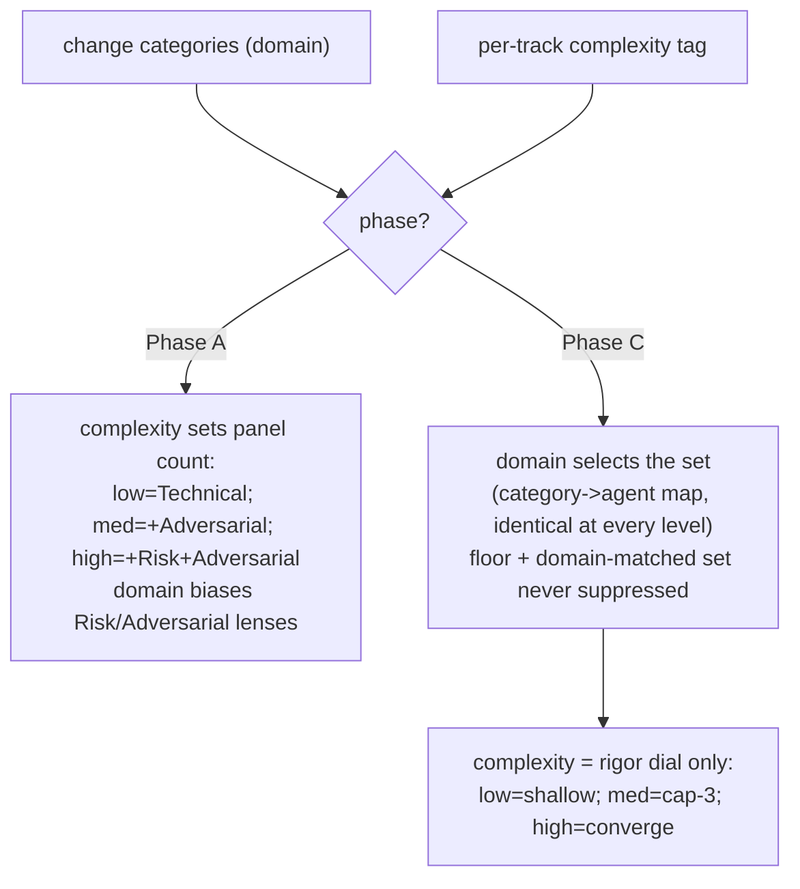

<!-- workflow-sha: a1311db00ca6d233d6c5883e0e29c5a09f4b4280 -->
# Track 2: Complexity-tag mechanics, reviewer selection, and roster

## Purpose / Big Picture
After this track lands, the per-track complexity tag is the single control
input for process intensity: it is computed from each track's planned work,
reconciled to `max(step tags)` at Phase A, and drives Phase-A panel breadth and
Phase-C rigor — and the reviewer roster is split and merged to match.

<!-- Reserved for Move 2 — ADDED/MODIFIED/REMOVED triad. Empty until Move 2 lands. -->

Wire the complexity tag through the review machinery. The tag is the seven
`risk-tagging` HIGH triggers run over a track's planned work; the planner
predicts it at Phase 1 and Phase A reconciles it against the per-step tags.
Complexity sets how many of the strategic trio run at Phase A and how hard the
dimensional panel iterates at Phase C; domain alone selects the Phase-C set.
This track also splits `review-bugs-concurrency` into `review-bugs` and
`review-concurrency` by cognitive mode, merges the two test reviewers into
`review-test-quality`, and re-derives the Phase-4 `adr.md` predicate from the
reconciled tag. It depends on Track 1's ledger schema for the per-track-tag
home.

## Progress
- [ ] Review + decomposition
- [ ] Step implementation
- [ ] Track-level code review
- [ ] Track completion

## Surprises & Discoveries
<!-- Continuous-log. Empty at Phase 1. -->

## Decision Log
<!-- The track-canonical live decision carrier (D7). Seeded from the frozen
design.md D-records. AUTHOR: fill the four bullets of each record below,
grounding in the design seed and the live review-selection / agent code; keep
the DR titles, ownership, and `**Full design**` pointers as given. -->

#### D2: Defer the Fable-5 implementer upgrade; the tag drives two consumers, not three
- **Alternatives considered**: include Fable 5 for `high` steps now — the
  originating issue's stated consumer 2 (swap the Phase-B implementer to Fable 5
  on `high` steps, keyed off the step tag the track tag seeds). Deferred per
  user.
- **Rationale**: the per-track tag drives **two** consumers in this change —
  Phase-A panel intensity and Phase-C reviewer selection — not three. Keeping it
  to two keeps the change a structural tier-unbundling and nothing more. The
  implementer-model swap is a separate, independently testable cost/quality
  experiment that can land later in its own change. The implementer stays Opus
  for every step; this is not a downgrade
  ([[no-weak-models-for-cost-levers]] is not in play because Opus stays
  everywhere).
- **Risks/Caveats**: scope discipline at issue-close. The originating issue
  stated it subsumes YTDB-1100 and YTDB-1056 Part 2 via a step-level-review
  reshape; that reshape is **no longer adopted** (revised D3 keeps the live
  rule), so combined with this deferral **YTDB-1100 is fully out of scope** here
  and **YTDB-1056 Part 2 is not adopted**. Do **not** close YTDB-1100 or
  YTDB-1056-P2 as subsumed. Only **YTDB-1056 Part 1** (the
  `review-test-behavior` + `review-test-completeness` → `review-test-quality`
  merge) is absorbed.
- **Implemented in**: this track (step references added during execution)
- **Full design**: design.md §"Reviewer selection" (Part 3 preamble)

#### D3: Step-level review keeps the live localized-versus-buried rule, roster-adapted
- **Alternatives considered**: (a) the originally-drafted D3 — run the triggered
  test reviewers at the step and omit production review — which *inverts* the
  live rule (the live rule keeps the bug-catcher at the step for burial and
  defers the test baselines); (b) the adversarial gate's compromise — keep
  `review-bugs` and add triggered test reviewers — which still runs the low-value
  test passes at the step that Phase C catches identically. Both rejected after
  gate finding A1; the user chose minimal change to the live rule.
- **Rationale**: the live `localized-versus-buried` rule in
  `review-agent-selection.md` §"Step-level vs track-level routing" is a reasoned
  single source of truth for step-vs-track timing — it asks whether a reviewer's
  findings would be *buried* once the step diff folds into the cumulative diff.
  This change adapts that rule to the new roster, it does not invert it. A
  consequence is that the per-track complexity tag does **not** drive step-level
  selection: step-level stays gated on the per-*step* `risk: high` tag plus the
  live burial routing. The tag drives Phase-A breadth and Phase-C rigor only.
- **Risks/Caveats**: the roster adaptation is mechanical. The combined
  `review-bugs-concurrency` step-level burial role is inherited by `review-bugs`
  always and by `review-concurrency` when the `concurrency` category is present
  (a race in the step diff is buriable too); the merged `review-test-quality`
  inherits the deferred-to-track-pass role of the two test baselines; the
  single-step-high override is unchanged. For a workflow-machinery high step the
  governing rule is the live "Workflow-review group" narrowing (the file-pattern
  globs decide which workflow reviewers run at the step), unchanged in logic —
  only which agents the globs name changes. The design invents no new rule.
- **Implemented in**: this track (step references added during execution)
- **Full design**: design.md §"Step-level review keeps the live localized-versus-buried rule" (Part 3)

#### D5: Reconciliation runs at Phase A, before Phase B, on any upward divergence
- **Alternatives considered**: (a) accept ≤1-level drift and re-run only on a
  2-level miss — under-reviews a decomposition that revealed harder steps; the
  user chose to run the missed reviewers on *any* upward miss. (b) a Phase-C
  reconciliation lens — later, riskier, more machinery; it defers discovery
  until after implementation. (c) re-decompose automatically on divergence —
  re-decomposition is a possible *outcome* of the missed reviewers' findings,
  not the trigger's action.
- **Rationale**: Phase A runs its strategic panel (sub-step 3) before it
  decomposes the track into steps (sub-step 4), so when the panel runs no step
  tags exist and it sizes itself from the track-tag prediction alone; `max(step
  tags)` is computable only after decomposition. The divergence is therefore
  real and is detectable at the end of Phase A, **before any code is written** — the cheapest place to fix the
  plan. On an upward miss, the orchestrator runs the higher-intensity strategic
  reviewers the predicted panel skipped (per the Phase-A complexity→panel map,
  D6), feeds their findings back into decomposition, and re-runs to PASS through
  the existing cap-3 loop. The reconciled tag (`max(step tags)`) then governs
  Phase C.
- **Risks/Caveats**: termination is bounded because the intensity ceiling is
  `high` — reconciliation fires **at most once per Phase A**; after the missed
  reviewers run and any re-decomposition lands, the divergence is not
  re-evaluated against a second upward miss (a second raise can only reach
  `high`, already covered), so the decompose-then-re-review cycle cannot
  repeat. The missed reviewers run as ordinary Phase-A passes under the same
  per-review-type cap-3. **Downward** divergence (steps easier than predicted) needs no missed
  reviewers — the panel already over-ran; Phase C floors at `max(step tags)`
  with no re-review, and a light flag asks the decomposer to confirm no step was
  under-tagged before the lower tag is trusted.
- **Implemented in**: this track (step references added during execution)
- **Full design**: design.md §"Reconciliation on upward divergence" (Part 2)

#### D6: Domain x complexity selection — complexity sets count at Phase A, rigor at Phase C
- **Alternatives considered**: let complexity gate *which* Phase-C specialists
  run ("any vs all"). Rejected — there is no such mechanism: Phase-C selection
  is deterministic on category presence, and gating it on complexity would
  under-review mis-tagged or cross-domain tracks.
- **Rationale**: the two review phases run different reviewer populations, so
  complexity acts differently in each. **Phase A**'s strategic trio (technical /
  risk / adversarial) is holistic — each reviewer judges the whole track
  approach — so the only knob complexity can turn is *how many* run: `low` →
  Technical only; `medium` → +Adversarial (narrowed); `high` → +Risk +Adversarial
  (narrowed). **Phase C**'s panel is dimensional — each reviewer owns one
  domain — so **domain alone** selects the set (identical at every complexity
  level) and complexity moves only the **rigor dial** (iteration depth: `low` =
  single shallow pass, `medium` = normal cap-3, `high` = iterate to
  convergence). The floor plus the domain-matched set **is never suppressed at
  Phase C**. The Phase-C specialists are gated on largely the same HIGH triggers
  that make a track `high`, so domain and complexity are correlated. Letting
  complexity *suppress* a domain-selected specialist would therefore subtract
  review in the dangerous direction. A `low` track touching `configuration`
  would get less `review-security`, which is exactly the track where the
  suppression would be unsafe. `high` adds no extra Phase-C
  finding-verification — the YTDB-1100 catch-rate study found step-level
  dimensional review on high steps caught essentially no production-logic bugs,
  so it would be unearned cost.
- **Risks/Caveats**: dropping Adversarial on `low` is deliberate — the live rule
  runs Adversarial in every `lite`/`full` track, but a genuinely `low` track
  (pure refactor / tests / docs) gets Technical only. An architecture-central
  track does not fall through this gap: it hits the Architecture HIGH trigger
  over its planned work (D9) and tags `high`, so it earns Risk + Adversarial;
  the risk-tag override is the backstop for a subtle case the prediction misses.
- **Implemented in**: this track (step references added during execution)
- **Full design**: design.md §"Reviewer selection" (Part 3)

#### D7: Bugs/concurrency ownership is by cognitive mode, not location or symptom
- **Alternatives considered**: draw the split boundary on **code location**
  ("anything inside a `synchronized` block goes to `review-concurrency`") or on
  **defect symptom** ("any leak goes to `review-bugs`"). Both rejected — they
  re-mix the modes (a leak reviewer ends up reasoning about races) and
  reintroduce the double-report the split exists to remove.
- **Rationale**: "one reviewer = one cognitive mode" holds only if the boundary
  is the reasoning **mode** itself. `review-concurrency` owns every defect whose
  detection requires reasoning about two or more threads interleaving (races,
  visibility / publication, lock-ordering / deadlock, compound-op atomicity);
  `review-bugs` owns every defect findable by single-threaded sequential
  reasoning (logic, null safety, resource leaks, RID handling, state-machine /
  lifecycle), regardless of whether the code sits inside a lock. The three
  routing sub-cases (a logic bug in a `synchronized` block, a leak on a
  concurrent path, a data race) resolve from that principle; design §"Bugs /
  concurrency ownership" (Part 6) carries the full walk-through. This mirrors the
  test side's earlier `review-test-concurrency` (`TX`) split.
- **Risks/Caveats**: the **symmetric tiebreak** — code with both a sequential and
  an interleaving flaw produces two findings, one per reviewer, never the same
  defect twice. The **triage backstop** closes the trigger gap: `review-bugs` is
  always-on but `review-concurrency` fires only on the `concurrency` category, so
  on un-triaged concurrent-looking code `review-bugs` emits a one-line
  "concurrency triage gap" note (not an analysis) for the orchestrator to launch
  `review-concurrency`. The two new prefixes are decided when the agent files are
  authored (`BC` retired); `review-test-quality` keeps `TB` and `TC` verbatim.
- **Implemented in**: this track (step references added during execution)
- **Full design**: design.md §"Bugs / concurrency ownership" (Part 6), §"Reviewer-roster split and merge" (Data model)

#### D8b: The adr.md predicate reads the reconciled per-track tag (adr ⟺ ∃ track ≥ medium)
- **Alternatives considered**: a design × track-count table (`adr ⟺ design OR
  multi-track`) or `adr ⟺ multi-track only`; see design §"Artifact derivation".
  Both rejected — they proxy decision substance, handing a trivial all-low
  multi-track change a durable ADR it does not earn and denying one to a complex
  single-track change; the second also strips the new design+single cell of a
  record. This DR owns only the adr half of design D8 (the `design.md` / plan
  half is Track 1's D8a).
- **Rationale**: an ADR tracks decision *substance*, so `adr.md` exists iff at
  least one track reconciled to **medium or high** — read from the reconciled
  per-track tags (`max(step tags)`, carried in Track 1's ledger field, settled by
  Phase 4). The refinements: an all-`low` multi-track change drops `adr.md` (the
  old `lite` always wrote one); a high-complexity single-track change gets it
  (the old `minimal` gave none); the design+single cell gets `design-final.md` +
  `adr.md`, no plan.
- **Risks/Caveats**: "design + all-low" is rare but coherent — design gate and
  complexity correlate, so if it occurs `design-final.md` exists without `adr.md`
  and the decisions live in its D-records. The verdict-fold runs in every change
  but its destination differs by predicate (into `adr.md` when one exists, else
  the PR description). The Phase-4 carrier selection in `create-final-design.md`
  re-derives from the axes — `design-final` iff a design exists, `adr` iff a
  track reached medium or above.
- **Implemented in**: this track (step references added during execution)
- **Full design**: design.md §"Artifact derivation" (Part 4)
<!-- Note: the design.md / plan existence half of design D8 is owned by Track 1.
This DR owns only the Phase-4 adr predicate, which reads the per-track
reconciled-tag field Track 1 defines in the ledger schema. -->

#### D9: The per-track tag is computed over the track's planned work, not a file-path list
- **Alternatives considered**: compute the prediction from the `## Interfaces`
  in-scope **file-path set alone** (the originating issue's loose "from the
  in-scope file set" wording). Rejected — file paths cannot evaluate the
  verb-on-change HIGH triggers, so the prediction would be a crude
  path-location heuristic with a large reconciliation gap.
- **Rationale**: the seven `risk-tagging.md` HIGH triggers test what the change
  *does* — "introduces synchronization", "modifies WAL recovery", "adds an
  abstraction layer / SPI registration" — not which files it touches. These are
  **content predicates** a bare path list cannot answer. So the pre-decomposition
  tag is computed by running the same seven triggers over the track's **planned
  work**: its `## Plan of Work` (the prose sequence of edits) plus its
  `## Interfaces and Dependencies` (the in-scope file set), where the content
  needed to evaluate a verb-on-change predicate lives. The planner has described
  the planned edits by the end of Phase 1, so the content to read exists. It
  stays a *prediction* (the planner's described work, not the realized diff),
  which is why D5 reconciles it against the content-based step tags.
- **Risks/Caveats**: two taxonomies stay distinct and serve two purposes — the
  **7 HIGH triggers** drive the complexity tag (how hard → Phase-A breadth +
  Phase-C rigor), the **13 code-review categories** drive Phase-C reviewer
  selection (which dimensions). They overlap but the design **maps them, does not
  merge them**. A thin or vague `## Plan of Work` yields a weak prediction; D5's
  reconciliation against the content-based step tags is the safety net that
  corrects an under-prediction by running the missed reviewers.
- **Implemented in**: this track (step references added during execution)
- **Full design**: design.md §"Computing the tag" (Part 1)

## Outcomes & Retrospective
<!-- Continuous-log. -->

## Context and Orientation

This track wires the per-track complexity tag through the review machinery. A
few terms recur. The **prediction** is the complexity tag the planner computes
at Phase 1 from a track's planned work, *before* decomposition; the
**reconciled tag** is `max(step tags)`, computable only *after* Phase A
decomposes the track into steps — the gap between the two is what D5's
reconciliation closes. The **strategic trio** is Phase A's holistic reviewer set
(technical / risk / adversarial), where each reviewer judges the whole track
approach. The **dimensional panel** is Phase C's set, where each reviewer owns
one domain. The **floor** is the minimum reviewer set every track gets.
**Cognitive-mode ownership** is the D7 boundary that decides which of the two
split bug reviewers owns a defect.

The current reviewer roster: `review-bugs-concurrency` (finding prefix `BC`)
covers logic / null / thread-safety / races / deadlocks / leaks / RID / state in
one agent; `review-test-behavior` (`TB`) and `review-test-completeness` (`TC`)
are two separate test reviewers. The test side **already** split concurrency out
as `review-test-concurrency` (prefix `TX`) because race-finding needs a different
reasoning mode — that existing split is the template the production split
mirrors (`review-concurrency` is the production analog of
`review-test-concurrency`).

Reviewer selection today takes **no complexity input** — it is purely
category-driven (a category is present → launch its agent). That selection logic
lives in `code-review/SKILL.md` Step 5 and is **mirrored across five sites**:
`code-review/SKILL.md`, `review-agent-selection.md`, `track-code-review.md`,
`step-implementation.md`, and `fix-ci-failure/SKILL.md` — a drift vector all
five must stay synchronized with. Step-level routing is governed by the live
`localized-versus-buried` rule in `review-agent-selection.md` §"Step-level vs
track-level routing" (an agent runs at a step only when its findings would be
buried once the step diff folds into the cumulative diff), with a
single-step-high override (a sole-step track runs the full track-pass-equivalent
selection at the step because Phase C is skipped) and a "Workflow-review group"
narrowing for workflow-machinery high steps.

The Phase-A panel in `track-review.md` §"Tier-driven review selection" today
reads the **whole-change tier** as its intensity knob: `minimal` → Technical
only; `lite`/`full` → Technical always + Risk track-characteristic-gated +
Adversarial narrowed. The panel already runs **per track** (`/execute-tracks`
handles one sub-phase of one track) — only the knob it reads is wrong, so
swapping that read to the per-track tag is a natural fit. The seven
`risk-tagging.md` HIGH triggers (`Concurrency`, `Crash-safety / Durability`,
`Public API`, `Security`, `Architecture / cross-component coordination`,
`Performance hot path`, `Workflow machinery`) exist already; this track runs
them at track granularity. The Phase-4 carrier table in
`create-final-design.md` is keyed off the tier today (full → design-final + adr;
lite → adr; minimal → PR-summary) and is the load-bearing hub that decides which
durable artifacts a change produces.

Concrete deliverables:

- the track-granularity tag computation (D9);
- the Phase-A panel re-key plus the reconciliation-on-upward-divergence
  mechanism that writes the reconciled tag to Track 1's ledger field at the A→C
  boundary (D5, D6);
- the domain×complexity selection across all five mirror sites, with the floor
  sacred and complexity moving only the Phase-C rigor dial (D6), plus the
  step-level roster adaptation (D3);
- the roster split/merge — three new agent files (`review-bugs`,
  `review-concurrency`, `review-test-quality`), three removed
  (`review-bugs-concurrency`, `review-test-behavior`,
  `review-test-completeness`) — with the D7 cognitive-mode clauses and the
  triage backstop, the two new finding prefixes, and `TB`/`TC` kept verbatim;
- the re-derived Phase-4 `adr.md` predicate (D8b).

This track **depends on Track 1**: it reads the `design_gate` and per-track
reconciled-tag fields Track 1 adds to the ledger, and the reconciliation
mechanism writes the reconciled tag through that schema.

## Plan of Work

The edits proceed from the tag's computation through its two consumers to the
roster mechanics and the Phase-4 predicate. Track 1's ledger schema is the
prerequisite for the reconciled-tag write, so Track 1 lands first.

**(1) Tag computation (D9).** In `risk-tagging.md`, add the rule that the
pre-decomposition complexity tag runs the seven HIGH triggers at **track
granularity** over the track's planned work — the `## Plan of Work` prose plus
the `## Interfaces and Dependencies` file set — not a bare file-path list,
because the HIGH triggers are content predicates. State that this is the same
seven-trigger set the per-step risk tag uses, run at track scope, and that the
result is a prediction reconciled to `max(step tags)` (D5). Keep the seven
triggers (the tag) and the thirteen `code-review` categories (Phase-C selection)
distinct — mapped, not merged. (Track 1 wires the Phase-1 *request* for this
prediction into `planning.md`; this step owns the computation rule it points
at.)

**(2) Phase-A panel + reconciliation (D5, D6).** In `track-review.md`, re-key
the Phase-A panel from the whole-change tier onto the per-track tag: `low` →
Technical only; `medium` → Technical + Adversarial (narrowed); `high` →
Technical + Risk + Adversarial (narrowed). Add the
reconciliation-on-upward-divergence mechanism: after sub-step 4 assigns per-step
risk tags, compare `max(step tags)` against the predicted track tag; on any
upward miss, run the missed strategic reviewers (the ones the higher-intensity
panel would have run), feed their findings back into decomposition, re-run to
PASS through the existing cap-3 loop, and fire **at most once**. Write the
reconciled tag (`max(step tags)`) to Track 1's per-track ledger field at the A→C
boundary via `--append-ledger`. A downward divergence runs no missed reviewers;
Phase C floors at `max(step tags)` with a light under-tagging re-check, no
re-review.

**(3) Roster split/merge.** Add `review-bugs.md` (always-on, single-threaded
sequential reasoning, the D7 ownership clauses, and the one-line triage backstop
verbatim) and `review-concurrency.md` (fires on the `concurrency` category,
multi-thread interleaving reasoning, the D7 ownership clauses); decide their two
new finding prefixes and remove `review-bugs-concurrency.md` (retiring `BC`).
Merge `review-test-behavior.md` + `review-test-completeness.md` into
`review-test-quality.md`, keeping both sub-protocols and **both** the `TB` and
`TC` prefixes verbatim, and remove the two merge sources. All agent
adds/removes stage under the §1.7 subtree, not the live tree.

**(4) Domain×complexity selection + step-level adaptation (D3, D6).** Thread the
complexity input into the category-driven selection across all five mirror sites
(`code-review/SKILL.md` Step 5, `review-agent-selection.md`,
`track-code-review.md`, `step-implementation.md`, `fix-ci-failure/SKILL.md`):
domain selects the Phase-C set identically at every level, complexity moves only
the rigor dial, and the floor + domain-matched set is never suppressed. Update
the same sites' rosters to the split/merge names. Adapt the live
localized-versus-buried step-level rule to the new roster (the burial role
passes to `review-bugs` always + `review-concurrency` when concurrency is
present; the test baselines' deferred role passes to `review-test-quality`),
unchanged in logic. In `finding-synthesis-recipe.md` **and the canonical owner table
`review-iteration.md` §"Finding ID prefixes"**, retire `BC`, add the two new
prefixes, and keep `TB`/`TC`. Update `code-review-protocol.md`'s roster
references. The implementer stays Opus (D2).

**(5) Phase-4 carrier predicate (D8b).** In `create-final-design.md`, re-derive
the carrier table from the axes — produce `design-final` iff a design exists;
produce `adr` iff at least one track reconciled to medium or above — and re-key
the verdict-fold predicate (adr exists → fold into `adr.md`; otherwise → PR
description). The predicate reads Track 1's reconciled per-track tag.

**(6) Remaining prose re-keying.** Re-key `conventions-execution.md` (review-file
/ roster references and any per-track-tag track-file references),
`inline-replanning.md` (the tier-escalation path → complexity), and
`design-review.md` (roster / tag / review references, plus re-keying its
`tier=full` fidelity gate — a design-presence proxy — to read `design_gate=yes`).

The cross-site-synchronization constraint governs throughout: the five selection
mirrors must stay consistent and carry no dangling reference to a removed agent.
A per-step sequencing summary will be appended here once Phase A writes the
`## Concrete Steps` roster.

## Concrete Steps
<!-- Phase A placeholder — decomposition writes a thin numbered roster here. -->

## Episodes
<!-- Continuous-log. -->

## Validation and Acceptance

Track-level behavioral acceptance — what must hold once every step lands:

- **Tag over planned work.** The complexity tag is computed over the track's
  `## Plan of Work` + `## Interfaces and Dependencies`, not a bare file-path
  list — verified by the planning instruction and a worked example showing a
  HIGH content predicate evaluated against planned-work prose.
- **Phase-A panel by level.** `low` runs Technical only; `medium` runs
  Technical + Adversarial; `high` runs Technical + Risk + Adversarial — verified
  by the track-review selection rule and the consistency review.
- **Reconciliation.** An upward divergence runs the missed strategic reviewers
  and fires at most once per Phase A; a downward divergence runs none and floors
  Phase C at `max(step tags)` with no re-review — verified by the track-review
  reconciliation rule.
- **Phase-C selection unchanged by complexity.** Domain alone selects the Phase-C
  set (identical at every complexity level); complexity moves only the rigor
  dial; the floor and the domain-matched set are never suppressed — verified by
  the review-agent-selection rule and the consistency review.
- **Cognitive-mode ownership.** A defect with both a sequential and an
  interleaving flaw produces two findings (one per reviewer); a data race goes to
  `review-concurrency` only; `review-bugs` emits a one-line triage-gap note on
  un-triaged concurrent-looking code — verified by the agent definitions.
- **Prefixes resolve.** `review-test-quality` carries both `TB` and `TC`
  verbatim, so existing finding references and the `finding-synthesis-recipe`
  prefix family resolve unchanged — verified by the agent definition and a grep
  over the prefix family.
- **Adr predicate.** `adr.md` exists iff at least one track reconciled to medium
  or higher; the verdict-fold lands in `adr.md` when one exists and in the PR
  description otherwise — verified by the create-final-design carrier logic.
- **No dangling roster references.** No reference to a removed agent
  (`review-bugs-concurrency`, `review-test-behavior`, `review-test-completeness`)
  survives across the five selection mirror sites — verified by the consistency
  review and a grep.

<!-- Reserved for Move 3 — EARS or Gherkin acceptance lines used verbatim as
test method names. Empty until Move 3 lands. -->

## Idempotence and Recovery
<!-- Phase A placeholder. -->

## Artifacts and Notes
<!-- Continuous-log (rare). Often empty. -->

## Interfaces and Dependencies

**In scope (this track edits these files):**
- `.claude/workflow/risk-tagging.md` — the 7 HIGH triggers applied at track
  granularity over planned work (D9).
- `.claude/workflow/track-review.md` — the Phase-A panel re-keyed onto the
  per-track tag (D6) and the reconciliation-on-upward-divergence mechanism (D5).
- `.claude/workflow/review-agent-selection.md` — domain×complexity Phase-C
  selection, the step-level localized-versus-buried roster adaptation (D3, D6),
  and the new roster names.
- `.claude/skills/code-review/SKILL.md` — Step-5 selection (domain×complexity)
  and the roster.
- `.claude/workflow/step-implementation.md` — step-level dispatch roster
  adaptation (D3); implementer stays Opus (D2).
- `.claude/workflow/track-code-review.md` — Phase-C dispatch, the rigor dial
  (D6), and the roster.
- `.claude/skills/fix-ci-failure/SKILL.md` — the mirrored selection and roster.
- `.claude/workflow/finding-synthesis-recipe.md` — finding prefixes (retire
  `BC`; add the two new prefixes; keep `TB`/`TC`).
- `.claude/workflow/review-iteration.md` — §"Finding ID prefixes", the canonical
  owner table: retire the `BC` row, add the two new `review-bugs` /
  `review-concurrency` rows, keep `TB`/`TC`.
- `.claude/workflow/code-review-protocol.md` — roster references.
- `.claude/workflow/conventions-execution.md` — review-file / roster references
  and any per-track-tag track-file references.
- `.claude/workflow/inline-replanning.md` — the tier-escalation path re-keyed to
  complexity.
- `.claude/agents/review-bugs-concurrency.md` — removed (the split source).
- `.claude/agents/review-bugs.md` — new (always-on, single-threaded reasoning,
  with the triage backstop, D7).
- `.claude/agents/review-concurrency.md` — new (fires on the `concurrency`
  category, interleaving reasoning, D7).
- `.claude/agents/review-test-behavior.md` — removed (the merge source).
- `.claude/agents/review-test-completeness.md` — removed (the merge source).
- `.claude/agents/review-test-quality.md` — new (merged TB+TC, both
  sub-protocols and prefixes verbatim).
- `.claude/workflow/prompts/create-final-design.md` — the Phase-4 carrier table
  and verdict-fold predicate re-derived from the axes (D8b).
- `.claude/workflow/prompts/design-review.md` — roster / tag / review references,
  and the design-presence re-key of its `tier=full` fidelity gate to
  `design_gate=yes` (the gate's `tier` input is a design-presence proxy).

**Out of scope (Track 1 owns these):** `workflow-startup-precheck.sh` + its two
tests, `create-plan/SKILL.md`, `workflow.md`, `conventions.md`, `planning.md`,
`research.md`, `plan-slim-rendering.md`, `design-document-rules.md`, and the
consistency / structural review prompts (the ledger schema, resume routing, and
Phase-1 artifact existence).

**Inter-track dependencies:** depends on **Track 1**. This track reads the
`design_gate` and per-track reconciled-tag fields Track 1 adds to the ledger
schema, and the reconciliation mechanism writes the reconciled tag through that
schema. Track 1 must land first.

**§1.7 staging (mandatory).** This plan is workflow-modifying: every
`.claude/**` edit in this track stages under
`_workflow/staged-workflow/.claude/` (mirroring `workflow/`, `skills/`,
`agents/`, `scripts/`); the live workflow stays at develop state until the
Phase 4 promotion. The reviewer-selection dispatch and agent-roster edits are
behavioral workflow machinery, so this branch cannot take the §1.7(k)
prose-only opt-out. Adding / removing agent files stages the same way: the new
agent files are written under the staged subtree, and the removed ones are
deleted from the staged copy, not from the live tree, until promotion.

**Key contracts in scope:**

- **Category→agent selection map** — the binary, category-driven rule today
  (`category present → launch its agent`) in `code-review/SKILL.md` Step 5,
  mirrored across the four other selection sites. This track adds the complexity
  input: domain still selects the set; complexity scales only the rigor dial at
  Phase C and the panel count at Phase A.
- **Finding-prefix family** — `BC` (retired with `review-bugs-concurrency`), two
  new prefixes for `review-bugs` / `review-concurrency`, `TB` + `TC` kept on the
  merged `review-test-quality`, and `TX` (unchanged on `review-test-concurrency`,
  the production-split template). Owned by
  `review-iteration.md` §"Finding ID prefixes" and referenced by
  `finding-synthesis-recipe.md`.
- **Reconciled-tag write** — the reconciliation mechanism appends the per-track
  reconciled tag through Track 1's `--append-ledger` field at the A→C boundary
  (Track 1 owns the schema; this track is the writer/consumer).

The domain×complexity selection has three interacting inputs (the change's
categories, the per-track complexity tag, and the phase), so the selection flow
earns a diagram:

## Invariants & Constraints
- The complexity tag is computed over the track's planned work (`## Plan of
  Work` + `## Interfaces and Dependencies`), not a bare file-path list —
  verified by the planning instruction and a worked example.
- Phase-A panel: `low` → Technical only; `medium` → Technical + Adversarial;
  `high` → Technical + Risk + Adversarial — verified by the track-review
  selection rule and the consistency review.
- Phase-C: domain alone selects the reviewer set (identical at every complexity
  level); complexity moves only the rigor dial; the floor and the
  domain-matched set are never suppressed — verified by the
  review-agent-selection rule and the consistency review.
- Reconciliation fires at most once per Phase A, runs the missed reviewers on
  any upward divergence, and floors Phase C at `max(step tags)` on downward
  divergence with no re-review — verified by the track-review reconciliation
  rule.
- Bugs/concurrency ownership routes by cognitive mode; a defect with both a
  sequential and an interleaving flaw is two findings (one per reviewer); a
  data race goes to `review-concurrency` only; `review-bugs` emits a one-line
  triage-gap note on un-triaged concurrent-looking code — verified by the agent
  definitions.
- `review-test-quality` carries both the `TB` and `TC` prefixes verbatim, so
  existing finding references and the `finding-synthesis-recipe` prefix family
  resolve unchanged — verified by the agent definition and a grep over the
  prefix family.
- `adr.md` exists iff at least one track reconciled to medium or higher; the
  verdict-fold lands in `adr.md` when one exists and in the PR description
  otherwise — verified by the create-final-design carrier logic.
- No dangling reference to a removed agent (`review-bugs-concurrency`,
  `review-test-behavior`, `review-test-completeness`) survives across the five
  selection mirror sites — verified by the consistency review and a grep.
