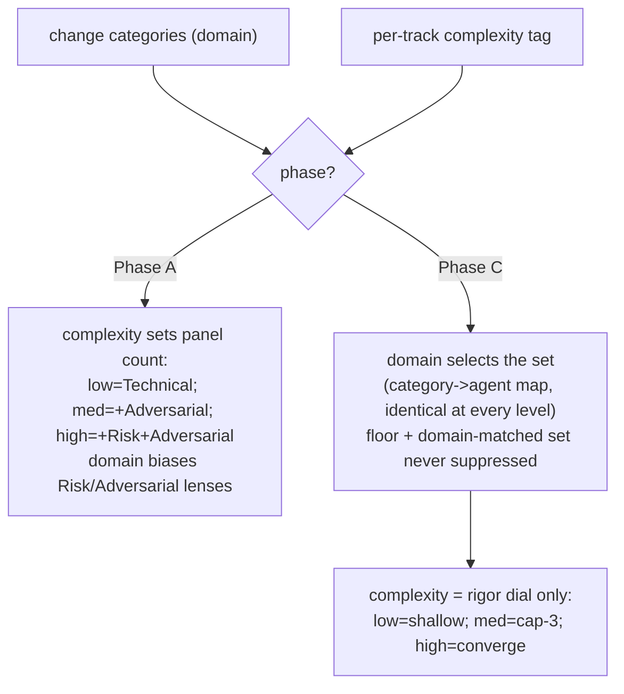

<!-- workflow-sha: a1311db00ca6d233d6c5883e0e29c5a09f4b4280 -->
# Track 2: Complexity-tag mechanics, reviewer selection, and roster

## Purpose / Big Picture
After this track lands, the per-track complexity tag is the single control
input for process intensity: it is computed from each track's planned work,
reconciled to `max(step tags)` at Phase A, and drives Phase-A panel breadth and
Phase-C rigor — and the reviewer roster is split and merged to match.

<!-- Reserved for Move 2 — ADDED/MODIFIED/REMOVED triad. Empty until Move 2 lands. -->

Wire the complexity tag through the review machinery. The tag is the seven
`risk-tagging` HIGH triggers run over a track's planned work; the planner
predicts it at Phase 1 and Phase A reconciles it against the per-step tags.
Complexity sets how many of the strategic trio run at Phase A and how hard the
dimensional panel iterates at Phase C; domain alone selects the Phase-C set.
This track also splits `review-bugs-concurrency` into `review-bugs` and
`review-concurrency` by cognitive mode, merges the two test reviewers into
`review-test-quality`, and re-derives the Phase-4 `adr.md` predicate from the
reconciled tag. It depends on Track 1's ledger schema for the per-track-tag
home.

## Progress
- [x] Review + decomposition
- [x] Step implementation
- [x] Track-level code review
- [ ] Track completion
- [x] 2026-06-29T14:44Z [ctx=info] Review + decomposition complete
- [x] 2026-06-29T15:14Z [ctx=safe] Step 1 complete (commit c505e176bd)
- [x] 2026-06-29T15:33Z [ctx=safe] Step 2 complete (commit b9641e1ef2)
- [x] 2026-06-29T15:55Z [ctx=info] Step 3 complete (commit 1befef572c)
- [x] 2026-06-29T16:10Z [ctx=info] Step 4 complete (commit 7f753886f5)
- [x] 2026-06-29T16:28Z [ctx=info] Step 5 complete (commit 2b3178ebf5)
- [x] 2026-06-29T16:45Z [ctx=info] Step 6 complete (commit 13c63c4335)
- [x] 2026-06-30T07:31Z [ctx=safe] Track-level code review iteration 1 complete (1/3 iterations)
- [x] 2026-06-30T07:34Z [ctx=info] Track complete

## Surprises & Discoveries
<!-- Continuous-log. Empty at Phase 1. -->
- 2026-06-29T15:14Z Step 1 froze the reviewer-roster finding-prefix schema the
  rest of Track 2 builds against: `review-bugs` takes prefix `BG`,
  `review-concurrency` takes `CN`, `BC` is retired, and `review-test-quality`
  keeps `TB`/`TC` verbatim. Steps 2–5 (selection mirrors, Phase-A panel, the
  `risk-tagging` table cell, the `dimensional-review-gate-check` `BC3` example)
  must use these exact prefixes and the new agent names. See Episodes §Step 1.
- 2026-06-29T15:14Z Phase 4 carries a mandatory live-tree deletion that staging
  cannot express. §1.7(e) promotion is additive only, so the `cp -r` adds the
  three new agents but leaves the three split/merge sources
  (`review-bugs-concurrency.md`, `review-test-behavior.md`,
  `review-test-completeness.md`) in the live tree. The Phase 4 hand-edit must
  delete them right after the promotion commit, or the live tree carries both
  the old and new rosters. See Episodes §Step 1.
- 2026-06-29T15:33Z Step 4 forward-dependency: `track-review.md` must keep the
  `### Tier-driven review selection and which reviews to run` heading
  byte-stable, or update every referrer in the same edit. The referrer set is
  wider than the roster's Step 4 line claims ("two referrers"): staged
  `risk-tagging.md` references the full heading three times, and
  `conventions-execution.md` plus the track-2 `## Context and Orientation`
  pointer reference it in abbreviated form. Step 4 must re-count before
  deciding keep-stable versus update-all. See Episodes §Step 2.
- 2026-06-29T15:33Z Phase C consistency-review items the no-dangling grep must
  adjudicate over the cumulative diff: (a) surviving `tier`-model and
  `planning.md §Tier classification` references in the Step-2 files — decide
  legitimately-surviving (the design gate is still decided in `planning.md`)
  versus dangling; (b) a Track-1-owned residual in staged `create-plan/SKILL.md`
  (~line 946) still using `full`/`full-tier` wording for the Step-4b cold-read
  fidelity criterion, which Step 2 renamed to a `design_gate=yes`-keyed
  criterion in `design-review.md`. See Episodes §Step 2.
- 2026-06-29T15:55Z Pre-existing, out-of-scope wording nit for a Phase C /
  future cleanup: `review-agent-selection.md`'s WAL-replay "all 10 agents"
  worked example overcounts by one on the live file (a WAL-replay-plus-lock
  change does not trigger `review-security`). Step 3's split/merge left the
  count at 10 (split +1 / merge −1 cancel), so the step neither introduced nor
  fixed it. See Episodes §Step 3.
- 2026-06-29T16:10Z **Toc-check CI gate blocker** (surfaced during Step 4,
  rooted in Step 3 + a reindex glob asymmetry): the whole-repo
  `workflow-reindex.py --check` fails on the staged `fix-ci-failure/SKILL.md`
  (`rule_2` no-TOC + `rule_4` annotation cascade). The reindex live glob
  excludes `fix-ci-failure` from the seven SKILL.md anchors, but the staged glob
  matches any staged skill, so staging it — required for the Step-3 roster
  re-key — forces TOC conformance the live file never had. Resolution options:
  (A) add a TOC + heading annotations to the staged copy (conforms it, but
  promotes orphan TOC infrastructure into a live file the live glob still will
  not check); (B) narrow the reindex staged skills glob to the live anchor set
  (a `workflow-reindex.py` change, out of the current plan scope, contradicting
  the script's documented intentional-asymmetry comment); (C) defer or suppress.
  Escalated to the user before track completion. See Episodes §Step 4.

## Decision Log
<!-- The track-canonical live decision carrier (D7). Seeded from the frozen
design.md D-records. AUTHOR: fill the four bullets of each record below,
grounding in the design seed and the live review-selection / agent code; keep
the DR titles, ownership, and `**Full design**` pointers as given. -->

#### D2: Defer the Fable-5 implementer upgrade; the tag drives two consumers, not three
- **Alternatives considered**: include Fable 5 for `high` steps now — the
  originating issue's stated consumer 2 (swap the Phase-B implementer to Fable 5
  on `high` steps, keyed off the step tag the track tag seeds). Deferred per
  user.
- **Rationale**: the per-track tag drives **two** consumers in this change —
  Phase-A panel intensity and Phase-C reviewer selection — not three. Keeping it
  to two keeps the change a structural tier-unbundling and nothing more. The
  implementer-model swap is a separate, independently testable cost/quality
  experiment that can land later in its own change. The implementer stays Opus
  for every step; this is not a downgrade
  ([[no-weak-models-for-cost-levers]] is not in play because Opus stays
  everywhere).
- **Risks/Caveats**: scope discipline at issue-close. The originating issue
  stated it subsumes YTDB-1100 and YTDB-1056 Part 2 via a step-level-review
  reshape; that reshape is **no longer adopted** (revised D3 keeps the live
  rule), so combined with this deferral **YTDB-1100 is fully out of scope** here
  and **YTDB-1056 Part 2 is not adopted**. Do **not** close YTDB-1100 or
  YTDB-1056-P2 as subsumed. Only **YTDB-1056 Part 1** (the
  `review-test-behavior` + `review-test-completeness` → `review-test-quality`
  merge) is absorbed.
- **Implemented in**: this track (step references added during execution)
- **Full design**: design.md §"Reviewer selection" (Part 3 preamble)

#### D3: Step-level review keeps the live localized-versus-buried rule, roster-adapted
- **Alternatives considered**: (a) the originally-drafted D3 — run the triggered
  test reviewers at the step and omit production review — which *inverts* the
  live rule (the live rule keeps the bug-catcher at the step for burial and
  defers the test baselines); (b) the adversarial gate's compromise — keep
  `review-bugs` and add triggered test reviewers — which still runs the low-value
  test passes at the step that Phase C catches identically. Both rejected after
  gate finding A1; the user chose minimal change to the live rule.
- **Rationale**: the live `localized-versus-buried` rule in
  `review-agent-selection.md` §"Step-level vs track-level routing" is a reasoned
  single source of truth for step-vs-track timing — it asks whether a reviewer's
  findings would be *buried* once the step diff folds into the cumulative diff.
  This change adapts that rule to the new roster, it does not invert it. A
  consequence is that the per-track complexity tag does **not** drive step-level
  selection: step-level stays gated on the per-*step* `risk: high` tag plus the
  live burial routing. The tag drives Phase-A breadth and Phase-C rigor only.
- **Risks/Caveats**: the roster adaptation is mechanical. The combined
  `review-bugs-concurrency` step-level burial role is inherited by `review-bugs`
  always and by `review-concurrency` when the `concurrency` category is present
  (a race in the step diff is buriable too); the merged `review-test-quality`
  inherits the deferred-to-track-pass role of the two test baselines; the
  single-step-high override is unchanged. For a workflow-machinery high step the
  governing rule is the live "Workflow-review group" narrowing (the file-pattern
  globs decide which workflow reviewers run at the step), unchanged in logic —
  only which agents the globs name changes. The design invents no new rule.
- **Implemented in**: this track (step references added during execution)
- **Full design**: design.md §"Step-level review keeps the live localized-versus-buried rule" (Part 3)

#### D5: Reconciliation runs at Phase A, before Phase B, on any upward divergence
- **Alternatives considered**: (a) accept ≤1-level drift and re-run only on a
  2-level miss — under-reviews a decomposition that revealed harder steps; the
  user chose to run the missed reviewers on *any* upward miss. (b) a Phase-C
  reconciliation lens — later, riskier, more machinery; it defers discovery
  until after implementation. (c) re-decompose automatically on divergence —
  re-decomposition is a possible *outcome* of the missed reviewers' findings,
  not the trigger's action.
- **Rationale**: Phase A runs its strategic panel (sub-step 3) before it
  decomposes the track into steps (sub-step 4), so when the panel runs no step
  tags exist and it sizes itself from the track-tag prediction alone; `max(step
  tags)` is computable only after decomposition. The divergence is therefore
  real and is detectable at the end of Phase A, **before any code is written** — the cheapest place to fix the
  plan. On an upward miss, the orchestrator runs the higher-intensity strategic
  reviewers the predicted panel skipped (per the Phase-A complexity→panel map,
  D6), feeds their findings back into decomposition, and re-runs to PASS through
  the existing cap-3 loop. The reconciled tag (`max(step tags)`) then governs
  Phase C.
- **Risks/Caveats**: termination is bounded because the intensity ceiling is
  `high` — reconciliation fires **at most once per Phase A**; after the missed
  reviewers run and any re-decomposition lands, the divergence is not
  re-evaluated against a second upward miss (a second raise can only reach
  `high`, already covered), so the decompose-then-re-review cycle cannot
  repeat. The missed reviewers run as ordinary Phase-A passes under the same
  per-review-type cap-3. **Downward** divergence (steps easier than predicted) needs no missed
  reviewers — the panel already over-ran; Phase C floors at `max(step tags)`
  with no re-review, and a light flag asks the decomposer to confirm no step was
  under-tagged before the lower tag is trusted.
- **Implemented in**: this track (step references added during execution)
- **Full design**: design.md §"Reconciliation on upward divergence" (Part 2)

#### D6: Domain x complexity selection — complexity sets count at Phase A, rigor at Phase C
- **Alternatives considered**: let complexity gate *which* Phase-C specialists
  run ("any vs all"). Rejected — there is no such mechanism: Phase-C selection
  is deterministic on category presence, and gating it on complexity would
  under-review mis-tagged or cross-domain tracks.
- **Rationale**: the two review phases run different reviewer populations, so
  complexity acts differently in each. **Phase A**'s strategic trio (technical /
  risk / adversarial) is holistic — each reviewer judges the whole track
  approach — so the only knob complexity can turn is *how many* run: `low` →
  Technical only; `medium` → +Adversarial (narrowed); `high` → +Risk +Adversarial
  (narrowed). **Phase C**'s panel is dimensional — each reviewer owns one
  domain — so **domain alone** selects the set (identical at every complexity
  level) and complexity moves only the **rigor dial** (iteration depth: `low` =
  single shallow pass, `medium` = normal cap-3, `high` = iterate to
  convergence). The floor plus the domain-matched set **is never suppressed at
  Phase C**. The Phase-C specialists are gated on largely the same HIGH triggers
  that make a track `high`, so domain and complexity are correlated. Letting
  complexity *suppress* a domain-selected specialist would therefore subtract
  review in the dangerous direction. A `low` track touching `configuration`
  would get less `review-security`, which is exactly the track where the
  suppression would be unsafe. `high` adds no extra Phase-C
  finding-verification — the YTDB-1100 catch-rate study found step-level
  dimensional review on high steps caught essentially no production-logic bugs,
  so it would be unearned cost.
- **Risks/Caveats**: dropping Adversarial on `low` is deliberate — the live rule
  runs Adversarial in every `lite`/`full` track, but a genuinely `low` track
  (pure refactor / tests / docs) gets Technical only. An architecture-central
  track does not fall through this gap: it hits the Architecture HIGH trigger
  over its planned work (D9) and tags `high`, so it earns Risk + Adversarial;
  the risk-tag override is the backstop for a subtle case the prediction misses.
- **Implemented in**: this track (step references added during execution)
- **Full design**: design.md §"Reviewer selection" (Part 3)

#### D7: Bugs/concurrency ownership is by cognitive mode, not location or symptom
- **Alternatives considered**: draw the split boundary on **code location**
  ("anything inside a `synchronized` block goes to `review-concurrency`") or on
  **defect symptom** ("any leak goes to `review-bugs`"). Both rejected — they
  re-mix the modes (a leak reviewer ends up reasoning about races) and
  reintroduce the double-report the split exists to remove.
- **Rationale**: "one reviewer = one cognitive mode" holds only if the boundary
  is the reasoning **mode** itself. `review-concurrency` owns every defect whose
  detection requires reasoning about two or more threads interleaving (races,
  visibility / publication, lock-ordering / deadlock, compound-op atomicity);
  `review-bugs` owns every defect findable by single-threaded sequential
  reasoning (logic, null safety, resource leaks, RID handling, state-machine /
  lifecycle), regardless of whether the code sits inside a lock. The three
  routing sub-cases (a logic bug in a `synchronized` block, a leak on a
  concurrent path, a data race) resolve from that principle; design §"Bugs /
  concurrency ownership" (Part 6) carries the full walk-through. This mirrors the
  test side's earlier `review-test-concurrency` (`TX`) split.
- **Risks/Caveats**: the **symmetric tiebreak** — code with both a sequential and
  an interleaving flaw produces two findings, one per reviewer, never the same
  defect twice. The **triage backstop** closes the trigger gap: `review-bugs` is
  always-on but `review-concurrency` fires only on the `concurrency` category, so
  on un-triaged concurrent-looking code `review-bugs` emits a one-line
  "concurrency triage gap" note (not an analysis) for the orchestrator to launch
  `review-concurrency`. The two new prefixes are decided when the agent files are
  authored (`BC` retired); `review-test-quality` keeps `TB` and `TC` verbatim.
- **Implemented in**: this track (step references added during execution)
- **Full design**: design.md §"Bugs / concurrency ownership" (Part 6), §"Reviewer-roster split and merge" (Data model)

#### D8b: The adr.md predicate reads the reconciled per-track tag (adr ⟺ ∃ track ≥ medium)
- **Alternatives considered**: a design × track-count table (`adr ⟺ design OR
  multi-track`) or `adr ⟺ multi-track only`; see design §"Artifact derivation".
  Both rejected — they proxy decision substance, handing a trivial all-low
  multi-track change a durable ADR it does not earn and denying one to a complex
  single-track change; the second also strips the new design+single cell of a
  record. This DR owns only the adr half of design D8 (the `design.md` / plan
  half is Track 1's D8a).
- **Rationale**: an ADR tracks decision *substance*, so `adr.md` exists iff at
  least one track reconciled to **medium or high** — read from the reconciled
  per-track tags (`max(step tags)`, carried in Track 1's ledger field, settled by
  Phase 4). The refinements: an all-`low` multi-track change drops `adr.md` (the
  old `lite` always wrote one); a high-complexity single-track change gets it
  (the old `minimal` gave none); the design+single cell gets `design-final.md` +
  `adr.md`, no plan.
- **Risks/Caveats**: "design + all-low" is rare but coherent — design gate and
  complexity correlate, so if it occurs `design-final.md` exists without `adr.md`
  and the decisions live in its D-records. The verdict-fold runs in every change
  but its destination differs by predicate (into `adr.md` when one exists, else
  the PR description). The Phase-4 carrier selection in `create-final-design.md`
  re-derives from the axes — `design-final` iff a design exists, `adr` iff a
  track reached medium or above.
- **Implemented in**: this track (step references added during execution)
- **Full design**: design.md §"Artifact derivation" (Part 4)
<!-- Note: the design.md / plan existence half of design D8 is owned by Track 1.
This DR owns only the Phase-4 adr predicate, which reads the per-track
reconciled-tag field Track 1 defines in the ledger schema. -->

#### D9: The per-track tag is computed over the track's planned work, not a file-path list
- **Alternatives considered**: compute the prediction from the `## Interfaces`
  in-scope **file-path set alone** (the originating issue's loose "from the
  in-scope file set" wording). Rejected — file paths cannot evaluate the
  verb-on-change HIGH triggers, so the prediction would be a crude
  path-location heuristic with a large reconciliation gap.
- **Rationale**: the seven `risk-tagging.md` HIGH triggers test what the change
  *does* — "introduces synchronization", "modifies WAL recovery", "adds an
  abstraction layer / SPI registration" — not which files it touches. These are
  **content predicates** a bare path list cannot answer. So the pre-decomposition
  tag is computed by running the same seven triggers over the track's **planned
  work**: its `## Plan of Work` (the prose sequence of edits) plus its
  `## Interfaces and Dependencies` (the in-scope file set), where the content
  needed to evaluate a verb-on-change predicate lives. The planner has described
  the planned edits by the end of Phase 1, so the content to read exists. It
  stays a *prediction* (the planner's described work, not the realized diff),
  which is why D5 reconciles it against the content-based step tags.
- **Risks/Caveats**: two taxonomies stay distinct and serve two purposes — the
  **7 HIGH triggers** drive the complexity tag (how hard → Phase-A breadth +
  Phase-C rigor), the **13 code-review categories** drive Phase-C reviewer
  selection (which dimensions). They overlap but the design **maps them, does not
  merge them**. A thin or vague `## Plan of Work` yields a weak prediction; D5's
  reconciliation against the content-based step tags is the safety net that
  corrects an under-prediction by running the missed reviewers.
- **Implemented in**: this track (step references added during execution)
- **Full design**: design.md §"Computing the tag" (Part 1)

#### D10: Reindex staged-skill scope fix (inline-replan, Phase B after Step 4)
- **Alternatives considered**: (A) conform the staged `fix-ci-failure/SKILL.md`
  by adding a TOC + heading annotations — rejected: it transforms a deliberately
  simple step-list skill into a TOC-annotated workflow doc and promotes orphan
  TOC infrastructure into a live file the live glob still will not check. (C)
  defer to a follow-up issue and leave the reindex false-positive — rejected by
  the user in favor of the root-cause fix on this workflow-improvement branch.
- **Rationale**: Step 3 had to stage `fix-ci-failure/SKILL.md` (a required
  roster-reference re-key, not a deletable), and §1.7 copy-then-edit produces a
  verbatim-plus-delta staged copy with no TOC because the live file has none.
  The reindex live glob excludes `fix-ci-failure` from its seven SKILL.md anchors
  (it is not a TOC-bearing workflow doc), but the staged glob matches any staged
  skill, so the staged copy trips `rule_2` / `rule_4`. The fix mirrors the
  existing `_is_staged_agent` partition: a staged copy of a non-anchor skill is
  validated exactly as its live namesake would be — out of the TOC rules (2/4),
  citing-scope rules (6/7) retained. This is the correct root-cause fix and it
  spares every future workflow-modifying branch that stages a non-anchor skill
  the same false-positive.
- **Risks/Caveats**: the toc-check CI gate is **not** a merge blocker for this
  branch — it skips on draft PRs and the staged tree is removed at Phase 4
  cleanup before the PR is un-drafted, and the gate runs the live (not staged)
  reindex script regardless. So this step is a **forward** tooling fix, not a
  this-branch unblock; it takes effect on develop at promotion. The change must
  not weaken validation of staged copies of the seven anchor skills — the
  partition keys on non-anchor membership only.
- **Implemented in**: this track, Step 6 (inline-replan added Phase B).
- **Full design**: none — execution-time inline-replan; see Episodes §Step 4 and
  the Surprises toc-check-blocker entry.

## Outcomes & Retrospective
<!-- Continuous-log. -->
- [x] Technical: PASS at iteration 2 (4 findings, 4 accepted)
- [x] Risk: PASS at iteration 2 (6 findings, 6 accepted; the R1 blocker resolved)
- [x] Adversarial: PASS at iteration 2 (5 findings, 5 accepted) — ran on Opus;
  Fable 5 unavailable in this environment (D14 documented degradation, not a
  re-decision).
- **Dominant outcome — scope widened from "five mirror sites" to a repo-wide
  `.claude/**` sweep.** All three reviews converged: the planner's "five selection
  mirror sites" model under-counted the real reference surface. A live-tree grep
  found removed-agent / retired-`BC` references in twelve files (nine already in
  scope, three not) plus a fourth out-of-scope `BC`-prefix example, and the single
  live `tier`-**writer** `inline-replanning.md:169` (`--append-ledger --tier`)
  hard-fails post-promotion. Fixes applied at Phase A: four files added to scope
  (`execute-tracks/SKILL.md`, `review-workflow-consistency.md`,
  `review-workflow-instruction-completeness.md`,
  `prompts/dimensional-review-gate-check.md`); the dangling-reference and tier-read
  invariants/acceptance reframed repo-wide; the Plan-of-Work items sharpened to
  name every un-enumerated edit site. No Decision Record changed (the D9
  granularity note folded into the risk-tagging implementation instruction). Zero
  file-straddle with Track 1 preserved.

## Context and Orientation

This track wires the per-track complexity tag through the review machinery. A
few terms recur. The **prediction** is the complexity tag the planner computes
at Phase 1 from a track's planned work, *before* decomposition; the
**reconciled tag** is `max(step tags)`, computable only *after* Phase A
decomposes the track into steps — the gap between the two is what D5's
reconciliation closes. The **strategic trio** is Phase A's holistic reviewer set
(technical / risk / adversarial), where each reviewer judges the whole track
approach. The **dimensional panel** is Phase C's set, where each reviewer owns
one domain. The **floor** is the minimum reviewer set every track gets.
**Cognitive-mode ownership** is the D7 boundary that decides which of the two
split bug reviewers owns a defect.

The current reviewer roster: `review-bugs-concurrency` (finding prefix `BC`)
covers logic / null / thread-safety / races / deadlocks / leaks / RID / state in
one agent; `review-test-behavior` (`TB`) and `review-test-completeness` (`TC`)
are two separate test reviewers. The test side **already** split concurrency out
as `review-test-concurrency` (prefix `TX`) because race-finding needs a different
reasoning mode — that existing split is the template the production split
mirrors (`review-concurrency` is the production analog of
`review-test-concurrency`).

Reviewer selection today takes **no complexity input** — it is purely
category-driven (a category is present → launch its agent). That selection logic
lives in `code-review/SKILL.md` Step 5 and is **mirrored across five sites**:
`code-review/SKILL.md`, `review-agent-selection.md`, `track-code-review.md`,
`step-implementation.md`, and `fix-ci-failure/SKILL.md` — a drift vector all
five must stay synchronized with. Step-level routing is governed by the live
`localized-versus-buried` rule in `review-agent-selection.md` §"Step-level vs
track-level routing" (an agent runs at a step only when its findings would be
buried once the step diff folds into the cumulative diff), with a
single-step-high override (a sole-step track runs the full track-pass-equivalent
selection at the step because Phase C is skipped) and a "Workflow-review group"
narrowing for workflow-machinery high steps.

The Phase-A panel in `track-review.md` §"Tier-driven review selection" today
reads the **whole-change tier** as its intensity knob: `minimal` → Technical
only; `lite`/`full` → Technical always + Risk track-characteristic-gated +
Adversarial narrowed. The panel already runs **per track** (`/execute-tracks`
handles one sub-phase of one track) — only the knob it reads is wrong, so
swapping that read to the per-track tag is a natural fit. The seven
`risk-tagging.md` HIGH triggers (`Concurrency`, `Crash-safety / Durability`,
`Public API`, `Security`, `Architecture / cross-component coordination`,
`Performance hot path`, `Workflow machinery`) exist already; this track runs
them at track granularity. The Phase-4 carrier table in
`create-final-design.md` is keyed off the tier today (full → design-final + adr;
lite → adr; minimal → PR-summary) and is the load-bearing hub that decides which
durable artifacts a change produces.

Concrete deliverables:

- the track-granularity tag computation (D9);
- the Phase-A panel re-key plus the reconciliation-on-upward-divergence
  mechanism that writes the reconciled tag to Track 1's ledger field at the A→C
  boundary (D5, D6);
- the domain×complexity selection across all five mirror sites, with the floor
  sacred and complexity moving only the Phase-C rigor dial (D6), plus the
  step-level roster adaptation (D3);
- the roster split/merge — three new agent files (`review-bugs`,
  `review-concurrency`, `review-test-quality`), three removed
  (`review-bugs-concurrency`, `review-test-behavior`,
  `review-test-completeness`) — with the D7 cognitive-mode clauses and the
  triage backstop, the two new finding prefixes, and `TB`/`TC` kept verbatim;
- the re-derived Phase-4 `adr.md` predicate (D8b).

This track **depends on Track 1**: it reads the `design_gate` and per-track
reconciled-tag fields Track 1 adds to the ledger, and the reconciliation
mechanism writes the reconciled tag through that schema.

## Plan of Work

The edits proceed from the tag's computation through its two consumers to the
roster mechanics and the Phase-4 predicate. Track 1's ledger schema is the
prerequisite for the reconciled-tag write, so Track 1 lands first.

**(1) Tag computation (D9).** In `risk-tagging.md`, add the rule that the
pre-decomposition complexity tag runs the seven HIGH triggers at **track
granularity** over the track's planned work — the `## Plan of Work` prose plus
the `## Interfaces and Dependencies` file set — not a bare file-path list,
because the HIGH triggers are content predicates. State that this is the same
seven-trigger set the per-step risk tag uses, run at track scope, and that the
result is a prediction reconciled to `max(step tags)` (D5). Keep the seven
triggers (the tag) and the thirteen `code-review` categories (Phase-C selection)
distinct — mapped, not merged. Distinguish the three granularities that read the
same seven triggers, so the track-level read is not mistaken for the others:
**change-level** (Gate 1 reuse, "central to the whole change", the design-gate
source), **track-level** (this D9 rule, "central to this track's planned work"),
and **step-level** (the per-step `risk:` tag, "this step introduces it"). Also
re-key the `### Risk tagging` risk-level table's step-level-review cell (its
`high` row names the removed `review-bugs-concurrency`) onto the D3 split roster
(`review-bugs` always + `review-concurrency` when concurrency is present). (Track
1 wires the Phase-1 *request* for this prediction into `planning.md`; this step
owns the computation rule it points at.)

**(2) Phase-A panel + reconciliation (D5, D6).** In `track-review.md`, re-key
the Phase-A panel from the whole-change tier onto the per-track tag: `low` →
Technical only; `medium` → Technical + Adversarial (narrowed); `high` →
Technical + Risk + Adversarial (narrowed). Add the
reconciliation-on-upward-divergence mechanism: after sub-step 4 assigns per-step
risk tags, compare `max(step tags)` against the predicted track tag; on any
upward miss, run the missed strategic reviewers (the ones the higher-intensity
panel would have run), feed their findings back into decomposition, re-run to
PASS through the existing cap-3 loop, and fire **at most once**. Write the
reconciled tag (`max(step tags)`) to Track 1's per-track ledger field at the A→C
boundary via `--append-ledger`: append `--reconciled-tag <max(step tags)>` onto
the **existing** A→C boundary append (the `track-review.md` call already carrying
`--track <N> --substate steps-partial`), not a separate line — the track-scoped
reader resolves the tag only on a ledger line that also carries its `track=`
token — and recompute `max(step tags)` from the committed `## Concrete Steps`
roster on every (re)entry so the write is idempotent on resume. When re-keying
this section, keep its live `### Tier-driven review selection and which reviews to
run` heading byte-stable, or update its two referrers in the same edit (this
track file's `## Context and Orientation` pointer and `conventions-execution.md`'s
§2.4 pointer). A downward divergence runs no missed reviewers; Phase C floors at
`max(step tags)` with a light under-tagging re-check, no re-review.

**(3) Roster split/merge.** Add `review-bugs.md` (always-on, single-threaded
sequential reasoning, the D7 ownership clauses, and the one-line triage backstop
verbatim) and `review-concurrency.md` (fires on the `concurrency` category,
multi-thread interleaving reasoning, the D7 ownership clauses); decide their two
new finding prefixes and remove `review-bugs-concurrency.md` (retiring `BC`).
Merge `review-test-behavior.md` + `review-test-completeness.md` into
`review-test-quality.md`, keeping both sub-protocols and **both** the `TB` and
`TC` prefixes verbatim, and remove the two merge sources. All agent
adds/removes stage under the §1.7 subtree, not the live tree.

**(4) Domain×complexity selection + step-level adaptation (D3, D6).** Thread the
complexity input into the category-driven selection across all five mirror sites
(`code-review/SKILL.md` Step 5, `review-agent-selection.md`,
`track-code-review.md`, `step-implementation.md`, `fix-ci-failure/SKILL.md`):
domain selects the Phase-C set identically at every level, complexity moves only
the rigor dial, and the floor + domain-matched set is never suppressed. Update
the same sites' rosters to the split/merge names. Adapt the live
localized-versus-buried step-level rule to the new roster (the burial role
passes to `review-bugs` always + `review-concurrency` when concurrency is
present; the test baselines' deferred role passes to `review-test-quality`),
unchanged in logic. In `finding-synthesis-recipe.md` **and the canonical owner table
`review-iteration.md` §"Finding ID prefixes"**, retire `BC`, add the two new
prefixes, and keep `TB`/`TC`. Update `code-review-protocol.md`'s roster
references. The roster re-key is a **repo-wide sweep over all `.claude/**`**, not
only the five mirror sites: it also re-keys the removed-agent references in the
now-in-scope `execute-tracks/SKILL.md` (the step-level-baseline description),
`review-workflow-consistency.md` (its dangling-reference worked example),
`review-workflow-instruction-completeness.md` (its `review-test-completeness`
self-analogy), and the retired-`BC`-prefix example in
`prompts/dimensional-review-gate-check.md`, plus the in-scope roster references
the per-file Plan-of-Work steps do not separately name
(`conventions-execution.md`'s baseline-subset note and its §2.5 `BC`-prefix schema
examples, `risk-tagging.md`'s risk-level table cell). The implementer stays Opus
(D2).

**(5) Phase-4 carrier predicate (D8b).** In `create-final-design.md`, re-derive
the carrier table from the axes — produce `design-final` iff a design exists;
produce `adr` iff at least one track reconciled to medium or above — and re-key
the verdict-fold predicate (adr exists → fold into `adr.md`; otherwise → PR
description). This includes re-keying the prompt's own ledger-read **mechanism**
(its "read the confirmed tier ledger-first" steps that fetch the dropped `tier`
field, and the `implementation-plan.md` tier-line fallback) onto `design_gate`
(carrier 1) and the reconciled-tag scan (carrier 2) — not only the carrier table
it feeds. The predicate reads Track 1's reconciled per-track tag.

**(6) Remaining prose re-keying.** Re-key `conventions-execution.md` (review-file
/ roster references, the §2.4 `Tier-driven review selection` pointer's "keyed off
the confirmed tier rather than step count" description, and any per-track-tag
track-file references). Re-key `inline-replanning.md` — the **single live
`tier`-writer** and the track's largest single edit: line ~169 runs
`workflow-startup-precheck.sh --append-ledger --tier <new-tier>`, a flag Track 1
removed, so after promotion that invocation `exit 2`s mid-escalation; the whole
D11/D12 "tier upgrade rides ESCALATE" mechanism (materialize-then-write ordering,
the ledger append, the "every Phase-2/3A/4 selector reads the `tier` field
ledger-first" prose) is built on a single-tier model the unbundling dissolves, so
re-express the escalation in axis terms (a `design_gate` flip and/or a per-track
tag raise written through the new flags), not a mechanical `tier`→`complexity`
search-replace. Re-key `design-review.md`: the `tier` **input param** and its
spawn-site, the roster / tag / review references, and its `tier=full` fidelity
gate (a design-presence proxy) → `design_gate=yes`.

The cross-site-synchronization constraint governs throughout: a **repo-wide sweep
over all `.claude/**`** must leave no dangling reference to a removed agent
(`review-bugs-concurrency`, `review-test-behavior`, `review-test-completeness`),
no retired-`BC`-prefix reviewer-roster reference, and no surviving `tier` ledger
read or `--tier` ledger write in any promoted file — the five selection mirrors
are the densest cluster, not the whole surface.

Phase A decomposed the track into five steps (see `## Concrete Steps`), layered
by dependency: **Step 1** (HIGH) births the new roster names and finding-prefix
schema; **Step 2** (MEDIUM) adds the tag-computation rule and the bounded Phase-4
/ prose re-keys that the later steps read; then the three leaf steps run in
parallel over disjoint files — **Step 3** (HIGH) the selection dispatch across the
five mirror sites, **Step 4** (HIGH) the Phase-A panel + reconciliation, **Step 5**
(HIGH) the `inline-replanning.md` `--tier`-write re-key. Step 1 → Step 2 →
{3, 4, 5}; Steps 3–5 touch disjoint files and carry no inter-dependency.

## Concrete Steps
<!-- All `.claude/**` edits stage under the §1.7 subtree (`_workflow/staged-workflow/`);
the live workflow stays at develop state until the Phase 4 promotion. Steps are
"tested" by `workflow-reindex.py --check` on each edited staged file plus the
repo-wide greps in `## Validation and Acceptance` — no Java coverage gate applies
(prose / agent-spec edits, no production code). The staged tree is internally
consistent only at track completion (the Track 1 precedent): a step may leave a
transient dangling reference that a later step's sweep resolves, so the repo-wide
no-dangling acceptance is a track-completion property, not a per-step one. -->

1. Reviewer roster split/merge + finding-prefix schema (D7) — add staged `review-bugs.md` (always-on, single-threaded sequential reasoning, the D7 ownership clauses + the one-line triage backstop verbatim) and `review-concurrency.md` (fires on the `concurrency` category, multi-thread interleaving reasoning, the D7 ownership clauses); decide their two new finding prefixes; merge `review-test-behavior.md` + `review-test-completeness.md` → `review-test-quality.md` (both sub-protocols and **both** the `TB` and `TC` prefixes verbatim); remove the three split/merge sources; retire `BC` and register the two new prefixes in the canonical owner table `review-iteration.md` §"Finding ID prefixes" (keep `TB`/`TC`/`TX`) and update `finding-synthesis-recipe.md`'s prefix family. — risk: high (workflow machinery: edits the shared finding-prefix schema every reviewer and the synthesis recipe key off, and creates behavioral review-agent specs carrying the D7 cognitive-mode ownership + triage backstop)  [x] commit: c505e176bd
2. Tag computation (D9) + Phase-4 carrier (D8b) + bounded re-keys — in `risk-tagging.md` add the track-granularity complexity-tag rule (the seven HIGH triggers over `## Plan of Work` + `## Interfaces`, the change/track/step three-granularity distinction, the prediction reconciled to `max(step tags)`) and re-key the risk-level table's `high` step-level-review cell onto the split roster; in `create-final-design.md` re-derive the carrier table, the verdict-fold predicate, and the ledger-read mechanism from the axes (`design-final` iff `design_gate=yes`; `adr` iff ∃ track ≥ medium); in `design-review.md` re-key the `tier` input param + spawn-site + roster/tag refs and the `tier=full` fidelity gate → `design_gate=yes`; in `conventions-execution.md` re-key the §2.4 `Tier-driven review selection` pointer, the roster references, and the §2.5 `BC` schema examples. — risk: medium (workflow machinery, behavioral but bounded: one decision rule + one phase prompt's carrier logic + a fidelity-gate re-key + reference re-keying; no shared schema, control-flow gate, or auto-running artifact) — size: ~4 files; no mergeable low/medium work fits (every other step is high)  [x] commit: b9641e1ef2 *(depends on Step 1 for the new roster names + prefixes)*
3. Domain×complexity selection + step-level adaptation + roster sweep (D3, D6) — thread complexity into the category-driven selection across the five mirror sites (`code-review/SKILL.md` Step 5, `review-agent-selection.md`, `track-code-review.md`, `step-implementation.md`, `fix-ci-failure/SKILL.md`): domain selects the set identically at every level, complexity moves only the Phase-C rigor dial, the floor + domain-matched set is never suppressed; update the same sites' rosters to the split/merge names; adapt the live localized-versus-buried step-level rule (burial role → `review-bugs` always + `review-concurrency` when concurrency is present; the test baselines' deferred role → `review-test-quality`), unchanged in logic; update `code-review-protocol.md`'s roster references; and sweep the out-of-scope removed-agent / retired-`BC` references in `execute-tracks/SKILL.md` (load-bearing step-level-baseline prose), `review-workflow-consistency.md` (worked example), `review-workflow-instruction-completeness.md` (self-analogy), and `prompts/dimensional-review-gate-check.md` (`BC3` example). — risk: high (workflow machinery: edits the load-bearing reviewer-selection control-flow protocol mirrored across five sites plus the step-level burial routing; a defect mis-selects reviewers for every future code review)  [x] commit: 1befef572c *(depends on Steps 1 and 2; parallel with Steps 4, 5)*
4. Phase-A panel re-key + reconciliation-on-upward-divergence (D5, D6) — in `track-review.md`, re-key the Phase-A panel from the whole-change tier onto the per-track tag (`low` → Technical only; `medium` → + Adversarial narrowed; `high` → + Risk + Adversarial narrowed); add the reconciliation that compares `max(step tags)` against the predicted tag after decomposition, runs the missed strategic reviewers on any upward miss, fires **at most once**, and appends `--reconciled-tag <max(step tags)>` onto the **existing** A→C `--append-ledger` line carrying `--track <N>` (recomputed deterministically on resume so the write is idempotent); a downward divergence runs no missed reviewers and floors Phase C at `max(step tags)`. Keep the live `### Tier-driven review selection and which reviews to run` heading byte-stable, or update its two referrers in the same edit. — risk: high (workflow machinery: edits the load-bearing Phase-A review-selection gate, adds a new divergence-reconciliation control-flow mechanism, and writes the phase ledger)  [x] commit: 7f753886f5 *(depends on Step 2; parallel with Steps 3, 5)*
5. inline-replanning tier-escalation re-key (R1 blocker) — in `inline-replanning.md`, replace the D11/D12 `workflow-startup-precheck.sh --append-ledger --tier <new-tier>` write (line ~169 — a flag Track 1 removed, so it `exit 2`s on the first post-promotion mid-flight escalation) with the complexity-axis equivalent, and re-express the whole "tier upgrade rides ESCALATE" escalation model (materialize-then-write ordering, the ledger append, the "every selector reads the `tier` field ledger-first" prose) in axis terms — a `design_gate` flip and/or a per-track tag raise written through Track 1's flags — not a mechanical `tier`→`complexity` search-replace. — risk: high (workflow machinery: edits the ESCALATE control-flow protocol and a phase-ledger write that hard-fails post-promotion if mis-keyed)  [x] commit: 2b3178ebf5 *(depends on Track 1's ledger axis fields; parallel with Steps 3, 4)*
6. Reindex staged-skill scope fix (inline-replan after Step 4, user-approved) — in `workflow-reindex.py`, stop the broad staged-skills glob (`staged-workflow/.claude/skills/**/SKILL.md`) from over-firing rules 2/4 on a staged copy of a non-anchor skill (one not in the live seven-anchor SKILL.md set, e.g. `fix-ci-failure/SKILL.md`, which §1.7 copy-then-edit staged as a TOC-less verbatim copy). Mirror the existing `_is_staged_agent` partition: a staged non-anchor skill validates exactly as its live namesake would — out of the TOC-presence / annotation rules (2/4), citing-scope rules (6/7) retained — or narrow the staged-skills glob to the live anchor set. Update the script's intentional-asymmetry comment, and add a `test_workflow_reindex.py` case pinning the new behavior (a staged non-anchor skill passes; a staged anchor skill stays fully validated). Acceptance: whole-repo `workflow-reindex.py --check` exits 0. — risk: high (workflow machinery: edits the reindex validation-scope logic the maven-pipeline CI Status gate runs; a defect would let real TOC drift through or keep over-firing)  [x] commit: 13c63c4335 *(inline-replan; depends on Step 3 having staged `fix-ci-failure/SKILL.md`)*

## Episodes
<!-- Continuous-log. -->

### Step 1 — commit c505e176bd, 2026-06-29T15:14Z [ctx=safe]
**What was done:** Split `review-bugs-concurrency` into two staged agents along
the D7 cognitive-mode boundary. `review-bugs.md` is always-on, single-threaded
sequential reasoning (logic, null safety, resource leaks, RID handling,
state-machine/lifecycle; prefix `BG`); `review-concurrency.md` fires on the
`concurrency` category, multi-thread interleaving reasoning (races,
visibility/publication, lock-ordering/deadlock, compound-op atomicity; prefix
`CN`). `review-bugs` carries the one-line concurrency-triage-gap backstop
verbatim; both carry the D7 ownership clauses and the symmetric tiebreak.
Merged `review-test-behavior` + `review-test-completeness` into staged
`review-test-quality.md`, keeping both sub-protocols and both the `TB` and `TC`
prefixes verbatim. Retired `BC` and registered `BG`/`CN` in the canonical owner
table (`review-iteration.md` §"Finding ID prefixes"; `TB`/`TC`/`TX` kept), and
re-keyed `finding-synthesis-recipe.md`'s concurrency-mode worked example onto
`CN`. All edits stage under `_workflow/staged-workflow/.claude/`.

**What was discovered:** The two new prefixes `BG` (BuGs) and `CN`
(CoNcurrency) are distinct from every prefix in the owner table and have zero
prior usage under `.claude/` or the staged tree. `finding-synthesis-recipe.md`
holds no canonical prefix table — the owner table is the sole canonical home —
so the recipe edit re-keyed only its one illustrative `BC3`-anchored example,
whose defect ("fixed-sleep polling can mask a race") is concurrency-mode and so
maps to `CN`; `BG` legitimately does not appear in the illustrative recipe. The
three new agent files carry no real TOC region (§1.8(d): only the bootstrap
block), matching their source agents, so they fall outside `workflow-reindex`
scope. The step-level prompt-design review passed at iteration 1 with zero
findings.

**What changed from the plan:** The plan said "remove the three split/merge
sources," but §1.7(e) ("Promotion is additive only") makes a staged delete
unrepresentable — the Phase 4 `cp -r` propagates additions and modifications,
never deletions. Resolved deterministically, not escalated: the three source
agents are never copied into the staged tree, and their live-tree deletion
defers to a Phase 4 hand-edit. Steps 2–5 reference the new agent names, which
now exist in the staged tree.

**Key files:**
- `…/_workflow/staged-workflow/.claude/agents/review-bugs.md` (new)
- `…/_workflow/staged-workflow/.claude/agents/review-concurrency.md` (new)
- `…/_workflow/staged-workflow/.claude/agents/review-test-quality.md` (new)
- `…/_workflow/staged-workflow/.claude/workflow/review-iteration.md` (new — staged copy, owner table re-keyed)
- `…/_workflow/staged-workflow/.claude/workflow/finding-synthesis-recipe.md` (new — staged copy, `BC` example re-keyed)

**Critical context:** Phase 4 promotion MUST hand-delete the three live source
agents after the additive `cp -r`: `.claude/agents/review-bugs-concurrency.md`,
`.claude/agents/review-test-behavior.md`,
`.claude/agents/review-test-completeness.md`. Frozen for Steps 2–5: prefix `BG`
= `review-bugs`, `CN` = `review-concurrency` (`BC` retired), `TB`/`TC` kept on
`review-test-quality`.

### Step 2 — commit b9641e1ef2, 2026-06-29T15:33Z [ctx=safe]
**What was done:** Re-keyed four files off the dropped whole-change `tier` axis
onto the complexity axes (Track 1's `design_gate` + per-track `reconciled_tag`
ledger fields) and the Step-1 split/merge roster. In `risk-tagging.md`: added a
§"Track-level complexity tag" section — the seven HIGH triggers run at track
granularity over `## Plan of Work` + `## Interfaces` as content predicates (D9),
the change/track/step three-granularity distinction, the prediction reconciled
to `max(step tags)` — with its TOC row, and re-keyed the risk-level table's
`high` step-level-review cell onto `review-bugs` always + `review-concurrency`
when concurrency is present. In `create-final-design.md`: re-derived the Phase-4
carrier as a 2×2 axis table (`design-final` iff `design_gate=yes`; `adr` iff ∃
track reconciled ≥ medium), re-keyed the verdict-fold destination (`adr.md` when
one exists, else the PR description), and re-keyed the prompt's own ledger-read
mechanism (the dropped `tier` reads plus the `implementation-plan.md` fallback)
onto `design_gate` + the reconciled-tag scan. In `design-review.md`: re-keyed
the `tier` input param → `design_gate`, the `tier=full` fidelity gate →
`design_gate=yes` (a design-presence proxy), and the roster/tag refs. In
`conventions-execution.md`: re-keyed the §2.4 `Tier-driven review selection`
pointer description, the step-level baseline-subset roster note, and the §2.5
`BC` schema examples by cognitive mode (TOCTOU → `CN`, null-check → `BG`). All
edits stage under `_workflow/staged-workflow/.claude/`.

**What was discovered:** Surviving `tier`-word references in the four files
split into two classes. Legitimately-unrelated ones stay correct: the
`length-tier` severity thresholds in `design-review.md` and the "Two-tier
dimensional code review" phrase in `conventions-execution.md`. References to the
cross-file tier *model* and to the `planning.md §Tier classification` /
`track-review.md §"Tier-driven review selection"` headings remain and need the
Phase C consistency review to adjudicate holistically over the cumulative Track
1 + Track 2 diff — legitimately-surviving (the design gate is still decided in
`planning.md`) versus dangling. The §2.5 `BC1`/`BC2` re-key cascaded through
every recurrence (manifest index, body anchors, field illustrations, the
dimensional-prefix prose list), kept internally consistent as `CN1` (race) /
`BG1` (null).

**What changed from the plan:** None. The `design-review.md` `tier`-param
spawn-site lives in Track-1-scoped `create-plan/SKILL.md`, whose staged copy
already passes `design_gate` rather than a named `tier=` arg, so renaming this
file's input param leaves no dangling spawn arg. The §2.4
`§Tier-driven review selection` heading-anchor link was kept byte-stable
because Step 4 owns the `track-review.md` heading.

**Key files:**
- `…/staged-workflow/.claude/workflow/risk-tagging.md` (new — staged copy, edited)
- `…/staged-workflow/.claude/workflow/prompts/create-final-design.md` (new — staged copy, edited)
- `…/staged-workflow/.claude/workflow/prompts/design-review.md` (new — staged copy, edited)
- `…/staged-workflow/.claude/workflow/conventions-execution.md` (new — staged copy, edited)

**Critical context:** Step 4 (`track-review.md`) must keep the
`### Tier-driven review selection and which reviews to run` heading byte-stable
or update every referrer in the same edit. Staged `risk-tagging.md` carries
that full-heading reference three times, and `conventions-execution.md` plus the
track-2 Context pointer reference it in abbreviated form — more than the "two
referrers" the roster's Step 4 line names, so Step 4 must re-count.

### Step 3 — commit 1befef572c, 2026-06-29T15:55Z [ctx=info]
**What was done:** Threaded the domain×complexity Phase-C selection model and
the Step-1 split/merge roster into the five reviewer-selection mirror sites
(`code-review/SKILL.md` Step 5, `review-agent-selection.md`,
`track-code-review.md`, `step-implementation.md`, `fix-ci-failure/SKILL.md`),
updated `code-review-protocol.md`'s roster references, and swept four
out-of-scope removed-agent / retired-`BC` sites (`execute-tracks/SKILL.md`
step-level-baseline prose, the `review-workflow-consistency` worked example, the
`review-workflow-instruction-completeness` self-analogy, and the
`dimensional-review-gate-check` `BC3` → `CN3` example). Per D6, domain (category
presence) selects the Phase-C dimensional set identically at every complexity
level; complexity moves only the rigor dial (`low` = single shallow pass,
`medium` = cap-3, `high` = iterate to convergence); the floor plus the
domain-matched set is never suppressed. Added a §"Complexity sets the Phase-C
rigor dial, never the set" section (with TOC row) to `review-agent-selection.md`
and a rigor-dial block reading the per-track reconciled tag to
`track-code-review.md` §Review loop. Per D3, the step-level
localized-versus-buried routing is unchanged in logic: `review-bugs` always +
`review-concurrency` when the `concurrency` category is present inherit the
burial role, `review-test-quality` inherits the deferred-to-track-pass role.

**What was discovered:** Three worked-example agent counts in
`review-agent-selection.md` §Examples drifted under the split/merge and were
recomputed for the new three-always-on baseline (CQ + `review-bugs` +
`review-test-quality`, joined by `review-concurrency` only on the `concurrency`
category): histogram 7→6, refactor 4→3, Gremlin 6→5; the WAL "all 10 agents"
example stays 10 because the bugs/concurrency split (+1) and the test merge (−1)
cancel. The reviewer confirmed each recomputed count. One pre-existing,
out-of-scope nit surfaced: the same WAL "all 10 agents" wording overcounts by
one on the live file too (`review-security` is not triggered by a
WAL-replay-plus-lock change) — unchanged by this step's delta, so a Phase C /
future-cleanup item, not introduced here. Both new split agents inherit the
legacy `Likely Issues` / `Potential Concerns` severity scale from their Step-1
specs, so `code-review/SKILL.md`'s severity-mapping lines now name both.

**What changed from the plan:** None. Every re-key was mechanical and fully
prescribed by the frozen Step-1 roster and design Part 3; no design decision
arose, and no scope-boundary file (`track-review.md`, `inline-replanning.md`, or
any Step-2 file) was touched.

**Key files:**
- `…/staged-workflow/.claude/skills/code-review/SKILL.md` (Step-5 selection + roster)
- `…/staged-workflow/.claude/workflow/review-agent-selection.md` (selection model + rigor-dial section)
- `…/staged-workflow/.claude/workflow/track-code-review.md` (Phase-C dispatch + rigor dial)
- `…/staged-workflow/.claude/workflow/step-implementation.md` (step-level dispatch roster)
- `…/staged-workflow/.claude/skills/fix-ci-failure/SKILL.md` (mirrored selection + roster)
- `…/staged-workflow/.claude/workflow/code-review-protocol.md` (roster references)
- `…/staged-workflow/.claude/skills/execute-tracks/SKILL.md` (step-level-baseline prose)
- `…/staged-workflow/.claude/agents/review-workflow-consistency.md` (worked example)
- `…/staged-workflow/.claude/agents/review-workflow-instruction-completeness.md` (self-analogy)
- `…/staged-workflow/.claude/workflow/prompts/dimensional-review-gate-check.md` (`BC3` → `CN3`)

**Critical context:** The four §Maintenance-mirrored sections of
`review-agent-selection.md` (§Workflow-review agents / file set / per-agent
triggers / override) stayed byte-identical to `code-review/SKILL.md`
Step 5a/5b/5d/6 — the split/merge touched the Code-review and Test-review agent
tables, which are not in the mirrored set, so no sync-date bump was needed. The
repo-wide no-dangling sweep over all `.claude/**` is a track-completion property
still owed by Steps 4 and 5.

### Step 4 — commit 7f753886f5, 2026-06-29T16:10Z [ctx=info]
**What was done:** Re-keyed the Phase-A strategic panel in staged
`track-review.md` off the dropped whole-change tier onto the per-track
complexity tag (D6): `low` → Technical only; `medium` → + Adversarial
(narrowed); `high` → + Risk + Adversarial (narrowed). Added a §"Reconciliation
on upward divergence (D5)" sub-section: after decomposition, compute `max(step
tags)` and compare it to the prediction; an upward miss runs the missed
higher-intensity strategic reviewers and fires at most once, a downward
divergence floors Phase C at `max(step tags)` with a light re-check flag and no
re-review. Appended `--reconciled-tag <max(step tags)>` onto both A→C
`--append-ledger` invocations (the §What You Do sub-step-6 path and the §Phase A
Completion recovery re-append) alongside the existing `--track <N>`, recomputed
from the roster on resume for idempotence. Re-keyed sub-step 2 (read the
predicted complexity tag, not the tier), the adversarial run-condition
(medium/high, not lite/full), and the D14 model/effort pin to `design_gate`
(`design_gate=yes` → Fable 5, `design_gate=no` → Opus). Kept the
`### Tier-driven review selection and which reviews to run` heading
byte-identical to the live file, so no referrer update was needed.

**What was discovered:** A whole-repo `workflow-reindex.py --check` — the
toc-check CI gate's command — fails on exactly one file: the staged
`fix-ci-failure/SKILL.md` (`rule_2`: H2 headings but no TOC region, plus a
`rule_4` annotation cascade). The root cause is a glob asymmetry, not a content
defect in any step. The reindex live glob restricts SKILL.md validation to seven
workflow-referencing anchors and excludes `fix-ci-failure`, so the live copy is
never checked; the staged glob `staged-workflow/.claude/skills/**/SKILL.md`
deliberately matches any staged skill. Step 3 had to stage `fix-ci-failure`
(copy-then-edit) to re-key its roster references — a required modification, not a
deletable — so §1.7's verbatim-plus-delta copy (no TOC, because the live file
has none) collides with the staged glob's demand for TOC conformance. The branch
has failed the toc-check gate since Step 3 pushed. The resolution needs a
decision outside the current step plan; escalated to the user (see Surprises).

**What changed from the plan:** None for Step 4's deliverable. The heading was
kept byte-stable, so the wider-than-claimed referrer set Step 2 flagged needed no
update — a single-file `track-review.md` edit, as the spec preferred.

**Key files:**
- `…/staged-workflow/.claude/workflow/track-review.md` (Phase-A panel + reconciliation + ledger write)

**Critical context:** The reconciled-tag ledger append rides on the same
`--append-ledger` line as `--track <N>`, recomputed deterministically from the
roster on resume so a re-run is idempotent. The toc-check blocker above is
tracked for resolution before track completion.

### Step 5 — commit 2b3178ebf5, 2026-06-29T16:28Z [ctx=info]
**What was done:** Re-expressed the D11/D12 mid-flight tier-upgrade escalation
model in staged `inline-replanning.md` onto Track 1's three unbundled ledger
axes. Replaced the dead `workflow-startup-precheck.sh --append-ledger --tier
<new-tier>` write — the R1 blocker, since Track 1 removed `--tier` so the
invocation `exit 2`s post-promotion — with the surviving axis flags: a
`design_gate` no→yes flip appends `--design-gate yes` (materializing the
`design.md` seed); a track-count growth appends `--tracks <N>` (materializing
the thinned `implementation-plan.md`); a per-track complexity-tag raise appends
`--reconciled-tag <tag>` on that track's `--track <N>` ledger line. Carried over
the materialize-then-write ordering (D11), last-value-wins reads, the
recoverability reasoning, and the "selectors read the ledger field first" prose
(re-keyed to `design_gate` / per-track `reconciled_tag`). Re-keyed the §6
staging-commit prose onto axis terms; left the §6 Review-PASS `--phase 0
--substate steps-partial` reset intact (not tier-keyed).

**What was discovered:** The `--reconciled-tag` write idiom matches Step 4's
staged `track-review.md` — the flag rides the same `--append-ledger` line as
`--track <N>` because the tag is read track-scoped. The re-expression keeps
historical anchors to the old `*→full` / `minimal→lite` materializations to
orient the reader on what each axis raise replaces; these are labels, not live
`tier` reads. After this step the staged file carries zero `--tier` writes and
zero live `tier`-field reads — the surviving `tier`/`full` tokens are the English
word, the house-style "tier mapping" anchor, and the deliberate old-model
historical anchors, all legitimate for the Phase C no-dangling grep.

**What changed from the plan:** None.

**Key files:**
- `…/staged-workflow/.claude/workflow/inline-replanning.md` (D11/D12 escalation model re-keyed to the complexity axes)

**Critical context:** None.

### Step 6 — commit 13c63c4335, 2026-06-29T16:45Z [ctx=info]
**What was done:** Fixed the reindex glob over-firing on staged non-anchor skills
(D10, inline-replan). Added a `_is_staged_nonanchor_skill` partition to staged
`workflow-reindex.py`, mirroring the existing `_is_staged_agent` one: a staged
copy of a skill not in the seven live anchor skills (`BOOTSTRAP_SCOPE_SKILLS`) is
pulled out of the eight-rule loop (so rules 2/4/8 cannot over-fire) and routed
into the rules-6/7 citing scope — validated exactly as its out-of-scope live
namesake. Wired into `validate` (the partition plus the `parsed_agent_files` /
`bootstrap_paths` builders) and `compute_write_plan`. Rewrote the `IN_SCOPE_GLOBS`
"Skills asymmetry is intentional" comment to document the partition, and added
four `test_workflow_reindex.py` cases.

**What was discovered:** Two findings shaped the fix beyond the literal
instruction. (1) `fix-ci-failure/SKILL.md` carries no bootstrap block, so naively
mirroring the agent partition — which adds the staged path to `bootstrap_paths` —
would make `rule_7` over-fire, the same bug in a different rule; the
non-anchor-skill partition therefore deliberately does not add the path to
`bootstrap_paths`, matching the live namesake. (2) The staged script cannot
self-validate in place: `REPO_ROOT` derives from `Path(__file__).parents[2]`, so
running the staged copy from the staged subtree yields bogus `rule_6` findings
against a truncated repo root. Acceptance was verified by temporarily swapping the
edited content onto the live path, running `--check` (exit 0), and restoring the
live file byte-identical to HEAD — confirmed: live `.claude/scripts/` is untouched
across the whole branch. Non-vacuity holds: the unmodified script emits three
`rule_2`/`rule_4` findings on the over-fire fixture. The step-level hook-safety
review flagged WH1 (suggestion, accepted): two of the four new tests
(`rule_7`-silent, `rule_6`-fires) pass even with the partition disabled, so they
are routing-invariant regression guards rather than fix-discriminators — only
`no_toc_no_over_fire` discriminates the fix, and the anchor-still-fails case
establishes non-vacuity. The two guard tests are harmless and add coverage;
recorded here per the reviewer's "leave as-is" option rather than respawning for
a one-line comment.

**What changed from the plan:** None. The recommended
`_is_staged_agent`-mirroring partition was chosen over narrowing the glob — it
preserves citing-scope validation — and the `bootstrap_paths` exclusion follows
directly from "validate like the live namesake," so no design decision was
needed.

**Key files:**
- `…/staged-workflow/.claude/scripts/workflow-reindex.py` (the `_is_staged_nonanchor_skill` partition + comment)
- `…/staged-workflow/.claude/scripts/tests/test_workflow_reindex.py` (4 new cases)

**Critical context:** The live `workflow-reindex.py` stays at develop state (I6),
so the current whole-repo `--check` still emits the 18 staged `fix-ci-failure`
findings — expected per D10 (forward fix; it takes effect on develop at Phase 4
promotion, and the toc-check gate skips on draft PRs and runs the live script).
Phase 4 promotion `cp -r` carries the fixed script + test to the live tree.

### Track completion — 2026-06-30T07:34Z [ctx=info]
Wired the per-track complexity tag through the review machinery as the single
process-intensity control, and split/merged the reviewer roster to match. The
tag is the seven `risk-tagging` HIGH triggers run over a track's planned work,
predicted at Phase 1 and reconciled to `max(step tags)` after Phase-A
decomposition, where it sets strategic-panel breadth. At Phase C, domain alone
selects the dimensional reviewer set and complexity moves only the rigor dial,
with the floor and the domain-matched set never suppressed
(`review-agent-selection.md` plus the five mirror sites). `review-bugs-concurrency`
split into `review-bugs` (always-on, sequential reasoning) and `review-concurrency`
(fires on the concurrency category, interleaving reasoning); `review-test-behavior`
and `review-test-completeness` merged into `review-test-quality`; the `BC` finding
prefix retired for `BG`/`CN`. `inline-replanning`'s mid-flight escalation model and
`create-final-design`'s Phase-4 `adr.md` predicate were re-derived from the
unbundled `design_gate` + per-track `reconciled_tag` ledger axes the prior track
froze.

Two Phase-4 obligations carry forward. First, §1.7(e) promotion is additive-only,
so the three live source agents the roster change supersedes
(`review-bugs-concurrency.md`, `review-test-behavior.md`,
`review-test-completeness.md`) must be hand-deleted after the promotion `cp -r` —
the staged tree cannot represent a deletion. Second, the reindex scope fix
(`workflow-reindex.py` over-fired its TOC/annotation rules on the staged,
TOC-less `fix-ci-failure/SKILL.md` copy) takes effect on `develop` only at
promotion; until then the live script over-fires on that staged copy, tolerated
because the toc-check CI gate skips on draft PRs.

Phase C review ran workflow-only (six workflow reviewers, baselines skipped) and
found zero blockers across every dimension; the context-budget and hook-safety
passes were clean. One review-fix iteration applied seven findings. The lone
should-fix wired the Phase-A reconciliation step into the resume-actions table
and the context-check handoff trigger — an interrupted mid-Phase-A resume had
otherwise jumped straight to commit, dropping the strategic reviewers the
upward-divergence reconciliation is meant to add. The remaining six were a
baseline-count drift, a stale re-keyed section heading, two reviewer-description
clarity tweaks, and one prose AI-tell. All re-verified PASS.

6 steps, 0 failed.

## Validation and Acceptance

Track-level behavioral acceptance — what must hold once every step lands:

- **Tag over planned work.** The complexity tag is computed over the track's
  `## Plan of Work` + `## Interfaces and Dependencies`, not a bare file-path
  list — verified by the planning instruction and a worked example showing a
  HIGH content predicate evaluated against planned-work prose.
- **Phase-A panel by level.** `low` runs Technical only; `medium` runs
  Technical + Adversarial; `high` runs Technical + Risk + Adversarial — verified
  by the track-review selection rule and the consistency review.
- **Reconciliation.** An upward divergence runs the missed strategic reviewers
  and fires at most once per Phase A; a downward divergence runs none and floors
  Phase C at `max(step tags)` with no re-review — verified by the track-review
  reconciliation rule.
- **Phase-C selection unchanged by complexity.** Domain alone selects the Phase-C
  set (identical at every complexity level); complexity moves only the rigor
  dial; the floor and the domain-matched set are never suppressed — verified by
  the review-agent-selection rule and the consistency review.
- **Cognitive-mode ownership.** A defect with both a sequential and an
  interleaving flaw produces two findings (one per reviewer); a data race goes to
  `review-concurrency` only; `review-bugs` emits a one-line triage-gap note on
  un-triaged concurrent-looking code — verified by the agent definitions.
- **Prefixes resolve.** `review-test-quality` carries both `TB` and `TC`
  verbatim, so existing finding references and the `finding-synthesis-recipe`
  prefix family resolve unchanged; `review-iteration.md` §"Finding ID prefixes"
  (the canonical owner table) retires the `BC` row and registers the two new
  `review-bugs` / `review-concurrency` prefixes — verified by the agent
  definitions and a grep over the prefix family and the owner table.
- **Adr predicate.** `adr.md` exists iff at least one track reconciled to medium
  or higher; the verdict-fold lands in `adr.md` when one exists and in the PR
  description otherwise — verified by the create-final-design carrier logic.
- **No dangling roster references.** A repo-wide grep over all `.claude/**`
  (staged copies for in-scope files, the live tree otherwise) finds no reference
  to a removed agent (`review-bugs-concurrency`, `review-test-behavior`,
  `review-test-completeness`) and no retired-`BC`-prefix reviewer-roster reference
  in promoted state — verified by the consistency review and the grep. The five
  selection mirror sites are the densest cluster, not the whole surface.
- **No surviving tier read or write.** No promoted file reads the dropped `tier`
  ledger field or runs `--append-ledger --tier`; the four live tier-readers
  (`inline-replanning.md`, `track-review.md`, `create-final-design.md`,
  `design-review.md`) and the `inline-replanning.md` `--tier` writer all re-key
  onto the complexity axes — verified by a grep over the promoted set.

<!-- Reserved for Move 3 — EARS or Gherkin acceptance lines used verbatim as
test method names. Empty until Move 3 lands. -->

## Idempotence and Recovery
<!-- Phase A placeholder. -->

## Artifacts and Notes
<!-- Continuous-log (rare). Often empty. -->

## Interfaces and Dependencies

**In scope (this track edits these files):**
- `.claude/workflow/risk-tagging.md` — the 7 HIGH triggers applied at track
  granularity over planned work (D9).
- `.claude/workflow/track-review.md` — the Phase-A panel re-keyed onto the
  per-track tag (D6) and the reconciliation-on-upward-divergence mechanism (D5).
- `.claude/workflow/review-agent-selection.md` — domain×complexity Phase-C
  selection, the step-level localized-versus-buried roster adaptation (D3, D6),
  and the new roster names.
- `.claude/skills/code-review/SKILL.md` — Step-5 selection (domain×complexity)
  and the roster.
- `.claude/workflow/step-implementation.md` — step-level dispatch roster
  adaptation (D3); implementer stays Opus (D2).
- `.claude/workflow/track-code-review.md` — Phase-C dispatch, the rigor dial
  (D6), and the roster.
- `.claude/skills/fix-ci-failure/SKILL.md` — the mirrored selection and roster.
- `.claude/workflow/finding-synthesis-recipe.md` — finding prefixes (retire
  `BC`; add the two new prefixes; keep `TB`/`TC`).
- `.claude/workflow/review-iteration.md` — §"Finding ID prefixes", the canonical
  owner table: retire the `BC` row, add the two new `review-bugs` /
  `review-concurrency` rows, keep `TB`/`TC`.
- `.claude/workflow/code-review-protocol.md` — roster references.
- `.claude/workflow/conventions-execution.md` — review-file / roster references
  and any per-track-tag track-file references.
- `.claude/workflow/inline-replanning.md` — the tier-escalation path re-keyed to
  complexity; the single live `tier`-**writer** (the D11/D12 `--append-ledger
  --tier` call at line ~169 that `exit 2`s post-promotion) and the escalation
  model re-expressed in axis terms.
- `.claude/agents/review-bugs-concurrency.md` — removed (the split source).
- `.claude/agents/review-bugs.md` — new (always-on, single-threaded reasoning,
  with the triage backstop, D7).
- `.claude/agents/review-concurrency.md` — new (fires on the `concurrency`
  category, interleaving reasoning, D7).
- `.claude/agents/review-test-behavior.md` — removed (the merge source).
- `.claude/agents/review-test-completeness.md` — removed (the merge source).
- `.claude/agents/review-test-quality.md` — new (merged TB+TC, both
  sub-protocols and prefixes verbatim).
- `.claude/workflow/prompts/create-final-design.md` — the Phase-4 carrier table
  and verdict-fold predicate re-derived from the axes (D8b).
- `.claude/workflow/prompts/design-review.md` — the `tier` input param and its
  spawn-site, roster / tag / review references, and the design-presence re-key of
  its `tier=full` fidelity gate to `design_gate=yes` (the gate's `tier` input is a
  design-presence proxy).
- `.claude/skills/execute-tracks/SKILL.md` — re-key the step-level-baseline
  description (`review-bugs-concurrency` → `review-bugs` always +
  `review-concurrency` when concurrency is present). Load-bearing prose, not an
  illustration. *(Added at Phase A: out-of-Track-1-scope dangling-reference site;
  Track 2 is the last track, so no later track exists to own it.)*
- `.claude/agents/review-workflow-consistency.md` — re-key its dangling-reference
  worked example off the removed `review-bugs-concurrency`. *(Added at Phase A.)*
- `.claude/agents/review-workflow-instruction-completeness.md` — re-key its
  `review-test-completeness` self-analogy onto the merged `review-test-quality`.
  *(Added at Phase A.)*
- `.claude/workflow/prompts/dimensional-review-gate-check.md` — refresh the
  retired-`BC` finding-prefix example (`BC3`) to a surviving prefix. *(Added at
  Phase A.)*
- `.claude/scripts/workflow-reindex.py` — partition a staged copy of a non-anchor
  skill out of the TOC rules (2/4), mirroring `_is_staged_agent`. *(Added at
  Phase B by inline-replan after Step 4; user-approved. See D10.)*
- `.claude/scripts/tests/test_workflow_reindex.py` — a case pinning the staged
  non-anchor-skill partition. *(Added at Phase B by inline-replan. See D10.)*

**Out of scope (Track 1 owns these):** `workflow-startup-precheck.sh` + its two
tests, `create-plan/SKILL.md`, `workflow.md`, `conventions.md`, `planning.md`,
`research.md`, `plan-slim-rendering.md`, `design-document-rules.md`, and the
consistency / structural review prompts (the ledger schema, resume routing, and
Phase-1 artifact existence).

**Inter-track dependencies:** depends on **Track 1**. This track reads the
`design_gate` and per-track reconciled-tag fields Track 1 adds to the ledger
schema, and the reconciliation mechanism writes the reconciled tag through that
schema. Track 1 must land first.

**§1.7 staging (mandatory).** This plan is workflow-modifying: every
`.claude/**` edit in this track stages under
`_workflow/staged-workflow/.claude/` (mirroring `workflow/`, `skills/`,
`agents/`, `scripts/`); the live workflow stays at develop state until the
Phase 4 promotion. The reviewer-selection dispatch and agent-roster edits are
behavioral workflow machinery, so this branch cannot take the §1.7(k)
prose-only opt-out. Adding / removing agent files stages the same way: the new
agent files are written under the staged subtree, and the removed ones are
deleted from the staged copy, not from the live tree, until promotion.

**Key contracts in scope:**

- **Category→agent selection map** — the binary, category-driven rule today
  (`category present → launch its agent`) in `code-review/SKILL.md` Step 5,
  mirrored across the four other selection sites. This track adds the complexity
  input: domain still selects the set; complexity scales only the rigor dial at
  Phase C and the panel count at Phase A.
- **Finding-prefix family** — `BC` (retired with `review-bugs-concurrency`), two
  new prefixes for `review-bugs` / `review-concurrency`, `TB` + `TC` kept on the
  merged `review-test-quality`, and `TX` (unchanged on `review-test-concurrency`,
  the production-split template). Owned by
  `review-iteration.md` §"Finding ID prefixes" and referenced by
  `finding-synthesis-recipe.md`.
- **Reconciled-tag write** — the reconciliation mechanism appends the per-track
  reconciled tag through Track 1's `--append-ledger` field at the A→C boundary
  (Track 1 owns the schema; this track is the writer/consumer).

The domain×complexity selection has three interacting inputs (the change's
categories, the per-track complexity tag, and the phase), so the selection flow
earns a diagram:

## Invariants & Constraints
- The complexity tag is computed over the track's planned work (`## Plan of
  Work` + `## Interfaces and Dependencies`), not a bare file-path list —
  verified by the planning instruction and a worked example.
- Phase-A panel: `low` → Technical only; `medium` → Technical + Adversarial;
  `high` → Technical + Risk + Adversarial — verified by the track-review
  selection rule and the consistency review.
- Phase-C: domain alone selects the reviewer set (identical at every complexity
  level); complexity moves only the rigor dial; the floor and the
  domain-matched set are never suppressed — verified by the
  review-agent-selection rule and the consistency review.
- Reconciliation fires at most once per Phase A, runs the missed reviewers on
  any upward divergence, and floors Phase C at `max(step tags)` on downward
  divergence with no re-review — verified by the track-review reconciliation
  rule.
- Bugs/concurrency ownership routes by cognitive mode; a defect with both a
  sequential and an interleaving flaw is two findings (one per reviewer); a
  data race goes to `review-concurrency` only; `review-bugs` emits a one-line
  triage-gap note on un-triaged concurrent-looking code — verified by the agent
  definitions.
- `review-test-quality` carries both the `TB` and `TC` prefixes verbatim, so
  existing finding references and the `finding-synthesis-recipe` prefix family
  resolve unchanged — verified by the agent definition and a grep over the
  prefix family.
- `adr.md` exists iff at least one track reconciled to medium or higher; the
  verdict-fold lands in `adr.md` when one exists and in the PR description
  otherwise — verified by the create-final-design carrier logic.
- No dangling reference to a removed agent (`review-bugs-concurrency`,
  `review-test-behavior`, `review-test-completeness`) and no retired-`BC`-prefix
  reviewer-roster reference survives anywhere under `.claude/**` in promoted state
  (the five selection mirror sites are the densest cluster, not the whole
  surface), and no promoted file reads the dropped `tier` ledger field or runs
  `--append-ledger --tier` — verified by the consistency review and repo-wide
  greps.

## Base commit
5f34eeda25a8a9d7566679af2941c76a59b2a38c
