# YTDB-382 Transactional Schema — Research Decision Log

Append-only working log for the research phase of YTDB-382 (make schema
changes transactional). Three streams, each appended as we work: the initial
idea, key findings as they surface, and decisions as we make them. A fourth
holding pen tracks open questions so nothing drops on the floor. This file is
a research scratchpad under `_workflow/` and is removed in the Phase 4 cleanup
commit with the rest of the directory; it is not a stamped plan artifact.

Findings are numbered `F<n>`, decisions `D<n>`, open questions `Q<n>` so later
entries can reference earlier ones.

---

## 1. Initial idea

YTDB-382 (corrected description, confirmed by the assignee 2026-06-03): today
YouTrackDB refuses schema updates inside a transaction. Two consequences:

1. Schema-change atomicity is enforced per property, so a migration triggers a
   large number of storage writes and runs slowly.
2. Not being able to run schema changes in a transaction pushes complexity into
   the client-side migration logic.

Target: make the schema fully transactional. Fresh start on the
`transactional-schema` branch — no prior branch to inherit (Andrii Rodionov's
earlier work is dropped).

---

## 2. Key findings

### F1 — The whole schema is a single record
`SchemaShared` holds live state in memory (`classes`, `collectionsToClasses`,
`properties`, `collectionCounter`, `blobCollections`) and serializes all of it
into one `EntityImpl` at `identity` via `toStream` (`SchemaShared.java:644`).
Reads go through a lazily-rebuilt `ImmutableSchema snapshot`, invalidated by
`forceSnapshot` (`SchemaShared.java:218`).

### F2 — Save fires on the outermost write-lock release (root of the perf cost)
Every mutation does `acquireSchemaWriteLock` → mutate maps →
`releaseSchemaWriteLock`. The save fires only when `modificationCounter == 1`,
the outermost release (`SchemaShared.java:423`). A nested composite op saves
once, but each *top-level* op saves once. A 50-property migration is 50
full-schema rewrites, each its own micro-transaction. This is the
"property-level atomicity / many storage writes" the issue describes.

### F3 — `saveInternal` forbids an active user tx and opens its own micro-tx
`SchemaShared.java:817`: throws `SchemaException` if `tx.isActive()`, then runs
`session.executeInTx(t -> toStream(session))` (its own commit), then
`forceSnapshot()`.

### F4 — A second, explicit tx guard on class drop
`dropClass` / `dropClassInternal` (`SchemaEmbedded.java:373,417`) throw
`IllegalStateException("Cannot drop a class inside a transaction")`. Drop also
deletes all records in the class collections, drops its indexes, and drops the
collections.

### F5 — Structural storage ops run in their own atomic operation, outside the user tx
Creating a class allocates physical collections: `createCollections` →
`session.addCollection` → `AbstractStorage.addCollection` (`:1441`) →
`atomicOperationsManager.calculateInsideAtomicOperation(...)` under the storage
state write lock. That is a self-contained, immediately-durable WAL operation,
not part of the user transaction. `dropCollectionInternal` and index
create/drop behave the same way. Consequence: a rolled-back "create class"
leaves an orphaned physical collection unless allocation is deferred to commit
or orphans are reclaimed on abort.

### F6 — Schema is shared across all sessions on a storage (no per-session view)
`SchemaShared` is "shared by all database instances that point to the same
storage." Mutations hit a single shared structure under a RW lock. There is no
per-session transactional view of the schema today, so isolation of
uncommitted schema changes is a net-new capability.

### F7 — Commit already holds the read lock and runs in one atomic operation
`AbstractStorage.commit` (`:2221`) takes `stateLock.readLock()` (`:2285`) and
performs the whole commit inside `frontendTransaction.getAtomicOperation()` —
record-position allocation, `commitIndexes`, etc. Structural ops (e.g.
`addCollection`, `:1444`) instead take `stateLock.writeLock()`. So the
read-lock-on-commit is what allows concurrent commits while excluding
structural change.

### F8 — Storage already exposes `doAddCollection(atomicOperation, …)` primitives
The structural primitives take an `AtomicOperation` parameter (`:1455`,
`:5010`). Today they are invoked inside their own
`calculateInsideAtomicOperation`. At commit they could be driven by the
commit's atomic operation, making collection create/drop atomic with the
record writes and WAL-rolled-back together on crash.

### F9 — At least two metadata records, not one
Schema lives in the schema record (F1). Index definitions live in a separate
index-manager record (`getIndexMgrRecordId` / `setIndexMgrRecordId`,
`indexManagerIdentity` in `IndexManagerEmbedded`). Commit-time reconciliation
must diff both records, not just the schema record.

### F10 — `makeThreadLocalSchemaSnapshot` is a stability snapshot, not isolation
`MetadataDefault:78` pins one `ImmutableSchema` for the duration of a nested
operation via an `immutableCount` counter. It freezes the schema view during
an operation; it does not isolate a session's *uncommitted* schema changes.
Real per-session isolation (F6) is still net-new, but this is the seam where a
tx-local schema view would attach.

### F11 — Storage `stateLock` is a per-storage `ScalableRWLock`
`AbstractStorage:341`. Commit takes `readLock` (`:2285`) so commits run
concurrently; structural ops (`addCollection` and friends) take `writeLock`.
The read/write split is exactly the concurrent-commit-vs-structural-change
boundary D1's commit-time write-lock upgrade rides on.

### F12 — Existing schema/index locks are per-operation, not tx-scoped
`SchemaShared.lock` and `IndexManagerAbstract.lock` are both
`ReentrantReadWriteLock`, acquired and released inside a single operation with
nesting counters (`modificationCounter` / `writeLockNesting`). The index
manager's `acquireExclusiveLock(FrontendTransaction)` (`:188`) takes a tx
parameter but does not use it for lock lifetime; it releases at operation end
(`:201`), not at tx end. A schema lock held from first-mutation to commit (D5)
is therefore a new lock lifetime, not a repurposing of an existing one. Hot
schema reads go through the immutable snapshot (`getImmutableSchemaSnapshot`),
not the lock, so a dedicated schema-writer mutex would not block readers.

### F16 — File create/delete is already WAL-revertible inside an atomic operation
The make-or-break fact for structural rollback, and it is GREEN. On the disk
engine, `AtomicOperationBinaryTracking.addFile`/`deleteFile` perform **no
physical I/O** — `addFile` only books a name→negative-id reservation and buffers
a `FileChanges{isNew}`; `deleteFile` only records the id. All physical action
plus the `FileCreatedWALRecord` / `FileDeletedWALRecord` happen in
`commitChanges`, logged atomically with `AtomicUnitEndRecord`. On rollback,
`AtomicOperationsManager.endAtomicOperation` skips `commitChanges` entirely
(invariant asserted at `:338`–`:341`: "a rollback must perform no physical
write"). Crash recovery (`AbstractStorage.restoreFrom`, `:5512`) is redo-only
and applies a unit only if its end record is present — all-or-nothing. So
collection/index create AND drop can run inside the transaction's atomic
operation (the `commit` pattern, `:2284`) and roll back or replay cleanly with
no orphaned or missing files. The `doAddCollection`/`dropCollectionInternal`
primitives already take an `AtomicOperation` parameter; today they merely wrap
it in their own `calculateInsideAtomicOperation`.

**Corrected by F55 (2026-06-10): the "replays cleanly" half is false in one window.**
Rollback and crash-before-end-record are sound as stated, but recovery of a *committed*
file-creating unit breaks when the crash lands between the end record becoming durable
and the completion of the physical apply phase: page records precede the
`FileCreatedWALRecord`s inside the unit, bookings are not persisted, and
`restoreAtomicUnit` aborts on the first page record of a never-created file — and
`restoreFrom` then discards every later committed unit. The F55 lazy-consult replay fix
(a prerequisite track) restores the all-or-nothing property this entry claims; until it
lands, F16's guarantee is conditional.

### F17 — `truncateFile` is NOT crash-safe / not WAL-revertible
`AtomicOperationBinaryTracking.commitChanges` flags `truncateFile` as unsafe
(`:1009`–`:1014`); it is the one cache path outside the WAL guarantee. A
"logical truncate" (empty a collection, keep its files) or "clear pages and
re-hand to a new collection" design would need a new WAL-logged
clear-and-reinit operation — file create+delete is safe, file truncate is not.

### F18 — Collection rename renames files OUTSIDE the WAL (not revertible)
`PaginatedCollectionV2.setCollectionName` renames all four files via
`writeCache.renameFile` (`WOWCache:2116`), which mutates the name maps and
renames the OS file directly with no `AtomicOperation` — the only physical
collection mutation that is not crash-revertible. Reached on class rename via
`SchemaClassImpl.renameCollection` (`:1392`, prod caller
`SchemaClassEmbedded.setNameInternal:311`, PSI-confirmed).

### F19 — Physical model and existing reuse
A collection owns four disk-cache files: `.pcl` (data), `.cpm` (position map),
`.fsm` (free-space map), `.dpb` (dirty-page bitset) — `PaginatedCollectionV2`.
An index owns `.cbt` + `.nbt` (+ a histogram file for B-tree engines).
Intra-collection page/position reuse already exists (`.fsm` segment tree +
position map + record GC). Collection ids are already recycled (first-null-slot
scan, `AbstractStorage:4990`). Index page reuse across a *different* index is
infeasible — structural pages are bound to key serializer/types/size at
`create`, and engine types differ; the safe path is delete+create.

### F20 — Index metadata and per-tx index-change tracking are already tx-compatible
The index-manager record holds a link set `CONFIG_INDEXES` ("indexes") of
per-index entity RIDs; both ride the transaction as normal record operations
(`IndexManagerAbstract.addIndexInternalNoLock:212`, `IndexAbstract.save:718`).
Per-tx index changes are keyed by index **name** in
`FrontendTransactionImpl.indexEntries` (a `HashMap<String, …>`, `:102`), and
`FrontendTransactionIndexChanges` captures the `Index` object in memory. The
enqueue path (`IndexOneValue.put` / `addIndexEntry:292`) never touches the
physical engine or `indexId`. So inserting rows into a class indexed by an index
created in the *same* tx records changes without NPE — the engine is read only
at commit-apply time. The user's "new indexes not stored till commit" worry is
not a tracking problem.

### F21 — But commit-apply assumes the engine already exists
`lockIndexes` (`AbstractStorage:2297`) and `commitIndexes` → `doPut`/`doRemove`
(`:2455`, `IndexMultiValues:147`) resolve the engine by `indexId`; a brand-new
index has `indexId == -1` and fails at `lockIndexes` first. So a same-tx new
index can only commit if its engine is created (valid `indexId`) **before**
`lockIndexes`. Also `IndexManagerEmbedded.createIndex` currently forbids an
active tx (`:306`, `"Cannot create a new index inside a transaction"`) — a third
tx guard alongside F3 (`saveInternal`) and F4 (`dropClass`) to rework.

### F22 — Engine-create and population are not commit-driven today
`addIndexEngine` (`AbstractStorage:2738`) opens its own
`calculateInsideAtomicOperation` and takes `stateLock.writeLock()` (`:2752`,
`:2757`) — it takes no `AtomicOperation` parameter. Population (`fillIndex` →
`indexCollection:962`) runs on a **copied session** in its own batched
transactions (`session.copy()` + `executeInTxBatchesInternal:989`-1008),
reading committed rows via `browseCollection`. Neither joins the commit's atomic
operation. Both must be refactored to accept and reuse the commit's single
`AtomicOperation`, and the `stateLock` read-lock-at-commit (`:2285`) vs
write-lock-in-`addIndexEngine` nesting reconciled. Mechanical but non-trivial.

### F23 — The planner selects indexes by definition only, and an engine-less index throws
SQL index selection (`SelectExecutionPlanner.handleClassAsTargetWithIndex` /
`findBestIndexFor`, `:2674`–`:2952`) chooses an index from the schema
definition: it checks `canBeUsedInEqualityOperators()` (hard-coded `true` for
`IndexUnique`/`IndexNotUnique`) and key-condition matching, never `getIndexId()`
or engine existence. So a tx-created index (definition in the tx-local
snapshot, `indexId == -1`) would be selected. Reading it then throws
`IllegalStateException` via `getIndexEngine`→`checkIndexId`
(`AbstractStorage:3077`)→`InvalidIndexEngineIdException`→`doReloadIndexEngine`
(`IndexAbstract:221`)→`loadIndexEngine` returns -1. The throw fires as early as
cost estimation (`IndexSearchDescriptor.cost`→`index.getStatistics`). Loud
failure, not silent wrong results. Two read paths already do the right thing:
(a) an already-built index merges physical results with the tx's pending
`FrontendTransactionIndexChanges` (`IndexOneValue.getRids`/`streamEntries` +
`PureTx*` spliterators); (b) a full class scan overlays tx record changes —
`RecordIteratorCollection` interleaves tx-new records and `executeReadRecord`
checks `isDeletedInTx`/tx `getRecord` before storage
(`DatabaseSessionEmbedded:1099`–`1129`).

### F24 — Index entries already commit the resolved RID (no remap needed)
The temp→persistent RID change at commit is handled correctly today, by
reference + lazy read. Index-change entries store the live `Identifiable` —
either the `EntityImpl` or its `ChangeableRecordId` (`ClassIndexManager:389`,
`:262`); `TransactionIndexEntry.value` keeps that reference, not a copy. The
commit resolves each new record's RID in place during the position-allocation
loop (`AbstractStorage:2300`–`2359`, `setCollectionAndPosition:2350`), then
`commitIndexes` (`:2375`) → `applyTxChanges` reads `op.getValue().getIdentity()`
lazily (`:2482`) — after resolution — so the persistent RID is what gets
written to the index. Extends cleanly to provisional collection ids (D2):
`setCollectionAndPosition` resolves collection id + position together, and the
lazy `getIdentity()` picks up the fully-resolved RID. Invariant to preserve:
RID resolution must run before `commitIndexes`. Orthogonal pre-existing
contract: `applyTxChanges` asserts a RID-valued index *key* is persistent at
apply (`:2479`) — relevant only to link indexes; not introduced here.

**Verified (2026-06-03, second adversarial pass).** The "extends cleanly" claim
holds end-to-end for both sides of an index entry, because the tracking machinery
reacts to *identity changed*, not *position changed*:

- **Value side** confirmed as above — lazy `getIdentity()` at `applyTxChanges:2482`,
  read after the position loop patches the RID.
- **Key side** (a link index keys by the linked RID). `setCollectionAndPosition`
  (`ChangeableRecordId:121`) CASes the whole new RID and fires
  `fireBeforeIdentityChange`/`fireAfterIdentityChange`;
  `FrontendTransactionIndexChanges.onBeforeIdentityChange`/`onAfterIdentityChange`
  (`:115`–`:132`) remove then re-insert the `changesPerKey` TreeMap entry, bridged
  by object identity, so the key's sort position is corrected after the collection
  id + position change. Wired when the key `canChangeIdentity()`
  (`FrontendTransactionImpl:314`–`:318`); `recordIndexOperations` is re-keyed the
  same way (`:1206`/`:1229`).

Tighter ordering than "before `commitIndexes`": the provisional→real resolution
must land before the position loop dereferences the collection id at
`doGetAndCheckCollection` (`:2321`). The existing `collectionOverrides` seam
(`:2239`/`:2276`/`:2317`) is where it lands — see F42.

### F25 — Index objects are thin storage-backed handles, not in-memory structures
`IndexAbstract` holds `indexId` (`:86`, `-1` until built — a handle into
storage's engine array), a `storage` reference (`:82`), `collectionsToIndex`
(`:89`), the per-index entity RID `identity` (`:92`), and the definition. The
index *data* (BTree entries) lives in the storage engine resolved by `indexId`,
not in the object. `IndexManagerAbstract` holds only two flat in-memory maps —
`indexes` (name → Index, `:49`) and `classPropertyIndex` (class+property →
indexes, `:47`) — plus the manager record RID (`:54`). There is no
self-contained in-memory index content to copy, unlike `SchemaShared`'s class
structures. This is why the index-side tx-local view is a definition overlay,
not a deep copy (D15).

### F15 — A class has no stable on-disk identity; collections do
`SchemaClassImpl.toStream` (`:571`–`:600`) serializes `name`, `description`,
`defaultCollectionId`, `collectionIds`, `properties`, `superClasses`,
`customFields` — no class id or UUID. The on-disk class key is its name. By
contrast, `collectionIds` are stable storage-assigned numeric ids, and the
in-memory `collectionsToClasses` map is keyed by collection id. Abstract
classes carry `collectionIds = {-1}` (`NOT_EXISTENT_COLLECTION_ID`). So the
stable structural identity in the schema is the collection id, not the class
name.

### F14 — Reads are uniformly routed through a per-session immutable snapshot
`MetadataDefault` is per-session (`DatabaseSessionEmbedded:426`) and owns the
`immutableSchema` snapshot plus its `immutableCount` nesting counter.
`SchemaProxy` is also per-session: it wraps the shared `SchemaShared`, pins the
thread-local DB, then delegates. Every data-path class resolution goes through
`getMetadata().getImmutableSchemaSnapshot()` (`DatabaseSessionEmbedded:949`,
`:994`, `:1038`, `:1073`; `EntityImpl:689`, `:737`), and
`SchemaShared.makeSnapshot(session)` (`:194`) builds `new ImmutableSchema(this,
session)` cached in `snapshot`. The per-session `immutableSchema` is the exact
seam where a tx-local schema view attaches: redirect the snapshot source and
the `SchemaProxy` write/read delegation to a tx-local structure while a
schema-changing tx is open, leaving the shared `SchemaShared` at committed
state.

### F13 — Sessions are thread-bound via an `activeSession` ThreadLocal
`assertIfNotActive` (`DatabaseSessionEmbedded:3377`) gates session use on
`activeSession.get()`, a `ThreadLocal<Boolean>`. A session must be activated on
the current thread to be used, so an active transaction is single-threaded in
practice. A thread-owned `ReentrantLock` held across the tx body (D7) is sound.
Caveat: a session detached and re-activated on a different thread mid-tx would
strand the lock on the original thread; v1 assumes the same-thread
begin→commit lifecycle the thread-local already enforces for active use.

### F26 — A fourth tx guard: `dropIndex` runs its own micro-tx
`IndexManagerEmbedded.dropIndex` (`:457`) throws
`IllegalStateException("Cannot drop an index inside a transaction")` (`:459`),
then runs the whole drop inside its own `session.executeInTxInternal(...)`
(`:462`): acquire exclusive lock, `removeClassPropertyIndexInternal`,
`idx.delete(transaction)`, `indexes.remove`. Index drop is its own
micro-transaction outside any user tx, the same shape as `saveInternal` (F3).
This is a fourth tx guard alongside F3 (`saveInternal`), F4 (`dropClass`), and
F21 (`createIndex`); the earlier "three guards to remove" list missed it.
Making index deletion transactional means removing this guard and reworking
`dropIndex` into a metadata-only mutation whose engine drop defers to commit.
The engine-drop path is already commit-safe: `deleteIndexEngine`
(`AbstractStorage:3046`) runs `engine.delete(atomicOperation)` inside
`executeInsideAtomicOperation`, reaching `BTree.delete` and
`deleteFile(atomicOperation, …)` (`BTree.java:863`), which is WAL-revertible
(F16). So index **deletion** is transactional under the overlay (D15) once the
guard is gone. Third pass (F46): `addCollectionToIndex`/`removeCollectionFromIndex`
(`IndexManagerEmbedded:99`/`:131`, `executeInTxInternal:114`) are a fifth and sixth
self-commit path, reached transitively from class-structural ops via the polymorphic
ripple, not direct index ops.

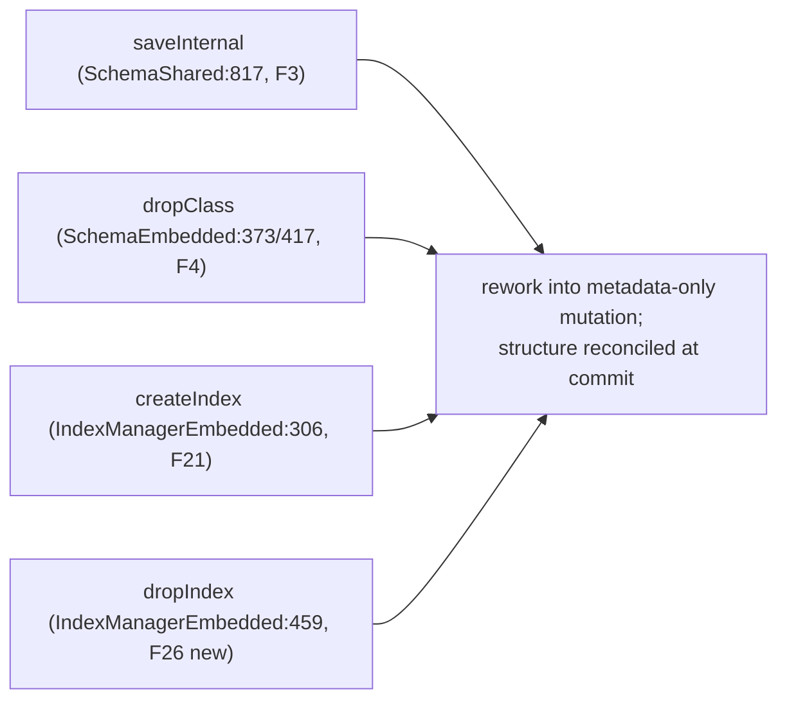
```mermaid
flowchart LR
  G3["saveInternal (SchemaShared:817, F3)"]
  G4["dropClass (SchemaEmbedded:373/417, F4)"]
  G21["createIndex (IndexManagerEmbedded:306, F21)"]
  G26["dropIndex (IndexManagerEmbedded:459, F26 new)"]
  G3 --> R["rework into metadata-only mutation;<br/>structure reconciled at commit"]
  G4 --> R
  G21 --> R
  G26 --> R
```

### F27 — Index engines are name-keyed; no first-class rename; drop+create costs in-tx acceleration plus a rebuild
No first-class index rename exists: there is no `ALTER INDEX … RENAME` and no
`renameIndex` API (only `IndexHistogramManager` matches "rename" in the index
package). Index engines resolve by name (`indexEngineNameMap`,
`AbstractStorage:6761`), and the physical B-tree files are named by the index
name: `new BTree<>(name, ".cbt", ".nbt", storage)`
(`BTreeSingleValueIndexEngine:80`), with a stable numeric engine id carried
alongside via `setEngineId(id)` (`:82`). A rename that kept the engine and
changed only the name would have to rename those files, which hits the
non-WAL-safe `writeCache.renameFile` path (F18). So D9's "rename = drop+create"
carries a cost the spine did not spell out: inside the renaming tx the new
index has `indexId == -1`, the planner skips it (D13), and queries fall back to
a correct full scan; acceleration returns only after commit rebuilds the engine
(D12, under the exclusive lock).

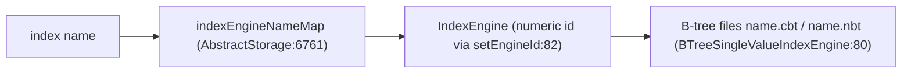
```mermaid
flowchart LR
  N["index name"] --> M["indexEngineNameMap (AbstractStorage:6761)"]
  M --> E["IndexEngine (numeric id via setEngineId:82)"]
  E --> F["B-tree files name.cbt / name.nbt (BTreeSingleValueIndexEngine:80)"]
```

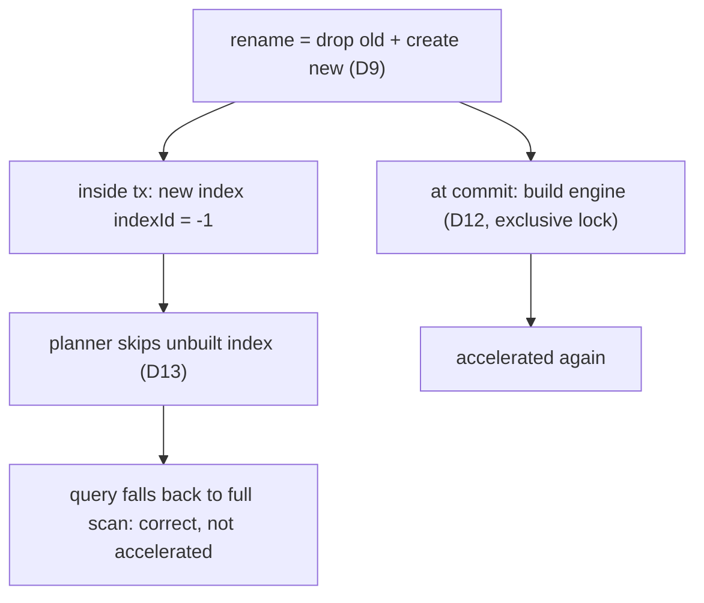
```mermaid
flowchart TD
  R["rename = drop old + create new (D9)"]
  R --> T["inside tx: new index indexId = -1"]
  T --> S["planner skips unbuilt index (D13)"]
  S --> Sc["query falls back to full scan: correct, not accelerated"]
  R --> C["at commit: build engine (D12, exclusive lock)"]
  C --> A["accelerated again"]
```

### F28 — Class rename orphans name-keyed index associations (pre-existing, orthogonal to transactionality)
Renaming a class breaks index-based acceleration today, before any
transactional work. `setNameInternal` (`SchemaClassEmbedded:303`) renames the
collection files but never touches indexes, and `changeClassName`
(`SchemaShared:452`) rekeys only the `classes` map. The planner resolves a
class's indexes through `classPropertyIndex.get(className)`
(`IndexManagerAbstract:99`), keyed by class name, and `IndexDefinition.className`
has no setter (set only at construction or `fromMap`: `PropertyIndexDefinition:49`,
`CompositeIndexDefinition:71`). After `Foo` becomes `Bar`,
`getClassRawIndexes("Bar")` returns nothing: the engine is intact but orphaned
from the class by name, so the planner stops selecting it. D9 calls collection
rename structurally inert and D11 decouples collection names, but neither covers
the class-name to index association. The transactional design must specify how a
class rename re-associates its indexes: re-key `classPropertyIndex` and update
each per-index definition's class name, or drop and recreate the indexes.

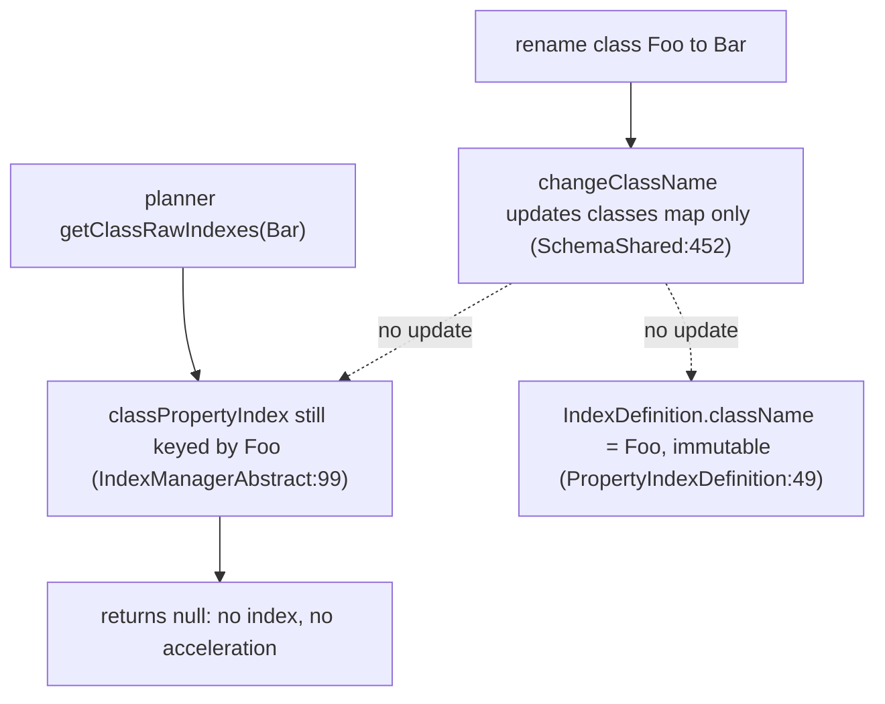
```mermaid
flowchart TD
  REN["rename class Foo to Bar"] --> CN["changeClassName updates classes map only (SchemaShared:452)"]
  CN -. no update .-> CPI["classPropertyIndex still keyed by Foo (IndexManagerAbstract:99)"]
  CN -. no update .-> DEF["IndexDefinition.className = Foo, immutable (PropertyIndexDefinition:49)"]
  PLAN["planner getClassRawIndexes(Bar)"] --> CPI
  CPI --> NUL["returns null: no index, no acceleration"]
```

### F29 — Stable-base-keyed engine files are feasible with no on-disk migration
Feasibility check for making index rename inert (Q11 / F28). Three facts make
it migration-free:

- **The engine config serializer is already extensible.** `CollectionBasedStorageConfiguration.deserializeIndexEngineProperty` (`:1559`)
  reads `indexId` only `if (getVersion(atomicOperation) >= 23 || binaryVersion >= 1)`
  (`:1589`), defaulting otherwise — the canonical version-gated optional-field
  pattern. It also carries an open `engineProperties` string map (`:1537`,
  `:1622`) that a new well-known key extends with no format-version bump.
- **The numeric engine id is already a stable, persisted key.** At reopen,
  `openIndexes` re-slots each engine at its persisted id
  (`indexEngines.set(engineData.getIndexId(), engine)`, `:989`), seeding the
  next-id counter past all persisted ids (`:968`). New ids are monotonic
  appends (`size()`, `:2786`); dropped slots are nulled but never reused. So
  `IndexEngineData.indexId` is load-order-independent.
- **The consumer surface is one seam.** Only `BTree.create` (`:192`–`:193`,
  data file via `getFullName()`, null file via `getName() + nullFileExtension`)
  and `IndexHistogramManager` (`.ixs`, `getFullName()` at `:1800`) turn the
  component name into a file name, both through `StorageComponent.fullName =
  name + extension` (`:96`; `setName` recomputes it, `:135`). Backup and
  export/import tools reference no index file names.

No file migration is needed because no rename path ever changed an index name
(F27/F28), so every legacy index's file name still equals its current logical
name. A persisted physical-file base therefore defaults to `name` for legacy
engines (matches the file on disk) and to the stable id for new engines.

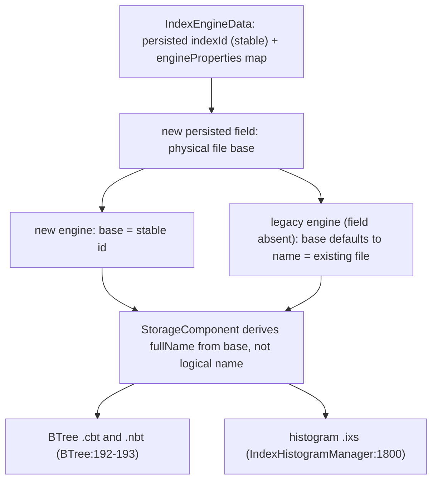
```mermaid
flowchart TD
  EP["IndexEngineData: persisted indexId (stable) + engineProperties map"]
  EP --> BASE["new persisted field: physical file base"]
  BASE --> NEW["new engine: base = stable id"]
  BASE --> LEG["legacy engine (field absent): base defaults to name = existing file"]
  NEW --> SC["StorageComponent derives fullName from base, not logical name"]
  LEG --> SC
  SC --> BT["BTree .cbt and .nbt (BTree:192-193)"]
  SC --> HM["histogram .ixs (IndexHistogramManager:1800)"]
```

### F30 — `IndexDefinition.className`: mutable, not a hash key, composites nest; planner resolves by className not by index name
Investigation of D16's `className` mutability point.

- **Already mutable, low-friction to update.** `className` is non-final
  (`PropertyIndexDefinition:42` protected, `CompositeIndexDefinition:54`
  private) and is rebound during deserialization (`fromMap`, `:218` / `:569`).
- **Never a hash key.** The only definition-holding map is
  `ImmutableSchema.indexes` (`:60`), keyed by index **name** with the
  definition as the value. So in-place `className` mutation cannot corrupt a
  hash bucket; `equals`/`hashCode` participation (`:107`/`:119`, `:439`/`:448`)
  matters only for value comparisons.
- **Composites nest.** `CompositeIndexDefinition` holds
  `List<IndexDefinition> indexDefinitions` (`:52`), each a property definition
  carrying its own `className`. A rename helper must recurse: update the
  composite's `className` plus every nested sub-definition's.
- **Persisted on the entity.** `className` rides `toMap`/`toJson`/`toStream`
  (`:207`, `:506`), so updating it and re-saving the per-index entity (naturally
  dirtied, D6/F20) propagates it.
- **The planner resolves by className, not by index name.**
  `SelectExecutionPlanner` reads `targetClass.getClassIndexesInternal()`
  (`:603`) which goes through `classPropertyIndex.get(className)`
  (`IndexManagerAbstract:99`). Nothing splits an index name on '.' to derive a
  class, and index names are caller-supplied (`SchemaClassImpl.createIndex(iName,
  …)`, `:923`), not engine-generated.

**Consequence — F28's correctness fix is metadata-only and does not require
D16.** On class rename, re-key `classPropertyIndex` (old to new class name) and
update each affected definition's `className` (recursing composites); the index
name and engine files need not change, because the planner never parses the
name. D16's base-keyed files are needed only to make an explicit index-**name**
rename inert (realigning an auto-named `Foo.prop` to `Bar.prop`, or a user
`ALTER INDEX RENAME`), which is cosmetic for correctness since names are not
parsed. So D16 is a capability choice, not a forced consequence of F28.

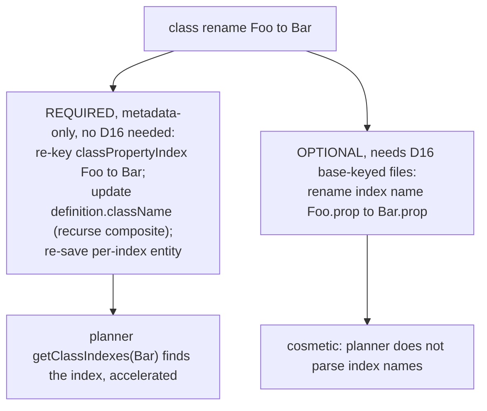
```mermaid
flowchart TD
  REN["class rename Foo to Bar"]
  REN --> REQ["REQUIRED, metadata-only, no D16 needed:<br/>re-key classPropertyIndex Foo to Bar;<br/>update definition.className (recurse composite);<br/>re-save per-index entity"]
  REQ --> OK["planner getClassIndexes(Bar) finds the index, accelerated"]
  REN --> OPT["OPTIONAL, needs D16 base-keyed files:<br/>rename index name Foo.prop to Bar.prop"]
  OPT --> COS["cosmetic: planner does not parse index names"]
```

### F31 — Genesis bootstrap relies on per-op self-commit and no active tx; D1/D7 force it into explicit transactions
The internal-class bootstrap runs inside `createMetadata`
(`DatabaseSessionEmbedded:441`) during session create: `metadata.init` then
`shared.create(this)`, which drives `SecurityShared.create` (`:594`) and the
sibling subsystem creators. `SecurityShared.create` builds the
Identity/OSecurityPolicy/ORole/OUser classes plus the `OUser.name` UNIQUE index
through the normal schema API (`createClass`/`createProperty`/`createIndex`,
inside the helpers — `createClass("OUser", …)` `:883`, the `OUser.name` index
`:899`; `SecurityShared.create` at `:593`), **then** inserts the default roles
and admin/reader/writer users
in `session.executeInTx` blocks (`createDefaultRoles:628`, `createDefaultUsers`).

The class-creation phase runs with **no active tx** — it cannot have one,
because `createIndex` forbids it (F21), and the per-op self-commit
(`saveInternal`, F2/F3) is what materializes each class/collection/index before
the next step. The data-insert phase is a separate tx that runs only after the
classes are already committed. So genesis today is "auto-committing schema ops,
then a data tx."

Interaction with D1/D7/D8:

- **The bootstrap must become tx-aware.** D1 removes per-op self-commit and the
  guards (F3/F4/F21/F26), so `createClass`/`createIndex` at genesis no longer
  materialize a collection or engine until a commit. `SecurityShared.create`
  (and any sibling metadata creators) must wrap schema creation in an explicit
  tx. The session is already active at genesis (`executeInTx` is used there
  today, `:629`), so a tx is available.
- **D7 does not contend at genesis.** Genesis is single-threaded (one creating
  session), so the metadata-write mutex is acquired and released without
  blocking. Its only requirement is that it exists at context-construction time
  (D7 places it on the shared context/storage, built before `createMetadata`),
  not created lazily by a schema op.
- **The tx-local `SchemaShared` seed (D8) must handle the empty/genesis case.**
  The first-ever schema-tx seeds from an empty committed schema and its commit
  writes the first schema record (D14); there is no committed schema to copy.
- **Schema-then-data works in one tx via D3/D2.** Create the class
  (provisional collection id), insert the admin user (temp RID), and the commit
  reconciles structure before record-position allocation (D3), builds the
  `OUser.name` index on the genesis rows (D12), and enforces uniqueness at
  commit-apply (D13). Reads during genesis (a user-exists check) fall back to
  the tx-merged scan because the index is not built yet (D13/F23) — correct.
- **D11 touches the same code.** Internal classes get `minimumCollections = 1`
  and name-prefixed collection names `ouser_<n>` (`SchemaEmbedded:335`–`:342`);
  D11's counter-only naming applies here too.

Net: D7 is benign at genesis; the real work is restructuring the genesis
bootstrap into explicit transaction(s) once per-op self-commit and the tx
guards are removed. Sub-choice resolved by D18: a schema tx committed before
the data tx (two-phase), chosen over a unified genesis tx so the `OUser.name`
index is built before any user insert.

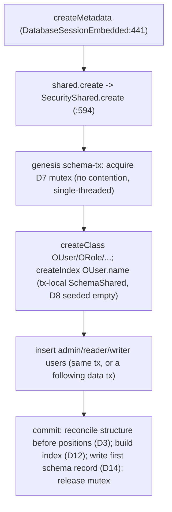
```mermaid
flowchart TD
  CM["createMetadata (DatabaseSessionEmbedded:441)"] --> SC["shared.create -> SecurityShared.create (:594)"]
  SC --> TX["genesis schema-tx: acquire D7 mutex (no contention, single-threaded)"]
  TX --> CL["createClass OUser/ORole/...; createIndex OUser.name (tx-local SchemaShared, D8 seeded empty)"]
  CL --> DATA["insert admin/reader/writer users (same tx, or a following data tx)"]
  DATA --> COMMIT["commit: reconcile structure before positions (D3); build index (D12); write first schema record (D14); release mutex"]
```

### F32 — ClassIndexManager enqueues through an engine-agnostic path; a same-tx engine-less index behaves identically to a built one
On every record write, `ClassIndexManager` resolves the entity's class indexes
via `cls.getRawIndexes()` (`:58`, `:78`, `:421`) and, for each, computes the key
and calls `index.put` / `index.remove` (`addIndexEntry:396`, `addPut:455`).
`IndexOneValue.put` (`:527`) validates the value RID, collates the key, and
calls `transaction.addIndexEntry(this, getName(), PUT, key, rid)` (`:539`): it
records the change in the per-tx `FrontendTransactionIndexChanges`, keyed by
index **name**, and never reads `indexId` or the engine. `IndexUnique` does not
override `put`; it overrides `doPut` (`:52`, the commit-apply path
`storage.validatedPutIndexValue(indexId, …, uniqueValidator, …)`) and
`interpretTxKeyChanges` (`:67`). So uniqueness is enforced at commit-apply,
after the engine exists, and a same-tx put/remove on one key is collapsed first
(`IndexAbstract:747`–`753`), not at enqueue time.

Consequence for a newly-created index with no engine (`indexId == -1`):

- **Writes during the tx are identical to a built index.** The enqueue path is
  engine-agnostic, so tracking entries for a brand-new index never touches the
  missing engine. This confirms F20 from the `ClassIndexManager` side.
- **Uniqueness is deferred to commit-apply.** A UNIQUE new index enqueues
  cleanly; the duplicate check runs at commit via `UniqueIndexEngineValidator`
  once the engine is built (D12).
- **Load-bearing prerequisite (D15).** `ClassIndexManager` only enqueues for
  indexes that `cls.getRawIndexes()` returns, so the D15 overlay must surface
  the tx-created index into that set. If it does not, the tx's own inserts into
  the new index are silently untracked, and the commit-time build scan (which
  covers only already-committed rows, D12) would miss them — a silent
  data-correctness bug, not a loud failure. This is the same coupling D15
  flagged (`getRawClassIndexes` → `getClassRawIndexes`), seen from the write
  side.
- **Writes versus reads.** Writes are always safe (pure enqueue). A direct read
  of the new index during the tx (`getRidsIgnoreTx` → `storage.getIndexValues(indexId,
  …)`, `IndexOneValue:91`) still throws on `indexId == -1` (F23); the planner
  avoids it by skipping unbuilt indexes (D13), which is exactly why genesis is
  two-phase (D18) for the `OUser.name` direct lookup.

**Timing corrected by F66 (2026-06-10): "on every record write" is wrong.** The
translation is batched: record operations accumulate in
`operationsBetweenCallbacks` and `ClassIndexManager` runs at exactly two
points — the outermost commit (`FrontendTransactionImpl.commitInternalImpl:232`,
where it sees the final overlay set, so the engine-agnostic conclusions above
hold) and **every `deleteRecord`** (`:483`), which drains the whole queue early
against the index set of that moment; drained operations are not re-translated
at commit (`:775`). A tx-created index therefore misses entries for every
operation drained before its `createIndex` — the F66 corruption. The F66
re-derivation invariant (D12) is what restores this entry's "identical to a
built index" conclusion for the early-flush shapes.

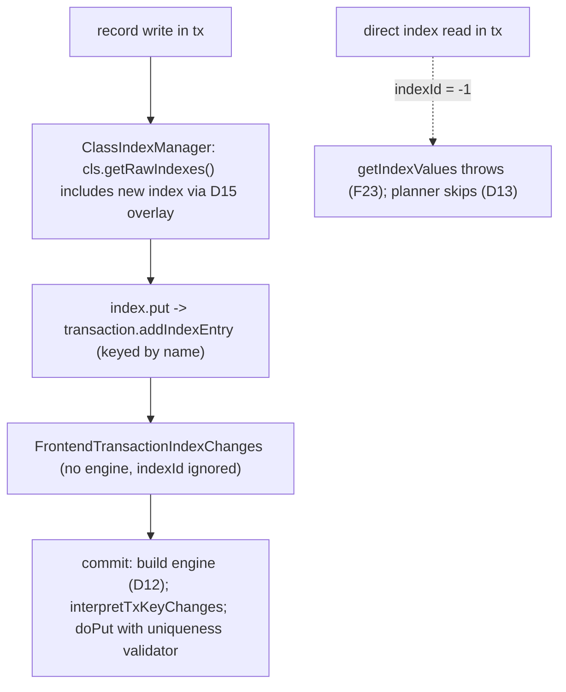
```mermaid
flowchart TD
  W["record write in tx"] --> CIM["ClassIndexManager: cls.getRawIndexes() includes new index via D15 overlay"]
  CIM --> PUT["index.put -> transaction.addIndexEntry (keyed by name)"]
  PUT --> TRK["FrontendTransactionIndexChanges (no engine, indexId ignored)"]
  TRK --> CM["commit: build engine (D12); interpretTxKeyChanges; doPut with uniqueness validator"]
  RD["direct index read in tx"] -. indexId = -1 .-> THR["getIndexValues throws (F23); planner skips (D13)"]
```

## 2a. Adversarial review findings (2026-06-03)

An adversarial sub-agent attacked the spine for contradictions, ungrounded
claims, and gaps. F33 and F35 were re-verified against live code; the rest are
logically grounded in the cited entries. A second pass (2026-06-03, same day)
targeted this session's less-reviewed additions (D16–D19, F26–F38) and added
F39–F44, all re-verified against live code. A third pass (2026-06-04) targeted the
interaction seams between D8/F41 (tx-local seed), D14 (per-class records), and D15
(index overlay), adding F45–F47, all PSI-verified against live code. A performance pass
(2026-06-04) assessed the 400-class / 4,000-index batch workload against the design, adding
F48–F51 (concentration costs and one F35 implementation invariant), with quantities
code-grounded. A fifth pass (2026-06-10, two parallel sub-agents: a concurrency lens and a
durability/crash-safety lens) attacked the lock architecture, the commit-failure path, and
the WAL replay machinery, adding F52–F63 (all code-verified, symbol claims PSI-verified;
the convergent pairs C2+U5 and C3+U6 from the two reports each fold into one entry). Full
agent reports with the failed-attack lists: `adversarial-pass5-concurrency.md` and
`adversarial-pass5-durability.md`. A sixth pass (2026-06-10, same two lenses, fresh
agents primed with the pass-5 failed-attack lists) targeted the seams the pass-5
resolutions created or moved — and two pre-existing machinery areas no pass had walked:
the session-layer commit phase (index-entry enqueue, listener dispatch) and the
file-id recycle branch. It added F64–F75 (reports:
`adversarial-pass6-concurrency.md` / `adversarial-pass6-durability.md`; the pass-5 fixes
themselves largely held — the F53/F58/F62 commit sequence is crash-consistent at every
boundary, and the F55 lazy consult survived its direct attacks). Resolutions for F64–F75
are proposed inside each entry and settle one by one in the fix discussion.

**Pass-5 resolutions (settled 2026-06-10):** F52 → D7/D8/D19 (third lock in the ordering
proof — D7 mutex → `SchemaShared.lock` → `stateLock`; the schema-carrying commit acquires
the schema write lock before `stateLock` and holds it through promotion plus the trailing
`forceSnapshot`; snapshot-first conversions of `createVertexWithClass` and
`getLowerSubclass` folded into scope as contention mitigations); F53 → D3/D10/D13/D15
(option (a) — commit-local resolution: registry publication deferred to the
post-`commitChanges` success path; commit steps read commit-local references, PSI audit of
registry read sites is the first implementation step); F54 → D3/D12/D19 (lock-free
population scan + `doPut` on the commit's atomic operation; zero additional WAL units;
`isEmpty(atomicOperation)` probes); F56 → D7 (mutex engages at the proxy/routing layer,
before any shared metadata lock); F57 → D12/F48 (v1 eager build scoped to empty classes /
bounded population, populated-class builds → YTDB-1064; recovery heap = forward heap;
boundary behavior — reject vs accept-with-envelope — settles in Phase 1); F58 → D2/D8
(reconcile → patch record properties → serialize in `commitEntry`; diff from in-memory
structures, never pre-serialized bytes); F59 → D14 (root-record dirtiness rule via
root-entity property sets); F60 → D15/D17 (replacement-object publication via CHM put,
no in-place field writes on shared definitions); F61 → D7 (mutex release on
session-close/reap + timed/interruptible acquire); F62 → D8/D15 (single trailing
`forceSnapshot` after both publications, inside the F52 lock scope); F63 → D20 (export
manifest + import verification, not-in-service-until-verified — manifest write discipline
extended by F75); F55 → F16/D10 (option 3
— lazy consult in `restoreAtomicUnit`: a missing-file page record consults the buffered
unit's pending `FileCreatedWALRecord`s and materializes the file early; prerequisite
track + kill-mid-physical-phase recovery test; standalone issue YTDB-1099 for the
pre-existing `develop` hole). **All pass-5 findings are resolved.**

**Pass-6 resolutions (settling one by one):** F64 → D7/D15/D19 (accepted 2026-06-10:
four-lock order — D7 mutex → `SchemaShared.lock` → `IndexManagerEmbedded.lock` →
`stateLock`; overlay publication under the held index write lock; uniform sequence for
index-only txs); F65 → D7/D8 (accepted 2026-06-10, three tiers: snapshot reads untouched;
captured-delegate fast path outside schema txs; per-call name re-resolution against the
tx-local write-view during the session's schema tx, with mutex engage on the first
write-routed proxy call; impl-typed arguments always re-resolved by name); F66 → D12/F32
(accepted 2026-06-10: commit-time re-derivation of tx-created indexes' entries from the
tx's complete record-operation set; pre-existing indexes keep the incremental path;
F32's "on every record write" timing model corrected); F67 → D16 (accepted 2026-06-10,
option (b): the stable-base-keyed engine-files half of D16 pulled into v1 with
unconditional id-keyed bases — no legacy engines can exist under D20 — dissolving the
same-name collision; rename feature stays in YTDB-1066); F68 → D8 (accepted 2026-06-10:
promotion = re-parse of changed per-class records into the existing shared instances,
`owner` stays `final`, never adopt tx-local objects); F69 → D8/D15 (accepted 2026-06-10:
commit fires `onSchemaUpdate`/`onIndexManagerUpdate` after lock release; D19
schema-carrying signal replaces the dead root-record dispatch check). F70–F75 pending.

**Resolutions:** F33 → D19; F34 → D3 (ordering fixed); F35 → D15 (snapshot-rebuild
invariant added); F36 → F31 (re-cited); F37 → D6 (link-set cross-ref added);
F38 → D7 (same-thread guard added); F39 → D3/D19 (lock-free inner engine
primitives extracted; reconciliation never calls the public write-lock-taking
methods); F40 → D15/D17 (rename-mutation third category; commit-only
re-association); F41 → D8 (tx-local seed pinned to fromStream re-parse);
F42 → D2/D9 (provisional ids must split the `collectionId < 0` predicate;
re-key the reverse map at commit); F43 → D6/D9 (structural diff is D9's set
difference over in-memory structures; D6 scoped to which records to write);
F44 → D7/D19 (dual engage-point at acquireSchemaWriteLock + acquireExclusiveLock;
index-only txs bypass the schema chokepoint); F45 → D8/D14 (the tx-local seed must
carry each existing class's committed per-class record RID; new classes allocate at
commit); F46 → D15/D7 (collection-membership is an in-place index-mutation category;
`addCollectionToIndex`/`removeCollectionFromIndex` are the fifth/sixth self-commit
guards; commit-only via the overlay); F47 → D7/D8 (the changed-class-set hook is one
lock level above the mutex engage-point; the ripple is lock-free, so it does not pollute
the set).

### F33 — D1's read→write `stateLock` upgrade is impossible; `ScalableRWLock` is non-reentrant with writer preference [BLOCKER]
D1 says a schema-carrying commit "upgrades from the shared `stateLock` read lock
to an exclusive write lock." `stateLock` is a `ScalableRWLock`
(`AbstractStorage:341`), documented "Not Reentrant" and "Has Writer-Preference"
(`ScalableRWLock.java:64`–`65`), exposing only separate `readLock()` /
`writeLock()` views plus `sharedLock` / `exclusiveLock` — no upgrade or
`tryConvert` primitive. The commit holds `stateLock.readLock()` from `:2285`
through the whole body including `commitIndexes` (`:2375`); `addCollection`
(`:1444`) and `addIndexEngine` (`:2752`) each independently take
`stateLock.writeLock()`. On a non-reentrant, writer-preferring RW lock a thread
holding the read lock cannot acquire the write lock — it self-deadlocks
(writer-preference parks the upgrade while blocking new readers behind it). So
D1's "upgrade" is not supported; F22 already half-admitted this ("read-lock-at-
commit vs write-lock-in-`addIndexEngine` nesting reconciled. Mechanical but
non-trivial."), contradicting D1's clean framing and D7's deadlock proof (which
never accounts for the read lock already held). Resolution required: Q12.

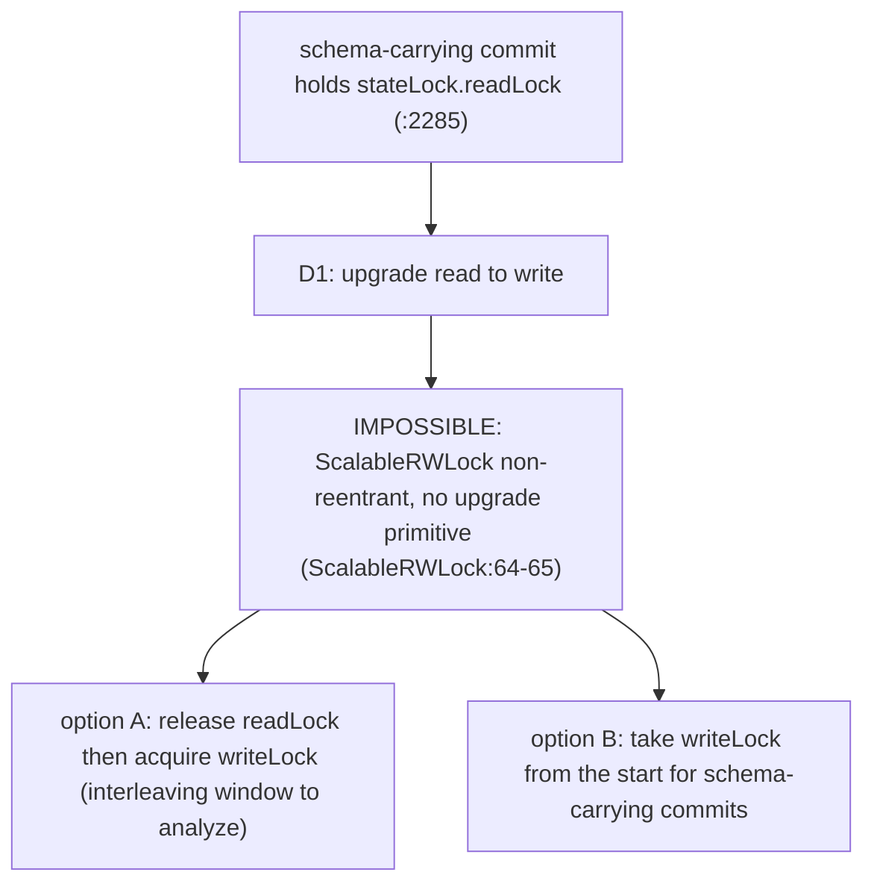
```mermaid
flowchart TD
  C["schema-carrying commit holds stateLock.readLock (:2285)"]
  C --> U["D1: upgrade read to write"]
  U --> X["IMPOSSIBLE: ScalableRWLock non-reentrant, no upgrade primitive (ScalableRWLock:64-65)"]
  X --> A1["option A: release readLock then acquire writeLock (interleaving window to analyze)"]
  X --> A2["option B: take writeLock from the start for schema-carrying commits"]
```

### F34 — D3 and D12 disagree on where engine creation lands in the commit; D3's point is after `lockIndexes` [MAJOR]
D3 places structural reconciliation "before the record-position-allocation loop
(`:2300+`)." But `lockIndexes` is at `:2297`, before the allocation loop at
`:2300`, and F21/D12 both require a new index's engine to exist before
`lockIndexes` (it resolves engines by `indexId` and throws on `-1`). So "before
the allocation loop" does not guarantee "before `lockIndexes`," and an
implementer following D3 literally would create engines too late and hit
`InvalidIndexEngineIdException` (F23). D12 pins the correct order. Fix: D3 must
say index-engine creation lands before `lockIndexes` (`:2297`) and collection
creation before the allocation loop (`:2300`).

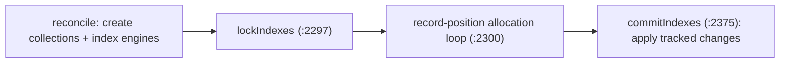
```mermaid
flowchart LR
  REC["reconcile: create collections + index engines"] --> LI["lockIndexes (:2297)"]
  LI --> ALLOC["record-position allocation loop (:2300)"]
  ALLOC --> CI["commitIndexes (:2375): apply tracked changes"]
```

### F35 — The write-path overlay (F32/D15) reads a once-materialized cached index set, so routing the index manager is necessary but not sufficient [MAJOR]
`ClassIndexManager` calls the no-arg `SchemaImmutableClass.getRawIndexes()`
(`:58`/`:78`/`:421`), which returns the cached field `this.indexes`
(`SchemaImmutableClass:636`), materialized once at snapshot `init` (`:165`) via
the session-routed `getRawIndexes(session, …)` → `getRawClassIndexes`
(`:654`/`:670`); the snapshot is cached in `SchemaShared.snapshot` until
`forceSnapshot` (`SchemaShared:194`–`216`). So D15's "route the index manager"
surfaces a tx-created index only if the tx-local snapshot is built after the
overlay exists AND rebuilt after every mid-tx `createIndex`/`dropIndex`. Without
that, the write path reads a stale cached set and the tx's own inserts into the
new index are silently untracked — the exact silent-corruption failure F32
names. New invariant for D15: force a tx-local snapshot rebuild on every overlay
mutation within a schema-tx. (Class rename is commit-only, F40, so it is not an
overlay mutation and needs no mid-tx rebuild.) The concrete site is
`IndexManagerEmbedded.releaseExclusiveLock` (`:201`–`:208`), which today calls
`schema.forceSnapshot()` to invalidate the *shared* snapshot on every index
create/drop (via `SchemaShared.snapshotLock`, not the mutation lock — F44); under
the tx model it must become tx-aware — invalidate the *tx-local* snapshot during
the tx, the shared one only at commit. The invalidation must be **lazy** (null the
tx-local snapshot, rebuild on the next read, today's `forceSnapshot` O(1) shape), not an
eager reconstruction per createIndex — an eager rebuild is O(N²) for a 4,000-index batch
(F51). A single-column `createIndex` reads no snapshot (F51/Q3), so a pure-DDL batch
triggers no mid-batch rebuild; composite indexes and data-interleaved batches do carry the
rebuild cost.

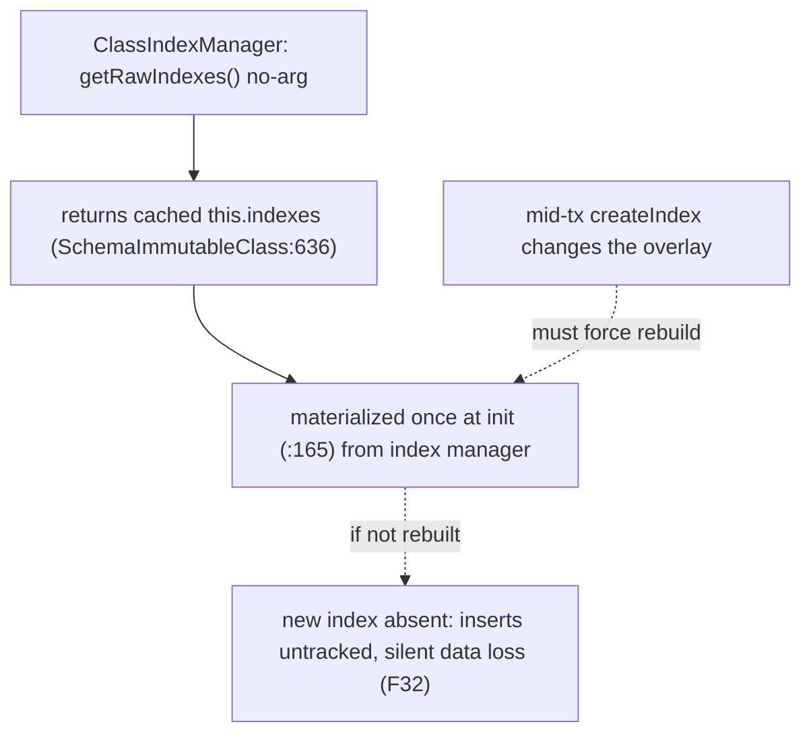
```mermaid
flowchart TD
  CIM["ClassIndexManager: getRawIndexes() no-arg"] --> CACHE["returns cached this.indexes (SchemaImmutableClass:636)"]
  CACHE --> MAT["materialized once at init (:165) from index manager"]
  OV["mid-tx createIndex changes the overlay"] -. must force rebuild .-> MAT
  MAT -. if not rebuilt .-> BUG["new index absent: inserts untracked, silent data loss (F32)"]
```

### F36 — F31's `:602`–`:612` citation points at helper dispatches, not the schema-API calls [MINOR]
F31 cites `:602`–`:612` for `createClass`/`createProperty`/`createIndex`, but
those lines hold the helper dispatches (`createOrUpdateO{SecurityPolicy,Role,User}Class`);
the actual calls live inside the helpers (`createClass("OUser", …)` `:883`, the
`OUser.name` index `:899`), and `SecurityShared.create` starts at `:593` (the
log says `:594`). The substantive conclusion (class creation runs with no active
tx; data insert is a separate `executeInTx` at `:628`) holds. Re-cite to
`:883`/`:899`/`:628`.

### F37 — D6/D9 frame the diff as per-property, but a class DROP has no per-class change to inspect [MINOR]
D6 derives the create/drop set from `EntityImpl` per-property dirty tracking
over changed records; D9 defines drop as "collection ids in old absent from
new." But a dropped class's record is deleted (D14), so it produces no per-class
property change — the only signal is the schema-record link-set losing the link
(D14). So the diff cannot be purely per-class; it must also read the
schema-record link-set delta to detect drops. D6/D9 should state this
cross-reference to D14, or an implementer could build a diff that detects
creates and edits but silently misses drops.

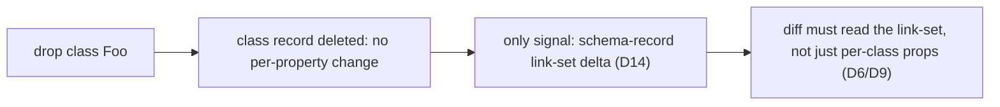
```mermaid
flowchart LR
  DROP["drop class Foo"] --> NOREC["class record deleted: no per-property change"]
  NOREC --> LINK["only signal: schema-record link-set delta (D14)"]
  LINK --> DIFF["diff must read the link-set, not just per-class props (D6/D9)"]
```

### F38 — D7's `finally`-release assumes same-thread; a migrated session throws `IllegalMonitorStateException` [MINOR]
F13 notes a session re-activated on a different thread mid-tx "strands" the
metadata-write mutex; in fact a `ReentrantLock` released in `commit`/`rollback`'s
`finally` on a different thread than acquired throws
`IllegalMonitorStateException`, masking the original outcome. D7 relies on the
same-thread assumption (F13) without a guard. Add an assertion that the
releasing thread equals the acquiring thread, or scope session migration
mid-schema-tx out as a Non-Goal.

### F39 — Engine create/delete have no lock-free inner primitive; D19's held write lock self-deadlocks the public methods [BLOCKER]
D19 has a schema-carrying commit hold `stateLock.writeLock()` from the start, but
the structural primitives reconciliation must call during the commit each
re-acquire the same non-reentrant lock. `addIndexEngine` (`AbstractStorage:2738`)
takes `stateLock.writeLock()` (`:2752`) and inlines the whole
`calculateInsideAtomicOperation` engine-create body inside it (`:2752`–`:2826`);
`deleteIndexEngine` (`:3031`) does the same (`:3036`–`:3064`). `ScalableRWLock` is
"Not Reentrant" (`ScalableRWLock:64`), so re-acquiring `writeLock()` while holding
it self-deadlocks — the same failure mode F33 named, relocated from the upgrade to
the nested call. No `doAddIndexEngine`/`doDeleteIndexEngine` lock-free variant
exists (grep: none), and today's `commit()` body (`:2192`–`:2432`) never calls
these methods — it only calls `lockIndexes` (`:2297`) and `commitIndexes`
(`:2455`), so the new design must add engine create/delete to the commit window
before `lockIndexes` (D3/F34), exactly where D19 already holds the write lock.

Collections do not have this problem: public `addCollection` (`:1441`) delegates
to a lock-free `doAddCollection(atomicOperation, …)` (`:5002`) and `dropCollection`
to `dropCollectionInternal(atomicOperation, …)` (`:5094`) (F8). Engines were never
refactored that way, so the spine's "build the engine at commit" (D12/D15/D18)
silently assumes a seam that does not exist.

Resolution (D3/D19): extract lock-free `doAddIndexEngine(atomicOperation, …)` and
`doDeleteIndexEngine(atomicOperation, …)` from the public bodies, leaving the
public methods as `writeLock + doX`. Commit reconciliation calls the
`doX(atomicOperation, …)` primitives plus the existing
`doAddCollection`/`dropCollectionInternal`, never the public write-lock-taking
methods.

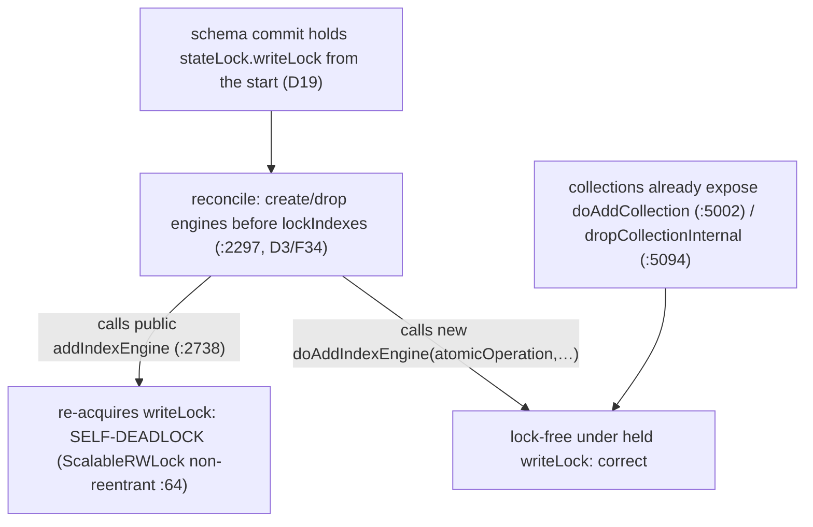
```mermaid
flowchart TD
  C["schema commit holds stateLock.writeLock from the start (D19)"]
  C --> REC["reconcile: create/drop engines before lockIndexes (:2297, D3/F34)"]
  REC -- "calls public addIndexEngine (:2738)" --> X["re-acquires writeLock: SELF-DEADLOCK (ScalableRWLock non-reentrant :64)"]
  REC -- "calls new doAddIndexEngine(atomicOperation,…)" --> OK["lock-free under held writeLock: correct"]
  CO["collections already expose doAddCollection (:5002) / dropCollectionInternal (:5094)"] --> OK
```

### F40 — D15's overlay and F35's rebuild trigger enumerate create/drop only; D17's class rename is a third category they miss [MAJOR]
D15 models the tx-local index view as committed + tx-created − tx-dropped, and F35
forces a tx-local snapshot rebuild "on every mid-tx createIndex/dropIndex." D17's
class-rename re-association is neither create nor drop: it mutates a committed
index in place — re-keys `classPropertyIndex` (old→new class) and sets
`IndexDefinition.className` (recursing composites, F30) on an index that already
exists. Two gaps fall out:

- **Vocabulary.** D15's overlay has no slot for an in-place definition mutation
  and explicitly does not copy `Index` objects (thin handles, F25), so "the
  changed-index set drives the commit" needs the rename-only category defined or
  the commit never writes the re-keyed association.
- **Visibility + isolation, unstated.** The log never says whether D17
  re-association is visible inside the renaming tx or applied only at commit.
  Tx-local visibility would mutate `className` on the shared committed `Index`
  object — leaking the uncommitted rename to other sessions (D4 violation) — and
  would force F35's trigger set to add the rename case. Commit-only re-association
  has no such hazard: the className mutation lands at commit under D19's write
  lock, and the renaming tx falls back to a correct unaccelerated scan for the
  renamed class (the staleness D17 already accepts).

Resolution (D15/D17): adopt commit-only re-association for v1. D17 states it; D15
adds rename-only mutation as an explicit third category in the changed-index set;
F35's create/drop-only rebuild trigger stays correct because rename is not
tx-locally visible.

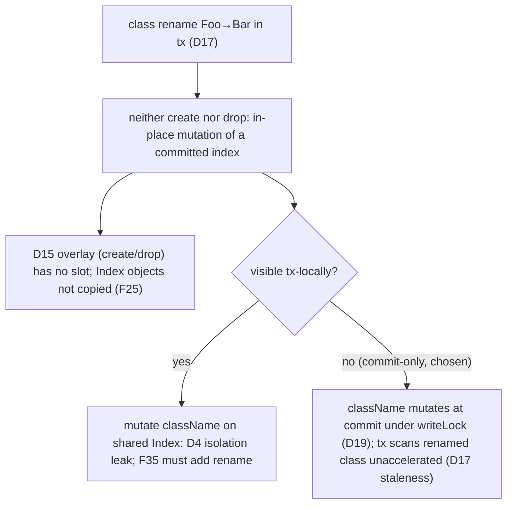
```mermaid
flowchart TD
  REN["class rename Foo→Bar in tx (D17)"] --> CAT["neither create nor drop: in-place mutation of a committed index"]
  CAT --> D15X["D15 overlay (create/drop) has no slot; Index objects not copied (F25)"]
  CAT --> VIS{"visible tx-locally?"}
  VIS -- "yes" --> LEAK["mutate className on shared Index: D4 isolation leak; F35 must add rename"]
  VIS -- "no (commit-only, chosen)" --> SAFE["className mutates at commit under writeLock (D19); tx scans renamed class unaccelerated (D17 staleness)"]
```

### F41 — D8's tx-local seed is load-bearing, not a free planning choice: only fromStream re-parse binds owner + graph into the copy [MAJOR]
D8 frames the tx-local `SchemaShared` seed as "deep-copy vs fromStream re-parse —
planning picks," a non-blocker. But "derived state maintained for free by the
existing mutation methods" holds only when every copied class is a fresh object
bound to the tx-local owner, and the code makes that contingent on the seed
mechanism:

- **`SchemaClassImpl.owner` is `final`** (`:72`), set only in the constructor
  (`:89`/`:108`) — no setter. A field-level deep clone cannot rebind it.
- **`superClasses`/`subclasses` are `List<SchemaClassImpl>` object references**
  (`:78`/`:80`); the polymorphic ripple walks them (`SchemaClassEmbedded:644`
  recurses `superClass.addPolymorphicCollectionId`; `SchemaClassImpl:681` walks
  `superClasses`).
- **The mutation methods the ripple rides reach through `owner`:**
  `owner.acquireSchemaWriteLock(session)` (`:1169`), `owner.getClass(name)`
  (`:268`/`:830`), `owner.checkEmbedded(session)` (`:1182`).

A naive deep-copy that shares or field-copies references leaves `owner` and the
superclass/subclass refs pointing at the **committed** `SchemaShared`. Then every
tx-local schema mutation (a) acquires the **shared** schema write lock —
serializing all sessions and defeating D5/D8's low-contention isolation premise —
and (b) ripples `polymorphicCollectionIds` into the **committed** class objects, a
direct D4 isolation violation and shared-state corruption, the opposite of "free."

`fromStream` re-parse avoids this for free: `createClassInstance` constructs
`new SchemaClassEmbedded(this, …)` (`SchemaEmbedded:217`/`:478`) bound to the
tx-local `SchemaShared`, and `fromStream` (`SchemaShared:487`) rebuilds the whole
graph (owner, superClasses, subclasses) inside the copy. There is no
copy-constructor or clone on `SchemaShared` today (only the no-arg `SchemaShared()`,
`:116`), so "deep-copy" would have to reimplement that reconstruction regardless.

Resolution (D8): pin the seed to `fromStream` re-parse (or an equivalent
fresh-object reconstruction that rebinds `owner` and re-wires the class graph). The
seed mechanism is load-bearing for correctness and isolation, not a free planning
choice.

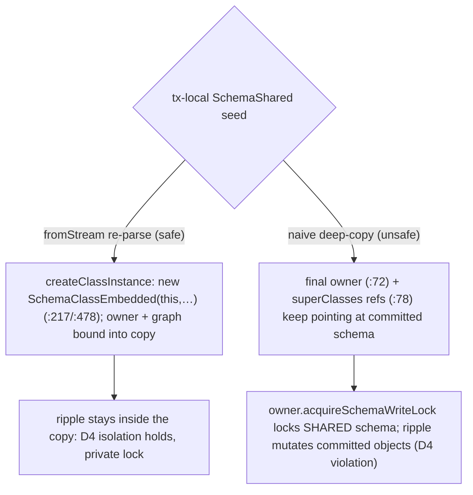
```mermaid
flowchart TD
  SEED{"tx-local SchemaShared seed"}
  SEED -- "fromStream re-parse (safe)" --> FRESH["createClassInstance: new SchemaClassEmbedded(this,…) (:217/:478); owner + graph bound into copy"]
  FRESH --> FREE["ripple stays inside the copy: D4 isolation holds, private lock"]
  SEED -- "naive deep-copy (unsafe)" --> SHARE["final owner (:72) + superClasses refs (:78) keep pointing at committed schema"]
  SHARE --> CORRUPT["owner.acquireSchemaWriteLock locks SHARED schema; ripple mutates committed objects (D4 violation)"]
```

### F42 — Provisional negative collection ids collide with the pervasive `collectionId < 0` convention; the record→class resolver skips them [BLOCKER]
D2 gives a new collection a "provisional (sentinel/negative) collection ID …
mirror[ing] temp RIDs," and D9 constrains it only to be "disjoint from -1." But
the negative-collection-id space is not free: the schema layer tests
`collectionId < 0` (not `== -1`) and treats every negative as "no physical
collection — skip." Representative sites: `SchemaShared.addCollectionClassMap:871`
and `SchemaEmbedded.removeCollectionClassMap:506` (skip the reverse map),
`SchemaEmbedded.checkCollectionsAreAbsent:355` and `addCollectionForClass:522`
(skip uniqueness/assignment), `SchemaShared.checkCollectionCanBeAdded:317` (skip
blob-collision), `SchemaClassImpl.renameCollection:1397` (skip file rename), plus
storage bounds checks `collectionId < 0 || >= collections.size()`
(`AbstractStorage:1526/:1570/:3793/:5456`). A provisional id of -2 is disjoint
from -1 yet caught by every one.

The load-bearing collision is the record→class resolver.
`getClassByCollectionId(collectionId)` returns `collectionsToClasses.get(...)`
(`SchemaShared:341`, `ImmutableSchema:285`), and that map skips negatives on
population (`addCollectionClassMap:871`). It is called from the record read/write
path on `rid.getCollectionId()` — `DatabaseSessionEmbedded:2035`/`:2065`/`:3360`/
`:3455`, `EdgeEntityImpl:79`/`:110`, `JSONSerializerJackson:513`,
`GremlinResultMapper:89`. So a record the tx inserts into its new (provisional)
collection cannot resolve back to its class during the tx:
`getClassByCollectionId(provisionalId)` is `null`, and the callers NPE or
mis-handle. D9's "disjoint from -1" is necessary but nowhere near sufficient.

The storage-side `< 0` bounds checks are safe — provisional ids never reach
storage mid-tx (D1/D4) and are resolved to real ids before D3's reconciliation —
but the in-memory schema maps are not. (One exception, found in the third pass: the
index collection-membership ripple calls `getCollectionNameById(provisionalId)` mid-tx,
which the `< 0` guard answers with `null` rather than a resolution — see F46. F46's
commit-only deferral of the membership mutation is what keeps "never reaches storage
mid-tx" true.)

Resolution (D2/D9): split the `collectionId < 0` predicate three ways at the
in-memory schema-map sites — abstract (`== -1`, skip), provisional (`<= -2`, treat
as a pending real collection: populate `collectionsToClasses`, validate
uniqueness), real (`>= 0`, today's path) — so the tx-local record→class resolver
works for new-collection records. At commit, the provisional→real resolution (D2)
must also re-key `collectionsToClasses` provisional→real; D2's patch list (class
id-list + record RIDs) currently omits the reverse map. File-op and storage-bounds
sites keep rejecting negatives (a provisional collection has no files and never
reaches storage until resolved).

A further collision site sits in the commit itself: the pre-position pass tests
`collectionId == COLLECTION_ID_INVALID` (`AbstractStorage:2269`) to route a record
to its class's default collection via `getCollectionForNewInstance`. A provisional
id of `-1` would be mis-routed there; a provisional id ≤ `-2` skips that branch and
falls through to `doGetAndCheckCollection(negative)` (`:2279`), which throws. So the
provisional→real resolution slots into the existing `collectionOverrides` seam
(`:2239` declared, `:2276` populated, `:2317` read) — after D3 creates the new
collection, populate `collectionOverrides` with the new real id for records carrying
the provisional id, before the position loop dereferences it (`:2321`). Downstream
index entries then resolve for free (F24, verified).

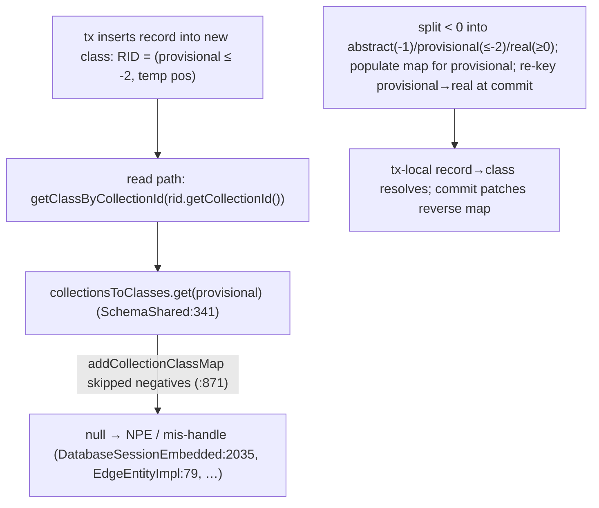
```mermaid
flowchart TD
  INS["tx inserts record into new class: RID = (provisional ≤ -2, temp pos)"]
  INS --> RES["read path: getClassByCollectionId(rid.getCollectionId())"]
  RES --> MAP["collectionsToClasses.get(provisional) (SchemaShared:341)"]
  MAP -- "addCollectionClassMap skipped negatives (:871)" --> NUL["null → NPE / mis-handle (DatabaseSessionEmbedded:2035, EdgeEntityImpl:79, …)"]
  FIX["split < 0 into abstract(-1)/provisional(≤-2)/real(≥0); populate map for provisional; re-key provisional→real at commit"] --> OK["tx-local record→class resolves; commit patches reverse map"]
```

### F43 — D6 (per-property record diff) and D9 (collection-id set difference) describe the diff at two levels; the drop path forces D9's in-memory set difference [MAJOR]
D6's drop-detection premise is sound and verified: the schema-record link set can
be a tracked `EntityImpl` multi-value whose delta is recoverable at commit.
Confirmed on the `CONFIG_INDEXES` mirror D14 copies — `IndexManagerAbstract`
mutates it via `indexEntity.getOrCreateLinkSet(CONFIG_INDEXES).add(...)` (`:216`),
a tracked link-set add, and `EntityImpl` retains both the per-property `original`
(`:1851`/`:1991`) and a `MultiValueChangeTimeLine` of add/remove events (`:2301`).
So D14's schema-record link set mirrors it and the link-set delta is reliable.

But D6 and D9 frame the structural diff at different levels and conflate two
distinct computations:

- **Which records to persist** — D14's write-amplification win: `EntityImpl` dirty
  tracking writes only changed class records. Record-level, per-property.
- **Which collections/indexes to create/drop** — D9's set difference: collection
  ids in the old set absent from the new (drop) or new absent from old (create).

The drop case proves D6's "derive create/drop from property-level changes" framing
wrong: a dropped class's record is deleted, so it carries no per-property "new"
value (F37). The link-set delta tells you *which* class records were unlinked, but
the collections to drop are that class's *old* collectionIds — recoverable only
from the still-unmodified committed in-memory `SchemaShared` (at committed state
until commit-apply, D4/D8), not from the deleted record's per-property diff. The
clean mechanism for the whole structural diff is therefore D9's set difference over
the committed `SchemaShared` (old) vs the tx-local `SchemaShared` (new)
collection-id sets; per-property dirty tracking (D6/D14) is the separate "which
records to write" concern.

Resolution (D6/D9): scope D6's per-property/dirty tracking to "which records get
persisted (D14)," and state the structural collection/index create/drop set is
D9's set difference over the committed vs tx-local in-memory structures (the old
side, including a dropped class's collectionIds, comes from the committed
`SchemaShared`/`IndexManager`, not record-level property changes). An implementer
who built the collection diff purely from `EntityImpl` dirty fields would miss
drops — deleted records have no dirty fields — orphaning collections that should be
freed.

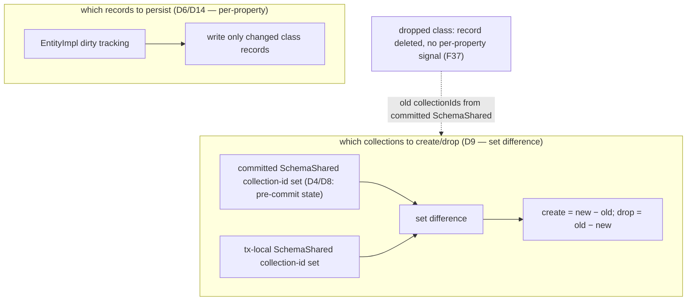
```mermaid
flowchart TD
  subgraph WRITE["which records to persist (D6/D14 — per-property)"]
    DT["EntityImpl dirty tracking"] --> WR["write only changed class records"]
  end
  subgraph STRUCT["which collections to create/drop (D9 — set difference)"]
    OLD["committed SchemaShared collection-id set (D4/D8: pre-commit state)"] --> DIFF["set difference"]
    NEW["tx-local SchemaShared collection-id set"] --> DIFF
    DIFF --> CRD["create = new − old; drop = old − new"]
  end
  DROP["dropped class: record deleted, no per-property signal (F37)"] -. old collectionIds from committed SchemaShared .-> STRUCT
```

### F44 — D7's mutex engage-point: schema and index use disjoint locks, so both chokepoints must be instrumented; an index-only tx bypasses the schema one [MAJOR]
D7 engages the metadata-write mutex "when a tx first mutates schema or indexes,"
and D19 branches the commit lock on the same signal. A reliable chokepoint
exists — and it is two chokepoints, not one:

- **Schema mutations** funnel through `SchemaShared.acquireSchemaWriteLock(session)`
  (`:414`), which drives persistence: `releaseSchemaWriteLock` fires `saveInternal`
  at the outermost release (`:426`–`:433`). Every persisting schema mutation passes
  through it (a bypass would already fail to persist today), so it is as reliable as
  today's save path, and it is exactly the method D1/D8 modify — the engage hook
  lands there naturally.
- **Index-definition mutations** funnel through
  `IndexManagerEmbedded.acquireExclusiveLock(transaction)` (`:188`), bracketing
  createIndex (`:325`) / dropIndex (`:463`).

The two families use **disjoint** locks: `acquireSchemaWriteLock` callers are
confined to the schema package; `IndexManagerEmbedded` never calls it. So a tx that
only does `createIndex` on an existing class (no class/property change) never
touches the schema chokepoint — yet it builds an engine at commit (D12) and must
take the write lock (D19) and serialize (D7). The single D7 mutex must therefore
engage at **both** chokepoints, and D19's commit-entry write-lock branch must fire
if **either** fired; instrumenting only the schema chokepoint would let index-only
txs commit on the read-lock fast path while building an engine — re-introducing the
F33/D19 hazard for that case. D7/D19 already say "one lock for both" / "schema OR
index changes," so the design is internally consistent; this confirms "both" is
necessary, not merely tidy.

**Snapshot-cache coupling (not the mutation lock).** "Disjoint" is about the
*mutation* locks. An index mutation is not fully independent of the schema: at the
outermost index-lock release, `IndexManagerEmbedded.releaseExclusiveLock` (`:201`)
calls `schema.forceSnapshot()` (`:205`–`:208`), which takes `SchemaShared`'s
separate `snapshotLock` (`:92`/`:223`) to null the cached `ImmutableSchema` —
because the snapshot caches the per-class index set (F35). It never acquires
`acquireSchemaWriteLock` (`lock.writeLock()`, `:414`), and `SchemaClassImpl.createIndex`
(`:951`) does not either. So the two *mutation* locks stay disjoint and the dual
engage-point holds; this only reinforces it — since no index path takes the schema
mutation lock, an index-only tx truly bypasses the schema chokepoint. No deadlock:
the reverse path (`makeSnapshot` holding `snapshotLock` while building the snapshot)
reads the index manager lock-free (`getClassRawIndexes:85` takes no index lock), so
there is no `snapshotLock`↔index-lock inversion.

Two wiring caveats:

- **Active-tx guard.** `acquireSchemaWriteLock` is also called during load / reload
  / genesis bootstrap; the engage must fire only inside an active user tx, or it
  spuriously engages outside transactional work.
- **Mutation-time, not commit-time (D5).** The mutex must engage at the chokepoint
  during the tx, so a second schema-changing tx blocks. A commit-time-only check
  would let two schema txs race to a commit-time conflict, which D5 rejects.

Resolution (D7/D19): pin the engage-point to the two chokepoints
(`acquireSchemaWriteLock` + `acquireExclusiveLock`), engage the single mutex
idempotently at either, guard on active user tx, and have D19 read the unified
"either changed-set non-empty" signal.

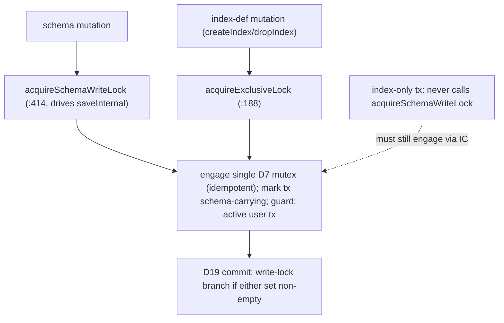
```mermaid
flowchart TD
  SM["schema mutation"] --> SC["acquireSchemaWriteLock (:414, drives saveInternal)"]
  IMM["index-def mutation (createIndex/dropIndex)"] --> IC["acquireExclusiveLock (:188)"]
  SC --> ENG["engage single D7 mutex (idempotent); mark tx schema-carrying; guard: active user tx"]
  IC --> ENG
  ENG --> CK["D19 commit: write-lock branch if either set non-empty"]
  IONLY["index-only tx: never calls acquireSchemaWriteLock"] -. must still engage via IC .-> ENG
```

### F45 — D14's per-class record identity and D8/F41's tx-local seed are coupled by an unstated invariant: the seed must carry each existing class's committed record RID [MAJOR]
D14 splits the schema into per-class records, each `SchemaClassImpl` carrying its own
record RID, committed via load-by-RID + set-properties (mirroring the index-manager
per-entity pattern, F20). D8/F41 pin the tx-local `SchemaShared` seed to `fromStream`
re-parse, but for the `owner`/graph-binding reason only (F41), never identity. The two
are specified independently and assume different things about per-class record identity.

PSI-verified (2026-06-04, third pass):

- `SchemaClassImpl` has exactly one inheritor, `SchemaClassEmbedded`; **neither declares
  any RID/`Identifiable`/identity field** (`ClassInheritorsSearch` + field scan). The
  per-class record RID is net-new under D14.
- Both constructors (`SchemaClassImpl:89`, `:108`) and `createClassInstance(name)`
  (`SchemaEmbedded:477` → `new SchemaClassEmbedded(this, name)`) carry no RID.
- `SchemaClassImpl.toStream` (`:569`) emits `session.newEmbeddedEntity()` — an embedded
  entity with no independent identity; the whole schema is one record at
  `SchemaShared.identity` (`toStream:647` `session.load(identity)`), confirming F1.
- The index template D14 mirrors already binds identity at load:
  `IndexManagerAbstract.load` (`:191`) reads the `CONFIG_INDEXES` link set, loads each
  entity by RID, and `createIndexInstance(transaction, indexIdentifiable, …)` (`:202`)
  threads it in; `IndexAbstract.save` (`:720`) loads-by-`identity`-or-creates.

The gap is at the seam, for an **existing** class modified in a tx (the common
migration case). The tx-local copy must carry that class's committed record RID so
commit's load-by-RID updates the right record. An implementer following F41 literally
builds the seed by constructing fresh `SchemaClassEmbedded(this, name)` objects, which
carry no RID, and commit then has nothing to load: it orphans the committed per-class
record and writes a fresh one, or, if it re-resolves by class name against the committed
schema, mishandles a class renamed in the same tx (D17, whose new name is absent from
the committed schema). New-class records are already covered (D14: temp→persistent RID
at commit, D2/F24); the unstated half is existing-class identity preservation.

Resolution (D8/D14): state the invariant. The per-class record RID is a field on
`SchemaClassImpl` bound at load from the schema-record link set (mirroring
`IndexManagerAbstract.load`); the F41 seed preserves it for existing classes (a
`toStream`→`fromStream` round-trip through the link-set-aware serializer keeps it; a
fresh-object reconstruction that drops identity does not); a new class allocates its
record RID at commit (D2/F24). Commit resolves the per-class record by carried RID, not
by re-resolving the possibly-renamed class name.

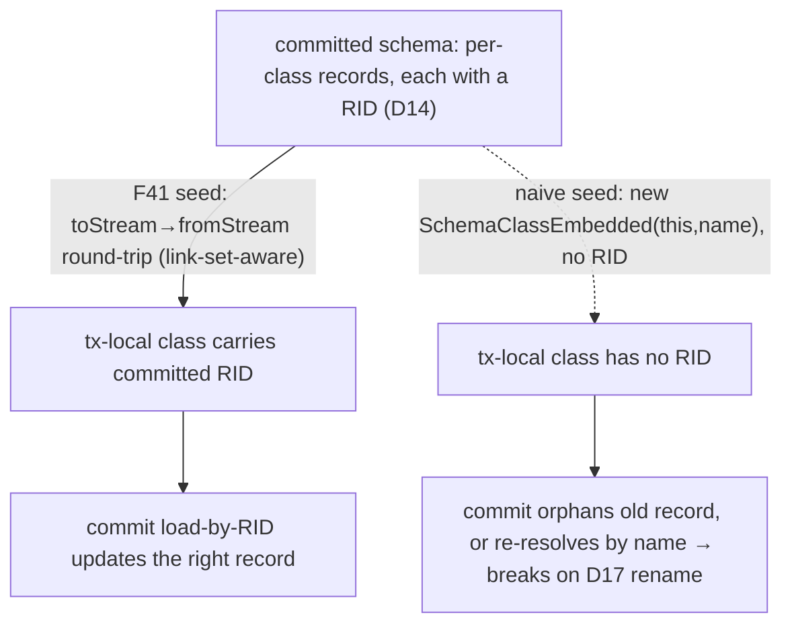
```mermaid
flowchart TD
  COMMIT["committed schema: per-class records, each with a RID (D14)"]
  COMMIT -- "F41 seed: toStream→fromStream round-trip (link-set-aware)" --> TXOK["tx-local class carries committed RID"]
  COMMIT -. "naive seed: new SchemaClassEmbedded(this,name), no RID" .-> TXBAD["tx-local class has no RID"]
  TXOK --> CMOK["commit load-by-RID updates the right record"]
  TXBAD --> CMBAD["commit orphans old record, or re-resolves by name → breaks on D17 rename"]
```

### F46 — Class-structural ops mutate index collection-membership through a self-committing, shared-`Index`-mutating path the guard inventory and D15 overlay both miss [MAJOR; self-commit + isolation facets BLOCKER]
The polymorphic collection-id ripple reaches the index manager:
`SchemaClassEmbedded.addCollectionIdInternal` (`:600`) → `addPolymorphicCollectionId`
(`:631`, recursing superclasses `:644`) → `addCollectionIdToIndexes` (`:641`) →
`IndexManagerEmbedded.addCollectionToIndex` (`:99`). PSI-verified callers (2026-06-04):
`addCollectionToIndex` is called from `SchemaClassEmbedded#addCollectionIdToIndexes` (the
ripple) and `SchemaEmbedded#createClassInternal`; `addCollectionIdToIndexes` is called
from `addPolymorphicCollectionId` and `SchemaClassImpl#addPolymorphicCollectionIds` (the
`addSuperClass`/inheritance path); the symmetric `removeCollectionFromIndex` is reached
from `SchemaClassImpl#removeCollectionFromIndexes`. So ordinary `createClass`,
alter-add-collection, and `addSuperClass` mutate index membership, not just explicit
`createIndex`/`dropIndex`. Three facets, all missed by the first two passes:

- **(a) A fifth/sixth self-commit guard.** `addCollectionToIndex` wraps the mutation in
  `session.executeInTxInternal` (`IndexManagerEmbedded:114`), the same self-committing
  shape as F3 (`saveInternal`), F4 (`dropClass`), F21 (`createIndex`), F26 (`dropIndex`);
  `removeCollectionFromIndex` matches. The guard inventory lists four; these are the
  fifth and sixth, reached transitively from class-structural ops. Under D1 they must
  ride the user tx, not self-commit.
- **(b) In-place mutation of a committed `Index` object (D4 leak).** The path resolves
  the shared `indexes.get(indexName)` (`:106`/`:117`) and mutates its `collectionsToIndex`
  then `save(transaction)` (`IndexAbstract.addCollection:667`/`:684`; persisted as
  `CONFIG_COLLECTIONS`, `save:737`/`toMap:779`). Same hazard F40 named for class rename:
  mutating a committed thin handle in place leaks the uncommitted membership change to
  other sessions. Must be commit-only / routed through the D15 overlay.
- **(c) A missing D15 changed-index category.** A membership-only change to an existing,
  non-created/non-dropped index that is not a rename is none of D15's enumerated
  categories (create/drop + the F40 rename third category). If the changed index entity
  is not tracked, commit does not persist the membership delta and the committed index
  silently fails to cover the new subclass collection — a polymorphic query under-returns.

Resolution (D15/D7): add collection-membership change to the changed-index set as an
in-place-mutation category alongside rename (F40), generalizing D15's third category to
"in-place mutation of a committed index"; de-guard
`addCollectionToIndex`/`removeCollectionFromIndex` so the membership change rides the
user tx (extends the F3/F4/F21/F26 inventory to six); route the mutation through the
tx-local index overlay and apply it commit-only so no shared committed `Index` is mutated
mid-tx (D4).

**Verified (collectionCounter pass, 2026-06-04) — commit-only deferral is required for
correctness, not just isolation.** Mid-tx the ripple resolves the collection name with
`session.getCollectionNameById(iId)` (`SchemaClassEmbedded:651`), but under D2 `iId` is the
provisional id, and `getCollectionNameById` returns `null` for any `collectionId < 0`
(`DatabaseSessionEmbedded:2660`). So the ripple feeds a `null` name into
`addCollectionToIndex` → `collectionsToIndex.add(null)` (`IndexAbstract:672`), or
`browseCollection(null)` throws under `requireEmpty`. The membership mutation therefore
cannot run mid-tx with a provisional id at all; deferring it to commit (when the real
collection name exists) is the only correct order. This also refines F42: the membership
ripple is the one path where a provisional id reaches a storage name lookup mid-tx, and
F42's `< 0` storage guard returns null there rather than resolving. (Separately confirmed
clean: `collectionCounter` is the artificial-name counter (`SchemaShared:838`
`nextCollectionIndex`), decoupled from the storage-assigned collection id by design (D11),
and transactional under D8, so there is no name/id dual-authority drift.)

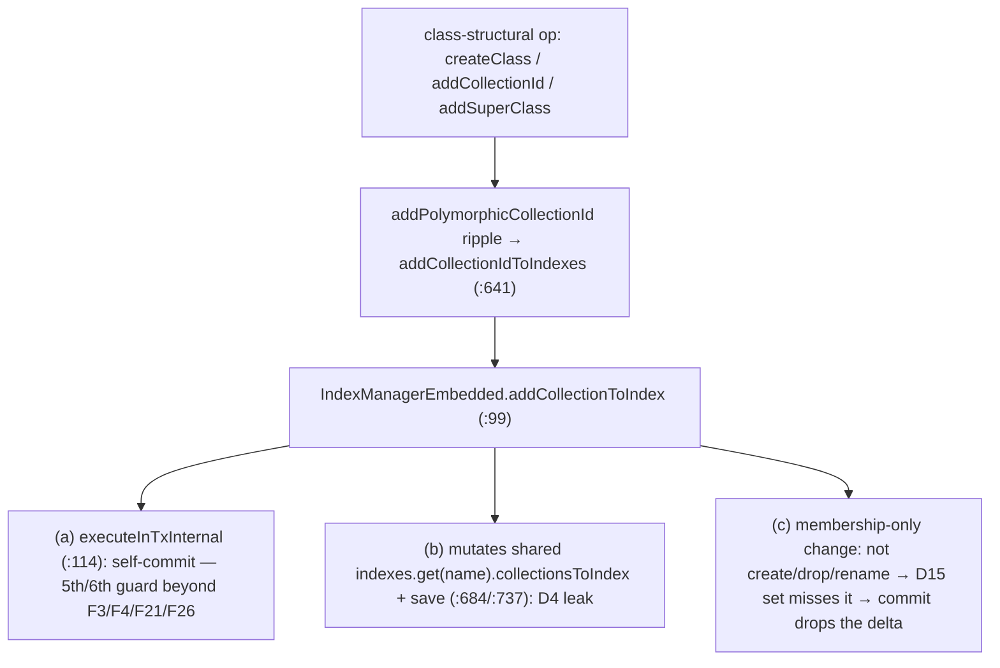
```mermaid
flowchart TD
  CS["class-structural op: createClass / addCollectionId / addSuperClass"]
  CS --> RIP["addPolymorphicCollectionId ripple → addCollectionIdToIndexes (:641)"]
  RIP --> ACI["IndexManagerEmbedded.addCollectionToIndex (:99)"]
  ACI --> A["(a) executeInTxInternal (:114): self-commit — 5th/6th guard beyond F3/F4/F21/F26"]
  ACI --> B["(b) mutates shared indexes.get(name).collectionsToIndex + save (:684/:737): D4 leak"]
  ACI --> C["(c) membership-only change: not create/drop/rename → D15 set misses it → commit drops the delta"]
```

### F47 — Verified: the polymorphic ripple does not pollute the changed-class set; the changed-class-set hook and the D7-mutex engage-point sit at different lock granularities [VERIFIED + MINOR pitfall]
Surface-B hypothesis (third pass): does the inheritance ripple drag superclasses into
D8's changed-class set, eroding D14's write-amplification win? Verified **no**, on two
grounds:

- `addPolymorphicCollectionId` (`SchemaClassEmbedded:631`) mutates `polymorphicCollectionIds`
  by direct field write (`:636`–`:639`) and recurses into superclasses (`:644`)
  **without re-acquiring** the schema write lock; only the originating
  `addCollectionIdInternal` takes it (`:601`). A changed-class set keyed at a per-class
  mutation entry point records only the originating class, not the rippled superclasses.
- `SchemaClassImpl.toStream` (`:569`) does **not** serialize `polymorphicCollectionIds`
  (nor `subclasses`); it is derived state recomputed on load via
  `setSuperClassesInternal`/the ripple. The rippled superclass records need no rewrite.

Pitfall to record (D7/D8): the D7-mutex engage-point and the changed-class-set recorder
sit at different granularities. `SchemaClassImpl.acquireSchemaWriteLock` (`:1168`)
delegates to `owner.acquireSchemaWriteLock` (`SchemaShared:414`), the owner-level lock
that carries no class identity, which is all the D7 mutex needs (engage once per tx).
The changed-class set needs per-class identity, so it must hook at
`SchemaClassImpl.acquireSchemaWriteLock` / the explicit mutation methods, one level above
the mutex chokepoint. D7/D8/F44 describe "the chokepoint" as a single place; it is two
granularities for two purposes. An implementer hooking the changed-class set at the
owner-level lock has no identity to record and would either pollute the set or defeat the
per-class write-amplification win.

```mermaid
flowchart TD
  MUT["class mutation (e.g. addCollectionIdInternal)"] --> SCWL["SchemaClassImpl.acquireSchemaWriteLock (:1168): per-class identity — changed-class-set hook"]
  SCWL --> OWL["owner.acquireSchemaWriteLock (SchemaShared:414): no identity — D7-mutex engage hook"]
  RIP["polymorphic ripple → superclass.addPolymorphicCollectionId (:644)"] -. "lock-free, bypasses per-class acquire" .-> NOREC["superclass NOT recorded (correct: polymorphicCollectionIds not persisted)"]
```

**Performance pass (2026-06-04).** A fourth pass assessed the headline migration workload
— 400 classes × 10 properties, every property indexed, created in one batch — against the
design with the F45–F47 fixes. The design delivers the YTDB-382 win decisively: one commit
versus ~8,400 per-op self-commits today, and the single-schema-record O(N²) rewrite (F2)
plus the index-manager-record O(N²) rewrite both drop to O(N). It concentrates the cost
into one large exclusive-locked atomic operation. F48–F51 record the concentration costs
and one implementation invariant. Quantities are code-grounded: 8 collections per class
(`CLASS_COLLECTIONS_COUNT`, `GlobalConfiguration:812`), 4 files per collection (F19), 3
files per index engine (`.cbt`/`.nbt` plus the always-created `.ixs` histogram,
`AbstractStorage:2802`/`:2808`).

### F48 — The batch concentrates ~24,800 file creates, ~4,400 record writes, and 4,000 engine builds into one atomic operation under the exclusive write lock [MAJOR — envelope, not defect]
For 400 classes × 8 collections = 3,200 collections × 4 files = 12,800 collection files,
plus 4,000 indexes × 3 files = 12,000 index files, the commit creates ~24,800 files in one
atomic operation, alongside ~4,402 metadata record writes (400 per-class records, 4,000
per-index entity records, the schema root, the index-manager record) and 4,000 B-tree
engine inits. All of it runs under `stateLock.writeLock()` for the whole commit (D19), so
it blocks every concurrent data commit for the build's duration.

- **D12's "schema changes are rare" premise is the tension.** D12 accepts the build under
  the exclusive lock because schema change is low-rate; a 4,000-index batch is the
  counterexample. The offline migration envelope (D20: export/import into a fresh database
  with no concurrent load) absorbs it cleanly; a large batch DDL against a live production
  database stalls all data commits for seconds-plus. Off-lock / streamed build is the
  YTDB-1064 follow-up.
- **Memory bound.** File creates are buffered intent (`FileChanges`) applied only in
  `commitChanges` (F16); ~24,800 `FileChanges` plus the record deltas plus B-tree root
  pages buffer in the atomic operation until commit. Bounded (tens of MB) but real; a
  documented per-tx batch-size limit, or chunked migration, is the safe stance for very
  large schemas.

```mermaid
flowchart TD
  TX["one schema tx: 400 classes, 4,000 indexes"] --> CM["single commit, one atomic op, stateLock.writeLock held throughout (D19)"]
  CM --> F["~24,800 file creates: 3,200 collections×4 (F49) + 4,000 indexes×3"]
  CM --> R["~4,402 record writes: 400 class + 4,000 index-entity + schema + manager"]
  CM --> E["4,000 B-tree engine inits"]
  CM -. "blocks data commits for the build" .-> STALL["live-DB stall; safe only in the offline D20 envelope; off-lock build = YTDB-1064"]
```

### F49 — `CLASS_COLLECTIONS_COUNT` default of 8 is the dominant file multiplier; the D20 import should set it low [MAJOR — operational]
A non-abstract user class allocates `minimumCollections = CLASS_COLLECTIONS_COUNT`
collections, default **8** (`SchemaEmbedded:328`/`:341`–`343`, `GlobalConfiguration:812`),
not one. So 400 classes create 3,200 collections = 12,800 files, more than the 12,000 index
files. The multiplier is pre-existing, but the batch concentrates it into one commit. D20's
import rebuilds through the schema API and inherits the default, so a 400-class
export/import migration creates 3,200 collections unless the import sets
`CLASS_COLLECTIONS_COUNT` low (1 for a single-threaded migration target). D11's artificial
collection names are unaffected; this is purely the per-class collection count. The
migration should document the knob.

```mermaid
flowchart LR
  C["400 classes"] --> M["× CLASS_COLLECTIONS_COUNT = 8 (GlobalConfiguration:812)"]
  M --> COL["3,200 collections"]
  COL --> FILES["× 4 files (F19) = 12,800 collection files"]
  C -. "import sets count = 1" .-> LOW["400 collections / 1,600 files (D20 knob)"]
```

### F50 — Latent: the index-manager record's link set is monolithic, so incremental index creation keeps the O(N²) write amplification D14 removed for classes [MINOR — latent, folds YTDB-1064]
D15 says no D14-style split is needed for indexes because the per-index definitions are
already separate entity records (F20). True for the per-index entities, but the index
**manager** record holds one `CONFIG_INDEXES` link set of all index RIDs
(`IndexManagerAbstract:52`/`:215`–`216`), and adding one index re-serializes the whole
record. For the batch this is O(N) (one serialization of all 4,000 links at commit, a win);
for steady-state incremental index creation on a large schema it is O(N²), the exact
amplification D14 eliminated on the class side, still present on the manager record. Not a
v1 blocker (the batch is fine); recorded as a latent asymmetry for the YTDB-1064
optimization scope.

```mermaid
flowchart TD
  ADD["createIndex: add RID to manager CONFIG_INDEXES link set (IndexManagerAbstract:216)"] --> SER["whole manager record re-serialized (all N links)"]
  SER --> BATCH["batch: serialized once at commit → O(N) (win)"]
  SER --> INCR["incremental: re-serialized per add → O(N²) (D14 amp, still present)"]
```

### F51 — F35's tx-local snapshot rebuild must be lazy invalidation, not eager reconstruction, or the batch pays O(N²) [MAJOR — implementation invariant]
F35 requires "force a tx-local snapshot rebuild on every mid-tx createIndex/dropIndex" so
`ClassIndexManager` sees the new index. Read as **eager reconstruction**, that is O(current
schema size) per createIndex → O(N²) for a 4,000-index batch. It must be **lazy
invalidation**: null the tx-local snapshot (today's `forceSnapshot` shape,
`SchemaShared:218`, O(1)) and rebuild only on the next snapshot read. Verified (Q3,
2026-06-04): a single-column `createIndex` does not read the schema snapshot — the security
check that would (`IndexManagerEmbedded:405`) returns early for one-field indexes
(`:399`–`401`), and the rest of the create path builds none — so a pure-DDL batch triggers
no mid-batch rebuild and the cost stays O(N). Two cases reintroduce it:

- **Composite indexes.** A multi-field `createIndex` runs the security check, which builds a
  snapshot per call → O(N²) for a batch of composite indexes.
- **Data interleaved with index creation.** A record write after a mid-tx createIndex runs
  `ClassIndexManager`, forcing a tx-local snapshot rebuild (F35); interleaving inserts and
  index creates reintroduces per-operation rebuilds.

Resolution (F35/D15): pin F35's trigger to lazy invalidation (null-and-rebuild-on-read);
the cheap-rebuild property holds for pure single-column DDL batches, while composite indexes
and data-interleaved batches carry the rebuild cost.

```mermaid
flowchart TD
  CI["mid-tx createIndex ×4,000"] --> TRIG["F35: invalidate tx-local snapshot"]
  TRIG -- "lazy null + rebuild-on-read (forceSnapshot:218): O(1)" --> OK["pure single-col DDL: no rebuild (Q3), O(N) total"]
  TRIG -- "eager reconstruct per call: O(N)" --> BAD["O(N²) for the batch — must NOT do this"]
  COMP["composite index OR data interleaved"] -. "forces snapshot build per op" .-> COST["per-op rebuild cost returns"]
```

### F52 — D8's promotion of the tx-local schema into the shared `SchemaShared` has no specified lock, and every naive choice fails [BLOCKER]
D8 says the commit "promotes the tx-local structure to the shared `SchemaShared`" and F43's
diff reads the committed in-memory schema, both inside the D19 `stateLock.writeLock()`
window — but no entry names the lock guarding them. The shared maps are not concurrent
(`classes` is a plain `HashMap`, `SchemaShared:70`; `collectionsToClasses` an
`Int2ObjectOpenHashMap`, `:71`) and every reader uses the schema read lock (`getClass:398`,
`makeSnapshot:198`). The three choices all break:

- **Take `SchemaShared.lock` inside the commit → ABBA deadlock with `reload`.** Commit
  order: `stateLock.write` → `SchemaShared.lock`. `reload` order: `SchemaShared.lock.write`
  (`:356`) → `session.load` (`:363`) → `stateLock.readLock` (`AbstractStorage:4584`).
  `ScalableRWLock`'s writer preference parks reload's read behind the commit's held write
  lock; permanent deadlock. Reload is reachable from the **data path**:
  `EntityImpl.getGlobalPropertyById` calls `metadata.reload()` (`EntityImpl:4173`) on an
  unknown global-property id, which is exactly a reader's state right after another
  session's schema commit.
- **Skip the schema lock** → concurrent readers see a plain `HashMap` mid-mutation: torn
  reads, resize loops, and `makeSnapshot` can cache a half-promoted schema for every session.
- **Defer promotion past `stateLock` release** → window where storage has the new
  collections but the shared schema lacks them; `getClassByCollectionId(realId)` → null on
  the F42 caller list, now on real ids.

Instance-swap is foreclosed by code: `ProxedResource.delegate` is `final`
(`ProxedResource:30`) and sessions bind the instance at `MetadataDefault.init` (`:124`).

**Resolution (accepted 2026-06-10):** fix the global lock order as **D7 mutex →
`SchemaShared.lock` → `stateLock`**. The schema-carrying commit acquires
`SchemaShared.lock.writeLock()` *before* `stateLock.writeLock()` and holds it through
promotion + `forceSnapshot`; `reload` already conforms. The schema lock is a third member
of D19's ordering proof. Accepted with the contention envelope below; the two
snapshot-first conversions it names (`createVertexWithClass`, `getLowerSubclass`) are
folded into scope as mitigations. Affected: D8, D19, D7, F43, F42.

```mermaid
flowchart LR
  subgraph commit["schema commit (D19)"]
    SW["stateLock.write"] --> SL["wants SchemaShared.lock"]
  end
  subgraph reload["SchemaShared.reload (EntityImpl:4173 data path)"]
    RL["SchemaShared.lock.write (:356)"] --> SR["wants stateLock.read (:4584)"]
  end
  SL -. "blocked by" .-> RL
  SR -. "blocked by" .-> SW
  FIX["fix: schema lock acquired BEFORE stateLock"] --> commit
```

**Contention envelope (2026-06-10, PSI call-site census).** How much blocks while a
schema-carrying commit holds `SchemaShared.lock.writeLock()`: the steady-state data paths
do **not** touch the lock. `makeSnapshot` serves the cached snapshot lock-free
(`SchemaShared:194`; the volatile fast path takes no lock until a `forceSnapshot`
invalidates, which F62 moves to the end of the commit), and after receiver-provenance
checks the hot paths are snapshot-routed: binary deserialization class resolution
(`EntityImpl.fetchClassName:4486` reads the immutable snapshot), entity creation with an
existing class (`setClassNameWithoutPropertiesPostProcessing:3891` snapshot-first),
core edge creation (`DatabaseSessionEmbedded.addEdgeInternal:1038`), SQL executor checks
(`CheckClassTypeStep:48`), and global-property lookups (`ImmutableSchema`). The
genuinely lock-based per-operation MAIN sites are an enumerable short list:

- **Gremlin `addVertex(label)`** — `YTDBGraphImplAbstract.createVertexWithClass:123`–`:128`
  goes straight at `SchemaShared.getClass` (read lock, `:393`) on every call, unlike its
  `addEdge` sibling (`YTDBVertexImpl:128`) which is snapshot-first with the lock only on
  the auto-create miss. The one hot site; trivially convertible to the `addEdge` pattern,
  which removes it from the blocked set. Pre-existing inconsistency, cheap mitigation.
- **MATCH planning** — `SQLMatchStatement.getLowerSubclass:368` uses the proxy (per MATCH
  query); also snapshot-convertible.
- **Full-scan traversal start** — `YTDBGraphStep.createClassIterator:147` reads
  `SchemaShared.getClasses` per `g.V()`-style scan.
- **JSON deserialization / entity copy** — `EntityImpl.getSchemaClass:3863` (proxy;
  callers: JSON serializer, `PropertyTypeInternal.copy`, `EdgeEntityImpl`).
- **Auto-create fallbacks** — snapshot-miss `getOrCreateClass`
  (`EntityImpl:3898`, `YTDBVertexImpl:134`): these are DDL and would park on the D7 mutex
  anyway.
- **Session-open / security init / snapshot rebuild** — `SecurityShared`
  `getClasses` (`:595`/`:1230`), post-invalidation `makeSnapshot` rebuild; brief,
  per-session-or-rebuild, not per-record.
- **Admin machinery** — `DatabaseImport`/`Export`/`Compare`, `dropCollection`,
  `truncateCollection`, scheduler/sequence/function init: cold.

Baseline comparison: today every DDL operation already takes this same write lock
per-operation and serializes the full schema record under it (F2), so readers on the list
above already block per-DDL-op; the design trades ~8,400 short holds (the F48 batch) for
one long hold, and pure-data commits never take the schema lock at all (D19 fast path).
The one real behavioral delta: a schema-carrying tx that also carries many data writes
holds the lock across its whole commit, including the data-record writes. Mitigations to
carry into the plan: convert `createVertexWithClass` (and optionally
`getLowerSubclass`) to snapshot-first, and note the hold-duration delta in D19.

### F53 — Commit-failure rollback leaves phantom engines and collections in the shared in-memory registries; D13 makes that failure routine [BLOCKER]
Reconciliation registers structures in shared in-memory state *before* `commitIndexes`:
`doAddCollection` → `registerCollection` (`AbstractStorage:4963`/`:5026`, mutating
`collections`/`collectionMap` `:263`–`:264`) and the engine-create body does
`indexEngineNameMap.put` + `indexEngines.add` (`:2811`–`:2812`) plus config-cache updates.
`commitIndexes` (`:2375`) then runs the UNIQUE validators — D13 defers uniqueness
enforcement to exactly this point, so `RecordDuplicatedException` there is a routine,
user-data-caused event. It is a `HighLevelException`: the catch routes to
`rollback(error, atomicOperation)` (`:2398`), which only ends the atomic operation
(`:3702`–`:3705`) and deliberately does not poison the storage. The WAL/file side rolls
back cleanly (F16/D10); nothing unwinds the in-memory registrations. After the abort:
engines with valid `indexId`s but no files (D13's `indexId < 0` planner guard does not
protect anyone), collections with no files, leaked engine slots (F29), and follow-on
durable writes computed from the poisoned state. Today the exposure is a sliver
(registration is the last statement of its small atomic op); the design inserts minutes of
user-data-dependent work between registration and operation end. Merges the concurrency
and durability reports' C2+U5.

**Resolution (accepted 2026-06-10, option (a) — commit-local resolution):** defer all
registry publication (collections array, engine maps, config caches) to the
post-`commitChanges` success path, matching D8/D15's existing publish-at-commit
discipline — avoids new undo code; tx-local→shared promotion (F52) and D15 overlay
publication run strictly after `endTxCommit`. The commit's own later steps resolve new
collections/engines through commit-local references, never the shared registries; the
first implementation step is a PSI audit of which commit steps read the shared
registries, so commit-local resolution covers every read site. Test: schema tx +
duplicate key in the same tx → commit fails → retry succeeds → restart → consistent. Affected: D3, D10,
D12, D13, D15, D19, F39.

```mermaid
flowchart LR
  REG["registerCollection / engine-map put (:5026, :2811)"] --> CI["commitIndexes (:2375)"]
  CI -- "RecordDuplicatedException (D13, routine)" --> RB["rollback: ends atomic op only (:3702)"]
  RB --> PH["phantom engines + collections live in memory"]
  FIX["fix: publish registries only after commitChanges succeeds"] -.-> REG
```

### F54 — The commit-time index build re-enters `stateLock` through the session read and batch-commit paths; the batched-tx fallback tears durability instead [BLOCKER]
D12 keeps "populate from committed data" inside the D19 `stateLock.writeLock()` window, but
the only population machinery is `IndexAbstract.indexCollection` (`:962`–`:1015`): copied
session (`:989`), `browseCollection` (`:990`), batched micro-transactions
(`executeInTxBatchesInternal`, `:991`). Every leg re-acquires `stateLock`: record reads via
`readRecord`/`readRecordInternal` (`AbstractStorage:2031`/`:4584`), each batch commit
(`:2285`). `ScalableRWLock` is non-reentrant (`ScalableRWLock:64`): the first row read
self-deadlocks the commit while the WAL operation is open and the write lock held; the
operator kill then lands on the F55 recovery path. F22 flagged the refactor generically;
F39 extracted only `doAddIndexEngine`/`doDeleteIndexEngine` — the per-row population path
was never resolved. The same seam hits F46's emptiness probes: `addCollection(requireEmpty)`
and `removeCollection` probe via `session.browseCollection` (`IndexAbstract:676`, `:698`).
The tempting fallback — keep today's `fillIndex` shape and call it "at commit" — is a
durability bug: each batch commits its own WAL unit, so the build becomes durable
independently of the schema commit's unit, recreating exactly the torn state D1 removes.
Merges C3+U6. Affected: D12, D18 (genesis builds the `OUser.name` index through this
path), D19, F22, F39, F46.

**Resolution (accepted 2026-06-10):** extend F39's extraction to the scan: commit-time population
iterates the source collection via lock-free storage-internal primitives that take the
commit's `AtomicOperation` (no session, no nested transactions) and feeds keys straight to
the engine's `doPut` on that same operation; F46's probes get an internal
`isEmpty(atomicOperation)`. D12 gains the invariant: population emits **zero additional WAL
units**.

```mermaid
flowchart LR
  POP["indexCollection (:989-991)"] --> RR["readRecord → stateLock.read (:2031)"]
  POP --> BC["batch commit → stateLock.read (:2285)"]
  RR & BC -- "non-reentrant under held write lock (D19)" --> DL["self-deadlock"]
  ALT["fallback: keep batched txs"] --> TORN["separate WAL units → torn build on crash"]
  FIX["fix: lock-free scan + doPut on the commit's AtomicOperation"] -.-> POP
```

### F55 — Replay of a file-creating atomic unit aborts mid-restore: page-op records precede `FileCreatedWALRecord` and booked file ids are not durable; F16's all-or-nothing claim is false in the apply window [BLOCKER — pre-existing, design-amplified]
WAL record order inside a file-creating unit is fixed by the machinery: page-op records
flush during the operation at component boundaries (`AtomicOperationsManager:195`/`:228`;
leftovers at the top of `commitChanges`, `AtomicOperationBinaryTracking:979`);
`FileDeletedWALRecord`/`FileCreatedWALRecord` are logged only inside `commitChanges`
(`:993`/`:1006`); then `AtomicUnitEndRecord` (`:1067`); then the **physical** phase
(`readCache.addFile` per file + page application, `:1088`–`:1177`). The background flusher
(`CASDiskWriteAheadLog:311`–`:313`) makes the end record durable independently of the
physical phase. Kill the process mid-physical-phase and recovery applies the unit in list
order: a page record for a never-created file hits `writeCache.exists` → false
(`WOWCache:1195`), `restoreFileById` finds no booking — `bookFileId` is in-memory only
(`:732`); negative name-id entries are written only on delete (`:1965`) — returns null, and
`restoreAtomicUnit` throws (`AbstractStorage:5661`). `restoreFrom`'s catch (`:5602`) then
**abandons the entire remaining restore**: the unit stays half-applied and every later
committed unit is silently discarded. The window exists today per 4-file unit at
microsecond width; the design moves all file creation into this pattern and F48 stretches
the physical phase to seconds (~24,800 `addFile` calls), with the D20 import as the prime
victim. Affected: F16, D10, D3, D12, F48, D20.

**Resolution (accepted 2026-06-10, option 3 — lazy consult):** fix the replay, not the
design shape. Keep strict in-order replay; when a page record references a missing file,
scan the buffered unit forward for a `FileCreatedWALRecord` with that file id, materialize
the file at that point, and apply the page — the later `FileCreated` record replays as an
idempotent no-op; no pending create found means a genuinely broken WAL, throw as today.
This preserves every existing intra-unit ordering property (pages-then-`FileDeleted` drop
sequences still apply in order — the property a strict two-pass would have to re-derive by
hand), touches only the missing-file branch (`AbstractStorage:5657`/`:5731`), needs no WAL
format change, and restores old WALs unchanged. Persisting bookings was rejected: an
fsynced name-id append per file creation on the forward hot path for a recovery-only
problem, plus stale negative entries to collect. Carried as a **prerequisite track** with
a kill-mid-physical-phase recovery test at batch scale (fault hook after the end-record
log in `commitChanges:1067`; the `LocalPaginatedStorageRestoreFromWALIT` family is the
home) plus the kill-mid-import D20 scenario. Standalone issue **YTDB-1099** (filed
2026-06-10, relates to YTDB-382) covers the pre-existing `develop` hole so the fix can
land and be backported independently of YTDB-382.

```mermaid
flowchart LR
  WAL["WAL unit: [Start, PageOps…, FileCreated…, End]"] --> PHYS["physical phase: addFile ×24,800 (seconds, F48)"]
  PHYS -- "crash mid-phase (End already durable)" --> REC["restore: page record for missing file"]
  REC --> BOOK["restoreFileById → null (bookFileId in-memory only :732)"]
  BOOK --> ABORT["StorageException :5661 → restoreFrom :5602 abandons ALL later units"]
  FIX["fix: apply FileCreated records first (two-pass restoreAtomicUnit)"] -.-> REC
```

### F56 — F44's engage-points acquire the shared metadata locks before the D7 mutex; a parked second schema tx freezes schema readers, and deadlocks outright once F52's commit-side lock lands [MAJOR]
Both F44 chokepoints take their shared lock as the first statement:
`SchemaShared.acquireSchemaWriteLock` does `lock.writeLock().lock()` at `:415`;
`IndexManagerEmbedded.acquireExclusiveLock` at `:189`. A hook inside them engages the D7
mutex while already holding the shared lock, so tx2's first schema mutation parks on the
mutex (held by tx1 for its whole body) while holding the shared schema **write** lock:
every lock-based schema read in every session stalls for tx1's duration
(`SchemaProxy.getOrCreateClass:87` → `acquireSchemaReadLock:398`), gutting D7's "does not
block schema reads" premise. With F52's resolution in place it is a hard deadlock: tx1's
commit wants the schema lock tx2 holds; tx2 waits on tx1's mutex. There is also a
D8-routing wrinkle F44 predates: mid-tx mutations run against the tx-local instance, so a
hook on the shared instance's lock method either never fires mid-tx or fires on the wrong
instance. Affected: D7, D8, F44, F47.

**Resolution (accepted 2026-06-10):** engage the D7 mutex at the `SchemaProxy`/index-routing layer, on
the first write-routed operation, strictly before any shared metadata lock and before
seeding the tx-local copy. Restate D7's ordering: mutex → (seed) → tx-local locks only
during the body; shared locks only at commit, in F52's order.

```mermaid
flowchart LR
  TX2["tx2: acquireSchemaWriteLock takes SchemaShared.lock FIRST (:415)"] --> PARK["then parks on D7 mutex (held by tx1)"]
  PARK --> FREEZE["all schema readers stall behind held write lock"]
  PARK -- "with F52 commit-side lock" --> DEAD["tx1 commit wants schema lock → deadlock"]
  FIX["fix: engage mutex at proxy layer, before any shared lock"] -.-> TX2
```

### F57 — The single commit-time atomic unit must fit in heap twice — forward and at recovery; the populated-class index build makes it unbounded [MAJOR]
Forward: every touched page's change tree stays in heap until `commitChanges` applies it
(`pageChangesMap` → `restoreChanges`, `AtomicOperationBinaryTracking:1159`). Recovery:
`restoreFrom` buffers the entire unit as a `List<WALRecord>` and applies only at the end
record (`AbstractStorage:5521`–`:5553`), so a crash after a successful giant commit (end
record durable, pages not yet flushed) forces the next open to materialize the whole unit
— a recovery OOM looks like an unopenable database. WAL disk retention compounds it: no
checkpoint/segment cut while the operation is open (`flushAllData:4509`–`:4513`). F48's
"tens of MB" bullet bounds only the empty-class forward path; D12's accepted
populated-class build is O(all B-tree pages written by the scan) with no documented bound.
Affected: F48, D12, F22.

**Resolution (accepted 2026-06-10):** state a hard v1 bound: commit-time eager build only for empty
classes (or population below a documented size cap); populated-class builds go explicitly
to YTDB-1064. Add the recovery-side requirement to F48's envelope: recovery heap = forward
heap.

```mermaid
flowchart LR
  UNIT["giant atomic unit"] --> FWD["forward: pageChangesMap in heap until apply (:1159)"]
  UNIT --> REC["recovery: whole unit buffered before apply (:5521-5553)"]
  REC -- "OOM" --> LOOP["crash-restart-crash: database looks unopenable"]
  FIX["fix: v1 bound — empty-class builds only; populated → YTDB-1064"] -.-> UNIT
```

### F58 — D8's commit narrative lets the per-class record serialize provisional collection ids; the corruption is durable and surfaces only at the next open [MAJOR]
D8's "At commit" bullet orders `toStream` per changed class *before* reconciliation. Taken
literally — serialize early to feed the diff — a new class's record bytes carry its
provisional ids (≤ −2, D2/F42). The unit commits flawlessly and the in-memory promotion is
patched provisional→real (F42), so the running process is correct; at the next open
`fromStream` rebuilds the class with negative ids, every map skips negatives
(`SchemaShared.addCollectionClassMap:871`), and the class permanently loses its collections
— silent, durable schema corruption. The correct ordering is achievable with the existing
machinery: byte production happens in `commitEntry`, which runs in the record-write loop
after position allocation (`AbstractStorage:2361`–`:2368`), and D3 puts reconciliation
before that loop. But D2's patch list names only in-memory structures; no entry says the
record **property values** must be re-pointed before serialization. Affected: D2, D3, D8,
D14, F42, F43.

**Resolution (accepted 2026-06-10):** add the invariant to D2/D8: provisional→real resolution lands in
the per-class record properties before `commitEntry` serializes them (reconcile → patch the
class-record entities → serialize); the structural diff is computed from in-memory
structures (F43), never from pre-serialized bytes. Cheap regression test: create class +
insert + commit + reopen.

```mermaid
flowchart LR
  EARLY["toStream before reconciliation (D8 as written)"] --> BYTES["record bytes carry ids ≤ -2"]
  BYTES --> OPEN["next open: fromStream → addCollectionClassMap skips negatives (:871)"]
  OPEN --> LOST["class permanently loses its collections"]
  FIX["fix: reconcile → patch entities → commitEntry serializes (:2361)"] -.-> EARLY
```

### F59 — The root schema record's non-link payload (global-property table, collectionCounter, blobCollections) has no write-trigger under D14's per-class-records rule [MAJOR]
Under D14 the root record still carries monolithic state besides the class link set:
`globalProperties` (`SchemaShared.toStream:659`–`:665`), `collectionCounter` (`:666`),
`blobCollections` (`:667`). Today every schema save rewrites the whole record; D8 says "at
commit only the class records in the changed-class set are written, never the full schema",
and the only stated root trigger is the link-set delta (F37/F43). Two committed-but-stale
cases: (1) **property create on an existing class** — the most common DDL — allocates a
global property (`findOrCreateGlobalProperty:805`) but changes no link set; after restart
the property's `globalRef` resolves null (`SchemaPropertyImpl:562`–`:564`;
`getGlobalPropertyById:758` is `@Nullable`) and the first touch NPEs. (2) **Collection add
without class create** (D11/F46 path) bumps `collectionCounter` (`:835`–`:838`) with no
link-set change; after restart the stale counter regenerates a colliding collection name,
and the colliding DDL fails in a loop (each retry mutates only the tx-local copy). Extends
F50: the same monolithic-manifest asymmetry, worse failure modes. Affected: D8, D11, D14,
F37, F43, F50.

**Resolution (accepted 2026-06-10):** D14 enumerates the root payload and its dirtiness rule — the
root record is written whenever the link set, the global-property table, the counter, or
the blob set changes; mechanically, set those properties on the root entity in-tx so D6's
dirty tracking covers them for free. Alternatively make the counter load-derived (always
recompute at open) and keep the global table as the only extra trigger. Test:
property-create → restart → read.

```mermaid
flowchart LR
  PC["createProperty on existing class"] --> GP["allocates globalProperty (:805)"]
  GP -- "no link-set change → root not written" --> STALE["committed root: stale global table"]
  STALE --> NPE["restart: globalRef = null (:758 @Nullable) → NPE on first touch"]
  FIX["fix: D14 dirtiness rule — root written on table/counter/blob change"] -.-> STALE
```

### F60 — Commit-time in-place mutation of shared `IndexDefinition`/`Index` fields races lock-free readers [MINOR]
D17/F46 apply class-rename re-association and membership by mutating
`IndexDefinition.className` (recursing composites, F30) and the committed `Index`, under
`stateLock.writeLock()` plus per-index locks. But hot readers read those objects with no
lock and no happens-before edge: `getClassIndex` reads
`indexes.get(name).getDefinition().getClassName()` lock-free
(`IndexManagerAbstract:154`–`:164`); `getClassRawIndexes` iterates `classPropertyIndex`
lock-free. Under the JMM a direct reader can see a stale `className` indefinitely or a torn
composite. The codebase's own pattern for this map is publication, not mutation:
`addIndexInternalNoLock` copies the inner map and republishes via CHM `put`
(`:229`–`:252`). Affected: D15, D17, F30, F40, F46.

**Resolution (accepted 2026-06-10):** publish rename/membership changes as replacement
objects installed via the CHM put, mirroring `addIndexInternalNoLock`'s copy-on-write
discipline.

```mermaid
flowchart LR
  MUT["commit mutates shared IndexDefinition.className in place"] -. "no happens-before" .-> RD["lock-free reader (getClassIndex :154)"]
  RD --> STALE2["stale or torn definition, indefinitely"]
  FIX["fix: copy-on-write republish via CHM put (:229-252)"] -.-> MUT
```

### F61 — The tx-scoped D7 mutex has no release path on abnormal session termination [MINOR]
D7 holds a `ReentrantLock` from first mutation to the `finally` of the outermost
commit/rollback. F38 guards wrong-thread release; the uncovered case is no release at all —
a session whose thread dies or is reaped server-side never reaches the `finally`, and a
`ReentrantLock` held by a dead thread cannot be released by anyone else. Every subsequent
schema tx parks forever on the bare `lock()` (D5 chose blocking, no timeout). Today's
per-operation locks bound the stranded-lock exposure to one operation; the tx-scoped
lifetime makes it proportional to user code between first mutation and commit. Affected:
D5, D7, F13, F38.

**Resolution (accepted 2026-06-10):** tie mutex release to the session-close/cleanup path (close of a
session with an active schema tx runs rollback's release on the owning thread where
possible), and use a timed/interruptible acquire with a diagnostic instead of bare
`lock()`. State the reaper-close semantics as a D7 bullet next to the F38 guard.

```mermaid
flowchart LR
  DIE["session thread dies mid-schema-tx"] --> HELD["ReentrantLock never released"]
  HELD --> PARKED["every later schema tx parks forever (bare lock(), D5)"]
  FIX["fix: release on session-close/reap + timed acquire"] -.-> HELD
```

### F62 — D8 and D15 publish in two steps with two `forceSnapshot`s; the mid-window rebuild can cache a torn class-set/index-set snapshot [MINOR]
D8 says "promote then forceSnapshot"; D15 says "publish the overlay … then forceSnapshot."
Implemented as two publish+invalidate pairs, a concurrent `makeSnapshot` (legal mid-commit
whenever the shared snapshot is already null; the rebuild takes only the schema read lock,
`SchemaShared:198`, and reads the index manager lock-free per F44) can run between the two
publications and cache new classes with the old index set or the reverse, surviving until
the second `forceSnapshot`. Under F52's resolution (schema write lock held across the whole
publication) the rebuild is excluded for the window and this collapses to a wording fix.
Affected: D8, D15, F44, F52.

**Resolution (accepted 2026-06-10):** state the commit-side publication order once: schema promotion
and index-overlay publication both complete (after `endTxCommit`, per F53), then a single
trailing `forceSnapshot`, all inside F52's lock scope.

```mermaid
flowchart LR
  P1["publish classes + forceSnapshot #1"] --> W["window: makeSnapshot rebuild (read lock only :198)"]
  W --> TORNS["snapshot: new classes + old index set"]
  P2["publish overlay + forceSnapshot #2"] --> GONE["torn snapshot survives until here"]
  FIX["fix: one trailing forceSnapshot inside F52's lock scope"] -.-> P1
```

### F63 — D20's import has no completion marker and "offline" is not enforced; a crash mid-import yields a database that opens cleanly but is silently incomplete [MINOR]
`DatabaseImport` rebuilds schema and records through the normal API in many transactions
(`DatabaseImport.importSchema:495`); there is no terminal "import complete" marker and
nothing prevents clients from using the target mid-import. A crash or operator interruption
leaves a fresh, version-correct database that passes every open-time check — the D14
version gate validates format, not completeness — and silently misses classes, indexes, or
records. The old database is untouched (export only reads), so recovery is delete and
re-import, but nothing tells the operator the import was partial. Affected: D14, D20, F49.

**Resolution (accepted 2026-06-10):** document the procedure — import into a target not yet exposed to
clients, verify against a manifest (class/index/record counts emitted by export, checked by
import), and only then put the database in service. A manifest check turns "silently
incomplete" into "loudly incomplete".

```mermaid
flowchart LR
  IMP["import: many txs (importSchema:495)"] -- "crash mid-way" --> HALF["version-correct, silently partial DB"]
  HALF --> OPEN2["opens cleanly (D14 gate checks format only)"]
  FIX["fix: export manifest + import verification + not-in-service-until-verified"] -.-> HALF
```

### F64 — The index-manager lock is missing from the F52 order: `reload`'s clear-and-rebuild races the commit's lock-free overlay publication [BLOCKER]
`IndexManagerAbstract.load` does `indexes.clear()` + `classPropertyIndex.clear()` + rebuild
(`:191`–`:193`) under only the index-manager write lock (`IndexManagerEmbedded.reload:89`),
and is data-path-reachable through the same route as F52's killer caller:
`EntityImpl:4173` → `SharedContext.reload:160`. F60's commit-side publication is lock-free
CHM puts — a fully disjoint lock set — so a reload that read the manager record under
`stateLock.read` *before* the commit took `stateLock.write` rebuilds from stale bytes
concurrently with the publication: the committed index is erased from the shared maps (or a
dropped one resurrected), the next snapshot caches the clobbered set, `ClassIndexManager`
stops maintaining the index, and subsequent data commits corrupt it durably. Locking the
publication naively recreates C1's ABBA on (indexLock, stateLock): reload orders
indexLock.write → `stateLock.read` (`:89` → `:91`). Full analysis: pass-6 report C8.

**Resolution (accepted 2026-06-10):** the index-manager lock joins the global order as a
fourth member — **D7 mutex → `SchemaShared.lock` → `IndexManagerEmbedded.lock` →
`stateLock`**. The schema-carrying commit acquires the index write lock after the schema
lock, before `stateLock.writeLock()`, and holds it through overlay publication and the
trailing `forceSnapshot` (CHM puts stay, for lock-free reader safety). `reload`/`load`
already conform; no path takes the index lock before the schema lock. Index-only txs take
the same uniform four-lock sequence — forking the order for them would split the
acyclicity proof for marginal gain. Stated in D7/D19. Affected: F52, F60, D15, D19, D7,
F44.

```mermaid
flowchart LR
  A["commit: stateLock.write + lock-free CHM publication"] -. "disjoint locks" .-> B["reload: indexLock.write, rebuild from stale bytes (:191)"]
  B --> ERASE["committed index erased from shared maps → durable corruption"]
  FIX["fix: 4-lock order — mutex → schema → indexLock → stateLock"] -.-> A
```

### F65 — `SchemaClassProxy`/`SchemaPropertyProxy` bind the shared impl in a `final` delegate: the canonical `getClass` → mutate idiom routes the tx's first schema write into the SHARED schema [BLOCKER]
`SchemaProxy.getClass` wraps the resolved impl in a new `SchemaClassProxy`
(`SchemaProxy:218`–`:219`) whose `delegate` is `final` (`ProxedResource:30`); every
class-level mutation (`createProperty:56`, `setName:296`, `addSuperClass:276`, …)
delegates to that captured impl. The canonical DDL shape `var cls = schema.getClass("Foo");
cls.createProperty(...)` resolves *before* the tx's first write, so the proxy captures the
**shared** `SchemaClassImpl`; the subsequent mutation lands on the shared schema mid-tx —
a D4 isolation leak, invisible to the changed-class set, polluting the F43 diff's old
side, and (if the F56 engage hook is on `SchemaProxy` methods only) bypassing the D7
mutex entirely. The argument-unwrapping facet re-opens F41: `getImplementation()`
(`SchemaProxy:93`–`:127`) hands a *shared* impl as superclass into a tx-local
`createClass`, and the polymorphic ripple then mutates committed class objects. Full
analysis: pass-6 report C9.

**Resolution (accepted 2026-06-10, three-tier refinement):** the routing seam is
per-call, not per-object, confined to the DDL surface:

- **Tier 1 — snapshot reads (hot paths): untouched.** Non-mutating consumers read the
  immutable snapshot (`ImmutableSchema`/`SchemaImmutableClass`), a separate object family
  that never routes through the proxies; during the session's own schema tx the snapshot
  tier already routes tx-local via the existing D8/F35/F51 machinery.
- **Tier 2 — mutable proxy surface, no active schema tx in the session: captured-delegate
  fast path.** The captured object is the shared committed impl, exactly what
  name-resolution would return; behavior stays today's. The per-call check is one null
  test ("does this session have a schema-tx write-view?").
- **Tier 3 — mutable proxy surface during the session's own schema tx: name-binding.**
  Every call (read and write — D8 requires proxy reads to see tx-local state) re-resolves
  by name against the tx-local write-view; a mutating call on a pre-tx proxy is the tx's
  first write and engages the D7 mutex + seeds before resolving. Stale-handle-on-rename
  fails loudly and only within tier 3 (a second proxy captured pre-tx, used after an
  in-tx rename); outside a schema tx nothing changes.

`getImplementation()` argument unwrapping does not get the tier-2 relaxation: impl-typed
arguments are re-resolved by name whenever the receiving call runs in a schema tx,
regardless of where the argument proxy was captured. Affected: F56, D7, D8, F41, F44.

```mermaid
flowchart LR
  G["getClass before first write"] --> CAP["proxy captures SHARED SchemaClassImpl (final delegate, ProxedResource:30)"]
  CAP --> MUT["createProperty → mutates shared schema mid-tx (D4 leak, mutex bypass)"]
  FIX["fix: per-call name re-resolution against the session write-view"] -.-> CAP
```

### F66 — `deleteRecord`'s eager callback flush freezes index-entry enqueue against the pre-`createIndex` index set: the commit builds a durably wrong index [BLOCKER]
PSI-verified: `ClassIndexManager` enqueue runs from
`preProcessRecordsAndExecuteCallCallbacks` at exactly two points — the outermost commit
(`FrontendTransactionImpl.commitInternalImpl:232`, where it sees the final overlay set and
composes correctly with F54's population) and **every `deleteRecord`** (`:483`), which
flushes the *whole pending queue* against the index set of that moment; processed
operations are not re-processed at commit unless re-dirtied (`:775`). Two single-tx
interleavings break a tx-created index: **delete r, then createIndex** → population scans
committed data (r still there), no remove is tracked → dangling key→deleted-RID, phantom
UNIQUE conflicts; **insert r, delete anything, createIndex** → r was flushed against the
pre-index set and is not committed → r missing from the index, uniqueness unvalidated.
Both are unreachable today only because F21 forbids in-tx `createIndex`; the design
de-guards it. F32's "on every record write" timing model is wrong; D12's "each key counted
once" inherits the error. Full analysis: pass-6 report C10.

**Resolution (accepted 2026-06-10):** commit-time re-derivation for tx-created indexes
only. At commit, once the overlay is final, the enqueue source for each **tx-created**
index is the tx's complete record-operation set (which `FrontendTransaction` retains):
inserts contribute put(final values), deletes of committed rows contribute removes
(composing with population's puts inside `commitIndexes` — put then remove nets to
absent), updates contribute their delta. Pre-existing indexes keep today's incremental
path, so the fix costs nothing for txs that create no index. D12 gains the completeness
invariant: for every tx-created index the commit accounts for all of the tx's record
operations; the eager delete-flush is not a sufficient tracking source once mid-tx index
DDL exists (corrects F32's timing model). Rejected alternative: suppressing the eager
delete-flush during schema txs — it exists because deleted records' field values are
needed for key extraction before unload, and retaining them until commit changes the
data path's lifecycle to fix a DDL edge. Regression tests: delete-then-createIndex
(dangling entry) and insert-delete-other-createIndex (missing entry), each in UNIQUE and
non-unique variants. Affected: D12, F54, F32, F35, F20, D3.

```mermaid
flowchart LR
  DEL["deleteRecord (:483): flush WHOLE queue vs pre-index set"] --> FROZEN["ops removed from queue, not re-processed (:775)"]
  CI2["later same-tx createIndex"] --> POP["population: committed rows only"]
  FROZEN & POP --> BAD2["dangling or missing entries in the new index"]
  FIX["fix: re-derive tx-created index entries from the full record-op set"] -.-> BAD2
```

### F67 — Same-name drop+create in one atomic operation logs NO file records: it silently recycles the file id, and the unstated drops-vs-creates order decides between recycling and a deterministic commit failure [MAJOR]
Drop+recreate of a same-named index (directly, or drop class + recreate same-named class
with auto-named indexes; engine files are name-keyed in v1, F27/D16 deferred) inside one
atomic operation: with drops applied first, `AtomicOperationBinaryTracking.addFile` takes
the recycle branch (`:815`–`:818`) — pulls the old file id from `deletedFileNameIdMap`,
marks `isNew=false`, so `commitChanges` logs **neither** `FileDeletedWALRecord` nor
`FileCreatedWALRecord`; the new engine's pages overlay the old file in place (allocation
horizon reset at `:829` makes `BTree.create`'s page-0/1 init pass), and the old file
length is never reclaimed. Crash replay of this shape is consistent (verified — the file
exists throughout, page LSN gates the re-apply). With creates applied first,
`WOWCache.bookFileId:742` **throws** on the live name and the commit fails
deterministically. D3 never pins the intra-reconciliation order; F16/D10's file-op model
does not know the recycle branch exists; the YTDB-1099 test plan is blind to this shape
(no file records to consult). Full analysis: pass-6 report U8.

**Resolution (accepted 2026-06-10, option (b) — dissolve via D16's file-base half pulled
into v1).** Relying on an essentially unexercised recycle branch for a headline migration
pattern (option (a): pin drops-before-creates and document/test the recycle semantics)
was judged a design risk; instead v1 adopts the stable-base-keyed engine **files** half
of D16: every engine file base derives from the stable engine id (F29), so a same-name
drop+recreate collides on nothing — the drop logs `FileDeletedWALRecord`, the create logs
`FileCreatedWALRecord` under a distinct base, space is reclaimed, the replay model stays
uniform (F16/F55 as written), and the recycle branch remains unexercised. Simplification
under D20: D14's version gate forces export/import, so no legacy name-keyed engine file
can exist in a v1 database — v1 keys **every** engine file by id unconditionally and
F29's dual-base (name-default for pre-existing engines) compat is dropped. The persisted
base, `StorageComponent`'s immutable file base (logical `setName` never touches files),
and the histogram `.ixs` sourcing the same base follow D16's planning notes. The
index-name rename *feature* (inert rename, `ALTER INDEX … RENAME`) stays deferred to
YTDB-1066. No D3 drops-vs-creates pin is needed (collision-free in either order); the
YTDB-1099 matrix keeps a plain same-tx drop+recreate replay test, which now exercises
standard file records. Affected: D16 (status), D3, D9, F16, D10, F27, F29,
F55/YTDB-1099, F73.

```mermaid
flowchart LR
  DC["same-name drop+create, one atomic op"] -- "drops first" --> REC["recycle (:815): isNew=false, NO WAL file records, old length kept"]
  DC -- "creates first" --> THROW["bookFileId:742 throws — commit fails"]
  FIX["fix: pin drops-before-creates in D3 + document recycle in F16"] -.-> DC
```

### F68 — D8's promotion direction has the same final-`owner` object-identity trap F41 fixed for the seed: adopting tx-local class objects into the shared schema destroys mutual exclusion [MAJOR]
Promotion (tx-local → shared) has no specified mechanism. Adopting tx-local
`SchemaClassImpl`s into the shared maps installs objects whose `final owner` is the
**tx-local** `SchemaShared` — every future mutation through them locks the dead tx-local
instance's lock (`SchemaClassImpl:1169` → `SchemaShared:414`), a different
`ReentrantReadWriteLock` than readers and the next commit use: no mutual exclusion, no
error, intermittent map tearing. Partial adoption is worse (superclass/subclass references
span two owner graphs; the ripple mutates across both). An implementer who satisfied F41
for the seed has no instruction stopping the adoption shortcut for promotion — it
type-checks and passes single-threaded tests. Full analysis: pass-6 report C11.

**Resolution (accepted 2026-06-10, re-parse refinement; `owner` stays `final`):**
promotion **reconstructs into the existing shared instance** by re-parsing the
just-committed per-class records (`fromStream` of the changed subset, O(changed)): new
classes via `createClassInstance` bound to the shared owner, changed classes re-parsed
into their existing shared instances, dropped classes removed, superclass/subclass edges
re-resolved by name against the shared maps, the F45 RIDs riding along; never adopts
tx-local objects; all under the F52/F64 lock scope. The mutable-`owner`+adoption
alternative was examined and rejected on four grounds: (1) adoption replaces the changed
classes' objects, permanently orphaning every captured reference (including F65 tier-2
proxy delegates) on pre-tx instances — in-place reconstruction preserves the object
identity today's API holders rely on; (2) adopted objects' graph edges point at tx-local
instances of unchanged classes, so edge re-wiring is needed anyway; (3) `final owner`
makes the lock-identity invariant hold by construction instead of by a fragile
F13+publication analysis; (4) re-parse makes every schema commit an implicit
bytes≡memory round-trip check, catching F58-class divergence immediately rather than at
the next restart. Affected: D8, F41, F45, F52, F58, F65.

```mermaid
flowchart LR
  ADOPT["promotion via putAll(txLocal.classes)"] --> WRONG["shared maps hold classes with owner = dead tx-local instance"]
  WRONG --> NOLOCK["future mutations lock the WRONG lock — silent map tearing"]
  FIX["fix: reconstruct into shared instance (F41 mirror), never adopt"] -.-> ADOPT
```

### F69 — Commit-side publication never fires `MetadataUpdateListener`, and D14 kills the only existing schema trigger: YQL/GQL plan caches serve stale plans indefinitely after DDL [MAJOR]
Plan caches invalidate only via listeners (`YqlExecutionPlanCache:119`–`:173`; no schema
version check at `get`). Today's schema trigger fires only when the tx's record set
contains **the** root schema record (`record.getIdentity().equals(schemaId)`,
`DatabaseSessionEmbedded:1620`–`:1627`) — under D14 most DDL writes only per-class
records (and F59's dirtiness rule correctly *reduces* root writes), so the trigger
starves. The index trigger fires only from `IndexManagerEmbedded.releaseExclusiveLock`
(`:211`–`:221`), which the D15 overlay publication bypasses. Net: after a committed
rename/drop, plans referencing dropped engines fail loudly at query time; new indexes are
never picked up; stale plans persist until unrelated DDL happens to touch the root record.
Full analysis: pass-6 report C12.

**Resolution (accepted 2026-06-10):** the commit-side publication step fires
`onSchemaUpdate` and (when the changed-index set is non-empty) `onIndexManagerUpdate`
once, after the trailing `forceSnapshot` and **after** the F52/F64 locks are released
(listener code is arbitrary; today's dispatch is also post-commit, lock-free, so the
released-but-pending window keeps today's semantics). The dead `record == schemaRecord`
check is replaced by the schema-carrying signal D19 already computes. The alternative —
a snapshot-version check inside the plan caches' `get` — was rejected: a per-query cost
to compensate for a missing notification, and the listener mechanism reaches every
registered consumer, not just the caches. Affected: D8, D14, D15, F59, F62.

```mermaid
flowchart LR
  DDL2["committed DDL (per-class records only, D14)"] -. "root record not written" .-> TRIG["schema trigger (:1622) never matches"]
  OV["overlay publication"] -. "bypasses releaseExclusiveLock (:211)" .-> TRIG2["index trigger never fires"]
  TRIG & TRIG2 --> STALEP["plan caches never invalidated — stale plans indefinitely"]
  FIX["fix: fire listeners from commit publication, after locks release"] -.-> STALEP
```

### F70 — A concurrent pure-data commit whose enqueue phase overlaps the schema commit misses the new index: pre-existing window, narrowed but not closed [MINOR]
Data tx B resolves its index set in the session layer outside any storage lock
(`commitInternalImpl:232` via the cached snapshot), then parks at `stateLock.read`
(`:2285`). Schema commit A (createIndex on B's class) interleaves between those points:
population scans committed data (B's rows absent), B writes rows with no tracked entries
for the new index — rows durably missing, uniqueness unvalidated. The window exists today
with the same shape around `fillIndex` (`IndexManagerEmbedded:362`–`:375`); the design
narrows it. Recorded because D12/F54's correctness argument silently assumes an exclusion
that does not hold. Full analysis: pass-6 report C13.

**Resolution (proposed):** state the residual window in D12 and pick a v1 stance:
accept-and-document (matches today), or close via a snapshot epoch/version stamp
re-validated under `stateLock` in `doCommit` with enqueue retry on mismatch. Affected:
D12, D13, F54.

```mermaid
flowchart LR
  B1["data tx B: enqueue vs old index set (no lock)"] --> P["parks at stateLock.read"]
  A1["schema commit A: createIndex + populate committed rows"] -. "interleaves" .-> P
  P --> MISS2["B's rows never tracked for the new index"]
```

### F71 — F61's timed acquire under-specified: abort-on-timeout violates D5, and a dead `ReentrantLock` owner cannot be released by a reaper [MINOR]
An F48-scale commit legitimately holds the D7 mutex for minutes; a second schema tx whose
timed acquire *throws* on timeout is aborted by contention against a healthy holder — a
D5 violation. And `unlock()` from any thread but the owner throws
`IllegalMonitorStateException` (the F38 guard's reason), so "release on the owning thread
where possible" covers only graceful close; after owner-thread death the mutex is
stranded until restart. Full analysis: pass-6 report C14.

**Resolution (proposed):** amend the F61 bullet in D7: timeout → emit the diagnostic and
**re-wait in a loop** (only an operator-level interrupt breaks it), never abort; and
either state "stranded holder = schema DDL unavailable until restart" explicitly, or
switch the mutex to an owner-tracked, cross-thread-releasable primitive (e.g.
`Semaphore(1)` with owner bookkeeping, relocating the F38 same-thread assertion into that
bookkeeping). Affected: D5, D7, F38, F61.

```mermaid
flowchart LR
  TO["timed acquire times out vs healthy long holder (F48)"] -- "abort" --> D5V["D5 violation"]
  TO -- "re-wait + diagnostic" --> OK3["correct"]
  DEAD["owner thread dies"] --> STR["ReentrantLock stranded — reaper cannot unlock"]
```

### F72 — D7 says genesis never engages the mutex; D18 says the genesis schema tx acquires it — the stale parenthetical breaks D18's seeding if followed [MINOR]
The F56 fold wrote "(load/reload/genesis paths never engage)" into D7's engage bullet,
but D18 requires the genesis schema tx to acquire the D7 mutex, seed the tx-local copy,
and commit through the normal diff path (`SharedContext.create` runs `schema.createClass`
for `V`/`E` at `:185`–`:187`, wrapped in explicit txs per F31). An implementer who
special-cases genesis out of engage-and-seed applies genesis mutations directly to the
shared empty schema — then D18's commit has nothing to diff or promote. Concurrency-wise
harmless (genesis is single-threaded; the `SharedContext.lock` → mutex ordering cannot
cycle). Full analysis: pass-6 report C15.

**Resolution (proposed):** fix the D7 parenthetical to "load/reload never engage; genesis
engages through its explicit D18 transactions". Affected: D7, D18, F31, F44.

### F73 — The F55 lazy-consult wording drops three replay details the real branch depends on [MINOR]
(1) Keep the `restoreFileById` fallback — it resurrects files deleted by a later
already-applied unit from persisted negative name-id entries (`AbstractStorage:5658`/
`:5732`, `WOWCache:2397`–`:2414`); "throw as today" must read [non-durable skip →
pending-create consult → `restoreFileById` → throw]. (2) The `deletedNonDurableFileIds`
gates stay first (`:5628`/`:5638`/`:5653`). (3) Match page-record↔FileCreated file ids on
`internalFileId` (backup/restore changes the high bits; `:5676`/`:5752`) and materialize
through the same `readCache.addFile(name, id, writeCache)` path (`:5643`–`:5646`). Also:
the consult never fires for F67's recycle shape (no file records exist) — the YTDB-1099
test matrix must not expect it to. Full analysis: pass-6 report U9.

**Resolution (proposed):** amend F55's resolution text to the three-step branch and carry
the pins into YTDB-1099's spec. Affected: F55, D10, YTDB-1099.

### F74 — The commit's atomic operation opens at transaction BEGIN: a schema tx pins WAL segment cuts for its whole body, and a reaper that releases only the D7 mutex leaves the pin forever [MINOR]
PSI-verified: the only production caller of `startStorageTx` is
`FrontendTransactionImpl.beginInternal:185` — the atomic operation starts at user-tx
begin and is registered `IN_PROGRESS` at its WAL segment
(`AtomicOperationsManager:109`–`:122`); both segment-cut bounds count `IN_PROGRESS`
(`AtomicOperationsTable:415`/`:447`) and the full checkpoint refuses while any operation
is open. So WAL retention and checkpoint deferral run from tx **begin**, not from the
commit window F57's envelope describes; concurrent data-commit volume accumulates uncut
for the whole schema-tx body. The sharper half: F61's reaper must run the **full tx
rollback** (ending the atomic operation), not merely release the mutex — else the
stranded session pins segment cuts forever with no visible symptom. Full analysis: pass-6
report U10.

**Resolution (proposed):** one sentence in F61's D7 bullet (reap = full tx rollback,
which ends the atomic operation and releases the WAL pin) and one in F57's envelope (WAL
retention runs from tx begin; migration guidance keeps schema txs short in wall-clock
terms). Affected: F57, F61, D7, D5.

### F75 — F63's manifest needs its own write discipline: emitted last and atomically, hard-required at import [MINOR]
The counts are known only at export end, so the manifest must be emitted strictly last
and atomically (temp + fsync + rename, or the final section of the dump stream) — an
interrupted export must be incapable of leaving a well-formed manifest. And the import
must hard-fail on a missing/unparsable manifest for any manifest-era dump (legacy dumps
distinguished by dump version, not by manifest absence) — otherwise the truncated-export
case silently degrades to today's unverified import. The current exporter is a streaming
JSON writer with no terminal marker (`DatabaseExport.exportSchema:449` ff.), so this is
net-new behavior to specify. Full analysis: pass-6 report U11.

**Resolution (proposed):** one D20 bullet carrying both pins. Affected: F63, D20.

---

## 3. Decisions

### D1 — Invert the dependency: metadata-first, storage reconciles at commit
**Locking resolved by D19: a schema-carrying commit takes `stateLock.writeLock()`
from the start (not a read→write upgrade — F33); pure-data commits keep the
read-lock fast path. The "upgrade" wording in the Locking bullet below is
superseded by D19.**

Chosen direction (from the assignee, 2026-06-03). Today storage leads:
create/drop collection/index at the storage level, then reflect it in the
metadata record. Invert it:

- **During the tx:** mutate only the metadata records (schema, index
  definitions). They are ordinary transactional records, so rollback is free —
  no orphaned collections, no in-memory revert problem.
- **At commit:** storage diffs the committed metadata against current structure
  and creates/drops the matching collections/indexes, driven by the commit's
  own atomic operation (F7, F8), so structural changes are atomic with the
  record writes.
- **Locking:** a commit that carries schema changes takes the exclusive
  `stateLock` write lock from the start (D19, not a read→write upgrade — F33),
  since it now mutates storage structure.

Resolves Q2 (allocation is deferred to commit; no eager-allocate-then-reclaim)
and Q4 (architecture supplied). Shapes Q1 toward full transactional semantics.

### D2 — Provisional collection IDs, resolved at commit (mirror temp RIDs)
A new collection gets a provisional (sentinel/negative) collection ID during
the tx, the same way a new record gets a temporary RID today. At commit,
storage creates the real collection, obtains the real ID, and patches every
reference: the class metadata's collection-id list and the RIDs of records
inserted into that collection. The existing temp-RID resolution path is the
template — `ChangeableRecordId.setCollectionAndPosition(...)`
(`AbstractStorage.java:2350`) already rewrites a temp RID to its persistent
form in place at commit, guarded by `assertIdentityChangedAfterCommit`. The
provisional collection ID adds one prior step: resolve
`provisionalCollectionId → realCollectionId` before record-position allocation.

**Provisional ids collide with the `collectionId < 0` convention (F42).** The
negative space is not free: the schema layer tests `collectionId < 0` (not
`== -1`) in 11+ places and skips every negative, including the
`collectionsToClasses` reverse map that `getClassByCollectionId` uses to resolve a
record to its class. So provisional ids must be a disjoint sub-range (`<= -2`)
**and** the in-memory schema maps must treat provisional ids as pending-real
(populate the reverse map, validate uniqueness) while file/storage sites keep
skipping them. The commit-time patch list above gains a fourth item: re-key
`collectionsToClasses` provisional→real, alongside the class id-list, the record
RIDs, and the provisional→real resolution step. It gains a fifth item (F58): the
changed-class records' **property values** are re-pointed provisional→real before
`commitEntry` serializes them — the serialized bytes must never carry provisional
ids, or the class durably loses its collections at the next open.

### D3 — Commit ordering: structural reconciliation before record allocation
At commit, create/drop collections and indexes (driven by the commit's atomic
operation). Index-engine creation lands **before `lockIndexes` (`:2297`)** and
collection creation **before the record-position-allocation loop (`:2300`)**: a
record inserted into a new class can only get a position once its collection
exists, and `lockIndexes` resolves engines by `indexId` and throws on `-1`, so
"before the allocation loop" alone is too late for engines (F34). Confirmed with
the assignee. Reconciliation calls the lock-free inner primitives —
`doAddCollection`/`dropCollectionInternal` for collections, and new
`doAddIndexEngine`/`doDeleteIndexEngine(atomicOperation, …)` extracted from the
public methods for engines — never the public `addCollection`/`addIndexEngine`/
`dropCollection`/`deleteIndexEngine`, which re-acquire the non-reentrant
`stateLock.writeLock()` the commit already holds (F39).

Commit-time index **population** follows the same discipline (F54): a lock-free
internal scan of the source collection feeding the engine's `doPut`, all on the
commit's atomic operation — never the session read path or nested batch
transactions, which re-enter `stateLock` under the held write lock. And
reconciliation's **shared in-memory registry publication** (collections array,
engine maps, config caches) is deferred to the post-`commitChanges` success path
(F53, option (a)): the commit's own later steps resolve new structures through
commit-local references, so a commit-apply failure (e.g., a D13 uniqueness
violation) rolls back the WAL with no phantom registrations left behind.

### D4 — Isolation is record-local, identical to data-record updates
Schema mutations during a tx change only the tx's copies of the metadata
records (schema record, index-manager record). `SchemaShared` (the shared
in-memory structure) is updated only at commit, when storage applies the
committed metadata. The session sees its own uncommitted schema through the
tx-local record view; other sessions keep seeing the pre-commit schema. Same
isolation model already used for data-record updates. No eager mutation of
`SchemaShared`, so D1's "rollback is free" holds.

### D5 — Single schema-writer enforced by locking, never by rollback
"One schema writer at a time" is enforced *pessimistically*: a tx acquires an
exclusive schema-write lock when it first mutates schema and holds it until tx
end, so a second schema-changing tx blocks rather than racing to a commit-time
conflict. Optimistic concurrency that would abort/roll back a schema-changing
tx on conflict is explicitly rejected by the assignee — schema-tx rollback due
to contention is not acceptable. Locking is acceptable because the schema
update rate is low, so blocking contention is rare.

### D6 — Commit-time delta via the diff approach, built from existing tx tracking
The structural delta is computed by diffing metadata, not by a separate
intent list. `FrontendTransaction` already carries the full set of changed
records (the schema record and index-manager record among them) and the index
operations; `EntityImpl` already tracks per-property changes. Commit reads the
old (persisted) metadata against the new (in-tx) metadata and derives the
collection/index create/drop set from those property-level changes. No new
tx-side bookkeeping. Drops are detected from the schema-record link-set delta
(D14), not from per-class property changes — a dropped class's record is
deleted, so it has no per-property change to inspect (F37). The per-property/dirty
tracking here governs *which records are written* at commit (the D14
write-amplification win); the *structural* collection/index create/drop set is
D9's set difference over the committed vs tx-local in-memory structures, not the
record-level property diff (F43). From the assignee, 2026-06-03.

### D7 — A dedicated, transaction-scoped metadata-write mutex
Serialize schema/index-changing txns with a new exclusive lock (a
`ReentrantLock` on the shared context / storage), distinct from `stateLock`,
`SchemaShared.lock`, and `IndexManager.lock`. From the assignee, 2026-06-03.

- **One lock for schema and indexes both** — a class with a unique property
  creates a class and an index in the same tx, so a single metadata-write mutex
  avoids a two-lock ordering problem.
- **Acquire** when a tx first mutates schema or indexes; **release** in the
  `finally` of the outermost `session.commit()` / `session.rollback()`
  (`DatabaseSessionEmbedded:3131` / `:3253`; nested txs counted via
  `amountOfNestedTxs()`). Held across the whole tx body. **Guard (F38):** assert
  the releasing thread equals the acquiring thread; a session migrated to
  another thread mid-tx would make this `finally` release throw
  `IllegalMonitorStateException`. v1 scopes mid-tx session migration out (F13).
  **Engage-point (F44, amended per F56):** the mutex engages at the
  `SchemaProxy` / index-routing layer, on a tx's first write-routed schema or
  index mutation, **strictly before** acquiring any shared metadata lock
  (`SchemaShared.lock` or the index-manager lock) and before seeding the
  tx-local copy (D8/D15). F44's chokepoint analysis still supplies the
  funnel inventory — schema and index definitions use disjoint locks, so both
  routes must engage, and an index-only tx engages without touching the schema
  funnel — but the hook sits above the locks, where the D8 write-routing
  decision is made, not inside `SchemaShared.acquireSchemaWriteLock` (`:414`)
  or `IndexManagerEmbedded.acquireExclusiveLock` (`:188`): a hook inside those
  methods parks tx2 on the mutex while it already holds the shared write lock,
  freezing every lock-based schema read for tx1's whole duration and
  deadlocking against the F52 commit-side schema-lock acquisition. Engage only
  inside an active user tx (load/reload/genesis paths never engage) and at
  mutation time, not commit time, so a second schema-changing tx blocks (D5).
  Ordering: D7 mutex → seed → tx-local locks only during the body; shared
  locks only at commit, in the F52/F64 order. The engage surface includes the
  class/property proxies' mutating calls (F65): a mutation through a pre-tx
  captured `SchemaClassProxy` is the tx's first write and engages here via
  tier-3 name re-resolution, so instance capture cannot bypass the mutex.
- **Does not block** data commits (`stateLock.readLock`) or snapshot-based
  schema reads (F12), so the low-rate → low-contention premise holds.
- **At commit**, structural reconciliation additionally takes
  `stateLock.writeLock()` briefly (D1) to exclude concurrent data commits
  during the physical apply.
- **Lock ordering (amended per F52/F64)** is always metadata-mutex →
  `SchemaShared.lock` → `IndexManagerEmbedded.lock` → `stateLock.writeLock`;
  nothing takes them in reverse, and a second schema tx blocks on the mutex
  before touching anything else, so it is deadlock-free. The schema lock
  joined the proof because the commit-side promotion (D8) mutates the
  lock-guarded shared maps while `reload` takes `SchemaShared.lock.write` →
  `stateLock.read` from the data path (`EntityImpl:4173`); the index-manager
  lock joined for the same shape one registry over (F64:
  `IndexManagerAbstract.load`'s clear-and-rebuild under the index lock races
  the commit's lock-free overlay publication, and `reload` orders
  indexLock.write → `stateLock.read`). Acquiring both metadata write locks
  before `stateLock` keeps the order acyclic; index-only txs take the same
  uniform sequence.
- **Release on abnormal termination (F61).** Closing a session with an active
  schema tx runs rollback's mutex release on the owning thread; server-side
  reaping of a dead session routes through the same close path. The acquire is
  timed/interruptible with a diagnostic naming the holder, never a bare
  `lock()`, so a stranded holder (thread death before the `finally`) surfaces
  as a loud diagnosis instead of an eternal silent park.
- **Thread assumption** verified in F13 (sessions are thread-bound).
- **Rejected:** holding `stateLock.writeLock` for the whole tx (blocks all
  commits, too coarse); reusing `SchemaShared.lock` for tx lifetime (conflates
  per-op nesting with tx lifetime, still blocks lock-based reads).

### D8 — Tx-local schema view via a per-session copy-on-first-write `SchemaShared`
Approach A. From the assignee, 2026-06-03. When a tx first mutates schema (under
the D7 mutex), seed a tx-local `SchemaShared` from the committed schema. For the
tx duration, `SchemaProxy` routes both writes and snapshot reads to the
tx-local structure, so the session sees its own uncommitted classes while the
shared `SchemaShared` stays at committed state for other sessions (D4).

- **Refinement (2026-06-03): full working structure + explicit changed-class
  set.** The in-memory tx-local view stays a full working `SchemaShared` so
  cross-class derived state (inheritance, `polymorphicCollectionIds`, subclass
  sets, the global-properties table) is maintained correctly by the existing
  mutation methods — a change to one class ripples to its transitive subclasses'
  caches, and the full structure gets that right for free — but only when the
  tx-local copy is seeded by `fromStream` re-parse so the class graph and each
  class's `owner` are bound into the copy, not the committed schema (F41). Alongside it, the
  mutation entry points record which classes were touched in a tx-local
  **changed-class set**. The diff lives at the persistence layer, not in the
  in-memory reads: at commit only the class records in the changed-class set are
  written (D14), never the full schema. So "we don't write the full schema" is
  satisfied by the changed-class set driving the per-class commit, while reads
  use the full working structure. The changed-class set records the touched class
  at the per-class mutation entry point (`SchemaClassImpl.acquireSchemaWriteLock`,
  `:1168`, or the explicit mutation methods), one lock level above the identity-free
  D7-mutex engage-point (`owner.acquireSchemaWriteLock`, `SchemaShared:414`); the
  polymorphic ripple mutates superclasses lock-free (`addPolymorphicCollectionId:644`),
  so it does not pollute the set, and `polymorphicCollectionIds` is derived and
  unserialized, so rippled superclasses need no rewrite (F47).
- **At commit (ordering amended per F58):** the structural delta is computed
  from the in-memory structures — committed `SchemaShared` vs tx-local (D9/F43),
  never from pre-serialized bytes. Reconciliation (D1, D3) applies it and
  resolves provisional→real collection ids; the changed-class records' property
  values are then patched to the real ids (D2's fifth patch item), and only
  after that does the record-write loop serialize each changed class into its
  own record (`commitEntry`, D14). Serializing earlier would durably write
  provisional ids (≤ −2) that `fromStream` skips at the next open
  (`addCollectionClassMap:871`) — the F58 silent-corruption case. After the
  record writes and `endTxCommit`, the tx-local structure is promoted to the
  shared `SchemaShared`, the D15 overlay publishes, and one single trailing
  `forceSnapshot` invalidates the shared snapshot (F62 — never two separate
  publish+invalidate pairs). **Promotion mechanism (F68):** re-parse the
  just-committed per-class records into the **existing** shared instances
  (new classes via `createClassInstance` bound to the shared owner; dropped
  classes removed; edges re-resolved by name; F45 RIDs carried) — never adopt
  tx-local objects, whose `final owner` is the dead tx-local instance; the
  re-parse doubles as a bytes≡memory round-trip check for F58. **Listener
  dispatch (F69):** after the F52/F64 locks release, the commit fires
  `onSchemaUpdate` (and `onIndexManagerUpdate` when the changed-index set is
  non-empty) so plan caches and other `MetadataUpdateListener` consumers
  invalidate; the old `record == schemaRecord` dispatch check is dead under
  D14 and is replaced by the D19 schema-carrying signal. The promotion and the `forceSnapshot` run under
  `SchemaShared.lock.writeLock()`, acquired **before** `stateLock.writeLock()`
  per the F52 lock order, so lock-based readers and `makeSnapshot` rebuilds are
  excluded for the whole publication window. The commit-time
  `makeThreadLocalSchemaSnapshot` (`AbstractStorage:2235`) pins the tx-local
  (new) schema so data records inserted into a new class resolve to it.
- **At rollback:** discard the tx-local structure and the changed-class set; the
  shared `SchemaShared` was never touched (D4's free rollback).
- **Deferred, not rejected — approach B (in-memory overlay).** An immutable-base
  + changed-class-map overlay would avoid the working copy and inherently know
  the changed set, and D14 removed the old objection (no full-schema rewrite at
  commit). It is deferred because every read then needs overlay-aware resolution
  and must recompute the derived-state ripple closure (a changed superclass
  invalidates all transitive subclasses' cached `polymorphicCollectionIds`) —
  new, error-prone logic in a correctness-critical area. The full working copy
  reuses the existing machinery and sidesteps that risk; the copy is cheap and
  rare (D5). Revisit if transient memory on very large schemas ever matters.
- **Planning notes:** the tx-local `SchemaShared` seed is **`fromStream` re-parse**
  (or an equivalent fresh-object reconstruction), not a field-level deep-copy —
  `SchemaClassImpl.owner` is `final` and superclass/subclass links are object
  references, so only constructing fresh classes bound to the tx-local owner keeps
  the derived-state ripple and locking inside the copy (F41). `SchemaProxy` read
  methods (`getClass`, etc.), not only the snapshot, must also route to the
  tx-local structure during a schema-tx, since the schema API reads through the
  proxy. **Class/property proxies are name-binding, not instance-binding,
  during a schema tx (F65, three tiers):** `SchemaClassProxy`/
  `SchemaPropertyProxy` hold a `final` delegate (`ProxedResource:30`) captured
  at resolution time, so during the session's schema tx every proxy call
  re-resolves its target by name against the tx-local write-view (tier 3); the
  captured-delegate fast path applies only when the session has no schema-tx
  write-view (tier 2); snapshot reads are a separate untouched family (tier 1).
  Impl-typed arguments (`getImplementation()` unwrapping) are re-resolved by
  name on the tx-local side before linking whenever the receiving call runs in
  a schema tx, so a shared impl never enters the tx-local graph (F41's
  cross-graph ripple). Reuses the existing
  `toStream`/`fromStream`/`makeSnapshot` machinery.
  Under D14 the seed must additionally bind each existing class's committed per-class
  record RID into the tx-local copy. A `toStream`→`fromStream` round-trip through the
  link-set-aware serializer preserves it; a fresh-object reconstruction that drops
  identity does not. Commit's load-by-RID then updates the right record instead of
  orphaning it, and a new class allocates its record RID at commit (D2/F24).
  `SchemaClassImpl` has no such field today (F45).

### D15 — Tx-local index-definition overlay (NOT a content copy of the IndexManager)
From the assignee, 2026-06-03. Indexes also need a tx-local view so a session
sees its own uncommitted index create/drop while others do not — but the
mechanism is **not** a deep copy mirroring D8, because indexes are
storage-backed thin handles, not self-contained in-memory structures (F25).
The right model is a lightweight tx-local **overlay of index
definitions/membership**: the effective index set for the tx = committed
indexes + tx-created − tx-dropped. Index *content* (the BTree entries) is never
copied — it stays storage-backed (committed engines) and the tx's own entries
ride the existing per-tx key-entry tracking (F20), merged at read for already-
built indexes. From the assignee correcting an earlier too-hasty "copy the
IndexManager" framing.

- **Why an overlay, not a copy (the asymmetry with D8).** An `Index` object is a
  thin handle: it holds `indexId` (a handle into storage's engine array),
  `storage`, the definition, `collectionsToIndex`, and the per-index entity RID
  — the data lives in the storage engine (F25). Copying Index objects would
  duplicate handles pointing at the *same* shared engines (no isolation), and a
  new index has no engine at all. So there is nothing to deep-copy. The only
  in-memory state to overlay is the index manager's two flat lookup maps:
  `indexes` (name → Index) and `classPropertyIndex` (class+property → indexes).
  No inheritance-style derived-state ripple exists, so the overlay is clean —
  exactly the diff-style approach the overlay was rejected for on the *class*
  side (D8), justified here precisely because indexes lack the connected graph.
- **What the overlay holds.** tx-created index definitions (metadata-only `Index`
  objects, `indexId == -1`, no engine) added to the effective `indexes` /
  `classPropertyIndex`; tx-dropped indexes hidden from them. A tx-local
  **changed-index set** drives the commit.
- **Rename-mutation is a third overlay category (F40).** D17's class rename
  mutates a committed index in place (re-key `classPropertyIndex`, update
  `IndexDefinition.className`), which is neither tx-created nor tx-dropped. v1
  applies it **commit-only**: the changed-index set carries the rename so the
  commit re-keys the association and re-saves the per-index entity (`className`
  rides `toMap`, F30), but the rename is not visible inside the renaming tx, so no
  shared `Index` object is mutated mid-tx (no D4 leak on the thin handle, F25) and
  F35's create/drop-only rebuild trigger needs no rename case.
- **Collection-membership is a fourth in-place category (F46).** A class-structural op
  (`createClass`, alter-add-collection, `addSuperClass`) ripples into an existing index's
  `collectionsToIndex` via `addCollectionIdToIndexes` →
  `IndexManagerEmbedded.addCollectionToIndex` (`:99`), which today self-commits
  (`executeInTxInternal:114`, the fifth/sixth tx guard beyond F3/F4/F21/F26) and mutates
  the shared committed `Index` in place (a D4 leak, like F40's rename). v1 applies it the
  way rename is applied: de-guard the self-commit so the change rides the user tx, route
  through the overlay, apply it commit-only, and carry membership-only mutations of
  committed indexes in the changed-index set. Otherwise the commit drops the
  `collectionsToIndex` delta and the committed index silently fails to cover the new
  collection.
- **Required coupling — the snapshot reads the index manager.** A class's index
  list in the snapshot is sourced from the index manager:
  `SchemaImmutableClass.getRawClassIndexes` →
  `getSharedContext().getIndexManager().getClassRawIndexes(...)` (`:654`–`657`).
  So during a schema/index tx the snapshot build (and `ClassIndexManager`) must
  resolve to the **overlaid** index set, or the planner will not see the
  tx-created index (and D13's skip-unbuilt guard never fires) and
  `ClassIndexManager` will not enqueue its entries. This needs a new per-session
  routing seam for the index manager (a proxy or a session-level resolver),
  since none exists today. **Invariant (F35):** `ClassIndexManager` reads the
  **cached** `this.indexes` set, materialized once at snapshot init
  (`SchemaImmutableClass:165`/`:636`), so routing the index manager is necessary
  but not sufficient — the tx-local snapshot must be force-rebuilt on every
  mid-tx `createIndex`/`dropIndex`, or same-tx inserts into the new index are
  silently untracked (the F32 failure mode).
- **No D14-style split needed for indexes.** The index manager is *already*
  per-entity records: the manager record holds a `CONFIG_INDEXES` link set to
  per-index entities (F20). Changed index entities are naturally dirtied and
  only those are written at commit; the per-record diff (D6) is already
  per-index. D14's write-amplification fix is a classes-only concern. Latent caveat
  (F50): the index **manager** record's `CONFIG_INDEXES` link set stays monolithic, so
  incremental index creation re-serializes the whole link set per add (O(N²) over N
  indexes), the amplification D14 removed for classes but left here. The batch case is O(N)
  (serialized once at commit); the incremental case folds into YTDB-1064.
- **Commit / rollback.** At commit, the changed-index set drives: create engines
  for tx-created indexes (D12, F22), drop engines for tx-dropped ones, write the
  changed per-index entities and update the manager link set, then — after
  `endTxCommit` succeeds (F53) — publish the definition overlay into the shared
  index manager as replacement objects via the CHM put (F60, mirroring
  `addIndexInternalNoLock`'s copy-on-write discipline), under the index-manager
  write lock held per the F64 four-lock order (which excludes `reload`'s
  clear-and-rebuild for the whole window), sharing the single trailing
  `forceSnapshot` with D8's schema promotion (F62, inside the F52/F64 lock
  scope), and firing `onIndexManagerUpdate` after the locks release (F69 —
  the `releaseExclusiveLock` notify path is bypassed by overlay publication). At rollback, discard the overlay and the tracked key-entries; storage
  engines were never touched (D10/F16).
- **Index-change tracking stays consistent.** The per-tx key-entry tracking
  (F20) references the `Index` object; the session's `ClassIndexManager`
  enqueues changes against the overlaid (tx-created or committed) `Index`
  objects, which resolve correctly at commit.

### D9 — Diff over collection ids and index definitions, not class names
From the assignee, 2026-06-03. Collection id is the stable structural identity
(F15), so the commit-time structural diff matches on it:

- **Rename is structurally inert.** A class rename keeps its `collectionIds`,
  so the collection-id set is identical old-vs-new — zero collection
  create/drop. The name change is a property change in the schema record only,
  no data touched. The rename trap is avoided for free.
- **Create** = collection ids in the new schema absent from the old. New
  classes carry provisional (negative) ids during the tx (D2), resolved to real
  ids at commit.
- **Drop** = real collection ids in the old schema absent from the new — drop
  the collection (intended data loss, e.g. drop-class). The diff is a set
  difference computed over the committed in-memory `SchemaShared` (old) vs the
  tx-local `SchemaShared` (new) collection-id sets; a dropped class's old
  collectionIds come from the committed structure (at committed state until
  commit-apply, D4/D8), since its record is deleted and carries no per-property
  signal (F43).
- **Abstract classes** carry `collectionIds = {-1}`, so their create/drop is
  pure metadata, no structural op. Constraint folded back into D2: provisional
  ids must use a sentinel range disjoint from `-1` (`NOT_EXISTENT_COLLECTION_ID`)
  and `COLLECTION_ID_INVALID`. Disjointness from `-1` is necessary but not
  sufficient: the schema layer tests `collectionId < 0`, not `== -1`, so the
  predicate must distinguish abstract (`-1`) from provisional (`<= -2`) at the
  in-memory map sites, and the `collectionsToClasses` reverse map needs the
  provisional entry to resolve a new collection's records to their class (F42).
- **Indexes** diff by index identity from the index-manager record. Index
  rename reading as drop+create is acceptable — an index rebuilds with no data
  loss, unlike a collection — so indexes do not need the stable-id treatment
  collections require.

### D13 — A tx-created index is not query-usable until commit; planner skips unbuilt indexes
From the assignee, 2026-06-03. Inside the creating tx, a new index gives no
query acceleration: its engine does not exist until commit (D12), and reading
an engine-less index throws (F23). The planner must skip any index whose engine
is not built (`getIndexId() < 0`, or exclude/flag tx-created indexes in the
snapshot's `getIndexesInternal()` set) so the WHERE block falls through to
`FetchFromClassExecutionStep`. The scan fallback already returns the correct
merged tx view — committed rows + tx updates − tx deletes (F23). The existing
physical-plus-`FrontendTransactionIndexChanges` read-merge for already-built
indexes must be preserved unchanged (F23). Net contract: a newly-created index
becomes query-usable only after its creating tx commits and the engine is
built; queries inside the tx fall back to a correct full scan. Adds a required
planner-guard change to scope.

### D14 — Split the schema into per-class records (persistence), killing write amplification
From the assignee, 2026-06-03. Replace the single schema record (F1, all classes
in one EMBEDDEDSET) with a schema record that links to per-class entity records,
mirroring the index-manager pattern (F20: a `CONFIG_INDEXES` link set pointing
at per-index entities). Each `SchemaClassImpl` carries its own record RID as a
net-new field, bound at load from the schema-record link set exactly as
`IndexManagerAbstract.load` binds each index's identity (`:191`/`:202`);
`SchemaClassImpl` has no such field today, and the tx-local seed must preserve it
(F45). At commit, `toStream` writes each class into its own record (load-by-RID + set
properties); `EntityImpl` per-property dirty tracking (D6) means only the
actually-changed class records are written — a one-class change no longer
rewrites the whole schema. This directly attacks the issue's "big amount of
storage writes." A new class is a new record (temp→persistent RID at commit,
D2/F24); a dropped class deletes its record and unlinks it from the schema
record. Inheritance needs no inter-record RID coupling: superclasses are
already referenced by name in the serialized form (`SchemaClassImpl.toStream`
sets `superClass`/`superClasses` to names, `:587`–`:597`).

- **Composition with D8:** the in-memory tx-local view stays approach A (full
  copy) for v1 — the copy is cheap and reuses all mutation machinery, while
  per-class records deliver the write-amplification win at the persistence
  layer and dirty-tracking decides what is written. The in-memory overlay
  (immutable committed base + changed-class map) becomes a feasible future
  refinement but is not needed for v1.
- **New scope this introduces:** `toStream`/`fromStream` rewrite (per-class
  records + schema-record link set) and a schema version bump
  (`CURRENT_VERSION_NUMBER` 4 → new). Existing databases migrate via JSON
  export/import (D20), not an in-place on-open migration, so there is no
  partial-migration crash-safety burden and the version bump becomes a
  reject-and-redirect gate on open. This **overturns the earlier "record format
  unchanged, no migration" assumption.**
- **Diff (D6/D9) becomes naturally per-class** — changed class records appear
  directly in the tx's changed-record set.
- **Root-record payload and dirtiness rule (F59):** the root schema record
  keeps non-link payload — the global-property table, `collectionCounter`,
  `blobCollections` (`toStream:659`–`667`). The root is written whenever the
  class link set **or any of that payload** changes; mechanically, the tx sets
  those properties on the root entity (property create → global table;
  alter-add-collection → counter), so D6's dirty tracking puts the root in the
  write set for free. Without this, a committed property-create restarts into a
  null `globalRef` NPE and a stale counter regenerates colliding collection
  names (F59). Regression test: property-create → restart → read.
- **Scope: v1** (assignee, 2026-06-03). The split is a primary goal of
  YTDB-382 (write-amplification reduction), and doing it alongside the
  transactional work avoids a second schema-format migration later. Carried as
  its own track; existing-database migration is JSON export/import (D20), not an
  on-open migrator, so the track carries no migration crash-recovery work.

### D12 — Accept the index build under the exclusive commit lock for v1
From the assignee, 2026-06-03. Option (a): a transactional index build on an
already-populated class runs inside the exclusive-locked commit atomic
operation, accepting the commit-blocking stall and the single large WAL atomic
operation it produces (F22). Justified by the low schema-change rate (D5). A
follow-up YouTrack issue tracks the optimization (move the build off-lock /
stream it / scope-limit eager build to empty classes). The safe commit-time
ordering still holds: create engine → populate from committed data →
`lockIndexes` → write tx records → `commitIndexes` applies tracked changes (each
key counted once; build scan precedes the record-write loop). Follow-up issue:
YTDB-1064 (depends on YTDB-382).

The "low schema-change rate" premise is the load-bearing assumption. A large batch (the
F48 scenario: 400 classes / 4,000 indexes builds ~24,800 files and 4,000 engines under
`stateLock.writeLock`) is the counterexample, acceptable only in the offline D20 migration
envelope; a live-DB batch DDL stalls all data commits for the build (F48). Off-lock /
streamed / empty-class-scoped build is the YTDB-1064 optimization (F50 folds the monolithic
index-manager link-set rewrite into the same scope).

**Amended per F54/F57 (2026-06-10).** The population mechanism is a lock-free internal
scan of the source collection feeding the engine's `doPut`, all on the commit's single
atomic operation — no copied session, no nested batch transactions (both re-enter the
non-reentrant `stateLock` under the held write lock, and separate batch units would make
the build durable independently of the schema commit; F54). The F46 emptiness probes use
an internal `isEmpty(atomicOperation)`. Invariant: population emits **zero additional WAL
units**. **Completeness invariant (F66):** for every tx-created index, the commit
accounts for all of the tx's record operations — the commit-time enqueue for tx-created
indexes re-derives entries from the tx's complete record-operation set, never from the
residual `operationsBetweenCallbacks` queue, because `deleteRecord`'s eager flush
(`FrontendTransactionImpl:483`) drains that queue early against the pre-`createIndex`
index set. v1 scopes the commit-time eager build to **empty classes** (or population below
a documented size bound): forward heap and recovery heap both scale with the unit size —
recovery buffers the whole unit before applying (F57) — so the unbounded populated-class
case moves explicitly to YTDB-1064. The v1 behavior at the boundary (loud rejection
pointing at YTDB-1064, vs accept with a documented heap envelope) is a planning decision
to settle in Phase 1.

### D10 — Structural revertibility via the existing atomic-operation WAL; no pool
From the assignee, 2026-06-03. Collection/index create and drop run inside the
transaction's atomic operation (D1, D3). Rollback and crash recovery are
already correct with no deletion pool, because file create/delete is buffered
intent applied only in `commitChanges`, which rollback skips (F16): `deleteFile`
records an id (`AtomicOperationBinaryTracking:882`), `addFile` books a
reservation, and `endAtomicOperation` calls `commitChanges` only when not
rolling back (`AtomicOperationsManager:320`, invariant asserted `:338`). A
rolled-back or crashed-before-commit tx leaves the files byte-for-byte
unchanged — no orphan on create, no data loss on drop. A committed delete is
permanent and redone from the WAL after a crash, as intended.

- **Recovery caveat (F55).** The "replay cleanly" half of F16 is conditional
  until the lazy-consult replay fix lands: a crash between the end record
  becoming durable and the physical apply phase completing aborts the restore
  of a committed file-creating unit and discards all later units. The F55 fix
  is a prerequisite track for this decision's crash-recovery claim.
- **Pool / page-reuse rejected for v1.** Its only correctness benefit
  (revertible delete) is already free (F16). Its performance benefit
  (skip OS file create/delete) needs a new WAL-logged clear-and-reinit op,
  because the one "empty but keep the file" path, `truncateFile`, is not
  crash-safe (F17). Premature given the low schema-change rate (D5). Revisit
  only if schema-change throughput ever matters.

### D11 — Artificial collection names, decoupled from class names; rename is metadata-only
From the assignee, 2026-06-03. Generate collection names from a counter alone
(not `<className>_<counter>`), and make class rename a pure metadata change that
never renames collection files. Rationale: today a class rename physically
renames all four collection files via `writeCache.renameFile`, which runs
outside the WAL and is not crash-revertible (F18) — the only non-WAL-safe
physical collection mutation. Decoupling removes that path, strengthens D9 from
"structurally inert" to "touches zero storage," and is a contained change
(name-generation site `SchemaEmbedded.createCollections:340` plus neutering
`SchemaClassImpl.renameCollection:1392`; the metadata layer is already
id-based, F15).

### D16 — Stable-base-keyed engine files; index rename is metadata-only
**Status (amended per F67, 2026-06-10): split. The stable-base-keyed engine *files* half
is pulled into v1** — every engine file base derives from the stable engine id,
unconditionally: under D20's import-only migration no legacy name-keyed engine file can
exist in a v1 database, so the dual-base compat below (id for new, name for pre-existing)
is dropped. v1 scope: persisted base, `StorageComponent` immutable file base (`setName`
changes only the logical name), data + null-bucket + histogram `.ixs` files all derive
from the base. Motivation: dissolves F67's same-name drop+recreate file collision (no
recycle branch, no `bookFileId` throw, uniform WAL replay model). **The index-name rename
feature (inert rename, `ALTER INDEX … RENAME`) remains deferred to YTDB-1066; v1 ships
the metadata-only class-rename fix (D17).**

From the assignee's steer (2026-06-03: "F28 should cause introduction of
id-keyed engine files"), refined by the F29 feasibility check. Decouple an
index engine's physical file-name base from its logical name and persist the
base, so an index rename changes only metadata and never touches the engine,
its files, or its B-tree data. The base is the stable engine id (F29) for
indexes created after this change, and defaults to the index name for
pre-existing engines, so no on-disk file migration runs (F29). Base-keying is
preferred over literal "id for every file plus migrate legacy files," because
renaming existing files would re-introduce the non-WAL-safe `writeCache.renameFile`
path (F18) for zero benefit.

- **Index rename becomes inert and transactional.** At commit it re-keys the
  in-memory `indexEngineNameMap`, the persisted config entry (delete+add by
  name via `addIndexEngine`/`deleteIndexEngine`, a WAL-safe config write),
  `classPropertyIndex`, and `IndexDefinition.className`, while the engine,
  files, and data stay put. Rollback is free (D4); no rebuild; no D13
  acceleration loss.
- **Complements F28's fix (see F30).** F28's required correctness fix is
  metadata-only — re-key `classPropertyIndex` and update each definition's
  `className` (recursing composites) — and does not need D16. D16 adds inert
  index-**name** rename on top, so an auto-named `Foo.prop` can realign to
  `Bar.prop` without a rebuild instead of going cosmetically stale.
- **Scopes D9.** D9's "index rename = drop+create" stays correct for genuine
  create and drop; only same-engine renames go inert under D16.
- **One new mutability point:** `IndexDefinition.className` has no setter today
  (F28); rename needs a setter or a definition rebuild. Contained.
- **Planning notes (not blockers):** carry the base in a reserved
  `engineProperties` key or a version-gated field (F29 — planning picks); the
  histogram `.ixs` component must source the same base; both the data file
  (`getFullName()`) and the null-bucket file (`getName() + nullFileExtension`,
  `BTree:193`) must derive from the base, so `StorageComponent` stores an
  immutable file base and `setName` changes only the logical name.

```mermaid
flowchart LR
  subgraph d9["D9 (old): rename = drop + create"]
    o1["engine dropped and recreated"] --> o2["full rebuild; no in-tx acceleration (D13)"]
  end
  subgraph d16["D16 (new): base-keyed rename"]
    n1["metadata rekey only; engine and files kept"] --> n2["no rebuild; acceleration preserved"]
  end
```

### D17 — v1 does the metadata-only class-rename re-association; index-name rename deferred
From the assignee (2026-06-03). Scope the v1 transactional-schema work to the
metadata-only F28 fix and defer the base-keyed engine files (D16) to a
follow-up. In v1, a class rename re-keys `classPropertyIndex` (old to new class
name) and updates each affected definition's `className` (recursing composites,
F30), then re-saves the per-index entity; the index keeps accelerating queries
because the planner resolves by class name (F30). The index **name** is left
unchanged, so an auto-named `Foo.email` reads cosmetically stale on class `Bar`
but stays correct and accelerated. The inert index-name rename and a
user-facing `ALTER INDEX … RENAME` (D16) move to follow-up **YTDB-1066**
(depends on YTDB-382, relates to YTDB-1064).

The re-association is **commit-only** for v1 (F40): inside the renaming tx the
index stays associated with the old class name, so the tx's own queries on the
renamed class fall back to a correct unaccelerated scan (the same staleness
accepted for the index name); the re-key and `className` mutation land at commit
under the exclusive write lock (D19), avoiding any mid-tx mutation of the shared
`Index` object. The commit-time application publishes replacement objects via the
CHM put rather than field writes into the shared definition (F60), so lock-free
readers never observe a stale or torn `className`.

```mermaid
flowchart LR
  V1["v1 this work: metadata-only re-association"] --> A["index accelerates under new class name; name stays stale"]
  FU["follow-up YTDB-1066 (D16): base-keyed engine files"] --> B["inert index-name rename + ALTER INDEX RENAME"]
```

### D18 — Genesis bootstrap is two-phase: a schema tx, then a data tx
From the assignee (2026-06-03), resolving F31's sub-choice. Under the
transactional model, `SecurityShared.create` (and the sibling metadata
creators) restructure into two transactions: a **schema tx** that creates every
internal class, property, and index (Identity / OSecurityPolicy / ORole /
OUser, the `OUser.name` UNIQUE index, and the rest) and commits — reconciling
structure and building the indexes at commit (D1/D3/D12) — followed by a
**data tx** that inserts the default roles and admin/reader/writer users into
the now-committed classes.

- **Why two-phase.** It preserves the current ordering and, crucially, builds
  the `OUser.name` index before any user insert, so the user-creation code's
  direct index lookups resolve against a real engine. The unified single-tx
  alternative would expose a same-tx unbuilt index to any direct (non-planner)
  lookup, which throws unless routed through a scan fallback (F23/D13). Avoided
  here.
- **Still a large write-amplification win.** The schema tx batches every
  internal class into one commit (versus today's per-op self-commits, F2), and
  D14's per-class records keep the schema-record writes minimal.
- **Mutex.** The schema tx acquires the D7 mutex (no contention at genesis,
  F31); the following data tx is an ordinary record tx that never touches
  schema, so it does not engage the mutex.
- **Seeding.** The schema tx is the first-ever schema-tx: D8 seeds the tx-local
  `SchemaShared` from the empty committed schema, and the commit writes the
  first schema record (D14).

```mermaid
flowchart LR
  P1["Phase 1 schema tx: create internal classes + indexes (D7 mutex)"] --> C1["commit: reconcile structure, build indexes (D1/D3/D12), write schema record (D14)"]
  C1 --> P2["Phase 2 data tx: insert admin/reader/writer + roles into committed classes"]
  P2 --> C2["commit: ordinary record writes, no schema, no mutex"]
```

### D19 — Schema-carrying commits take the write lock from the start; pure-data commits keep the read-lock fast path
From the assignee (2026-06-03), resolving Q12 / F33. The commit decides at entry
whether the tx carries schema or index changes (the same signal that engages the
D7 metadata-write mutex and populates the changed-class / changed-index sets). A
**schema-carrying commit takes `stateLock.writeLock()` from the start** instead
of `readLock()`, so structural reconciliation (D1/D3) runs under the exclusive
lock with no read→write upgrade and no interleaving window. A **pure-data
commit keeps the `readLock()` fast path** (`AbstractStorage:2285`), retaining
today's concurrency. This supersedes D1's "upgrade" framing.

- **No upgrade, no deadlock window.** The exclusive lock is held for the whole
  schema commit, so there is nothing to reconcile mid-commit and D7's ordering
  proof (metadata-mutex → `SchemaShared.lock` → `IndexManagerEmbedded.lock` →
  `stateLock.writeLock`, amended per F52/F64) holds without the read-lock
  caveat F33 raised.
- **Cost bounded by the low schema-change rate (D5).** A schema commit excludes
  concurrent data commits for its duration; acceptable because schema changes
  are rare, the same premise that justifies D5/D7/D12.
- **The branch point already exists.** The schema-carry check is the same signal
  that engages the D7 mutex and builds the diff (D6); no new bookkeeping. The check
  reads the unified signal — schema OR index changes — because the two mutation
  families use disjoint chokepoints (F44); an index-only tx (engine built at commit,
  D12) must take the write-lock branch even though it never touched the schema
  chokepoint.
- **Reconciliation uses lock-free inner primitives (F39).** Because the write
  lock is held for the whole schema commit and `ScalableRWLock` is non-reentrant,
  reconciliation must call the lock-free `doAdd*`/`*Internal` primitives under the
  held lock, never the public structural methods that re-acquire it. Collections
  already expose them (`doAddCollection`/`dropCollectionInternal`, F8); engines
  need `doAddIndexEngine`/`doDeleteIndexEngine(atomicOperation, …)` extracted from
  the inlined bodies of `addIndexEngine`/`deleteIndexEngine`.
- **Both metadata locks join the entry sequence (F52/F64, accepted
  2026-06-10).** A schema-carrying commit acquires
  `SchemaShared.lock.writeLock()`, then `IndexManagerEmbedded.lock`'s write
  lock, then `stateLock.writeLock()`, and holds all three through promotion,
  overlay publication, and the trailing `forceSnapshot`. Hold-duration delta
  vs today: the lock-based reader set blocks once for the whole commit
  (including the tx's data-record writes) instead of once per DDL op; the
  blocked set is small (F52 contention envelope; F64 adds the lock-based
  index-metadata readers and `reload`) and the snapshot-routed hot paths are
  unaffected. In-scope mitigations: convert
  `YTDBGraphImplAbstract.createVertexWithClass` (`:123`) and
  `SQLMatchStatement.getLowerSubclass` (`:368`) to snapshot-first reads,
  removing the only per-record and per-MATCH lock-based sites.

```mermaid
flowchart TD
  CE["commit entry: does the tx carry schema/index changes?"]
  CE -- no --> RD["readLock fast path (:2285): concurrent data commits (today's behavior)"]
  CE -- yes --> WR["writeLock from the start: exclusive; reconcile structure (D1/D3); no upgrade"]
```

### D20 — Schema-format migration is operator-driven JSON export/import, not in-place on-open migration
From the assignee (2026-06-03), superseding D14's "one-time, crash-safe on-open
migration." The single-record → per-class-record schema-format change (D14) is
migrated by exporting the old database to JSON with the old binaries and importing
into a fresh database with the new binaries. No in-place on-open migration runs,
so its crash-safety is a non-issue — there is no partial-migration state to
recover.

- **Export reads the logical schema, not raw record bytes.**
  `DatabaseExport.exportSchema` (`:449`) walks `schema.getClasses()` from the
  immutable snapshot (`:453`/`:464`) and writes class/property/index definitions
  as JSON; it never serializes the schema record's on-disk bytes. The source
  format (single-record) is irrelevant to what is exported.
- **Import rebuilds through the schema API.** `DatabaseImport.importSchema`
  (`:495`) recreates classes (`schema.createClass`, `:701`/`:705`), properties
  (`createProperty`, `:787`), and indexes (`indexManager.createIndex`, `:1420`),
  so the imported database is written in whatever format the current code produces
  — per-class records under D14. The existing round-trip test
  (`DatabaseExportImportRoundTripTest`) covers the path. Performance note (F49): the import
  inherits `CLASS_COLLECTIONS_COUNT` (default 8), so a 400-class import allocates 3,200
  collections / 12,800 files; setting the count low (1 for a single-threaded target) for the
  import cuts the collection-file count 8×.
- **The new code never parses the old format.** Migration is old-binary export →
  JSON → new-binary import, so the new build needs no single-record reader. Opening
  an old-format database with the new binaries is rejected on a schema version
  check (D14's `CURRENT_VERSION_NUMBER` bump) with a clear "export from the
  previous version and import" message, rather than attempted in place.
- **Composes with the transactional model.** Import builds the schema and then
  loads records — the same schema-then-data ordering as the genesis bootstrap
  (D18); the schema-creating API calls run under the new tx-aware path (D1).
- **Import verification (F63):** export emits a manifest (class/index/record
  counts); import verifies it at completion, and the documented procedure keeps
  the target out of service until verification passes — a crash mid-import is
  loudly incomplete instead of silently so. The D14 version gate stays
  format-only.
- **Scope effect on D14.** D14 loses the on-open migration sub-task and its
  crash-safety burden; it keeps the `toStream`/`fromStream` per-class-record
  rewrite and the version bump, which becomes a reject-and-redirect gate, not a
  migrator.

```mermaid
flowchart LR
  OLD["old DB (single-record schema)"] --> EXP["DatabaseExport, old binaries: logical schema → JSON (:449)"]
  EXP --> J["JSON dump"]
  J --> IMP["DatabaseImport, new binaries: rebuild via schema API (:495/:701/:787/:1420)"]
  IMP --> NEW["fresh DB: per-class records (D14)"]
  OPEN["open old DB with new binaries"] -. version check, D14 bump .-> REJ["reject + redirect to export/import; no in-place migration"]
```

---

## 4. Open questions

### Open
(none — the architecture spine is settled; Q11 resolved by D16, Q12 by D19.)

### Resolved
- **Q12 — Exclusive lock for schema-carrying commits** → D19 (writeLock from the
  start for schema commits; read-lock fast path for pure-data commits; resolves
  the F33 no-upgrade blocker).
- **Q11 — Inert index rename / id-keyed engine files** → resolved by D17 for
  v1 (metadata-only class-rename re-association; the index keeps accelerating,
  the name stays stale) with D16 (base-keyed files, inert index-name rename)
  deferred to follow-up **YTDB-1066**. F28's association fix is metadata-only
  and independent of base-keyed files (F30); drop+create (D9) stays for genuine
  create/drop only. Feasibility of the deferred work is in F29.
- **Q1 — Target semantics.** Full transactional schema; single-writer via
  locking is the v1 boundary (D5). Cross-session isolation is record-local,
  same as data (D4).
- **Q2** → D1 (defer allocation to commit).
- **Q3 — Isolation** → D4 (record-local) + D5 (lock-serialized writers).
- **Q4** → D1 (architecture supplied by assignee).
- **Q5 — Collection IDs + ordering** → D2 (provisional IDs) + D3 (ordering).
- **Q6 — During-tx schema view** → D4 (record-local; `SchemaShared` updated at
  commit). Mechanics tracked in Q9.
- **Q7 — Schema-write lock** → D7 (dedicated tx-scoped metadata-write mutex).
- **Q8 — Detection and diff approach** → D6 (diff via tx-changed records +
  `EntityImpl` property tracking). Matching/rename mechanics tracked in Q10.
- **Q9 — Tx-local schema view** → D8 (per-session copy-on-first-write
  `SchemaShared`; `SchemaProxy` routes to it for the tx duration).
- **Q10 — Diff matching / rename** → D9 (diff over collection ids, not class
  names; rename is structurally inert).
