# YTDB-382 Transactional Schema — Research Decision Log

Append-only working log for the research phase of YTDB-382 (make schema
changes transactional). Three streams, each appended as we work: the initial
idea, key findings as they surface, and decisions as we make them. A fourth
holding pen tracks open questions so nothing drops on the floor. This file is
a research scratchpad under `_workflow/` and is removed in the Phase 4 cleanup
commit with the rest of the directory; it is not a stamped plan artifact.

Findings are numbered `F<n>`, decisions `D<n>`, open questions `Q<n>` so later
entries can reference earlier ones.

---

## 1. Initial idea

YTDB-382 (corrected description, confirmed by the assignee 2026-06-03): today
YouTrackDB refuses schema updates inside a transaction. Two consequences:

1. Schema-change atomicity is enforced per property, so a migration triggers a
   large number of storage writes and runs slowly.
2. Not being able to run schema changes in a transaction pushes complexity into
   the client-side migration logic.

Target: make the schema fully transactional. Fresh start on the
`transactional-schema` branch — no prior branch to inherit (Andrii Rodionov's
earlier work is dropped).

---

## 2. Key findings

### F1 — The whole schema is a single record
`SchemaShared` holds live state in memory (`classes`, `collectionsToClasses`,
`properties`, `collectionCounter`, `blobCollections`) and serializes all of it
into one `EntityImpl` at `identity` via `toStream` (`SchemaShared.java:644`).
Reads go through a lazily-rebuilt `ImmutableSchema snapshot`, invalidated by
`forceSnapshot` (`SchemaShared.java:218`).

### F2 — Save fires on the outermost write-lock release (root of the perf cost)
Every mutation does `acquireSchemaWriteLock` → mutate maps →
`releaseSchemaWriteLock`. The save fires only when `modificationCounter == 1`,
the outermost release (`SchemaShared.java:423`). A nested composite op saves
once, but each *top-level* op saves once. A 50-property migration is 50
full-schema rewrites, each its own micro-transaction. This is the
"property-level atomicity / many storage writes" the issue describes.

### F3 — `saveInternal` forbids an active user tx and opens its own micro-tx
`SchemaShared.java:817`: throws `SchemaException` if `tx.isActive()`, then runs
`session.executeInTx(t -> toStream(session))` (its own commit), then
`forceSnapshot()`.

### F4 — A second, explicit tx guard on class drop
`dropClass` / `dropClassInternal` (`SchemaEmbedded.java:373,417`) throw
`IllegalStateException("Cannot drop a class inside a transaction")`. Drop also
deletes all records in the class collections, drops its indexes, and drops the
collections.

### F5 — Structural storage ops run in their own atomic operation, outside the user tx
Creating a class allocates physical collections: `createCollections` →
`session.addCollection` → `AbstractStorage.addCollection` (`:1441`) →
`atomicOperationsManager.calculateInsideAtomicOperation(...)` under the storage
state write lock. That is a self-contained, immediately-durable WAL operation,
not part of the user transaction. `dropCollectionInternal` and index
create/drop behave the same way. Consequence: a rolled-back "create class"
leaves an orphaned physical collection unless allocation is deferred to commit
or orphans are reclaimed on abort.

### F6 — Schema is shared across all sessions on a storage (no per-session view)
`SchemaShared` is "shared by all database instances that point to the same
storage." Mutations hit a single shared structure under a RW lock. There is no
per-session transactional view of the schema today, so isolation of
uncommitted schema changes is a net-new capability.

### F7 — Commit already holds the read lock and runs in one atomic operation
`AbstractStorage.commit` (`:2221`) takes `stateLock.readLock()` (`:2285`) and
performs the whole commit inside `frontendTransaction.getAtomicOperation()` —
record-position allocation, `commitIndexes`, etc. Structural ops (e.g.
`addCollection`, `:1444`) instead take `stateLock.writeLock()`. So the
read-lock-on-commit is what allows concurrent commits while excluding
structural change.

### F8 — Storage already exposes `doAddCollection(atomicOperation, …)` primitives
The structural primitives take an `AtomicOperation` parameter (`:1455`,
`:5010`). Today they are invoked inside their own
`calculateInsideAtomicOperation`. At commit they could be driven by the
commit's atomic operation, making collection create/drop atomic with the
record writes and WAL-rolled-back together on crash.

### F9 — At least two metadata records, not one
Schema lives in the schema record (F1). Index definitions live in a separate
index-manager record (`getIndexMgrRecordId` / `setIndexMgrRecordId`,
`indexManagerIdentity` in `IndexManagerEmbedded`). Commit-time reconciliation
must diff both records, not just the schema record.

### F10 — `makeThreadLocalSchemaSnapshot` is a stability snapshot, not isolation
`MetadataDefault:78` pins one `ImmutableSchema` for the duration of a nested
operation via an `immutableCount` counter. It freezes the schema view during
an operation; it does not isolate a session's *uncommitted* schema changes.
Real per-session isolation (F6) is still net-new, but this is the seam where a
tx-local schema view would attach.

### F11 — Storage `stateLock` is a per-storage `ScalableRWLock`
`AbstractStorage:341`. Commit takes `readLock` (`:2285`) so commits run
concurrently; structural ops (`addCollection` and friends) take `writeLock`.
The read/write split is exactly the concurrent-commit-vs-structural-change
boundary D1's commit-time write-lock upgrade rides on.

### F12 — Existing schema/index locks are per-operation, not tx-scoped
`SchemaShared.lock` and `IndexManagerAbstract.lock` are both
`ReentrantReadWriteLock`, acquired and released inside a single operation with
nesting counters (`modificationCounter` / `writeLockNesting`). The index
manager's `acquireExclusiveLock(FrontendTransaction)` (`:188`) takes a tx
parameter but does not use it for lock lifetime; it releases at operation end
(`:201`), not at tx end. A schema lock held from first-mutation to commit (D5)
is therefore a new lock lifetime, not a repurposing of an existing one. Hot
schema reads go through the immutable snapshot (`getImmutableSchemaSnapshot`),
not the lock, so a dedicated schema-writer mutex would not block readers.

### F16 — File create/delete is already WAL-revertible inside an atomic operation
The make-or-break fact for structural rollback, and it is GREEN. On the disk
engine, `AtomicOperationBinaryTracking.addFile`/`deleteFile` perform **no
physical I/O** — `addFile` only books a name→negative-id reservation and buffers
a `FileChanges{isNew}`; `deleteFile` only records the id. All physical action
plus the `FileCreatedWALRecord` / `FileDeletedWALRecord` happen in
`commitChanges`, logged atomically with `AtomicUnitEndRecord`. On rollback,
`AtomicOperationsManager.endAtomicOperation` skips `commitChanges` entirely
(invariant asserted at `:338`–`:341`: "a rollback must perform no physical
write"). Crash recovery (`AbstractStorage.restoreFrom`, `:5512`) is redo-only
and applies a unit only if its end record is present — all-or-nothing. So
collection/index create AND drop can run inside the transaction's atomic
operation (the `commit` pattern, `:2284`) and roll back or replay cleanly with
no orphaned or missing files. The `doAddCollection`/`dropCollectionInternal`
primitives already take an `AtomicOperation` parameter; today they merely wrap
it in their own `calculateInsideAtomicOperation`.

### F17 — `truncateFile` is NOT crash-safe / not WAL-revertible
`AtomicOperationBinaryTracking.commitChanges` flags `truncateFile` as unsafe
(`:1009`–`:1014`); it is the one cache path outside the WAL guarantee. A
"logical truncate" (empty a collection, keep its files) or "clear pages and
re-hand to a new collection" design would need a new WAL-logged
clear-and-reinit operation — file create+delete is safe, file truncate is not.

### F18 — Collection rename renames files OUTSIDE the WAL (not revertible)
`PaginatedCollectionV2.setCollectionName` renames all four files via
`writeCache.renameFile` (`WOWCache:2116`), which mutates the name maps and
renames the OS file directly with no `AtomicOperation` — the only physical
collection mutation that is not crash-revertible. Reached on class rename via
`SchemaClassImpl.renameCollection` (`:1392`, prod caller
`SchemaClassEmbedded.setNameInternal:311`, PSI-confirmed).

### F19 — Physical model and existing reuse
A collection owns four disk-cache files: `.pcl` (data), `.cpm` (position map),
`.fsm` (free-space map), `.dpb` (dirty-page bitset) — `PaginatedCollectionV2`.
An index owns `.cbt` + `.nbt` (+ a histogram file for B-tree engines).
Intra-collection page/position reuse already exists (`.fsm` segment tree +
position map + record GC). Collection ids are already recycled (first-null-slot
scan, `AbstractStorage:4990`). Index page reuse across a *different* index is
infeasible — structural pages are bound to key serializer/types/size at
`create`, and engine types differ; the safe path is delete+create.

### F20 — Index metadata and per-tx index-change tracking are already tx-compatible
The index-manager record holds a link set `CONFIG_INDEXES` ("indexes") of
per-index entity RIDs; both ride the transaction as normal record operations
(`IndexManagerAbstract.addIndexInternalNoLock:212`, `IndexAbstract.save:718`).
Per-tx index changes are keyed by index **name** in
`FrontendTransactionImpl.indexEntries` (a `HashMap<String, …>`, `:102`), and
`FrontendTransactionIndexChanges` captures the `Index` object in memory. The
enqueue path (`IndexOneValue.put` / `addIndexEntry:292`) never touches the
physical engine or `indexId`. So inserting rows into a class indexed by an index
created in the *same* tx records changes without NPE — the engine is read only
at commit-apply time. The user's "new indexes not stored till commit" worry is
not a tracking problem.

### F21 — But commit-apply assumes the engine already exists
`lockIndexes` (`AbstractStorage:2297`) and `commitIndexes` → `doPut`/`doRemove`
(`:2455`, `IndexMultiValues:147`) resolve the engine by `indexId`; a brand-new
index has `indexId == -1` and fails at `lockIndexes` first. So a same-tx new
index can only commit if its engine is created (valid `indexId`) **before**
`lockIndexes`. Also `IndexManagerEmbedded.createIndex` currently forbids an
active tx (`:306`, `"Cannot create a new index inside a transaction"`) — a third
tx guard alongside F3 (`saveInternal`) and F4 (`dropClass`) to rework.

### F22 — Engine-create and population are not commit-driven today
`addIndexEngine` (`AbstractStorage:2738`) opens its own
`calculateInsideAtomicOperation` and takes `stateLock.writeLock()` (`:2752`,
`:2757`) — it takes no `AtomicOperation` parameter. Population (`fillIndex` →
`indexCollection:962`) runs on a **copied session** in its own batched
transactions (`session.copy()` + `executeInTxBatchesInternal:989`-1008),
reading committed rows via `browseCollection`. Neither joins the commit's atomic
operation. Both must be refactored to accept and reuse the commit's single
`AtomicOperation`, and the `stateLock` read-lock-at-commit (`:2285`) vs
write-lock-in-`addIndexEngine` nesting reconciled. Mechanical but non-trivial.

### F23 — The planner selects indexes by definition only, and an engine-less index throws
SQL index selection (`SelectExecutionPlanner.handleClassAsTargetWithIndex` /
`findBestIndexFor`, `:2674`–`:2952`) chooses an index from the schema
definition: it checks `canBeUsedInEqualityOperators()` (hard-coded `true` for
`IndexUnique`/`IndexNotUnique`) and key-condition matching, never `getIndexId()`
or engine existence. So a tx-created index (definition in the tx-local
snapshot, `indexId == -1`) would be selected. Reading it then throws
`IllegalStateException` via `getIndexEngine`→`checkIndexId`
(`AbstractStorage:3077`)→`InvalidIndexEngineIdException`→`doReloadIndexEngine`
(`IndexAbstract:221`)→`loadIndexEngine` returns -1. The throw fires as early as
cost estimation (`IndexSearchDescriptor.cost`→`index.getStatistics`). Loud
failure, not silent wrong results. Two read paths already do the right thing:
(a) an already-built index merges physical results with the tx's pending
`FrontendTransactionIndexChanges` (`IndexOneValue.getRids`/`streamEntries` +
`PureTx*` spliterators); (b) a full class scan overlays tx record changes —
`RecordIteratorCollection` interleaves tx-new records and `executeReadRecord`
checks `isDeletedInTx`/tx `getRecord` before storage
(`DatabaseSessionEmbedded:1099`–`1129`).

### F24 — Index entries already commit the resolved RID (no remap needed)
The temp→persistent RID change at commit is handled correctly today, by
reference + lazy read. Index-change entries store the live `Identifiable` —
either the `EntityImpl` or its `ChangeableRecordId` (`ClassIndexManager:389`,
`:262`); `TransactionIndexEntry.value` keeps that reference, not a copy. The
commit resolves each new record's RID in place during the position-allocation
loop (`AbstractStorage:2300`–`2359`, `setCollectionAndPosition:2350`), then
`commitIndexes` (`:2375`) → `applyTxChanges` reads `op.getValue().getIdentity()`
lazily (`:2482`) — after resolution — so the persistent RID is what gets
written to the index. Extends cleanly to provisional collection ids (D2):
`setCollectionAndPosition` resolves collection id + position together, and the
lazy `getIdentity()` picks up the fully-resolved RID. Invariant to preserve:
RID resolution must run before `commitIndexes`. Orthogonal pre-existing
contract: `applyTxChanges` asserts a RID-valued index *key* is persistent at
apply (`:2479`) — relevant only to link indexes; not introduced here.

### F25 — Index objects are thin storage-backed handles, not in-memory structures
`IndexAbstract` holds `indexId` (`:86`, `-1` until built — a handle into
storage's engine array), a `storage` reference (`:82`), `collectionsToIndex`
(`:89`), the per-index entity RID `identity` (`:92`), and the definition. The
index *data* (BTree entries) lives in the storage engine resolved by `indexId`,
not in the object. `IndexManagerAbstract` holds only two flat in-memory maps —
`indexes` (name → Index, `:49`) and `classPropertyIndex` (class+property →
indexes, `:47`) — plus the manager record RID (`:54`). There is no
self-contained in-memory index content to copy, unlike `SchemaShared`'s class
structures. This is why the index-side tx-local view is a definition overlay,
not a deep copy (D15).

### F15 — A class has no stable on-disk identity; collections do
`SchemaClassImpl.toStream` (`:571`–`:600`) serializes `name`, `description`,
`defaultCollectionId`, `collectionIds`, `properties`, `superClasses`,
`customFields` — no class id or UUID. The on-disk class key is its name. By
contrast, `collectionIds` are stable storage-assigned numeric ids, and the
in-memory `collectionsToClasses` map is keyed by collection id. Abstract
classes carry `collectionIds = {-1}` (`NOT_EXISTENT_COLLECTION_ID`). So the
stable structural identity in the schema is the collection id, not the class
name.

### F14 — Reads are uniformly routed through a per-session immutable snapshot
`MetadataDefault` is per-session (`DatabaseSessionEmbedded:426`) and owns the
`immutableSchema` snapshot plus its `immutableCount` nesting counter.
`SchemaProxy` is also per-session: it wraps the shared `SchemaShared`, pins the
thread-local DB, then delegates. Every data-path class resolution goes through
`getMetadata().getImmutableSchemaSnapshot()` (`DatabaseSessionEmbedded:949`,
`:994`, `:1038`, `:1073`; `EntityImpl:689`, `:737`), and
`SchemaShared.makeSnapshot(session)` (`:194`) builds `new ImmutableSchema(this,
session)` cached in `snapshot`. The per-session `immutableSchema` is the exact
seam where a tx-local schema view attaches: redirect the snapshot source and
the `SchemaProxy` write/read delegation to a tx-local structure while a
schema-changing tx is open, leaving the shared `SchemaShared` at committed
state.

### F13 — Sessions are thread-bound via an `activeSession` ThreadLocal
`assertIfNotActive` (`DatabaseSessionEmbedded:3377`) gates session use on
`activeSession.get()`, a `ThreadLocal<Boolean>`. A session must be activated on
the current thread to be used, so an active transaction is single-threaded in
practice. A thread-owned `ReentrantLock` held across the tx body (D7) is sound.
Caveat: a session detached and re-activated on a different thread mid-tx would
strand the lock on the original thread; v1 assumes the same-thread
begin→commit lifecycle the thread-local already enforces for active use.

### F26 — A fourth tx guard: `dropIndex` runs its own micro-tx
`IndexManagerEmbedded.dropIndex` (`:457`) throws
`IllegalStateException("Cannot drop an index inside a transaction")` (`:459`),
then runs the whole drop inside its own `session.executeInTxInternal(...)`
(`:462`): acquire exclusive lock, `removeClassPropertyIndexInternal`,
`idx.delete(transaction)`, `indexes.remove`. Index drop is its own
micro-transaction outside any user tx, the same shape as `saveInternal` (F3).
This is a fourth tx guard alongside F3 (`saveInternal`), F4 (`dropClass`), and
F21 (`createIndex`); the earlier "three guards to remove" list missed it.
Making index deletion transactional means removing this guard and reworking
`dropIndex` into a metadata-only mutation whose engine drop defers to commit.
The engine-drop path is already commit-safe: `deleteIndexEngine`
(`AbstractStorage:3046`) runs `engine.delete(atomicOperation)` inside
`executeInsideAtomicOperation`, reaching `BTree.delete` and
`deleteFile(atomicOperation, …)` (`BTree.java:863`), which is WAL-revertible
(F16). So index **deletion** is transactional under the overlay (D15) once the
guard is gone.

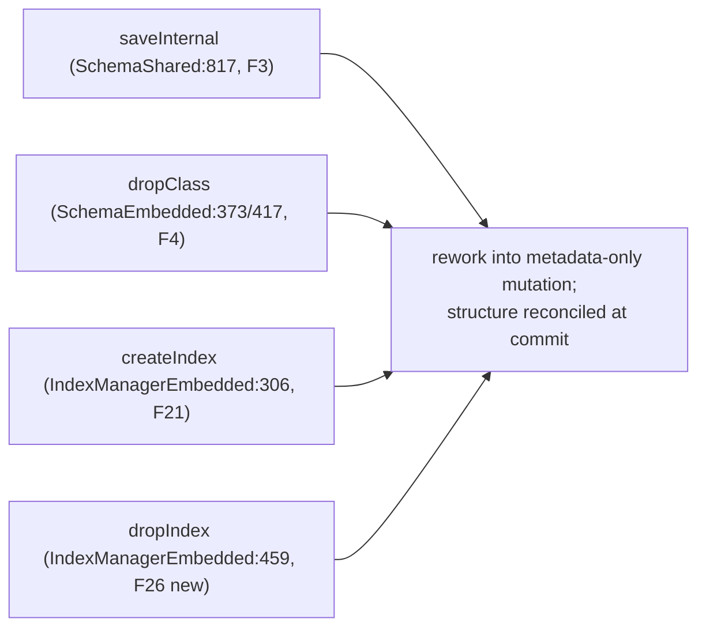
```mermaid
flowchart LR
  G3["saveInternal (SchemaShared:817, F3)"]
  G4["dropClass (SchemaEmbedded:373/417, F4)"]
  G21["createIndex (IndexManagerEmbedded:306, F21)"]
  G26["dropIndex (IndexManagerEmbedded:459, F26 new)"]
  G3 --> R["rework into metadata-only mutation;<br/>structure reconciled at commit"]
  G4 --> R
  G21 --> R
  G26 --> R
```

### F27 — Index engines are name-keyed; no first-class rename; drop+create costs in-tx acceleration plus a rebuild
No first-class index rename exists: there is no `ALTER INDEX … RENAME` and no
`renameIndex` API (only `IndexHistogramManager` matches "rename" in the index
package). Index engines resolve by name (`indexEngineNameMap`,
`AbstractStorage:6761`), and the physical B-tree files are named by the index
name: `new BTree<>(name, ".cbt", ".nbt", storage)`
(`BTreeSingleValueIndexEngine:80`), with a stable numeric engine id carried
alongside via `setEngineId(id)` (`:82`). A rename that kept the engine and
changed only the name would have to rename those files, which hits the
non-WAL-safe `writeCache.renameFile` path (F18). So D9's "rename = drop+create"
carries a cost the spine did not spell out: inside the renaming tx the new
index has `indexId == -1`, the planner skips it (D13), and queries fall back to
a correct full scan; acceleration returns only after commit rebuilds the engine
(D12, under the exclusive lock).

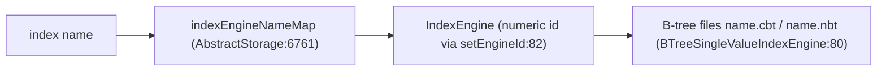
```mermaid
flowchart LR
  N["index name"] --> M["indexEngineNameMap (AbstractStorage:6761)"]
  M --> E["IndexEngine (numeric id via setEngineId:82)"]
  E --> F["B-tree files name.cbt / name.nbt (BTreeSingleValueIndexEngine:80)"]
```

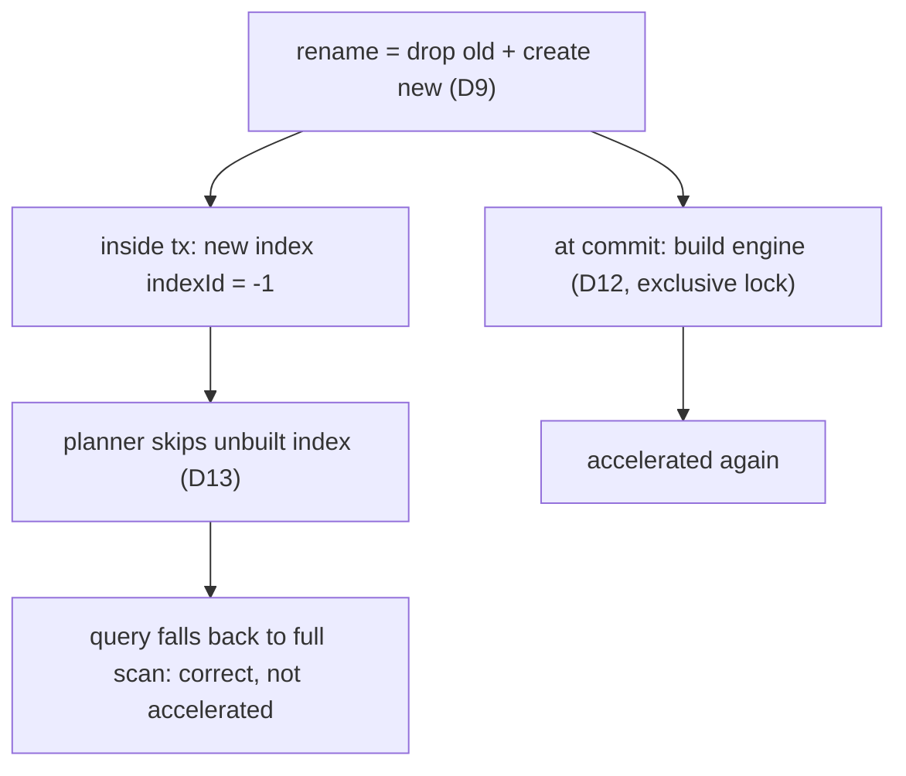
```mermaid
flowchart TD
  R["rename = drop old + create new (D9)"]
  R --> T["inside tx: new index indexId = -1"]
  T --> S["planner skips unbuilt index (D13)"]
  S --> Sc["query falls back to full scan: correct, not accelerated"]
  R --> C["at commit: build engine (D12, exclusive lock)"]
  C --> A["accelerated again"]
```

### F28 — Class rename orphans name-keyed index associations (pre-existing, orthogonal to transactionality)
Renaming a class breaks index-based acceleration today, before any
transactional work. `setNameInternal` (`SchemaClassEmbedded:303`) renames the
collection files but never touches indexes, and `changeClassName`
(`SchemaShared:452`) rekeys only the `classes` map. The planner resolves a
class's indexes through `classPropertyIndex.get(className)`
(`IndexManagerAbstract:99`), keyed by class name, and `IndexDefinition.className`
has no setter (set only at construction or `fromMap`: `PropertyIndexDefinition:49`,
`CompositeIndexDefinition:71`). After `Foo` becomes `Bar`,
`getClassRawIndexes("Bar")` returns nothing: the engine is intact but orphaned
from the class by name, so the planner stops selecting it. D9 calls collection
rename structurally inert and D11 decouples collection names, but neither covers
the class-name to index association. The transactional design must specify how a
class rename re-associates its indexes: re-key `classPropertyIndex` and update
each per-index definition's class name, or drop and recreate the indexes.

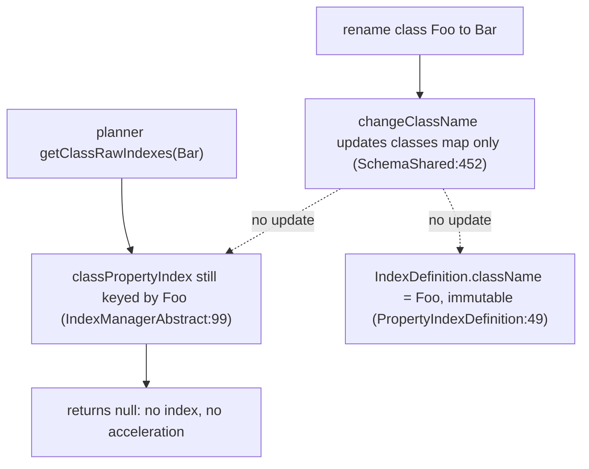
```mermaid
flowchart TD
  REN["rename class Foo to Bar"] --> CN["changeClassName updates classes map only (SchemaShared:452)"]
  CN -. no update .-> CPI["classPropertyIndex still keyed by Foo (IndexManagerAbstract:99)"]
  CN -. no update .-> DEF["IndexDefinition.className = Foo, immutable (PropertyIndexDefinition:49)"]
  PLAN["planner getClassRawIndexes(Bar)"] --> CPI
  CPI --> NUL["returns null: no index, no acceleration"]
```

### F29 — Stable-base-keyed engine files are feasible with no on-disk migration
Feasibility check for making index rename inert (Q11 / F28). Three facts make
it migration-free:

- **The engine config serializer is already extensible.** `CollectionBasedStorageConfiguration.deserializeIndexEngineProperty` (`:1559`)
  reads `indexId` only `if (getVersion(atomicOperation) >= 23 || binaryVersion >= 1)`
  (`:1589`), defaulting otherwise — the canonical version-gated optional-field
  pattern. It also carries an open `engineProperties` string map (`:1537`,
  `:1622`) that a new well-known key extends with no format-version bump.
- **The numeric engine id is already a stable, persisted key.** At reopen,
  `openIndexes` re-slots each engine at its persisted id
  (`indexEngines.set(engineData.getIndexId(), engine)`, `:989`), seeding the
  next-id counter past all persisted ids (`:968`). New ids are monotonic
  appends (`size()`, `:2786`); dropped slots are nulled but never reused. So
  `IndexEngineData.indexId` is load-order-independent.
- **The consumer surface is one seam.** Only `BTree.create` (`:192`–`:193`,
  data file via `getFullName()`, null file via `getName() + nullFileExtension`)
  and `IndexHistogramManager` (`.ixs`, `getFullName()` at `:1800`) turn the
  component name into a file name, both through `StorageComponent.fullName =
  name + extension` (`:96`; `setName` recomputes it, `:135`). Backup and
  export/import tools reference no index file names.

No file migration is needed because no rename path ever changed an index name
(F27/F28), so every legacy index's file name still equals its current logical
name. A persisted physical-file base therefore defaults to `name` for legacy
engines (matches the file on disk) and to the stable id for new engines.

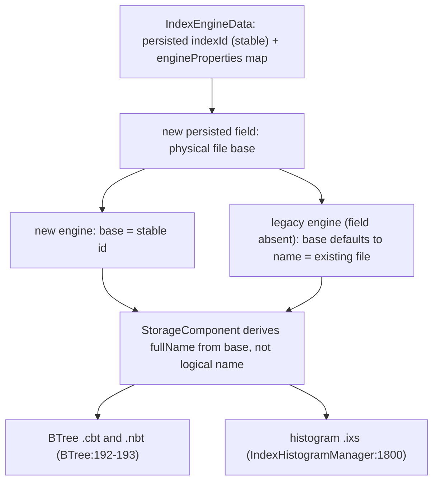
```mermaid
flowchart TD
  EP["IndexEngineData: persisted indexId (stable) + engineProperties map"]
  EP --> BASE["new persisted field: physical file base"]
  BASE --> NEW["new engine: base = stable id"]
  BASE --> LEG["legacy engine (field absent): base defaults to name = existing file"]
  NEW --> SC["StorageComponent derives fullName from base, not logical name"]
  LEG --> SC
  SC --> BT["BTree .cbt and .nbt (BTree:192-193)"]
  SC --> HM["histogram .ixs (IndexHistogramManager:1800)"]
```

### F30 — `IndexDefinition.className`: mutable, not a hash key, composites nest; planner resolves by className not by index name
Investigation of D16's `className` mutability point.

- **Already mutable, low-friction to update.** `className` is non-final
  (`PropertyIndexDefinition:42` protected, `CompositeIndexDefinition:54`
  private) and is rebound during deserialization (`fromMap`, `:218` / `:569`).
- **Never a hash key.** The only definition-holding map is
  `ImmutableSchema.indexes` (`:60`), keyed by index **name** with the
  definition as the value. So in-place `className` mutation cannot corrupt a
  hash bucket; `equals`/`hashCode` participation (`:107`/`:119`, `:439`/`:448`)
  matters only for value comparisons.
- **Composites nest.** `CompositeIndexDefinition` holds
  `List<IndexDefinition> indexDefinitions` (`:52`), each a property definition
  carrying its own `className`. A rename helper must recurse: update the
  composite's `className` plus every nested sub-definition's.
- **Persisted on the entity.** `className` rides `toMap`/`toJson`/`toStream`
  (`:207`, `:506`), so updating it and re-saving the per-index entity (naturally
  dirtied, D6/F20) propagates it.
- **The planner resolves by className, not by index name.**
  `SelectExecutionPlanner` reads `targetClass.getClassIndexesInternal()`
  (`:603`) which goes through `classPropertyIndex.get(className)`
  (`IndexManagerAbstract:99`). Nothing splits an index name on '.' to derive a
  class, and index names are caller-supplied (`SchemaClassImpl.createIndex(iName,
  …)`, `:923`), not engine-generated.

**Consequence — F28's correctness fix is metadata-only and does not require
D16.** On class rename, re-key `classPropertyIndex` (old to new class name) and
update each affected definition's `className` (recursing composites); the index
name and engine files need not change, because the planner never parses the
name. D16's base-keyed files are needed only to make an explicit index-**name**
rename inert (realigning an auto-named `Foo.prop` to `Bar.prop`, or a user
`ALTER INDEX RENAME`), which is cosmetic for correctness since names are not
parsed. So D16 is a capability choice, not a forced consequence of F28.

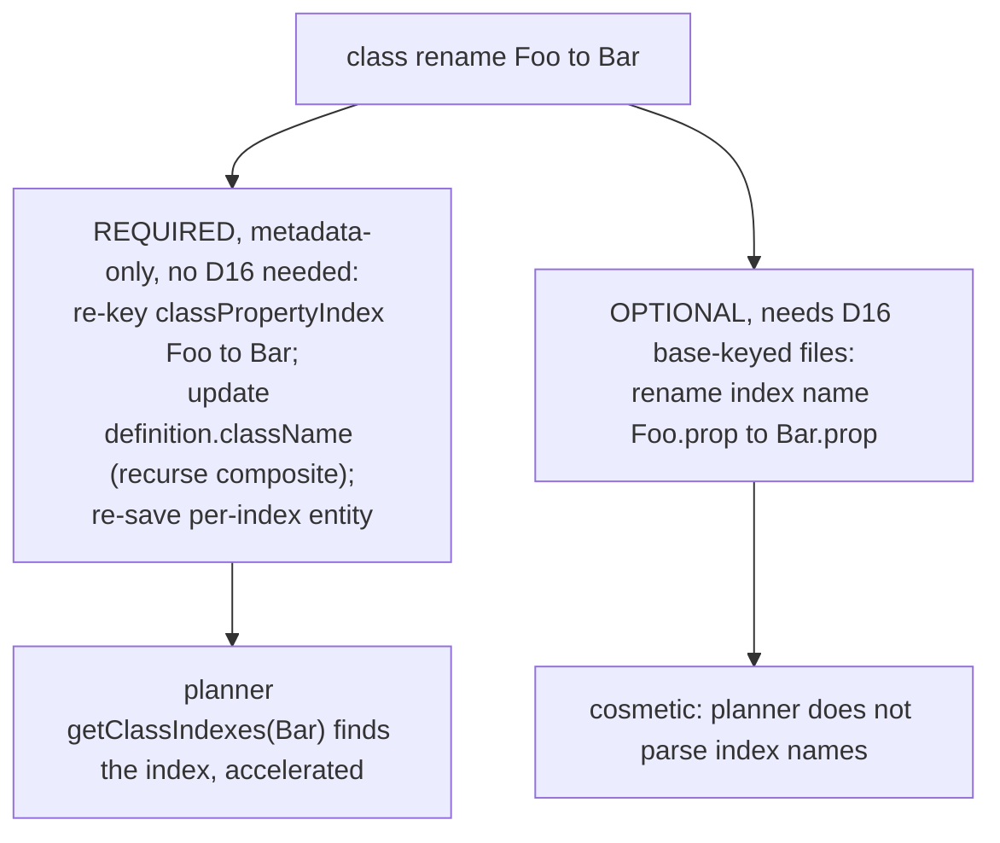
```mermaid
flowchart TD
  REN["class rename Foo to Bar"]
  REN --> REQ["REQUIRED, metadata-only, no D16 needed:<br/>re-key classPropertyIndex Foo to Bar;<br/>update definition.className (recurse composite);<br/>re-save per-index entity"]
  REQ --> OK["planner getClassIndexes(Bar) finds the index, accelerated"]
  REN --> OPT["OPTIONAL, needs D16 base-keyed files:<br/>rename index name Foo.prop to Bar.prop"]
  OPT --> COS["cosmetic: planner does not parse index names"]
```

### F31 — Genesis bootstrap relies on per-op self-commit and no active tx; D1/D7 force it into explicit transactions
The internal-class bootstrap runs inside `createMetadata`
(`DatabaseSessionEmbedded:441`) during session create: `metadata.init` then
`shared.create(this)`, which drives `SecurityShared.create` (`:594`) and the
sibling subsystem creators. `SecurityShared.create` builds the
Identity/OSecurityPolicy/ORole/OUser classes plus the `OUser.name` UNIQUE index
through the normal schema API (`createClass`/`createProperty`/`createIndex`,
inside the helpers — `createClass("OUser", …)` `:883`, the `OUser.name` index
`:899`; `SecurityShared.create` at `:593`), **then** inserts the default roles
and admin/reader/writer users
in `session.executeInTx` blocks (`createDefaultRoles:628`, `createDefaultUsers`).

The class-creation phase runs with **no active tx** — it cannot have one,
because `createIndex` forbids it (F21), and the per-op self-commit
(`saveInternal`, F2/F3) is what materializes each class/collection/index before
the next step. The data-insert phase is a separate tx that runs only after the
classes are already committed. So genesis today is "auto-committing schema ops,
then a data tx."

Interaction with D1/D7/D8:

- **The bootstrap must become tx-aware.** D1 removes per-op self-commit and the
  guards (F3/F4/F21/F26), so `createClass`/`createIndex` at genesis no longer
  materialize a collection or engine until a commit. `SecurityShared.create`
  (and any sibling metadata creators) must wrap schema creation in an explicit
  tx. The session is already active at genesis (`executeInTx` is used there
  today, `:629`), so a tx is available.
- **D7 does not contend at genesis.** Genesis is single-threaded (one creating
  session), so the metadata-write mutex is acquired and released without
  blocking. Its only requirement is that it exists at context-construction time
  (D7 places it on the shared context/storage, built before `createMetadata`),
  not created lazily by a schema op.
- **The tx-local `SchemaShared` seed (D8) must handle the empty/genesis case.**
  The first-ever schema-tx seeds from an empty committed schema and its commit
  writes the first schema record (D14); there is no committed schema to copy.
- **Schema-then-data works in one tx via D3/D2.** Create the class
  (provisional collection id), insert the admin user (temp RID), and the commit
  reconciles structure before record-position allocation (D3), builds the
  `OUser.name` index on the genesis rows (D12), and enforces uniqueness at
  commit-apply (D13). Reads during genesis (a user-exists check) fall back to
  the tx-merged scan because the index is not built yet (D13/F23) — correct.
- **D11 touches the same code.** Internal classes get `minimumCollections = 1`
  and name-prefixed collection names `ouser_<n>` (`SchemaEmbedded:335`–`:342`);
  D11's counter-only naming applies here too.

Net: D7 is benign at genesis; the real work is restructuring the genesis
bootstrap into explicit transaction(s) once per-op self-commit and the tx
guards are removed. Sub-choice resolved by D18: a schema tx committed before
the data tx (two-phase), chosen over a unified genesis tx so the `OUser.name`
index is built before any user insert.

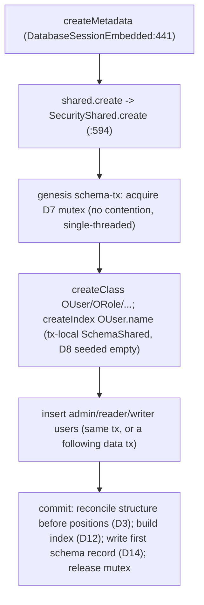
```mermaid
flowchart TD
  CM["createMetadata (DatabaseSessionEmbedded:441)"] --> SC["shared.create -> SecurityShared.create (:594)"]
  SC --> TX["genesis schema-tx: acquire D7 mutex (no contention, single-threaded)"]
  TX --> CL["createClass OUser/ORole/...; createIndex OUser.name (tx-local SchemaShared, D8 seeded empty)"]
  CL --> DATA["insert admin/reader/writer users (same tx, or a following data tx)"]
  DATA --> COMMIT["commit: reconcile structure before positions (D3); build index (D12); write first schema record (D14); release mutex"]
```

### F32 — ClassIndexManager enqueues through an engine-agnostic path; a same-tx engine-less index behaves identically to a built one
On every record write, `ClassIndexManager` resolves the entity's class indexes
via `cls.getRawIndexes()` (`:58`, `:78`, `:421`) and, for each, computes the key
and calls `index.put` / `index.remove` (`addIndexEntry:396`, `addPut:455`).
`IndexOneValue.put` (`:527`) validates the value RID, collates the key, and
calls `transaction.addIndexEntry(this, getName(), PUT, key, rid)` (`:539`): it
records the change in the per-tx `FrontendTransactionIndexChanges`, keyed by
index **name**, and never reads `indexId` or the engine. `IndexUnique` does not
override `put`; it overrides `doPut` (`:52`, the commit-apply path
`storage.validatedPutIndexValue(indexId, …, uniqueValidator, …)`) and
`interpretTxKeyChanges` (`:67`). So uniqueness is enforced at commit-apply,
after the engine exists, and a same-tx put/remove on one key is collapsed first
(`IndexAbstract:747`–`753`), not at enqueue time.

Consequence for a newly-created index with no engine (`indexId == -1`):

- **Writes during the tx are identical to a built index.** The enqueue path is
  engine-agnostic, so tracking entries for a brand-new index never touches the
  missing engine. This confirms F20 from the `ClassIndexManager` side.
- **Uniqueness is deferred to commit-apply.** A UNIQUE new index enqueues
  cleanly; the duplicate check runs at commit via `UniqueIndexEngineValidator`
  once the engine is built (D12).
- **Load-bearing prerequisite (D15).** `ClassIndexManager` only enqueues for
  indexes that `cls.getRawIndexes()` returns, so the D15 overlay must surface
  the tx-created index into that set. If it does not, the tx's own inserts into
  the new index are silently untracked, and the commit-time build scan (which
  covers only already-committed rows, D12) would miss them — a silent
  data-correctness bug, not a loud failure. This is the same coupling D15
  flagged (`getRawClassIndexes` → `getClassRawIndexes`), seen from the write
  side.
- **Writes versus reads.** Writes are always safe (pure enqueue). A direct read
  of the new index during the tx (`getRidsIgnoreTx` → `storage.getIndexValues(indexId,
  …)`, `IndexOneValue:91`) still throws on `indexId == -1` (F23); the planner
  avoids it by skipping unbuilt indexes (D13), which is exactly why genesis is
  two-phase (D18) for the `OUser.name` direct lookup.

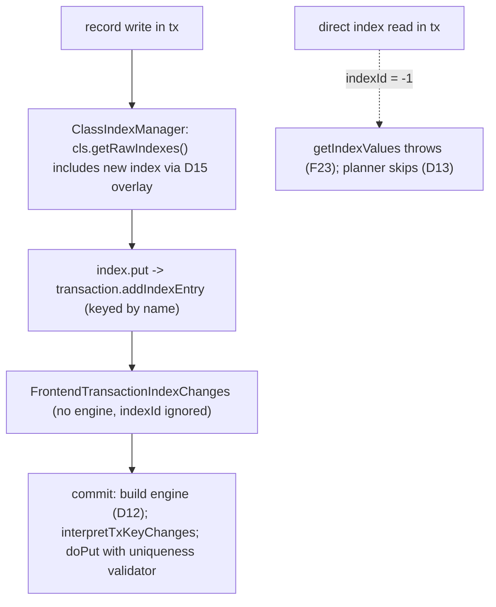
```mermaid
flowchart TD
  W["record write in tx"] --> CIM["ClassIndexManager: cls.getRawIndexes() includes new index via D15 overlay"]
  CIM --> PUT["index.put -> transaction.addIndexEntry (keyed by name)"]
  PUT --> TRK["FrontendTransactionIndexChanges (no engine, indexId ignored)"]
  TRK --> CM["commit: build engine (D12); interpretTxKeyChanges; doPut with uniqueness validator"]
  RD["direct index read in tx"] -. indexId = -1 .-> THR["getIndexValues throws (F23); planner skips (D13)"]
```

## 2a. Adversarial review findings (2026-06-03)

An adversarial sub-agent attacked the spine for contradictions, ungrounded
claims, and gaps. F33 and F35 were re-verified against live code; the rest are
logically grounded in the cited entries. A second pass (2026-06-03, same day)
targeted this session's less-reviewed additions (D16–D19, F26–F38) and added
F39–F42, all re-verified against live code.

**Resolutions:** F33 → D19; F34 → D3 (ordering fixed); F35 → D15 (snapshot-rebuild
invariant added); F36 → F31 (re-cited); F37 → D6 (link-set cross-ref added);
F38 → D7 (same-thread guard added); F39 → D3/D19 (lock-free inner engine
primitives extracted; reconciliation never calls the public write-lock-taking
methods); F40 → D15/D17 (rename-mutation third category; commit-only
re-association); F41 → D8 (tx-local seed pinned to fromStream re-parse);
F42 → D2/D9 (provisional ids must split the `collectionId < 0` predicate;
re-key the reverse map at commit).

### F33 — D1's read→write `stateLock` upgrade is impossible; `ScalableRWLock` is non-reentrant with writer preference [BLOCKER]
D1 says a schema-carrying commit "upgrades from the shared `stateLock` read lock
to an exclusive write lock." `stateLock` is a `ScalableRWLock`
(`AbstractStorage:341`), documented "Not Reentrant" and "Has Writer-Preference"
(`ScalableRWLock.java:64`–`65`), exposing only separate `readLock()` /
`writeLock()` views plus `sharedLock` / `exclusiveLock` — no upgrade or
`tryConvert` primitive. The commit holds `stateLock.readLock()` from `:2285`
through the whole body including `commitIndexes` (`:2375`); `addCollection`
(`:1444`) and `addIndexEngine` (`:2752`) each independently take
`stateLock.writeLock()`. On a non-reentrant, writer-preferring RW lock a thread
holding the read lock cannot acquire the write lock — it self-deadlocks
(writer-preference parks the upgrade while blocking new readers behind it). So
D1's "upgrade" is not supported; F22 already half-admitted this ("read-lock-at-
commit vs write-lock-in-`addIndexEngine` nesting reconciled. Mechanical but
non-trivial."), contradicting D1's clean framing and D7's deadlock proof (which
never accounts for the read lock already held). Resolution required: Q12.

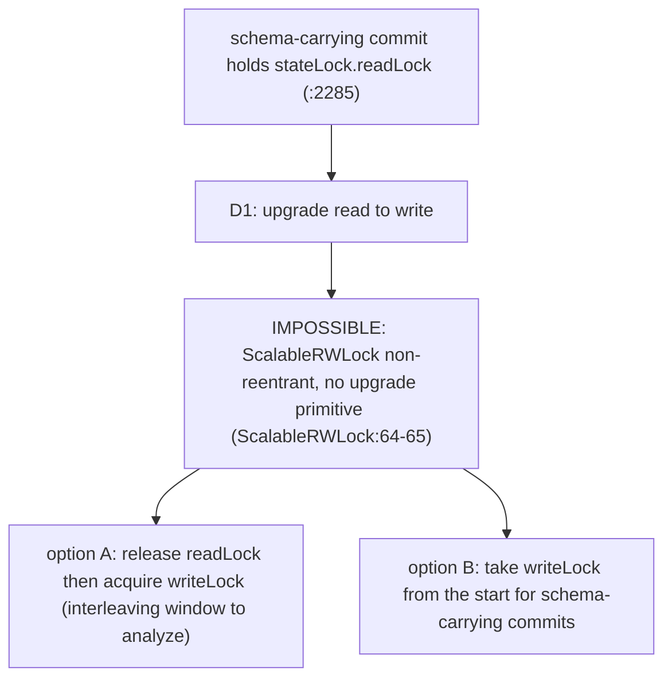
```mermaid
flowchart TD
  C["schema-carrying commit holds stateLock.readLock (:2285)"]
  C --> U["D1: upgrade read to write"]
  U --> X["IMPOSSIBLE: ScalableRWLock non-reentrant, no upgrade primitive (ScalableRWLock:64-65)"]
  X --> A1["option A: release readLock then acquire writeLock (interleaving window to analyze)"]
  X --> A2["option B: take writeLock from the start for schema-carrying commits"]
```

### F34 — D3 and D12 disagree on where engine creation lands in the commit; D3's point is after `lockIndexes` [MAJOR]
D3 places structural reconciliation "before the record-position-allocation loop
(`:2300+`)." But `lockIndexes` is at `:2297`, before the allocation loop at
`:2300`, and F21/D12 both require a new index's engine to exist before
`lockIndexes` (it resolves engines by `indexId` and throws on `-1`). So "before
the allocation loop" does not guarantee "before `lockIndexes`," and an
implementer following D3 literally would create engines too late and hit
`InvalidIndexEngineIdException` (F23). D12 pins the correct order. Fix: D3 must
say index-engine creation lands before `lockIndexes` (`:2297`) and collection
creation before the allocation loop (`:2300`).

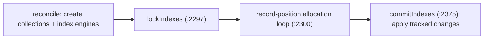
```mermaid
flowchart LR
  REC["reconcile: create collections + index engines"] --> LI["lockIndexes (:2297)"]
  LI --> ALLOC["record-position allocation loop (:2300)"]
  ALLOC --> CI["commitIndexes (:2375): apply tracked changes"]
```

### F35 — The write-path overlay (F32/D15) reads a once-materialized cached index set, so routing the index manager is necessary but not sufficient [MAJOR]
`ClassIndexManager` calls the no-arg `SchemaImmutableClass.getRawIndexes()`
(`:58`/`:78`/`:421`), which returns the cached field `this.indexes`
(`SchemaImmutableClass:636`), materialized once at snapshot `init` (`:165`) via
the session-routed `getRawIndexes(session, …)` → `getRawClassIndexes`
(`:654`/`:670`); the snapshot is cached in `SchemaShared.snapshot` until
`forceSnapshot` (`SchemaShared:194`–`216`). So D15's "route the index manager"
surfaces a tx-created index only if the tx-local snapshot is built after the
overlay exists AND rebuilt after every mid-tx `createIndex`/`dropIndex`. Without
that, the write path reads a stale cached set and the tx's own inserts into the
new index are silently untracked — the exact silent-corruption failure F32
names. New invariant for D15: force a tx-local snapshot rebuild on every overlay
mutation within a schema-tx. (Class rename is commit-only, F40, so it is not an
overlay mutation and needs no mid-tx rebuild.)

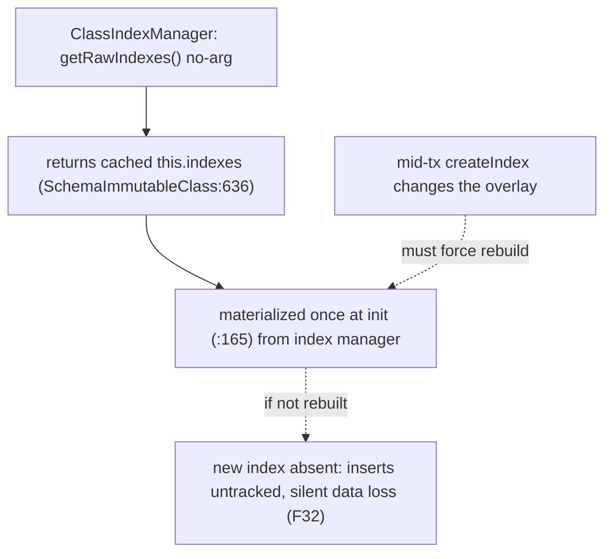
```mermaid
flowchart TD
  CIM["ClassIndexManager: getRawIndexes() no-arg"] --> CACHE["returns cached this.indexes (SchemaImmutableClass:636)"]
  CACHE --> MAT["materialized once at init (:165) from index manager"]
  OV["mid-tx createIndex changes the overlay"] -. must force rebuild .-> MAT
  MAT -. if not rebuilt .-> BUG["new index absent: inserts untracked, silent data loss (F32)"]
```

### F36 — F31's `:602`–`:612` citation points at helper dispatches, not the schema-API calls [MINOR]
F31 cites `:602`–`:612` for `createClass`/`createProperty`/`createIndex`, but
those lines hold the helper dispatches (`createOrUpdateO{SecurityPolicy,Role,User}Class`);
the actual calls live inside the helpers (`createClass("OUser", …)` `:883`, the
`OUser.name` index `:899`), and `SecurityShared.create` starts at `:593` (the
log says `:594`). The substantive conclusion (class creation runs with no active
tx; data insert is a separate `executeInTx` at `:628`) holds. Re-cite to
`:883`/`:899`/`:628`.

### F37 — D6/D9 frame the diff as per-property, but a class DROP has no per-class change to inspect [MINOR]
D6 derives the create/drop set from `EntityImpl` per-property dirty tracking
over changed records; D9 defines drop as "collection ids in old absent from
new." But a dropped class's record is deleted (D14), so it produces no per-class
property change — the only signal is the schema-record link-set losing the link
(D14). So the diff cannot be purely per-class; it must also read the
schema-record link-set delta to detect drops. D6/D9 should state this
cross-reference to D14, or an implementer could build a diff that detects
creates and edits but silently misses drops.

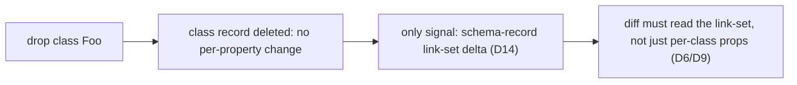
```mermaid
flowchart LR
  DROP["drop class Foo"] --> NOREC["class record deleted: no per-property change"]
  NOREC --> LINK["only signal: schema-record link-set delta (D14)"]
  LINK --> DIFF["diff must read the link-set, not just per-class props (D6/D9)"]
```

### F38 — D7's `finally`-release assumes same-thread; a migrated session throws `IllegalMonitorStateException` [MINOR]
F13 notes a session re-activated on a different thread mid-tx "strands" the
metadata-write mutex; in fact a `ReentrantLock` released in `commit`/`rollback`'s
`finally` on a different thread than acquired throws
`IllegalMonitorStateException`, masking the original outcome. D7 relies on the
same-thread assumption (F13) without a guard. Add an assertion that the
releasing thread equals the acquiring thread, or scope session migration
mid-schema-tx out as a Non-Goal.

### F39 — Engine create/delete have no lock-free inner primitive; D19's held write lock self-deadlocks the public methods [BLOCKER]
D19 has a schema-carrying commit hold `stateLock.writeLock()` from the start, but
the structural primitives reconciliation must call during the commit each
re-acquire the same non-reentrant lock. `addIndexEngine` (`AbstractStorage:2738`)
takes `stateLock.writeLock()` (`:2752`) and inlines the whole
`calculateInsideAtomicOperation` engine-create body inside it (`:2752`–`:2826`);
`deleteIndexEngine` (`:3031`) does the same (`:3036`–`:3064`). `ScalableRWLock` is
"Not Reentrant" (`ScalableRWLock:64`), so re-acquiring `writeLock()` while holding
it self-deadlocks — the same failure mode F33 named, relocated from the upgrade to
the nested call. No `doAddIndexEngine`/`doDeleteIndexEngine` lock-free variant
exists (grep: none), and today's `commit()` body (`:2192`–`:2432`) never calls
these methods — it only calls `lockIndexes` (`:2297`) and `commitIndexes`
(`:2455`), so the new design must add engine create/delete to the commit window
before `lockIndexes` (D3/F34), exactly where D19 already holds the write lock.

Collections do not have this problem: public `addCollection` (`:1441`) delegates
to a lock-free `doAddCollection(atomicOperation, …)` (`:5002`) and `dropCollection`
to `dropCollectionInternal(atomicOperation, …)` (`:5094`) (F8). Engines were never
refactored that way, so the spine's "build the engine at commit" (D12/D15/D18)
silently assumes a seam that does not exist.

Resolution (D3/D19): extract lock-free `doAddIndexEngine(atomicOperation, …)` and
`doDeleteIndexEngine(atomicOperation, …)` from the public bodies, leaving the
public methods as `writeLock + doX`. Commit reconciliation calls the
`doX(atomicOperation, …)` primitives plus the existing
`doAddCollection`/`dropCollectionInternal`, never the public write-lock-taking
methods.

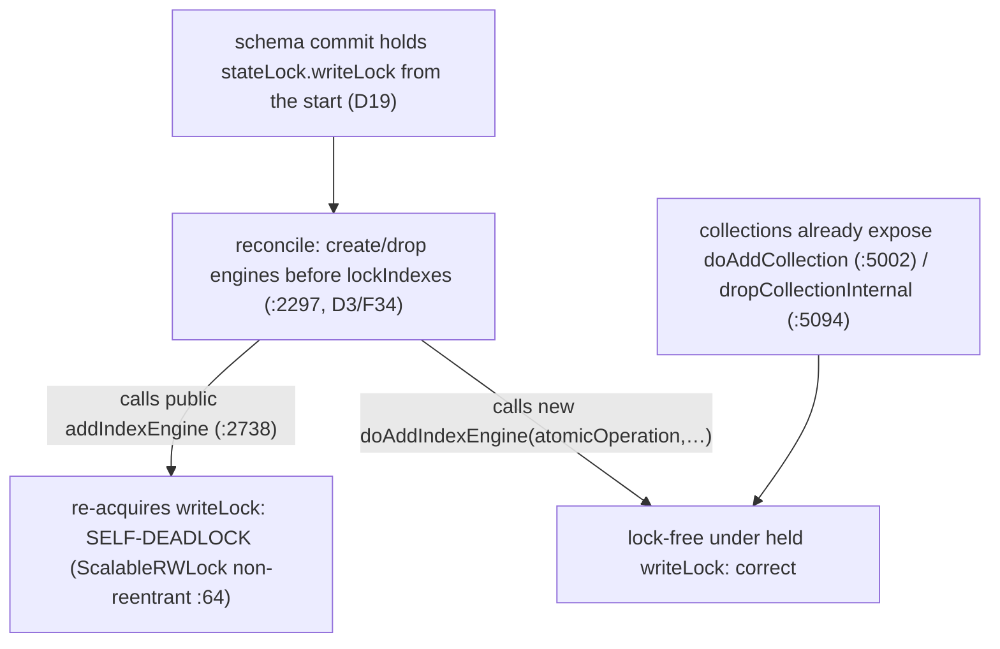
```mermaid
flowchart TD
  C["schema commit holds stateLock.writeLock from the start (D19)"]
  C --> REC["reconcile: create/drop engines before lockIndexes (:2297, D3/F34)"]
  REC -- "calls public addIndexEngine (:2738)" --> X["re-acquires writeLock: SELF-DEADLOCK (ScalableRWLock non-reentrant :64)"]
  REC -- "calls new doAddIndexEngine(atomicOperation,…)" --> OK["lock-free under held writeLock: correct"]
  CO["collections already expose doAddCollection (:5002) / dropCollectionInternal (:5094)"] --> OK
```

### F40 — D15's overlay and F35's rebuild trigger enumerate create/drop only; D17's class rename is a third category they miss [MAJOR]
D15 models the tx-local index view as committed + tx-created − tx-dropped, and F35
forces a tx-local snapshot rebuild "on every mid-tx createIndex/dropIndex." D17's
class-rename re-association is neither create nor drop: it mutates a committed
index in place — re-keys `classPropertyIndex` (old→new class) and sets
`IndexDefinition.className` (recursing composites, F30) on an index that already
exists. Two gaps fall out:

- **Vocabulary.** D15's overlay has no slot for an in-place definition mutation
  and explicitly does not copy `Index` objects (thin handles, F25), so "the
  changed-index set drives the commit" needs the rename-only category defined or
  the commit never writes the re-keyed association.
- **Visibility + isolation, unstated.** The log never says whether D17
  re-association is visible inside the renaming tx or applied only at commit.
  Tx-local visibility would mutate `className` on the shared committed `Index`
  object — leaking the uncommitted rename to other sessions (D4 violation) — and
  would force F35's trigger set to add the rename case. Commit-only re-association
  has no such hazard: the className mutation lands at commit under D19's write
  lock, and the renaming tx falls back to a correct unaccelerated scan for the
  renamed class (the staleness D17 already accepts).

Resolution (D15/D17): adopt commit-only re-association for v1. D17 states it; D15
adds rename-only mutation as an explicit third category in the changed-index set;
F35's create/drop-only rebuild trigger stays correct because rename is not
tx-locally visible.

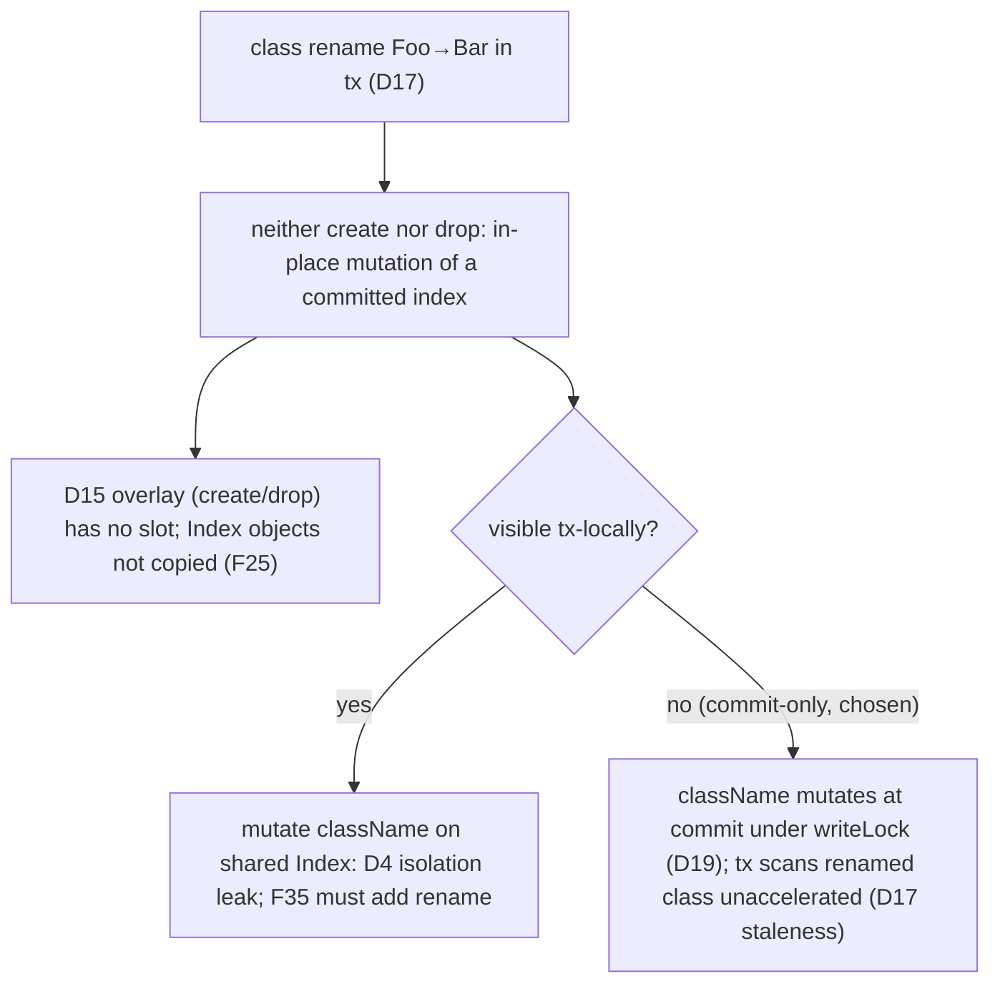
```mermaid
flowchart TD
  REN["class rename Foo→Bar in tx (D17)"] --> CAT["neither create nor drop: in-place mutation of a committed index"]
  CAT --> D15X["D15 overlay (create/drop) has no slot; Index objects not copied (F25)"]
  CAT --> VIS{"visible tx-locally?"}
  VIS -- "yes" --> LEAK["mutate className on shared Index: D4 isolation leak; F35 must add rename"]
  VIS -- "no (commit-only, chosen)" --> SAFE["className mutates at commit under writeLock (D19); tx scans renamed class unaccelerated (D17 staleness)"]
```

### F41 — D8's tx-local seed is load-bearing, not a free planning choice: only fromStream re-parse binds owner + graph into the copy [MAJOR]
D8 frames the tx-local `SchemaShared` seed as "deep-copy vs fromStream re-parse —
planning picks," a non-blocker. But "derived state maintained for free by the
existing mutation methods" holds only when every copied class is a fresh object
bound to the tx-local owner, and the code makes that contingent on the seed
mechanism:

- **`SchemaClassImpl.owner` is `final`** (`:72`), set only in the constructor
  (`:89`/`:108`) — no setter. A field-level deep clone cannot rebind it.
- **`superClasses`/`subclasses` are `List<SchemaClassImpl>` object references**
  (`:78`/`:80`); the polymorphic ripple walks them (`SchemaClassEmbedded:644`
  recurses `superClass.addPolymorphicCollectionId`; `SchemaClassImpl:681` walks
  `superClasses`).
- **The mutation methods the ripple rides reach through `owner`:**
  `owner.acquireSchemaWriteLock(session)` (`:1169`), `owner.getClass(name)`
  (`:268`/`:830`), `owner.checkEmbedded(session)` (`:1182`).

A naive deep-copy that shares or field-copies references leaves `owner` and the
superclass/subclass refs pointing at the **committed** `SchemaShared`. Then every
tx-local schema mutation (a) acquires the **shared** schema write lock —
serializing all sessions and defeating D5/D8's low-contention isolation premise —
and (b) ripples `polymorphicCollectionIds` into the **committed** class objects, a
direct D4 isolation violation and shared-state corruption, the opposite of "free."

`fromStream` re-parse avoids this for free: `createClassInstance` constructs
`new SchemaClassEmbedded(this, …)` (`SchemaEmbedded:217`/`:478`) bound to the
tx-local `SchemaShared`, and `fromStream` (`SchemaShared:487`) rebuilds the whole
graph (owner, superClasses, subclasses) inside the copy. There is no
copy-constructor or clone on `SchemaShared` today (only the no-arg `SchemaShared()`,
`:116`), so "deep-copy" would have to reimplement that reconstruction regardless.

Resolution (D8): pin the seed to `fromStream` re-parse (or an equivalent
fresh-object reconstruction that rebinds `owner` and re-wires the class graph). The
seed mechanism is load-bearing for correctness and isolation, not a free planning
choice.

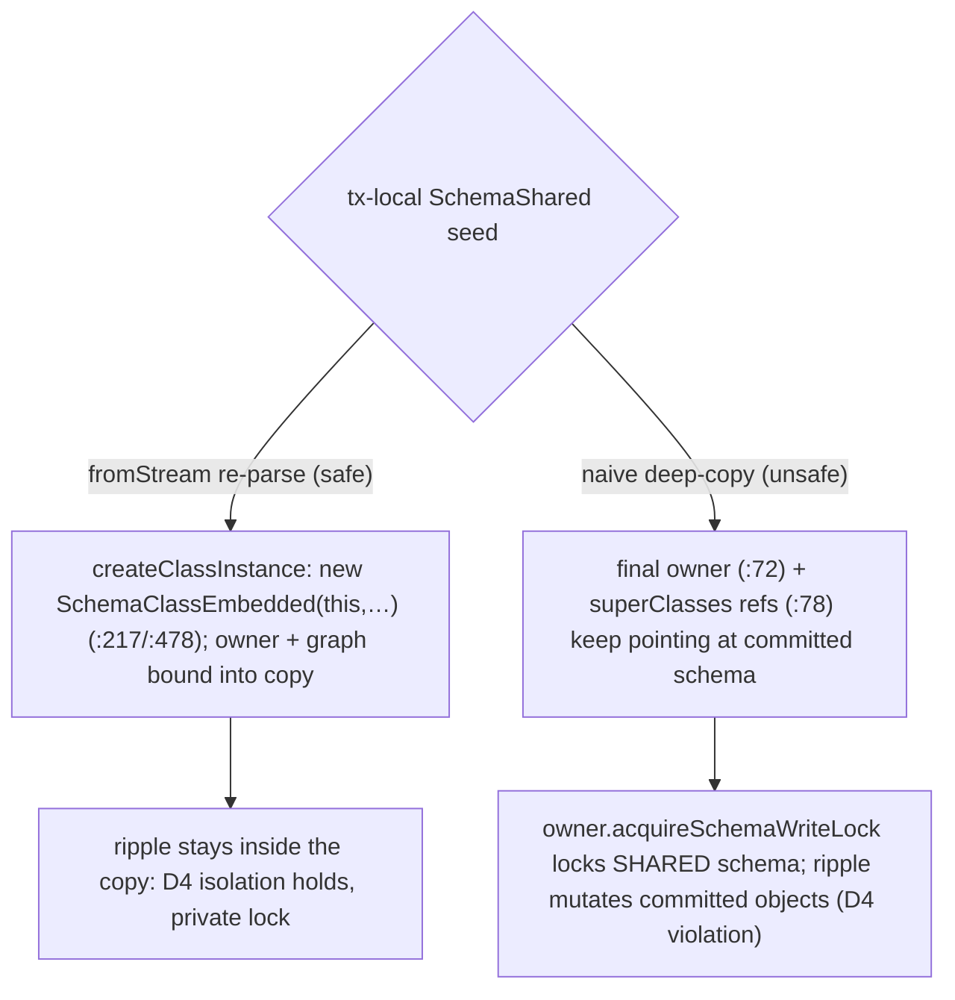
```mermaid
flowchart TD
  SEED{"tx-local SchemaShared seed"}
  SEED -- "fromStream re-parse (safe)" --> FRESH["createClassInstance: new SchemaClassEmbedded(this,…) (:217/:478); owner + graph bound into copy"]
  FRESH --> FREE["ripple stays inside the copy: D4 isolation holds, private lock"]
  SEED -- "naive deep-copy (unsafe)" --> SHARE["final owner (:72) + superClasses refs (:78) keep pointing at committed schema"]
  SHARE --> CORRUPT["owner.acquireSchemaWriteLock locks SHARED schema; ripple mutates committed objects (D4 violation)"]
```

### F42 — Provisional negative collection ids collide with the pervasive `collectionId < 0` convention; the record→class resolver skips them [BLOCKER]
D2 gives a new collection a "provisional (sentinel/negative) collection ID …
mirror[ing] temp RIDs," and D9 constrains it only to be "disjoint from -1." But
the negative-collection-id space is not free: the schema layer tests
`collectionId < 0` (not `== -1`) and treats every negative as "no physical
collection — skip." Representative sites: `SchemaShared.addCollectionClassMap:871`
and `SchemaEmbedded.removeCollectionClassMap:506` (skip the reverse map),
`SchemaEmbedded.checkCollectionsAreAbsent:355` and `addCollectionForClass:522`
(skip uniqueness/assignment), `SchemaShared.checkCollectionCanBeAdded:317` (skip
blob-collision), `SchemaClassImpl.renameCollection:1397` (skip file rename), plus
storage bounds checks `collectionId < 0 || >= collections.size()`
(`AbstractStorage:1526/:1570/:3793/:5456`). A provisional id of -2 is disjoint
from -1 yet caught by every one.

The load-bearing collision is the record→class resolver.
`getClassByCollectionId(collectionId)` returns `collectionsToClasses.get(...)`
(`SchemaShared:341`, `ImmutableSchema:285`), and that map skips negatives on
population (`addCollectionClassMap:871`). It is called from the record read/write
path on `rid.getCollectionId()` — `DatabaseSessionEmbedded:2035`/`:2065`/`:3360`/
`:3455`, `EdgeEntityImpl:79`/`:110`, `JSONSerializerJackson:513`,
`GremlinResultMapper:89`. So a record the tx inserts into its new (provisional)
collection cannot resolve back to its class during the tx:
`getClassByCollectionId(provisionalId)` is `null`, and the callers NPE or
mis-handle. D9's "disjoint from -1" is necessary but nowhere near sufficient.

The storage-side `< 0` bounds checks are safe — provisional ids never reach
storage mid-tx (D1/D4) and are resolved to real ids before D3's reconciliation —
but the in-memory schema maps are not.

Resolution (D2/D9): split the `collectionId < 0` predicate three ways at the
in-memory schema-map sites — abstract (`== -1`, skip), provisional (`<= -2`, treat
as a pending real collection: populate `collectionsToClasses`, validate
uniqueness), real (`>= 0`, today's path) — so the tx-local record→class resolver
works for new-collection records. At commit, the provisional→real resolution (D2)
must also re-key `collectionsToClasses` provisional→real; D2's patch list (class
id-list + record RIDs) currently omits the reverse map. File-op and storage-bounds
sites keep rejecting negatives (a provisional collection has no files and never
reaches storage until resolved).

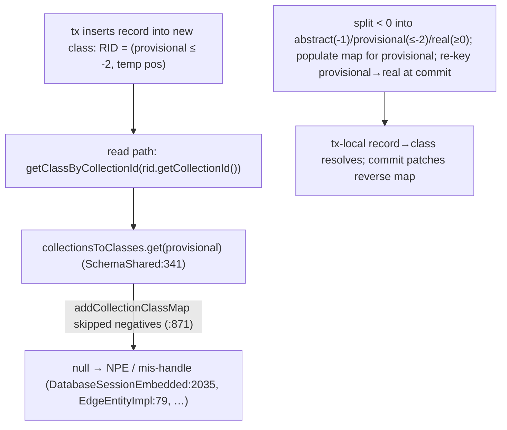
```mermaid
flowchart TD
  INS["tx inserts record into new class: RID = (provisional ≤ -2, temp pos)"]
  INS --> RES["read path: getClassByCollectionId(rid.getCollectionId())"]
  RES --> MAP["collectionsToClasses.get(provisional) (SchemaShared:341)"]
  MAP -- "addCollectionClassMap skipped negatives (:871)" --> NUL["null → NPE / mis-handle (DatabaseSessionEmbedded:2035, EdgeEntityImpl:79, …)"]
  FIX["split < 0 into abstract(-1)/provisional(≤-2)/real(≥0); populate map for provisional; re-key provisional→real at commit"] --> OK["tx-local record→class resolves; commit patches reverse map"]
```

---

## 3. Decisions

### D1 — Invert the dependency: metadata-first, storage reconciles at commit
**Locking resolved by D19: a schema-carrying commit takes `stateLock.writeLock()`
from the start (not a read→write upgrade — F33); pure-data commits keep the
read-lock fast path. The "upgrade" wording in the Locking bullet below is
superseded by D19.**

Chosen direction (from the assignee, 2026-06-03). Today storage leads:
create/drop collection/index at the storage level, then reflect it in the
metadata record. Invert it:

- **During the tx:** mutate only the metadata records (schema, index
  definitions). They are ordinary transactional records, so rollback is free —
  no orphaned collections, no in-memory revert problem.
- **At commit:** storage diffs the committed metadata against current structure
  and creates/drops the matching collections/indexes, driven by the commit's
  own atomic operation (F7, F8), so structural changes are atomic with the
  record writes.
- **Locking:** a commit that carries schema changes takes the exclusive
  `stateLock` write lock from the start (D19, not a read→write upgrade — F33),
  since it now mutates storage structure.

Resolves Q2 (allocation is deferred to commit; no eager-allocate-then-reclaim)
and Q4 (architecture supplied). Shapes Q1 toward full transactional semantics.

### D2 — Provisional collection IDs, resolved at commit (mirror temp RIDs)
A new collection gets a provisional (sentinel/negative) collection ID during
the tx, the same way a new record gets a temporary RID today. At commit,
storage creates the real collection, obtains the real ID, and patches every
reference: the class metadata's collection-id list and the RIDs of records
inserted into that collection. The existing temp-RID resolution path is the
template — `ChangeableRecordId.setCollectionAndPosition(...)`
(`AbstractStorage.java:2350`) already rewrites a temp RID to its persistent
form in place at commit, guarded by `assertIdentityChangedAfterCommit`. The
provisional collection ID adds one prior step: resolve
`provisionalCollectionId → realCollectionId` before record-position allocation.

**Provisional ids collide with the `collectionId < 0` convention (F42).** The
negative space is not free: the schema layer tests `collectionId < 0` (not
`== -1`) in 11+ places and skips every negative, including the
`collectionsToClasses` reverse map that `getClassByCollectionId` uses to resolve a
record to its class. So provisional ids must be a disjoint sub-range (`<= -2`)
**and** the in-memory schema maps must treat provisional ids as pending-real
(populate the reverse map, validate uniqueness) while file/storage sites keep
skipping them. The commit-time patch list above gains a fourth item: re-key
`collectionsToClasses` provisional→real, alongside the class id-list, the record
RIDs, and the provisional→real resolution step.

### D3 — Commit ordering: structural reconciliation before record allocation
At commit, create/drop collections and indexes (driven by the commit's atomic
operation). Index-engine creation lands **before `lockIndexes` (`:2297`)** and
collection creation **before the record-position-allocation loop (`:2300`)**: a
record inserted into a new class can only get a position once its collection
exists, and `lockIndexes` resolves engines by `indexId` and throws on `-1`, so
"before the allocation loop" alone is too late for engines (F34). Confirmed with
the assignee. Reconciliation calls the lock-free inner primitives —
`doAddCollection`/`dropCollectionInternal` for collections, and new
`doAddIndexEngine`/`doDeleteIndexEngine(atomicOperation, …)` extracted from the
public methods for engines — never the public `addCollection`/`addIndexEngine`/
`dropCollection`/`deleteIndexEngine`, which re-acquire the non-reentrant
`stateLock.writeLock()` the commit already holds (F39).

### D4 — Isolation is record-local, identical to data-record updates
Schema mutations during a tx change only the tx's copies of the metadata
records (schema record, index-manager record). `SchemaShared` (the shared
in-memory structure) is updated only at commit, when storage applies the
committed metadata. The session sees its own uncommitted schema through the
tx-local record view; other sessions keep seeing the pre-commit schema. Same
isolation model already used for data-record updates. No eager mutation of
`SchemaShared`, so D1's "rollback is free" holds.

### D5 — Single schema-writer enforced by locking, never by rollback
"One schema writer at a time" is enforced *pessimistically*: a tx acquires an
exclusive schema-write lock when it first mutates schema and holds it until tx
end, so a second schema-changing tx blocks rather than racing to a commit-time
conflict. Optimistic concurrency that would abort/roll back a schema-changing
tx on conflict is explicitly rejected by the assignee — schema-tx rollback due
to contention is not acceptable. Locking is acceptable because the schema
update rate is low, so blocking contention is rare.

### D6 — Commit-time delta via the diff approach, built from existing tx tracking
The structural delta is computed by diffing metadata, not by a separate
intent list. `FrontendTransaction` already carries the full set of changed
records (the schema record and index-manager record among them) and the index
operations; `EntityImpl` already tracks per-property changes. Commit reads the
old (persisted) metadata against the new (in-tx) metadata and derives the
collection/index create/drop set from those property-level changes. No new
tx-side bookkeeping. Drops are detected from the schema-record link-set delta
(D14), not from per-class property changes — a dropped class's record is
deleted, so it has no per-property change to inspect (F37). From the assignee,
2026-06-03.

### D7 — A dedicated, transaction-scoped metadata-write mutex
Serialize schema/index-changing txns with a new exclusive lock (a
`ReentrantLock` on the shared context / storage), distinct from `stateLock`,
`SchemaShared.lock`, and `IndexManager.lock`. From the assignee, 2026-06-03.

- **One lock for schema and indexes both** — a class with a unique property
  creates a class and an index in the same tx, so a single metadata-write mutex
  avoids a two-lock ordering problem.
- **Acquire** when a tx first mutates schema or indexes; **release** in the
  `finally` of the outermost `session.commit()` / `session.rollback()`
  (`DatabaseSessionEmbedded:3131` / `:3253`; nested txs counted via
  `amountOfNestedTxs()`). Held across the whole tx body. **Guard (F38):** assert
  the releasing thread equals the acquiring thread; a session migrated to
  another thread mid-tx would make this `finally` release throw
  `IllegalMonitorStateException`. v1 scopes mid-tx session migration out (F13).
- **Does not block** data commits (`stateLock.readLock`) or snapshot-based
  schema reads (F12), so the low-rate → low-contention premise holds.
- **At commit**, structural reconciliation additionally takes
  `stateLock.writeLock()` briefly (D1) to exclude concurrent data commits
  during the physical apply.
- **Lock ordering** is always metadata-mutex → `stateLock.writeLock`; nothing
  takes them in reverse, and a second schema tx blocks on the mutex before
  touching anything else, so it is deadlock-free.
- **Thread assumption** verified in F13 (sessions are thread-bound).
- **Rejected:** holding `stateLock.writeLock` for the whole tx (blocks all
  commits, too coarse); reusing `SchemaShared.lock` for tx lifetime (conflates
  per-op nesting with tx lifetime, still blocks lock-based reads).

### D8 — Tx-local schema view via a per-session copy-on-first-write `SchemaShared`
Approach A. From the assignee, 2026-06-03. When a tx first mutates schema (under
the D7 mutex), seed a tx-local `SchemaShared` from the committed schema. For the
tx duration, `SchemaProxy` routes both writes and snapshot reads to the
tx-local structure, so the session sees its own uncommitted classes while the
shared `SchemaShared` stays at committed state for other sessions (D4).

- **Refinement (2026-06-03): full working structure + explicit changed-class
  set.** The in-memory tx-local view stays a full working `SchemaShared` so
  cross-class derived state (inheritance, `polymorphicCollectionIds`, subclass
  sets, the global-properties table) is maintained correctly by the existing
  mutation methods — a change to one class ripples to its transitive subclasses'
  caches, and the full structure gets that right for free — but only when the
  tx-local copy is seeded by `fromStream` re-parse so the class graph and each
  class's `owner` are bound into the copy, not the committed schema (F41). Alongside it, the
  mutation entry points record which classes were touched in a tx-local
  **changed-class set**. The diff lives at the persistence layer, not in the
  in-memory reads: at commit only the class records in the changed-class set are
  written (D14), never the full schema. So "we don't write the full schema" is
  satisfied by the changed-class set driving the per-class commit, while reads
  use the full working structure.
- **At commit:** for each changed class, `toStream` writes its own record (D14);
  the diff (D6) over those changed records derives the structural delta,
  reconciliation (D1, D3) applies it, then the tx-local structure is promoted to
  the shared `SchemaShared` and `forceSnapshot` invalidates the shared snapshot.
  The commit-time `makeThreadLocalSchemaSnapshot` (`AbstractStorage:2235`) pins
  the tx-local (new) schema so data records inserted into a new class resolve to
  it.
- **At rollback:** discard the tx-local structure and the changed-class set; the
  shared `SchemaShared` was never touched (D4's free rollback).
- **Deferred, not rejected — approach B (in-memory overlay).** An immutable-base
  + changed-class-map overlay would avoid the working copy and inherently know
  the changed set, and D14 removed the old objection (no full-schema rewrite at
  commit). It is deferred because every read then needs overlay-aware resolution
  and must recompute the derived-state ripple closure (a changed superclass
  invalidates all transitive subclasses' cached `polymorphicCollectionIds`) —
  new, error-prone logic in a correctness-critical area. The full working copy
  reuses the existing machinery and sidesteps that risk; the copy is cheap and
  rare (D5). Revisit if transient memory on very large schemas ever matters.
- **Planning notes:** the tx-local `SchemaShared` seed is **`fromStream` re-parse**
  (or an equivalent fresh-object reconstruction), not a field-level deep-copy —
  `SchemaClassImpl.owner` is `final` and superclass/subclass links are object
  references, so only constructing fresh classes bound to the tx-local owner keeps
  the derived-state ripple and locking inside the copy (F41). `SchemaProxy` read
  methods (`getClass`, etc.), not only the snapshot, must also route to the
  tx-local structure during a schema-tx, since the schema API reads through the
  proxy. Reuses the existing `toStream`/`fromStream`/`makeSnapshot` machinery.

### D15 — Tx-local index-definition overlay (NOT a content copy of the IndexManager)
From the assignee, 2026-06-03. Indexes also need a tx-local view so a session
sees its own uncommitted index create/drop while others do not — but the
mechanism is **not** a deep copy mirroring D8, because indexes are
storage-backed thin handles, not self-contained in-memory structures (F25).
The right model is a lightweight tx-local **overlay of index
definitions/membership**: the effective index set for the tx = committed
indexes + tx-created − tx-dropped. Index *content* (the BTree entries) is never
copied — it stays storage-backed (committed engines) and the tx's own entries
ride the existing per-tx key-entry tracking (F20), merged at read for already-
built indexes. From the assignee correcting an earlier too-hasty "copy the
IndexManager" framing.

- **Why an overlay, not a copy (the asymmetry with D8).** An `Index` object is a
  thin handle: it holds `indexId` (a handle into storage's engine array),
  `storage`, the definition, `collectionsToIndex`, and the per-index entity RID
  — the data lives in the storage engine (F25). Copying Index objects would
  duplicate handles pointing at the *same* shared engines (no isolation), and a
  new index has no engine at all. So there is nothing to deep-copy. The only
  in-memory state to overlay is the index manager's two flat lookup maps:
  `indexes` (name → Index) and `classPropertyIndex` (class+property → indexes).
  No inheritance-style derived-state ripple exists, so the overlay is clean —
  exactly the diff-style approach the overlay was rejected for on the *class*
  side (D8), justified here precisely because indexes lack the connected graph.
- **What the overlay holds.** tx-created index definitions (metadata-only `Index`
  objects, `indexId == -1`, no engine) added to the effective `indexes` /
  `classPropertyIndex`; tx-dropped indexes hidden from them. A tx-local
  **changed-index set** drives the commit.
- **Rename-mutation is a third overlay category (F40).** D17's class rename
  mutates a committed index in place (re-key `classPropertyIndex`, update
  `IndexDefinition.className`), which is neither tx-created nor tx-dropped. v1
  applies it **commit-only**: the changed-index set carries the rename so the
  commit re-keys the association and re-saves the per-index entity (`className`
  rides `toMap`, F30), but the rename is not visible inside the renaming tx, so no
  shared `Index` object is mutated mid-tx (no D4 leak on the thin handle, F25) and
  F35's create/drop-only rebuild trigger needs no rename case.
- **Required coupling — the snapshot reads the index manager.** A class's index
  list in the snapshot is sourced from the index manager:
  `SchemaImmutableClass.getRawClassIndexes` →
  `getSharedContext().getIndexManager().getClassRawIndexes(...)` (`:654`–`657`).
  So during a schema/index tx the snapshot build (and `ClassIndexManager`) must
  resolve to the **overlaid** index set, or the planner will not see the
  tx-created index (and D13's skip-unbuilt guard never fires) and
  `ClassIndexManager` will not enqueue its entries. This needs a new per-session
  routing seam for the index manager (a proxy or a session-level resolver),
  since none exists today. **Invariant (F35):** `ClassIndexManager` reads the
  **cached** `this.indexes` set, materialized once at snapshot init
  (`SchemaImmutableClass:165`/`:636`), so routing the index manager is necessary
  but not sufficient — the tx-local snapshot must be force-rebuilt on every
  mid-tx `createIndex`/`dropIndex`, or same-tx inserts into the new index are
  silently untracked (the F32 failure mode).
- **No D14-style split needed for indexes.** The index manager is *already*
  per-entity records: the manager record holds a `CONFIG_INDEXES` link set to
  per-index entities (F20). Changed index entities are naturally dirtied and
  only those are written at commit; the per-record diff (D6) is already
  per-index. D14's write-amplification fix is a classes-only concern.
- **Commit / rollback.** At commit, the changed-index set drives: create engines
  for tx-created indexes (D12, F22), drop engines for tx-dropped ones, write the
  changed per-index entities and update the manager link set, then publish the
  definition overlay into the shared index manager and `forceSnapshot`. At
  rollback, discard the overlay and the tracked key-entries; storage engines
  were never touched (D10/F16).
- **Index-change tracking stays consistent.** The per-tx key-entry tracking
  (F20) references the `Index` object; the session's `ClassIndexManager`
  enqueues changes against the overlaid (tx-created or committed) `Index`
  objects, which resolve correctly at commit.

### D9 — Diff over collection ids and index definitions, not class names
From the assignee, 2026-06-03. Collection id is the stable structural identity
(F15), so the commit-time structural diff matches on it:

- **Rename is structurally inert.** A class rename keeps its `collectionIds`,
  so the collection-id set is identical old-vs-new — zero collection
  create/drop. The name change is a property change in the schema record only,
  no data touched. The rename trap is avoided for free.
- **Create** = collection ids in the new schema absent from the old. New
  classes carry provisional (negative) ids during the tx (D2), resolved to real
  ids at commit.
- **Drop** = real collection ids in the old schema absent from the new — drop
  the collection (intended data loss, e.g. drop-class).
- **Abstract classes** carry `collectionIds = {-1}`, so their create/drop is
  pure metadata, no structural op. Constraint folded back into D2: provisional
  ids must use a sentinel range disjoint from `-1` (`NOT_EXISTENT_COLLECTION_ID`)
  and `COLLECTION_ID_INVALID`. Disjointness from `-1` is necessary but not
  sufficient: the schema layer tests `collectionId < 0`, not `== -1`, so the
  predicate must distinguish abstract (`-1`) from provisional (`<= -2`) at the
  in-memory map sites, and the `collectionsToClasses` reverse map needs the
  provisional entry to resolve a new collection's records to their class (F42).
- **Indexes** diff by index identity from the index-manager record. Index
  rename reading as drop+create is acceptable — an index rebuilds with no data
  loss, unlike a collection — so indexes do not need the stable-id treatment
  collections require.

### D13 — A tx-created index is not query-usable until commit; planner skips unbuilt indexes
From the assignee, 2026-06-03. Inside the creating tx, a new index gives no
query acceleration: its engine does not exist until commit (D12), and reading
an engine-less index throws (F23). The planner must skip any index whose engine
is not built (`getIndexId() < 0`, or exclude/flag tx-created indexes in the
snapshot's `getIndexesInternal()` set) so the WHERE block falls through to
`FetchFromClassExecutionStep`. The scan fallback already returns the correct
merged tx view — committed rows + tx updates − tx deletes (F23). The existing
physical-plus-`FrontendTransactionIndexChanges` read-merge for already-built
indexes must be preserved unchanged (F23). Net contract: a newly-created index
becomes query-usable only after its creating tx commits and the engine is
built; queries inside the tx fall back to a correct full scan. Adds a required
planner-guard change to scope.

### D14 — Split the schema into per-class records (persistence), killing write amplification
From the assignee, 2026-06-03. Replace the single schema record (F1, all classes
in one EMBEDDEDSET) with a schema record that links to per-class entity records,
mirroring the index-manager pattern (F20: a `CONFIG_INDEXES` link set pointing
at per-index entities). Each `SchemaClassImpl` carries its own record RID. At
commit, `toStream` writes each class into its own record (load-by-RID + set
properties); `EntityImpl` per-property dirty tracking (D6) means only the
actually-changed class records are written — a one-class change no longer
rewrites the whole schema. This directly attacks the issue's "big amount of
storage writes." A new class is a new record (temp→persistent RID at commit,
D2/F24); a dropped class deletes its record and unlinks it from the schema
record. Inheritance needs no inter-record RID coupling: superclasses are
already referenced by name in the serialized form (`SchemaClassImpl.toStream`
sets `superClass`/`superClasses` to names, `:587`–`:597`).

- **Composition with D8:** the in-memory tx-local view stays approach A (full
  copy) for v1 — the copy is cheap and reuses all mutation machinery, while
  per-class records deliver the write-amplification win at the persistence
  layer and dirty-tracking decides what is written. The in-memory overlay
  (immutable committed base + changed-class map) becomes a feasible future
  refinement but is not needed for v1.
- **New scope this introduces:** `toStream`/`fromStream` rewrite (per-class
  records + schema-record link set) and a schema version bump
  (`CURRENT_VERSION_NUMBER` 4 → new). Existing databases migrate via JSON
  export/import (D20), not an in-place on-open migration, so there is no
  partial-migration crash-safety burden and the version bump becomes a
  reject-and-redirect gate on open. This **overturns the earlier "record format
  unchanged, no migration" assumption.**
- **Diff (D6/D9) becomes naturally per-class** — changed class records appear
  directly in the tx's changed-record set.
- **Scope: v1** (assignee, 2026-06-03). The split is a primary goal of
  YTDB-382 (write-amplification reduction), and doing it alongside the
  transactional work avoids a second schema-format migration later. Carried as
  its own track; existing-database migration is JSON export/import (D20), not an
  on-open migrator, so the track carries no migration crash-recovery work.

### D12 — Accept the index build under the exclusive commit lock for v1
From the assignee, 2026-06-03. Option (a): a transactional index build on an
already-populated class runs inside the exclusive-locked commit atomic
operation, accepting the commit-blocking stall and the single large WAL atomic
operation it produces (F22). Justified by the low schema-change rate (D5). A
follow-up YouTrack issue tracks the optimization (move the build off-lock /
stream it / scope-limit eager build to empty classes). The safe commit-time
ordering still holds: create engine → populate from committed data →
`lockIndexes` → write tx records → `commitIndexes` applies tracked changes (each
key counted once; build scan precedes the record-write loop). Follow-up issue:
YTDB-1064 (depends on YTDB-382).

### D10 — Structural revertibility via the existing atomic-operation WAL; no pool
From the assignee, 2026-06-03. Collection/index create and drop run inside the
transaction's atomic operation (D1, D3). Rollback and crash recovery are
already correct with no deletion pool, because file create/delete is buffered
intent applied only in `commitChanges`, which rollback skips (F16): `deleteFile`
records an id (`AtomicOperationBinaryTracking:882`), `addFile` books a
reservation, and `endAtomicOperation` calls `commitChanges` only when not
rolling back (`AtomicOperationsManager:320`, invariant asserted `:338`). A
rolled-back or crashed-before-commit tx leaves the files byte-for-byte
unchanged — no orphan on create, no data loss on drop. A committed delete is
permanent and redone from the WAL after a crash, as intended.

- **Pool / page-reuse rejected for v1.** Its only correctness benefit
  (revertible delete) is already free (F16). Its performance benefit
  (skip OS file create/delete) needs a new WAL-logged clear-and-reinit op,
  because the one "empty but keep the file" path, `truncateFile`, is not
  crash-safe (F17). Premature given the low schema-change rate (D5). Revisit
  only if schema-change throughput ever matters.

### D11 — Artificial collection names, decoupled from class names; rename is metadata-only
From the assignee, 2026-06-03. Generate collection names from a counter alone
(not `<className>_<counter>`), and make class rename a pure metadata change that
never renames collection files. Rationale: today a class rename physically
renames all four collection files via `writeCache.renameFile`, which runs
outside the WAL and is not crash-revertible (F18) — the only non-WAL-safe
physical collection mutation. Decoupling removes that path, strengthens D9 from
"structurally inert" to "touches zero storage," and is a contained change
(name-generation site `SchemaEmbedded.createCollections:340` plus neutering
`SchemaClassImpl.renameCollection:1392`; the metadata layer is already
id-based, F15).

### D16 — Stable-base-keyed engine files; index rename is metadata-only
**Status: deferred to follow-up YTDB-1066; v1 ships the metadata-only fix (D17).**

From the assignee's steer (2026-06-03: "F28 should cause introduction of
id-keyed engine files"), refined by the F29 feasibility check. Decouple an
index engine's physical file-name base from its logical name and persist the
base, so an index rename changes only metadata and never touches the engine,
its files, or its B-tree data. The base is the stable engine id (F29) for
indexes created after this change, and defaults to the index name for
pre-existing engines, so no on-disk file migration runs (F29). Base-keying is
preferred over literal "id for every file plus migrate legacy files," because
renaming existing files would re-introduce the non-WAL-safe `writeCache.renameFile`
path (F18) for zero benefit.

- **Index rename becomes inert and transactional.** At commit it re-keys the
  in-memory `indexEngineNameMap`, the persisted config entry (delete+add by
  name via `addIndexEngine`/`deleteIndexEngine`, a WAL-safe config write),
  `classPropertyIndex`, and `IndexDefinition.className`, while the engine,
  files, and data stay put. Rollback is free (D4); no rebuild; no D13
  acceleration loss.
- **Complements F28's fix (see F30).** F28's required correctness fix is
  metadata-only — re-key `classPropertyIndex` and update each definition's
  `className` (recursing composites) — and does not need D16. D16 adds inert
  index-**name** rename on top, so an auto-named `Foo.prop` can realign to
  `Bar.prop` without a rebuild instead of going cosmetically stale.
- **Scopes D9.** D9's "index rename = drop+create" stays correct for genuine
  create and drop; only same-engine renames go inert under D16.
- **One new mutability point:** `IndexDefinition.className` has no setter today
  (F28); rename needs a setter or a definition rebuild. Contained.
- **Planning notes (not blockers):** carry the base in a reserved
  `engineProperties` key or a version-gated field (F29 — planning picks); the
  histogram `.ixs` component must source the same base; both the data file
  (`getFullName()`) and the null-bucket file (`getName() + nullFileExtension`,
  `BTree:193`) must derive from the base, so `StorageComponent` stores an
  immutable file base and `setName` changes only the logical name.

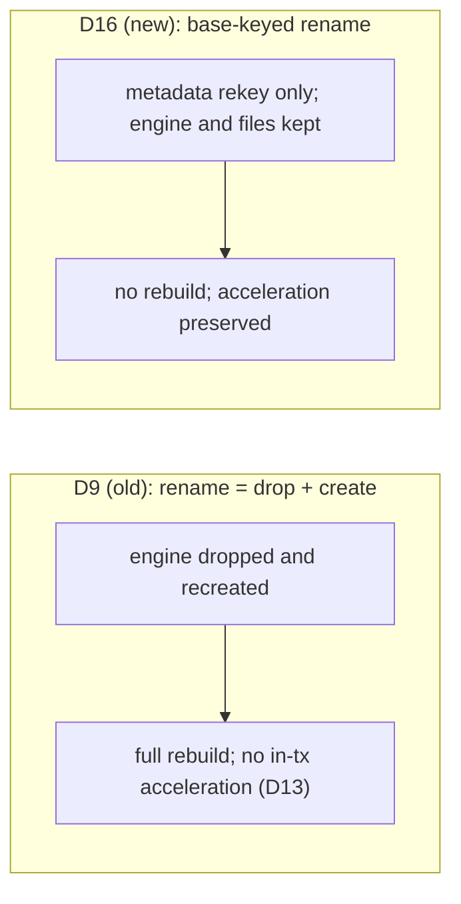
```mermaid
flowchart LR
  subgraph d9["D9 (old): rename = drop + create"]
    o1["engine dropped and recreated"] --> o2["full rebuild; no in-tx acceleration (D13)"]
  end
  subgraph d16["D16 (new): base-keyed rename"]
    n1["metadata rekey only; engine and files kept"] --> n2["no rebuild; acceleration preserved"]
  end
```

### D17 — v1 does the metadata-only class-rename re-association; index-name rename deferred
From the assignee (2026-06-03). Scope the v1 transactional-schema work to the
metadata-only F28 fix and defer the base-keyed engine files (D16) to a
follow-up. In v1, a class rename re-keys `classPropertyIndex` (old to new class
name) and updates each affected definition's `className` (recursing composites,
F30), then re-saves the per-index entity; the index keeps accelerating queries
because the planner resolves by class name (F30). The index **name** is left
unchanged, so an auto-named `Foo.email` reads cosmetically stale on class `Bar`
but stays correct and accelerated. The inert index-name rename and a
user-facing `ALTER INDEX … RENAME` (D16) move to follow-up **YTDB-1066**
(depends on YTDB-382, relates to YTDB-1064).

The re-association is **commit-only** for v1 (F40): inside the renaming tx the
index stays associated with the old class name, so the tx's own queries on the
renamed class fall back to a correct unaccelerated scan (the same staleness
accepted for the index name); the re-key and `className` mutation land at commit
under the exclusive write lock (D19), avoiding any mid-tx mutation of the shared
`Index` object.

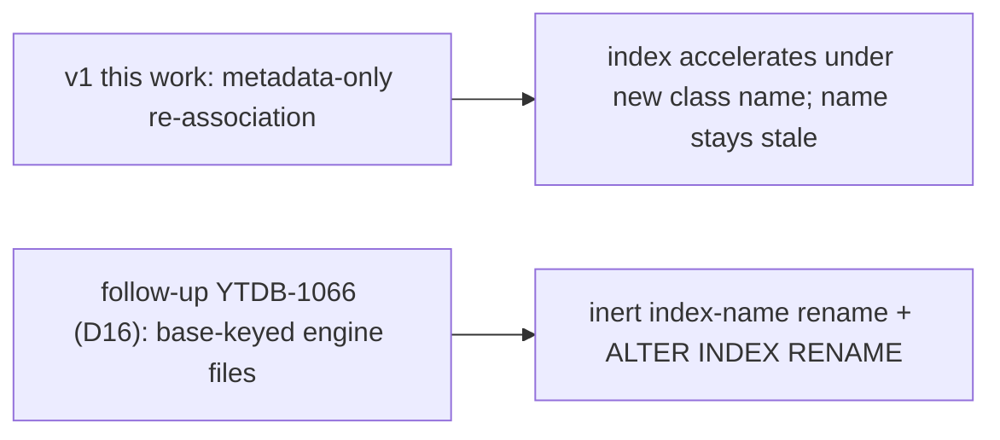
```mermaid
flowchart LR
  V1["v1 this work: metadata-only re-association"] --> A["index accelerates under new class name; name stays stale"]
  FU["follow-up YTDB-1066 (D16): base-keyed engine files"] --> B["inert index-name rename + ALTER INDEX RENAME"]
```

### D18 — Genesis bootstrap is two-phase: a schema tx, then a data tx
From the assignee (2026-06-03), resolving F31's sub-choice. Under the
transactional model, `SecurityShared.create` (and the sibling metadata
creators) restructure into two transactions: a **schema tx** that creates every
internal class, property, and index (Identity / OSecurityPolicy / ORole /
OUser, the `OUser.name` UNIQUE index, and the rest) and commits — reconciling
structure and building the indexes at commit (D1/D3/D12) — followed by a
**data tx** that inserts the default roles and admin/reader/writer users into
the now-committed classes.

- **Why two-phase.** It preserves the current ordering and, crucially, builds
  the `OUser.name` index before any user insert, so the user-creation code's
  direct index lookups resolve against a real engine. The unified single-tx
  alternative would expose a same-tx unbuilt index to any direct (non-planner)
  lookup, which throws unless routed through a scan fallback (F23/D13). Avoided
  here.
- **Still a large write-amplification win.** The schema tx batches every
  internal class into one commit (versus today's per-op self-commits, F2), and
  D14's per-class records keep the schema-record writes minimal.
- **Mutex.** The schema tx acquires the D7 mutex (no contention at genesis,
  F31); the following data tx is an ordinary record tx that never touches
  schema, so it does not engage the mutex.
- **Seeding.** The schema tx is the first-ever schema-tx: D8 seeds the tx-local
  `SchemaShared` from the empty committed schema, and the commit writes the
  first schema record (D14).

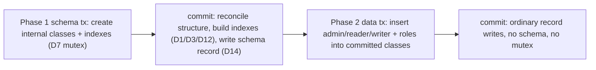
```mermaid
flowchart LR
  P1["Phase 1 schema tx: create internal classes + indexes (D7 mutex)"] --> C1["commit: reconcile structure, build indexes (D1/D3/D12), write schema record (D14)"]
  C1 --> P2["Phase 2 data tx: insert admin/reader/writer + roles into committed classes"]
  P2 --> C2["commit: ordinary record writes, no schema, no mutex"]
```

### D19 — Schema-carrying commits take the write lock from the start; pure-data commits keep the read-lock fast path
From the assignee (2026-06-03), resolving Q12 / F33. The commit decides at entry
whether the tx carries schema or index changes (the same signal that engages the
D7 metadata-write mutex and populates the changed-class / changed-index sets). A
**schema-carrying commit takes `stateLock.writeLock()` from the start** instead
of `readLock()`, so structural reconciliation (D1/D3) runs under the exclusive
lock with no read→write upgrade and no interleaving window. A **pure-data
commit keeps the `readLock()` fast path** (`AbstractStorage:2285`), retaining
today's concurrency. This supersedes D1's "upgrade" framing.

- **No upgrade, no deadlock window.** The exclusive lock is held for the whole
  schema commit, so there is nothing to reconcile mid-commit and D7's ordering
  proof (metadata-mutex → `stateLock.writeLock`) holds without the read-lock
  caveat F33 raised.
- **Cost bounded by the low schema-change rate (D5).** A schema commit excludes
  concurrent data commits for its duration; acceptable because schema changes
  are rare, the same premise that justifies D5/D7/D12.
- **The branch point already exists.** The schema-carry check is the same signal
  that engages the D7 mutex and builds the diff (D6); no new bookkeeping.
- **Reconciliation uses lock-free inner primitives (F39).** Because the write
  lock is held for the whole schema commit and `ScalableRWLock` is non-reentrant,
  reconciliation must call the lock-free `doAdd*`/`*Internal` primitives under the
  held lock, never the public structural methods that re-acquire it. Collections
  already expose them (`doAddCollection`/`dropCollectionInternal`, F8); engines
  need `doAddIndexEngine`/`doDeleteIndexEngine(atomicOperation, …)` extracted from
  the inlined bodies of `addIndexEngine`/`deleteIndexEngine`.

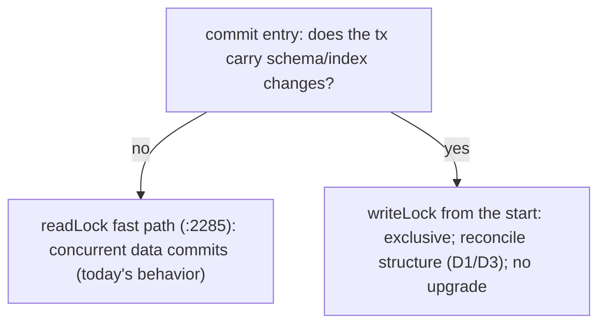
```mermaid
flowchart TD
  CE["commit entry: does the tx carry schema/index changes?"]
  CE -- no --> RD["readLock fast path (:2285): concurrent data commits (today's behavior)"]
  CE -- yes --> WR["writeLock from the start: exclusive; reconcile structure (D1/D3); no upgrade"]
```

### D20 — Schema-format migration is operator-driven JSON export/import, not in-place on-open migration
From the assignee (2026-06-03), superseding D14's "one-time, crash-safe on-open
migration." The single-record → per-class-record schema-format change (D14) is
migrated by exporting the old database to JSON with the old binaries and importing
into a fresh database with the new binaries. No in-place on-open migration runs,
so its crash-safety is a non-issue — there is no partial-migration state to
recover.

- **Export reads the logical schema, not raw record bytes.**
  `DatabaseExport.exportSchema` (`:449`) walks `schema.getClasses()` from the
  immutable snapshot (`:453`/`:464`) and writes class/property/index definitions
  as JSON; it never serializes the schema record's on-disk bytes. The source
  format (single-record) is irrelevant to what is exported.
- **Import rebuilds through the schema API.** `DatabaseImport.importSchema`
  (`:495`) recreates classes (`schema.createClass`, `:701`/`:705`), properties
  (`createProperty`, `:787`), and indexes (`indexManager.createIndex`, `:1420`),
  so the imported database is written in whatever format the current code produces
  — per-class records under D14. The existing round-trip test
  (`DatabaseExportImportRoundTripTest`) covers the path.
- **The new code never parses the old format.** Migration is old-binary export →
  JSON → new-binary import, so the new build needs no single-record reader. Opening
  an old-format database with the new binaries is rejected on a schema version
  check (D14's `CURRENT_VERSION_NUMBER` bump) with a clear "export from the
  previous version and import" message, rather than attempted in place.
- **Composes with the transactional model.** Import builds the schema and then
  loads records — the same schema-then-data ordering as the genesis bootstrap
  (D18); the schema-creating API calls run under the new tx-aware path (D1).
- **Scope effect on D14.** D14 loses the on-open migration sub-task and its
  crash-safety burden; it keeps the `toStream`/`fromStream` per-class-record
  rewrite and the version bump, which becomes a reject-and-redirect gate, not a
  migrator.

```mermaid
flowchart LR
  OLD["old DB (single-record schema)"] --> EXP["DatabaseExport, old binaries: logical schema → JSON (:449)"]
  EXP --> J["JSON dump"]
  J --> IMP["DatabaseImport, new binaries: rebuild via schema API (:495/:701/:787/:1420)"]
  IMP --> NEW["fresh DB: per-class records (D14)"]
  OPEN["open old DB with new binaries"] -. version check, D14 bump .-> REJ["reject + redirect to export/import; no in-place migration"]
```

---

## 4. Open questions

### Open
(none — the architecture spine is settled; Q11 resolved by D16, Q12 by D19.)

### Resolved
- **Q12 — Exclusive lock for schema-carrying commits** → D19 (writeLock from the
  start for schema commits; read-lock fast path for pure-data commits; resolves
  the F33 no-upgrade blocker).
- **Q11 — Inert index rename / id-keyed engine files** → resolved by D17 for
  v1 (metadata-only class-rename re-association; the index keeps accelerating,
  the name stays stale) with D16 (base-keyed files, inert index-name rename)
  deferred to follow-up **YTDB-1066**. F28's association fix is metadata-only
  and independent of base-keyed files (F30); drop+create (D9) stays for genuine
  create/drop only. Feasibility of the deferred work is in F29.
- **Q1 — Target semantics.** Full transactional schema; single-writer via
  locking is the v1 boundary (D5). Cross-session isolation is record-local,
  same as data (D4).
- **Q2** → D1 (defer allocation to commit).
- **Q3 — Isolation** → D4 (record-local) + D5 (lock-serialized writers).
- **Q4** → D1 (architecture supplied by assignee).
- **Q5 — Collection IDs + ordering** → D2 (provisional IDs) + D3 (ordering).
- **Q6 — During-tx schema view** → D4 (record-local; `SchemaShared` updated at
  commit). Mechanics tracked in Q9.
- **Q7 — Schema-write lock** → D7 (dedicated tx-scoped metadata-write mutex).
- **Q8 — Detection and diff approach** → D6 (diff via tx-changed records +
  `EntityImpl` property tracking). Matching/rename mechanics tracked in Q10.
- **Q9 — Tx-local schema view** → D8 (per-session copy-on-first-write
  `SchemaShared`; `SchemaProxy` routes to it for the tx duration).
- **Q10 — Diff matching / rename** → D9 (diff over collection ids, not class
  names; rename is structurally inert).
