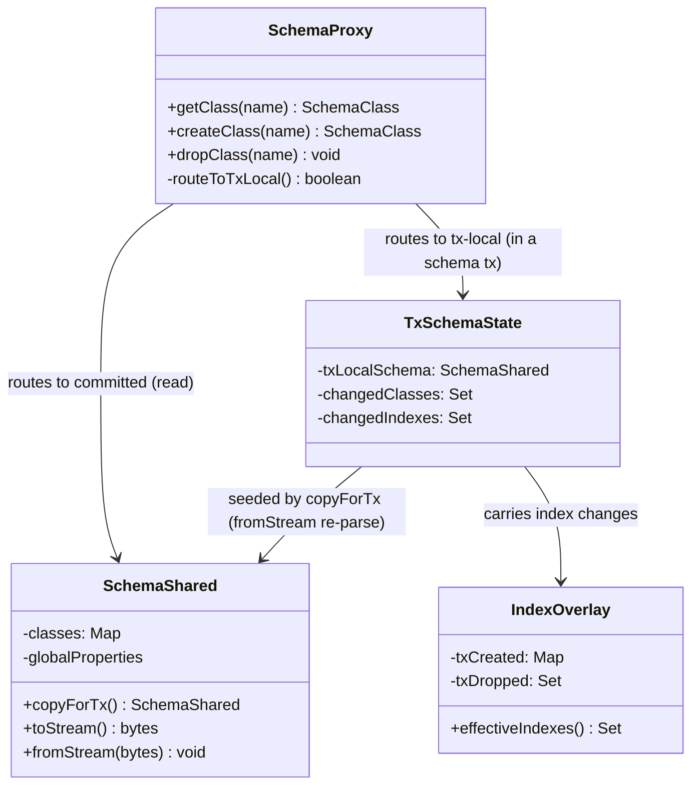
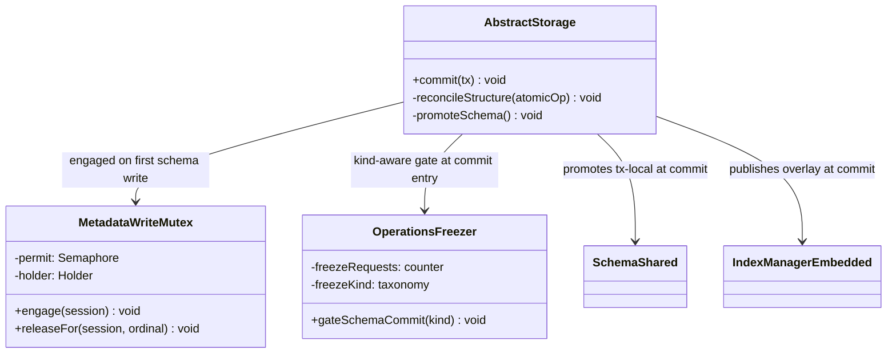
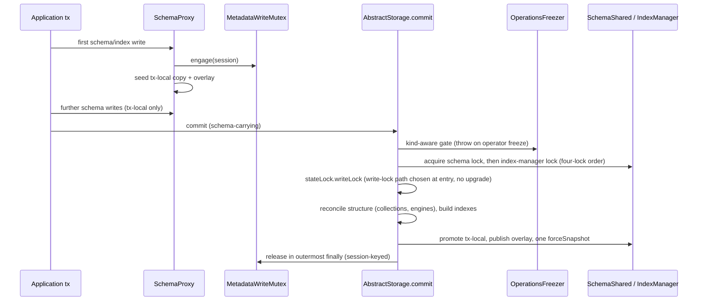
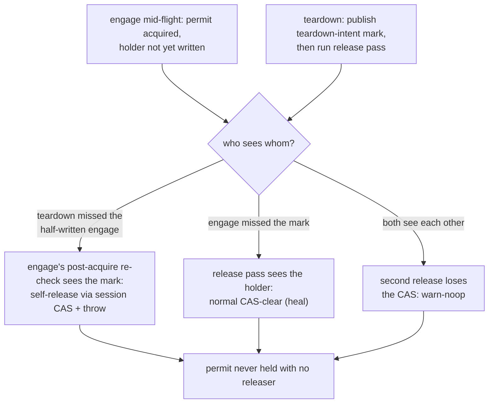
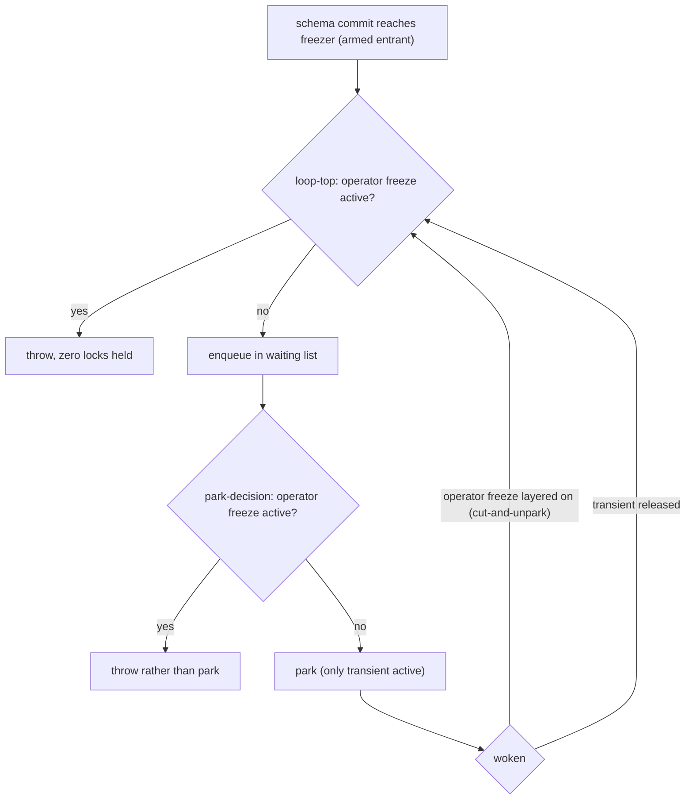

<!-- workflow-sha: 3e9c22298dfe68d2980646704850c781f8af88d5 -->
# Transactional Schema Operations — Design

## Overview

Today storage leads a schema change: `createClass`, `dropClass`, `createIndex`,
and their siblings mutate storage structure first (create or drop the
collections and index engines), then reflect the result into a metadata record.
Each such operation self-commits in its own micro-transaction outside the user's
transaction, the entire schema lives in one record that is rewritten whenever
any class changes, and a schema change cannot be rolled back with the
transaction that made it.

This design inverts the dependency. During a transaction, a schema or index
change mutates only metadata records, which are ordinary transactional records,
so rollback is free and nothing structural has happened yet. At commit, storage
diffs the committed metadata against the current structure and creates or drops
the matching collections and engines inside the commit's own atomic operation,
so the structural change is atomic with the record writes and recoverable from
the WAL. Schema operations become fully transactional: atomic, isolated, and
rollback-free.

Four primitives make the inversion possible: a per-session copy-on-first-write
tx-local `SchemaShared` that `SchemaProxy` routes reads and writes to for the
transaction's duration; a dedicated transaction-scoped metadata-write mutex that
serializes schema-changing transactions; per-class schema records that replace
the single monolithic schema record and kill the write amplification YTDB-382
targets; and a schema-carrying commit that takes the storage write lock from the
start instead of upgrading mid-commit.

Several subsystems restructure to fit: a tx-local index-definition overlay (the
index analogue of the schema copy), a freezer gate that stops a schema commit
from turning an operator freeze into a read outage, a two-phase genesis
bootstrap, base-keyed engine files that make index rename metadata-only, and an
operator-driven export/import path that migrates the schema-record format change
rather than an in-place on-open migration.

The rest of this document is structured as: Core Concepts → Class Design →
Workflow → Part 1 (the transactional schema model) → Part 2 (index
transactionality) → Part 3 (concurrency and locking) → Part 4 (schema-format
migration).

## Core Concepts

This design introduces nine load-bearing ideas. Each is named and used without
re-definition in the Parts that follow; each entry pairs the concept with what
it replaces, so the delta from today's behavior is visible at a glance.

**Metadata-first inversion.** A schema change mutates metadata records during
the transaction and lets storage reconcile structure at commit, rather than
mutating storage first and reflecting it after. Replaces "storage leads,
metadata follows". → Part 1 §"Commit-time reconciliation".

**Tx-local schema view.** A per-session copy of `SchemaShared`, seeded on the
transaction's first schema write and routed to through `SchemaProxy`, so the
session sees its own uncommitted schema while other sessions see committed
state. Replaces "every session shares one live `SchemaShared`, mutated in
place". → Part 1 §"The tx-local schema view and transactional enablement".

**Tx-local index overlay.** A lightweight overlay of index definitions
(committed + tx-created − tx-dropped), not a content copy, since an index is a
thin handle over a storage-backed engine. Replaces "the shared `IndexManager`
mutated per operation". → Part 2 §"Tx-local index overlay".

**Provisional collection id.** A sentinel negative id (disjoint from the
abstract-class marker `-1`, so `<= -2`) a new collection carries during the
transaction, resolved to its real id at commit before any record serializes.
Replaces "real collection id allocated eagerly at create time". → Part 1
§"Commit-time reconciliation".

**Schema-write mutex.** A transaction-scoped `Semaphore(1)` on the shared
context that serializes schema- and index-changing transactions, distinct from
`stateLock`, `SchemaShared.lock`, and the index-manager lock. Replaces "no
cross-transaction schema serialization; per-operation locks only". → Part 3
§"The schema-write mutex and lock order".

**Schema-carrying commit.** A commit that carries schema or index changes takes
`stateLock.writeLock()` from the start; a pure-data commit keeps the read-lock
fast path. Replaces "read lock with a mid-commit upgrade for structural work".
→ Part 3 §"The schema-write mutex and lock order".

**Freeze-kind taxonomy.** A classification of freezes into operator/long-lived
versus transient internal quiesce, so a schema commit can fail loudly against
the first and park briefly against the second. Replaces "one undifferentiated
freeze gate". → Part 3 §"The freezer gate".

**Per-class schema records.** A schema record that links to one record per
class, so a one-class change writes one record, not the whole schema. Replaces
"all classes in a single EMBEDDEDSET record". → Part 1 §"Per-class schema
records".

**Export/import migration.** The per-class-record format change is migrated by
exporting the old database to JSON with the old binaries and importing into a
fresh database with the new binaries, gated by a version check. Replaces "an
in-place on-open migrator". → Part 4 §"Schema-format migration".

## Class Design

The schema-side classes carry the tx-local view and its routing. The diagram
shows the read/write split that `SchemaProxy` enforces during a schema
transaction.

`SchemaProxy` is the routing seam: outside a schema transaction it resolves
against the committed `SchemaShared`; inside one it resolves against the
session's `TxSchemaState`, which holds the tx-local `SchemaShared` copy, the
changed-class set that drives the per-class commit, and the index overlay. The
tx-local copy is a `fromStream` re-parse, not a field copy, so the class graph
and each class's `owner` bind into the copy and the derived-state ripple stays
inside it.

The storage-side classes carry the commit, the serialization mutex, and the
freezer gate. The diagram shows what a schema-carrying commit coordinates.

`MetadataWriteMutex` is the `Semaphore(1)` with a session-keyed holder record;
its engage and release rules are Part 3's subject. `OperationsFreezer` gains the
freeze-kind taxonomy and the kind-aware gate. `AbstractStorage.commit` is where
the reconciliation, promotion, and overlay publication run under the four-lock
sequence.

## Workflow

A schema-carrying commit is the central new flow. The sequence shows the
ordering from the transaction's first schema write through promotion.

The gate throws with zero locks held against an operator freeze, so reads keep
flowing; against a transient quiesce it parks briefly. Reconciliation runs the
lock-free inner primitives under the held write lock. Promotion re-parses the
committed per-class records into the existing shared instances and fires one
`forceSnapshot`. The freezer gate's decision flow is Part 3's subject.

# Part 1 — The transactional schema model

This Part covers how a schema change becomes a transactional record change: the
isolated view a transaction mutates and the entry points reworked to ride it,
what the commit does to turn metadata into structure, the per-class record
format, and the genesis bootstrap that exercises all of it.

## The tx-local schema view and transactional enablement

**TL;DR.** A schema transaction mutates a per-session copy of `SchemaShared`,
seeded on its first schema write and routed to through `SchemaProxy`, while the
shared `SchemaShared` stays at committed state until commit, so other sessions
see the old schema and rollback is free. For this to work, the entry points that
today forbid a schema change inside a transaction, or self-commit their own
micro-transaction, must be reworked to ride the user transaction.

Schema isolation is identical to data-record isolation: a transaction changes
only its own copies of the metadata records, and `SchemaShared` is updated only
at commit when storage applies the committed metadata. The tx-local view is a
full working `SchemaShared`, not an overlay, so the existing mutation methods
maintain cross-class derived state — inheritance, `polymorphicCollectionIds`,
subclass sets, the global-properties table — correctly and for free. The
in-memory overlay alternative (immutable base plus changed-class map) is
deferred, not rejected: it would need overlay-aware resolution and a recomputed
ripple closure on every read, new error-prone logic in a correctness-critical
area, for a copy that is cheap and rare.

The copy must be a `fromStream` re-parse rather than a field-level deep copy,
because `SchemaClassImpl.owner` is final and superclass/subclass links are
object references; only constructing fresh classes bound to the tx-local owner
keeps the derived-state ripple and locking inside the copy. `SchemaProxy` read
methods, not only the snapshot, route to the tx-local structure during a schema
transaction, and class/property proxies re-resolve their target by name against
the tx-local write-view rather than using a captured delegate, so a proxy
captured before the transaction cannot leak a shared instance into the tx-local
graph.

The inversion is only real if the mutation entry points are de-guarded. Every
entry point that today throws on an active transaction — the `SchemaShared`
schema-record save, `dropClass` / `dropClassInternal`, the index-manager
`createIndex` / `dropIndex` — is reworked to ride the user transaction. The
collection-membership entry points (`addCollectionToIndex` /
`removeCollectionFromIndex`, reached transitively from `createClass` /
`addSuperClass` through the polymorphic collection-membership ripple) self-commit
in a nested micro-transaction today; left in place they do not throw, they
silently commit a membership change that escapes the user transaction, leaking it
to other sessions and breaking rollback-freedom. They are de-guarded and routed
through the overlay so the change applies commit-only. The membership ripple also
feeds a null collection name under a provisional id, so commit-only deferral is a
correctness requirement, not only an isolation one.

### Edge cases / Gotchas

- A pre-transaction captured `SchemaClassProxy` whose method is called inside
  the transaction is the transaction's first write and must route to the
  tx-local view; instance capture must not bypass the routing.
- Impl-typed arguments are re-resolved by name on the tx-local side before
  linking, so a shared impl never enters the tx-local graph.
- The throw-guards fail any DDL test loudly when left in place; the self-commit
  guards pass a naive DDL test and fail only an isolation-and-rollback test, so
  the silent failure is the one to test for.

### Decisions & invariants
- D-records: D4 (schema isolation is record-local, identical to data), D8 (a
  per-session copy-on-first-write tx-local `SchemaShared`), D1 (metadata-first
  inversion, which the de-guarding enables), D15 (the index overlay the
  membership change routes through)
- Invariants: I-A5 (record-local isolation), I-A7 (the entry points are
  de-guarded to ride the transaction)

## Commit-time reconciliation

**TL;DR.** At commit, storage computes the structural delta as a set difference
over the committed versus tx-local in-memory collection-id sets, then creates or
drops collections and engines inside the commit's own atomic operation. New
collections carry provisional ids resolved before any record serializes;
reconciliation uses lock-free inner primitives; a failed commit leaves no
structure and no registration behind.

The delta is computed by diffing in-memory structures, not by a separate intent
list: create is a collection id in the tx-local set absent from the committed
set, drop is the reverse. Drop detection is the set difference over the committed
and tx-local `SchemaShared` collection-id sets, never the transaction's
changed-record set — a dropped class's record is deleted, so it carries no
per-property change signal, and a diff built from the changed-record set would
silently drop nothing. A rename keeps its collection ids, so it is structurally
inert: zero collection create/drop, a metadata-only change.

New collections carry provisional ids during the transaction. The negative space
is not free: the schema layer tests `collectionId < 0`, not `== -1`, so
provisional ids use a sub-range disjoint from the abstract-class marker
(`<= -2`), the in-memory maps treat them as pending-real (reverse map populated,
uniqueness validated), and at commit every provisional id resolves to its real id
before any record serializes — including the changed-class records' property
values, or the class durably loses its collections at the next open.

Ordering is load-bearing: engine creation lands before the engine is looked up by
id, collection creation before record-position allocation. Reconciliation calls
the lock-free inner primitives under the already-held write lock, never the
public structural methods that re-acquire the non-reentrant `stateLock`. Index
population for a new index is a lock-free internal scan that emits zero
additional WAL units. Shared-registry publication is deferred to the
post-`commitChanges` success path, and collection and engine ids are drawn from a
commit-local allocator seeded under the write lock, so a failed commit rolls back
the WAL with no phantom registration and reusable ids. Structural revertibility
rides the existing atomic-operation WAL with no deletion pool: file create/delete
is buffered intent applied only in `commitChanges`, which rollback skips, so a
rolled-back or crashed-before-commit transaction leaves the files byte-for-byte
unchanged.

### Edge cases / Gotchas

- Abstract classes carry `collectionIds = {-1}`, so their create/drop is pure
  metadata; the provisional predicate must distinguish `-1` from `<= -2`.
- A committed drop must actually remove the structure; the positive drop path is
  the test that defends the set-difference detection source.
- The "replay cleanly" half of WAL revertibility is conditional on the F55
  lazy-consult replay fix, a prerequisite track.
- A populated-class index build inside the commit is bounded to empty classes (or
  a documented size bound) for v1; the boundary policy is a Phase-1 decision and
  the unbounded case moves to YTDB-1064.

### Decisions & invariants
- D-records: D1 (metadata-first, storage reconciles at commit), D2 (provisional
  collection ids resolved at commit), D3 (commit ordering: structure before
  record allocation), D6 (delta via the diff approach), D9 (diff over collection
  ids, not class names), D10 (structural revertibility via the atomic-operation
  WAL)
- Invariants: I-A1 (atomic structural change, free rollback), I-A2 (provisional
  id never serialized), I-A3 (commit applies structure before it needs it), I-A4
  (a failed commit leaves no phantom registration)

## Per-class schema records

**TL;DR.** The single schema record (all classes in one EMBEDDEDSET) becomes a
schema record that links to one record per class, mirroring the index-manager
pattern. At commit only the changed class records are written, so a one-class
change no longer rewrites the whole schema — the write-amplification reduction
YTDB-382 exists for. The root record carries the residual non-link payload and is
written when that payload changes.

Each `SchemaClassImpl` carries its own record RID as a net-new field, bound at
load from the schema-record link set the way the index manager binds each index's
identity. At commit `toStream` writes each changed class into its own record, and
per-property dirty tracking means only the actually-changed class records are
written. A new class is a new record (temp-to-persistent RID at commit), a
dropped class deletes its record and unlinks it. Inheritance needs no inter-record
RID coupling, since superclasses are referenced by name in the serialized form.

The root schema record keeps the non-link payload — the global-property table,
the collection counter, the blob-collections set — and is written whenever the
class link set or any of that payload changes. The transaction sets those
properties on the root entity (a property-create touches the global table, an
alter-add-collection touches the counter), so dirty tracking puts the root in the
write set for free; without this a committed property-create restarts into a null
global-reference error and a stale counter regenerates colliding collection
names. This format change is the source of the migration in Part 4.

### Edge cases / Gotchas

- The promotion at commit re-parses the committed per-class records into the
  existing shared instances, never adopting tx-local objects whose final owner is
  the dead tx-local instance (see Part 3's promotion invariant).
- The change overturns the earlier "record format unchanged, no migration"
  assumption; existing databases migrate via Part 4's export/import.

### Decisions & invariants
- D-records: D14 (split the schema into per-class records, killing write
  amplification)
- Invariants: I-U1 (per-class records, root written when its payload changes)

## Genesis bootstrap

**TL;DR.** Under the transactional model the metadata creators restructure into
two transactions: a schema transaction that creates every internal class,
property, and index and commits (building the indexes at commit), then a data
transaction that inserts the default roles and users into the now-committed
classes.

The two-phase shape preserves today's ordering and, crucially, builds the
`OUser.name` UNIQUE index before any user insert, so the user-creation code's
direct index lookups resolve against a real engine. A unified single transaction
would expose a same-transaction unbuilt index to a direct (non-planner) lookup,
which throws unless routed through a scan fallback. The schema transaction is the
first-ever schema transaction: it seeds the tx-local copy from the empty
committed schema and writes the first schema record. It engages the metadata-write
mutex (no contention at genesis); the following data transaction never touches
schema and so does not engage the mutex.

### Edge cases / Gotchas

- Genesis exercises the full commit path (reconcile, build indexes, write the
  per-class records) against an empty starting schema, so it is the natural
  end-to-end smoke test of Part 1.

### Decisions & invariants
- D-records: D18 (genesis bootstrap is two-phase: a schema tx, then a data tx)
- Invariants: I-U4 (genesis builds the schema before it inserts users)

# Part 2 — Index transactionality

This Part covers indexes, which need a tx-local view for the same isolation
reason as the schema but a different mechanism (an overlay, not a copy), plus the
commit-time engine build, the query-usability rule inside the creating
transaction, and base-keyed engine files that make rename metadata-only.

## Tx-local index overlay

**TL;DR.** Indexes get a tx-local overlay of definitions (committed + tx-created
− tx-dropped), not a content copy: an index is a thin handle over a
storage-backed engine, so there is nothing to deep-copy. The tx-local snapshot is
force-rebuilt on every mid-transaction index change, and a committed
collection-membership change persists as its own category so the parent index
covers the new subclass collection.

The asymmetry with the schema copy is the point: an `Index` object holds an
`indexId` handle into storage's engine array, the definition, and membership
maps, while the data lives in the engine, so copying handles would duplicate
pointers to the same shared engines (no isolation) and a new index has no engine
at all. The only in-memory state to overlay is the index manager's two lookup
maps. The overlay holds four categories: tx-created definitions (no engine),
tx-dropped (hidden), in-place rename, and in-place collection-membership. The
snapshot's class-index list is sourced from the index manager, so during a schema
or index transaction the snapshot build must resolve to the overlaid set, and
because `ClassIndexManager` reads a cached index set materialized once at snapshot
init, the tx-local snapshot must be force-rebuilt on every mid-transaction index
create/drop (`createIndex` / `dropIndex`) or same-transaction inserts into the new
index are silently untracked. That rebuild is lazy invalidation, not eager
reconstruction (see the research log's delegated list). The per-record tracking
this surfaces is the entry source for pre-existing indexes; a tx-created index's
committed entries instead come from the commit-time re-derivation (see "Index
build and query-usability" below), which stays correct even when an early `deleteRecord`
flush drains operations before the `createIndex`.

At commit the changed-index set drives engine creation and drops, the changed
per-index entities are written, and the definition overlay publishes into the
shared index manager as replacement objects under the index-manager write lock,
sharing the single trailing `forceSnapshot`. A collection-membership change on a
committed index (the `addSuperClass` / alter-add-collection ripple) is a tracked
changed-index category in its own right, so the commit persists the membership
delta and the parent index covers the new subclass collection afterward.

### Edge cases / Gotchas

- A rename mutates a committed index commit-only (re-key the association, update
  the definition's class name), so no shared `Index` is mutated mid-transaction.
- The index-manager record's link set stays monolithic, so incremental creation
  re-serializes the whole set per add; the optimization folds into YTDB-1064.
- The positive membership-coverage test (commit `addSuperClass`, query through
  the parent index, assert subclass rows returned) is what catches an
  implementation that omits the membership-only category.

### Decisions & invariants
- D-records: D15 (a tx-local index-definition overlay, not a content copy of the
  index manager)
- Invariants: I-P1 (promote into existing instances, one forceSnapshot), I-P2
  (overlay plus snapshot rebuild and the membership category)

## Index build and query-usability

**TL;DR.** A transactional index build on an already-populated class runs inside
the exclusive-locked commit for v1, accepting the stall, justified by the low
schema-change rate. Inside the creating transaction the new index gives no
acceleration; the planner skips unbuilt indexes and falls through to a correct
full scan.

The build is a lock-free internal scan feeding the engine, on the commit's single
atomic operation, with no copied session and no nested batch transactions (both
re-enter the non-reentrant `stateLock` under the held write lock). The build
accounts for all the transaction's record operations through a tx-aware split: the
population scan skips RIDs in the transaction's record-operation set, and the
commit-time re-derivation contributes final-state puts only — created and updated
rows whose values are in memory; a deleted row is never put. Population covers
committed rows the transaction did not touch, re-derivation covers exactly the
tx-touched rows, with no double-count and no missing key. v1 scopes the eager
build to empty classes (or a documented size bound), since both the forward and
recovery heap scale with the unit size; the unbounded populated case moves to
YTDB-1064.

Inside the creating transaction a new index's engine does not exist, and reading
an engine-less index throws, so the planner skips any index whose engine is not
built and the WHERE block falls through to a full class scan that returns the
correct merged transaction view (committed rows + tx updates − tx deletes). After
the transaction commits and the engine is built, the index becomes query-usable.

### Edge cases / Gotchas

- The existing read-merge for already-built indexes must be preserved unchanged.
- A residual window remains where a concurrent pure-data commit whose enqueue ran
  before the new index published misses it (the same shape as today's `fillIndex`
  race); closure is follow-up YTDB-1101.
- WAL retention and checkpoint deferral bite only inside the commit window, not
  across a long transaction body; a long schema-transaction body is heap-bounded,
  not WAL-bounded.

### Decisions & invariants
- D-records: D12 (accept the index build under the exclusive commit lock for v1),
  D13 (a tx-created index is not query-usable until commit; planner skips unbuilt
  indexes)
- Invariants: I-P3 (unbuilt index skipped, scan fallback correct), I-P4 (the
  build commits to exactly the transaction's final state)

## Base-keyed engine files and metadata-only rename

**TL;DR.** Engine file names derive from the stable engine id, not the index
name, so an index rename changes only metadata and never touches the engine or
its data. Collection names are generated from a counter alone, so a class rename
is a pure metadata change that renames no collection file. v1 ships the
metadata-only class-rename re-association; the inert index-name rename is
deferred.

Collection names decouple from class names: generated from a counter, never
`<className>_<counter>`, so a class rename never renames a collection file through
the non-WAL-safe rename path — the one non-WAL-safe physical collection mutation,
removed. Engine file bases derive from the stable engine id unconditionally:
under Part 4's import-only migration no name-keyed engine file can exist in a v1
database, so the dual-base compatibility path is dropped, and the data,
null-bucket, and histogram files all derive from the base. A class rename re-keys
the class-property index and updates each affected definition's class name
commit-only, so the index keeps accelerating queries under the new class name
while the index name stays cosmetically stale; the full inert index-name rename
and `ALTER INDEX … RENAME` are deferred to YTDB-1066.

### Edge cases / Gotchas

- Base-keying dissolves the same-name drop-and-recreate file collision, so there
  is no recycle branch and a uniform WAL replay model.
- The class-rename re-association is commit-only, so the renaming transaction's
  own queries on the renamed class fall back to an unaccelerated scan until
  commit.

### Decisions & invariants
- D-records: D11 (artificial collection names, decoupled from class names), D16
  (stable-base-keyed engine files, index rename metadata-only), D17 (v1 does the
  metadata-only class-rename re-association; index-name rename deferred)
- Invariants: I-U2 (class rename touches zero storage), I-U3 (base-keyed engines,
  rename keeps the index accelerating)

# Part 3 — Concurrency and locking

This Part is the design's hardest. It covers the serialization mutex and the lock
order that keep schema commits deadlock-free, the mutex lifecycle and the permit
handshake that keep a pool teardown from wedging DDL, and the freezer gate that
keeps a schema commit from turning a freeze into a read outage. These are the
properties tests catch unreliably, so each section pins the interleaving its test
must exercise.

## The schema-write mutex and lock order

**TL;DR.** A dedicated transaction-scoped `Semaphore(1)` serializes schema- and
index-changing transactions, engaged above the shared metadata locks and released
in the outermost teardown. A schema-carrying commit takes the storage write lock
from the start and acquires the four locks in one acyclic order, so a second
schema transaction blocks rather than racing, and the design is deadlock-free.

Single-writer is enforced pessimistically by locking, never by rollback: a second
schema-changing transaction blocks on the mutex rather than racing to a
commit-time conflict, acceptable because the schema-change rate is low. Optimistic
concurrency that would abort a schema transaction on conflict is rejected. The
mutex is one lock for schema and indexes both, distinct from `stateLock`,
`SchemaShared.lock`, and the index-manager lock. It engages at the `SchemaProxy` /
index-routing layer on the transaction's first write-routed mutation, strictly
before any shared metadata lock and before seeding the tx-local copy. It must not
engage inside the shared lock acquisition: a hook there would park a second
transaction on the mutex while it holds a shared write lock, freezing every
lock-based schema read for the first transaction's duration and deadlocking
against the commit-side schema-lock acquisition.

A schema-carrying commit takes `stateLock.writeLock()` from the start, deciding at
entry from the same signal that engages the mutex; a pure-data commit keeps the
read-lock fast path and today's concurrency. The exclusive lock held for the whole
schema commit removes the read-to-write upgrade and its interleaving window. The
lock order is always metadata-mutex → `SchemaShared.lock` → index-manager lock →
`stateLock.writeLock`, taken in that order and never reversed. The schema lock
joined the order because the commit-side promotion mutates the lock-guarded shared
maps while `reload` takes the schema lock then the state read lock from the data
path; the index-manager lock joined for the same shape one registry over.
Acquiring both metadata write locks before `stateLock` keeps the order acyclic; an
index-only transaction takes the same uniform sequence and the write-lock branch
even though it never touched the schema chokepoint. The engage path additionally
throws when the mutex is held by a different session on the current thread, so
legal embedded session alternation does not self-deadlock the thread on its own
hold; a different-thread holder parks normally as healthy contention.

### Edge cases / Gotchas

- The accepted consequence of the engage-side rejection: one thread cannot hold
  two simultaneously open schema transactions over two sessions; sequential
  schema and data transactions alongside a held mutex stay legal.
- The mutex does not block data commits or snapshot-based schema reads, so the
  low-rate-low-contention premise holds.
- In-scope mitigations convert the two remaining per-record and per-MATCH
  lock-based read sites to snapshot-first reads.

### Decisions & invariants
- D-records: D5 (single schema-writer enforced by locking, never by rollback), D7
  (a dedicated, transaction-scoped metadata-write mutex), D19 (schema-carrying
  commits take the write lock from the start; pure-data keep the read-lock fast
  path)
- Invariants: I-A6 (single writer by locking), I-C1 (the four locks taken in one
  acyclic order), I-C2 (the mutex engages above the shared locks), I-C4 (engaging
  on a thread that already holds it fails loudly), I-U5 (schema-carry write-lock
  from the start)

## Mutex lifecycle and the permit handshake

**TL;DR.** The mutex permit has exactly one releaser and never wedges. Teardown is
owner-thread-only; a pool teardown of a held schema transaction heals the permit
through a session-keyed compare-and-clear, and a torn-down owner's late release
warn-noops rather than throwing from the teardown. Cross-thread reaping of a
stranded transaction is out of scope.

**What the pieces are.** The mutex is a `Semaphore(1)` (one permit), not a
`ReentrantLock`. The choice is forced by teardown: a `ReentrantLock` can be
unlocked only by the thread that locked it, so a dead or reaped owner thread could
never release it (a permanent wedge), whereas a semaphore permit can be released
from any thread. A bare semaphore is unsafe, though, because its `release()` is an
unconditional counter increment any thread can call, so the permit carries an
ownership record written at acquire: `(owning session, acquire ordinal, acquiring
thread)`. The **session** is the release key: release is a compare-and-clear that
fires only if this session still owns the permit, which stops a stale or
just-woken owner from releasing a permit a successor now holds. The **acquire
ordinal** is a monotonic counter that distinguishes this acquisition from a later
one, so a stale presenter is rejected and the permit is never over-released. The
**thread** is engage-guard and diagnostic only (it catches same-thread
self-deadlock per I-C4 and names the holder in the wait diagnostic); it is never
part of the release key, precisely because the one legitimate foreign releaser
runs on a different thread.

The single normal release point is the outermost teardown `finally` of the owning
session's commit or rollback. Two paths reach it. The owner's own `finally` reads
its captured ordinal from the surviving session-side record and CAS-clears. A
foreign teardown (a pool shutdown of a still-checked-out session) runs that
session's own teardown, reads the volatile holder to identify the session, and
CAS-clears when it matches. If both race the same session, exactly one wins the
CAS; the loser warn-noops rather than throwing (a throw from the teardown `finally`
would mask the owner's real exception) or re-releasing (the ordinal-plus-session
key rejects every stale presenter).

The subtle window is an engage caught mid-flight (permit acquired, holder not yet
written) when a one-shot pool close runs its release pass and finds no holder to
clear. Without a fix the owner then finishes acquiring on a now-closed session,
whose `checkOpenness` gate (the open/closed guard on commit and rollback) locks it
out of its own release point: permit held, no releaser, DDL wedged. An
engage/teardown handshake closes it, a store-then-load (Dekker) pair. The teardown
publishes a dedicated volatile teardown-intent mark before its release pass, a
separate flag (not the session's `STATUS.CLOSED`), because teardown runs rollback
before it sets CLOSED and an early CLOSED would trip `checkOpenness` inside
teardown's own rollback. The engage writes the holder after acquiring the permit,
then re-checks the mark; on a marked session it self-releases through the
session-keyed CAS and throws. Store-then-load on both sides guarantees at least one
side sees the other:

One rider: the engagement record (the acquire-time ordinal the `finally`
presents) must survive `rollbackInternal`'s `clear()` / `close()` wipes until the outermost
`finally` consumes it; wiped early, the normal heal presents nothing and wedges.

Teardown is owner-thread-only for every transaction-scoped resource — the mutex,
the freezer engagement, the storage write lock, the snapshot-floor holder
accounting, and the commit-local allocator state. Cross-thread reaping of a
stranded transaction is out of scope for v1: a stranded transaction leaks its pin,
the existing monitor reports it, and a wedged owner keeps the mutex so DDL stays
loudly unavailable until restart. Reclamation is YTDB-1114's job (an
identity-keyed snapshot registry with lease-based stranding detection and
revocation fenced at storage boundaries), never touching tx-private state from a
foreign thread. The one legitimate cross-thread caller, pool-shutdown close of a
checked-out session, runs the owning session's own teardown, so the handshake's
guard matches and the mutex heals.

### Edge cases / Gotchas

- A commit-phase zombie (pool teardown of a session mid-commit, successor DDL
  acquiring the healed mutex) is excluded by the whole-commit schema-lock scope:
  the successor serializes behind the zombie's remaining commit there.
- The `checkOpenness` gate is a best-effort early cap, not a structural property:
  it reads a plain status field with no memory edge from the foreign teardown's
  closed write, so a late-visible status can admit one more zombie commit,
  harmless because that straggler still serializes behind the schema lock on a
  cleared transaction.
- The mutex acquire is timed and re-waits in a loop with a holder-naming
  diagnostic; only an operator interrupt breaks the wait.

### Decisions & invariants
- D-records: D7 (the metadata-write mutex's abnormal-termination release rules)
- Invariants: I-handshake-1 (exactly one releaser, never wedges), I-C3
  (tx-scoped resources torn down only on the owning thread)

## The freezer gate

**TL;DR.** A schema commit never parks inside the four-lock window against an
operator freeze; it aborts loudly within a bound with locks released and reads
flowing. Against a transient internal quiesce it parks briefly and succeeds. The
mechanism is a freeze-kind taxonomy plus a kind-aware gate evaluated at both the
freezer's throw site and its park-decision site, plus an operator-arm
cut-and-unpark for the already-parked case.

The freezer is the commit path's fifth synchronization object, a park gate
engaged lock-free by an operator freeze, not part of the lock order. A schema
commit that parked on it would hold all four locks and convert the freeze window
into a total read outage. The in-window gate alone cannot deliver the loud-failure
promise, and freeze kind is a registration property, not an entrant choice, so the
design adds a freeze-kind taxonomy at the registration sites: an **operator**
(long-lived, admin-initiated) freeze versus a **transient internal quiesce** (the
brief self-freezes for synch, incremental backup, or index rebuild). The loud-fail
decision executes before the four-lock sequence: the schema commit probes the
freezer at entry and, against an operator freeze, throws
`ModificationOperationProhibitedException` (asserted by exact type, not a generic
loud error) with zero locks held; against a transient quiesce it parks. The write
lock is acquired through a bounded try-acquire loop that re-probes and throws,
releasing the held metadata locks, if an operator freeze engaged after the probe,
so the write-lock request never finishes queueing and reads keep flowing.
The in-window gate stays as the authoritative backstop for a freeze engaging after
the write lock is held.

The decision flow at the freezer:

Two windows close by two mechanisms. For the already-parked case (a commit
legitimately parked behind a transient quiesce while an operator freeze layers
on), the operator-kind arm of the freeze cuts and unparks the waiting list after
its increment, so the parked entrant wakes, re-evaluates the kind-aware gate, and
throws — without it the entrant would stay parked for the operator freeze's whole
duration. For the engage-during-enqueue race (an operator freeze engages after the
entrant passes the throw site but before it parks, including the case where the
cut fires before the entrant enqueued and misses it), the kind-aware park-decision
check closes it: the entrant re-evaluates the kind after enqueuing and throws
rather than parks. Data commits keep today's gate semantics (park for park-mode
freezes, throw for throw-mode).

### Edge cases / Gotchas

- The loud failure is asserted by exception type, not by a generic "loud error":
  a bare assertion would pass a masked internal-state exception the design rules
  out.
- A separate pre-call probe before the commit does not satisfy the property: it
  sits outside the entrant/freezer handshake, so a freeze engaging in the
  probe-to-entry window parks the commit inside the four-lock window.
- Any-freeze keying would abort DDL against routine transient quiesces (synch,
  incremental backup, index rebuild); throw-mode-only keying lets a park-mode
  backup freeze re-create the outage. The taxonomy is the needed middle.

### Decisions & invariants
- D-records: D7 (the freezer gate as the metadata-write path's fifth sync object)
- Invariants: I-freezer-1 (no DDL outage under any freeze layering)

# Part 4 — Schema-format migration

This Part covers how an existing database moves to the per-class-record format:
not an in-place on-open migration but an operator-driven export/import, and the
fail-closed and whole-or-nothing guarantees that keep a partial migration loud
rather than silent.

## Schema-format migration

**TL;DR.** The per-class-record format change is migrated by exporting the old
database to JSON with the old binaries and importing into a fresh database with
the new binaries; no in-place on-open migration runs, so there is no
partial-migration state to recover. Opening an old-format database with new
binaries is rejected on a version check. Export and import are fail-closed and a
record is exported whole or not at all, including its copy-out into the dump.

Export reads the logical schema, not raw record bytes, so the source
single-record format is irrelevant to what is exported; import rebuilds through
the schema API, so the imported database is written in the current
per-class-record format. The new code never parses the old format: opening an
old-format database with new binaries is rejected on the schema version check with
a redirect message, rather than migrated in place — the format version bump
becomes a reject-and-redirect gate, not a migrator. Import is verified: export
emits a manifest (class/index/record counts) written strictly last and
atomically, and import hard-fails on a missing or unparsable manifest, a missing
expected section, or an incompletely-consumed gzip stream. The documented
procedure keeps the target out of service until verification passes, so a crash
mid-export or mid-import is loudly incomplete, never silently partial.

Per-record rendering is whole-or-nothing and the copy-out into the shared dump is
whole-or-fatal: a mid-render failure discards the record cleanly into the
broken-RIDs set, and a mid-copy-out I/O failure aborts the export fail-closed
through a promote-only-on-success completion flag, never promoting a truncated
record. The exporter exports any record the storage holds: an oversized but
healthy record renders into a bounded buffer that spills to a transient file
beyond a threshold, so memory stays bounded for any record size and the record is
exported rather than shed. The new exporter (EXPORTER_VERSION 15) rethrows
record-scan failures by default, with an explicit best-effort opt-out recorded in
the dump's info section; a fail-fast abort leaves a non-zero exit with no file at
the final name, and the scan failure propagates as the primary exception, not a
close-path secondary. A structurally-closed-but-malformed dump (a pending field
name from a fault between a field name and its value) is parse-rejected at import,
not accepted as a clean record. A best-effort-marked dump requires the
acknowledgment flag at import even in the manifest era, a gate enforceable only by
v15-aware importers. This exporter hardening protects the next format migration,
not this one.

### Edge cases / Gotchas

- A dump file at the final name proves nothing about export success (the failure
  path also renames into place), so the operator verifies export exit status
  before importing.
- The whole-stream gzip CRC validation holds only under single-member framing and
  a fully-consumed check via inflater arithmetic; exhaustion probes are forbidden
  (they consume trailing residue into the dead decoder buffer).
- The migration-path import rejects non-gzip input; the general import path keeps
  the plain-JSON fallback with that consequence recorded.
- Spill-file lifecycle (delete on every path, collision-free name) is delegated to
  the implementer; the design pins only the whole-or-nothing property.

### Decisions & invariants
- D-records: D14 (the per-class-record format change that necessitates migration),
  D20 (schema-format migration is operator-driven export/import, not in-place)
- Invariants: I-migration-fail-closed (loud, never silent), I-migration-isolation
  (whole-or-nothing record export including copy-out), I-migration-failfast (the
  new exporter promotes nothing on failure)
