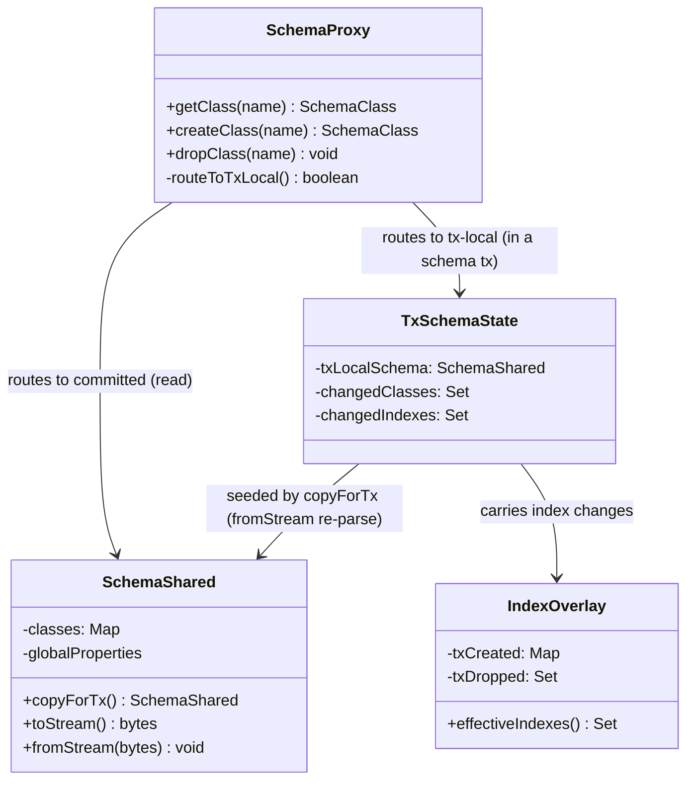
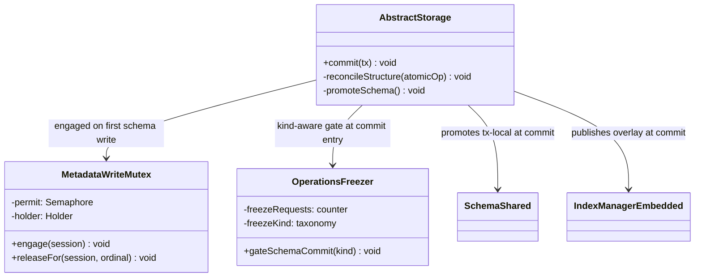
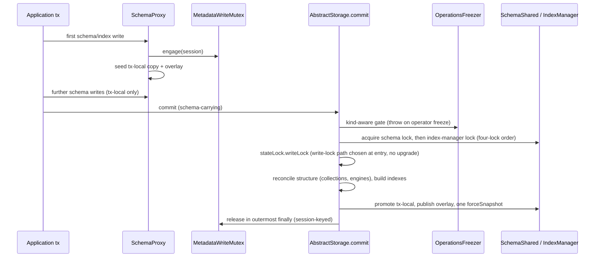
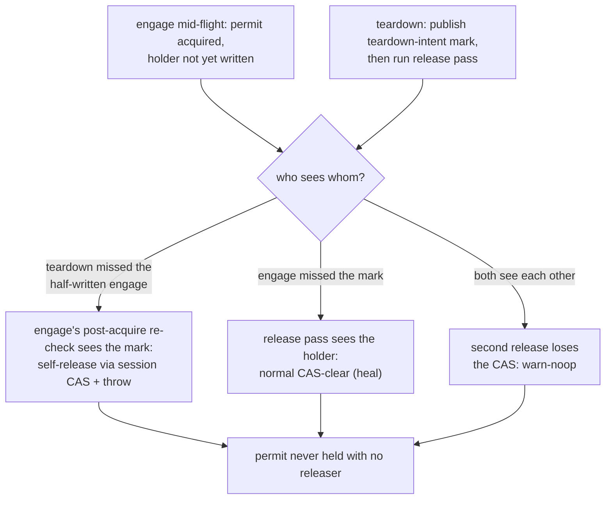
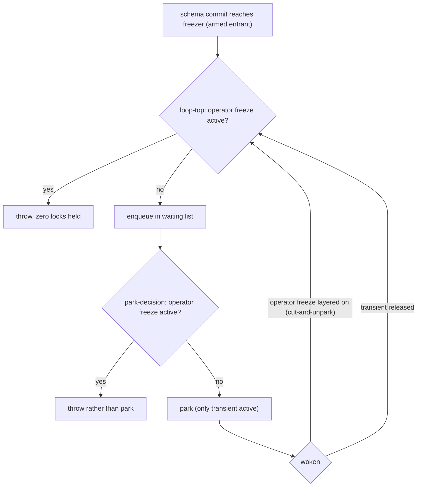

<!-- workflow-sha: 3e9c22298dfe68d2980646704850c781f8af88d5 -->
# Transactional Schema Operations — Design

## Overview

Today storage leads a schema change. `createClass`, `dropClass`, `createIndex`,
and their siblings mutate storage structure first (create or drop the
collections and index engines), then reflect the result into a metadata record.
That order has three consequences. Each operation self-commits in its own
micro-transaction outside the user's transaction. The entire schema lives in one
record that is rewritten whenever any class changes. A schema change cannot be
rolled back with the transaction that made it.

This design inverts the dependency. During a transaction, a schema or index
change mutates only metadata records, which are ordinary transactional records.
Rollback is then free, because nothing structural has happened yet. At commit,
storage diffs the committed metadata against the current structure. It then
creates or drops the matching collections and engines inside the commit's own
atomic operation. The structural change is therefore atomic with the record
writes and recoverable from the WAL. Schema operations become fully
transactional: atomic, isolated, and rollback-free.

Four primitives make the inversion possible: a per-session copy-on-first-write
tx-local `SchemaShared` that `SchemaProxy` routes reads and writes to for the
transaction's duration; a dedicated transaction-scoped metadata-write mutex that
serializes schema-changing transactions; per-class schema records that replace
the single monolithic schema record and kill the write amplification YTDB-382
targets; and a schema-carrying commit that takes the storage write lock from the
start instead of upgrading mid-commit.

Several subsystems restructure to fit: a tx-local index-definition overlay (the
index analogue of the schema copy), a freezer gate that stops a schema commit
from turning an operator freeze into a read outage, a two-phase genesis
bootstrap, base-keyed engine files that make index rename metadata-only, and an
operator-driven export/import path that migrates the schema-record format change
rather than an in-place on-open migration.

The document defines the recurring ideas in Core Concepts, lays out the classes
and the commit flow in Class Design and Workflow, then develops the mechanism in
four Parts: the transactional schema model (Part 1), index transactionality
(Part 2), concurrency and locking (Part 3), and schema-format migration (Part 4).

## Core Concepts

This design introduces nine load-bearing ideas. Each is named and used without
re-definition in the Parts that follow. Each entry below pairs the concept with
the behavior it replaces, so the change from today is explicit.

**Metadata-first inversion.** A schema change mutates metadata records during
the transaction and lets storage reconcile structure at commit, rather than
mutating storage first and reflecting it after. Replaces "storage leads,
metadata follows". → Part 1 §"Commit-time reconciliation".

**Tx-local schema view.** A per-session copy of `SchemaShared`, seeded on the
transaction's first schema write and routed to through `SchemaProxy`, so the
session sees its own uncommitted schema while other sessions see committed
state. Replaces "every session shares one live `SchemaShared`, mutated in
place". → Part 1 §"The tx-local schema view and transactional enablement".

**Tx-local index overlay.** A lightweight overlay of index definitions
(committed + tx-created − tx-dropped), not a content copy, since an index is a
thin handle over a storage-backed engine. Replaces "the shared `IndexManager`
mutated per operation". → Part 2 §"Tx-local index overlay".

**Provisional collection id.** A sentinel negative id that a new collection
carries during the transaction, disjoint from the abstract-class marker `-1` (so
`<= -2`), resolved to its real id at commit before any record serializes.
Replaces "real collection id allocated eagerly at create time". → Part 1
§"Commit-time reconciliation".

**Schema-write mutex.** A transaction-scoped `Semaphore(1)` on the shared
context that serializes schema- and index-changing transactions, distinct from
`stateLock`, `SchemaShared.lock`, and the index-manager lock. Replaces "no
cross-transaction schema serialization; per-operation locks only". → Part 3
§"The schema-write mutex and lock order".

**Schema-carrying commit.** A commit that carries schema or index changes takes
`stateLock.writeLock()` from the start; a pure-data commit keeps the read-lock
fast path. Replaces "read lock with a mid-commit upgrade for structural work".
→ Part 3 §"The schema-write mutex and lock order".

**Freeze-kind taxonomy.** A classification of freezes into operator/long-lived
versus transient internal quiesce, so a schema commit can fail loudly against
the first and park briefly against the second. Replaces "one undifferentiated
freeze gate". → Part 3 §"The freezer gate".

**Per-class schema records.** A schema record that links to one record per
class, so a one-class change writes one record, not the whole schema. Replaces
"all classes in a single EMBEDDEDSET record". → Part 1 §"Per-class schema
records".

**Export/import migration.** The per-class-record format change is migrated by
exporting the old database to JSON with the old binaries and importing into a
fresh database with the new binaries, gated by a version check. Replaces "an
in-place on-open migrator". → Part 4 §"Schema-format migration".

## Class Design

The schema-side classes carry the tx-local view and its routing. The diagram
shows the read/write split that `SchemaProxy` enforces during a schema
transaction.

`SchemaProxy` is the routing seam. Outside a schema transaction it resolves
against the committed `SchemaShared`. Inside one it resolves against the session's
`TxSchemaState`, which holds three things: the tx-local `SchemaShared` copy, the
changed-class set that drives the per-class commit, and the index overlay. The
tx-local copy is built by re-parsing the serialized schema (`fromStream`), not by
cloning the class objects field by field. Re-parsing is required because each
class binds back to its `SchemaShared` through a final `owner` field and links to
its superclasses and subclasses by direct object reference; cloning the fields
would leave those references pointing at the shared instances. So the re-parse
constructs fresh classes bound to the tx-local copy, and the cross-class state a
schema write recomputes (inheritance and subclass sets) stays inside that copy.
Part 1 covers that recomputation in full.

The storage-side classes carry the commit, the serialization mutex, and the
freezer gate. The diagram shows what a schema-carrying commit coordinates.

`MetadataWriteMutex` is the `Semaphore(1)` with a session-keyed holder record;
its engage and release rules are Part 3's subject. `OperationsFreezer` gains the
freeze-kind taxonomy and the kind-aware gate. `AbstractStorage.commit` is where a
schema-carrying commit does its work: it reconciles structure against the
committed metadata, promotes the tx-local schema, and publishes the index
overlay, all under the four-lock order that Part 3 defines (metadata-mutex →
`SchemaShared.lock` → index-manager lock → `stateLock.writeLock`).

## Workflow

A schema-carrying commit is the central new flow. The sequence shows the
ordering from the transaction's first schema write through promotion.

The gate behaves differently for the two freeze kinds. Against an operator freeze
it throws with zero locks held, so reads keep flowing. Against a transient quiesce
it parks briefly. Reconciliation runs the inner collection- and engine-creation
primitives, which take no locks of their own, under the already-held write lock.
Promotion re-parses the committed per-class records into the existing shared
`SchemaShared` instance and then calls `forceSnapshot`, which clears the cached
schema snapshot so the next reader rebuilds it from committed state. The freezer
gate's decision flow is Part 3's subject.

# Part 1 — The transactional schema model

This Part covers how a schema change becomes a transactional record change. Four
sections build it up. The first is the isolated schema view a transaction
mutates, and the entry points reworked to run inside the transaction. The second
is what the commit does to turn the changed metadata into on-disk structure. The
third is the per-class record format. The fourth is the genesis bootstrap, which
exercises the whole path against an empty database.

## The tx-local schema view and transactional enablement

**TL;DR.** A schema transaction mutates a per-session copy of `SchemaShared`.
The copy is seeded on the transaction's first schema write and routed to through
`SchemaProxy`. The shared `SchemaShared` stays at committed state until commit,
so other sessions see the old schema and rollback is free. Today the schema
mutation entry points assume the change applies immediately, so two kinds of them
block this model and need rework. One kind treats an open transaction as a
conflict with applying now and throws. The other kind applies now by committing
the change in its own nested transaction. Both are reworked to write into the
tx-local copy instead, so the change defers to the user transaction's commit.

Schema isolation is identical to data-record isolation: a transaction changes
only its own copies of the metadata records, and `SchemaShared` is updated only
at commit when storage applies the committed metadata. The tx-local view is a
full working `SchemaShared`, rather than an overlay. `SchemaShared` holds derived
state that one class computes from its relationships with others: the superclass
and subclass links, each class's `polymorphicCollectionIds` (the union of the
class's own collection ids with those of every subclass), and the global-property
table shared across classes. Because the tx-local view is a full `SchemaShared`,
the existing mutation methods recompute all of that state the same way they do on
the shared instance; the design adds no new code to maintain it.

The in-memory overlay alternative is an immutable committed base plus a map of
the classes the transaction changed. It is deferred. With an overlay, every read
would first have to merge the base class with its changed-class entry, then
recompute the polymorphic-collection union across the merged hierarchy on each
access. That is new code in the read path, which is correctness-critical, to
avoid copying a `SchemaShared` that is cheap to build and built rarely.

The copy is built by re-parsing the serialized schema (`fromStream`), not by
cloning the class objects field by field. A field-level clone does not work here.
Each `SchemaClassImpl` holds a final `owner` field pointing back at its
`SchemaShared`, and its superclass and subclass links are direct object
references to other `SchemaClassImpl` instances. Cloning the fields copies those
references unchanged, so a cloned class would still point at the shared `owner`
and the shared sibling classes. Re-parsing instead constructs fresh class objects
bound to the tx-local `SchemaShared`. That is the only way to keep each class, its
derived state, and the locks that guard them entirely inside the copy.

During a schema transaction, `SchemaProxy` routes its read methods to the
tx-local structure, not only the snapshot. A proxy is the handle the rest of the
engine holds onto a schema class or property. Today each `SchemaClassProxy` holds
a captured `delegate`, a direct reference to the `SchemaClassImpl` it stood for
when the proxy was created. Under the transactional model, a class or property
proxy instead looks its target up by name in the tx-local copy on each call. A
proxy created before the transaction started therefore resolves to the tx-local
class, so it cannot hand a shared `SchemaClassImpl` back into the transaction's
private copy.

Under this model a schema change lands as a metadata record edit first, and
storage builds the matching structure later, at commit (the metadata-first
inversion of D1). That inversion only holds if every mutation entry point can run
inside an open transaction. The first kind of entry point throws when a
transaction is active. Three entry points do this:

- the `SchemaShared` schema-record save,
- `dropClass` and `dropClassInternal`,
- the index-manager `createIndex` and `dropIndex`.

Each is reworked to run inside the user transaction instead of throwing.

The second kind needs different handling. The collection-membership entry points,
`addCollectionToIndex` and `removeCollectionFromIndex`, register or unregister a
collection with an index. `createClass` and `addSuperClass` reach them
indirectly: adding a class or a superclass changes which collections a class
covers, and that ripples through the hierarchy into index membership. These two
methods do not throw on an active transaction. Today each wraps its work in
`session.executeInTxInternal(...)`, a nested transaction that commits on its own
the moment the method returns. That self-commit is the hazard: the membership
change becomes visible to other sessions immediately and survives even if the
user transaction later rolls back, which breaks the rollback guarantee. So these
methods are reworked the same way, to write into the tx-local copy, and the
membership change applies only at the user transaction's commit.

Deferring this change to commit is required for correctness as well as for
isolation. The membership ripple can name a collection that does not exist yet: a
class created in the same transaction has no real collection id during the
transaction, only a provisional placeholder id (defined under "Commit-time
reconciliation"). Registering that membership before commit would record a
collection name with no committed collection behind it.

### Edge cases / Gotchas

- A pre-transaction captured `SchemaClassProxy` whose method is called inside
  the transaction is the transaction's first write and must route to the
  tx-local view; instance capture must not bypass the routing.
- Impl-typed arguments are re-resolved by name on the tx-local side before
  linking, so a shared impl never enters the tx-local graph.
- The throw-guards fail any DDL test loudly when left in place; the self-commit
  guards pass a naive DDL test and fail only an isolation-and-rollback test, so
  the silent failure is the one to test for.

### Decisions & invariants
- D-records: D4 (schema isolation is record-local, identical to data), D8 (a
  per-session copy-on-first-write tx-local `SchemaShared`), D1 (metadata-first
  inversion, which the de-guarding enables), D15 (the index overlay the
  membership change routes through)
- Invariants: I-A5 (record-local isolation), I-A7 (the entry points are
  de-guarded to ride the transaction)

## Commit-time reconciliation

**TL;DR.** At commit, storage computes the structural delta as a set difference
over the committed versus tx-local in-memory collection-id sets, then creates or
drops collections and engines inside the commit's own atomic operation. New
collections carry provisional ids, resolved to real ids before any record
serializes. Reconciliation uses lock-free inner primitives. A failed commit
leaves no structure and no registration behind.

The delta is computed by diffing in-memory structures, not from a separate intent
list. A create is a collection id in the tx-local set that is absent from the
committed set. A drop is the reverse. Drop detection is the set difference over
the committed and tx-local `SchemaShared` collection-id sets. It is never derived
from the transaction's changed-record set. The changed-record set is the records
the transaction modified, each carrying per-property dirty marks that say which
properties changed. A dropped class is not in that set: dropping a class deletes
its record rather than modifying it, so the class shows up as a record deletion,
not as a property change. A diff that scanned only the changed-record set would
therefore see no dropped class and would drop nothing. The set difference over the
collection-id sets catches the drop because the dropped class's collection id is
present in the committed set and absent from the tx-local one. A rename keeps its
collection ids, so it is structurally inert: zero collection create/drop, a
metadata-only change.

New collections carry provisional ids during the transaction. A provisional id is
negative. The schema layer already gives negative collection ids a meaning: an
abstract class carries the single id `-1`, and the layer tests `collectionId < 0`
to spot a special id rather than testing `== -1`. A provisional id that fell on
`-1`, or that a `< 0` test caught, would be mistaken for the abstract marker. So
provisional ids are drawn from a sub-range that cannot collide with it: `<= -2`.
The schema layer keeps two maps for collections: a forward map from name to id
and a reverse map from id back to name. The code that maintains those maps treats
a provisional id like a real id that is not yet final. It enters the provisional
id into the reverse map keyed by that id, with the collection's name as the value,
and it checks the id for uniqueness against the ids already in that map, the same
as it would for a real id. At commit, that code resolves every provisional id to
its real id before any record serializes. The resolution includes the collection
ids stored inside the changed-class records' property values. If it skipped those,
the class would serialize its provisional ids to disk. The next database open would
then read back ids that point at no real collection, and the class would lose its
collections for good.

Two ordering constraints inside the commit are load-bearing, because each later
step uses what an earlier step produced. The engine is created before any code
looks it up by id, so the lookup finds a registered engine rather than a missing
one. The collection is created before a record position is allocated in it, so
the allocation targets a collection that already exists.

Reconciliation runs while the commit already holds the storage write lock, so it
calls the inner collection- and engine-creation primitives, which do no locking
of their own. It never calls the public structural methods such as the public
`addCollection`. Those methods take `stateLock`, the storage's read-write lock
(`ScalableRWLock`), and `ScalableRWLock` is not reentrant: a thread that already
holds the write lock and asks for it again deadlocks against itself. Index
population for a new index is also a lock-free internal scan. It writes the new
index entries inside the commit's own atomic operation and emits no WAL units of
its own beyond it, so the index build is part of the same atomic unit as the rest
of the commit and rolls back with it rather than as a separately committed step.

A failed commit must leave two things clean. It must leave no phantom
registration in the shared structures, and it must leave the collection and
engine ids it touched free to reuse. Two rules deliver that. First, the commit
publishes a new collection or engine into the shared registry only after
`commitChanges` (the atomic-operation step that writes the change to disk)
succeeds, so a commit that fails before that point never publishes anything.
Second, the commit draws collection and engine ids from a commit-local allocator
seeded under the write lock, rather than from the shared counter, so an id handed
out by a failed commit is not consumed globally. A failed commit therefore rolls
back the WAL, leaves no half-created entry in the registry, and leaves its ids
free to reuse.

Reverting the on-disk structure reuses the existing atomic-operation WAL and
needs no separate deletion pool. The commit buffers file creates and deletes as
intent and performs them only inside `commitChanges`, the step that rollback
skips. A transaction that rolls back, or that crashes before commit, therefore
leaves the files byte-for-byte unchanged.

### Edge cases / Gotchas

- Abstract classes carry `collectionIds = {-1}`, so their create/drop is pure
  metadata; the provisional predicate must distinguish `-1` from `<= -2`.
- A committed drop must actually remove the structure; the positive drop path is
  the test that defends the set-difference detection source.
- The "replay cleanly" half of WAL revertibility is conditional on the F55
  lazy-consult replay fix, a prerequisite track.
- A populated-class index build inside the commit is bounded to empty classes (or
  a documented size bound) for v1; the boundary policy is a Phase-1 decision and
  the unbounded case moves to YTDB-1064.

### Decisions & invariants
- D-records: D1 (metadata-first, storage reconciles at commit), D2 (provisional
  collection ids resolved at commit), D3 (commit ordering: structure before
  record allocation), D6 (delta via the diff approach), D9 (diff over collection
  ids, not class names), D10 (structural revertibility via the atomic-operation
  WAL)
- Invariants: I-A1 (atomic structural change, free rollback), I-A2 (provisional
  id never serialized), I-A3 (commit applies structure before it needs it), I-A4
  (a failed commit leaves no phantom registration)

## Per-class schema records

**TL;DR.** The single schema record (all classes in one EMBEDDEDSET) becomes a
schema record that links to one record per class, mirroring the index-manager
pattern. At commit only the changed class records are written, so a one-class
change no longer rewrites the whole schema. That is the write-amplification
reduction YTDB-382 exists for. The root record carries the residual non-link
payload and is written when that payload changes.

Each class tracks which record holds it across its lifecycle. Each
`SchemaClassImpl` gains one net-new field: the RID of its own record. At load, the
RID is bound from the schema record's link set, the same way the index manager
binds each index to its own record. At commit, each changed class serializes
itself through `toStream` into the record that RID points at, and per-property
dirty tracking limits the write to the classes that actually changed. The two
edge cases follow that pattern. A new class has no record yet, so it is written to
a fresh record whose temporary RID becomes permanent at commit. A dropped class
deletes its record and removes the link to it from the schema record. Inheritance
needs no RID linking the records to each other, because a class names its
superclasses by name in the serialized form, not by their RIDs.

The root schema record keeps the non-link payload: the global-property table, the
collection counter, and the blob-collections set. It is written whenever the class
link set or any of that payload changes. The transaction sets those properties on
the root entity. A property-create adds an entry to the global-property table, and
an alter-add-collection advances the counter, so the dirty tracking that watches
those properties puts the root record in the write set without extra code. If the
root were left out of the write set, two failures would follow.

The first failure is a dangling property reference. A property-create adds its new
entry to the global-property table, which lives on the root record. With the root
excluded, that entry is not persisted. A class property, though, still records
which global-table slot it uses, and that link does persist on the class record.
At the next database open, the class property would point at a global-table slot
the table no longer contains, a null global-reference error.

The second failure is colliding collection names. The collection counter also
lives on the root record. With the root excluded, an advanced counter is not
persisted either. The counter generates each new collection's name as
`<lowercase-classname>_<counter>`. At the next open, the counter would revert to
its old value. It would then hand out a suffix it had already used, and the new
collection would get the same name as an existing one. This format change is the
source of the migration in Part 4.

### Edge cases / Gotchas

- The promotion at commit re-parses the committed per-class records into the
  existing shared instances, never adopting tx-local objects whose final owner is
  the dead tx-local instance (see Part 3's promotion invariant).
- The change overturns the earlier "record format unchanged, no migration"
  assumption; existing databases migrate via Part 4's export/import.

### Decisions & invariants
- D-records: D14 (split the schema into per-class records, killing write
  amplification)
- Invariants: I-U1 (per-class records, root written when its payload changes)

## Genesis bootstrap

**TL;DR.** Under the transactional model the metadata creators restructure into
two transactions: a schema transaction that creates every internal class,
property, and index and commits (building the indexes at commit), then a data
transaction that inserts the default roles and users into the now-committed
classes.

The two-phase shape preserves today's ordering. The first transaction builds the
`OUser.name` UNIQUE index, and that index is committed before the second
transaction inserts any user. The user-creation code looks each user up by that
index directly, rather than through the query planner, so the lookup needs a real
engine behind the index. Splitting genesis into two transactions guarantees one:
the index is built and committed in the first, so the lookups in the second hit a
built engine. A single unified transaction would not. The index would exist in
the same transaction but its engine would not be built yet, and a direct lookup
against an unbuilt index throws, unless the caller falls back to a full scan.

The schema transaction is the first-ever schema transaction. It seeds the
tx-local copy from the empty committed schema and writes the first schema record.
It engages the metadata-write mutex, with no contention at genesis. The following
data transaction never touches schema, so it does not engage the mutex.

### Edge cases / Gotchas

- Genesis exercises the full commit path (reconcile, build indexes, write the
  per-class records) against an empty starting schema, so it is the natural
  end-to-end smoke test of Part 1.

### Decisions & invariants
- D-records: D18 (genesis bootstrap is two-phase: a schema tx, then a data tx)
- Invariants: I-U4 (genesis builds the schema before it inserts users)

# Part 2 — Index transactionality

Indexes need the same transactional isolation as the schema, but reach it through
a different mechanism: an overlay rather than a full copy. This Part covers that
overlay, the engine build that runs at commit, the rule for whether a new index
is usable in queries inside the transaction that creates it, and base-keyed engine
files that make an index rename a metadata-only change.

## Tx-local index overlay

**TL;DR.** Indexes get a tx-local overlay of definitions (committed + tx-created
− tx-dropped). The overlay copies only the definitions, because an index is a thin
handle over a storage-backed engine, so the index content stays in the engine and
there is nothing to deep-copy. The tx-local snapshot is
force-rebuilt on every mid-transaction index change, and a committed
collection-membership change persists as its own category so the parent index
covers the new subclass collection.

An overlay works here where a copy was needed for the schema, because an index
holds little in memory. An `Index` object holds an `indexId` handle into storage's
engine array, the definition, and membership maps. The data itself lives in the
engine. Copying the handles would duplicate pointers to the same shared engines
and give no isolation. A new index has no engine to copy at all. The only
in-memory state to overlay is the index manager's two lookup maps. The overlay
holds four categories: tx-created definitions (no engine), tx-dropped (hidden),
in-place rename, and in-place collection-membership.

The snapshot build reads its per-class index list from the index manager, so
during a schema or index transaction it must resolve that list against the
overlaid set rather than the committed one. The overlay reaches the snapshot only
through a forced rebuild. `ClassIndexManager` reads a cached index set that the
snapshot materializes once, at snapshot init, and then reuses, so the cached set
holds the index list as it stood at init and stays stale across an overlay change.
The tx-local snapshot must therefore be force-rebuilt on every mid-transaction
index create or drop (`createIndex` / `dropIndex`). Without the rebuild, an insert
later in the same transaction goes to the new index's cached-out slot (its
definition is absent from the stale cached set) and is silently untracked. The rebuild discards the stale cached set and lets the next
read rebuild it on demand; it leaves the snapshot to rebuild lazily (see the
research log's delegated list).

These two index types draw their committed entries from two different sources. A
pre-existing index draws from the per-record tracking that the rebuild surfaces.
A tx-created index draws instead from the commit-time re-derivation (see "Index
build and query-usability" below). The re-derivation stays correct even when an
early `deleteRecord` flush drains operations before the `createIndex`.

At commit the index work runs in three steps:

1. The changed-index set drives engine creation and drops.
2. The commit writes the changed per-index entities.
3. The definition overlay publishes into the shared index manager as replacement
   objects, under the index-manager write lock.

All three steps share the single trailing `forceSnapshot`. A collection-membership
change on a committed index (the `addSuperClass` / alter-add-collection ripple) is
a tracked changed-index category in its own right. So the commit persists the
membership delta, and the parent index then covers the new subclass collection.

### Edge cases / Gotchas

- A rename mutates a committed index commit-only (re-key the association, update
  the definition's class name), so no shared `Index` is mutated mid-transaction.
- The index-manager record's link set stays monolithic, so incremental creation
  re-serializes the whole set per add; the optimization folds into YTDB-1064.
- The positive membership-coverage test (commit `addSuperClass`, query through
  the parent index, assert subclass rows returned) is what catches an
  implementation that omits the membership-only category.

### Decisions & invariants
- D-records: D15 (a tx-local index-definition overlay, not a content copy of the
  index manager)
- Invariants: I-P1 (promote into existing instances, one forceSnapshot), I-P2
  (overlay plus snapshot rebuild and the membership category)

## Index build and query-usability

**TL;DR.** For v1 a transactional index build on an already-populated class runs
inside the exclusive-locked commit. That stalls writers for the build's duration,
which is acceptable because schema changes are rare. Inside the transaction that
creates it, the new index accelerates nothing: the planner skips an unbuilt index
and falls through to a correct full scan.

The build is a lock-free internal scan that feeds rows into the engine, and it
runs as part of the commit's single atomic operation. It does the scan directly,
without a copied session or a nested batch transaction. Both of those would re-acquire `stateLock`,
storage's non-reentrant read-write lock, and the build already holds its write
lock; re-acquiring it would deadlock against itself. To cover all of the
transaction's record operations exactly once, the build splits its input between
two sources. The population scan reads the committed rows but skips any RID in the
transaction's record-operation set. The commit-time re-derivation then adds the
tx-touched rows in their final state: it indexes each created or updated row whose
value is in memory and skips each deleted row. Together the two cover the committed rows
the transaction did not touch plus exactly the tx-touched rows, with no key
counted twice and none missed. v1 scopes the eager build to empty classes (or a
documented size bound), because both the forward build and the recovery replay
hold the unit's rows in heap, so heap use scales with the unit size. The unbounded
populated case moves to YTDB-1064.

Inside the creating transaction the new index has no engine yet, and reading an
index whose engine is not built throws. So the planner skips any such index, and
the WHERE block falls through to a full class scan. That scan returns the correct
merged transaction view (committed rows + tx updates − tx deletes). Once the
transaction commits and the engine is built, the index becomes query-usable.

### Edge cases / Gotchas

- The existing read-merge for already-built indexes must be preserved unchanged.
- A residual window remains where a concurrent pure-data commit whose enqueue ran
  before the new index published misses it (the same shape as today's `fillIndex`
  race); closure is follow-up YTDB-1101.
- WAL retention and checkpoint deferral bite only inside the commit window, not
  across a long transaction body; a long schema-transaction body is heap-bounded,
  not WAL-bounded.

### Decisions & invariants
- D-records: D12 (accept the index build under the exclusive commit lock for v1),
  D13 (a tx-created index is not query-usable until commit; planner skips unbuilt
  indexes)
- Invariants: I-P3 (unbuilt index skipped, scan fallback correct), I-P4 (the
  build commits to exactly the transaction's final state)

## Base-keyed engine files and metadata-only rename

**TL;DR.** Engine file names derive from the stable engine id, not the index
name, so an index rename changes only metadata and never touches the engine or
its data. Collection names are generated from a counter alone, so a class rename
is a pure metadata change that renames no collection file. v1 ships the
metadata-only class-rename re-association; the inert index-name rename is
deferred.

Collection names decouple from class names. Today a class's collection name is
derived from the class name (`<className>_<counter>`), so renaming the class also
renames its collection file. That file rename is the one physical collection
mutation today's code does not journal through the WAL, so a crash in the middle
of it can leave the file half-renamed. This design generates the collection name
from a counter alone, with no class-name component, so a class rename no longer
touches any collection file and that un-journaled rename path is removed.

Engine file bases derive from the stable engine id unconditionally. Under Part 4's
import-only migration, no name-keyed engine file can exist in a v1 database, so the
dual-base compatibility path is dropped. The data, null-bucket, and histogram files
all derive from the base. A class rename re-keys the class-property index and
updates each affected definition's class name, both commit-only. The index
therefore keeps accelerating queries under the new class name. Queries
return the same rows throughout. Only the index's own stored name lags: it still
reads as the old name until the deferred index-name rename lands. The full
index-name rename and `ALTER INDEX … RENAME` are deferred to YTDB-1066.

### Edge cases / Gotchas

- Base-keying dissolves the same-name drop-and-recreate file collision, so the
  code needs no file-name recycle branch and replays the WAL through one uniform
  path.
- The class-rename re-association is commit-only, so the renaming transaction's
  own queries on the renamed class fall back to an unaccelerated scan until
  commit.

### Decisions & invariants
- D-records: D11 (artificial collection names, decoupled from class names), D16
  (stable-base-keyed engine files, index rename metadata-only), D17 (v1 does the
  metadata-only class-rename re-association; index-name rename deferred)
- Invariants: I-U2 (class rename touches zero storage), I-U3 (base-keyed engines,
  rename keeps the index accelerating)

# Part 3 — Concurrency and locking

This Part is the design's hardest. It covers three concurrency concerns, one per
section. The serialization mutex and its lock order keep schema commits
deadlock-free. The mutex lifecycle and its permit handshake keep a connection-pool
teardown from leaving the mutex held with no one to release it, which would wedge
all later DDL. The freezer gate keeps a schema commit from turning a freeze into a
read outage. Tests catch these properties unreliably, so each section pins the
exact thread interleaving its test must exercise.

## The schema-write mutex and lock order

**TL;DR.** A dedicated transaction-scoped `Semaphore(1)` serializes schema- and
index-changing transactions. It is engaged above the shared metadata locks and
released in the outermost teardown. A schema-carrying commit takes the storage
write lock from the start and acquires its four locks (the mutex,
`SchemaShared.lock`, the index-manager lock, and `stateLock.writeLock`) in one
fixed acyclic order. So a second schema transaction blocks rather than racing, and
the design is deadlock-free.

Single-writer is enforced pessimistically by locking, never by rollback. A second
schema-changing transaction blocks on the mutex rather than racing to a
commit-time conflict. Blocking is acceptable because the schema-change rate is
low. The design rejects optimistic concurrency, which would abort a schema
transaction on conflict. The mutex is one lock covering both schema and index
changes, distinct from `stateLock`, `SchemaShared.lock`, and the index-manager
lock.

The mutex engages where `SchemaProxy` and the index-routing layer first send a
write to the tx-local copy, on the transaction's first schema or index mutation.
That point is before any shared metadata lock and before the tx-local copy is
seeded. The mutex must not engage later, from inside a shared-lock acquisition.
The hazard if it did: a second transaction reaching that hook would park on the
mutex while it already holds a shared write lock. A parked thread does not release
its locks, so that held write lock would block every lock-based schema read for as
long as the first transaction runs, and it would deadlock against the first
transaction's own commit-side attempt to take the schema lock.

A schema-carrying commit takes `stateLock.writeLock()` from the start. It decides
to do so at entry, from the same signal that engaged the mutex. A pure-data commit
instead keeps the read-lock fast path and today's concurrency. Holding the
exclusive lock for the whole schema commit removes the read-to-write upgrade and
the interleaving window that upgrade opened.

The lock order is always metadata-mutex → `SchemaShared.lock` → index-manager
lock → `stateLock.writeLock`, taken in that order and never reversed. The schema
lock comes before `stateLock` because the commit's promotion step mutates the
maps `SchemaShared.lock` guards, and the data path can already hold the two in the
opposite nesting: `reload` takes `SchemaShared.lock` and then the state read lock.
The index-manager lock comes next for the same reason applied to the index
manager, the other shared registry the commit publishes into. Taking both metadata
write locks before `stateLock` keeps the order acyclic. An index-only transaction
takes this same sequence and the write-lock branch, even though it touches no
schema and so writes no schema record.

The engage path also throws when the current thread already holds the mutex
through a different session. This is what lets one thread run an embedded session
inside another legally: the inner session's schema transaction fails fast on the
engage instead of parking forever on a permit its own thread holds. A holder on a
different thread parks normally, which is healthy contention.

### Edge cases / Gotchas

- The accepted consequence of the engage-side rejection: one thread cannot hold
  two simultaneously open schema transactions over two sessions; sequential
  schema and data transactions alongside a held mutex stay legal.
- The mutex does not block data commits or snapshot-based schema reads, so the
  low-rate-low-contention premise holds.
- A schema commit holds the write lock for its whole duration, so any lock-based
  schema read would stall behind it. To keep those reads flowing, in-scope
  mitigations convert the two remaining lock-based read sites (one per-record, one
  per-MATCH) to snapshot-first reads.

### Decisions & invariants
- D-records: D5 (single schema-writer enforced by locking, never by rollback), D7
  (a dedicated, transaction-scoped metadata-write mutex), D19 (schema-carrying
  commits take the write lock from the start; pure-data keep the read-lock fast
  path)
- Invariants: I-A6 (single writer by locking), I-C1 (the four locks taken in one
  acyclic order), I-C2 (the mutex engages above the shared locks), I-C4 (engaging
  on a thread that already holds it fails loudly), I-U5 (schema-carry write-lock
  from the start)

## Mutex lifecycle and the permit handshake

**TL;DR.** The mutex permit has exactly one releaser and never wedges. Teardown is
owner-thread-only; a pool teardown of a held schema transaction heals the permit
through a session-keyed compare-and-clear, and a torn-down owner's late release
warn-noops rather than throwing from the teardown. Cross-thread reaping of a
stranded transaction is out of scope.

**What the pieces are.** The mutex is a `Semaphore(1)` (one permit), not a
`ReentrantLock`. Teardown forces the choice. A `ReentrantLock` can be unlocked
only by the thread that locked it, so a dead or reaped owner thread could never
release it, a permanent wedge. A semaphore permit can be released from any thread.
A bare semaphore is unsafe, though: its `release()` is an unconditional counter
increment that any thread can call. So the permit carries an ownership record
written at acquire: `(owning session, acquire ordinal, acquiring thread)`. Each
field has a role.

The **session** is the release key. Release is a compare-and-clear that fires only
if this session still owns the permit. That stops a stale or just-woken owner from
releasing a permit a successor now holds. The **acquire ordinal** is a monotonic
counter that distinguishes this acquisition from a later one. A stale presenter is
a teardown path that still carries an old acquisition's ordinal and tries to
release on it; the ordinal mismatch rejects it, so the permit is never released
twice. The **thread** is engage-guard and diagnostic only: it catches same-thread
self-deadlock per I-C4 and names the holder in the wait diagnostic. The thread is
never part of the release key, precisely because the one legitimate foreign
releaser runs on a different thread.

The single normal release point is the outermost teardown `finally` of the owning
session's commit or rollback. Two paths reach it. The owner's own `finally` reads
its captured ordinal from the surviving session-side record and CAS-clears. A
foreign teardown (a pool shutdown of a still-checked-out session) runs that
session's own teardown, reads the volatile holder to identify the session, and
CAS-clears when it matches. If both race the same session, exactly one wins the
CAS. The loser warn-noops. It does not throw, because a throw from the teardown
`finally` would mask the owner's real exception. It does not re-release, because
the ordinal-plus-session key rejects every stale presenter.

The subtle window opens when an engage is caught mid-flight: the permit is
acquired, but the holder record is not yet written. The wedge then builds in
steps. A one-shot pool close runs its release pass in that window and finds no
holder to clear, so it clears nothing. The owner finishes acquiring, but on a
session the pool close has now closed. The session's `checkOpenness` gate (it
throws once the session's status reads `CLOSED`, and it guards both commit and
rollback) then refuses the owner's commit or rollback. That commit or rollback was
the owner's only release point, so the permit stays held with no releaser left to
clear it, and every later DDL transaction wedges behind it. An engage/teardown
handshake closes this window. The handshake is a store-then-load
(Dekker) pair. On the teardown side, the teardown publishes a dedicated volatile
teardown-intent mark before its release pass. This mark is a separate flag, not the
session's `STATUS.CLOSED`, because teardown runs rollback before it sets CLOSED,
and an early CLOSED would trip `checkOpenness` inside teardown's own rollback. On
the engage side, the engage writes the holder after acquiring the permit, then
re-checks the mark. On a marked session the engage self-releases through the
session-keyed CAS and throws. Store-then-load on both sides guarantees at least one
side sees the other:

The handshake has one further requirement. The release path reads the
acquisition's ordinal from a session-side record to know which acquisition it is
clearing. That record must survive the field-wiping that `rollbackInternal` does
through its `clear()` and `close()` calls, and stay readable until the outermost
`finally` runs the release. If a wipe clears it early, the owner's own release
reads no ordinal, so it cannot CAS-clear the permit, and the mutex wedges.

Teardown runs only on the owning thread for every transaction-scoped resource: the
mutex, the freezer engagement, the storage write lock, the snapshot-floor holder
accounting (the per-transaction record of which snapshot the transaction pinned),
and the commit-local allocator state. Cross-thread reaping of a stranded
transaction is out of scope for v1. A stranded transaction leaks its pin,
the existing monitor reports it, and a wedged owner keeps the mutex, so DDL stays
loudly unavailable until restart. Reclamation is YTDB-1114's job. That future work
adds an identity-keyed snapshot registry, detects stranding through leases, and
revokes at storage boundaries, all without touching tx-private state from a
foreign thread. The one legitimate cross-thread caller is the pool-shutdown close
of a checked-out session. It runs the owning session's own teardown, so the
handshake's guard matches and the mutex heals.

### Edge cases / Gotchas

- A commit-phase zombie is a transaction whose session a pool teardown closed
  while it was mid-commit, so it keeps running its commit after the mutex has
  healed and a successor DDL transaction has acquired the freed mutex. The
  whole-commit schema-lock scope excludes the hazard: the zombie still holds the
  schema lock until its commit finishes, so the successor serializes behind it.
- The `checkOpenness` gate is a best-effort early cap, not a structural guarantee.
  It reads a plain (non-volatile) status field, so it has no happens-before edge
  to the foreign teardown's write that set the session closed. The reading thread
  can therefore still see the old open status and admit one more zombie commit.
  That straggler is harmless: it still serializes behind the schema lock on an
  already-cleared transaction.
- The mutex acquire is timed and re-waits in a loop with a holder-naming
  diagnostic; only an operator interrupt breaks the wait.

### Decisions & invariants
- D-records: D7 (the metadata-write mutex's abnormal-termination release rules)
- Invariants: I-handshake-1 (exactly one releaser, never wedges), I-C3
  (tx-scoped resources torn down only on the owning thread)

## The freezer gate

**TL;DR.** A schema commit never parks inside the four-lock window against an
operator freeze; it aborts loudly within a bound with locks released and reads
flowing. Against a transient internal quiesce it parks briefly and succeeds. The
mechanism is a freeze-kind taxonomy plus a kind-aware gate evaluated at both the
freezer's throw site and its park-decision site, plus an operator-arm
cut-and-unpark for the already-parked case.

The freezer (`OperationsFreezer`) is the commit path's fifth synchronization
object, alongside the four locks. Today it is one undifferentiated gate. A freeze
raises a request count (`freezeRequests`); a write operation that starts while the
count is positive parks itself on a waiting list, unless the freeze was registered
with a throw-exception supplier, in which case the operation throws instead. The
freezer is engaged lock-free, and it is not part of the lock order. That is the
problem this section solves: a schema commit that parked on the freezer while
holding all four locks would convert the freeze window into a total read outage,
because every lock-based read would then block behind those held locks.

Today the gate's only entrant-visible distinction is throw-versus-park, fixed when
the freeze was registered, not chosen by the operation that hits the gate. A gate
checked only after the commit is already inside the four-lock window cannot keep
the loud-failure promise, because by then the locks are held. So the design adds a
freeze-kind taxonomy, recorded at the sites that register a freeze, with two kinds:
an **operator** freeze (long-lived, admin-initiated, raised through
`DatabaseSessionEmbedded.freeze`), and a **transient internal quiesce** (the brief
self-freezes `doSynch`, incremental backup, and index rebuild raise to flush
quietly).

The loud-fail decision runs before the commit takes any of the four locks. The
schema commit probes the freezer at entry. Against an operator freeze it throws
`ModificationOperationProhibitedException` with zero locks held. (The test asserts
that exact exception type, not a generic loud error.) Against a transient quiesce
it parks. The commit then acquires the write lock through a bounded try-acquire
loop. If an operator freeze engaged after the probe, that loop re-probes, releases
the metadata locks it has taken so far (the mutex, the schema lock, the
index-manager lock), and throws before requesting `stateLock.writeLock`. Because
the write-lock request is never even issued, no writer queues ahead of the
in-flight reads, so reads keep flowing. The in-window gate stays as the
authoritative backstop for a freeze that engages after the write lock is held.

The decision flow at the freezer:

Two races remain, each closed by its own mechanism. The first is the already-parked
case: a commit is legitimately parked behind a transient quiesce when an operator
freeze layers on top. When an operator freeze registers, its arm of the freeze
code path detaches the whole waiting list and unparks every thread on it, right
after it raises the freeze count. (The existing release path already detaches and
unparks the list; the operator arm reuses that step at engage time.) The parked
commit wakes, re-evaluates the kind-aware gate, sees the operator freeze, and
throws. Without that unpark the commit would stay parked for the operator freeze's
whole duration. The second is the engage-during-enqueue race: an operator freeze
engages after the commit has passed the throw-site check but before it has parked,
which includes the case where the operator arm's unpark ran before the commit
joined the list and so passed it by. The kind-aware park-decision check closes
this race: the commit re-evaluates the freeze kind after it enqueues and throws
instead of parking. Data commits keep today's gate semantics: park for a park-mode
freeze, throw for a throw-mode one.

### Edge cases / Gotchas

- The loud failure is asserted by exception type, not by a generic "loud error":
  a bare assertion would pass a masked internal-state exception the design rules
  out.
- A separate pre-call probe before the commit does not satisfy the property: it
  sits outside the entrant/freezer handshake, so a freeze engaging in the
  probe-to-entry window parks the commit inside the four-lock window.
- Any-freeze keying would abort DDL against routine transient quiesces (synch,
  incremental backup, index rebuild); throw-mode-only keying lets a park-mode
  backup freeze re-create the outage. The taxonomy is the needed middle.

### Decisions & invariants
- D-records: D7 (the freezer gate as the metadata-write path's fifth sync object)
- Invariants: I-freezer-1 (no DDL outage under any freeze layering)

# Part 4 — Schema-format migration

This Part covers how an existing database moves to the per-class-record format:
not an in-place on-open migration but an operator-driven export/import, and the
fail-closed and whole-or-nothing guarantees that keep a partial migration loud
rather than silent.

## Schema-format migration

**TL;DR.** The per-class-record format change is migrated by exporting the old
database to JSON with the old binaries and importing into a fresh database with
the new binaries; no in-place on-open migration runs, so there is no
partial-migration state to recover. Opening an old-format database with new
binaries is rejected on a version check. Export and import are fail-closed and a
record is exported whole or not at all, including its copy-out into the dump.

Export reads the logical schema, not raw record bytes, so the source
single-record format is irrelevant to what is exported. Import rebuilds through
the schema API, so the imported database is written in the current
per-class-record format. The new code never parses the old format. When new
binaries open an old-format database, the schema version check rejects it with a
redirect message to the export/import procedure. The format version bump is a
gate that rejects and redirects, and runs no migrator. Import is verified against
a manifest. Export emits the manifest (class/index/record counts) strictly last
and atomically. Import then hard-fails on any of three faults: a missing or
unparsable manifest, a missing expected section, or an incompletely-consumed gzip
stream. The documented procedure keeps the target out of service until
verification passes. So a crash mid-export or mid-import always surfaces as a loud
verification failure that blocks the target from returning to service.

Two failure paths protect a single record. First, rendering one record is
whole-or-nothing: if rendering fails partway, the export discards that record
cleanly and records its RID in the broken-RIDs set (the set of RIDs the export
could not render). Second, copying a rendered record out into the shared dump file
is whole-or-fatal: if the copy-out hits an I/O error partway, the export aborts
fail-closed. A completion flag is set only after the copy-out finishes, and the
dump is promoted to its final name only when that flag is set, so a record
truncated mid-copy is never promoted. The exporter exports every record the
storage holds, regardless of size. A large but healthy record renders into an
in-memory buffer that, once the buffered bytes pass a size threshold, spills the
overflow to a transient file. Memory use therefore stays bounded whatever the
record size, and a large record is still exported rather than skipped.

The new exporter bumps `EXPORTER_VERSION` from 14 to 15 (the current value the
dump records) and rethrows record-scan failures by default. A caller can opt into
best-effort behavior, where the export skips a failing record and continues; that
choice is recorded in the dump's info section. On a fail-fast abort the process
exits non-zero with no file at the final name, and the scan failure propagates as
the primary exception, not buried under a secondary error raised while closing the
stream. A dump that is structurally well-formed JSON but malformed in content is
rejected by the import parser rather than read in as a valid record. (The content
fault that triggers this: a write failure between a field's name and its value
leaves the field name written with no value, so the parser sees a dangling field.)
A dump the exporter marked best-effort requires the importer to pass an explicit
acknowledgment flag before it will accept the dump, even when the manifest is
present; only an importer that understands version 15 knows to enforce that gate.
This exporter hardening protects the next format migration, not this one.

### Edge cases / Gotchas

- A dump file at the final name proves nothing about export success (the failure
  path also renames into place), so the operator verifies export exit status
  before importing.
- The whole-stream gzip CRC validation holds only under single-member framing and
  a fully-consumed check via inflater arithmetic; exhaustion probes are forbidden
  (they consume trailing residue into the dead decoder buffer).
- The migration-path import rejects non-gzip input; the general import path keeps
  the plain-JSON fallback with that consequence recorded.
- Spill-file lifecycle (delete on every path, collision-free name) is delegated to
  the implementer; the design pins only the whole-or-nothing property.

### Decisions & invariants
- D-records: D14 (the per-class-record format change that necessitates migration),
  D20 (schema-format migration is operator-driven export/import, not in-place)
- Invariants: I-migration-fail-closed (loud, never silent), I-migration-isolation
  (whole-or-nothing record export including copy-out), I-migration-failfast (the
  new exporter promotes nothing on failure)
