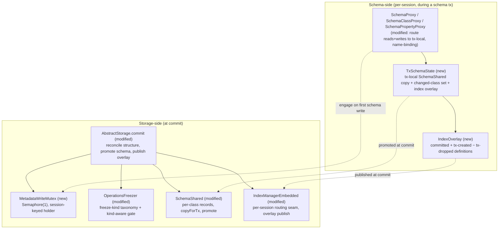

<!-- workflow-sha: 3e9c22298dfe68d2980646704850c781f8af88d5 -->
# Transactional Schema Operations (YTDB-382)

## Design Document
[design.md](design.md)

## High-level plan

**Change tier:** full — matched categories: Concurrency, Crash-safety / Durability, Architecture / cross-component coordination

### Goals

Make schema and index operations fully transactional — atomic, isolated, and
rollback-free — and remove the per-property write amplification YTDB-382 exists
to kill.

Today storage leads a schema change: `createClass`, `dropClass`, `createIndex`
and their siblings mutate storage structure first, then reflect the result into
a single metadata record, each self-committing in its own micro-transaction. The
whole schema lives in one record rewritten on every change, and a schema change
cannot roll back with the transaction that made it. This plan inverts the
dependency. During a transaction a schema or index change mutates only metadata
records (ordinary transactional records, so rollback is free); at commit, storage
diffs the committed metadata against the current structure and creates or drops
the matching collections and engines inside the commit's own atomic operation, so
the structural change is atomic with the record writes and recoverable from the
WAL. A per-class record format replaces the monolithic schema record, so a
one-class change writes one record instead of the whole schema.

### Constraints

- **Schema isolation must equal data-record isolation** — a transaction sees only
  its own uncommitted schema; other sessions see committed state until commit.
- **No optimistic schema concurrency.** A second schema transaction blocks on a
  lock; it is never aborted or rolled back on contention (assignee constraint, D5).
- **`stateLock` (`ScalableRWLock`) is non-reentrant.** A commit holding the write
  lock must reconcile through lock-free inner primitives, never the public
  structural methods, which re-acquire it and self-deadlock (D3, D19).
- **The low schema-change rate is the load-bearing premise.** It is what makes
  pessimistic serialization (D5/D7), the whole-commit exclusive lock (D19), and the
  in-commit index build (D12) acceptable.
- **Existing databases migrate by operator-driven export/import**, not an in-place
  on-open migrator. New binaries reject an old-format database on a version check
  and redirect to export/import (D14, D20).
- **The whole-commit write lock must not become a read outage.** The two remaining
  lock-based read sites convert to snapshot-first reads, and a schema commit aborts
  loudly against an operator freeze rather than parking inside the lock window
  (D19, I-freezer-1).
- **The v1 in-commit index build is bounded to empty classes** (or a documented
  size bound); the unbounded populated-class build moves to YTDB-1064 (D12).

### Architecture Notes

#### Component Map

- **SchemaProxy / SchemaClassProxy / SchemaPropertyProxy** (modified) — the routing
  seam. Outside a schema transaction they resolve against committed `SchemaShared`;
  inside one they route reads and writes to the session's `TxSchemaState` and
  re-resolve proxy targets by name (three-tier resolution), so a captured pre-tx
  proxy cannot hand a shared impl into the private copy.
- **TxSchemaState** (new) — holds the tx-local `SchemaShared` copy (a `fromStream`
  re-parse, not a field clone), the changed-class set that drives the per-class
  commit, and the `IndexOverlay`.
- **IndexOverlay** (new) — a lightweight overlay of index definitions, not a content
  copy; index content stays in the storage-backed engine.
- **AbstractStorage.commit** (modified) — where a schema-carrying commit reconciles
  structure, promotes the tx-local schema, and publishes the overlay, under the
  four-lock order and the whole-commit write lock.
- **MetadataWriteMutex** (new) — the `Semaphore(1)` with a session-keyed holder that
  serializes schema- and index-changing transactions.
- **OperationsFreezer** (modified) — gains the freeze-kind taxonomy and the
  kind-aware gate so a schema commit never turns a freeze into a read outage.
- **SchemaShared** (modified) — per-class records, `copyForTx`, and commit-time
  promotion into the existing shared instances.
- **IndexManagerEmbedded** (modified) — the per-session routing seam and the
  commit-time overlay publication.

#### Decision Records

The full live four-bullet Decision Records are inline in each owning track's
`## Decision Log` (the track-canonical carrier). The records below are the
strategic view; each links to its long-form seed in `design.md`.

#### D1: Invert the dependency — metadata-first, storage reconciles at commit
- **Alternatives considered**: keep storage-leading with eager allocate-then-reclaim on rollback.
- **Rationale**: mutating only transactional metadata records during the tx makes rollback free and structural change atomic with record writes.
- **Risks/Caveats**: every mutation entry point must be reworked to run inside an open tx (I-A7).
- **Implemented in**: Track 3 (enablement), Track 4 (commit reconciles)
- **Full design**: design.md §"Overview", §"Commit-time reconciliation"

#### D2: Provisional collection ids, resolved at commit
- **Alternatives considered**: allocate real collection ids eagerly at create time.
- **Rationale**: a new collection carries a sentinel negative id (disjoint from the abstract-class `-1`, so `<= -2`), resolved to its real id at commit before any record serializes, mirroring temp RIDs.
- **Risks/Caveats**: the `collectionId < 0` convention is tested in 11+ sites; the in-memory maps treat provisional ids as pending-real while file sites keep skipping negatives. A provisional id reaching durable bytes loses the class's collections.
- **Implemented in**: Track 4
- **Full design**: design.md §"Commit-time reconciliation"

#### D3: Commit ordering — structural reconciliation before record allocation
- **Alternatives considered**: allocate then create structure.
- **Rationale**: an engine must exist before any code looks it up by id, and a collection before a record position is allocated in it.
- **Risks/Caveats**: reconciliation must call lock-free inner primitives under the held write lock, never the public structural methods (non-reentrant `stateLock`).
- **Implemented in**: Track 4
- **Full design**: design.md §"Commit-time reconciliation"

#### D4: Isolation is record-local, identical to data-record updates
- **Alternatives considered**: eager `SchemaShared` mutation with in-memory revert.
- **Rationale**: changing only the tx's own metadata-record copies gives free rollback and the same isolation model data already uses.
- **Risks/Caveats**: requires the tx-local schema view (D8) and proxy name-binding.
- **Implemented in**: Track 3
- **Full design**: design.md §"The tx-local schema view and transactional enablement"

#### D5: Single schema-writer enforced by locking, never by rollback
- **Alternatives considered**: optimistic concurrency aborting a schema tx on conflict (rejected by the assignee).
- **Rationale**: a second schema tx blocks on the mutex; the low schema-change rate makes blocking rare.
- **Risks/Caveats**: a wedged owner keeps the mutex; cross-thread reaping is out of scope (YTDB-1114).
- **Implemented in**: Track 3
- **Full design**: design.md §"The schema-write mutex and lock order"

#### D6: Commit-time delta via the diff approach, from existing tx tracking
- **Alternatives considered**: a separate intent list of structural ops.
- **Rationale**: the transaction already tracks changed records and per-property dirty marks; the delta reads from them with no new bookkeeping.
- **Risks/Caveats**: drops are NOT in the changed-record set (a dropped class's record is deleted), so the structural create/drop set uses D9's set difference, not the property diff.
- **Implemented in**: Track 4
- **Full design**: design.md §"Commit-time reconciliation"

#### D7: A dedicated, transaction-scoped metadata-write mutex
- **Alternatives considered**: hold `stateLock.writeLock` for the whole tx; reuse `SchemaShared.lock` for tx lifetime (both too coarse).
- **Rationale**: one `Semaphore(1)` covering both schema and index changes, engaged above the shared locks on the first write, serializes schema txs without conflating per-op locks with tx lifetime.
- **Risks/Caveats**: teardown, the permit handshake, and the freezer gate are the design's hardest concurrency work (see I-handshake-1, I-freezer-1).
- **Implemented in**: Track 3 (primitive + engage), Track 7 (lifecycle handshake + freezer gate)
- **Full design**: design.md §"The schema-write mutex and lock order", §"Mutex lifecycle and the permit handshake", §"The freezer gate"

#### D8: Tx-local schema view via a per-session copy-on-first-write `SchemaShared`
- **Alternatives considered**: an immutable committed base plus a changed-class overlay map (deferred — adds overlay-aware resolution and ripple recomputation to the correctness-critical read path).
- **Rationale**: a full working `SchemaShared` copy reuses the existing mutation machinery, which recomputes the derived-state ripple (inheritance, `polymorphicCollectionIds`, subclass sets) for free; the copy is cheap and rare.
- **Risks/Caveats**: the seed must be a `fromStream` re-parse (not a field clone), or fresh classes would still point at the shared `owner` and siblings.
- **Implemented in**: Track 3 (copy + routing), Track 4 (promotion)
- **Full design**: design.md §"The tx-local schema view and transactional enablement"

#### D9: Diff over collection ids and index definitions, not class names
- **Alternatives considered**: diff by class name (breaks on rename).
- **Rationale**: collection id is the stable structural identity; a rename keeps its ids and so is structurally inert. Create/drop is the set difference over committed vs tx-local collection-id sets.
- **Risks/Caveats**: the predicate must distinguish abstract (`-1`) from provisional (`<= -2`).
- **Implemented in**: Track 4
- **Full design**: design.md §"Commit-time reconciliation"

#### D10: Structural revertibility via the existing atomic-operation WAL; no pool
- **Alternatives considered**: a page-reuse / deletion pool.
- **Rationale**: file create/delete is buffered intent applied only in `commitChanges`, which rollback skips, so a rolled-back or crashed-before-commit tx leaves files byte-for-byte unchanged. The pool's only correctness benefit is already free.
- **Risks/Caveats**: the crash-recovery half is conditional on the F55 lazy-consult replay fix (Track 1, prerequisite).
- **Implemented in**: Track 4 (+ Track 1 prerequisite)
- **Full design**: design.md §"Commit-time reconciliation"

#### D11: Artificial collection names, decoupled from class names
- **Alternatives considered**: keep `<className>_<counter>` names.
- **Rationale**: generating collection names from a counter alone makes a class rename touch zero collection files, removing the non-WAL-safe `writeCache.renameFile` path.
- **Risks/Caveats**: contained to the name-generation site plus neutering `renameCollection`.
- **Implemented in**: Track 6
- **Full design**: design.md §"Base-keyed engine files and metadata-only rename"

#### D12: Accept the index build under the exclusive commit lock for v1
- **Alternatives considered**: off-lock / streamed / background build.
- **Rationale**: an in-commit lock-free scan that emits zero extra WAL units is the simplest correct build; the low schema-change rate makes the stall acceptable.
- **Risks/Caveats**: forward and recovery heap both scale with the unit size, so v1 bounds the eager build to empty classes (or a documented size bound); the unbounded case is YTDB-1064.
- **Implemented in**: Track 5
- **Full design**: design.md §"Index build and query-usability"

#### D13: A tx-created index is not query-usable until commit; planner skips unbuilt indexes
- **Alternatives considered**: make the new index usable mid-tx (its engine does not exist).
- **Rationale**: the planner skips any index whose engine is not built and falls through to a full scan, which returns the correct merged tx view.
- **Risks/Caveats**: the existing read-merge for already-built indexes must be preserved unchanged.
- **Implemented in**: Track 5
- **Full design**: design.md §"Index build and query-usability"

#### D14: Split the schema into per-class records, killing write amplification
- **Alternatives considered**: keep all classes in one EMBEDDEDSET record.
- **Rationale**: a schema record that links to one record per class means a one-class change writes one record, mirroring the index-manager pattern. This is the write-amplification reduction YTDB-382 exists for.
- **Risks/Caveats**: a format change that overturns the "no migration" assumption; the root record must be written when its non-link payload changes, or a property-create restarts into a null `globalRef` and a colliding collection name.
- **Implemented in**: Track 2
- **Full design**: design.md §"Per-class schema records"

#### D15: Tx-local index-definition overlay, not a content copy of the IndexManager
- **Alternatives considered**: a deep copy mirroring D8 (wrong — an index is a thin handle over a storage-backed engine).
- **Rationale**: overlaying the two lookup maps (effective set = committed + tx-created − tx-dropped) gives isolation without copying engine content.
- **Risks/Caveats**: the tx-local snapshot must force-rebuild on every mid-tx index change, or same-tx inserts into the new index are silently untracked; a committed membership change is its own tracked category.
- **Implemented in**: Track 5
- **Full design**: design.md §"Tx-local index overlay"

#### D16: Stable-base-keyed engine files; index rename is metadata-only
- **Alternatives considered**: id-keyed files for all engines plus migrate legacy files (re-introduces the non-WAL-safe rename path).
- **Rationale**: every engine file base derives from the stable engine id; under D20's import-only migration no name-keyed file can exist, so the dual-base compat path is dropped and a rename never touches the engine.
- **Risks/Caveats**: the data, null-bucket, and histogram files must all source the base.
- **Implemented in**: Track 6
- **Full design**: design.md §"Base-keyed engine files and metadata-only rename"

#### D17: v1 does the metadata-only class-rename re-association; index-name rename deferred
- **Alternatives considered**: ship the full inert index-name rename and `ALTER INDEX … RENAME` now.
- **Rationale**: re-keying `classPropertyIndex` and updating each definition's `className` (commit-only) keeps the index accelerating under the new class name; the index's own name lagging is acceptable.
- **Risks/Caveats**: the renaming tx's own queries fall back to an unaccelerated scan until commit; full index-name rename is YTDB-1066.
- **Implemented in**: Track 6
- **Full design**: design.md §"Base-keyed engine files and metadata-only rename"

#### D18: Genesis bootstrap is two-phase — a schema tx, then a data tx
- **Alternatives considered**: one unified genesis transaction.
- **Rationale**: the schema tx builds and commits the `OUser.name` UNIQUE index before the data tx inserts users, so the user-creation code's direct index lookups hit a built engine; a unified tx would expose an unbuilt index to a direct lookup.
- **Risks/Caveats**: restructures `SecurityShared.create` and the sibling metadata creators.
- **Implemented in**: Track 8
- **Full design**: design.md §"Genesis bootstrap"

#### D19: Schema-carrying commits take the write lock from the start; pure-data commits keep the read-lock fast path
- **Alternatives considered**: a mid-commit read→write upgrade (the F33 interleaving window).
- **Rationale**: deciding at entry from the same schema-or-index signal that engages the mutex removes the upgrade and its window; an index-only tx takes the write-lock branch too.
- **Risks/Caveats**: a schema commit excludes concurrent data commits for its duration (bounded by the low schema-change rate); the two lock-based read sites convert to snapshot-first.
- **Implemented in**: Track 4
- **Full design**: design.md §"The schema-write mutex and lock order"

#### D20: Schema-format migration is operator-driven JSON export/import, not in-place
- **Alternatives considered**: an in-place on-open migrator (carries partial-migration crash-safety burden).
- **Rationale**: export reads the logical schema and import rebuilds through the schema API, so the new code never parses the old format and there is no partial-migration state to recover.
- **Risks/Caveats**: export/import must be fail-closed and whole-or-nothing (manifest written last, whole-stream gzip validation, version reject-and-redirect gate, EXPORTER_VERSION 14→15).
- **Implemented in**: Track 8
- **Full design**: design.md §"Schema-format migration"

#### D21: Tx-aware immutable snapshot makes same-tx schema changes visible to validation and serialization (added after Track 4)
- **Alternatives considered**: (B) route `EntityImpl` validation and serialization through the tx-aware `SchemaProxy` — rejected: per-field proxy resolution is too slow on the data-write hot path. (A) accept the limitation and document the semantic — rejected: same-tx DDL plus DML is a real usage pattern and the silent constraint-skip is a significant DevX degradation.
- **Rationale**: Track 4 completion review found that `EntityImpl.validate()` (`EntityImpl.java:3932`) resolves the class through the committed-only snapshot and guards every check behind `if (immutableSchemaClass != null)`, so a class, property type, or constraint rule created in the open transaction resolves to null — strict-mode, mandatory, notnull, type, min/max, and regex are silently skipped and serialization falls back to schemaless. Read-your-writes holds for schema structure (the tx-aware `SchemaProxy`) and breaks for the schema contract (the committed-only snapshot). The snapshot is the single read tier the whole read/query/serialize/security stack consumes (174 call sites), so making it tx-aware gives consistent read-your-writes at per-operation build cost: `SchemaProxy.makeSnapshot()` resolves the tx-local `SchemaShared` during a schema or index transaction, and the snapshot is refcount-pinned per operation (`MetadataDefault.makeThreadLocalSchemaSnapshot`), not resolved per field. This reuses D15's lazy force-rebuild rather than adding a mechanism, and makes the snapshot's class and property view consistent with the index-list view D15 already makes tx-aware. Supersedes the committed-only-snapshot behavior (`SchemaProxy.makeSnapshot` reads the committed `delegate`, `SchemaProxy.java:78`): `design.md` §"The tx-local schema view" states that during a schema tx reads route to the tx-local structure "not only the snapshot" (design.md:270), yet leaves the snapshot itself committed-only; the Phase 4 `design-final.md` reconciles the as-built tx-aware snapshot.
- **Risks/Caveats**: (1) commit-path read before promotion — `computeCommitWorkingSet` (`AbstractStorage.java:2410`, reached at line 2528, after `reconcileCollections` at 2473 and before `forceSnapshot` at 2691) calls `getImmutableSchemaClass` then `getCollectionForNewInstance`; a tx-aware snapshot must hand back the reconciled real collection id, never a provisional id (`<= -2`), or `doGetAndCheckCollection` fails. Verify reconciliation re-keys the tx-local class before the working-set build, or guard the commit-path read. (2) query or MATCH against a tx-created class in the same transaction — the class now appears in the snapshot, but its physical collection (provisional id, D2) and indexes and engines (built at commit, D12) do not exist yet; the planner extends D13's skip-unbuilt treatment to provisional-collection classes so the WHERE block falls through to the merged tx scan. (3) the D15 force-rebuild trigger widens from mid-tx index changes to mid-tx class and property changes.
- **Implemented in**: Track 5 (with D15's index overlay — shared snapshot force-rebuild)
- **Full design**: captured in this record and Track 5's `## Context and Orientation` and `## Plan of Work`; `design.md` is frozen, so the as-built design reconciles in Phase 4.

#### Invariants

Each invariant below maps to a testable assertion in the named track; the full
statements, tests, and provenance live in `design.md` per-section "Decisions &
invariants" blocks and in the research log's `## Invariants and Test Requirements`.

- **I-A1 / I-A2 / I-A3 / I-A4** (Track 4) — structural change is atomic with the
  commit and free to roll back; a provisional id never reaches durable bytes;
  commit applies structure before it needs it; a failed commit leaves no phantom
  registration.
- **I-A5 / I-A6 / I-A7** (Track 3; I-A7 completes with Track 5's overlay routing) —
  schema isolation is record-local; one schema writer at a time by locking; every
  mutation entry point rides the user transaction (the self-commit membership leak
  is the silent failure tested for).
- **I-C1** (Track 4) — the four locks are taken in one acyclic order
  (mutex → `SchemaShared.lock` → index-manager lock → `stateLock.writeLock`).
- **I-C2 / I-C4** (Track 3) — the mutex engages above the shared locks, never
  inside them; engaging on a thread that already holds it fails loudly.
- **I-C3 / I-handshake-1 / I-freezer-1** (Track 7) — tx-scoped resources torn down
  only on the owning thread; the mutex has exactly one releaser and never wedges;
  a schema commit never turns a freeze into a read outage.
- **I-P1** (Track 4) — commit promotes into the existing shared instances and
  invalidates the snapshot once.
- **I-P2 / I-P3 / I-P4** (Track 5) — indexes are overlaid, not copied, and the
  snapshot rebuilds on mid-tx index change; a tx-created index is not query-usable
  until commit; the build commits to exactly the transaction's final state.
- **I-P5** (Track 5) — during a schema or index tx the immutable snapshot reflects
  tx-local classes, property types, and constraint rules, so `EntityImpl.validate()`
  enforces a same-tx-created constraint instead of silently skipping it (D21).
- **I-U1** (Track 2) — per-class records remove write amplification, and the root
  is written exactly when its payload changes.
- **I-U2 / I-U3** (Track 6) — class rename touches zero storage; engine files are
  base-keyed and a rename keeps the index accelerating.
- **I-U4** (Track 8) — genesis builds the schema before it inserts users.
- **I-U5** (Track 4) — a schema-carrying commit takes the write lock from the
  start; a pure-data commit keeps the read-lock fast path.
- **I-migration-fail-closed / I-migration-isolation / I-migration-failfast**
  (Track 8) — format migration is operator-driven export/import that fails loudly;
  a record is exported whole or not at all; the new exporter promotes nothing on
  failure.

#### Integration Points

- A schema or index mutation engages `MetadataWriteMutex` at the `SchemaProxy` /
  index-routing layer on the transaction's first write (Track 3).
- `AbstractStorage.commit` reads the unified schema-or-index signal at entry to
  choose the write-lock branch and run reconciliation (Track 4).
- The query planner reads the effective index set through the per-session routing
  seam and skips unbuilt indexes (Track 5).
- `EntityImpl.validate()` and entity serialization read the schema contract through the
  tx-aware `SchemaProxy.makeSnapshot()`, so a same-tx schema change is enforced on that
  transaction's own entities (Track 5).
- New binaries reject an old-format database on the schema version check at storage
  open and redirect to export/import (Track 8).

#### Non-Goals

- Off-lock / streamed / empty-class-scoped optimization of the populated-class
  index build (YTDB-1064).
- Inert index-name rename and `ALTER INDEX … RENAME` (YTDB-1066).
- Cross-thread reaping of a stranded schema transaction (YTDB-1114).
- Closing the residual concurrent-data-commit-vs-new-index window (YTDB-1101).
- An in-place on-open schema-format migrator (D20 replaces it with export/import).

## Checklist

- [x] Track 1: WAL replay lazy-consult fix (prerequisite)
  > Fix the lazy-consult WAL replay path so a crash between an atomic operation's
  > end record becoming durable and its physical apply completing no longer aborts
  > the restore of a committed file-creating unit and discards all later units.
  > This is the prerequisite the reconciliation crash-recovery claim (I-A1, D10)
  > rests on; it shares no files with the schema or index subsystems.
  >
  > **Track episode:**
  > Closed the F55 lazy-consult abort in the shared WAL replay path.
  > `AbstractStorage.restoreAtomicUnit` routes both the `UpdatePageRecord` and
  > `PageOperation` missing-file redos through a new private helper,
  > `ensureFileForReplay`: it scans the current atomic unit forward for the
  > matching `FileCreatedWALRecord` and materializes the file via
  > `readCache.addFile`, then falls back to the preserved non-null
  > `restoreFileById` path, and only throws for a genuinely-incomplete unit whose
  > end record never became durable. A committed file-creating unit whose physical
  > apply was lost to a crash now replays, and every later committed unit survives
  > instead of being discarded by the `catch (RuntimeException)` in `restoreFrom`.
  > The unit's own later `FileCreatedWALRecord` replays as an idempotent no-op
  > only because `writeCache.exists` flips true once `readCache.addFile` runs;
  > that transition is now confirmed. `ensureFileForReplay` is the single
  > reconciliation point for a missing-file page redo and is reached by both
  > `restoreFrom` callers (open-time `restoreFromBeginning` and incremental-backup
  > `DiskStorage.restoreFromIncrementalBackup`), so the IBU restore path recovers
  > lazily too; Track 4's I-A1 reconciliation crash-recovery tests can now assume
  > this prerequisite has landed. The crash-replay regression was settled toward
  > the existing Mockito unit harness (`RestoreAtomicUnitPageOperationTest`, two
  > units in sequence) over a restart IT, with no production divergence from the
  > Plan of Work.
  >
  > **Track file:** `plan/track-1.md` (1 step, 0 failed)
  >
  > **Strategy refresh:** CONTINUE — no downstream impact detected. Track 1
  > confirmed the lazy-consult replay prerequisite (D10) that Track 4's I-A1
  > crash-recovery tests rest on; no Component Map, Decision Record, or
  > inter-track dependency for the remaining tracks changed.

- [x] Track 2: Per-class schema records (D14)
  > Replace the single monolithic schema record with a root record that links to
  > one entity record per class, add the net-new per-class record-RID field bound
  > at load, write only changed class records plus the root when its non-link
  > payload changes, and bump the schema version into a reject-and-redirect gate.
  > This is the persistence foundation and the write-amplification win; the
  > tx-local seed (Track 3) binds the per-class RIDs it introduces.
  >
  > **Track episode:**
  > Replaced the single monolithic schema record with a root record carrying a
  > `classes` LINKSET to one standalone record per class plus the non-link root
  > payload (global-property table, `collectionCounter`, `blobCollections`),
  > mirroring the index manager's `CONFIG_INDEXES` link set. `SchemaClassImpl`
  > gained a nullable record-RID field, bound at load from the link set and
  > allocated at commit through the ordinary temp→persistent record-id path;
  > `SchemaClassImpl.toStream` now writes into a caller-supplied standalone record
  > instead of an embedded entity. The schema version moved from 4 to 6 and the
  > `fromStream` gate tightened to `schemaVersion != CURRENT_VERSION_NUMBER`,
  > dropping the legacy version-5 accept-arm so both a version-4 and a legacy
  > version-5 database reject-and-redirect to export/import rather than mis-parsing
  > under the new format. `DatabaseCompare.convertSchemaDoc` proved to be dead code
  > (schema records live in internal collection id 0, which `skipRecord` skips
  > unconditionally) and was removed rather than rewritten; the live backup/restore
  > gate is the `StorageBackup*` and `LocalPaginatedStorageRestore*` core suites,
  > all green (the `DbImportExport*` ITs named in the plan are all `@Disabled`).
  > One review-fix iteration during step implementation self-healed a stale
  > per-class record id left by a failed save and hardened the round-trip tests
  > with a durable reload; a later review-mode pass dropped a redundant reentrant
  > read-lock acquire in `toStream`, leaving the caller's write lock (now asserted
  > and documented) as the schema serializer's sole synchronization.
  >
  > Cross-track effects to carry forward: the schema version is now 6, so Track 8's
  > export/import (EXPORTER_VERSION 14→15) and the `DatabaseExport`/`DatabaseImport`
  > schema-version field must agree on 6. The serializer asserts
  > `isWriteLockedByCurrentThread()` and takes no other lock, documenting the
  > write-lock-only contract Track 7 must preserve if it inverts the schema lock
  > model. The round-trip preserves per-class RIDs and the root payload
  > (test-verified through a durable reload), so Track 3's tx-local seed binds RIDs
  > faithfully, and the load reader rejects a non-persistent linked record id with
  > a diagnosable `ConfigurationException` that Track 4's selective per-class write
  > can rely on. The write-amplification win and the F59 root-omission regression
  > stay deferred to Track 4 (D6 dirty tracking), unobservable at this track's
  > storage-leads boundary.
  >
  > **Track file:** `plan/track-2.md` (1 step, 0 failed)
  >
  > **Strategy refresh:** CONTINUE — no Track 3 impact. Track 2's round-trip
  > serializer preserves each class's per-class record RID, the foundation
  > Track 3's tx-local `fromStream` seed (D8) binds against. Track 2's two
  > forward-carried contracts (schema version now 6; write-lock-only schema
  > serializer) land on Tracks 8 and 7, not Track 3.

- [x] Track 3: Tx-local schema view, transactional enablement, and the metadata-write mutex (D1, D4, D5, D7, D8)
  > Seed a per-session tx-local `SchemaShared` (a `fromStream` re-parse) on the
  > first schema write, route `SchemaProxy` reads and writes to it with three-tier
  > proxy resolution, de-guard the throw-guard and self-commit mutation entry
  > points so they ride the user transaction, and introduce the `MetadataWriteMutex`
  > `Semaphore(1)` with its engage point above the shared locks and its same-thread
  > loud-reject. Ships the mutex primitive and normal release; the abnormal-termination
  > handshake is Track 7.
  >
  > **Track episode:**
  > Delivered the enablement half of transactional schema. A schema or index change
  > made inside a user transaction routes to a per-session tx-local `SchemaShared`
  > copy (seeded by a `fromStream` re-parse of committed state, per-class RIDs
  > preserved), is visible only to that transaction, rolls back for free, and
  > serializes against other schema-changing transactions through the new
  > `MetadataWriteMutex` `Semaphore(1)` (engaged above the shared metadata locks,
  > same-thread loud-reject, normal release in the outermost teardown). The
  > throw-guards and self-commit membership sites were de-guarded to write into the
  > tx-local view; eager structural build and commit-time promotion are Track 4/5.
  > Phase C cleared 1 blocker (BC1: the tx-local seed re-entered the mutex engage
  > through the inheritance rebuild's index ripple, fixed with a transient
  > `seedingTxSchemaState` guard) plus 9 should-fix over 2 iterations; a Review-mode
  > completion pass (`00d81f43dc`) then made the tx-local changed-class set record
  > class create and rename (previously only drop and index-membership) and corrected
  > the `MetadataWriteMutex` foreign-releaser Javadoc overclaim.
  > Cross-track: Track 4 (commit reconciliation) can rely on `getChangedClasses()`
  > carrying create and rename (a rename records the new name only; a set name absent
  > from the tx-local copy means a drop) and on the seed-failure release as the
  > liveness complement. Track 5 (index overlay) must route
  > `recordMembershipChangeIntoTxLocalView`'s index lookup through tx-local index
  > definitions; today it reads the shared registry, so a same-tx membership change
  > against a tx-deferred index hits a loud null-class `IndexException`. Track 5 must
  > also honor the `Index.markDeferred` read contract. Track 7 (mutex hardening) must
  > convert `MetadataWriteMutex.holder` to `AtomicReference<Holder>` with a
  > `compareAndSet`-gated release so normal and abnormal releases never double-release
  > the permit. CS1 (rolled-back in-tx create leaves a recovery-visible stray
  > collection) is Track-4-owned per D2/D10.
  >
  > **Track file:** `plan/track-3.md` (4 steps, 0 failed)
  >
  > **Strategy refresh:** CONTINUE — no contradiction with the remaining tracks.
  > Track 3's late changed-class create/rename recording and the engaged mutex are
  > exactly what Track 4's D9 set-difference diff and four-lock acquisition consume.
  > Two planned hand-offs now land on Track 4 as designed: CS1 (a rolled-back in-tx
  > create must leave no recovery-visible stray collection, D2/D10) and the deferred
  > D6 write-amplification win plus the F59 root-omission regression.

- [x] Track 4: Commit-time reconciliation and the schema-carrying commit lock (D1, D2, D3, D6, D9, D10, D19)
  > Make the commit compute the structural delta as a set difference over committed
  > versus tx-local collection-id sets, resolve provisional ids before any record
  > serializes, reconcile in the correct order through lock-free inner primitives
  > under a commit-local id allocator, take `stateLock.writeLock()` from the start
  > under the four-lock order, promote the tx-local schema into the existing shared
  > instances with one `forceSnapshot`, and convert the two remaining lock-based
  > read sites to snapshot-first.
  >
  > **Track episode:**
  > Built the commit-time reconciliation core (D1/D3/D6/D9/D10) and the schema-carrying
  > commit lock (D19) with the promotion facet (D8): a schema-carrying commit takes
  > `stateLock.writeLock()` from the start under the four-lock order, computes the
  > structural delta as a set difference over committed versus tx-local collection-id
  > sets, allocates and resolves provisional ids before any record serializes, reconciles
  > drops-then-creates through lock-free inner primitives, and promotes the tx-local schema
  > into the shared instances with one `forceSnapshot`. Pure-data commits keep the
  > read-lock fast path.
  >
  > Decomposition ran 4→5→6 steps across two mid-Phase-B splits, both forced by
  > self-deadlock discoveries. Step 1 extracted lock-free commit-window primitives and a
  > create/publish seam. Step 2 allocated provisional `<= -2` collection ids at both
  > producer sites (create and the abstract→concrete alter). The original reconciliation-core
  > step returned DESIGN_DECISION twice: the first split carved out D2 provisional-id
  > production, the second added a lock-free commit-window record-read substrate (Step 3)
  > after a thread dump caught `toStream`/`fromStream` re-entering `stateLock.readLock()`
  > under the held write lock. Step 4 landed the reconciliation core on that substrate;
  > Step 5 made the serializer selective (writes only `getChangedClasses()`, plus the F59
  > selective root write); Step 6 converted the two hot lock-based reads
  > (`createVertexWithClass`, `getLowerSubclass`) to snapshot-first.
  >
  > Cross-track hand-offs (all in Surprises): the commit-window seam and the
  > `recordWriteTarget` proxy choke point generalize to Tracks 5/6/8. Any commit-body method
  > that re-enters the read lock reuses the window; any de-guarded class or property
  > mutation inherits complete change-tracking as long as it routes through
  > `SchemaProxedResource.resolveForWrite`. A failed in-memory schema-carry commit orphans an
  > engine file (`DirectMemoryOnlyDiskCache` never reverts eager `addFile`); Step 4 added a
  > component-guarded create-side revert arm that Track 5/6 engine-file creates must mirror.
  >
  > The completion review escalated a design-level gap to inline replanning: a class, type,
  > or rule created in an open tx is not enforced on that tx's own entities, because
  > `EntityImpl.validate()` reads the committed-only snapshot. That became D21 (tx-aware
  > immutable snapshot) on Track 5, alongside D15's index overlay. D21 also constrains Track
  > 4's `computeCommitWorkingSet` read, which Track 5 must confirm sees the reconciled real
  > id or guard against a provisional one. Three findings were deferred to Track 5 as plan
  > corrections: TB2 (the index-engine half of the failed-commit registry-cleanliness
  > criterion), the create-side provisional-collection index gap, and the drop-side tx-local
  > `dropIndex` commit half.
  >
  > Track-level code review ran nine dimensional reviewers over `1dd9c0424f..HEAD`, returned
  > 31 findings (1 blocker, 10 should-fix, 20 suggestions), and cleared every in-scope finding
  > in two fix iterations (`0cb16dfc71`, `ab8f411066`), 0 blockers remaining. The blocker was
  > a confirmed Track-4 regression proved empirically (green at base, red at HEAD): Step 5's
  > `recordWriteTarget` recorded a class under its old name on `setName` before the rename
  > applied, so `SchemaDeguardTest.renameClassInsideTransactionRecordsNewNameOnly` failed.
  > `changeClassName` now calls `unmarkClassChanged(oldName)`, and the test is green. A later
  > review-mode pass (`1c52578681`) hardened the barrier-hang tests, tightened the rename
  > rationale, and turned the `undoReconciledCollections` silent skip into an assert-plus-log.
  >
  > One test stays red and un-`@Ignore`d: `MetadataWriteMutexTest.twoConcurrentSchemaTransactionsSerializeWithoutAbort`.
  > It is not in the Track 4 diff, fails identically before and after the track, and is the
  > pre-existing Track 3 / Track 7 tx-local-seed / mutex-handshake failure — a merge-blocker
  > for its owning track, not this one. No full-suite or coverage run was possible (host
  > parallel-surefire fork-start crash, environmental); every Track 4 test class is green under
  > targeted single-class runs, and the CI coverage gate is the final arbiter.
  >
  > **Track file:** `plan/track-4.md` (6 steps, 0 failed)
  >
  > **Strategy refresh:** CONTINUE — every Track-4 discovery touching a remaining
  > track was already folded in before this gate: D21 (tx-aware snapshot) added to
  > Track 5 via inline replan and re-validated by the post-D21 plan review, the three
  > deferred commit-path items (I-A4/TB2, provisional-collection index gap, drop-side
  > `dropIndex` half) landed in Track 5's Plan of Work and Validation, and Track 4's
  > commit-window seam / `recordWriteTarget` choke point / engine-revert arm are
  > reusable primitives. No Component Map, Decision Record, or inter-track dependency
  > for Tracks 5-8 changed.

- [ ] Track 5: Tx-local index overlay, commit-time engine build, query-usability, and the tx-aware snapshot (D12, D13, D15, D21)
  > Give indexes a tx-local definition overlay (committed + tx-created − tx-dropped)
  > with the four categories and the per-session index-manager routing seam,
  > force-rebuild the tx-local snapshot on every mid-tx index change, build a
  > tx-created index's engine at commit through a lock-free scan plus final-state
  > re-derivation (bounded to empty classes for v1), and make the planner skip an
  > unbuilt index. Completes the I-A7 membership-ripple routing Track 3 de-guarded, and
  > makes the immutable snapshot tx-aware so same-tx schema changes reach validation and
  > serialization (D21). Also lands three items the Track-4 completion review surfaced —
  > the index-engine half of the failed-commit registry-cleanliness criterion (I-A4/TB2),
  > the create-time provisional-collection index gap, and the drop-side `dropIndex` commit
  > half — each detailed in `track-5.md`'s `## Plan of Work` and `## Validation and Acceptance`.
  > **Scope:** ~18 files covering `IndexManagerEmbedded`, `ClassIndexManager`, the routing seam, the snapshot rebuild, the planner guard, the commit build, `SchemaProxy.makeSnapshot` / the snapshot tx-awareness, the `AbstractStorage.computeCommitWorkingSet` commit-path guard, and overlay / build / same-tx-validation tests.
  > **Depends on:** Track 3, Track 4

- [ ] Track 6: Base-keyed engine files and metadata-only rename (D11, D16, D17)
  > Generate collection names from a counter alone so a class rename touches zero
  > collection files, derive every index-engine file base (data, null-bucket,
  > histogram) from the stable engine id, and apply the commit-only class-rename
  > re-association that re-keys `classPropertyIndex` and updates each definition's
  > `className` so the index keeps accelerating under the new class name.
  > **Scope:** ~11 files covering `StorageComponent`/`BTree` file basing, the collection-name generator, `renameCollection`, `IndexDefinition.className`, and rename/crash tests.
  > **Depends on:** Track 4, Track 5

- [ ] Track 7: Concurrency hardening — mutex permit handshake and the freezer gate (D7)
  > Harden the mutex against pool-teardown wedges with a session-keyed
  > compare-and-clear release, a `(session, ordinal, thread)` holder record,
  > owner-thread-only teardown, and the Dekker engage/teardown handshake; and make
  > a schema commit never turn a freeze into a read outage with a freeze-kind
  > taxonomy, a kind-aware gate at the loop-top and park-decision sites, and the
  > operator-arm cut-and-unpark. This is the design's hardest concurrency work.
  > **Scope:** ~13 files covering the mutex lifecycle, `DatabaseSessionEmbedded` teardown, `OperationsFreezer`, the freeze registration sites, and interleaving stress tests.
  > **Depends on:** Track 3, Track 4

- [ ] Track 8: Genesis bootstrap and schema-format migration (D18, D20)
  > Two terminal autonomous units packed under the footprint ceiling: restructure
  > genesis into a schema transaction (building `OUser.name` at commit) followed by
  > a data transaction that inserts the default users — the end-to-end smoke test of
  > the Part-1 core — and add the operator-driven export/import migration (manifest
  > written last, whole-stream gzip validation, version reject-and-redirect gate,
  > EXPORTER_VERSION 14→15, per-record spill-to-temp). The two share no files; see
  > the track file for the packing justification.
  > **Scope:** ~14 files covering `SecurityShared` and the sibling metadata creators, `DatabaseExport`/`DatabaseImport`, the gzip-framing subclass, the open-time version gate, and genesis + migration tests.
  > **Depends on:** Track 2, Track 4, Track 5

## Plan Review
- [x] Plan review (consistency + structural) — passed (post-D21-replan re-validation): consistency iter 1 clean (0 findings), structural iter 2 gate-verified

**Auto-fixed (mechanical)**: S1 — trimmed the Track-5 plan-file checklist intro from 5 paragraphs (~15 sentences) to 3 sentences, moving the I-A4/TB2 failed-commit engine-cleanliness arm, the create-time provisional-collection index gap, and the drop-side `dropIndex` commit half into `track-5.md`'s `## Plan of Work` and `## Validation and Acceptance`.

**Escalated (design decisions)**: S2 — added invariant I-P5 (Track 5) for D21's same-tx schema-contract enforcement, plus an Integration Point bullet for the tx-aware `SchemaProxy.makeSnapshot()` read on the `EntityImpl.validate()` / serialization path. User chose "Add I-P5 + IP bullet".

**Consistency (CR)**: 0 findings — all 14 current-state code citations driving Track 5 (D21's `EntityImpl.validate()`, `SchemaProxy.makeSnapshot`, the `AbstractStorage` commit chain, the create/drop index gaps, the 174-call-site snapshot tier) verified clean via PSI.

## Final Artifacts
- [ ] Phase 4: Final artifacts (`design-final.md`, `adr.md`)
