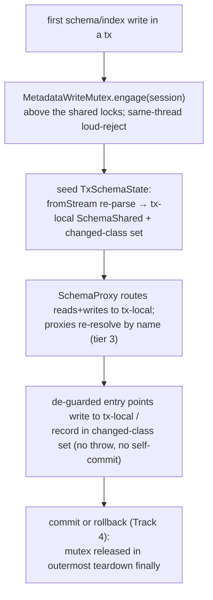

<!-- workflow-sha: 3e9c22298dfe68d2980646704850c781f8af88d5 -->
# Track 3: Tx-local schema view, transactional enablement, and the metadata-write mutex (D1, D4, D5, D7, D8)

## Purpose / Big Picture
After this track, a schema change made inside a transaction is visible only to
that transaction, rolls back for free, and serializes against other
schema-changing transactions through a dedicated mutex.

<!-- Reserved for Move 2 — ADDED/MODIFIED/REMOVED triad. Empty until Move 2 lands. -->

Seed a per-session tx-local `SchemaShared` (a `fromStream` re-parse) on the
transaction's first schema write, route `SchemaProxy` reads and writes to it with
three-tier proxy resolution, de-guard the mutation entry points that today throw
on an active transaction or self-commit in a nested transaction so they ride the
user transaction, and introduce the `MetadataWriteMutex` `Semaphore(1)` with its
engage point above the shared metadata locks and its same-thread loud-reject. This
track ships the mutex primitive and its normal release; the abnormal-termination
permit handshake and the freezer gate are Track 7.

## Progress
- [ ] Review + decomposition
- [ ] Step implementation
- [ ] Track-level code review
- [ ] Track completion

## Surprises & Discoveries
<!-- Continuous-log. Empty at Phase 1. -->

## Decision Log
<!-- The track-canonical live decision carrier (D7). Seeded from the frozen
design.md D-records this track owns. -->

#### D1 (enablement facet): Mutate metadata records during the tx; defer structure to commit
- **Alternatives considered**: keep storage-leading and reclaim eagerly-allocated structure on rollback.
- **Rationale**: the metadata-first inversion holds only if every mutation entry point can run inside an open transaction. This track delivers the enablement half: a schema or index change lands as a metadata-record edit, and the commit (Track 4) builds the matching structure later.
- **Risks/Caveats**: the entry points that block this model (I-A7) must each be reworked; the structural-build half lives in Track 4, so an intermediate branch state has schema commits that route to the tx-local view but do not yet reconcile structure — covered by Track 3 tests that exercise isolation and rollback, not structural commit.
- **Implemented in**: this track (enablement); Track 4 (commit reconciles)
- **Full design**: design.md §"The tx-local schema view and transactional enablement"

#### D4: Isolation is record-local, identical to data-record updates
- **Alternatives considered**: eager `SchemaShared` mutation with an in-memory revert on rollback.
- **Rationale**: a schema mutation changes only the tx's own metadata-record copies; the shared `SchemaShared` is updated only at commit. The session sees its own uncommitted schema; other sessions keep seeing committed state. This is the same isolation model data records already use, and it is what makes D1's free rollback hold.
- **Risks/Caveats**: requires the tx-local view (D8) and proxy name-binding so a captured proxy cannot leak a shared impl into the private copy.
- **Implemented in**: this track
- **Full design**: design.md §"The tx-local schema view and transactional enablement"

#### D5: Single schema-writer enforced by locking, never by rollback
- **Alternatives considered**: optimistic concurrency that aborts a schema tx on conflict (rejected by the assignee — schema-tx rollback due to contention is unacceptable).
- **Rationale**: a tx acquires an exclusive schema-write lock on its first schema mutation and holds it to tx end, so a second schema-changing tx blocks rather than racing to a commit-time conflict. Blocking is acceptable because the schema-change rate is low.
- **Risks/Caveats**: the lock must not block data commits or snapshot-based schema reads; a wedged owner keeps the mutex (cross-thread reaping is YTDB-1114, out of scope).
- **Implemented in**: this track
- **Full design**: design.md §"The schema-write mutex and lock order"

#### D7 (primitive + engage facet): A dedicated, transaction-scoped metadata-write mutex
- **Alternatives considered**: hold `stateLock.writeLock` for the whole tx (blocks all commits, too coarse); reuse `SchemaShared.lock` for tx lifetime (conflates per-op nesting with tx lifetime, still blocks lock-based reads).
- **Rationale**: one `Semaphore(1)` covering both schema and index changes avoids a two-lock ordering problem (a class with a unique property creates a class and an index in one tx). It engages at the `SchemaProxy` / index-routing layer on the transaction's first write-routed mutation, strictly before any shared metadata lock and before seeding the tx-local copy. The engage surface includes the class/property proxies' mutating calls (a mutation through a pre-tx captured proxy is the tx's first write and engages here via tier-3 name re-resolution), so instance capture cannot bypass the mutex. The engage path throws when the mutex is held by a different session on the current thread, so legal embedded-session alternation fails fast instead of self-deadlocking.
- **Risks/Caveats**: the mutex must not engage from inside a shared-lock acquisition — a hook there parks a second tx on the mutex while it holds a shared write lock, freezing lock-based reads for the first tx's duration and deadlocking against the commit-side schema-lock acquisition (I-C2). The abnormal-termination release handshake and the freezer gate are Track 7; this track ships the engage, the same-thread loud-reject (I-C4), and the normal release in the outermost teardown `finally`.
- **Implemented in**: this track (primitive + engage + normal release); Track 7 (lifecycle handshake + freezer gate)
- **Full design**: design.md §"The schema-write mutex and lock order"

#### D8 (view facet): Tx-local schema view via a per-session copy-on-first-write `SchemaShared`
- **Alternatives considered**: an immutable committed base plus a changed-class overlay map (approach B). Deferred, not rejected — every read would then need overlay-aware resolution and would recompute the derived-state ripple closure on each access, which is new, error-prone logic in the correctness-critical read path.
- **Rationale**: a full working `SchemaShared` copy reuses the existing mutation machinery, which recomputes the cross-class derived state (inheritance, `polymorphicCollectionIds`, subclass sets, the global-property table) the same way it does on the shared instance, so the design adds no new code to maintain it. The copy is cheap to build and built rarely (D5). The copy is seeded by a `fromStream` re-parse, not a field-level clone: `SchemaClassImpl.owner` is `final` and superclass/subclass links are object references, so a clone would still point at the shared owner and siblings; re-parsing constructs fresh classes bound to the tx-local copy. The seed binds each existing class's committed per-class record RID (D14), so commit updates the right record. A tx-local changed-class set records touched classes to drive the per-class commit.
- **Risks/Caveats**: `SchemaProxy` read methods (not only the snapshot) must route to the tx-local structure during a schema tx; class/property proxies become name-binding (tier 3) during the session's schema tx, captured-delegate fast path (tier 2) otherwise, with snapshot reads a separate untouched family (tier 1). Impl-typed arguments are re-resolved by name on the tx-local side before linking so a shared impl never enters the tx-local graph.
- **Implemented in**: this track (copy + routing); Track 4 (commit-time promotion)
- **Full design**: design.md §"The tx-local schema view and transactional enablement"

## Outcomes & Retrospective
<!-- Continuous-log. Empty at Phase 1. -->

## Context and Orientation
Today every session shares one live `SchemaShared`, mutated in place, and schema
mutation entry points assume the change applies immediately. `SchemaProxy` and the
`SchemaClassProxy` / `SchemaPropertyProxy` handles hold a captured `delegate`
(a direct reference to the `SchemaClassImpl` they stood for at creation). Two kinds
of entry point block the transactional model:

- **Throw-guards**: the `SchemaShared` schema-record save, `dropClass` /
  `dropClassInternal`, and the index-manager `createIndex` / `dropIndex` throw when
  a transaction is active.
- **Self-commit sites**: `addCollectionToIndex` / `removeCollectionFromIndex`
  (reached transitively from `createClass` / `addSuperClass` through the polymorphic
  collection-membership ripple) wrap their work in `session.executeInTxInternal(...)`,
  a nested transaction that commits the moment the method returns. That self-commit
  is the dangerous one: it escapes the user transaction, becomes visible to other
  sessions, and survives a rollback.

The throw-guards fail any DDL test loudly when left in place. The self-commit
guards pass a naive DDL test and fail only an isolation-and-rollback test, so the
silent failure is the one to test for (I-A7). The membership ripple can also name a
collection that does not exist yet (a class created in the same tx has only a
provisional id), so deferring it to commit is a correctness requirement, not only
an isolation one.

`SchemaClassImpl` has no record-RID field today (added in Track 2). There is no
metadata-write mutex today; serialization is per-operation only.

## Plan of Work
Build the tx-local view first: a `fromStream` re-parse of the committed schema into
a fresh `SchemaShared` bound to the tx-local owner, held in a new `TxSchemaState`
alongside the changed-class set. Route `SchemaProxy` reads and writes to the
tx-local structure during a schema tx, and make the class/property proxies
re-resolve their target by name (tier 3) when the session has a schema-tx
write-view. Then de-guard the entry points: convert the throw-guards to write into
the tx-local copy, and de-guard the self-commit membership sites so the membership
change rides the user transaction and applies at commit (the overlay routing it
lands in is Track 5; this track de-guards and records the change in the changed
set). Introduce the `MetadataWriteMutex` `Semaphore(1)` with a session-keyed holder,
engage it at the write-routing decision point above the shared locks, add the
same-thread loud-reject on engage, and release it in the outermost
commit/rollback teardown `finally`.

Ordering constraints: the mutex engage must sit strictly above any shared metadata
lock and before the tx-local seed. The proxy routing must be in place before the
entry points are de-guarded, or a de-guarded mutation would land on the shared
structure. The tx-local seed depends on Track 2's per-class RID preservation
through the round-trip serializer.

## Concrete Steps
<!-- Phase A placeholder. -->

## Episodes
<!-- Continuous-log. Empty at Phase 1. -->

## Validation and Acceptance
- A transaction that creates a class sees it through every read path (`getClass`,
  snapshot, class/property proxy); a concurrent session does not see it until
  commit (I-A5).
- A captured pre-tx `SchemaClassProxy` mutated inside the transaction routes to the
  tx-local view, not the shared one.
- A polymorphic membership ripple (`addSuperClass`, or an alter-add-collection on a
  class with an indexed subclass) is not observed by a concurrent session before
  commit, and a rollback leaves the shared `Index`'s `collectionsToIndex`
  untouched — the silent self-commit leak the throw-vs-self-commit distinction
  defends (I-A7).
- Two concurrent schema transactions: the second blocks on the mutex until the first
  completes, and neither aborts on conflict; a data commit and a snapshot-based
  schema read run unblocked alongside a held mutex (I-A6).
- Same thread, two sessions, the second engaging a schema tx while the first's mutex
  is held throws (no self-deadlock); a different thread parks until release (I-C4).
- A long schema-tx body holding the mutex does not freeze concurrent lock-based
  schema reads, and the mutex never engages from inside a shared-lock acquisition
  (I-C2).

<!-- Phase A placeholder for per-step EARS/Gherkin lines. -->

<!-- Reserved for Move 3 — EARS or Gherkin acceptance lines used
verbatim as test method names. Empty until Move 3 lands. -->

## Idempotence and Recovery
<!-- Phase A placeholder. -->

## Artifacts and Notes
<!-- Continuous-log (rare). Often empty. -->

## Interfaces and Dependencies
- **In scope**: `SchemaProxy` / `SchemaClassProxy` / `SchemaPropertyProxy` routing
  and name-binding; the new `TxSchemaState`; `SchemaShared.copyForTx` (`fromStream`
  re-parse) and the changed-class set; de-guarding the throw-guard entry points
  (schema-record save, `dropClass` / `dropClassInternal`, index-manager
  `createIndex` / `dropIndex`) and the self-commit membership sites
  (`addCollectionToIndex` / `removeCollectionFromIndex`); the new `MetadataWriteMutex`
  primitive, its engage hook, the same-thread loud-reject, and the normal-release
  wiring in the session teardown; isolation/rollback/serialization tests.
- **Out of scope**: commit-time reconciliation, promotion, and the four-lock order
  at commit (Track 4); the index overlay the membership change routes through
  (Track 5); the mutex abnormal-termination permit handshake and the freezer gate
  (Track 7).
- **Inter-track dependencies**: depends on Track 2 (per-class RID preservation
  through the round-trip seed). Track 4 consumes the tx-local view (it diffs
  committed vs tx-local and promotes the copy) and the engaged mutex (it acquires
  the four locks); Track 5 completes the membership-ripple overlay routing this
  track de-guards; Track 7 hardens the mutex this track introduces.
- **Signatures**: `MetadataWriteMutex.engage(session)` / `releaseFor(session, ordinal)`;
  `SchemaShared.copyForTx() : SchemaShared`; `TxSchemaState` holding the tx-local
  copy, the changed-class set, and the index overlay (the overlay's contents are
  Track 5's).

