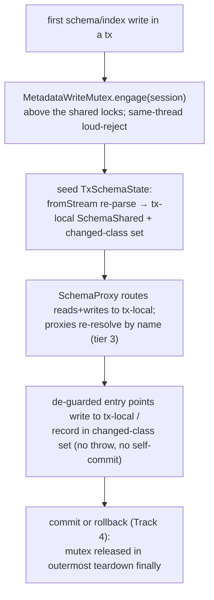

<!-- workflow-sha: 3e9c22298dfe68d2980646704850c781f8af88d5 -->
# Track 3: Tx-local schema view, transactional enablement, and the metadata-write mutex (D1, D4, D5, D7, D8)

## Purpose / Big Picture
After this track, a schema change made inside a transaction is visible only to
that transaction, rolls back for free, and serializes against other
schema-changing transactions through a dedicated mutex.

<!-- Reserved for Move 2 — ADDED/MODIFIED/REMOVED triad. Empty until Move 2 lands. -->

Seed a per-session tx-local `SchemaShared` (a `fromStream` re-parse) on the
transaction's first schema write, route `SchemaProxy` reads and writes to it with
three-tier proxy resolution, de-guard the mutation entry points that today throw
on an active transaction or self-commit in a nested transaction so they ride the
user transaction, and introduce the `MetadataWriteMutex` `Semaphore(1)` with its
engage point above the shared metadata locks and its same-thread loud-reject. This
track ships the mutex primitive and its normal release; the abnormal-termination
permit handshake and the freezer gate are Track 7.

## Progress
- [x] Review + decomposition
- [x] Step implementation
- [ ] Track-level code review
- [ ] Track completion
- [x] 2026-06-17T07:40Z [ctx=info] Review + decomposition complete
- [x] 2026-06-17T08:41Z [ctx=safe] Step 1 complete (commit a760ab91a7)
- [x] 2026-06-17T10:04Z [ctx=safe] Step 2 complete (commit f465ad7ef6)
- [x] 2026-06-17T11:12Z [ctx=info] Step 3 complete (commit ce946a47ec)
- [x] 2026-06-17T12:30Z [ctx=info] Step 4 complete (commit 1e99e6dc73)
- [x] 2026-06-17T13:49Z [ctx=safe] Track-level code review iteration 1 complete (1/3 iterations)
- [x] 2026-06-17T14:20Z [ctx=info] Track-level code review iteration 2 complete (2/3 iterations)

**PAUSED 2026-06-25 at Phase C Track 3 Completion (Review mode) pending the buffered doc-accuracy fix + further review observations**
- Handoff: handoff-track-3-phaseC.md

## Surprises & Discoveries
- **Phase A — I-A7 leak mechanism mis-located in the frozen design.** All three
  Phase A reviewers confirmed via PSI that `executeInTxInternal` is reentrant:
  `commitImpl` short-circuits while `amountOfNestedTxs() > 1`, so once de-guarded and
  running inside a user tx the membership site does not self-commit. The real I-A7
  leak is the eager `IndexAbstract.addCollection` → `collectionsToIndex.add` on the
  **shared** `Index` object, visible to other sessions and unreverted on a user-tx
  rollback. The self-commit framing is correct only *today*, because the throw-guards
  force DDL top-level. The track file's `## Context and Orientation` and `## Plan of
  Work` now carry the corrected mechanism. `design.md` §"The tx-local schema view and
  transactional enablement" still carries the imprecise "nested transaction that
  commits the moment the method returns ... survives a rollback" framing; it is
  frozen during execution, so this correction is folded into the Phase 4
  `design-final.md` reconciliation. The de-guard target is unchanged — route the
  change into the tx-local set — and the I-A7 rollback test already asserts the right
  set (shared `collectionsToIndex` untouched).
- **Phase A — Track 2 RID round-trip confirmed.** PSI verified `SchemaShared.fromStream`
  rebinds each class's RID from the `"classes"` LinkSet, so the D8 `fromStream` seed
  binds committed per-class RIDs faithfully (Track 2 cross-track contract, test-verified).
- 2026-06-17T08:41Z Step 1 discovered: the tx-local seed is side-effect-free —
  building the copy does not enrol committed schema records into the user
  transaction, so Track 4's commit/promotion path sees only the routed tx-local
  writes (Steps 2–3) and the commit-time per-class promotion, never committed
  records pre-enrolled by the seed. See Episodes §Step 1.
- 2026-06-17T10:04Z Step 2 established the seam's cross-track contracts: the
  write-view signal is `session.getTxSchemaState() != null` (Track 4 reads it at
  commit entry); the `MetadataWriteMutex` engage (Step 4) must sit above the seed
  in `resolveForWrite` / `ensureTxSchemaState`; the write-path `reresolve*` helpers
  throw on a missing class/property in the copy, so Step 3 / Track 4
  drop-then-reference tests expect a loud failure. See Episodes §Step 2.
- 2026-06-17T11:12Z Step 3 laid the index-mutation cross-track contracts: the new
  `Index.markDeferred(IndexMetadata)` seam (an engine-less, unregistered handle that
  records its definition) is what Tracks 4/5 promote at commit; the index-manager
  de-guards key on `getTransactionInternal().isActive()` + `ensureTxSchemaState`
  (not the read-only write-view probe), so the Step 4 mutex engage must sit above the
  seed on every de-guarded path, including the direct index-manager entry points. See
  Episodes §Step 3.
- 2026-06-17T12:30Z Step 4 set the mutex's cross-track contracts: Track 7 widens the
  Holder to `(session, ordinal, thread)` and its compare-and-clear must stay
  session(+ordinal)-keyed so it never double-releases against the normal `close()`
  release shipped here; the mutex is orthogonal to data commits and snapshot reads,
  which D19's whole-commit write-lock work (Track 4) must preserve; the in-tx
  null-class membership branch now throws a loud `IndexException`, which Track 5
  should revisit once the index overlay lands. See Episodes §Step 4.
- 2026-06-17T12:30Z Phase B handoff: the Track 3 cumulative code diff is ~2461
  insertions / 215 deletions across 20 files (~873 test lines) — over the ~2,000
  review-burden soft flag, well under the ~4,000 split threshold. Phase C reviews the
  full cumulative diff; all four steps are `high`, so they are its focal points.

## Decision Log
<!-- The track-canonical live decision carrier (D7). Seeded from the frozen
design.md D-records this track owns. -->

#### D1 (enablement facet): Mutate metadata records during the tx; defer structure to commit
- **Alternatives considered**: keep storage-leading and reclaim eagerly-allocated structure on rollback.
- **Rationale**: the metadata-first inversion holds only if every mutation entry point can run inside an open transaction. This track delivers the enablement half: a schema or index change lands as a metadata-record edit, and the commit (Track 4) builds the matching structure later.
- **Risks/Caveats**: the entry points that block this model (I-A7) must each be reworked; the structural-build half lives in Track 4, so an intermediate branch state has schema commits that route to the tx-local view but do not yet reconcile structure — covered by Track 3 tests that exercise isolation and rollback, not structural commit.
- **Implemented in**: this track (enablement); Track 4 (commit reconciles)
- **Full design**: design.md §"The tx-local schema view and transactional enablement"

#### D4: Isolation is record-local, identical to data-record updates
- **Alternatives considered**: eager `SchemaShared` mutation with an in-memory revert on rollback.
- **Rationale**: a schema mutation changes only the tx's own metadata-record copies; the shared `SchemaShared` is updated only at commit. The session sees its own uncommitted schema; other sessions keep seeing committed state. This is the same isolation model data records already use, and it is what makes D1's free rollback hold.
- **Risks/Caveats**: requires the tx-local view (D8) and proxy name-binding so a captured proxy cannot leak a shared impl into the private copy.
- **Implemented in**: this track
- **Full design**: design.md §"The tx-local schema view and transactional enablement"

#### D5: Single schema-writer enforced by locking, never by rollback
- **Alternatives considered**: optimistic concurrency that aborts a schema tx on conflict (rejected by the assignee — schema-tx rollback due to contention is unacceptable).
- **Rationale**: a tx acquires an exclusive schema-write lock on its first schema mutation and holds it to tx end, so a second schema-changing tx blocks rather than racing to a commit-time conflict. Blocking is acceptable because the schema-change rate is low.
- **Risks/Caveats**: the lock must not block data commits or snapshot-based schema reads; a wedged owner keeps the mutex (cross-thread reaping is YTDB-1114, out of scope).
- **Implemented in**: this track
- **Full design**: design.md §"The schema-write mutex and lock order"

#### D7 (primitive + engage facet): A dedicated, transaction-scoped metadata-write mutex
- **Alternatives considered**: hold `stateLock.writeLock` for the whole tx (blocks all commits, too coarse); reuse `SchemaShared.lock` for tx lifetime (conflates per-op nesting with tx lifetime, still blocks lock-based reads).
- **Rationale**: one `Semaphore(1)` covering both schema and index changes avoids a two-lock ordering problem (a class with a unique property creates a class and an index in one tx). It engages at the `SchemaProxy` / index-routing layer on the transaction's first write-routed mutation, strictly before any shared metadata lock and before seeding the tx-local copy. The engage surface includes the class/property proxies' mutating calls (a mutation through a pre-tx captured proxy is the tx's first write and engages here via tier-3 name re-resolution), so instance capture cannot bypass the mutex. The engage path throws when the mutex is held by a different session on the current thread, so legal embedded-session alternation fails fast instead of self-deadlocking.
- **Risks/Caveats**: the mutex must not engage from inside a shared-lock acquisition — a hook there parks a second tx on the mutex while it holds a shared write lock, freezing lock-based reads for the first tx's duration and deadlocking against the commit-side schema-lock acquisition (I-C2). The abnormal-termination release handshake and the freezer gate are Track 7; this track ships the engage, the same-thread loud-reject (I-C4), and the normal release in the outermost teardown `finally`.
- **Implemented in**: this track (primitive + engage + normal release); Track 7 (lifecycle handshake + freezer gate)
- **Full design**: design.md §"The schema-write mutex and lock order"

#### D8 (view facet): Tx-local schema view via a per-session copy-on-first-write `SchemaShared`
- **Alternatives considered**: an immutable committed base plus a changed-class overlay map (approach B). Deferred, not rejected — every read would then need overlay-aware resolution and would recompute the derived-state ripple closure on each access, which is new, error-prone logic in the correctness-critical read path.
- **Rationale**: a full working `SchemaShared` copy reuses the existing mutation machinery, which recomputes the cross-class derived state (inheritance, `polymorphicCollectionIds`, subclass sets, the global-property table) the same way it does on the shared instance, so the design adds no new code to maintain it. The copy is cheap to build and built rarely (D5). The copy is seeded by a `fromStream` re-parse, not a field-level clone: `SchemaClassImpl.owner` is `final` and superclass/subclass links are object references, so a clone would still point at the shared owner and siblings; re-parsing constructs fresh classes bound to the tx-local copy. The seed binds each existing class's committed per-class record RID (D14), so commit updates the right record. A tx-local changed-class set records touched classes to drive the per-class commit.
- **Risks/Caveats**: `SchemaProxy` read methods (not only the snapshot) must route to the tx-local structure during a schema tx; class/property proxies become name-binding (tier 3) during the session's schema tx, captured-delegate fast path (tier 2) otherwise, with snapshot reads a separate untouched family (tier 1). Impl-typed arguments are re-resolved by name on the tx-local side before linking so a shared impl never enters the tx-local graph.
- **Implemented in**: this track (copy + routing); Track 4 (commit-time promotion)
- **Full design**: design.md §"The tx-local schema view and transactional enablement"

#### Execution-time decisions
- 2026-06-17T08:41Z (dependency-reveal) Step 1 changed the D8 seed serializer
  from the design's literal `committed.toStream(session)` to a read-only
  re-parse of the committed root record, because `toStream` dirties committed
  records into the caller transaction and can rebind a committed class RID. The
  `fromStream`-re-parse semantic is preserved; design.md (frozen) is reconciled
  in Phase 4. See Episodes §Step 1.
- 2026-06-17T10:04Z (dependency-reveal) Step 2 placed the single resolve seam on a
  schema-specific `SchemaProxedResource` base extending `ProxedResource`, not
  physically inside `ProxedResource`, because that base has unrelated non-schema
  subclasses (`FunctionLibraryProxy`, `SchedulerProxy`, `SequenceLibraryAbstract`).
  Same single-seam intent; design.md placement wording reconciled in Phase 4. See
  Episodes §Step 2.
- 2026-06-17T11:12Z (dependency-reveal) Step 3 made the `createIndex` / `dropIndex`
  de-guard partial: it removes the throw and records the affected class, but defers
  the engine build and shared-registry mutation to Track 5 (index overlay/build) and
  Track 4 (commit reconciliation), because the tx-local index overlay that receives a
  tx-created index definition is a later track. An in-tx-created index is recorded but
  not query-usable until commit, matching the "enablement half only" contract. See
  Episodes §Step 3.

## Outcomes & Retrospective
- [x] Technical: PASS at iteration 2 (2 findings, 2 accepted)
- [x] Risk: PASS at iteration 2 (6 findings, 6 accepted)
- [x] Adversarial: PASS at iteration 2 (6 findings, 6 accepted)

## Context and Orientation
Today every session shares one live `SchemaShared`, mutated in place, and schema
mutation entry points assume the change applies immediately. `SchemaProxy` and the
`SchemaClassProxy` / `SchemaPropertyProxy` handles hold a captured `delegate`
(a direct reference to the `SchemaClassImpl` they stood for at creation). Two kinds
of entry point block the transactional model:

- **Throw-guards**: the `SchemaShared` schema-record save, `dropClass` /
  `dropClassInternal`, and the index-manager `createIndex` / `dropIndex` throw when
  a transaction is active.
- **Self-commit sites**: `addCollectionToIndex` / `removeCollectionFromIndex`
  (reached transitively from `createClass` / `addSuperClass` through the polymorphic
  collection-membership ripple) wrap their work in `session.executeInTxInternal(...)`.
  Today every DDL operation runs with no user transaction open — the throw-guards
  above force it to — so this `executeInTxInternal` opens a top-level transaction
  that commits the instant the closure returns: it escapes the (nonexistent) user
  transaction, becomes visible to other sessions, and survives a rollback. That
  self-commit is the dangerous part *today*. But `executeInTxInternal` is
  reentrant: once the throw-guards are removed and the same site runs inside an open
  user transaction, `begin()` counts up and `commitImpl` short-circuits while
  `amountOfNestedTxs() > 1`, so the nested call no longer self-commits and the record
  write already rides the user transaction. The residual leak is then narrower and
  in-memory: `IndexAbstract.addCollection` eagerly does `collectionsToIndex.add(name)`
  on the **shared** `Index` object under the index exclusive lock, immediately
  visible to other sessions and not reverted on a user-tx rollback. De-guarding
  therefore means replacing the `executeInTxInternal` body so the membership change
  records into the tx-local changed-class set / index overlay, not merely stripping
  the guard and leaving the eager shared apply in place.

The throw-guards fail any DDL test loudly when left in place. The self-commit sites
pass a naive DDL test and fail only an isolation-and-rollback test, so the silent
failure is the one to test for (I-A7): a rollback must leave the shared `Index`'s
`collectionsToIndex` untouched. The membership ripple can also name a collection that
does not exist yet (a class created in the same tx has only a provisional id), so
deferring it to commit is a correctness requirement, not only an isolation one.

`SchemaClassImpl` gained its nullable record-RID field in Track 2 (done), bound at
load from the per-class link set and preserved through the `toStream` / `fromStream`
round trip (test-verified), so the tx-local `fromStream` seed binds each class's
committed RID faithfully. There is no metadata-write mutex today; serialization is
per-operation only.

## Plan of Work
Build the tx-local view first: seed a fresh `SchemaShared` by a `fromStream`
re-parse of the committed schema, held in a new `TxSchemaState` alongside the
changed-class set. `SchemaShared` exposes only a no-arg constructor and a `void`
`fromStream` that re-parses into `this`, so `copyForTx` is `new SchemaShared();
copy.fromStream(session, committed.toStream(session))` — a serialize-then-re-parse
round trip, not a field clone — and it holds the committed `SchemaShared.lock` write
lock while serializing the base (Track 2's `toStream` asserts
`isWriteLockedByCurrentThread()`).

Route `SchemaProxy` reads and writes to the tx-local structure during a schema tx
through a **single resolve-target seam** on `ProxedResource` / `SchemaProxy`, not
per-method edits: the ~168 proxy methods across `SchemaProxy` /
`SchemaClassProxy` / `SchemaPropertyProxy` each dereference a captured `delegate`
today, so one missed method silently reads or mutates shared state mid-tx. Funnel
every method through one `resolve()` helper (tier 1 snapshot reads — a separate
untouched family; tier 2 captured-delegate fast path when no schema-tx write-view;
tier 3 name-rebind into the tx-local copy during the session's schema tx). Proxies
minted mid-tx (for example by `SchemaProxy.getClass`) must route through the same
seam, not only pre-tx captured ones.

Then de-guard the entry points: convert the throw-guards (schema-record save,
`dropClass` / `dropClassInternal`, index-manager `createIndex` / `dropIndex`) to
write into the tx-local copy, and replace the self-commit membership sites'
`executeInTxInternal` body so the membership change records into the tx-local
changed-class set instead of applying eagerly to the shared `Index` (the overlay
routing it lands in is Track 5; this track de-guards and records the change in the
changed set).

Introduce the `MetadataWriteMutex` `Semaphore(1)` with a holder recording at least
the owning `session` and the acquiring `thread` at engage (the same-thread
loud-reject reads the holder thread; Track 7 extends the holder to
`(session, ordinal, thread)` with the CAS-clear). Engage it at the write-routing
decision point above the shared locks, add the same-thread loud-reject on engage,
and release it once the outermost transaction frame closes.

**Track-3 commit contract (intermediate state).** This track ships the *enablement*
half of D1 only: it does not promote the tx-local copy at commit and does not change
the eager structural collection allocation — both are Track 4. So a schema change
made with **no** active user transaction keeps the legacy top-level save path
unchanged (it still persists via `saveInternal` / `forceSnapshot`), while a change
made **inside** a user transaction routes to the tx-local view and is tested for
isolation and rollback only; its commit-time promotion and end-to-end persistence
("create in a tx, commit, reopen, see it") are a Track-4 acceptance line, referenced
forward, not tested here.

Ordering constraints: the mutex engage must sit strictly above any shared metadata
lock and before the tx-local seed, and it must be provably first on **every** write
path — including the de-guarded membership sites that themselves take the
index-manager and index exclusive locks, and direct `SchemaEmbedded` callers — not
just the canonical `SchemaProxy.createClass` path. The proxy routing must be in
place before the entry points are de-guarded, or a de-guarded mutation would land on
the shared structure. The tx-local seed depends on Track 2's per-class RID
preservation through the round-trip serializer.

## Concrete Steps

1. Tx-local schema view foundation: add `TxSchemaState` (the tx-local `SchemaShared` copy plus the changed-class set, held per session/transaction) and `SchemaShared.copyForTx`, which seeds the copy by `new SchemaShared(); copy.fromStream(session, committed.toStream(session))` under the committed `SchemaShared.lock` write lock, preserving each class's per-class record RID and the recomputed cross-class derived state through the round trip — risk: high (architecture / cross-component coordination: introduces the tx-local schema abstraction)  [x]  commit: a760ab91a7
2. Three-tier proxy routing seam: funnel every `SchemaProxy` / `SchemaClassProxy` / `SchemaPropertyProxy` method through one `resolve()` helper on `ProxedResource` (tier 1 snapshot reads untouched; tier 2 captured-`delegate` fast path when no schema-tx write-view; tier 3 name-rebind into the tx-local copy during the session's schema tx), seed the tx-local copy on the first routed write, route proxies minted mid-tx (e.g. via `SchemaProxy.getClass`) the same way, and re-resolve impl-typed arguments by name before linking so no shared impl enters the tx-local graph — risk: high (architecture / cross-component coordination: changes the schema proxy resolution model; isolation-critical)  [x]  commit: f465ad7ef6
3. De-guard the mutation entry points: convert the throw-guards (`SchemaShared` schema-record save, `dropClass` / `dropClassInternal`, index-manager `createIndex` / `dropIndex`) to write into the tx-local copy when a tx is active, and replace the `executeInTxInternal` body at `IndexManagerEmbedded.addCollectionToIndex` / `removeCollectionFromIndex` so the polymorphic membership ripple records into the tx-local changed-class set instead of the eager shared `Index.collectionsToIndex` apply — risk: high (architecture / cross-component coordination: changes transactional schema-mutation control flow; the I-A7 silent-leak surface)  [x]  commit: ce946a47ec
4. Add the `MetadataWriteMutex` `Semaphore(1)` with a holder recording the owning `session` and acquiring `thread`, engage it at the write-routing decision point strictly above any shared metadata lock and before the tx-local seed (asserting no shared metadata lock is yet held by this thread), throw the same-thread loud-reject when the current thread already holds the permit through a different session, and release the permit once the outermost transaction frame closes (idempotent against Track 7's later compare-and-clear) — risk: high (concurrency: new Semaphore, lock-acquisition ordering, shared session/thread holder, same-thread reject)  [x]  commit: 1e99e6dc73

## Episodes
<!-- Continuous-log. Empty at Phase 1. -->

Each line is annotated with the scope Track 3 actually tests; post-commit
structural promotion and the full no-outage guarantee are referenced forward, not
asserted here (per the Track-3 commit contract in Plan of Work).

- A transaction that creates a class sees it through every read path during the tx
  (`getClass`, snapshot, class/property proxy), and a concurrent session does not
  see the uncommitted change **during** the tx (I-A5, isolation half — **Track 3**).
  The post-commit transition (a concurrent session sees it **after** commit) needs
  Track 4 promotion — that is a Track-4 acceptance line, not tested here.
- A captured pre-tx `SchemaClassProxy` mutated inside the transaction routes to the
  tx-local view, not the shared one, and a proxy minted mid-tx (via `getClass`)
  routes the same way (**Track 3**).
- A polymorphic membership ripple (`addSuperClass`, or an alter-add-collection on a
  class with an indexed subclass) is not observed by a concurrent session before
  commit, and a rollback leaves the shared `Index`'s `collectionsToIndex`
  untouched — the silent self-commit leak the throw-vs-self-commit distinction
  defends (I-A7, **Track 3**).
- Two concurrent schema transactions: the second blocks on the mutex until the first
  completes, and neither aborts on conflict; a data commit and a snapshot-based
  schema read run unblocked alongside a held mutex (I-A6, **Track 3**).
- Same thread, two sessions, the second engaging a schema tx while the first's mutex
  is held throws (no self-deadlock); a different thread parks until release (I-C4,
  **Track 3** — the partial `session` + `thread` holder this track ships is enough
  for the loud-reject; the `ordinal` and CAS-clear are Track 7).
- The mutex permit is engaged before any shared metadata lock (index-manager lock,
  `SchemaShared.lock`) is taken on a schema tx's first write — asserted at the
  engage point on every write path including the de-guarded membership sites, so a
  mis-ordered engage fails loudly (I-C2 engage-placement, **Track 3**).
- A thread holding the mutex permit does not hold `SchemaShared.lock` or the
  index-manager lock (engage is above them and the seed releases them), so a
  concurrent snapshot-based read and a concurrent lock-based read both proceed —
  the mutex-orthogonality property (**Track 3**). The whole-commit no-outage
  guarantee (lock-based reads converted to snapshot-first, D19) is Track 4, and the
  freeze-vs-read-outage guarantee is Track 7 — neither is asserted here.

<!-- Phase A placeholder for per-step EARS/Gherkin lines. -->

<!-- Reserved for Move 3 — EARS or Gherkin acceptance lines used
verbatim as test method names. Empty until Move 3 lands. -->

### Step 1 — commit a760ab91a7, 2026-06-17T08:41Z [ctx=safe]
**What was done:** Added the tx-local schema copy foundation.
`SchemaShared.copyForTx` seeds a fresh private `SchemaShared` from the
committed schema and returns it inside a `TxSchemaState` that also holds the
changed-class set. The seed loads the committed root schema record read-only
(`session.load(identity)`) and re-parses it with `copy.fromStream`, which
rebinds each class to its committed per-class record RID and recomputes the
cross-class derived state through the round trip. A new abstract
`newInstanceForCopy` factory (overridden in `SchemaEmbedded`) builds the
concrete instance, since `SchemaShared` is abstract. The root identity is
value-copied, so the copy and the committed instance never share a mutable
RID. Entry asserts require an open transaction and a committed root carrying
global properties. `CopyForTxTest` (7 tests) covers freshness and identity
carry, per-class RID preservation, the inheritance/derived-state recompute,
and that the seed neither dirties committed records into the caller
transaction nor rebinds committed class RIDs.

**What was discovered:** `toStream` cannot serve as the seed serializer. It is
a writer: it loads and re-serializes each committed per-class record, dirtying
them into the caller transaction, and it can rebind an unbound committed
class's RID. Seeding through it would leak committed schema records into the
user transaction and break isolation. The seed instead re-parses the committed
root record loaded read-only. That path's correctness rests on a lock
invariant: every committed schema change persists the root record
synchronously under the same `SchemaShared.lock` write lock that `copyForTx`
holds, so under the lock the persisted root equals live committed state. The
held-lock window does roughly `2 × N` per-class record loads plus a
derived-state recompute — benign under the low-schema-change-rate premise,
flagged forward for the deferred populated-schema / high-DDL workload
(YTDB-1064, Track 4). A second, mechanical discovery: the design's literal
`new SchemaShared()` cannot be written because `SchemaShared` is abstract with
`SchemaEmbedded` its only concrete subclass (PSI-confirmed), resolved with the
`newInstanceForCopy` factory.

**What changed from the plan:** The seed serializer changed from the design's
literal `committed.toStream(session)` to a read-only re-parse of the committed
root record. The headline `fromStream`-re-parse semantic (per-class RID
preservation, derived-state recompute) is preserved; only the committed-state
side effect is removed. design.md §"The tx-local schema view and transactional
enablement" is frozen during execution and still prescribes the `toStream`
seed, so Phase 4 `design-final.md` reconciles it. Affects Track 4 — see
Surprises and Decision Log.

**Key files:**
- `core/src/main/java/com/jetbrains/youtrackdb/internal/core/metadata/schema/TxSchemaState.java` (new)
- `core/src/main/java/com/jetbrains/youtrackdb/internal/core/metadata/schema/SchemaShared.java` (modified)
- `core/src/main/java/com/jetbrains/youtrackdb/internal/core/metadata/schema/SchemaEmbedded.java` (modified)
- `core/src/test/java/com/jetbrains/youtrackdb/internal/core/metadata/schema/CopyForTxTest.java` (new)

### Step 2 — commit f465ad7ef6, 2026-06-17T10:04Z [ctx=safe]
**What was done:** Built the three-tier proxy routing seam. A new schema-specific
base, `SchemaProxedResource` (extends `ProxedResource`), funnels every
`SchemaProxy` / `SchemaClassProxy` / `SchemaPropertyProxy` method through one
`resolve()` (read) or `resolveForWrite()` (write) helper. Tier 1 snapshot reads
stay on the committed instance; tier 2 (no write-view) returns the captured
delegate unchanged; tier 3 (a tx-local copy exists) re-resolves the delegate by
name into the copy. The session gained `getTxSchemaState()` /
`ensureTxSchemaState()`, storing the `TxSchemaState` in the active transaction's
custom data so it dies with the transaction; `resolveForWrite` seeds it via
`copyForTx` on the first routed write. Impl-typed arguments are re-resolved by
name before linking, so no committed-shared impl enters the private graph. The
BC1 review fix kept the argument-taking read overloads (`isSubClassOf` /
`isSuperClassOf`) total: they route through a read-tolerant resolver that returns
`null` on an absent argument class (preserving the historical `false`-on-missing
contract), while the loud write-path resolver is unchanged. `SchemaProxyRoutingTest`
covers tier selection, seeding, impl-arg re-resolution, and the read contract
(10 tests).

**What was discovered:** `ProxedResource` has non-schema subclasses
(`FunctionLibraryProxy`, `SchedulerProxy`, `SequenceLibraryAbstract`), so the
seam could not import schema types into `ProxedResource` itself; it sits on the
schema-specific `SchemaProxedResource` base that only the three schema proxies
extend. The transaction's per-tx custom-data map is the lifecycle-safe home for
`TxSchemaState` — it is dropped when the transaction ends, so no manual teardown
is needed. Tier-3 `rebindToTxLocal` does a by-name `getClass` per read; that cost
is bounded to rare schema transactions by the low-schema-change-rate premise
(forward note, no action this step). Coverage caveat: the full core suite exceeds
the foreground time budget, so regression here was a bounded cross-section of the
affected schema / DDL / tx / graph surface plus the two proxy-boundary suites that
directly exercise the rewritten delegation; the full-suite check is deferred to
track-end verification and CI.

**What changed from the plan:** The single resolve seam lives on a schema-specific
base class (`SchemaProxedResource` extends `ProxedResource`), not physically inside
`ProxedResource.java`, because that base has unrelated non-schema subclasses. Same
single-seam intent, no behavioral divergence. design.md prescribes the seam "on
`ProxedResource`"; Phase 4 `design-final.md` reconciles the placement wording. No
Decision Record changed.

**Key files:**
- `core/src/main/java/com/jetbrains/youtrackdb/internal/core/metadata/schema/SchemaProxedResource.java` (new)
- `core/src/main/java/com/jetbrains/youtrackdb/internal/core/metadata/schema/SchemaProxy.java` (modified)
- `core/src/main/java/com/jetbrains/youtrackdb/internal/core/metadata/schema/SchemaClassProxy.java` (modified)
- `core/src/main/java/com/jetbrains/youtrackdb/internal/core/metadata/schema/SchemaPropertyProxy.java` (modified)
- `core/src/main/java/com/jetbrains/youtrackdb/internal/core/db/DatabaseSessionEmbedded.java` (modified)
- `core/src/test/java/com/jetbrains/youtrackdb/internal/core/metadata/schema/SchemaProxyRoutingTest.java` (new)

**Critical context:** Downstream consumers read the write-view signal as
`session.getTxSchemaState() != null` (Track 4 reads it at commit entry). The
`MetadataWriteMutex` engage (Step 4) must sit above the seed in `resolveForWrite`
/ `ensureTxSchemaState`. The write-path `reresolve*` helpers throw
`IllegalStateException` on a missing class/property in the copy, so Step 3 /
Track 4 drop-then-reference tests should expect that loud failure.

### Step 3 — commit ce946a47ec, 2026-06-17T11:12Z [ctx=info]
**What was done:** De-guarded the schema- and index-mutation entry points so a
mutation made inside a user transaction routes to the tx-local view instead of
throwing or self-committing. A `txLocal` flag on `SchemaShared` (set in
`copyForTx`) makes `saveInternal` skip the eager schema-record persist on a copy,
and `dropClass` / `dropClassInternal` on the copy remove only metadata (recording
the dropped class in the changed-class set) and defer the structural
collection/index deletion. In `IndexManagerEmbedded`, the two membership sites
(`addCollectionToIndex` / `removeCollectionFromIndex`) and the `createIndex` /
`dropIndex` throw-guards now trigger on an active user transaction: they seed the
tx-local state via `ensureTxSchemaState`, record the index's owning class into the
changed-class set, and leave the shared `Index.collectionsToIndex` and the shared
index registry untouched. The review fixes made the tx-deferred index handle safe
on the public SQL path (new `Index.markDeferred(IndexMetadata)` — engine-less,
`indexId = -1`, `size()` returns 0), replaced an assert-guarded tx-local write
with a loud `IllegalStateException`, and made the null-class membership path fall
through to the legacy apply instead of silently dropping. `SchemaDeguardTest`
(10 tests) covers no-throw, isolation, the I-A7 silent-leak rollback assertion
(shared `collectionsToIndex` untouched after a rolled-back in-tx membership
change), changed-class recording, concurrent-session invisibility, the deferred
createIndex/dropIndex, and the in-tx SQL `CREATE INDEX` no-NPE path. The full core
suite ran green (2043/2043).

**What was discovered:** The de-guard trigger signal matters. The index-manager
paths key on `getTransactionInternal().isActive()` + `ensureTxSchemaState`, not on
the read-only `getTxSchemaState()` write-view probe: a membership/index change is
itself a schema write, and a `dropIndex` that is the transaction's first schema
write would never seed under the probe and would fall to the legacy self-commit
path. The schema-side de-guards (`saveInternal`, `dropClass`) stay keyed on the
`txLocal` flag because they only run on the copy after the proxy seam already
seeded it. Removing the `createIndex` throw-guard exposed a public-API NPE: the
engine-less handle was dereferenced via `idx.size()` on the SQL `CREATE INDEX`
execute path; resolved with the `markDeferred` contract (the unbuilt handle
carries its `IndexMetadata` and answers `size()` as 0). CS1 (deferred): the
pre-existing eager in-tx collection allocation persists in its own durable atomic
operation, so a rolled-back in-tx create leaves a recovery-visible stray collection
— correctly scoped to Track 4 (D2/D10), not a Step 3 bug.

**What changed from the plan:** The `createIndex` / `dropIndex` de-guard is partial
by design. It removes the hard throw, records the affected class into the
changed-class set, and defers the engine build and the shared-registry mutation to
Track 5 (index overlay / build) and Track 4 (commit reconciliation). A tx-created
index returns a definition-only, engine-less, unregistered handle through the new
`Index.markDeferred` seam and is not query-usable until commit. This matches the
track's "enablement half only" commit contract. No Decision Record changed.

**Key files:**
- `core/src/main/java/com/jetbrains/youtrackdb/internal/core/index/Index.java` (modified)
- `core/src/main/java/com/jetbrains/youtrackdb/internal/core/index/IndexAbstract.java` (modified)
- `core/src/main/java/com/jetbrains/youtrackdb/internal/core/index/IndexMultiValues.java` (modified)
- `core/src/main/java/com/jetbrains/youtrackdb/internal/core/index/IndexOneValue.java` (modified)
- `core/src/main/java/com/jetbrains/youtrackdb/internal/core/index/IndexManagerEmbedded.java` (modified)
- `core/src/main/java/com/jetbrains/youtrackdb/internal/core/metadata/schema/SchemaEmbedded.java` (modified)
- `core/src/main/java/com/jetbrains/youtrackdb/internal/core/metadata/schema/SchemaShared.java` (modified)
- `core/src/test/java/com/jetbrains/youtrackdb/internal/core/metadata/schema/SchemaDeguardTest.java` (new)

**Critical context:** The `MetadataWriteMutex` engage (Step 4) must sit above the
seed on **every** de-guarded write path, including the direct index-manager entry
points, not just the `SchemaProxy.createClass` path. The new
`Index.markDeferred(IndexMetadata)` contract is the seam Tracks 4/5 consume to
promote a tx-deferred index (build the engine and register it at commit). The
eager structural collection allocation on an in-tx `createClass` is still NOT
inverted (Track 4 / D2), so a rolled-back in-tx create can leave a stray
collection on disk — a known Track-4-owned intermediate state.

### Step 4 — commit 1e99e6dc73, 2026-06-17T12:30Z [ctx=info]
**What was done:** Added the storage-scoped `MetadataWriteMutex` (`Semaphore(1)`
plus a `(session, thread)` Holder) on `SharedContext`, one per storage. Engage
runs inside `DatabaseSessionEmbedded.ensureTxSchemaState` — the single seam every
de-guarded write path (proxy `resolveForWrite` plus the three
`IndexManagerEmbedded` de-guards) funnels through — strictly before the
`copyForTx` seed and above any shared metadata lock. The engage-order assert
checks the current thread holds neither `SchemaShared.lock` nor the index-manager
write lock at engage (new `isWriteLockHeldByCurrentThread` accessors; the
index-manager lock field was retyped to `ReentrantReadWriteLock`). `engage()`
throws the same-thread loud-reject when the thread already holds the permit
through a different session. The normal release fires in
`FrontendTransactionImpl.close()` (the single outermost-frame teardown both commit
and rollback reach), gated on a `volatile` session field `metadataMutexEngaged`
that survives the tx custom-data wipe, via a session-keyed compare-and-clear
(`releaseFor`) idempotent against Track 7's later abnormal-release. The engage→seed
window is wrapped so a seed failure releases the permit before rethrowing.
`MetadataWriteMutexTest` (6 tests) covers two-tx serialization-without-abort,
held-mutex orthogonality to data commits and snapshot reads, the same-thread
reject, foreign-thread parking until release, and the engage-order assert for both
the schema and index-manager locks; the blocking proofs observe the parked thread
state (WAITING on the permit) deterministically, not via `Thread.sleep`. The full
core suite ran green (~18604 tests).

**What was discovered:** The release marker cannot live in the transaction's
custom-data map — `FrontendTransactionImpl.clear()` (reached from both `close()`
and `rollbackInternal`) wipes `userData` before the outermost `close()` release
runs, so a marker stored there would be gone at release time. It is held as a
`volatile` `DatabaseSessionEmbedded` field instead, the surviving session-side
record the mutex-lifecycle design calls for. The engage-above-the-shared-locks
invariant is what makes the second schema writer park on the permit (not an
intermediate lock) first, which the deterministic blocking test relies on. The
Step 3 episode's "2043" was a subset count; the full core unit suite is ~18604.

**What changed from the plan:** None. Scope matches D7 — primitive, engage,
same-thread reject, and normal idempotent release; the abnormal-termination
handshake, the acquire ordinal, and the freezer gate are deferred to Track 7 as
planned.

**Key files:**
- `core/src/main/java/com/jetbrains/youtrackdb/internal/core/db/MetadataWriteMutex.java` (new)
- `core/src/main/java/com/jetbrains/youtrackdb/internal/core/db/SharedContext.java` (modified)
- `core/src/main/java/com/jetbrains/youtrackdb/internal/core/db/DatabaseSessionEmbedded.java` (modified)
- `core/src/main/java/com/jetbrains/youtrackdb/internal/core/index/IndexManagerEmbedded.java` (modified)
- `core/src/main/java/com/jetbrains/youtrackdb/internal/core/metadata/schema/SchemaShared.java` (modified)
- `core/src/main/java/com/jetbrains/youtrackdb/internal/core/tx/FrontendTransactionImpl.java` (modified)
- `core/src/test/java/com/jetbrains/youtrackdb/internal/core/db/MetadataWriteMutexTest.java` (new)

**Critical context:** The Holder is currently `(session, thread)`; Track 7 widens
it to `(session, ordinal, thread)` and its compare-and-clear must stay
session(+ordinal)-keyed so it never double-releases against the normal `close()`
release shipped here. The mutex deliberately does NOT block data commits or
snapshot-based schema reads (the orthogonality property) — D19's whole-commit
write-lock work must preserve this. The in-tx null-class membership branch now
throws a loud `IndexException` (the BC3 fix); Track 5 (index overlay routing)
should confirm whether that branch should exist at all once the overlay lands.

## Idempotence and Recovery
- **Engage-order assert.** A Java `assert` at the engage point states that when a
  session holds the mutex permit, this thread holds no shared metadata lock yet
  (index-manager lock, `SchemaShared.lock`). This makes a mis-ordered engage —
  engaging from inside a shared-lock acquisition, the I-C2 deadlock — fail loudly in
  tests rather than wedge under concurrent schema txs. The de-guarded membership
  sites are the dangerous placement because they already take the index-manager and
  index exclusive locks, so the assert guards every write path, not just the
  canonical proxy path.
- **Release idempotence.** This track ships the normal release fired once the
  outermost transaction frame closes. There is no single existing "teardown finally"
  — `commitImpl` has no top-level finally, `rollback()` is a separate method, and an
  `executeInTx*` wrapper does not pass through the explicit `commit()`/`rollback()`
  path — so the concrete release site is pinned during decomposition to one that
  covers both the explicit paths and the wrappers, gated on the outermost frame
  (the tx fully closing at base nesting, owner-session match). The normal release
  must be idempotent against Track 7's compare-and-clear abnormal-release so the two
  releasers never double-release the `Semaphore(1)` permit.
- **Eager-allocation intermediate state.** Track 3 does not invert the eager
  structural collection allocation (`createCollections`, Track 4 / D2), so an in-tx
  `createClass` still allocates a real collection eagerly. The Track-3 rollback test
  asserts the in-memory shared `Index.collectionsToIndex` is untouched (the D4
  free-rollback property at the metadata level); it does **not** assert file-level
  collection cleanup. A rolled-back in-tx create can therefore leave a stray
  collection on disk — a known intermediate-state condition closed by Track 4 (D10
  reconciliation / D2 provisional ids), not a Track-3 bug.

## Artifacts and Notes
<!-- Continuous-log (rare). Often empty. -->

## Interfaces and Dependencies
- **In scope**: `SchemaProxy` / `SchemaClassProxy` / `SchemaPropertyProxy` routing
  and name-binding; the new `TxSchemaState`; `SchemaShared.copyForTx` (`fromStream`
  re-parse) and the changed-class set; de-guarding the throw-guard entry points
  (schema-record save, `dropClass` / `dropClassInternal`, index-manager
  `createIndex` / `dropIndex`) and the self-commit membership sites
  (`addCollectionToIndex` / `removeCollectionFromIndex`); the new `MetadataWriteMutex`
  primitive, its engage hook, the same-thread loud-reject, and the normal-release
  wiring in the session teardown; isolation/rollback/serialization tests.
- **Out of scope**: commit-time reconciliation, promotion, and the four-lock order
  at commit (Track 4); the index overlay the membership change routes through
  (Track 5); the mutex abnormal-termination permit handshake and the freezer gate
  (Track 7).
- **Inter-track dependencies**: depends on Track 2 (per-class RID preservation
  through the round-trip seed). Track 4 consumes the tx-local view (it diffs
  committed vs tx-local and promotes the copy) and the engaged mutex (it acquires
  the four locks); Track 5 completes the membership-ripple overlay routing this
  track de-guards; Track 7 hardens the mutex this track introduces.
- **Signatures**: `MetadataWriteMutex.engage(session)` / `releaseFor(session, ordinal)`;
  `SchemaShared.copyForTx() : SchemaShared`; `TxSchemaState` holding the tx-local
  copy, the changed-class set, and the index overlay (the overlay's contents are
  Track 5's).

## Base commit
8bbe3d2d18011f1ca6b1702a35e3c252ceba20b1
