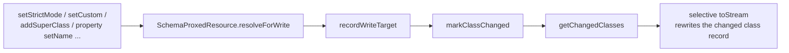

<!-- workflow-sha: 3e9c22298dfe68d2980646704850c781f8af88d5 -->
# Track 4: Commit-time reconciliation and the schema-carrying commit lock (D1, D2, D3, D6, D9, D10, D19)

## Purpose / Big Picture
After this track, committing a transaction that changed the schema creates or
drops the matching collections and engines inside the commit's own atomic
operation, atomically with the record writes and recoverable from the WAL, while a
rolled-back or crashed-before-commit schema transaction leaves storage
byte-for-byte unchanged.

<!-- Reserved for Move 2 — ADDED/MODIFIED/REMOVED triad. Empty until Move 2 lands. -->

Make the commit compute the structural delta as a set difference over committed
versus tx-local collection-id sets, resolve provisional ids before any record
serializes, reconcile in the correct order through lock-free inner primitives under
a commit-local id allocator, take `stateLock.writeLock()` from the start under the
four-lock order, promote the tx-local schema into the existing shared instances with
one `forceSnapshot`, and convert the two remaining lock-based read sites to
snapshot-first so the whole-commit write lock never becomes a read outage.

## Progress
- [x] Review + decomposition
- [x] Step implementation
- [x] Track-level code review
- [ ] Track completion
- [x] 2026-06-26T08:43Z [ctx=info] Review + decomposition complete
- [x] 2026-06-26T10:04Z [ctx=safe] Step 1 complete (commit 7c7a157efa)
- [x] 2026-06-26T12:52Z [ctx=info] Step 2 complete (commit 346e87ae9d)
- [x] 2026-06-26T16:40Z [ctx=info] Step 3 complete (commit 9d71010531)
- [x] 2026-06-29T11:21Z [ctx=info] Step 4 complete (commit 53207446ff)
- [x] 2026-06-29T15:49Z [ctx=info] Step 5 complete (commit 1f431495a8)
- [x] 2026-06-29T16:47Z [ctx=safe] Step 6 complete (commit 2bf7d95305)
- [x] 2026-06-30T08:07Z [ctx=info] Track-level code review iteration 1 complete (1/3 iterations) — commit 0cb16dfc71
- [x] 2026-06-30T08:20Z [ctx=info] Track-level code review iteration 2 complete (2/3 iterations) — commit ab8f411066
- [x] 2026-06-30T08:28Z [ctx=info] Track-level code review complete (all in-scope findings VERIFIED, 0 blockers; 2/3 iterations used)

## Surprises & Discoveries
<!-- Continuous-log. Empty at Phase 1. -->
- 2026-06-26T10:04Z Step 1 established the create/publish seam — the create
  primitives (`doAddIndexEngine`, `doCreateCollection`) build files and config
  inside the atomic operation and return the engine/collection unpublished;
  `publishIndexEngine`/`registerCollection` mutate the in-memory maps
  separately. Step 2's reconciliation and Track 5's overlay publish both consume
  this seam. `setIndexEngine`/`setCollection` grow-and-set, so Step 2's
  commit-local allocator must handle a reused hole id below the live size. A
  `@Test(timeout)` in the `AbstractStorage` package needs
  `db.activateOnCurrentThread()` as its first body statement (the session is
  thread-bound via a `ThreadLocal`; JUnit runs a timed body on a separate
  watchdog thread). See Episodes §Step 1.
- 2026-06-26T12:52Z Step 2 found two tx-local provisional-collection-id
  producers, not one: the create path (`SchemaEmbedded.createCollections`) and
  the abstract→concrete alter path (`SchemaClassEmbedded.setAbstractInternal`,
  PSI-confirmed tx-reachable). Both now allocate provisional `<= -2` ids via
  `TxSchemaState.allocateProvisionalCollectionId` and record `markClassChanged`.
  Step 3's reconciliation must resolve provisional ids from BOTH producers
  before any `toStream` in promotion. The not-resolved sentinel is
  `TxSchemaState.NO_RESOLUTION` (`Integer.MIN_VALUE`), disjoint from real
  (`>= 0`), abstract (`-1`), and provisional (`<= -2`); consumers must test
  against it, never against `-1`. The I-A2 durable-bytes half and the
  crash-before-commit variant are deferred to Step 3 (test breadcrumbs in
  place). See Episodes §Step 2.
- 2026-06-26T15:39Z The first reconciliation-core attempt (Alternative A, reverted at
  the re-decomposition that created the new Step 3) implemented and validated the whole
  commit-carry structure end-to-end except the readLock-under-writeLock deadlock. The
  Step 4 implementer (the reconciliation core, renumbered from Step 3 by this split)
  re-applies it on top of the new Step 3 lock-free read substrate. Reusable findings:
  - **`isWriteTransaction()` gap (hard prerequisite for Step 4).**
    `FrontendTransactionImpl.isWriteTransaction()` returns
    `!recordOperations.isEmpty() || !indexEntries.isEmpty()`, so a schema-only tx (a
    class create with no records) enrolls no record ops (tx-local `saveInternal` is a
    no-op) and `doCommit` skips `storage.commit` entirely, silently dropping the schema
    change. Fix: OR in `getCustomData(DatabaseSessionEmbedded.TX_SCHEMA_STATE_KEY) != null`
    and make `TX_SCHEMA_STATE_KEY` public.
  - **Provisional collection name is lost (hard prerequisite for Step 4).** Step 2's
    `createCollections` / `setAbstractInternal` compute the `<class>_<counter>` name on
    the provisional branch but keep only the id; the commit cannot regenerate it (the
    tx-local counter already advanced). Add a provisional→name carrier on `TxSchemaState`
    (`allocateProvisionalCollectionId(String name)` plus `getProvisionalCollectionName(s)`),
    populated at both producer sites.
  - **Index-apply deadlock fix verified (D3/T1).** The only index-path readLock re-entry
    is `lockIndexes` → `IndexAbstract.acquireAtomicExclusiveLock` (IndexAbstract.java:930)
    → public `getIndexEngine(int)` → `stateLock.readLock()`; every other apply path
    (`commitIndexes` / `applyTxChanges` / `doPut` / `doRemove`) reads `indexEngines.get(id)`
    lock-free. Fix: a `lockIndexesLockFree` resolving via `doGetIndexEngine`. This is a
    no-op for Track 4 (index ops are empty until Track 5) but load-bearing for Track 5.
  - **The "XXX two implementations of commit" comment (~`AbstractStorage`:2223) is stale.**
    There is a single `commit(FrontendTransactionImpl, boolean)`; both `commit` and
    `commitPreAllocated` funnel through it. Nothing to keep in sync.
  - **Validated commit-carry shape (re-apply in Step 4).** Branch on
    `session.getTxSchemaState() != null` into `commitSchemaCarry` versus `commitPureData`
    (the original body extracted unchanged via `computeCommitWorkingSet` /
    `applyCommitOperations` / `finishCommit`). Four-lock order:
    `committedSchema.acquireSchemaWriteLock` → `indexManager.acquireExclusiveLockForCommit`
    (new no-side-effect wrappers) → `stateLock.writeLock`. Inside the write lock:
    `reconcileCollections` (D9 set-diff via `getRealCollectionIds()`; drop via
    `dropCollectionInternal`; create via `doCreateCollection` at a commit-local
    first-null-slot id, then `registerCollection`, then `recordResolvedCollectionId`) →
    `resolveProvisionalCollectionIds` (two-pass: patch all
    `SchemaClassImpl.collectionIds` / `defaultCollectionId` / `polymorphicCollectionIds`,
    then rebuild `collectionsToClasses` wholesale, per A3), wrapped in the tx-local
    schema's own write lock → `txLocalSchema.toStream` → `computeCommitWorkingSet` (after
    `toStream` so the new per-class and root records join it) → `applyCommitOperations`.
    A1/R1 deferral was implemented as publish-during-reconcile plus undo-on-failure
    (chosen over defer-to-success because the position loop needs `doGetAndCheckCollection`
    to resolve the new collection during apply; D10 permits the undo-on-failure variant).
    Promotion: `committedSchema.fromStream(session, committedRoot)` plus one `forceSnapshot`.
  - **Test caveats for Step 4/5.** `session.newEntity("X")` of a class created in the same
    uncommitted tx fails ("Class X not found") because `newEntity` resolves via the
    immutable schema snapshot, not the tx-local view; apply-path tests create-class and
    commit, then insert records in a separate tx. ErrorProne bans `System.out` in
    production code (use `LogManager.instance().warn`).
  See Decision Log 2026-06-26T15:39Z.
- 2026-06-26T16:40Z Step 3 landed the lock-free commit-window read substrate. Two
  forward facts the later work needs without re-reading the full episode:
  - **BC1 (Step 4 enumeration).** PSI confirmed only `getPhysicalCollectionNameById`
    and `readRecordInternal` take `stateLock` on the `session.load` → `executeReadRecord`
    path, so the substrate covers exactly those. `recordExists` and `getCollectionName(2)`
    also take the read lock but are off the `load` path. When Step 4 wraps the full
    reconciliation-plus-promotion body in the window, re-run the PSI enumeration of
    `stateLock.readLock()`-taking methods reachable from inside the window and either make
    `recordExists` window-aware or record it as provably unreachable.
  - **Seam reuse (Track 5/6).** The commit-window seam (`enterCommitWindow` /
    `exitCommitWindow` / `isCommitWindowActive`) generalizes to any commit-body method
    that re-enters `stateLock.readLock()` under the held write lock. Track 5's commit-time
    index build and overlay publish should reuse it rather than add new lock-free variants.
  See Episodes §Step 3.
- 2026-06-29T11:21Z Step 4 landed the commit-time reconciliation core. Forward facts for
  the later steps and downstream tracks:
  - **Commit-window readLock set (BC1 discharge).** Beyond Step 3's
    `getPhysicalCollectionNameById` / `readRecordInternal`, the full
    reconciliation-plus-promotion body also reaches `getCollectionIdByName`,
    `getCollectionNames`, `getIndexEngine`, and `isClosed` (the last via
    `EntityImpl.toString` in the link-consistency pre-update logging path) under the held
    write lock; all four are now window-aware. The Step 3 BC1 re-enumeration is complete.
  - **Link-consistency suppression.** Deleting or rewriting a schema/index per-class record
    during commit-time serialization trips `LinksConsistencyException` (the tracker treats the
    root's `classes` link set as a graph link). The tracker is suppressed around `toStream`
    only; Track 5/6 work that deletes or rewrites schema/index records during commit must
    extend the same suppression.
  - **In-memory engine orphan on a failed create (Track 5/6).** `DirectMemoryOnlyDiskCache`
    does not revert eager `addFile` on rollback, so a failed schema-carry commit that created a
    collection leaves an orphaned link-bag file that blocks id reuse on the in-memory engine
    (the disk engine reverts it through the WAL). Step 4 added a create-side structural-revert
    arm guarded on component-presence. Any Track 5/6 commit-time engine-file create needs the
    same symmetric cleanup on its failure path.
  - **Seam reuse (Track 5/6).** Reuse the commit window (`enterCommitWindow` /
    `exitCommitWindow`) and the no-side-effect index-manager commit lock
    (`acquireExclusiveLockForCommit`) rather than adding new lock-free variants. The
    `setCommitWindowTestHook` seam (test-only, null in production) drives deterministic
    concurrent-commit tests.
  - **Review burden.** The cumulative track diff is ~4,500 changed lines, over the ~4,000
    estimate, with Steps 5 and 6 still ahead; Phase C should weigh splitting the review.
  See Episodes §Step 4.
- 2026-06-29T15:49Z Step 5 made the schema serializer selective and surfaced facts the
  later step and downstream tracks need:
  - **Changed-class completeness is centralized (Track 5/6/8).** The selective write
    rewrites only the classes in `getChangedClasses()`, so a tx-reachable class mutation
    that never calls `markClassChanged` is silently dropped at commit. The Step-5 review
    found the attribute setters (`setStrictMode` / `setDescription` / `setCustom` /
    `addSuperClass` / `setSuperClasses` / `setOverSize`) and property `setName` / `setType`
    are tx-reachable with no throw-guard yet did not mark. The fix marks the resolved class
    at the single tx-local write choke point (`SchemaProxedResource.resolveForWrite` →
    `recordWriteTarget`), so any later track that de-guards a class or property mutation
    inherits complete tracking as long as it routes through the proxy resolution; a path
    that bypasses the proxy must mark explicitly.
  - **Unchanged-record cache warming (Track 5/6).** Promotion re-parses the committed
    schema from every linked per-class record inside the commit window. An unchanged
    class's record is no longer rewritten, so `toStream` now loads it read-only to keep
    promotion serving from the cache; a genuine cache miss inside the window fails with
    "atomic operation is not active" on a disk engine (the YTDB-1175 profile shape). Later
    commit-window work that stops writing a record promotion still reads must warm it the
    same way.
  - **Pre-existing concurrency failure (Track 3 / Track 7).**
    `MetadataWriteMutexTest.twoConcurrentSchemaTransactionsSerializeWithoutAbort` fails
    identically before and after this step (confirmed by running the single test at
    `bf44e6f749` and at the Step-5 tip). The second concurrent schema transaction seeds its
    tx-local schema at a stale record version and conflicts at its own commit; Step 5 only
    changes which record id surfaces the conflict (root versus class). The fix is
    tx-local-seed isolation (Track 3) or the mutex permit handshake (Track 7), not this
    track. The test is red and not `@Ignore`d, so it must be resolved before merge.
  - **Environmental test-fork crash.** The host's parallel-surefire `default-test` run
    intermittently crashes at fork startup ("forked VM terminated without saying goodbye"),
    reproduced on the clean base, so it is environmental. A single-fork targeted run
    completes and lets the JaCoCo report bind; Phase C's cumulative coverage build should
    expect this.
  - **Review burden.** The code-only cumulative track diff is ~3,750 changed lines across
    16 files with Step 6 still ahead; Phase C should weigh splitting the review.
  See Episodes §Step 5.
- 2026-06-29T16:47Z Step 6 converted the two hot lock-based schema reads to snapshot-first and
  discharged the I-U5 read-site enumeration. Facts the track close-out and downstream tracks need:
  - **I-U5 enumeration discharged (PSI-backed).** The two converted sites
    (`YTDBGraphImplAbstract.createVertexWithClass`, `SQLMatchStatement.getLowerSubclass`) are the
    complete set of hot lock-based reads that would stall behind the commit write lock. Every other
    production reader of `SchemaShared.acquireSchemaReadLock()` is a schema-write path, tx-local
    resolution on the reader's own tx (not commit-contended), commit/lifecycle machinery, or one
    off-hot-path introspection traversal (`YTDBGraphStep.createClassIterator`, fired only for
    `g.V().hasLabel(SchemaClass.LABEL)`). The hot per-record reads already route through
    `getImmutableSchemaSnapshot()`.
  - **One by-design lock-based reader remains (Track 5/6).** `EntityImpl.getSchemaClass()`
    (EntityImpl.java:3863) stays lock-based and tx-aware on purpose — it returns the tx-local class,
    which a snapshot conversion would break, and its three callers are cold (a copy helper, the edge
    delegate, JSON deserialization). It is exempt from I-U5, not a missed conversion; do not re-flag
    it when auditing the claim.
  - **Second branch-red test, undocumented, needs a Phase C decision (Track 3 / Track 6).**
    `SchemaDeguardTest.renameClassInsideTransactionRecordsNewNameOnly` ("the rename must NOT record
    the old name") is red on the branch. The Step 6 implementer confirmed it is NOT introduced by
    Step 6 (red at the Step-5 tip 9a622c0eb3, verified by stashing Step 6's edits and re-running),
    but its origin within Track 4 is unresolved: it was not in the documented known-red list, which
    carried only `MetadataWriteMutexTest`. `SchemaDeguardTest` is in the Track 4 cumulative diff
    (changed-class create/rename recording area), so Phase C / track completion must reconcile whether
    it is genuinely pre-track or a mid-track regression before merge. Like `MetadataWriteMutexTest`,
    it is red and not `@Ignore`d.
  - **Review burden.** The code-only cumulative track diff is ~3,765 changed lines across 18 files
    (~7,150 including the `_workflow/` episode and review markdown), over the ~3,750/4,000 estimate
    flagged at Steps 4 and 5. Step 6 added 13 code lines. Phase C should weigh splitting the review.
  See Episodes §Step 6.

## Decision Log
<!-- The track-canonical live decision carrier (D7). Seeded from the frozen
design.md D-records this track owns. -->

- 2026-06-26T10:04Z (dependency-reveal / re-decomposition) The Step 2 implementer
  found the reconciliation core could not run: the D2 provisional-collection-id
  *production* substrate was unassigned to any step. An in-tx `createClass` still
  allocates a durable real collection eagerly through the self-committing
  `session.addCollection` (`SchemaEmbedded.createCollections:359`), so no provisional
  id exists for the D9 set-difference to find or the patch list to resolve. Track 3's
  CS1 surprise had deferred this eager→provisional inversion to Track 4 (D2/D10), but
  Phase A's four-step decomposition folded only the consume-side into Step 2.
  Resolution (user-approved): split the production into a new Step 2 (eager→provisional
  inversion, the `collectionId < 0` → `-1` vs `<= -2` predicate split,
  `collectionsToClasses` provisional population, a `TxSchemaState` provisional→real
  carrier), renumbering the reconciliation core to Step 3, selective write to Step 4,
  and read-site conversions to Step 5. The new step also closes the Track 3 CS1
  stray-collection-on-rollback defect. No Decision Record changed; D2 already
  specifies provisional ids. See Concrete Steps §Step 2.
- 2026-06-26T12:52Z (scope-up / review-driven) Step 2's step-level review
  (BC1/CS1) expanded the step from the create path alone to also invert the
  tx-local abstract→concrete alter path (`SchemaClassEmbedded.setAbstractInternal`),
  PSI-confirmed reachable inside a transaction and carrying the same I-A1
  stray-collection-on-rollback exposure. Both producers now route through the
  provisional seam. No other track clearly owned the alter path, so completing
  it here keeps the I-A1 invariant whole for tx-local collection allocation.
  See Episodes §Step 2.
- 2026-06-26T15:39Z (dependency-reveal / re-decomposition) The Step 3 implementer built
  the Alternative-A reconciliation core end-to-end (the integration shape the user chose
  at the first escalation: in-commit, resolve-then-serialize, storage-owned) and a thread
  dump caught a second self-deadlock the decomposition never assigned a producer for.
  Commit-time schema serialization and promotion read records while holding
  `stateLock.writeLock()`: `txLocalSchema.toStream` and `committedSchema.fromStream` call
  `session.load` → `executeReadRecord` → the security `getCollectionNameById` →
  `getPhysicalCollectionNameById` → `stateLock.readLock()`, which busy-spins forever
  because the non-reentrant `ScalableRWLock` never grants a read to the thread already
  holding the write lock. D3/T1 anticipated this hazard class, but Step 1 supplied only
  the storage/index primitives; the real readLock surface reached through `session.load`
  is the whole session record-read path (security, collection-name lookup, cache-miss
  `storage.readRecord`). Resolution (user-approved, alternative A1): split a lock-free
  commit-window record-read substrate into a new Step 3 — lock-free variants for every
  `stateLock.readLock()`-taking method the commit body reaches under the write lock,
  mirroring the `doGetIndexEngine` / `doGetAndCheckCollection` pattern — renumbering the
  reconciliation core to Step 4, selective write to Step 5, and read-site conversions to
  Step 6. The non-reentrant lock stays unchanged: A3 (reentrant read-under-write) was
  rejected as a storage-wide primitive mutation that would obsolete Step 1's lock-free
  primitives, and A2 (pre-serialize outside the lock) was rejected by the frozen design's
  F33 upgrade window and F58 corruption case. No Decision Record changed; D3 already
  mandates lock-free variants for every commit-body readLock path. See Surprises
  2026-06-26T15:39Z and Concrete Steps §Step 3.
- 2026-06-29T11:21Z (design-decision / post-commit dim review) Step 4's dimensional review
  surfaced a design decision after the step had committed: the
  `failedSchemaCommitLeavesNoPhantomRegistration` test (added by the first review-fix) passed
  on the disk profile but failed on the default in-memory profile, because
  `DirectMemoryOnlyDiskCache` does not revert its eager `addFile` on rollback, leaving an
  orphaned link-bag file that blocked the test's same-id-reuse assertion. The production disk
  path was correct, so this was a pre-existing documented engine limitation, not a
  reconciliation defect. Resolution (user-approved, Alternative 1): add a create-side
  structural-revert arm to `undoReconciledCollections` that drops the orphaned link-bag
  component, config entry, and data file in a fresh atomic operation on the failure path,
  guarded on the component still being present (a no-op on disk, the real reclaim on the
  in-memory engine). The fix landed forward on the validated reconciliation core rather than
  through the workflow's mechanical full-step revert, because none of the alternatives changed
  the core approach. No Decision Record changed; D10 already mandates that a failed commit
  leave no phantom structure. See Episodes §Step 4 and Surprises 2026-06-29T11:21Z.
- 2026-06-29T15:49Z (scope-up / review-driven) Step 5's step-level review (BC1/CS1, two
  dimensions independently, PSI-backed) expanded the step from the selective write alone to
  also completing the changed-class signal it keys on. The selective write rewrites only the
  classes in `getChangedClasses()`, but several tx-reachable class mutations — the
  `setStrictMode` / `setDescription` / `setCustom` / `addSuperClass` / `setSuperClasses` /
  `setOverSize` attribute setters and property `setName` / `setType` — are reachable inside a
  transaction with no throw-guard and never called `markClassChanged`, so committing one
  would drop that class's per-class record (lost in memory through the promotion re-parse and
  on disk). Step 4's full write had masked the gap. Resolution (in scope, fixed forward): mark
  the resolved class at the single tx-local write choke point rather than at each mutator.

  The centralized hook was chosen over per-setter marking because over-recording is
  correctness-safe (it only rewrites an unchanged record, a write-amplification cost) while
  under-recording is the data-loss bug, and it closes the whole class of future omissions.
  No Decision Record changed; D6 already mandates the selective write keyed on
  `getChangedClasses()`, and this completes the signal it keys on. See Episodes §Step 5 and
  Surprises 2026-06-29T15:49Z.

#### D1 (commit facet): Storage reconciles structure at commit
- **Alternatives considered**: keep storage-leading (the enablement facet's rejected alternative).
- **Rationale**: at commit, storage diffs the committed metadata against current structure and creates or drops the matching collections and engines inside the commit's own atomic operation, so the structural change is atomic with the record writes.
- **Risks/Caveats**: reconciliation runs while the commit already holds the write lock, so it must use lock-free inner primitives (D3).
- **Implemented in**: this track (Track 3 supplies the enablement)
- **Full design**: design.md §"Commit-time reconciliation"

#### D2: Provisional collection ids, resolved at commit
- **Alternatives considered**: allocate real collection ids eagerly at create time.
- **Rationale**: a new collection carries a provisional negative id during the tx (mirroring temp RIDs); at commit, storage creates the real collection and patches every reference before any record serializes. The provisional range is `<= -2`, disjoint from the abstract-class marker `-1`, because the schema layer tests `collectionId < 0` (not `== -1`) in 11+ places. The in-memory maps treat provisional ids as pending-real (reverse map populated, uniqueness validated) while file/storage sites keep skipping negatives.
- **Risks/Caveats**: the commit-time patch list has five items — the class id-list, the inserted records' RIDs, the `collectionsToClasses` reverse-map re-key, the provisional→real resolution, and the changed-class records' property values re-pointed before `commitEntry`. Skipping the property-value re-point durably writes provisional ids, and the class loses its collections at the next open (the F58 silent-corruption case). The engine-id allocator (`indexEngines.size()`) is a second allocation axis, separate from the collection-id allocator, and follows the identical commit-local-seed discipline (D10). A multi-class, multi-index commit resolves every provisional id to its real id first, then re-keys `collectionsToClasses` and re-points property values, so cross-class references settle before any record serializes (A3).
- **Implemented in**: this track
- **Full design**: design.md §"Commit-time reconciliation"

#### D3: Commit ordering — structural reconciliation before record allocation
- **Alternatives considered**: allocate record positions then create structure.
- **Rationale**: index-engine creation must land before `lockIndexes` (which locks each tx index's engine through `IndexAbstract.acquireAtomicExclusiveLock` → `getIndexEngine`, so the engine must already be created and registered), and collection creation before the record-position-allocation loop (a record can only get a position once its collection exists). Reconciliation and population call the lock-free inner primitives (`doAddCollection` / `dropCollectionInternal`, and new `doAddIndexEngine` / `doDeleteIndexEngine(atomicOperation, …)` extracted from the public methods), never the public structural methods, which re-acquire the non-reentrant `stateLock` the commit already holds and self-deadlock.
- **Risks/Caveats**: index population is a lock-free internal scan feeding `doPut`, all on the commit's atomic operation, emitting zero additional WAL units; a nested batch transaction would re-enter `stateLock` and make the build durable independently of the commit. **Engine-lookup re-entry (T1/T2):** the commit's index-apply path `lockIndexes` → `IndexAbstract.acquireAtomicExclusiveLock` → `getIndexEngine(int)` re-acquires `stateLock.readLock()`, which on the non-reentrant `ScalableRWLock` busy-spins forever once the schema-carrying commit (D19) holds the write lock. That is a self-deadlock on every schema-or-index commit carrying at least one index operation (the write-lock-branch set per I-U5). The commit window must reach a lock-free engine resolver (a `doGetIndexEngine(int)` reading `indexEngines.get(id)` without `stateLock`, mirroring the existing lock-free `doGetAndCheckCollection`), and the track must enumerate every `stateLock.readLock()`-taking method reachable from the commit body under the write lock and confirm each is replaced by a lock-free variant. The earlier "resolves by id and throws on a missing one" gloss was wrong: a missing engine loops on `InvalidIndexEngineIdException` retry, so the load-bearing hazard is the read-lock re-entry, not a propagated throw.
- **Implemented in**: this track
- **Full design**: design.md §"Commit-time reconciliation"

#### D6: Commit-time delta via the diff approach, from existing tx tracking
- **Alternatives considered**: a separate intent list of structural ops.
- **Rationale**: the transaction already carries the changed records and per-property dirty marks; per-property dirty tracking governs which records are written (the D14 write-amplification win).
- **Risks/Caveats**: the structural create/drop set is NOT derived from the changed-record set — a dropped class's record is deleted, so it carries no per-property signal, and a diff over the changed-record set would drop nothing. The structural set uses D9's set difference instead. **Selective write and the F59 guard (R2/A2), hosted here per Track 2's G2 hand-off:** the write-amplification win writes only the changed per-class records plus the root record when its non-link payload changes. The inherited `SchemaShared.toStream` serializes every live class today, so this track adds the selective write keyed on `getChangedClasses()` (or relies on the record-layer dirty-mark suppression of unchanged-record writes). Omitting the root write when its payload changed is the F59 root-omission regression: a committed property-create restarts into a null `globalRef` and the reverted `collectionCounter` regenerates colliding collection names (design.md I-U1). The F59 guard test lands in this track.
- **Implemented in**: this track
- **Full design**: design.md §"Commit-time reconciliation"

#### D9: Diff over collection ids and index definitions, not class names
- **Alternatives considered**: diff by class name (breaks on rename).
- **Rationale**: collection id is the stable structural identity. A create is a collection id in the tx-local set absent from the committed set; a drop is the reverse; the diff is a set difference over the committed in-memory `SchemaShared` versus the tx-local one. A rename keeps its collection ids, so it is structurally inert. Indexes diff by index identity from the index-manager record.
- **Risks/Caveats**: the predicate must distinguish abstract (`-1`) from provisional (`<= -2`) at the in-memory map sites.
- **Implemented in**: this track
- **Full design**: design.md §"Commit-time reconciliation"

#### D10: Structural revertibility via the existing atomic-operation WAL; no pool
- **Alternatives considered**: a page-reuse / deletion pool (its only correctness benefit is already free; its performance benefit needs a new WAL-logged clear-and-reinit op because `truncateFile` is not crash-safe).
- **Rationale**: file create/delete is buffered intent applied only in `commitChanges`, which rollback skips, so a rolled-back or crashed-before-commit tx leaves files byte-for-byte unchanged. A committed delete is permanent and redone from the WAL after a crash. A failed commit publishes nothing into the shared registries until after `commitChanges` succeeds, and draws collection/engine ids from a commit-local allocator seeded under the write lock, so a failed commit leaves no phantom registration and frees its ids to reuse.
- **Risks/Caveats**: the crash-recovery half is conditional on the F55 lazy-consult replay fix (Track 1). The commit-local allocator's seed read must sit inside the `stateLock.writeLock()` window so it excludes the non-commit engine registrars (`rebuild`, `loadExternalIndexEngine`, `recreateIndexes`) that run under `stateLock.write` alone (the F88 pin). **In-memory registry publication must trail the atomic op (A1/R1):** the lock-free creation primitives publish into the live in-memory registries synchronously inside the atomic operation (`doAddCollection` → `registerCollection`/`setCollection` writes `collections`/`collectionMap`; the `addIndexEngine` lambda writes `indexEngineNameMap`/`indexEngines`), and the WAL revert undoes the on-disk file create but not those Java maps. Reusing the primitives verbatim leaves a phantom registration on a failed commit, the case this decision forbids. The commit path must split file/engine creation plus id allocation (inside the atomic op, WAL-reverted) from registry publication (deferred to the post-`commitChanges` success path, or undone in the failure `finally`), mirroring the existing `deleteIndexEngine` discipline that already defers its in-memory map mutation to after the atomic op.
- **Implemented in**: this track (+ Track 1 prerequisite for the crash-recovery half)
- **Full design**: design.md §"Commit-time reconciliation"

#### D19: Schema-carrying commits take the write lock from the start; pure-data commits keep the read-lock fast path
- **Alternatives considered**: a mid-commit read→write upgrade (the F33 interleaving window).
- **Rationale**: the commit decides at entry whether the tx carries schema or index changes (the same unified signal that engaged the D7 mutex and built the diff) and takes `stateLock.writeLock()` from the start, so reconciliation runs under the exclusive lock with no upgrade and no window. A pure-data commit keeps the `readLock()` fast path and today's concurrency. An index-only tx takes the write-lock branch even though it never touched the schema chokepoint.
- **Risks/Caveats**: a schema commit excludes concurrent data commits for its duration, bounded by the low schema-change rate. The lock-based reader set blocks once for the whole commit; the two remaining lock-based read sites (`YTDBGraphImplAbstract.createVertexWithClass`, `SQLMatchStatement.getLowerSubclass`) convert to snapshot-first so the hot paths stay unaffected. The four-lock order is mutex → `SchemaShared.lock` → index-manager lock → `stateLock.writeLock`, and both metadata write locks are taken before `stateLock` to keep the order acyclic.
- **Implemented in**: this track
- **Full design**: design.md §"The schema-write mutex and lock order"

#### D8 (promotion facet): Promote the tx-local schema into the existing shared instances
- **Alternatives considered**: adopt the tx-local objects directly into the shared structure.
- **Rationale**: at commit the tx-local schema is promoted by re-parsing the just-committed per-class records into the existing shared `SchemaShared` instances (new classes constructed bound to the shared owner, dropped classes removed, edges re-resolved by name), never by adopting the tx-local objects whose `final owner` is the dead tx-local instance. One single trailing `forceSnapshot` invalidates the shared snapshot. Promotion and the `forceSnapshot` run under `SchemaShared.lock.writeLock()`, acquired before `stateLock.writeLock()`.
- **Risks/Caveats**: never two separate publish-then-invalidate pairs (F62); listeners (`onSchemaUpdate`, and `onIndexManagerUpdate` when the changed-index set is non-empty) fire after the locks release.
- **Implemented in**: this track
- **Full design**: design.md §"The tx-local schema view and transactional enablement", §"The schema-write mutex and lock order"

## Outcomes & Retrospective
- [x] Technical: PASS at iteration 2 (3 findings, 3 accepted — T1 blocker `lockIndexes`/`getIndexEngine` readLock re-entry self-deadlock under the D19 write lock; T2 should-fix D3 mechanism correction; T3 suggestion read-site enumeration).
- [x] Risk: PASS at iteration 2 (4 findings, 4 accepted — R1 should-fix phantom in-memory registration on failed commit; R2 should-fix F59/D6 selective-write hosting; R3/R4 suggestions enumeration + I-A4 fault seam).
- [x] Adversarial: PASS at iteration 2 (4 findings, 4 accepted — A1 blocker phantom registration; A2 should-fix `SchemaShared.toStream` selective write; A3 should-fix engine-id axis + multi-class re-key ordering; A4 suggestion scope, accepted as decomposition guidance). Ran on the session-default model: D14 pins Fable 5 at `full` but Fable was unavailable; verdicts rest on PSI re-checks, so the degradation does not weaken the gate.

### Phase C — track-level code review (2026-06-30)
Nine dimensional reviewers (4 baseline + crash-safety, test-crash-safety, performance, test-concurrency, test-structure) ran over the cumulative diff `1dd9c0424f..HEAD`. They returned 31 findings: 1 blocker, 10 should-fix, 20 suggestions. Two review-fix iterations cleared every in-scope finding; the gate-checks PASSed each dimension. 0 blockers remain.

**Iteration 1 — commit `0cb16dfc71` (production correctness).** Fixed the blocker plus five should-fixes, all VERIFIED at gate check:
- **The committed test `SchemaDeguardTest.renameClassInsideTransactionRecordsNewNameOnly` was a confirmed Track-4 regression** (proved empirically: green at base `1dd9c0424f`, red at HEAD). Root cause: Step 5's `recordWriteTarget` choke point recorded the class under its *old* name on `setName`, before `changeClassName` renamed it, so the commit wrote a stale old-name record ("an absent name reads as a drop at commit"). Fix: `changeClassName` now calls `TxSchemaState.unmarkClassChanged(oldName)` so a tx-local rename leaves only the new name in the changed set. The Step-5 "over-marking is correctness-safe" assumption holds for every routed write except the two where the recorded name diverges from the live class — a rename and a pure-data `truncate` — both now handled.
- `truncate` routed through `resolve()` instead of `resolveForWrite()` (same over-marking root cause; keeps a data-only truncate off the schema-carry commit path).
- A schema-carry commit now saves and restores the link-consistency flag instead of unconditionally re-enabling it (matters for the Track 8 import/genesis work that nests a schema-carry commit inside a `disableLinkConsistencyCheck` window).
- The Step-6 snapshot-first read in `createVertexWithClass` now guards the `@Nullable` `getImmutableSchemaSnapshot()` and falls back to the lock-based path.
- Post-durable-commit promotion is wrapped: on a throw it drops the stale snapshot and moves the storage to error state so the in-memory/durable divergence self-corrects on reopen, while the durable commit still reports success.

**Iteration 2 — commit `ab8f411066` (test coverage, test-additive).** Added three committed tests for acceptance-criterion gaps, all green and VERIFIED: the abstract→concrete provisional-id resolution at commit (I-A2), a property-level alter through the `SchemaPropertyProxy` choke point (Step 5), and the cross-class provisional-id re-key (I-A3). Writing the I-A3 test corrected the finding's prose: the model is that a superclass's polymorphic set absorbs the subclass's collection (not the reverse) — confirmed working, no production defect.

**Deferred.** TB2 (the index-engine half of the I-A4 failed-commit registry-cleanliness criterion) → plan correction to Track 5, where engine reconciliation at commit lands; Track 4 covered the collection arm. CQ1 (the ~250-line `applyCommitOperations` method) left as-is — a refactor of the central commit method carries more risk than value in a review fix. TY1/CS3 (crash-before-commit WAL-replay coverage) remain `@Ignore`'d, leaning on Track 1, as already documented. TY2 (the durable round-trip tests use a session re-open, so the no-provisional-on-disk and F59 claims bite only on the CI disk profile, not the in-memory default) is noted for a future test-profile hardening. Suggestion-tier findings (perf allocations on the rare schema-commit path, DRY of the lock-skip boilerplate, dead singular `TxSchemaState` accessors, timing-based concurrency-test signals) are recorded here, not fixed.

**Open before merge (user decision).** `MetadataWriteMutexTest.twoConcurrentSchemaTransactionsSerializeWithoutAbort` remains red and is **not** in the Track 4 diff — it is the pre-existing Track 3 / Track 7 tx-local-seed / mutex-handshake failure, confirmed red identically before and after this track. It must be resolved before merge by its owning track. The Track 4 regression (`SchemaDeguardTest`) is fixed.

**Verification caveat.** The host's parallel-surefire `default-test` run intermittently crashes at fork startup (reproduces on the clean base, so environmental), so no full-suite or cumulative-coverage run was performed this session. Verification rested on targeted single-class runs — every Track 4 test class is green at HEAD — plus the documented known-red set. The CI coverage gate (85% line / 70% branch on changed code) is the final arbiter; per the iteration-1 implementer, the changed files are well covered and the only uncovered lines are the by-design-unreachable defensive branches added here (the CS1 promotion-failure catch, the BC3 null-snapshot fallback, the rename unseeded-state throw).

## Context and Orientation
`AbstractStorage.commit` today takes `stateLock.readLock()` and runs the data-record
commit; structural work (collection/index create/drop) happens outside the user
transaction in per-operation self-commits. The temp-RID resolution path
(`ChangeableRecordId.setCollectionAndPosition`, guarded by
`assertIdentityChangedAfterCommit`) already rewrites a temp RID to its persistent
form in place at commit — the template the provisional-collection-id resolution
extends with a prior step. The atomic-operation machinery already buffers file
create/delete as intent applied only in `commitChanges` (which rollback skips), so
structural revertibility is free once reconciliation runs inside the commit.

Public structural methods (`addCollection`, `addIndexEngine`, `dropCollection`,
`deleteIndexEngine`) take `stateLock.writeLock()`; the lock-free inner primitives
(`doAddCollection`, `dropCollectionInternal`) exist for collections, but engines
need `doAddIndexEngine` / `doDeleteIndexEngine(atomicOperation, …)` extracted from
the inlined public bodies. New collection ids come from the first null slot of the
shared `collections` array and new engine ids from `indexEngines.size()`; deferring
registry publication makes those live allocators stale, so the commit needs a
commit-local allocator seeded inside the write lock. Two lock-based read sites
remain on the per-record and per-MATCH paths (`createVertexWithClass`,
`getLowerSubclass`); both convert to snapshot-first.

This track builds on Track 3's tx-local view and engaged mutex, Track 2's per-class
records, and Track 1's clean replay. It is where the dependency inversion completes:
schema changes made transactionally now become real structure.

## Plan of Work
The commit's work, in sequence:

1. Branch at entry on the unified schema-or-index signal: a schema-carrying commit
   takes `stateLock.writeLock()` from the start under the four-lock order; a
   pure-data commit keeps the read-lock fast path.
2. Compute the structural delta as a set difference over committed versus tx-local
   collection-id sets (D9), not from the changed-record set.
3. Extract `doAddIndexEngine` / `doDeleteIndexEngine` from the public methods, and add
   a lock-free engine resolver (`doGetIndexEngine`) for the commit window, so both
   reconciliation and the `lockIndexes` index-apply path run lock-free under the held
   write lock with no `stateLock.readLock()` re-entry.
4. Reconcile in order — engines before `lockIndexes`, collections before the
   record-position-allocation loop — drawing ids from a commit-local allocator
   seeded inside the write lock.
5. Resolve provisional ids through the five-item patch list (collection ids; the
   engine-id allocator follows the same commit-local-seed discipline), re-pointing the
   changed-class records' property values before `commitEntry`. Write only the changed
   per-class records plus the root record when its non-link payload changed — the D6
   write-amplification win and its F59 root-omission guard.
6. Defer in-memory shared-registry publication (`collections` / `collectionMap` /
   `indexEngines` / `indexEngineNameMap`) to the post-`commitChanges` success path, or
   undo it in the failure `finally`, so a failed commit leaves no phantom registration.
7. Promote the tx-local schema by re-parsing the committed per-class records into
   the existing shared instances, publish the index overlay (the overlay machinery
   is Track 5), and fire one trailing `forceSnapshot`.
8. Convert the two lock-based read sites to snapshot-first.

Ordering constraints (load-bearing): engine creation before lookup-by-id, collection
creation before record-position allocation, provisional→real resolution (including
property values) before serialization, registry publication only after
`commitChanges`, the commit-local allocator seed inside the write-lock window, and
promotion under `SchemaShared.lock` before `stateLock`.

## Concrete Steps

1. Extract the lock-free commit-window primitives in `AbstractStorage`: pull `doAddIndexEngine` / `doDeleteIndexEngine(atomicOperation, …)` out of the public `addIndexEngine` / `deleteIndexEngine` bodies, add a lock-free `doGetIndexEngine(int)` that reads `indexEngines.get(id)` without taking `stateLock` (mirroring the existing lock-free `doGetAndCheckCollection`), and split the collection/engine create primitives so id-allocation plus file/engine creation is separable from in-memory registry publication (`collections` / `collectionMap` / `indexEngines` / `indexEngineNameMap`). Public methods stay behavior-preserving wrappers; unit tests confirm the wrappers preserve behavior and that `doGetIndexEngine` resolves while a write lock is held. — risk: high (crash-safety/durability: `AbstractStorage` storage-component primitives; concurrency: a new lock-free read of shared mutable state)  [x] commit: 7c7a157efa
2. Produce D2 provisional collection ids in the tx-local create path: replace the eager, self-committing `session.addCollection` in `SchemaEmbedded.createCollections` (and any sibling tx-local create path) with provisional `<= -2` sentinel allocation, so an in-tx `createClass` carries a provisional id instead of a durable real collection; split the `collectionId < 0` predicate into abstract `-1` vs provisional `<= -2` across the in-memory map sites (`SchemaShared.checkCollectionCanBeAdded`, `addCollectionClassMap`, `getClassByCollectionId`, and the other ~11 `< 0` sites), keeping file/storage sites skipping all negatives; populate `collectionsToClasses` with provisional ids as pending-real (reverse map populated, uniqueness validated); carry the provisional→real id mapping on `TxSchemaState`. Closes the Track 3 CS1 stray-collection-on-rollback defect — a rolled-back in-tx create now leaves no collection on disk. This is the D2 production substrate the reconciliation core consumes. (Depends on Step 1.) — risk: high (architecture: inverts the eager structural collection allocation, the storage-leads dependency inversion's tx-local half; crash-safety/durability: a rolled-back or crashed-before-commit in-tx create must leave no stray collection; concurrency: the tx-local predicate-split sites)  [x] commit: 346e87ae9d
3. Build the lock-free commit-window record-read substrate so commit-time schema serialization and promotion can read records while holding `stateLock.writeLock()`. `txLocalSchema.toStream` and `committedSchema.fromStream` read records via `session.load` → `executeReadRecord` → the security `getCollectionNameById` → `getPhysicalCollectionNameById` → `stateLock.readLock()`, which busy-spins forever because the non-reentrant `ScalableRWLock` never grants a read to the thread already holding the write lock. Add lock-free read variants (mirroring the existing `doGetIndexEngine` / `doGetAndCheckCollection` pattern) for every `stateLock.readLock()`-taking method the commit body reaches under the write lock: at minimum a lock-free `getPhysicalCollectionNameById` / `getCollectionNameById` for the security check and a lock-free `storage.readRecord` for genuine cache misses, exposed through a commit-window read path the schema `toStream` / `fromStream` and the position-allocation / `commitEntry` loop can call. Enumerate the full reachable readLock set with PSI find-usages (the D3/T1 enumeration extended from the index path to the record/schema read path) and confirm each is replaced or already lock-free; leave the non-reentrant lock and the pure-data read-lock path unchanged. White-box tests prove a lock-free read resolves while a write lock is held. Covers the D3/T1 readLock-re-entry hazard for the record-read surface the reconciliation core (Step 4) rests on. (Depends on Steps 1 and 2.) — risk: high (concurrency: lock-free reads of shared mutable state under the held write lock, across the session / security / storage read path; crash-safety/durability: the commit-window record-read correctness the reconciliation core rests on)  [x] commit: 9d71010531
4. Implement the commit-time reconciliation core in `AbstractStorage.commit`: branch at entry on the unified schema-or-index signal to take `stateLock.writeLock()` from the start under the four-lock order (mutex → `SchemaShared.lock` → index-manager lock → `stateLock.writeLock`); compute the D9 set-difference structural delta over committed versus tx-local collection-id sets; route `lockIndexes` and the index-apply path through the lock-free `doGetIndexEngine`; reconcile engines before `lockIndexes` and collections before the record-position-allocation loop via the lock-free primitives, drawing collection and engine ids from a commit-local allocator seeded inside the write lock; resolve provisional ids through the patch list with the multi-class resolve-then-re-key ordering; defer in-memory registry publication to the post-`commitChanges` success path (undo on the failure path); promote the tx-local schema by re-parsing the committed per-class records into the shared instances with one trailing `forceSnapshot`, reading records through the Step 3 lock-free commit-window read substrate. Also apply the two prerequisites the first attempt validated (see Surprises 2026-06-26T15:39Z): the `isWriteTransaction()` schema-signal fix so a schema-only tx reaches `storage.commit`, and the `TxSchemaState` provisional→name carrier so the real collection is created under its generated name. Covers I-A1, I-A2, I-A3, I-A4, I-P1, I-C1. (Depends on Steps 1, 2, and 3.) — risk: high (concurrency: four-lock order and lock-free reconciliation under the held write lock; crash-safety/durability: commit reconciliation, WAL revertibility, recovery; architecture: completes the storage-leads dependency inversion)  [x] commit: 53207446ff
5. Add the selective per-class write keyed on `getChangedClasses()` so a schema commit writes only the changed per-class records plus the root record when its non-link payload changed (the D6 write-amplification win), and add the F59 root-omission guard. Covers I-U1 (one-record-per-changed-class plus the F59 property-create-then-restart regression). (Depends on Step 4.) — risk: high (crash-safety/durability: schema-record write path; F59 is a silent cross-restart corruption)  [x] commit: 1f431495a8
6. Convert the two lock-based hot read sites to snapshot-first (`YTDBGraphImplAbstract.createVertexWithClass`, `SQLMatchStatement.getLowerSubclass`) and enumerate the remaining `SchemaShared.lock`-based hot reads to confirm only these two would stall behind the commit write lock. Covers I-U5 (schema commit holds the write lock for its whole duration; a data commit runs concurrently on the read-lock path; an index-only tx serializes as schema-carrying). (Depends on Step 4; *(parallel with Step 5)* — disjoint files.) — risk: high (performance hot path: the per-vertex-create and per-MATCH-step read paths)  [x] commit: 2bf7d95305

## Episodes
<!-- Continuous-log. Empty at Phase 1. -->

### Step 1 — commit 7c7a157efa, 2026-06-26T10:04Z [ctx=safe]
**What was done:** Extracted the lock-free commit-window primitives out of the
public structural methods on `AbstractStorage`, keeping the public methods as
behavior-preserving wrappers with no call-site changes. Added `doGetIndexEngine(int)`
(a lock-free engine resolver mirroring `doGetAndCheckCollection`; `getIndexEngine`
now delegates to it inside the read lock), `doAddIndexEngine` + `publishIndexEngine`
+ `setIndexEngine` (the create-then-publish split for engines), `doDeleteIndexEngine`
(the atomic-op delete half), and `doCreateCollection` (the create-then-publish split
for collections, with `registerCollection` as the publish half). A same-package
white-box test `AbstractStorageCommitPrimitivesTest` pins wrapper create/register/drop
behavior and the load-bearing case that `doGetIndexEngine` resolves while the calling
thread holds `stateLock.writeLock()`.

**What was discovered:** The collection-side publish (`registerCollection`) ran
before the WAL-reverted config/component work in the original `doAddCollection`,
but it is safely reorderable: the collection id is fixed at `collectionPos` before
that work, and `addCollection` guards the duplicate-name case before the atomic
operation, so the split moves publication last with no behavior change. A vertex
class names its collections `<class>_<counter>` (e.g. `collpublishprobe_9..16`), not
the bare class name. Step-level review (bugs-concurrency, crash-safety,
test-concurrency; PASS at iteration 2) left two findings intentionally unfixed: BC1
(the pre-lock `checkIndexId` in `getIndexEngine` is now redundant with the under-lock
check in `doGetIndexEngine`, but harmless, since the under-lock check closes a TOCTOU
window) and TX2 (a negative control / true multi-threaded race test, deferred to
Step 2).

**Key files:**
- `core/src/main/java/com/jetbrains/youtrackdb/internal/core/storage/impl/local/AbstractStorage.java` (modified)
- `core/src/test/java/com/jetbrains/youtrackdb/internal/core/storage/impl/local/AbstractStorageCommitPrimitivesTest.java` (new)

**Critical context:** The new primitives are additive; no consumer wires the
create/publish split or the lock-free resolver into the commit yet — that is Step 2's
reconciliation core. The seam it must use: call the create primitive inside the atomic
operation and publish (`publishIndexEngine`/`registerCollection`) only on the
post-`commitChanges` success path (undo in the failure `finally`), so a failed commit
leaves no phantom in-memory registration (D10, A1/R1). `setIndexEngine`'s
grow-with-gap branch (id > size) and `doCreateCollection`'s null-name no-op branch are
unexercised by the public path and exist for Step 2's commit-local allocator, which
may hand back a reused hole id below the live size. Timed tests in this package must
call `db.activateOnCurrentThread()` first (thread-bound session under `@Test(timeout)`).

### Step 2 — commit 346e87ae9d, 2026-06-26T12:52Z [ctx=info]
**What was done:** Inverted the eager, self-committing collection allocation in the
tx-local schema paths. `SchemaEmbedded.createCollections` and
`SchemaClassEmbedded.setAbstractInternal` (the abstract→concrete switch) now allocate a
provisional `<= -2` collection id from a per-transaction allocator on `TxSchemaState`
when `txLocal && !isSeedingTxSchemaState()`, recording the class as changed; the
committed/non-tx/seeding path keeps the real-id `addCollection`. Added
`ABSTRACT_COLLECTION_ID` (-1), `PROVISIONAL_COLLECTION_ID_CEILING` (-2),
`isProvisionalCollectionId`, and `NO_RESOLUTION` (`Integer.MIN_VALUE`) to
`SchemaShared`/`TxSchemaState`. Split the `collectionId < 0` predicate at the six
in-memory reverse-map sites to skip only the abstract marker and treat `<= -2` as
pending-real; file/storage sites still skip all negatives. Added the provisional→real
carrier on `TxSchemaState` (`allocateProvisionalCollectionId`, `recordResolvedCollectionId`,
`getResolvedCollectionId`, `getResolvedCollectionIds`). Covers I-A1 (a rolled-back in-tx
create or abstract→concrete alter leaves no collection on disk) and I-A2 (a provisional
id is exposed only in the tx-local view).

**What was discovered:** This step was created mid-Phase-B by splitting the original
Step 2 — the reconciliation core depended on a D2 provisional-id production substrate no
step produced (see Decision Log 2026-06-26T10:04Z). Two eager self-commit call sites
existed, not one: the create path and the abstract→concrete alter path
(`setAbstractInternal`). The alter path is reachable inside a transaction (PSI:
`setAbstract` → `resolveForWrite` → `rebindToTxLocal`, no tx-active guard), so it carried
the same I-A1 stray-collection-on-rollback exposure; the step-level review
(bugs-concurrency, crash-safety, test-crash-safety; PASS at iteration 2) flagged it
(BC1/CS1) and the fix routed it through the same provisional seam with its own rollback
regression test (`rolledBackInTransactionSetAbstractFalseLeavesNoCollectionOnDisk`). The
make-non-abstract branch never registered into `collectionsToClasses` even on the eager
path, so the inversion swaps only the allocation source plus `markClassChanged`, with no
other behavior change.

**What changed from the plan:** The BC1/CS1 review expanded the step from the create path
alone to also cover the abstract→concrete alter path (`setAbstractInternal`), since both
are tx-local collection allocators with the same I-A1 exposure and no other track clearly
owned the alter path. This gives Step 3 two provisional-id producers to resolve, not one.

**Key files:**
- `core/src/main/java/com/jetbrains/youtrackdb/internal/core/metadata/schema/SchemaShared.java` (modified)
- `core/src/main/java/com/jetbrains/youtrackdb/internal/core/metadata/schema/SchemaEmbedded.java` (modified)
- `core/src/main/java/com/jetbrains/youtrackdb/internal/core/metadata/schema/SchemaClassEmbedded.java` (modified)
- `core/src/main/java/com/jetbrains/youtrackdb/internal/core/metadata/schema/TxSchemaState.java` (modified)
- `core/src/test/java/com/jetbrains/youtrackdb/internal/core/metadata/schema/SchemaDeguardTest.java` (modified)

**Critical context:** Step 3 (reconciliation core) must resolve every provisional id from
BOTH producers (`createCollections` and `setAbstractInternal`) by calling
`recordResolvedCollectionId`, then patch every provisional reference (class id-lists,
`collectionsToClasses` re-key, changed-class records' property values) before any
`toStream` in the promotion path. Consumers must test resolution against
`TxSchemaState.NO_RESOLUTION` (or `getResolvedCollectionIds().containsKey`), never against
`-1`. The I-A2 durable-bytes half (commit → reload → real id survives, no `<= -2` on disk)
and the crash-before-commit variant are deferred to Step 3's reconciliation plus the
crash-restore harness; the Step 2 tests carry breadcrumbs to those.

### Step 3 — commit 9d71010531, 2026-06-26T16:40Z [ctx=info]
**What was done:** Built the lock-free commit-window record-read substrate in
`AbstractStorage` so a schema-carrying commit can read records while holding
`stateLock.writeLock()` without self-deadlocking the non-reentrant `ScalableRWLock`.
A per-thread commit window (`enterCommitWindow()` / `exitCommitWindow()`, package-visible
for Step 4, plus a private `isCommitWindowActive()` backed by a `ThreadLocal<int[]>` depth
counter) lets the two read-lock-taking methods on the record-read path skip
`stateLock.readLock()` while it is open: `getPhysicalCollectionNameById` (the security
collection-name lookup) and `readRecordInternal` (a genuine record-cache miss). The held
write lock supplies the exclusion and the happens-before edge; a thread that does not hold
the write lock never opens the window, so the pure-data read-lock fast path and the
non-reentrant lock are both unchanged. `exitCommitWindow` clamps the decrement at zero and
removes the `ThreadLocal` once the depth returns to zero, so an over-exit cannot drive the
counter negative and a reused pooled thread never observes leftover window state.

**What was discovered:** The reachable read-lock set on the commit's record-read surface is
tighter than the worst case. PSI find-usages over `session.load` → `executeReadRecord`
confirmed exactly two storage methods take `stateLock` on that path; `doGetAndCheckCollection`
(used inside `readRecordInternal`) was already lock-free from Step 1, and `recordExists` /
`getCollectionName(2)` take the read lock but are not reached by `session.load` (schema
serialization uses `load`, not `exists`). `ScalableRWLock` exposes `isWriteLocked()` but no
`isWriteLockedByCurrentThread()` (a `StampedLock` tracks no owner thread), so the lock-free
methods document the write-lock-held precondition rather than asserting it, mirroring the
`doGetIndexEngine` contract from Step 1. The core test module runs with `-ea`, so an over-exit
driven through `exitCommitWindow` trips the assert before the production clamp runs; the
over-exit test pins both halves of the contract under `-ea` while the balanced paths cover the
clamp branch for the gate.

**What changed from the plan:** None. The step landed as decomposed (this step is itself the
product of the 2026-06-26T15:39Z re-decomposition). Step-level review ran bugs-concurrency,
crash-safety, performance, and test-concurrency and reached PASS at iteration 2: TX1
(leaked-window hazard untested) and TX2 (negative control proved only the returned name, not
that the lock is taken outside the window) were should-fix and are fixed, alongside the bundled
BC2 (over-exit `assert`-only guard). BC3 / CS1 (the write-lock-held precondition has no runtime
guard) are accepted as documented, since `ScalableRWLock` exposes no owner-thread query. PF1
(per-read `ThreadLocal.get()` cost) and CS3 (informational) were confirmed non-issues; TX3 (a
concurrent-registrar test) is deferred as optional, since the exclusion premise rests on the
held write lock and is now exercised by the TX1/TX2 tests.

**Key files:**
- `core/src/main/java/com/jetbrains/youtrackdb/internal/core/storage/impl/local/AbstractStorage.java` (modified)
- `core/src/test/java/com/jetbrains/youtrackdb/internal/core/storage/impl/local/AbstractStorageCommitPrimitivesTest.java` (modified)

**Critical context:** Step 4 (the reconciliation core) MUST call `enterCommitWindow()` right
after taking `stateLock.writeLock()` and `exitCommitWindow()` in a `finally`, wrapping every
record read it performs under the write lock (`txLocalSchema.toStream`,
`committedSchema.fromStream`, and the position-allocation / `commitEntry` reads). The window
is a per-thread depth counter, so balanced nesting is required: a leaked open window makes
later reads on the same pooled thread skip the read lock unsafely. The session side needs no
change — `executeReadRecord` already calls `getPhysicalCollectionNameById` and
`storage.readRecord`, which now self-route on the window. BC1 forward note: when Step 4 wraps
the full reconciliation-plus-promotion body, re-run the PSI enumeration of
`stateLock.readLock()`-taking methods reachable from inside the window and either make
`recordExists` window-aware or record it as provably unreachable. The seam generalizes —
Track 5's commit-time index build and overlay publish should reuse the same window rather than
add new lock-free variants. The track's code-only cumulative diff stands at ~1292 lines with
the heaviest step (Step 4) still ahead, so Phase C should watch the review burden.

### Step 4 — commit 53207446ff, 2026-06-29T11:21Z [ctx=info]
**What was done:** Implemented the commit-time reconciliation core in
`AbstractStorage.commit`. The commit branches at entry on the schema-or-index signal
(`session.getTxSchemaState() != null`): a pure-data commit keeps the read-lock fast path,
and a schema-carrying commit takes the four locks in order (`committedSchema` write lock, a
new no-side-effect index-manager commit lock, `stateLock.writeLock`) and opens the Step 3
commit window. The shared commit body was extracted into `computeCommitWorkingSet` plus
`applyCommitOperations`; the schema-carry steps run inside `applyCommitOperations` so the
structural file writes ride the commit's atomic operation and revert on rollback:
`reconcileCollections` (the D9 set-difference over committed versus tx-local real collection
ids, dropping via `dropCollectionInternal` and creating via `doCreateCollection` at a
commit-local first-null-slot id, then `registerCollection` and `recordResolvedCollectionId`),
`resolveProvisionalCollectionIds` (patch every class's `collectionIds` / `defaultCollectionId`
/ `polymorphicCollectionIds`, then rebuild `collectionsToClasses`), `txLocalSchema.toStream`,
the record apply, and promotion (`committedSchema.fromStream` plus one `forceSnapshot`) on
success or the revert arms on failure. Applied the two validated prerequisites:
`isWriteTransaction` now ORs in the tx-local-schema-state presence so a schema-only tx reaches
`storage.commit`, and `TxSchemaState` carries the provisional→name mapping so the real
collection is created under its generated name. The drop path was made symmetric with the
public `dropCollection(int)` (config entry and link-bag B-tree component, not just the data
files), and both failure-path undo arms were added: the drop-restore arm re-registers
collections dropped during a failed reconcile, and the create-side revert arm reclaims a
created collection's orphaned structure. Covers I-A1, I-A2, I-A3, I-A4, I-P1, I-C1. The D6
selective per-class write and its F59 guard stay in Step 5.

**What was discovered:** The commit window's readLock-reachable set is wider than Step 3's
record-read enumeration. A PSI sweep of the full window body found `getCollectionIdByName`,
`getCollectionNames`, `getIndexEngine`, and `isClosed` (reached through `EntityImpl.toString`
in the link-consistency pre-update logging path) all take `stateLock.readLock()`; each is now
window-aware on top of Step 3's `getPhysicalCollectionNameById` / `readRecordInternal`, which
discharges the Step 3 BC1 forward note. Deleting a dropped class's per-class record during
`toStream` tripped `LinksConsistencyException`, because the bidirectional-link tracker treats
the root's `classes` link set as a graph link and tried to decrement a non-existent reverse
link-bag; the tracker is now suppressed around the schema serialization only. The in-memory
engine (`DirectMemoryOnlyDiskCache`) does not revert its eager `addFile` on rollback (a
documented limitation, the same shape as the `allocatePageForWrite` orphan-page note), so a
failed schema-carry commit that created a collection left an orphaned
`global_collection_<id>.grb` that blocked id reuse. That test was green on disk and red on the
default in-memory profile until the create-side revert arm landed. The cumulative track diff
now stands at ~4,500 changed lines, over the ~4,000 review-capacity estimate, with Steps 5 and
6 still ahead, so Phase C should weigh splitting the review.

**What changed from the plan:** The step landed as decomposed, re-applying the validated
Alternative-A shape on top of the Step 3 substrate. Three facets surfaced during implementation
and review and were folded in: the wider window-aware set (completing the BC1 re-enumeration),
the link-consistency suppression, and the create-side in-memory revert arm. The last was a
design decision raised post-commit during dim review (the in-memory orphan blocking id reuse).
The user chose to add the create-side structural-revert arm rather than scope the test to the
disk profile, and the fix landed forward on the validated core rather than through the
mechanical full-step revert, because none of the alternatives changed the core approach. The
crash-before-commit restart integration test (I-A1, TY2) is deferred as an `@Ignore`
breadcrumb: it needs the close-copy-restore harness and the rollback half of I-A1 is already
covered.

**Key files:**
- `core/src/main/java/com/jetbrains/youtrackdb/internal/core/storage/impl/local/AbstractStorage.java` (modified)
- `core/src/main/java/com/jetbrains/youtrackdb/internal/core/tx/FrontendTransactionImpl.java` (modified)
- `core/src/main/java/com/jetbrains/youtrackdb/internal/core/db/DatabaseSessionEmbedded.java` (modified)
- `core/src/main/java/com/jetbrains/youtrackdb/internal/core/index/IndexManagerEmbedded.java` (modified)
- `core/src/main/java/com/jetbrains/youtrackdb/internal/core/metadata/schema/SchemaShared.java` (modified)
- `core/src/main/java/com/jetbrains/youtrackdb/internal/core/metadata/schema/SchemaClassImpl.java` (modified)
- `core/src/main/java/com/jetbrains/youtrackdb/internal/core/metadata/schema/SchemaEmbedded.java` (modified)
- `core/src/main/java/com/jetbrains/youtrackdb/internal/core/metadata/schema/SchemaClassEmbedded.java` (modified)
- `core/src/main/java/com/jetbrains/youtrackdb/internal/core/metadata/schema/TxSchemaState.java` (modified)
- `core/src/test/java/com/jetbrains/youtrackdb/internal/core/metadata/schema/SchemaCommitReconciliationTest.java` (new)
- `core/src/test/java/com/jetbrains/youtrackdb/internal/core/metadata/schema/SchemaDeguardTest.java` (modified)

**Critical context:** Step 5 (selective per-class write keyed on `getChangedClasses` plus the
F59 root-omission guard) and Step 6 (the two snapshot-first read-site conversions) build on
this. The commit window and the no-side-effect index-manager commit lock are the canonical
mechanisms for any commit-body method that re-enters `stateLock.readLock()` under the held
write lock; reuse them. `setCommitWindowTestHook` is test-only and null in production. The
link-consistency suppression is scoped to `toStream`, so later work that deletes or rewrites
schema or index records during commit must extend the same suppression. The dim review reached
PASS across all five dimensions (bugs-concurrency, crash-safety, test-crash-safety, performance,
test-concurrency) after one design escalation and three fix iterations.

### Step 5 — commit 1f431495a8, 2026-06-29T15:49Z [ctx=info]
**What was done:** Made the commit-time schema serializer selective. `SchemaShared.toStream`
gained a three-argument overload taking the transaction's changed-class set and a
root-payload-changed flag; the legacy no-arg `toStream` delegates with `(null, true)`, so the
committed non-transactional save still rewrites every class. On the selective path the
serializer rewrites only the changed classes' per-class records, maintains the root `classes`
link set for created and dropped classes, and rewrites the root non-link payload only when the
link set changed or the new `rootPayloadDiffersFrom` reports a difference from the committed
schema (collection counter, blob set, or the append-only global-property table).
`AbstractStorage.applyCommitOperations` computes the changed-class set and the payload-diff flag
before promotion and passes them in. Tests cover the reachable F59 guard (a class create
advances the collection counter, which must persist across a restart so a later create cannot
regenerate a colliding collection name), the write-amplification win (a one-class change leaves
an unrelated class's record version unchanged), root-written-on-create and root-written-on-drop,
a white-box `rootPayloadDiffersFrom` per-component test, and the two review-driven tests below.

**What was discovered:** The selective write keys on `getChangedClasses()`, so a tx-reachable
class mutation that never calls `markClassChanged` is dropped at commit. The original change
covered create, drop, rename, and abstract-alter (which mark) but missed the attribute setters
(`setStrictMode`, `setDescription`, `setCustom`, `addSuperClass`, `setSuperClasses`,
`setOverSize`) and property `setName` / `setType`, all tx-reachable with no throw-guard. Step 4's
full write masked the gap; the selective write turned it into a silent lost update of committed
schema state. Two review dimensions (BC1, CS1) caught it; the fix marks the resolved class at the
single tx-local write choke point (`SchemaProxedResource.resolveForWrite`), so every current and
future tx-local class write is tracked. Separately, skipping an unchanged class's record write
removed an implicit cache-warming side effect promotion depended on: the old full write loaded
every class record while the atomic operation was active, so post-commit `fromStream` read from
the cache; the selective write turned an untouched record into a genuine cache miss that failed
with "atomic operation is not active" on a disk engine (green on the in-memory default, red on
disk — the YTDB-1175 profile shape). The serializer now warms unchanged records read-only inside
the active window. The pre-existing
`MetadataWriteMutexTest.twoConcurrentSchemaTransactionsSerializeWithoutAbort` failure is unrelated
to this step (see Surprises 2026-06-29T15:49Z).

**What changed from the plan:** The plan's F59 example, an in-transaction property-create growing
the global-property table, is not reachable yet because property create and drop are still
throw-guarded against an active transaction. The F59 guard is tested through its reachable half
(the collection counter, end to end across a restart) plus the white-box `rootPayloadDiffersFrom`
test for the global-table and blob arms; the production guard covers all three and is ready for
when property and blob operations become transactional. The step-level review expanded the step
from the selective write alone to also completing the changed-class signal; the centralized
`resolveForWrite` hook was chosen over per-setter marking because it closes future omissions (see
Decision Log 2026-06-29T15:49Z). Deferred as minor suggestions, recorded not fixed: PF1 (the
per-slot string-signature allocation in `rootPayloadDiffersFrom` on the low-frequency
schema-commit path) and TY3 (a pre-restart baseline assertion in the counter test).

**Key files:**
- `core/src/main/java/com/jetbrains/youtrackdb/internal/core/metadata/schema/SchemaShared.java` (modified)
- `core/src/main/java/com/jetbrains/youtrackdb/internal/core/metadata/schema/SchemaProxedResource.java` (modified)
- `core/src/main/java/com/jetbrains/youtrackdb/internal/core/metadata/schema/SchemaClassProxy.java` (modified)
- `core/src/main/java/com/jetbrains/youtrackdb/internal/core/metadata/schema/SchemaPropertyProxy.java` (modified)
- `core/src/main/java/com/jetbrains/youtrackdb/internal/core/metadata/schema/SchemaProxy.java` (modified)
- `core/src/main/java/com/jetbrains/youtrackdb/internal/core/storage/impl/local/AbstractStorage.java` (modified)
- `core/src/test/java/com/jetbrains/youtrackdb/internal/core/metadata/schema/SchemaCommitReconciliationTest.java` (modified)

**Critical context:** The changed-class signal is now complete for every tx-local class write
that routes through `SchemaProxedResource.resolveForWrite` → `recordWriteTarget`; a later track
that adds a tx-local class mutation gets tracking for free as long as it routes through the proxy
resolution, and a path that bypasses it must mark explicitly. The promotion re-parse requires
every linked class record to be readable inside the commit window (atomic op active); `toStream`
warms unchanged records read-only for that reason — do not remove that load.
`rootPayloadDiffersFrom` assumes the global-property table is append-only (asserted at
`findOrCreateGlobalProperty`); a future in-place mutation or compaction must update the comparator.

### Step 6 — commit 2bf7d95305, 2026-06-29T16:47Z [ctx=safe]
**What was done:** Converted the two remaining lock-based hot schema reads to snapshot-first so
neither stalls behind a schema-carrying commit that holds the schema write lock for its whole
duration (I-U5). `YTDBGraphImplAbstract.createVertexWithClass` reads the class existence and
vertex-type check off `getImmutableSchemaSnapshot()` (lock-free); only the class-create
fallthrough still takes the lock-based shared schema, where `getOrCreateClass` rechecks under the
write lock and is idempotent, so a momentarily stale snapshot still resolves. `SQLMatchStatement.getLowerSubclass`
resolves both classes through `getImmutableSchemaSnapshot()` instead of the lock-based
`getMetadata().getSchema()` proxy. Both are minimal read-source swaps; 68 existing tests pass and
every changed line is JaCoCo-confirmed hit.

**What was discovered:** The read-site enumeration claim (D19, T3/R3) holds, PSI-backed. The read-lock
chokepoint is `SchemaShared.acquireSchemaReadLock()`; its production readers reached on lock-based
paths are the two converted hot sites, schema-write paths, tx-local resolution (the reader's own tx,
not commit-contended), commit and lifecycle machinery, and one off-hot-path introspection traversal
(`YTDBGraphStep.createClassIterator`, fired only for `g.V().hasLabel(SchemaClass.LABEL)`). The
genuinely hot per-record reads already route through `getImmutableSchemaSnapshot()`. The
bugs-concurrency review surfaced one more lock-based tx-aware reader, `EntityImpl.getSchemaClass()`
(EntityImpl.java:3863); it is exempt by design — its three callers are cold (a copy helper, the edge
delegate, JSON deserialization), and it returns the tx-local class on purpose, which a snapshot
conversion would break. The step-level review (bugs-concurrency, performance) returned no blocker and
no should-fix. A second branch-red test surfaced during the run, owned by another track (see Surprises
2026-06-29T16:47Z).

**What changed from the plan:** No change to the production conversion. A planned step-level
regression test (`matchLowerSubclassResolvesWhileSchemaWriteLockIsHeld`, exercising held-write-lock
liveness through `setCommitWindowTestHook`) was dropped: `getLowerSubclass` is package-private in
`sql.parser` by design, the test needed the commit-hook and `DbTestBase` infrastructure that lives
only in `metadata.schema`, and widening `getLowerSubclass` to public solely for a test was a poor
trade. Behavior is covered by `PatternTest`'s five same-package `getLowerSubclass` cases plus the
Gremlin `addVertex` cases; the held-write-lock liveness is structurally guaranteed by reading the
lock-free snapshot and already validated on the commit side by
`SchemaCommitReconciliationTest.dataCommitSerializesBehindHeldSchemaWriteLock`. Deferred as
suggestions, recorded not fixed: BC1 (a defensive null check on the snapshot deref, unreachable on an
open session and matching the existing snapshot-consumer idiom) and BC2 (the documentation breadcrumb
for `EntityImpl.getSchemaClass()`, folded into this episode and the Surprises log).

**Key files:**
- `core/src/main/java/com/jetbrains/youtrackdb/internal/core/gremlin/YTDBGraphImplAbstract.java` (modified)
- `core/src/main/java/com/jetbrains/youtrackdb/internal/core/sql/parser/SQLMatchStatement.java` (modified)

**Critical context:** A snapshot-first read does not see a class created in the same uncommitted
tx-local schema transaction — the snapshot comes from the committed instance. For both converted
sites this is benign: `createVertexWithClass`'s create branch self-resolves via `getOrCreateClass`
under the write lock, and `getLowerSubclass` operates on already-committed class hierarchies in MATCH
planning, where an in-tx-only class would already fail at `loadClassFromSchema`. Any future read site
converted to snapshot-first must confirm it does not need to observe same-tx uncommitted schema.
`EntityImpl.getSchemaClass()` stays lock-based and tx-aware on purpose; do not re-flag it when
auditing the I-U5 claim.

## Validation and Acceptance
- One transaction creates two classes (16 collections, 2+ engines) plus records,
  commits, and restarts; every collection and engine resolves, each class's records
  re-point to the real collection ids with no provisional id surviving, and cross-class
  references settle correctly (I-A3, A3).
- A transaction creates a class and an index, then rolls back; no collection or
  engine files exist and no registry entry is left. Repeat with a crash injected
  after the transaction body and before commit; recovery leaves the same clean state
  (I-A1, leaning on Track 1).
- The positive drop: create a class with data and an index and commit; in a second
  transaction drop the class and commit; the collection files, engine files, and
  registry entries are gone and the data is unreadable, confirmed across a restart.
  A drop-detection built from the changed-record set fails this (I-A1, D9).
- A transaction creates a class and inserts records, then commits and restarts; the
  class resolves to its collections and each record resolves to its class — no
  provisional id reached durable bytes (I-A2).
- A transaction creates a property on a class and commits, then restarts; the class's
  `globalRef` resolves non-null and no two collections share a generated name — the F59
  root-omission guard, since the root record must be written whenever its non-link
  payload changes. A one-class change writes exactly one per-class record, plus the root
  record only when its payload changed — the D6 write-amplification win (I-U1, R2/A2).
- Force a commit to fail at apply (fault injected at or after `commitChanges`, not
  before); the in-memory registries (`collections` / `collectionMap` / `indexEngines` /
  `indexEngineNameMap`) carry no entry for the failed commit's structures, nothing is
  registered on disk, and the next commit reuses the ids (I-A4, A1/R1).
- A schema commit holds the write lock for its whole duration with no observable
  upgrade; a data commit runs concurrently with other data commits on the read-lock
  path; an index-only tx is serialized as a schema-carrying commit (I-U5).
- A schema commit, a data-path `reload`, and an `IndexManagerAbstract.load` run
  concurrently with no interleaving deadlock (I-C1).
- A schema-change commit updates the shared class instances in place (not replaced by
  tx-local instances), invalidates the snapshot exactly once, and notifies
  `MetadataUpdateListener` consumers (I-P1).

<!-- Phase A placeholder for per-step EARS/Gherkin lines. -->

<!-- Reserved for Move 3 — EARS or Gherkin acceptance lines used
verbatim as test method names. Empty until Move 3 lands. -->

## Idempotence and Recovery
- **Failed-commit registry cleanliness (I-A4, R4).** The fault point is a Mockito spy or
  a `@VisibleForTesting` seam on the commit, fired at or after `commitChanges` (Track 1
  settled its replay regression on the `RestoreAtomicUnit*` Mockito harness). Failing
  before `commitChanges` does not exercise the deferred-publication window. If no
  reusable fault hook exists, decompose a small testability seam rather than improvising
  one per test.
- **Crash-before-commit (I-A1).** Leans on Track 1's `ensureFileForReplay`; reuses the
  `LocalPaginatedStorageRestoreFromWALIT` close-copy-restore pattern.
- **Read-site enumeration (D19, T3/R3).** Decomposition confirms only the two named
  `SchemaShared.lock`-based hot reads (`createVertexWithClass`, `getLowerSubclass`)
  remain non-snapshot; every other production `getSchema()` reader must be already
  snapshot-routed, off the commit-contended hot path, or itself a schema-write path.

## Artifacts and Notes
<!-- Continuous-log (rare). Often empty. -->

## Interfaces and Dependencies
- **In scope**: `AbstractStorage.commit` (the schema-carry branch, the four-lock
  acquisition, reconciliation, the commit-local id allocator, promotion, the trailing
  `forceSnapshot`); the `doAddIndexEngine` / `doDeleteIndexEngine(atomicOperation, …)`
  extraction plus a lock-free `doGetIndexEngine(int)` resolver for the commit window
  (T1); the deferred / failure-reverting in-memory registry publication for the create
  primitives (A1/R1); the selective per-class write in `SchemaShared.toStream` keyed on
  `getChangedClasses()` (the D6 write-amplification win and its F59 root-omission guard);
  the provisional-id sites (the `collectionsToClasses` reverse-map re-key and the
  `collectionId < 0` vs `<= -2` predicate split); the two snapshot-first read
  conversions (`YTDBGraphImplAbstract.createVertexWithClass`,
  `SQLMatchStatement.getLowerSubclass`); commit/rollback/crash/concurrency tests.
- **Out of scope**: the index overlay's contents and the commit-time index build
  (Track 5 — this track publishes the overlay but the overlay machinery and the build
  scan are Track 5's); the freezer gate and the mutex permit handshake (Track 7);
  collection-name generation and rename (Track 6).
- **Inter-track dependencies**: depends on Track 1 (clean replay for the crash-recovery
  half of I-A1), Track 2 (per-class records to write and re-parse at promotion), and
  Track 3 (the tx-local view to diff and promote, and the engaged mutex to acquire the
  four locks under). Track 5 builds its commit-time engine creation and overlay publish
  on this track's reconciliation; Track 6's rename rides this track's commit-only
  application; Track 7 hardens the locking this track establishes.
- **Signatures**: `doAddIndexEngine(atomicOperation, …)` / `doDeleteIndexEngine(atomicOperation, …)`
  extracted from the public methods, and a lock-free `doGetIndexEngine(int)` for the
  commit window; a commit-local structural-id allocator (collection and engine axes)
  seeded inside the write lock; the schema-carry branch reading the unified
  schema-or-index signal at commit entry.

## Base commit
1dd9c0424f40e7aa9ec90858f6eb4b235f3a2c5f
