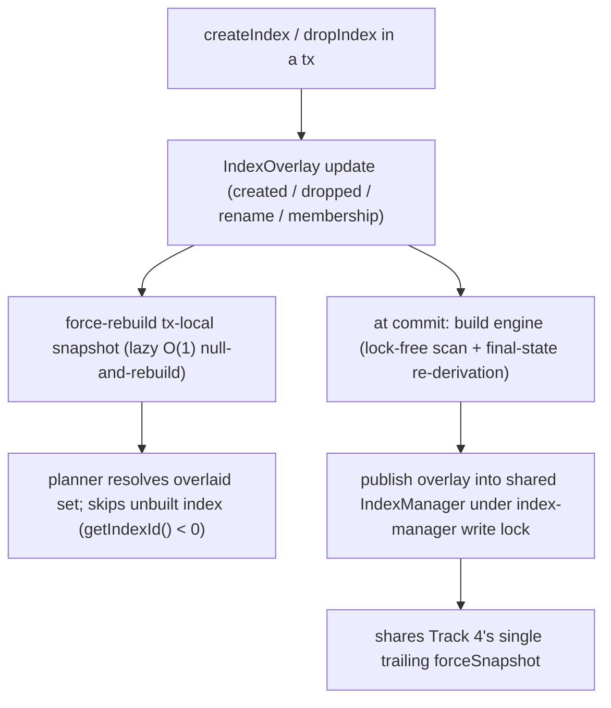

<!-- workflow-sha: 3e9c22298dfe68d2980646704850c781f8af88d5 -->
# Track 5: Tx-local index overlay, commit-time engine build, query-usability, and the tx-aware snapshot (D12, D13, D15, D21)

## Purpose / Big Picture
After this track, an index created or dropped inside a transaction is visible only
to that transaction, its engine is built at commit, and a polymorphic query sees
the right rows through the parent index after a committed membership change. A
class, property type, or constraint rule created or changed inside the transaction
is also enforced on that transaction's own entities: the immutable snapshot reads
the tx-local schema during a schema or index tx, so `EntityImpl.validate()` and
serialization see same-tx schema instead of silently skipping it (D21).

<!-- Reserved for Move 2 — ADDED/MODIFIED/REMOVED triad. Empty until Move 2 lands. -->

Give indexes a tx-local definition overlay (committed + tx-created − tx-dropped)
with its four categories and a per-session index-manager routing seam, force-rebuild
the tx-local snapshot on every mid-tx index change, build a tx-created index's engine
at commit through a lock-free scan plus a final-state re-derivation (bounded to empty
classes for v1), and make the planner skip an unbuilt index so a query inside the
creating transaction falls through to a correct full scan. This track also completes
the membership-ripple overlay routing that Track 3 de-guarded.

## Progress
- [x] Review + decomposition
- [ ] Step implementation
- [ ] Track-level code review
- [ ] Track completion
- [x] 2026-07-01T08:25Z [ctx=info] Review + decomposition complete
- [x] 2026-07-01T11:22Z [ctx=safe] Step 1 complete (commit 08dca19c71)
- [x] 2026-07-01T17:37Z [ctx=info] Step 2 complete (commit 9288956334)
- [x] 2026-07-02T07:56Z [ctx=safe] Step 3 complete (commit 8443418ae3)

## Surprises & Discoveries
<!-- Continuous-log. Empty at Phase 1. -->
- **Pre-existing pin leak surfaced by Step 1's new assertion (BC2).**
  `EntityImpl.getGlobalPropertyById`'s reload-fallback pins the schema snapshot
  (`makeThreadLocalSchemaSnapshot`) with no paired clear, so a mid-tx index DDL after
  that fallback can trip Step 1's new force-clear zero-pin assertion and throw a loud
  `IllegalStateException`. Pre-existing and outside the overlay's scope; left for a
  follow-up (relevant to Track 7 concurrency hardening). See Episodes §Step 1.
- **PF1 adds a fourth snapshot-cache layer for Step 3 (D21).** D21 risk (3) lists three
  read-chain layers to invalidate when the force-rebuild trigger widens to mid-tx class
  and property changes. The PF1 fix adds a fourth: the `TxSchemaState.overlaySnapshot`
  memo. Step 3 must invalidate it (via `forceRebuildSchemaSnapshotForIndexOverlay` →
  `invalidateOverlaySnapshot`, or equivalent) on every schema-visible change, not only
  index changes, or a mid-tx class or property change serves a stale memoized snapshot
  and I-P5 fails silently. See Episodes §Step 1.
- **Step 3 (D21) must cover the committer-side promotion read, not only the two-map
  publish.** Step 2's TX1 review accepted the commit-time publish as non-reader-atomic
  (the D19 best-effort semantic). A stress test showed the boundary is wider: on the disk
  profile the committer's own schema-promotion record read (`fromStream` → `session.load`)
  races concurrent reader activity and can drive the storage to error state under sustained
  concurrent schema commits — the same YTDB-1101 / read-chain snapshot-versioning boundary
  D21 is slated to close. Step 3's snapshot-version work must account for the committer-side
  promotion read, not just the `indexes`/`classPropertyIndex` two-map publish. See Episodes
  §Step 2.
- **The tx-created-class entity path is blocked by `RecordIdInternal.checkCollectionLimits`,
  and the fix is shared substrate with Tracks 6 and 8.** The tx-aware snapshot (Step 3, D21)
  exposes a tx-created class to `newEntity()`, but the record id would carry the provisional
  collection id (`<= -2`, D2), which the limit check rejects — so entity creation throws.
  Resolved as a pre-commit design fork: Step 3 defers the record collection to commit
  (INVALID during the tx) and a new Step 4 lands the provisional-id-in-RID mechanism.
  Whichever change relaxes the limit check and rewrites record-collection ids at commit
  should coordinate with Track 6 (base-keyed engine files) and Track 8 (genesis inserts
  users right after building the schema). See Decision Log §Step 3 mid-Phase-B.
- **Schema snapshot version is now a process-wide generation token (Step 3 BC1 fix).**
  Every `SchemaShared` version advance draws from one JVM-wide monotonic generator, so
  the committed instance and every tx-local copy occupy disjoint version spaces. Version
  numbers are comparable only for (in)equality — no `+1` continuity, no per-instance
  density. Tests in any later track that pin exact version deltas will flake under
  parallel-classes surefire; future version-keyed caches must compare identity only.
  See Episodes §Step 3.
- **D21 turns on commit-time enforcement of same-tx schema constraints.** With the
  tx-aware snapshot, `computeCommitWorkingSet`'s validation enforces a constraint added
  earlier in the same transaction on that transaction's own entities. A Track 6/7/8 test
  that creates a class or constraint and commits a violating entity in one transaction
  now fails at commit — intended D21 behavior, not a regression. See Episodes §Step 3.
- **Step-1 pin-leak trigger surface widened (Step 3 review BC2, deferred).** The
  force-rebuild hook in `SchemaProxedResource.resolveForWrite` fires on every
  proxy-routed class/property DDL, not only index DDL, so the pre-existing
  `EntityImpl.getGlobalPropertyById` pin leak (Step 1 BC2) has a wider trigger surface.
  Still pre-existing, still deferred; relevant to Track 7 concurrency hardening.
  See Episodes §Step 3.
- **Pre-existing failed-commit undo bypass shared with Track 4 (CS2).** An `endTxCommit`
  failure after the reconcile phases (a throw from `endAtomicOperation` in the no-error
  branch of the commit finally) propagates uncaught, so neither the index undo/restore arms
  nor Track 4's `undoReconciledCollections` run. Pre-existing and identical across both
  tracks; accepted out of scope for Step 2 and relevant to Track 7 concurrency hardening.
  Candidate for a follow-up issue. See Episodes §Step 2.

## Decision Log
<!-- The track-canonical live decision carrier (D7). Seeded from the frozen
design.md D-records this track owns. -->

#### D15: Tx-local index-definition overlay, not a content copy of the IndexManager
- **Alternatives considered**: a deep copy mirroring D8's schema view. Wrong here — an `Index` object is a thin handle (`indexId` into storage's engine array, the definition, membership maps); the data lives in the engine, so copying handles would duplicate pointers to the same shared engines and give no isolation, and a new index has no engine to copy at all.
- **Rationale**: the only in-memory state to overlay is the index manager's two lookup maps, so the overlay holds four categories — tx-created definitions (no engine), tx-dropped (hidden), in-place rename, and in-place collection-membership. Index content stays storage-backed and the tx's own entries ride the existing per-tx key-entry tracking. The collection-membership category (the polymorphic ripple from `addSuperClass` or an alter-add-collection on a class with an indexed superclass) is tracked in its own right, so the commit persists the `collectionsToIndex` delta and the parent index covers the new subclass collection.
- **Risks/Caveats**: the snapshot reads its per-class index list from the index manager, so a schema/index tx must resolve that list against the overlaid set through a new per-session routing seam (none exists today). `ClassIndexManager` reads a cached index set materialized once at snapshot init, so routing is necessary but not sufficient: the tx-local snapshot must force-rebuild (lazy invalidation, O(1) null-and-rebuild) on every mid-tx `createIndex` / `dropIndex`, or same-tx inserts into the new index are silently untracked (the F32 failure). An implementation that routes the membership change through the overlay but omits the membership-only category passes isolation and rollback yet fails the positive coverage test.
- **Implemented in**: this track (and completes the I-A7 membership de-guarding from Track 3)
- **Full design**: design.md §"Tx-local index overlay"

#### D12: Accept the index build under the exclusive commit lock for v1
- **Alternatives considered**: off-lock / streamed / background build (the YTDB-1064 optimization).
- **Rationale**: a transactional index build on an already-populated class runs inside the exclusive-locked commit as a lock-free internal scan feeding `doPut`, emitting zero additional WAL units, with no copied session or nested batch transaction (both re-enter the non-reentrant `stateLock`). The low schema-change rate makes the commit-blocking stall acceptable.
- **Risks/Caveats**: forward heap and recovery heap both scale with the unit size (recovery buffers the whole unit before applying), so v1 scopes the eager build to empty classes (or a documented size bound); the unbounded populated-class case moves to YTDB-1064. The v1 behavior at the boundary (loud rejection pointing at YTDB-1064 versus accept with a documented heap envelope) is the open Phase-1 decision this track settles. A concurrent pure-data commit whose enqueue ran before the new index published still misses it — same shape as today's `fillIndex` race, closure is YTDB-1101.
- **Implemented in**: this track
- **Full design**: design.md §"Index build and query-usability"

#### D13: A tx-created index is not query-usable until commit; planner skips unbuilt indexes
- **Alternatives considered**: make the new index usable mid-tx (its engine does not exist, and reading an engine-less index throws).
- **Rationale**: inside the creating transaction the new index gives no acceleration; the planner skips any index whose engine is not built (`getIndexId() < 0`) and the WHERE block falls through to a full class scan, which returns the correct merged tx view (committed rows + tx updates − tx deletes). Once the transaction commits and the engine is built, the index becomes query-usable.
- **Risks/Caveats**: the existing read-merge for already-built indexes must be preserved unchanged.
- **Implemented in**: this track
- **Full design**: design.md §"Index build and query-usability"

#### D21: Tx-aware immutable snapshot makes same-tx schema changes visible to validation and serialization (added after Track 4)
- **Alternatives considered**: (B) route `EntityImpl` validation and serialization through the tx-aware `SchemaProxy` — rejected: per-field proxy resolution is too slow on the data-write hot path. (A) accept the limitation and document the semantic — rejected: same-tx DDL plus DML is a real usage pattern and the silent constraint-skip is a significant DevX degradation.
- **Rationale**: Track 4 completion review found that `EntityImpl.validate()` (`EntityImpl.java:3932`) resolves the class through the committed-only snapshot and guards every check behind `if (immutableSchemaClass != null)`, so a class, property type, or rule created in the open transaction resolves to null — strict-mode, mandatory, notnull, type, min/max, and regex are silently skipped and serialization falls back to schemaless. The snapshot is the single read tier the whole read/query/serialize/security stack consumes (174 call sites), so making it tx-aware gives consistent read-your-writes at per-operation build cost: `SchemaProxy.makeSnapshot()` resolves the tx-local `SchemaShared` during a schema or index tx, and the snapshot is refcount-pinned per operation (`MetadataDefault.makeThreadLocalSchemaSnapshot`), not resolved per field. This reuses D15's lazy force-rebuild rather than adding a mechanism and makes the snapshot's class and property view consistent with the index-list view D15 already makes tx-aware. Supersedes the committed-only-snapshot behavior (`SchemaProxy.makeSnapshot` reads the committed `delegate`, `SchemaProxy.java:78`): `design.md` §"The tx-local schema view" states reads route to the tx-local structure "not only the snapshot" (design.md:270), yet leaves the snapshot itself committed-only; the Phase 4 `design-final.md` reconciles the as-built tx-aware snapshot.
- **Risks/Caveats**: (1) commit-path read before promotion — the schema-carrying commit pins its immutable snapshot from committed state (`MetadataDefault.getImmutableSchemaSnapshot` memoises `immutableSchema`) before reconciliation, then `computeCommitWorkingSet` (run after `reconcileCollections`, before the trailing `forceSnapshot`) calls `getImmutableSchemaClass` then `getCollectionForNewInstance`. Reconciliation re-keys the tx-local class object to its real id, but the pinned snapshot the working-set read consults is not rebuilt, so the read can still resolve a provisional id (`<= -2`) and `doGetAndCheckCollection` fails. The guard is definite, not conditional: after provisional-id resolution and before the working-set build, clear the pin and force-rebuild the snapshot (or resolve the working-set collection through the reconciled real id directly). (2) provisional collection id leaks past the planner — a tx-created class now appears in the tx-aware snapshot, but its physical collection (provisional id, D2), indexes, and engines (built at commit, D12) do not exist yet. D13's skip-unbuilt treatment must extend to every snapshot reader that resolves a collection for a provisional-collection class, not the planner alone: the fetch-step collection-scan setup (`FetchFromClassExecutionStep`, which adds a `<= -2` id to the scan set because `getCollectionNameById` returns null), security id→name resolution, and serialization, alongside the WHERE-block planner. (3) snapshot-cache invalidation is three-layered — the D15 force-rebuild trigger widens from mid-tx index changes to mid-tx class and property changes, and it must invalidate the whole read chain: the tx-local `SchemaShared` snapshot, the pinned `MetadataDefault.immutableSchema`, and the snapshot version (because `EntityImpl.getImmutableSchemaClass` at `EntityImpl.java:4194-4210` caches `immutableClazz` and re-resolves only when `immutableSchema.getVersion()` advances). Rebuilding the tx-local `SchemaShared` alone leaves both downstream caches stale and I-P5 silently fails. (4) `makeSnapshot` tx-awareness is a strict no-op outside a schema/index tx (no tx-local seed read), preserving the committed fast path for pure-data commits and reads.
- **Implemented in**: this track (with D15's index overlay — shared snapshot force-rebuild)
- **Full design**: captured in this record and this track's `## Context and Orientation` and `## Plan of Work`; `design.md` is frozen, so the as-built design reconciles in Phase 4.

#### Step 3 mid-Phase-B: tx-created-class entity path — defer-to-commit now, provisional-id-in-RID split to Step 4 (pre-commit design fork)
- **Context**: the tx-aware snapshot (D21) exposes a tx-created class to `newEntity()`, reaching a mechanism gap the plan never scoped. The entity's RID would carry the class's provisional collection id (`<= -2`, D2), which `RecordIdInternal.checkCollectionLimits` rejects, so entity creation throws before D21's own scenarios can run. D2's "provisional id … mirroring temp RIDs" reading conflicts with that limit check, with the collection-scan iterator (no physical collection exists to scan), and with the commit working-set rewrite (which re-resolves only the `-1` INVALID sentinel). Escalated pre-commit from Step 3 `mode=INITIAL`; the probe was reverted, so no rollback was needed.
- **Decision**: user chose the split (alternative C). Step 3 lands the probe-validated core D21 plus the defer-to-commit entity path — `assignAndCheckCollection` returns `COLLECTION_ID_INVALID` for a provisional collection, the existing commit path resolves the real id after the commit-path snapshot rebuild, and the named snapshot readers treat a provisional id as a no-error skip. A new Step 4 carries the provisional-id-in-RID mechanism: relax `checkCollectionLimits`, skip the physical-storage phase for a provisional collection in `RecordIteratorCollection`, and map provisional record-collection ids to the reconciled real ids in the commit working-set rewrite.
- **Consequence**: until Step 4 lands, a same-tx `SELECT` on a tx-created class is no-error but returns zero rows; the "returns the transaction's own rows" validation line binds to Step 4. Track 8 is unaffected (genesis is two-phase per D18 — users are inserted after the schema tx commits). The user also directed that subsequent high-risk implementer spawns run on the Fable 5 model.

#### Step 2 mid-Phase-B: failed-drop engine restore and publish reader-atomicity (dim-review design fork)
- **Context**: CS1 (a failed *drop* commit leaves a surviving committed index pointing at a deleted/unregistered engine) and TX1 (the commit-time publish is not reader-atomic) surfaced during Step 2's dimensional review, after the commit landed. Both were escalated to the user and resolved fix-forward with no revert, matching the Track-4 precedent.
- **Decision (CS1/BC1)**: reconstruct-on-failure. The drop's file and config delete stays inside the commit WAL atomic operation, because a deferred delete would let a crash between `endTxCommit` and the delete resurrect the dropped index on reopen. Only the in-memory engine state splits: on the failure path a fresh engine is rebuilt from the `IndexEngineData` captured at drop time and re-registered, never re-publishing the torn object (the histogram teardown is irreversible and re-publishing hangs `waitForAndBlockRebalance`'s CAS loop). The invariant "a surviving committed index is usable after a failed drop commit" is deterministic and tested on both the in-memory and disk profiles. The rejected alternative (B) would have split `BaseIndexEngine.delete` across every engine implementation, too large a surface for a review-fix iteration.
- **Decision (TX1)**: accept the non-reader-atomic publish as the D19 best-effort semantic and defer full reader-atomicity to Step 3 (D21). The scope D21 must close is broader than the two-map publish: on the disk profile the committer's own schema-promotion read (`fromStream` → `session.load`) races concurrent readers under sustained schema commits (the YTDB-1101 boundary). See Surprises & Discoveries and Episodes §Step 2.
- **Deferred**: CS2 (`endTxCommit`-after-reconcile failure bypasses the undo arms), a pre-existing exposure shared identically with Track 4's `undoReconciledCollections`; relevant to Track 7.

## Outcomes & Retrospective
<!-- Continuous-log. Empty at Phase 1. -->
- [x] Technical: PASS at iteration 2 (3 findings — T1 should-fix + 2 suggestions; folded into D21 Risks/Caveats (2), Plan of Work, C&O, and a new Validation line).
- [x] Risk: PASS at iteration 2 (6 findings — 4 should-fix + 2 suggestions; applied the definite commit-path guard, three-layer cache invalidation, both-profile I-A4 engine arm, settled D12 boundary, and handle-build interception; R7 self-contradiction in the populated-class Validation line caught at gate and fixed).
- [x] Adversarial: PASS at iteration 2 (6 findings — 4 should-fix + 2 suggestions; applied the definite guard, pin + snapshot-version invalidation, non-planner-reader guard, and method-relative anchors; A6 kept as decomposition guidance = D21 is its own step cluster).
- Accepted-suggestion residuals left for optional cleanup: D21 Rationale prose still cites `SchemaProxy.java:78` (within the `makeSnapshot` method, declaration at :75); D15 Risks/Caveats keeps the "ClassIndexManager reads a cached set" phrasing the C&O fix corrected.

## Context and Orientation
The index manager holds two flat lookup maps — `indexes` (name → Index) and
`classPropertyIndex` (class+property → indexes). An `Index` is a thin handle over a
storage-backed engine, so there is no in-memory content to deep-copy, unlike the
schema. The index-manager record is already per-entity (a `CONFIG_INDEXES` link set
to per-index entities), so it needs no D14-style split; changed index entities are
naturally dirtied and only those are written at commit.

The snapshot sources a class's index list from the index manager
(`SchemaImmutableClass.getRawClassIndexes` → the index manager's
`getClassRawIndexes`), and the cached `indexes` set `ClassIndexManager` consults is
materialized once on `SchemaImmutableClass` at snapshot init (`ClassIndexManager` is a
static utility that reads it via `getRawIndexes()`). There is no per-session routing seam for the
index manager today. A new index's engine does not exist until built, and reading an
engine-less index throws; the scan fallback (`FetchFromClassExecutionStep`) already
returns the correct merged tx view.

The snapshot's class and property view is committed-only for the same reason its
index list once was: `MetadataDefault.getImmutableSchemaSnapshot` builds through
`SchemaProxy.makeSnapshot()`, which reads the committed `delegate`, not the tx-local
copy (the "Tier 1" lock-free fast read). Structural reads route through the tx-aware
`SchemaProxy`, but `EntityImpl.validate()` (`EntityImpl.java:3932`) and serialization
read the snapshot, so a class, property type, or rule created in the open transaction
resolves to null and every constraint is silently skipped — read-your-writes holds
for structure and breaks for the schema contract. Making the snapshot tx-aware (D21)
closes this, and it rides the same force-rebuild seam D15 adds for the index list:
both make a per-session snapshot reflect tx-local state during a schema or index tx.

This track is the index analogue of Track 3's schema view plus Track 4's commit
machinery. It builds on the engaged mutex (Track 3), the commit reconciliation and
overlay-publish hook (Track 4), and the de-guarded membership entry points (Track 3),
whose overlay routing it completes.

## Plan of Work
Build the tx-local overlay over the two lookup maps with the four categories, and add
the per-session index-manager routing seam so the snapshot and `ClassIndexManager`
resolve to the overlaid set during a schema/index tx. Force-rebuild the tx-local
snapshot lazily (null and rebuild on next read) on every mid-tx `createIndex` /
`dropIndex`. Route the de-guarded `addCollectionToIndex` / `removeCollectionFromIndex`
membership change (Track 3) through the overlay's membership category so the commit
persists the `collectionsToIndex` delta. At commit, drive engine creation and drops
from the changed-index set, build a tx-created index's engine through a lock-free scan
of the source collection feeding `doPut` plus a final-state re-derivation (the
population scan skips RIDs in the tx's record-operation set; re-derivation contributes
final-state puts only), and publish the definition overlay into the shared index
manager as replacement objects under the index-manager write lock, sharing Track 4's
single trailing `forceSnapshot`. Add the planner guard that excludes unbuilt indexes.
Settle the v1 populated-class boundary: v1 builds only an empty source collection, and
a build whose source collection is non-empty is a loud rejection pointing at YTDB-1064;
the accept-with-documented-heap-envelope alternative is deferred to YTDB-1064.

Make the snapshot tx-aware (D21): change `SchemaProxy.makeSnapshot()` to resolve the
tx-local `SchemaShared` when a schema or index tx is active — and stay a strict no-op
otherwise, so the committed fast path is untouched — so the snapshot's classes and
properties, not only its index list, reflect tx-local state. Widen the D15
force-rebuild to fire on mid-tx class and property changes, and make it invalidate the
whole read chain: the tx-local `SchemaShared` snapshot, the pinned
`MetadataDefault.immutableSchema`, and the snapshot version, so `EntityImpl`'s
version-keyed `immutableClazz` cache re-resolves. Guard the commit-path read
definitely: reconciliation re-keys the tx-local class object, but the pinned snapshot
`computeCommitWorkingSet` reads (`getImmutableSchemaClass` then
`getCollectionForNewInstance`, run after `reconcileCollections` and before the trailing
`forceSnapshot`) is not rebuilt, so clear the pin and force-rebuild after provisional-id
resolution and before the working-set build, or resolve the working-set collection
through the reconciled real id, so the read never hands `doGetAndCheckCollection` a
provisional id (`<= -2`). Extend the skip-unbuilt / provisional-collection treatment
beyond the planner to every snapshot reader that resolves a collection for a tx-created
class — the fetch-step collection-scan setup (`FetchFromClassExecutionStep`), security
id→name, and serialization — so a same-tx query or serialization of a tx-created class
falls through to the merged tx scan rather than resolving a collection or engine that
does not exist yet.

Three commit-path gaps the Track-4 completion review surfaced land here too.
(1) Failed-commit engine cleanliness (I-A4 / Track-4 review finding TB2): assert
`indexEngines` and `indexEngineNameMap` carry no entry after a failed engine-creating
commit, and the engine ids are reused on the next commit. Track 4 tested the collection
arm of the failed-commit registry-cleanliness criterion only; engine reconciliation at
commit is this track's, and the create-side engine-file revert mirrors Track 4's
component-guarded arm in `undoReconciledCollections` (a fresh atomic op, guarded on the
component being present, a no-op on disk), because the default in-memory profile does
not revert an eager engine-file `addFile` on rollback. (2) Create-time provisional-collection index gap: indexing a
class created in the same transaction throws `IndexException("Collection with id -2 does
not exist")` because `IndexManagerEmbedded.createIndex`'s deferred path resolves
collection ids through `DatabaseSessionEmbedded.getCollectionNameById`, which returns null
for any id `< 0`. Resolve provisional ids (`<= -2`) via `TxSchemaState` (it carries the
generated collection name) so the deferred handle stores the right name and the
commit-time engine build re-resolves it; the interception is at the deferred
handle-build (`IndexManagerEmbedded.createIndex` resolving collection ids via
`findCollectionsByIds`, which throws on a `<= -2` id today), not only at the
commit-time re-resolve. (3) Drop-side commit half: a tx-local `dropIndex`
today only calls `markClassChanged` (`IndexManagerEmbedded.java:590-600`), so the index
stays in the shared registry, keeps indexing new records, and survives the commit — the
planner uses it mid-tx and after commit. Beyond the tx-dropped overlay above, the commit
must remove the registry entry and delete the engine for a tx-dropped index; also tighten
the `IndexManagerEmbedded` drop comment, which currently reads as if the Track 4 commit
already drops the index.

Ordering constraints: the snapshot force-rebuild must fire on every mid-tx index
or class/property change before a later read in the same tx; the population scan and the re-derivation
together must cover the committed rows the tx did not touch plus exactly the tx-touched
rows, with no double-count and none missed; the overlay publish must follow
`commitChanges` success (Track 4's deferral rule).

## Concrete Steps
1. Tx-local index-definition overlay and query-side resolution (D15, D13, I-A7): introduce `IndexOverlay` (new class) over the index manager's two lookup maps with its four categories (tx-created, tx-dropped, in-place rename, collection-membership); add the per-session index-manager routing seam so the immutable snapshot and `ClassIndexManager` resolve the overlaid set during a schema/index tx; force-rebuild the tx-local snapshot lazily (O(1) null-and-rebuild) on every mid-tx `createIndex`/`dropIndex`; route the Track-3 de-guarded `addCollectionToIndex`/`removeCollectionFromIndex` through the membership category; and add the D13 planner guard that skips an unbuilt index (`getIndexId() < 0`) so a query inside the creating tx falls through to the merged tx scan. Overlay updates defer all engine work to commit and never mutate a shared `Index` object mid-tx. — risk: high (Architecture / cross-component coordination)  [x]  commit: 08dca19c71
2. Commit-time engine lifecycle (D12, I-A4/TB2, create/drop commit halves): at commit, drive engine creation and drops from the changed-index set; build a tx-created index's engine through a lock-free scan of the source collection feeding `doPut` plus a final-state re-derivation (population scan skips the tx's record-operation RIDs), bounded to an empty source collection for v1 with a loud rejection pointing at YTDB-1064 beyond it; publish the overlay into the shared index manager as replacement objects under the index-manager write lock, sharing Track 4's single trailing `forceSnapshot`; remove the registry entry and delete the engine for a tx-dropped index; assert failed-commit engine cleanliness on both the in-memory and disk profiles with the create-side revert mirroring Track 4's component-guarded `undoReconciledCollections` arm; and resolve provisional collection ids (`<= -2`) via `TxSchemaState` at the deferred handle-build (`IndexManagerEmbedded.createIndex` / `findCollectionsByIds`) and the commit-time re-resolve so indexing a same-tx class does not throw. — risk: high (Crash-safety / Durability)  [x]  commit: 9288956334
3. Tx-aware immutable snapshot (D21): make `SchemaProxy.makeSnapshot()` resolve the tx-local `SchemaShared` during a schema/index tx and stay a strict no-op otherwise; widen the D15 force-rebuild to mid-tx class and property changes and make it invalidate the whole read chain (tx-local `SchemaShared` snapshot, the pinned `MetadataDefault.immutableSchema`, and the snapshot version so `EntityImpl`'s version-keyed `immutableClazz` re-resolves); guard the commit-path read definitely (clear the pin and force-rebuild after provisional-id resolution and before the `computeCommitWorkingSet` working-set build, or resolve through the reconciled real id, so `doGetAndCheckCollection` never sees a provisional id); and guard every snapshot reader that resolves a collection for a tx-created (provisional-collection) class — the fetch-step collection-scan setup (`FetchFromClassExecutionStep`), security id→name resolution, and serialization — so a same-tx query or serialization falls through to the merged tx scan. Entity path defers the record collection to commit (INVALID during the tx, per the Step 3 mid-Phase-B fork); a same-tx query of the tx-created class is no-error, and its rows arrive with Step 4. — risk: high (Architecture / cross-component coordination)  [x]  commit: 8443418ae3
4. Provisional-id-in-RID query support (D2, D21 follow-through): carry the provisional collection id (`<= -2`) in a tx-created-class entity's RID so a same-tx query returns the transaction's own rows — relax `RecordIdInternal.checkCollectionLimits` to admit provisional ids, key the tx's record operations under the provisional collection id and make `RecordIteratorCollection` skip the physical-storage phase for a provisional collection, and make the commit working-set rewrite map provisional record-collection ids to the reconciled real ids (alongside the existing INVALID re-resolution) so no provisional id reaches durable bytes (I-A2). — risk: high (Crash-safety / Durability)  [ ]

Steps run sequentially: Steps 2 and 3 both depend on Step 1 (Step 3 reuses the D15 force-rebuild seam), Step 4 depends on Step 3 (it rides the tx-aware snapshot and the defer-to-commit entity path), and Steps 2–4 all touch the `AbstractStorage` commit-under-lock path, so none are parallel. Each is one HIGH-category change kept isolated for step-level review; a self-deadlock or re-entrancy discovery under the commit write lock may force a mid-Phase-B split (as Track 4's reconciliation core did), which is expected, not a plan error.

## Episodes
<!-- Continuous-log. Empty at Phase 1. -->

### Step 1 — commit 08dca19c71, 2026-07-01T11:22Z [ctx=safe]
**What was done:** Added the tx-local index-definition overlay and query-side
resolution. `IndexOverlay` (new) holds four definition-only delta categories over
the index manager's two lookup maps (tx-created, tx-dropped, in-place rename, and
collection-membership), mounted lazily on `TxSchemaState`. `IndexManagerEmbedded`
gained the per-session routing seam — `getClassRawIndexes` / `getClassIndexes`
resolve against the active overlay during a schema/index tx — and routes the
Track-3 de-guarded `createIndex`, `dropIndex`, `addCollectionToIndex`, and
`removeCollectionFromIndex` through the overlay categories, force-rebuilding the
session's snapshot on a mid-tx create or drop. `SelectExecutionPlanner.findBestIndexFor`
now skips an index whose engine is unbuilt (`getIndexId() < 0`, D13), so a query
inside the creating tx falls through to the class scan. The review-fix commit added
a session-private snapshot memo on `TxSchemaState` (PF1), softened two overstated
comments (BC1/BC3), and added a concurrent-reader test and a pin-invariant test
(TX1/TX2).

**What was discovered:** The shared `SchemaShared.snapshot` cache is process-global,
so caching an overlay-resolved snapshot there would leak a session's tx-local index
view into concurrent sessions and survive its own rollback. `SchemaProxy.makeSnapshot`
routes through `SchemaShared.makeUncachedSnapshot` while an overlay is active (never
writing the shared `volatile` field) and keeps the overlay-aware snapshot only in
per-session state. Dropping an index created earlier in the same tx must resolve
against the overlay (`isTxCreated`), not the shared registry where the never-committed
index does not exist; `recordDropped` then cancels the pending create. The step-level
review (bugs-concurrency, performance, test-concurrency; PASS at iteration 2) flagged
one deferred product bug (BC2): a pre-existing pin leak in `EntityImpl.getGlobalPropertyById`'s
reload-fallback (`makeThreadLocalSchemaSnapshot` with no paired clear) that Step 1's
new force-clear zero-pin assertion can now trip during a mid-tx DDL, throwing a loud
`IllegalStateException`. It is outside the overlay's scope and left for a follow-up.
The hook-issued-DDL variant (BC3) has no reachable path from shipped code.

**What changed from the plan:** The PF1 fix adds a fourth snapshot-cache layer that
D21's Step 3 must account for. D21 risk (3) lists three layers to invalidate when the
force-rebuild trigger widens to mid-tx class and property changes: the tx-local
`SchemaShared` snapshot, the pinned `MetadataDefault.immutableSchema`, and the snapshot
version. The new `TxSchemaState.overlaySnapshot` memo is a fourth. Step 3 must invalidate
it on every schema-visible change, not only index changes, or a mid-tx class or property
change serves a stale memoized snapshot and I-P5 fails silently. Per-op same-tx index
tracking off an already-resolved entity still depends on Step 3's snapshot-version bump
(D21 risk 3) and is guaranteed end-to-end by Step 2's commit-time population scan; the
softened `createIndex` / `dropIndex` comments record this cross-step staging.

**Key files:**
- `core/src/main/java/com/jetbrains/youtrackdb/internal/core/index/IndexOverlay.java` (new)
- `core/src/main/java/com/jetbrains/youtrackdb/internal/core/index/IndexManagerEmbedded.java` (modified)
- `core/src/main/java/com/jetbrains/youtrackdb/internal/core/metadata/schema/TxSchemaState.java` (modified)
- `core/src/main/java/com/jetbrains/youtrackdb/internal/core/metadata/schema/SchemaProxy.java` (modified)
- `core/src/main/java/com/jetbrains/youtrackdb/internal/core/metadata/schema/SchemaShared.java` (modified)
- `core/src/main/java/com/jetbrains/youtrackdb/internal/core/db/DatabaseSessionEmbedded.java` (modified)
- `core/src/main/java/com/jetbrains/youtrackdb/internal/core/sql/executor/SelectExecutionPlanner.java` (modified)
- `core/src/test/java/com/jetbrains/youtrackdb/internal/core/index/IndexOverlayTest.java` (new)
- `core/src/test/java/com/jetbrains/youtrackdb/internal/core/metadata/schema/SchemaDeguardTest.java` (modified)

**Critical context:** The overlay is definition-only; all engine work is deferred to
commit (Step 2). The session-private snapshot invariant is load-bearing: the
overlay-aware `ImmutableSchema` is never written into the shared `SchemaShared.snapshot`
field and lives on per-tx `TxSchemaState` custom data, so it cannot leak across sessions
and is dropped at commit or rollback. The memo restores the committed path's O(1)-per-read
profile within a stable overlay generation.

### Step 2 — commit 9288956334, 2026-07-01T17:37Z [ctx=info]
**What was done:** Built the commit-time index engine lifecycle. A
schema-carrying commit reconciles the transaction's index deltas in three
phases driven by the index manager from the overlay. An enroll phase
before the working set applies create-side index-entity and link-set adds,
drop-side link removal and record delete, and committed-membership adds and
removes. A build/drop phase inside the commit window after the record apply
builds each tx-created index's engine at a commit-local engine id (a
lock-free scan of the source collection feeding `doPut` plus a final-state
re-derivation that skips the tx's record-operation RIDs) and deletes each
tx-dropped index's engine. A publish phase after `commitChanges` succeeds
lands the created and dropped deltas in the shared `indexes` /
`classPropertyIndex` maps. The v1 build is bounded to an empty source
collection, confirmed by an exact lock-free count, with a loud rejection
pointing at YTDB-1064 beyond it. The review-fix commit added the CS1/BC1
drop-side restore arm, a create-side file-presence revert guard,
drop-then-recreate-as-replace (BC2), the exact-count empty-source
confirmation (BC4), a post-build test hook plus a lock-free registration
probe with a both-profile failed-drop-restore test (BC3/TY1), a best-effort
concurrent-reader test (TX1), a stuck-thread class timeout (TX2), a
deferred-IT crash breadcrumb (TY2), and a YTDB-1101 boundary note (TX3).

**What was discovered:** Three self-deadlock and ordering hazards under the
non-reentrant `stateLock` the commit holds for writing were designed
around. The public `Index.delete` re-acquires `stateLock` and starts a
nested transaction, so a tx-dropped engine's deletion splits across the
enroll, build, and publish phases. `callIndexEngine` (reached via
`onIndexEngineChange` during the build) was not commit-window-aware and
gained a lock-free body like `getIndexEngine`. A same-tx insert into a
tx-created-indexed class routes `addIndexEntry` to the deferred handle
(`indexId = -1`), leaving tracked entries that failed both `commitIndexes`
and the post-commit identity assertion on the unbuilt index; those entries
are stripped from the transaction's live `indexEntries` map before the
working set, and the commit-time re-derivation is the sole population
source. The CS1 blocker resolved with the user's chosen reconstruct-on-
failure approach: the drop's file and config delete stays in the commit WAL
atomic operation, because a crash between `endTxCommit` and a deferred
delete would resurrect the dropped index on reopen; only the in-memory
engine state splits, and the failure path rebuilds a fresh engine from the
`IndexEngineData` captured at drop time rather than re-publishing the torn
object (re-publishing spins forever in `waitForAndBlockRebalance`'s CAS
loop because the histogram teardown is irreversible). The feared in-memory-
profile reconstruction wall does not exist:
`failedDropCommitLeavesTheSurvivingCommittedIndexUsable` passes on both the
default in-memory and the disk profile.

**What changed from the plan:** The mid-Phase-B design fork resolved fix-
forward with no revert, matching the Track-4 precedent. CS1/BC1 took the
reconstruct-on-failure alternative. TX1's non-reader-atomic publish is
accepted as the D19 best-effort semantic and deferred to Step 3 (D21): the
test asserts crash-free lock-free reads and eventual consistency, not mid-
publish atomicity. The accepted concurrent-schema-commit-versus-reader
boundary is broader than the torn two-map publish TX1 named. On the disk
profile the committer's own schema-promotion record read (`fromStream`
→ `session.load`) races concurrent reader activity and can drive the
storage to error state under sustained concurrent schema commits, so Step 3
(D21) must cover the committer-side promotion read, not only the two-map
publish. The create-class-plus-property-plus-index-in-one-tx scenario stays
unreachable end to end (in-transaction property creation is still throw-
guarded, a later track), so the reachable tests exercise a deferred index
on a committed class; the provisional-id resolver is implemented and
forward-looking. Step 1's `dropThenCreateSameNameResolvesToCreate` unit
test was rewritten to `dropThenCreateSameCommittedNameIsAReplace` for the
BC2 replace semantics; no downstream step is affected. CS2 (an
`endTxCommit`-after-phase-2 failure bypassing the undo arms) is a pre-
existing exposure shared identically with Track 4's
`undoReconciledCollections`, accepted out of scope and relevant to Track 7
concurrency hardening.

**Key files:**
- `core/src/main/java/com/jetbrains/youtrackdb/internal/core/storage/impl/local/AbstractStorage.java` (modified)
- `core/src/main/java/com/jetbrains/youtrackdb/internal/core/index/IndexManagerEmbedded.java` (modified)
- `core/src/main/java/com/jetbrains/youtrackdb/internal/core/index/IndexAbstract.java` (modified)
- `core/src/main/java/com/jetbrains/youtrackdb/internal/core/index/IndexOverlay.java` (modified)
- `core/src/test/java/com/jetbrains/youtrackdb/internal/core/index/CommitTimeIndexBuildTest.java` (new)
- `core/src/test/java/com/jetbrains/youtrackdb/internal/core/index/IndexOverlayTest.java` (modified)
- `core/src/test/java/com/jetbrains/youtrackdb/internal/core/metadata/schema/SchemaDeguardTest.java` (modified)

**Critical context:** Engine registry publication is split by commit-safety
exactly like collections: the engine files and the
`indexEngines`/`indexEngineNameMap` entries publish inside the commit
window (revertible through the failure-path create-undo and drop-restore
arms), while the shared `indexes`/`classPropertyIndex` lookup-map publish is
deferred past `commitChanges`. The commit-local engine-id allocator (first-
null-slot) lets a failed commit free its engine id for reuse. Build, drop,
and publish all run drops before creates so a drop-then-recreate of the same
index name resolves as a replace. The cumulative Track-5 code diff is
~3,040 lines across 12 Java files with the Step-3 tx-aware snapshot still
ahead; Phase C should weigh splitting the track-level review.

### Step 3 — commit 8443418ae3, 2026-07-02T07:56Z [ctx=safe]
**What was done:** Made the immutable snapshot tx-aware (D21).
`SchemaProxy.makeSnapshot()` gates on `getTxSchemaState() != null` and builds a
session-private snapshot from the tx-local `SchemaShared` (the `TxSchemaState`
memo kept); outside a schema/index tx the committed shared-cache path is
byte-identical, so pure-data commits and reads are untouched. The force-rebuild
trigger widened to every proxy-routed schema write via a hook in
`SchemaProxedResource.resolveForWrite` (renamed `forceRebuildTxSchemaSnapshot`;
the caller-less `hasActiveIndexOverlay` was safe-deleted).
`resolveProvisionalCollectionIds` advances the schema version so `EntityImpl`'s
version-keyed `immutableClazz` re-resolves at commit. The commit path
invalidates the overlay-snapshot memo and rebuilds the pinned snapshot through
a new count-preserving `MetadataDefault.rebuildThreadLocalSchemaSnapshot()`
after provisional-id resolution and before `computeCommitWorkingSet`. The
entity path defers a provisional collection to commit
(`assignAndCheckCollection` returns the invalid-collection sentinel) and
`FetchFromClassExecutionStep` skips provisional ids, so a same-tx query of a
tx-created class is no-error/zero-rows (rows arrive with Step 4). New
`TxAwareSchemaSnapshotTest` (11 tests, green on both profiles) covers same-tx
strict-mode and property-constraint enforcement, version re-resolution, the
create-class-plus-insert commit, the no-error query, provisional-leak absence,
the committed fast path, the rebuild pin guard, and commit-time enforcement.
The step-level review (bugs-concurrency, crash-safety, performance,
test-concurrency) passed at iteration 2: the review-fix commit replaced the
per-instance version counters with one process-wide monotonic generator (BC1)
and added a two-session concurrent isolation test (TX1); crash-safety and
performance returned zero findings.

**What was discovered:** The named security id→name and serialization reader
guards needed no new production code: session-level `getCollectionNameById`
already answers null for any negative id, and with the defer-to-commit entity
path a record id never carries a provisional id — both are pinned by tests
rather than new guards. BC1's minimal fix (seed the tx-local copy's version
from the committed counter) is insufficient: promotion advances the committed
counter by exactly 1 while a schema tx's local counter walks once per DDL, so
back-to-back schema transactions could still collide; the process-wide
generator closes both traces. An overlay-only index change still does not
advance the tx-local schema version (class/property mutations do, plus the
commit's resolution bump). The running cumulative track diff crossed the
~4,000-line advisory threshold (~5,000 insertions with Step 4 ahead),
re-confirming the Step 2 note that Phase C should weigh splitting the
track-level review.

**What changed from the plan:** Implemented under the pre-step
`WITH_GUIDANCE` scope from the Step 3 mid-Phase-B fork (see Decision Log) —
the provisional-id-in-RID mechanism is Step 4, out of this step's scope. The
reader guards resolved as test-pinned existing behavior rather than new code;
the fetch-step collection-scan skip is the only new reader guard.
`SchemaSharedLockApiTest`'s exact `+1` version-delta assertion relaxed to the
advances shape (the generator is JVM-shared and core surefire runs four test
classes per JVM).

**Key files:**
- `core/src/main/java/com/jetbrains/youtrackdb/internal/core/metadata/schema/SchemaProxy.java` (modified)
- `core/src/main/java/com/jetbrains/youtrackdb/internal/core/metadata/schema/SchemaProxedResource.java` (modified)
- `core/src/main/java/com/jetbrains/youtrackdb/internal/core/metadata/schema/SchemaShared.java` (modified)
- `core/src/main/java/com/jetbrains/youtrackdb/internal/core/metadata/schema/TxSchemaState.java` (modified)
- `core/src/main/java/com/jetbrains/youtrackdb/internal/core/db/DatabaseSessionEmbedded.java` (modified)
- `core/src/main/java/com/jetbrains/youtrackdb/internal/core/metadata/MetadataDefault.java` (modified)
- `core/src/main/java/com/jetbrains/youtrackdb/internal/core/storage/impl/local/AbstractStorage.java` (modified)
- `core/src/main/java/com/jetbrains/youtrackdb/internal/core/sql/executor/FetchFromClassExecutionStep.java` (modified)
- `core/src/main/java/com/jetbrains/youtrackdb/internal/core/index/IndexManagerEmbedded.java` (modified)
- `core/src/test/java/com/jetbrains/youtrackdb/internal/core/metadata/schema/TxAwareSchemaSnapshotTest.java` (new)
- `core/src/test/java/com/jetbrains/youtrackdb/internal/core/metadata/schema/SchemaSharedLockApiTest.java` (modified)

**Critical context:** Ordering is load-bearing in the commit-path guard: the
`TxSchemaState` memo must be invalidated before the pin rebuild, or
`makeSnapshot` returns the stale memoized snapshot.
`rebuildThreadLocalSchemaSnapshot` throws on a zero pin count by design (it
exists precisely because `forceClearThreadLocalSchemaSnapshot` throws on a held
pin). Schema version numbers are now comparable only for (in)equality, never
arithmetically — the field's Javadoc pins this contract, and future
version-keyed caches must follow it. The `resolveForWrite` hook assumes no
proxy-routed DDL runs under a held snapshot pin — the same blast surface the
index-only trigger already had; the known pre-existing
`getGlobalPropertyById` pin leak is unchanged.

## Validation and Acceptance
- Create an index mid-transaction, insert rows into the indexed class in the same
  transaction, commit; the committed index contains those rows (the F32
  silent-untracking regression) (I-P2).
- A query inside the creating transaction returns correct results via the scan
  fallback, not via the unbuilt index (which would throw); after commit the same
  query accelerates through the built engine (I-P3).
- A transaction creates an index and inserts, updates, and deletes rows on the indexed
  class; the committed index reflects exactly the final state (I-P4).
- Commit an `addSuperClass` (or alter-add-collection) that adds a subclass collection
  to a superclass's index, then run a polymorphic query through that index and assert
  it returns the subclass rows. An implementation that omits the membership-only
  category fails this while passing isolation/rollback (I-P2 positive coverage).
- A rename, drop, and collection-membership change apply commit-only and never mutate
  a shared `Index` object mid-tx.
- A build whose source collection is non-empty is loudly rejected with an error pointing
  at YTDB-1064 (the settled v1 boundary); the accept-with-heap-envelope alternative is
  deferred to YTDB-1064.
- Create a class with a strict-mode, mandatory, notnull, type, or regex constraint
  inside a transaction, then in the same transaction validate an entity that violates
  it; validation enforces the constraint instead of silently skipping it (the same-tx
  validation gap, D21).
- Add a property type or constraint to an existing class inside a transaction; that
  constraint is enforced on the same transaction's entities of that class.
- Inside a transaction, create a class and validate an entity of it (so the entity caches
  its immutable class), then add a mandatory, notnull, or type constraint to that class in
  the same transaction and validate a second entity; the new constraint is enforced even
  though the class was already resolved once, because the snapshot version advances on the
  force-rebuild and `EntityImpl` re-resolves its cached `immutableClazz` (A3 / I-P5).
- Serialize an entity of a tx-created class inside the creating transaction and resolve its
  collection name through the id→name path; no provisional collection id (`<= -2`) leaks
  through serialization or security id→name resolution (the tx-aware snapshot exposes the
  class to non-planner readers, D21 risk 2).
- Commit a transaction that creates a class and inserts an entity of it; the commit
  succeeds and the commit-path collection-id resolution does not fail on a provisional
  id (the D21 commit-path guard).
- Run a query against a tx-created class inside the same transaction; it returns the
  transaction's own rows through the scan fallthrough without an engine-not-found or
  collection-not-found error (D13 extended to provisional-collection classes). The
  no-error half lands with Step 3; the returns-the-rows half binds to Step 4 (the
  provisional-id-in-RID mechanism, per the Step 3 mid-Phase-B fork).
- After a failed engine-creating commit, `indexEngines` and `indexEngineNameMap` carry no
  entry for the would-be engine, and the freed engine ids are reused on the next
  successful commit (I-A4 engine arm; Track 4 covered the collection arm only, TB2). The
  assertion runs on both the default in-memory profile and the disk profile; the in-memory
  profile caught the equivalent Track-4 collection-arm leak (YTDB-1175).
- Create a class and an index on it inside the same transaction, then commit; the deferred
  index handle resolves the provisional collection id (`<= -2`) to the real collection at
  commit instead of throwing `IndexException("Collection with id -2 does not exist")`.
- Drop an index inside a transaction and commit; after commit the registry entry and the
  engine are gone and the planner no longer uses the index (today it survives because the
  tx-local `dropIndex` only marks the class changed).

<!-- Phase A placeholder for per-step EARS/Gherkin lines. -->

<!-- Reserved for Move 3 — EARS or Gherkin acceptance lines used
verbatim as test method names. Empty until Move 3 lands. -->

## Idempotence and Recovery
<!-- Phase A placeholder. -->

## Artifacts and Notes
<!-- Continuous-log (rare). Often empty. -->

## Interfaces and Dependencies
- **In scope**: the tx-local index overlay and its four categories; the per-session
  index-manager routing seam; the lazy snapshot force-rebuild on mid-tx index change;
  the commit-time engine build (lock-free scan + final-state re-derivation, empty-class
  boundary); the overlay publish into the shared index manager under the index-manager
  write lock; the planner skip-unbuilt-index guard (`getIndexesInternal`); the
  membership-category routing for the Track-3 de-guarded sites; the tx-aware snapshot
  (`SchemaProxy.makeSnapshot` resolving the tx-local `SchemaShared`, the widened
  force-rebuild trigger, the `AbstractStorage.computeCommitWorkingSet` commit-path
  guard, and the D13 planner extension for provisional-collection classes); overlay /
  build / coverage / same-tx-validation tests.
- **Out of scope**: the schema view itself (Track 3); the commit's four-lock acquisition
  and the trailing `forceSnapshot` it owns (Track 4 — this track hooks its overlay publish
  into that window); base-keyed engine files and rename (Track 6); the monolithic
  index-manager link-set rewrite optimization (YTDB-1064).
- **Inter-track dependencies**: depends on Track 3 (the engaged mutex and the de-guarded
  membership entry points) and Track 4 (the commit reconciliation, the deferred-publish
  rule, and the single `forceSnapshot`). Track 6's rename rides the overlay's in-place
  rename category; Track 8's genesis builds the `OUser.name` index through this track's
  commit-time build.
- **Signatures**: `IndexOverlay.effectiveIndexes() : Set`; a per-session index-manager
  resolver/proxy seam; the planner guard excluding `getIndexId() < 0` engines from the
  usable index set.

## Base commit
54000d904b4daf34f9e1c3488ac1f549e2401859
