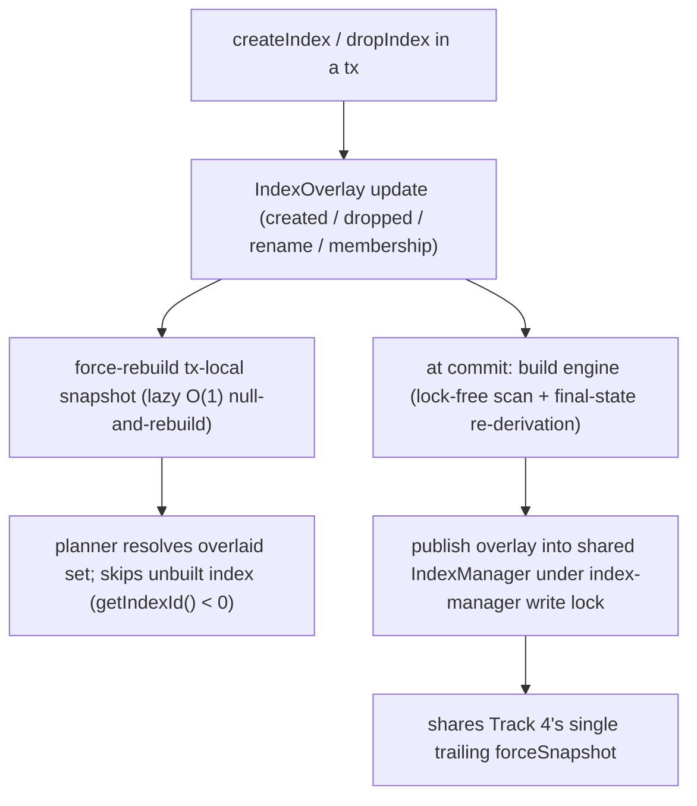

<!-- workflow-sha: 3e9c22298dfe68d2980646704850c781f8af88d5 -->
# Track 5: Tx-local index overlay, commit-time engine build, query-usability, and the tx-aware snapshot (D12, D13, D15, D21)

## Purpose / Big Picture
After this track, an index created or dropped inside a transaction is visible only
to that transaction, its engine is built at commit, and a polymorphic query sees
the right rows through the parent index after a committed membership change. A
class, property type, or constraint rule created or changed inside the transaction
is also enforced on that transaction's own entities: the immutable snapshot reads
the tx-local schema during a schema or index tx, so `EntityImpl.validate()` and
serialization see same-tx schema instead of silently skipping it (D21).

<!-- Reserved for Move 2 — ADDED/MODIFIED/REMOVED triad. Empty until Move 2 lands. -->

Give indexes a tx-local definition overlay (committed + tx-created − tx-dropped)
with its four categories and a per-session index-manager routing seam, force-rebuild
the tx-local snapshot on every mid-tx index change, build a tx-created index's engine
at commit through a lock-free scan plus a final-state re-derivation (bounded to empty
classes for v1), and make the planner skip an unbuilt index so a query inside the
creating transaction falls through to a correct full scan. This track also completes
the membership-ripple overlay routing that Track 3 de-guarded.

## Progress
- [ ] Review + decomposition
- [ ] Step implementation
- [ ] Track-level code review
- [ ] Track completion

## Surprises & Discoveries
<!-- Continuous-log. Empty at Phase 1. -->

## Decision Log
<!-- The track-canonical live decision carrier (D7). Seeded from the frozen
design.md D-records this track owns. -->

#### D15: Tx-local index-definition overlay, not a content copy of the IndexManager
- **Alternatives considered**: a deep copy mirroring D8's schema view. Wrong here — an `Index` object is a thin handle (`indexId` into storage's engine array, the definition, membership maps); the data lives in the engine, so copying handles would duplicate pointers to the same shared engines and give no isolation, and a new index has no engine to copy at all.
- **Rationale**: the only in-memory state to overlay is the index manager's two lookup maps, so the overlay holds four categories — tx-created definitions (no engine), tx-dropped (hidden), in-place rename, and in-place collection-membership. Index content stays storage-backed and the tx's own entries ride the existing per-tx key-entry tracking. The collection-membership category (the polymorphic ripple from `addSuperClass` or an alter-add-collection on a class with an indexed superclass) is tracked in its own right, so the commit persists the `collectionsToIndex` delta and the parent index covers the new subclass collection.
- **Risks/Caveats**: the snapshot reads its per-class index list from the index manager, so a schema/index tx must resolve that list against the overlaid set through a new per-session routing seam (none exists today). `ClassIndexManager` reads a cached index set materialized once at snapshot init, so routing is necessary but not sufficient: the tx-local snapshot must force-rebuild (lazy invalidation, O(1) null-and-rebuild) on every mid-tx `createIndex` / `dropIndex`, or same-tx inserts into the new index are silently untracked (the F32 failure). An implementation that routes the membership change through the overlay but omits the membership-only category passes isolation and rollback yet fails the positive coverage test.
- **Implemented in**: this track (and completes the I-A7 membership de-guarding from Track 3)
- **Full design**: design.md §"Tx-local index overlay"

#### D12: Accept the index build under the exclusive commit lock for v1
- **Alternatives considered**: off-lock / streamed / background build (the YTDB-1064 optimization).
- **Rationale**: a transactional index build on an already-populated class runs inside the exclusive-locked commit as a lock-free internal scan feeding `doPut`, emitting zero additional WAL units, with no copied session or nested batch transaction (both re-enter the non-reentrant `stateLock`). The low schema-change rate makes the commit-blocking stall acceptable.
- **Risks/Caveats**: forward heap and recovery heap both scale with the unit size (recovery buffers the whole unit before applying), so v1 scopes the eager build to empty classes (or a documented size bound); the unbounded populated-class case moves to YTDB-1064. The v1 behavior at the boundary (loud rejection pointing at YTDB-1064 versus accept with a documented heap envelope) is the open Phase-1 decision this track settles. A concurrent pure-data commit whose enqueue ran before the new index published still misses it — same shape as today's `fillIndex` race, closure is YTDB-1101.
- **Implemented in**: this track
- **Full design**: design.md §"Index build and query-usability"

#### D13: A tx-created index is not query-usable until commit; planner skips unbuilt indexes
- **Alternatives considered**: make the new index usable mid-tx (its engine does not exist, and reading an engine-less index throws).
- **Rationale**: inside the creating transaction the new index gives no acceleration; the planner skips any index whose engine is not built (`getIndexId() < 0`) and the WHERE block falls through to a full class scan, which returns the correct merged tx view (committed rows + tx updates − tx deletes). Once the transaction commits and the engine is built, the index becomes query-usable.
- **Risks/Caveats**: the existing read-merge for already-built indexes must be preserved unchanged.
- **Implemented in**: this track
- **Full design**: design.md §"Index build and query-usability"

#### D21: Tx-aware immutable snapshot makes same-tx schema changes visible to validation and serialization (added after Track 4)
- **Alternatives considered**: (B) route `EntityImpl` validation and serialization through the tx-aware `SchemaProxy` — rejected: per-field proxy resolution is too slow on the data-write hot path. (A) accept the limitation and document the semantic — rejected: same-tx DDL plus DML is a real usage pattern and the silent constraint-skip is a significant DevX degradation.
- **Rationale**: Track 4 completion review found that `EntityImpl.validate()` (`EntityImpl.java:3932`) resolves the class through the committed-only snapshot and guards every check behind `if (immutableSchemaClass != null)`, so a class, property type, or rule created in the open transaction resolves to null — strict-mode, mandatory, notnull, type, min/max, and regex are silently skipped and serialization falls back to schemaless. The snapshot is the single read tier the whole read/query/serialize/security stack consumes (174 call sites), so making it tx-aware gives consistent read-your-writes at per-operation build cost: `SchemaProxy.makeSnapshot()` resolves the tx-local `SchemaShared` during a schema or index tx, and the snapshot is refcount-pinned per operation (`MetadataDefault.makeThreadLocalSchemaSnapshot`), not resolved per field. This reuses D15's lazy force-rebuild rather than adding a mechanism and makes the snapshot's class and property view consistent with the index-list view D15 already makes tx-aware. Supersedes the committed-only-snapshot behavior (`SchemaProxy.makeSnapshot` reads the committed `delegate`, `SchemaProxy.java:78`): `design.md` §"The tx-local schema view" states reads route to the tx-local structure "not only the snapshot" (design.md:270), yet leaves the snapshot itself committed-only; the Phase 4 `design-final.md` reconciles the as-built tx-aware snapshot.
- **Risks/Caveats**: (1) commit-path read before promotion — `computeCommitWorkingSet` (`AbstractStorage.java:2410`, reached at line 2528, after `reconcileCollections` at 2473 and before `forceSnapshot` at 2691) calls `getImmutableSchemaClass` then `getCollectionForNewInstance`; a tx-aware snapshot must hand back the reconciled real collection id, never a provisional id (`<= -2`), or `doGetAndCheckCollection` fails. Verify reconciliation re-keys the tx-local class before the working-set build, or guard the commit-path read. (2) query or MATCH against a tx-created class in the same transaction — the class now appears in the snapshot but its physical collection (provisional id, D2) and indexes and engines (built at commit, D12) do not exist yet; extend D13's skip-unbuilt treatment to provisional-collection classes so the WHERE block falls through to the merged tx scan. (3) the D15 force-rebuild trigger widens from mid-tx index changes to mid-tx class and property changes.
- **Implemented in**: this track (with D15's index overlay — shared snapshot force-rebuild)
- **Full design**: captured in this record and this track's `## Context and Orientation` and `## Plan of Work`; `design.md` is frozen, so the as-built design reconciles in Phase 4.

## Outcomes & Retrospective
<!-- Continuous-log. Empty at Phase 1. -->

## Context and Orientation
The index manager holds two flat lookup maps — `indexes` (name → Index) and
`classPropertyIndex` (class+property → indexes). An `Index` is a thin handle over a
storage-backed engine, so there is no in-memory content to deep-copy, unlike the
schema. The index-manager record is already per-entity (a `CONFIG_INDEXES` link set
to per-index entities), so it needs no D14-style split; changed index entities are
naturally dirtied and only those are written at commit.

The snapshot sources a class's index list from the index manager
(`SchemaImmutableClass.getRawClassIndexes` → the index manager's
`getClassRawIndexes`), and `ClassIndexManager` reads a cached `indexes` set
materialized once at snapshot init. There is no per-session routing seam for the
index manager today. A new index's engine does not exist until built, and reading an
engine-less index throws; the scan fallback (`FetchFromClassExecutionStep`) already
returns the correct merged tx view.

The snapshot's class and property view is committed-only for the same reason its
index list once was: `MetadataDefault.getImmutableSchemaSnapshot` builds through
`SchemaProxy.makeSnapshot()`, which reads the committed `delegate`, not the tx-local
copy (the "Tier 1" lock-free fast read). Structural reads route through the tx-aware
`SchemaProxy`, but `EntityImpl.validate()` (`EntityImpl.java:3932`) and serialization
read the snapshot, so a class, property type, or rule created in the open transaction
resolves to null and every constraint is silently skipped — read-your-writes holds
for structure and breaks for the schema contract. Making the snapshot tx-aware (D21)
closes this, and it rides the same force-rebuild seam D15 adds for the index list:
both make a per-session snapshot reflect tx-local state during a schema or index tx.

This track is the index analogue of Track 3's schema view plus Track 4's commit
machinery. It builds on the engaged mutex (Track 3), the commit reconciliation and
overlay-publish hook (Track 4), and the de-guarded membership entry points (Track 3),
whose overlay routing it completes.

## Plan of Work
Build the tx-local overlay over the two lookup maps with the four categories, and add
the per-session index-manager routing seam so the snapshot and `ClassIndexManager`
resolve to the overlaid set during a schema/index tx. Force-rebuild the tx-local
snapshot lazily (null and rebuild on next read) on every mid-tx `createIndex` /
`dropIndex`. Route the de-guarded `addCollectionToIndex` / `removeCollectionFromIndex`
membership change (Track 3) through the overlay's membership category so the commit
persists the `collectionsToIndex` delta. At commit, drive engine creation and drops
from the changed-index set, build a tx-created index's engine through a lock-free scan
of the source collection feeding `doPut` plus a final-state re-derivation (the
population scan skips RIDs in the tx's record-operation set; re-derivation contributes
final-state puts only), and publish the definition overlay into the shared index
manager as replacement objects under the index-manager write lock, sharing Track 4's
single trailing `forceSnapshot`. Add the planner guard that excludes unbuilt indexes.
Settle the v1 populated-class boundary (loud reject vs documented heap envelope).

Make the snapshot tx-aware (D21): change `SchemaProxy.makeSnapshot()` to resolve the
tx-local `SchemaShared` when a schema or index tx is active, so the snapshot's classes
and properties — not only its index list — reflect tx-local state, and widen the D15
force-rebuild trigger to fire on mid-tx class and property changes, not only index
changes. Guard the commit-path read: `computeCommitWorkingSet` reads
`getImmutableSchemaClass` then `getCollectionForNewInstance` at `AbstractStorage:2528`,
after `reconcileCollections` (2473) and before `forceSnapshot` (2691); confirm the
tx-local class carries its reconciled real collection id by that point, or guard the
read so it never hands `doGetAndCheckCollection` a provisional id (`<= -2`). Extend
the planner's skip-unbuilt treatment so a query against a tx-created (provisional-
collection) class in the same tx falls through to the merged tx scan rather than
resolving a collection or engine that does not exist yet.

Ordering constraints: the snapshot force-rebuild must fire on every mid-tx index
or class/property change before a later read in the same tx; the population scan and the re-derivation
together must cover the committed rows the tx did not touch plus exactly the tx-touched
rows, with no double-count and none missed; the overlay publish must follow
`commitChanges` success (Track 4's deferral rule).

## Concrete Steps
<!-- Phase A placeholder. -->

## Episodes
<!-- Continuous-log. Empty at Phase 1. -->

## Validation and Acceptance
- Create an index mid-transaction, insert rows into the indexed class in the same
  transaction, commit; the committed index contains those rows (the F32
  silent-untracking regression) (I-P2).
- A query inside the creating transaction returns correct results via the scan
  fallback, not via the unbuilt index (which would throw); after commit the same
  query accelerates through the built engine (I-P3).
- A transaction creates an index and inserts, updates, and deletes rows on the indexed
  class; the committed index reflects exactly the final state (I-P4).
- Commit an `addSuperClass` (or alter-add-collection) that adds a subclass collection
  to a superclass's index, then run a polymorphic query through that index and assert
  it returns the subclass rows. An implementation that omits the membership-only
  category fails this while passing isolation/rollback (I-P2 positive coverage).
- A rename, drop, and collection-membership change apply commit-only and never mutate
  a shared `Index` object mid-tx.
- A populated-class build beyond the v1 size bound behaves per the settled boundary
  decision (loud rejection pointing at YTDB-1064, or accept with a documented heap
  envelope).
- Create a class with a strict-mode, mandatory, notnull, type, or regex constraint
  inside a transaction, then in the same transaction validate an entity that violates
  it; validation enforces the constraint instead of silently skipping it (the same-tx
  validation gap, D21).
- Add a property type or constraint to an existing class inside a transaction; that
  constraint is enforced on the same transaction's entities of that class.
- Commit a transaction that creates a class and inserts an entity of it; the commit
  succeeds and the commit-path collection-id resolution does not fail on a provisional
  id (the D21 commit-path guard).
- Run a query against a tx-created class inside the same transaction; it returns the
  transaction's own rows through the scan fallthrough without an engine-not-found or
  collection-not-found error (D13 extended to provisional-collection classes).

<!-- Phase A placeholder for per-step EARS/Gherkin lines. -->

<!-- Reserved for Move 3 — EARS or Gherkin acceptance lines used
verbatim as test method names. Empty until Move 3 lands. -->

## Idempotence and Recovery
<!-- Phase A placeholder. -->

## Artifacts and Notes
<!-- Continuous-log (rare). Often empty. -->

## Interfaces and Dependencies
- **In scope**: the tx-local index overlay and its four categories; the per-session
  index-manager routing seam; the lazy snapshot force-rebuild on mid-tx index change;
  the commit-time engine build (lock-free scan + final-state re-derivation, empty-class
  boundary); the overlay publish into the shared index manager under the index-manager
  write lock; the planner skip-unbuilt-index guard (`getIndexesInternal`); the
  membership-category routing for the Track-3 de-guarded sites; the tx-aware snapshot
  (`SchemaProxy.makeSnapshot` resolving the tx-local `SchemaShared`, the widened
  force-rebuild trigger, the `AbstractStorage.computeCommitWorkingSet` commit-path
  guard, and the D13 planner extension for provisional-collection classes); overlay /
  build / coverage / same-tx-validation tests.
- **Out of scope**: the schema view itself (Track 3); the commit's four-lock acquisition
  and the trailing `forceSnapshot` it owns (Track 4 — this track hooks its overlay publish
  into that window); base-keyed engine files and rename (Track 6); the monolithic
  index-manager link-set rewrite optimization (YTDB-1064).
- **Inter-track dependencies**: depends on Track 3 (the engaged mutex and the de-guarded
  membership entry points) and Track 4 (the commit reconciliation, the deferred-publish
  rule, and the single `forceSnapshot`). Track 6's rename rides the overlay's in-place
  rename category; Track 8's genesis builds the `OUser.name` index through this track's
  commit-time build.
- **Signatures**: `IndexOverlay.effectiveIndexes() : Set`; a per-session index-manager
  resolver/proxy seam; the planner guard excluding `getIndexId() < 0` engines from the
  usable index set.

