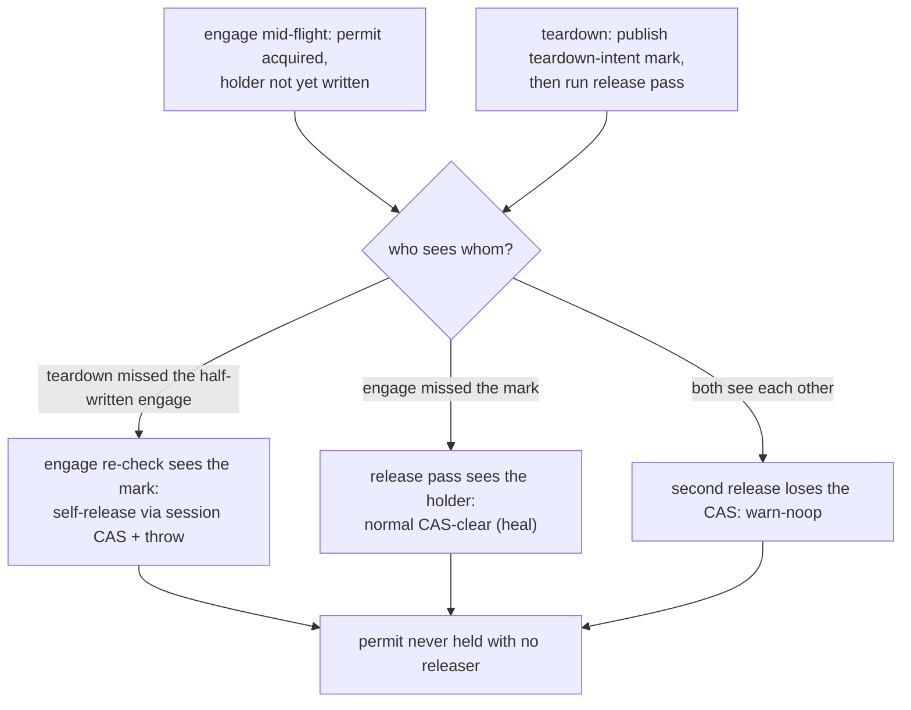

<!-- workflow-sha: 3e9c22298dfe68d2980646704850c781f8af88d5 -->
# Track 7: Concurrency hardening — mutex permit handshake and the freezer gate (D7)

## Purpose / Big Picture
After this track, a connection-pool teardown of a session holding an open schema
transaction never wedges DDL until restart, and a schema commit never turns an
operator freeze into a database-wide read outage.

<!-- Reserved for Move 2 — ADDED/MODIFIED/REMOVED triad. Empty until Move 2 lands. -->

Harden the metadata-write mutex against pool-teardown wedges with a session-keyed
compare-and-clear release, a `(session, ordinal, thread)` holder record,
owner-thread-only teardown, and the Dekker engage/teardown handshake; and make a
schema commit never park inside the four-lock window against an operator freeze with
a freeze-kind taxonomy, a kind-aware gate at the loop-top and park-decision sites, and
the operator-arm cut-and-unpark. This is the design's hardest concurrency work, and it
builds on the mutex primitive (Track 3) and the schema-carrying commit (Track 4).

## Progress
- [x] Review + decomposition
- [x] Step implementation
- [x] Track-level code review
- [x] Track completion
- [x] 2026-07-21T13:00Z [ctx=safe] Review + decomposition complete (5-step roster approved)
- [x] 2026-07-21T17:30Z [ctx=safe] Step 1 complete (commit cb2d4d3b79)
- [x] 2026-07-21T18:15Z [ctx=safe] Step 2 complete (commit fafac7e8b3)
- [x] 2026-07-21T21:20Z [ctx=safe] Step 1 review-fix complete (commit 1063e1d987; 2 blockers, 2
  should-fixes, 5 suggestions — all applied)
- [x] 2026-07-22T06:40Z [ctx=safe] Step 1 review-fix iteration 2 complete (commit 7d2369cda0;
  crash-safety review CS20–CS25: 2 should-fixes + 4 suggestions — all applied or dispositioned,
  0 blockers)
- [x] 2026-07-22T12:30Z [ctx=safe] Step 3 complete (commit 11bf0eda26)
- [x] 2026-07-22T15:10Z [ctx=safe] Step 4 complete (commit 449d1745c0; resumed after an
  auth-failure interruption mid-implementation — the uncommitted primitive was re-verified
  against the spec before tests were written)
- [x] 2026-07-22T17:40Z [ctx=safe] Step 3 review-fix iteration 1 complete (commit f7009df7a7;
  concurrency + baseline + crash-safety reviews: 5 should-fixes + 4 suggestions — all applied or
  dispositioned, 0 blockers)
- [x] 2026-07-22T19:50Z [ctx=safe] Step 4 review-fix iteration 1 complete (commit 5811042e95;
  concurrency + baseline reviews: 2 should-fixes + 4 suggestions — all applied except one
  sampling suggestion dispositioned as accepted, 0 blockers)
- [x] 2026-07-23T00:15Z [ctx=safe] Step 5 complete (commit 736cab68ec; includes the
  waiting-list single-cutter liveness fix the integration profile surfaced — see Episodes
  §Step 5)
- [x] 2026-07-23T04:59Z [ctx=safe] Step 5 review-fix iteration 1 complete (commit b54384e08a;
  concurrency + crash-safety + baseline reviews: 3 should-fixes + 7 suggestions — all applied
  except BG8, deferred pending a user decision on the cut-woken throw-mode semantics; 0
  blockers)
- [x] 2026-07-23T06:10Z [ctx=safe] BG8 resolved (commit 3dd408a439; user-ruled Option A — pin
  the deterministic throw)
- [x] 2026-07-23T09:30Z [ctx=safe] Track-level code review complete (3 perspectives —
  concurrency + crash-safety + baseline; 0 blockers, 0 should-fixes; suggestions triaged:
  BG9/CN46/CQ11/CQ12 fixed in commit f5c162225b, gate-verified 4/4 in commit 4cadd3037b;
  CS32/CS33/CN47 filed as follow-up drafts for later tracks)
- [x] 2026-07-23T10:00Z [ctx=safe] Track completion — user-approved 2026-07-23

## Surprises & Discoveries
<!-- Continuous-log. Empty at Phase 1. -->
- 2026-07-21T17:30Z Step 1's stale-seed root cause is record-level MVCC, not the local record
  cache: every read inside a transaction rides the atomic operation pinned at `begin()`, whose
  `AtomicOperationsSnapshot` predates a schema commit the transaction parked behind on the mutex
  (`PaginatedCollectionV2.doReadRecord` serves the historical version). The plan-era "stale
  tx-cached root" wording was the symptom, not the mechanism; the fix rides a dedicated read-only
  atomic operation with a seed-time snapshot. A cached record cannot simply be bypassed either —
  `RecordAbstract.assertIfAlreadyLoaded` enforces one instance per rid per session, so the scope
  refreshes a stale cached instance in place. See Episodes §Step 1.
- 2026-07-21T17:30Z Two pre-existing red sets confirmed at HEAD `e2605c8ba3` during Step 1
  verification (identical failure signatures with and without the Step 1 diff, reproduced under
  stash): (a) `SchemaCommitReconciliationTest.schemaCommitReloadAndIndexLoadRaceWithoutDeadlock`
  fails on the ci/disk profile (`-Dyoutrackdb.test.env=ci`) with the commit-window promotion read
  hitting "Atomic operation is not active" on a cache miss — the YTDB-1101 boundary Track 5
  documented and deferred (track-5.md §Step 2 mid-Phase-B, TX1); ~4-of-5 flaky, not owned by this
  track. (b) Four failsafe IT classes fail looking for class-name-prefixed engine files
  (`StorageTestIT` 4, `TruncateOrphansAfterRecoveryIT` 15, `InvalidRemovedFileIdsIT` 1,
  `StorageBackupMTRestoreIT` 1: "No .pcl/.cpm file found for class prefix …") — Track 6
  base-keyed-engine-files fallout, pre-existing at the Track 6 completion commit. Neither set is
  Step 1 scope; both need an owner before merge.
  **RESOLVED 2026-07-21T23:40Z** (user-approved on-branch fix, separate from Track 7 step work):
  all four were stale TEST expectations — the ITs located a class's `.pcl`/`.cpm` files by
  class-name prefix, but Track 6's counter-only collection naming (`c_<n>`,
  `SchemaShared.nextCollectionName`) removed the class-name component from collection files
  entirely (the point of D16's rename-inertness). No product defect: every production
  recovery/backup/restore path resolves files through the write-cache registry or the name-id
  map, name-agnostically, and the extension-keyed sibling tests in the same ITs were green
  throughout. The lookups now resolve each class's exact collection file through its collection
  id via the open session (assertion strength preserved: presence in the write cache is still
  asserted loudly, and the BackupMTRestore largest-file selector still keys on the class's own
  collections). All four ITs green targeted (5/5, 34/34, 1/1, 3/3). With the ci-profile racer
  healed by the Step 1 review-fix, NO known pre-merge reds remain.
- 2026-07-21T21:20Z The Step 1 review-fix's promotion fresh-read scope incidentally turned the
  ci/disk-profile racer red (`schemaCommitReloadAndIndexLoadRaceWithoutDeadlock`, the YTDB-1101
  promotion cache-miss shape) GREEN (3/3 under `-Dyoutrackdb.test.env=ci`, previously 5/5 red at
  HEAD): the promotion's cache-miss load now rides an active dedicated read-only operation instead
  of the ended begin-time transaction operation. The broader YTDB-1101 boundary (committer
  promotion reads racing concurrent readers) is not claimed closed — only this standing red. The
  remaining pre-merge red set is the four Track 6 rename ITs (unchanged, 21 failures, identical to
  the HEAD baseline).
- 2026-07-21T21:20Z Review-fix discovery: the failed-commit undo's in-memory config-cache slot
  (`CollectionBasedStorageConfiguration`'s COLLECTIONS cache) is NOT restored for a dropped
  collection whose drop rolled back — the drop nulls the cache slot eagerly and only the durable
  property-record delete reverts with the WAL. Pre-existing (predates Track 7; the drop-restore arm
  never restored it), self-heals on reopen (preload re-reads durable state), benign for
  registry/row operations. Left unfixed and recorded here so the eventual owner knows it is not a
  Step 1 regression.
- 2026-07-23T00:15Z Step 5's operator-arm cut surfaced a LATENT single-cutter assumption in the
  freezer's `WaitingList`: `cutWaitingList` reads `tail` BEFORE `head`, so a second concurrent
  cutter that completes a full cut (plus one enqueue) between those two reads hands the first
  cutter a cross-generation pair whose head lies past the captured tail — the head CAS still
  succeeds and the traversal wedges forever on a link latch. Historically unreachable (the sole
  cutter was `releaseOperations` on the 1→0 transition); the operator arm made cutters
  concurrent and hung the integration profile's sequential fork
  (`FreezeAndDBRecordInsertAtomicityTest`). Fixed by serializing cutters (`synchronized`
  `cutWaitingList`); a wake-only non-detaching walk was tried first and LIVELOCKS — both failure
  shapes are pinned by `OperationsFreezerLivenessTest`. See Episodes §Step 5.

## Decision Log
<!-- The track-canonical live decision carrier (D7). Seeded from the frozen
design.md D-records this track owns. -->

#### D7 (lifecycle / permit-handshake facet): The mutex has exactly one releaser and never wedges
- **Alternatives considered**: a `ReentrantLock` (a dead or reaped owner could never release it — a permanent wedge); a bare `Semaphore` (its unconditional `release()` lets any thread admit a second schema tx); a thread-owned lock (turns `pool.close()` of a held schema tx into a DDL wedge until restart, rejected by the assignee); the passes-7/8 cross-thread reap protocol (each fix surfaced the next thread-confinement compound and taxed every transaction's normal path — withdrawn to YTDB-1114).
- **Rationale**: the mutex is a `Semaphore(1)` whose authoritative ownership record is `(owning session, acquire ordinal, acquiring thread)`. The session is the release key (a session-keyed compare-and-clear releases only if this session still owns the permit); the acquire ordinal distinguishes this acquisition from a later one so the permit is never released twice; the thread member is engage-guard and diagnostic only, never part of the release key, precisely because the one legitimate foreign releaser (a pool shutdown running the owning session's own teardown) runs on a different thread. Teardown is owner-thread-only for every tx-scoped resource. A Dekker store-then-load handshake — a volatile teardown-intent mark published at `realClose()` entry before the release pass, and an engage that writes the holder then re-checks the mark — closes the mid-flight window where an engage is caught with the permit acquired but the holder not yet written.
- **Risks/Caveats**: the session-side record carrying the acquire ordinal must survive `rollbackInternal`'s `clear()` and `close()`'s field wipes until the outermost `finally` runs the release; wiped early, the owner's own release reads no ordinal and the mutex wedges. The teardown-intent mark must be a dedicated volatile flag, not a hoisted `STATUS.CLOSED`, because teardown runs rollback before it sets CLOSED and an early CLOSED would trip `checkOpenness` inside teardown's own rollback. The release `finally` must warn-noop on a losing CAS, never throw (a throw masks the owner's real exception). A commit-phase zombie is excluded structurally by the whole-commit `SchemaShared.lock` scope, not by `checkOpenness` (which is a best-effort early cap with no happens-before edge).
- **Implemented in**: this track
- **Full design**: design.md §"Mutex lifecycle and the permit handshake"

#### D7 (freezer-gate facet): A schema commit never turns a freeze into a read outage
- **Alternatives considered**: one undifferentiated freeze gate (a schema commit parked inside the four-lock window converts the freeze into a total read outage); any-freeze keying (aborts DDL against routine transient quiesces — synch, incremental backup, index rebuild); throw-mode-only keying (lets a park-mode backup freeze re-create the outage); a separate pre-call probe before `startTxCommit` (sits outside the entrant/freezer handshake, so a freeze in the probe-to-entry window still parks the commit inside the lock window); check-and-back-off (release all four, park, retry — rejected as fragile).
- **Rationale**: a freeze-kind taxonomy recorded at the four registration sites (Q-B2 / episode t31.e1; see Concrete Steps Step 5) splits an operator freeze (long-lived, admin-initiated) from a transient internal quiesce. A kind-aware gate — the schema-commit variant of `startOperation`'s check — is evaluated at both the freezer's loop-top throw site and its park-decision site (immediately before the park), so the schema-commit entrant parks only when every active freeze is transient and throws `ModificationOperationProhibitedException` with zero locks held against an operator freeze. The operator-kind arm of `freezeOperations` cuts and unparks the waiting list after its increment, so an already-parked entrant wakes, re-evaluates, and throws rather than staying parked for the operator freeze's whole duration. The kind-aware park-decision check closes the engage-during-enqueue race (including the case where the operator-arm cut fires before the entrant has enqueued). Data commits keep today's gate semantics.
- **Risks/Caveats**: the gate must throw strictly before the freezer depth increment (else the depth and count leak into a storage-wide freeze hang) and sit, with `startTxCommit`, outside the rollback-paired try (else a depth-0 throw unwinds through an unconditional `endOperation` whose own exception masks the gate throw); it lands on the frontend-commit path only. The in-window gate stays the authoritative backstop for a freeze engaging after the write lock is held; the entry probe and the timeout re-probes are best-effort early exits. The loud failure is asserted by exception type, not a generic "loud error" (a bare assertion would pass the masked `IllegalStateException` the design rules out).
- **Implemented in**: this track
- **Full design**: design.md §"The freezer gate"

#### I-C3 (scope decision): Tx-scoped resources are torn down only on the owning thread
- **Alternatives considered**: cross-thread reaping of a stranded transaction (out of scope for v1 → YTDB-1114).
- **Rationale**: every tx-scoped resource (the mutex, the freezer engagement, the D19 lock, the `tsMin` holder accounting, the commit-local allocator) is released only on the owning thread. A stranded transaction leaks its pin, the existing YTDB-550 monitor reports it, and a wedged owner keeps the mutex so DDL stays loudly unavailable until restart. The one legitimate cross-thread caller, pool-shutdown `close()` of a checked-out session, runs the owning session's own teardown, so the handshake's guard matches and the mutex heals.
- **Risks/Caveats**: reclamation of a genuinely stranded transaction is YTDB-1114's job (an identity-keyed snapshot registry with lease-based stranding detection), never touching tx-private state from a foreign thread; this track does not attempt it.
- **Implemented in**: this track (honoring the scope boundary; no new reaper)
- **Full design**: design.md §"Mutex lifecycle and the permit handshake"

## Outcomes & Retrospective
<!-- Continuous-log. Empty at Phase 1. -->
- 2026-07-23 Pool-teardown skip protection boundary (the pass-14 CS13 record, carried here as the
  durable track-file line the note asked for; also in the design risk list and the PR
  description as risk 4 with the CN20+CS17 narrowing): when a connection-pool `realClose()` finds
  the checked-out session's transaction committing on its owner's thread, it performs ONLY the
  whitelist — set the teardown-intent mark and log — and deliberately does NOT roll back or
  clear the transaction, release the mutex, flip status, decrement the session count, tear down
  the cache/sharedContext, or consume the one-shot teardown claim. The owning thread is the sole
  completer and runs the full teardown after its own transaction closes; the mark-first /
  re-validate handshake guarantees at least one side completes. This confines every mutation of a
  live commit's transaction state to the owning thread (invariant I-C3).

## Context and Orientation
Track 3 introduced the `MetadataWriteMutex` `Semaphore(1)` with its engage point, the
same-thread loud-reject, and a normal release in the outermost teardown `finally`.
What it did not handle is abnormal termination: a connection-pool `close()` of a
session holding an open schema transaction. `pool.close()` is one-shot with no retry,
and a session's `checkOpenness` gate refuses the owner's commit or rollback once the
session reads CLOSED, so a naive design can leave the permit held with no releaser and
wedge every later DDL transaction.

The freezer (`OperationsFreezer`) is the commit path's fifth synchronization object,
engaged lock-free and not part of the lock order. Today it is one undifferentiated
gate: a freeze raises a request count, and a write operation that starts while the
count is positive parks (or throws, fixed at freeze registration). A schema commit
that parked on the freezer while holding all four locks would convert the freeze
window into a total read outage. The four freeze registration sites are the operator
filesystem-snapshot freeze (`AbstractStorage.freeze`, throw- or park-mode — one site
with one release point) plus the three transient self-freezes (`doSynch`, the
incremental-backup WAL copy `copyWALToBackup`, and the backup segment cut
`storeBackupDataToStream`). Index rebuild is NOT a fifth site: it rides `doSynch`'s
transient freeze through `RecreateIndexesTask`'s finally `synch()` (Q-B2 / episode
t31.e1, correcting the design's original count of five).

This track depends on the mutex primitive (Track 3) and the schema-carrying commit and
its four-lock order (Track 4). It is the design's hardest section; tests must pin the
exact thread interleavings, because the properties are caught only unreliably.

## Plan of Work
Replace the mutex's normal-only release with the full lifecycle: the
`(session, ordinal, thread)` holder record written at acquire, the session-keyed
compare-and-clear release, owner-thread-only teardown for every tx-scoped resource, and
the Dekker engage/teardown handshake (a volatile teardown-intent mark at `realClose()`
entry before the release pass; the engage writes the holder then re-checks the mark and
self-releases-and-throws on a marked session). Ensure the session-side ordinal record
survives the field wipes until the outermost `finally`. Make the foreign-thread teardown
heal read the ordinal from the volatile holder, the same-thread `finally` read it from
the surviving session record. Add the freeze-kind taxonomy at the four registration
sites, the kind-aware gate at the loop-top throw site and the park-decision site
(re-evaluated on every unpark, before the depth increment, outside the rollback-paired
try), and the operator-arm cut-and-unpark.

Ordering constraints: the freeze-kind taxonomy must publish before the `freezeRequests`
increment so the park-decision read sees an engaging operator freeze; the gate must
throw before the depth increment; the holder write must precede the engage's mark
re-check; the release must warn-noop, never throw, from the teardown `finally`.

## Concrete Steps

> **Authoritative design of record:** `../track-7-design-drafts.md` in full — base Drafts
> A/B, the 2026-07-20 Rulings (Q-A1..Q-A5, Q-B1..Q-B5), §Amendments pass-14 triage,
> §Amendments round 2 (pass-15 triage), and the pass-16 pins (CS19 nested-finally clear;
> CN25 post-acquisition re-check). Where the frozen `## Plan of Work` and `## Decision
> Log` above describe the pre-amendment design (a two-gate freezer; a `tryLockNanos`
> loop), the amended design supersedes it: the freezer gate now has FOUR checkpoints and
> the write-lock acquisition uses a new abort-predicate primitive. The steps below cite
> the design-doc sections and finding IDs each discharges. The V1/V2/V8 mandatory
> orderings and the 6-entry amended risk list (§Amendments round 2) are binding on every
> step. This is a decomposition PROPOSAL pending user approval; implementation has not
> started (all commit slots `_pending_`).

**Two standing red-at-HEAD tests are the acceptance criteria for the first two steps:**
`MetadataWriteMutexTest.twoConcurrentSchemaTransactionsSerializeWithoutAbort` is RED at
HEAD `e2605c8ba3` and is **Step 1's** acceptance test; `EmbeddedTestSuite.testQueryCount`
(`SQLSelectTest#testQueryCount`, tests module) is RED at HEAD and is **Step 2's**.

1. **MetadataWriteMutexTest merge-blocker — stale-seed isolation, undo committed-id guard, CS2 undo-bypass** (recon defect hypotheses (a); §0 scope ruling "CS2 absorbed into Step 1"). Make `SchemaShared.copyForTx` seed the tx-local copy from a fresh committed read rather than the session's stale tx-cached root, so a second schema transaction that unparked on the mutex after the first committed does not diff its tx-local collection-id set against a stale committed set and phantom-drop the first tx's just-committed collection. Fix `AbstractStorage.undoReconciledCollections`'s committed-id guard so a resolved real id that reused a slot the same reconciliation dropped is not misclassified as a pre-existing committed id (the recorded "drop-restore slot N is out of range or occupied" assert firing from the failure-path finally). Absorb CS2: an `endTxCommit` failure after the reconcile phases must route through the collection- and index-undo arms instead of propagating uncaught in the commit finally's no-error branch. — risk: high (Concurrency; Crash-safety / Durability)  [x]  commit: cb2d4d3b79
   - **Goal:** turn the standing red merge-blocker green by fixing the stale-seed diff and the failure-path undo guard, and close the shared CS2 undo-bypass, without regressing Track 3/4/5 behavior.
   - **In-scope files:** `core/src/main/java/com/jetbrains/youtrackdb/internal/core/metadata/schema/SchemaShared.java` (`copyForTx` fresh-read seed); `core/src/main/java/com/jetbrains/youtrackdb/internal/core/storage/impl/local/AbstractStorage.java` (`undoReconciledCollections` committed-id guard; the commit finally's no-error branch for CS2); `core/src/test/java/com/jetbrains/youtrackdb/internal/core/db/MetadataWriteMutexTest.java` (acceptance + regression); `core/src/test/java/com/jetbrains/youtrackdb/internal/core/index/CommitTimeIndexBuildTest.java` or `SchemaCommitReconciliationTest` (undo-guard + CS2 regression).
   - **Discharges:** the red merge-blocker recorded in the recon brief and `track-4.md:174-182`/`:386`; the CS2 exposure (`track-5.md:175`, §Amendments pass-14 preamble scope ruling); §0 correction (1) of the design doc (FM-A1 already healed — this step is the seed/undo defect, distinct from the Draft A handshake).
   - **Tests:** `twoConcurrentSchemaTransactionsSerializeWithoutAbort` green (deterministic interleave, not sleep-based); a regression pinning the undo-guard slot-reuse shape (a schema-carry commit that drops a committed collection and creates one reusing the freed slot, then fails, unwinds without the assert); a CS2 regression (an `endTxCommit`-after-reconcile failure runs the undo/restore arms). Existing green `MetadataWriteMutexTest` cases stay green.
   - **Verification:** `./mvnw -pl core clean test -Dtest=MetadataWriteMutexTest,CommitTimeIndexBuildTest`; storage/tx path touched → `./mvnw -pl core clean verify -P ci-integration-tests`.
   - **Red-first / acceptance:** `MetadataWriteMutexTest.twoConcurrentSchemaTransactionsSerializeWithoutAbort` is RED at HEAD `e2605c8ba3`; it is the Step 1 acceptance test and must go green.

2. **testQueryCount reload-guard** (recon defect hypotheses (b)). `SchemaShared.reload` takes the schema write lock and then, inside its `executeInTx`, its `fromStream` inheritance rebuild ripples committed index membership through `IndexManagerEmbedded.recordMembershipChangeIntoTxLocalView`; with a transaction active and no reload-scoped guard, that seam calls `ensureTxSchemaState` → `engageMetadataWriteMutex`, whose engage-order guard throws `IllegalStateException("the metadata-write mutex must engage above SchemaShared.lock")`. Add a reload-scoped guard analog to `seedingTxSchemaState` (e.g. `reloadingSchema`) that the membership seam reads and treats as a handled no-op — exactly as it already no-ops during the `copyForTx` seed — so reconstructing committed state during a reload is not mistaken for a schema write. — risk: medium (Concurrency / Architecture / cross-component coordination)  [x]  commit: fafac7e8b3
   - **Goal:** stop `SchemaShared.reload`'s inheritance rebuild from tripping the engage-order guard, turning the second standing red test green.
   - **In-scope files:** `core/src/main/java/com/jetbrains/youtrackdb/internal/core/metadata/schema/SchemaShared.java` (`reload`); `core/src/main/java/com/jetbrains/youtrackdb/internal/core/db/DatabaseSessionEmbedded.java` (new `reloadingSchema` volatile-or-field + accessor, mirroring `isSeedingTxSchemaState`); `core/src/main/java/com/jetbrains/youtrackdb/internal/core/index/IndexManagerEmbedded.java` (`recordMembershipChangeIntoTxLocalView` reads the guard); acceptance in `tests/src/test/java/com/jetbrains/youtrackdb/junit/SQLSelectTest.java` (`testQueryCount`) + a core regression.
   - **Discharges:** the second standing merge-blocker (recon brief failure (b)); no Draft A/B finding — a pre-existing reload/ripple defect.
   - **Tests:** `EmbeddedTestSuite.testQueryCount` green; a core regression that reloads the schema inside an open transaction on a class graph with an indexed superclass and asserts no engage-order throw and no spurious mutex engage.
   - **Verification:** `./mvnw -pl core,tests clean test` (the `tests` module runs `EmbeddedTestSuite`; core for the regression); storage/tx touched → `./mvnw -pl core clean verify -P ci-integration-tests`.
   - **Red-first / acceptance:** `EmbeddedTestSuite.testQueryCount` (`SQLSelectTest#testQueryCount`) is RED at HEAD `e2605c8ba3`; it is the Step 2 acceptance test and must go green.

3. **Draft A — mutex permit handshake and the Q-A2 skip protocol** (Draft A §A.2; Rulings Q-A1/Q-A3/Q-A4/Q-A5; §Amendments pass-14 CN11/CN12/CN13/CN14, CS11/CS12, CN16/CN17/CN18; §Amendments round 2 CN20+CS17, CN22, CS16, CN24; V2 ordering). Convert `MetadataWriteMutex.holder` to `AtomicReference<Holder>` with `Holder(session, ordinal, thread)` and a monotonic ordinal; add `releaseFor(session, ordinal)` as a `(session, ordinal)`-keyed `compareAndSet` that warn-noops on mismatch and never throws. On the session, replace `metadataMutexEngaged` with a wipe-surviving `volatile long engagedOrdinal` (0 = none) and add a dedicated `volatile boolean teardownIntent`. Engage writes the holder then the ordinal (V2: ordinal-store strictly before mark-read) then re-checks `teardownIntent` (Dekker), self-releasing-and-throwing on a marked session; a same-session re-engage throws loudly (FM-A7, `IllegalStateException`, Q-A5 message/type pins) instead of self-parking. Replace `acquireUninterruptibly` with the Q-A3 timed re-wait loop (unbounded wait; ~10s periodic holder-naming WARN; interruptible → restore flag + throw `DatabaseException`; loop-top re-check of the waiter's own `teardownIntent`/status). Route every releaser (owner finally, foreign teardown, engage self-release) through one `getAndSet(engagedOrdinal, 0)` atomic claim (CN17 funnel), keeping the `releaseFor` CAS+ordinal as the independent second belt. Widen the FM-A2 release to `internalClose`'s outer finally (CN12) and isolate `DatabasePoolImpl.close`'s per-session `realClose` in `try/catch(Throwable)`. Implement the Q-A2 skip protocol: pool `realClose` detects an in-flight foreign commit via **volatile** `status`/`storageTxThreadId` (CN13), sets `teardownIntent` and re-validates (Dekker completer, CN22), performs only the CN20/CS17 whitelist (set mark; remove pool-thread-private thread-local activation; log — NO `sessionCount` decrement, NO `status=CLOSED`, NO cache/sharedContext teardown, NO one-shot-guard consumption); the owner becomes the sole completer, running the full `internalClose` **strictly after** its own `tx.close()`, throw-isolated (CS16). Set the unconditional `teardownIntent` mark AFTER `internalClose`'s one-shot guard (CN24) and clear it on `reuse()` (Q-A4 second belt). — risk: high (Concurrency)  [x]  commit: 11bf0eda26
   - **Goal:** the mutex has exactly one releaser and never wedges (I-handshake-1), tx-scoped resources tear down only on the owning thread (I-C3), and a pool teardown of a checked-out session heals the permit via the owning-session teardown.
   - **In-scope files:** `.../core/db/MetadataWriteMutex.java`; `.../core/db/DatabaseSessionEmbedded.java` (`engageMetadataWriteMutex`, `releaseMetadataWriteMutexForTx`, `internalClose` outer-finally release + mark placement, `engagedOrdinal`/`teardownIntent`, FM-A7 throw); `.../core/db/DatabaseSessionEmbeddedPooled.java` (`realClose` mark+skip-detection+re-check, `reuse` mark-clear); `.../core/db/DatabasePoolImpl.java` (`close` per-session `catch(Throwable)`); `.../core/tx/FrontendTransactionImpl.java` (volatile `status`/`storageTxThreadId`, owner completer finally after `close()`); `core/src/test/java/.../db/MetadataWriteMutexTest.java`.
   - **Discharges:** Draft A §A.2 and its behavior matrix; Rulings Q-A1/Q-A3/Q-A4/Q-A5; §Amendments pass-14 CN11–CN14, CS11, CS12, CN16, CN17, CN18 (FM-A4c accept); §Amendments round 2 CN20+CS17, CN22, CS16, CN24; V2 ordering; risk-list items 3 (FM-A4c) and 5 (post-volatile TOCTOU).
   - **Tests (design pins):** FM-A2 (rollback-throw wedge → released via widened finally), FM-A3 (Dekker mid-flight engage vs teardown, all three interleavings), FM-A4b (double-release → single permit via getAndSet claim); FM-A7 same-session re-engage throws (type `IllegalStateException` + message pin, Q-A5); Q-A2 skip protocol (whitelist actions only, volatile detection, CN22 completer handshake three interleavings); CS16 masked-outcome (durable commit + `teardownIntent` set + throwing close listener → `commit()` returns success, teardown throwable never masks the result); existing `differentThreadParksUntilRelease`, `sameThreadSecondSession*`, `seedFailureReleasesPermit*` stay green.
   - **Verification:** `./mvnw -pl core clean test -Dtest=MetadataWriteMutexTest`; session/tx teardown + pool close + storage close paths touched → `./mvnw -pl core clean verify -P ci-integration-tests`.
   - **Depends on / seam ownership:** depends on Step 1 (must keep `MetadataWriteMutexTest` green). **CS16 (completer placement) and CN22 (completer Dekker handshake) land HERE** (owner-side completer in the frontend-tx/session layer). The shared Q-B3/Q-B5 `ModificationOperationProhibitedException` gate factory is **Step 5's** and is not needed here. Shares `AbstractStorage.commit()` with Step 5 only indirectly — Step 3's commit-path change is the owner completer finally after `tx.close()` (session/frontend-tx layer), disjoint from Step 5's `AbstractStorage.commitSchemaCarry`/probe seams.

4. **`ScalableRWLock.exclusiveLockWithAbort` primitive** (§Amendments round 2 CN19; pass-16 CN25; Q-A3 pin (3) interrupt semantics). Add one new `ScalableRWLock` primitive — `boolean exclusiveLockWithAbort(BooleanSupplier abort, long pollNanos)` (or equivalent) — that acquires the write bit ONCE (queued against writers only, writer-preference, blocking new readers exactly like `exclusiveLock`), polls `abort` between phase-1 tryLock attempts and inside the phase-2 reader-drain spin, and on abort fully releases the bit (no residual writer-intent state, reusable) and returns false; on success it does a CN25 predicate re-check immediately after bit acquisition / drain completion, before returning true, then returns true. Interrupt from the stamped timed acquire restores the interrupt flag and throws `DatabaseException` naming the state. This is a net-new primitive kept in its own step/commit with isolated unit tests before any gate wiring consumes it. — risk: high (Concurrency)  [x]  commit: 449d1745c0
   - **Goal:** a write-lock acquisition that stays bounded under sustained readers (single bit-acquisition, writer preference — no inter-attempt release storm, no unbounded retry, CN19) while aborting within one poll granularity when a predicate turns true (CN25 closes the acquisition-success-edge miss).
   - **In-scope files:** `core/src/main/java/com/jetbrains/youtrackdb/internal/common/concur/lock/ScalableRWLock.java`; `core/src/test/java/com/jetbrains/youtrackdb/internal/common/concur/lock/ScalableRWLockTest.java` (new or extended).
   - **Discharges:** §Amendments round 2 CN19 (abort-predicate single-acquisition replacing the pass-14 `exclusiveTryLockNanos` retry loop); pass-16 CN25 (post-acquisition re-check); the interrupt-handling pin.
   - **Tests (isolated unit):** abort observed during the phase-1 writer queue (returns false, no bit held); abort observed during the phase-2 reader-drain (bit released before return); CN25 acquisition-success-edge (abort set exactly at/after bit acquisition before returning true → aborts, not a spurious true); interrupt during the timed acquire (flag restored, `DatabaseException`); no-abort path acquires the bit once and returns true; bounded acquisition under sustained concurrent readers (writer completes in ≤ max residual reader residence — no starvation, the CN19 property).
   - **Verification:** `./mvnw -pl core clean test -Dtest=ScalableRWLockTest` — pure concurrency primitive, no storage/tx, so unit tests only; no integration run required for this step.
   - **Depends on / seam ownership:** no dependency (net-new); MUST land before Step 5, which wires it into checkpoint (2).

5. **Draft B — freezer gate wiring (four checkpoints, freeze-kind taxonomy, single-owner snapshot clear)** (Draft B §B.2; Rulings Q-B1/Q-B2/Q-B3/Q-B4/Q-B5; §Amendments pass-14 CN10 as re-amended by round-2 CN19, CS10 as re-amended by round-2 CS15+CN21 and pass-16 CS19, CN15; CS14 + round-2 CN23+CS18; V1/V8 orderings). Add a `FreezeKind {OPERATOR, TRANSIENT_QUIESCE}` taxonomy with an `operatorFreezeRequests` counter incremented before `freezeRequests` and decremented after it (V1/V8 pinned orderings), and the operator-arm cut-and-unpark after the increments. Install the four kind-aware checkpoints for the schema-armed entrant (`schemaContext != null`, threaded through `startTxCommit`→`startToApplyOperations`→`startOperation`): (1) the entry probe hoisted ABOVE the `:2525` snapshot pin (zero side effects); (2) the `stateLock.writeLock` acquisition in `commitSchemaCarry` via Step 4's `exclusiveLockWithAbort` with `operatorFreezeRequests > 0` as the abort predicate; (3) the `startOperation` loop-top gate; (4) the `startOperation` park-decision gate — all throwing one shared `ModificationOperationProhibitedException` factory (Q-B3/Q-B5 distinct message including storage name). Data commits keep byte-for-byte today's semantics. Replace the pin/clear pairing with the CS15/CS19 single-owner clear: keep the pin at `:2525`, put the sole clear in a NESTED `try/finally` opened immediately after the pin (CS19 — NOT the method's literal outermost try at `:2514`, which precedes the pin and the hoisted probe), and DELETE the `applyCommitOperations:3142` clear. Map `freeze()` (`:5522/:5526`) to OPERATOR, `doSynch()` (`:5349`) and the two `DiskStorage` backup sites (`copyWALToBackup:357`, `storeBackupDataToStream:1249`) to TRANSIENT, and `release()`/`unfreezeWriteOperations(-1)` (`:5571`) explicitly to an OPERATOR decrement with a CAS-floor underflow guard (CN23/CS18: decrement-only-if-positive; log-not-throw on release-finally-reachable decrements; tolerant/dropped lockstep assert). — risk: high (Concurrency; Crash-safety / Durability)  [x]  commit: 736cab68ec
   - **Goal:** a schema commit never blocks or parks while an operator freeze is active at any of the four checkpoints (I-freezer-1), and no exception path leaks the `immutableCount` snapshot pin (single-owner clear).
   - **In-scope files:** `.../paginated/atomicoperations/operationsfreezer/OperationsFreezer.java` (`FreezeKind`, `operatorFreezeRequests`, loop-top + park-decision gates, operator-arm cut-and-unpark, CAS-floor guard); `.../paginated/atomicoperations/AtomicOperationsManager.java` (`freezeWriteOperations` kind param, arm-signal threading, `unfreezeWriteOperations(-1)`→OPERATOR mapping); `.../storage/impl/local/AbstractStorage.java` (`freeze`/`doSynch`/`release` kind mapping; `commitSchemaCarry` checkpoint (2) via `exclusiveLockWithAbort`; hoisted probe before `:2525`; single-owner nested-finally clear + delete `:3142`; shared exception factory; arm signal from `startTxCommit`); `.../storage/disk/DiskStorage.java` (two TRANSIENT sites); freezer-gate test class(es) (new `FreezerGateTest` and/or additions to `CommitTimeIndexBuildTest`).
   - **Discharges:** Draft B §B.2; Rulings Q-B1 (arm frontend schema-carry only; corrected CN15 legacy risk record), Q-B2 (four-site count + the three taxonomy constraints below), Q-B3/Q-B5 (probe + shared factory), Q-B4 (herd); §Amendments pass-14 CN10/CS10/CN15; round-2 CN19 (primitive) / CS15+CN21 (single-owner clear) / CN23+CS18 (guard); pass-16 CS19 (nested-finally) / CN25 (via Step 4); V1/V8; risk-list items 1 (legacy full-outage), 2 (retract-window spurious throw), 6 (quiesce theft).
   - **Q-B2 taxonomy constraints (recorded):** (1) index rebuild transitively touches `doSynch`'s TRANSIENT freeze via `RecreateIndexesTask.run`'s finally `synch()` — an existing site, not a fifth registration; (2) `freeze()` nests a `doSynch` TRANSIENT inside the OPERATOR freeze — the kind counters must tolerate nesting (fr 1→2→1 while op stays 1); (3) `release()` uses the `-1` sentinel (`unfreezeWriteOperations(-1)`) — the release side must map `release()` → OPERATOR-decrement explicitly.
   - **Tests (design pins):** the five-path `immutableCount` balance matrix — (a) probe rejection, (b) third-checkpoint abort, (c) failed data commit (version conflict), (d) failed schema-carry commit, (e) successful commit — each on a pooled session that is then recycled and re-borrowed; the dual-path gate matrix — pre-engaged operator freeze → probe throws with zero locks; freeze engaging in the probe-to-entry window → in-window gate throws — plus a third-checkpoint case (freeze arriving during the `exclusiveLockWithAbort` wait → abort throw with metadata locks unwound, `stateLock.writeLock` never held); the operator-arm herd re-park test (parked data commits wake, all re-park, none admitted; the schema-armed entrant wakes and throws — Q-B4); the double-`release()`/underflow test (CAS-floor: no counter goes negative, the gate is not silently disarmed); data-commit-vs-throw-mode-freeze behavior unchanged.
   - **Verification:** `./mvnw -pl core clean test -Dtest=FreezerGateTest,CommitTimeIndexBuildTest`; freeze/backup/commit-under-lock storage paths touched → `./mvnw -pl core clean verify -P ci-integration-tests`.
   - **Depends on / seam ownership:** depends on Step 4 (checkpoint (2) uses `exclusiveLockWithAbort`). The Q-B3/Q-B5 shared exception factory and the CS19 single-owner clear land HERE. Shares `AbstractStorage.commit()`/`commitSchemaCarry` with Step 3 but on disjoint seams: Step 5 owns the hoisted probe (before `:2525`), the nested snapshot-clear `try/finally` (immediately after `:2525`), and checkpoint (2) in `commitSchemaCarry`; Step 3 owns the owner completer finally after `tx.close()` in the session/frontend-tx layer. No pin is orphaned: CS16/CN22 → Step 3; CS19/CS15/CN21/CN10/CS10/CN15/CN23/CS18/CN19-consumer → Step 5; CN19/CN25 primitive → Step 4.

**Step ordering rationale and cross-step dependencies.** Steps run sequentially.
Steps 1 and 2 are the two red-at-HEAD merge-blockers and go first: they establish the
green baselines (`MetadataWriteMutexTest`, `testQueryCount`) that Steps 3 and 5 must
keep green, and they touch the seed/commit-undo and schema-reload areas before the
handshake and gate rework churns the same files. Steps 1 and 2 are independent of each
other (different subsystems: commit-reconciliation/mutex-seed vs schema-reload ripple)
but are kept as separate commits for distinct acceptance tests and reviewable scope.
Step 3 (Draft A) depends only on Step 1's green mutex baseline. **Deviation from the
proposed 4-step structure:** the proposed Step 4 (whole of Draft B) is split into Step 4
(the `ScalableRWLock.exclusiveLockWithAbort` primitive) and Step 5 (the gate wiring).
Justification: CN19 was a blocker precisely because the primitive's admission-control
semantics are load-bearing; the primitive lives in a shared lock class used storage-wide,
is isolated-unit-testable (abort timing, CN25 edge, interrupt, bounded acquisition), and
the pass-15 reviewer explicitly recommended isolated unit tests before the gate consumes
it — so it earns its own step/commit and lands before Step 5. Step 5 depends on Step 4.
Steps 3 and 5 both edit `AbstractStorage.commit()`/adjacent commit machinery but on
disjoint seams (Step 3: owner completer finally after `tx.close()`, session/frontend-tx
layer; Step 5: hoisted probe + nested snapshot-clear + checkpoint (2) in
`commitSchemaCarry`); doing Step 3 before Step 5 minimizes rebase churn on the shared
method and keeps the single-owner-clear reorganization (Step 5) as the last change to the
pin/clear pairing. Seam-ownership summary (no orphaned pin): CS16 + CN22 → Step 3; the
Q-B3/Q-B5 exception factory + CS19/CS15/CN21 single-owner clear + CN10/CS10/CN15 four
checkpoints + CN23/CS18 underflow guard → Step 5; the CN19/CN25 abort-predicate primitive
→ Step 4.

## Episodes
<!-- Continuous-log. Empty at Phase 1. -->

### Step 5 review-fix iteration 1 — commit b54384e08a, 2026-07-23T04:59Z [ctx=safe]
**What was done:** Applied the three Step 5 review reports
(`track-7/reviews/{concurrency,crash-safety,baseline}-step5-iter1.md`; 0 blockers). (1)
Bookkeeping leak (should-fix, filed by all three reviews): every storage-level operator
`freeze()`/`release()` cycle stranded one id record in the freezer — `freeze()` discarded the id
its registration returned and `release()` released through the `-1` sentinel, which cannot remove
the retained id&rarr;kind record. `AbstractStorage` now retains each operator freeze's real id in
a per-storage `ConcurrentLinkedDeque` and `release()` pops one and releases by it (LIFO pairing
across concurrent cycles is sound — every retained id resolves to the same OPERATOR kind, so
which paired id a release pops changes no counter movement); the sentinel remains only as a
guarded fallback for a release without a matching freeze. The reviewers' warning was honored: a
sweep-on-`op==0` cleanup was NOT used — it races the arm's publish ordering (`op++` then
`add(id)`) and could wipe a LIVE id, permanently disarming the gate (worse than the leak).
Red-first proven: 16 cycles stranded 16 ids against the pre-fix shape. A test-observability
counter (`registeredOperatorFreezeIdCount`) pins the set size across repeated cycles of both
freeze arms. (2) Checkpoint-2 mechanism pin (should-fix, test-only): the existing
probe-to-entry-window test could not distinguish the abort-predicate acquisition from a plain
lock (checkpoint 3 catches the same shape identically when `stateLock` is uncontended). The new
`writeLockAbortFiresWhileQueuedBehindFreezerParkedReader` adds the missing ingredient — a data
commit parked in the freezer behind a TRANSIENT quiesce while HOLDING `stateLock.readLock` — so
the armed commit genuinely blocks inside the write-lock acquisition when the operator freeze
engages; it must abort out of the acquisition (checkpoint-2 stack attribution: a
`commitSchemaCarry` frame, no freezer frame), leave the pin balanced, and reads must flow while
the freeze is still engaged. Red-first proven by temporarily reverting checkpoint 2 to a plain
acquisition: the commit hung behind the parked reader and the bounded await failed. (3)
Suggestions, all taken: the dead one-arg `startTxCommit` overload deleted; a schema-armed freezer
entrant with a null gate factory now fails loudly at the API boundary
(`Objects.requireNonNull`); `@Test(timeout)` on the three main-thread gate tests (with the
surrogate-thread session re-activation JUnit's timeout mechanics require), so a total gate
regression fails by name instead of hanging the fork; the benign stray node a park-decision
throw leaves enqueued is documented at the throw site (with the warning not to "fix" it by
moving the gate above the enqueue — that reopens the V1 race); the detach-and-unpark loop is
deduplicated into `cutAndUnparkWaiters()` with the load-bearing WHEN comments kept at the call
sites; the entry probe's PLACEMENT is pinned by stack attribution in the probe test (the zero
pin-delta assert alone cannot pin placement — a deeper checkpoint's throw also balances the pin
through the nested finally); the in-freezer throw path gained a direct pin-balance assertion
(previously only the recycle-inside-close indirect net, whose failure would have read as a latch
timeout).

**Deferred (explicitly NOT addressed, per the work order):** BG8 — the operator-arm cut makes a
data commit already parked behind an existing freeze throw deterministically when a THROW-MODE
operator freeze (`freeze(true)`) engages over it, where it historically parked through to
completion (nondeterministically permitted before — `LockSupport.park` tolerates spurious
wakeups — but never deterministic). Whether to pin the new deterministic-throw behavior or
restore strict park-through is a product-behavior decision awaiting the user; no code or test
touches that interleaving in this commit. TQ10's wake-trajectory nuance is partially absorbed by
the new stack-attribution asserts; the herd test's re-park observation window remains
as-reviewed (its load-bearing assertions are trajectory-independent).

**BG8 RESOLVED — commit 3dd408a439, 2026-07-23T06:10Z [ctx=safe]:** the user ruled Option A —
the deterministic throw is CORRECT and is now the pinned contract: throw-mode means the operator
explicitly requested loud failure for writes, and `LockSupport.park`'s spurious-wakeup spec never
guaranteed park-through anyway. Comments-only in production (the rationale now sits at the
loop's supplier-check throw site and at the arm-cut site, both marked as the user-ruled contract
so a future reader does not "fix" it back) plus one pinning test:
`cutWokenParkedDataCommitThrowsSupplierUnderThrowModeOperatorFreeze` parks a data commit behind
a transient quiesce, engages a throw-mode operator freeze (manager level, with the legacy
supplier `freeze(true)` registers), and asserts the woken commit fails promptly with the
SUPPLIER's exception (legacy wording, explicitly not the schema-gate factory's) and that the
storage is fully usable after the releases — bounded latches, 60s timeout. Verification:
FreezerGateTest 11/11 + OperationsFreezerLivenessTest green targeted, full core unit suite
17445/0 (parallel) + 2219/0 (sequential) + 18/0 (MT), coverage gate PASSED (90.7% line / 82.8%
branch on changed-vs-develop). The full IT profile was NOT re-run — judgment: the production
diff is comments-only and the new test rides paths the last full-verify run (at b54384e08a)
already exercised end to end.

**Key files:**
- `core/src/main/java/com/jetbrains/youtrackdb/internal/core/storage/impl/local/AbstractStorage.java`
  (freeze-id retention deque, release-by-id with guarded sentinel fallback, dead overload
  removed)
- `core/src/main/java/com/jetbrains/youtrackdb/internal/core/storage/impl/local/paginated/atomicoperations/operationsfreezer/OperationsFreezer.java`
  (armed-entrant null guard, stray-node comment, `cutAndUnparkWaiters()`, id-set javadoc +
  test accessor)
- `core/src/main/java/com/jetbrains/youtrackdb/internal/core/storage/impl/local/paginated/atomicoperations/AtomicOperationsManager.java`
  (test-observability delegate)
- `core/src/test/java/com/jetbrains/youtrackdb/internal/core/storage/impl/local/FreezerGateTest.java`
  (2 new tests, both red-first proven; timeouts; attribution + pin asserts)

**Critical context:** the freezer's id&rarr;kind record set is now expected to mirror the
concurrently engaged operator freezes exactly; any future registration path must release by its
real id (the sentinel is a logged fallback, not an API). Verification: FreezerGateTest 10/10,
OperationsFreezerLivenessTest green, FreezeAndDBRecordInsertAtomicityTest green targeted; full
core unit suite 17444/0 (parallel) + 2219/0 (sequential) + 18/0 (MT); full
`verify -P ci-integration-tests` green (surefire ci/disk 17444/0, failsafe 513/0); coverage gate
PASSED (88.5% line / 83.1% branch on changed-vs-develop).

### Step 5 — commit 736cab68ec, 2026-07-23T00:15Z [ctx=safe]
**What was done:** Landed Draft B — the freezer gate wiring per the amended design. `FreezeKind
{OPERATOR, TRANSIENT_QUIESCE}` recorded at the four registration sites (`freeze()` → OPERATOR;
`doSynch` and the two `DiskStorage` backup sites → TRANSIENT; `release()`/`unfreezeWriteOperations(-1)`
mapped explicitly to the OPERATOR decrement); `operatorFreezeRequests` with the V1 arm ordering
(kind before count, cut strictly after both) and the V8 retract ordering (count before kind),
both CAS-floor guarded (decrement-only-if-positive, log-not-throw — CN23/CS18); the four
kind-aware checkpoints for the schema-armed entrant — (1) the entry probe hoisted above the
snapshot pin, (2) the `commitSchemaCarry` write-lock acquisition via Step 4's
`exclusiveLockWithAbort` with `operatorFreezeRequests > 0` as the abort predicate, (3) the
`startOperation` loop-top gate, (4) the park-decision re-check after the enqueue — all throwing
the shared Q-B3/Q-B5 `ModificationOperationProhibitedException` factory (stable message with the
storage name); the CS15/CS19 single-owner snapshot clear (one nested `try/finally` opened
immediately after the pin; the `applyCommitOperations` clear deleted); data commits byte-for-byte
unchanged. `FreezerGateTest` (8 tests) pins the dual-path gate matrix, the Q-B4 herd re-park, the
five-path pin-balance matrix on recycled pooled sessions, the double-release CAS-floor guard, and
the unchanged legacy throw-mode/transient-park semantics.

**Liveness defect found and fixed (the step's hard discovery):** with the gate in place the
full-suite run was green (17441/0) but `verify -P ci-integration-tests` never completed: in the
sequential fork, `FreezeAndDBRecordInsertAtomicityTest`'s freezer threads wedged inside
`WaitingList.cutWaitingList → waitTillAllLinksWillBeCreated`. Root cause, proven by a driven
reproducer (`OperationsFreezerLivenessTest`: operator freeze/release churn threads over
continuous `startOperation` traffic, bounded joins so a wedge fails instead of hanging the
fork): `cutWaitingList` is only sound for ONE cutter at a time. It captures `tail` BEFORE
`head`; a second cutter that completes a full cut plus one enqueue between those two reads hands
the first cutter a cross-generation pair whose head lies at-or-past its captured tail. The head
CAS still succeeds (after the first-ever enqueue, cutters are the only head mutators, and the
head VALUE is current — only the pair is inconsistent), the list head swings backwards onto a
detached node, and the traversal chases a tail that is behind it: `node.next != tail` is never
satisfied, so it blocks forever on the link latch of a node that never receives a successor, or
on a detached tail-copy whose latch is never counted down at all. Historically the invariant
held implicitly — the sole cutter was `releaseOperations` on the freeze-request 1→0 transition
— and the operator-arm cut (fired on every operator registration, concurrent with other
registrations and with releases) broke it. Red-first: the reproducer wedged the unfixed shape at
exactly the reported stack within ~5s of churn.

**Fix choice and the rejected alternative (documented deviation):** the fix keeps the design
text's "reuse releaseOperations' existing detach-and-unpark block" — the operator arm still cuts
— and adds one deviation: `cutWaitingList` is now `synchronized`, restoring the single-cutter
invariant structurally (the design text never stated the invariant; it assumed it). Enqueues
stay lock-free (the monitor is a leaf lock; the latch waits inside it are bounded by an
in-flight enqueuer's two plain stores). The first fix attempted — the operator arm stops cutting
and only WALKS the live list, unparking without detaching, leaving the release as the sole
cutter — is UNSOUND and was rejected on evidence: the same stress test livelocked it (all churn
threads RUNNABLE inside the walk), because a woken data entrant re-enqueues a fresh node while
`freezeRequests` stays positive, so a non-detaching walk chases a list that grows faster than it
is traversed. The cut has no such chase: it detaches one consistent finite generation, and no
wakeup is lost because every waiter enqueues a fresh node before each park. The V1 arm ordering
is unchanged (kind published before count, the serialized cut strictly after both increments);
the herd semantics hold (woken data commits re-park, none admitted — re-verified by
`FreezerGateTest`).

**Bookkeeping note (investigated, deliberately not applied):** the gate report
`track-7/reviews/gate-step3-fixes-iter1.md` suggested correcting the Step 3 review-fix episode's
"MetadataWriteMutexTest 22/22" to 23, claiming 23 `@Test` methods. The raw grep does return 23,
but one hit is `{@code @Test}` inside the spawn-helper's Javadoc (line 47) — the file has 22
real `@Test` methods and the recorded 22/22 is correct, so the episode text stands.

**Key files:**
- `core/src/main/java/com/jetbrains/youtrackdb/internal/core/storage/impl/local/paginated/atomicoperations/operationsfreezer/{FreezeKind,OperationsFreezer,WaitingList}.java`
  (taxonomy, counters, checkpoints (3)+(4), serialized cut with the single-cutter contract javadoc)
- `core/src/main/java/com/jetbrains/youtrackdb/internal/core/storage/impl/local/AbstractStorage.java`
  (kind mapping, hoisted probe, checkpoint (2), single-owner clear, shared exception factory)
- `core/src/main/java/com/jetbrains/youtrackdb/internal/core/storage/impl/local/paginated/atomicoperations/AtomicOperationsManager.java`,
  `.../storage/disk/DiskStorage.java`, `.../core/db/DatabaseSessionEmbeddedPooled.java`,
  `.../core/db/MetadataWriteMutex.java`, `.../core/metadata/MetadataDefault.java` (kind threading,
  TRANSIENT sites, pin accounting seams)
- `core/src/test/java/com/jetbrains/youtrackdb/internal/core/storage/impl/local/FreezerGateTest.java`
- `core/src/test/java/com/jetbrains/youtrackdb/internal/core/storage/impl/local/paginated/atomicoperations/operationsfreezer/OperationsFreezerLivenessTest.java`

**Critical context:** any future caller that cuts the waiting list MUST go through the
serialized `cutWaitingList`; a non-detaching wake of the live list is a livelock, not an
optimization. Verification: FreezerGateTest 8/8; OperationsFreezerLivenessTest red-first against
both broken shapes (wedge and livelock), then stable green across repeated runs;
`FreezeAndDBRecordInsertAtomicityTest` green repeatedly; full core unit suite 17442/0 (parallel)
+ 2219/0 (sequential) + 18/0 (MT); full `verify -P ci-integration-tests` COMPLETES and is green
(surefire ci/disk 17442/0, failsafe 513/0); coverage gate PASSED (89.6% line / 82.2% branch on
changed-vs-develop).

### Step 1 — commit cb2d4d3b79, 2026-07-21T17:30Z [ctx=safe]
**What was done:** Turned the standing red merge-blocker
`MetadataWriteMutexTest.twoConcurrentSchemaTransactionsSerializeWithoutAbort` green with three
fixes. (1) Seed isolation: `DatabaseSessionEmbedded` gained a fresh-committed-read scope —
`computeWithFreshCommittedReads(Supplier)` creates a lightweight read-only atomic operation
(snapshot taken at call time, `deactivate()` on exit; the `IndexHistogramManager` rebalance-scan
pattern), `getEffectiveReadAtomicOperation()` resolves reads to it while the scope is active, and
`refreshRecordFromFreshCommittedRead` re-fills a stale locally-cached instance in place (version
compare; not-found evicts and reports not-found). `SchemaShared.copyForTx` runs its whole seed
(root load + `fromStream` per-class loads) inside the scope; `EntityImpl.rePopulateSourceBytes`
resolves its stamp-invalidated re-read through the same seam. (2) Undo guard:
`AbstractStorage.undoReconciledCollections` now builds the set of slots the same reconciliation
dropped and classifies a resolved real id in that set as commit-created even though the
not-yet-promoted committed schema still lists it, so the create-undo frees the reused slot and the
drop-restore re-registers the original collection instead of tripping the "drop-restore slot N is
out of range or occupied" assert. (3) `endTxCommit` failure routing: the commit finally's no-error
branch wraps `endTxCommit` and routes a failure through the in-memory registry undo/restore arms
(factored into `undoSchemaCarryRegistryPublication`; no second `rollback()` call —
`endAtomicOperation`'s own finally already ended the operation), with a test-only
`endTxCommitFailureTestHook` that reproduces the rolled-back-operation failure shape. Tests: the
acceptance test is green and now asserts both classes reach the committed schema;
`SchemaCommitReconciliationTest` gains `failedCommitWithDropAndSlotReusingCreateRestoresRegistry`
(slot-reuse unwind, red-at-HEAD by AssertionError) and
`endTxCommitFailureAfterReconcileRunsRegistryUndo` (both undo arms + follow-up commit usability).

**What was discovered:** The red signature at HEAD matched the recon hypothesis exactly
(`AssertionError: drop-restore slot 25 is out of range or occupied` from the failure-path finally,
masking the underlying stale-root version conflict). The staleness mechanism is record-level MVCC
— reads ride the transaction's begin-time `AtomicOperationsSnapshot`, so the parked second writer
re-parsed the pre-commit schema — not a stale cache entry per se; and the local cache cannot be
bypassed (the one-instance-per-rid invariant throws "already registered in session"), which forced
the refresh-in-place design after a first bypass attempt broke
`rootPayloadDiffersFromDetectsEachPayloadComponent` (four `copyForTx` calls in one tx). The
fresh-seeded records also refresh the session cache, which keeps Track 4's commit-time
cache-warmth contract intact: `toStream`/promotion later load the same fresh instances. Refresh
no-ops on version equality, so single-session transactions are behaviorally unchanged.
Verification also surfaced two pre-existing red sets at HEAD (ci/disk-profile promotion race =
YTDB-1101; Track 6 base-keyed-engine-files IT fallout) — see Surprises & Discoveries.

**What changed from the plan:** The plan named the "session's stale tx-cached root" as the seed
source; the actual source is the tx atomic operation's begin-time MVCC snapshot, so the fix is a
dedicated read-only atomic operation rather than cache eviction. `EntityImpl.java` was touched
(not on the step's in-scope list) because its page-frame fallback re-read otherwise resurrects the
stale snapshot inside the scope. The CS2 regression landed in `SchemaCommitReconciliationTest`
(not `CommitTimeIndexBuildTest`), beside the existing failed-commit registry-cleanliness tests it
extends.

**Key files:**
- `core/src/main/java/com/jetbrains/youtrackdb/internal/core/db/DatabaseSessionEmbedded.java`
  (fresh-committed-read scope, effective-read seam, refresh-in-place)
- `core/src/main/java/com/jetbrains/youtrackdb/internal/core/metadata/schema/SchemaShared.java`
  (`copyForTx` seeds inside the scope)
- `core/src/main/java/com/jetbrains/youtrackdb/internal/core/record/impl/EntityImpl.java`
  (`rePopulateSourceBytes` effective-read seam)
- `core/src/main/java/com/jetbrains/youtrackdb/internal/core/storage/impl/local/AbstractStorage.java`
  (undo committed-id guard, `undoSchemaCarryRegistryPublication`, `endTxCommit` failure routing,
  `endTxCommitFailureTestHook`)
- `core/src/test/java/com/jetbrains/youtrackdb/internal/core/db/MetadataWriteMutexTest.java`
- `core/src/test/java/com/jetbrains/youtrackdb/internal/core/metadata/schema/SchemaCommitReconciliationTest.java`

**Critical context:** The fresh-read scope is not reentrant and is consumed only by the seed; its
reads bind records to the caller's session and refresh the local cache, which is load-bearing for
the commit path (the commit-time root/per-class loads must serve the fresh instances so the root
write carries the latest version). The `endTxCommit` catch must never call `rollback()` again —
the failed `endAtomicOperation` already ran its freezer/lock teardown and rollback bookkeeping, so
only the registry undo runs. Verification: full core unit suite green (17405/0); coverage gate
PASSED (90.1% line / 82.2% branch on changed-vs-develop); failsafe IT failures and the ci-profile
racer failure are pre-existing at HEAD (verified by stash), and `EmbeddedTestSuite.testQueryCount`
remains the known Step 2 red.

### Step 1 review-fix — commit 1063e1d987, 2026-07-21T21:20Z [ctx=safe]
**What was done:** Applied the Step 1 step-level review findings (code-baseline + concurrency
perspectives; 2 blockers, 2 should-fixes, 5 suggestions — all applied). (1) Blocker: the
failure-path create-undo's structural cleanup (`revertCreatedCollectionStructure`) is now
slot-reuse-aware — on a slot the same reconciliation dropped, the id-named link-bag-component
discriminator and the id-keyed deletes (config entry, grb component) target the RESTORED dropped
collection's structure after the rollback, so the cleanup durably destroyed the survivor inside a
fresh committing atomic operation; the reuse branch now deletes only the created collection's own
name-keyed data files, guarded by a name-keyed `exists` probe (true only on the in-memory engine's
surviving eager install). Red-first proven: the new durable-structure assertion fails without the
fix. (2) Blocker: the `endTxCommit` failure catch is gated on
`atomicOperation.isRollbackInProgress()` — the registry undo runs only for the internal-rollback
shape (persist-hook failure; nothing durable); the no-rollback shape (commitChanges-throw family,
in-doubt durability) leaves the publication standing, moves the storage to error state
(`setInError`), and rethrows, with a second test hook
(`endTxCommitPostDurabilityFailureTestHook`) simulating that shape. (3) Should-fix: the
commit-time schema serialization, index-record enrollment, and promotion re-parse each run inside
their own `computeWithFreshCommittedReads` scope, because the weak-referenced local record cache
can drop the seed-loaded instances before the commit and a bare cache-miss reload rode the
begin-time snapshot (GC- or page-stamp-triggered, nondeterministic). (4) Should-fix: the
failed-commit tests assert durable structure and usability (link-bag component probe, row
round-trips, restored-index lookups), not registry names alone; the endTxCommit-failure test now
carries all four arm families (collection drop/create + engine drop/create). Suggestions: the
scope's non-reentrancy guard is an always-on `IllegalStateException`; the vacuum-safety premise,
retry-loop not-found asymmetry, and eviction-path invariant relaxation are documented; the
endTxCommit catch comment describes both failure shapes.

**What was discovered:** BG1 reproduces on the in-memory profile too (the grb probe fails without
the fix — the fresh committing cleanup op deletes the restored component there as well), so the
regression is pinned by a default-profile unit test. The promotion fresh-read scope incidentally
healed the standing ci/disk-profile racer red (see Surprises). The config-cache slot of a
rolled-back drop is not restored — a pre-existing, self-healing-on-reopen gap, recorded in
Surprises, not fixed here. In the no-rollback endTxCommit shape, `setInError` deliberately skips
`AssertionError` (its dev/test guard); acceptable because asserts never fire in production and the
rethrow still fails the commit loudly.

**What changed from the plan:** The reviewers' alternative fix for the freshness anchoring
(strong-pinning seed-loaded records on `TxSchemaState`) was rejected in favor of commit-side
fresh-read scopes: pinning keeps instances alive but not fresh (a page-frame-backed instance can
still regress to begin-time bytes via the stamp-invalidation fallback), while the scopes make
every commit-time miss and fallback read the latest committed state through an ACTIVE operation.
The enroll-phase wrap preserves the assign-plan-before-enroll contract (a mid-enroll throw still
leaves the failure path a non-null plan) by capturing the plan before the lambda.

**Key files:**
- `core/src/main/java/com/jetbrains/youtrackdb/internal/core/storage/impl/local/AbstractStorage.java`
  (slot-reuse-aware cleanup; rollback-gated endTxCommit catch + error-state arm; three commit-side
  fresh-read scopes; post-durability test hook)
- `core/src/main/java/com/jetbrains/youtrackdb/internal/core/db/DatabaseSessionEmbedded.java`
  (always-on nesting throw; vacuum/retry/eviction documentation)
- `core/src/main/java/com/jetbrains/youtrackdb/internal/core/metadata/schema/SchemaShared.java`
  (copyForTx javadoc: freshness re-anchored at commit time, weak cache acknowledged)
- `core/src/test/java/com/jetbrains/youtrackdb/internal/core/metadata/schema/SchemaCommitReconciliationTest.java`
  (durable-structure/usability probes; four-arm endTxCommit test; new no-rollback-shape test)

**Critical context:** Verification: SchemaCommitReconciliationTest 23/23, MetadataWriteMutexTest
9/9, CommitTimeIndexBuildTest 35/35; full core unit suite green (default profile); whole-project
coverage build green with zero test failures, gate PASSED (87.9% line / 81.1% branch);
ci-integration verify: surefire ci/disk profile 17407/0 (the racer red is gone), failsafe 513 run
with only the four known Track 6 rename classes failing (21 failures, identical to the HEAD
baseline — no new IT failures). The storage stays usable after teardown of the poisoned-storage
test (checkErrorState gates only component operations, not close/drop).

### Step 4 review-fix iteration 1 — commit 5811042e95, 2026-07-22T19:50Z [ctx=safe]
**What was done:** Applied the two Step 4 review reports
(`track-7/reviews/{concurrency,baseline}-step4-iter1.md`; 0 blockers). (1) Throwing-predicate
hardening: the whole phase-2 region of `exclusiveLockWithAbort` is guarded so a predicate that
throws at the drain poll or the success-edge re-check releases the write bit before propagating
(previously the bit leaked permanently — an ownerless storage-wide wedge); no double-unlock is
possible because the abort branches unlock-and-return before any further evaluation. Red-first
proven: both new throwing-predicate tests failed against the unguarded shape with the
leaked-bit assertion. (2) Liveness test: a continuous-coverage reader test discriminates the
CN19 guarantee — staggered readers with unequal long residences re-acquiring through tight
`sharedTryLock` spins; red-first proven by temporarily reverting the primitive to the
release-on-timeout retry shape, which starved to the 60s test timeout, while the
single-acquisition shape acquires within ~one residence (3/3 stable). Suggestions: the interrupt
message is generalized (no storage-specific wording in a shared primitive; the holder snapshot
no longer misreports a queue state a pre-interrupted thread never entered); a null predicate is
rejected up front; argument-validation, null-predicate, and two-waiter serialization tests
added; failure hygiene across the suite (daemon helpers; abort flags/latches/interrupts fired in
finally so a failed assertion leaks no live helper); dead counter removed; `BooleanSupplier`
imported; the phase-1 CLH tail-re-enqueue fairness trade-off documented in the javadoc.

**What was discovered:** The reviewer's starvation model for the retry shape needed a sharper
test than first written: with yield-parked `sharedLock` readers the retry shape's inter-attempt
release window (~ns, since an uncontended re-acquire is immediate) is practically unexploitable,
so the first two candidate tests passed against BOTH shapes. Only readers spinning on
`sharedTryLock` — which react to the dropped bit within nanoseconds — reliably re-admit through
the retry shape's release windows and keep coverage continuous; that construction starves the
retry shape deterministically while remaining stable for the real shape. Recorded here because
any future liveness test for this primitive family needs the same construction.

**Dispositions:** the writer-preference single-sample suggestion (release-window regressions
being black-box-undetectable by that test) was NOT taken as a test change — the new
continuous-coverage test now fails exactly that regression class end-to-end, which supersedes
per-phase sampling; everything else was applied.

**Key files:**
- `core/src/main/java/com/jetbrains/youtrackdb/internal/common/concur/lock/ScalableRWLock.java`
  (phase-2 throw guard, null-check, interrupt message, fairness javadoc)
- `core/src/test/java/com/jetbrains/youtrackdb/internal/common/concur/lock/ScalableRWLockTest.java`
  (5 new tests, failure-hygiene hardening, cleanups)

**Critical context:** Step 5 may now wire the primitive with ANY predicate — the throw-free
requirement is downgraded from a correctness precondition to a performance recommendation.
Verification: ScalableRWLockTest 18/18, lock package 119/0, full core unit suite 17433/0,
coverage gate PASSED (90.5% line / 82.3% branch).

### Step 3 review-fix iteration 1 — commit f7009df7a7, 2026-07-22T17:40Z [ctx=safe]
**What was done:** Applied the three Step 3 review reports
(`track-7/reviews/{concurrency,baseline,crash-safety}-step3-iter1.md`; 0 blockers). (1) Skip
detection reads no plain field: `currentTx` is volatile with the happens-before chain documented
at `hasInFlightForeignCommit` (the design's "skip detection must not read plain fields" pin now
holds literally). (2) Atomic one-shot teardown claim in `internalClose`: exactly one full
teardown per open cycle — the pool fall-through racing the owner's completer (or a borrower's own
close) can no longer double-fire close listeners or double-decrement the storage session count;
the claim releases on a thrown (incomplete) teardown to preserve cleanup-retry semantics, resets
on pooled `reuse()`, composes with the skip path (which returns before the claim), keeps the
CN24 mark-after-guard placement, and the false "contained by the one-shot status guard" comments
are corrected. The `-ea` activation assert moved before the claim/flag writes so an assert-fire
cannot strand `internalCloseInProgress`. (3) The pool-skip WARN's LogManager overload defect is
fixed (the message had landed in the dbName parameter slot); skip/completer/pool-loop logs now
carry session identity, db name, and tx status. (4) The engage wait-loop's status probe is the
lock-free `getStatus()` read instead of the stateLock-taking `isClosed()`. (5) Tests: a
deterministic post-acquire Dekker self-release test (red-first proven by neutering the re-check),
a deterministic exactly-one-full-teardown claim-race test (red-first proven by neutering the
claim; first teardown held open inside its close listener), the mislabeled rollback-throw test
split into its true skipped-rollback shape (dangling tx now cleaned up) plus a genuinely-throwing
teardown variant (an `AssertionError` from `onBeforeTxRollback`, which the listener loop does not
swallow), the pool-skip test's hang-on-regression converted to a bounded failure, and the stale
class javadoc / reuse-clear "second belt" mislabel corrected.

**What was discovered:** A genuinely THROWING rollback is not reachable through exception-typed
listener failures (`beforeRollbackOperations` swallows `Exception`) — but an `AssertionError`
propagates, giving the FM-A2 throw shape a deterministic public-seam drive. The claim's failure
semantics needed a decision the reviews left open: consuming the claim permanently on a THROWN
teardown would have made a broken session permanently uncloseable (a behavior regression), so the
claim releases on incomplete unwind — concurrent both-act stays contained because the release
happens only after the failed attempt fully unwound.

**Accepted residual (recorded per the review):** the neither-completes corner — if the
transaction's own `close()` throws BEFORE its status write, the owner's completer may read a
stale mark-free state while the pool skipped: neither side completes the teardown. The permit is
still safe (the widened release pass and the claim cover the release), but the session object,
its session-count slot, and its tsMin pin leak until the storage closes — an FM-A5-class loud
residual (StaleTransactionMonitor reports it). The design doc's round-2 CN22 wording ("the only
defeater is JVM death mid-completer") is SUPERSEDED by this record: a pre-status-write throw in
tx-close is a second, equally accepted defeater.

**Key files:**
- `core/src/main/java/com/jetbrains/youtrackdb/internal/core/db/DatabaseSessionEmbedded.java`
  (volatile `currentTx`, `teardownClaim`, assert placement, diagnostics)
- `core/src/main/java/com/jetbrains/youtrackdb/internal/core/db/DatabaseSessionEmbeddedPooled.java`
  (WARN overload fix + payload, `reuse()` claim reset, comment corrections)
- `core/src/main/java/com/jetbrains/youtrackdb/internal/core/db/DatabasePoolImpl.java` (log identity)
- `core/src/main/java/com/jetbrains/youtrackdb/internal/core/db/MetadataWriteMutex.java`
  (lock-free status probe in the wait loop)
- `core/src/test/java/com/jetbrains/youtrackdb/internal/core/db/MetadataWriteMutexTest.java`

**Critical context:** Verification: MetadataWriteMutexTest 22/22 (both new mechanism tests
red-first proven), SchemaCommitReconciliationTest + CommitTimeIndexBuildTest 59/59, full core
unit suite 17428/0, coverage gate PASSED (90.2% line / 81.9% branch). Integration judgment: the
failsafe ITs were NOT re-run for this fix — the claim changes session-close semantics only, a
path every one of the 17k+ unit tests (including the pooled Gremlin scenario suites) exercises
constantly and in exactly the way the ITs would; the prior step's full-verify baseline plus the
full unit suite is the proportionate check.

### Step 4 — commit 449d1745c0, 2026-07-22T15:10Z [ctx=safe]
**What was done:** Landed the `ScalableRWLock.exclusiveLockWithAbort(BooleanSupplier abort, long
pollNanos)` primitive exactly per the CN19 re-amendment and the pass-16 CN25 pin. Phase 1 loops
`stampedLock.tryWriteLock(pollNanos)` with the predicate checked between attempts (a queued
stamped candidate blocks no readers; a phase-1 abort leaves no trace); phase 2 acquires the write
bit ONCE and holds it — writer preference identical to `exclusiveLock` — polling the predicate on
every yield iteration of the reader-drain spin (cadence rationale documented: per-iteration is
the tightest granularity and the intended predicate is one atomic read); the CN25 success-edge
re-check runs after drain completion / bit acquisition, before returning true (covers the
empty-drain zero-poll case); abort releases the bit fully (no residual writer-intent state, no
stranded reader — poll-based readers have no wakeup channel to lose — primitive reusable);
interrupt in the phase-1 timed acquire restores the flag and throws `DatabaseException` naming
the state (Q-A3 pin 3). The CN19 guarantee pair and the V-15.5 no-new-deadlock-edge argument are
cited in the javadoc/inline comments. All existing methods and the reader paths are byte-for-byte
unchanged; no storage wiring, no `commitSchemaCarry` change, no gate/exception-factory work
(Step 5 owns those). Seven isolated unit tests in `ScalableRWLockTest` pin the matrix, including
a DETERMINISTIC success-edge shape: on a fresh lock with no registered readers the predicate is
polled exactly twice (phase-1 entry + success-edge re-check), so a count-based predicate turning
true on the second call lands precisely on the edge — asserted with the poll count.

**What was discovered:** In the bounded stress, an "aborting" attempt legitimately SUCCEEDS when
the acquisition completes before its predicate reaches the flip threshold — the first stress
assertion (all odd attempts abort) was wrong about the primitive's contract, not the primitive;
the corrected assertions pin what the contract actually guarantees (every attempt terminates in
exactly one outcome; every non-aborting attempt acquires). Session note: implementation was
interrupted by an authentication failure between the compile-verified primitive and the tests;
resumed from the uncommitted worktree state after a spec re-verification pass found no gaps.

**What changed from the plan:** Nothing — signature, mechanism, interrupt semantics, and test
matrix follow the step text. The poll cadence deferred to decomposition was fixed at
per-drain-iteration polling with the rationale in the javadoc.

**Key files:**
- `core/src/main/java/com/jetbrains/youtrackdb/internal/common/concur/lock/ScalableRWLock.java`
  (the new primitive; nothing else touched)
- `core/src/test/java/com/jetbrains/youtrackdb/internal/common/concur/lock/ScalableRWLockTest.java`
  (seven new tests + two bounded-wait helpers)

**Critical context:** Step 5 wires this as checkpoint (2) in `commitSchemaCarry` with
`operatorFreezeRequests > 0` as the abort predicate; the caller throws the shared
Q-B3/Q-B5 `ModificationOperationProhibitedException` factory exception on a false return — the
primitive itself stays exception-neutral on the abort path by design. Verification: lock package
114/0, full core unit suite 17425/0, coverage gate PASSED (90.2% line / 82.0% branch on
changed-vs-develop). Per the step's own verification note, no integration run is required for
this pure-concurrency primitive (none consumes it yet).

### Step 3 — commit 11bf0eda26, 2026-07-22T12:30Z [ctx=safe]
**What was done:** Landed Draft A — the mutex permit handshake and the Q-A2 skip protocol — per
the amended design (Rulings Q-A1/Q-A3/Q-A4/Q-A5; pass-14 CN11–CN14/CS11/CS12/CN16–CN18; round-2
CN20+CS17/CN22/CS16/CN24; V2 ordering, implemented with an explicit ordering comment at the
engage). `MetadataWriteMutex`: holder is `AtomicReference<Holder(session, ordinal, thread,
acquiredAtNanos)>` with a monotonic ordinal; `releaseFor(session, ordinal)` is a keyed CAS,
warn-noop, never-throw, winner-nulls-before-release; the engage is the Q-A3 timed re-wait loop
(unbounded, ~10s holder-naming WARN, interruptible with flag restored → `DatabaseException`,
loop-top self-teardown re-check) with the FM-A7 same-session stranded-holder
`IllegalStateException` (message pins: ordinal/thread/elapsed + "never released").
`DatabaseSessionEmbedded`: `engagedMutexOrdinal` (AtomicLong, wipe-surviving) replaces the boolean
marker; all three release sites funnel through one `getAndSet(0)` claim; volatile `teardownIntent`
set after `internalClose`'s one-shot guard (both arms), cleared on `reuse()`; the release pass is
hoisted to `internalClose`'s OUTER finally; the owner-as-completer
(`completeDeferredTeardownAfterTxClose`) runs at the tx-close boundary, throw-isolated, filtered
by an `internalCloseInProgress` reentrance guard. `DatabaseSessionEmbeddedPooled.realClose`:
mark-first → re-validate (`isCommittingOnForeignThread` on volatile `status`/`storageTxThreadId`)
→ skip (mark+log only) or fall through to the full teardown. `DatabasePoolImpl.close`: per-session
`catch(Throwable)` log-and-continue. Ten new tests in `MetadataWriteMutexTest` pin the matrix
(rollback-throw strand heal; marked-session loud fail with permit free; foreign-teardown harvest;
double-release single-permit proof incl. stale-ordinal warn-noop; FM-A7 type+message; pool-skip
defers-to-owner with commit undisturbed and durable; pool fall-through full teardown; CS16
masked-outcome; interrupted waiter; pool-loop isolation); the 9 existing tests stay green.

**What was discovered:** A first version of the pool-skip test deadlocked the fork: asserting
`pooled.isClosed()` while the owner was parked INSIDE the commit window blocks on
`stateLock.readLock` behind the held write lock — mid-window assertions must use the lock-free
`getStatus()` probe. The completer's teardown removes the thread-local activation, so any
subsequent same-thread session use must re-activate. The environmental parallel-surefire
fork-startup crash (Track 4 notes) reproduced once and disappeared on retry.

**What changed from the plan (deviations, all mechanical):** (1) `Holder` carries a fourth
component `acquiredAtNanos` — required by the pinned "elapsed" in the WARN and FM-A7 messages.
(2) The session-side record is a final `AtomicLong` field rather than a volatile long +
field-updater — same semantics, simpler claim. (3) A volatile `engagedMutex` reference is
captured at engage so the release funnel works after `internalClose` nulls `sharedContext`
(the widened outer-finally release would otherwise lose its path to the mutex on late-throw
teardowns). (4) The FM-A7 check fires on same-session regardless of thread (strictly safer than
the sketch's same-thread qualification; the pins hold). (5) The skip whitelist's "remove
pool-thread-private activation" is vacuous here: realClose detects the skip BEFORE activating, so
nothing is planted (documented at the seam). (6) The FM-A3 "three interleavings" and CN22 (c)
both-act shapes are not deterministically driveable in a unit test; their safety property (single
release) is pinned by the double-release test plus the claim/CAS design — the two deterministic
interleavings each have a dedicated test.

**Key files:**
- `core/src/main/java/com/jetbrains/youtrackdb/internal/core/db/MetadataWriteMutex.java` (rewrite)
- `core/src/main/java/com/jetbrains/youtrackdb/internal/core/db/DatabaseSessionEmbedded.java`
  (ordinal claim funnel, teardown mark, widened outer-finally release, completer)
- `core/src/main/java/com/jetbrains/youtrackdb/internal/core/db/DatabaseSessionEmbeddedPooled.java`
  (skip protocol, reuse mark-clear)
- `core/src/main/java/com/jetbrains/youtrackdb/internal/core/db/DatabasePoolImpl.java` (loop isolation)
- `core/src/main/java/com/jetbrains/youtrackdb/internal/core/tx/FrontendTransactionImpl.java`
  (volatile status/storageTxThreadId, foreign-commit probe, completer at close tail)
- `core/src/test/java/com/jetbrains/youtrackdb/internal/core/db/MetadataWriteMutexTest.java`

**Critical context:** No freezer/gate seams, `ScalableRWLock`, or `commitSchemaCarry` checkpoint
wiring touched (Steps 4–5); both endTxCommit test hooks' semantics preserved; no coupling to
`computeWithFreshCommittedReads` or the reload guard. FM-A5 (leaked session) remains the accepted
loud wedge — no reaper. Verification: full core unit suite 17418/0; full
`verify -P ci-integration-tests` green (surefire ci/disk 17418/0, failsafe 513/0 — zero IT
failures on the branch now); coverage gate PASSED (90.1% line / 81.7% branch on
changed-vs-develop).

### Step 1 review-fix iteration 2 — commit 7d2369cda0, 2026-07-22T06:40Z [ctx=safe]
**What was done:** Applied the crash-safety/durability review findings (report:
`track-7/reviews/crash-safety-step1-iter1.md`; CS20–CS25, 0 blockers, 8 SAFE certificates on the
headline mechanisms). (1) CS20 (should-fix): the failed-commit drop-restore arm now restores the
collection's link-bag registration — `LinkCollectionsBTreeManagerShared` gained
`restoreComponentByCollectionId` (the rollback-aware mirror of the eager
`deleteComponentByCollectionId`; no-op without a component file, idempotent over a slot-reuse
replacement), called best-effort from `undoReconciledCollections` on a lightweight read-only
operation so it works on an already-poisoned storage. Red-first proven with an in-memory
manager-map probe on the pure-drop shape (`getComponentByCollectionId` null pre-fix while the
rolled-back file is intact). (2) CS21 (should-fix): comment-only — the no-rollback endTxCommit
arm's containment claim now states honestly that the error state gates component-WRITE operations
only; reads keep serving (durably-committed sub-shape: new durable rows under the stale
unpromoted schema) until reopen. Read-gating was NOT implemented (a new design decision, out of
review-fix scope per the work order). (3) CS22: the arm wraps AssertionError into
StorageException before `setInError`, making the load-bearing poison unconditional under `-ea`
while leaving the setter's global stray-assert guard intact. (4) CS24: the engine drop-restore
arm's assert-in-catch and the no-captured-data assert are now loud error logs (poisoned-storage
case annotated as expected degradation with reopen as healer) — no throw from the undo can mask
the primary commit failure or skip the membership undo. (5) CS25: new
`poisonedEndTxCommitFailureRecoversOnReopen` — a self-contained DISK-typed database is poisoned
via the post-durability hook, the context is closed and reopened, and the recovered state is
asserted (error cleared, dropped class gone, created class present and row-round-trip writable).
(6) CS23: no action required (positive verification note — durable behavior strictly improved by
iteration 1; config-cache residue stays in the accepted gap's class).

**What was discovered:** The CS20 gap reproduces exactly as predicted on the pure-drop shape and
is masked on slot-reuse (the replacement `SharedLinkBagBTree` is stateless and serves the
resurrected file id). `SharedLinkBagBTree.load` takes no component-operation lock, so the restore
works on a poisoned storage (the error gate covers component-write lock acquisition only). The
DISK reopen test confirms the recovery contract end to end: the error state preserves the dirty
flag through the context close and the next open replays the WAL — both the drop and the create
of the in-doubt (certainly-durable in the hook shape) commit are visible after recovery.

**What changed from the plan:** Nothing — all dispositions followed the work order. The
addSuppressed half of the CS24 suggestion was not implemented (the primary exception is not in
scope inside the restore arms; threading it through the undo signatures for a diagnostics-only
gain was judged not worth the churn — the loud error logs are the surfacing).

**Key files:**
- `core/src/main/java/com/jetbrains/youtrackdb/internal/core/storage/ridbag/LinkCollectionsBTreeManagerShared.java`
  (`restoreComponentByCollectionId`)
- `core/src/main/java/com/jetbrains/youtrackdb/internal/core/storage/impl/local/AbstractStorage.java`
  (drop-restore arm link-bag restore; shape-2 comment + AssertionError wrap; engine-restore
  assert removal + poisoned-case annotation)
- `core/src/test/java/com/jetbrains/youtrackdb/internal/core/metadata/schema/SchemaCommitReconciliationTest.java`
  (manager-map probe on three failed-commit tests; DISK reopen-recovery test)

**Critical context:** Verification: SchemaCommitReconciliationTest 24/24 (incl. the new DISK
reopen test on the default profile run), link-bag test classes + MetadataWriteMutexTest +
CommitTimeIndexBuildTest green (119 tests), full core unit suite green, whole-project coverage
build green with zero test failures, gate PASSED (88.3% line / 81.8% branch on
changed-vs-develop). The review's SAFE certificates (C1–C8) and the read-path error-state gap
(CS21) remain recorded in `track-7/reviews/crash-safety-step1-iter1.md`; if read-gating of a
poisoned storage is ever wanted, it is a new design decision, not a review-fix.

### Step 2 — commit fafac7e8b3, 2026-07-21T18:15Z [ctx=safe]
**What was done:** Turned the second standing red merge-blocker
(`EmbeddedTestSuite.testQueryCount`) green with the reload-scoped guard the plan hypothesized.
`DatabaseSessionEmbedded` gained a thread-confined `reloadingSchema` flag with accessor
`isReloadingSchema()` and an exception-safe, non-reentrant scoped runner
`runReloadingCommittedSchema(Runnable)` (mirroring the `seedingTxSchemaState` guard's shape);
`SchemaShared.reload` wraps its `fromStream` re-parse in that scope (tightest window — the
identity re-bind, root load, and `forceSnapshot` stay outside);
`IndexManagerEmbedded.recordMembershipChangeIntoTxLocalView` treats a ripple raised inside the
scope as a handled no-op (returns true so the caller also skips the eager shared apply), placed
directly after the existing seeding-guard branch. A regression in `MetadataWriteMutexTest`
(`schemaReloadWithIndexedSuperclassDoesNotEngageMutex`) reloads a committed graph with an indexed
superclass while a second session parks holding the mutex mid-schema-tx: completing promptly
proves no spurious engage (an engage would park on the held permit and wedge the reload under the
schema write lock), and the committed view plus a follow-up schema tx stay intact. Red-first
verified twice: the suite test red at HEAD and the new regression red with the production fix
stashed, both with the exact engage-order `IllegalStateException`.

**What was discovered:** The red signature matched the recon hypothesis exactly; the ripple path
runs `fromStream:1022 → setSuperClassesInternal → addBaseClass →
addPolymorphicCollectionIdsWithInheritance → addCollectionIdToIndexes → addCollectionToIndex →
recordMembershipChangeIntoTxLocalView → ensureTxSchemaState → engage guard`. The mechanism:
`SchemaClassImpl.fromStream` resets each class's `polymorphicCollectionIds` to its own collection
ids, so the inheritance rebuild re-adds every subclass id up the superclass chain and fires the
membership ripple on every indexed superclass — inside reload's own `executeInTx`, which makes the
seam's `isActive()` gate pass. Suppression is correct because the rippled memberships are already
durable on the index-manager records (persisted by the commit that created each subclass); the
reload merely reconstructs the committed in-memory view, so there is no user change to defer.

**What changed from the plan:** Nothing material — the plan's hypothesis and file list held. The
guard scope landed as a scoped runner rather than a bare setter (exception-safety and
non-reentrancy pinned by an assert), and the regression test landed in `MetadataWriteMutexTest`
(the mutex-engage property owner) rather than a schema test class. Step 1's
`computeWithFreshCommittedReads` seam was left untouched (separate, non-reentrant seam; reload
does not use it).

**Key files:**
- `core/src/main/java/com/jetbrains/youtrackdb/internal/core/db/DatabaseSessionEmbedded.java`
  (`reloadingSchema` flag, `isReloadingSchema()`, `runReloadingCommittedSchema`)
- `core/src/main/java/com/jetbrains/youtrackdb/internal/core/metadata/schema/SchemaShared.java`
  (`reload` wraps `fromStream` in the guard scope)
- `core/src/main/java/com/jetbrains/youtrackdb/internal/core/index/IndexManagerEmbedded.java`
  (reload-guard branch in `recordMembershipChangeIntoTxLocalView`)
- `core/src/test/java/com/jetbrains/youtrackdb/internal/core/db/MetadataWriteMutexTest.java`
  (regression)

**Critical context:** The guard suppresses recording only for ripples raised by the reload's own
re-parse; it does not (and must not) suppress a genuine schema write — nothing else runs inside
the scope. No storage/commit machinery, mutex internals, or freezer seams were touched (reserved
for Steps 3/5). Verification: full `EmbeddedTestSuite` green (1300 run, 0 errors — previously 1
error), full core unit suite green, whole-project coverage build green with zero test failures
anywhere, coverage gate PASSED (91.3% line / 82.1% branch on changed-vs-develop). The known
pre-existing reds (ci/disk-profile YTDB-1101 racer; the four Track 6 file-rename ITs) were not
re-run and remain open, unowned by this step.

## Validation and Acceptance
- `pool.close()` of a borrowed session holding an open schema transaction releases the
  mutex and the next DDL proceeds without a restart; the owner's `finally` racing the
  pool teardown on the same session releases exactly once and the loser warn-logs;
  `pool.close()` racing the engage itself at each interleaving point either aborts the
  transaction loudly with the permit released or completes the heal, never a held permit
  with no releaser (I-handshake-1).
- A stranded schema transaction is reported by the monitor and no foreign thread mutates
  tx-private state; pool shutdown of a checked-out session heals the mutex via the
  owning-session teardown (I-C3).
- One case per freeze window (I-freezer-1): an operator park-mode freeze pre-engaged →
  the schema commit throws `ModificationOperationProhibitedException` by type with zero
  locks held and reads flow; an operator freeze engaging mid-entry (including the cut
  firing before the entrant enqueues) → throw at the park-decision check, never parked;
  an operator freeze layered over an in-flight transient quiesce the commit is parked
  behind → the commit wakes via the operator-arm cut and throws within the wake bound,
  never parked for the operator freeze's duration; an in-flight transient quiesce only →
  brief park, commit succeeds; a data write vs a throw-mode freeze → loud
  `ModificationOperationProhibitedException`, behavior unchanged.

<!-- Phase A placeholder for per-step EARS/Gherkin lines. -->

<!-- Reserved for Move 3 — EARS or Gherkin acceptance lines used
verbatim as test method names. Empty until Move 3 lands. -->

## Idempotence and Recovery
<!-- Phase A placeholder. -->

## Artifacts and Notes
<!-- Continuous-log (rare). Often empty. -->

## Interfaces and Dependencies
- **In scope**: the mutex lifecycle (the `(session, ordinal, thread)` holder, the
  session-keyed compare-and-clear, owner-thread-only teardown, the Dekker
  engage/teardown handshake, the volatile teardown-intent mark at `realClose()`); the
  freeze-kind taxonomy at the four registration sites; the kind-aware gate at the
  loop-top and park-decision sites; the operator-arm cut-and-unpark; the
  `DatabaseSessionEmbedded` teardown wiring; interleaving stress tests.
- **Out of scope**: the mutex engage and normal release (Track 3); the four-lock order
  and the schema-carrying commit (Track 4); cross-thread reaping of a stranded
  transaction (YTDB-1114).
- **Inter-track dependencies**: depends on Track 3 (the mutex primitive and engage it
  hardens) and Track 4 (the schema-carrying commit and the four-lock window the freezer
  gate protects). No downstream track depends on this one's output; genesis (Track 8)
  exercises the commit path at bootstrap without hitting these edge cases.
- **Signatures**: the mutex holder record `(owning session, acquire ordinal, acquiring
  thread)`; `MetadataWriteMutex.releaseFor(session, ordinal)` session-keyed CAS; the
  freeze-kind flag at the four registration sites; the kind-aware gate predicate in
  `OperationsFreezer`.

