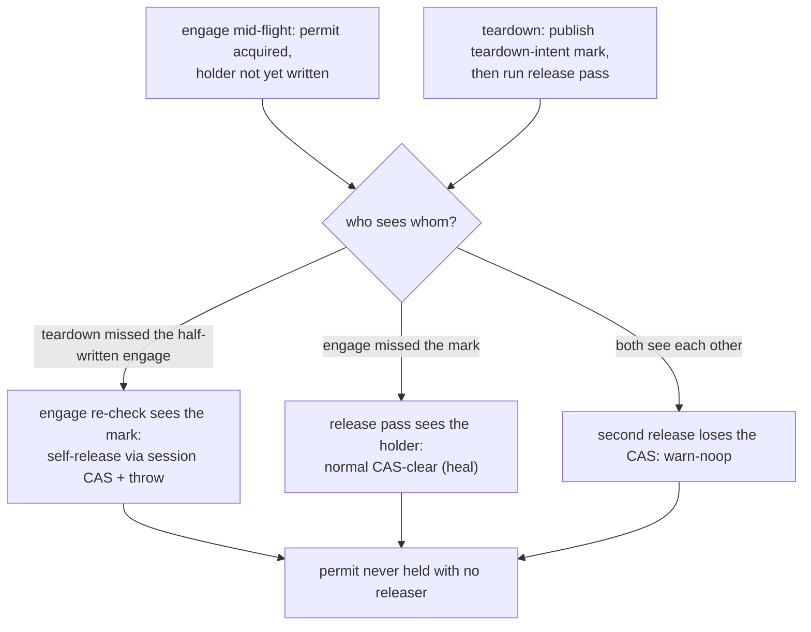

<!-- workflow-sha: 3e9c22298dfe68d2980646704850c781f8af88d5 -->
# Track 7: Concurrency hardening — mutex permit handshake and the freezer gate (D7)

## Purpose / Big Picture
After this track, a connection-pool teardown of a session holding an open schema
transaction never wedges DDL until restart, and a schema commit never turns an
operator freeze into a database-wide read outage.

<!-- Reserved for Move 2 — ADDED/MODIFIED/REMOVED triad. Empty until Move 2 lands. -->

Harden the metadata-write mutex against pool-teardown wedges with a session-keyed
compare-and-clear release, a `(session, ordinal, thread)` holder record,
owner-thread-only teardown, and the Dekker engage/teardown handshake; and make a
schema commit never park inside the four-lock window against an operator freeze with
a freeze-kind taxonomy, a kind-aware gate at the loop-top and park-decision sites, and
the operator-arm cut-and-unpark. This is the design's hardest concurrency work, and it
builds on the mutex primitive (Track 3) and the schema-carrying commit (Track 4).

## Progress
- [ ] Review + decomposition
- [ ] Step implementation
- [ ] Track-level code review
- [ ] Track completion

## Surprises & Discoveries
<!-- Continuous-log. Empty at Phase 1. -->

## Decision Log
<!-- The track-canonical live decision carrier (D7). Seeded from the frozen
design.md D-records this track owns. -->

#### D7 (lifecycle / permit-handshake facet): The mutex has exactly one releaser and never wedges
- **Alternatives considered**: a `ReentrantLock` (a dead or reaped owner could never release it — a permanent wedge); a bare `Semaphore` (its unconditional `release()` lets any thread admit a second schema tx); a thread-owned lock (turns `pool.close()` of a held schema tx into a DDL wedge until restart, rejected by the assignee); the passes-7/8 cross-thread reap protocol (each fix surfaced the next thread-confinement compound and taxed every transaction's normal path — withdrawn to YTDB-1114).
- **Rationale**: the mutex is a `Semaphore(1)` whose authoritative ownership record is `(owning session, acquire ordinal, acquiring thread)`. The session is the release key (a session-keyed compare-and-clear releases only if this session still owns the permit); the acquire ordinal distinguishes this acquisition from a later one so the permit is never released twice; the thread member is engage-guard and diagnostic only, never part of the release key, precisely because the one legitimate foreign releaser (a pool shutdown running the owning session's own teardown) runs on a different thread. Teardown is owner-thread-only for every tx-scoped resource. A Dekker store-then-load handshake — a volatile teardown-intent mark published at `realClose()` entry before the release pass, and an engage that writes the holder then re-checks the mark — closes the mid-flight window where an engage is caught with the permit acquired but the holder not yet written.
- **Risks/Caveats**: the session-side record carrying the acquire ordinal must survive `rollbackInternal`'s `clear()` and `close()`'s field wipes until the outermost `finally` runs the release; wiped early, the owner's own release reads no ordinal and the mutex wedges. The teardown-intent mark must be a dedicated volatile flag, not a hoisted `STATUS.CLOSED`, because teardown runs rollback before it sets CLOSED and an early CLOSED would trip `checkOpenness` inside teardown's own rollback. The release `finally` must warn-noop on a losing CAS, never throw (a throw masks the owner's real exception). A commit-phase zombie is excluded structurally by the whole-commit `SchemaShared.lock` scope, not by `checkOpenness` (which is a best-effort early cap with no happens-before edge).
- **Implemented in**: this track
- **Full design**: design.md §"Mutex lifecycle and the permit handshake"

#### D7 (freezer-gate facet): A schema commit never turns a freeze into a read outage
- **Alternatives considered**: one undifferentiated freeze gate (a schema commit parked inside the four-lock window converts the freeze into a total read outage); any-freeze keying (aborts DDL against routine transient quiesces — synch, incremental backup, index rebuild); throw-mode-only keying (lets a park-mode backup freeze re-create the outage); a separate pre-call probe before `startTxCommit` (sits outside the entrant/freezer handshake, so a freeze in the probe-to-entry window still parks the commit inside the lock window); check-and-back-off (release all four, park, retry — rejected as fragile).
- **Rationale**: a freeze-kind taxonomy recorded at the five registration sites splits an operator freeze (long-lived, admin-initiated) from a transient internal quiesce. A kind-aware gate — the schema-commit variant of `startOperation`'s check — is evaluated at both the freezer's loop-top throw site and its park-decision site (immediately before the park), so the schema-commit entrant parks only when every active freeze is transient and throws `ModificationOperationProhibitedException` with zero locks held against an operator freeze. The operator-kind arm of `freezeOperations` cuts and unparks the waiting list after its increment, so an already-parked entrant wakes, re-evaluates, and throws rather than staying parked for the operator freeze's whole duration. The kind-aware park-decision check closes the engage-during-enqueue race (including the case where the operator-arm cut fires before the entrant has enqueued). Data commits keep today's gate semantics.
- **Risks/Caveats**: the gate must throw strictly before the freezer depth increment (else the depth and count leak into a storage-wide freeze hang) and sit, with `startTxCommit`, outside the rollback-paired try (else a depth-0 throw unwinds through an unconditional `endOperation` whose own exception masks the gate throw); it lands on the frontend-commit path only. The in-window gate stays the authoritative backstop for a freeze engaging after the write lock is held; the entry probe and the timeout re-probes are best-effort early exits. The loud failure is asserted by exception type, not a generic "loud error" (a bare assertion would pass the masked `IllegalStateException` the design rules out).
- **Implemented in**: this track
- **Full design**: design.md §"The freezer gate"

#### I-C3 (scope decision): Tx-scoped resources are torn down only on the owning thread
- **Alternatives considered**: cross-thread reaping of a stranded transaction (out of scope for v1 → YTDB-1114).
- **Rationale**: every tx-scoped resource (the mutex, the freezer engagement, the D19 lock, the `tsMin` holder accounting, the commit-local allocator) is released only on the owning thread. A stranded transaction leaks its pin, the existing YTDB-550 monitor reports it, and a wedged owner keeps the mutex so DDL stays loudly unavailable until restart. The one legitimate cross-thread caller, pool-shutdown `close()` of a checked-out session, runs the owning session's own teardown, so the handshake's guard matches and the mutex heals.
- **Risks/Caveats**: reclamation of a genuinely stranded transaction is YTDB-1114's job (an identity-keyed snapshot registry with lease-based stranding detection), never touching tx-private state from a foreign thread; this track does not attempt it.
- **Implemented in**: this track (honoring the scope boundary; no new reaper)
- **Full design**: design.md §"Mutex lifecycle and the permit handshake"

## Outcomes & Retrospective
<!-- Continuous-log. Empty at Phase 1. -->

## Context and Orientation
Track 3 introduced the `MetadataWriteMutex` `Semaphore(1)` with its engage point, the
same-thread loud-reject, and a normal release in the outermost teardown `finally`.
What it did not handle is abnormal termination: a connection-pool `close()` of a
session holding an open schema transaction. `pool.close()` is one-shot with no retry,
and a session's `checkOpenness` gate refuses the owner's commit or rollback once the
session reads CLOSED, so a naive design can leave the permit held with no releaser and
wedge every later DDL transaction.

The freezer (`OperationsFreezer`) is the commit path's fifth synchronization object,
engaged lock-free and not part of the lock order. Today it is one undifferentiated
gate: a freeze raises a request count, and a write operation that starts while the
count is positive parks (or throws, fixed at freeze registration). A schema commit
that parked on the freezer while holding all four locks would convert the freeze
window into a total read outage. The five freeze registration sites are the operator
filesystem-snapshot freeze plus the transient self-freezes (`doSynch`, incremental
backup, the backup segment cut, index rebuild).

This track depends on the mutex primitive (Track 3) and the schema-carrying commit and
its four-lock order (Track 4). It is the design's hardest section; tests must pin the
exact thread interleavings, because the properties are caught only unreliably.

## Plan of Work
Replace the mutex's normal-only release with the full lifecycle: the
`(session, ordinal, thread)` holder record written at acquire, the session-keyed
compare-and-clear release, owner-thread-only teardown for every tx-scoped resource, and
the Dekker engage/teardown handshake (a volatile teardown-intent mark at `realClose()`
entry before the release pass; the engage writes the holder then re-checks the mark and
self-releases-and-throws on a marked session). Ensure the session-side ordinal record
survives the field wipes until the outermost `finally`. Make the foreign-thread teardown
heal read the ordinal from the volatile holder, the same-thread `finally` read it from
the surviving session record. Add the freeze-kind taxonomy at the five registration
sites, the kind-aware gate at the loop-top throw site and the park-decision site
(re-evaluated on every unpark, before the depth increment, outside the rollback-paired
try), and the operator-arm cut-and-unpark.

Ordering constraints: the freeze-kind taxonomy must publish before the `freezeRequests`
increment so the park-decision read sees an engaging operator freeze; the gate must
throw before the depth increment; the holder write must precede the engage's mark
re-check; the release must warn-noop, never throw, from the teardown `finally`.

## Concrete Steps
<!-- Phase A placeholder. -->

## Episodes
<!-- Continuous-log. Empty at Phase 1. -->

## Validation and Acceptance
- `pool.close()` of a borrowed session holding an open schema transaction releases the
  mutex and the next DDL proceeds without a restart; the owner's `finally` racing the
  pool teardown on the same session releases exactly once and the loser warn-logs;
  `pool.close()` racing the engage itself at each interleaving point either aborts the
  transaction loudly with the permit released or completes the heal, never a held permit
  with no releaser (I-handshake-1).
- A stranded schema transaction is reported by the monitor and no foreign thread mutates
  tx-private state; pool shutdown of a checked-out session heals the mutex via the
  owning-session teardown (I-C3).
- One case per freeze window (I-freezer-1): an operator park-mode freeze pre-engaged →
  the schema commit throws `ModificationOperationProhibitedException` by type with zero
  locks held and reads flow; an operator freeze engaging mid-entry (including the cut
  firing before the entrant enqueues) → throw at the park-decision check, never parked;
  an operator freeze layered over an in-flight transient quiesce the commit is parked
  behind → the commit wakes via the operator-arm cut and throws within the wake bound,
  never parked for the operator freeze's duration; an in-flight transient quiesce only →
  brief park, commit succeeds; a data write vs a throw-mode freeze → loud
  `ModificationOperationProhibitedException`, behavior unchanged.

<!-- Phase A placeholder for per-step EARS/Gherkin lines. -->

<!-- Reserved for Move 3 — EARS or Gherkin acceptance lines used
verbatim as test method names. Empty until Move 3 lands. -->

## Idempotence and Recovery
<!-- Phase A placeholder. -->

## Artifacts and Notes
<!-- Continuous-log (rare). Often empty. -->

## Interfaces and Dependencies
- **In scope**: the mutex lifecycle (the `(session, ordinal, thread)` holder, the
  session-keyed compare-and-clear, owner-thread-only teardown, the Dekker
  engage/teardown handshake, the volatile teardown-intent mark at `realClose()`); the
  freeze-kind taxonomy at the five registration sites; the kind-aware gate at the
  loop-top and park-decision sites; the operator-arm cut-and-unpark; the
  `DatabaseSessionEmbedded` teardown wiring; interleaving stress tests.
- **Out of scope**: the mutex engage and normal release (Track 3); the four-lock order
  and the schema-carrying commit (Track 4); cross-thread reaping of a stranded
  transaction (YTDB-1114).
- **Inter-track dependencies**: depends on Track 3 (the mutex primitive and engage it
  hardens) and Track 4 (the schema-carrying commit and the four-lock window the freezer
  gate protects). No downstream track depends on this one's output; genesis (Track 8)
  exercises the commit path at bootstrap without hitting these edge cases.
- **Signatures**: the mutex holder record `(owning session, acquire ordinal, acquiring
  thread)`; `MetadataWriteMutex.releaseFor(session, ordinal)` session-keyed CAS; the
  freeze-kind flag at the five registration sites; the kind-aware gate predicate in
  `OperationsFreezer`.

