# YTDB-382 Transactional Schema — Research Log

The durable Phase-0/1 research log for YTDB-382 (make schema changes
transactional). An append-only working ledger in the canonical research-log
sections: `## Initial request` (the verbatim aim), `## Surprises &
Discoveries` (codebase realities surfaced during exploration, including the
adversarial review findings), `## Decision Log`, `## Open Questions`, and
`## Adversarial gate record`. This file is a research scratchpad under
`_workflow/` and is removed in the Phase 4 cleanup commit with the rest of the
directory; it is not a stamped plan artifact.

Findings are numbered `F<n>`, decisions `D<n>`, open questions `Q<n>` so later
entries can reference earlier ones. The sections keep their working order
(surprises before the decision log); only the headings are canonical. The
`## Baseline and re-validation` section is omitted: YTDB-382 is a database
feature, not a workflow-modifying branch.

---

## Initial request

YTDB-382 (corrected description, confirmed by the assignee 2026-06-03): today
YouTrackDB refuses schema updates inside a transaction. Two consequences:

1. Schema-change atomicity is enforced per property, so a migration triggers a
   large number of storage writes and runs slowly.
2. Not being able to run schema changes in a transaction pushes complexity into
   the client-side migration logic.

Target: make the schema fully transactional. Fresh start on the
`transactional-schema` branch — no prior branch to inherit (Andrii Rodionov's
earlier work is dropped).

---

## Surprises & Discoveries

### F1 — The whole schema is a single record
`SchemaShared` holds live state in memory (`classes`, `collectionsToClasses`,
`properties`, `collectionCounter`, `blobCollections`) and serializes all of it
into one `EntityImpl` at `identity` via `toStream` (`SchemaShared.java:644`).
Reads go through a lazily-rebuilt `ImmutableSchema snapshot`, invalidated by
`forceSnapshot` (`SchemaShared.java:218`).

### F2 — Save fires on the outermost write-lock release (root of the perf cost)
Every mutation does `acquireSchemaWriteLock` → mutate maps →
`releaseSchemaWriteLock`. The save fires only when `modificationCounter == 1`,
the outermost release (`SchemaShared.java:423`). A nested composite op saves
once, but each *top-level* op saves once. A 50-property migration is 50
full-schema rewrites, each its own micro-transaction. This is the
"property-level atomicity / many storage writes" the issue describes.

### F3 — `saveInternal` forbids an active user tx and opens its own micro-tx
`SchemaShared.java:817`: throws `SchemaException` if `tx.isActive()`, then runs
`session.executeInTx(t -> toStream(session))` (its own commit), then
`forceSnapshot()`.

### F4 — A second, explicit tx guard on class drop
`dropClass` / `dropClassInternal` (`SchemaEmbedded.java:373,417`) throw
`IllegalStateException("Cannot drop a class inside a transaction")`. Drop also
deletes all records in the class collections, drops its indexes, and drops the
collections.

### F5 — Structural storage ops run in their own atomic operation, outside the user tx
Creating a class allocates physical collections: `createCollections` →
`session.addCollection` → `AbstractStorage.addCollection` (`:1441`) →
`atomicOperationsManager.calculateInsideAtomicOperation(...)` under the storage
state write lock. That is a self-contained, immediately-durable WAL operation,
not part of the user transaction. `dropCollectionInternal` and index
create/drop behave the same way. Consequence: a rolled-back "create class"
leaves an orphaned physical collection unless allocation is deferred to commit
or orphans are reclaimed on abort.

### F6 — Schema is shared across all sessions on a storage (no per-session view)
`SchemaShared` is "shared by all database instances that point to the same
storage." Mutations hit a single shared structure under a RW lock. There is no
per-session transactional view of the schema today, so isolation of
uncommitted schema changes is a net-new capability.

### F7 — Commit already holds the read lock and runs in one atomic operation
`AbstractStorage.commit` (`:2221`) takes `stateLock.readLock()` (`:2285`) and
performs the whole commit inside `frontendTransaction.getAtomicOperation()` —
record-position allocation, `commitIndexes`, etc. Structural ops (e.g.
`addCollection`, `:1444`) instead take `stateLock.writeLock()`. So the
read-lock-on-commit is what allows concurrent commits while excluding
structural change.

### F8 — Storage already exposes `doAddCollection(atomicOperation, …)` primitives
The structural primitives take an `AtomicOperation` parameter (`:1455`,
`:5010`). Today they are invoked inside their own
`calculateInsideAtomicOperation`. At commit they could be driven by the
commit's atomic operation, making collection create/drop atomic with the
record writes and WAL-rolled-back together on crash.

### F9 — At least two metadata records, not one
Schema lives in the schema record (F1). Index definitions live in a separate
index-manager record (`getIndexMgrRecordId` / `setIndexMgrRecordId`,
`indexManagerIdentity` in `IndexManagerEmbedded`). Commit-time reconciliation
must diff both records, not just the schema record.

### F10 — `makeThreadLocalSchemaSnapshot` is a stability snapshot, not isolation
`MetadataDefault:78` pins one `ImmutableSchema` for the duration of a nested
operation via an `immutableCount` counter. It freezes the schema view during
an operation; it does not isolate a session's *uncommitted* schema changes.
Real per-session isolation (F6) is still net-new, but this is the seam where a
tx-local schema view would attach.

### F11 — Storage `stateLock` is a per-storage `ScalableRWLock`
`AbstractStorage:341`. Commit takes `readLock` (`:2285`) so commits run
concurrently; structural ops (`addCollection` and friends) take `writeLock`.
The read/write split is exactly the concurrent-commit-vs-structural-change
boundary D1's commit-time write-lock upgrade rides on.

### F12 — Existing schema/index locks are per-operation, not tx-scoped
`SchemaShared.lock` and `IndexManagerAbstract.lock` are both
`ReentrantReadWriteLock`, acquired and released inside a single operation with
nesting counters (`modificationCounter` / `writeLockNesting`). The index
manager's `acquireExclusiveLock(FrontendTransaction)` (`:188`) takes a tx
parameter but does not use it for lock lifetime; it releases at operation end
(`:201`), not at tx end. A schema lock held from first-mutation to commit (D5)
is therefore a new lock lifetime, not a repurposing of an existing one. Hot
schema reads go through the immutable snapshot (`getImmutableSchemaSnapshot`),
not the lock, so a dedicated schema-writer mutex would not block readers.

### F16 — File create/delete is already WAL-revertible inside an atomic operation
The make-or-break fact for structural rollback, and it is GREEN. On the disk
engine, `AtomicOperationBinaryTracking.addFile`/`deleteFile` perform **no
physical I/O** — `addFile` only books a name→negative-id reservation and buffers
a `FileChanges{isNew}`; `deleteFile` only records the id. All physical action
plus the `FileCreatedWALRecord` / `FileDeletedWALRecord` happen in
`commitChanges`, logged atomically with `AtomicUnitEndRecord`. On rollback,
`AtomicOperationsManager.endAtomicOperation` skips `commitChanges` entirely
(invariant asserted at `:338`–`:341`: "a rollback must perform no physical
write"). Crash recovery (`AbstractStorage.restoreFrom`, `:5512`) is redo-only
and applies a unit only if its end record is present — all-or-nothing. So
collection/index create AND drop can run inside the transaction's atomic
operation (the `commit` pattern, `:2284`) and roll back or replay cleanly with
no orphaned or missing files. The `doAddCollection`/`dropCollectionInternal`
primitives already take an `AtomicOperation` parameter; today they merely wrap
it in their own `calculateInsideAtomicOperation`.

**Corrected by F55 (2026-06-10): the "replays cleanly" half is false in one window.**
Rollback and crash-before-end-record are sound as stated, but recovery of a *committed*
file-creating unit breaks when the crash lands between the end record becoming durable
and the completion of the physical apply phase: page records precede the
`FileCreatedWALRecord`s inside the unit, bookings are not persisted, and
`restoreAtomicUnit` aborts on the first page record of a never-created file — and
`restoreFrom` then discards every later committed unit. The F55 lazy-consult replay fix
(a prerequisite track) restores the all-or-nothing property this entry claims; until it
lands, F16's guarantee is conditional.

### F17 — `truncateFile` is NOT crash-safe / not WAL-revertible
`AtomicOperationBinaryTracking.commitChanges` flags `truncateFile` as unsafe
(`:1009`–`:1014`); it is the one cache path outside the WAL guarantee. A
"logical truncate" (empty a collection, keep its files) or "clear pages and
re-hand to a new collection" design would need a new WAL-logged
clear-and-reinit operation — file create+delete is safe, file truncate is not.

### F18 — Collection rename renames files OUTSIDE the WAL (not revertible)
`PaginatedCollectionV2.setCollectionName` renames all four files via
`writeCache.renameFile` (`WOWCache:2116`), which mutates the name maps and
renames the OS file directly with no `AtomicOperation` — the only physical
collection mutation that is not crash-revertible. Reached on class rename via
`SchemaClassImpl.renameCollection` (`:1392`, prod caller
`SchemaClassEmbedded.setNameInternal:311`, PSI-confirmed).

### F19 — Physical model and existing reuse
A collection owns four disk-cache files: `.pcl` (data), `.cpm` (position map),
`.fsm` (free-space map), `.dpb` (dirty-page bitset) — `PaginatedCollectionV2`.
An index owns `.cbt` + `.nbt` (+ a histogram file for B-tree engines).
Intra-collection page/position reuse already exists (`.fsm` segment tree +
position map + record GC). Collection ids are already recycled (first-null-slot
scan, `AbstractStorage:4990`). Index page reuse across a *different* index is
infeasible — structural pages are bound to key serializer/types/size at
`create`, and engine types differ; the safe path is delete+create.

### F20 — Index metadata and per-tx index-change tracking are already tx-compatible
The index-manager record holds a link set `CONFIG_INDEXES` ("indexes") of
per-index entity RIDs; both ride the transaction as normal record operations
(`IndexManagerAbstract.addIndexInternalNoLock:212`, `IndexAbstract.save:718`).
Per-tx index changes are keyed by index **name** in
`FrontendTransactionImpl.indexEntries` (a `HashMap<String, …>`, `:102`), and
`FrontendTransactionIndexChanges` captures the `Index` object in memory. The
enqueue path (`IndexOneValue.put` / `addIndexEntry:292`) never touches the
physical engine or `indexId`. So inserting rows into a class indexed by an index
created in the *same* tx records changes without NPE — the engine is read only
at commit-apply time. The user's "new indexes not stored till commit" worry is
not a tracking problem.

### F21 — But commit-apply assumes the engine already exists
`lockIndexes` (`AbstractStorage:2297`) and `commitIndexes` → `doPut`/`doRemove`
(`:2455`, `IndexMultiValues:147`) resolve the engine by `indexId`; a brand-new
index has `indexId == -1` and fails at `lockIndexes` first. So a same-tx new
index can only commit if its engine is created (valid `indexId`) **before**
`lockIndexes`. Also `IndexManagerEmbedded.createIndex` currently forbids an
active tx (`:306`, `"Cannot create a new index inside a transaction"`) — a third
tx guard alongside F3 (`saveInternal`) and F4 (`dropClass`) to rework.

### F22 — Engine-create and population are not commit-driven today
`addIndexEngine` (`AbstractStorage:2738`) opens its own
`calculateInsideAtomicOperation` and takes `stateLock.writeLock()` (`:2752`,
`:2757`) — it takes no `AtomicOperation` parameter. Population (`fillIndex` →
`indexCollection:962`) runs on a **copied session** in its own batched
transactions (`session.copy()` + `executeInTxBatchesInternal:989`-1008),
reading committed rows via `browseCollection`. Neither joins the commit's atomic
operation. Both must be refactored to accept and reuse the commit's single
`AtomicOperation`, and the `stateLock` read-lock-at-commit (`:2285`) vs
write-lock-in-`addIndexEngine` nesting reconciled. Mechanical but non-trivial.

### F23 — The planner selects indexes by definition only, and an engine-less index throws
SQL index selection (`SelectExecutionPlanner.handleClassAsTargetWithIndex` /
`findBestIndexFor`, `:2674`–`:2952`) chooses an index from the schema
definition: it checks `canBeUsedInEqualityOperators()` (hard-coded `true` for
`IndexUnique`/`IndexNotUnique`) and key-condition matching, never `getIndexId()`
or engine existence. So a tx-created index (definition in the tx-local
snapshot, `indexId == -1`) would be selected. Reading it then throws
`IllegalStateException` via `getIndexEngine`→`checkIndexId`
(`AbstractStorage:3077`)→`InvalidIndexEngineIdException`→`doReloadIndexEngine`
(`IndexAbstract:221`)→`loadIndexEngine` returns -1. The throw fires as early as
cost estimation (`IndexSearchDescriptor.cost`→`index.getStatistics`). Loud
failure, not silent wrong results. Two read paths already do the right thing:
(a) an already-built index merges physical results with the tx's pending
`FrontendTransactionIndexChanges` (`IndexOneValue.getRids`/`streamEntries` +
`PureTx*` spliterators); (b) a full class scan overlays tx record changes —
`RecordIteratorCollection` interleaves tx-new records and `executeReadRecord`
checks `isDeletedInTx`/tx `getRecord` before storage
(`DatabaseSessionEmbedded:1099`–`1129`).

### F24 — Index entries already commit the resolved RID (no remap needed)
The temp→persistent RID change at commit is handled correctly today, by
reference + lazy read. Index-change entries store the live `Identifiable` —
either the `EntityImpl` or its `ChangeableRecordId` (`ClassIndexManager:389`,
`:262`); `TransactionIndexEntry.value` keeps that reference, not a copy. The
commit resolves each new record's RID in place during the position-allocation
loop (`AbstractStorage:2300`–`2359`, `setCollectionAndPosition:2350`), then
`commitIndexes` (`:2375`) → `applyTxChanges` reads `op.getValue().getIdentity()`
lazily (`:2482`) — after resolution — so the persistent RID is what gets
written to the index. Extends cleanly to provisional collection ids (D2):
`setCollectionAndPosition` resolves collection id + position together, and the
lazy `getIdentity()` picks up the fully-resolved RID. Invariant to preserve:
RID resolution must run before `commitIndexes`. Orthogonal pre-existing
contract: `applyTxChanges` asserts a RID-valued index *key* is persistent at
apply (`:2479`) — relevant only to link indexes; not introduced here.

**Verified (2026-06-03, second adversarial pass).** The "extends cleanly" claim
holds end-to-end for both sides of an index entry, because the tracking machinery
reacts to *identity changed*, not *position changed*:

- **Value side** confirmed as above — lazy `getIdentity()` at `applyTxChanges:2482`,
  read after the position loop patches the RID.
- **Key side** (a link index keys by the linked RID). `setCollectionAndPosition`
  (`ChangeableRecordId:121`) CASes the whole new RID and fires
  `fireBeforeIdentityChange`/`fireAfterIdentityChange`;
  `FrontendTransactionIndexChanges.onBeforeIdentityChange`/`onAfterIdentityChange`
  (`:115`–`:132`) remove then re-insert the `changesPerKey` TreeMap entry, bridged
  by object identity, so the key's sort position is corrected after the collection
  id + position change. Wired when the key `canChangeIdentity()`
  (`FrontendTransactionImpl:314`–`:318`); `recordIndexOperations` is re-keyed the
  same way (`:1206`/`:1229`).

Tighter ordering than "before `commitIndexes`": the provisional→real resolution
must land before the position loop dereferences the collection id at
`doGetAndCheckCollection` (`:2321`). The existing `collectionOverrides` seam
(`:2239`/`:2276`/`:2317`) is where it lands — see F42.

### F25 — Index objects are thin storage-backed handles, not in-memory structures
`IndexAbstract` holds `indexId` (`:86`, `-1` until built — a handle into
storage's engine array), a `storage` reference (`:82`), `collectionsToIndex`
(`:89`), the per-index entity RID `identity` (`:92`), and the definition. The
index *data* (BTree entries) lives in the storage engine resolved by `indexId`,
not in the object. `IndexManagerAbstract` holds only two flat in-memory maps —
`indexes` (name → Index, `:49`) and `classPropertyIndex` (class+property →
indexes, `:47`) — plus the manager record RID (`:54`). There is no
self-contained in-memory index content to copy, unlike `SchemaShared`'s class
structures. This is why the index-side tx-local view is a definition overlay,
not a deep copy (D15).

### F15 — A class has no stable on-disk identity; collections do
`SchemaClassImpl.toStream` (`:571`–`:600`) serializes `name`, `description`,
`defaultCollectionId`, `collectionIds`, `properties`, `superClasses`,
`customFields` — no class id or UUID. The on-disk class key is its name. By
contrast, `collectionIds` are stable storage-assigned numeric ids, and the
in-memory `collectionsToClasses` map is keyed by collection id. Abstract
classes carry `collectionIds = {-1}` (`NOT_EXISTENT_COLLECTION_ID`). So the
stable structural identity in the schema is the collection id, not the class
name.

### F14 — Reads are uniformly routed through a per-session immutable snapshot
`MetadataDefault` is per-session (`DatabaseSessionEmbedded:426`) and owns the
`immutableSchema` snapshot plus its `immutableCount` nesting counter.
`SchemaProxy` is also per-session: it wraps the shared `SchemaShared`, pins the
thread-local DB, then delegates. Every data-path class resolution goes through
`getMetadata().getImmutableSchemaSnapshot()` (`DatabaseSessionEmbedded:949`,
`:994`, `:1038`, `:1073`; `EntityImpl:689`, `:737`), and
`SchemaShared.makeSnapshot(session)` (`:194`) builds `new ImmutableSchema(this,
session)` cached in `snapshot`. The per-session `immutableSchema` is the exact
seam where a tx-local schema view attaches: redirect the snapshot source and
the `SchemaProxy` write/read delegation to a tx-local structure while a
schema-changing tx is open, leaving the shared `SchemaShared` at committed
state.

### F13 — Sessions are thread-bound via an `activeSession` ThreadLocal
`assertIfNotActive` (`DatabaseSessionEmbedded:3377`) gates session use on
`activeSession.get()`, a `ThreadLocal<Boolean>`. A session must be activated on
the current thread to be used, so an active transaction is single-threaded in
practice. A thread-owned `ReentrantLock` held across the tx body is sound
(D7's primitive at the time of this survey; the settled primitive is the
F96 `Semaphore(1)` + session-keyed release guard, which this thread-binding
fact still supports via the F105 engage predicate — bounded per F107).
Caveat: a session detached and re-activated on a different thread mid-tx would
strand the lock on the original thread; v1 assumes the same-thread
begin→commit lifecycle the thread-local already enforces for active use.

### F26 — A fourth tx guard: `dropIndex` runs its own micro-tx
`IndexManagerEmbedded.dropIndex` (`:457`) throws
`IllegalStateException("Cannot drop an index inside a transaction")` (`:459`),
then runs the whole drop inside its own `session.executeInTxInternal(...)`
(`:462`): acquire exclusive lock, `removeClassPropertyIndexInternal`,
`idx.delete(transaction)`, `indexes.remove`. Index drop is its own
micro-transaction outside any user tx, the same shape as `saveInternal` (F3).
This is a fourth tx guard alongside F3 (`saveInternal`), F4 (`dropClass`), and
F21 (`createIndex`); the earlier "three guards to remove" list missed it.
Making index deletion transactional means removing this guard and reworking
`dropIndex` into a metadata-only mutation whose engine drop defers to commit.
The engine-drop path is already commit-safe: `deleteIndexEngine`
(`AbstractStorage:3046`) runs `engine.delete(atomicOperation)` inside
`executeInsideAtomicOperation`, reaching `BTree.delete` and
`deleteFile(atomicOperation, …)` (`BTree.java:863`), which is WAL-revertible
(F16). So index **deletion** is transactional under the overlay (D15) once the
guard is gone. Third pass (F46): `addCollectionToIndex`/`removeCollectionFromIndex`
(`IndexManagerEmbedded:99`/`:131`, `executeInTxInternal:114`) are a fifth and sixth
self-commit path, reached transitively from class-structural ops via the polymorphic
ripple, not direct index ops.

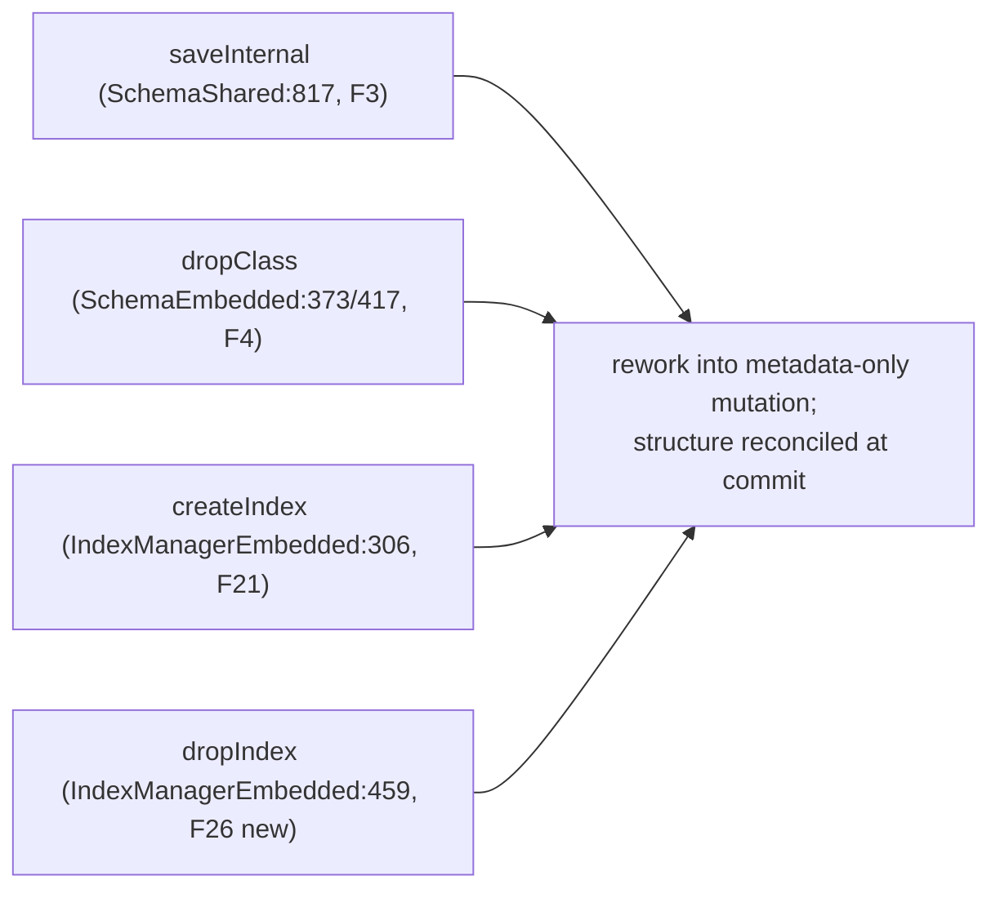
```mermaid
flowchart LR
  G3["saveInternal (SchemaShared:817, F3)"]
  G4["dropClass (SchemaEmbedded:373/417, F4)"]
  G21["createIndex (IndexManagerEmbedded:306, F21)"]
  G26["dropIndex (IndexManagerEmbedded:459, F26 new)"]
  G3 --> R["rework into metadata-only mutation;<br/>structure reconciled at commit"]
  G4 --> R
  G21 --> R
  G26 --> R
```

### F27 — Index engines are name-keyed; no first-class rename; drop+create costs in-tx acceleration plus a rebuild
No first-class index rename exists: there is no `ALTER INDEX … RENAME` and no
`renameIndex` API (only `IndexHistogramManager` matches "rename" in the index
package). Index engines resolve by name (`indexEngineNameMap`,
`AbstractStorage:6761`), and the physical B-tree files are named by the index
name: `new BTree<>(name, ".cbt", ".nbt", storage)`
(`BTreeSingleValueIndexEngine:80`), with a stable numeric engine id carried
alongside via `setEngineId(id)` (`:82`). A rename that kept the engine and
changed only the name would have to rename those files, which hits the
non-WAL-safe `writeCache.renameFile` path (F18). So D9's "rename = drop+create"
carries a cost the spine did not spell out: inside the renaming tx the new
index has `indexId == -1`, the planner skips it (D13), and queries fall back to
a correct full scan; acceleration returns only after commit rebuilds the engine
(D12, under the exclusive lock).

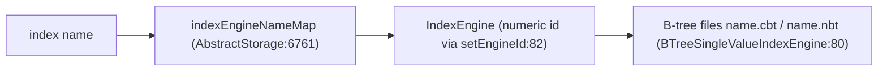
```mermaid
flowchart LR
  N["index name"] --> M["indexEngineNameMap (AbstractStorage:6761)"]
  M --> E["IndexEngine (numeric id via setEngineId:82)"]
  E --> F["B-tree files name.cbt / name.nbt (BTreeSingleValueIndexEngine:80)"]
```

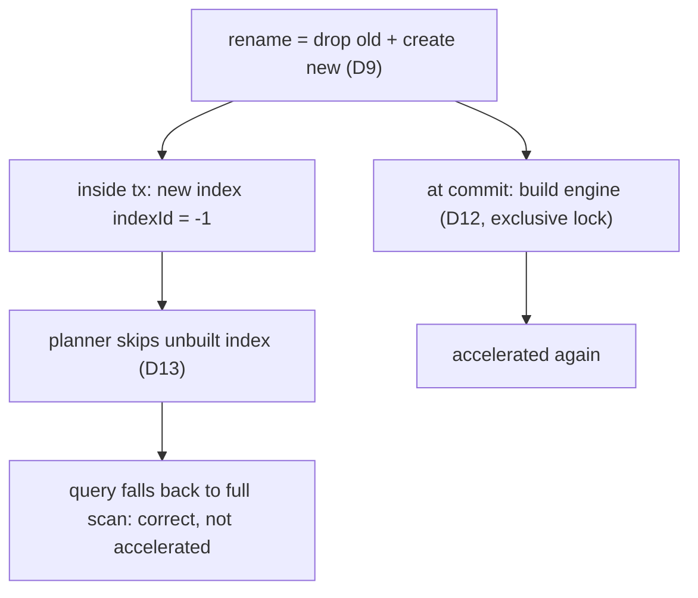
```mermaid
flowchart TD
  R["rename = drop old + create new (D9)"]
  R --> T["inside tx: new index indexId = -1"]
  T --> S["planner skips unbuilt index (D13)"]
  S --> Sc["query falls back to full scan: correct, not accelerated"]
  R --> C["at commit: build engine (D12, exclusive lock)"]
  C --> A["accelerated again"]
```

### F28 — Class rename orphans name-keyed index associations (pre-existing, orthogonal to transactionality)
Renaming a class breaks index-based acceleration today, before any
transactional work. `setNameInternal` (`SchemaClassEmbedded:303`) renames the
collection files but never touches indexes, and `changeClassName`
(`SchemaShared:452`) rekeys only the `classes` map. The planner resolves a
class's indexes through `classPropertyIndex.get(className)`
(`IndexManagerAbstract:99`), keyed by class name, and `IndexDefinition.className`
has no setter (set only at construction or `fromMap`: `PropertyIndexDefinition:49`,
`CompositeIndexDefinition:71`). After `Foo` becomes `Bar`,
`getClassRawIndexes("Bar")` returns nothing: the engine is intact but orphaned
from the class by name, so the planner stops selecting it. D9 calls collection
rename structurally inert and D11 decouples collection names, but neither covers
the class-name to index association. The transactional design must specify how a
class rename re-associates its indexes: re-key `classPropertyIndex` and update
each per-index definition's class name, or drop and recreate the indexes.

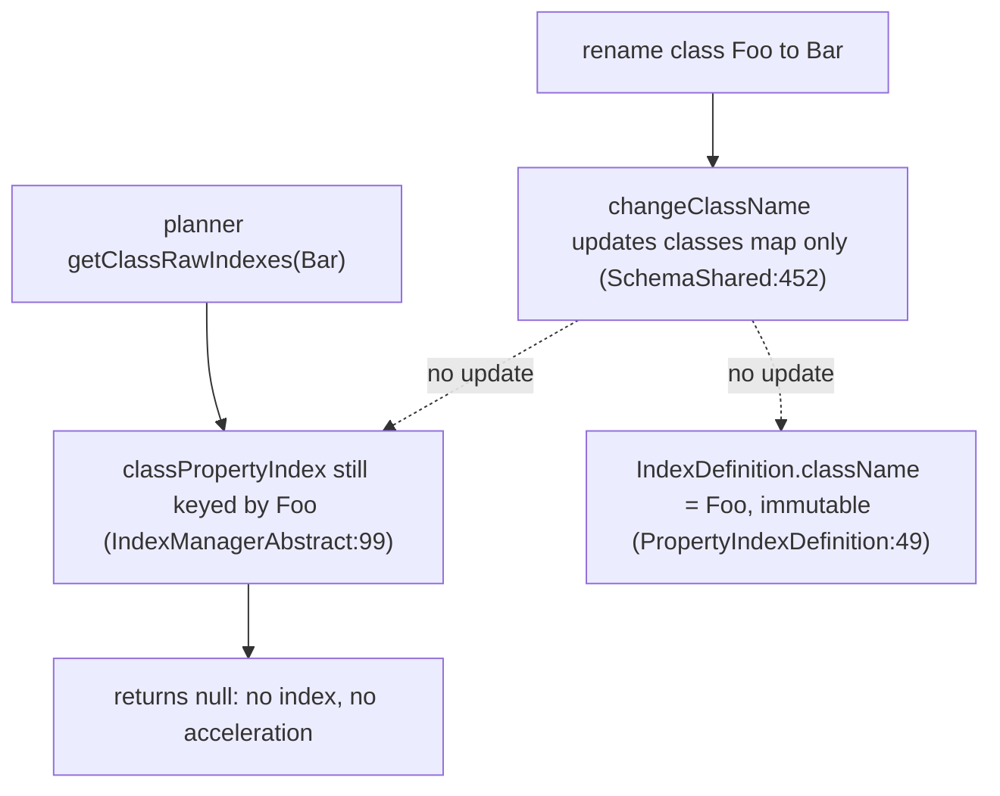
```mermaid
flowchart TD
  REN["rename class Foo to Bar"] --> CN["changeClassName updates classes map only (SchemaShared:452)"]
  CN -. no update .-> CPI["classPropertyIndex still keyed by Foo (IndexManagerAbstract:99)"]
  CN -. no update .-> DEF["IndexDefinition.className = Foo, immutable (PropertyIndexDefinition:49)"]
  PLAN["planner getClassRawIndexes(Bar)"] --> CPI
  CPI --> NUL["returns null: no index, no acceleration"]
```

### F29 — Stable-base-keyed engine files are feasible with no on-disk migration
Feasibility check for making index rename inert (Q11 / F28). Three facts make
it migration-free:

- **The engine config serializer is already extensible.** `CollectionBasedStorageConfiguration.deserializeIndexEngineProperty` (`:1559`)
  reads `indexId` only `if (getVersion(atomicOperation) >= 23 || binaryVersion >= 1)`
  (`:1589`), defaulting otherwise — the canonical version-gated optional-field
  pattern. It also carries an open `engineProperties` string map (`:1537`,
  `:1622`) that a new well-known key extends with no format-version bump.
- **The numeric engine id is already a stable, persisted key.** At reopen,
  `openIndexes` re-slots each engine at its persisted id
  (`indexEngines.set(engineData.getIndexId(), engine)`, `:989`), seeding the
  next-id counter past all persisted ids (`:968`). New ids are monotonic
  appends (`size()`, `:2786`); dropped slots are nulled but never reused. So
  `IndexEngineData.indexId` is load-order-independent.
- **The consumer surface is one seam.** Only `BTree.create` (`:192`–`:193`,
  data file via `getFullName()`, null file via `getName() + nullFileExtension`)
  and `IndexHistogramManager` (`.ixs`, `getFullName()` at `:1800`) turn the
  component name into a file name, both through `StorageComponent.fullName =
  name + extension` (`:96`; `setName` recomputes it, `:135`). Backup and
  export/import tools reference no index file names.

No file migration is needed because no rename path ever changed an index name
(F27/F28), so every legacy index's file name still equals its current logical
name. A persisted physical-file base therefore defaults to `name` for legacy
engines (matches the file on disk) and to the stable id for new engines.

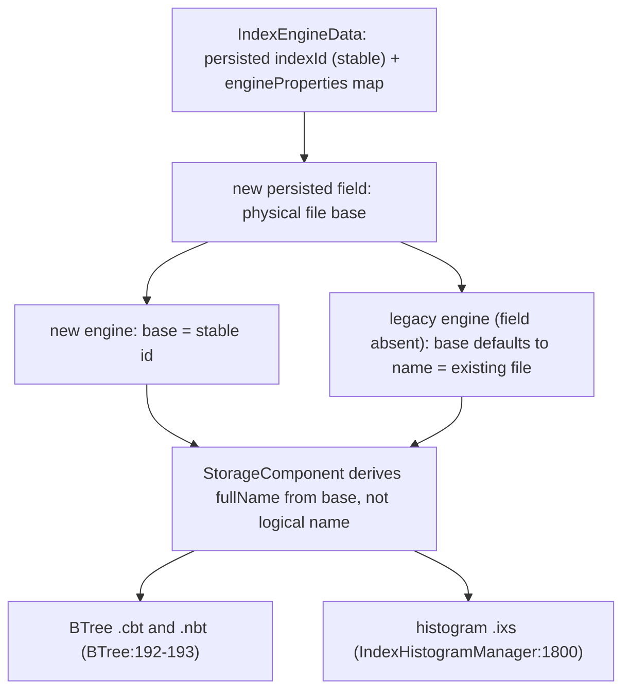
```mermaid
flowchart TD
  EP["IndexEngineData: persisted indexId (stable) + engineProperties map"]
  EP --> BASE["new persisted field: physical file base"]
  BASE --> NEW["new engine: base = stable id"]
  BASE --> LEG["legacy engine (field absent): base defaults to name = existing file"]
  NEW --> SC["StorageComponent derives fullName from base, not logical name"]
  LEG --> SC
  SC --> BT["BTree .cbt and .nbt (BTree:192-193)"]
  SC --> HM["histogram .ixs (IndexHistogramManager:1800)"]
```

### F30 — `IndexDefinition.className`: mutable, not a hash key, composites nest; planner resolves by className not by index name
Investigation of D16's `className` mutability point.

- **Already mutable, low-friction to update.** `className` is non-final
  (`PropertyIndexDefinition:42` protected, `CompositeIndexDefinition:54`
  private) and is rebound during deserialization (`fromMap`, `:218` / `:569`).
- **Never a hash key.** The only definition-holding map is
  `ImmutableSchema.indexes` (`:60`), keyed by index **name** with the
  definition as the value. So in-place `className` mutation cannot corrupt a
  hash bucket; `equals`/`hashCode` participation (`:107`/`:119`, `:439`/`:448`)
  matters only for value comparisons.
- **Composites nest.** `CompositeIndexDefinition` holds
  `List<IndexDefinition> indexDefinitions` (`:52`), each a property definition
  carrying its own `className`. A rename helper must recurse: update the
  composite's `className` plus every nested sub-definition's.
- **Persisted on the entity.** `className` rides `toMap`/`toJson`/`toStream`
  (`:207`, `:506`), so updating it and re-saving the per-index entity (naturally
  dirtied, D6/F20) propagates it.
- **The planner resolves by className, not by index name.**
  `SelectExecutionPlanner` reads `targetClass.getClassIndexesInternal()`
  (`:603`) which goes through `classPropertyIndex.get(className)`
  (`IndexManagerAbstract:99`). Nothing splits an index name on '.' to derive a
  class, and index names are caller-supplied (`SchemaClassImpl.createIndex(iName,
  …)`, `:923`), not engine-generated.

**Consequence — F28's correctness fix is metadata-only and does not require
D16.** On class rename, re-key `classPropertyIndex` (old to new class name) and
update each affected definition's `className` (recursing composites); the index
name and engine files need not change, because the planner never parses the
name. D16's base-keyed files are needed only to make an explicit index-**name**
rename inert (realigning an auto-named `Foo.prop` to `Bar.prop`, or a user
`ALTER INDEX RENAME`), which is cosmetic for correctness since names are not
parsed. So D16 is a capability choice, not a forced consequence of F28.

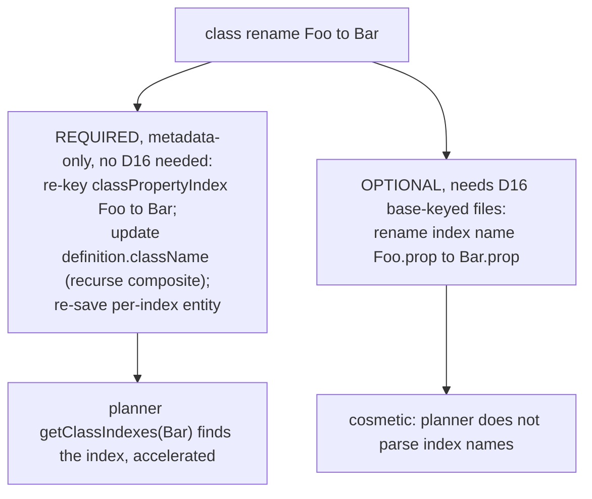
```mermaid
flowchart TD
  REN["class rename Foo to Bar"]
  REN --> REQ["REQUIRED, metadata-only, no D16 needed:<br/>re-key classPropertyIndex Foo to Bar;<br/>update definition.className (recurse composite);<br/>re-save per-index entity"]
  REQ --> OK["planner getClassIndexes(Bar) finds the index, accelerated"]
  REN --> OPT["OPTIONAL, needs D16 base-keyed files:<br/>rename index name Foo.prop to Bar.prop"]
  OPT --> COS["cosmetic: planner does not parse index names"]
```

### F31 — Genesis bootstrap relies on per-op self-commit and no active tx; D1/D7 force it into explicit transactions
The internal-class bootstrap runs inside `createMetadata`
(`DatabaseSessionEmbedded:441`) during session create: `metadata.init` then
`shared.create(this)`, which drives `SecurityShared.create` (`:594`) and the
sibling subsystem creators. `SecurityShared.create` builds the
Identity/OSecurityPolicy/ORole/OUser classes plus the `OUser.name` UNIQUE index
through the normal schema API (`createClass`/`createProperty`/`createIndex`,
inside the helpers — `createClass("OUser", …)` `:883`, the `OUser.name` index
`:899`; `SecurityShared.create` at `:593`), **then** inserts the default roles
and admin/reader/writer users
in `session.executeInTx` blocks (`createDefaultRoles:628`, `createDefaultUsers`).

The class-creation phase runs with **no active tx** — it cannot have one,
because `createIndex` forbids it (F21), and the per-op self-commit
(`saveInternal`, F2/F3) is what materializes each class/collection/index before
the next step. The data-insert phase is a separate tx that runs only after the
classes are already committed. So genesis today is "auto-committing schema ops,
then a data tx."

Interaction with D1/D7/D8:

- **The bootstrap must become tx-aware.** D1 removes per-op self-commit and the
  guards (F3/F4/F21/F26), so `createClass`/`createIndex` at genesis no longer
  materialize a collection or engine until a commit. `SecurityShared.create`
  (and any sibling metadata creators) must wrap schema creation in an explicit
  tx. The session is already active at genesis (`executeInTx` is used there
  today, `:629`), so a tx is available.
- **D7 does not contend at genesis.** Genesis is single-threaded (one creating
  session), so the metadata-write mutex is acquired and released without
  blocking. Its only requirement is that it exists at context-construction time
  (D7 places it on the shared context/storage, built before `createMetadata`),
  not created lazily by a schema op.
- **The tx-local `SchemaShared` seed (D8) must handle the empty/genesis case.**
  The first-ever schema-tx seeds from an empty committed schema and its commit
  writes the first schema record (D14); there is no committed schema to copy.
- **Schema-then-data works in one tx via D3/D2.** Create the class
  (provisional collection id), insert the admin user (temp RID), and the commit
  reconciles structure before record-position allocation (D3), builds the
  `OUser.name` index on the genesis rows (D12), and enforces uniqueness at
  commit-apply (D13). Reads during genesis (a user-exists check) fall back to
  the tx-merged scan because the index is not built yet (D13/F23) — correct.
- **D11 touches the same code.** Internal classes get `minimumCollections = 1`
  and name-prefixed collection names `ouser_<n>` (`SchemaEmbedded:335`–`:342`);
  D11's counter-only naming applies here too.

Net: D7 is benign at genesis; the real work is restructuring the genesis
bootstrap into explicit transaction(s) once per-op self-commit and the tx
guards are removed. Sub-choice resolved by D18: a schema tx committed before
the data tx (two-phase), chosen over a unified genesis tx so the `OUser.name`
index is built before any user insert.

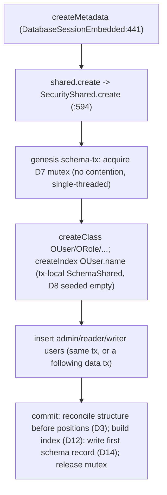
```mermaid
flowchart TD
  CM["createMetadata (DatabaseSessionEmbedded:441)"] --> SC["shared.create -> SecurityShared.create (:594)"]
  SC --> TX["genesis schema-tx: acquire D7 mutex (no contention, single-threaded)"]
  TX --> CL["createClass OUser/ORole/...; createIndex OUser.name (tx-local SchemaShared, D8 seeded empty)"]
  CL --> DATA["insert admin/reader/writer users (same tx, or a following data tx)"]
  DATA --> COMMIT["commit: reconcile structure before positions (D3); build index (D12); write first schema record (D14); release mutex"]
```

### F32 — ClassIndexManager enqueues through an engine-agnostic path; a same-tx engine-less index behaves identically to a built one
On every record write, `ClassIndexManager` resolves the entity's class indexes
via `cls.getRawIndexes()` (`:58`, `:78`, `:421`) and, for each, computes the key
and calls `index.put` / `index.remove` (`addIndexEntry:396`, `addPut:455`).
`IndexOneValue.put` (`:527`) validates the value RID, collates the key, and
calls `transaction.addIndexEntry(this, getName(), PUT, key, rid)` (`:539`): it
records the change in the per-tx `FrontendTransactionIndexChanges`, keyed by
index **name**, and never reads `indexId` or the engine. `IndexUnique` does not
override `put`; it overrides `doPut` (`:52`, the commit-apply path
`storage.validatedPutIndexValue(indexId, …, uniqueValidator, …)`) and
`interpretTxKeyChanges` (`:67`). So uniqueness is enforced at commit-apply,
after the engine exists, and a same-tx put/remove on one key is collapsed first
(`IndexAbstract:747`–`753`), not at enqueue time.

Consequence for a newly-created index with no engine (`indexId == -1`):

- **Writes during the tx are identical to a built index.** The enqueue path is
  engine-agnostic, so tracking entries for a brand-new index never touches the
  missing engine. This confirms F20 from the `ClassIndexManager` side.
- **Uniqueness is deferred to commit-apply.** A UNIQUE new index enqueues
  cleanly; the duplicate check runs at commit via `UniqueIndexEngineValidator`
  once the engine is built (D12).
- **Load-bearing prerequisite (D15).** `ClassIndexManager` only enqueues for
  indexes that `cls.getRawIndexes()` returns, so the D15 overlay must surface
  the tx-created index into that set. If it does not, the tx's own inserts into
  the new index are silently untracked, and the commit-time build scan (which
  covers only already-committed rows, D12) would miss them — a silent
  data-correctness bug, not a loud failure. This is the same coupling D15
  flagged (`getRawClassIndexes` → `getClassRawIndexes`), seen from the write
  side.
- **Writes versus reads.** Writes are always safe (pure enqueue). A direct read
  of the new index during the tx (`getRidsIgnoreTx` → `storage.getIndexValues(indexId,
  …)`, `IndexOneValue:91`) still throws on `indexId == -1` (F23); the planner
  avoids it by skipping unbuilt indexes (D13), which is exactly why genesis is
  two-phase (D18) for the `OUser.name` direct lookup.

**Timing corrected by F66 (2026-06-10): "on every record write" is wrong.** The
translation is batched: record operations accumulate in
`operationsBetweenCallbacks` and `ClassIndexManager` runs at exactly two
points — the outermost commit (`FrontendTransactionImpl.commitInternalImpl:232`,
where it sees the final overlay set, so the engine-agnostic conclusions above
hold) and **every `deleteRecord`** (`:483`), which drains the whole queue early
against the index set of that moment; drained operations are not re-translated
at commit (`:775`). A tx-created index therefore misses entries for every
operation drained before its `createIndex` — the F66 corruption. The F66
re-derivation invariant (D12) is what restores this entry's "identical to a
built index" conclusion for the early-flush shapes.

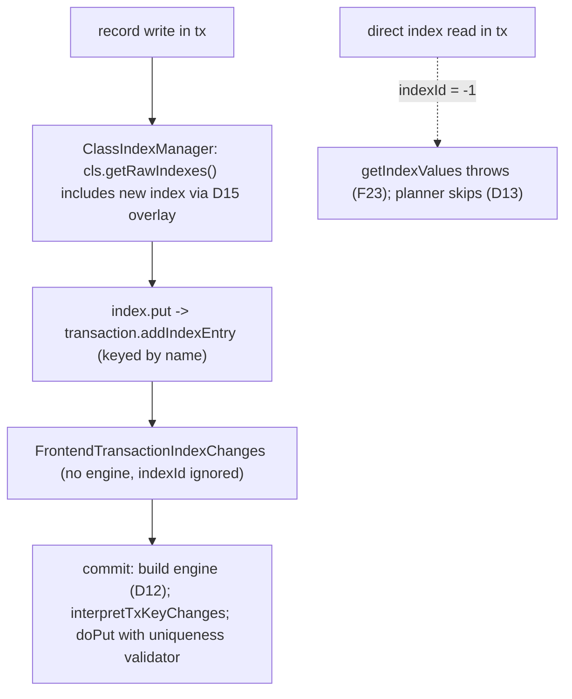
```mermaid
flowchart TD
  W["record write in tx"] --> CIM["ClassIndexManager: cls.getRawIndexes() includes new index via D15 overlay"]
  CIM --> PUT["index.put -> transaction.addIndexEntry (keyed by name)"]
  PUT --> TRK["FrontendTransactionIndexChanges (no engine, indexId ignored)"]
  TRK --> CM["commit: build engine (D12); interpretTxKeyChanges; doPut with uniqueness validator"]
  RD["direct index read in tx"] -. indexId = -1 .-> THR["getIndexValues throws (F23); planner skips (D13)"]
```

### Adversarial review findings (passes 1–12)

An adversarial sub-agent attacked the spine for contradictions, ungrounded
claims, and gaps. F33 and F35 were re-verified against live code; the rest are
logically grounded in the cited entries. A second pass (2026-06-03, same day)
targeted this session's less-reviewed additions (D16–D19, F26–F38) and added
F39–F44, all re-verified against live code. A third pass (2026-06-04) targeted the
interaction seams between D8/F41 (tx-local seed), D14 (per-class records), and D15
(index overlay), adding F45–F47, all PSI-verified against live code. A performance pass
(2026-06-04) assessed the 400-class / 4,000-index batch workload against the design, adding
F48–F51 (concentration costs and one F35 implementation invariant), with quantities
code-grounded. A fifth pass (2026-06-10, two parallel sub-agents: a concurrency lens and a
durability/crash-safety lens) attacked the lock architecture, the commit-failure path, and
the WAL replay machinery, adding F52–F63 (all code-verified, symbol claims PSI-verified;
the convergent pairs C2+U5 and C3+U6 from the two reports each fold into one entry). Full
agent reports with the failed-attack lists: `adversarial-pass5-concurrency.md` and
`adversarial-pass5-durability.md`. A sixth pass (2026-06-10, same two lenses, fresh
agents primed with the pass-5 failed-attack lists) targeted the seams the pass-5
resolutions created or moved — and two pre-existing machinery areas no pass had walked:
the session-layer commit phase (index-entry enqueue, listener dispatch) and the
file-id recycle branch. It added F64–F75 (reports:
`adversarial-pass6-concurrency.md` / `adversarial-pass6-durability.md`; the pass-5 fixes
themselves largely held — the F53/F58/F62 commit sequence is crash-consistent at every
boundary, and the F55 lazy consult survived its direct attacks). Resolutions for F64–F75
are proposed inside each entry and settle one by one in the fix discussion. A seventh
pass (2026-06-10, same two lenses, fresh agents primed with all four prior failed-attack
lists) audited the text the pass-5/6 resolutions themselves wrote into the D entries —
the never-attacked folds. It added F76–F82 (reports: `adversarial-pass7-concurrency.md`
/ `adversarial-pass7-durability.md`; 0 BLOCKER — the F64 four-lock order held against
every inversion hunt and F74's corrected premises re-verified clean; the convergent
pairs C16+U15 and C17+U14 each fold into one entry). The pass-7 common root: three
accepted fixes (F53, F66, F71/F74) each name a mechanism whose load-bearing input the
live machinery does not provide — id allocation reads the deferred registries, the
retained operation set has no field values for early-flushed records, and the `tsMin`
holder cannot be released from the reaper's thread. An eighth pass (2026-06-11, same
two lenses, primed with all six failed-attack lists) attacked the pass-7 folds
themselves. It added F83–F91 (reports: `adversarial-pass8-concurrency.md` /
`adversarial-pass8-durability.md`; 1 BLOCKER — the first since pass 6; the convergent
pairs C22+U17 and C24+U18 fold into one entry each; F77's tx-aware split, F79's
owner-token sketch, and F80's crash/replay shapes survived their direct attacks). The
pass-8 common root: the F76/F78 folds each move a single-threaded compound onto a
second thread or behind a different gate and fix only the field-level memory mode,
leaving the surrounding check-then-act compounds non-atomic. mcp-steroid was
unreachable for this pass, so new reference-accuracy claims carry grep-based caveats
pending PSI re-verification. **Settlement note (2026-06-11):** the pass-8
BLOCKER's subject was removed by scope decision, not survived by fix —
F83/F84/F85/F89 attacked the F76 reap mechanism, and the settlement withdrew
the mechanism itself (cross-thread reaping postponed to YTDB-1114) rather than
hardening it; the remaining pass-8 findings (F86–F88, F90–F91) are independent
of the reaper. F84's grep caveat was discharged during settlement (PSI/AST
sweep, results on YTDB-1113); F87's caveat was discharged at its fold (PSI
caller inventory complete at five sites); F88's caveat was discharged at its
fold (PSI registrar inventory complete) — no pass-8 caveats remain open. A ninth
pass (2026-06-11, same two lenses, fresh agents primed with all eight failed-attack
lists) attacked the pass-8 settlement text itself: the decision-log diff
`589116eee3..f1c0c4928d` (the rewritten D7 teardown and freezer bullets, D3's F88
seed pin, D20's F90/F91 rewrites, and the F83–F91 records as specs). It added
F92–F95 (reports: `adversarial-pass9-concurrency.md` /
`adversarial-pass9-durability.md`; 0 BLOCKER; the convergent pair C27+U21 folds
into one entry; the composed F86+F87 freezer mechanism survived every direct
attack, with its load-bearing enclosure property — every transient freeze's
engage→release window sits inside a `stateLock.read` window — recorded in the
concurrency dry list as a Phase-1 pin candidate). The pass-9 common root:
settlement sentences claim more than the mechanisms they name deliver (the owner
token discriminates acquisitions, not threads; the export procedure's three checks
all miss the exporter's swallowed iterator failures; gzip's CRC32 is per-member,
not whole-stream). mcp-steroid was reachable for this pass; every new
reference-accuracy claim is PSI-verified, and no caveats are open.

**Pass-5 resolutions (settled 2026-06-10):** F52 → D7/D8/D19 (third lock in the ordering
proof — D7 mutex → `SchemaShared.lock` → `stateLock`; the schema-carrying commit acquires
the schema write lock before `stateLock` and holds it through promotion plus the trailing
`forceSnapshot`; snapshot-first conversions of `createVertexWithClass` and
`getLowerSubclass` folded into scope as contention mitigations); F53 → D3/D10/D13/D15
(option (a) — commit-local resolution: registry publication deferred to the
post-`commitChanges` success path; commit steps read commit-local references, PSI audit of
registry read sites is the first implementation step); F54 → D3/D12/D19 (lock-free
population scan + `doPut` on the commit's atomic operation; zero additional WAL units;
`isEmpty(atomicOperation)` probes); F56 → D7 (mutex engages at the proxy/routing layer,
before any shared metadata lock); F57 → D12/F48 (v1 eager build scoped to empty classes /
bounded population, populated-class builds → YTDB-1064; recovery heap = forward heap;
boundary behavior — reject vs accept-with-envelope — settles in Phase 1); F58 → D2/D8
(reconcile → patch record properties → serialize in `commitEntry`; diff from in-memory
structures, never pre-serialized bytes); F59 → D14 (root-record dirtiness rule via
root-entity property sets); F60 → D15/D17 (replacement-object publication via CHM put,
no in-place field writes on shared definitions); F61 → D7 (mutex release on
session-close/reap + timed/interruptible acquire); F62 → D8/D15 (single trailing
`forceSnapshot` after both publications, inside the F52 lock scope); F63 → D20 (export
manifest + import verification, not-in-service-until-verified — manifest write discipline
extended by F75); F55 → F16/D10 (option 3
— lazy consult in `restoreAtomicUnit`: a missing-file page record consults the buffered
unit's pending `FileCreatedWALRecord`s and materializes the file early; prerequisite
track + kill-mid-physical-phase recovery test; standalone issue YTDB-1099 for the
pre-existing `develop` hole). **All pass-5 findings are resolved.**

**Pass-6 resolutions (settling one by one):** F64 → D7/D15/D19 (accepted 2026-06-10:
four-lock order — D7 mutex → `SchemaShared.lock` → `IndexManagerEmbedded.lock` →
`stateLock`; overlay publication under the held index write lock; uniform sequence for
index-only txs); F65 → D7/D8 (accepted 2026-06-10, three tiers: snapshot reads untouched;
captured-delegate fast path outside schema txs; per-call name re-resolution against the
tx-local write-view during the session's schema tx, with mutex engage on the first
write-routed proxy call; impl-typed arguments always re-resolved by name); F66 → D12/F32
(accepted 2026-06-10: commit-time re-derivation of tx-created indexes' entries from the
tx's complete record-operation set; pre-existing indexes keep the incremental path;
F32's "on every record write" timing model corrected); F67 → D16 (accepted 2026-06-10,
option (b): the stable-base-keyed engine-files half of D16 pulled into v1 with
unconditional id-keyed bases — no legacy engines can exist under D20 — dissolving the
same-name collision; rename feature stays in YTDB-1066); F68 → D8 (accepted 2026-06-10:
promotion = re-parse of changed per-class records into the existing shared instances,
`owner` stays `final`, never adopt tx-local objects); F69 → D8/D15 (accepted 2026-06-10:
commit fires `onSchemaUpdate`/`onIndexManagerUpdate` after lock release; D19
schema-carrying signal replaces the dead root-record dispatch check); F70 → D12
(accepted 2026-06-10: accept-and-document the pre-existing enqueue-phase window; closure
filed as YTDB-1101); F71 → D7/F61 (accepted 2026-06-10: timeout = re-wait loop with
diagnostic; mutex = owner-tracked `Semaphore(1)` with `releaseStranded` reap API after
full tx rollback; F38 assertion relocated into owner bookkeeping; arm (2) reversed
2026-06-11 at the pass-9 settlement — thread-owned write lock, see the F71 correction;
re-reversed 2026-06-12 at the F96 settlement — `Semaphore(1)` + session-keyed
compare-and-clear release guard, see the F71 re-correction; anchor refreshed per
F107); F72 → D7 (accepted 2026-06-10: genesis
parenthetical fixed — genesis engages via its D18 transactions); F73 → F55/YTDB-1099
(accepted 2026-06-10: three-step replay branch with internal-id matching; pins appended
to YTDB-1099). F74 → D12/D7 (accepted 2026-06-10, option 1 with premise correction: the
WAL pin starts at the commit window (`startTxCommit`, `AbstractStorage.commit:2293`),
not at tx begin — a long tx body pins only the `tsMin` snapshot floor (heap), and
read-only txs never register; D12 gains the corrected envelope sentence, D7's reaper
parenthetical corrected); F75 → D20 (accepted 2026-06-10: manifest emitted strictly
last and atomically, import hard-fails on a missing/unparsable manifest for
manifest-era dumps, legacy distinguished by dump version). **All pass-6 findings are
resolved.**

**Pass-7 resolutions (settling one by one):** F76 → D7 (accepted 2026-06-11, RMW
variant: operation-scoped `tsMin` release via the holder reference captured at
`startStorageTx`, `activeTxCount` becomes an atomic RMW with the asymmetric owner-plain
scheme as profile-triggered fallback; reap scoped to between-operations stranding,
mid-commit-window stranding routed to the storage-error/restart path; F71's Phase-1
checkpoint resolved: operation-object half passes, tsMin/freezer/component-lock halves
fail); F77 → D12/F66 (accepted 2026-06-11: tx-aware population skips tx-touched RIDs,
re-derivation contributes final-state puts only, deletes never put so no committed-key
source is needed; tx-bypassing committed read rejected); F78 → D7/D19 (accepted
2026-06-11, reject-loudly: schema commits route through the freezer's throwing variant,
DDL against an engaged freeze fails loudly and rolls back; check-and-back-off rejected
as fragile; the freezer named in D7's ordering discussion as the fifth synchronization
object); F79 → D7 (accepted 2026-06-11: per-acquisition owner token, normal release is
a hard CAS compare-owner-and-clear, stale release from a reaped-but-alive owner is a
logged no-op, reap-vs-zombie race explicitly tolerated; Java sketch recorded in the
entry); F80 → D3/F53 (accepted 2026-06-11: commit-local structural-id allocator seeded
at commit entry, ids published with the registries on success; allocation sites join
F53's PSI read-site audit; `fileIdBTreeMap` joins the deferred-registry list); F81 →
D20 (accepted 2026-06-11, options (c)+(b): JSON-close completeness check for every
legacy dump plus an explicit unverified-import acknowledgment flag; backport option (a)
rejected); F82 → D20 (accepted 2026-06-11: dump fsync ordered before manifest
visibility with same-directory temp and directory fsync; stream variant requires a
self-validating tail). **All pass-7 findings are resolved.** **Amendment
(2026-06-11, pass-8 settlement): F76's accepted mechanism is superseded —
cross-thread reaping postponed to YTDB-1114** (see the F76 supersession note
and D7's rewritten abnormal-termination bullet); F79's owner-token release is
retained as the normal-release discipline, with `releaseStranded` parked as
the postponed reaper's entry point, unused in v1 (superseded twice — see
the F79 amendments, anchor refreshed per F107: the token was withdrawn
entirely at the pass-9 settlement, since no revoker exists in the planned
system; the CAS shape then returned session-keyed at the F96 re-swap,
gaining the acquiring-thread member per F105, and `releaseStranded` stays
withdrawn). F81's option-(c) criterion
was likewise replaced at the F90 fold (section presence instead of
JSON-close; option (b) survives as a procedural acknowledgment — see the F81
criterion-replaced note and D20).

**Pass-8 resolutions (settling one by one):** F83 → F76/D7 (resolved
2026-06-11: dissolved — cross-thread reaping postponed to YTDB-1114; no
reaper-side release exists, shipped memory modes stand); F84 → F76/YTDB-1113
(resolved 2026-06-11: dissolved by the same postponement; grep caveat
discharged by PSI/AST sweep — initiator inventory and the two today-bugs
recorded on YTDB-1113); F85 → F76/YTDB-1113 (resolved 2026-06-11: dissolved —
no second claimant; today's hook-driven tear variant recorded on YTDB-1113);
F89 → F76 (resolved 2026-06-11: dissolved — no strong capture, weak-keyed
self-heal stands; no-strong-pin constraint transferred to YTDB-1114); F86 →
D7/F78 (resolved 2026-06-11: accepted — placement half of the composed
freezer-bullet rewrite: pre-lock probe plus freeze-aware bounded try-acquire,
in-window gate demoted to backstop); F87 → D7/F78 (resolved 2026-06-11:
accepted — signal half: freeze-kind taxonomy at registration, throw only
against operator freezes, two wiring pins; PSI caveat discharged, caller set
complete at five sites); F88 → D3/F80 (resolved 2026-06-11: accepted — seed
read pinned inside the `stateLock.write` window; PSI registrar inventory
complete: `create:196` commit path, `rebuild:305` user API + recovery thread,
`load:240` external engines); F90 → D20/F81 (resolved 2026-06-11: accepted —
cleanly-closed criterion replaced by section presence, ack flag reclassified
as procedural acknowledgment for the final-section residue, exit-status
procedure pin recorded); F91 → D20/F82 (resolved 2026-06-11: accepted —
whole-stream validation + pre-success fsync, best-effort directory fsync,
warn-logged non-atomic move fallback stated). **All pass-8 findings are
resolved** — F83/F84/F85/F89 dissolved by the reaping postponement
(YTDB-1114), F86/F87/F88/F90/F91 accepted and folded.

**Resolutions:** F33 → D19; F34 → D3 (ordering fixed); F35 → D15 (snapshot-rebuild
invariant added); F36 → F31 (re-cited); F37 → D6 (link-set cross-ref added);
F38 → D7 (same-thread guard added); F39 → D3/D19 (lock-free inner engine
primitives extracted; reconciliation never calls the public write-lock-taking
methods); F40 → D15/D17 (rename-mutation third category; commit-only
re-association); F41 → D8 (tx-local seed pinned to fromStream re-parse);
F42 → D2/D9 (provisional ids must split the `collectionId < 0` predicate;
re-key the reverse map at commit); F43 → D6/D9 (structural diff is D9's set
difference over in-memory structures; D6 scoped to which records to write);
F44 → D7/D19 (dual engage-point at acquireSchemaWriteLock + acquireExclusiveLock;
index-only txs bypass the schema chokepoint); F45 → D8/D14 (the tx-local seed must
carry each existing class's committed per-class record RID; new classes allocate at
commit); F46 → D15/D7 (collection-membership is an in-place index-mutation category;
`addCollectionToIndex`/`removeCollectionFromIndex` are the fifth/sixth self-commit
guards; commit-only via the overlay); F47 → D7/D8 (the changed-class-set hook is one
lock level above the mutex engage-point; the ripple is lock-free, so it does not pollute
the set).

### F33 — D1's read→write `stateLock` upgrade is impossible; `ScalableRWLock` is non-reentrant with writer preference [BLOCKER]
D1 says a schema-carrying commit "upgrades from the shared `stateLock` read lock
to an exclusive write lock." `stateLock` is a `ScalableRWLock`
(`AbstractStorage:341`), documented "Not Reentrant" and "Has Writer-Preference"
(`ScalableRWLock.java:64`–`65`), exposing only separate `readLock()` /
`writeLock()` views plus `sharedLock` / `exclusiveLock` — no upgrade or
`tryConvert` primitive. The commit holds `stateLock.readLock()` from `:2285`
through the whole body including `commitIndexes` (`:2375`); `addCollection`
(`:1444`) and `addIndexEngine` (`:2752`) each independently take
`stateLock.writeLock()`. On a non-reentrant, writer-preferring RW lock a thread
holding the read lock cannot acquire the write lock — it self-deadlocks
(writer-preference parks the upgrade while blocking new readers behind it). So
D1's "upgrade" is not supported; F22 already half-admitted this ("read-lock-at-
commit vs write-lock-in-`addIndexEngine` nesting reconciled. Mechanical but
non-trivial."), contradicting D1's clean framing and D7's deadlock proof (which
never accounts for the read lock already held). Resolution required: Q12.

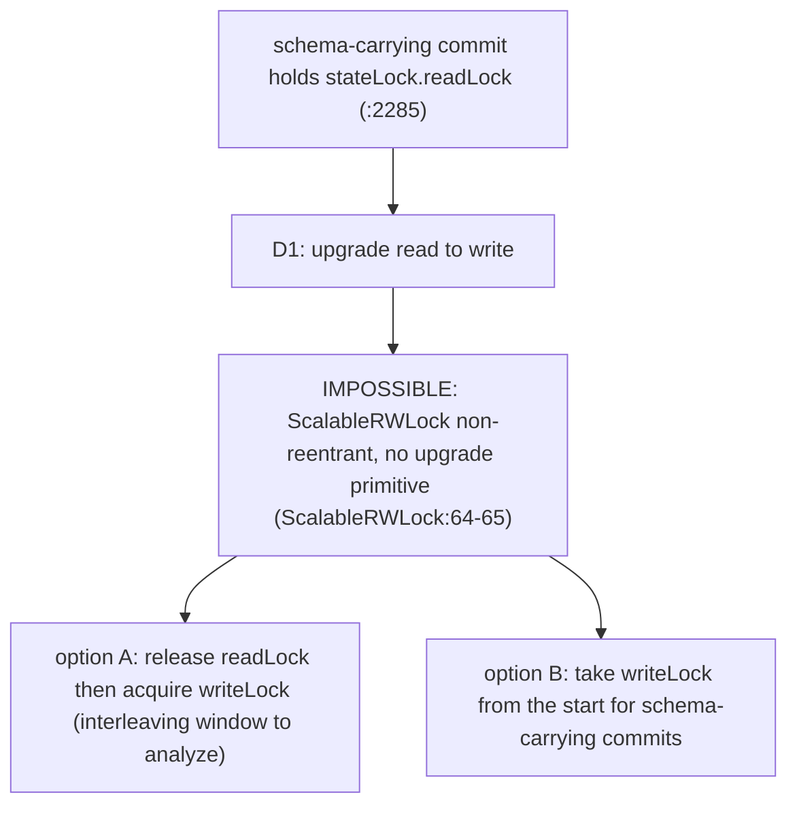
```mermaid
flowchart TD
  C["schema-carrying commit holds stateLock.readLock (:2285)"]
  C --> U["D1: upgrade read to write"]
  U --> X["IMPOSSIBLE: ScalableRWLock non-reentrant, no upgrade primitive (ScalableRWLock:64-65)"]
  X --> A1["option A: release readLock then acquire writeLock (interleaving window to analyze)"]
  X --> A2["option B: take writeLock from the start for schema-carrying commits"]
```

### F34 — D3 and D12 disagree on where engine creation lands in the commit; D3's point is after `lockIndexes` [MAJOR]
D3 places structural reconciliation "before the record-position-allocation loop
(`:2300+`)." But `lockIndexes` is at `:2297`, before the allocation loop at
`:2300`, and F21/D12 both require a new index's engine to exist before
`lockIndexes` (it resolves engines by `indexId` and throws on `-1`). So "before
the allocation loop" does not guarantee "before `lockIndexes`," and an
implementer following D3 literally would create engines too late and hit
`InvalidIndexEngineIdException` (F23). D12 pins the correct order. Fix: D3 must
say index-engine creation lands before `lockIndexes` (`:2297`) and collection
creation before the allocation loop (`:2300`).

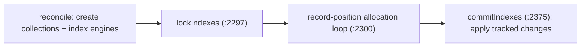
```mermaid
flowchart LR
  REC["reconcile: create collections + index engines"] --> LI["lockIndexes (:2297)"]
  LI --> ALLOC["record-position allocation loop (:2300)"]
  ALLOC --> CI["commitIndexes (:2375): apply tracked changes"]
```

### F35 — The write-path overlay (F32/D15) reads a once-materialized cached index set, so routing the index manager is necessary but not sufficient [MAJOR]
`ClassIndexManager` calls the no-arg `SchemaImmutableClass.getRawIndexes()`
(`:58`/`:78`/`:421`), which returns the cached field `this.indexes`
(`SchemaImmutableClass:636`), materialized once at snapshot `init` (`:165`) via
the session-routed `getRawIndexes(session, …)` → `getRawClassIndexes`
(`:654`/`:670`); the snapshot is cached in `SchemaShared.snapshot` until
`forceSnapshot` (`SchemaShared:194`–`216`). So D15's "route the index manager"
surfaces a tx-created index only if the tx-local snapshot is built after the
overlay exists AND rebuilt after every mid-tx `createIndex`/`dropIndex`. Without
that, the write path reads a stale cached set and the tx's own inserts into the
new index are silently untracked — the exact silent-corruption failure F32
names. New invariant for D15: force a tx-local snapshot rebuild on every overlay
mutation within a schema-tx. (Class rename is commit-only, F40, so it is not an
overlay mutation and needs no mid-tx rebuild.) The concrete site is
`IndexManagerEmbedded.releaseExclusiveLock` (`:201`–`:208`), which today calls
`schema.forceSnapshot()` to invalidate the *shared* snapshot on every index
create/drop (via `SchemaShared.snapshotLock`, not the mutation lock — F44); under
the tx model it must become tx-aware — invalidate the *tx-local* snapshot during
the tx, the shared one only at commit. The invalidation must be **lazy** (null the
tx-local snapshot, rebuild on the next read, today's `forceSnapshot` O(1) shape), not an
eager reconstruction per createIndex — an eager rebuild is O(N²) for a 4,000-index batch
(F51). A single-column `createIndex` reads no snapshot (F51/Q3), so a pure-DDL batch
triggers no mid-batch rebuild; composite indexes and data-interleaved batches do carry the
rebuild cost.

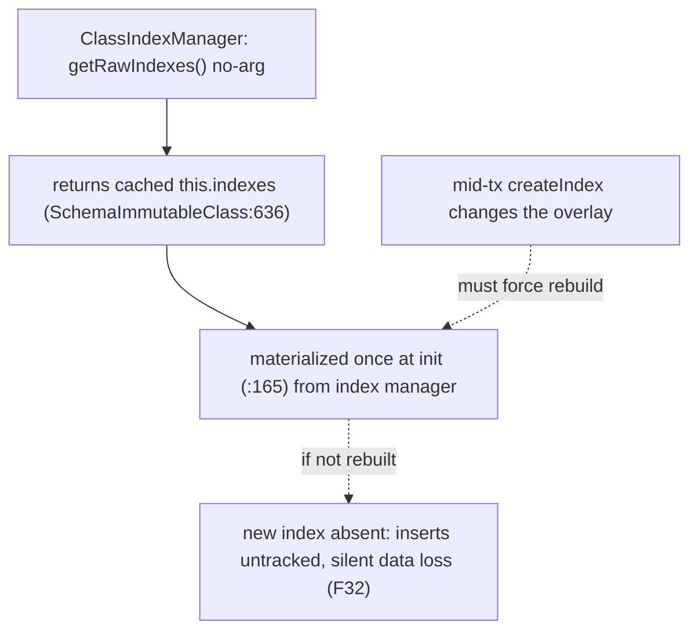
```mermaid
flowchart TD
  CIM["ClassIndexManager: getRawIndexes() no-arg"] --> CACHE["returns cached this.indexes (SchemaImmutableClass:636)"]
  CACHE --> MAT["materialized once at init (:165) from index manager"]
  OV["mid-tx createIndex changes the overlay"] -. must force rebuild .-> MAT
  MAT -. if not rebuilt .-> BUG["new index absent: inserts untracked, silent data loss (F32)"]
```

### F36 — F31's `:602`–`:612` citation points at helper dispatches, not the schema-API calls [MINOR]
F31 cites `:602`–`:612` for `createClass`/`createProperty`/`createIndex`, but
those lines hold the helper dispatches (`createOrUpdateO{SecurityPolicy,Role,User}Class`);
the actual calls live inside the helpers (`createClass("OUser", …)` `:883`, the
`OUser.name` index `:899`), and `SecurityShared.create` starts at `:593` (the
log says `:594`). The substantive conclusion (class creation runs with no active
tx; data insert is a separate `executeInTx` at `:628`) holds. Re-cite to
`:883`/`:899`/`:628`.

### F37 — D6/D9 frame the diff as per-property, but a class DROP has no per-class change to inspect [MINOR]
D6 derives the create/drop set from `EntityImpl` per-property dirty tracking
over changed records; D9 defines drop as "collection ids in old absent from
new." But a dropped class's record is deleted (D14), so it produces no per-class
property change — the only signal is the schema-record link-set losing the link
(D14). So the diff cannot be purely per-class; it must also read the
schema-record link-set delta to detect drops. D6/D9 should state this
cross-reference to D14, or an implementer could build a diff that detects
creates and edits but silently misses drops.

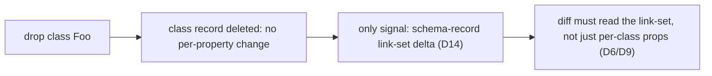
```mermaid
flowchart LR
  DROP["drop class Foo"] --> NOREC["class record deleted: no per-property change"]
  NOREC --> LINK["only signal: schema-record link-set delta (D14)"]
  LINK --> DIFF["diff must read the link-set, not just per-class props (D6/D9)"]
```

### F38 — D7's `finally`-release assumes same-thread; a migrated session throws `IllegalMonitorStateException` [MINOR]
F13 notes a session re-activated on a different thread mid-tx "strands" the
metadata-write mutex; in fact a `ReentrantLock` released in `commit`/`rollback`'s
`finally` on a different thread than acquired throws
`IllegalMonitorStateException`, masking the original outcome. D7 relies on the
same-thread assumption (F13) without a guard. Add an assertion that the
releasing thread equals the acquiring thread, or scope session migration
mid-schema-tx out as a Non-Goal.

### F39 — Engine create/delete have no lock-free inner primitive; D19's held write lock self-deadlocks the public methods [BLOCKER]
D19 has a schema-carrying commit hold `stateLock.writeLock()` from the start, but
the structural primitives reconciliation must call during the commit each
re-acquire the same non-reentrant lock. `addIndexEngine` (`AbstractStorage:2738`)
takes `stateLock.writeLock()` (`:2752`) and inlines the whole
`calculateInsideAtomicOperation` engine-create body inside it (`:2752`–`:2826`);
`deleteIndexEngine` (`:3031`) does the same (`:3036`–`:3064`). `ScalableRWLock` is
"Not Reentrant" (`ScalableRWLock:64`), so re-acquiring `writeLock()` while holding
it self-deadlocks — the same failure mode F33 named, relocated from the upgrade to
the nested call. No `doAddIndexEngine`/`doDeleteIndexEngine` lock-free variant
exists (grep: none), and today's `commit()` body (`:2192`–`:2432`) never calls
these methods — it only calls `lockIndexes` (`:2297`) and `commitIndexes`
(`:2455`), so the new design must add engine create/delete to the commit window
before `lockIndexes` (D3/F34), exactly where D19 already holds the write lock.

Collections do not have this problem: public `addCollection` (`:1441`) delegates
to a lock-free `doAddCollection(atomicOperation, …)` (`:5002`) and `dropCollection`
to `dropCollectionInternal(atomicOperation, …)` (`:5094`) (F8). Engines were never
refactored that way, so the spine's "build the engine at commit" (D12/D15/D18)
silently assumes a seam that does not exist.

Resolution (D3/D19): extract lock-free `doAddIndexEngine(atomicOperation, …)` and
`doDeleteIndexEngine(atomicOperation, …)` from the public bodies, leaving the
public methods as `writeLock + doX`. Commit reconciliation calls the
`doX(atomicOperation, …)` primitives plus the existing
`doAddCollection`/`dropCollectionInternal`, never the public write-lock-taking
methods.

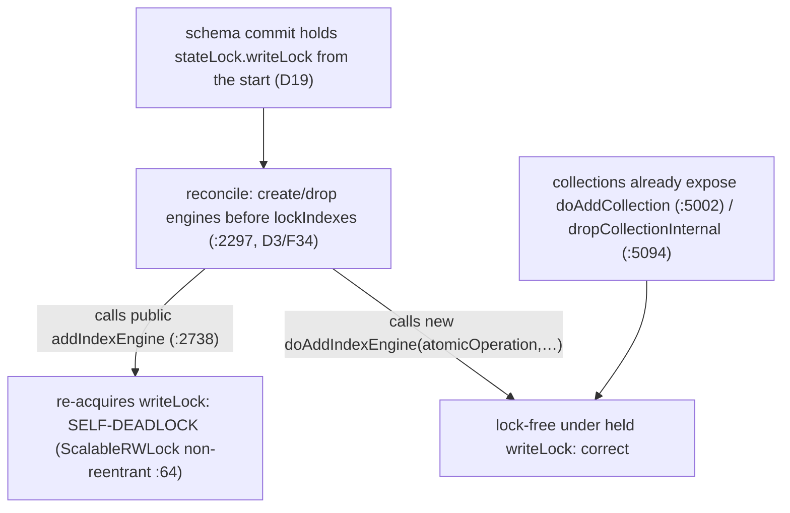
```mermaid
flowchart TD
  C["schema commit holds stateLock.writeLock from the start (D19)"]
  C --> REC["reconcile: create/drop engines before lockIndexes (:2297, D3/F34)"]
  REC -- "calls public addIndexEngine (:2738)" --> X["re-acquires writeLock: SELF-DEADLOCK (ScalableRWLock non-reentrant :64)"]
  REC -- "calls new doAddIndexEngine(atomicOperation,…)" --> OK["lock-free under held writeLock: correct"]
  CO["collections already expose doAddCollection (:5002) / dropCollectionInternal (:5094)"] --> OK
```

### F40 — D15's overlay and F35's rebuild trigger enumerate create/drop only; D17's class rename is a third category they miss [MAJOR]
D15 models the tx-local index view as committed + tx-created − tx-dropped, and F35
forces a tx-local snapshot rebuild "on every mid-tx createIndex/dropIndex." D17's
class-rename re-association is neither create nor drop: it mutates a committed
index in place — re-keys `classPropertyIndex` (old→new class) and sets
`IndexDefinition.className` (recursing composites, F30) on an index that already
exists. Two gaps fall out:

- **Vocabulary.** D15's overlay has no slot for an in-place definition mutation
  and explicitly does not copy `Index` objects (thin handles, F25), so "the
  changed-index set drives the commit" needs the rename-only category defined or
  the commit never writes the re-keyed association.
- **Visibility + isolation, unstated.** The log never says whether D17
  re-association is visible inside the renaming tx or applied only at commit.
  Tx-local visibility would mutate `className` on the shared committed `Index`
  object — leaking the uncommitted rename to other sessions (D4 violation) — and
  would force F35's trigger set to add the rename case. Commit-only re-association
  has no such hazard: the className mutation lands at commit under D19's write
  lock, and the renaming tx falls back to a correct unaccelerated scan for the
  renamed class (the staleness D17 already accepts).

Resolution (D15/D17): adopt commit-only re-association for v1. D17 states it; D15
adds rename-only mutation as an explicit third category in the changed-index set;
F35's create/drop-only rebuild trigger stays correct because rename is not
tx-locally visible.

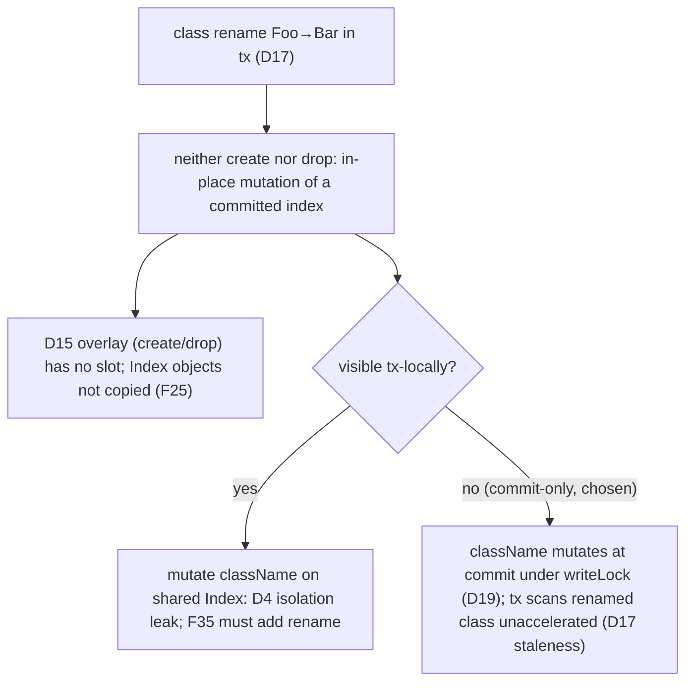
```mermaid
flowchart TD
  REN["class rename Foo→Bar in tx (D17)"] --> CAT["neither create nor drop: in-place mutation of a committed index"]
  CAT --> D15X["D15 overlay (create/drop) has no slot; Index objects not copied (F25)"]
  CAT --> VIS{"visible tx-locally?"}
  VIS -- "yes" --> LEAK["mutate className on shared Index: D4 isolation leak; F35 must add rename"]
  VIS -- "no (commit-only, chosen)" --> SAFE["className mutates at commit under writeLock (D19); tx scans renamed class unaccelerated (D17 staleness)"]
```

### F41 — D8's tx-local seed is load-bearing, not a free planning choice: only fromStream re-parse binds owner + graph into the copy [MAJOR]
D8 frames the tx-local `SchemaShared` seed as "deep-copy vs fromStream re-parse —
planning picks," a non-blocker. But "derived state maintained for free by the
existing mutation methods" holds only when every copied class is a fresh object
bound to the tx-local owner, and the code makes that contingent on the seed
mechanism:

- **`SchemaClassImpl.owner` is `final`** (`:72`), set only in the constructor
  (`:89`/`:108`) — no setter. A field-level deep clone cannot rebind it.
- **`superClasses`/`subclasses` are `List<SchemaClassImpl>` object references**
  (`:78`/`:80`); the polymorphic ripple walks them (`SchemaClassEmbedded:644`
  recurses `superClass.addPolymorphicCollectionId`; `SchemaClassImpl:681` walks
  `superClasses`).
- **The mutation methods the ripple rides reach through `owner`:**
  `owner.acquireSchemaWriteLock(session)` (`:1169`), `owner.getClass(name)`
  (`:268`/`:830`), `owner.checkEmbedded(session)` (`:1182`).

A naive deep-copy that shares or field-copies references leaves `owner` and the
superclass/subclass refs pointing at the **committed** `SchemaShared`. Then every
tx-local schema mutation (a) acquires the **shared** schema write lock —
serializing all sessions and defeating D5/D8's low-contention isolation premise —
and (b) ripples `polymorphicCollectionIds` into the **committed** class objects, a
direct D4 isolation violation and shared-state corruption, the opposite of "free."

`fromStream` re-parse avoids this for free: `createClassInstance` constructs
`new SchemaClassEmbedded(this, …)` (`SchemaEmbedded:217`/`:478`) bound to the
tx-local `SchemaShared`, and `fromStream` (`SchemaShared:487`) rebuilds the whole
graph (owner, superClasses, subclasses) inside the copy. There is no
copy-constructor or clone on `SchemaShared` today (only the no-arg `SchemaShared()`,
`:116`), so "deep-copy" would have to reimplement that reconstruction regardless.

Resolution (D8): pin the seed to `fromStream` re-parse (or an equivalent
fresh-object reconstruction that rebinds `owner` and re-wires the class graph). The
seed mechanism is load-bearing for correctness and isolation, not a free planning
choice.

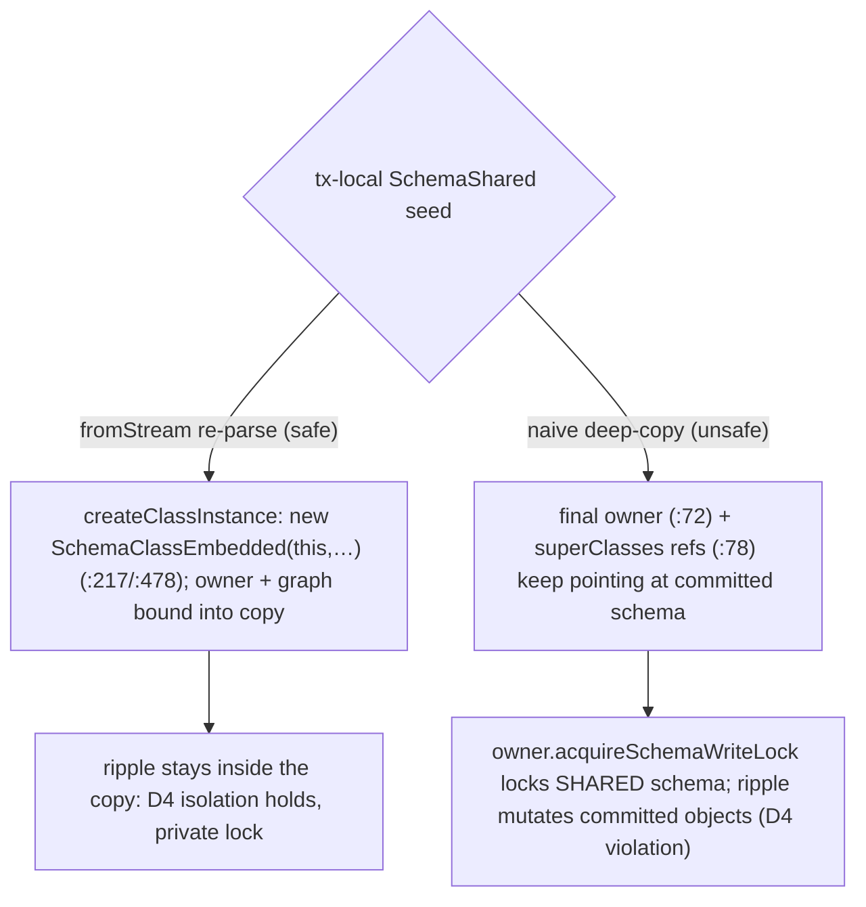
```mermaid
flowchart TD
  SEED{"tx-local SchemaShared seed"}
  SEED -- "fromStream re-parse (safe)" --> FRESH["createClassInstance: new SchemaClassEmbedded(this,…) (:217/:478); owner + graph bound into copy"]
  FRESH --> FREE["ripple stays inside the copy: D4 isolation holds, private lock"]
  SEED -- "naive deep-copy (unsafe)" --> SHARE["final owner (:72) + superClasses refs (:78) keep pointing at committed schema"]
  SHARE --> CORRUPT["owner.acquireSchemaWriteLock locks SHARED schema; ripple mutates committed objects (D4 violation)"]
```

### F42 — Provisional negative collection ids collide with the pervasive `collectionId < 0` convention; the record→class resolver skips them [BLOCKER]
D2 gives a new collection a "provisional (sentinel/negative) collection ID …
mirror[ing] temp RIDs," and D9 constrains it only to be "disjoint from -1." But
the negative-collection-id space is not free: the schema layer tests
`collectionId < 0` (not `== -1`) and treats every negative as "no physical
collection — skip." Representative sites: `SchemaShared.addCollectionClassMap:871`
and `SchemaEmbedded.removeCollectionClassMap:506` (skip the reverse map),
`SchemaEmbedded.checkCollectionsAreAbsent:355` and `addCollectionForClass:522`
(skip uniqueness/assignment), `SchemaShared.checkCollectionCanBeAdded:317` (skip
blob-collision), `SchemaClassImpl.renameCollection:1397` (skip file rename), plus
storage bounds checks `collectionId < 0 || >= collections.size()`
(`AbstractStorage:1526/:1570/:3793/:5456`). A provisional id of -2 is disjoint
from -1 yet caught by every one.

The load-bearing collision is the record→class resolver.
`getClassByCollectionId(collectionId)` returns `collectionsToClasses.get(...)`
(`SchemaShared:341`, `ImmutableSchema:285`), and that map skips negatives on
population (`addCollectionClassMap:871`). It is called from the record read/write
path on `rid.getCollectionId()` — `DatabaseSessionEmbedded:2035`/`:2065`/`:3360`/
`:3455`, `EdgeEntityImpl:79`/`:110`, `JSONSerializerJackson:513`,
`GremlinResultMapper:89`. So a record the tx inserts into its new (provisional)
collection cannot resolve back to its class during the tx:
`getClassByCollectionId(provisionalId)` is `null`, and the callers NPE or
mis-handle. D9's "disjoint from -1" is necessary but nowhere near sufficient.

The storage-side `< 0` bounds checks are safe — provisional ids never reach
storage mid-tx (D1/D4) and are resolved to real ids before D3's reconciliation —
but the in-memory schema maps are not. (One exception, found in the third pass: the
index collection-membership ripple calls `getCollectionNameById(provisionalId)` mid-tx,
which the `< 0` guard answers with `null` rather than a resolution — see F46. F46's
commit-only deferral of the membership mutation is what keeps "never reaches storage
mid-tx" true.)

Resolution (D2/D9): split the `collectionId < 0` predicate three ways at the
in-memory schema-map sites — abstract (`== -1`, skip), provisional (`<= -2`, treat
as a pending real collection: populate `collectionsToClasses`, validate
uniqueness), real (`>= 0`, today's path) — so the tx-local record→class resolver
works for new-collection records. At commit, the provisional→real resolution (D2)
must also re-key `collectionsToClasses` provisional→real; D2's patch list (class
id-list + record RIDs) currently omits the reverse map. File-op and storage-bounds
sites keep rejecting negatives (a provisional collection has no files and never
reaches storage until resolved).

A further collision site sits in the commit itself: the pre-position pass tests
`collectionId == COLLECTION_ID_INVALID` (`AbstractStorage:2269`) to route a record
to its class's default collection via `getCollectionForNewInstance`. A provisional
id of `-1` would be mis-routed there; a provisional id ≤ `-2` skips that branch and
falls through to `doGetAndCheckCollection(negative)` (`:2279`), which throws. So the
provisional→real resolution slots into the existing `collectionOverrides` seam
(`:2239` declared, `:2276` populated, `:2317` read) — after D3 creates the new
collection, populate `collectionOverrides` with the new real id for records carrying
the provisional id, before the position loop dereferences it (`:2321`). Downstream
index entries then resolve for free (F24, verified).

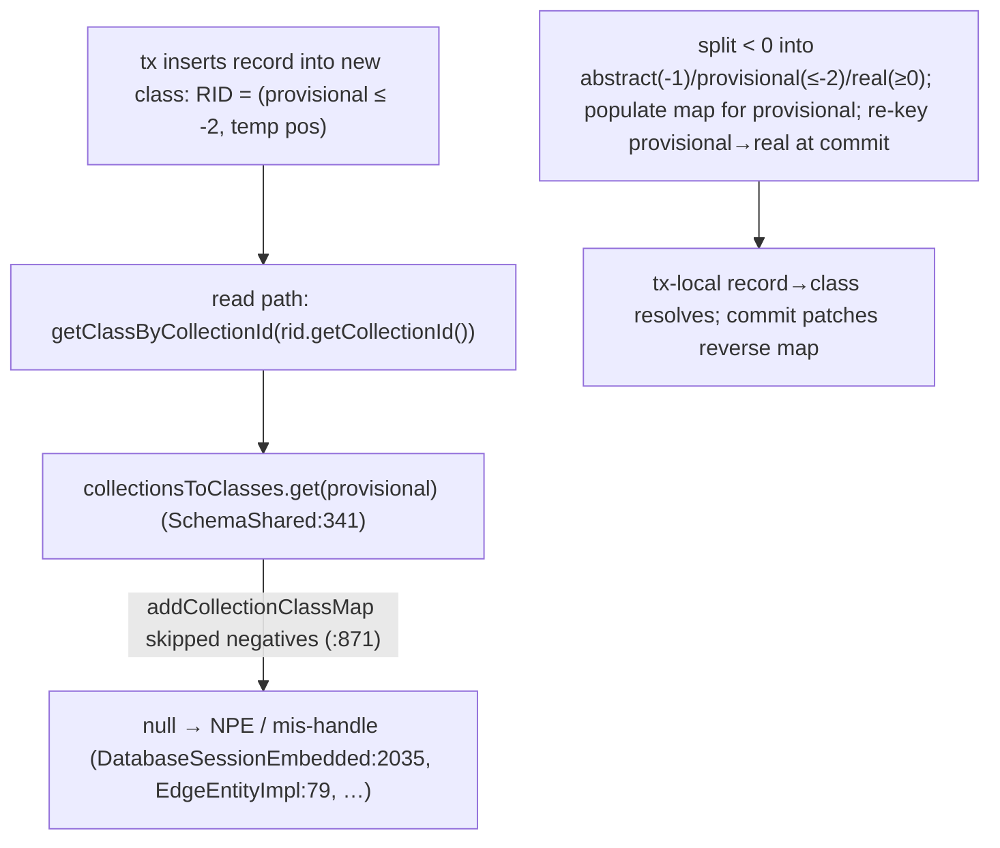
```mermaid
flowchart TD
  INS["tx inserts record into new class: RID = (provisional ≤ -2, temp pos)"]
  INS --> RES["read path: getClassByCollectionId(rid.getCollectionId())"]
  RES --> MAP["collectionsToClasses.get(provisional) (SchemaShared:341)"]
  MAP -- "addCollectionClassMap skipped negatives (:871)" --> NUL["null → NPE / mis-handle (DatabaseSessionEmbedded:2035, EdgeEntityImpl:79, …)"]
  FIX["split < 0 into abstract(-1)/provisional(≤-2)/real(≥0); populate map for provisional; re-key provisional→real at commit"] --> OK["tx-local record→class resolves; commit patches reverse map"]
```

### F43 — D6 (per-property record diff) and D9 (collection-id set difference) describe the diff at two levels; the drop path forces D9's in-memory set difference [MAJOR]
D6's drop-detection premise is sound and verified: the schema-record link set can
be a tracked `EntityImpl` multi-value whose delta is recoverable at commit.
Confirmed on the `CONFIG_INDEXES` mirror D14 copies — `IndexManagerAbstract`
mutates it via `indexEntity.getOrCreateLinkSet(CONFIG_INDEXES).add(...)` (`:216`),
a tracked link-set add, and `EntityImpl` retains both the per-property `original`
(`:1851`/`:1991`) and a `MultiValueChangeTimeLine` of add/remove events (`:2301`).
So D14's schema-record link set mirrors it and the link-set delta is reliable.

But D6 and D9 frame the structural diff at different levels and conflate two
distinct computations:

- **Which records to persist** — D14's write-amplification win: `EntityImpl` dirty
  tracking writes only changed class records. Record-level, per-property.
- **Which collections/indexes to create/drop** — D9's set difference: collection
  ids in the old set absent from the new (drop) or new absent from old (create).

The drop case proves D6's "derive create/drop from property-level changes" framing
wrong: a dropped class's record is deleted, so it carries no per-property "new"
value (F37). The link-set delta tells you *which* class records were unlinked, but
the collections to drop are that class's *old* collectionIds — recoverable only
from the still-unmodified committed in-memory `SchemaShared` (at committed state
until commit-apply, D4/D8), not from the deleted record's per-property diff. The
clean mechanism for the whole structural diff is therefore D9's set difference over
the committed `SchemaShared` (old) vs the tx-local `SchemaShared` (new)
collection-id sets; per-property dirty tracking (D6/D14) is the separate "which
records to write" concern.

Resolution (D6/D9): scope D6's per-property/dirty tracking to "which records get
persisted (D14)," and state the structural collection/index create/drop set is
D9's set difference over the committed vs tx-local in-memory structures (the old
side, including a dropped class's collectionIds, comes from the committed
`SchemaShared`/`IndexManager`, not record-level property changes). An implementer
who built the collection diff purely from `EntityImpl` dirty fields would miss
drops — deleted records have no dirty fields — orphaning collections that should be
freed.

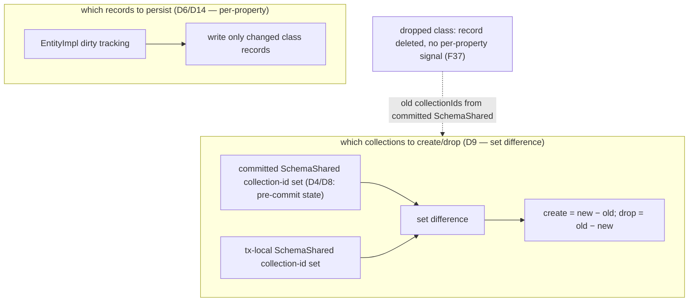
```mermaid
flowchart TD
  subgraph WRITE["which records to persist (D6/D14 — per-property)"]
    DT["EntityImpl dirty tracking"] --> WR["write only changed class records"]
  end
  subgraph STRUCT["which collections to create/drop (D9 — set difference)"]
    OLD["committed SchemaShared collection-id set (D4/D8: pre-commit state)"] --> DIFF["set difference"]
    NEW["tx-local SchemaShared collection-id set"] --> DIFF
    DIFF --> CRD["create = new − old; drop = old − new"]
  end
  DROP["dropped class: record deleted, no per-property signal (F37)"] -. old collectionIds from committed SchemaShared .-> STRUCT
```

### F44 — D7's mutex engage-point: schema and index use disjoint locks, so both chokepoints must be instrumented; an index-only tx bypasses the schema one [MAJOR]
D7 engages the metadata-write mutex "when a tx first mutates schema or indexes,"
and D19 branches the commit lock on the same signal. A reliable chokepoint
exists — and it is two chokepoints, not one:

- **Schema mutations** funnel through `SchemaShared.acquireSchemaWriteLock(session)`
  (`:414`), which drives persistence: `releaseSchemaWriteLock` fires `saveInternal`
  at the outermost release (`:426`–`:433`). Every persisting schema mutation passes
  through it (a bypass would already fail to persist today), so it is as reliable as
  today's save path, and it is exactly the method D1/D8 modify — the engage hook
  lands there naturally.
- **Index-definition mutations** funnel through
  `IndexManagerEmbedded.acquireExclusiveLock(transaction)` (`:188`), bracketing
  createIndex (`:325`) / dropIndex (`:463`).

The two families use **disjoint** locks: `acquireSchemaWriteLock` callers are
confined to the schema package; `IndexManagerEmbedded` never calls it. So a tx that
only does `createIndex` on an existing class (no class/property change) never
touches the schema chokepoint — yet it builds an engine at commit (D12) and must
take the write lock (D19) and serialize (D7). The single D7 mutex must therefore
engage at **both** chokepoints, and D19's commit-entry write-lock branch must fire
if **either** fired; instrumenting only the schema chokepoint would let index-only
txs commit on the read-lock fast path while building an engine — re-introducing the
F33/D19 hazard for that case. D7/D19 already say "one lock for both" / "schema OR
index changes," so the design is internally consistent; this confirms "both" is
necessary, not merely tidy.

**Snapshot-cache coupling (not the mutation lock).** "Disjoint" is about the
*mutation* locks. An index mutation is not fully independent of the schema: at the
outermost index-lock release, `IndexManagerEmbedded.releaseExclusiveLock` (`:201`)
calls `schema.forceSnapshot()` (`:205`–`:208`), which takes `SchemaShared`'s
separate `snapshotLock` (`:92`/`:223`) to null the cached `ImmutableSchema` —
because the snapshot caches the per-class index set (F35). It never acquires
`acquireSchemaWriteLock` (`lock.writeLock()`, `:414`), and `SchemaClassImpl.createIndex`
(`:951`) does not either. So the two *mutation* locks stay disjoint and the dual
engage-point holds; this only reinforces it — since no index path takes the schema
mutation lock, an index-only tx truly bypasses the schema chokepoint. No deadlock:
the reverse path (`makeSnapshot` holding `snapshotLock` while building the snapshot)
reads the index manager lock-free (`getClassRawIndexes:85` takes no index lock), so
there is no `snapshotLock`↔index-lock inversion.

Two wiring caveats:

- **Active-tx guard.** `acquireSchemaWriteLock` is also called during load / reload
  / genesis bootstrap; the engage must fire only inside an active user tx, or it
  spuriously engages outside transactional work.
- **Mutation-time, not commit-time (D5).** The mutex must engage at the chokepoint
  during the tx, so a second schema-changing tx blocks. A commit-time-only check
  would let two schema txs race to a commit-time conflict, which D5 rejects.

Resolution (D7/D19): pin the engage-point to the two chokepoints
(`acquireSchemaWriteLock` + `acquireExclusiveLock`), engage the single mutex
idempotently at either, guard on active user tx, and have D19 read the unified
"either changed-set non-empty" signal.

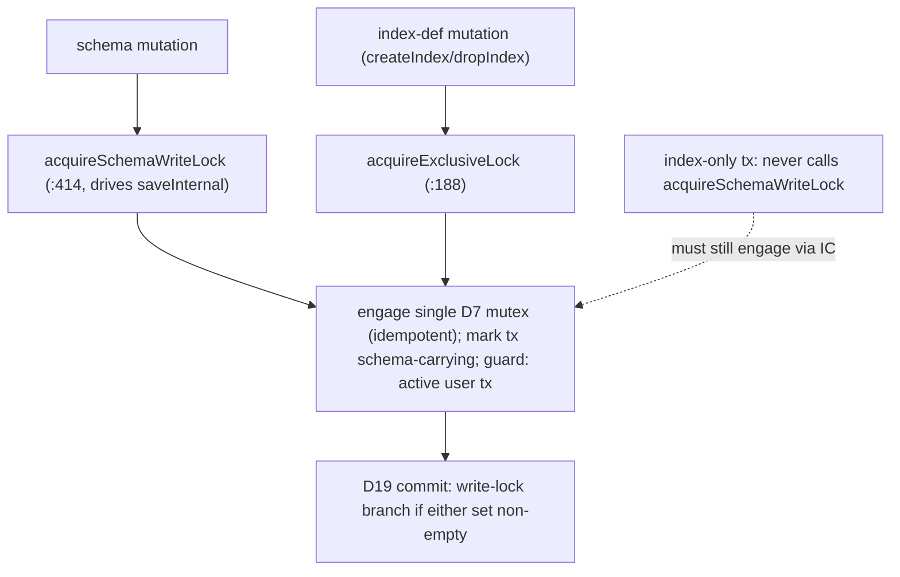
```mermaid
flowchart TD
  SM["schema mutation"] --> SC["acquireSchemaWriteLock (:414, drives saveInternal)"]
  IMM["index-def mutation (createIndex/dropIndex)"] --> IC["acquireExclusiveLock (:188)"]
  SC --> ENG["engage single D7 mutex (idempotent); mark tx schema-carrying; guard: active user tx"]
  IC --> ENG
  ENG --> CK["D19 commit: write-lock branch if either set non-empty"]
  IONLY["index-only tx: never calls acquireSchemaWriteLock"] -. must still engage via IC .-> ENG
```

### F45 — D14's per-class record identity and D8/F41's tx-local seed are coupled by an unstated invariant: the seed must carry each existing class's committed record RID [MAJOR]
D14 splits the schema into per-class records, each `SchemaClassImpl` carrying its own
record RID, committed via load-by-RID + set-properties (mirroring the index-manager
per-entity pattern, F20). D8/F41 pin the tx-local `SchemaShared` seed to `fromStream`
re-parse, but for the `owner`/graph-binding reason only (F41), never identity. The two
are specified independently and assume different things about per-class record identity.

PSI-verified (2026-06-04, third pass):

- `SchemaClassImpl` has exactly one inheritor, `SchemaClassEmbedded`; **neither declares
  any RID/`Identifiable`/identity field** (`ClassInheritorsSearch` + field scan). The
  per-class record RID is net-new under D14.
- Both constructors (`SchemaClassImpl:89`, `:108`) and `createClassInstance(name)`
  (`SchemaEmbedded:477` → `new SchemaClassEmbedded(this, name)`) carry no RID.
- `SchemaClassImpl.toStream` (`:569`) emits `session.newEmbeddedEntity()` — an embedded
  entity with no independent identity; the whole schema is one record at
  `SchemaShared.identity` (`toStream:647` `session.load(identity)`), confirming F1.
- The index template D14 mirrors already binds identity at load:
  `IndexManagerAbstract.load` (`:191`) reads the `CONFIG_INDEXES` link set, loads each
  entity by RID, and `createIndexInstance(transaction, indexIdentifiable, …)` (`:202`)
  threads it in; `IndexAbstract.save` (`:720`) loads-by-`identity`-or-creates.

The gap is at the seam, for an **existing** class modified in a tx (the common
migration case). The tx-local copy must carry that class's committed record RID so
commit's load-by-RID updates the right record. An implementer following F41 literally
builds the seed by constructing fresh `SchemaClassEmbedded(this, name)` objects, which
carry no RID, and commit then has nothing to load: it orphans the committed per-class
record and writes a fresh one, or, if it re-resolves by class name against the committed
schema, mishandles a class renamed in the same tx (D17, whose new name is absent from
the committed schema). New-class records are already covered (D14: temp→persistent RID
at commit, D2/F24); the unstated half is existing-class identity preservation.

Resolution (D8/D14): state the invariant. The per-class record RID is a field on
`SchemaClassImpl` bound at load from the schema-record link set (mirroring
`IndexManagerAbstract.load`); the F41 seed preserves it for existing classes (a
`toStream`→`fromStream` round-trip through the link-set-aware serializer keeps it; a
fresh-object reconstruction that drops identity does not); a new class allocates its
record RID at commit (D2/F24). Commit resolves the per-class record by carried RID, not
by re-resolving the possibly-renamed class name.

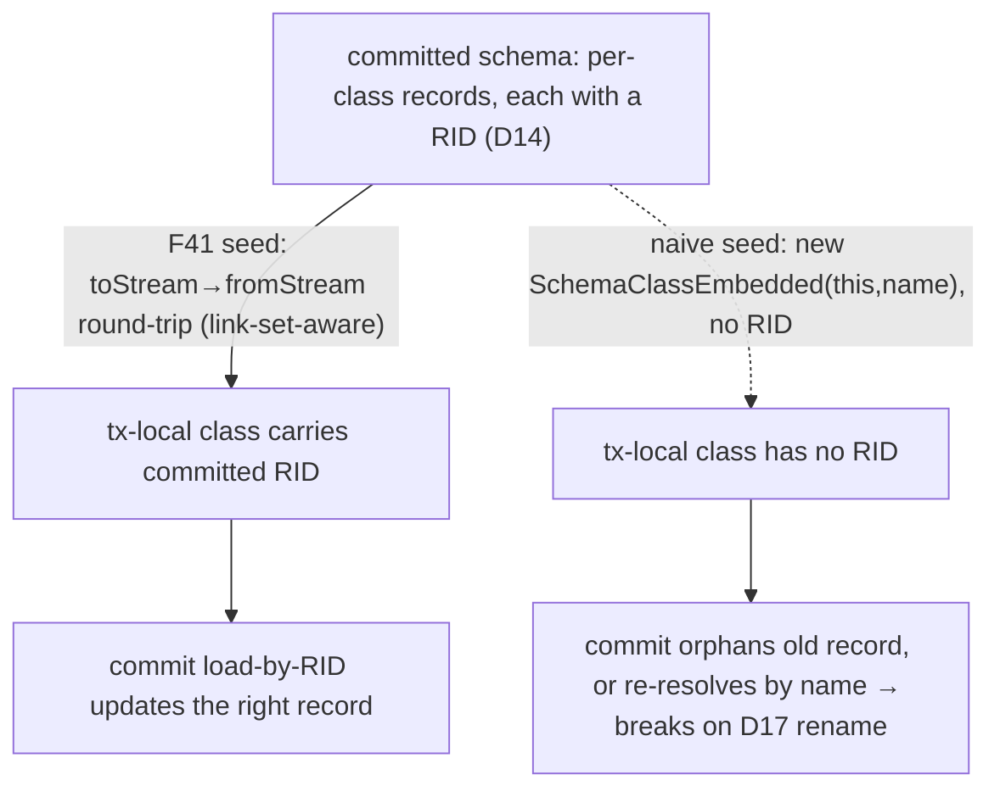
```mermaid
flowchart TD
  COMMIT["committed schema: per-class records, each with a RID (D14)"]
  COMMIT -- "F41 seed: toStream→fromStream round-trip (link-set-aware)" --> TXOK["tx-local class carries committed RID"]
  COMMIT -. "naive seed: new SchemaClassEmbedded(this,name), no RID" .-> TXBAD["tx-local class has no RID"]
  TXOK --> CMOK["commit load-by-RID updates the right record"]
  TXBAD --> CMBAD["commit orphans old record, or re-resolves by name → breaks on D17 rename"]
```

### F46 — Class-structural ops mutate index collection-membership through a self-committing, shared-`Index`-mutating path the guard inventory and D15 overlay both miss [MAJOR; self-commit + isolation facets BLOCKER]
The polymorphic collection-id ripple reaches the index manager:
`SchemaClassEmbedded.addCollectionIdInternal` (`:600`) → `addPolymorphicCollectionId`
(`:631`, recursing superclasses `:644`) → `addCollectionIdToIndexes` (`:641`) →
`IndexManagerEmbedded.addCollectionToIndex` (`:99`). PSI-verified callers (2026-06-04):
`addCollectionToIndex` is called from `SchemaClassEmbedded#addCollectionIdToIndexes` (the
ripple) and `SchemaEmbedded#createClassInternal`; `addCollectionIdToIndexes` is called
from `addPolymorphicCollectionId` and `SchemaClassImpl#addPolymorphicCollectionIds` (the
`addSuperClass`/inheritance path); the symmetric `removeCollectionFromIndex` is reached
from `SchemaClassImpl#removeCollectionFromIndexes`. So ordinary `createClass`,
alter-add-collection, and `addSuperClass` mutate index membership, not just explicit
`createIndex`/`dropIndex`. Three facets, all missed by the first two passes:

- **(a) A fifth/sixth self-commit guard.** `addCollectionToIndex` wraps the mutation in
  `session.executeInTxInternal` (`IndexManagerEmbedded:114`), the same self-committing
  shape as F3 (`saveInternal`), F4 (`dropClass`), F21 (`createIndex`), F26 (`dropIndex`);
  `removeCollectionFromIndex` matches. The guard inventory lists four; these are the
  fifth and sixth, reached transitively from class-structural ops. Under D1 they must
  ride the user tx, not self-commit.
- **(b) In-place mutation of a committed `Index` object (D4 leak).** The path resolves
  the shared `indexes.get(indexName)` (`:106`/`:117`) and mutates its `collectionsToIndex`
  then `save(transaction)` (`IndexAbstract.addCollection:667`/`:684`; persisted as
  `CONFIG_COLLECTIONS`, `save:737`/`toMap:779`). Same hazard F40 named for class rename:
  mutating a committed thin handle in place leaks the uncommitted membership change to
  other sessions. Must be commit-only / routed through the D15 overlay.
- **(c) A missing D15 changed-index category.** A membership-only change to an existing,
  non-created/non-dropped index that is not a rename is none of D15's enumerated
  categories (create/drop + the F40 rename third category). If the changed index entity
  is not tracked, commit does not persist the membership delta and the committed index
  silently fails to cover the new subclass collection — a polymorphic query under-returns.

Resolution (D15/D7): add collection-membership change to the changed-index set as an
in-place-mutation category alongside rename (F40), generalizing D15's third category to
"in-place mutation of a committed index"; de-guard
`addCollectionToIndex`/`removeCollectionFromIndex` so the membership change rides the
user tx (extends the F3/F4/F21/F26 inventory to six); route the mutation through the
tx-local index overlay and apply it commit-only so no shared committed `Index` is mutated
mid-tx (D4).

**Verified (collectionCounter pass, 2026-06-04) — commit-only deferral is required for
correctness, not just isolation.** Mid-tx the ripple resolves the collection name with
`session.getCollectionNameById(iId)` (`SchemaClassEmbedded:651`), but under D2 `iId` is the
provisional id, and `getCollectionNameById` returns `null` for any `collectionId < 0`
(`DatabaseSessionEmbedded:2660`). So the ripple feeds a `null` name into
`addCollectionToIndex` → `collectionsToIndex.add(null)` (`IndexAbstract:672`), or
`browseCollection(null)` throws under `requireEmpty`. The membership mutation therefore
cannot run mid-tx with a provisional id at all; deferring it to commit (when the real
collection name exists) is the only correct order. This also refines F42: the membership
ripple is the one path where a provisional id reaches a storage name lookup mid-tx, and
F42's `< 0` storage guard returns null there rather than resolving. (Separately confirmed
clean: `collectionCounter` is the artificial-name counter (`SchemaShared:838`
`nextCollectionIndex`), decoupled from the storage-assigned collection id by design (D11),
and transactional under D8, so there is no name/id dual-authority drift.)

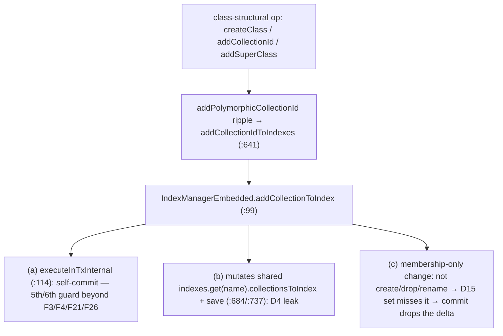
```mermaid
flowchart TD
  CS["class-structural op: createClass / addCollectionId / addSuperClass"]
  CS --> RIP["addPolymorphicCollectionId ripple → addCollectionIdToIndexes (:641)"]
  RIP --> ACI["IndexManagerEmbedded.addCollectionToIndex (:99)"]
  ACI --> A["(a) executeInTxInternal (:114): self-commit — 5th/6th guard beyond F3/F4/F21/F26"]
  ACI --> B["(b) mutates shared indexes.get(name).collectionsToIndex + save (:684/:737): D4 leak"]
  ACI --> C["(c) membership-only change: not create/drop/rename → D15 set misses it → commit drops the delta"]
```

### F47 — Verified: the polymorphic ripple does not pollute the changed-class set; the changed-class-set hook and the D7-mutex engage-point sit at different lock granularities [VERIFIED + MINOR pitfall]
Surface-B hypothesis (third pass): does the inheritance ripple drag superclasses into
D8's changed-class set, eroding D14's write-amplification win? Verified **no**, on two
grounds:

- `addPolymorphicCollectionId` (`SchemaClassEmbedded:631`) mutates `polymorphicCollectionIds`
  by direct field write (`:636`–`:639`) and recurses into superclasses (`:644`)
  **without re-acquiring** the schema write lock; only the originating
  `addCollectionIdInternal` takes it (`:601`). A changed-class set keyed at a per-class
  mutation entry point records only the originating class, not the rippled superclasses.
- `SchemaClassImpl.toStream` (`:569`) does **not** serialize `polymorphicCollectionIds`
  (nor `subclasses`); it is derived state recomputed on load via
  `setSuperClassesInternal`/the ripple. The rippled superclass records need no rewrite.

Pitfall to record (D7/D8): the D7-mutex engage-point and the changed-class-set recorder
sit at different granularities. `SchemaClassImpl.acquireSchemaWriteLock` (`:1168`)
delegates to `owner.acquireSchemaWriteLock` (`SchemaShared:414`), the owner-level lock
that carries no class identity, which is all the D7 mutex needs (engage once per tx).
The changed-class set needs per-class identity, so it must hook at
`SchemaClassImpl.acquireSchemaWriteLock` / the explicit mutation methods, one level above
the mutex chokepoint. D7/D8/F44 describe "the chokepoint" as a single place; it is two
granularities for two purposes. An implementer hooking the changed-class set at the
owner-level lock has no identity to record and would either pollute the set or defeat the
per-class write-amplification win.

```mermaid
flowchart TD
  MUT["class mutation (e.g. addCollectionIdInternal)"] --> SCWL["SchemaClassImpl.acquireSchemaWriteLock (:1168): per-class identity — changed-class-set hook"]
  SCWL --> OWL["owner.acquireSchemaWriteLock (SchemaShared:414): no identity — D7-mutex engage hook"]
  RIP["polymorphic ripple → superclass.addPolymorphicCollectionId (:644)"] -. "lock-free, bypasses per-class acquire" .-> NOREC["superclass NOT recorded (correct: polymorphicCollectionIds not persisted)"]
```

**Performance pass (2026-06-04).** A fourth pass assessed the headline migration workload
— 400 classes × 10 properties, every property indexed, created in one batch — against the
design with the F45–F47 fixes. The design delivers the YTDB-382 win decisively: one commit
versus ~8,400 per-op self-commits today, and the single-schema-record O(N²) rewrite (F2)
plus the index-manager-record O(N²) rewrite both drop to O(N). It concentrates the cost
into one large exclusive-locked atomic operation. F48–F51 record the concentration costs
and one implementation invariant. Quantities are code-grounded: 8 collections per class
(`CLASS_COLLECTIONS_COUNT`, `GlobalConfiguration:812`), 4 files per collection (F19), 3
files per index engine (`.cbt`/`.nbt` plus the always-created `.ixs` histogram,
`AbstractStorage:2802`/`:2808`).

### F48 — The batch concentrates ~24,800 file creates, ~4,400 record writes, and 4,000 engine builds into one atomic operation under the exclusive write lock [MAJOR — envelope, not defect]
For 400 classes × 8 collections = 3,200 collections × 4 files = 12,800 collection files,
plus 4,000 indexes × 3 files = 12,000 index files, the commit creates ~24,800 files in one
atomic operation, alongside ~4,402 metadata record writes (400 per-class records, 4,000
per-index entity records, the schema root, the index-manager record) and 4,000 B-tree
engine inits. All of it runs under `stateLock.writeLock()` for the whole commit (D19), so
it blocks every concurrent data commit for the build's duration.

- **D12's "schema changes are rare" premise is the tension.** D12 accepts the build under
  the exclusive lock because schema change is low-rate; a 4,000-index batch is the
  counterexample. The offline migration envelope (D20: export/import into a fresh database
  with no concurrent load) absorbs it cleanly; a large batch DDL against a live production
  database stalls all data commits for seconds-plus. Off-lock / streamed build is the
  YTDB-1064 follow-up.
- **Memory bound.** File creates are buffered intent (`FileChanges`) applied only in
  `commitChanges` (F16); ~24,800 `FileChanges` plus the record deltas plus B-tree root
  pages buffer in the atomic operation until commit. Bounded (tens of MB) but real; a
  documented per-tx batch-size limit, or chunked migration, is the safe stance for very
  large schemas.

```mermaid
flowchart TD
  TX["one schema tx: 400 classes, 4,000 indexes"] --> CM["single commit, one atomic op, stateLock.writeLock held throughout (D19)"]
  CM --> F["~24,800 file creates: 3,200 collections×4 (F49) + 4,000 indexes×3"]
  CM --> R["~4,402 record writes: 400 class + 4,000 index-entity + schema + manager"]
  CM --> E["4,000 B-tree engine inits"]
  CM -. "blocks data commits for the build" .-> STALL["live-DB stall; safe only in the offline D20 envelope; off-lock build = YTDB-1064"]
```

### F49 — `CLASS_COLLECTIONS_COUNT` default of 8 is the dominant file multiplier; the D20 import should set it low [MAJOR — operational]
A non-abstract user class allocates `minimumCollections = CLASS_COLLECTIONS_COUNT`
collections, default **8** (`SchemaEmbedded:328`/`:341`–`343`, `GlobalConfiguration:812`),
not one. So 400 classes create 3,200 collections = 12,800 files, more than the 12,000 index
files. The multiplier is pre-existing, but the batch concentrates it into one commit. D20's
import rebuilds through the schema API and inherits the default, so a 400-class
export/import migration creates 3,200 collections unless the import sets
`CLASS_COLLECTIONS_COUNT` low (1 for a single-threaded migration target). D11's artificial
collection names are unaffected; this is purely the per-class collection count. The
migration should document the knob.

```mermaid
flowchart LR
  C["400 classes"] --> M["× CLASS_COLLECTIONS_COUNT = 8 (GlobalConfiguration:812)"]
  M --> COL["3,200 collections"]
  COL --> FILES["× 4 files (F19) = 12,800 collection files"]
  C -. "import sets count = 1" .-> LOW["400 collections / 1,600 files (D20 knob)"]
```

### F50 — Latent: the index-manager record's link set is monolithic, so incremental index creation keeps the O(N²) write amplification D14 removed for classes [MINOR — latent, folds YTDB-1064]
D15 says no D14-style split is needed for indexes because the per-index definitions are
already separate entity records (F20). True for the per-index entities, but the index
**manager** record holds one `CONFIG_INDEXES` link set of all index RIDs
(`IndexManagerAbstract:52`/`:215`–`216`), and adding one index re-serializes the whole
record. For the batch this is O(N) (one serialization of all 4,000 links at commit, a win);
for steady-state incremental index creation on a large schema it is O(N²), the exact
amplification D14 eliminated on the class side, still present on the manager record. Not a
v1 blocker (the batch is fine); recorded as a latent asymmetry for the YTDB-1064
optimization scope.

```mermaid
flowchart TD
  ADD["createIndex: add RID to manager CONFIG_INDEXES link set (IndexManagerAbstract:216)"] --> SER["whole manager record re-serialized (all N links)"]
  SER --> BATCH["batch: serialized once at commit → O(N) (win)"]
  SER --> INCR["incremental: re-serialized per add → O(N²) (D14 amp, still present)"]
```

### F51 — F35's tx-local snapshot rebuild must be lazy invalidation, not eager reconstruction, or the batch pays O(N²) [MAJOR — implementation invariant]
F35 requires "force a tx-local snapshot rebuild on every mid-tx createIndex/dropIndex" so
`ClassIndexManager` sees the new index. Read as **eager reconstruction**, that is O(current
schema size) per createIndex → O(N²) for a 4,000-index batch. It must be **lazy
invalidation**: null the tx-local snapshot (today's `forceSnapshot` shape,
`SchemaShared:218`, O(1)) and rebuild only on the next snapshot read. Verified (Q3,
2026-06-04): a single-column `createIndex` does not read the schema snapshot — the security
check that would (`IndexManagerEmbedded:405`) returns early for one-field indexes
(`:399`–`401`), and the rest of the create path builds none — so a pure-DDL batch triggers
no mid-batch rebuild and the cost stays O(N). Two cases reintroduce it:

- **Composite indexes.** A multi-field `createIndex` runs the security check, which builds a
  snapshot per call → O(N²) for a batch of composite indexes.
- **Data interleaved with index creation.** A record write after a mid-tx createIndex runs
  `ClassIndexManager`, forcing a tx-local snapshot rebuild (F35); interleaving inserts and
  index creates reintroduces per-operation rebuilds.

Resolution (F35/D15): pin F35's trigger to lazy invalidation (null-and-rebuild-on-read);
the cheap-rebuild property holds for pure single-column DDL batches, while composite indexes
and data-interleaved batches carry the rebuild cost.

```mermaid
flowchart TD
  CI["mid-tx createIndex ×4,000"] --> TRIG["F35: invalidate tx-local snapshot"]
  TRIG -- "lazy null + rebuild-on-read (forceSnapshot:218): O(1)" --> OK["pure single-col DDL: no rebuild (Q3), O(N) total"]
  TRIG -- "eager reconstruct per call: O(N)" --> BAD["O(N²) for the batch — must NOT do this"]
  COMP["composite index OR data interleaved"] -. "forces snapshot build per op" .-> COST["per-op rebuild cost returns"]
```

### F52 — D8's promotion of the tx-local schema into the shared `SchemaShared` has no specified lock, and every naive choice fails [BLOCKER]
D8 says the commit "promotes the tx-local structure to the shared `SchemaShared`" and F43's
diff reads the committed in-memory schema, both inside the D19 `stateLock.writeLock()`
window — but no entry names the lock guarding them. The shared maps are not concurrent
(`classes` is a plain `HashMap`, `SchemaShared:70`; `collectionsToClasses` an
`Int2ObjectOpenHashMap`, `:71`) and every reader uses the schema read lock (`getClass:398`,
`makeSnapshot:198`). The three choices all break:

- **Take `SchemaShared.lock` inside the commit → ABBA deadlock with `reload`.** Commit
  order: `stateLock.write` → `SchemaShared.lock`. `reload` order: `SchemaShared.lock.write`
  (`:356`) → `session.load` (`:363`) → `stateLock.readLock` (`AbstractStorage:4584`).
  `ScalableRWLock`'s writer preference parks reload's read behind the commit's held write
  lock; permanent deadlock. Reload is reachable from the **data path**:
  `EntityImpl.getGlobalPropertyById` calls `metadata.reload()` (`EntityImpl:4173`) on an
  unknown global-property id, which is exactly a reader's state right after another
  session's schema commit.
- **Skip the schema lock** → concurrent readers see a plain `HashMap` mid-mutation: torn
  reads, resize loops, and `makeSnapshot` can cache a half-promoted schema for every session.
- **Defer promotion past `stateLock` release** → window where storage has the new
  collections but the shared schema lacks them; `getClassByCollectionId(realId)` → null on
  the F42 caller list, now on real ids.

Instance-swap is foreclosed by code: `ProxedResource.delegate` is `final`
(`ProxedResource:30`) and sessions bind the instance at `MetadataDefault.init` (`:124`).

**Resolution (accepted 2026-06-10):** fix the global lock order as **D7 mutex →
`SchemaShared.lock` → `stateLock`**. The schema-carrying commit acquires
`SchemaShared.lock.writeLock()` *before* `stateLock.writeLock()` and holds it through
promotion + `forceSnapshot`; `reload` already conforms. The schema lock is a third member
of D19's ordering proof. Accepted with the contention envelope below; the two
snapshot-first conversions it names (`createVertexWithClass`, `getLowerSubclass`) are
folded into scope as mitigations. Affected: D8, D19, D7, F43, F42.

```mermaid
flowchart LR
  subgraph commit["schema commit (D19)"]
    SW["stateLock.write"] --> SL["wants SchemaShared.lock"]
  end
  subgraph reload["SchemaShared.reload (EntityImpl:4173 data path)"]
    RL["SchemaShared.lock.write (:356)"] --> SR["wants stateLock.read (:4584)"]
  end
  SL -. "blocked by" .-> RL
  SR -. "blocked by" .-> SW
  FIX["fix: schema lock acquired BEFORE stateLock"] --> commit
```

**Contention envelope (2026-06-10, PSI call-site census).** How much blocks while a
schema-carrying commit holds `SchemaShared.lock.writeLock()`: the steady-state data paths
do **not** touch the lock. `makeSnapshot` serves the cached snapshot lock-free
(`SchemaShared:194`; the volatile fast path takes no lock until a `forceSnapshot`
invalidates, which F62 moves to the end of the commit), and after receiver-provenance
checks the hot paths are snapshot-routed: binary deserialization class resolution
(`EntityImpl.fetchClassName:4486` reads the immutable snapshot), entity creation with an
existing class (`setClassNameWithoutPropertiesPostProcessing:3891` snapshot-first),
core edge creation (`DatabaseSessionEmbedded.addEdgeInternal:1038`), SQL executor checks
(`CheckClassTypeStep:48`), and global-property lookups (`ImmutableSchema`). The
genuinely lock-based per-operation MAIN sites are an enumerable short list:

- **Gremlin `addVertex(label)`** — `YTDBGraphImplAbstract.createVertexWithClass:123`–`:128`
  goes straight at `SchemaShared.getClass` (read lock, `:393`) on every call, unlike its
  `addEdge` sibling (`YTDBVertexImpl:128`) which is snapshot-first with the lock only on
  the auto-create miss. The one hot site; trivially convertible to the `addEdge` pattern,
  which removes it from the blocked set. Pre-existing inconsistency, cheap mitigation.
- **MATCH planning** — `SQLMatchStatement.getLowerSubclass:368` uses the proxy (per MATCH
  query); also snapshot-convertible.
- **Full-scan traversal start** — `YTDBGraphStep.createClassIterator:147` reads
  `SchemaShared.getClasses` per `g.V()`-style scan.
- **JSON deserialization / entity copy** — `EntityImpl.getSchemaClass:3863` (proxy;
  callers: JSON serializer, `PropertyTypeInternal.copy`, `EdgeEntityImpl`).
- **Auto-create fallbacks** — snapshot-miss `getOrCreateClass`
  (`EntityImpl:3898`, `YTDBVertexImpl:134`): these are DDL and would park on the D7 mutex
  anyway.
- **Session-open / security init / snapshot rebuild** — `SecurityShared`
  `getClasses` (`:595`/`:1230`), post-invalidation `makeSnapshot` rebuild; brief,
  per-session-or-rebuild, not per-record.
- **Admin machinery** — `DatabaseImport`/`Export`/`Compare`, `dropCollection`,
  `truncateCollection`, scheduler/sequence/function init: cold.

Baseline comparison: today every DDL operation already takes this same write lock
per-operation and serializes the full schema record under it (F2), so readers on the list
above already block per-DDL-op; the design trades ~8,400 short holds (the F48 batch) for
one long hold, and pure-data commits never take the schema lock at all (D19 fast path).
The one real behavioral delta: a schema-carrying tx that also carries many data writes
holds the lock across its whole commit, including the data-record writes. Mitigations to
carry into the plan: convert `createVertexWithClass` (and optionally
`getLowerSubclass`) to snapshot-first, and note the hold-duration delta in D19.

### F53 — Commit-failure rollback leaves phantom engines and collections in the shared in-memory registries; D13 makes that failure routine [BLOCKER]
Reconciliation registers structures in shared in-memory state *before* `commitIndexes`:
`doAddCollection` → `registerCollection` (`AbstractStorage:4963`/`:5026`, mutating
`collections`/`collectionMap` `:263`–`:264`) and the engine-create body does
`indexEngineNameMap.put` + `indexEngines.add` (`:2811`–`:2812`) plus config-cache updates.
`commitIndexes` (`:2375`) then runs the UNIQUE validators — D13 defers uniqueness
enforcement to exactly this point, so `RecordDuplicatedException` there is a routine,
user-data-caused event. It is a `HighLevelException`: the catch routes to
`rollback(error, atomicOperation)` (`:2398`), which only ends the atomic operation
(`:3702`–`:3705`) and deliberately does not poison the storage. The WAL/file side rolls
back cleanly (F16/D10); nothing unwinds the in-memory registrations. After the abort:
engines with valid `indexId`s but no files (D13's `indexId < 0` planner guard does not
protect anyone), collections with no files, leaked engine slots (F29), and follow-on
durable writes computed from the poisoned state. Today the exposure is a sliver
(registration is the last statement of its small atomic op); the design inserts minutes of
user-data-dependent work between registration and operation end. Merges the concurrency
and durability reports' C2+U5.

**Resolution (accepted 2026-06-10, option (a) — commit-local resolution):** defer all
registry publication (collections array, engine maps, config caches) to the
post-`commitChanges` success path, matching D8/D15's existing publish-at-commit
discipline — avoids new undo code; tx-local→shared promotion (F52) and D15 overlay
publication run strictly after `endTxCommit`. The commit's own later steps resolve new
collections/engines through commit-local references, never the shared registries; the
first implementation step is a PSI audit of which commit steps read the shared
registries, so commit-local resolution covers every read site. Test: schema tx +
duplicate key in the same tx → commit fails → retry succeeds → restart → consistent. Affected: D3, D10,
D12, D13, D15, D19, F39.

```mermaid
flowchart LR
  REG["registerCollection / engine-map put (:5026, :2811)"] --> CI["commitIndexes (:2375)"]
  CI -- "RecordDuplicatedException (D13, routine)" --> RB["rollback: ends atomic op only (:3702)"]
  RB --> PH["phantom engines + collections live in memory"]
  FIX["fix: publish registries only after commitChanges succeeds"] -.-> REG
```

### F54 — The commit-time index build re-enters `stateLock` through the session read and batch-commit paths; the batched-tx fallback tears durability instead [BLOCKER]
D12 keeps "populate from committed data" inside the D19 `stateLock.writeLock()` window, but
the only population machinery is `IndexAbstract.indexCollection` (`:962`–`:1015`): copied
session (`:989`), `browseCollection` (`:990`), batched micro-transactions
(`executeInTxBatchesInternal`, `:991`). Every leg re-acquires `stateLock`: record reads via
`readRecord`/`readRecordInternal` (`AbstractStorage:2031`/`:4584`), each batch commit
(`:2285`). `ScalableRWLock` is non-reentrant (`ScalableRWLock:64`): the first row read
self-deadlocks the commit while the WAL operation is open and the write lock held; the
operator kill then lands on the F55 recovery path. F22 flagged the refactor generically;
F39 extracted only `doAddIndexEngine`/`doDeleteIndexEngine` — the per-row population path
was never resolved. The same seam hits F46's emptiness probes: `addCollection(requireEmpty)`
and `removeCollection` probe via `session.browseCollection` (`IndexAbstract:676`, `:698`).
The tempting fallback — keep today's `fillIndex` shape and call it "at commit" — is a
durability bug: each batch commits its own WAL unit, so the build becomes durable
independently of the schema commit's unit, recreating exactly the torn state D1 removes.
Merges C3+U6. Affected: D12, D18 (genesis builds the `OUser.name` index through this
path), D19, F22, F39, F46.

**Resolution (accepted 2026-06-10):** extend F39's extraction to the scan: commit-time population
iterates the source collection via lock-free storage-internal primitives that take the
commit's `AtomicOperation` (no session, no nested transactions) and feeds keys straight to
the engine's `doPut` on that same operation; F46's probes get an internal
`isEmpty(atomicOperation)`. D12 gains the invariant: population emits **zero additional WAL
units**.

```mermaid
flowchart LR
  POP["indexCollection (:989-991)"] --> RR["readRecord → stateLock.read (:2031)"]
  POP --> BC["batch commit → stateLock.read (:2285)"]
  RR & BC -- "non-reentrant under held write lock (D19)" --> DL["self-deadlock"]
  ALT["fallback: keep batched txs"] --> TORN["separate WAL units → torn build on crash"]
  FIX["fix: lock-free scan + doPut on the commit's AtomicOperation"] -.-> POP
```

### F55 — Replay of a file-creating atomic unit aborts mid-restore: page-op records precede `FileCreatedWALRecord` and booked file ids are not durable; F16's all-or-nothing claim is false in the apply window [BLOCKER — pre-existing, design-amplified]
WAL record order inside a file-creating unit is fixed by the machinery: page-op records
flush during the operation at component boundaries (`AtomicOperationsManager:195`/`:228`;
leftovers at the top of `commitChanges`, `AtomicOperationBinaryTracking:979`);
`FileDeletedWALRecord`/`FileCreatedWALRecord` are logged only inside `commitChanges`
(`:993`/`:1006`); then `AtomicUnitEndRecord` (`:1067`); then the **physical** phase
(`readCache.addFile` per file + page application, `:1088`–`:1177`). The background flusher
(`CASDiskWriteAheadLog:311`–`:313`) makes the end record durable independently of the
physical phase. Kill the process mid-physical-phase and recovery applies the unit in list
order: a page record for a never-created file hits `writeCache.exists` → false
(`WOWCache:1195`), `restoreFileById` finds no booking — `bookFileId` is in-memory only
(`:732`); negative name-id entries are written only on delete (`:1965`) — returns null, and
`restoreAtomicUnit` throws (`AbstractStorage:5661`). `restoreFrom`'s catch (`:5602`) then
**abandons the entire remaining restore**: the unit stays half-applied and every later
committed unit is silently discarded. The window exists today per 4-file unit at
microsecond width; the design moves all file creation into this pattern and F48 stretches
the physical phase to seconds (~24,800 `addFile` calls), with the D20 import as the prime
victim. Affected: F16, D10, D3, D12, F48, D20.

**Resolution (accepted 2026-06-10, option 3 — lazy consult; precision pins added by
F73):** fix the replay, not the design shape. Keep strict in-order replay; the
missing-file branch becomes **[`deletedNonDurableFileIds` skip → pending-create consult →
`restoreFileById` fallback → throw]**: when a page record references a missing file,
first scan the buffered unit forward for a `FileCreatedWALRecord` matching on
**`internalFileId`** (record high bits differ after backup/restore, `:5676`/`:5752`),
materialize through the same `readCache.addFile(name, id, writeCache)` path the
`FileCreated` branch uses (`:5643`), and apply the page — the later `FileCreated` record
replays as an idempotent no-op; if no pending create exists, fall through to today's
`restoreFileById` (which resurrects files deleted by later already-applied units from
persisted negative name-id entries — load-bearing, must be kept); only then throw.
This preserves every existing intra-unit ordering property (pages-then-`FileDeleted` drop
sequences still apply in order — the property a strict two-pass would have to re-derive by
hand), touches only the missing-file branch (`AbstractStorage:5657`/`:5731`), needs no WAL
format change, and restores old WALs unchanged. Persisting bookings was rejected: an
fsynced name-id append per file creation on the forward hot path for a recovery-only
problem, plus stale negative entries to collect. Carried as a **prerequisite track** with
a kill-mid-physical-phase recovery test at batch scale (fault hook after the end-record
log in `commitChanges:1067`; the `LocalPaginatedStorageRestoreFromWALIT` family is the
home) plus the kill-mid-import D20 scenario. Standalone issue **YTDB-1099** (filed
2026-06-10, relates to YTDB-382) covers the pre-existing `develop` hole so the fix can
land and be backported independently of YTDB-382.

```mermaid
flowchart LR
  WAL["WAL unit: [Start, PageOps…, FileCreated…, End]"] --> PHYS["physical phase: addFile ×24,800 (seconds, F48)"]
  PHYS -- "crash mid-phase (End already durable)" --> REC["restore: page record for missing file"]
  REC --> BOOK["restoreFileById → null (bookFileId in-memory only :732)"]
  BOOK --> ABORT["StorageException :5661 → restoreFrom :5602 abandons ALL later units"]
  FIX["fix: apply FileCreated records first (two-pass restoreAtomicUnit)"] -.-> REC
```

### F56 — F44's engage-points acquire the shared metadata locks before the D7 mutex; a parked second schema tx freezes schema readers, and deadlocks outright once F52's commit-side lock lands [MAJOR]
Both F44 chokepoints take their shared lock as the first statement:
`SchemaShared.acquireSchemaWriteLock` does `lock.writeLock().lock()` at `:415`;
`IndexManagerEmbedded.acquireExclusiveLock` at `:189`. A hook inside them engages the D7
mutex while already holding the shared lock, so tx2's first schema mutation parks on the
mutex (held by tx1 for its whole body) while holding the shared schema **write** lock:
every lock-based schema read in every session stalls for tx1's duration
(`SchemaProxy.getOrCreateClass:87` → `acquireSchemaReadLock:398`), gutting D7's "does not
block schema reads" premise. With F52's resolution in place it is a hard deadlock: tx1's
commit wants the schema lock tx2 holds; tx2 waits on tx1's mutex. There is also a
D8-routing wrinkle F44 predates: mid-tx mutations run against the tx-local instance, so a
hook on the shared instance's lock method either never fires mid-tx or fires on the wrong
instance. Affected: D7, D8, F44, F47.

**Resolution (accepted 2026-06-10):** engage the D7 mutex at the `SchemaProxy`/index-routing layer, on
the first write-routed operation, strictly before any shared metadata lock and before
seeding the tx-local copy. Restate D7's ordering: mutex → (seed) → tx-local locks only
during the body; shared locks only at commit, in F52's order.

```mermaid
flowchart LR
  TX2["tx2: acquireSchemaWriteLock takes SchemaShared.lock FIRST (:415)"] --> PARK["then parks on D7 mutex (held by tx1)"]
  PARK --> FREEZE["all schema readers stall behind held write lock"]
  PARK -- "with F52 commit-side lock" --> DEAD["tx1 commit wants schema lock → deadlock"]
  FIX["fix: engage mutex at proxy layer, before any shared lock"] -.-> TX2
```

### F57 — The single commit-time atomic unit must fit in heap twice — forward and at recovery; the populated-class index build makes it unbounded [MAJOR]
Forward: every touched page's change tree stays in heap until `commitChanges` applies it
(`pageChangesMap` → `restoreChanges`, `AtomicOperationBinaryTracking:1159`). Recovery:
`restoreFrom` buffers the entire unit as a `List<WALRecord>` and applies only at the end
record (`AbstractStorage:5521`–`:5553`), so a crash after a successful giant commit (end
record durable, pages not yet flushed) forces the next open to materialize the whole unit
— a recovery OOM looks like an unopenable database. WAL disk retention compounds it: no
checkpoint/segment cut while the operation is open (`flushAllData:4509`–`:4513`). F48's
"tens of MB" bullet bounds only the empty-class forward path; D12's accepted
populated-class build is O(all B-tree pages written by the scan) with no documented bound.
Affected: F48, D12, F22.

**Resolution (accepted 2026-06-10):** state a hard v1 bound: commit-time eager build only for empty
classes (or population below a documented size cap); populated-class builds go explicitly
to YTDB-1064. Add the recovery-side requirement to F48's envelope: recovery heap = forward
heap.

```mermaid
flowchart LR
  UNIT["giant atomic unit"] --> FWD["forward: pageChangesMap in heap until apply (:1159)"]
  UNIT --> REC["recovery: whole unit buffered before apply (:5521-5553)"]
  REC -- "OOM" --> LOOP["crash-restart-crash: database looks unopenable"]
  FIX["fix: v1 bound — empty-class builds only; populated → YTDB-1064"] -.-> UNIT
```

### F58 — D8's commit narrative lets the per-class record serialize provisional collection ids; the corruption is durable and surfaces only at the next open [MAJOR]
D8's "At commit" bullet orders `toStream` per changed class *before* reconciliation. Taken
literally — serialize early to feed the diff — a new class's record bytes carry its
provisional ids (≤ −2, D2/F42). The unit commits flawlessly and the in-memory promotion is
patched provisional→real (F42), so the running process is correct; at the next open
`fromStream` rebuilds the class with negative ids, every map skips negatives
(`SchemaShared.addCollectionClassMap:871`), and the class permanently loses its collections
— silent, durable schema corruption. The correct ordering is achievable with the existing
machinery: byte production happens in `commitEntry`, which runs in the record-write loop
after position allocation (`AbstractStorage:2361`–`:2368`), and D3 puts reconciliation
before that loop. But D2's patch list names only in-memory structures; no entry says the
record **property values** must be re-pointed before serialization. Affected: D2, D3, D8,
D14, F42, F43.

**Resolution (accepted 2026-06-10):** add the invariant to D2/D8: provisional→real resolution lands in
the per-class record properties before `commitEntry` serializes them (reconcile → patch the
class-record entities → serialize); the structural diff is computed from in-memory
structures (F43), never from pre-serialized bytes. Cheap regression test: create class +
insert + commit + reopen.

```mermaid
flowchart LR
  EARLY["toStream before reconciliation (D8 as written)"] --> BYTES["record bytes carry ids ≤ -2"]
  BYTES --> OPEN["next open: fromStream → addCollectionClassMap skips negatives (:871)"]
  OPEN --> LOST["class permanently loses its collections"]
  FIX["fix: reconcile → patch entities → commitEntry serializes (:2361)"] -.-> EARLY
```

### F59 — The root schema record's non-link payload (global-property table, collectionCounter, blobCollections) has no write-trigger under D14's per-class-records rule [MAJOR]
Under D14 the root record still carries monolithic state besides the class link set:
`globalProperties` (`SchemaShared.toStream:659`–`:665`), `collectionCounter` (`:666`),
`blobCollections` (`:667`). Today every schema save rewrites the whole record; D8 says "at
commit only the class records in the changed-class set are written, never the full schema",
and the only stated root trigger is the link-set delta (F37/F43). Two committed-but-stale
cases: (1) **property create on an existing class** — the most common DDL — allocates a
global property (`findOrCreateGlobalProperty:805`) but changes no link set; after restart
the property's `globalRef` resolves null (`SchemaPropertyImpl:562`–`:564`;
`getGlobalPropertyById:758` is `@Nullable`) and the first touch NPEs. (2) **Collection add
without class create** (D11/F46 path) bumps `collectionCounter` (`:835`–`:838`) with no
link-set change; after restart the stale counter regenerates a colliding collection name,
and the colliding DDL fails in a loop (each retry mutates only the tx-local copy). Extends
F50: the same monolithic-manifest asymmetry, worse failure modes. Affected: D8, D11, D14,
F37, F43, F50.

**Resolution (accepted 2026-06-10):** D14 enumerates the root payload and its dirtiness rule — the
root record is written whenever the link set, the global-property table, the counter, or
the blob set changes; mechanically, set those properties on the root entity in-tx so D6's
dirty tracking covers them for free. Alternatively make the counter load-derived (always
recompute at open) and keep the global table as the only extra trigger. Test:
property-create → restart → read.

```mermaid
flowchart LR
  PC["createProperty on existing class"] --> GP["allocates globalProperty (:805)"]
  GP -- "no link-set change → root not written" --> STALE["committed root: stale global table"]
  STALE --> NPE["restart: globalRef = null (:758 @Nullable) → NPE on first touch"]
  FIX["fix: D14 dirtiness rule — root written on table/counter/blob change"] -.-> STALE
```

### F60 — Commit-time in-place mutation of shared `IndexDefinition`/`Index` fields races lock-free readers [MINOR]
D17/F46 apply class-rename re-association and membership by mutating
`IndexDefinition.className` (recursing composites, F30) and the committed `Index`, under
`stateLock.writeLock()` plus per-index locks. But hot readers read those objects with no
lock and no happens-before edge: `getClassIndex` reads
`indexes.get(name).getDefinition().getClassName()` lock-free
(`IndexManagerAbstract:154`–`:164`); `getClassRawIndexes` iterates `classPropertyIndex`
lock-free. Under the JMM a direct reader can see a stale `className` indefinitely or a torn
composite. The codebase's own pattern for this map is publication, not mutation:
`addIndexInternalNoLock` copies the inner map and republishes via CHM `put`
(`:229`–`:252`). Affected: D15, D17, F30, F40, F46.

**Resolution (accepted 2026-06-10):** publish rename/membership changes as replacement
objects installed via the CHM put, mirroring `addIndexInternalNoLock`'s copy-on-write
discipline.

```mermaid
flowchart LR
  MUT["commit mutates shared IndexDefinition.className in place"] -. "no happens-before" .-> RD["lock-free reader (getClassIndex :154)"]
  RD --> STALE2["stale or torn definition, indefinitely"]
  FIX["fix: copy-on-write republish via CHM put (:229-252)"] -.-> MUT
```

### F61 — The tx-scoped D7 mutex has no release path on abnormal session termination [MINOR]
D7 holds a `ReentrantLock` from first mutation to the `finally` of the outermost
commit/rollback. F38 guards wrong-thread release; the uncovered case is no release at all —
a session whose thread dies or is reaped server-side never reaches the `finally`, and a
`ReentrantLock` held by a dead thread cannot be released by anyone else. Every subsequent
schema tx parks forever on the bare `lock()` (D5 chose blocking, no timeout). Today's
per-operation locks bound the stranded-lock exposure to one operation; the tx-scoped
lifetime makes it proportional to user code between first mutation and commit. Affected:
D5, D7, F13, F38.

**Resolution (accepted 2026-06-10):** tie mutex release to the session-close/cleanup path (close of a
session with an active schema tx runs rollback's release on the owning thread where
possible), and use a timed/interruptible acquire with a diagnostic instead of bare
`lock()`. State the reaper-close semantics as a D7 bullet next to the F38 guard.

```mermaid
flowchart LR
  DIE["session thread dies mid-schema-tx"] --> HELD["ReentrantLock never released"]
  HELD --> PARKED["every later schema tx parks forever (bare lock(), D5)"]
  FIX["fix: release on session-close/reap + timed acquire"] -.-> HELD
```

**Note (2026-06-12, F104):** the session-close release pinned here assumed
the teardown always finds the engagement; the mid-flight window (teardown
racing the engage between permit acquire and holder write) was covered only
by the withdrawn F79 reap backstop. The F104 engage/teardown handshake in
D7's teardown bullet closes it structurally.

**Note (2026-06-12, F105):** the timed-acquire diagnostic names the
holder's acquiring thread (the holder's third member, added by F105),
giving the operator the thread fact the wedged-vs-dead-owner call acts
on.

### F62 — D8 and D15 publish in two steps with two `forceSnapshot`s; the mid-window rebuild can cache a torn class-set/index-set snapshot [MINOR]
D8 says "promote then forceSnapshot"; D15 says "publish the overlay … then forceSnapshot."
Implemented as two publish+invalidate pairs, a concurrent `makeSnapshot` (legal mid-commit
whenever the shared snapshot is already null; the rebuild takes only the schema read lock,
`SchemaShared:198`, and reads the index manager lock-free per F44) can run between the two
publications and cache new classes with the old index set or the reverse, surviving until
the second `forceSnapshot`. Under F52's resolution (schema write lock held across the whole
publication) the rebuild is excluded for the window and this collapses to a wording fix.
Affected: D8, D15, F44, F52.

**Resolution (accepted 2026-06-10):** state the commit-side publication order once: schema promotion
and index-overlay publication both complete (after `endTxCommit`, per F53), then a single
trailing `forceSnapshot`, all inside F52's lock scope.

```mermaid
flowchart LR
  P1["publish classes + forceSnapshot #1"] --> W["window: makeSnapshot rebuild (read lock only :198)"]
  W --> TORNS["snapshot: new classes + old index set"]
  P2["publish overlay + forceSnapshot #2"] --> GONE["torn snapshot survives until here"]
  FIX["fix: one trailing forceSnapshot inside F52's lock scope"] -.-> P1
```

### F63 — D20's import has no completion marker and "offline" is not enforced; a crash mid-import yields a database that opens cleanly but is silently incomplete [MINOR]
`DatabaseImport` rebuilds schema and records through the normal API in many transactions
(`DatabaseImport.importSchema:495`); there is no terminal "import complete" marker and
nothing prevents clients from using the target mid-import. A crash or operator interruption
leaves a fresh, version-correct database that passes every open-time check — the D14
version gate validates format, not completeness — and silently misses classes, indexes, or
records. The old database is untouched (export only reads), so recovery is delete and
re-import, but nothing tells the operator the import was partial. Affected: D14, D20, F49.

**Resolution (accepted 2026-06-10):** document the procedure — import into a target not yet exposed to
clients, verify against a manifest (class/index/record counts emitted by export, checked by
import), and only then put the database in service. A manifest check turns "silently
incomplete" into "loudly incomplete".

```mermaid
flowchart LR
  IMP["import: many txs (importSchema:495)"] -- "crash mid-way" --> HALF["version-correct, silently partial DB"]
  HALF --> OPEN2["opens cleanly (D14 gate checks format only)"]
  FIX["fix: export manifest + import verification + not-in-service-until-verified"] -.-> HALF
```

### F64 — The index-manager lock is missing from the F52 order: `reload`'s clear-and-rebuild races the commit's lock-free overlay publication [BLOCKER]
`IndexManagerAbstract.load` does `indexes.clear()` + `classPropertyIndex.clear()` + rebuild
(`:191`–`:193`) under only the index-manager write lock (`IndexManagerEmbedded.reload:89`),
and is data-path-reachable through the same route as F52's killer caller:
`EntityImpl:4173` → `SharedContext.reload:160`. F60's commit-side publication is lock-free
CHM puts — a fully disjoint lock set — so a reload that read the manager record under
`stateLock.read` *before* the commit took `stateLock.write` rebuilds from stale bytes
concurrently with the publication: the committed index is erased from the shared maps (or a
dropped one resurrected), the next snapshot caches the clobbered set, `ClassIndexManager`
stops maintaining the index, and subsequent data commits corrupt it durably. Locking the
publication naively recreates C1's ABBA on (indexLock, stateLock): reload orders
indexLock.write → `stateLock.read` (`:89` → `:91`). Full analysis: pass-6 report C8.

**Resolution (accepted 2026-06-10):** the index-manager lock joins the global order as a
fourth member — **D7 mutex → `SchemaShared.lock` → `IndexManagerEmbedded.lock` →
`stateLock`**. The schema-carrying commit acquires the index write lock after the schema
lock, before `stateLock.writeLock()`, and holds it through overlay publication and the
trailing `forceSnapshot` (CHM puts stay, for lock-free reader safety). `reload`/`load`
already conform; no path takes the index lock before the schema lock. Index-only txs take
the same uniform four-lock sequence — forking the order for them would split the
acyclicity proof for marginal gain. Stated in D7/D19. Affected: F52, F60, D15, D19, D7,
F44.

```mermaid
flowchart LR
  A["commit: stateLock.write + lock-free CHM publication"] -. "disjoint locks" .-> B["reload: indexLock.write, rebuild from stale bytes (:191)"]
  B --> ERASE["committed index erased from shared maps → durable corruption"]
  FIX["fix: 4-lock order — mutex → schema → indexLock → stateLock"] -.-> A
```

### F65 — `SchemaClassProxy`/`SchemaPropertyProxy` bind the shared impl in a `final` delegate: the canonical `getClass` → mutate idiom routes the tx's first schema write into the SHARED schema [BLOCKER]
`SchemaProxy.getClass` wraps the resolved impl in a new `SchemaClassProxy`
(`SchemaProxy:218`–`:219`) whose `delegate` is `final` (`ProxedResource:30`); every
class-level mutation (`createProperty:56`, `setName:296`, `addSuperClass:276`, …)
delegates to that captured impl. The canonical DDL shape `var cls = schema.getClass("Foo");
cls.createProperty(...)` resolves *before* the tx's first write, so the proxy captures the
**shared** `SchemaClassImpl`; the subsequent mutation lands on the shared schema mid-tx —
a D4 isolation leak, invisible to the changed-class set, polluting the F43 diff's old
side, and (if the F56 engage hook is on `SchemaProxy` methods only) bypassing the D7
mutex entirely. The argument-unwrapping facet re-opens F41: `getImplementation()`
(`SchemaProxy:93`–`:127`) hands a *shared* impl as superclass into a tx-local
`createClass`, and the polymorphic ripple then mutates committed class objects. Full
analysis: pass-6 report C9.

**Resolution (accepted 2026-06-10, three-tier refinement):** the routing seam is
per-call, not per-object, confined to the DDL surface:

- **Tier 1 — snapshot reads (hot paths): untouched.** Non-mutating consumers read the
  immutable snapshot (`ImmutableSchema`/`SchemaImmutableClass`), a separate object family
  that never routes through the proxies; during the session's own schema tx the snapshot
  tier already routes tx-local via the existing D8/F35/F51 machinery.
- **Tier 2 — mutable proxy surface, no active schema tx in the session: captured-delegate
  fast path.** The captured object is the shared committed impl, exactly what
  name-resolution would return; behavior stays today's. The per-call check is one null
  test ("does this session have a schema-tx write-view?").
- **Tier 3 — mutable proxy surface during the session's own schema tx: name-binding.**
  Every call (read and write — D8 requires proxy reads to see tx-local state) re-resolves
  by name against the tx-local write-view; a mutating call on a pre-tx proxy is the tx's
  first write and engages the D7 mutex + seeds before resolving. Stale-handle-on-rename
  fails loudly and only within tier 3 (a second proxy captured pre-tx, used after an
  in-tx rename); outside a schema tx nothing changes.

`getImplementation()` argument unwrapping does not get the tier-2 relaxation: impl-typed
arguments are re-resolved by name whenever the receiving call runs in a schema tx,
regardless of where the argument proxy was captured. Affected: F56, D7, D8, F41, F44.

```mermaid
flowchart LR
  G["getClass before first write"] --> CAP["proxy captures SHARED SchemaClassImpl (final delegate, ProxedResource:30)"]
  CAP --> MUT["createProperty → mutates shared schema mid-tx (D4 leak, mutex bypass)"]
  FIX["fix: per-call name re-resolution against the session write-view"] -.-> CAP
```

### F66 — `deleteRecord`'s eager callback flush freezes index-entry enqueue against the pre-`createIndex` index set: the commit builds a durably wrong index [BLOCKER]
PSI-verified: `ClassIndexManager` enqueue runs from
`preProcessRecordsAndExecuteCallCallbacks` at exactly two points — the outermost commit
(`FrontendTransactionImpl.commitInternalImpl:232`, where it sees the final overlay set and
composes correctly with F54's population) and **every `deleteRecord`** (`:483`), which
flushes the *whole pending queue* against the index set of that moment; processed
operations are not re-processed at commit unless re-dirtied (`:775`). Two single-tx
interleavings break a tx-created index: **delete r, then createIndex** → population scans
committed data (r still there), no remove is tracked → dangling key→deleted-RID, phantom
UNIQUE conflicts; **insert r, delete anything, createIndex** → r was flushed against the
pre-index set and is not committed → r missing from the index, uniqueness unvalidated.
Both are unreachable today only because F21 forbids in-tx `createIndex`; the design
de-guards it. F32's "on every record write" timing model is wrong; D12's "each key counted
once" inherits the error. Full analysis: pass-6 report C10.

**Resolution (accepted 2026-06-10):** commit-time re-derivation for tx-created indexes
only. At commit, once the overlay is final, the enqueue source for each **tx-created**
index is the tx's complete record-operation set (which `FrontendTransaction` retains):
inserts contribute put(final values), deletes of committed rows contribute removes
(composing with population's puts inside `commitIndexes` — put then remove nets to
absent), updates contribute their delta. Pre-existing indexes keep today's incremental
path, so the fix costs nothing for txs that create no index. D12 gains the completeness
invariant: for every tx-created index the commit accounts for all of the tx's record
operations; the eager delete-flush is not a sufficient tracking source once mid-tx index
DDL exists (corrects F32's timing model). Rejected alternative: suppressing the eager
delete-flush during schema txs — it exists because deleted records' field values are
needed for key extraction before unload, and retaining them until commit changes the
data path's lifecycle to fix a DDL edge. Regression tests: delete-then-createIndex
(dangling entry) and insert-delete-other-createIndex (missing entry), each in UNIQUE and
non-unique variants. Affected: D12, F54, F32, F35, F20, D3.

```mermaid
flowchart LR
  DEL["deleteRecord (:483): flush WHOLE queue vs pre-index set"] --> FROZEN["ops removed from queue, not re-processed (:775)"]
  CI2["later same-tx createIndex"] --> POP["population: committed rows only"]
  FROZEN & POP --> BAD2["dangling or missing entries in the new index"]
  FIX["fix: re-derive tx-created index entries from the full record-op set"] -.-> BAD2
```

### F67 — Same-name drop+create in one atomic operation logs NO file records: it silently recycles the file id, and the unstated drops-vs-creates order decides between recycling and a deterministic commit failure [MAJOR]
Drop+recreate of a same-named index (directly, or drop class + recreate same-named class
with auto-named indexes; engine files are name-keyed in v1, F27/D16 deferred) inside one
atomic operation: with drops applied first, `AtomicOperationBinaryTracking.addFile` takes
the recycle branch (`:815`–`:818`) — pulls the old file id from `deletedFileNameIdMap`,
marks `isNew=false`, so `commitChanges` logs **neither** `FileDeletedWALRecord` nor
`FileCreatedWALRecord`; the new engine's pages overlay the old file in place (allocation
horizon reset at `:829` makes `BTree.create`'s page-0/1 init pass), and the old file
length is never reclaimed. Crash replay of this shape is consistent (verified — the file
exists throughout, page LSN gates the re-apply). With creates applied first,
`WOWCache.bookFileId:742` **throws** on the live name and the commit fails
deterministically. D3 never pins the intra-reconciliation order; F16/D10's file-op model
does not know the recycle branch exists; the YTDB-1099 test plan is blind to this shape
(no file records to consult). Full analysis: pass-6 report U8.

**Resolution (accepted 2026-06-10, option (b) — dissolve via D16's file-base half pulled
into v1).** Relying on an essentially unexercised recycle branch for a headline migration
pattern (option (a): pin drops-before-creates and document/test the recycle semantics)
was judged a design risk; instead v1 adopts the stable-base-keyed engine **files** half
of D16: every engine file base derives from the stable engine id (F29), so a same-name
drop+recreate collides on nothing — the drop logs `FileDeletedWALRecord`, the create logs
`FileCreatedWALRecord` under a distinct base, space is reclaimed, the replay model stays
uniform (F16/F55 as written), and the recycle branch remains unexercised. Simplification
under D20: D14's version gate forces export/import, so no legacy name-keyed engine file
can exist in a v1 database — v1 keys **every** engine file by id unconditionally and
F29's dual-base (name-default for pre-existing engines) compat is dropped. The persisted
base, `StorageComponent`'s immutable file base (logical `setName` never touches files),
and the histogram `.ixs` sourcing the same base follow D16's planning notes. The
index-name rename *feature* (inert rename, `ALTER INDEX … RENAME`) stays deferred to
YTDB-1066. No D3 drops-vs-creates pin is needed (collision-free in either order); the
YTDB-1099 matrix keeps a plain same-tx drop+recreate replay test, which now exercises
standard file records. Affected: D16 (status), D3, D9, F16, D10, F27, F29,
F55/YTDB-1099, F73.

```mermaid
flowchart LR
  DC["same-name drop+create, one atomic op"] -- "drops first" --> REC["recycle (:815): isNew=false, NO WAL file records, old length kept"]
  DC -- "creates first" --> THROW["bookFileId:742 throws — commit fails"]
  FIX["fix: pin drops-before-creates in D3 + document recycle in F16"] -.-> DC
```

### F68 — D8's promotion direction has the same final-`owner` object-identity trap F41 fixed for the seed: adopting tx-local class objects into the shared schema destroys mutual exclusion [MAJOR]
Promotion (tx-local → shared) has no specified mechanism. Adopting tx-local
`SchemaClassImpl`s into the shared maps installs objects whose `final owner` is the
**tx-local** `SchemaShared` — every future mutation through them locks the dead tx-local
instance's lock (`SchemaClassImpl:1169` → `SchemaShared:414`), a different
`ReentrantReadWriteLock` than readers and the next commit use: no mutual exclusion, no
error, intermittent map tearing. Partial adoption is worse (superclass/subclass references
span two owner graphs; the ripple mutates across both). An implementer who satisfied F41
for the seed has no instruction stopping the adoption shortcut for promotion — it
type-checks and passes single-threaded tests. Full analysis: pass-6 report C11.

**Resolution (accepted 2026-06-10, re-parse refinement; `owner` stays `final`):**
promotion **reconstructs into the existing shared instance** by re-parsing the
just-committed per-class records (`fromStream` of the changed subset, O(changed)): new
classes via `createClassInstance` bound to the shared owner, changed classes re-parsed
into their existing shared instances, dropped classes removed, superclass/subclass edges
re-resolved by name against the shared maps, the F45 RIDs riding along; never adopts
tx-local objects; all under the F52/F64 lock scope. The mutable-`owner`+adoption
alternative was examined and rejected on four grounds: (1) adoption replaces the changed
classes' objects, permanently orphaning every captured reference (including F65 tier-2
proxy delegates) on pre-tx instances — in-place reconstruction preserves the object
identity today's API holders rely on; (2) adopted objects' graph edges point at tx-local
instances of unchanged classes, so edge re-wiring is needed anyway; (3) `final owner`
makes the lock-identity invariant hold by construction instead of by a fragile
F13+publication analysis; (4) re-parse makes every schema commit an implicit
bytes≡memory round-trip check, catching F58-class divergence immediately rather than at
the next restart. Affected: D8, F41, F45, F52, F58, F65.

```mermaid
flowchart LR
  ADOPT["promotion via putAll(txLocal.classes)"] --> WRONG["shared maps hold classes with owner = dead tx-local instance"]
  WRONG --> NOLOCK["future mutations lock the WRONG lock — silent map tearing"]
  FIX["fix: reconstruct into shared instance (F41 mirror), never adopt"] -.-> ADOPT
```

### F69 — Commit-side publication never fires `MetadataUpdateListener`, and D14 kills the only existing schema trigger: YQL/GQL plan caches serve stale plans indefinitely after DDL [MAJOR]
Plan caches invalidate only via listeners (`YqlExecutionPlanCache:119`–`:173`; no schema
version check at `get`). Today's schema trigger fires only when the tx's record set
contains **the** root schema record (`record.getIdentity().equals(schemaId)`,
`DatabaseSessionEmbedded:1620`–`:1627`) — under D14 most DDL writes only per-class
records (and F59's dirtiness rule correctly *reduces* root writes), so the trigger
starves. The index trigger fires only from `IndexManagerEmbedded.releaseExclusiveLock`
(`:211`–`:221`), which the D15 overlay publication bypasses. Net: after a committed
rename/drop, plans referencing dropped engines fail loudly at query time; new indexes are
never picked up; stale plans persist until unrelated DDL happens to touch the root record.
Full analysis: pass-6 report C12.

**Resolution (accepted 2026-06-10):** the commit-side publication step fires
`onSchemaUpdate` and (when the changed-index set is non-empty) `onIndexManagerUpdate`
once, after the trailing `forceSnapshot` and **after** the F52/F64 locks are released
(listener code is arbitrary; today's dispatch is also post-commit, lock-free, so the
released-but-pending window keeps today's semantics). The dead `record == schemaRecord`
check is replaced by the schema-carrying signal D19 already computes. The alternative —
a snapshot-version check inside the plan caches' `get` — was rejected: a per-query cost
to compensate for a missing notification, and the listener mechanism reaches every
registered consumer, not just the caches. Affected: D8, D14, D15, F59, F62.

```mermaid
flowchart LR
  DDL2["committed DDL (per-class records only, D14)"] -. "root record not written" .-> TRIG["schema trigger (:1622) never matches"]
  OV["overlay publication"] -. "bypasses releaseExclusiveLock (:211)" .-> TRIG2["index trigger never fires"]
  TRIG & TRIG2 --> STALEP["plan caches never invalidated — stale plans indefinitely"]
  FIX["fix: fire listeners from commit publication, after locks release"] -.-> STALEP
```

### F70 — A concurrent pure-data commit whose enqueue phase overlaps the schema commit misses the new index: pre-existing window, narrowed but not closed [MINOR]
Data tx B resolves its index set in the session layer outside any storage lock
(`commitInternalImpl:232` via the cached snapshot), then parks at `stateLock.read`
(`:2285`). Schema commit A (createIndex on B's class) interleaves between those points:
population scans committed data (B's rows absent), B writes rows with no tracked entries
for the new index — rows durably missing, uniqueness unvalidated. The window exists today
with the same shape around `fillIndex` (`IndexManagerEmbedded:362`–`:375`); the design
narrows it. Recorded because D12/F54's correctness argument silently assumes an exclusion
that does not hold. Full analysis: pass-6 report C13.

**Resolution (accepted 2026-06-10: accept-and-document; closure tracked as
YTDB-1101).** v1 documents the residual window in D12 as today's semantics, unchanged —
the exposure needs a `createIndex` racing an in-flight data commit on the same class
within a milliseconds-wide window, and the D20 migration runs offline. The closure
mechanism (snapshot epoch re-validated under `stateLock` in `doCommit`, enqueue retry on
mismatch) is filed as **YTDB-1101** (relates to YTDB-382): it would re-run the
session-layer translation from inside the storage commit, exactly the cross-layer
entanglement F54/F66 cleaned out, so it is a follow-up, not v1. Affected: D12, D13, F54.

```mermaid
flowchart LR
  B1["data tx B: enqueue vs old index set (no lock)"] --> P["parks at stateLock.read"]
  A1["schema commit A: createIndex + populate committed rows"] -. "interleaves" .-> P
  P --> MISS2["B's rows never tracked for the new index"]
```

### F71 — F61's timed acquire under-specified: abort-on-timeout violates D5, and a dead `ReentrantLock` owner cannot be released by a reaper [MINOR]
An F48-scale commit legitimately holds the D7 mutex for minutes; a second schema tx whose
timed acquire *throws* on timeout is aborted by contention against a healthy holder — a
D5 violation. And `unlock()` from any thread but the owner throws
`IllegalMonitorStateException` (the F38 guard's reason), so "release on the owning thread
where possible" covers only graceful close; after owner-thread death the mutex is
stranded until restart. Full analysis: pass-6 report C14.

**Resolution (accepted 2026-06-10):** both arms strengthened. (1) Timeout → emit the
diagnostic (holder session, hold duration) and **re-wait in a loop**; only an
operator-level interrupt breaks it; the timed acquire exists for observability, never
liveness enforcement. (2) The mutex is an **owner-tracked, cross-thread-releasable
primitive** (`Semaphore(1)` + owner bookkeeping), not a `ReentrantLock`: in server mode a
client that opens a schema tx and vanishes is reaped *from another thread* between
operations — a routine event, net-new exposure under D7's tx-scoped lifetime — and a
`ReentrantLock` would brick schema DDL until restart. The F38 same-thread assertion
relocates into the bookkeeping (normal release asserts owner == current thread); a
separate explicit `releaseStranded(session)` API exists solely for the session-reap path
and runs only after the session's full tx rollback (F74 carries the WAL-pin half).
Phase-1 checkpoint: verify `AtomicOperationsManager`'s thread-binding allows ending a
stranded tx's atomic operation from the reaper thread. The weaker arm ("stranded = DDL
unavailable until restart") was rejected: it turns a routine disconnect into a
production-restart event. Affected: D5, D7, F38, F61.

```mermaid
flowchart LR
  TO["timed acquire times out vs healthy long holder (F48)"] -- "abort" --> D5V["D5 violation"]
  TO -- "re-wait + diagnostic" --> OK3["correct"]
  DEAD["owner thread dies"] --> STR["ReentrantLock stranded — reaper cannot unlock"]
```

**Correction (2026-06-11, pass-9 settlement): arm (2) reversed — the mutex
returns to a thread-owned `ReentrantLock`-shaped write lock; arm (1)'s
re-wait loop stands.** Both premises behind the semaphore choice dissolved.
The reap that made cross-thread release a requirement was withdrawn at the
pass-8 settlement (YTDB-1114 revokes registrations, never acquisitions),
and the "routine event" premise failed PSI verification at F92: the
vanished-client cleanup rolls back on the session's own single-thread
executor (`YTDBGremlinSession:64`/`:185`), so the routine disconnect
releases on the owner thread under any primitive. In the residual
wedged/dead-owner cases the semaphore's cross-thread releasability had no
remaining caller, so the primitive choice no longer changes any outcome —
"stranded = DDL unavailable until restart" stopped being the rejected
weaker arm and became the accepted pass-8 scope decision. The lock's
ownership semantics enforce the relocated F38 assertion natively. See D7's
teardown bullet for the two pins that ride the swap (foreign unlock
warn-logged; different-session-same-thread loud rejection).

**Re-correction (2026-06-12, F96 fold): the pass-9 reversal is itself
reversed — the mutex is a `Semaphore(1)` with a session-keyed atomic release
guard; arm (1)'s re-wait loop still stands.** The pass-9 "no remaining
caller" premise missed the fourth case its own pin named: pool shutdown
completing a held schema tx's teardown on a foreign thread, where the
thread-owned lock wedges DDL until restart — and the assignee rejected the
wedge. Cross-thread releasability has a caller after all: the owning
session's own teardown executed by the pool-closing thread. F38 enforcement
moves from lock ownership to the guard's session-identity check. See D7's
teardown bullet for the full guard semantics.

### F72 — D7 says genesis never engages the mutex; D18 says the genesis schema tx acquires it — the stale parenthetical breaks D18's seeding if followed [MINOR]
The F56 fold wrote "(load/reload/genesis paths never engage)" into D7's engage bullet,
but D18 requires the genesis schema tx to acquire the D7 mutex, seed the tx-local copy,
and commit through the normal diff path (`SharedContext.create` runs `schema.createClass`
for `V`/`E` at `:185`–`:187`, wrapped in explicit txs per F31). An implementer who
special-cases genesis out of engage-and-seed applies genesis mutations directly to the
shared empty schema — then D18's commit has nothing to diff or promote. Concurrency-wise
harmless (genesis is single-threaded; the `SharedContext.lock` → mutex ordering cannot
cycle). Full analysis: pass-6 report C15.

**Resolution (accepted 2026-06-10):** D7's parenthetical fixed to "load/reload never
engage; genesis engages through its explicit D18 transactions". Affected: D7, D18, F31,
F44.

### F73 — The F55 lazy-consult wording drops three replay details the real branch depends on [MINOR]
(1) Keep the `restoreFileById` fallback — it resurrects files deleted by a later
already-applied unit from persisted negative name-id entries (`AbstractStorage:5658`/
`:5732`, `WOWCache:2397`–`:2414`); "throw as today" must read [non-durable skip →
pending-create consult → `restoreFileById` → throw]. (2) The `deletedNonDurableFileIds`
gates stay first (`:5628`/`:5638`/`:5653`). (3) Match page-record↔FileCreated file ids on
`internalFileId` (backup/restore changes the high bits; `:5676`/`:5752`) and materialize
through the same `readCache.addFile(name, id, writeCache)` path (`:5643`–`:5646`). Also:
the consult never fires for F67's recycle shape (no file records exist) — the YTDB-1099
test matrix must not expect it to. Full analysis: pass-6 report U9.

**Resolution (accepted 2026-06-10):** F55's resolution text amended to the three-step
branch [non-durable skip → pending-create consult (internal-id match) →
`restoreFileById` fallback → throw]; the pins are appended to YTDB-1099 as a comment so
the issue spec stays self-contained. F67 interaction: the "consult never fires for the
recycle shape" note above referred to U8's same-name drop+recreate, which F67's option
(b) dissolved — drop+recreate now produces standard file records and IS a consultable
YTDB-1099 test case. Affected: F55, D10, YTDB-1099, F67.

### F74 — The commit's atomic operation opens at transaction BEGIN: a schema tx pins WAL segment cuts for its whole body, and a reaper that releases only the D7 mutex leaves the pin forever [MINOR]
PSI-verified: the only production caller of `startStorageTx` is
`FrontendTransactionImpl.beginInternal:185` — the atomic operation starts at user-tx
begin and is registered `IN_PROGRESS` at its WAL segment
(`AtomicOperationsManager:109`–`:122`); both segment-cut bounds count `IN_PROGRESS`
(`AtomicOperationsTable:415`/`:447`) and the full checkpoint refuses while any operation
is open. So WAL retention and checkpoint deferral run from tx **begin**, not from the
commit window F57's envelope describes; concurrent data-commit volume accumulates uncut
for the whole schema-tx body. The sharper half: F61's reaper must run the **full tx
rollback** (ending the atomic operation), not merely release the mutex — else the
stranded session pins segment cuts forever with no visible symptom. Full analysis: pass-6
report U10.

**Correction (verified at acceptance, 2026-06-10).** The begin-time premise is wrong.
`startStorageTx` (`AbstractStorage:4629`) calls `startAtomicOperation`
(`AtomicOperationsManager:81`), which only snapshots the operations table for SI reads
and registers the thread's `tsMin` holder; it never writes the `AtomicOperationsTable`
and never touches the WAL. The `IN_PROGRESS` registration at the active segment happens
in `startToApplyOperations` (`AtomicOperationsManager:106`), whose only frontend-tx
caller is `startTxCommit` (`AbstractStorage.commit:2293`): the commit window. The
truncation bounds (`getSegmentEarliestNotPersistedOperation`, consumed at
`AbstractStorage:4330` and `:6350`; the full checkpoint's
`getSegmentEarliestOperationInProgress` at `:4509`) see a tx only during that window. A
read-only tx never enters the table at all (`FrontendTransactionImpl.doCommit` calls
`internalCommit` only when `isWriteTransaction()`; rollback of a never-applied operation
releases the snapshot without table contact). What a long tx body pins from begin is the
`tsMin` snapshot floor: heap-resident snapshot/visibility-index GC, not WAL segments.

```mermaid
flowchart LR
  B["tx begin<br/>startStorageTx :4629<br/>SI snapshot + tsMin"] -- "body:<br/>pins snapshot-index GC (heap)<br/>WAL free to truncate" --> C["commit window<br/>startTxCommit :2293<br/>startOperation(commitTs, activeSegment)<br/>IN_PROGRESS → COMMITTED"]
  C -- "PERSISTED" --> P["segment cut unblocked"]
  RO["read-only tx"] -. "isWriteTransaction() == false:<br/>never registers, no WAL pin" .-> C
```

**Resolution (accepted 2026-06-10, option 1 with corrected mechanics):** D12's envelope
gains the corrected sentence: WAL retention and checkpoint deferral apply only during
the commit window; a long schema-tx body pins the SI snapshot floor (heap), not the WAL,
so migration guidance is heap-bounded wall-clock advice, and the D20 import pattern
(each tx begin-and-commit back-to-back) keeps both windows short. The reaper half stays
as folded by F71 into D7 (reap = full tx rollback, ending the atomic operation and
releasing whatever pin exists at reap time); D7's parenthetical corrected from "WAL-pin
half" to pin-release. Affected: F57, D12, D7, D5.

### F75 — F63's manifest needs its own write discipline: emitted last and atomically, hard-required at import [MINOR]
The counts are known only at export end, so the manifest must be emitted strictly last
and atomically (temp + fsync + rename, or the final section of the dump stream) — an
interrupted export must be incapable of leaving a well-formed manifest. And the import
must hard-fail on a missing/unparsable manifest for any manifest-era dump (legacy dumps
distinguished by dump version, not by manifest absence) — otherwise the truncated-export
case silently degrades to today's unverified import. The current exporter is a streaming
JSON writer with no terminal marker (`DatabaseExport.exportSchema:449` ff.), so this is
net-new behavior to specify. Full analysis: pass-6 report U11.

```mermaid
flowchart LR
  OK["complete export"] -- "manifest last + atomic<br/>(temp+fsync+rename)" --> V["import verifies counts"]
  X["interrupted export"] -- "manifest absent/unparsable" --> F["import hard-fails<br/>(manifest-era dump, by version)"]
```

**Resolution (accepted 2026-06-10):** D20 gains the manifest-write-discipline bullet
carrying both pins (manifest emitted strictly last and atomically; import hard-fails on
a missing or unparsable manifest for manifest-era dumps, legacy distinguished by dump
version). Affected: F63, D20.

### F76 — The reap path cannot release a stranded tx's `tsMin` pin, and "full tx rollback" of a mid-commit-window tx races a live atomic operation [MAJOR]
Convergent: pass-7 reports C16 + U15. D7's reap bullet (F71/F74 folds) claims pin
releases the machinery cannot deliver. The `tsMin` floor lives in a per-thread
`TsMinHolder` (`tsMinThreadLocal`, `AbstractStorage:367`); the only release API,
`resetTsMin`, operates on the *calling* thread's holder and throws when that holder has
no active tx (`:4679`–`:4687`); `FrontendTransactionImpl.close()` already encodes the
cross-thread answer by skipping the reset when `storageTxThreadId` is not the current
thread (`:954`; PSI: `close():955` is the only tx-end caller). So every cross-thread
reap leaves the pooled owner thread's holder with a stranded `+1`: `tsMin` only ratchets
down (`Math.min`, `:4653`), `computeGlobalLowWaterMark` (`:6954`) is floored forever,
and the snapshot/visibility indexes grow without bound — silently (the YTDB-550 monitor
warns, releases nothing). That is U10's invisible-pin shape relocated from the WAL to
the heap, on the path the design promotes to routine recovery, while D12's heap-bounded
migration guidance assumes the floor releases at tx end. The mid-commit-window arm is
not a defined operation either: the freezer's per-thread depth throws cross-thread
(`OperationsFreezer:59`–`:62`), component-lock release is silently skipped for
non-owners (`AtomicOperationsManager:480`), and a reaper racing `commitChanges` can
transition a unit whose end record is already durable, poisoning the storage (loud,
restart-recoverable). The operation-object half of F71's Phase-1 checkpoint passes:
`endAtomicOperation` is parameter-based (`AtomicOperationsManager:258`), no ThreadLocal
current-operation exists, and a mid-body tx has no table entry to transition.

```mermaid
flowchart LR
  T["owner thread T (pooled)<br/>TsMinHolder: count +1, tsMin floor"] -- "client vanishes" --> R["reaper thread:<br/>rollbackInternal → close()"]
  R -- "storageTxThreadId != current →<br/>resetTsMin SKIPPED (:954)" --> L["holder leaks: LWM floored (:6954),<br/>snapshot index grows unbounded"]
  FIX["pin: capture holder on the tx,<br/>release by reference cross-thread"] -.-> L
```

**Resolution (accepted 2026-06-11, RMW variant):** two pins in D7. (1) Operation-scoped
pin release: the tx captures its owner's `TsMinHolder` at `startStorageTx` (it already
captures `storageTxThreadId`), `activeTxCount` becomes a cross-thread-safe atomic RMW,
and both `close()` arms plus the reap release by captured holder — this also fixes the
pre-existing pool-shutdown leak. Memory-mode decision: the plain RMW is accepted over
the fence-free asymmetric scheme (owner-plain count plus a reaper-side
pending-decrement field, folded at the owner's next tx end). Begin-side cost is
marginal because begin already pays the operations-table snapshot scan and a volatile
`tsMin` write for every tx, read-only included (`snapshotAtomicOperationTableState` is
the SI visibility mechanism, so readers are its primary consumer); the end-side RMW is
the only new fence (where `setTsMinOpaque` deliberately avoided one, `TsMinHolder:121`)
and fires per tx close, not per operation. The asymmetric scheme stays documented in D7
as the profile-triggered fallback. (2) Scope the reap to between-operations stranding: a
tx whose owner thread is inside the commit window belongs to the storage-error/restart
path, and D7's parenthetical stops claiming the segment-pin release. F71's Phase-1
checkpoint is thereby resolved: the operation-object half passes, the
tsMin/freezer/component-lock halves fail. Affected: D7, F71, F74, D12, F61, F38, D5.

**Superseded (2026-06-11, pass-8 settlement): cross-thread reaping postponed →
YTDB-1114.** The RMW variant above is withdrawn — the captured-holder release,
the cross-thread `activeTxCount` RMW, and the scoped-reap arm leave the design,
closing the F61 → F71 → F76 reap lineage. Teardown is owner-thread-only (D7's
rewritten abnormal-termination bullet); a stranded pin returns to today's
shipped semantics (the thread-id gate leaks it, the YTDB-550 monitor reports
it), and reclamation moves to YTDB-1114's orthogonal design: an identity-keyed
snapshot registry (removal by identity is idempotent, so exactly-once release
holds by construction), lease-based stranding detection hosted by the monitor,
and revocation fenced at the storage boundaries — no foreign thread ever
touches tx-private state, and the normal path pays no new fences. This
finding's diagnosis (the leak, the undefined mid-commit-window arm) stands and
is exactly what YTDB-1114 fixes; only the in-design mechanism is withdrawn.
The pass-8 attacks on that mechanism dissolve with it: F83 (compound race),
F84 (double release), F85 (commit tear), F89 (weak-key defeat).

### F77 — F66's re-derivation has no key source for its delete leg: values are unloaded at the eager flush, tx reads refuse tx-deleted RIDs, and an in-window committed re-read is the F54 self-deadlock [MAJOR]
Convergent: pass-7 reports C17 + U14. The accepted F66 text prescribes "deletes of
committed rows contribute removes", but a remove needs the deleted row's key and every
source fails: the in-memory values are gone (the eager `deleteRecord` flush exists
because "after this operation record will be unloaded", `FrontendTransactionImpl:482`;
`clearTrackData` wipes processed operations, `:922`–`:926`), the tx-routed read refuses
tx-deleted RIDs (`loadRecord:455`, `exists:436`), and a committed re-read inside
`commitIndexes` re-enters `stateLock.readLock` under the held D19 write lock — the F54
self-deadlock on a new leg. F66's own rejected-alternative sentence concedes the
in-memory source was rejected; the accepted mechanism needs exactly that source.
Shipping without the delete leg resurrects C10's interleaving 1: a durable dangling
entry and phantom `RecordDuplicatedException` on a UNIQUE index, and
delete-bad-rows-then-add-UNIQUE-index is the headline YTDB-382 migration workload.

```mermaid
flowchart LR
  D["deleteRecord: eager flush,<br/>record unloaded (:482)"] --> NK["commit: remove needs key —<br/>no value in memory, tx read refuses (:455),<br/>storage re-read = F54 deadlock"]
  FIX["population skips tx-touched RIDs;<br/>re-derivation = final-state puts only"] -.-> NK
```

**Resolution (accepted 2026-06-11):** remove the need for committed keys instead of
finding them. The F54 population scan becomes tx-aware: it skips every RID present in
the tx's record-operation set. Re-derivation contributes final-state puts only
(tx-created and tx-updated rows; values in memory). Deletes need no remove at all — the
row is simply never put. D12's completeness invariant rewords to: population covers
committed rows the tx did not touch; re-derivation covers exactly the tx-touched rows.
The tx-bypassing committed-read alternative is rejected (it re-creates the cross-layer
entanglement F54/F66 removed). D12's regression-test pair stays as specified. Affected:
F66, D12, F54, F32, D3.

### F78 — DDL against a frozen storage parks the schema commit inside `OperationsFreezer` holding all four locks: the freeze window becomes a total read outage [MAJOR]
Pass-7 report C18. The commit path contains a fifth synchronization object the D7/D19
ordering proof never names. `startTxCommit` → `startToApplyOperations` first calls
`writeOperationsFreezer.startOperation()` (`AtomicOperationsManager:107`), which parks
while a freeze is engaged (`OperationsFreezer:30`–`:47`). `freeze(db, false)` returns
with the freezer engaged holding no locks (`AbstractStorage:3889`/`:3905`/`:3930`). A
schema-carrying commit then takes the D7 mutex, `SchemaShared.lock`,
`IndexManagerEmbedded.lock`, and `stateLock.writeLock()` (D19), and parks on the frozen
gate holding all four; every `stateLock.readLock()` acquisition parks behind the held
write lock, so all reads, queries, and lock-based metadata reads stop for the whole
freeze window (operator-scale: minutes). Today the same interleaving parks a data commit
holding only `stateLock.read`, and a frozen database keeps serving reads — the backup
contract. No deadlock (`release(db)` takes no locks; the lock orders conform, see the
report's dry list), but D7's "does not block data commits or snapshot-based schema
reads" premise fails wholesale for the window.

```mermaid
sequenceDiagram
  participant O as operator
  participant DDL as schema commit
  participant R as readers
  O->>O: freeze(db) — freezer engaged, no locks held
  DDL->>DDL: acquire mutex + schema + index + stateLock.write
  DDL->>DDL: startTxCommit → freezer gate PARKS (holding all four)
  R--xDDL: every stateLock.read parks behind the writer — outage until release(db)
```

**Resolution (accepted 2026-06-11, reject-loudly):** schema-carrying commits route
through the freezer's throwing variant: DDL that reaches the freezer gate while a freeze
is engaged fails with a loud storage-frozen error, the tx rolls back (releasing all four
locks), and reads keep flowing for the whole freeze window; the operator or migration
script retries after `release(db)`. The check-and-back-off alternative (probe
`freezeRequests` after acquiring the four locks, release all four, park on the gate,
retry the acquisition) was rejected as fragile — a release-and-reacquire loop in the
commit path. A freeze that engages after the commit passed the gate waits for the
in-flight commit to drain, as it does today. The freezer is named in D7's ordering
discussion as the fifth synchronization object (a park gate outside the lock order).
Affected: D19, D7, F48, D12.

### F79 — The D7 mutex's normal release must be a hard compare-owner-and-clear: an assert-guarded `Semaphore.release()` from a reaped-but-alive owner breaks D5 mutual exclusion [MINOR]
Pass-7 report C19. `Semaphore.release()` increments unconditionally from any thread. A
reaped owner that is stalled rather than dead (GC pause, long scan — nothing excludes
it: `activateOnCurrentThread` never deactivates the owner, so reaper and owner are
concurrently "active", the dual activation the pooled `realClose` path already permits)
eventually runs its outermost `finally` release; with Java asserts compiled out, F71's
"asserts owner == current thread" evaluates nothing, permits go 0→1 while the next
session holds the mutex, and a third session acquires concurrently — two schema writers
under the same four locks.

```mermaid
sequenceDiagram
  participant S1 as S1 owner (stalled)
  participant RP as reaper
  participant S2
  participant S3
  RP->>RP: reap S1 → releaseStranded → permits 1
  S2->>S2: acquire (permits 0)
  S1->>S1: wakes → finally → release() unconditional → permits 1
  S3->>S3: acquire — S2 and S3 both hold the "exclusive" mutex
```

**Resolution (accepted 2026-06-11):** the normal release is a CAS
compare-owner-and-clear on a per-acquisition owner token; a mismatch is a detected,
logged no-op (or throw), never a bare `assert` plus unconditional `release()` — the
zombie's release becomes a no-op. Reference sketch (recorded for Phase 1):

```java
record OwnerToken(DatabaseSessionEmbedded session, long epoch) {}
// Fresh object per acquire: AtomicReference CAS compares by identity, so a
// stale token can never match a newer acquisition (ABA-free); epoch is for
// diagnostics only.

OwnerToken acquire(DatabaseSessionEmbedded session) throws InterruptedException {
  while (!permits.tryAcquire(TIMEOUT_S, SECONDS)) {  // F61 re-wait loop
    logHolderDiagnostic(owner.get());
  }
  var token = new OwnerToken(session, epochGen.incrementAndGet());
  owner.set(token);                  // single holder; volatile set suffices
  return token;                      // stored in the session's schema-tx state
}

void release(OwnerToken token) {     // owner thread's commit/rollback finally
  if (owner.compareAndSet(token, null)) {
    permits.release();
  } else {
    warn("stale schema-mutex release — acquisition was reaped");
  }
}

void releaseStranded(DatabaseSessionEmbedded session) {  // reaper thread
  var cur = owner.get();
  if (cur != null && cur.session() == session && owner.compareAndSet(cur, null)) {
    permits.release();
  }
}
```

Implementation edge: a reap firing between `tryAcquire` success and `owner.set` sees a
null or stale slot and no-ops the semaphore; the F61 re-wait diagnostic is the backstop
and the next reap cycle sees the token. Reaper grounding (established in this
discussion): the design's "reaper" is a role, filled today by the Gremlin Server kill
path — `YTDBGremlinSession.touch()`'s idle-timeout task and `manualKill` on channel
close run on non-owner threads; the graceful `kill(false)` rolls back on the session's
own executor thread (no cross-thread issue), and the wedged-executor fallthrough
(`executor.shutdownNow()`, "up to the underlying graph implementation" to clean up
orphaned transactions) is exactly the gap the D7 reap protocol fills. One added D7
caveat: between reap and the zombie's wake-up, two threads operate on one session's tx
state with no synchronization (`assertOnOwningThread` exempts
`close()`/`rollbackInternal`, `FrontendTransactionImpl:130`), so the reap path must
tolerate the owner racing it. Affected: D7, F71, F38, D5.

**Correction (2026-06-11, follow-on to the F92 settlement): the token is
withdrawn from the design with its premises.** Both groundings dissolved.
The cross-thread reap protocol left at the pass-8 settlement, and
YTDB-1114-as-specified revokes *registrations*, never acquisitions: a
revoked-but-alive owner self-unwinds holding its own current acquisition,
and a wedged owner keeps the mutex as the documented restart-resolved
outage, so `releaseStranded` has no planned caller. The "reaper role
filled today by the Gremlin kill path" grounding above failed PSI
verification at F92: the graceful kill rolls back on the session's own
single-thread executor (`YTDBGremlinSession:64`/`:185`) and the forced
kill releases nothing. With no revoker anywhere, a stale release cannot
exist, and same-thread double release is already once-only at the tx
teardown layer. **Amended per F96 (2026-06-12):** D7 specifies a
`Semaphore(1)` whose release is a session-keyed atomic compare-and-clear on
the holder record `(owning session, acquire ordinal)` — the sketch's CAS
shape above returns with the session as the key, motivated by the
pool-close double-release race rather than revocation (the pass-9
thread-owned lock was rejected for wedging `pool.close()`, F96). The
revocation arm (`releaseStranded`, the epoch-against-reaper semantics)
stays withdrawn; it becomes load-bearing again only if a future mechanism
revokes acquisitions. **Amended per F105 (2026-06-12):** the holder
record is a triple `(owning session, acquire ordinal, acquiring thread)`;
the thread member feeds the engage guard and the F61 diagnostic only and
is never compared by the release CAS.

### F80 — Structural-id allocation reads the registries F53 defers: any commit creating two or more collections or engines allocates duplicate ids; `fileIdBTreeMap` is a fourth registry missing from F53's list [MAJOR]
Pass-7 report U12. Both structural-id allocators are reads of the registries F53 defers,
and they run early in reconciliation: a new collection id is the first null slot of the
shared `collections` array (`doAddCollection:4991`–`:4997`), updated only by the
deferred `registerCollection` (`:5026`; PSI: callers are `doAddCollection` and the
open-time `createCollectionFromConfig:4941`); a new engine id is `indexEngines.size()`
(`addIndexEngine:2786`), grown only by the deferred `indexEngines.add` (`:2812`). Under
deferral the scan returns the same slot for every structure the commit creates, and one
class create allocates 8 collections (F49) — the standard path, not a corner. The
failure is loud today: duplicate id N derives the same id-keyed file names
(`FILE_NAME_PREFIX + collectionId`, `LinkCollectionsBTreeManagerShared:92`; F67's v1
bases for engines) and `addFile` throws on a same-name re-add within one operation
(`AtomicOperationBinaryTracking:808`–`:811`): deterministic commit failure, clean
rollback, identical retry failure. Two silent variants sit one implementation choice
away: keeping registration eager "for allocation's sake" reopens F53's
phantom-registration hole wholesale; and duplicate-id config records overwrite each
other (`updateCollection` keyed by collection id, `:5028`), leaving one durable config
entry for two collections. Also, `createComponent` publishes into `fileIdBTreeMap`
during reconciliation (`LinkCollectionsBTreeManagerShared:97`) — a fourth registry
F53's deferral list misses (self-healing on retry via `bookFileId`'s negative-entry
re-book, `WOWCache:739`, so bounded).

```mermaid
flowchart LR
  A["collection #1: scan finds<br/>null slot N (:4991)"] --> B["registerCollection<br/>DEFERRED (F53)"]
  B --> C["collection #2: scan<br/>returns N again"]
  C --> D2["id-keyed names collide →<br/>addFile throws (:808), commit fails"]
  FIX["commit-local allocator<br/>seeded at commit entry"] -.-> C
```

**Resolution (accepted 2026-06-11):** a commit-local structural-id allocator invariant
in D3/F53: collection and engine ids are drawn from a commit-local allocator seeded
from the shared registries at commit entry (safe — schema commits are serialized by D7
+ `stateLock.write`), unique across the commit, and published together with the
registries on the success path; a failed commit leaks no durable trace, so its ids are
reusable. F53's PSI-audit instruction extends to allocation sites (allocation is a
read). `fileIdBTreeMap` joins the deferred-registry list. Regression test: one tx
creates two classes (16 collections, 2+ engines) → commit succeeds → restart → all
collections and engines resolve. Affected: D3, F53, F39, D16/F67, F29, F48/F49.

### F81 — The D20 migration dump is produced by the old binaries, so it is always a pre-manifest legacy dump: F75's version gate exempts exactly the migration path the manifest was designed for [MAJOR]
Pass-7 report U13. D20's procedure exports with the old binaries (the D14 version gate
makes the new binaries refuse the old format), and the old binaries predate manifest
emission (`EXPORTER_VERSION = 14`, `DatabaseExport:59`, written at `:366`); so every D20
migration dump is a legacy dump under F75's version-gated hard-fail, and the import
skips verification on the one dump the manifest was invented to protect. A truncated
old-binary export (likeliest shape: operator interruption between phases — schema
exported, records not) imports as whatever subset parses and reports success: a fresh,
version-correct, silently incomplete database, verbatim the F63 failure mode, alive on
the primary upgrade path.

```mermaid
flowchart LR
  OLD["old-binary export<br/>(pre-manifest by definition)"] --> DUMP["dump version ≤ 14: LEGACY"]
  DUMP --> IMP["new import: F75 gate →<br/>no manifest required"]
  IMP --> BAD["truncated dump imports,<br/>silently incomplete (= F63)"]
  FIX["(c) JSON-close check<br/>+ (b) explicit ack flag"] -.-> IMP
```

**Resolution (accepted 2026-06-11, options (c) + (b)):** D20 gains the legacy-dump
verification bullet: (c) the import runs a weak completeness check on every legacy
dump — the dump is a single JSON document, so it must parse to a cleanly closed
document, which detects truncation with no manifest at all; and (b) the import
additionally refuses a legacy dump unless the operator passes an explicit
unverified-import acknowledgment flag, so the residual risk (content damage inside a
well-formed document) is a logged, deliberate choice. Option (a), backporting manifest
emission to a terminal old-format release, was rejected: it couples the migration story
to shipping one more old-format release. Affected: D20, F63, F75, D14.

**Criterion replaced (2026-06-11, F90 fold):** option (c)'s check is section
presence, not JSON-close — the exporter's failure path finalizes and renames the
document, so cleanly-closed passes exactly the failed exports; see F90 and D20's
rewritten bullet. Option (b) survives, reclassified as a procedural
acknowledgment covering the final-section residue only.

**Option (b) coverage widened (2026-06-12, F94 fold):** the ack flag's
coverage widens to "any source-side loss the old exporter does not report"
and it stays mandatory for legacy dumps. The F94 fail-fast hardening lands in
this branch's new exporter (YTDB-1115) — old code untouched, option (a)
rejection intact — and adds an ack requirement for best-effort-marked v15
dumps; see F94 and D20's rewritten bullet.

### F82 — F75's atomicity covers the manifest file, not the dump it vouches for; the stream variant's truncation-unparsability is assumed, not specified [MINOR]
Pass-7 report U16. Temp + fsync + rename makes the *manifest* durable; nothing orders
the *dump's* durability before manifest visibility. After a power loss the rename can be
durable while the dump's tail is still in the page cache: a well-formed manifest beside
a truncated dump, and a tail that damages record content inside parseable structure
passes count verification entirely. The stream variant assumes a truncated final section
is unparsable; that property must be stated (length or checksum trailer, or the manifest
as the closing keys of the single JSON document so any truncation breaks the document
close), since the current exporter has no terminal marker to inherit
(`exportSchema:449` ff.).

```mermaid
flowchart LR
  D2["fsync dump file(s)"] --> T["manifest → temp<br/>(same directory)"] --> F["fsync temp"] --> R["rename"] --> DF["fsync directory"]
```

**Resolution (accepted 2026-06-11):** D20's F75 bullet extended with the fsync ordering
(dump durable before manifest visible; same-directory temp for the same-filesystem
rename guarantee; directory fsync after rename) and the stream variant's
self-validating-tail requirement (length or checksum trailer, or the manifest as the
closing keys of the single JSON document). Affected: F75, D20, F63.

### F83 — The reaper's decrement-then-reset races the owner's min-then-increment: `tsMin` ends at MAX_VALUE with a live tx, and cleanup evicts entries that tx is reading [BLOCKER]
Pass-8 report C20. F76's "atomic RMW" covers only the count; the release is the
two-field compound {decrement; on zero → reset `tsMin` to MAX_VALUE} and begin is the
mirror compound {min-write `tsMin`; increment} (`AbstractStorage:4653`–`:4654`,
`:4687`–`:4696`). With the release on the reaper's thread, the interleaving below
leaves `activeTxCount = 1, tsMin = MAX_VALUE`: a live transaction invisible to the
cleanup thread. `cleanupSnapshotIndex` runs at every tx close, computes the global LWM
over the holders, and evicts snapshot/visibility entries the live tx's SI reads still
need — `TsMinHolder:33` names this exact failure ("a stale MAX_VALUE would let cleanup
evict entries the read session is actively using"). Silent read corruption on the
design's routine reap overlapping one tx begin on the same pooled thread; orderings
2-1-4-3 and 2-1-3-4 both land there, so no one-instruction window. Skipping the
reaper-side reset re-creates the F76 leak in idle-thread form, and the documented
fence-free fallback has the same deferral hole (an owner thread that never runs another
tx never folds the pending decrement).

```mermaid
sequenceDiagram
  participant R as reaper
  participant T as owner thread T (pooled)
  R->>R: count 1→0 (observes zero)
  T->>T: S2 begin: tsMin = min(1000, 2000) = 1000
  T->>T: count 0→1
  R->>R: acts on zero: tsMin = MAX_VALUE
  Note over R,T: count=1, tsMin=MAX — live tx invisible; cleanup evicts its entries
```

**Resolution (proposed):** treat `{activeTxCount, tsMin}` as one atomically updated
state, not two fields. Options: (a) a small per-holder lock or a CAS loop over packed
state, taken by begin, end, and reap — begin/end are per-tx, so the cost argument that
chose the RMW still holds; (b) the count stays the single authority and
`computeGlobalLowWaterMark` ignores zero-count holders, so the reaper only decrements
and never resets — this requires re-deriving the fallback's TOCTOU argument
(`:6900`–`:6903`), because the min-ratchet lets a new tx inherit a stale residue below
the fallback. Either way D7's fold text states the compound invariant and who restores
it. Affected: D7, F76, D12, D5.

**Resolved (2026-06-11): dissolved — F76's mechanism withdrawn, cross-thread
reaping postponed (YTDB-1114).** The racing decrement-then-reset existed only
on the reaper's thread; with teardown owner-thread-only the begin/end compounds
are single-writer again and the shipped memory modes stand (no packed word, no
CAS). Settlement analysis recorded for YTDB-1114's benefit: packing
`{activeTxCount, tsMin}` into one CAS'd 64-bit word is practically sound here —
the timestamps are logical sequence ids from `AtomicOperationIdGen`, so a
48-bit field carries centuries of headroom, and the fence cost versus the
post-F76 baseline was zero — but the registry design was preferred because
identity-keyed removal makes the compound disappear by construction instead of
hardening it.

### F84 — The pin release is not once-only: concurrent rollback initiators double-decrement the captured holder [MAJOR]
Pass-8 report C21. Three rollback initiators can target one tx: the D7 reaper, the
zombie owner's own unwind (F79's premise), and the Gremlin evaluation-timeout hook
(`YTDBGremlinSession:219`–`:226`, outside the `synchronized kill` monitor; grep-based
caveat). The tx state they traverse is unsynchronized by design (`assertOnOwningThread`
exempts `close()`/`rollbackInternal`; `close()`'s guard is a check-then-act on the
plain `atomicOperation` field, read `:951`, nulled `:964`). Two initiators both pass
the guard → the captured holder is decremented twice for one tx: with an intervening
new tx on that thread, the second decrement takes the new tx's count 1→0 and resets
`tsMin` (the F83 end state via double-release); without one, the count underflows and
the floor stays pinned. Today's thread-id gate (`close():954`) makes the cross-thread
arm harmless; F76 removes it deliberately and adds no once-only replacement — while
F79 solved this exact class for the mutex with the token CAS.

**Resolution (proposed):** make the pin release once-only per tx, mirroring F79: the
tx's captured holder reference is consumed with `getAndSet(null)`; only the winning arm
decrements; every other initiator's release is a logged no-op. F76's regression test
gains a concurrent double-rollback variant. Affected: D7, F76, F79, F61.

**Resolved (2026-06-11): dissolved — F76's mechanism withdrawn (YTDB-1114).**
No captured-holder release, no cross-thread decrement arm: pin release is
owner-only behind the thread-id gate, and same-thread double release stays
guarded by the tx status machine plus the underflow throw
(`AbstractStorage:4682`). The settlement discharged this entry's grep caveat
(PSI/AST sweep, IDE reachable): ten `rollback()` call sites in
`server/src/main`, two of them scheduler-thread `afterTimeout` arms
(session-level `YTDBGremlinSession:222` and sessionless
`YTDBAbstractOpProcessor:617`), all reaching the shared non-thread-local
`YTDBTransaction` whose plain `activeSession` field makes the cross-thread arm
real. Those are today-bugs independent of this design — filed as YTDB-1113
(wrong-tx abort plus a torn-commit variant); the once-only-consume idea
transfers there as the identity-token fix direction.

**Correction (2026-06-11, F92 settlement):** the sweep's threading and sharing
claims were wrong. The `afterTimeout` arms run on the eval worker thread
(`GremlinExecutor:354` is the consumer's sole invocation site) and `tx()`
resolves per-thread (`YTDBGraphImplAbstract:219`), so no cross-thread arm
exists; YTDB-1113 was closed as invalid. The ten-site call list itself
stands. See F92.

### F85 — The reap scope has no atomic discriminator, and `rollbackInternal`'s COMMITTING arm proceeds cross-thread: a reap racing a zombie's commit can durably commit torn tx state [MAJOR]
Convergent: pass-8 reports C22 + U17. The scope test "is the owner inside the commit
window?" rides plain fields: `status` is non-volatile (`FrontendTransactionImpl:81`),
written with plain stores (`doCommit:668`, `rollbackInternal:369`); no commit-window
flag exists. So the reaper's scope-check-then-rollback races the owner's
check-then-commit, and `rollbackInternal`'s `BEGUN, COMMITTING ->` arm (`:368`) — built
for the owner's own commit-failure path — proceeds for a cross-thread reaper too.
Interleaving: the reaper reads stale `BEGUN` and starts the rollback (`clear()` wipes
`recordOperations`, `close()` deactivates the operation) while the zombie owner wakes,
reads its own stale `BEGUN` (`:637`), sets COMMITTING, and enters
`AbstractStorage.commit`, serializing the very maps the reaper is wiping. Outcomes
range from loud (CME, deactivated-operation throw, post-end-record poisoning — the
U15(b) shape) to silent and durable: a HashMap iterated under concurrent `clear()`
yields an arbitrary subset, and the unit commits a partial record set that every future
recovery replays faithfully.

```mermaid
flowchart LR
  R["reaper: stale BEGUN →<br/>rollbackInternal: clear(), deactivate()"] --> X["same tx state,<br/>no synchronization"]
  O["zombie owner: stale BEGUN →<br/>doCommit → serialize recordOperations"] --> X
  X --> BAD["durable unit from torn state<br/>(or loud CME / poisoning)"]
  FIX["CAS handshake: BEGUN→COMMITTING (owner)<br/>vs BEGUN→REAPING (reaper)"] -.-> X
```

**Resolution (proposed):** the scope decision rides an atomic status handshake on one
carrier: the owner's commit entry CASes `BEGUN → COMMITTING`; the reaper's claim CASes
`BEGUN → REAPING`; exactly one side wins and the loser stands down (the reaper defers
to the storage-error path; the owner fails its commit loudly before touching storage).
COMMITTING already spans the whole window the scope must cover (set at `doCommit:668`,
cleared to COMPLETED at `:699` after promotion, overlay publication, and the trailing
`forceSnapshot`), so one carrier closes both edges and supplies the missing
discriminator. D7's tolerance sentence narrows to: the reap tolerates a zombie's stale
mutex release (F79's token no-op); it never shares tx state with a live commit.
Affected: D7, F76, F79, F71, D12, D5.

**Resolved (2026-06-11): dissolved — F76's mechanism withdrawn (YTDB-1114).**
No reaper, no second claimant: `status` stays a plain single-writer field and
the `BEGUN, COMMITTING ->` arm again serves only the owner's own commit-failure
unwind. The torn-commit shape survives today through exactly one foreign
caller — the Gremlin timeout hook's cross-thread `rollbackInternal` entry —
recorded on YTDB-1113, whose owner-executor fix removes that entry and makes
the tear structurally impossible. The status-handshake idea transfers to
YTDB-1114 as the registry's REVOKED mark fenced at the storage boundary (the
commit-entry check under `segmentLock` replaces the in-object CAS).

**Correction (2026-06-11, F92 settlement; scoped per F99):** the "exactly one
foreign caller" claim was wrong about the Gremlin side. The Gremlin hooks run
on the eval worker and resolve per-thread transactions, so no Gremlin-side
second claimant exists; YTDB-1113 was closed as invalid. The core-side
pool-shutdown entry remains (`DatabasePoolImpl:125`–`:134` →
`rollbackInternal`'s `BEGUN, COMMITTING ->` arm,
`FrontendTransactionImpl:368`), and it reaches checked-out sessions, not only
abandoned ones (`getAllResources()` concatenates `resources` and
`resourcesOut`, `ResourcePool:191`–`:195`) — the documented rare-event path
under the YTDB-550 monitor, pre-existing on develop. See F92 and F99.

### F86 — The freezer gate sits below `stateLock.write`: a parked data commit holds `stateLock.read` for the freeze window and the C18 outage returns one lock up [MAJOR]
Pass-8 report C23. A data commit that reaches its gate after the freeze engaged parks
holding `stateLock.readLock()` (taken `:2285`, released `:2432`); the freeze's drain
does not wait for parked entrants (they decrement `operationsCount` before parking,
`OperationsFreezer:38`), so `freeze()` returns with that reader parked for the window.
DDL then takes the mutex, schema, and index locks and blocks on `stateLock.writeLock()`
behind the parked reader; writer preference parks every subsequent read. The throwing
gate never fires — the schema commit never reaches it — so the promised loud failure
silently degrades into "hang through the freeze while blocking all reads", which is
C18's end state one lock up. Needs only one write tx committing during the freeze
window. A weaker variant exists today (a structural self-commit parks at its own gate
under `stateLock.write`), so the outage is partly pre-existing; design-created is the
fold's claim that the throw preserves read availability.

```mermaid
flowchart LR
  F["freeze engaged"] --> DC["data commit parks at gate<br/>HOLDING stateLock.read (:2285)"]
  DC --> DDL["DDL queues on stateLock.write"]
  DDL --> OUT["writer preference: all reads park —<br/>C18 outage, gate never throws"]
  FIX["pre-lock freeze probe +<br/>freeze-aware bounded try-acquire"] -.-> DDL
```

**Resolution (proposed):** the loud-fail decision executes before the commit queues on
any lock readers need: (a) probe the freezer at schema-commit entry, before the
four-lock sequence; (b) for the freeze-engages-after-probe ordering, acquire
`stateLock.writeLock()` through a bounded try-acquire loop that re-probes the freezer
on each timeout and throws if one engaged. The in-window gate stays as the
authoritative backstop. D7's freezer bullet states that the gate alone cannot deliver
the availability claim. Affected: D7, F78, D19, F48.

**Resolved (2026-06-11): accepted as proposed, folded with F87 into one D7
freezer-bullet rewrite.** Placement half of the composed mechanism: pre-lock
probe at schema-commit entry plus the freeze-aware bounded try-acquire on
`stateLock.writeLock` (re-probe per timeout; a throw releases the three held
metadata locks before the write-lock request finishes queueing, so reads keep
flowing); the in-window gate is demoted to authoritative backstop. D7's
freezer bullet now states that the gate alone cannot deliver the availability
claim.

**F114 extension (2026-06-15): the loud-failure promise holds across layered
freezes.** The operator-kind arm of `freezeOperations` cuts and unparks the
waiting list on engage (D7 placement clause), so a commit parked behind a
transient quiesce is woken to throw the instant an operator freeze layers on,
never held inside the four-lock window for the operator freeze's duration.
Without it, `releaseOperations`'s unpark-only-at-zero (`OperationsFreezer:97`)
re-creates exactly this outage one freeze-layer up.

**F122 follow-on (2026-06-15):** the loud-failure promise holds at the **park
decision** too — the schema-commit entrant's `:46` check is kind-aware, so an
operator freeze engaging while the entrant is between the loop-top check and
the park (or racing its enqueue) makes it throw rather than park, never
entering the four-lock-window outage. The cut-and-unpark handles the
already-parked case (F122).

### F87 — "The freezer's throwing variant" does not exist per-operation, and both implementable keys break a premise [MAJOR]
Convergent: pass-8 reports U18 + C24. Throw-vs-park is a property of the **freeze**,
not the entrant: the gate throws only when the freeze registered a `FreezeParameters`
supplier (`OperationsFreezer:114`–`:118`); the filesystem-snapshot freeze is park-mode
(`freeze(db, false)` passes null, `AbstractStorage:3905`). The entrant-side throwing
gate F78 needs is net-new, and the two signals it could key on each break a premise:
keying on `freezeRequests > 0` aborts schema commits against routine transient internal
quiesces — `doSynch` (`:3749`, reached from every `synch()` including the D20 import
itself, `DatabaseImport:252`, and the index-rebuild task), the incremental-backup WAL
copy (`DiskStorage:356`), the backup segment cut (`:1248`) — the D5 violation F71
closed for the mutex timeout, reopened at the fifth synchronization object, with no
operator and no `release(db)` to retry after (grep-based caller set); keying on
registered `FreezeParameters` (throw-mode freezes only) leaves the park-mode backup
freeze re-creating C18. Wiring pins: the gate must throw before the freezer depth
increment (else `endAtomicOperation`'s unconditional `endOperation()` masks it,
`AtomicOperationsManager:442`), and must land on the frontend-commit path only — the
wrapper paths (`calculateInsideAtomicOperation`) hit a pre-existing dormant
double-masking cascade (`getCommitTs` throws on the -1 sentinel, then the depth throw).

**Resolution (proposed):** name the mechanism net-new in D7: the freeze registration
gains a freeze-kind taxonomy (operator/long-lived vs transient internal quiesce — a
second counter or kind flag); the schema-commit gate throws only against operator
freezes and parks (bounded, with the F61-style diagnostic) for transient ones; data
commits keep today's gate semantics — park for park-mode freezes, throw for
throw-mode freezes (wording corrected per F93). Gate placement pinned to the frontend-commit path with
the clean-unwind property (throw before depth increment; `startTxCommit` outside the
rollback/endTxCommit branch). Regression pair: schema commit vs engaged
`freeze(db, false)` → loud error, locks released, reads flowing; schema commit vs
in-flight `doSynch`/backup segment cut → brief park, commit succeeds. Affected: D7,
F78, D19, D5, D12, D20.

**Resolved (2026-06-11): accepted as proposed, folded with F86 into one D7
freezer-bullet rewrite.** Signal half of the composed mechanism: freeze-kind
taxonomy at registration (operator/long-lived vs transient internal quiesce),
the schema-commit gate throws only against operator freezes and parks bounded
for transient ones, both wiring pins carried into D7 (throw before depth
increment; frontend-commit path only). The grep caveat is discharged: the PSI
caller inventory of `freezeWriteOperations` is complete at five sites —
`doSynch` (`AbstractStorage:3749`), both `freeze()` arms (`:3901` throw-mode,
`:3905` park-mode), `copyWALToBackup` (`DiskStorage:356`),
`storeBackupDataToStream` (`:1248`) — no callers beyond the entry's set.

**Wording corrected (2026-06-12, F93 fold):** the fold's D7 rewrite stated
"data commits keep today's uniform park everywhere", which contradicts the
shipped gate (throw-mode freezes throw, `OperationsFreezer:40`/`:114`–`:118`).
Both texts now read "park for park-mode freezes, throw for throw-mode
freezes". **Rationale re-corrected per F97 (2026-06-12):** the F93 fold moved
this record's "masks" wording onto the increment-ordering pin, but the
attribution is misplacement-specific — the increment violation leaks the
freezer depth/count permanently (storage-wide freeze hang), and the mask
belongs to this record's clean-unwind clause ("`startTxCommit` outside the
rollback/`endTxCommit` branch"), which D7 now carries explicitly as its own
pin with the mask as its consequence.

### F88 — F80's allocator seed must be read inside the `stateLock.write` window [MINOR]
Pass-8 report C25. The D7 mutex serializes only schema commits against each other;
engine-id registrars exist under `stateLock.write` alone: `IndexAbstract.rebuild:305`
→ `addIndexEngine` (reachable from the crash-recovery rebuild background thread,
`IndexManagerEmbedded:489`–`:502`, and the user-facing rebuild API) and
`loadExternalIndexEngine` (`IndexAbstract:240`); grep-based caller inventory. A seed
read before the commit acquires `stateLock.writeLock()` races them, and the F80
duplicate-id failure returns through the one window the fold left unpinned. Read inside
the write-lock window, the seed is serialized against every registrar.

**Resolution (proposed):** one D3 wording pin: the allocator seed is read after
`stateLock.writeLock()` is acquired. The F53/F80 PSI audit also enumerates the
non-commit registrars (`rebuild`, `loadExternalIndexEngine`, `recreateIndexes`) and
states whether each survives under the design or routes through the schema-commit
path. Affected: D3, F80, F53.

**Resolved (2026-06-11): accepted as proposed.** D3's allocator sentence now pins
the seed read inside the `stateLock.writeLock()` window, and the registrar
enumeration clause is recorded in the F53/F80 audit scope there. The grep caveat is
discharged — PSI inventory complete: `addIndexEngine`'s callers are
`IndexAbstract#create:196` (the commit path F80 owns) and `IndexAbstract#rebuild:305`
(user rebuild API plus the `RecreateIndexesTask` thread spawned at
`IndexManagerEmbedded:489`–`:505`); `loadExternalIndexEngine`'s sole caller is
`IndexAbstract#load:240`. No registrars beyond the entry's set.

### F89 — The tx's strong capture of the `TsMinHolder` defeats the weak-keyed self-heal for dead-thread leaks [MINOR]
Pass-8 report C26. Today a dead thread's stranded holder becomes weakly reachable and
the `tsMins` weak-key eviction drops it — the leak self-heals. F76's strong chain
(session → tx → captured holder) keeps a leaked, never-closed session's holder in
`tsMins` forever. Server deployments are covered by the reap; the regression is
confined to embedded/no-reaper usage (the reap grounding is the Gremlin kill path).

**Resolution (proposed):** null the captured reference in every `close()` arm, bounding
the strong chain to the tx's active life, and name the residual in D7: a leaked
never-closed session in an embedded deployment loses the weak-eviction backstop F76
trades away. Affected: D7, F76, D12.

**Resolved (2026-06-11): dissolved — F76's mechanism withdrawn (YTDB-1114).**
No captured holder, no strong chain: the weak-keyed self-heal keeps covering
dead threads exactly as shipped. The property transfers to YTDB-1114 as a
design constraint: registry entries must not strongly pin holder or session
lifetimes, or the registry reintroduces this leak one structure over.

### F90 — The legacy exporter's failure path finalizes the JSON document and renames into place: F81's JSON-close check passes exactly the failed exports it was invented to reject [MAJOR]
Pass-8 report U19. Both directions of the F81 premise fail. (1) The truncations the
check targets never reach the final name: the legacy exporter writes
`<name>.json.gz.tmp` and promotes it only in `close()` (`DatabaseExport:87`/`:291`),
and a truncated gzip member throws at import decompression anyway
(`DatabaseImport:138`–`:143`). (2) The failures that do reach the final name are
cleanly closed by construction: `exportDatabase` runs `close()` in a `finally`
(`:157`–`:158`) — on the failure path too — which writes `writeEndObject` (`:277`),
Jackson's default `AUTO_CLOSE_JSON_CONTENT` closes every still-open scope, and the
rename promotes. A mid-records source-side failure therefore yields a well-formed,
valid-gzip dump at the final name with only an error exit status to distinguish it. The
import's tag loop never checks section presence (`DatabaseImport:226`–`:242`), so a
dump missing whole sections imports and reports success — and the F81 ack flag is
mandatory on every D20 migration import, so its deliberate-choice signal is void on the
primary path.

```mermaid
flowchart LR
  EX["export fails mid-records"] --> FIN["finally: close() →<br/>writeEndObject + auto-close + rename (:291)"]
  FIN --> DUMP["well-formed gzip dump at final name,<br/>error exit status only"]
  DUMP --> IMP["import: JSON-close PASSES,<br/>sections never checked (:226)"]
  IMP --> BAD["silently incomplete DB (= F63)"]
  FIX["section-presence check +<br/>verify export exit status"] -.-> IMP
```

**Resolution (proposed):** replace the cleanly-closed criterion with section presence:
a complete legacy dump always contains `info`, `collections` (or `clusters`),
`schema`, `records`, `brokenRids`, and `indexes` (the last section written,
`DatabaseExport:393`); the import hard-fails a legacy dump missing any expected section
(the residue — truncation inside the final `indexes` section — is covered honestly by
the ack flag). Procedure pins: a dump file can exist at the final name after a FAILED
export, so the operator verifies the export's exit status before importing; the ack
flag is a procedural acknowledgment, not a detection mechanism. Affected: D20, F81,
F63, F75, D14.

**Resolved (2026-06-11): accepted as proposed.** D20's F81 bullet rewritten: the
completeness criterion is section presence (six expected sections, `indexes`
written last), the ack flag is reclassified as a procedural acknowledgment
covering only the final-section residue, and the exit-status procedure pin is
recorded. Spot-checked at fold time: the `.tmp` write (`DatabaseExport:87`), the
failure-path `finally { close(); }` (`:157`–`:158`), `writeEndObject` (`:277`),
and the unconditional `atomicMoveWithFallback` promotion (`:291`) all hold on
`develop`.

**Coverage corrected (2026-06-12, F94 fold):** "covering only the
final-section residue" understated the residue: the exporter also swallows
mid-collection scan failures into a success exit (F94). The ack flag's
coverage is rephrased to "any source-side loss the old exporter does not
report"; it stays mandatory for legacy dumps. The F94 fail-fast hardening
lands in this branch's new exporter (YTDB-1115), protecting future exports,
not this migration; a best-effort-marked v15 dump also requires the flag.

**Promotion scope bounded (2026-06-12, F100 fold; qualifier restored per
F109; relabeled per F110):** "a mid-records source-side failure yields a
well-formed, valid-gzip dump at the final name" holds exactly for failures
that leave the generator at object context — between sections, inside any
object scope a section opens (`info`, a schema class, an index entry), or
after `exportRecord`'s internal swallow left a record object open (F109);
a failure at array context (between entries in
`collections`/`records`/`indexes`) makes `close()`'s `writeEndObject`
throw before the promotion, so nothing reaches the final name. The
section-presence closure stands on the object-context class.

### F91 — F82's stream-trailer and rename pins under-specify scope and platform degradation [MINOR]
Pass-8 report U20. Three one-sentence pins on D20's F82 bullet. (1) Stream variant:
page-cache writeback is unordered, so a durable self-validating tail can sit over a
zero-filled middle; the trailer must cover the entire stream and the file is fsynced
before the export reports success — the existing gzip envelope gives whole-stream
CRC32 for free, so "keep the dump gzip-framed and verify full decompression" is the
cheapest compliant form. (2) Directory fsync is best-effort per repo precedent
(`DiskStorage:2088`–`:2093`; `FileChannel.open(directory)` fails on non-POSIX), and
that is safe because every lost-rename outcome is fail-closed (missing manifest →
F75 hard-fail; missing dump → loud). (3) `FileUtils.atomicMoveWithFallback`
(`FileUtils:306`–`:319`) silently falls back to a non-atomic `Files.move`; acceptable
for the manifest for the same fail-closed reason, but stated, not assumed.

**Resolution (proposed):** extend D20's F82 bullet with the three pins. Affected: F82,
F75, D20.

**Resolved (2026-06-11): accepted as proposed, one precision correction.** D20's
F82 bullet extended with all three pins (whole-stream validation + pre-success
fsync with gzip-CRC32 as the cheapest form; best-effort directory fsync, safe
fail-closed; non-atomic move fallback stated). Correction folded in: the
`atomicMoveWithFallback` fallback is warn-logged
(`LogManager.warn` at the fallback site), not silent — verified at fold time
along with the `DiskStorage:2088`–`:2093` best-effort precedent.

**Framing pinned (2026-06-12, F95 fold):** the "whole-stream CRC32 for free"
claim is per-member (RFC 1952), so it equals whole-stream validation only
under single-gzip-member framing. D20's bullet now pins exactly one gzip
member plus an unconditional fully-consumed check at the importer; see F95.

### F92 — D7's owner-thread-only invariant is unenforced at the teardown entry points: the owner token discriminates acquisitions, not threads, and the exempted cross-thread `rollbackInternal` reaches a live commit [MAJOR]
Convergent: pass-9 reports C27 + U21. The rewritten abnormal-termination bullet
claims "cross-thread teardown attempts are rejected or no-op, extending the
thread-id-gate semantics that ship today", with the F79 token "load-bearing today
against the stray Gremlin-hook initiators recorded in YTDB-1113". Two facets of
the tree contradict it.

(1) Mutex facet (C27). F79's sketch (`OwnerToken(session, epoch)`, release =
`owner.compareAndSet(token, null)`) discriminates acquisitions: it rejects a
*stale* token (the reaped-zombie case it was built for), but a foreign thread
running the same session's rollback reads the *current* token from session state
and wins the CAS. The shipped gate the bullet claims to extend compares thread ids
(`FrontendTransactionImpl:954`); the token compares object identity, dropping the
one discriminator the new invariant needs (and the folded F38 assertion evaluates
nothing in production — the gap C19 closed for the permit count). A Gremlin
`afterTimeout` rollback on the scheduler thread (`YTDBGremlinSession:219`–`:226`,
`YTDBAbstractOpProcessor:614`–`:619`) presents token K and releases the D7 mutex
mid-transaction; a second schema tx enters, and D5 mutual exclusion is lost.
Everything layered on the mutex re-premises on it: F80 id uniqueness, F53
publication happens-before, D8 promotion serialization.

(2) Commit-tear facet (U21). The shipped thread-id gate covers only `resetTsMin`;
`close()` and `rollbackInternal` are deliberately exempt from
`assertOnOwningThread` (`FrontendTransactionImpl:130`–`:133`), and the
`BEGUN, COMMITTING ->` arm proceeds for foreign callers (`:368`–`:386`). A foreign
`clear()`/`close()` tears the open atomic operation and the tx record state while
the owner's `commitEntry` serialization is reading them; in the losing race the
end record lands and recovery durably replays the torn unit (the F85/U17 shape).
The design widens the COMMITTING window from sub-millisecond data commits to
F48-scale DDL (D12's commit-time population), turning timeout-fires-mid-commit
into the expected schedule for long DDL over Gremlin, yet classifies YTDB-1113 as
an independent today-bug, and the bullet's resource enumeration omits the only two
tx-scoped resources whose cross-thread teardown corrupts durable state: the open
atomic operation and the tx record-operation state.

```mermaid
sequenceDiagram
  participant W as T-worker (owner)
  participant S as T-timer (scheduler)
  participant U2 as T-user2
  W->>W: schema tx; D7 mutex held; token K in session state
  W->>W: doCommit: status=COMMITTING, F48-scale window (D12)
  S->>S: afterTimeout: tx.rollback() — exempt, proceeds foreign
  S->>S: clear()+close() tear atomicOperation + record state
  S->>S: release(K): CAS succeeds, mutex free mid-tx
  U2->>U2: second schema tx acquires mutex (D5 lost)
  W->>W: remaining writes may serialize torn state; end record may land
```

**Resolution (proposed):** one pin per facet. (a) The owner token carries the
acquiring thread, and `release()` hard-checks `Thread.currentThread()` against it
before the CAS; a foreign thread gets the logged no-op the invariant promises
(equivalently, the token lives in owner-thread-confined state rather than
session-reachable state). (b) The bullet's resource enumeration extends to the
open atomic operation and the tx record-operation state, and the design either
names YTDB-1113's owner-executor fix a v1 prerequisite of D7 or gives
`rollbackInternal` a real COMMITTING-window gate (foreign rollback rejected while
the owner is inside the commit) in place of the exempted assert. Affected: D7,
F79, F85, F38, D5, D12.

**Resolved (2026-06-11): dissolved — both premises disproven against the tree
(PSI-verified; the TinkerPop fork project was opened in the IDE for the
audit).** (1) No scheduler-thread hook exists: the fork's `GremlinExecutor`
invokes the `afterTimeout` consumer at exactly one site, inside the eval
task's own interrupt-unwind on the worker thread (`GremlinExecutor:354`; the
scheduled task at `:370`–`:377` only cancels the future). (2) No shared
transaction exists: the generated DSL's `tx()` proxies to `graph.tx()`
(`GraphTraversalSource:735`), which returns
`threadLocalState.get().transaction` (`YTDBGraphImplAbstract:219`,
`ThreadLocal.withInitial` at `:86`, per-thread `YTDBTransaction` at
`:511`–`:517`); `activeSession` is a plain field, but each instance is
thread-confined, so `isOpen()`/`rollback()` only ever see the calling
thread's own transaction. All ten `rollback()` sites in `server/src/main`
re-resolve `tx()` on their executing thread (hook arms; `handleIterator`
managed-tx arms, which run in `withResult` on the eval thread per
`GremlinExecutor:337`; bytecode-path arms; the session kill path submitted
onto the session's single-thread executor, `YTDBGremlinSession:64`/`:185`),
and the managed path opens with a defensive rollback that clears a leaked
predecessor tx on the same pool thread (`YTDBAbstractOpProcessor:235`–`:239`).
The registered interleaving cannot execute: a timed-out DDL unwinds and
rolls back on its own thread. Facet (a)'s thread-carrying token is rejected
as harmful: no live initiator needs it, it would turn pool-shutdown cleanup
of an abandoned schema tx into a permanent mutex wedge, and it would forbid
`releaseStranded`, the YTDB-1114 reaper's entry point. Facet (b)'s
prerequisite is moot: YTDB-1113 was closed as invalid with a correcting
comment (its two mechanism paragraphs are these same two premises; the
pass-8 sweep that fed it ran grep-only against the pre-3.5 upstream hook
contract and missed the graph-layer `ThreadLocal`). D7's
abnormal-termination bullet is rewritten to the verified ground truth, and
the one remaining cross-thread caller class (pool-shutdown `close()` of
abandoned sessions, `FrontendTransactionImpl:130`–`:133`) stays the
documented rare-event path under the YTDB-550 monitor and YTDB-1114. F84's
and F85's resolution records carry matching correction notes.

**Correction (2026-06-12, F96 fold):** the pass-9 lock swap briefly adopted
exactly the wedge this rejection names — pass 10 caught the contradiction
(F96), and the assignee rejected the wedge: the mutex is a `Semaphore(1)`
with a session-keyed atomic release guard, so pool-shutdown cleanup heals
the mutex and this record's facet-(a) objection is honored by the settled
design.

### F93 — "Data commits keep today's uniform park everywhere" misstates the shipped gate: throw-mode freezes throw, and an implementer keeping the stated park turns `freeze(db, true)` into a write hang [MINOR]
Pass-9 report C28. `OperationsFreezer.startOperation` runs
`throwFreezeExceptionIfNeeded()` before parking (`OperationsFreezer:35`–`:48`,
throw at `:40` via `:114`–`:118`), and `freeze(db, true)` registers exactly that
supplier (`AbstractStorage:3901`–`:3903`): park-mode freezes park, throw-mode
freezes reject loudly. That split is the operator-facing contract of the
prohibited-modification window — writes fail fast instead of queueing. The pass-7
fold's "data commits keep today's behavior" was accurate; the settlement rewrite
replaced it with a behavioral claim the tree contradicts, and the acceptance pair
exercises only the schema-commit arms, so the silent conversion of
`freeze(db, true)`'s loud rejection into an indefinite hang would ship invisible.

**Resolution (proposed):** restore the accurate sentence in both the D7 freezer
bullet and F87's resolution record: data commits keep today's gate semantics
(park for park-mode freezes, throw for throw-mode freezes). While editing the
same bullet, reconcile the wiring-pin rationale drift the dry list recorded:
D7's parenthetical says the unguarded ordering "corrupts the freezer count" while
F87's entry says it "masks" the gate throw; the pinned action is identical, the
F87 wording is the accurate one. Affected: D7, F87.

**Resolved (2026-06-12): accepted as proposed, plus an acceptance-pair
extension.** D7's freezer bullet and F87's resolution record now state the
split (park for park-mode freezes, throw for throw-mode freezes), and the
wiring-pin parenthetical adopts F87's "masks the gate throw" wording.
**Grounding corrected per F97 (2026-06-12):** the fold's compound (mask plus
orphaned increment from one misplacement) is impossible — a throw after the
increment inside `startTxCommit` never reaches the sole `endOperation` caller
(permanent depth/count leak, no mask), while a depth-0 throw unwinding through
the rollback/`endTxCommit`-paired `finally` is replaced by `endOperation`'s
depth-0 `IllegalStateException` (mask, no leak). The increment-ordering pin
owns the leak; F87's clean-unwind placement clause, now carried into D7, owns
the mask. D7's acceptance pair grows to a triple so the
protected contract is test-pinned rather than prose-only, closing the
ships-invisible hole this finding named: data write vs engaged
`freeze(db, true)` → loud `ModificationOperationProhibitedException`, today's
behavior unchanged. Spot-checked at fold time: the throw-before-park ordering
(`startOperation`, `OperationsFreezer:35`–`:48`, throw at `:40` via
`:114`–`:118`) and both freeze arms (`AbstractStorage:3901`–`:3903` throw-mode
supplier, `:3905` park-mode null).

### F94 — F90's residue claim is contradicted: the legacy exporter turns a mid-collection iteration failure into a success exit with the collection's tail silently absent, passing exit status, section presence, and the ack flag [MAJOR]
Pass-9 report U22. In `exportRecords` the per-collection `try` wraps the whole
iterator loop; only `YTIOException` rethrows (`DatabaseExport:212`–`:220`). Every
other `it.hasNext()`/`it.next()` failure (the corrupted-record class the
"It seems corrupted" log message exists for) lands in `catch (Exception)`
(`:221`): logged when a record was fetched, silent when the collection's first
fetch fails, no `brokenRids` entry, no rethrow; the loop proceeds to the next
collection and the tool exits 0. `brokenRids` is populated only inside
`exportRecord` (`:582` ff.) for fetched-but-unserializable records, so
iterator-level failures never reach it. One unreadable record in the old database
(no crash needed — the exact population the migration serves) leaves records k..n
absent from a dump that passes the entire settled procedure: exit status 0, all
six sections present, ack flag given, import reports success. The loss surfaces
only in the export listener output (per-collection
`OK (records=current/approximateTotal)`, `:243`–`:245`), which the procedure does
not pin.

```mermaid
flowchart LR
  A[scan collection X] -->|record k throws non-IO| B[catch: log or silence,<br/>no brokenRids, no rethrow]
  B --> C[next collection; exit 0]
  C --> D[six sections present,<br/>ack flag given]
  D --> E[import succeeds;<br/>records k..n gone]
```

**Resolution (proposed):** widen the residue enumeration and the procedure. The
ack flag's coverage is rephrased to "any source-side loss the old exporter does
not report"; the operator procedure pins a count comparison (per-collection record
counts read from the old binaries against the import's reported counts) or, at
minimum, a review of the export listener output for per-collection counts and
error lines. Option (a) — patching the old binaries — stays rejected. Affected:
D20, F81, F90, F63.

**Resolved (2026-06-12): detection on the migration path as proposed, plus a
fail-fast exporter in this branch's scope (YTDB-1115).** The old code stays
untouched — patching the old binaries remains rejected (F81 option (a)) — so
the migration path keeps the detection-only closure. Separately, the new
exporter shipped by this branch stops converting scan failures into success;
that cannot help this migration (every migration dump comes from the old,
swallowing binaries) but protects every future export, including the next
format migration, whose "old binaries" will already fail fast.

(a) **Migration path (this branch's import + procedure).** The residue
wording widens as proposed: the ack flag covers "any source-side loss the old
exporter does not report" and stays mandatory on every legacy dump (all
migration dumps are pre-v15 by definition, so F90's observation that the
deliberate-choice signal is void on the primary path stands). The procedure
adds an export-log review: per-collection `records=current/total` lines plus
error lines, captured as two artifacts per F102 (count lines are listener
output, error lines are logger output; the review fails when either capture
is missing, and the error capture carries the F113 liveness control — one
known line provoked through the logger pre-export and confirmed in the
capture, else an empty capture reads as unverified, not clean), stated as
a heuristic because the denominator is the storage's
approximate counter (`PaginatedCollectionStateV2:104`) and a first-fetch
failure logs nothing. The exit-status pin stays.

(b) **New-exporter hardening (this branch, YTDB-1115).** The `:221` catch
rethrows by default; an explicit best-effort opt-out restores log-and-continue
for deliberate salvage of a damaged database; `EXPORTER_VERSION` bumps 14 → 15
and the opt-out's use is recorded in the dump's `info` section as a scalar
field (F101: the importer's unknown-field skip is verified for scalars only,
`DatabaseImport:418`–`:420`). The
`brokenRids` path keeps its behavior — per-record losses are logged and
reported in the dump — but gains per-record write isolation (F109: each
record renders to a bounded buffer — in-memory up to a threshold, spilling
to a temp file beyond it, F120 — and is written whole or discarded whole, in
both modes), so a swallowed record can no longer strand the shared
generator at object context. A
fail-fast abort leaves exit ≠ 0 and **no file at the final name** (corrected
per F100: the rethrow strands the generator at array context, `close()`'s
`writeEndObject` throws before the `:291` promotion, and the constructor
pre-deleted the final name — the `.tmp` orphan is the only residue; section
presence plays no role on this path). Two outcome pins ride the hardening:
the no-file-at-final-name-after-failure property is a requirement the new
exporter keeps whatever its close-path implementation, and the abort
propagates the scan failure as the primary exception (`addSuppressed` for
the close-path secondary, or log-then-rethrow-original), so the operator
sees the unreadable record rather than the generator complaint. A
best-effort-marked dump requires the ack flag at import even in the manifest
era, because a salvage manifest agrees with its truncated dump; the gate
binds only v15-aware importers (pre-branch binaries skip the unknown scalar
unread), so the procedure declares a best-effort-marked dump invalid as a
cross-version restore artifact (F112).

F63's manifest verification is import-side and cannot see source-side loss; it
is unchanged.

Spot-checked at fold time: the catch ladder (`:212`–`:240`,
`YTIOException`-only rethrow, silent when `rec == null`), `brokenRids`
population only in `exportRecord` (`:601`), the "OK" listener line
(`:243`–`:245`), and the importer's `exporterVersion` branch inventory
(corrected per F101 — nine comparison branches, not one: `:298`/`:313`
`>= 12`, `:415` `< 14` backwards-compat serializer, `:574` `>= 14`, `:736`
`< 11`, `:847` `<= 4`, `:866`/`:1001` `<= 13`, `:875` `< 9`; every branch
evaluates identically for 15 and 14 and none uses `EXPORTER_VERSION` as an
upper bound, so 15 is accepted unchanged).

```mermaid
flowchart LR
  subgraph MIG["migration path — old exporter unchanged"]
    SW["scan failure swallowed,<br/>exit 0 (F94)"] -.-> DET["pins: mandatory ack flag +<br/>export-log review (heuristic)"]
  end
  subgraph NEW["this branch — new exporter (YTDB-1115)"]
    K["record k throws<br/>(fail-fast default)"] --> AB["export aborts, exit != 0,<br/>NO file at final name (F100)"]
    AB --> RES[".tmp orphan only;<br/>scan failure propagated as primary"]
    OPT["best-effort opt-out<br/>(marked in info, v15)"] -.-> ACK["ack flag required at import"]
  end
```

### F95 — "Whole-stream gzip CRC32 for free" is a per-member fact: the JDK decoder reads a malformed next-member header as clean EOF, so full decompression validates only a prefix under multi-member framing nothing pins away [MINOR]
Pass-9 report U23. RFC 1952 puts CRC32/ISIZE in each member's trailer and a gzip
file is a concatenation of members; `GZIPInputStream.readTrailer()` swallows the
`IOException` from a malformed next-member header and reports clean end-of-stream,
so truncation or zero-fill at a member boundary reads as a fully-validated
decompression of a prefix. The claim holds today only because the exporter writes
a single member (`DatabaseExport:90`–`:98`), and no settlement text pins that;
flush-per-section multi-member output is the natural way an implementer adds
streaming flush boundaries to the net-new stream variant. No schedule escapes both
layers (manifest-last means every silent prefix-stop also drops the manifest and
F75 hard-fails), so the defect is the false equivalence that collapses the
design's two independent validation layers into one.

**Resolution (proposed):** one pinning sentence on D20's F82 bullet: the dump
stays a single gzip member, or decompression success is stated as necessary and
never sufficient, with the manifest and section-presence checks remaining the
authority. Affected: D20, F82, F91, F75.

**Resolved (2026-06-12): arm 1 accepted, plus a fully-consumed check.** D20's
F82 bullet pins single-gzip-member framing as part of the validation contract:
the dump is exactly one gzip member, and any future flush-per-section or
chunked/parallel compression must replace the whole-stream validation it
invalidates. The pin is mechanical, not prose-only: the new importer verifies
the compressed file is fully consumed at decompression end-of-stream and fails
loudly on trailing bytes — an unconditional check rather than a
disabled-by-default Java `assert`, since it guards the operator-facing
migration path. The manifest and section-presence layers stay the independent
authority, per this finding's own observation that manifest-last already
catches every silent prefix-stop. Spot-checked at fold time: the writer is a
single `GZIPOutputStream` over one `FileOutputStream`
(`DatabaseExport:91`–`:98`), and the importer opens a single
`GZIPInputStream` (`DatabaseImport:139`).

**Measurement named (2026-06-12, F103 fold):** the fully-consumed check is
pinned to inflater arithmetic or a framing parse — stream-exhaustion probes
are defeated by the JDK trailer probe — and the plain-JSON fallback is
stated: rejected on the migration path, recorded as forfeiting the gzip
layer elsewhere.

### F96 — D7's "nothing real is lost" is false on the path pin (1) names: pool shutdown of a held schema tx self-healed under the withdrawn semaphore+token but wedges DDL until restart under the lock, and F92/F79/D7 now disagree on exactly this case [MAJOR]
Pass-10 report C29. The lock-swap pin's no-loss argument enumerates {routine
disconnect, wedged owner, dead owner}; the pin's own subject is a fourth case:
pool shutdown tearing down an abandoned (or any checked-out) session — owner
thread alive, teardown completed by a live foreign thread.
`DatabasePoolImpl.close()` → `realClose()` → `internalClose` → `rollback()`
(`DatabasePoolImpl:125`–`:134`, `DatabaseSessionEmbeddedPooled:58`–`:61`,
`DatabaseSessionEmbedded:2227`) runs the full rollback and then the outermost
release on the closing thread. Under the withdrawn F79 design that release
presents the current token and wins the CAS (F92's own facet-(a) analysis):
the permit frees, DDL recovers. Under the thread-owned lock the unlock throws,
is warn-logged, and DDL is down until restart. The primitive choice changes
the outcome on the one cross-thread teardown class the design keeps. The
ledger also contradicts itself: F92's resolution rejects the thread-token
because it "would turn pool-shutdown cleanup … into a permanent mutex wedge"
and "would forbid `releaseStranded`, the YTDB-1114 reaper's entry point"; two
commits later D7 adopted a primitive with both properties, and F92 carries no
correction note (F84/F85 received them in the same settlement).

```mermaid
flowchart LR
  PS["pool.close(): foreign thread<br/>completes rollback"] --> REL["outermost release point"]
  REL -->|"withdrawn semaphore+token"| OK["CAS wins: permit freed,<br/>DDL recovers"]
  REL -->|"thread-owned lock"| WEDGE["unlock throws: warn-log,<br/>DDL down until restart"]
```

**Resolution (proposed):** scope the claim honestly rather than re-swap the
primitive: D7 pin (1) names the downgrade (pool-shutdown teardown of a held
schema tx trades the semaphore's self-healing release for wedge-until-restart)
and carries its acceptance rationale (pool shutdown normally precedes process
exit; explicit YTDB-550 escalation on the warn-log path), F92's resolution
gains the matching correction note, and F71's "the primitive choice no longer
changes any outcome" is bounded to the wedged/dead-owner cases. Alternative
kept available: the pool-shutdown path skips the unlock attempt entirely and
escalates, making the wedge intentional rather than incidental. Affected: D7,
F92, F79, F71.

**Resolved (2026-06-12): wedge rejected by the assignee — primitive
re-swapped to `Semaphore(1)` with a session-keyed atomic release guard.**
Neither registered arm was taken: "we can not tolerate issues with
`pool.close()`", so the scope-honestly options fell with the wedge itself.
The settled mechanism: the holder record `(owning session, acquire ordinal)`
is the authoritative ownership state; release is an atomic
compare-and-clear presenting the teardown's own session and the
acquire-time ordinal — only the teardown of the transaction that acquired
the mutex may release it, from any thread. Pool shutdown executing the
owning session's teardown therefore heals the mutex (DDL recovers without
restart); the owner's racing late release loses the CAS and warn-logs (no
throw — the F97 finally-masking shape — and no over-release: the bare
semaphore would have admitted two schema txs or freed a successor's hold);
a different-session release is rejected loudly, carrying F38 as a
session-identity rule. The CAS atomicity is load-bearing, settled in
discussion: a check-then-act guard would double-release when the owner's
`finally` races the pool teardown on the same session. Fold scope: D7
header and primitive paragraph rewritten with an acceptance pair
(pool-close heal; race → exactly one release), F71 re-correction, F79
amendment (the token's CAS shape returns with the session as key; the
revocation arm stays withdrawn), F92 correction note (its facet-(a) wedge
objection is honored), F98 dissolved by construction (the holder is cleared
only by the winning CAS, so no clear-then-fail path exists), and the F99 D7
wording half ("checked-out", not "abandoned" sessions) rode the teardown
bullet edit. The wedged/dead-owner scope decision is untouched — absent a
pool teardown, a stranded holder still means DDL waits and the YTDB-550
monitor reports.

**Extension (2026-06-12, F104):** the heal above is keyed on the release
pass finding a fully recorded engagement; pass 11 showed the unspecified
engage/teardown ordering re-creates the rejected wedge in the mid-flight
window, and the engagement record's survival across `rollbackInternal`'s
`clear()` was never pinned. Both are closed by the F104 handshake
(dead-mark-first teardown, post-acquire re-check, record survival until
the outermost `finally`); the acceptance pair becomes a triple.

**Extension (2026-06-12, F105):** the holder record gains a third member,
the acquiring thread — engage-guard and diagnostic input only, never part
of the release CAS key, so the heal's thread-independence is untouched.
The two-field shape named in the resolution above is superseded by the
triple.

**Extension (2026-06-15, F115):** the foreign-thread teardown heal sources
the release ordinal from the volatile holder it reads (the F105 triple), not
from the session-side engagement record — so the holder's session-keyed
compare-and-clear is the single cross-thread release authority, and the
record's write position gates only the same-thread `finally`.

### F97 — The reconciled wiring-pin rationale is backwards: violating throw-before-increment leaks the freezer count permanently (the consequence the fold deleted), and the mask belongs to F87's clean-unwind clause, which D7 never received [MAJOR]
Pass-10 report C30. `endOperation` has exactly one production caller,
`endAtomicOperation`'s `finally` (`AtomicOperationsManager:441`–`:443`,
PSI-verified), and on the frontend-commit path that `finally` guards a try
entered only after `startTxCommit` (`AbstractStorage:2293`) returned with
freezer depth already 1. A gate throw after the increment from inside the try
unwinds through `endOperation()` at depth 1: clean decrement, the gate throw
propagates unmasked. A throw after the increment but inside `startTxCommit`
itself (e.g. a probe after `AtomicOperationsManager:107`) never reaches any
`endOperation` caller: `operationDepth`/`operationsCount` leak permanently,
every later `startOperation` on that thread takes the depth≠0 fast path
(`OperationsFreezer:32`) bypassing all gates, and every later
`freezeOperations` spins forever in the drain loop (`:81`) — `freeze(db)`,
`doSynch`, and both backup freezes hang storage-wide. That is the "corrupts
the freezer count" consequence the F93 fold deleted as inaccurate. The mask
(`IllegalStateException("Invalid operation depth")` replacing the gate throw)
is reachable only when the gate sits inside the rollback/`endTxCommit`-paired
try — the placement F87's clean-unwind clause ("`startTxCommit` outside the
rollback/endTxCommit branch") forbids, and that second clause never made it
into D7's bullet. The F93/F87 grounding paragraphs describe a
depth-0-mask-plus-orphaned-increment compound no single misplacement
produces.

```mermaid
flowchart LR
  V1["throw after increment,<br/>inside startTxCommit"] --> LEAK["depth/count leak: gates bypassed<br/>on thread, freezes hang forever"]
  V2["gate inside rollback/endTxCommit-<br/>paired try (F87 clause violated)"] --> MASK["finally endOperation at depth 0:<br/>IllegalStateException replaces gate throw"]
```

**Resolution (proposed):** three edits: (1) the increment-ordering pin's
consequence reverts to "corrupts the freezer count and disables the gate on
that thread (storage-wide freeze hang)"; (2) D7 gains the missing second
clause explicitly — `startTxCommit` outside the rollback/`endTxCommit`-paired
try — with the mask as its consequence; (3) the F93/F87 grounding paragraphs
are corrected. Acceptance hardening: the triple's first line asserts the
specific exception (`ModificationOperationProhibitedException`), not just
"loud error", so a mask cannot pass it. Affected: D7, F87, F93.

**Resolved (2026-06-12): accepted as proposed, all four edits.** D7's wiring
pins are now three, each with its own consequence: throw-before-increment
(else permanent depth/count leak, storage-wide freeze hang), the F87
clean-unwind placement (`startTxCommit` and the gate outside the
rollback/`endTxCommit`-paired try; else the depth-0 `IllegalStateException`
mask), and frontend-commit-path-only. The F93 and F87 grounding paragraphs
carry matching corrections (the mask-plus-leak compound is impossible: one
misplacement never reaches the sole `endOperation` caller, the other never
increments), and the acceptance triple's first line asserts
`ModificationOperationProhibitedException` by type so a masked throw cannot
pass. Control-flow ground (`AbstractStorage:2293`/`:2396`–`:2425`,
`AtomicOperationsManager:107`/`:441`–`:443`, `OperationsFreezer:32`/`:81`)
was PSI-grounded by the pass-10 lens; no new spot-checks were needed at fold
time.

### F98 — "Cleared at release" is unconditional while the release can fail: the failed foreign unlock anonymizes the wedged lock and feeds null to the different-session guard [MINOR]
Pass-10 report C31. D7's holder-diagnostic lifecycle ("written at acquire and
cleared at release") collides with pin (1)'s failure path: the natural
implementation clears the field and then fails the unlock, so the F61 re-wait
diagnostic names nobody for precisely the wedge the operator must diagnose
until restart, and pin (2)'s engage guard later reads
`isHeldByCurrentThread() == true` with a null holder when the abandoned tx's
owner thread starts a new session's schema tx — NPE, or silent admit through
the reentrant hold count, the exact admit pin (2) exists to reject.

**Resolution (proposed):** one sentence in D7: the holder clear is conditional
on the unlock succeeding (the foreign path skips both clear and unlock and
only warn-logs), mirroring the `:954` thread-id gate the same bullet cites;
the acceptance set gains engage-after-failed-foreign-release. Affected: D7.

**Dissolved (2026-06-12, F96 fold):** the re-swap replaces "cleared at
release" with a session-keyed atomic compare-and-clear — the holder is
cleared only by the winning CAS that also releases the permit, so a failed
release can never anonymize a held mutex, and the formerly-failing release
(pool shutdown) now succeeds by design. No clear-then-fail path remains; the
F61 diagnostic keeps its holder through every rejected release.

### F99 — "No foreign `rollbackInternal` entry exists" overstates the Gremlin-scoped result: the pool-shutdown entry remains, and it closes checked-out sessions, not only abandoned ones [MINOR]
Pass-10 report C32. F85's fresh correction note states a structural
impossibility the tree contradicts: the F92 PSI sweep covered `server/src/main`
Gremlin sites, while core retains the pool-shutdown foreign entry
(`DatabasePoolImpl:125`–`:134` → the `BEGUN, COMMITTING ->` arm,
`FrontendTransactionImpl:368`), and `getAllResources()` includes checked-out
sessions (`ResourcePool:191`–`:195`), so `pool.close()` racing a borrowed
in-flight commit enters the F85 tear shape with no abandonment involved. The
scope decision is unaffected (the race ships on `develop` today, rare-event
class under YTDB-550); the record's wording is the defect.

**Resolution (proposed):** scope F85's sentence to the Gremlin inventory ("no
Gremlin-side second claimant; the core-side pool-shutdown entry remains the
documented rare-event path") and widen D7's caller-class wording from
"abandoned sessions" to "any checked-out session at pool close". Affected:
F85, D7.

**Resolved (2026-06-12): accepted as proposed; the D7 half landed in the F96
fold.** F85's correction note is scoped to the Gremlin inventory and names
the core-side pool-shutdown entry with its checked-out reach; D7's teardown
bullet already carries the "checked-out, not only abandoned" widening (it
rode the F96 re-swap edit). Under the F96 session-keyed guard the
pool-shutdown entry's mutex release is the legitimate healing path, so the
caller-class precision now matters twice: it defines both the F85 tear
exposure and the guard's primary foreign-thread customer.

### F100 — The F94 fail-fast abort never promotes a dump: `close()`'s `writeEndObject` throws at records-array context before the rename, so the pinned "promoted dump missing post-`records` sections, hard-failed by section presence" composition does not exist [MAJOR]
Pass-10 report U24. The fail-fast rethrow lands at the `:221` catch inside the
open `records` array (`writeEndArray` at `:250` is skipped). The `finally`'s
`close()` runs `writeEndObject()` first (`DatabaseExport:277`); Jackson's
writer-based generator rejects end-object at array context ("Current context
not Object but Array", verified by disassembling the pinned jackson-core
2.21.4), the `:280` catch rethrows as `DatabaseExportException` (`:284`), and
the `atomicMoveWithFallback` promotion (`:291`) never runs. The constructor
pre-deleted the final-name file (`FileUtils:285`), so the abort leaves nothing
at the final name and the partial data orphaned at `.tmp` — strictly stronger
fail-closed than the spec's story, but the spec pins an unsatisfiable
acceptance test whose natural "fix" (soften `close()` to auto-close) would
ship a weaker exporter. Secondary: the `finally`-thrown close exception
replaces the root-cause scan failure, which survives only in the `:152` log
line. Also bounds D20's settled F90 sentence: "a mid-records export failure
produces a cleanly closed dump at the final name by construction" is true
only for object-context failures (between sections); for the array-context
scan-failure class it is false.

```mermaid
flowchart LR
  K["record k throws<br/>(fail-fast rethrow at :221)"] --> CL["finally close(): writeEndObject<br/>THROWS at array context (:277)"]
  CL --> NOFILE["no promotion (:291 unreached):<br/>exit != 0, nothing at final name,<br/>.tmp orphan only"]
```

**Resolution (proposed):** record the true composition in F94 (b) and D20's
bullet: a fail-fast abort leaves exit ≠ 0 and no file at the final name (the
`.tmp` orphan the only residue), with no section-presence involvement; bound
the F90 sentence to between-section/object-context failures; pin root-cause
preservation for the new exporter (the abort path attaches the scan failure
to the propagated exception — `addSuppressed` or log-then-rethrow-original —
if the legacy `close()` shape is kept); redraw the F94 mermaid. Affected:
F94, D20, F90.

**Resolved (2026-06-12): accepted as proposed — outcomes pinned, not the
accidental mechanism.** F94 (b) and D20's hardening clause now record the
true composition (exit ≠ 0, no file at the final name, the `.tmp` orphan the
only residue) plus two outcome pins: the new exporter keeps
no-file-at-final-name-after-failure whatever its close-path implementation
(an implementer must not soften `close()` to satisfy the old text's
promoted-dump story), and the abort propagates the scan failure as the
primary exception (`addSuppressed` or log-then-rethrow-original) instead of
the close-path generator complaint. The F90 sentence is bounded to
between-section (object-context) failures in both D20 and the F90 record,
and the F94 mermaid is redrawn. The section-presence check stays necessary
on the between-section class.

**Qualifier restored (2026-06-12, F109):** the object-context promote class
above is wider than "between sections" — pass 10's own bounding included
"or after `exportRecord`'s internal swallow left a record object open",
and this fold dropped that arm. One swallowed broken record strands the
generator at object context, after which the abort promotes despite the
array-context story (F109). The no-file outcome therefore got a mechanism
instead of an accident: promote-only-on-success plus unconditional
per-record write isolation, both pinned in D20 at the F109 settlement.
Relabel (F110): the class is stated generator-context-first — object
context (between sections, or inside any object scope a section opens)
promotes; array context (between entries) never does. This record's
"between-section (object-context)" phrasing reads through that relabel.

### F101 — "The importer's sole version branch is `< 14`" is false: nine `exporterVersion` branches exist; the v15 conclusion survives, the audit record does not [MINOR]
Pass-10 report U25. PSI inventory: nine comparison branches (`:298`/`:313`
`>= 12`, `:415` `< 14`, `:574` `>= 14`, `:736` `< 11`, `:847` `<= 4`,
`:866`/`:1001` `<= 13`, `:875` `< 9`). Every branch evaluates identically for
15 and 14, no branch uses `EXPORTER_VERSION` as an upper bound, and unknown
`info` fields are skipped (`:418`–`:420`), so the bump stands. The "sole
branch" record misleads the next bump (15 → 16), and the skip-path evidence
covers only scalar fields.

**Resolution (proposed):** correct the F94 spot-check paragraph to the full
inventory; pin the best-effort marker as a scalar `info` field. Affected:
F94.

**Resolved (2026-06-12): accepted as proposed.** The F94 spot-check paragraph
records the nine-branch inventory with the no-upper-bound observation, and
F94 (b) pins the best-effort marker as a scalar `info` field (the
`:418`–`:420` skip path is verified for scalars only).

### F102 — The export-log review's two signals land in two sinks: count lines on the listener, error lines on the logger — the natural console capture lacks every error line [MINOR]
Pass-10 report U26. Count lines are `listener.onMessage` output
(`DatabaseExport:191`–`:196`, `:243`–`:245`); every error line is
`LogManager.error` output (`:213`, `:225`, `:606`). Where each channel lands
is decided by the embedding tool, and no operator-facing export CLI exists
in-tree (PSI: the only production constructor caller is the LDBC benchmark
helper). An operator reviewing the natural console capture sees
`OK (records=9990/10000)` against an approximate denominator while the
disambiguating error line went to the logger channel and is absent from the
reviewed artifact — the review re-creates in the procedure the single-channel
blindness F94 found in the exit status.

**Resolution (proposed):** the D20 pin states the review as two captures —
the tool's listener output and its error log (or one redirected stream) —
and the review fails when either capture is missing; the migration procedure
names how the chosen tool captures both. Affected: D20, F94.

**Resolved (2026-06-12): accepted as proposed.** D20's review pin and F94 (a)
now state the two captures (listener output for the count lines, the error
log for every error line, or one redirected stream), with the review failing
when either capture is missing. The no-operator-CLI observation stands
recorded here: the tool embedding `DatabaseExport` decides the channels, so
the procedure binds to captures, not to a tool.

**Liveness control added (2026-06-12, F113):** an empty error capture is
indistinguishable from one wired to the wrong sink (a clean export writes
zero error lines), so the review provokes one known line through the
logger pre-export and confirms it in the capture; absent the control, an
empty error capture reads as unverified, not clean.

### F103 — The fully-consumed gzip check is defeated by the wired decoder stack: the JDK trailer probe eats trailing residue into a dead buffer, and the plain-JSON fallback makes "unconditional" conditional [MINOR]
Pass-10 report U27. JDK 21's `readTrailer` probes for a concatenated member
through a `SequenceInputStream` over the inflater's leftover buffer plus the
stream, swallowing the probe's `IOException`; with `BufferedInputStream`
under `GZIPInputStream(in, 16384)` (`DatabaseImport:134`–`:143`), trailing
residue smaller than the final 16 KB fill sits already consumed in the dead
decoder buffer at end-of-stream, so the natural implementations of the pin
(stream returns -1 after gzip EOF; raw byte count below the decoder) never
fire in the pinned window. A sound check needs the inflater arithmetic
(`getBytesRead()` plus the fixed 10-byte header and 8-byte trailer compared
against file size, via a `GZIPInputStream` subclass) or a direct framing
parse. Separately, the constructor's silent plain-JSON fallback
(`:140`–`:143`) admits an uncompressed dump with the entire gzip validation
layer absent while the contract text claims whole-stream validation is in
force.

**Resolution (proposed):** the D20 pin names the measurement
(inflater-arithmetic subclass or framing parse); the fallback is stated, and
the migration-path import either rejects non-gzip input or records the
validation consequence of accepting it. Affected: D20, F95.

**Resolved (2026-06-12): accepted as proposed; the reject arm chosen for the
migration path.** D20's pin names the measurement (a `GZIPInputStream`
subclass comparing `Inflater.getBytesRead()` plus the actual parsed header
length — corrected per F111, the 10-byte form being the JDK writer's
shape, not RFC 1952's — and the 8-byte trailer against file size, or a
direct framing parse) and forbids
stream-exhaustion probes with the reason recorded. The fallback is stated:
the migration-path import rejects non-gzip input — consistent with the
branch's fail-closed preference (F96, F100) — while the general import path
keeps the fallback with the forfeited-validation consequence recorded.

### F104 — The engage/teardown handshake is unspecified: a pool teardown racing a mid-flight acquire misses the engagement and the permit leaks with no remaining releaser [MAJOR]
Pass-11 report C33 (full interleaving there). The one-shot `pool.close()`
(`DatabasePoolImpl:125`–`:134`, no retry) racing an in-progress engage finds
no engagement to release; the owner then completes the acquire on a session
whose `STATUS.CLOSED` locks it out of the release point (`checkOpenness` at
`DatabaseSessionEmbedded:3151`/`:3256` gates `commit`/`rollback` before the
outermost `finally`). Permit held, no releaser: the exact wedge F96 rejected.
The withdrawn F79 sketch's "next reap cycle" backstop covered this window;
the fold dropped it without replacement. Second half: nothing pins the
engagement record's survival across `rollbackInternal`'s `clear()`/`close()`
wipes until the outermost `finally` consumes it — wiped early, the normal
heal presents nothing and wedges. The acceptance pair tests neither.

```mermaid
flowchart LR
  MID["engage mid-flight: permit acquired,<br/>holder not yet written"] --> MISS["one-shot pool.close() release<br/>pass finds no engagement"]
  MISS --> WEDGE["owner completes acquire on closed<br/>session: checkOpenness locks out the<br/>release point; permit leaked"]
  FIX["fix: teardown dead-mark before release pass +<br/>engage post-acquire re-check (store/load pair)"] -.-> WEDGE
```

**Resolution (proposed):** pin the handshake — the teardown marks the session
dead first and the engage path re-checks after acquiring (release the permit
and throw on a closed session), or pin the engage order
(record-then-acquire-then-holder) plus a teardown-side rule for the
half-engaged state; pin that the engagement record survives
`clear()`/`close()` until the outermost `finally` consumes it; add a third
acceptance line — `pool.close()` racing the engage → either the tx aborts
loudly with the permit released or the heal completes, never a held permit
with no releaser. Affected: D7, F96, F61.

**Resolved (2026-06-12): shape (a) accepted — dead-mark-first teardown plus
post-acquire re-check, a store/load (Dekker) pair.** The teardown publishes
a dedicated volatile teardown-intent mark at `realClose()` entry, before its
release pass. A separate flag, not a hoisted `STATUS.CLOSED`: `realClose()`
runs `rollbackInternal` before `internalClose` sets CLOSED, and an early
CLOSED would trip `checkOpenness` inside the teardown's own rollback. The
engage path writes the holder after the permit acquire, then re-checks the
mark; on a marked session it self-releases through the session-keyed CAS
and throws. Store-then-load on both sides guarantees at least one side sees
the other: a teardown that misses the half-written engagement is seen by
the engage's re-check (self-release + throw); an engage that misses the
mark is seen by the release pass (normal heal); both seeing is benign, the
second release loses the CAS and warn-noops. Shape (b)
(record-then-acquire-then-holder plus a teardown-side rule) was rejected:
its "record exists, permit not yet acquired" phantom state re-derives the
same handshake with more states. Both riders pinned: the engagement record
(the presented acquire-time ordinal) survives `rollbackInternal`'s
`clear()`/`close()` wipes until the outermost `finally` consumes it, and
the acceptance pair becomes a triple (third line: `pool.close()` racing the
engage → either the tx aborts loudly with the permit released or the heal
completes, never a held permit with no releaser). Barrier bill recorded in
D7: one volatile read per DDL engage (the holder write exists already per
F96), one volatile write per session teardown, data paths untouched. Folds:
D7 teardown bullet (handshake clause, record-survival sentence, acceptance
triple), F96 extension note, F61 note (the withdrawn F79 reap backstop that
covered this window is replaced structurally by the handshake).

**F115 amendment (2026-06-15): the engage-misses-mark heal reads the holder,
not the record.** The release pass that heals an engage which missed the mark
is the foreign-thread teardown, so it derives the presented ordinal from the
volatile holder it already loads (F105's triple), not from the session-side
engagement record. The record's survival across `clear()`/`close()` stays
pinned, but for the *same-thread* outermost `finally` only — the foreign heal
never reads it, closing the record-write-position gap F115 raised. See D7's
abnormal-termination bullet for the path split.

### F105 — The holder record lacks the thread identity pin (2)'s engage guard requires; the pass-9 lock supplied it natively, and all three natural substitutes misfire [MAJOR]
Pass-11 report C34. Pin (2)'s predicate is "different session **on the
current thread**", but the holder is defined three times as exactly
`(owning session, acquire ordinal)` — a semaphore supplies no owner thread,
so the pin is unimplementable from the named state. Dropping the thread
qualifier aborts healthy cross-thread contention (the D5 violation F71 arm
(1) forbids); `activeSession`-based substitutes misfire on dual activation;
a mutex-side ThreadLocal breaks on the heal itself. The F61 diagnostic has
the same gap one severity lower (a wedge report naming no thread).

```mermaid
flowchart LR
  PRED["pin (2): throw iff different session<br/>on the CURRENT THREAD"] --> GAP["holder (session, ordinal) carries<br/>no thread: pin unimplementable"]
  GAP --> SUBS["substitutes misfire: no-qualifier aborts<br/>healthy contention; activeSession dual-<br/>activates; mutex ThreadLocal survives the heal"]
  FIX["fix: holder gains acquiring thread —<br/>guard+diagnostic input only,<br/>never in the release CAS"] -.-> GAP
```

**Resolution (proposed):** one field — the holder carries the acquiring
thread, as guard/diagnostic input only, never compared by the release CAS
(release stays thread-independent, the point of F96). Pin (2)'s predicate
becomes `holder.thread == currentThread && holder.session !=
engagingSession`. Affected: D7, F96, F61.

**Resolved (2026-06-12): accepted as proposed — the holder gains the
acquiring-thread field.** The holder record is `(owning session, acquire
ordinal, acquiring thread)`; the thread is engage-guard and diagnostic
input only, never part of the release CAS key — release stays
thread-independent, which is what makes the F96 heal work. Pin (2)'s
predicate is concrete: `holder.thread == currentThread && holder.session
!= engagingSession` → throw loudly; a different-thread holder parks in
the re-wait loop (healthy contention, D5); a null holder acquires. The
accepted consequence, settled in discussion: one thread cannot hold two
simultaneously open schema-mutating txs over two sessions — parking would
be a self-deadlock (the release runs in that same thread's outermost
`finally`), and granting re-entrantly would put two open schema txs into
the D8 seed/promote machinery built on the one-schema-tx-at-a-time
invariant. Sequential schema txs on one thread, and data txs alongside a
held mutex, stay legal; develop's per-operation auto-committed schema ops
happened to admit the interleaved pattern, so this is a deliberate
behavior change with a loud, early signal at the second engage. Barrier
bill: zero new fences — the field rides the existing atomic holder write
as a member of the immutable record. The F61 timed-acquire diagnostic
names the acquiring thread (the fact the operator acts on in the
wedged-vs-dead-owner call). Folds: D7 (holder triple + concrete
predicate + accepted consequence), F96 and F79 extension notes at their
holder-definition sites, F61 note.

### F106 — The heal's exclusion against a still-running commit-phase zombie rests on two unstated properties [MINOR]
Pass-11 report C35. After a commit-phase teardown (the F99 checked-out
reach), the next DDL acquires the healed mutex while the zombie's commit
thread is still inside the four-lock window; exclusion holds only via F52's
whole-commit `SchemaShared.lock` scope plus the `checkOpenness` gate —
neither stated as load-bearing for the heal. A seed-path or gate refactor
silently re-opens two-writer exposure.

```mermaid
flowchart LR
  TD["pool.close() mid-commit:<br/>CAS heals the mutex"] --> NXT["next DDL acquires while the zombie's<br/>commit runs in the four-lock window"]
  NXT --> EX["exclusion holds via two unstated props:<br/>F52 whole-commit SchemaShared.lock +<br/>checkOpenness caps fresh zombie commits"]
  FIX["fix: name both as load-bearing<br/>in D7's teardown bullet"] -.-> EX
```

**Resolution (proposed):** one sentence in D7's teardown bullet naming both
properties as what the heal's exclusion rests on. Affected: D7, F96, F99.

**Resolved (2026-06-12): accepted as proposed.** D7's teardown bullet now
names both properties as what the heal's exclusion rests on: the
successor's seed and commit serialize behind the torn owner's
still-running commit at F52's whole-commit `SchemaShared.lock` scope (the
F88 allocator-seed pin inside `stateLock.write` keeping F80 id
uniqueness), and the `checkOpenness` gate (`commitImpl:3151`) caps the
overlap at the one zombie commit already in flight. Relaxing either — a
seed reading outside the schema lock is the named example — re-opens
two-writer exposure on the heal path. No acceptance change (the triple
pins permit accounting; the exclusion half is what the new sentence
protects), and the F96/F99 records stand unchanged (permit accounting and
reach widening, both untouched by this pin).

**F116 amendment (2026-06-15): the `checkOpenness` gate is best-effort, not
the second structural property.** Of the two properties named above, only
F52's whole-commit lock scope is structural; the `checkOpenness` gate
(`commitImpl:3151`) is a best-effort early cap — a plain-`status` read
(`DatabaseSessionEmbedded:223`) with no JMM edge from the foreign CLOSED
write, so a late-visible status admits at most one more zombie commit,
harmless behind F52's lock on a cleared tx (F85). The D7 teardown bullet now
states the cap as best-effort.

### F107 — Residual thread-owned-lock language survives in four live anchors, including D7's own Guard (F38) bullet mandating the assert the teardown bullet revokes [MINOR]
Pass-11 report C36. D7's acquire/release bullet still says "assert the
releasing thread equals the acquiring thread … `IllegalMonitorStateException`"
(dead semantics; contradicts the heal); the adversarial-findings resolution map entries for F71 and F79
end at superseded states; F13's "(D7)" sentence binds the dead primitive to
the live design.

```mermaid
flowchart LR
  A1["D7 Guard (F38): same-thread<br/>assert (dead semantics)"] --> CONTRA["contradicts the teardown bullet's<br/>thread-independent heal"]
  A2["adversarial-findings resolution map F71/F79 entries +<br/>F13 '(D7)' sentence"] --> STALE["route readers to the<br/>rejected primitives"]
  FIX["fix: re-key Guard (F38) to session identity;<br/>append F96 state to both map entries;<br/>bound F13 to its survey date"] -.-> CONTRA
```

**Resolution (proposed):** rewrite the Guard (F38) bullet to the
session-identity rule (or point at the teardown bullet); append the F96
state to both map entries; bound F13's sentence to its survey date.
Affected: D7, adversarial-findings resolution map, F13.

**Resolved (2026-06-12): accepted as proposed, all four anchors.** The
Guard (F38) bullet is re-keyed to the session-identity rule with a pointer
at the abnormal-termination bullet (the same-thread assert is revoked — it
would fire `AssertionError` on the pool-teardown heal — and
`IllegalMonitorStateException` removed as dead semantics). The adversarial-findings resolution map's
F71 entry gains the re-reversal (F96 `Semaphore(1)` + session-keyed
compare-and-clear); the pass-7 amendment block's F79 sentence gains the
two-settlement supersession (token withdrawn at pass 9, no revoker exists;
CAS shape returned session-keyed at F96 with the F105 thread member;
`releaseStranded` stays withdrawn); F13's conclusion is bounded to its
survey date with a live-primitive pointer (the thread-binding fact stays
load-bearing via the F105 engage predicate).

**F117 closure (2026-06-15):** the re-key left a loud-vs-warn split at this
anchor (the Guard bullet implied a loud release-site rejection while the
mechanism specifies a uniform warn-noop). F117 resolves it: every
release-site mismatch warn-noops, and "loud" is the engage-side predicate
only.

### F108 — Wiring pin (i) is satisfiable by a pre-call probe placement that re-opens F86's outage under a park-mode operator freeze [MINOR]
Pass-11 report C37. A standalone probe before `startTxCommit` satisfies
"throws before the depth increment" yet leaves a probe-to-`startOperation`
window: a park-mode operator freeze engaging there parks the schema commit
at `OperationsFreezer:47` inside the four-lock window for the freeze's whole
duration. The fused placement (the gate as the kind-aware check inside the
freezer's own wake loop, re-evaluated per unpark, throwing where `:40`
throws today) has no window and satisfies all three pins.

```mermaid
flowchart LR
  PROBE["compliant pre-call probe<br/>before startTxCommit"] --> WIN["probe-to-startOperation window:<br/>park-mode operator freeze engages"]
  WIN --> OUT["commit parks at :47 inside the<br/>four-lock window, whole freeze<br/>duration (F86 outage)"]
  FIX["fix: gate = kind-aware check inside the<br/>wake loop (:35-:50), re-evaluated per<br/>unpark — inside the entrant handshake"] -.-> WIN
```

**Resolution (proposed):** one clause pinning the gate as the kind-aware
check inside the freezer's entrant protocol, not a separate pre-call probe.
Affected: D7, F97, F87.

**Resolved (2026-06-12): accepted as proposed.** D7's freezer bullet gains
the placement clause: the step-(4) gate is the kind-aware variant of
`startOperation`'s own check inside the freezer's wake loop, armed only
for the schema-commit entrant, re-evaluated on every unpark, throwing
where `:40` throws today — count-balanced by the `:38` decrement and
before the `:56` depth increment, so all three F97 pins hold by position
rather than by discipline. The no-window argument is the freezer's own
Dekker-shaped handshake (the entrant publishes `operationsCount` before
reading `freezeRequests`; the freezer publishes `freezeRequests` before
draining the count): either the entrant sees the freeze and throws, or
the freeze waits for the commit to finish — never a commit parked inside
the four-lock window. Per-unpark re-evaluation covers the layered case
(park behind a transient quiesce, operator freeze engages meanwhile,
wake → throw). A pre-call probe is structurally outside that handshake,
so no tightening fixes it; the step-(2) zero-lock probe and step-(3)
timeout re-probes stay best-effort early exits, not the backstop. The
F97 and F87 records stand unchanged (their pins were correct; the
placement clause closes the reading they left open).

**F114 correction (2026-06-15): the layered case needs the operator-arm
wake.** The placement clause's "re-evaluated on every unpark" delivers the
layered-case throw only with F114's companion pin. `releaseOperations` unparks
at `freezeRequests == 0` only (`OperationsFreezer:97`), so a commit parked
behind a transient that an operator freeze then layers over (transient
releases to a nonzero count) is never woken for the operator freeze's
duration without the engage-time cut-and-unpark now pinned in D7's freezer
bullet. The layered-case sentence here stands as the intent; the mechanism
that delivers it lives in the D7 placement clause.

**F122 follow-on (2026-06-15):** the placement clause's gate now spans the
**park decision** (`:46`), not only the loop-top throw site (`:40`) — the
schema-commit entrant evaluates the kind-aware gate immediately before parking,
so it never parks against an operator freeze even when the freeze engages
mid-iteration. The cut-and-unpark covers only the already-parked case; the
park-decision check covers the engage-during-enqueue race (F122).

### F109 — "No file at the final name" is not an invariant of the specified mechanisms: one swallowed broken record strands the generator at object context and the abort promotes [MAJOR]
Pass-11 report U28. The fold dropped pass 10's own qualifier ("or after
`exportRecord`'s internal swallow left a record object open"). `recordToJson`
writes incrementally with no context repair (`JSONSerializerJackson:701`/
`:721`), and the untouched `brokenRids` path returns with the generator
stranded inside the half-written record object; from there a fail-fast
rethrow or the `:250` `writeEndArray` unwinds to `close()`, whose
`writeEndObject` now succeeds — and the failure path promotes a mangled dump
to the final name (every endpoint stays fail-closed at import via section
presence / F75, hence MAJOR not BLOCKER). The pinned property is exactly the
F100 defect one layer down: an acceptance property the mechanisms cannot
deliver.

```mermaid
flowchart LR
  SW["exportRecord swallow (:597):<br/>brokenRids, no context repair"] --> STR["generator stranded inside<br/>half-written record object"]
  STR --> PROM["unwind to close(): writeEndObject<br/>SUCCEEDS, rename (:291) promotes a<br/>mangled dump, exit != 0 (or even 0)"]
  FIX["fix: promote-only-on-success flag +<br/>per-record buffer isolation"] -.-> STR
```

**Resolution (proposed):** state the mechanism — the new exporter promotes
only on success (explicit completion flag set after the last section,
checked before the rename); every failure path leaves or deletes the `.tmp`
and never renames. This makes the no-file pin a real invariant and
trivializes the primary-exception pin. If best-effort mode keeps
log-and-continue, additionally pin per-record write isolation (render each
record to a buffer) or generator-context repair after a swallowed record.
Restore the dropped qualifier in F100's grounding and the F90/D20 bounding
sentences. Affected: F100, F94, F90, D20.

**Resolved (2026-06-12): accepted, with isolation made unconditional.** Two
mechanism pins on the new exporter (D20): (1) promote-only-on-success — an
explicit completion flag set after the last section is written, checked
before the rename; every failure path leaves (or deletes) the `.tmp` and
never renames. The no-file pin becomes a real invariant independent of
generator context. The promote-only-on-success pin does not trivialize the
primary-exception outcome, though (F119): the discard path still performs
cleanup I/O (generator and gzip/file close, `.tmp` delete), and a
`finally`-resident cleanup throw can still replace the in-flight scan failure
(the live case is correlated disk-full), so the secondary class narrows to
cleanup-I/O failures but does not vanish — the primary-exception outcome stays
delivered by the F94 (b) `addSuppressed` / log-then-rethrow discipline, which
stays load-bearing. (2) Per-record write
isolation in both modes, not only best-effort: each record renders to a
buffer and is written whole or discarded whole into `brokenRids`, so a
swallowed broken record can never strand the shared generator. Isolation
is unconditional because promote-only-on-success alone still admits the
exit-0 variant in fail-fast mode (nested-array stranding completes
"successfully" over a structurally broken records section with the
completion flag legitimately set), and because best-effort mode without
isolation degrades every record after the first broken one, defeating the
salvage purpose. Generator-context repair was rejected: Jackson has no
legal repair from every stranded state (a dangling field name cannot be
closed), so repair re-derives the fragility this finding removes. The
per-record buffer is bounded (F120): records render to an in-memory buffer
up to a threshold and spill to a transient temp file beyond it (rendered
there, streamed into the dump on success, discarded on render failure), so
isolation holds whole-or-nothing at O(threshold) memory for any record size
on this offline migration tool — and a too-large record can no longer OOME
the per-record buffer (a general OOME elsewhere stays fail-closed via
promote-only-on-success). The dropped qualifier is restored in F100's
grounding and the
F90/D20 bounding sentences — the swallow-stranding arm becomes
unreachable in the new exporter once isolation lands, but the ledger's
description of legacy generator behavior stays accurate (the F110
relabel of the promote class settles separately). Folds: D20 (two
mechanism pins + re-widened bounding parenthetical), F100 qualifier
note, F94 (b) isolation note, F90 bounding-paragraph restoration.

### F110 — "Between-section (object-context)" mislabels the promote class in both directions [MINOR]
Pass-11 report U29. The promote class is a generator-context fact, not a
section-boundary fact: between-entries faults in array sections
(`collections`/`records`/`indexes`) never promote; mid-section faults inside
object scopes (`info`, a schema class, an index entry) do.

```mermaid
flowchart LR
  LBL["label: 'between-section<br/>(object-context)'"] --> M1["misses: mid-section faults in object<br/>scopes (info, schema class, index entry)<br/>DO promote"]
  LBL --> M2["overclaims: between-entries faults<br/>in array sections NEVER promote"]
  FIX["fix: state the class generator-context-first;<br/>array context = the never-promotes label"] -.-> LBL
```

**Resolution (proposed):** reword both bounding sentences to "failures that
leave the generator at object context (between sections, or inside any
object scope a section opens)"; keep "array context" as the never-promotes
label. Affected: D20, F90, F100.

**Resolved (2026-06-12): accepted as proposed.** Both bounding sentences
(D20's legacy-dump parenthetical and the F90 record's promotion-scope
paragraph) now state the class generator-context-first: failures that
leave the generator at object context — between sections, or inside any
object scope a section opens (`info`, a schema class, an index entry) —
promote; array context (between entries in
`collections`/`records`/`indexes`) is the never-promotes label. F100's
"between-section (object-context)" phrasing carries a relabel line rather
than a rewrite.

**F118 refinement (2026-06-15): the head clause is the sole classifier.** The
generator-context statement is the classifier; the between-sections /
inside-object-scope listings are illustrations, not a definition (the class is
any object context), and "array context" is likewise any array scope, not only
between-entries in named sections. Two further precisions: a fault between a
`writeFieldName` and its value leaves a pending name, so an object-context
promotion can emit `"name":}` — structurally closed but malformed,
parse-rejected at import (not "well-formed"); and the F109 `exportRecord`
swallow promotes only when it strands at object context — a swallow
mid-embedded-array strands at array context and does not promote
(`writeEndObject` throws first). D20's bounding parenthetical carries the
corrected statement.

### F111 — The F103 "fixed 10-byte header" constant is the JDK writer's shape, not RFC 1952's: a re-gzipped dump falsely fails the arithmetic [MINOR]
Pass-11 report U30. `gzip`/`pigz` store FNAME by default, so the
inspect-and-re-gzip round trip produces a valid single-member dump whose
header exceeds 10 bytes; the arithmetic reports the surplus as trailing
bytes. False-failure only (never under-rejects, verified arithmetically);
`getBytesRead()` itself verified correct on JDK 21, and the counter reset on
a concatenated member accidentally enforces the F95 single-member pin.

```mermaid
flowchart LR
  REGZ["inspect + re-gzip: gzip/pigz<br/>store FNAME (header > 10 bytes)"] --> FALSE["arithmetic counts the surplus as<br/>trailing bytes: valid dump rejected"]
  FALSE --> ONLY["false-failure only:<br/>never under-rejects"]
  FIX["fix: parse the actual header length<br/>(walk FLG fields as readHeader does)"] -.-> FALSE
```

**Resolution (proposed):** the subclass parses the actual header length
(walk the FLG optional fields, as `readHeader` does), or the constant is
scoped to JDK-written dumps and D20's re-point-at-original instruction
extends to re-compressed dumps. Affected: D20, F103, F95.

**Resolved (2026-06-12): arm (a) — parse the actual header length.** The
F103 subclass walks the FLG optional fields (the same walk `readHeader`
performs) instead of assuming the JDK writer's 10-byte minimum, so the
arithmetic still proves exact full consumption while a legitimately
re-compressed single-member dump no longer false-fails. Arm (b) (scope
the constant to JDK dumps and procedurally reject re-compressed ones) was
rejected: it pushes a solvable measurement problem onto the operator. The
F95 framing pin is untouched — the counter reset on a concatenated member
keeps enforcing single-member framing.

### F112 — The best-effort ack gate binds no shipped importer: a truncated v15 salvage dump imports cleanly, flag-free, on every pre-branch binary [MINOR]
Pass-11 report U31. The same no-upper-bound and scalar-skip facts F101
records as bump-enabling mean older binaries discard the marker unread; a
salvage manifest agrees with its truncated content, so F75 passes. The
exposure is the downgrade/cross-version restore path; retrofitting shipped
binaries is rejected option (a).

```mermaid
flowchart LR
  V15["v15 salvage dump:<br/>best-effort scalar marker"] --> OLD["pre-branch importer skips the<br/>unknown scalar unread (F101)"]
  OLD --> CLEAN["truncated salvage imports cleanly,<br/>flag-free (manifest agrees, F75 passes)"]
  FIX["fix: state the reach (v15-aware importers only) +<br/>procedure: not a cross-version restore artifact"] -.-> CLEAN
```

**Resolution (proposed):** record the reach honestly where the gate is
pinned (enforceable only by v15-aware importers); add one procedure line — a
best-effort-marked dump is not a valid cross-version restore artifact;
import it only with binaries that enforce the marker. Affected: F94, F101,
D20.

**Resolved (2026-06-12): accepted as proposed.** The D20 ack-gate sentence
and F94 (b) state the reach honestly: the gate binds only v15-aware
importers, because pre-branch binaries skip the unknown scalar marker
unread — the same F101 no-upper-bound and scalar-skip facts that make the
version bump safe. The procedure gains one line: a best-effort-marked
dump is not a valid cross-version restore artifact; import it only with
binaries that enforce the marker. Retrofitting shipped binaries stays
rejected (option (a)); F101's record stands unchanged — its facts are the
mechanism of this gap, not an error.

### F113 — The two-captures review fails on a missing capture, but the misrouted-channel failure mode produces a present-but-empty one [MINOR]
Pass-11 report U32. A clean export writes zero error lines, so an empty
error capture is indistinguishable from a capture wired to the wrong sink;
the listener capture has intrinsic positive controls, the error capture has
none, and the one-redirected-stream arm inherits the gap.

```mermaid
flowchart LR
  EMPTY["error capture is empty"] --> AMB["clean export? or capture wired<br/>to the wrong sink? identical"]
  AMB --> GAP["listener capture has count lines as<br/>positive control; error capture has none"]
  FIX["fix: provoke one known logger line pre-export,<br/>confirm in capture; else empty = unverified"] -.-> AMB
```

**Resolution (proposed):** add a liveness control for the error capture —
verify the logger destination is the captured artifact, or provoke one known
line through the logger pre-export and confirm it appears; absent either,
an empty error capture reads as unverified, not clean. Affected: D20, F94,
F102.

**Resolved (2026-06-12): accepted as proposed, provoke-sentinel as the
default arm.** D20's review pin, F94 (a), and F102 carry the liveness
control: one known line provoked through the logger before the export and
confirmed in the capture (destination verification allowed where the
embedding tool supports introspection); absent either, an empty error
capture reads as unverified, not clean. The listener capture needs no
control — its per-collection count lines are an intrinsic positive
signal.

**F121 amendment (2026-06-15): the sentinel goes through the `DatabaseExport`
category.** `SLF4JLogManager` resolves and caches a logger per requester
class (`:48`–`:64`), and every export error line travels the
`…db.tool.DatabaseExport` category (requester `this` at
`:152`/`:213`/`:225`/`:281`/`:293`/`:606`), which JUL/logback/log4j2 filter
and route independently. So the provoked sentinel is logged at error level
through that same category (`LogManager.error(DatabaseExport.class, …)`), and
destination verification checks that category's effective destination, not the
root's — a sentinel through any other category false-passes.

### F114 — "Per-unpark re-evaluation covers the layered case" is false: `releaseOperations` unparks only at `freezeRequests == 0`, so the schema commit stays parked inside the four-lock window for a layered operator freeze's whole duration [MAJOR]
Pass-12 report C38 (PSI: `releaseOperations` is the sole unpark path —
`cutWaitingList`'s only caller `OperationsFreezer:105`,
`addThreadInWaitingList`'s only caller `:44`, sole production caller
`AtomicOperationsManager:252`). `releaseOperations` unparks only when the
decrement reaches zero (`:88`–`:112`); `freezeOperations` never unparks.
Layered interleaving: the schema commit parks behind a transient quiesce
(WAL copy, `DiskStorage:356` — its `stateLock.read` window coexists with the
commit's, so the pass-9 enclosure property does not exclude the state); an
operator freeze engages (1→2); the transient releases (2→1 ≠ 0, no wake).
The promised "wake → throw" never happens; the commit holds the D7 mutex,
both metadata locks, and `stateLock.read` for the operator freeze's full
duration — the C18/F86 outage on the path the placement clause keeps loud.
The direct case stays closed; this is the backstop's only gap, and backup
tooling is where transients and operator freezes co-occur. The acceptance
triple cannot see it.

**Resolution (proposed):** companion pin on the placement clause — the wake
protocol delivers a re-evaluation when an operator-kind freeze engages, not
only when all freezes release (cheapest: the operator-kind arm of
`freezeOperations` cuts-and-unparks the waiting list after incrementing;
woken data entrants re-check and re-park, the woken schema entrant throws;
alternative: the schema entrant parks timed). Acceptance triple gains a
fourth line: commit parked behind a transient + operator freeze layers in →
loud abort within the bound, never parked for the freeze's duration.
Affected: F108, D7, F86.

**Resolved (2026-06-15): shape (a) accepted — the operator-kind arm of
`freezeOperations` cuts and unparks the waiting list after its increment.**
The companion pin closes the only gap the placement clause left.
Code-confirmed (PSI): `releaseOperations` unparks the waiting list solely at
`freezeRequests == 0` (`OperationsFreezer:97` gates the whole
`cutWaitingList`+`unpark` block; sole production caller
`AtomicOperationsManager:252`; `cutWaitingList`/`addThreadInWaitingList` have
the single callers `OperationsFreezer:105`/`:44`), and `freezeOperations`
never unparks — so a schema commit parked behind a transient quiesce
(`DiskStorage:356`, a non-throwing `freezeWriteOperations(null)`) while an
operator freeze layers on (`freezeRequests` 1→2) and the transient then
releases (2→1) is never woken for the operator freeze's whole duration.
F108's "per-unpark re-evaluation covers the layered case" was false: no
unpark fires on the layering transition. The fix makes the operator-kind arm
fire the same `cutWaitingList`+`unpark` block at engage time (after
`incrementAndGet`): the woken schema-commit entrant re-evaluates the
kind-aware gate and throws, woken data entrants re-check `freezeRequests > 0`
and re-park (cheap, rare). The freezer's existing Dekker discipline bounds
the race — the freezer publishes `freezeRequests` and the freeze kind before
cutting, the entrant publishes `operationsCount` before reading them, so
either the entrant already sees the operator freeze and throws or the cut
wakes it — and `cutWaitingList` stays cut-safe under the now-two unpark sites
(a racing cutter takes the whole list or empty, never a double-unpark). The
added cost lands only on the rare operator-freeze engage path. Shape (b)
(schema entrant parks timed) was rejected: a `parkNanos` backstop leaves the
commit inside the four-lock window for up to one timeout interval after the
operator freeze engages — a bounded reopening of the very outage — and it
promotes a polling early-exit to the backstop role the in-window gate holds.
Folds: D7 freezer bullet (placement clause gains the layered-case wake pin
plus a fourth acceptance line), F108 record (correction note: the
layered-case sentence needs this companion pin), F86 record (extension note:
the loud-failure promise now holds across layered freezes).

**F122 amendment (2026-06-15): the cut-and-unpark is one of two halves.** Pass
13 (F122 [BLOCKER]) found that the cut-and-unpark alone does not close the
layered case — `OperationsFreezer:46` is a bare count read, so an entrant
enqueuing after the engage-time cut parks against the operator freeze and never
wakes (the F86 outage reopens). The complete fix pairs this cut-and-unpark (for
the already-parked case) with a **kind-aware park-decision check** at `:46`
(for the engage-during-enqueue race). See F122 and the D7 placement clause.

### F115 — The F104 handshake pins holder-vs-mark but not the session-side ordinal record's write position: written after the mark re-check, the teardown warn-noops and the wedge returns [MAJOR]
Pass-12 report C39. The release site presents the acquire-time ordinal read
from session/tx-side state (the record whose survival F104 pinned) — a third
handshake participant whose write position is unconstrained: the specified
engage order is acquire → holder → mark re-check, record placement free
(shape (b)'s rejection bounded record-then-acquire only). In the
engage-misses-mark arm the synchronization-order chain delivers the
**holder** to the teardown's release pass, not the record: a record stored
after the mark re-check (plain write, no happens-before edge to the foreign
read, possibly not yet executed) leaves the release pass with no ordinal to
present — mismatch arm, warn-noop, no permit touched; the engage proceeds on
a session whose one release pass is spent. Acceptance triple line 3 fails by
exactly the wedge it pins away.

**Resolution (proposed):** one ordering sentence, zero new fences — the
engagement record is written **before** the holder store, so the holder's
volatile write publishes it (acquire → record → holder → mark re-check);
alternative: the teardown's release pass derives the presented ordinal from
the holder value it just read. Affected: F104, D7, F96.

**Resolved (2026-06-15): shape (b) accepted — the foreign teardown derives
the presented ordinal from the volatile holder it reads, not the
session-side record.** The two release paths differ in threading, and the
fix follows that line. The normal release runs in the owning session's
outermost `finally` on the *acquiring thread*, which both wrote and reads the
session-side engagement record — same-thread program order makes the
acquire-time ordinal visible with no publication question, and the captured
ordinal keeps the anti-stale CAS. The teardown heal is the only foreign-thread
releaser, and it already loads the volatile holder to identify the session;
the holder carries the acquire ordinal (F105's triple), is published
cross-thread by the engage's holder write, and lives on the mutex untouched by
`rollbackInternal`'s `clear()`/`close()`. So the teardown reads the holder and
CAS-clears when `holder.session` is the torn-down session, never consulting
the session-side record. F115's gap — a record written after the mark
re-check with no happens-before edge to the foreign read — disappears because
the foreign path no longer reads the record; the record's write position gates
only the same-thread `finally`, where program order already orders the
acquire-time write before the read. Anti-stale holds on both paths: the
same-thread `finally` presents its own captured ordinal, and the one-shot
teardown CAS-against-the-holder-it-read fails benignly if the holder changed
(the owner's racing late release then warn-noops). Shape (a) (write the record
before the holder so the holder's volatile write republishes it) was rejected
as the heavier correctness argument: it keeps the foreign teardown reading the
record and needs two ordering pins — record-before-holder on the acquire side
and holder-before-record on the teardown read side — where (b) removes the
record from the foreign path entirely. Zero new fences either way. Folds: D7
abnormal-termination bullet (release-site clause split by path), F104 record
(amendment: the engage-misses-mark heal reads the holder, not the record), F96
record (extension: the foreign heal's ordinal source is the holder).

### F116 — F106's `checkOpenness` cap is a plain-field read with no JMM edge from the foreign teardown: "never a fresh one" is best-effort, not structural [MINOR]
Pass-12 report C40. `checkOpenness` reads `status`, a plain field
(`DatabaseSessionEmbedded:223`); the foreign teardown writes CLOSED at
`internalClose:2234` with no synchronization edge to the owner's read (the
F104 mark is written before the status write and never read by the commit
path). Under the JMM the owner can pass the gate arbitrarily late and start
the "fresh" zombie commit the sentence excludes. Contained: the straggler
serializes behind F52's lock (the property doing the actual exclusion work)
and operates on a cleared tx (the F85/C32 ground) — but the fresh sentence
promoted the gate to a named load-bearing property at the fold's own rigor
standard.

**Resolution (proposed):** one clause — state the cap as best-effort
(visibility-lagged) with F52's lock scope as the exclusion authority, or
pin the visibility edge (volatile `status`, or `commitImpl` re-checks the
already-volatile F104 mark). Affected: F106, D7.

**Resolved (2026-06-15): state the cap as best-effort; F52's lock is the
exclusion authority.** PSI-confirmed: `status` is a plain field
(`DatabaseSessionEmbedded:223`), the foreign teardown writes CLOSED at
`internalClose:2234`, and the F104 mark is never read by the commit path, so
the gate carries no happens-before edge and "never a fresh one" cannot be a
structural guarantee. The pin-the-visibility-edge alternative (volatile
`status`) was rejected: D7 already settled plain tx `status` as a deliberate
shipped memory mode (the F83-F85 settlement), so promoting it to volatile
would reverse a standing decision and tax every `checkOpenness` call for a
property F52's whole-commit lock already delivers structurally. The fix
states the `checkOpenness` gate as a best-effort early cap (visibility-lagged)
and names F52's `SchemaShared.lock` scope as the structural exclusion
authority; a late-visible status admits at most one more zombie commit,
harmless because that straggler serializes behind F52's lock on a cleared tx
(F85). Folds: D7 teardown bullet (gate demoted to best-effort, F52's lock
named as authority), F106 record (amendment note).

### F117 — The re-keyed Guard (F38) bullet splits mismatch outcomes ("rejected loudly" vs "warn-noops"), contradicting the single warn-log outcome the mechanism specifies [MINOR]
Pass-12 report C41. The teardown bullet specifies one outcome for all three
mismatch arms (warn-log, permit untouched); the re-keyed Guard bullet's
explicit loud-vs-warn contrast implies two. A throw reading is wrong twice
(the release site is the teardown `finally` — the F97 mask shape; a
different-session presenter reaches that same site); a warn reading makes
the contrast empty. The teardown bullet's own pre-existing "rejected
loudly" sentence carries the same ambiguity, now sharpened at the anchor
F107 existed to clean.

**Resolution (proposed):** one wording pass — all release-site mismatches
warn-log and leave the permit untouched; "loud" belongs only to the
engage-side throw (the F105 predicate). Align both sentences. Affected:
D7, F107, F97.

**Resolved (2026-06-15): all release-site mismatches warn-log; "loud" is the
engage-side predicate only.** A throw at the release site is wrong: the
release runs in the teardown `finally`, where a throw would mask the owner's
real exception (the F97 shape), and a different-session presenter reaches that
same site. Both D7 sentences are aligned to the mechanism the
abnormal-termination bullet already states — every release-site mismatch
(different session, stale ordinal, holder already null) loses the CAS and
warn-noops, permit untouched. The only loud rejection is the engage-side
predicate (F105): the engage path throws when `holder.thread == currentThread
&& holder.session != engagingSession`. The Guard (F38) bullet and the
teardown bullet's pre-existing "rejected loudly" sentence are both reworded.
Folds: D7 (both sentences), F107 record (closure note: the loud-vs-warn
ambiguity at the re-keyed anchor is now resolved).

### F118 — The F110 relabel is still not context-exact: a pending-field-name state promotes a malformed dump, and the swallow arm's "record object open" proxy does not entail object context [MINOR]
Pass-12 report U33 (jackson 2.21.4 artifact-verified: `writeEndObject`
checks only `inObject()`, no dangling-name guard). (1) A failure between
`writeFieldName` and its value (`DatabaseExport:430`–`:431`, `:437`–`:438`;
every per-property pair in `recordToJson`) leaves object context with a
pending name: `close()` succeeds, promotion runs, the dump contains
`"name":}` — parse-rejected at import (fail-closed) but "holds exactly …
well-formed" is false for the sub-state. (2) The swallow arm classifies by
the scope stack, not the innermost context: a swallow mid-embedded-array
(raw arrays at `JSONSerializerJackson:944`/`:951`/`:958`/`:974`/`:981`)
strands at array context with a record object open — an abort then does NOT
promote, while a completing run promotes at exit 0 with later sections
nested inside the broken record. (3) The array gloss reads as a definition;
the class is any array scope.

**Resolution (proposed):** the head clause becomes the only classifier,
proxies demoted to illustrations: object context promotes (including
pending-field-name, in which case the promoted dump is malformed and
parse-rejected, not well-formed); the swallow arm conditions on the
stranded context; the array gloss is marked illustrative. Affected: D20,
F90, F100, F110.

**Resolved (2026-06-15): the generator-context head clause is the sole
classifier; proxies demoted to illustrations.** Jackson 2.21.4 confirmed:
`writeEndObject` checks only `inObject()` (no dangling-name guard), and the
`DatabaseExport:430`/`:437` `writeFieldName`/value pairs are real, so a
mid-pair fault leaves a pending name and `close()` emits `"name":}`. The fix
makes "leaves the generator at object context" the classifier and demotes the
between-sections / inside-object-scope listings to illustrations; states that
an object-context promotion is structurally closed but may be malformed
(pending-field-name → `"name":}`, parse-rejected at import, fail-closed — not
well-formed); conditions the F109 swallow arm on the stranded context (a
swallow mid-embedded-array strands at array context and does not promote,
`writeEndObject` throwing first); and marks the array gloss illustrative (the
never-promotes class is any array scope). Folds: D20 bounding parenthetical
(the live carrier), F110 record (refinement note); F90/F100 inherit via their
existing relabel pointers to F110.

### F119 — "Two mechanism pins deliver those outcomes" overclaims: the primary-exception outcome is delivered by the suppression discipline, and "trivializes" reads as license to drop it [MINOR]
Pass-12 report U34. The F109 mechanisms deliver the no-file outcome only;
the discard path still performs cleanup I/O (generator + gzip/file close,
`.tmp` delete), and a `finally`-resident cleanup throw replaces the
in-flight scan failure exactly as the legacy shape does — the live case is
correlated disk-full. The secondary class narrows to cleanup-I/O failures;
it does not vanish, and the `addSuppressed` / log-then-rethrow discipline
(F94 (b)) stays load-bearing.

**Resolution (proposed):** one clause in D20 and the F109 record — the
mechanism pins deliver the no-file outcome; the primary-exception outcome
stays delivered by its own suppression discipline (the pin narrows the
secondary class, it does not trivialize it away). Affected: D20, F109,
F94.

**Resolved (2026-06-15): the pins deliver the no-file outcome; the
primary-exception outcome stays on the suppression discipline.** The
promote-only-on-success and per-record-isolation pins deliver the no-file
invariant, but they do not trivialize the primary-exception outcome: the
discard path still performs cleanup I/O (generator and gzip/file close, `.tmp`
delete), so a `finally`-resident cleanup throw can still replace the in-flight
scan failure (the live case is correlated disk-full). The pins narrow the
secondary class to cleanup-I/O failures; they do not eliminate it, and the
F94 (b) `addSuppressed` / log-then-rethrow discipline stays load-bearing for
the primary-exception outcome. Reworded "trivializes" to "narrows" in the
F109 resolved block and D20's outcome clause so the wording no longer reads as
license to drop the discipline. Folds: F109 resolved block, D20 outcome clause
(F94's (b) discipline is reinforced, not changed).

### F120 — The per-record buffer is unbounded: best-effort reclassifies too-big-to-buffer records as broken, and the OOME class cannot honor "discarded whole" [MINOR]
Pass-12 report U35. "Record-sized" is unbounded (embedded recursion at
`JSONSerializerJackson:936`, embedded collections nest, base64 inflates
4:3); the legacy path streams in O(16 KB), isolation makes the exporter
O(rendered record) plus a copy. A streamable but unbufferable record fails
its render: best-effort discards a healthy record as broken (reported, but
the salvage sheds it); fail-fast aborts every attempt — the next
migration's exporter cannot export a database the storage handles fine.
And an `OutOfMemoryError` is an `Error` the per-record catch shape does not
catch: "discarded whole into `brokenRids`" is undeliverable for that class
(the run dies with the `.tmp` orphan; fail-closed via
promote-only-on-success).

**Resolution (proposed):** one sentence on the isolation pin — bound the
buffer with a stated overflow consequence (spill to a temp file beyond a
threshold, or oversized-distinct-from-corrupted reporting in best-effort /
loud abort in fail-fast), and state the O(rendered-record) memory cost as
accepted. Affected: D20, F109, F94.

**Resolved (2026-06-15): bound the buffer with a spill-to-temp path beyond a
threshold.** A migration tool must export any record the storage holds, so the
report-oversized / loud-abort alternative was rejected — it leaves a valid
database un-migratable (best-effort sheds a healthy record, fail-fast aborts
the run on a large-but-healthy record, which is not corruption). Records render
to an in-memory buffer up to a threshold and spill to a transient temp file
beyond it (rendered there, streamed into the dump on success, discarded on
render failure), preserving whole-or-nothing isolation at O(threshold) memory
for any record size on this offline tool. Bounding the buffer also resolves the
OOME concern: a too-large record spills rather than exhausting the heap, so
"discarded whole" is always deliverable; a general OOME from elsewhere stays
fail-closed via promote-only-on-success (the `.tmp` orphan, no promotion). The
O(rendered-record) cost the proposal floated is replaced by the bounded
O(threshold) cost. Folds: F109 resolved block (cost line → bounded buffer +
spill), D20 isolation pin, F94 (b) isolation note (bound reference).

### F121 — The F113 sentinel treats "the logger" as one sink, but `LogManager` routes per requester-class category: a sentinel through any other category false-passes [MINOR]
Pass-12 report U36. `SLF4JLogManager.log` resolves and caches a logger per
requester class (`:49`–`:64`); every export error line travels the
`…db.tool.DatabaseExport` category (requester `this` at
`:152`/`:213`/`:225`/`:281`/`:293`/`:606`); JUL, logback, and log4j2 filter
and route per category. A sentinel provoked through the embedding tool's
own class lands in the capture while the `DatabaseExport` category is
filtered or routed elsewhere — the control passes, the export-time error
lines vanish, and the empty capture reads as clean: the misrouted-channel
failure mode one level down. Level direction is safe (a threshold-dropped
sentinel fails the control); the destination-verification arm inherits the
same gap.

**Resolution (proposed):** one clause — the sentinel is provoked at error
level through the export tool's own category
(`LogManager.error(DatabaseExport.class, …)`), and destination
verification checks that category's effective destination, not the root's.
Affected: D20, F94, F102, F113.

**Resolved (2026-06-15): provoke the sentinel through the `DatabaseExport`
category.** PSI-confirmed: `SLF4JLogManager.log` resolves and caches one
logger per requester-class name (`:48`–`:64`), and every `DatabaseExport`
error site logs with `requester = this` at `:152`/`:213`/`:225`/`:281`/`:293`/`:606`,
so they all route the `…db.tool.DatabaseExport` category — which JUL, logback,
and log4j2 filter and route independently. The liveness control provokes its
known line at error level through that same category
(`LogManager.error(DatabaseExport.class, …)`), and the destination-verification
arm checks that category's effective destination, not the root logger's; a
sentinel through any other category lands in the capture while the real error
lines route elsewhere, so the control would false-pass. Level direction was
already safe (a threshold-dropped sentinel fails the control). Folds: D20
review pin (sentinel category pinned), F113 resolved block (amendment); F102's
two-capture structure is unchanged.

### F122 — F114's engage-time cut races the entrant's enqueue, and the pre-park re-check is not kind-aware: an entrant that enqueues after the cut parks against the operator freeze and never wakes, reopening F86 [BLOCKER]
Pass-13 report C1. F114 added the operator-arm `cutWaitingList`+`unpark`, but
the cut is one-shot and does not order against a concurrent enqueue.
Interleaving: the schema entrant passes `throwFreezeExceptionIfNeeded`
(`OperationsFreezer:40`) while only a transient quiesce is active (no throw
supplier, so no throw); the operator-arm cut fires (the operator freeze
engages) before the entrant reaches `addThreadInWaitingList` (`:44`), so the
cut misses the node; the entrant then enqueues and reaches the pre-park
re-check at `:46`, which is a **bare `freezeRequests.get() > 0` count read,
not kind-aware** (the only throw site is `:40`, already passed) — so it parks
at `:47` against the operator freeze and stays parked inside the four-lock
window until `freezeRequests → 0`, the exact F86/C38 read outage F114 claimed
to close. The release path is immune only because release drops
`freezeRequests` to 0 before cutting; the engage path keeps it > 0, breaking
that invariant. F114's Dekker citation (`operationsCount`/`freezeRequests`)
orders the drain, not the cut/enqueue race. Confirmed against the source
(`:40` is the sole throw, `:46` is a bare count read before `park`).

**Resolution (proposed):** add the missing half — make the pre-park re-check
at `:46` **kind-aware** for the schema-commit entrant (re-run the kind-aware
throw decision after `addThreadInWaitingList`, before `park`), so an operator
freeze that engaged after `:40` is seen and throws rather than parks; this
closes the enqueue-races-cut window independent of the cut. The operator-arm
cut-and-unpark (F114) stays for the already-parked layered case (the woken
entrant re-runs `:40` and throws). Together they close both the enqueue-race
and the already-parked windows; correct the Dekker-pair claim. Affected: F114,
F108, D7, F86.

**Resolved (2026-06-15): add the kind-aware park-decision check — the missing
half of F114.** The cut-and-unpark alone does not close the layered case:
PSI-confirmed, `OperationsFreezer:46` is a bare `freezeRequests.get() > 0`
count read (the sole throw site is `:40`), so an entrant that enqueues after
the engage-time cut parks against the operator freeze and never wakes. The fix
makes the schema-commit entrant's **park decision** kind-aware: at `:46`,
before `park`, the entrant re-evaluates the kind-aware gate and throws if any
operator-kind freeze is active, so it never parks inside the four-lock window
against an operator freeze — closing the engage-during-enqueue (and
cut-races-enqueue) window independent of the cut. The operator-arm
cut-and-unpark (F114) is retained for the already-parked case (an entrant
legitimately parked behind a transient is woken to re-evaluate when an operator
freeze layers on; it loops back and throws). The freeze-kind taxonomy is
published before the `freezeRequests` increment so the park-decision read
observes an engaging operator freeze. The F114 Dekker citation is corrected: it
ordered the drain, not the cut/enqueue race. Shape (b) (timed park) stays
rejected (F114) — a polling backstop leaves a bounded residual outage. Folds:
D7 freezer bullet (placement clause: kind-aware gate at both the loop-top and
the park decision; layered-case block split into the two windows and their two
mechanisms; fifth acceptance line), F114 record (amendment: cut-and-unpark is
one of two halves), F108 record (the placement spans the park decision), F86
record (the loud-failure promise holds at the park decision).

### F123 — F114's "`cutWaitingList` stays cut-safe, never a double-unpark" is false: the head==tail branch returns without CAS, so two cutters double-unpark the same waiter [MINOR]
Pass-13 report C2. F114 adds a second concurrent `cutWaitingList` caller (the
operator-arm), so pass-12's sole-caller PSI is now stale. `WaitingList:47-48`
returns `new WaitingListNode(head.item)` on the `head == tail` branch with no
CAS and no head/tail clear, so two cutters (operator-arm + `releaseOperations`)
both return the same waiter and double-unpark it; the single-element branch
also leaves `head == tail` so the tail can re-return. Benign — `unpark` is
permit-idempotent and the woken entrant re-evaluates — but the asserted
property is wrong as written (confirmed against `WaitingList.cutWaitingList`).

**Resolution (proposed):** reword the F114 cut-safety clause — concurrent
cutters may double-unpark a waiter, which is benign (idempotent `unpark`; the
woken entrant re-evaluates and re-parks or throws); the property pinned is "no
lost wakeup and no over-release of the freezer count," not "no double-unpark."
Note the cutWaitingList sole-caller fact is superseded (F114 adds the second
caller). Affected: F114.

### F124 — F116's "admits at most one more zombie commit" over-states the bound: the plain-status visibility window is unbounded [MINOR]
Pass-13 report C3. `status` is a plain field (`DatabaseSessionEmbedded:223`)
with no JMM edge from the foreign teardown's CLOSED write, so the staleness
window is unbounded — the count of zombie commits the late-visible status can
admit is "one or more," not "at most one." Harmless (the structural safety is
F52's whole-commit lock on a cleared tx, correctly named by F116), but the
quantifier is wrong.

**Resolution (proposed):** reword F116's bound from "at most one more zombie
commit" to "one or more (the plain-status visibility window is unbounded under
the JMM)"; the structural safety is unchanged. Affected: F116, D7.

### F125 — F120's isolation does not survive the copy-out: a stream-in failure mid-record strands the shared generator at object context and promotes a truncated record [MAJOR]
Pass-13 report U1. F120 bounds the per-record **render**, but the buffered (or
spilled) record still has to be copied into the shared generator. A stream-in
failure mid-record (disk full during the copy-out) strands the shared
generator at **object** context — the exact state isolation was sold to
prevent. On the fail-fast path `close()`'s `writeEndObject` then succeeds at
object context and promotes a **truncated-but-valid-JSON record** (the F118
silently-accepted-bad-data case, reached through F120's new copy-out surface);
F100's "strands at array context, no promotion" guarantee inverts when the
strand is inside a record. The "whole-or-nothing isolation for any record
size" claim overclaims: it holds for the render step, not the copy-out the fix
itself introduces.

**Resolution (proposed):** distinguish render-failure from copy-out-failure.
Render failure (into the buffer/spill) → clean per-record discard (isolation
holds, shared generator untouched). Copy-out failure (streaming the buffered
record into the shared generator) → **fatal/unrecoverable** export error, not
a per-record discard: once the shared generator is touched it cannot be
cleanly continued, so the export aborts and promote-only-on-success leaves no
file at the final name (fail-closed). State that the whole-or-nothing
guarantee is over the render step; the copy-out is an all-or-fatal step
covered by promote-only-on-success, not by per-record discard. Affected: F120,
F109, F118, F100, D20.

### F126 — F120 is silent on the spill file's lifecycle and naming [MAJOR]
Pass-13 report U2. The F120 text pins "discarded on render failure" but names
no delete site for success-after-stream-in, no delete on the
copy-out/exception path, and no collision-free spill name (risk against
`<name>.json.gz.tmp` and against a concurrent same-database export). Standard
temp-file discipline is unstated, and an undeleted spill leaks disk on the
offline tool.

**Resolution (proposed):** pin standard temp-file discipline for the spill — a
unique spill name (per-export, per-record, distinct from the dump's
`<name>.json.gz.tmp`), deleted on every path (success stream-in, render-failure
discard, copy-out-failure abort, exception) in a `finally`; the spill is
transient and never promoted. Affected: F120, D20.

### F127 — F120's O(threshold) is false for a single oversized field value [MINOR]
Pass-13 report U3. A single large field value (a 40 MB string/blob) cannot be
split across the spill boundary; the serializer materializes it whole before
it can spill. The OOME class is therefore narrowed (many-small-fields) not
eliminated (single-large-value); "any record size … no longer OOME"
overclaims. The correct bound is O(threshold + largest-single-value).

**Resolution (proposed):** restate the bound as O(threshold + largest single
field value); the spill bounds the aggregate record, but a single field value
is materialized whole by the serializer before it can spill, so a value larger
than available heap still OOMEs (fail-closed via promote-only-on-success). The
OOME class is narrowed, not eliminated. Affected: F120.

### F128 — F121's sentinel category diverges from the real error category under subclassing [MINOR]
Pass-13 report U4. F121's sentinel uses `DatabaseExport.class`; the error
sites use `this` (so `this.getClass()`). `DatabaseExport` is not `final`
(PSI-verified: `final=false`, 0 current subclasses, extends
`DatabaseImpExpAbstract`). A future subclass routes its error lines under the
subclass category while the sentinel checks the parent category — the same
false-pass one inheritance level down. Today's behavior is correct (0
subclasses), but the pin is fragile.

**Resolution (proposed):** provoke the sentinel through `this` (the same
requester object the error sites use, so the category matches by construction
regardless of subclassing) rather than through `DatabaseExport.class`;
alternatively pin `DatabaseExport` `final`. Provoke-through-`this` is
preferred — it tracks the actual error category by construction. Affected:
F121, F113, D20.

### F129 — F121's "every export error line travels the `DatabaseExport` category" is an over-claimed invariant [MINOR]
Pass-13 report U5. Helper classes log under their own requester categories
(e.g. `JSONSerializerJackson` `warn(this, …)`); the claim holds at error level
for the legacy exporter today, but the new exporter's spill/copy-out IO
(F125/F126) adds fresh error surfaces an implementer could route under a helper
category, which the `DatabaseExport`-only sentinel and capture would miss.

**Resolution (proposed):** scope the claim honestly — at error level the
legacy export path routes through the `DatabaseExport` category today, and the
new spill/copy-out IO error lines must be emitted under the same category (log
with requester = the `DatabaseExport` instance, not the helper) so the
sentinel and capture cover them. State the liveness control covers only the
`DatabaseExport` category and that export-path error logging must use that
requester. Affected: F121, F120, D20.

---

## Decision Log

### D1 — Invert the dependency: metadata-first, storage reconciles at commit
**Locking resolved by D19: a schema-carrying commit takes `stateLock.writeLock()`
from the start (not a read→write upgrade — F33); pure-data commits keep the
read-lock fast path. The "upgrade" wording in the Locking bullet below is
superseded by D19.**

Chosen direction (from the assignee, 2026-06-03). Today storage leads:
create/drop collection/index at the storage level, then reflect it in the
metadata record. Invert it:

- **During the tx:** mutate only the metadata records (schema, index
  definitions). They are ordinary transactional records, so rollback is free —
  no orphaned collections, no in-memory revert problem.
- **At commit:** storage diffs the committed metadata against current structure
  and creates/drops the matching collections/indexes, driven by the commit's
  own atomic operation (F7, F8), so structural changes are atomic with the
  record writes.
- **Locking:** a commit that carries schema changes takes the exclusive
  `stateLock` write lock from the start (D19, not a read→write upgrade — F33),
  since it now mutates storage structure.

Resolves Q2 (allocation is deferred to commit; no eager-allocate-then-reclaim)
and Q4 (architecture supplied). Shapes Q1 toward full transactional semantics.

### D2 — Provisional collection IDs, resolved at commit (mirror temp RIDs)
A new collection gets a provisional (sentinel/negative) collection ID during
the tx, the same way a new record gets a temporary RID today. At commit,
storage creates the real collection, obtains the real ID, and patches every
reference: the class metadata's collection-id list and the RIDs of records
inserted into that collection. The existing temp-RID resolution path is the
template — `ChangeableRecordId.setCollectionAndPosition(...)`
(`AbstractStorage.java:2350`) already rewrites a temp RID to its persistent
form in place at commit, guarded by `assertIdentityChangedAfterCommit`. The
provisional collection ID adds one prior step: resolve
`provisionalCollectionId → realCollectionId` before record-position allocation.

**Provisional ids collide with the `collectionId < 0` convention (F42).** The
negative space is not free: the schema layer tests `collectionId < 0` (not
`== -1`) in 11+ places and skips every negative, including the
`collectionsToClasses` reverse map that `getClassByCollectionId` uses to resolve a
record to its class. So provisional ids must be a disjoint sub-range (`<= -2`)
**and** the in-memory schema maps must treat provisional ids as pending-real
(populate the reverse map, validate uniqueness) while file/storage sites keep
skipping them. The commit-time patch list above gains a fourth item: re-key
`collectionsToClasses` provisional→real, alongside the class id-list, the record
RIDs, and the provisional→real resolution step. It gains a fifth item (F58): the
changed-class records' **property values** are re-pointed provisional→real before
`commitEntry` serializes them — the serialized bytes must never carry provisional
ids, or the class durably loses its collections at the next open.

### D3 — Commit ordering: structural reconciliation before record allocation
At commit, create/drop collections and indexes (driven by the commit's atomic
operation). Index-engine creation lands **before `lockIndexes` (`:2297`)** and
collection creation **before the record-position-allocation loop (`:2300`)**: a
record inserted into a new class can only get a position once its collection
exists, and `lockIndexes` resolves engines by `indexId` and throws on `-1`, so
"before the allocation loop" alone is too late for engines (F34). Confirmed with
the assignee. Reconciliation calls the lock-free inner primitives —
`doAddCollection`/`dropCollectionInternal` for collections, and new
`doAddIndexEngine`/`doDeleteIndexEngine(atomicOperation, …)` extracted from the
public methods for engines — never the public `addCollection`/`addIndexEngine`/
`dropCollection`/`deleteIndexEngine`, which re-acquire the non-reentrant
`stateLock.writeLock()` the commit already holds (F39).

Commit-time index **population** follows the same discipline (F54): a lock-free
internal scan of the source collection feeding the engine's `doPut`, all on the
commit's atomic operation — never the session read path or nested batch
transactions, which re-enter `stateLock` under the held write lock. And
reconciliation's **shared in-memory registry publication** (collections array,
engine maps, config caches, and the link-bag `fileIdBTreeMap` — F80) is deferred to the
post-`commitChanges` success path (F53, option (a)): the commit's own later steps
resolve new structures through commit-local references, so a commit-apply failure
(e.g., a D13 uniqueness violation) rolls back the WAL with no phantom registrations
left behind. **Commit-local structural-id allocator (F80):** the deferral makes the
live allocators stale — a new collection id is the first null slot of the shared
`collections` array (`doAddCollection:4991`) and a new engine id is
`indexEngines.size()` (`addIndexEngine:2786`), both reads of the deferred registries —
so collection and engine ids are drawn from a commit-local allocator seeded from the
shared registries **after `stateLock.writeLock()` is acquired** (F88: the D7 mutex
serializes only schema commits; the engine-id registrars that run under
`stateLock.write` alone — `IndexAbstract.rebuild:305` → `addIndexEngine`, reachable
from the user rebuild API and the `recreateIndexes` crash-recovery thread
(`IndexManagerEmbedded:489`), and `loadExternalIndexEngine` via
`IndexAbstract.load:240`; PSI-complete inventory — are excluded only by reading the
seed inside the write-lock window), unique across the commit, and published together
with the registries on the success path; a failed commit leaks no durable trace, so
its ids are reusable. F53's PSI audit of registry read sites includes allocation
sites — allocation is a read — and enumerates the non-commit registrars (`rebuild`,
`loadExternalIndexEngine`, `recreateIndexes`), stating for each whether it survives
under the design or routes through the schema-commit path (F88). Regression test: one tx creates two classes (16 collections, 2+ engines),
commit succeeds, restart, all collections and engines resolve.

### D4 — Isolation is record-local, identical to data-record updates
Schema mutations during a tx change only the tx's copies of the metadata
records (schema record, index-manager record). `SchemaShared` (the shared
in-memory structure) is updated only at commit, when storage applies the
committed metadata. The session sees its own uncommitted schema through the
tx-local record view; other sessions keep seeing the pre-commit schema. Same
isolation model already used for data-record updates. No eager mutation of
`SchemaShared`, so D1's "rollback is free" holds.

### D5 — Single schema-writer enforced by locking, never by rollback
"One schema writer at a time" is enforced *pessimistically*: a tx acquires an
exclusive schema-write lock when it first mutates schema and holds it until tx
end, so a second schema-changing tx blocks rather than racing to a commit-time
conflict. Optimistic concurrency that would abort/roll back a schema-changing
tx on conflict is explicitly rejected by the assignee — schema-tx rollback due
to contention is not acceptable. Locking is acceptable because the schema
update rate is low, so blocking contention is rare.

### D6 — Commit-time delta via the diff approach, built from existing tx tracking
The structural delta is computed by diffing metadata, not by a separate
intent list. `FrontendTransaction` already carries the full set of changed
records (the schema record and index-manager record among them) and the index
operations; `EntityImpl` already tracks per-property changes. Commit reads the
old (persisted) metadata against the new (in-tx) metadata and derives the
collection/index create/drop set from those property-level changes. No new
tx-side bookkeeping. Drops are detected from the schema-record link-set delta
(D14), not from per-class property changes — a dropped class's record is
deleted, so it has no per-property change to inspect (F37). The per-property/dirty
tracking here governs *which records are written* at commit (the D14
write-amplification win); the *structural* collection/index create/drop set is
D9's set difference over the committed vs tx-local in-memory structures, not the
record-level property diff (F43). From the assignee, 2026-06-03.

### D7 — A dedicated, transaction-scoped metadata-write mutex
Serialize schema/index-changing txns with a new exclusive lock on the shared
context / storage — a `Semaphore(1)` with a session-keyed atomic release guard
(pass-10 F96: the pass-9 thread-owned lock turned `pool.close()` of a held
schema tx into a DDL wedge until restart, rejected by the assignee; the F79
owner-token form served the withdrawn cross-thread reaper) — distinct
from `stateLock`, `SchemaShared.lock`, and `IndexManager.lock`. From the
assignee, 2026-06-03.

- **One lock for schema and indexes both** — a class with a unique property
  creates a class and an index in the same tx, so a single metadata-write mutex
  avoids a two-lock ordering problem.
- **Acquire** when a tx first mutates schema or indexes; **release** in the
  `finally` of the outermost `session.commit()` / `session.rollback()`
  (`DatabaseSessionEmbedded:3131` / `:3253`; nested txs counted via
  `amountOfNestedTxs()`). Held across the whole tx body. **Guard (F38,
  re-keyed per F96; residual assert revoked per F107):** release goes
  through the session-keyed atomic compare-and-clear described in the
  abnormal-termination bullet — only the owning session's teardown
  releases, from any thread; every release-site mismatch (different session,
  stale ordinal, holder already null) loses the CAS and warn-noops, leaving
  the permit untouched — the release site is the teardown `finally`, which
  must not throw (the F97 mask shape). Loud rejection is the engage-side
  predicate only (F105): the engage path throws when the mutex is held by a
  different session on the current thread. The pass-9 same-thread release
  assert is revoked (it would
  fire `AssertionError` on the pool-teardown heal), and no primitive in
  the settled design can throw `IllegalMonitorStateException`. v1 scopes
  mid-tx session migration out (F13).
  **Engage-point (F44, amended per F56):** the mutex engages at the
  `SchemaProxy` / index-routing layer, on a tx's first write-routed schema or
  index mutation, **strictly before** acquiring any shared metadata lock
  (`SchemaShared.lock` or the index-manager lock) and before seeding the
  tx-local copy (D8/D15). F44's chokepoint analysis still supplies the
  funnel inventory — schema and index definitions use disjoint locks, so both
  routes must engage, and an index-only tx engages without touching the schema
  funnel — but the hook sits above the locks, where the D8 write-routing
  decision is made, not inside `SchemaShared.acquireSchemaWriteLock` (`:414`)
  or `IndexManagerEmbedded.acquireExclusiveLock` (`:188`): a hook inside those
  methods parks tx2 on the mutex while it already holds the shared write lock,
  freezing every lock-based schema read for tx1's whole duration and
  deadlocking against the F52 commit-side schema-lock acquisition. Engage only
  inside an active user tx (load/reload never engage; genesis engages through
  its explicit D18 transactions — F72) and at
  mutation time, not commit time, so a second schema-changing tx blocks (D5).
  Ordering: D7 mutex → seed → tx-local locks only during the body; shared
  locks only at commit, in the F52/F64 order. The engage surface includes the
  class/property proxies' mutating calls (F65): a mutation through a pre-tx
  captured `SchemaClassProxy` is the tx's first write and engages here via
  tier-3 name re-resolution, so instance capture cannot bypass the mutex.
- **Does not block** data commits (`stateLock.readLock`) or snapshot-based
  schema reads (F12), so the low-rate → low-contention premise holds.
- **At commit**, structural reconciliation additionally takes
  `stateLock.writeLock()` briefly (D1) to exclude concurrent data commits
  during the physical apply.
- **Lock ordering (amended per F52/F64)** is always metadata-mutex →
  `SchemaShared.lock` → `IndexManagerEmbedded.lock` → `stateLock.writeLock`;
  nothing takes them in reverse, and a second schema tx blocks on the mutex
  before touching anything else, so it is deadlock-free. The schema lock
  joined the proof because the commit-side promotion (D8) mutates the
  lock-guarded shared maps while `reload` takes `SchemaShared.lock.write` →
  `stateLock.read` from the data path (`EntityImpl:4173`); the index-manager
  lock joined for the same shape one registry over (F64:
  `IndexManagerAbstract.load`'s clear-and-rebuild under the index lock races
  the commit's lock-free overlay publication, and `reload` orders
  indexLock.write → `stateLock.read`). Acquiring both metadata write locks
  before `stateLock` keeps the order acyclic; index-only txs take the same
  uniform sequence.
- **Release on abnormal termination (F61, refined by F71; cross-thread
  reaping postponed per the pass-8 settlement → YTDB-1114).** Teardown is
  **owner-thread-only** — the design's invariant for every tx-scoped
  resource: the D7 mutex, the freezer engagement, the D19 lock, the `tsMin`
  holder accounting, and the commit-local structural-id allocator state.
  Closing a session with an active schema tx runs rollback's mutex release
  on the owning thread — and the owning thread is the only live entrant:
  the Gremlin server has no cross-thread teardown initiator (F92,
  PSI-verified). Every rollback site runs on the eval or session worker
  that owns the transaction (the `afterTimeout`/`afterFailure` hooks fire
  inside the eval thread's own interrupt-unwind, `GremlinExecutor:354` is
  the consumer's sole invocation site; the session kill path submits its
  rollback onto the session's single-thread executor,
  `YTDBGremlinSession:64`/`:185`), and `tx()` resolves per-thread
  (`YTDBGraphImplAbstract:219`, `ThreadLocalState` at `:86`), so no site
  can reach another thread's transaction. The remaining cross-thread caller
  class is pool-shutdown `close()` of checked-out sessions (the
  `FrontendTransactionImpl:130`–`:133` exemption; "checked-out", not only
  "abandoned" — `getAllResources()` includes borrowed sessions,
  `ResourcePool:191`–`:195`, the F99 widening), where the shipped
  thread-id gate covers the `tsMin` release (`close()` skips `resetTsMin`
  for foreign threads, `:954`) and the mutex release is legitimate under
  the session-keyed guard (the F96 re-swap below): the closing thread
  executes the owning session's own teardown, so the guard matches and
  the mutex heals. A
  stranded tx (owner wedged, dead, or abandoned by a vanished client)
  therefore leaks its pin exactly as on `develop`: the YTDB-550 monitor
  detects and reports it, and reclamation is the postponed reaper's job —
  YTDB-1114 specifies it as an identity-keyed snapshot registry with
  lease-based stranding detection and revocation fenced at the storage
  boundaries, never touching tx-private state from a foreign thread. The
  cross-thread reap protocol prototyped in passes 7–8 (captured-holder
  release + cross-thread `activeTxCount` RMW + scoped reap, F76; once-only
  holder consume, F84; status CAS handshake, F85) is withdrawn: each fix
  surfaced the next thread-confinement compound and taxed every
  transaction's normal path with fences for a rare event (the F83 BLOCKER
  attacked the first fix's own mechanism). Normal-path memory modes
  therefore stand as shipped — volatile `tsMin` write at begin, opaque
  reset at end, plain `activeTxCount`, plain tx `status`. With the reap
  protocol withdrawn and YTDB-1114 settled on registration revocation,
  the F79 token goes with its premises (correction note on F79): no
  component in the planned system ever revokes an acquisition — 1114
  marks *registrations* REVOKED (identity-keyed snapshot registry, lease
  expiry, boundary fences) and a revoked-but-alive owner self-unwinds on
  its own thread holding its own current acquisition, while a wedged
  owner keeps the mutex and DDL stays loudly unavailable until restart
  (the documented scope decision; 1114 reclaims SI resources, not the
  mutex). With no revoker, a stale *revocation-induced* release cannot
  exist, so the token's revocation arm stays withdrawn — but the CAS form
  returns with a different key and a different motivation (F96, user
  decision: a DDL wedge on `pool.close()` is unacceptable). The mutex is
  a `Semaphore(1)` whose authoritative ownership record is an atomic
  holder reference `(owning session, acquire ordinal, acquiring
  thread)` written at acquire — the thread member is engage-guard and
  diagnostic input only, never part of the release CAS key (F105); the
  single release point in the outermost teardown `finally`
  of the owning session's `commit()`/`rollback()` runs a **session-keyed
  atomic compare-and-clear**: the release site presents its own session
  (the `this` of the teardown) and the acquire-time ordinal, and only a
  winning CAS releases the permit — on mismatch (different session,
  stale ordinal, holder already null) the guard warn-logs and leaves the
  permit untouched. The session/tx-side engagement state carrying the
  presented acquire-time ordinal survives `rollbackInternal`'s `clear()`
  and `close()`'s field wipes until the outermost `finally` consumes it
  (F104): wiped early, the same-thread `finally` would present nothing,
  warn-noop, and wedge the mutex on the very path the guard exists to heal.
  The acquire-time ordinal the release presents is sourced by path (F115):
  the same-thread outermost `finally` reads it from that surviving
  session-side record (its own captured ordinal, anti-stale, no cross-thread
  publication question — the acquiring thread both wrote and reads it); the
  foreign-thread teardown heal instead reads it from the volatile holder it
  already loads to identify the session (the holder carries the ordinal per
  F105, is published cross-thread by the engage's holder write, and lives on
  the mutex untouched by the session wipes), CAS-clearing when
  `holder.session` is the torn-down session. The session record's write
  position therefore never gates the foreign heal. The guard
  is thread-independent by construction,
  which is the point. (1) Pool shutdown executing the owning session's
  teardown on a foreign thread matches and heals: DDL recovers without a
  restart. The owner's own late release (it can race the pool teardown
  on the same session) loses the CAS and no-ops with a warn instead of
  throwing (a throw from the teardown `finally` would mask the owner's
  real exception, the F97 shape) or over-releasing (a bare
  `semaphore.release()` would admit two schema txs or free a successor's
  hold; the ordinal rejects every stale presenter in every
  interleaving). The torn-down owner's loud signal stays what it is on
  develop: its next operation on the closed session throws (the F85/C32
  pre-existing rare-event ground). The heal's exclusion against a
  commit-phase zombie — `pool.close()` tearing down a borrowed session
  whose owner thread is mid-commit, so the next DDL acquires the healed
  mutex while that commit still runs inside the four-lock window — rests
  on F52's whole-commit `SchemaShared.lock` scope (F106): the successor's
  seed and commit serialize behind the zombie's remaining commit there (the
  F88 allocator-seed pin inside `stateLock.write` keeps F80 id uniqueness),
  which is the structural exclusion authority. The `checkOpenness` gate
  (`commitImpl:3151`) is a best-effort early cap only, not a second
  structural property (F116): it reads the plain `status` field
  (`DatabaseSessionEmbedded:223`) with no JMM edge from the foreign
  teardown's CLOSED write (`internalClose:2234`), so a late-visible status
  can admit one more zombie commit — harmless, because that straggler still
  serializes behind F52's lock and runs on a cleared tx (F85). Relaxing
  F52's lock scope — e.g. a future seed that reads outside the schema lock —
  re-opens two-writer exposure on the heal path. A buggy different-session
  release at this site warn-noops like every other release-site mismatch (the
  F97 mask shape forbids a throw from the teardown `finally`) — F38's
  same-thread rule becomes this session-identity rule, enforced by the
  explicit guard rather than lock ownership, and the loud signal for a
  different-session conflict is the engage-side predicate below, not the
  release (mid-tx thread migration stays scoped out, F13). (2) The engage path
  reads the holder before acquiring and throws loudly when the mutex is
  held by a different session on the current thread — the concrete
  predicate is `holder.thread == currentThread && holder.session !=
  engagingSession`, reading the holder's thread member (F105) — because
  otherwise legal embedded session alternation would park the thread on
  its own hold in the re-wait loop, a self-deadlock. A different-thread
  holder parks normally in the re-wait loop (healthy contention, D5).
  The accepted F105 consequence: one thread cannot hold two
  simultaneously open schema txs over two sessions; sequential schema
  txs and data txs alongside a held mutex stay legal (develop's
  per-operation locks happened to admit the interleaved pattern).
  Same-transaction re-engagement stays once-only via tx state. (3) The engage/teardown handshake
  (F104) closes the mid-flight window: the teardown publishes a
  dedicated volatile teardown-intent mark at `realClose()` entry,
  strictly before its release pass (a separate flag, not a hoisted
  `STATUS.CLOSED` — `realClose()` runs `rollbackInternal` before
  `internalClose` sets CLOSED, and an early CLOSED would trip
  `checkOpenness` inside the teardown's own rollback); the engage path,
  after acquiring the permit and writing the holder, re-checks the
  mark, and on a marked session self-releases through the same
  session-keyed CAS and throws. Both sides are store-then-load, so at
  least one sees the other: a teardown that misses a half-written
  engagement is seen by the engage's re-check (self-release + throw),
  an engage that misses the mark is seen by the release pass (normal
  heal), and both seeing is benign because the second release loses
  the CAS and warn-noops. Without the handshake, the one-shot
  `pool.close()` (`DatabasePoolImpl:125`–`:134`, no retry) racing a
  mid-flight acquire finds nothing to release while the owner
  completes the acquire on a closed session and is locked out of the
  release point by `checkOpenness` (`:3151`/`:3256`): a held permit
  with no releaser. Barrier bill: one volatile read per DDL engage,
  one volatile write per session teardown, data paths untouched. The
  holder feeds the F61 timed-acquire
  diagnostic, the engage-side rejection, and the release guard; it is
  cleared only by a winning CAS, so a failed release can never anonymize
  a held mutex (F98, dissolved by this construction). Acceptance triple
  for the re-swap: `pool.close()` over a borrowed session holding an
  open schema tx → mutex released, next DDL proceeds without restart;
  owner `finally` racing the pool teardown on the same session → exactly
  one permit release, the loser warn-logs; `pool.close()` racing the
  engage itself → either the tx aborts loudly with the permit released
  or the heal completes, never a held permit with no releaser (F104). The F79 token sketch stays
  recorded for any future mechanism that revokes acquisitions (an
  operator-level force-release, a revived reaper): revocation re-creates
  stale releases from a revoked-but-alive owner, and the epoch-CAS arm
  is load-bearing exactly then. The acquire is timed with a
  diagnostic naming the holder and **re-waits in a loop** on timeout (never
  aborts; a healthy F48-scale holder is not contention to punish, D5); only
  an operator-level interrupt breaks the wait.
- **Freezer gate (F78 reject-loudly; mechanism composed per F86+F87).** The
  commit path's fifth synchronization object, the `OperationsFreezer`
  (`startToApplyOperations`'s first statement, `AtomicOperationsManager:107`),
  is not part of the lock order — it is a park gate engaged lock-free by
  `freeze(db)`. A schema-carrying commit that parked on it would hold all
  four locks and convert the freeze window into a total read outage. The
  in-window gate alone cannot deliver the loud-failure promise (F86): a data
  commit that parks at its own gate holds `stateLock.read` for the whole
  window (`:2285`–`:2432`; the drain skips parked entrants,
  `OperationsFreezer:38`), so DDL queues on `stateLock.write` behind it,
  writer preference parks every later read, and the schema commit never
  reaches its gate. And the "throwing variant" is not an entrant-side choice
  (F87): throw-vs-park belongs to the freeze registration
  (`OperationsFreezer:114`–`:118`), the operator filesystem-snapshot freeze
  is park-mode (`freeze(db,false)`, `AbstractStorage:3905`), and the two
  naive entrant keys both break a premise — any-freeze keying aborts DDL
  against routine transient quiesces (`doSynch:3749` from every `synch()`
  including the D20 import and the index-rebuild task, the incremental-backup
  WAL copy `DiskStorage:356`, the backup segment cut `:1248`; PSI-verified
  caller set, complete at five sites), the D5 violation F71 closed reopened
  at the fifth synchronization object; throw-mode-only keying lets the
  park-mode backup freeze re-create the outage. Composed mechanism: (1)
  freeze registration gains a **freeze-kind taxonomy** — operator/long-lived
  vs transient internal quiesce (kind flag or second counter at the five
  call sites); (2) the **loud-fail decision executes before the four-lock
  sequence** — the schema commit probes the freezer at entry: operator
  freeze → throw with zero locks held, caller retries after `release(db)`;
  transient quiesce → bounded park with the F61-style diagnostic; (3)
  `stateLock.writeLock()` is acquired through a **bounded try-acquire loop
  that re-probes the freezer on each timeout** and throws — releasing the
  three held metadata locks — if an operator freeze engaged after the probe;
  the write-lock request never finishes queueing, so reads keep flowing; (4)
  the **in-window gate stays as the authoritative backstop** for a freeze
  engaging after the write lock is held, with three wiring pins (F87;
  consequences corrected and the placement clause carried in per F97): it
  throws strictly before the freezer depth increment — else the depth and
  count leak permanently, because the paired `finally` holding the sole
  `endOperation` caller (`AtomicOperationsManager:441`–`:443`) is never
  entered: the thread's later `startOperation` calls take the depth≠0 fast
  path past every gate (`OperationsFreezer:32`) and every later
  `freezeOperations` spins forever in the drain loop (`:81`), a
  storage-wide freeze hang; it sits, together with `startTxCommit`,
  outside the rollback/`endTxCommit`-paired try (F87's clean-unwind
  clause) — else a depth-0 throw unwinds through `endAtomicOperation`'s
  unconditional `endOperation()` (`AtomicOperationsManager:442`), whose
  depth-0 `IllegalStateException` replaces the operator-facing gate throw;
  and it lands on the frontend-commit path only
  (the wrapper `calculateInsideAtomicOperation` carries a dormant
  double-masking cascade). Placement (F108, F122): the gate is the kind-aware
  variant of `startOperation`'s own check, armed only for the schema-commit
  entrant, evaluated at **both** the loop-top throw site
  (`OperationsFreezer:40`, where it throws today) **and the park decision**
  (`:46`, immediately before `LockSupport.park` at `:47`): the schema-commit
  entrant parks only when every active freeze is transient, and an
  operator-kind freeze at the park-decision point throws, so the entrant
  never parks inside the four-lock window against an operator freeze.
  Re-evaluated on every unpark, count-balanced by the `:38` decrement and
  still before the `:56` depth increment, so the pins hold by position. The
  park-decision evaluation is load-bearing (F122): `:46` today is a bare
  `freezeRequests.get() > 0` count read, not kind-aware, so a park-mode
  operator freeze engaging between `:40` and `:46` would otherwise park the
  entrant inside the four-lock window.
  **Layered-case wake (F114, refined per F122):** two windows must be closed,
  by two mechanisms. (1) The **already-parked** case — a schema-commit
  entrant legitimately parked behind a transient quiesce (`DiskStorage:356`,
  kind = transient; `:46` allowed the park because only a transient was
  active) while an operator freeze layers on (`freezeRequests` 1→2).
  `releaseOperations` unparks the waiting list only at `freezeRequests == 0`
  (`OperationsFreezer:97`), and the transient's release (2→1) is not zero, so
  without help the entrant stays parked for the operator freeze's whole
  duration (the F86 outage). The operator-kind arm of `freezeOperations`
  therefore cuts and unparks the waiting list after its increment, so the
  parked entrant wakes, loops back to the kind-aware gate, and throws.
  (2) The **engage-during-enqueue** race — an operator freeze engages after
  the entrant passes `:40` but before it parks, including the case where the
  operator-arm cut fires before the entrant has enqueued
  (`addThreadInWaitingList`, `:44`) and so misses it. The cut cannot close
  this window (the entrant is not yet in the list, and the publication does
  not order the cut against the enqueue); the **kind-aware park-decision
  check** at `:46` closes it — the entrant re-evaluates the kind after
  enqueuing and throws rather than parks. The freeze-kind taxonomy is
  published before the `freezeRequests` increment, so the park-decision read
  sees an engaging operator freeze. Woken data entrants re-check
  `freezeRequests > 0` and re-park. (F114's original framing leaned on the
  cut plus a Dekker pair to close both windows; F122 showed the cut/enqueue
  race needs the park-decision check, not the cut.) A
  separate pre-call probe before `startTxCommit` does NOT satisfy the pins: it
  sits outside the freezer's entrant/freezer handshake (the entrant
  publishes `operationsCount` before reading `freezeRequests`; the
  freezer publishes `freezeRequests` before draining the count), so a
  park-mode operator freeze engaging in the probe-to-`startOperation`
  window parks the commit at `:47` inside the four-lock window for the
  freeze's whole duration — the F86 outage the gate exists to prevent.
  The step-(2) zero-lock entry probe and the step-(3) timeout re-probes
  stay best-effort early exits, not the backstop. Data commits keep
  today's gate semantics: park
  for park-mode freezes, throw for throw-mode freezes (F93;
  `OperationsFreezer:40`/`:114`–`:118`, `freeze(db, true)` registers the
  throw supplier, `AbstractStorage:3901`–`:3903`). Acceptance triple: schema
  commit vs engaged `freeze(db,false)` →
  `ModificationOperationProhibitedException` asserted by type (F97: a bare
  "loud error" assertion would pass the masked `IllegalStateException`),
  locks released, reads
  flowing; schema commit vs in-flight `doSynch`/backup segment cut → brief
  park, commit succeeds; data write vs engaged `freeze(db,true)` → loud
  `ModificationOperationProhibitedException`, today's behavior unchanged
  (F93: pins the contract an implementer reading "uniform park" would have
  silently converted into a write hang); schema commit parked behind an
  in-flight transient quiesce when an operator freeze then layers in → loud
  `ModificationOperationProhibitedException` within the wake bound
  (operator-arm cut-and-unpark, F114), never parked for the operator freeze's
  duration; schema commit whose operator freeze engages between the loop-top
  check and the park decision, or whose engage-time cut races its enqueue →
  loud abort at the kind-aware park-decision check (`:46`), never parked
  (F122).
  Check-and-back-off (release all four, park, retry) stays rejected as
  fragile.
- **Thread assumption** verified in F13 (sessions are thread-bound).
- **Rejected:** holding `stateLock.writeLock` for the whole tx (blocks all
  commits, too coarse); reusing `SchemaShared.lock` for tx lifetime (conflates
  per-op nesting with tx lifetime, still blocks lock-based reads).

### D8 — Tx-local schema view via a per-session copy-on-first-write `SchemaShared`
Approach A. From the assignee, 2026-06-03. When a tx first mutates schema (under
the D7 mutex), seed a tx-local `SchemaShared` from the committed schema. For the
tx duration, `SchemaProxy` routes both writes and snapshot reads to the
tx-local structure, so the session sees its own uncommitted classes while the
shared `SchemaShared` stays at committed state for other sessions (D4).

- **Refinement (2026-06-03): full working structure + explicit changed-class
  set.** The in-memory tx-local view stays a full working `SchemaShared` so
  cross-class derived state (inheritance, `polymorphicCollectionIds`, subclass
  sets, the global-properties table) is maintained correctly by the existing
  mutation methods — a change to one class ripples to its transitive subclasses'
  caches, and the full structure gets that right for free — but only when the
  tx-local copy is seeded by `fromStream` re-parse so the class graph and each
  class's `owner` are bound into the copy, not the committed schema (F41). Alongside it, the
  mutation entry points record which classes were touched in a tx-local
  **changed-class set**. The diff lives at the persistence layer, not in the
  in-memory reads: at commit only the class records in the changed-class set are
  written (D14), never the full schema. So "we don't write the full schema" is
  satisfied by the changed-class set driving the per-class commit, while reads
  use the full working structure. The changed-class set records the touched class
  at the per-class mutation entry point (`SchemaClassImpl.acquireSchemaWriteLock`,
  `:1168`, or the explicit mutation methods), one lock level above the identity-free
  D7-mutex engage-point (`owner.acquireSchemaWriteLock`, `SchemaShared:414`); the
  polymorphic ripple mutates superclasses lock-free (`addPolymorphicCollectionId:644`),
  so it does not pollute the set, and `polymorphicCollectionIds` is derived and
  unserialized, so rippled superclasses need no rewrite (F47).
- **At commit (ordering amended per F58):** the structural delta is computed
  from the in-memory structures — committed `SchemaShared` vs tx-local (D9/F43),
  never from pre-serialized bytes. Reconciliation (D1, D3) applies it and
  resolves provisional→real collection ids; the changed-class records' property
  values are then patched to the real ids (D2's fifth patch item), and only
  after that does the record-write loop serialize each changed class into its
  own record (`commitEntry`, D14). Serializing earlier would durably write
  provisional ids (≤ −2) that `fromStream` skips at the next open
  (`addCollectionClassMap:871`) — the F58 silent-corruption case. After the
  record writes and `endTxCommit`, the tx-local structure is promoted to the
  shared `SchemaShared`, the D15 overlay publishes, and one single trailing
  `forceSnapshot` invalidates the shared snapshot (F62 — never two separate
  publish+invalidate pairs). **Promotion mechanism (F68):** re-parse the
  just-committed per-class records into the **existing** shared instances
  (new classes via `createClassInstance` bound to the shared owner; dropped
  classes removed; edges re-resolved by name; F45 RIDs carried) — never adopt
  tx-local objects, whose `final owner` is the dead tx-local instance; the
  re-parse doubles as a bytes≡memory round-trip check for F58. **Listener
  dispatch (F69):** after the F52/F64 locks release, the commit fires
  `onSchemaUpdate` (and `onIndexManagerUpdate` when the changed-index set is
  non-empty) so plan caches and other `MetadataUpdateListener` consumers
  invalidate; the old `record == schemaRecord` dispatch check is dead under
  D14 and is replaced by the D19 schema-carrying signal. The promotion and the `forceSnapshot` run under
  `SchemaShared.lock.writeLock()`, acquired **before** `stateLock.writeLock()`
  per the F52 lock order, so lock-based readers and `makeSnapshot` rebuilds are
  excluded for the whole publication window. The commit-time
  `makeThreadLocalSchemaSnapshot` (`AbstractStorage:2235`) pins the tx-local
  (new) schema so data records inserted into a new class resolve to it.
- **At rollback:** discard the tx-local structure and the changed-class set; the
  shared `SchemaShared` was never touched (D4's free rollback).
- **Deferred, not rejected — approach B (in-memory overlay).** An immutable-base
  + changed-class-map overlay would avoid the working copy and inherently know
  the changed set, and D14 removed the old objection (no full-schema rewrite at
  commit). It is deferred because every read then needs overlay-aware resolution
  and must recompute the derived-state ripple closure (a changed superclass
  invalidates all transitive subclasses' cached `polymorphicCollectionIds`) —
  new, error-prone logic in a correctness-critical area. The full working copy
  reuses the existing machinery and sidesteps that risk; the copy is cheap and
  rare (D5). Revisit if transient memory on very large schemas ever matters.
- **Planning notes:** the tx-local `SchemaShared` seed is **`fromStream` re-parse**
  (or an equivalent fresh-object reconstruction), not a field-level deep-copy —
  `SchemaClassImpl.owner` is `final` and superclass/subclass links are object
  references, so only constructing fresh classes bound to the tx-local owner keeps
  the derived-state ripple and locking inside the copy (F41). `SchemaProxy` read
  methods (`getClass`, etc.), not only the snapshot, must also route to the
  tx-local structure during a schema-tx, since the schema API reads through the
  proxy. **Class/property proxies are name-binding, not instance-binding,
  during a schema tx (F65, three tiers):** `SchemaClassProxy`/
  `SchemaPropertyProxy` hold a `final` delegate (`ProxedResource:30`) captured
  at resolution time, so during the session's schema tx every proxy call
  re-resolves its target by name against the tx-local write-view (tier 3); the
  captured-delegate fast path applies only when the session has no schema-tx
  write-view (tier 2); snapshot reads are a separate untouched family (tier 1).
  Impl-typed arguments (`getImplementation()` unwrapping) are re-resolved by
  name on the tx-local side before linking whenever the receiving call runs in
  a schema tx, so a shared impl never enters the tx-local graph (F41's
  cross-graph ripple). Reuses the existing
  `toStream`/`fromStream`/`makeSnapshot` machinery.
  Under D14 the seed must additionally bind each existing class's committed per-class
  record RID into the tx-local copy. A `toStream`→`fromStream` round-trip through the
  link-set-aware serializer preserves it; a fresh-object reconstruction that drops
  identity does not. Commit's load-by-RID then updates the right record instead of
  orphaning it, and a new class allocates its record RID at commit (D2/F24).
  `SchemaClassImpl` has no such field today (F45).

### D15 — Tx-local index-definition overlay (NOT a content copy of the IndexManager)
From the assignee, 2026-06-03. Indexes also need a tx-local view so a session
sees its own uncommitted index create/drop while others do not — but the
mechanism is **not** a deep copy mirroring D8, because indexes are
storage-backed thin handles, not self-contained in-memory structures (F25).
The right model is a lightweight tx-local **overlay of index
definitions/membership**: the effective index set for the tx = committed
indexes + tx-created − tx-dropped. Index *content* (the BTree entries) is never
copied — it stays storage-backed (committed engines) and the tx's own entries
ride the existing per-tx key-entry tracking (F20), merged at read for already-
built indexes. From the assignee correcting an earlier too-hasty "copy the
IndexManager" framing.

- **Why an overlay, not a copy (the asymmetry with D8).** An `Index` object is a
  thin handle: it holds `indexId` (a handle into storage's engine array),
  `storage`, the definition, `collectionsToIndex`, and the per-index entity RID
  — the data lives in the storage engine (F25). Copying Index objects would
  duplicate handles pointing at the *same* shared engines (no isolation), and a
  new index has no engine at all. So there is nothing to deep-copy. The only
  in-memory state to overlay is the index manager's two flat lookup maps:
  `indexes` (name → Index) and `classPropertyIndex` (class+property → indexes).
  No inheritance-style derived-state ripple exists, so the overlay is clean —
  exactly the diff-style approach the overlay was rejected for on the *class*
  side (D8), justified here precisely because indexes lack the connected graph.
- **What the overlay holds.** tx-created index definitions (metadata-only `Index`
  objects, `indexId == -1`, no engine) added to the effective `indexes` /
  `classPropertyIndex`; tx-dropped indexes hidden from them. A tx-local
  **changed-index set** drives the commit.
- **Rename-mutation is a third overlay category (F40).** D17's class rename
  mutates a committed index in place (re-key `classPropertyIndex`, update
  `IndexDefinition.className`), which is neither tx-created nor tx-dropped. v1
  applies it **commit-only**: the changed-index set carries the rename so the
  commit re-keys the association and re-saves the per-index entity (`className`
  rides `toMap`, F30), but the rename is not visible inside the renaming tx, so no
  shared `Index` object is mutated mid-tx (no D4 leak on the thin handle, F25) and
  F35's create/drop-only rebuild trigger needs no rename case.
- **Collection-membership is a fourth in-place category (F46).** A class-structural op
  (`createClass`, alter-add-collection, `addSuperClass`) ripples into an existing index's
  `collectionsToIndex` via `addCollectionIdToIndexes` →
  `IndexManagerEmbedded.addCollectionToIndex` (`:99`), which today self-commits
  (`executeInTxInternal:114`, the fifth/sixth tx guard beyond F3/F4/F21/F26) and mutates
  the shared committed `Index` in place (a D4 leak, like F40's rename). v1 applies it the
  way rename is applied: de-guard the self-commit so the change rides the user tx, route
  through the overlay, apply it commit-only, and carry membership-only mutations of
  committed indexes in the changed-index set. Otherwise the commit drops the
  `collectionsToIndex` delta and the committed index silently fails to cover the new
  collection.
- **Required coupling — the snapshot reads the index manager.** A class's index
  list in the snapshot is sourced from the index manager:
  `SchemaImmutableClass.getRawClassIndexes` →
  `getSharedContext().getIndexManager().getClassRawIndexes(...)` (`:654`–`657`).
  So during a schema/index tx the snapshot build (and `ClassIndexManager`) must
  resolve to the **overlaid** index set, or the planner will not see the
  tx-created index (and D13's skip-unbuilt guard never fires) and
  `ClassIndexManager` will not enqueue its entries. This needs a new per-session
  routing seam for the index manager (a proxy or a session-level resolver),
  since none exists today. **Invariant (F35):** `ClassIndexManager` reads the
  **cached** `this.indexes` set, materialized once at snapshot init
  (`SchemaImmutableClass:165`/`:636`), so routing the index manager is necessary
  but not sufficient — the tx-local snapshot must be force-rebuilt on every
  mid-tx `createIndex`/`dropIndex`, or same-tx inserts into the new index are
  silently untracked (the F32 failure mode).
- **No D14-style split needed for indexes.** The index manager is *already*
  per-entity records: the manager record holds a `CONFIG_INDEXES` link set to
  per-index entities (F20). Changed index entities are naturally dirtied and
  only those are written at commit; the per-record diff (D6) is already
  per-index. D14's write-amplification fix is a classes-only concern. Latent caveat
  (F50): the index **manager** record's `CONFIG_INDEXES` link set stays monolithic, so
  incremental index creation re-serializes the whole link set per add (O(N²) over N
  indexes), the amplification D14 removed for classes but left here. The batch case is O(N)
  (serialized once at commit); the incremental case folds into YTDB-1064.
- **Commit / rollback.** At commit, the changed-index set drives: create engines
  for tx-created indexes (D12, F22), drop engines for tx-dropped ones, write the
  changed per-index entities and update the manager link set, then — after
  `endTxCommit` succeeds (F53) — publish the definition overlay into the shared
  index manager as replacement objects via the CHM put (F60, mirroring
  `addIndexInternalNoLock`'s copy-on-write discipline), under the index-manager
  write lock held per the F64 four-lock order (which excludes `reload`'s
  clear-and-rebuild for the whole window), sharing the single trailing
  `forceSnapshot` with D8's schema promotion (F62, inside the F52/F64 lock
  scope), and firing `onIndexManagerUpdate` after the locks release (F69 —
  the `releaseExclusiveLock` notify path is bypassed by overlay publication). At rollback, discard the overlay and the tracked key-entries; storage
  engines were never touched (D10/F16).
- **Index-change tracking stays consistent.** The per-tx key-entry tracking
  (F20) references the `Index` object; the session's `ClassIndexManager`
  enqueues changes against the overlaid (tx-created or committed) `Index`
  objects, which resolve correctly at commit.

### D9 — Diff over collection ids and index definitions, not class names
From the assignee, 2026-06-03. Collection id is the stable structural identity
(F15), so the commit-time structural diff matches on it:

- **Rename is structurally inert.** A class rename keeps its `collectionIds`,
  so the collection-id set is identical old-vs-new — zero collection
  create/drop. The name change is a property change in the schema record only,
  no data touched. The rename trap is avoided for free.
- **Create** = collection ids in the new schema absent from the old. New
  classes carry provisional (negative) ids during the tx (D2), resolved to real
  ids at commit.
- **Drop** = real collection ids in the old schema absent from the new — drop
  the collection (intended data loss, e.g. drop-class). The diff is a set
  difference computed over the committed in-memory `SchemaShared` (old) vs the
  tx-local `SchemaShared` (new) collection-id sets; a dropped class's old
  collectionIds come from the committed structure (at committed state until
  commit-apply, D4/D8), since its record is deleted and carries no per-property
  signal (F43).
- **Abstract classes** carry `collectionIds = {-1}`, so their create/drop is
  pure metadata, no structural op. Constraint folded back into D2: provisional
  ids must use a sentinel range disjoint from `-1` (`NOT_EXISTENT_COLLECTION_ID`)
  and `COLLECTION_ID_INVALID`. Disjointness from `-1` is necessary but not
  sufficient: the schema layer tests `collectionId < 0`, not `== -1`, so the
  predicate must distinguish abstract (`-1`) from provisional (`<= -2`) at the
  in-memory map sites, and the `collectionsToClasses` reverse map needs the
  provisional entry to resolve a new collection's records to their class (F42).
- **Indexes** diff by index identity from the index-manager record. Index
  rename reading as drop+create is acceptable — an index rebuilds with no data
  loss, unlike a collection — so indexes do not need the stable-id treatment
  collections require.

### D13 — A tx-created index is not query-usable until commit; planner skips unbuilt indexes
From the assignee, 2026-06-03. Inside the creating tx, a new index gives no
query acceleration: its engine does not exist until commit (D12), and reading
an engine-less index throws (F23). The planner must skip any index whose engine
is not built (`getIndexId() < 0`, or exclude/flag tx-created indexes in the
snapshot's `getIndexesInternal()` set) so the WHERE block falls through to
`FetchFromClassExecutionStep`. The scan fallback already returns the correct
merged tx view — committed rows + tx updates − tx deletes (F23). The existing
physical-plus-`FrontendTransactionIndexChanges` read-merge for already-built
indexes must be preserved unchanged (F23). Net contract: a newly-created index
becomes query-usable only after its creating tx commits and the engine is
built; queries inside the tx fall back to a correct full scan. Adds a required
planner-guard change to scope.

### D14 — Split the schema into per-class records (persistence), killing write amplification
From the assignee, 2026-06-03. Replace the single schema record (F1, all classes
in one EMBEDDEDSET) with a schema record that links to per-class entity records,
mirroring the index-manager pattern (F20: a `CONFIG_INDEXES` link set pointing
at per-index entities). Each `SchemaClassImpl` carries its own record RID as a
net-new field, bound at load from the schema-record link set exactly as
`IndexManagerAbstract.load` binds each index's identity (`:191`/`:202`);
`SchemaClassImpl` has no such field today, and the tx-local seed must preserve it
(F45). At commit, `toStream` writes each class into its own record (load-by-RID + set
properties); `EntityImpl` per-property dirty tracking (D6) means only the
actually-changed class records are written — a one-class change no longer
rewrites the whole schema. This directly attacks the issue's "big amount of
storage writes." A new class is a new record (temp→persistent RID at commit,
D2/F24); a dropped class deletes its record and unlinks it from the schema
record. Inheritance needs no inter-record RID coupling: superclasses are
already referenced by name in the serialized form (`SchemaClassImpl.toStream`
sets `superClass`/`superClasses` to names, `:587`–`:597`).

- **Composition with D8:** the in-memory tx-local view stays approach A (full
  copy) for v1 — the copy is cheap and reuses all mutation machinery, while
  per-class records deliver the write-amplification win at the persistence
  layer and dirty-tracking decides what is written. The in-memory overlay
  (immutable committed base + changed-class map) becomes a feasible future
  refinement but is not needed for v1.
- **New scope this introduces:** `toStream`/`fromStream` rewrite (per-class
  records + schema-record link set) and a schema version bump
  (`CURRENT_VERSION_NUMBER` 4 → new). Existing databases migrate via JSON
  export/import (D20), not an in-place on-open migration, so there is no
  partial-migration crash-safety burden and the version bump becomes a
  reject-and-redirect gate on open. This **overturns the earlier "record format
  unchanged, no migration" assumption.**
- **Diff (D6/D9) becomes naturally per-class** — changed class records appear
  directly in the tx's changed-record set.
- **Root-record payload and dirtiness rule (F59):** the root schema record
  keeps non-link payload — the global-property table, `collectionCounter`,
  `blobCollections` (`toStream:659`–`667`). The root is written whenever the
  class link set **or any of that payload** changes; mechanically, the tx sets
  those properties on the root entity (property create → global table;
  alter-add-collection → counter), so D6's dirty tracking puts the root in the
  write set for free. Without this, a committed property-create restarts into a
  null `globalRef` NPE and a stale counter regenerates colliding collection
  names (F59). Regression test: property-create → restart → read.
- **Scope: v1** (assignee, 2026-06-03). The split is a primary goal of
  YTDB-382 (write-amplification reduction), and doing it alongside the
  transactional work avoids a second schema-format migration later. Carried as
  its own track; existing-database migration is JSON export/import (D20), not an
  on-open migrator, so the track carries no migration crash-recovery work.

### D12 — Accept the index build under the exclusive commit lock for v1
From the assignee, 2026-06-03. Option (a): a transactional index build on an
already-populated class runs inside the exclusive-locked commit atomic
operation, accepting the commit-blocking stall and the single large WAL atomic
operation it produces (F22). Justified by the low schema-change rate (D5). A
follow-up YouTrack issue tracks the optimization (move the build off-lock /
stream it / scope-limit eager build to empty classes). The safe commit-time
ordering still holds: create engine → populate from committed data →
`lockIndexes` → write tx records → `commitIndexes` applies tracked changes (each
key counted once; build scan precedes the record-write loop). Follow-up issue:
YTDB-1064 (depends on YTDB-382).

The "low schema-change rate" premise is the load-bearing assumption. A large batch (the
F48 scenario: 400 classes / 4,000 indexes builds ~24,800 files and 4,000 engines under
`stateLock.writeLock`) is the counterexample, acceptable only in the offline D20 migration
envelope; a live-DB batch DDL stalls all data commits for the build (F48). Off-lock /
streamed / empty-class-scoped build is the YTDB-1064 optimization (F50 folds the monolithic
index-manager link-set rewrite into the same scope).

**Amended per F54/F57 (2026-06-10).** The population mechanism is a lock-free internal
scan of the source collection feeding the engine's `doPut`, all on the commit's single
atomic operation — no copied session, no nested batch transactions (both re-enter the
non-reentrant `stateLock` under the held write lock, and separate batch units would make
the build durable independently of the schema commit; F54). The F46 emptiness probes use
an internal `isEmpty(atomicOperation)`. Invariant: population emits **zero additional WAL
units**. **Completeness invariant (F66, mechanics corrected by F77):** for every tx-created
index, the commit accounts for all of the tx's record operations through a tx-aware
split: the population scan skips every RID present in the tx's record-operation set,
and the commit-time re-derivation contributes final-state puts only (tx-created and
tx-updated rows, whose values are in memory; a deleted row is simply never put, so no
remove and no committed-key source is needed — F77 established that early-flushed
deletes have no key values left at commit). Population covers committed rows the tx did
not touch; re-derivation covers exactly the tx-touched rows. Re-derivation never reads
the residual `operationsBetweenCallbacks` queue, because `deleteRecord`'s eager flush
(`FrontendTransactionImpl:483`) drains that queue early against the pre-`createIndex`
index set. **Residual window (F70, documented):** a concurrent pure-data commit whose
session-layer enqueue ran before the schema commit published the new index still misses
it — pre-existing semantics, same shape as today's `fillIndex` race, narrowed by the
design; closure (snapshot-epoch re-validation under `stateLock` with enqueue retry) is
follow-up YTDB-1101. v1 scopes the commit-time eager build to **empty classes** (or population below
a documented size bound): forward heap and recovery heap both scale with the unit size —
recovery buffers the whole unit before applying (F57) — so the unbounded populated-class
case moves explicitly to YTDB-1064. The v1 behavior at the boundary (loud rejection
pointing at YTDB-1064, vs accept with a documented heap envelope) is a planning decision
to settle in Phase 1. **WAL/heap envelope (F74, corrected at acceptance):** WAL
retention and checkpoint deferral apply only during the commit window — the atomic
operation registers `IN_PROGRESS` at its WAL segment in `startTxCommit`
(`AbstractStorage.commit:2293`), not at tx begin. A long schema-tx *body* pins the
`tsMin` snapshot floor (heap-resident snapshot/visibility-index GC); read-only txs never
register in the operations table. Migration guidance: long-lived schema txs are
heap-bounded, not WAL-bounded; checkpoint deferral bites only inside the commit window,
which for a populated-class build or a large import commit is exactly this decision's
existing stall envelope. The D20 import naturally complies (each import tx is
begin-and-commit back-to-back).

### D10 — Structural revertibility via the existing atomic-operation WAL; no pool
From the assignee, 2026-06-03. Collection/index create and drop run inside the
transaction's atomic operation (D1, D3). Rollback and crash recovery are
already correct with no deletion pool, because file create/delete is buffered
intent applied only in `commitChanges`, which rollback skips (F16): `deleteFile`
records an id (`AtomicOperationBinaryTracking:882`), `addFile` books a
reservation, and `endAtomicOperation` calls `commitChanges` only when not
rolling back (`AtomicOperationsManager:320`, invariant asserted `:338`). A
rolled-back or crashed-before-commit tx leaves the files byte-for-byte
unchanged — no orphan on create, no data loss on drop. A committed delete is
permanent and redone from the WAL after a crash, as intended.

- **Recovery caveat (F55).** The "replay cleanly" half of F16 is conditional
  until the lazy-consult replay fix lands: a crash between the end record
  becoming durable and the physical apply phase completing aborts the restore
  of a committed file-creating unit and discards all later units. The F55 fix
  is a prerequisite track for this decision's crash-recovery claim.
- **Pool / page-reuse rejected for v1.** Its only correctness benefit
  (revertible delete) is already free (F16). Its performance benefit
  (skip OS file create/delete) needs a new WAL-logged clear-and-reinit op,
  because the one "empty but keep the file" path, `truncateFile`, is not
  crash-safe (F17). Premature given the low schema-change rate (D5). Revisit
  only if schema-change throughput ever matters.

### D11 — Artificial collection names, decoupled from class names; rename is metadata-only
From the assignee, 2026-06-03. Generate collection names from a counter alone
(not `<className>_<counter>`), and make class rename a pure metadata change that
never renames collection files. Rationale: today a class rename physically
renames all four collection files via `writeCache.renameFile`, which runs
outside the WAL and is not crash-revertible (F18) — the only non-WAL-safe
physical collection mutation. Decoupling removes that path, strengthens D9 from
"structurally inert" to "touches zero storage," and is a contained change
(name-generation site `SchemaEmbedded.createCollections:340` plus neutering
`SchemaClassImpl.renameCollection:1392`; the metadata layer is already
id-based, F15).

### D16 — Stable-base-keyed engine files; index rename is metadata-only
**Status (amended per F67, 2026-06-10): split. The stable-base-keyed engine *files* half
is pulled into v1** — every engine file base derives from the stable engine id,
unconditionally: under D20's import-only migration no legacy name-keyed engine file can
exist in a v1 database, so the dual-base compat below (id for new, name for pre-existing)
is dropped. v1 scope: persisted base, `StorageComponent` immutable file base (`setName`
changes only the logical name), data + null-bucket + histogram `.ixs` files all derive
from the base. Motivation: dissolves F67's same-name drop+recreate file collision (no
recycle branch, no `bookFileId` throw, uniform WAL replay model). **The index-name rename
feature (inert rename, `ALTER INDEX … RENAME`) remains deferred to YTDB-1066; v1 ships
the metadata-only class-rename fix (D17).**

From the assignee's steer (2026-06-03: "F28 should cause introduction of
id-keyed engine files"), refined by the F29 feasibility check. Decouple an
index engine's physical file-name base from its logical name and persist the
base, so an index rename changes only metadata and never touches the engine,
its files, or its B-tree data. The base is the stable engine id (F29) for
indexes created after this change, and defaults to the index name for
pre-existing engines, so no on-disk file migration runs (F29). Base-keying is
preferred over literal "id for every file plus migrate legacy files," because
renaming existing files would re-introduce the non-WAL-safe `writeCache.renameFile`
path (F18) for zero benefit.

- **Index rename becomes inert and transactional.** At commit it re-keys the
  in-memory `indexEngineNameMap`, the persisted config entry (delete+add by
  name via `addIndexEngine`/`deleteIndexEngine`, a WAL-safe config write),
  `classPropertyIndex`, and `IndexDefinition.className`, while the engine,
  files, and data stay put. Rollback is free (D4); no rebuild; no D13
  acceleration loss.
- **Complements F28's fix (see F30).** F28's required correctness fix is
  metadata-only — re-key `classPropertyIndex` and update each definition's
  `className` (recursing composites) — and does not need D16. D16 adds inert
  index-**name** rename on top, so an auto-named `Foo.prop` can realign to
  `Bar.prop` without a rebuild instead of going cosmetically stale.
- **Scopes D9.** D9's "index rename = drop+create" stays correct for genuine
  create and drop; only same-engine renames go inert under D16.
- **One new mutability point:** `IndexDefinition.className` has no setter today
  (F28); rename needs a setter or a definition rebuild. Contained.
- **Planning notes (not blockers):** carry the base in a reserved
  `engineProperties` key or a version-gated field (F29 — planning picks); the
  histogram `.ixs` component must source the same base; both the data file
  (`getFullName()`) and the null-bucket file (`getName() + nullFileExtension`,
  `BTree:193`) must derive from the base, so `StorageComponent` stores an
  immutable file base and `setName` changes only the logical name.

```mermaid
flowchart LR
  subgraph d9["D9 (old): rename = drop + create"]
    o1["engine dropped and recreated"] --> o2["full rebuild; no in-tx acceleration (D13)"]
  end
  subgraph d16["D16 (new): base-keyed rename"]
    n1["metadata rekey only; engine and files kept"] --> n2["no rebuild; acceleration preserved"]
  end
```

### D17 — v1 does the metadata-only class-rename re-association; index-name rename deferred
From the assignee (2026-06-03). Scope the v1 transactional-schema work to the
metadata-only F28 fix and defer the base-keyed engine files (D16) to a
follow-up. In v1, a class rename re-keys `classPropertyIndex` (old to new class
name) and updates each affected definition's `className` (recursing composites,
F30), then re-saves the per-index entity; the index keeps accelerating queries
because the planner resolves by class name (F30). The index **name** is left
unchanged, so an auto-named `Foo.email` reads cosmetically stale on class `Bar`
but stays correct and accelerated. The inert index-name rename and a
user-facing `ALTER INDEX … RENAME` (D16) move to follow-up **YTDB-1066**
(depends on YTDB-382, relates to YTDB-1064).

The re-association is **commit-only** for v1 (F40): inside the renaming tx the
index stays associated with the old class name, so the tx's own queries on the
renamed class fall back to a correct unaccelerated scan (the same staleness
accepted for the index name); the re-key and `className` mutation land at commit
under the exclusive write lock (D19), avoiding any mid-tx mutation of the shared
`Index` object. The commit-time application publishes replacement objects via the
CHM put rather than field writes into the shared definition (F60), so lock-free
readers never observe a stale or torn `className`.

```mermaid
flowchart LR
  V1["v1 this work: metadata-only re-association"] --> A["index accelerates under new class name; name stays stale"]
  FU["follow-up YTDB-1066 (D16): base-keyed engine files"] --> B["inert index-name rename + ALTER INDEX RENAME"]
```

### D18 — Genesis bootstrap is two-phase: a schema tx, then a data tx
From the assignee (2026-06-03), resolving F31's sub-choice. Under the
transactional model, `SecurityShared.create` (and the sibling metadata
creators) restructure into two transactions: a **schema tx** that creates every
internal class, property, and index (Identity / OSecurityPolicy / ORole /
OUser, the `OUser.name` UNIQUE index, and the rest) and commits — reconciling
structure and building the indexes at commit (D1/D3/D12) — followed by a
**data tx** that inserts the default roles and admin/reader/writer users into
the now-committed classes.

- **Why two-phase.** It preserves the current ordering and, crucially, builds
  the `OUser.name` index before any user insert, so the user-creation code's
  direct index lookups resolve against a real engine. The unified single-tx
  alternative would expose a same-tx unbuilt index to any direct (non-planner)
  lookup, which throws unless routed through a scan fallback (F23/D13). Avoided
  here.
- **Still a large write-amplification win.** The schema tx batches every
  internal class into one commit (versus today's per-op self-commits, F2), and
  D14's per-class records keep the schema-record writes minimal.
- **Mutex.** The schema tx acquires the D7 mutex (no contention at genesis,
  F31); the following data tx is an ordinary record tx that never touches
  schema, so it does not engage the mutex.
- **Seeding.** The schema tx is the first-ever schema-tx: D8 seeds the tx-local
  `SchemaShared` from the empty committed schema, and the commit writes the
  first schema record (D14).

```mermaid
flowchart LR
  P1["Phase 1 schema tx: create internal classes + indexes (D7 mutex)"] --> C1["commit: reconcile structure, build indexes (D1/D3/D12), write schema record (D14)"]
  C1 --> P2["Phase 2 data tx: insert admin/reader/writer + roles into committed classes"]
  P2 --> C2["commit: ordinary record writes, no schema, no mutex"]
```

### D19 — Schema-carrying commits take the write lock from the start; pure-data commits keep the read-lock fast path
From the assignee (2026-06-03), resolving Q12 / F33. The commit decides at entry
whether the tx carries schema or index changes (the same signal that engages the
D7 metadata-write mutex and populates the changed-class / changed-index sets). A
**schema-carrying commit takes `stateLock.writeLock()` from the start** instead
of `readLock()`, so structural reconciliation (D1/D3) runs under the exclusive
lock with no read→write upgrade and no interleaving window. A **pure-data
commit keeps the `readLock()` fast path** (`AbstractStorage:2285`), retaining
today's concurrency. This supersedes D1's "upgrade" framing.

- **No upgrade, no deadlock window.** The exclusive lock is held for the whole
  schema commit, so there is nothing to reconcile mid-commit and D7's ordering
  proof (metadata-mutex → `SchemaShared.lock` → `IndexManagerEmbedded.lock` →
  `stateLock.writeLock`, amended per F52/F64) holds without the read-lock
  caveat F33 raised.
- **Cost bounded by the low schema-change rate (D5).** A schema commit excludes
  concurrent data commits for its duration; acceptable because schema changes
  are rare, the same premise that justifies D5/D7/D12.
- **The branch point already exists.** The schema-carry check is the same signal
  that engages the D7 mutex and builds the diff (D6); no new bookkeeping. The check
  reads the unified signal — schema OR index changes — because the two mutation
  families use disjoint chokepoints (F44); an index-only tx (engine built at commit,
  D12) must take the write-lock branch even though it never touched the schema
  chokepoint.
- **Reconciliation uses lock-free inner primitives (F39).** Because the write
  lock is held for the whole schema commit and `ScalableRWLock` is non-reentrant,
  reconciliation must call the lock-free `doAdd*`/`*Internal` primitives under the
  held lock, never the public structural methods that re-acquire it. Collections
  already expose them (`doAddCollection`/`dropCollectionInternal`, F8); engines
  need `doAddIndexEngine`/`doDeleteIndexEngine(atomicOperation, …)` extracted from
  the inlined bodies of `addIndexEngine`/`deleteIndexEngine`.
- **Both metadata locks join the entry sequence (F52/F64, accepted
  2026-06-10).** A schema-carrying commit acquires
  `SchemaShared.lock.writeLock()`, then `IndexManagerEmbedded.lock`'s write
  lock, then `stateLock.writeLock()`, and holds all three through promotion,
  overlay publication, and the trailing `forceSnapshot`. Hold-duration delta
  vs today: the lock-based reader set blocks once for the whole commit
  (including the tx's data-record writes) instead of once per DDL op; the
  blocked set is small (F52 contention envelope; F64 adds the lock-based
  index-metadata readers and `reload`) and the snapshot-routed hot paths are
  unaffected. In-scope mitigations: convert
  `YTDBGraphImplAbstract.createVertexWithClass` (`:123`) and
  `SQLMatchStatement.getLowerSubclass` (`:368`) to snapshot-first reads,
  removing the only per-record and per-MATCH lock-based sites.

```mermaid
flowchart TD
  CE["commit entry: does the tx carry schema/index changes?"]
  CE -- no --> RD["readLock fast path (:2285): concurrent data commits (today's behavior)"]
  CE -- yes --> WR["writeLock from the start: exclusive; reconcile structure (D1/D3); no upgrade"]
```

### D20 — Schema-format migration is operator-driven JSON export/import, not in-place on-open migration
From the assignee (2026-06-03), superseding D14's "one-time, crash-safe on-open
migration." The single-record → per-class-record schema-format change (D14) is
migrated by exporting the old database to JSON with the old binaries and importing
into a fresh database with the new binaries. No in-place on-open migration runs,
so its crash-safety is a non-issue — there is no partial-migration state to
recover.

- **Export reads the logical schema, not raw record bytes.**
  `DatabaseExport.exportSchema` (`:449`) walks `schema.getClasses()` from the
  immutable snapshot (`:453`/`:464`) and writes class/property/index definitions
  as JSON; it never serializes the schema record's on-disk bytes. The source
  format (single-record) is irrelevant to what is exported.
- **Import rebuilds through the schema API.** `DatabaseImport.importSchema`
  (`:495`) recreates classes (`schema.createClass`, `:701`/`:705`), properties
  (`createProperty`, `:787`), and indexes (`indexManager.createIndex`, `:1420`),
  so the imported database is written in whatever format the current code produces
  — per-class records under D14. The existing round-trip test
  (`DatabaseExportImportRoundTripTest`) covers the path. Performance note (F49): the import
  inherits `CLASS_COLLECTIONS_COUNT` (default 8), so a 400-class import allocates 3,200
  collections / 12,800 files; setting the count low (1 for a single-threaded target) for the
  import cuts the collection-file count 8×.
- **The new code never parses the old format.** Migration is old-binary export →
  JSON → new-binary import, so the new build needs no single-record reader. Opening
  an old-format database with the new binaries is rejected on a schema version
  check (D14's `CURRENT_VERSION_NUMBER` bump) with a clear "export from the
  previous version and import" message, rather than attempted in place.
- **Composes with the transactional model.** Import builds the schema and then
  loads records — the same schema-then-data ordering as the genesis bootstrap
  (D18); the schema-creating API calls run under the new tx-aware path (D1).
- **Import verification (F63):** export emits a manifest (class/index/record
  counts); import verifies it at completion, and the documented procedure keeps
  the target out of service until verification passes — a crash mid-import is
  loudly incomplete instead of silently so. The D14 version gate stays
  format-only.
- **Manifest write discipline (F75):** the counts are known only at export end,
  so the manifest is emitted strictly last and atomically (temp + fsync +
  rename, or the final section of the dump stream); an interrupted export
  cannot leave a well-formed manifest. Import hard-fails on a missing or
  unparsable manifest for any manifest-era dump — legacy dumps are
  distinguished by dump version, not manifest absence. Ordering (F82): the
  dump file(s) are fsynced before the manifest becomes visible; the manifest
  goes to a temp name in the same directory (same-filesystem rename
  guarantee), is fsynced, renamed, and the directory is fsynced. Stream
  variant (F82, scope pinned per F91): the trailing manifest section carries
  a self-validating tail (length or checksum trailer, or the manifest as the
  closing keys of the single JSON document), so truncation is unparsable by
  construction, not by accident — and the validation **covers the entire
  stream, not the tail alone** (page-cache writeback is unordered: a durable
  tail can sit over a zero-filled middle), with the file fsynced before the
  export reports success; the dump's existing gzip envelope supplies a
  whole-stream CRC32 for free, so "keep it gzip-framed and verify full
  decompression" is the cheapest compliant form. Framing pin (F95): that
  equivalence is per-member (RFC 1952), and the JDK decoder reads a
  malformed next-member header as clean end-of-stream, so it holds only
  under single-gzip-member framing — pinned: the dump is written as exactly
  one gzip member (today's writer already is, `DatabaseExport:90`–`:98`),
  the importer verifies the compressed file is fully consumed at
  decompression end-of-stream and fails loudly on trailing bytes (an
  unconditional check, not a disabled-by-default `assert`), measured per
  F103 via inflater arithmetic — a `GZIPInputStream` subclass comparing
  `Inflater.getBytesRead()` plus the actual parsed header length and the
  8-byte trailer against the physical file size; the header length is
  parsed by walking the FLG optional fields as `readHeader` does, because
  the 10-byte form is the JDK writer's shape, not RFC 1952's, and a
  re-gzipped dump storing FNAME would falsely fail a fixed constant
  (F111) — or a direct framing parse,
  never via stream-exhaustion probes (the JDK trailer probe consumes
  trailing residue smaller than the final buffer fill into the dead
  decoder buffer, so an exhaustion check passes exactly the window the
  pin targets). The importer's silent plain-JSON fallback
  (`DatabaseImport:140`–`:143`) is stated, not assumed away: the
  migration-path import rejects non-gzip input (an uncompressed dump
  forfeits the entire gzip validation layer, voiding the contract this
  pin states; an operator who gunzipped a dump to inspect it re-points
  at the original), while the general import path keeps the fallback
  with that consequence recorded. Any future
  flush-per-section or chunked/parallel compression must replace the
  whole-stream validation it invalidates. The manifest and section-presence
  checks remain the independent authority either way. Platform pins (F91): the
  post-rename **directory fsync is best-effort**, per repo precedent
  (`DiskStorage:2088`–`:2093`; `FileChannel.open(directory)` fails on
  non-POSIX) — safe because every lost-rename outcome is fail-closed (missing
  manifest → F75 hard-fail; missing dump → loud); and
  `FileUtils.atomicMoveWithFallback` (`FileUtils:306`–`:319`) falls back to a
  non-atomic `Files.move` with a warn log — acceptable for the manifest for
  the same fail-closed reason, a stated property, not an assumed atomicity.
  Net-new behavior to specify: the current exporter is a streaming JSON
  writer with no terminal marker (`DatabaseExport.exportSchema:449` ff.).
- **Legacy-dump verification (F81 options (c) + (b); criterion replaced per
  F90; exporter fail-fast per F94):** the D20 migration dump itself is produced by the old binaries (the
  D14 gate forces it), so it is always pre-manifest, and the F75 version gate
  alone would exempt the one dump the manifest was invented for. The original
  cleanly-closed-JSON criterion is void in both directions (F90): truncations
  never reach the final name — the exporter writes `<name>.json.gz.tmp` and
  promotes only in `close()` (`DatabaseExport:87`/`:291`), and a truncated
  gzip throws at import decompression (`DatabaseImport:138`) — while an
  export failure that leaves the generator at **object context** promotes
  (the classifier is the innermost generator context, relabeled per F110;
  the listings are illustrations, not a definition: between sections, or
  inside any object scope a section opens — `info`, a schema class, an index
  entry — and the F109 `exportRecord` swallow only when it strands at object
  context, not when it strands mid-embedded-array; bounded per F100/F118: any
  **array context** — between entries in `collections`/`records`/`indexes`,
  or inside a record's embedded array — never promotes, because
  `writeEndObject` throws first) renames a structurally-closed dump at the
  final name by construction, because `exportDatabase`'s `finally` runs
  `close()` on the failure path too (`:157`–`:158`), which writes
  `writeEndObject` (`:277`), auto-closes every open scope, and renames into
  place. The promoted dump is structurally closed but not necessarily
  well-formed: a fault between a `writeFieldName` and its value leaves a
  pending name, so `close()` emits `"name":}` (jackson 2.21.4
  `writeEndObject` checks only `inObject()`, no dangling-name guard) —
  parse-rejected at import (fail-closed), not a clean record (F118). Closure: (c) the
  import hard-fails a legacy dump missing any expected section — a complete
  legacy dump always contains `info`, `collections` (or `clusters`),
  `schema`, `records`, `brokenRids`, and `indexes`, the last section written
  (`DatabaseExport:393`); the import's tag loop gains the presence check it
  lacks today (`DatabaseImport:226`–`:242`); and (b) the import additionally
  refuses a legacy dump unless the operator passes an explicit
  unverified-import acknowledgment flag — a procedural acknowledgment, not a
  detection mechanism (it is mandatory on the primary migration path),
  covering any source-side loss the old exporter does not report (widened
  per F94: the old exporter converts a mid-collection scan failure into a
  success exit, since only `YTIOException` rethrows,
  `DatabaseExport:212`–`:240`, so exit status and section presence both pass
  while the collection's tail is silently absent; the prior "damage inside
  the final `indexes` section" wording understated this). For legacy dumps
  the procedure adds an export-log review (F94): per-collection
  `records=current/total` lines and error lines, captured as two artifacts
  (F102) — the count lines are listener output (`DatabaseExport:243`–`:245`)
  while every error line goes to the logger (`:213`/`:225`/`:606`), and the
  embedding tool decides where each channel lands, so the procedure names
  both captures (the tool's listener output and its error log, or one
  redirected stream) and the review fails when either is missing, with a
  liveness control on the error capture (F113, F121): provoke one known
  line at error level through the export tool's own `DatabaseExport`
  category (`LogManager.error(DatabaseExport.class, …)`, the category every
  export error line travels) before the export and confirm it appears in the
  capture, or verify that category's effective destination where the tool
  supports introspection — not the root logger's, which `LogManager` routes
  per requester class — a clean export writes zero error lines, so an empty
  error capture without the control reads as unverified, not clean; the
  listener capture needs no control, its count lines being an intrinsic
  positive signal. The
  review stays a heuristic, because the
  denominator is the storage's approximate counter and a first-fetch failure
  logs nothing. The old code stays as is; instead this branch's new exporter
  is hardened (F94 / YTDB-1115): record-scan failures rethrow by default, an
  explicit best-effort opt-out restores log-and-continue and is recorded in
  the dump's `info` section, and `EXPORTER_VERSION` bumps to 15 — a
  fail-fast abort leaves exit ≠ 0 with no file at the final name (F100: the
  array-context rethrow makes `close()`'s `writeEndObject` throw before the
  promotion; the `.tmp` orphan is the only residue), two outcome pins ride
  it (no-file-at-final-name-after-failure is kept whatever the close-path
  implementation; the scan failure propagates as the primary exception, not
  the close-path secondary), the mechanism pins deliver the no-file outcome
  (F109: the exporter promotes only on success — an explicit completion
  flag set after the last section is written, checked before the rename,
  with every failure path leaving or deleting the `.tmp` and never
  renaming — and per-record write isolation in both modes — each record
  renders to a bounded buffer (in-memory up to a threshold, spilling to a
  transient temp file beyond it) and is written whole or discarded whole
  into `brokenRids` at O(threshold) memory for any record size (F120) —
  because without them an `exportRecord` swallow leaves
  the generator stranded at object context and the abort promotes a
  mangled dump) — the primary-exception outcome stays delivered by the F94
  (b) `addSuppressed` / log-then-rethrow discipline, which the pins narrow to
  cleanup-I/O failures but do not eliminate (F119); and a best-effort-marked
  dump requires the ack
  flag at import even in the manifest era (a salvage manifest agrees with
  its truncated dump) — a gate enforceable only by v15-aware importers:
  pre-branch binaries skip the unknown scalar marker unread (the same
  F101 facts that make the version bump safe), so the procedure adds one
  line (F112): a best-effort-marked dump is not a valid cross-version
  restore artifact; import it only with binaries that enforce the
  marker. That hardening protects the next format migration,
  not this one.
  Procedure pin: a dump file at the final name proves nothing about export
  success (the failure path renames too), so the operator verifies the
  export's exit status before importing. Backporting manifest emission to a
  terminal old-format release (option (a)) was rejected: it couples the
  migration story to shipping one more old-format release.
- **Scope effect on D14.** D14 loses the on-open migration sub-task and its
  crash-safety burden; it keeps the `toStream`/`fromStream` per-class-record
  rewrite and the version bump, which becomes a reject-and-redirect gate, not a
  migrator.

```mermaid
flowchart LR
  OLD["old DB (single-record schema)"] --> EXP["DatabaseExport, old binaries: logical schema → JSON (:449)"]
  EXP --> J["JSON dump"]
  J --> IMP["DatabaseImport, new binaries: rebuild via schema API (:495/:701/:787/:1420)"]
  IMP --> NEW["fresh DB: per-class records (D14)"]
  OPEN["open old DB with new binaries"] -. version check, D14 bump .-> REJ["reject + redirect to export/import; no in-place migration"]
```

---

## Open Questions

### Open
(none — the architecture spine is settled; Q11 resolved by D16, Q12 by D19.)

### Resolved
- **Q12 — Exclusive lock for schema-carrying commits** → D19 (writeLock from the
  start for schema commits; read-lock fast path for pure-data commits; resolves
  the F33 no-upgrade blocker).
- **Q11 — Inert index rename / id-keyed engine files** → resolved by D17 for
  v1 (metadata-only class-rename re-association; the index keeps accelerating,
  the name stays stale) with D16 (base-keyed files, inert index-name rename)
  deferred to follow-up **YTDB-1066**. F28's association fix is metadata-only
  and independent of base-keyed files (F30); drop+create (D9) stays for genuine
  create/drop only. Feasibility of the deferred work is in F29.
- **Q1 — Target semantics.** Full transactional schema; single-writer via
  locking is the v1 boundary (D5). Cross-session isolation is record-local,
  same as data (D4).
- **Q2** → D1 (defer allocation to commit).
- **Q3 — Isolation** → D4 (record-local) + D5 (lock-serialized writers).
- **Q4** → D1 (architecture supplied by assignee).
- **Q5 — Collection IDs + ordering** → D2 (provisional IDs) + D3 (ordering).
- **Q6 — During-tx schema view** → D4 (record-local; `SchemaShared` updated at
  commit). Mechanics tracked in Q9.
- **Q7 — Schema-write lock** → D7 (dedicated tx-scoped metadata-write mutex).
- **Q8 — Detection and diff approach** → D6 (diff via tx-changed records +
  `EntityImpl` property tracking). Matching/rename mechanics tracked in Q10.
- **Q9 — Tx-local schema view** → D8 (per-session copy-on-first-write
  `SchemaShared`; `SchemaProxy` routes to it for the tx duration).
- **Q10 — Diff matching / rename** → D9 (diff over collection ids, not class
  names; rename is structurally inert).

---

## Adversarial gate record

The formal Phase-0→1 adversarial gate (`/create-plan` §Step 4) has not run yet;
this branch is still in Phase 0. The entries below record the manual adversarial
hardening passes run against this log during research, cast in the canonical
gate-record heading shape so a later consumer reads the gate state at a glance.

- Full per-lens reports for passes 5–12 live in
  `_workflow/adversarial-pass<N>-concurrency.md` and
  `_workflow/adversarial-pass<N>-durability.md`; they play the role of the
  canonical ephemeral `_workflow/reviews/research-log-adversarial-iter<N>.md`
  files. Passes 1–4 predate the per-pass-file convention and are inline only.
- The finding bodies (F33–F121) and their D-record resolutions are under
  Surprises & Discoveries → "Adversarial review findings (passes 1–12)".
- A consumer checking gate state matches the latest dated entry: the formal
  Phase-0→1 gate, iteration 3, **PASS** — the gate is **cleared**. Passes 1–12
  are fully resolved. Pass 13 (the re-attack on the pass-12 fresh text) ran
  2026-06-15 and was **not** dry: it registered F122–F129 (1 blocker, 2 major, 5
  minor). The blocker F122 was prose-settled (`51ab351bdf`); the remaining seven
  were closed by the **consolidation pass** (2026-06-15), which re-expressed the
  log at design altitude in the new `## Invariants and Test Requirements` and
  `## Delegated to implementation` sections rather than prose-settling each
  finding. The consolidation reframed the gate to target the invariant list for
  completeness (does it cover every failure mode, is each property testable?)
  rather than mechanism prose. The formal Phase-0→1 gate (`/create-plan`
  §Step 4) then ran on 2026-06-15 and cleared: three iterations attacking the
  invariant list converged (3 findings → 1 → 0 PASS), every finding a
  testability gap closed additively with no decision reopened. The dated entries
  below record it — the resolved-by-consolidation pass-13 entry, then gate
  iterations 1–3. Phase 1 design authoring (Step 4a) proceeds from the invariant
  list.

### Adversarial review of this log (2026-06-03) — NEEDS REVISION: 6 findings (F33–F38), 1 blocker
Pass 1 — initial spine attack (contradictions, ungrounded claims, gaps). Inline;
no report file. All resolved (F33→D19, F34→D3, F35→D15, F36→F31, F37→D6, F38→D7).

### Adversarial review of this log (2026-06-03) — NEEDS REVISION: 6 findings (F39–F44), 2 blockers
Pass 2 — re-attack on D16–D19 / F26–F38. Inline; no report file. All resolved.

### Adversarial review of this log (2026-06-04) — NEEDS REVISION: 3 findings (F45–F47)
Pass 3 — D8/F41, D14, D15 commit-machinery seams (PSI-verified). Inline; no
report file. All resolved.

### Adversarial review of this log (2026-06-04) — NEEDS REVISION: 4 findings (F48–F51)
Pass 4 — performance pass on the 400-class / 4,000-index batch workload. Inline;
no report file. All resolved (concentration envelope + one F35 implementation
invariant).

### Adversarial review of this log (2026-06-10) — NEEDS REVISION: 12 findings (F52–F63), 4 blockers
Pass 5 — two lenses (concurrency + durability) on the lock architecture, the
commit-failure path, and the WAL replay machinery. Reports:
`_workflow/adversarial-pass5-concurrency.md`,
`_workflow/adversarial-pass5-durability.md`. All resolved.

### Adversarial review of this log (2026-06-10) — NEEDS REVISION: 12 findings (F64–F75), 3 blockers
Pass 6 — pass-5-created seams plus the session-layer commit phase and the
file-id recycle branch. Reports: `_workflow/adversarial-pass6-concurrency.md`,
`_workflow/adversarial-pass6-durability.md`. All resolved.

### Adversarial review of this log (2026-06-10) — NEEDS REVISION: 7 findings (F76–F82), 0 blockers
Pass 7 — audited the never-attacked text the pass-5/6 resolutions wrote into the
D entries. Reports: `_workflow/adversarial-pass7-concurrency.md`,
`_workflow/adversarial-pass7-durability.md`. All resolved.

### Adversarial review of this log (2026-06-11) — NEEDS REVISION: 9 findings (F83–F91), 1 blocker
Pass 8 — attacked the pass-7 folds. Reports:
`_workflow/adversarial-pass8-concurrency.md`,
`_workflow/adversarial-pass8-durability.md`. All resolved: F83–F85/F89 dissolved
by postponing cross-thread reaping to YTDB-1114; F86–F88/F90–F91 accepted and
folded.

### Adversarial review of this log (2026-06-11) — NEEDS REVISION: 4 findings (F92–F95), 0 blockers
Pass 9 — attacked the pass-8 settlement text. Reports:
`_workflow/adversarial-pass9-concurrency.md`,
`_workflow/adversarial-pass9-durability.md`. All resolved.

### Adversarial review of this log (2026-06-12) — NEEDS REVISION: 8 findings (F96–F103), 0 blockers
Pass 10. Reports: `_workflow/adversarial-pass10-concurrency.md`,
`_workflow/adversarial-pass10-durability.md`. All resolved.

### Adversarial review of this log (2026-06-12) — NEEDS REVISION: 10 findings (F104–F113), 0 blockers
Pass 11 (scoped). Reports: `_workflow/adversarial-pass11-concurrency.md`,
`_workflow/adversarial-pass11-durability.md`. All resolved.

### Adversarial review of this log (2026-06-12) — NEEDS REVISION: 8 findings (F114–F121), 2 major — ALL SETTLED 2026-06-15
Pass 12 (scoped). Reports: `_workflow/adversarial-pass12-concurrency.md`,
`_workflow/adversarial-pass12-durability.md`. All eight findings were
independently code-validated (PSI) and confirmed, then settled one commit each
on 2026-06-15: F114/F115 (major) plus F116–F121 (minor).

### Adversarial review of this log (2026-06-15) — RESOLVED BY CONSOLIDATION 2026-06-15: 8 findings (F122–F129), 1 blocker
Pass 13 (scoped, re-attack on the pass-12 fresh F114–F121 text only). Reports:
`_workflow/adversarial-pass13-concurrency.md`,
`_workflow/adversarial-pass13-durability.md`. Two lenses; 0/16 failed attacks
notwithstanding, the pass was not dry. Findings (proposed resolutions in the
finding entries): F122 [BLOCKER] F114's engage-time cut races the entrant's
enqueue and the pre-park re-check is not kind-aware → the F86 outage reopens;
F123/F124 [MINOR] F114 cut-safety wording, F116 quantifier; F125/F126 [MAJOR]
F120's isolation does not survive the copy-out, and the spill-file lifecycle is
unstated; F127/F128/F129 [MINOR] F120 O(threshold) bound, F121 subclass-category
divergence, F121 helper-category claim.

**Resolution.** F122 was prose-settled at `51ab351bdf` (kind-aware
park-decision check at the freezer's park site — the missing half of F114) and
re-expressed as I-freezer-1. The other seven were closed by the consolidation
pass rather than prose-settled one by one: F125 became the copy-out clause of
I-migration-isolation; F123, F124, F126, F127, F128, F129 became entries in
`## Delegated to implementation`, each tied to the invariant it serves. Pass 13
was the thirteenth pass to attack mechanism prose and the thirteenth not to
converge, which is the diagnosis the consolidation acts on: the contracts have
been stable since ~F86, so the log now records them as invariants and tests and
delegates the infinitely-refinable mechanism detail to Phase 3. Provenance for
every closed finding lives in its F-entry under Surprises & Discoveries; nothing
settled was re-decided. The next re-attack targets the invariant list, not the
mechanism prose; when it is dry, the formal Phase-0→1 gate runs at
`/create-plan` §Step 4.

### Adversarial review of this log (2026-06-15) — NEEDS REVISION: 3 findings (0 blocker, 2 should-fix, 1 suggestion)
The formal Phase-0→1 gate (`/create-plan` §Step 4), iteration 1 — the
convergent re-attack on the consolidated invariant list, primed with the
Concurrency and Crash-safety / Durability lenses. Report:
`_workflow/reviews/research-log-adversarial-iter1.md`. 21 of 24 invariants
survived clean; the freeze-kind taxonomy and the F88 allocator pin verified
sound. Findings, all testability gaps on otherwise-correct design intent (no
re-decision): A1 [should-fix] — no invariant named the de-guarding of the six
self-commit/throw transactionality entry points (F3/F4/F21/F26/F46), and none
tested the silent membership self-commit leak; A2 [should-fix] — I-A1 had no
positive committed-drop test, leaving the D9/F43 set-difference drop-detection
path (not D6's changed-record set) unprotected; A3 [suggestion] — F51's
lazy-invalidation requirement (O(1) null-and-rebuild, not O(N²) eager
reconstruction) was unpinned. Resolved additively: added I-A7 (the
transactional-enablement contract with the membership-leak test), a positive-drop
test plus the detection-source property to I-A1, and an F51 lazy-invalidation
entry to `## Delegated to implementation`. Re-verified at iteration 2.

### Adversarial review of this log (2026-06-15) — NEEDS REVISION: 1 finding (0 blocker, 1 should-fix), 3 prior VERIFIED
Iteration 2 (verdict-producer), same scope and lenses. Report:
`_workflow/reviews/research-log-adversarial-iter2.md`. A1, A2, A3 all VERIFIED:
I-A7 pins the de-guarding contract with a PSI-confirmed entry-point inventory,
I-A1 now carries the positive-drop test and the D9-not-D6 detection source, and
the F51 lazy-invalidation Delegated entry is present. One new finding, A4
[should-fix] — the symmetric positive of A1, displaced one F46 facet over: I-A7
and I-P2 pinned the negative membership properties (no leak, rollback-clean) but
neither pinned the positive post-commit coverage, where a committed
`addSuperClass` / alter-add-collection must leave the parent index covering the
new subclass collection so a polymorphic query returns the subclass rows.
Resolved by augmenting I-P2 with a positive membership-coverage test and a clause
naming membership-only as a tracked changed-index category in its own right.
Re-verified at iteration 3.

### Adversarial review of this log (2026-06-15) — PASS: A4 VERIFIED, 0 new findings
Iteration 3 (verdict-producer), same scope and lenses. Report:
`_workflow/reviews/research-log-adversarial-iter3.md`. A4 VERIFIED: I-P2 pins the
positive post-commit membership coverage (PSI-grounded against the real
`collectionsToIndex` field), composing cleanly with the negative
mid-tx/rollback clauses and partitioning ownership with I-A7 (de-guarding facets
a/b → I-A7; persistence/coverage facet c → I-P2), so all three F46 facets now
have a catching test. Zero new findings. The gate converged: iter1 (3 findings)
→ iter2 (1) → iter3 (0), which is the convergent outcome the consolidation
predicted for attacking the invariant list rather than mechanism prose. **The
formal Phase-0→1 adversarial gate (`/create-plan` §Step 4) is CLEARED.** Phase 1
design authoring (Step 4a) proceeds, seeded from the invariant list.

---

## Invariants and Test Requirements

This section is the design-altitude restatement of the architecture. Each entry
names one contract the design must guarantee, the test that proves it, the F/D
entries it came from, and one sufficient mechanism sketch the implementer owns.
It is the seed for `design.md` (Phase 1, Step 4a) and for the track-level
invariants and test requirements; the Decision Log above stays the provenance
record, and the F-entries under Surprises & Discoveries stay the discovery
trail.

The altitude rule, learned from thirteen adversarial passes that never
converged: an invariant is a property a test can check, not a line of
mechanism. Where a contract is a hard concurrency property that a test catches
only unreliably, the entry pins the exact interleaving the test must exercise,
because that interleaving is the testable form of the property. Mechanism
detail below the property — line placement, field volatility, file naming,
library quirks — lives in `## Delegated to implementation` or in the
`Mechanism (delegated)` line, marked so an implementer owns the realization and
a test owns the property.

A note on the IDs: `I-A*` are architecture and commit-structure invariants,
`I-C*` are concurrency invariants, `I-P*` are schema-view and index-publication
invariants, `I-U*` are persistence and durability invariants. The two worked
examples the consolidation spec named keep their original IDs (`I-freezer-1`,
`I-handshake-1`, `I-migration-isolation`).

### Architecture and commit-structure invariants

#### I-A1 — Structural change is atomic with the commit and free to roll back
- **Invariant**: a schema mutation during a transaction touches only metadata
  records; the storage structure (collections, index engines, files) changes
  only at commit, driven by the commit's own atomic operation. A rolled-back or
  crashed-before-commit schema transaction leaves the storage byte-for-byte
  unchanged: no orphaned collection, no orphaned engine, no lost data on a
  drop. A committed drop does remove the structure, and the create/drop set is
  detected from the collection-id set difference over the committed versus
  tx-local in-memory structures (D9), never from the transaction's
  changed-record set (D6): a dropped class's record is deleted, so it carries no
  per-property change signal, and a diff built from the changed-record set would
  silently drop nothing.
- **Test**: create a class and an index in a transaction, then roll back, and
  assert no collection or engine files exist and no registry entry is left.
  Repeat with a crash injected after the transaction body and before commit;
  recovery leaves the same clean state. A committed drop survives a crash
  (redone from the WAL). And the positive drop path: create a class with data
  and an index, commit; in a second transaction drop the class, commit; assert
  the collection files, the engine files, and the registry entries are gone and
  the data is unreadable, then restart and confirm the same. A drop-detection
  built from the changed-record set passes the rollback and crash cases but
  fails this positive drop, which is the property it defends.
- **Provenance**: D1, D3, D9, D10; F7, F8, F16, F37, F43.
- **Mechanism (delegated)**: file create/delete is buffered intent applied only
  in `commitChanges`, which rollback skips; reconciliation runs inside the
  commit's atomic operation; the structural diff is the in-memory collection-id
  set difference. Implementer owns the buffering wiring and the diff source; the
  F55 lazy-consult replay fix is a prerequisite track for the crash-recovery
  half.

#### I-A2 — A provisional collection id never reaches durable bytes
- **Invariant**: a new collection carries a provisional id (a sentinel range
  disjoint from `-1`, the abstract-class marker, so `<= -2`) during the
  transaction; at commit every provisional id is resolved to its real id before
  any record serializes. No serialized byte (a class record's property values,
  an inserted record's RID, the `collectionsToClasses` reverse map) durably
  carries a provisional id. The in-memory schema maps treat provisional ids as
  pending-real (reverse map populated, uniqueness validated) while file and
  storage sites keep skipping negative ids.
- **Test**: a transaction creates a class and inserts records into it, then
  commits; restart; the class resolves to its collections and each record
  resolves to its class. A provisional id surviving into bytes fails this on
  restart (the class silently loses its collections) — the regression this
  invariant exists to prevent.
- **Provenance**: D2, D9; F42, F58.
- **Mechanism (delegated)**: the commit-time patch list (class id-list, record
  RIDs, `collectionsToClasses` re-key, provisional→real resolution, property-value
  re-point before `commitEntry`). Implementer owns the patch-ordering and the
  `collectionId < 0` vs `<= -2` predicate split across sites.

#### I-A3 — Commit applies structure before it needs structure
- **Invariant**: at commit, index-engine creation lands before `lockIndexes`
  and collection creation before the record-position-allocation loop; a record
  inserted into a new class gets a position only after its collection exists,
  and an engine resolves before any code that looks it up by id. Reconciliation
  and population run through lock-free inner primitives under the already-held
  write lock, never the public structural methods (which re-acquire the
  non-reentrant `stateLock`). Population of a new index emits zero additional
  WAL units.
- **Test**: one transaction creates two classes (16 collections, 2+ engines)
  plus records, commits, and restarts; every collection and engine resolves. A
  reconciliation that called the public methods would deadlock on the
  non-reentrant write lock; a population that opened a nested batch would emit
  extra WAL units, both observable.
- **Provenance**: D3, D12, D19; F34, F39, F54.
- **Mechanism (delegated)**: extracting `doAddIndexEngine` /
  `doDeleteIndexEngine(atomicOperation, …)` from the public methods, and the
  lock-free internal scan feeding `doPut`. Implementer owns the extraction.

#### I-A4 — A failed commit leaves no phantom registration
- **Invariant**: publication of the shared in-memory registries (collections
  array, engine maps, config caches, the link-bag `fileIdBTreeMap`) is deferred
  to the post-`commitChanges` success path. New collection and engine ids are
  drawn from a commit-local allocator seeded from the shared registries after
  `stateLock.writeLock()` is acquired, unique across the commit, and published
  with the registries only on success. A commit that fails at apply (for example
  a uniqueness violation) rolls back the WAL with no registration left behind,
  and its ids are reusable.
- **Test**: force a commit to fail at the apply phase; assert no collection or
  engine is registered in the shared maps afterward and the next commit reuses
  the ids. Concurrently, a non-commit engine registrar (`rebuild`,
  `loadExternalIndexEngine`, `recreateIndexes`) running under `stateLock.write`
  alone does not collide with a schema commit's id allocation.
- **Provenance**: D3, D19; F53, F80, F88.
- **Mechanism (delegated)**: the commit-local allocator seeded inside the
  write-lock window. Implementer owns the seed-read placement (the F88 pin) and
  the success-path publication.

#### I-A5 — Schema isolation is record-local, identical to data
- **Invariant**: schema mutations are visible only to the mutating transaction,
  through the tx-local `SchemaShared` copy that `SchemaProxy` routes reads and
  writes to; other sessions see committed schema until commit; rollback is free
  because the shared `SchemaShared` is never touched mid-transaction. The
  tx-local copy is a `fromStream` re-parse (fresh classes bound to the tx-local
  owner), not a field-level deep copy, so the derived-state ripple (inheritance,
  `polymorphicCollectionIds`, subclass sets) stays inside the copy. Proxies bind
  by name, not by captured instance, during a schema transaction.
- **Test**: tx1 creates a class; a concurrent tx2 does not see it until tx1
  commits, while tx1 sees its own uncommitted class through every read path
  (`getClass`, snapshot, class/property proxy). A captured pre-tx
  `SchemaClassProxy` mutated inside tx1 routes to the tx-local view, not the
  shared one.
- **Provenance**: D4, D8; F41, F45, F65.
- **Mechanism (delegated)**: the three-tier proxy resolution (name re-resolution
  during a write-view tx, captured-delegate fast path otherwise, snapshot family
  untouched). Implementer owns the per-session index-manager routing seam.

#### I-A6 — One schema writer at a time, enforced by locking, never by rollback
- **Invariant**: a second schema-changing transaction blocks on the D7 mutex
  rather than racing to a commit-time conflict; a schema transaction is never
  aborted or rolled back because of schema contention. The premise that makes
  blocking acceptable is the low schema-change rate.
- **Test**: two concurrent schema transactions; the second blocks until the
  first completes, and neither aborts on conflict. A data commit
  (`stateLock.readLock`) and a snapshot-based schema read run unblocked
  alongside a held schema mutex.
- **Provenance**: D5, D7.
- **Mechanism (delegated)**: the `Semaphore(1)` and its engage point (see I-C2,
  I-handshake-1). Implementer owns the primitive.

#### I-A7 — Every schema and index mutation entry point rides the user transaction
- **Invariant**: the dependency inversion (I-A1) is only real if the entry
  points that today forbid or self-commit a schema/index mutation are reworked
  to ride the user transaction and defer their structural effect to commit.
  Every site that currently throws on an active transaction (the `SchemaShared`
  schema-record save, `dropClass` / `dropClassInternal`, the `IndexManager`
  `createIndex` / `dropIndex`) or opens its own micro-transaction
  (`addCollectionToIndex` / `removeCollectionFromIndex`, reached transitively
  from `createClass` / `addSuperClass` through the polymorphic
  collection-membership ripple) is de-guarded. The self-commit sites are the
  dangerous ones: left in place they do not throw, they silently commit a
  collection-membership change in a nested micro-transaction that escapes the
  user transaction, leaking it to other sessions and breaking rollback-freedom.
- **Test**: inside one transaction, trigger a polymorphic membership ripple
  (`addSuperClass`, or an alter-add-collection on a class with an indexed
  subclass); assert a concurrent session does not observe the membership change
  before commit, and assert a rollback leaves the shared `Index`'s
  `collectionsToIndex` untouched. A throw-guard left in place fails any DDL test
  loudly; a self-commit guard left in place passes a naive DDL test but fails
  this isolation-and-rollback test, which is the silent failure the invariant
  defends.
- **Provenance**: D1, D8, D15; F3, F4, F21, F26, F46.
- **Mechanism (delegated)**: de-guarding each site and routing its effect
  through the overlay or the changed-class / changed-index set so it applies
  commit-only. Implementer owns the per-site rework. The F46 membership ripple
  feeds a null collection name under a provisional id, so commit-only deferral
  is a correctness requirement, not only an isolation one.

### Concurrency invariants

#### I-C1 — The four locks are taken in one acyclic order
- **Invariant**: the lock order is always D7 mutex → `SchemaShared.lock` →
  `IndexManagerEmbedded.lock` → `stateLock.writeLock`; no path takes them in
  reverse, and a second schema transaction blocks on the mutex before touching
  any of the other three, so the design is deadlock-free.
- **Test**: a schema commit (holding all four in order) runs concurrently with a
  data-path `reload` that takes `SchemaShared.lock.write` → `stateLock.read` and
  with an `IndexManagerAbstract.load` that takes `indexLock.write` →
  `stateLock.read`; no interleaving deadlocks. A stress harness that drives
  schema commits against reloads and index loads completes without a hang.
- **Provenance**: D7, D19; F52, F64.
- **Mechanism (delegated)**: acquiring both metadata write locks before
  `stateLock`. Implementer owns the acquisition sequence at the commit entry.

#### I-C2 — The schema mutex engages above the shared locks, never inside them
- **Invariant**: the D7 mutex engages at the `SchemaProxy` / index-routing layer
  on a transaction's first write-routed schema or index mutation, strictly
  before any shared metadata lock and before seeding the tx-local copy. It never
  engages inside `SchemaShared.acquireSchemaWriteLock` or
  `IndexManagerEmbedded.acquireExclusiveLock`: a hook there would park a second
  transaction on the mutex while it already holds a shared write lock, freezing
  every lock-based schema read for the first transaction's whole duration and
  deadlocking against the commit-side schema-lock acquisition.
- **Test**: tx1 holds the schema mutex through a long body; concurrent
  lock-based schema reads keep flowing (not frozen) and no deadlock occurs. An
  index-only transaction engages the mutex without touching the schema funnel.
- **Provenance**: D7; F44, F56, F65.
- **Mechanism (delegated)**: the engage hook at the write-routing decision
  point, including the class/property-proxy mutating calls. Implementer owns the
  hook site.

#### I-freezer-1 — A schema commit never turns a freeze into a read outage
- **Invariant**: a schema-carrying commit never parks inside the four-lock
  window against an operator-kind freeze. Against such a freeze it aborts loudly
  with `ModificationOperationProhibitedException` (asserted by type) within a
  bound, with locks released and reads still flowing. Against a transient
  internal quiesce it parks briefly and the commit then succeeds. Data commits
  keep today's gate semantics (park for park-mode freezes, throw for throw-mode).
- **Test**, one case per window:
  - operator park-mode freeze pre-engaged → schema commit throws by type, zero
    locks held, reads flow;
  - operator freeze engages mid-entry, including the case where the operator-arm
    cut fires before the entrant has enqueued → throw at the kind-aware
    park-decision check, never parked;
  - operator freeze layers over an in-flight transient quiesce the commit is
    already parked behind → the commit wakes (operator-arm cut-and-unpark) and
    throws within the wake bound, never parked for the operator freeze's
    duration;
  - in-flight transient quiesce only → brief park, commit succeeds;
  - data write vs throw-mode freeze → loud `ModificationOperationProhibitedException`,
    behavior unchanged.
  A bare "loud error" assertion is insufficient: it passes the masked
  `IllegalStateException` the design rules out, so the assertion is on the
  exception type.
- **Provenance**: D7; F78, F86, F87, F93, F97, F108, F114, F122.
- **Mechanism (delegated)**: a freeze-kind taxonomy (operator vs transient) at
  the five registration sites; a kind-aware gate evaluated at both the
  freezer's loop-top throw site and its park-decision site; the operator-arm cut
  that unparks an already-parked entrant; the zero-lock entry probe and the
  bounded try-acquire re-probes as best-effort early exits. Implementer owns
  line placement and freezer wiring; tests own the five interleavings.

#### I-handshake-1 — The schema mutex has exactly one releaser and never wedges
- **Invariant**: the D7 mutex permit is released by exactly one path. A pool
  teardown racing a mid-flight engage never leaves the permit held with no
  releaser. A torn-down owner's late release warn-noops and never throws from
  the teardown `finally` (a throw would mask the owner's real exception). The
  ownership record is `(owning session, acquire ordinal, acquiring thread)`,
  and only a session-keyed compare-and-clear releases the permit; the thread
  member is engage-guard and diagnostic only, never part of the release key.
- **Test**: `pool.close()` of a borrowed session holding an open schema
  transaction → the mutex is released and the next DDL proceeds without a
  restart; the owner's `finally` racing the pool teardown on the same session →
  exactly one release, the loser warn-logs; `pool.close()` racing the engage
  itself, at each interleaving point → either the transaction aborts loudly with
  the permit released or the heal completes, never a held permit with no
  releaser.
- **Provenance**: D7; F61, F96, F98, F104, F105, F115.
- **Mechanism (delegated)**: the session-keyed compare-and-clear; the volatile
  holder the foreign teardown reads; the same-thread `finally` reading its own
  captured ordinal from the surviving session-side record; the Dekker engage /
  teardown handshake via a volatile teardown-intent mark published at
  `realClose()` entry. Implementer owns the field volatility and the mark
  placement; tests own the teardown-vs-engage interleavings.

#### I-C3 — Tx-scoped resources are torn down only on the owning thread
- **Invariant**: every transaction-scoped resource (the D7 mutex, the freezer
  engagement, the D19 lock, the `tsMin` holder accounting, the commit-local
  structural-id allocator) is released only on the owning thread. Cross-thread
  reaping is out of scope for v1; a stranded transaction (owner wedged, dead, or
  abandoned) leaks its pin, the YTDB-550 monitor detects and reports it, and a
  wedged owner keeps the mutex so DDL stays loudly unavailable until restart.
  Reclamation is YTDB-1114's job (an identity-keyed snapshot registry with
  lease-based stranding detection and revocation fenced at storage boundaries),
  never touching tx-private state from a foreign thread. The one legitimate
  cross-thread caller, pool-shutdown `close()` of a checked-out session, runs
  the owning session's own teardown, so I-handshake-1's guard matches and the
  mutex heals.
- **Test**: a stranded schema transaction → the monitor reports it and no
  foreign thread mutates tx-private state; pool shutdown of a checked-out
  session → the mutex heals via the owning-session teardown (the I-handshake-1
  path).
- **Provenance**: D7; F61, F71, F76, F84, F85, F92, F99; YTDB-1114.
- **Mechanism (delegated)**: the owner-thread-only teardown contract; the
  shipped normal-path memory modes (volatile `tsMin` at begin, opaque reset,
  plain `activeTxCount`, plain status) stand unchanged. Implementer owns nothing
  new here beyond honoring the scope boundary.

#### I-C4 — Engaging the mutex on a thread that already holds it fails loudly
- **Invariant**: the engage path reads the holder before acquiring and throws
  loudly when the mutex is held by a different session on the current thread
  (`holder.thread == currentThread && holder.session != engagingSession`),
  because otherwise legal embedded session alternation would self-deadlock the
  thread on its own hold. A holder on a different thread parks normally (healthy
  contention). The accepted consequence: one thread cannot hold two
  simultaneously open schema transactions over two sessions; sequential schema
  transactions and data transactions alongside a held mutex stay legal.
- **Test**: same thread, two sessions, the second engaging a schema transaction
  while the first's mutex is held → throws (no self-deadlock); a different thread
  engaging → parks until release.
- **Provenance**: D7; F105.
- **Mechanism (delegated)**: the engage-side predicate reading the holder's
  thread member. Implementer owns the predicate.

### Schema-view and index-publication invariants

#### I-P1 — Commit promotes into the existing shared instances and invalidates once
- **Invariant**: at commit the tx-local schema is promoted by re-parsing the
  just-committed per-class records into the existing shared `SchemaShared`
  instances (new classes constructed bound to the shared owner, dropped classes
  removed, edges re-resolved by name), never by adopting the tx-local objects
  (whose `final owner` is the dead tx-local instance). One single trailing
  `forceSnapshot` invalidates the shared snapshot, never two separate
  publish-then-invalidate pairs. Listeners (`onSchemaUpdate`, and
  `onIndexManagerUpdate` when the changed-index set is non-empty) fire after the
  F52/F64 locks release. Promotion and the `forceSnapshot` run under
  `SchemaShared.lock.writeLock()`, acquired before `stateLock.writeLock()`.
- **Test**: commit a schema change; assert the shared class instances are the
  same objects updated in place (not replaced by tx-local instances), the
  snapshot is invalidated exactly once, and `MetadataUpdateListener` consumers
  (plan caches) are notified. A property-create commit re-reads correctly
  through the shared snapshot afterward.
- **Provenance**: D8; F62, F68, F69.
- **Mechanism (delegated)**: the re-parse-into-existing-instances promotion and
  the single-`forceSnapshot` discipline. Implementer owns the re-parse.

#### I-P2 — Indexes are overlaid, not copied, and the snapshot rebuilds on mid-tx index change
- **Invariant**: a schema/index transaction sees indexes through a lightweight
  tx-local definition overlay (effective set = committed + tx-created −
  tx-dropped); index content (BTree entries) is never copied and stays
  storage-backed, with the tx's own entries riding the existing per-tx
  key-entry tracking. The tx-local snapshot is force-rebuilt on every mid-tx
  `createIndex` / `dropIndex`, because `ClassIndexManager` reads the cached
  `indexes` set materialized once at snapshot init; without the rebuild, same-tx
  inserts into the new index are silently untracked. A collection-membership
  change on a committed index (the polymorphic ripple from `addSuperClass`, or
  an alter-add-collection on a class with an indexed superclass) is a tracked
  changed-index category in its own right, so the commit persists the
  `collectionsToIndex` delta and the parent index covers the new subclass
  collection afterward.
- **Test**: create an index mid-transaction, insert rows into the indexed class
  in the same transaction, commit; the committed index contains those rows (the
  F32 silent-untracking regression). Rename, drop, and collection-membership
  changes apply commit-only and never mutate a shared `Index` object mid-tx. And
  the positive membership case: commit an `addSuperClass` (or
  alter-add-collection) that adds a subclass collection to a superclass's index,
  then run a polymorphic query through that index and assert it returns the
  subclass rows. An implementation that routes the membership change through the
  overlay but omits the membership-only changed-index category passes the
  isolation and rollback tests (I-A7) yet fails this positive coverage, the
  silent under-return the category exists to prevent.
- **Provenance**: D15; F20, F25, F32, F35, F40, F46, F60.
- **Mechanism (delegated)**: the overlay of the two lookup maps, the
  force-rebuild trigger, and the four overlay categories (created, dropped,
  in-place rename, in-place collection-membership). Implementer owns the
  per-session index-manager routing seam.

#### I-P3 — A tx-created index is not query-usable until its creating tx commits
- **Invariant**: inside the creating transaction a new index gives no query
  acceleration (its engine does not exist until commit); the planner skips any
  index whose engine is not built (`getIndexId() < 0`) and falls through to a
  full scan, which returns the correct merged transaction view (committed rows +
  tx updates − tx deletes). The existing read-merge for already-built indexes is
  preserved unchanged.
- **Test**: a query inside the creating transaction returns correct results via
  the scan fallback, not via the unbuilt index (which would throw); after commit
  the same query accelerates through the built engine.
- **Provenance**: D13; F23.
- **Mechanism (delegated)**: the planner-guard that excludes unbuilt indexes
  from `getIndexesInternal()`. Implementer owns the guard.

#### I-P4 — A tx-created index commits to exactly the transaction's final state
- **Invariant**: for every tx-created index, the commit accounts for all of the
  transaction's record operations through a tx-aware split: the population scan
  skips every RID in the transaction's record-operation set, and the commit-time
  re-derivation contributes final-state puts only (created and updated rows,
  whose values are in memory; a deleted row is never put). Population covers
  committed rows the transaction did not touch; re-derivation covers exactly the
  tx-touched rows, with no double-count and no missing key.
- **Test**: a transaction creates an index and inserts, updates, and deletes
  rows on the indexed class; the committed index reflects exactly the final
  state. A populated-class build beyond the v1 size bound is the Phase-1 boundary
  decision (loud rejection pointing at YTDB-1064 vs accept with a documented heap
  envelope), not a property this invariant fixes.
- **Provenance**: D12; F57, F66, F70, F77.
- **Mechanism (delegated)**: the population-scan skip set and the final-state
  re-derivation. Implementer owns both; the residual concurrent-data-commit
  window (same shape as today's `fillIndex` race) is follow-up YTDB-1101.

### Persistence and durability invariants

#### I-U1 — Per-class records remove schema write amplification, and the root is written exactly when its payload changes
- **Invariant**: the schema is stored as per-class entity records linked from a
  root schema record; at commit only the changed class records are written, so a
  one-class change no longer rewrites the whole schema. The root record is
  written whenever the class link set changes or any of its non-link payload
  changes (the global-property table, `collectionCounter`, `blobCollections`).
- **Test**: a property-create commit followed by a restart and a read returns the
  property (no null `globalRef` NPE) and allocates a fresh non-colliding
  collection name (no stale counter); a one-class change writes only that class
  record plus the root when the payload changed, not the full schema.
- **Provenance**: D14; F1, F20, F59.
- **Mechanism (delegated)**: the `toStream` / `fromStream` per-class-record
  rewrite, the schema-record link set, and the net-new per-class record-RID
  field bound at load. Implementer owns the serializer rewrite and the version
  bump.

#### I-U2 — Class rename touches zero storage
- **Invariant**: collection names are generated from a counter alone (decoupled
  from class names), so a class rename is a pure metadata change that never
  renames a collection file through the non-WAL-safe `writeCache.renameFile`
  path; the rename is structurally inert (the collection-id set is identical
  before and after, so zero collection create/drop).
- **Test**: rename a class and assert zero file renames, zero collection
  create/drop, and intact data; a crash during the rename commit leaves a
  recoverable, consistent state (no half-renamed file, because no file is
  renamed).
- **Provenance**: D9, D11; F15, F18.
- **Mechanism (delegated)**: the counter-only name generation and neutering
  `renameCollection`. Implementer owns both sites.

#### I-U3 — Engine files are base-keyed, and class rename keeps the index accelerating
- **Invariant**: every index-engine file base derives from the stable engine id
  unconditionally (under D20 import-only migration no name-keyed engine file can
  exist in a v1 database, so there is no dual-base compatibility path). A class
  rename re-keys `classPropertyIndex` and updates each affected definition's
  `className` (commit-only, recursing composites), so the index keeps
  accelerating queries under the new class name; the index name itself stays
  stale. The full inert index-name rename and `ALTER INDEX … RENAME` are
  deferred to YTDB-1066.
- **Test**: rename a class with an auto-named index, then query the renamed
  class; the query accelerates through the same engine with no rebuild and no
  engine-file rename. A same-name drop-and-recreate in one workload produces no
  file collision (the base-keying dissolves F67's recycle branch).
- **Provenance**: D16, D17; F28, F29, F30, F67.
- **Mechanism (delegated)**: the persisted base in `StorageComponent`, the
  immutable file base with `setName` changing only the logical name, and the
  `IndexDefinition.className` setter. Implementer owns the file-base plumbing
  (data, null-bucket, histogram `.ixs`).

#### I-U4 — Genesis bootstrap builds the schema before it inserts users
- **Invariant**: genesis runs two transactions: a schema transaction that
  creates every internal class, property, and index (including the `OUser.name`
  UNIQUE index) and commits, building the index at commit; then a data
  transaction that inserts the default roles and users into the now-committed
  classes. The user-creation code's direct index lookups resolve against a real
  engine, so no same-tx unbuilt-index lookup occurs.
- **Test**: a fresh database genesis builds the `OUser.name` index before any
  user insert; the default users are created through real engine lookups, not
  scan fallbacks. The schema transaction engages the D7 mutex (no contention at
  genesis); the following data transaction does not.
- **Provenance**: D18; F2, F31.
- **Mechanism (delegated)**: restructuring `SecurityShared.create` and the
  sibling metadata creators into the two-phase shape. Implementer owns the
  restructure.

#### I-U5 — A schema-carrying commit takes the write lock from the start; a pure-data commit keeps the read-lock fast path
- **Invariant**: the commit decides at entry whether it carries schema or index
  changes (the same signal that engages the D7 mutex and builds the diff). A
  schema-carrying commit takes `stateLock.writeLock()` from the start, with no
  read→write upgrade and no interleaving window; a pure-data commit keeps the
  `readLock()` fast path and today's concurrency. An index-only transaction
  takes the write-lock branch even though it never touched the schema
  chokepoint.
- **Test**: a schema commit holds the write lock for its whole duration (no
  upgrade observable); a data commit runs concurrently with other data commits
  on the read-lock path; an index-only transaction is serialized as a
  schema-carrying commit. The cost (a schema commit excluding concurrent data
  commits for its duration) is bounded by the low schema-change rate.
- **Provenance**: D1, D19; Q12, F33.
- **Mechanism (delegated)**: the schema-carry branch at commit entry reading the
  unified schema-or-index signal, and the snapshot-first conversion of the two
  remaining per-record lock-based read sites. Implementer owns the branch and
  the conversions.

#### I-migration-fail-closed — Format migration is operator-driven export/import that fails loudly, never silently
- **Invariant**: the single-record → per-class-record schema-format change is
  migrated by exporting the old database to JSON with the old binaries and
  importing into a fresh database with the new binaries; no in-place on-open
  migration runs, and the new code never parses the old format. Opening an
  old-format database with new binaries is rejected on a version check with a
  redirect message. Export emits a manifest written strictly last and atomically;
  import hard-fails on a missing or unparsable manifest, a missing expected
  section, or an incompletely-consumed gzip stream. A crash mid-export or
  mid-import is loudly incomplete, never silently partial.
- **Test**: a truncated or corrupt dump fails the import loudly; a mid-export
  crash leaves no well-formed manifest; opening an old-format database with new
  binaries is rejected (not migrated in place); a complete legacy dump missing
  any expected section is refused, and a legacy dump requires the explicit
  unverified-import acknowledgment flag.
- **Provenance**: D14, D20; F49, F63, F75, F81, F82, F90, F91, F95, F101, F112.
- **Mechanism (delegated)**: the manifest temp+fsync+rename discipline, the
  whole-stream gzip validation (single-member framing, fully-consumed check via
  inflater arithmetic), the section-presence check, and the version gate. See
  the delegated entries for the framing-parse and fallback details.

#### I-migration-isolation — A record is exported whole or not at all, including the copy-out
- **Invariant**: per-record rendering is whole-or-nothing, and the copy-out into
  the shared dump is whole-or-fatal: a mid-render failure discards the record
  cleanly (into `brokenRids`), and a mid-copy-out I/O failure aborts the export
  fail-closed (promote-only-on-success), never promoting a truncated record. The
  exporter exports any record the storage holds: an oversized but healthy record
  is exported (spilled to a transient file beyond a memory threshold), not shed.
  Memory stays O(threshold) for any record size.
- **Test**: a mid-record I/O failure leaves no file at the final name; an
  oversized-but-healthy record is present in the dump, not dropped; a mid-copy-out
  failure aborts with no promoted dump. A record that fails to render is recorded
  in `brokenRids` and the export continues only in best-effort mode.
- **Provenance**: D20; F109, F118, F120, F125.
- **Mechanism (delegated)**: the bounded per-record buffer with spill-to-temp,
  the promote-only-on-success completion flag, and the render-fail-clean /
  copy-out-fail-fatal split. Implementer owns the spill mechanism, naming, and
  thresholds (see the delegated entries).

#### I-migration-failfast — The new exporter fails fast and promotes nothing on failure
- **Invariant**: the new exporter (EXPORTER_VERSION 15) rethrows record-scan
  failures by default; an explicit best-effort opt-out restores log-and-continue
  and is recorded in the dump's `info` section. A fail-fast abort leaves exit ≠ 0
  with no file at the final name, and the scan failure propagates as the primary
  exception, not a close-path secondary. A structurally-closed-but-malformed dump
  (a pending field name from a fault between a `writeFieldName` and its value) is
  parse-rejected at import, not accepted as a clean record. A best-effort-marked
  dump requires the acknowledgment flag at import even in the manifest era, a
  gate enforceable only by v15-aware importers.
- **Test**: inject a record-scan failure; assert exit ≠ 0, no file at the final
  name, and the scan exception (not the close-path exception) as the primary;
  a best-effort dump imported without the ack flag is refused; a dump with a
  pending field name is parse-rejected. The operator verifies export exit status
  before importing, because a file at the final name proves nothing (the failure
  path renames too only when it strands at object context — bounded per F100/F118).
- **Provenance**: D20; F94, F100, F110, F118, F119; YTDB-1115.
- **Mechanism (delegated)**: the rethrow-by-default at the scan catch, the
  `addSuppressed` / log-then-rethrow primary-exception discipline, the
  EXPORTER_VERSION bump, and the v15 scalar best-effort marker. Implementer owns
  the catch wiring and the jackson context handling.

---

## Delegated to implementation

These are the implementation-scope findings the consolidation moved out of the
log's design altitude. Each is a detail an implementer realizes and a test
pins, serving one of the invariants above. They are not re-litigated by future
adversarial passes; a pass that wants to attack them attacks the invariant they
serve instead.

- **Freezer gate line placement** (serves I-freezer-1; F108, F122). The
  kind-aware gate is the schema-commit variant of `startOperation`'s check,
  evaluated at the freezer's loop-top throw site and at its park-decision site,
  re-evaluated on every unpark, count-balanced by the decrement and before the
  depth increment. The exact lines, the increment ordering, and the
  clean-unwind placement (the gate and `startTxCommit` outside the
  rollback/`endTxCommit`-paired try) are the implementer's; the test owns the
  five I-freezer-1 interleavings.
- **Freezer wiring pins** (serves I-freezer-1; F87, F97). The gate throws
  strictly before the freezer depth increment (else the depth and count leak
  into a storage-wide freeze hang), and it lands on the frontend-commit path
  only. Implementer owns the placement; the leak and the mask are the failure
  modes the placement prevents.
- **Cut-safety wording** (serves I-freezer-1 / I-handshake-1; F123). The waiting-list
  cut is idempotent (a head==tail list returns without a CAS, and a second
  cutter is benign); describe it as cut-safe rather than asserting a single
  cutter. Implementer owns the wording in the freezer code comment.
- **Zombie-commit visibility window** (serves I-handshake-1; F116, F124). The
  `checkOpenness` gate is a best-effort early cap, not a second structural
  property: it reads a plain `status` field with no JMM edge from the foreign
  teardown's CLOSED write, so a late-visible status can admit one more zombie
  commit. It is harmless because that straggler still serializes behind F52's
  whole-commit schema lock and runs on a cleared transaction; the visibility
  window is unbounded in time but bounded in effect. Implementer owns whether to
  pin the edge or leave it best-effort.
- **Holder field volatility and the teardown-intent mark** (serves
  I-handshake-1; F104, F105, F115). The holder is a volatile reference the
  foreign teardown reads; the same-thread `finally` reads its own captured
  ordinal from the surviving session-side record; the teardown-intent mark is a
  dedicated volatile flag published at `realClose()` entry before the release
  pass, not a hoisted `STATUS.CLOSED`. Implementer owns the field declarations
  and the publication order; the test owns the engage-vs-teardown interleavings.
- **Spill-file lifecycle and naming** (serves I-migration-isolation; F120, F126,
  F127). The per-record spill file is deleted on every path (success, render
  failure, copy-out failure, abort), carries a collision-free name, and the
  O(threshold) memory bound is stated as O(threshold + largest single field
  value) for a single oversized value. Implementer owns the naming scheme, the
  threshold value, and the cleanup wiring; the test owns the oversized-record and
  mid-spill-failure cases.
- **Export error-log category plumbing** (serves I-migration-fail-closed /
  I-migration-failfast; F102, F113, F121, F128, F129). Export error lines travel
  the `DatabaseExport` logger category; the legacy-dump export-log review
  captures both the listener count lines and the logger error lines and fails if
  either is missing, with a liveness control that provokes one known error line
  through that category before the export. The sentinel is provoked through the
  exporter's own logging call (through `this` rather than `DatabaseExport.class`,
  since the class is non-final, though it has zero subclasses today), and helper
  categories that escape the `DatabaseExport`-only sentinel (a new spill I/O
  error surface) are covered. Implementer owns the category wiring and the
  provoke-sentinel call; the test owns the capture-completeness check.
- **Gzip framing parse** (serves I-migration-fail-closed; F103, F111). The
  fully-consumed check is a `GZIPInputStream` subclass comparing
  `Inflater.getBytesRead()` plus the actual parsed header length and the 8-byte
  trailer against the physical file size, with the header length parsed by
  walking the FLG optional fields (the JDK writer's 10-byte form is not RFC
  1952's, and a re-gzipped dump storing FNAME would falsely fail a fixed
  constant). Stream-exhaustion probes are forbidden (the JDK trailer probe
  consumes trailing residue into the dead decoder buffer). Implementer owns the
  subclass; the test owns the trailing-bytes and re-gzipped-dump cases.
- **Plain-JSON import fallback** (serves I-migration-fail-closed; F103). The
  migration-path import rejects non-gzip input (an uncompressed dump forfeits the
  whole gzip validation layer); the general import path keeps the silent
  plain-JSON fallback with that consequence recorded. Implementer owns the
  path-specific gate.
- **`collectionsToClasses` re-key mechanics** (serves I-A2; D2, F42). The
  provisional→real re-key of the reverse map is one of the five commit-time patch
  items; the in-memory map sites distinguish abstract (`-1`) from provisional
  (`<= -2`) while file sites keep skipping all negatives. Implementer owns the
  per-site predicate.
- **Monolithic index-manager link-set rewrite** (serves I-P2; F50). The index
  manager record's `CONFIG_INDEXES` link set stays monolithic, so incremental
  index creation re-serializes the whole set per add (O(N²)); the batch case is
  O(N). The incremental optimization folds into YTDB-1064. Implementer and the
  follow-up own it; no v1 invariant depends on the optimization.
- **Snapshot-rebuild invalidation is lazy, not eager** (serves I-P2; F35, F51).
  The mid-tx snapshot rebuild I-P2 requires must be lazy invalidation (null the
  snapshot, rebuild on next read, O(1)), never eager reconstruction (O(current
  schema size) per `createIndex` / `dropIndex`, which is O(N²) on the F48
  4,000-index batch — the write-amplification class YTDB-382 exists to kill,
  reappearing on the read side). I-P2's correctness test passes under either, so
  this is a performance property the implementer owns, folded next to F50's
  write-side entry above.
