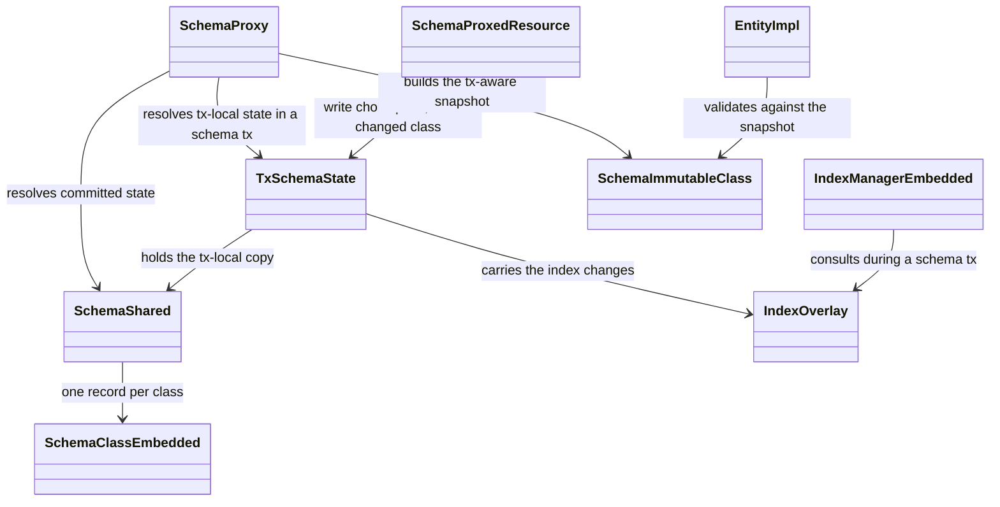
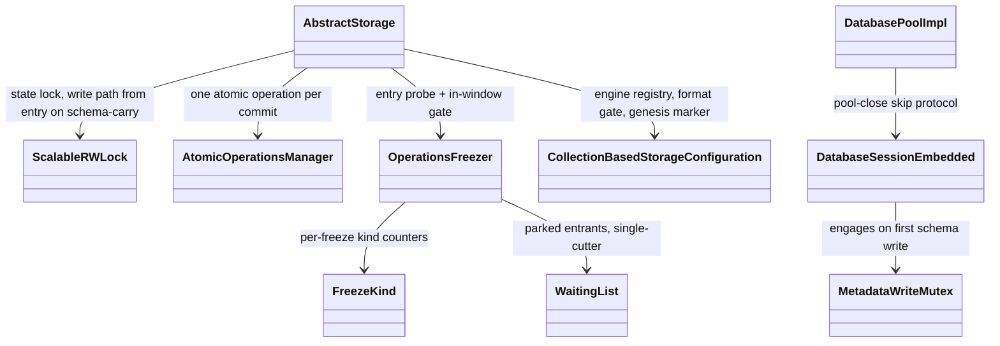
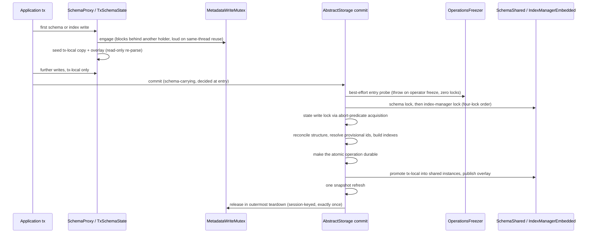
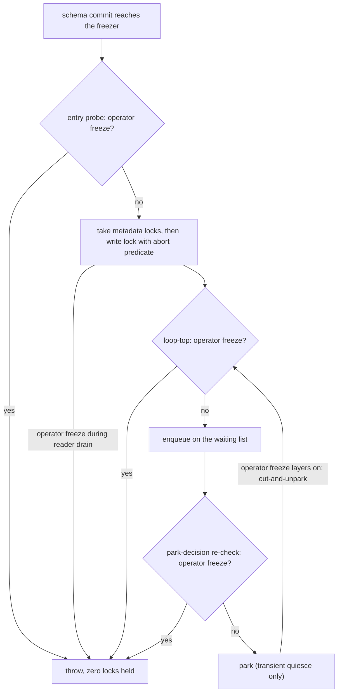

# Transactional Schema Operations — Final Design

## Overview

Before this change, storage led a schema change. Creating or dropping a class
or an index mutated storage structure first (the collections and the index
engines), then reflected the result into a metadata record. Each operation
self-committed in its own micro-transaction outside the user's transaction,
the entire schema lived in one record that was rewritten whenever any class
changed, and a schema change could not be rolled back with the transaction
that made it.

As built, the dependency is inverted. During a transaction, a schema or index
change mutates only metadata records — ordinary transactional records — so
rollback is free. At commit, storage diffs the committed metadata against the
current structure and creates or drops the matching collections and engines
inside the commit's own atomic operation, so the structural change is atomic
with the record writes and recoverable from the WAL.

Four primitives carry the inversion: a per-session copy-on-first-write
tx-local `SchemaShared` routed through `SchemaProxy`; a transaction-scoped
metadata-write mutex that serializes schema-changing transactions; per-class
schema records that remove the whole-schema write amplification YTDB-382
targets; and a schema-carrying commit that takes the storage write lock from
entry instead of upgrading mid-commit.

Several subsystems were restructured to fit: a tx-local index-definition
overlay, a tx-aware immutable schema snapshot (added during execution when
the committed-only snapshot proved to silently skip same-transaction
constraint checks), a freeze-kind-aware gate that keeps a schema commit from
turning an operator freeze into a read outage, file-base-keyed index-engine
files that make renames metadata-only, a two-phase genesis bootstrap guarded
by a completion marker, and an operator-driven export/import migration for
the schema-record format change.

This document records the design as implemented, not as planned. Core
Concepts defines the vocabulary; Class Design and Workflow lay out the
classes and the commit flow; four Parts develop the mechanism: the
transactional schema model, index transactionality, concurrency and locking,
and schema-format migration. Each section footer lists the decision records
it rests on; adr.md restates every record in full.

## Core Concepts

This design introduces nine load-bearing ideas. Each is named here and used
without re-definition in the Parts that follow; each entry pairs the concept
with the behavior it replaced, so the delta from the old system is visible at
a glance.

**Metadata-first inversion.** A schema change mutates metadata records during
the transaction and lets storage reconcile structure at commit, rather than
mutating storage first and reflecting it after. Replaces "storage leads,
metadata follows". → Part 1 §"Commit-time reconciliation".

**Tx-local schema view.** A per-session copy of `SchemaShared`, seeded on the
transaction's first schema write by re-parsing the committed schema records
read-only, and routed through `SchemaProxy`. The session sees its own
uncommitted schema; every other session sees committed state until commit.
Replaces "every session shares one live `SchemaShared`, mutated in place".
→ Part 1 §"Tx-local schema view".

**Provisional collection id.** A sentinel negative id (`<= -2`, disjoint from
the abstract-class marker `-1`) that a collection created inside the
transaction carries until commit resolves it to a real id — before any record
serializes, mirroring how temporary record ids resolve. Replaces "real
collection id allocated eagerly at create time". → Part 1 §"Commit-time
reconciliation".

**Per-class schema records.** A root schema record holding a link set to one
standalone record per class, so a one-class change writes one record.
Replaces "all classes serialized into a single schema record". → Part 1
§"Per-class schema records", and Part 4 for the migration the format change
requires.

**Tx-aware schema snapshot.** The immutable schema snapshot resolves the
tx-local structure during a schema or index transaction, so entity validation
and serialization enforce same-transaction classes, property types, and
constraint rules. Replaces "the snapshot always reflects committed state,
silently skipping same-transaction constraints". → Part 1 §"The tx-aware
snapshot".

**Tx-local index overlay.** A lightweight overlay of index definitions
(committed + tx-created − tx-dropped), never a content copy, because an index
is a thin handle over a storage-backed engine. Replaces "the shared index
manager mutated per operation". → Part 2 §"Tx-local index overlay".

**Engine file-base id.** A persisted, monotonically allocated per-engine id
from which every index-engine file derives its on-disk base name, decoupling
files from both the index name and the reused engine registry slot. Replaces
"engine files keyed by index name". → Part 2 §"Base-keyed engine files and
metadata-only rename".

**Schema-carrying commit** ("schema-carry" for short). A commit that carries
schema or index changes, recognized at commit entry from the same signal
that engaged the metadata-write mutex; it takes the storage state write lock
from the start, while a pure-data commit keeps the read-lock fast path.
Replaces "read lock with a mid-commit upgrade for structural work". → Part 3 §"The metadata-write
mutex and lock order".

**Freeze-kind taxonomy.** A classification of freezes into operator
(long-lived, admin-initiated) versus transient internal quiesce, recorded at
the sites that register a freeze, so a schema commit can fail loudly against
the first and park briefly against the second. Replaces "one
undifferentiated freeze gate". → Part 3 §"The freezer gate".

## Class Design

The schema and index side carries the tx-local view, its routing, and the
snapshot. The diagram shows the seams a schema transaction flows through.

`SchemaProxy` (with its class- and property-level proxy siblings) is the
routing seam: outside a schema transaction it resolves against the committed
`SchemaShared` and the snapshot; inside one it resolves by name against the
session's `TxSchemaState`. Resolution is three-tier — the snapshot, a
captured delegate, and name-binding into the tx-local copy during the
session's own schema transaction — so a proxy captured before the
transaction started still lands in the tx-local view. `SchemaProxedResource`
is the tx-local write choke point: every routed class- and property-level
write resolves its target there and marks the owning class changed — one of
the three marking channels that feed the commit-time delta (the other two
are described in §"Commit-time reconciliation"). `TxSchemaState` holds the
tx-local `SchemaShared` copy, the changed-class set, the provisional-to-real id
carrier, and the `IndexOverlay`. `SchemaImmutableClass` instances (reached
through the metadata facade) form the refcount-pinned snapshot tier that
about 190 call sites consume; `EntityImpl` validation and serialization read
it, which is why the snapshot had to become tx-aware.

The storage and concurrency side carries the commit, the mutex, and the
freezer gate.

`AbstractStorage` owns the schema-carrying commit: the entry signal, the
four-lock order, the freezer probe and gate, reconciliation, provisional-id
resolution, the lock-free commit-window read substrate, promotion, and the
undo arms of the failure path. `MetadataWriteMutex` is a one-permit
semaphore with an authoritative ownership record; `OperationsFreezer` gained
the `FreezeKind` taxonomy and the kind-aware gate, with `WaitingList`
holding parked entrants. `CollectionBasedStorageConfiguration` persists the
index-engine registry (including each engine's file-base id and the
allocation floor), enforces the storage-format version gate, and stores the
genesis completion marker. `DatabasePoolImpl` and the pooled session
implement the teardown-intent handshake and the pool-close skip protocol
that keep the mutex healable. `ScalableRWLock` is the non-reentrant storage
state lock, extended with an abort-predicate exclusive acquisition the
freezer gate uses.

## Workflow

A schema-carrying commit is the central flow. The sequence shows the path
from the transaction's first schema write through promotion and release.

The freezer is consulted twice more than the diagram shows: at the loop-top
throw site and at the park-decision re-check, so an operator freeze engaging
at any point before the write lock is held produces a loud throw rather than
a park (see §"The freezer gate"). Reconciliation runs drops, then creates,
through lock-free inner primitives under the already-held write lock, and
the commit-time index build runs inside the same atomic operation.
Promotion re-parses the committed per-class records into the existing shared
`SchemaShared` instance — never adopting tx-local objects — and the overlay
publishes replacement definition objects under the index-manager write lock,
followed by exactly one snapshot refresh.

# Part 1 — The transactional schema model

How a schema change becomes a transactional record change: the isolated
schema view, the commit that turns changed metadata into structure, the
per-class record format, the tx-aware snapshot, and the genesis bootstrap
that exercises the whole path against an empty database.

## Tx-local schema view

**TL;DR.** A schema transaction mutates a per-session copy of `SchemaShared`,
seeded on its first schema write and routed through `SchemaProxy`; the shared
instance stays at committed state until commit, so other sessions see the old
schema and rollback is free. Every schema and index mutation entry point —
throw-guarded and self-committing alike — now rides the user transaction.

Schema isolation is record-local, identical to data-record isolation: a
transaction changes only its own copies of the metadata records, and the
shared structures update only at commit. The tx-local view is a full working
`SchemaShared` rather than an overlay, because `SchemaShared` holds derived
state that one class computes from its relationships with others — the
superclass and subclass links, each class's polymorphic collection-id union,
the global-property table — and a full copy lets the existing mutation
methods recompute all of it unchanged. An overlay would have re-implemented
that recomputation inside the read path.

The seed, as built, is a read-only re-parse of the committed root record and
its per-class records — never a re-serialization of the live shared
instance. Serializing the live instance from inside the caller's transaction
would dirty the committed metadata records into that transaction and could
rebind a committed class record id mid-flight; the read-only re-parse leaves
committed records untouched. Re-parsing rather than field-cloning is also
what keeps the copy self-contained: each class object binds to its owning
schema and to its sibling classes by direct reference, so a field clone
would leak shared instances into the private copy, while the re-parse
constructs fresh classes bound to the tx-local instance. The seed binds each
class to its committed per-class record id, which the commit later uses to
write back exactly the changed classes.

During the transaction, class and property proxies resolve their target by
name in the tx-local copy on each call, so a proxy captured before the
transaction started resolves to the tx-local class and can never hand a
shared class object into the private copy. Routed writes go through one
choke point: resolving a target for write records it and marks the owning
class changed (the full three-channel marking rule is developed in
§"Commit-time reconciliation").

Two families of entry points blocked this model and were reworked. The first
threw on an active transaction (the schema-record save, class drop, index
create and drop); each now runs inside the user transaction. The second —
the index collection-membership updates that class creation and superclass
changes ripple into — self-committed in a nested internal transaction, which
made the membership change visible immediately and durable even if the user
transaction rolled back. These now write into the tx-local overlay and apply
only at commit. Deferral is also required for correctness: the membership
ripple can name a collection created in the same transaction, which has only
a provisional id until commit.

### Edge cases / Gotchas

- A pre-transaction captured class proxy whose method is called inside the
  transaction is the transaction's first schema write and must engage the
  mutex and seed the copy; instance capture must not bypass the routing.
- The silent failure pinned by test is the eager shared index-membership
  apply: a rollback must leave the shared index's collection membership
  untouched (`SchemaDeguardTest` covers the de-guarded entry points).
- Implementation-typed arguments are re-resolved by name on the tx-local
  side before linking, so a shared class object never enters the tx-local
  graph.

### Decisions & invariants

- D-records: D4 (schema isolation is record-local, identical to data), D8
  (per-session copy-on-first-write tx-local schema, seeded by read-only
  re-parse), D1 (metadata-first inversion, which the de-guarding enables),
  D15 (the overlay the membership changes route through)
- Invariants: a transaction sees its own uncommitted schema while other
  sessions see committed state; no de-guarded entry point self-commits — all
  mutations ride the user transaction.

## Commit-time reconciliation

**TL;DR.** At commit, storage diffs committed versus tx-local collection ids
and drops/creates collections and engines inside the commit's own atomic
operation; provisional ids resolve before any record serializes, and the
commit's inner primitives and record reads run lock-free under the held write
lock. A failed commit leaves nothing behind; a crash replays from the WAL.

The delta reads from the transaction's existing change tracking — there is
no separate intent list. The changed-class signal arrives through three
marking channels: the tx-local write choke point marks the resolved class
(or a property's owner class) on every routed write; the whole-schema
operations — class create, drop, and rename — mark their specific classes
explicitly, since a whole-schema hook could not derive the names they touch;
and root-payload writes (global properties, blob collections) are caught by
the commit's root-payload diff rather than by class marking. Over-marking is
correctness-safe (an unchanged class serializes identically), while
under-marking silently drops a per-class record write, so the choke-point
channel exists precisely to close the whole class of future mutator
omissions.
A class rename un-marks the old name, because an absent name reads as a
drop on the write-back side; a pure-data truncate stays off the schema-carry
path entirely.

Create/drop detection is the set difference over the committed and tx-local
collection-id sets, never a scan of the changed-record set: a dropped class
is a record deletion, not a property change, so it never appears among
changed records, while its collection id is present in the committed set
and absent from the tx-local one. Collection id is the stable structural
identity, so a rename keeps its ids and is structurally inert.

A collection created in the transaction carries a provisional sentinel id
`<= -2` — disjoint from the abstract-class marker `-1`, which existing code
detects with a negative-id test — resolved to its real id at commit before
any record serializes, extending the same resolution pattern temporary
record ids use (`ChangeableRecordId`). As built, both producer sites route
through the provisional seam: class creation and the tx-local
abstract-to-concrete class alter, which previously allocated a real
collection eagerly and carried the same rollback exposure. Resolution
covers the collection ids stored inside changed-class property values; a
provisional id reaching durable bytes would lose the class's collections at
the next open.

Two ordering constraints are load-bearing: an engine is created before any
lookup by id can reach it, and a collection is created before a record
position is allocated in it. Reconciliation therefore runs before record
allocation, through lock-free inner primitives — never the public structural
methods, which take the non-reentrant state lock and would self-deadlock
under the already-held write lock. Execution proved the re-entry surface
was wider than the structural primitives: a thread dump caught schema
serialization re-entering the read lock, so every session record-read path
the commit body reaches under the write lock — schema serialization,
promotion, the security subsystem's collection-name lookups — received a
lock-free variant. The commit window thus has a general lock-free
record-read substrate rather than a handful of special cases.

Crash safety rides the existing atomic-operation WAL; no deletion or
id-reuse pool was added. File creates and deletes are buffered intent
applied only when the atomic operation commits, which rollback skips, so a
rolled-back or crashed-before-commit transaction leaves storage files
byte-for-byte unchanged. The recovery half rests on a replay fix shipped
with this work: a missing-file page redo now scans the current atomic unit
forward for the matching file-create record and materializes the file — a
single reconciliation point reached by both restore callers, including
incremental-backup restore. Before the fix, a crash between a unit's
durable end record and its physical apply aborted the restore and discarded
all later units. One asymmetry needed a dedicated arm: the in-memory disk
cache never reverts an eager file add, so the commit-failure path gained a
component-guarded create-side revert that drops the orphaned engine file
(a no-op on the disk engine).

A failed commit leaves no phantom registration: the undo arms unwind both
the in-memory and on-disk registrations of collections and engines on both
storage engines, and ids drawn by the failed commit are not consumed
globally. `SchemaCommitReconciliationTest` and
`RestoreAtomicUnitPageOperationTest` pin the reconciliation and replay
behavior.

A schema-carrying commit excludes concurrent data commits for its whole
duration (the write lock is held from entry — see Part 3). The stall
envelope is bounded by what the commit does: metadata record writes,
collection and engine creation, and the empty-source index build. The
design accepts this envelope on the premise that schema changes are rare;
that premise is stated as the load-bearing constraint it is, rather than
hidden.

### Edge cases / Gotchas

- Abstract classes carry the single collection id `-1`; the provisional
  predicate must distinguish `-1` from `<= -2`.
- Dropping a class inside a transaction does not drop the class's committed
  indexes at commit — drop-side reconciliation covers explicitly dropped
  indexes only. Pre-existing seam, deliberately left in place; tracked in
  the issue tracker.
- In the post-durability tail, publishing the reconciled index definitions
  is the one step outside the containment guard: a throw there reports an
  already-durable commit as failed with partially published in-memory index
  maps. Self-heals on reopen; pre-existing; tracked.
- The in-doubt-commit containment that moves storage to an error state on a
  mid-apply failure covers schema-carrying commits; a pure-data commit
  failing at the same point gets a bare rethrow with no error-state
  transition. Pre-existing; tracked.
- A schema-carrying commit can silently lose records if a metadata root
  record's link set converts from its embedded to its B-tree-backed
  representation mid-serialization inside the commit window; the trigger
  surface is on this branch, the root cause is pre-existing and tracked.
- Crash-before-commit WAL-replay coverage for the reconciliation path
  leans on the replay fix's own regression test; a dedicated crash
  integration test remains open and tracked.

### Decisions & invariants

- D-records: D1 (storage reconciles committed metadata at commit), D2
  (provisional ids, both producer sites), D3 (structure strictly before
  use; the lock-free commit-window read substrate), D6 (delta from existing
  change tracking, completed by choke-point marking), D9 (diff over
  collection ids, not class names), D10 (structural revertibility rides the
  atomic-operation WAL; lazy-consult replay; create-side cache revert)
- Invariants: a structural change is atomic with its commit and free to
  roll back; a provisional id never reaches durable bytes; structure is
  applied strictly before it is needed; a failed commit leaves no phantom
  registration on either storage engine.

## Per-class schema records

**TL;DR.** The monolithic schema record became a root record (global-property
table, collection counter, blob collections) plus a link set to one standalone
record per class. A one-class change writes one class record; the root is
written exactly when its non-link payload changes. The schema format version
moved from 4 to 6 behind a strict equality gate.

Each class binds the record id of its own record at load — mirroring the
index-manager pattern — and serializes itself back into that record at
commit; per-class dirty tracking limits the
write set to the classes that changed. A new class writes a fresh record
whose temporary id becomes permanent at commit; a dropped class deletes its
record and removes the link from the root's link set. Inheritance needs no
record-to-record links, because a class names its superclasses by name in
the serialized form.

The root record must join the write set whenever its payload changes, and
the transaction's ordinary dirty tracking delivers that: a property create
adds a global-property-table entry, and a collection addition advances the
counter, both of which are root-record property writes. Excluding the root
would dangle class-property references to global-table slots and would
revert the collection counter, handing out colliding collection names on
the next open.

The schema format version gate is strict equality: any version other than
the current one — the pre-bump monolithic form and the older legacy
version-5 form alike — rejects at load and redirects
to the export/import migration (Part 4) rather than risking a mis-parse.

The schema serializer takes no lock of its own: the caller's held schema
write lock — the schema's own lock, not the storage state lock — is its sole
synchronization, asserted at entry. Any future change to the schema lock
model must preserve or consciously revise this contract.

### Write amplification

This is the change YTDB-382 exists for. Before, any class change rewrote
the entire schema — cost proportional to the whole schema, paid per
mutation. Now the write cost is proportional to the changed classes plus,
only when its own payload changes, one root record. Schema-heavy workloads
(many classes, frequent single-class evolution) stop paying the
whole-schema serialization and page-write tax on every change. No further
performance mechanism is involved; this structural fix is the performance
story of Part 1, which is why no dedicated performance section exists in
this document.

### Edge cases / Gotchas

- Promotion at commit re-parses the committed per-class records into the
  existing shared instances; tx-local objects, whose owner is the dead
  tx-local copy, are never adopted.
- The root record is bootstrap-valid when empty: commit reconciliation and
  reopen tolerate the empty root shell a fresh database starts from (the
  index-manager root needed the same fix, found by verification during
  genesis work).
- Existing databases cannot open under the new format; they migrate via
  Part 4's export/import.

### Decisions & invariants

- D-records: D14 (per-class schema records; strict-equality version gate;
  write-lock-asserted serializer)
- Invariants: a one-class change writes one class record and the root is
  written exactly when its non-link payload changes; the serializer's sole
  synchronization is the caller's held schema write lock.

## The tx-aware snapshot

**TL;DR.** The immutable schema snapshot is transaction-aware: during a
schema or index transaction it resolves the tx-local structure, so entity
validation and serialization enforce same-transaction classes, property
types, and constraint rules instead of silently skipping them. Added after
the commit machinery was complete; supersedes the committed-only snapshot.

The original design left the snapshot reflecting committed state during the
transaction. Read-your-writes held for schema structure (reads routed
through the proxies saw the tx-local view) but broke for the schema
contract: `EntityImpl` validates and serializes against the snapshot — the
single tier about 190 call sites consume — so a constraint or property type
created earlier in the same transaction was
silently not enforced on records written later in that transaction. A
completion review judged the silent skip a real developer-experience break,
and per-field resolution through the proxies was measured as too slow for
the validation hot path, so the snapshot itself became tx-aware.

During a schema or index transaction, snapshot construction resolves the
tx-local structure; outside one, it reflects committed state as before. The
snapshot stays refcount-pinned per operation and rebuilds through the same
lazy null-and-rebuild seam the index overlay uses, so a mid-transaction
schema change invalidates it exactly like a mid-transaction index change
invalidates the index sets. Two guards complete the picture: the
commit-path working-set read is guarded so a tx-aware snapshot never hands
the collection resolver a provisional collection id, and the query planner
extends its skip-unbuilt-index treatment to classes whose collections are
still provisional.

### Edge cases / Gotchas

- The snapshot clear at commit is single-owner: it lives in a nested
  try/finally owned by the commit, and the redundant secondary clear was
  deleted rather than left as a second writer.
- A validation failure against a same-transaction constraint is new,
  intended behavior; code that relied on the silent skip was relying on a
  defect.

### Decisions & invariants

- D-records: D21 (tx-aware snapshot; supersedes the committed-only snapshot
  of the frozen design)
- Invariants: during a schema or index transaction the snapshot reflects
  tx-local classes, property types, and constraint rules, so validation
  enforces a same-transaction constraint instead of skipping it.

## Genesis bootstrap

**TL;DR.** Genesis is two-phase: one schema transaction spanning every
metadata creator and the O/V/E graph classes, then one merged data
transaction inserting the default roles and users. Storage itself creates
the blob collections, keeping phase 1 pure schema; a completion marker
written after both phases makes a crashed half-created database refuse to open.

The two-phase shape exists because the security bootstrap looks users up
through direct index reads, not through the query planner: a direct read
needs a built engine, and an index created in the same transaction has no
engine until commit. Committing the schema phase first guarantees the
`OUser` name index is built before any user record is inserted. A unified
single transaction would have exposed the same-transaction unbuilt index to
those direct lookups. The schema phase is one commit under one mutex
engagement, and it builds the user-name unique index at that commit.
Genesis is also the end-to-end smoke test of the
whole commit machinery: it exercises seeding from an empty schema,
reconciliation, the commit-time index build, and promotion on every
database create.

Blob collections are storage-embedded: `AbstractStorage` creation runs one
atomic operation that creates the internal collection and then the blob
collections, and genesis afterward only registers the blob collections in
the schema — a pure root-payload write riding the phase-1 schema
transaction. The single creation operation is what renumbers collection ids
on fresh databases: blobs occupy the low slots and class collections shift
up. Production lookups are name- and schema-dynamic, so nothing in the
engine depends on fixed ids; the importer remaps dump-declared
blob-collection ids through its collection mapping and never uses raw
source ids in the target id space.

The completion marker is a `genesisCompleted` storage-configuration string
property, stored durably via `CollectionBasedStorageConfiguration`. The
shared context writes it as its final creation act, in its own dedicated
WAL atomic operation, strictly after the phase-1 and phase-2 commits — a
third separate durable act, folded into neither transaction. At open the
shared context reads it back, deliberately after schema load, so an
old-format database hits the schema-version redirect before the marker
check; absence raises `GenesisIncompleteException`. The same check runs
when a create call adopts an existing on-disk residue. The system database
is covered by the identical mechanism with no special-casing. A crashed
half-created database is therefore refused loudly, never silently
self-healed — a deliberate choice, because a partially created database is
indistinguishable from corruption.

### Edge cases / Gotchas

- There is an accepted fail-closed false-refusal window: a crash after both
  genesis commits but before the marker's own atomic operation is durable
  makes a genesis-complete database refuse to open. Fail-closed was chosen
  over shrinking the window.
- Genesis itself creates the function and sequence classes inside the
  schema transaction; what stays on the legacy top-level creation path until
  that path's removal is only the lazy create-if-absent seam those libraries
  keep for databases that lack the classes.

### Decisions & invariants

- D-records: D18 (two-phase genesis), D22 (the genesis completion marker),
  D23 (storage-embedded blob collections and the fresh-database collection
  renumbering)
- Invariants: genesis builds and commits the schema, including the
  user-name unique index, before any user record is inserted; a
  half-created database is refused loudly at open.

# Part 2 — Index transactionality

Indexes reach transactional isolation through an overlay rather than a
copy, build their engines inside the creating commit, and key their files
by a persisted id so renames never touch storage.

## Tx-local index overlay

**TL;DR.** Indexes get a tx-local overlay of definitions (committed +
tx-created − tx-dropped) with four tracked categories: created, dropped,
in-place rename, and in-place collection membership. The overlay is consulted
through a deliberately scoped routing seam; the tx-local snapshot
force-rebuilds lazily on every mid-transaction index change.

An overlay suffices where the schema needed a full copy because an index is
a thin handle over a storage-backed engine: the definition and two lookup
maps are the only in-memory state, the data lives in the engine, and a
tx-created index has no engine to copy at all. Copying handles would
duplicate pointers to shared engines and give no isolation.

Collection membership is a category in its own right: the superclass and
collection-addition ripple changes which collections a committed index
covers without creating or dropping anything, and folding it into the other
categories would silently lose polymorphic coverage. The commit persists
the membership delta so the parent index covers a new subclass collection
from commit on. Rename is likewise in-place: it re-keys the association
commit-only, so no shared index object mutates mid-transaction.

The overlay reaches readers through the class-index lookup family that
feeds the snapshot and automatic index selection — a deliberately scoped
seam. On any mid-transaction index change the tx-local snapshot is nulled
and rebuilt on next read; without that, automatic index maintenance would
route same-transaction inserts to a stale cached index set and silently
drop them from a tx-created index. At commit the index work runs three
steps — engine creates and drops from the changed-index set, the changed
per-index entity writes, and publication of the overlay into the shared
index manager as replacement objects under its write lock — sharing a
single trailing snapshot refresh.

Execution hardened the edges: a tx-created index now honors the
ignore-null-values setting (a null placeholder could previously enter its
membership set), an in-transaction duplicate index create is rejected
loudly while conditional-create and drop-then-recreate flows are preserved,
and the seam was extended to the involved-index family for the tx-dropped
direction only — a tx-created index stays invisible to it until commit.

### Edge cases / Gotchas

- The wider index-manager introspection surface (existence checks, flat
  enumeration, direct name lookup) still reads committed state during the
  transaction, so a few SQL DDL statements and schema-API introspections
  observe committed-only index state mid-transaction. Deliberate seam
  scoping; tracked.
- The index-manager root record's link set stays monolithic, so
  incremental creation re-serializes the whole set per add; the
  optimization is folded into YTDB-1064.
- The supernode index shortcut in the SQL traversal functions
  deterministically fails whenever it executes — reading a matched edge's
  endpoint through the generic property API trips the reserved-property
  guard, even on committed healthy indexes. Pre-existing, surfaced while
  testing the overlay; tracked.

### Decisions & invariants

- D-records: D15 (definition overlay with four categories; scoped seam;
  lazy snapshot rebuild)
- Invariants: indexes are overlaid, never copied; the tx-local snapshot
  force-rebuilds on every mid-transaction index change, so same-transaction
  inserts into a tx-created index are tracked.

## Index build and query-usability

**TL;DR.** The build for a tx-created index runs inside the exclusive-locked
commit as a lock-free scan plus a final-state re-derivation, emitting zero
extra WAL units; only an empty source collection is built eagerly, and a
non-empty source is rejected loudly. Until commit the new index is not
query-usable: readers skip it and fall through to the correct merged scan.

The build covers all rows exactly once from two sources: the population
scan reads committed rows while skipping every record id in the
transaction's own record-operation set, and the re-derivation then
contributes only final-state puts for the transaction's touched rows —
created and updated rows in their final form, deleted rows skipped. The
scan is a lock-free internal read (a copied session or nested transaction
would re-enter the non-reentrant state lock the commit already holds), and
everything lands in the commit's single atomic operation, so the build
rolls back with the commit rather than as a separately committed step.
`CommitTimeIndexBuildTest` pins the exactly-once and final-state
properties.

The eager-build boundary was settled during execution: forward-build and
recovery-replay heap both scale with the atomic unit's size, so v1 builds
eagerly only when the source collection is empty and rejects a non-empty
source loudly, naming YTDB-1064 (the off-lock, streamed, populated build)
in the error. The rejected alternative — accept with a documented heap
envelope — was judged a silent operational trap.

The stall envelope of the in-commit build is therefore bounded: an
empty-source build contributes only the transaction's own rows via
re-derivation, so the commit window's exclusivity (Part 3) is not extended
by a table scan. This is the second half of the low-schema-change-rate
premise: rare schema commits, each with a bounded build.

Inside the creating transaction the index has no engine, and any read of an
unbuilt engine throws, so the planner skips such indexes and the WHERE path
falls through to a full scan over the merged transaction view (committed
rows plus the transaction's changes). As built, a guard also covers
non-planner readers that reach an engine-less index, so nothing outside the
planner can trip over the missing engine.

### Edge cases / Gotchas

- A concurrent pure-data commit whose index enqueue ran before the new
  index published can still miss it — the same shape as the pre-existing
  fill race; closure is tracked as YTDB-1101.
- The read-merge behavior of already-built indexes is preserved unchanged;
  only unbuilt engines are skipped.

### Decisions & invariants

- D-records: D12 (in-commit build, empty-source-only for v1; loud rejection
  otherwise), D13 (tx-created index not query-usable until commit; planner
  and non-planner guards)
- Invariants: an unbuilt index is skipped by every reader and the scan
  fallback returns the correct merged view; the build commits exactly the
  transaction's final state.

## Base-keyed engine files and metadata-only rename

**TL;DR.** Every index-engine file derives its on-disk base from a
persisted, monotonically allocated per-engine file-base id — never from the
index name or the reused engine registry slot. Collection names come from a
counter alone. Together these make class rename and index re-association
pure metadata operations that touch zero storage files.

Collection names use a counter-only scheme (the `c_` prefix plus a counter,
via `COLLECTION_NAME_PREFIX` in `SchemaShared`), decoupled from class
names, so a class rename renames no collection file and the previously
un-journaled physical file rename path is removed outright. The name
generator skips names already present — an import can declare collection
names that collide with the counter's sequence, a real bug found and fixed
with the skip.

Engine files use stems derived from a new persisted id: `ie_` plus the
file-base id (`INDEX_ENGINE_FILE_STEM_PREFIX` in `AbstractStorage`), for
the data, null-bucket, and histogram files alike. The original plan keyed
files by the engine's registry slot id, but that premise was falsified
during execution: slot ids are reused by design after failed-commit
cleanup, so a fresh persisted identity was introduced instead. The id is a
persisted field of the engine's configuration entry (`IndexEngineData`,
whose serialized form in `CollectionBasedStorageConfiguration` moved from
property version 1 to 2 to carry it). Allocation is a non-reverting
in-process high-water-mark allocator seeded at open from the maximum of a
persisted floor (an integer property written inside the creating atomic
operation), the maximum persisted file-base id, and a sweep of existing
`ie_` files — so a rolled-back allocation can never cause a stem collision.
Base-keying also dissolves the same-name drop-and-recreate file collision,
so WAL replay runs one uniform path with no file-name recycle branch. The
null-bucket extension was added to the drop-time extension list in the same
change, fixing a pre-existing file leak.

The file-base id is a storage-format break, and the schema-record version
gate ships inside the database and runs only after storage opens, so it
cannot cover this. The storage-configuration format version
(`StorageConfiguration.CURRENT_VERSION`) moved from 23 to 24, checked at
load before the configuration is parsed, rejecting both directions: an
older version redirects to export/import, and a newer version is rejected
with an instruction to open the database with the version that created it.
Pre-branch binaries had no load-time version check at all, so they fail
cryptically on a version-24 database — documented as unsupported, matching
the precedent of the previous format bump.

Class rename re-association ships in v1: a rename re-keys the
class-to-indexes association and updates each affected definition's class
name (recursing into composite definitions), so indexes keep accelerating
queries under the new name. On the transactional path this applies
commit-only through the overlay's rename category; a symmetric eager arm
covers legacy top-level DDL, keyed add-before-remove so no window exists
where neither key resolves. Commit-time application publishes replacement
definition objects rather than writing fields into shared definitions, so
lock-free readers never observe a torn class name. Baseline tracing
confirmed this fixes a pre-existing defect: renamed classes previously left
their indexes durably orphaned. The index's own stored name lags after a
class rename — the inert index-name rename and an explicit rename statement
are deferred as YTDB-1066.

### Edge cases / Gotchas

- The renaming transaction's own queries on the renamed class fall back to
  an unaccelerated scan until commit (re-association is commit-only on the
  transactional path).
- Never-reused engine-file stems accumulate write-cache name-map tombstones
  under heavy DDL churn — an accepted risk.
- File-base-id allocation safety rests on the storage state write lock
  alone, pinned as a documented invariant plus an assertion — an accepted
  risk.
- Crash and WAL-replay soundness of engine-family creation credits the
  lazy-consult replay fix as a prerequisite; a mid-family-creation crash
  test pins it.

### Decisions & invariants

- D-records: D11 (counter-only collection names; rename path neutered), D16
  (persisted file-base-keyed engine files; storage-format version 24 gate
  in both directions), D17 (metadata-only class-rename re-association;
  replacement-object publication)
- Invariants: a class rename touches zero storage files and keeps every
  index accelerating under the new name; an index rename is metadata-only.

# Part 3 — Concurrency and locking

The serialization mutex and the lock order keep schema commits
deadlock-free; the mutex lifecycle keeps pool teardown from wedging DDL;
the freezer gate keeps a schema commit from turning an operator freeze into
a read outage.

## The metadata-write mutex and lock order

**TL;DR.** A transaction-scoped one-permit semaphore covering schema and
index changes serializes writers by blocking, never by contention-abort; it
engages above the shared metadata locks on the first write and is released
exactly once, in the outermost teardown, by a session-keyed compare-and-clear.
A schema-carrying commit takes its four locks in one fixed acyclic order.

`MetadataWriteMutex` is a one-permit semaphore rather than a thread-owned
lock: teardown of a still-checked-out pooled session legitimately runs on a
foreign thread, and a thread-owned lock could then never be released — a
permanent wedge. A bare semaphore is unsafe in the other direction (any
thread can increment it), so the permit carries an authoritative ownership
record written at acquire: owning session, acquire ordinal, and acquiring
thread. The session is the release key — release is a compare-and-clear
that fires only if this session still owns the permit. The ordinal
distinguishes this acquisition from a later one, rejecting every stale
presenter so the permit is never double-released. The thread is diagnostic
and engage-guard only: engaging on a thread whose current holder is a
different session fails loudly instead of self-deadlocking, and the
wait diagnostic names the holder. Normal and abnormal releases funnel
through one atomic claim of the ordinal; the release from teardown
warn-noops when it loses the race, because a throw from a teardown block
would mask the primary exception. Engage is an unbounded, interruptible
timed re-wait loop — DDL never spuriously fails on a slow holder — with a
periodic warning naming the holder's session, thread, ordinal, and elapsed
time, and a loop-top re-check of the waiter's own teardown state.
`MetadataWriteMutexTest` pins that two concurrent schema transactions
serialize without abort and that the permit never wedges.

The four locks are taken in one acyclic order: metadata-write mutex, then
the schema lock, then the index-manager lock, then the storage state write
lock. The mutex engages above the shared metadata locks, never from inside
one — engaging under a held shared lock would park a thread that cannot
release what it holds. The schema and index-manager locks precede the state
lock because promotion mutates the structures they guard while the data
path can already hold the opposite nesting. A schema-carrying commit
decides at entry, from the same signal that engaged the mutex, to take the
write-lock branch — an index-only transaction takes it too — eliminating
the mid-commit read-to-write upgrade and its interleaving window. Pure-data
commits keep the read-lock fast path unchanged.

The write lock held for the commit's whole duration means lock-based schema
reads stall behind a schema commit. The two hot read sites that still took
locks — per-record class resolution on the vertex-creation path and
lower-subclass resolution in graph pattern matching — were converted to
snapshot-first reads with a guarded fallback, so the stall surface is the
rare cold path, not the hot path. The residual exclusivity — a
schema-carrying commit excludes concurrent data commits for its duration —
is the design's one deliberate throughput trade-off, accepted on the
premise that the schema-change rate is low. That premise bounds the stall
envelope: rare schema commits, each doing metadata writes plus bounded
structural work (Part 1) and an empty-source-bounded index build (Part 2).

Teardown of every transaction-scoped resource runs only on the owning
thread. The one legitimate cross-thread caller — pool shutdown of a
checked-out session — runs the owning session's own teardown. Two
mechanisms close the teardown races. First, a store-then-load handshake: a
teardown publishes a dedicated volatile teardown-intent mark before its
release pass (set at the top of every internal close, cleared on session
reuse), while an engage writes the holder record after acquiring the permit
and then re-checks the mark, self-releasing and throwing if it finds it —
so an engage caught mid-flight can never leave a permit with no releaser.
Second, the pool-close skip protocol: a pool close that finds the session's
transaction committing on its owner thread performs only mark-and-log and
defers full teardown to the owner as sole completer, keeping the
session-count transition until the owner finishes.

### Edge cases / Gotchas

- A wedged or stranded owner keeps the mutex: cross-thread reaping is out
  of scope, DDL stays loudly unavailable until restart, and reclamation is
  deferred as YTDB-1114. A same-session re-engage on a stranded holder
  throws immediately, naming the stranded holder and the likely cause.
- The skip protocol's detection is racy by design: a late skip means the
  commit already finished; a late rollback is the previous behavior —
  strictly no worse.
- Owner and pool concurrently tearing down the same idle open transaction
  produce bounded double-teardown log noise on a discard path — accepted.
- Post-pool-close choreography can race a live commit's in-memory map
  publication only via non-skip close paths; durable state stays serialized
  by the state lock.
- One thread cannot hold two simultaneously open schema transactions over
  two sessions (the engage-side loud rejection); sequential schema and data
  transactions alongside a held mutex remain legal.

### Decisions & invariants

- D-records: D5 (single schema writer by blocking, never contention-abort),
  D7 (the metadata-write mutex: engagement, ownership record, release
  protocol, teardown handshake, pool-close skip), D19 (write lock from
  entry for schema-carrying commits; snapshot-first conversion of the two
  hot lock-based read sites)
- Invariants: the four locks are taken in one acyclic order; the mutex
  engages above the shared metadata locks and fails loudly on same-thread
  cross-session engagement; the permit has exactly one releaser and never
  wedges; transaction-scoped resources are torn down only on the owning
  thread.

## The freezer gate

**TL;DR.** A schema commit never turns an operator freeze into a read
outage: against an operator freeze it throws loudly with zero locks held;
against a transient internal quiesce it parks normally. A freeze-kind
taxonomy at the four registration sites plus a kind-aware gate at four
checkpoints deliver this; the guarantee is deliberately one-sided.

The freezer is the commit path's fifth synchronization object and sits
outside the lock order, which is exactly the hazard: a schema commit parked
on an undifferentiated freeze while holding the four locks would convert
the freeze window into a total outage, because every lock-based reader
would queue behind the held locks. Keying the gate on any freeze would
instead abort DDL against routine quiesces. The taxonomy is the middle:
`FreezeKind` distinguishes operator freezes from transient quiesces, and
kind counters are maintained at the four production freeze-registration
sites — the operator filesystem-snapshot freeze, storage synchronization,
the incremental-backup WAL copy, and the backup segment cut. Index rebuild
rides the synchronization freeze rather than registering its own. The
counters tolerate an operator freeze nesting over a transient one, and the
release side maps the operator sentinel release explicitly to the operator
decrement.

The kind-aware decision is evaluated at four checkpoints, so an operator
freeze engaging at any moment before the write lock is held produces a
throw, never a park inside the lock window:

1. a best-effort entry probe at schema-carry commit entry, sharing one
   helper (single counter read, single exception factory) with the
   authoritative gate;
2. the write-lock acquisition itself, through an abort-predicate exclusive
   acquisition on `ScalableRWLock`: the acquirer takes the write bit once,
   polls the operator-freeze counter inside the reader drain, and on a
   freeze releases everything and throws — so the write-lock request never
   queues a writer ahead of in-flight reads during a freeze;
3. the loop-top throw site in the freezer's wait loop;
4. the park-decision re-check after enqueueing, closing the
   engage-during-enqueue race.

The already-parked case is closed by the operator arm cutting and unparking
the waiting list at engage time: a commit parked behind a transient quiesce
wakes, re-evaluates the kind, and throws. The woken herd of parked data
commits re-parks — bounded to once per operator-freeze engagement, an
accepted cost. Under a throw-mode operator freeze, cut-woken parked data
commits deterministically throw the registered supplier's exception, pinned
by test. The gate and probe throw `ModificationOperationProhibitedException`
with a distinct, stable, tested message naming the storage and advising
retry after release. Implementing the cut surfaced and fixed a real
pre-existing liveness defect: the waiting-list cut assumed a single cutter,
and concurrent cutters could capture a cross-generation head-and-tail pair
and wait forever on a link never completed; the cut is now serialized (a
walk-only alternative was rejected as a proven livelock).

The guarantee is deliberately one-sided: a schema commit never converts an
operator freeze into a read outage, but rare spurious throws near freeze
release are accepted — loud and retryable — and tests must not pin the
absence of false positives.

### Edge cases / Gotchas

- The gate arms the transactional schema-carry commit path only; legacy
  top-level DDL is unarmed and can park holding metadata locks or the write
  lock under a park-mode operator freeze — up to a full outage for the
  freeze duration. Accepted because the legacy path is removed in an
  upcoming change; the gate design is legacy-agnostic so later arming is
  additive.
- Quiesce theft is pre-existing: the freezer's counters are identity-less,
  so a double release racing another registered freeze can silently void
  that freeze's quiesce; a per-id release ledger is the eventual fix.
- Supplier-record misattribution under overlapping mixed-mode operator
  freezes shares the identity-less root cause: the thrown error is always a
  genuine operator-freeze rejection, but its attributed source can be
  wrong.

### Decisions & invariants

- D-records: D7 (the freezer-gate facet: kind taxonomy, four sites, four
  checkpoints, one-sided guarantee)
- Invariants: a schema commit throws against an operator freeze with zero
  locks held and parks only for transient quiesces; the one-sidedness is by
  design and tests must not assert no-false-positives.

# Part 4 — Schema-format migration

The per-class-record and storage-format changes are migrated by
operator-driven export/import, hardened fail-closed on both sides.

## Schema-format migration

**TL;DR.** Migration is operator-driven JSON export/import — it replaced the
in-place on-open migrator, so new code never parses the old format and no
partial-migration state exists. The version-15 exporter promotes nothing on
failure; the importer dispatches on the dump's declared version — strict
fail-closed for version 15, lenient for the legacy dumps migration rides on.

Opening an old-format database with new binaries is rejected on the schema
version check with a redirect to the documented operator migration runbook
(shipped with this change in the product documentation). Export reads the
logical schema and import rebuilds through the schema API, so the imported
database is written in the current format end to end.

The exporter moved from format version 14 to 15 (`DatabaseExport` carries
the current value). It rethrows record-scan failures by default; best-effort
skipping is an explicit opt-out that records an acknowledgment marker in
the dump's info section. Oversized records spill to a bounded transient
buffer past a configurable threshold (the `EXPORT_RECORD_SPILL_THRESHOLD`
global-configuration knob, defaulting in the tens of megabytes), so memory
stays bounded while every healthy record is exported whole — a record is
exported whole or not at all, including its copy-out into the dump. The
manifest (class, index, and record counts) is written strictly last, the
dump is promoted to its final name atomically, and promotion is gated on a
completion flag, so a truncated dump is never promoted.

The importer dispatches on the dump's declared exporter version. Version 14
and below keeps the lenient legacy behavior, because those dumps are the
migration vehicle and old exporters cannot retroactively gain strictness.
Version 15 gets the strict matrix: manifest verification, section-presence
checks, whole-stream gzip validation (single-member framing, full
consumption verified by inflater arithmetic, non-gzip input rejected), the
best-effort acknowledgment gate, and info-field validation with a
schema-version range check — the declared schema version must fall in
`[MIN_IMPORTABLE_SCHEMA_VERSION, CURRENT_VERSION_NUMBER]` (a constant on
`DatabaseImport` and the current schema version on `SchemaShared`,
deliberately two separate constants even though both equal 6 today, so a
future bump is a one-constant change). Version 16 and above rejects with a
redirect naming both versions. A dump with no declared version rejects
fail-closed at the first non-info tag or end of stream — only corrupt or
hand-damaged dumps lack a version, since every honest exporter declares one
first. A version re-declaration rejects at parse rather than silently
letting the last value win. Reader loops are bounded by explicit
end-of-stream detection on every path and version, legacy included, so
truncation is loud everywhere.

The acknowledgment gate is marker-keyed, not version-gated: any dump whose
info section carries the best-effort marker is refused without the explicit
operator acknowledgment flag, regardless of declared version. No honest
legacy exporter writes the marker, so refusing a dump that claims possible
incompleteness is intended fail-closed behavior.

Pre-flight rejections — the info-section matrix — throw before any target
mutation. Structural whole-stream rejections (manifest counts, gzip
consumption, section presence) are inherently post-mutation, which is why
the runbook mandates importing into a fresh database and discarding the
target on any failure: a structurally rejected target is condemned, never
returned to service. A two-pass import was considered and rejected.
Migration verification is logical equivalence — class set, typed
properties, per-class record counts, record contents including link
topology, user indexes, blob bytes — pinned by the end-to-end migration
rehearsal in `DatabaseImportInfoMatrixTest`. Byte- or id-keyed
comparison is structurally unsatisfiable because the import renumbers
collections and randomizes blob placement; a rid-mapping-aware comparator
was explicitly not commissioned.

### Edge cases / Gotchas

- Live-export consistency is manifest-only: the records section reads one
  MVCC snapshot, but the schema, collection, blob, and index sections are
  live reads, so concurrent DDL can make sections mutually disagree. The
  runbook instructs quiescing DDL during a migration export; a
  cross-section point-in-time pin is a possible future design.
- Best-effort export classifies an environmental I/O failure of its spill
  directory (disk-full, for example) the same as record corruption,
  silently shedding a healthy oversized record into the broken-records
  list. Tracked.
- A manually re-compressed or gunzipped version-15 dump is always rejected;
  there is no override flag, because without the gzip trailer there is
  nothing to verify.
- The historical import/export round-trip suites remain disabled: they
  assume an id-preserving import, which the renumbering import makes
  structurally unsatisfiable — the same reason verification is logical
  equivalence.
- A dump file present at the final name proves nothing by itself; the
  operator verifies export exit status before importing.

### Decisions & invariants

- D-records: D20 (operator-driven export/import migration; version-keyed
  strictness; fail-closed hardening), D14 (the format change that makes the
  migration necessary)
- Invariants: pre-flight rejections precede any target mutation; a record
  is exported whole or not at all; the exporter promotes nothing on
  failure; structural whole-stream failures condemn the fresh target per
  the runbook.
