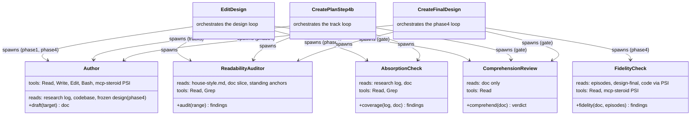
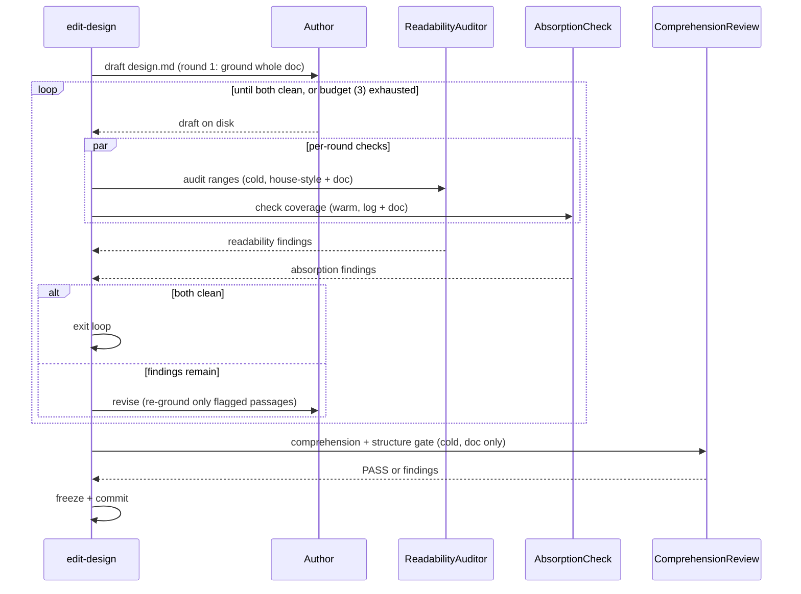

<!-- workflow-sha: ed3fe83cda372f371df18d63268aeb8cf6aebeb0 -->
# Two-role authoring loop for readable design docs — Design

## Overview

Today one agent authors `design.md` with the whole planning conversation
loaded in its context, and one cold-read reviewer then checks the draft for
comprehension, structure, decision absorption, and prose readability all in a
single pass. Two things let dense prose survive. The reviewer reads the
research log to run its absorption check, so it is no longer a cold reader when
it judges "could a fresh reader follow this." And the prose-readability axis is
one of five jobs in that pass, so it gets a sliver of attention.

This design replaces single-agent authoring plus the diluted pass with a
generate-then-verify loop. A code-grounded **author** sub-agent drafts the doc
for a reader who has only the finished document. A dedicated **cold readability
auditor** then reports every passage that reader cannot reconstruct. The loop
repeats author-then-audit until the auditor is clean.

Three additions make the loop work. The cold auditor reads `house-style.md` and
the doc only, never the research log, so its readability judgment stays cold. The
author reads the log plus the live codebase through PSI, so it can explain a
mechanism a log-only writer would leave dense. A per-round **absorption check**
runs inside the loop beside the auditor, confirming the draft still carries every
load-bearing decision; it is warm by design, because checking coverage does not
need a cold eye.

Several existing pieces change to fit. The comprehension reviewer
(`design-review.md`) loses the prose axis and the log read, so it becomes a
genuinely cold comprehension-and-structure pass. The loop also runs at track
authoring (`create-plan` Step 4b), so no-design tiers get readability help. The
Phase 4 final-design step gains a doc-against-episodes fidelity check. New agent
definitions under `.claude/agents/` carry the roles with minimal tool
allow-lists. The research-log read-scope invariants (S2/S3 in `conventions.md`)
get the wording updates these moves imply.

The rest of this document covers: Core Concepts, then Class Design and Workflow
diagrams, then Part 1 (the loop and its three roles), Part 2 (the de-warmed
reviews), Part 3 (wiring the loop into `edit-design`, `create-plan`, and Phase 4),
and Part 4 (the read-scope invariants, the session-boundary collapse, staging,
and cost).

## Core Concepts

This design introduces eight load-bearing ideas. Each is named here, defined in
plain language, paired with what it replaces, and pointed at the Part that
elaborates it. The Parts use these terms without re-defining them.

**Code-grounded author.** A sub-agent that drafts the design doc. It reads the
research log and the live codebase (through IntelliJ PSI), but not the authoring
conversation, and it writes for a reader who has only the finished doc. Replaces
the main agent authoring inline with the whole conversation loaded. → Part 1
§"The code-grounded author".

**Cold readability auditor.** A sub-agent that reads `house-style.md` and the
draft only, never the research log, and reports every passage a mid-level
developer cannot reconstruct from the doc alone. Replaces the prose-readability
slice of the single multi-axis reviewer. → Part 1 §"The cold readability
auditor".

**Reconstructibility bar.** The auditor's stopping rule: a passage passes when a
mid-level developer can rebuild the mechanism from the doc alone — term glossed,
interleaving worked, each step's purpose stated. It sits between "too terse to
follow" (a finding) and tutorial bloat (banned by house style). Replaces the
vaguer "is this readable" judgment. → Part 1 §"The cold readability auditor".

**Absorption check.** A warm per-round check that confirms every load-bearing
research-log decision appears as a seed decision record in the draft, and that no
record invents a decision the log lacks. It reads the log and the doc. Replaces
the absorption sub-check that warmed the old comprehension reviewer. → Part 1
§"The dual-clean inner loop".

**Dual-clean inner loop.** The author-revises-then-checks loop whose round passes
only when both the readability auditor and the absorption check are clean,
bounded by the iteration budget (default 3). Replaces the single apply-then-
cold-read pass. → Part 1 §"The dual-clean inner loop".

**De-warmed comprehension review.** The reviewer at `design-review.md` after this
design strips its prose axis and its log read. It keeps the comprehension
questions, the structural findings, and whole-doc navigability, and it reads only
the doc. Replaces today's warm multi-axis reviewer. → Part 2 §"Restructuring the
comprehension and structural review".

**Fidelity check.** The Phase 4 counterpart of absorption: it confirms
`design-final.md` matches what was actually built. Its primary source is the step
and track **episodes**, the per-step and per-track as-built records written during
implementation that carry what was built and why it diverged from the plan; PSI
covers the residual. Replaces a PSI-only comparison against code. → Part 3
§"The phase4 fidelity check".

**Fan-out cache warm-up.** A spawn sequence that starts one auditor agent, waits
a short fixed delay for its prompt prefix to land in the shared cache, then fans
out the rest concurrently against the warm prefix. Replaces a naive parallel
fan-out that makes every agent pay the cold prefix. → Part 4 §"Cost levers for
the fan-out".

## Class Design

The loop adds five agent roles, each realized as a definition under
`.claude/agents/` with a minimal tool allow-list, plus the three orchestrators
that drive them. The diagram shows each role's read inputs and allow-listed
tools, and which orchestrator spawns it.

The author is the only writer; the auditor, absorption check, comprehension
review, and fidelity check are read-only. The auditor and absorption check both
run every round of the inner loop; the comprehension review runs once as the
outer gate after the loop converges. The fidelity check replaces absorption on
the Phase 4 path, because at Phase 4 the source of truth is the as-built code and
its episodes, not the research log.

### Decisions & invariants
- D-records: D3, D4, D5, D7, D10, D13, D14.
- Invariants: S1.

## Workflow

Two runtime flows matter: the design-authoring loop (Phase 1 design creation and
Phase 4 final-design) and the track-authoring loop (`create-plan` Step 4b). They
share the same shape; the second swaps the seed source and the second check.

The author grounds the whole doc on round 1, then re-consults the code only for
the specific passages a later round flags as under-explained. The two per-round
checks run for disjoint reasons: the auditor flags prose a reader cannot follow,
the absorption check flags a missing decision. Neither check's fix re-triggers
the other, so the loop converges toward dual-clean rather than oscillating.

On the `create-plan` Step 4b track path the author seeds from the research log
(or the frozen `design.md` in `full`) and writes the track files; the second
check is absorption against the track decision records. On the Phase 4 path the
author seeds from the episodes and as-built code, and the second check is fidelity
rather than absorption.

### Decisions & invariants
- D-records: D6, D9, D11.
- Invariants: S3, S5.

# Part 1 — The two-role loop

This Part defines the three roles inside the inner loop (the author, the cold
auditor, and the absorption check) and the loop that binds them.

## The code-grounded author

**TL;DR.** The author is a sub-agent that drafts the design doc for a reader who
has only the finished doc. It reads the research log and the live codebase through
PSI, but not the authoring conversation. Code grounding is what lets the author
explain a mechanism instead of only naming it; a measured experiment cut
readability findings by about half below the prose-only floor.

The author replaces the main agent authoring inline. The old arrangement has the
author hold the whole planning conversation, so it writes from a context the
reader will never share. That is the curse of knowledge: the writer cannot see
which steps it has left implicit because it already knows them. A fresh sub-agent
that never saw the conversation cannot lean on that hidden context.

Grounding is the second half. An early experiment compared a log-only author
against an author that also read the codebase with a translate-the-current-state
mandate. The grounded author cut findings to roughly half the log-only floor
(Part 1 of that run went 19 to 6 to 3). The reason: much residual density was a
mechanism the doc stated tersely because the log itself never spelled it out. A
log-only writer cannot add a worked interleaving it never learned; a grounded
writer reads the code and supplies it. So the author keeps codebase and PSI
access for every round, not only the first.

The saving is "no full re-grounding after round 1," not "prose-only after round
1." Round 1 grounds the whole doc. Later rounds re-consult the code only for the
passages the auditor flagged as too terse, because those findings are specific
enough to target. A density or word-choice finding needs no code; only the
too-terse subset triggers targeted re-grounding.

The "write for a reader who has only the doc" mandate governs the author's
output, not its inputs. The author may read anything that grounds the current
state; it must write so the reader needs nothing beyond the doc.

### Edge cases / Gotchas
- A too-terse finding that demands a new worked example forces real code work;
  the author cannot induce the example from the existing dense text. Later-round
  author cost is therefore variable and partly irreducible, bounded by the
  reconstructibility bar and the iteration cap.
- The author is the only role that writes. If its allow-list omits a tool it
  needs (PSI, Bash), it fails mid-task. Get the list right.

### Decisions & invariants
- D-records: D3 (the author is code-grounded: it reads the log and the codebase via PSI, not the authoring conversation), D13.
- Invariants: S1.

## The cold readability auditor

**TL;DR.** The auditor reads `house-style.md` and the draft only, never the
research log, and reports every passage a mid-level developer cannot reconstruct
from the doc alone. Reading the doc cold is what makes its readability judgment
trustworthy. It reuses the `readability-feedback` audit contract: range-sliced
fan-out, each slice obligated to enumerate findings.

The target reader is a mid-level developer who may not know a domain term such as
"Dekker gate." A term like that stays in the doc, because it teaches the unaware
reader, but it is glossed in place at first use with plain-language reasoning that
substitutes for not knowing the name. This separates two things an earlier
analysis had merged under "domain-density floor." A reader blocked on an unfamiliar
name is blocked for a reducible reason: glossing unblocks them while keeping the
term's precision. A reader who must trace a mechanism step by step faces the true
floor, and even that is reducible by a worked interleaving, a timeline diagram,
and a stated purpose for each step.

The stopping rule is the **reconstructibility bar**: a passage passes when a
mid-level developer can rebuild the mechanism from the doc alone. The lower bound
is the house-style "too terse to follow without opening the code" floor. The
upper bound is two named house-style clauses: the anti-padding clause under
§ Orientation and the no-re-teach-the-floor boundary under § Plain language. The
auditor therefore has a citable stop rather than the looser notion of "tutorial
bloat."
Between those bounds the loop converges; without the named upper bound it could
ratchet on one-more-sentence forever.

The auditor rejects two dismissals at their root. "It is a real term" does not
wave through an unglossed name. "It is inherently dense" does not wave through a
mechanism a worked trace could make followable. The one genuine residual is that
the reader must still spend attention to trace an interleaving; needing attention
is not a defect, so it is not a finding.

The auditor is realized as an agent definition so its tool allow-list can be cut
to `Read` and `Grep`. It needs no Write, no Edit, and no PSI, because it judges
text it is handed.

### Edge cases / Gotchas
- The auditor is range-sliced and cannot see whole-doc properties. It reads its
  ~200-line slice plus the Overview and Core Concepts as standing anchors, so it
  can resolve "defined in Core Concepts" without false-positiving on every
  Core-Concepts term.
- Whole-doc readability properties (navigability, "does the Overview name a
  reader") do not belong to the slice-bound auditor; they go to the comprehension
  review (Part 2).

### Decisions & invariants
- D-records: D1 (target reader is a mid-level developer; domain terms stay and are glossed in place), D2 (mechanisms are explained to the reconstructibility bar, bounded above by named house-style clauses), D4 (the auditor is a dedicated cold role reusing the readability-feedback contract, realized as an agent definition), D8.
- Invariants: S1.

## The dual-clean inner loop

**TL;DR.** Each round the author revises, then both the readability auditor and a
warm absorption check inspect the result; the round passes only when both are
clean. The loop is bounded by the iteration budget (default 3); on exhaustion it
freezes with open findings and escalates to the user, the same way `edit-design`
does today.

The absorption check is a small warm agent that reads the research log and the
draft. Its one job is coverage matching: every load-bearing log decision (one
whose rejected-alternatives field names a real fork) appears as a seed decision
record, and no record invents a decision the log lacks. Warmth corrupts
readability judgment, not coverage matching, so the absorption check can read the
log without re-warming the readability judgment, which lives in the cold auditor.

Folding absorption into the loop as a co-equal per-round check, rather than a
single gate before or after the loop, avoids a back-edge. A single check that ran
only before the loop could miss a decision the loop's later restructuring drops.
The reason a drop can happen even though the auditor never deletes content: the
auditor is range-sliced, so a round that moves a decision's prose across slice
boundaries, or merges and splits content, can leave a decision in a gap or
reword it past recognition. No agent "deleted" anything, yet coverage fell. A
before-loop-only check cannot re-catch that; the per-round check does. Round 1's
absorption check is the old before-loop check (it catches the author's initial
omission); every later round catches a loop-induced cross-slice drop.

The two checks converge because they re-open the loop for disjoint reasons.
Fixing a readability finding adds code-accurate prose; it does not drop a
decision. Adding a dropped decision is new prose the next round's auditor polishes
like any other. Neither fix re-triggers the other in a cycle, so the loop moves
monotonically toward dual-clean — typically one or two rounds. The budget plus
escalation is the backstop for a pathological case, not the expected path. The
detailed worst-case token cost is a planning concern, settled at decomposition,
not at the gate.

The absorption model is Sonnet: coverage matching is two-way set matching with
light semantic-equivalence judgment, well within Sonnet's range, and it saves
cost. The readability auditor and the comprehension gate keep the workflow
default model.

### Edge cases / Gotchas
- On budget exhaustion the design freezes with the open findings recorded and the
  user decides whether to accept the residual or extend. No new escalation
  machinery; this is today's `edit-design` Step 6 behavior.
- The absorption check reads the log; the auditor must not. Keeping them as
  separate spawns is what preserves the cold-auditor guarantee.

### Decisions & invariants
- D-records: D6 (absorption is a co-equal per-round check, justified by the cross-slice-drop failure under range-slicing), D7 (absorption stays at creation as a small warm agent, not deferred to Phase 2).
- Invariants: S2, S5 (the inner loop exits only when both checks are clean or the budget is spent).

# Part 2 — The de-warmed reviews

This Part covers how the existing comprehension reviewer changes once the auditor
owns prose readability, how the five human-reader checks split between the two,
and the Phase 4 fidelity check that takes absorption's place.

## Restructuring the comprehension and structural review

**TL;DR.** Once the dedicated auditor owns prose readability, `design-review.md`
drops the prose axis and the log read. It keeps the comprehension questions, the
structural findings, and whole-doc navigability, and it reads only the doc, so its
"could a cold reader follow this" verdict is finally cold. The auditor owns the
prose axis on every surface where prose is checked; no surface runs the prose axis
on both reviewers.

Today the same agent runs the comprehension questions, the structural checks, the
absorption cross-check, and the prose-readability additions. The prose additions
get a sliver of a multi-axis pass, the diluted-pass failure mode this branch
exists to fix. And the absorption cross-check makes the agent read the research
log, so the comprehension verdict is given by a reader who is no longer cold.

The fix moves the prose axis to the auditor and the absorption check to the warm
per-round agent (Part 1), leaving `design-review.md` with comprehension and
structure over the doc alone. The prose axis must leave **every** surface where
prose is judged, or the diluted pass returns on whatever surface keeps it. The
live reviewer runs on the design creation kinds and on the Step 4b track
cold-read, so the auditor takes the prose axis on all of them, and the
comprehension reviewer re-runs it nowhere. The invariant: no surface runs the
prose axis on both the auditor and the comprehension reviewer. For lighter
`edit-design` mutation kinds that do not spawn the full loop, the same
one-owner-per-surface rule holds; whether the loop runs on `design-sync` is an
`edit-design` wiring detail settled during implementation, and the invariant
holds either way.

The five human-reader checks split by the context each one needs. The auditor is
range-sliced, so it takes the checks that a slice plus the standing anchors can
answer: the prose AI-tell axes, explanatory register, why-before-what,
glossary-introduction, and the prose half of audience fit. The comprehension
reviewer is whole-doc, so it keeps navigability, the structural half of audience
fit ("does the Overview name a reader at all"), the comprehension questions, and
the structural findings. Putting all five on the whole-doc reviewer would re-load
it with readability axes and re-create the dilution; concentrating readability on
the auditor preserves per-slice attention.

### Edge cases / Gotchas
- On the track path the auditor's standing anchors become the plan Component Map
  and each track's Purpose / Big Picture; navigability across track files stays
  whole-doc on the comprehension reviewer.
- The de-warmed reviewer reads no log, so it no longer needs the freeze-order
  gate for its own sake. The gate stays on the loop because the author and the
  absorption check read the log.

### Decisions & invariants
- D-records: D5 (one cold comprehension-and-structure review at creation; the warm reviewer is retired), D8 (the five human-reader checks split by context need between the sliced auditor and the whole-doc reviewer), D9 (the auditor owns the prose AI-tell axis on every prose-checked surface; the comprehension reviewer runs it nowhere).
- Invariants: S4 (no surface runs the prose AI-tell axis on both the auditor and the comprehension reviewer).

## The phase4 fidelity check

**TL;DR.** At Phase 4 the second check is fidelity, not absorption: it confirms
`design-final.md` matches what was actually built. Its primary source is the step
and track episodes, which carry both what was built and why it diverged from the
plan, so the match is cheap text-against-text. PSI covers the residual — diagram
and signature precision, and any claim with no episode trace.

Phase 4 must not absorb the research log. Implementation can supersede a planned
decision through an inline replan or a scope-down recorded in an episode, so
`design-final.md` reflects what was built, not what was planned. Re-asserting a
superseded log decision would be a fidelity bug. So the loop's second check swaps
from absorption (log-against-doc) to fidelity (episodes-and-code-against-doc).

Episodes beat code for the bulk of the check. The code shows the final state but
not the reasoning; the episodes carry the divergence reasoning the final design
must explain. Checking the doc against the episodes is text-against-text, the same
cheap shape as absorption, so the per-round cost stays low.

Two cases need PSI. Precision: an episode may say "added a per-class record
helper" while the class diagram states an exact signature and the sequence
diagram draws a specific call arrow, which only PSI confirms. Coverage: when the
episode record is silent on a behavioral point the final design asserts, the check
falls back to code through PSI rather than trusting a match against episodes that
never recorded it. The existing diagram-to-code verification in
`create-final-design.md` runs once at entry and re-runs per round only if a round
touched a diagram, which readability edits rarely do.

### Edge cases / Gotchas
- A silent scope-down that no episode records is the failure the coverage residual
  guards: the doc could match the episodes while both diverge from the code, so a
  claim with no episode trace routes to PSI.
- The readability auditor and the comprehension gate are identical across Phase 1
  and Phase 4; only the second check differs.

### Decisions & invariants
- D-records: D10 (Phase 4 fidelity is primarily doc-against-episodes; PSI covers the diagram, signature, and no-episode-trace residual), D11.
- Invariants: S6 (Phase 4 reflects what was built and never re-asserts a superseded log decision).

# Part 3 — Wiring the loop into the workflow

This Part covers where the loop attaches: the `edit-design` rework, the
`create-plan` Step 4b track path, and the session-boundary collapse.

## The edit-design rework

**TL;DR.** The loop is a rework of `edit-design`'s existing apply-review-iterate
structure. Step 1 (apply) spawns the author instead of authoring inline; Step 4
(review) spawns the auditor and the absorption check each round and, after the
loop converges, the cold comprehension gate; Step 6 is the bounded inner loop.
Both the Phase 1 and Phase 4 design kinds route through `edit-design`, so both get
the loop.

`edit-design` already runs apply, auto-review, bounded iterate, and present. The
rework changes who does the work inside that frame. The apply step today is the
main agent writing the doc; it becomes a spawn of the author sub-agent. The
review step today is one cold-read sub-agent; it becomes the per-round pair (cold
auditor plus warm absorption) followed by the cold comprehension gate. The iterate
step is the dual-clean loop. So `edit-design` becomes the multi-agent
orchestrator, and the existing callers inherit the loop without their own changes:
`create-plan` Step 4a routes `phase1-creation` through it, and
`create-final-design.md` routes `phase4-creation`.

The decision/assumption challenge that an in-skill adversarial pass used to give
has already moved to the research-log gate at the Phase 0 to 1 boundary, so the
`phase1-creation` review is the cold-read alone, gated behind that log gate. The
author drafts only after the gate clears, so the comprehension pass assesses a
design whose decisions already survived challenge.

### Edge cases / Gotchas
- The first concentration of change is `edit-design/SKILL.md` (Steps 1, 4, 6) plus
  the two new role prompts and the absorption agent; `design-review.md` is
  de-warmed in the same track. Track decomposition firms up the split.
- The phase4 path swaps absorption for the fidelity check (Part 2) but keeps the
  author, auditor, and comprehension gate unchanged.

### Decisions & invariants
- D-records: D11 (the loop wires at two authoring points: `edit-design` for the design and `create-plan` Step 4b for the tracks).
- Invariants: S3.

## Track authoring in create-plan Step 4b

**TL;DR.** The loop also runs at track authoring in `create-plan` Step 4b, so the
no-design tiers (`lite`, `minimal`) get readability help. The planner-inline track
derivation becomes an author spawn plus the same inner loop, with the track files
as the target and track-decision-record absorption as the second check.

`edit-design` handles `design.md`, which exists only in `full`. In `lite` and
`minimal` there is no design, and the durable human-facing carrier is the track
files, authored in `create-plan` Step 4b. A loop wired only in `edit-design` would
leave those tiers with no readability help, and they are exactly where dense
log-derived prose lands with no design buffer. So the loop runs at both authoring
points, keyed by target: `edit-design` for `design.md`, and `create-plan` Step 4b
for the track files.

The roles are reused, target-parameterized. One author prompt, one readability
auditor. The author's seed source is the frozen `design.md` in `full` and the
research log directly in `lite` and `minimal` — the heavy lift, turning dense log
prose into cold-readable track prose. Track absorption matches log or design
decisions against the track decision records, so the track cold-read de-warms the
same way the design one does.

### Edge cases / Gotchas
- `full` runs the loop twice: once on `design.md` in Step 4a, once on the track
  files in Step 4b. `lite` and `minimal` run it once, on the tracks.
- The auditor's standing anchors on the track path are the plan Component Map and
  each track's Purpose / Big Picture, because a track slice alone lacks the
  whole-plan vocabulary.

### Decisions & invariants
- D-records: D11.
- Invariants: S4.

## Collapsing the 4a/4b session boundary

**TL;DR.** The full-tier Step 4a / Step 4b session boundary was a context-isolation
proxy that sub-agent authoring makes redundant, so the two steps collapse into one
`create-plan` invocation. This is a staged change to the `create-plan` auto-resume
contract, not a cosmetic convenience, and it depends hard on by-reference
orchestration.

The boundary exists today to force a `/clear` so Step 4b derives the plan from the
frozen design with a cold context. Sub-agent authoring supplies that isolation
directly: the plan and track author is a fresh cold spawn reading the frozen
committed design regardless of session. So the boundary stops earning its keep,
and Step 4a can flow into Step 4b in one invocation.

This is a real machinery change, not a free convenience. It rewrites the
`create-plan` auto-resume routing that keys on whether `design.md` is committed
and clean (route to 4b) or dirty (route to 4a). That routing is the schema a
running phase reads, which the staging convention keeps staged rather than edited
live. So the change is staged as an execution-procedure change. The crash-recovery
path must be re-specified to fire only on a dirty or absent plan after a
committed-clean design; the happy path no longer crosses the boundary, and Step
1c's auto-resume becomes crash-recovery-only.

By-reference orchestration is a hard requirement of this collapse, not a
preference adopted alongside it. If any author sub-agent returns more than a thin
summary, the combined session re-accumulates the design and plan context the
boundary existed to keep apart, and the collapse regresses context isolation. If
by-reference cannot hold, the boundary is retained.

### Edge cases / Gotchas
- The freeze-and-commit after design authoring stays as the logical gate and the
  crash checkpoint; only the session boundary that coincided with it goes away.
- A very large design can make even the by-reference combined session long;
  the mid-phase handoff and the context monitor mitigate it as for any long phase.

### Decisions & invariants
- D-records: D15 (collapse the 4a/4b session boundary into one `create-plan` invocation; a staged auto-resume-contract change with a hard by-reference requirement).
- Invariants: S3.

# Part 4 — Invariants, staging, and cost

This Part covers the read-scope invariants the loop rests on, the staging
constraint that keeps the new routine non-live on this branch, and the cost levers
for the fan-out.

## The S2 and S3 read-scope invariants

**TL;DR.** S2 caps decision-content reads of the research log to the sanctioned
sites; this design extends it to name the warm absorption agent as one of those
sites, and binds the `conventions.md` wording update as a deliverable. S3 is the
freeze-order gate: the cold-read may not run while a log-adversarial entry is open.

S2 today reads as "the log is read for decision content in exactly two places: at
Step 4a/4b artifact authoring, and by the Phase 2 consistency review." The
absorption check reads the log at creation time, which S2's "artifact authoring"
site can fairly cover, but today that site is the author or the cold-read
reviewer, not a separate absorption spawn. So this design extends S2 to name the
absorption agent as a sanctioned reader, and the wording update in `conventions.md`
is a stated deliverable, not an implicit reinterpretation. Without the update, a
later reader who takes S2 literally would see a third log-reading agent as a
violation.

S3 is the freeze-order gate. The cold comprehension pass must not judge a design
whose decisions have not survived challenge. The challenge now runs once on the
research log at the Phase 0 to 1 boundary, so the gate becomes: the cold-read may
not run while the latest log-adversarial entry is open. A load-bearing decision
surfaced while authoring the design is appended to the log, re-challenged at the
gate, and cleared before the cold-read runs. The gate holds across the review-hold
batch loop too: a decision-shaped cold-read finding re-enters the gate, so there
is no path where the cold-read runs with an open log entry.

The auditor sits outside both invariants by construction: it never reads the log,
so it neither consumes a log-read budget nor waits on the freeze-order gate.

### Edge cases / Gotchas
- The absorption check is the only new log reader; the auditor and the de-warmed
  comprehension reviewer read no log, which is what keeps the S2 site count at two
  (authoring, with absorption named under it; and Phase 2 consistency).
- S3 applies to `phase1-creation` specifically; other mutation kinds run the
  cold-read with no gate, because they derive no decision from an open challenge.

### Decisions & invariants
- D-records: D5 (the de-warm that frees the comprehension review of its log read, the change these invariants rest on), D18 (extend S2 to name the warm absorption agent as a sanctioned log reader; bind the `conventions.md` wording update as a deliverable).
- Invariants: S1 (the cold readability auditor never reads the research log), S2 (the log is read for decision content only at the sanctioned sites), S3 (the cold-read does not run while a log-adversarial gate entry is open).

## Staging and the dogfood plan

**TL;DR.** This branch modifies workflow machinery under `.claude/`, so its edits
accumulate in the staged subtree and the live workflow stays at develop state
until the Phase 4 promotion. The branch therefore authors its own design with the
old routine. Dogfooding happens on real targets instead, including at least one
workflow-prose target before promotion.

The literal dogfood, having the new routine author this branch's own design, is
blocked two ways. Staging keeps the new routine non-live until promotion, so this
branch's Phase 1 runs the old single-agent flow. And the new routine's code is
this branch's own output, built in Phase 3, so it does not exist at Phase 1 when
the design is authored. The instinct is honored on real targets instead.

Three dogfood points carry the validation. First, run the existing
`readability-feedback` skill on this branch's `design.md` once authored; it is
available today and exercises the verify half. Second, in Phase 3, validate the
implemented routine against a known-dense storage design (`transactional-schema`)
and against a known-dense **workflow-prose** target (a prior branch's
`design-final.md` or a `conventions.md` section), because workflow prose is this
branch's actual domain and the storage design alone never exercises it. Third, the
next design after promotion uses the routine naturally, the full dogfood.

The workflow-prose target matters because the matched risk category for this change
is workflow machinery, and the densest decisions are the read-scope invariants and
gate semantics this very design states. Validating only on a storage design would
leave a workflow-prose gap to surface after promotion, costing a follow-up branch.

### Edge cases / Gotchas
- The diagram format stays Mermaid; no ASCII or SVG toolchain enters this branch.
  Mermaid is agent-readable as source and renders on GitHub and in the IDE, which
  covers the author, the auditor, and the durable `design-final.md`.
- The 1128/1129 house-style rules are deferred to a separate PR. The auditor reads
  the live `house-style.md`, so it absorbs those rules whenever they land, with no
  rule list hard-coded here.
- PR-description readability is a non-goal of this branch, tracked by a separate
  issue; the authoring loop's scope here is the design docs and the track files.
  The branch's `## Motivation` carries this exclusion.

### Decisions & invariants
- D-records: D12 (keep Mermaid; no diagram-format change), D17 (dogfood on real targets including a workflow-prose target before promotion; self-wiring is blocked by staging and the temporal bootstrap), D19 (branch scope is the full two-role loop; the 1128/1129 house-style rules move to a separate PR).
- Invariants: S7 (the new routine stays staged and non-live on this branch until the Phase 4 promotion).

## Cost levers for the fan-out

**TL;DR.** Three levers hold the per-round cost down: minimal tool allow-lists via
agent definitions, a fan-out cache warm-up that amortizes the shared prompt prefix,
and the author grounding once with targeted re-grounding after. Findings pass
between rounds through a file so re-spawn prompts stay byte-identical.

The per-spawn tool surface is the largest fixed cost, roughly 25K to 35K tokens; on
a six-agent auditor fan-out that is 150K to 200K before any work. The `Agent` tool
cuts the surface only through an agent definition with a `tools:` allow-list, so the
roles become agent definitions, not general-purpose spawns. The auditor and
absorption check get `Read` plus `Grep`; the comprehension reviewer gets `Read`; the
author gets `Read`, `Write`, `Edit`, `Bash`, and PSI; the fidelity check gets `Read`
plus PSI.

Memory and `CLAUDE.md` cannot be skipped per agent: only the built-in Explore and
Plan agents skip them, and Explore's read-only, locate-don't-audit disposition
fights the auditor's enumerate disposition. So custom agents carry the roughly 10K
of `CLAUDE.md` plus memory per spawn. The mitigation is the cache warm-up, not
removal: the project's measured sub-agent cache sharing puts the injected
`CLAUDE.md` inside the shareable prompt body, shared when the spawn prompt is
byte-identical.

The warm-up sequences the fan-out instead of racing it. Spawn one auditor, wait a
short fixed delay (about a minute) for its cold prefix write to land and propagate,
then spawn the rest concurrently against the warm prefix. This takes the fan-out
from N cold prefixes to roughly one cold plus the rest at a fraction. Blocking until
the first agent finishes would be wrong twice: the five-minute cache TTL could age
the prefix out, and serializing loses the parallelism. Per-agent parameters (the
range, the target path) go in a file the agent reads as its first action, so the
spawn prompt stays byte-identical and the whole shared body caches; a varying tail
would bust the entire shared body.

### Edge cases / Gotchas
- A heavy code-grounded author whose first turn runs long can push its cold write
  past the one-minute delay, so the warm-up delay may need to be role-specific.
  The exact plumbing is the most involved orchestration in the branch and is
  deferred to implementation.
- The Agent SDK and cross-model review were considered and deferred. The SDK can
  cache (caching is content-keyed), but it reimplements prefix assembly and spawn
  lifecycle for no readability gain, since the measured win was disposition, not
  model. Cross-model review is a separate, workflow-wide initiative.

### Decisions & invariants
- D-records: D13 (cost levers: minimal tool allow-lists, fan-out cache warm-up, ground-once with targeted re-grounding, findings-in-file), D14 (memory and `CLAUDE.md` are not per-agent configurable; the warm-up amortizes them and the `tools:` allow-list cuts the tool surface), D16 (defer the Agent SDK and cross-model review; keep the Agent tool).
- Invariants: S7.
