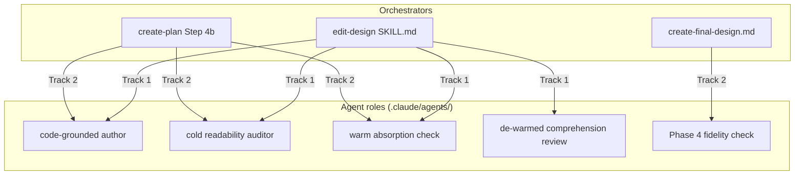

<!-- workflow-sha: ed3fe83cda372f371df18d63268aeb8cf6aebeb0 -->
# Two-role authoring loop for readable design docs

## Design Document
[design.md](design.md)

## Component Map
The change adds five agent roles and reuses three existing orchestrators. The
slice below is for cross-track impact assessment; per-track detail, the full
Decision Records, the invariants, and the constraints live in the track files.

- **Track 1** builds the four inner-loop / gate roles (author, readability
  auditor, absorption check, de-warmed comprehension review) and wires them
  into `edit-design`. It also extends the read-scope invariants the new log
  reader implies (S2 at its `research.md` canonical home, restated in
  `design-document-rules.md`). This is the dependency root.
- **Track 2** reuses Track 1's author, auditor, and absorption roles at two
  more authoring points — `create-plan` Step 4b (track files) and
  `create-final-design.md` (Phase 4) — adds the one new role the Phase 4 path
  needs (the fidelity check), and collapses the full-tier 4a/4b session
  boundary into one `create-plan` invocation.
- The whole change is workflow-modifying (§1.7(b)): every edit stages under
  `_workflow/staged-workflow/.claude/` and the live workflow stays at develop
  state until the Phase 4 promotion.

## Checklist
- [x] Track 1: The two-role authoring loop, wired into design creation
  > Build the core: a code-grounded author drafts `design.md` for a reader who
  > has only the finished doc, a cold readability auditor reports every passage
  > that reader cannot reconstruct, and a warm absorption check confirms the
  > draft still carries every load-bearing decision — run as a dual-clean inner
  > loop inside `edit-design`. De-warm the comprehension reviewer
  > (`design-review.md`) so its verdict is finally cold, realize all four roles
  > as agent definitions with minimal tool allow-lists, and update the
  > read-scope invariants (S2 at its `research.md` canonical home, restated in
  > `design-document-rules.md`). Detailed description in plan/track-1.md.
  >
  > **Track episode:** Two-role authoring loop built and staged; Phase C review
  > PASS (2 iterations, 0 blockers), including the `design-sync` prose-owner (S4)
  > fix. See `plan/track-1.md` `## Episodes` § Track completion. (2 steps, 0 failed)
  >
  > **Track file:** `plan/track-1.md`
  >
  > **Strategy refresh:** CONTINUE — Track 1 delivered the four reused roles and
  > the by-reference orchestration contract Track 2 depends on (D15 gate A6); no
  > downstream adjustment needed.

- [x] Track 2: Reuse the loop at track authoring and Phase 4; collapse the 4a/4b boundary
  > Wire the Track 1 loop into `create-plan` Step 4b (so `lite` / `minimal`
  > track files get readability help) and into `create-final-design.md` Phase 4
  > (swapping the second check from absorption to a doc-against-episodes
  > fidelity check, with a PSI residual). Add the one new fidelity-check agent
  > definition, and collapse the full-tier 4a/4b session boundary into one
  > `create-plan` invocation — a staged auto-resume-contract change that depends
  > on Track 1's by-reference orchestration.
  >
  > **Track episode:** Loop wired into `create-plan` Step 4b and Phase 4 (new
  > fidelity check); 4a/4b boundary collapsed (gate A6 static-green). Phase C
  > PASS (2 iterations, 0 blockers). See `plan/track-2.md` `## Episodes`
  > § Track completion. (3 steps, 0 failed)
  >
  > **Track file:** `plan/track-2.md`
