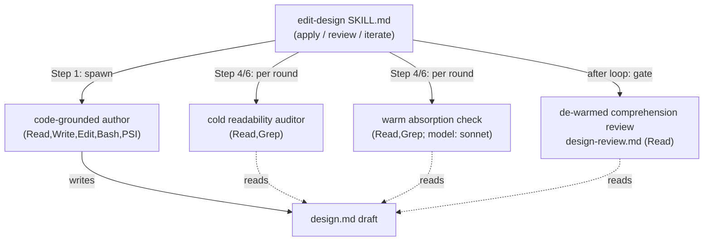

<!-- workflow-sha: ed3fe83cda372f371df18d63268aeb8cf6aebeb0 -->
# Track 1: The two-role authoring loop, wired into design creation

## Purpose / Big Picture
After this track lands, `edit-design` drafts and reviews `design.md` through a generate-then-verify loop instead of one agent authoring inline, so dense prose stops surviving review.

<!-- Reserved for Move 2 — ADDED/MODIFIED/REMOVED triad. Empty until Move 2 lands. -->

This track builds the core of the change: a fresh code-grounded **author**
sub-agent drafts the design doc for a reader who has only the finished
document, a dedicated **cold readability auditor** reports every passage that
reader cannot reconstruct, and a small warm **absorption check** confirms the
draft still carries every load-bearing decision. The three run as a dual-clean
inner loop bounded by the iteration budget. The existing comprehension reviewer
(`design-review.md`) is de-warmed in the same track — it loses the prose axis
and the research-log read, so its "could a cold reader follow this" verdict is
finally given by a reader who is actually cold. All four roles become agent
definitions with minimal tool allow-lists so the per-spawn tool surface stays
bounded. The track wires this loop into `edit-design`, the orchestrator both
design-creation kinds already route through, and updates the read-scope
invariants the new log reader implies (S2 at its `research.md` canonical home,
restated in `design-document-rules.md`). Track 2 reuses everything
built here at the two other authoring points.

## Progress
- [x] 2026-06-17T12:49Z [ctx=info] Review + decomposition complete
- [x] 2026-06-17T13:28Z [ctx=safe] Step 1 complete (commit 88718402b2)
- [x] 2026-06-17T13:54Z [ctx=info] Step 2 complete (commit 339c7f924c)
- [x] 2026-06-17T13:54Z [ctx=info] Step implementation
- [x] 2026-06-17T15:34Z [ctx=safe] Track-level code review iteration 1 complete (1/3 iterations)
- [x] 2026-06-17T15:42Z [ctx=safe] Track-level code review iteration 2 complete (2/3 iterations)
- [ ] Track-level code review
- [ ] Track completion

## Surprises & Discoveries
<!-- Continuous-log. Promoted by the orchestrator from per-step "What was
discovered" when the finding affects future steps or other tracks. Empty
at Phase 1. -->
- 2026-06-17T13:28Z Step 1 fixed the four design-authoring agent basenames Track 2 spawns by reference: `design-author`, `readability-auditor`, `absorption-check`, `comprehension-review`. The author's PSI tool entry is the wildcard `mcp__localhost-6315__*`. `conventions.md` needs no read-scope edit (its cross-refs name the two read sites, not the readers — CR3 confirmed against the file text). See Episodes §Step 1.

## Decision Log
<!-- The track-canonical live decision carrier (D7). Seeded from the frozen
design.md D-records. The track file is the live authority; design.md keeps a
historical seed copy. -->

#### D1: Target reader is a mid-level developer; domain terms stay and are glossed in place
- **Alternatives considered**: (a) accept the earlier "irreducible domain-density floor" framing, which leaves a reader blocked on a name the doc could gloss in one clause; (b) delete or replace each domain term with a plain phrase, which loses both precision and the term's teaching value.
- **Rationale**: a reader blocked on an unfamiliar name (e.g. "Dekker gate") is blocked for a reducible reason. Glossing the term in place at first use keeps the mechanism precise and the term's teaching value while unblocking a mid-level reader, so the real floor is lower than the earlier analysis claimed. The auditor flags an unglossed domain term and rejects "it is a real term" as a dismissal.
- **Risks/Caveats**: gloss quality is a judgment call; an over-terse gloss can still leave the reader blocked, which the reconstructibility bar (D2) catches on the next round.
- **Implemented in**: this track (the auditor agent definition's stopping rules).
- **Full design**: design.md §"The cold readability auditor".

#### D2: Mechanisms get explained, not just terms glossed; the bar is reconstructibility
- **Alternatives considered**: keep the earlier "inherent mechanism density is an irreducible floor" framing, which lets the auditor wave through genuinely-blocking mechanism prose as irreducible.
- **Rationale**: a mechanism with many interacting steps is explainable without a tutorial — a worked interleaving (a concrete trace of the bad outcome), a timeline diagram, and a stated purpose for each step. The stopping rule is the **reconstructibility bar**: a passage passes when a mid-level developer can rebuild the mechanism from the doc alone. The bar's lower bound is the house-style "too terse to follow" floor; its upper bound is two named house-style clauses (the § Orientation anti-padding clause and the § Plain language no-re-teach-the-floor boundary), so the loop has a citable stop instead of ratcheting on one-more-sentence forever (gate A9).
- **Risks/Caveats**: the one genuine residual is that the reader must still spend attention tracing an interleaving; needing attention is not a defect, so it is not a finding.
- **Implemented in**: this track (the auditor's enumerate-to-the-bar obligation).
- **Full design**: design.md §"The cold readability auditor".

#### D3: The author is code-grounded — it reads the log and the codebase via PSI, not the authoring conversation
- **Alternatives considered**: a log-only author that drafts from the research log alone, without codebase access.
- **Rationale**: the main agent authoring inline holds the whole planning conversation, so it writes from context the reader will never share — the curse of knowledge. A fresh sub-agent that never saw the conversation cannot lean on that hidden context. Grounding is the second half: a measured run showed a code-grounded author cut readability findings to roughly half the log-only floor (Part 1 of that run went 19 to 6 to 3), because much residual density was a mechanism the log itself never spelled out. A log-only writer cannot add a worked interleaving it never learned; a grounded writer reads the code and supplies it.
- **Risks/Caveats**: a too-terse finding that demands a new worked example forces real code work, so later-round author cost is variable and partly irreducible, bounded by the reconstructibility bar and the iteration cap. The author is the only writer; if its allow-list omits a tool it needs (PSI, Bash), it fails mid-task.
- **Implemented in**: this track (the author agent definition and its tool allow-list).
- **Full design**: design.md §"The code-grounded author".

#### D4: The auditor is a dedicated cold role reusing the readability-feedback contract, realized as an agent definition
- **Alternatives considered**: extract the prose axis into a new general-purpose `prompts/` sibling spawn without an agent definition.
- **Rationale**: realizing the auditor as an agent definition is what lets its tool allow-list be cut to `Read` plus `Grep` — it judges text it is handed, so it needs no Write, Edit, or PSI. It reuses the existing `readability-feedback` audit contract: range-sliced fan-out, each slice obligated to enumerate findings. Reading the doc cold (house-style plus the doc, never the research log) is what makes its readability judgment trustworthy.
- **Risks/Caveats**: the auditor is range-sliced and cannot see whole-doc properties, so it reads its ~200-line slice plus the Overview and Core Concepts as standing anchors to resolve "defined in Core Concepts" without false-positiving on every Core-Concepts term. Whole-doc properties go to the comprehension review (D8).
- **Implemented in**: this track (the readability-auditor agent definition).
- **Full design**: design.md §"The cold readability auditor".

#### D5: One cold comprehension-and-structure review at creation; the warm reviewer is retired
- **Alternatives considered**: keep today's single multi-axis reviewer that runs comprehension questions, structural checks, the absorption cross-check, and the prose-readability additions in one pass.
- **Rationale**: two things let dense prose survive today. The prose additions get a sliver of a multi-axis pass — the diluted-pass failure this branch exists to fix — and the absorption cross-check makes the reviewer read the research log, so the comprehension verdict comes from a reader who is no longer cold. Moving the prose axis to the auditor and absorption to the warm per-round agent leaves `design-review.md` with comprehension and structure over the doc alone, so its verdict is finally cold.
- **Risks/Caveats**: the de-warmed reviewer reads no log, so it no longer needs the freeze-order gate for its own sake; the gate stays on the loop because the author and the absorption check read the log (S3).
- **Implemented in**: this track (the de-warm of `design-review.md`).
- **Full design**: design.md §"Restructuring the comprehension and structural review".

#### D6: Absorption is a co-equal per-round check, justified by the cross-slice-drop failure under range-slicing
- **Alternatives considered**: a single absorption gate that runs once before (or once after) the readability loop, not every round.
- **Rationale**: a before-loop-only check can miss a decision the loop's later restructuring drops. The drop happens without any agent deleting content: the auditor is range-sliced, so a round that moves a decision's prose across slice boundaries, or merges and splits content, can leave a decision in a gap or reword it past recognition. Round 1's absorption check is the old before-loop check (it catches the author's initial omission); every later round catches a loop-induced cross-slice drop.
- **Risks/Caveats**: this replaces the weaker "the auditor never deletes content" defense, which does not defuse the cross-slice drop.
- **Implemented in**: this track (the per-round pairing inside the inner loop).
- **Full design**: design.md §"The dual-clean inner loop".

#### D7: Absorption stays at creation as a small warm agent, not deferred to Phase 2
- **Alternatives considered**: drop absorption from creation and let the Phase 2 consistency review catch a missing decision.
- **Rationale**: absorption belongs at creation, where the omission is cheapest to fix and the author is still in context. It is a small warm agent that reads the research log and the draft, doing two-way coverage matching: every load-bearing log decision (one whose rejected-alternatives field names a real fork) appears as a seed decision record, and no record invents a decision the log lacks. Warmth corrupts readability judgment, not coverage matching, so the absorption check can read the log without re-warming the cold auditor. The model is Sonnet: coverage matching is two-way set matching with light semantic-equivalence judgment, well within Sonnet's range, and it saves cost; the auditor and the comprehension gate keep the workflow default model.
- **Risks/Caveats**: the absorption check reads the log and the auditor must not — keeping them as separate spawns is what preserves the cold-auditor guarantee (S1).
- **Implemented in**: this track (the absorption-check agent definition, `model: sonnet`).
- **Full design**: design.md §"The dual-clean inner loop".

#### D8: The five human-reader checks split by context need between the sliced auditor and the whole-doc reviewer
- **Alternatives considered**: put all five human-reader checks on the whole-doc comprehension reviewer.
- **Rationale**: loading all five onto the whole-doc reviewer re-creates the dilution this branch removes. The split is by the context each check needs. The range-sliced auditor takes the checks a slice plus the standing anchors can answer: the prose AI-tell axes, explanatory register, why-before-what, glossary-introduction, and the prose half of audience fit. The whole-doc reviewer keeps navigability, the structural half of audience fit ("does the Overview name a reader at all"), the comprehension questions, and the structural findings.
- **Risks/Caveats**: on the track path the auditor's standing anchors become the plan Component Map and each track's Purpose / Big Picture; navigability across track files stays whole-doc on the comprehension reviewer (Track 2 inherits this).
- **Implemented in**: this track (the auditor and the de-warmed reviewer prompts).
- **Full design**: design.md §"Restructuring the comprehension and structural review".

#### D9: The auditor owns the prose AI-tell axis on every prose-checked surface; the comprehension reviewer runs it nowhere
- **Alternatives considered**: keep the § Prose AI-tell half on the warm reviewer for some surfaces (e.g. `target=tracks` or `design-sync`).
- **Rationale**: the prose axis must leave every surface where prose is judged, or the diluted pass returns on whatever surface keeps it. The auditor takes the prose AI-tell axis (over-dense / too-terse / hard-to-read) on `phase1-creation`, `phase4-creation`, and the Step 4b track cold-read; the comprehension reviewer re-runs it nowhere. For lighter `edit-design` mutation kinds that do not spawn the full loop, the same one-owner-per-surface rule holds; whether the loop runs on `design-sync` is an `edit-design` wiring detail settled during implementation, and the invariant (S4) holds either way.
- **Risks/Caveats**: the track-path surface is owned by Track 2; this DR fixes the rule, Track 2 applies it at Step 4b.
- **Implemented in**: this track for the design surfaces; Track 2 for the track surface (see Track 2 D11).
- **Full design**: design.md §"Restructuring the comprehension and structural review".

#### D11 (edit-design facet): The loop wires into `edit-design` for design authoring
- **Alternatives considered**: a bespoke orchestrator that re-implements apply-review-iterate instead of reusing `edit-design`.
- **Rationale**: `edit-design` already runs apply, auto-review, bounded iterate, and present. The rework changes who does the work inside that frame: Step 1 (apply) spawns the author instead of authoring inline; Step 4 (review) spawns the per-round auditor-plus-absorption pair and, after the loop converges, the cold comprehension gate; Step 6 is the dual-clean loop. So `edit-design` becomes the multi-agent orchestrator and its existing callers inherit the loop with no changes of their own. The decision/assumption challenge an in-skill adversarial pass used to give has already moved to the research-log gate at the Phase 0 to 1 boundary, so `phase1-creation` review is the cold-read alone, gated behind that log gate.
- **Risks/Caveats**: this is one logical decision (D11) split by authoring point across two tracks. The create-plan Step 4b facet is the track-canonical record in Track 2; a change to one facet propagates to the other.
- **Implemented in**: this track (the `edit-design` rework). The create-plan Step 4b facet lives in Track 2.
- **Full design**: design.md §"The edit-design rework".

#### D12: Keep Mermaid; no diagram-format change
- **Alternatives considered**: switch the diagram format to committed SVG (e.g. D2-rendered) or ASCII.
- **Rationale**: Mermaid is agent-readable as source and renders on GitHub and in the IDE, which covers the author, the auditor, and the durable `design-final.md`. An external SVG is opaque to an agent regardless of its on-screen fidelity, and an ASCII toolchain buys nothing here. No SVG or ASCII toolchain enters this branch.
- **Risks/Caveats**: none of note; this is a hold-the-line decision.
- **Implemented in**: this track (a constraint on the author's diagram output; reused by Track 2).
- **Full design**: design.md §"Staging and the dogfood plan".

#### D13: Cost levers for the fan-out
- **Alternatives considered**: a naive parallel fan-out that makes every auditor agent pay the cold prompt prefix; general-purpose spawns with the full tool surface.
- **Rationale**: four levers hold per-round cost down. (1) Minimal tool allow-lists via agent definitions — the per-spawn tool surface is the largest fixed cost (~25K-35K tokens), so the roles become agent definitions, not general-purpose spawns. (2) A fan-out cache warm-up: spawn one auditor, wait a short fixed delay (about a minute) for its cold prefix write to land and propagate, then fan out the rest against the warm prefix, taking the fan-out from N cold prefixes to roughly one cold plus the rest at a fraction. (3) The author grounds once on round 1 and re-grounds only flagged passages after. (4) Per-agent parameters (the range, the target path) go in a file the agent reads as its first action, so the spawn prompt stays byte-identical and the whole shared body caches.
- **Risks/Caveats**: a heavy code-grounded author whose first turn runs long can push its cold write past the one-minute delay, so the warm-up delay may need to be role-specific. The exact warm-up plumbing is the most involved orchestration in the branch and is deferred to implementation (gate A7).
- **Implemented in**: this track (the agent definitions' allow-lists and the `edit-design` fan-out warm-up).
- **Full design**: design.md §"Cost levers for the fan-out".

#### D14: Memory and `CLAUDE.md` are not per-agent configurable; the warm-up amortizes them and the tools allow-list cuts the tool surface
- **Alternatives considered**: skip `CLAUDE.md` and memory per agent (only the built-in Explore and Plan agents can skip them, and Explore's locate-don't-audit disposition fights the auditor's enumerate disposition); retract this and assume per-role `CLAUDE.md`.
- **Rationale**: custom agents carry the ~10K of `CLAUDE.md` plus memory per spawn, and that cannot be removed per agent. The mitigation is the cache warm-up, not removal: the project's measured sub-agent cache sharing puts the injected `CLAUDE.md` inside the shareable prompt body, shared when the spawn prompt is byte-identical. The `tools:` allow-list cuts the separately-large tool surface.
- **Risks/Caveats**: the byte-identical-prompt requirement is what makes the shared body cache; a varying tail busts it (so D13's params-in-file lever is load-bearing here too).
- **Implemented in**: this track (the agent definitions and the warm-up).
- **Full design**: design.md §"Cost levers for the fan-out".

#### D16: Defer the Agent SDK and cross-model review; keep the Agent tool
- **Alternatives considered**: build the loop on the Agent SDK; add cross-model review (a different model auditing).
- **Rationale**: the SDK can cache (caching is content-keyed) but reimplements prefix assembly and spawn lifecycle for no readability gain, because the measured win was disposition, not model. Cross-model review is a separate, workflow-wide initiative. Both are deferred; the loop uses the `Agent` tool.
- **Risks/Caveats**: none of note; this keeps the branch scoped.
- **Implemented in**: this track (the spawn mechanism choice).
- **Full design**: design.md §"Cost levers for the fan-out".

#### D17: Dogfood on real targets, including a workflow-prose target, before promotion
- **Alternatives considered**: (a) dogfood the new routine on this branch's own design (blocked — see below); (b) validate only on a storage design plus the verify-half-only `readability-feedback` run, with no workflow-prose target.
- **Rationale**: the literal self-dogfood is blocked two ways. Staging keeps the new routine non-live until promotion (S7), so this branch's Phase 1 runs the old single-agent flow, and the routine's code is this branch's own Phase 3 output, so it does not exist when the design is authored. The instinct is honored on real targets instead. The matched risk category is Workflow machinery and the densest decisions are this design's own read-scope invariants and gate semantics, so a storage design alone never exercises the routine's actual domain. A Phase 3 validation point runs the implemented routine against a known-dense workflow-prose target before promotion, alongside the `transactional-schema` storage cross-check.
- **Risks/Caveats**: validating only storage-domain prose would leave a workflow-prose density gap to surface post-promotion, costing a follow-up branch (gate A5).
- **Implemented in**: this track (the Phase 3 dogfood acceptance criterion in `## Validation and Acceptance`).
- **Full design**: design.md §"Staging and the dogfood plan".

#### D18: Extend S2 to name the warm absorption agent as a sanctioned log reader; bind the research.md wording update (and the design-document-rules.md restatement) as a deliverable
- **Alternatives considered**: leave S2's prose unchanged and treat the absorption agent as implicitly covered by the "Step 4a/4b artifact authoring" read site.
- **Rationale**: today S2 names the authoring read *site* ("Step 4a/4b artifact authoring, to seed the carriers"), not a reader role, so a separate absorption-only spawn is named nowhere. Without an explicit update, a later reader (or the Phase 2 consistency review) who reads S2 literally and then sees a distinct absorption-only spawn reading the log could count it as a third read site. So this branch extends S2 to name the absorption agent as a sanctioned reader **under the existing authoring site**, keeping the site count at two. The wording edit is a stated deliverable, not an implicit reinterpretation. The canonical S2 statement lives in `research.md` §"Read-scope discipline (S2)" with a restatement in `design-document-rules.md`; `conventions.md` carries no `S2` label and only descriptive cross-refs to "the two sanctioned read points", so the deliverable targets those two files and leaves the conventions.md cross-refs alone (CR3, resolved with the user).
- **Risks/Caveats**: the auditor and the de-warmed comprehension reviewer read no log, which is what keeps the S2 site count at two (authoring, with absorption named under it; and Phase 2 consistency).
- **Implemented in**: this track (the `research.md` S2 wording edit and the `design-document-rules.md` restatement).
- **Full design**: design.md §"The S2 and S3 read-scope invariants".

#### D19: Branch scope is the full two-role loop; the YTDB-1128 / YTDB-1129 house-style rules move to a separate PR
- **Alternatives considered**: (a) ship only the auditor (the verify half) this branch, leaving the main-agent author with the whole conversation loaded — dense prose is still produced and only flagged; (b) carry YTDB-1128 / YTDB-1129 first in this branch, deferring the loop behind unrelated rule edits the auditor picks up automatically anyway.
- **Rationale**: the loop is the unit of value — generate plus verify together fix the curse-of-knowledge that produces dense prose. The rules dependency is soft: the auditor reads the live `house-style.md` and absorbs YTDB-1128 / YTDB-1129 whenever they land, with no rule list hard-coded here.
- **Risks/Caveats**: PR-description readability stays a non-goal of this branch, tracked by a separate issue; the branch's `## Motivation` carries that exclusion.
- **Implemented in**: this track (the branch-scope boundary the loop is built within).
- **Full design**: design.md §"Staging and the dogfood plan".

#### D20 (Step-2 divergence): the comprehension-review allow-list is `Read, Grep`, not `Read`-only
- **Alternatives considered**: keep the gate `Read`-only as D8 and the per-step acceptance state, and strip the grep instruction from its reading rules so it reads whole files instead.
- **Rationale**: the de-warmed `design-review.md` § Reading rules and the `comprehension-review.md` definition both instruct grep for `**Full design**` link resolution and for reading cited `house-style.md § <heading>` sections, the same grep-a-cited-section pattern the sibling cold roles (`readability-auditor`, `absorption-check`) already carry as `Read, Grep`. A `Read`-only gate cannot run its own structural checks. Adding `Grep` is a read-only expansion that violates no invariant — S1 governs the auditor not reading the research log, not the comprehension gate's tools — so the step-level review applied the reviewer's recommended fix rather than degrading the role to whole-file reads.
- **Risks/Caveats**: this diverges from the frozen `design.md` D8 and the track per-step acceptance, both of which still say `Read`. It is a Phase 4 `design-final` reconciliation item: the durable design must record `Read, Grep` with this rationale, or the §1.7(f) divergence check will surface the mismatch.
- **Implemented in**: this track, Step 2 (the `comprehension-review.md` frontmatter and the `edit-design/SKILL.md` spawn-contract row). See Episodes §Step 2.

## Outcomes & Retrospective
<!-- Continuous-log. Review iteration outcomes and the track-completion
summary at Phase C. -->
- [x] Technical: PASS at iteration 2 (2 findings — 1 should-fix T1 + 1 suggestion T2, both accepted and gate-verified; review verdict was already PASS at iter 1, no blockers).
- [x] Risk: PASS at iteration 2 (4 findings — 2 should-fix R1/R2 + 2 suggestion R3/R4, all accepted and gate-verified; gate surfaced 1 new suggestion R5, a self-introduced dangling pointer, fixed in place).
- [x] Adversarial: PASS at iteration 2 (7 findings — 3 should-fix A1/A2/A3 + 4 suggestion A4/A5/A6/A7; A1–A6 accepted and gate-verified, A7 rejected as sound — the auditor agent definition is load-bearing for the D13/D14 tool-surface cut). Narrowed to track realization (scope/sizing + invariant-violation); cross-track-episode challenge dropped per the Track-1 exception. Ran on opus (D14 fable pin degraded, env-unavailable; per D14's documented caveat this does not reopen the decision).

## Context and Orientation
Every artifact this track touches lives under `.claude/`. Because the branch is
workflow-modifying (§1.7(b)), the edits do not land on the live paths: they
accumulate under `docs/adr/understandable-design/_workflow/staged-workflow/.claude/`
and a single Phase 4 promotion commit copies them live. The live files stay at
develop's state for the whole branch, so this branch authors its own work with
the old single-agent routine (S7).

What is there today:

- `.claude/skills/edit-design/SKILL.md` runs an apply → auto-review → bounded
  iterate → present cycle. Today the apply step is the main agent writing the
  doc inline; the review step is one cold-read sub-agent (the
  `design-review.md` prompt run via a general-purpose spawn); Step 6 is the
  bounded iterate loop; Step 6 escalates to the user on budget exhaustion.
- `.claude/workflow/prompts/design-review.md` is the single multi-axis
  reviewer: it runs the comprehension questions, the structural findings, the
  absorption cross-check (which makes it read the research log), and a
  § Prose AI-tell additions block. This is the reviewer the track de-warms.
- `.claude/agents/*.md` are the existing agent definitions (the `/code-review`
  dimensions and others), each carrying `name` / `description` / `model`
  frontmatter; none currently carries a `tools:` allow-list, though the `Agent`
  tool supports one (the lever D13/D14 add). There is no agent definition for
  the design-authoring roles today; the design reviewers are prompt files
  spawned as `general-purpose`.
- `.claude/skills/readability-feedback/SKILL.md` already encodes the audit
  contract the auditor reuses (range-sliced fan-out, enumerate-every-finding),
  but for rule-hardening from a finished doc, not for in-loop creation.
- The read-scope invariants are stated canonically in
  `.claude/workflow/research.md` §"Read-scope discipline (S2)", which reads "the
  log is read for decision content in exactly two places: at Step 4a/4b
  artifact authoring (to seed the carriers) and by the Phase-2 consistency
  review (as a cross-check)". It names the authoring read *site*, not a reader
  role; there is no "author or cold-read reviewer" enumeration to edit, so D18's
  deliverable adds an explicitly named sanctioned reader (the warm absorption
  agent) under that existing site. `design-document-rules.md` restates the same
  site-named rule; `conventions.md` carries only descriptive cross-refs to "the
  two sanctioned read points" and never uses the `S2` label.

Non-obvious terminology used below (all defined in design.md §"Core Concepts"):
**code-grounded author**, **cold readability auditor**, **reconstructibility
bar**, **absorption check**, **dual-clean inner loop**, **de-warmed
comprehension review**, **fan-out cache warm-up**.

- **edit-design** drives the loop; it is the only orchestrator changed in this
  track.
- **author** is the sole writer; the other three roles are read-only.
- **auditor** and **absorption check** both run every round; the
  **comprehension review** runs once as the outer gate after the loop
  converges.

## Plan of Work
The work splits into four concerns that can decompose into separate steps at
Phase A; the ordering below keeps each step independently testable.

1. **Add the four agent definitions** under the staged
   `.claude/agents/`: the code-grounded author (`Read`, `Write`, `Edit`,
   `Bash`, mcp-steroid PSI), the cold readability auditor (`Read`, `Grep`), the
   warm absorption check (`Read`, `Grep`; `model: sonnet`), and the de-warmed
   comprehension reviewer (`Read`). The auditor reuses the
   `readability-feedback` audit contract; whether the author and auditor prompt
   bodies live inline in the agent definition or in a `prompts/` file the
   definition points at is a Phase A realization detail. Each carries the
   reconstructibility-bar stopping rules (D1, D2) for the auditor and the
   code-grounding mandate (D3) for the author.
2. **De-warm `design-review.md`** (a multi-site edit, not a single-block
   excision). The prose axis and the research-log read thread through the prompt
   at more than the named block, so Phase B enumerates and removes every site
   (A2): the § Prose AI-tell additions block; the absorption-completeness
   cross-check the `phase1-creation` bullet (c) owns; the `research_log_path`
   § Inputs and § Reading-rules entries that only the absorption check needs; the
   header "Both targets carry the absorption cross-check" note; and the
   § Output-format and § Tone-and-depth pointers to both. Keep the comprehension
   questions, the structural findings (TL;DR / References / length / Mechanics
   and Full-design link resolution), and the whole-doc human-reader items
   (navigability and the structural "does the Overview name a reader" half of
   audience fit). Split the five human-reader checks per D8. Realize the
   comprehension review as a `Read`-only spawn; whether that is a fresh agent
   definition or a tool-restricted spawn of the de-warmed prompt is a Phase B
   choice.

   **Cross-track `target=tracks` seam (R1 / A1).** The § Prose AI-tell additions
   block's applies-to set names `target=tracks` as well as the three
   `target=design` kinds, and `target=tracks` is spawned only by `create-plan`
   Step 4b, a Track 2 file. Removing the block therefore de-warms the track
   surface too, with no auditor owner there until Track 2. Staging keeps the
   whole branch non-live until one Phase 4 promotion (S7), so the live workflow
   never sees a no-prose-axis window; the gap lives only in the staged tree
   between the two tracks. Track 1 removes the prose axis from the
   `target=design` kinds and leaves the `create-plan` Step 4b `target=tracks`
   spawn for Track 2 to migrate alongside the track-path auditor (D9). The
   co-promotion constraint is recorded in `## Invariants & Constraints`; the
   staged-tree intermediate inconsistency is a known stacked-diff seam a
   Track-1-only reviewer should expect.

   **`design-sync` one-owner (A3).** The block also applies to `design-sync`, a
   live mutation kind that re-distills human-facing `design.md` prose. The
   de-warm must not leave `design-sync` with the prose axis on neither reviewer.
   Whether the full auditor loop runs on `design-sync` or `design-sync` keeps a
   scoped prose block on the comprehension reviewer is a Phase B wiring choice,
   but it lands at exactly one owner (S4, tightened below).
3. **Rework `edit-design/SKILL.md` Steps 1, 4, 6.** Step 1 spawns the author
   instead of authoring inline. Step 4 spawns the per-round auditor-plus-
   absorption pair, then the cold comprehension gate after the loop converges.
   Moving absorption onto the warm per-round agent means Step 4 no longer injects
   `research_log_path` into the comprehension spawn for `phase1-creation` (today
   `edit-design` Step 4 does, at `SKILL.md:478`); that injection moves to the
   absorption spawn, so the absorption relocation is part of this step, not only
   the `design-review.md` de-warm (A2). Step 6 is the dual-clean inner loop: it
   exits only when both checks are clean or the iteration budget (default 3) is
   spent, escalating to the user on exhaustion exactly as today's Step 6 does
   (S5). Implement the cost levers (D13): the fan-out cache warm-up,
   ground-once-with-targeted-re-grounding, and params-in-file so spawn prompts
   stay byte-identical (D14). The warm-up is a cost lever, not a correctness
   dependency: its delay is a tunable with a measured fallback, the
   byte-identical-prompt assumption is verified against the live `Agent`-tool
   prompt assembly at Phase B, and the loop must produce correct dual-clean
   output with the warm-up disabled (R2). Keep the freeze-order gate (S3) on the
   loop, since the author and the absorption check read the log; the
   `phase1-creation` review is cold-read-only behind the research-log gate.
4. **Update the canonical S2 statement in `research.md`** §"Read-scope
   discipline (S2)" (and its `design-document-rules.md` restatement) to name the
   warm absorption agent as a sanctioned log reader (D18). Touch S3/S4 wording
   at its stated sites where the de-warm and the one-owner-per-surface rule
   require it — S3 freeze-order lives in `research.md` / `design-document-rules.md`,
   and the S4 one-owner prose axis is realized in the de-warmed
   `design-review.md`; exact sites settled at Phase A.

Ordering constraints: the agent definitions (step 1) and the de-warmed prompt
(step 2) are prerequisites for the `edit-design` rework (step 3), which spawns
them. The read-scope wording edit (step 4, in `research.md` /
`design-document-rules.md`) is independent and can land in any order, but its
S2 wording must be present before the absorption agent is described as
sanctioned in any merged review. Invariant to preserve throughout:
the auditor never reads the research log (S1) — keep it a separate spawn from
the absorption check.

By-reference orchestration is a hard requirement: every author spawn must
return only a thin summary, never the drafted content. This keeps the
orchestrator's context bounded and is load-bearing for Track 2's 4a/4b
boundary collapse (D15), which regresses to retaining the boundary if
by-reference cannot hold.

## Concrete Steps
1. Author the four staged agent definitions — the code-grounded author (`Read`, `Write`, `Edit`, `Bash`, mcp-steroid PSI), the cold readability auditor (`Read`, `Grep`), the warm absorption check (`Read`, `Grep`; `model: sonnet`), and the de-warmed comprehension reviewer (`Read`) — and realize the `design-review.md` de-warm the comprehension reviewer depends on (remove the § Prose AI-tell block, the `phase1-creation` bullet (c) absorption cross-check, and the `research_log_path` § Inputs / § Reading-rules entries plus the § Output-format / § Tone-and-depth pointers to both; split the five human-reader checks per D8), plus the S2/S3/S4 read-scope wording in `research.md` and `design-document-rules.md` (and `conventions.md` only if a cross-ref becomes inaccurate). — risk: medium (workflow machinery: review-agent specs plus multi-file agent-observable-behavior prose; behavioral but drives no gate and runs nothing automatically) — size: ~8 files; no mergeable low/medium work fits (the rest of the track is the high edit-design rework)  [x] commit: 88718402b2
2. Rework `edit-design/SKILL.md` Steps 1/4/6 into the dual-clean multi-agent loop — Step 1 spawns the author instead of authoring inline, Step 4 spawns the per-round auditor-plus-absorption pair then the post-loop cold comprehension gate, Step 6 is the dual-clean exit (both checks clean or the iteration budget spent, S5) — with the D13 cost levers (fan-out cache warm-up as a tunable cost lever with a measured fallback, ground-once-with-targeted-re-grounding, params-in-file byte-identical spawns) and the absorption-move (drop the `phase1-creation` `research_log_path` injection from the comprehension spawn at `SKILL.md:478`, moving it to the absorption spawn), keeping the S3 freeze-order gate on the loop. *(depends on Step 1)* — risk: high (workflow machinery: drives the design-authoring control-flow loop and the S3 freeze-order gate; a defect reaches every design-authoring session)  [x] commit: 339c7f924c

## Episodes
<!-- Continuous-log. Phase B sub-step 7 appends one block per completed step. -->

### Step 1 — commit 88718402b2, 2026-06-17T13:28Z [ctx=safe]
**What was done:** Added the four staged design-authoring agent definitions and de-warmed the cold-read reviewer. The agents are `design-author` (`Read, Write, Edit, Bash, mcp__localhost-6315__*`; `model: opus`), `readability-auditor` (`Read, Grep`), `absorption-check` (`Read, Grep`; `model: sonnet`), and `comprehension-review` (`Read`). The `design-review.md` de-warm touched several sites: it dropped the prose AI-tell axis, the `phase1-creation` absorption cross-check, the `research_log_path` input and reading-rule, the both-targets absorption note, and the output-format and tone pointers. It also split the five human-reader checks so the whole-doc pair stays on the reviewer and the prose half moves to the auditor. The S2 read-scope statement in `research.md` and its `design-document-rules.md` restatement now name the warm absorption agent as a sanctioned reader under the existing authoring site, holding the site count at two; the `phase1-creation` review-order and `design-sync` cold-read wording were updated to match.

**What was discovered:** The author's mcp-steroid PSI access is the wildcard `tools: mcp__localhost-6315__*`, the only allow-list form covering `steroid_execute_code` (PSI), `steroid_list_projects` (preflight), and `steroid_fetch_resource`. `conventions.md` needed no edit: its two read-scope cross-refs name the two sanctioned read sites, not the readers, so they stay accurate after the absorption-reader addition (confirms CR3 against the file text). T2 resolved against the live Agent-tool docs: `tools:` is a comma-separated frontmatter string, omitting it inherits all tools, and `model:` takes short aliases. The four agent file basenames `design-author.md`, `readability-auditor.md`, `absorption-check.md`, `comprehension-review.md` are the names Step 2 and Track 2 spawn by reference.

**Key files** (all under `_workflow/staged-workflow/`):
- `.claude/agents/design-author.md` (new)
- `.claude/agents/readability-auditor.md` (new)
- `.claude/agents/absorption-check.md` (new)
- `.claude/agents/comprehension-review.md` (new)
- `.claude/workflow/prompts/design-review.md` (new — staged de-warmed copy)
- `.claude/workflow/research.md` (new — staged copy, S2 extended)
- `.claude/workflow/design-document-rules.md` (new — staged copy, S2 restatement, review-order, and design-sync wording)

### Step 2 — commit 339c7f924c, 2026-06-17T13:54Z [ctx=info]
**What was done:** Reworked the staged `edit-design/SKILL.md` Steps 1/4/6 into the dual-clean multi-agent loop. Step 1 spawns the `design-author` for the creation kinds and keeps inline editing for the interactive kinds. Step 4 splits into a creation shape (per-round `readability-auditor` plus the second check, then the post-loop cold `comprehension-review` gate) and an interactive shape (one comprehension read), sharing a spawn contract that carries the D13 cost levers: minimal-tool agent definitions, the fan-out cache warm-up as a tunable with a measured fallback, and params-in-file byte-identical spawns. The `research_log_path` injection moved off the comprehension spawn onto the per-round `absorption-check`. Step 6 is the bounded dual-clean exit (a round passes only when both the auditor and the second check are clean, S5), with the post-loop comprehension gate behind the S3 freeze-order gate. The step-level `workflow-prompt-design` review ran and passed at iteration 3 (WP1 should-fix, WP2 suggestion, both resolved over two `Review fix:` commits).

**What was discovered:** The cold `comprehension-review` gate's own reading rules need `Grep` to resolve `**Full design**` links and read cited `house-style.md § <heading>` sections, the same grep-a-cited-section pattern the sibling cold roles use. The fan-out warm-up cannot name a concrete wait mechanism in this harness (`Bash` cannot hold a foreground delay), so the prompt defers the wait to wiring (gate A7) with a "disable and pay N cold prefixes" fallback. The `phase4-creation` fidelity-check second check and the `target=tracks` auditor are referenced by role name only; Track 2 builds them, then the forward references resolve. The warm-up's byte-identical-prompt assumption still needs a live `Agent`-tool prompt-assembly confirmation when the loop is wired.

**What changed from the plan:** The `comprehension-review` allow-list diverged from the frozen design's `Read`-only spec (D8 and the track per-step acceptance) to `Read, Grep`. `Grep` is read-only and touches no invariant — S1 governs the auditor not reading the log, not the comprehension gate's tools — and the role's reading rules demonstrably require it, so the review applied the reviewer's recommended fix rather than stripping the grep instruction. This is a Phase 4 design-final reconciliation item: `design.md` D8 still says `Read`. See Decision Log §Step-2 divergence.

**Key files:**
- `.claude/skills/edit-design/SKILL.md` (new — staged, the reworked dual-clean loop)
- `.claude/agents/comprehension-review.md` (modified — allow-list `Read` → `Read, Grep`)

## Validation and Acceptance
Track-level acceptance:

- `edit-design` `phase1-creation` drafts via an author spawn and reviews via the
  per-round auditor-plus-absorption pair followed by the cold comprehension
  gate, with no inline authoring and no prose axis on the comprehension
  reviewer.
- A passage a mid-level developer cannot reconstruct from the doc alone is
  reported by the auditor; a load-bearing log decision missing from the draft is
  reported by the absorption check; the loop does not exit until both are clean
  or the budget is spent.
- The de-warmed `design-review.md` reads no research log and runs no
  § Prose AI-tell axis on any surface.
- Each new agent definition carries the intended `tools:` allow-list (auditor
  and absorption: `Read`, `Grep`; comprehension: `Read`; author: `Read`,
  `Write`, `Edit`, `Bash`, PSI) and the absorption check carries `model: sonnet`.
- **Acceptance is prose-shaped, not coverage-gated.** Every step edits
  `.claude/**` markdown, so the 85%-line / 70%-branch code-coverage gate does not
  apply. Each step's acceptance is a static read of the staged file against its
  named S-invariant plus `workflow-reindex.py --check` for TOC integrity. The
  three loop-runtime properties (S5 dual-clean exit, S3 freeze-order ordering,
  the D13 warm-up) are checked by a worked dry-run of the loop, not a static read
  (R3).
- **Phase 3 dogfood (D17, gate A5).** Run the implemented (staged) routine
  against a known-dense storage design (`transactional-schema` `design.md`) and,
  because workflow prose is this branch's actual domain, against a known-dense
  **workflow-prose** target — a prior branch's `design-final.md` (e.g.
  `plan-slimization` or `no-track-for-minimal`) or a `conventions.md §1.7`
  section — before promotion, not only post-promotion. The verify-half-only
  `readability-feedback` run on this branch's own `design.md` is the available
  pre-implementation check.

**Per-step acceptance:**
- Step 1: WHEN the four agent definitions are read, each carries its intended `tools:` allow-list (auditor / absorption `Read`,`Grep`; comprehension `Read`; author `Read`,`Write`,`Edit`,`Bash`,PSI) and the absorption check carries `model: sonnet`; the de-warmed `design-review.md` contains no § Prose AI-tell block, no `research_log_path` read, and no absorption cross-check, while still carrying the comprehension questions, the structural findings, and the whole-doc human-reader items; `research.md` §"Read-scope discipline (S2)" and its `design-document-rules.md` restatement name the warm absorption agent as a sanctioned reader under the existing authoring site. Acceptance is a static read against S1/S2/S4/S7 plus `workflow-reindex.py --check`.
- Step 2: WHEN `edit-design` runs `phase1-creation`, it spawns the author with no inline authoring, runs the per-round auditor-plus-absorption pair followed by the post-loop cold comprehension gate, and Step 6 exits only when both checks are clean or the budget is spent (S5); the comprehension spawn receives no `research_log_path`; the S3 freeze-order gate still blocks the cold comprehension gate while a log-adversarial entry is open; the loop produces correct dual-clean output with the warm-up disabled. Acceptance is a worked dry-run of the loop plus a static read against S3/S5.

## Idempotence and Recovery
- Both steps edit only staged `.claude/**` files under `_workflow/staged-workflow/`; no live path, no runtime state, no data migration. Re-running a step re-writes the same staged files, so authoring is idempotent.
- Recovery: a failed or reverted step is `git reset --hard HEAD` plus re-author, with no external side effect to undo. Step 2 depends on Step 1's staged definitions, so reverting Step 1 forces a Step 2 re-do.

## Artifacts and Notes
<!-- Continuous-log (rare). Often empty. -->

## Interfaces and Dependencies
**In-scope files** (all staged under
`docs/adr/understandable-design/_workflow/staged-workflow/.claude/`):

- `.claude/agents/` — four new agent definitions (author, readability auditor,
  absorption check, comprehension review). Exact filenames set at Phase A.
- `.claude/workflow/prompts/design-review.md` — de-warmed (drop prose axis and
  log read; keep comprehension, structure, whole-doc human-reader items).
- `.claude/workflow/prompts/` — any new role-prompt bodies the author and
  auditor agent definitions reference (Phase A decides whether to factor these
  out or inline them in the definitions).
- `.claude/skills/edit-design/SKILL.md` — Steps 1, 4, 6 reworked into the
  multi-agent loop, plus the fan-out cache warm-up plumbing.
- `.claude/workflow/research.md` — S2 read-scope statement (canonical home,
  §"Read-scope discipline (S2)") extended to name the warm absorption agent
  (D18); S3 freeze-order wording touched only if the de-warm requires it.
- `.claude/workflow/conventions.md` — descriptive read-scope cross-refs touched
  only if the changed reader set makes one inaccurate (the cross-refs name the
  two sites, not the readers, so likely untouched); S4 one-owner wording if any
  cross-ref needs it.
- `.claude/workflow/design-document-rules.md` — the S2 restatement updated to
  name the warm absorption agent (D18); the review-ordering note (now
  cold-read-only behind the research-log gate); touch its § Working / sync text
  only if it references the retired warm-reviewer ordering.

**Out-of-scope** (Track 2 or separate PRs):

- `create-plan` Step 4b track-authoring loop, the 4a/4b session-boundary
  collapse, the Phase 4 fidelity check, `create-final-design.md`, and the
  fidelity-check agent definition — all Track 2.
- The YTDB-1128 / YTDB-1129 house-style rules (D19) — separate PR; the auditor
  reads the live `house-style.md` and absorbs them whenever they land.
- PR-description readability — separate issue, non-goal of this branch.

**Inter-track dependencies**: Track 2 depends on this track. It reuses the
author, the readability auditor, and the absorption check built here, the
`edit-design` loop structure, and the by-reference orchestration contract.

**Track sizing justification (this track is under the ~12-file floor).** This
track stops at the core-to-downstream dependency boundary rather than folding in
Track 2's ~5 files. The cut is the *preferred* one per the sizing rule (prefer a
dependency boundary): Track 2 depends hard on this track's roles, loop, and
by-reference contract. Folding them into one ~14-file diff would bundle the
conceptual core (the loop and the de-warm) with mechanical downstream reuse;
though ~14 is under the ~20-25 ceiling by count, these are unusually large and
dense workflow-prose files reviewed line by line, and the dependency cut yields
two PRs that each tell one coherent story at a comfortable review load. The
cut's accepted cost is the staged-tree `target=tracks` seam (R1 / A1): the prose
axis leaves the track surface in Track 1 and its auditor owner arrives in Track
2, a transient inconsistency that lives only in the staged tree and closes at
the single Phase 4 promotion.

**Signatures / contracts**: each role is spawned via the `Agent` tool against
its agent definition. Per-agent parameters (slice range, target path) are
passed in a file the agent reads first, so spawn prompts stay byte-identical
for cache sharing (D13/D14). The author realizes the by-reference contract with
the existing `output_path`-plus-partial-fetch idiom the review spawns already
use (the same one `design-review.md`'s `phase4-creation` branch uses), not a new
return discipline (R4). The `tools:` allow-list has no committed precedent in
`.claude/agents/` (the YTDB-1094 lever) and `model: sonnet` is the first
non-`opus` agent-def model in this repo, so Phase B confirms the exact `tools:`
value syntax, including how mcp-steroid PSI is named for the author, against the
live Agent-tool docs rather than copying a precedent (T2).

## Invariants & Constraints
- S1: the cold readability auditor never reads the research log — verified by the auditor agent definition's tool allow-list, its prompt naming no research-log path, a positive check that its reads (the params-file `target_path` and any standing-anchor paths) name only `design.md` / `house-style.md` / the track files and never a directory glob that could resolve to `_workflow/research-log.md` (A5), and a check that auditor and absorption are separate spawns.
- S2: the research log is read for decision content only at the sanctioned sites (Step 4a/4b artifact authoring — now naming the warm absorption agent — and the Phase 2 consistency review) — verified by the updated S2 statement in `research.md` §"Read-scope discipline (S2)" (and the `design-document-rules.md` restatement) and a review that no other agent reads the log for decision content.
- S3: the cold-read comprehension gate does not run while a log-adversarial gate entry is open — verified by the freeze-order gate in the `edit-design` loop and an ordering check on `phase1-creation`; a load-bearing decision appended to the research log by the author or surfaced by the absorption check re-opens the log-adversarial gate exactly as a decision-shaped cold-read finding does, so the comprehension gate cannot run over an un-challenged absorption-surfaced decision (A6).
- S4: every prose-judged surface runs the prose AI-tell axis on exactly one reviewer (the auditor or the comprehension reviewer), never both and never neither — verified by the de-warmed `design-review.md` carrying no prose axis, a per-surface check that the axis lands on exactly one owner, and an explicit check that no prose-judged surface (including `design-sync`) is left at zero owners (A3).
- S5: the dual-clean inner loop exits only when both the readability auditor and the absorption check are clean, or the iteration budget is spent — verified by the `edit-design` Step 6 exit condition and a test of the dual-clean gate.
- S7 (staging): the new routine stays staged and non-live until the Phase 4 promotion — verified by every `.claude/**` edit landing under `_workflow/staged-workflow/`, the implementer pre-commit live-path gate, and the live paths staying at develop state.
- Constraint (§1.7(b) workflow-modifying): the phase ledger `s17` field is `workflow-modifying`; all edits in this track route through the staged subtree.
- Constraint (D12): the author emits Mermaid diagrams; no SVG or ASCII diagram toolchain enters the branch.
- Constraint (by-reference): author spawns return a thin summary only, never the drafted content.
- Constraint (cross-track `target=tracks` seam, R1 / A1): de-warming `design-review.md` removes the prose AI-tell axis from the `target=tracks` surface, whose only spawner (`create-plan` Step 4b) is a Track 2 file; Track 1 leaves that spawn for Track 2 to migrate alongside the track-path auditor (D9). Because every edit stays staged until the single Phase 4 promotion (S7), the live workflow never runs `target=tracks` without a prose owner; the gap is a staged-tree-only intermediate that both tracks close together at promotion.

## Base commit
4d3962c97441218d8a78272e92f18b83955bef37
