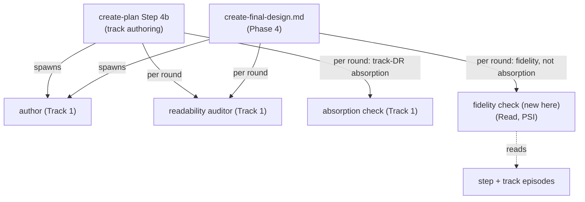

<!-- workflow-sha: ed3fe83cda372f371df18d63268aeb8cf6aebeb0 -->
# Track 2: Reuse the loop at track authoring and Phase 4; collapse the 4a/4b boundary

## Purpose / Big Picture
After this track lands, the same authoring loop runs at track authoring (`create-plan` Step 4b) and at Phase 4 final-design, so no-design tiers get readability help and the final design is checked against what was actually built; the full-tier 4a/4b session boundary collapses into one `create-plan` invocation.

<!-- Reserved for Move 2 — ADDED/MODIFIED/REMOVED triad. Empty until Move 2 lands. -->

This track wires the Track 1 loop into the two authoring points it does not yet
reach. First, `create-plan` Step 4b derives the track files through an author
spawn plus the same inner loop, with track-decision-record absorption as the
second check, so `lite` and `minimal` — which have no design buffer — get the
same readability help. Second, the Phase 4 final-design path's per-round second
check becomes a **fidelity check** (not absorption) that confirms
`design-final.md` matches what was built, sourced primarily from the step and
track episodes with PSI covering the residual. The staged `edit-design` loop
already selects this check by mutation kind; this track supplies the missing
half — the fidelity-check agent definition and its spawn-contract row in
`edit-design` Step 4 — and refreshes the now-stale `create-final-design.md`
Phase 4 description to match the multi-agent loop. Third, because sub-agent
authoring already supplies
the context isolation the full-tier Step 4a / Step 4b session boundary existed
to force, the two steps collapse into one `create-plan` invocation — a staged
change to the auto-resume contract that depends hard on Track 1's by-reference
orchestration. Everything here reuses the author, auditor, and absorption
roles built in Track 1; this track adds one new agent definition, the fidelity
check.

## Progress
- [x] 2026-06-18T07:48Z [ctx=info] Review + decomposition complete
- [x] 2026-06-18T08:28Z [ctx=safe] Step 1 complete (commit 4045cb1925)
- [ ] Step implementation
- [ ] Track-level code review
- [ ] Track completion

## Surprises & Discoveries
<!-- Continuous-log. Empty at Phase 1. -->
- The Step 4a `design.md` `phase1-creation` cold-read description in the staged `create-plan/SKILL.md` still names the absorption-completeness cross-check (the pre-de-warm framing). It sits on the design path, not the Step-4b track path Step 1 reworked, so it was left untouched. Candidate Phase C finding: confirm whether Track 1 meant to update it. See Episodes §Step 1.

## Decision Log
<!-- The track-canonical live decision carrier (D7). Seeded from the frozen
design.md D-records. -->

#### D10: Phase 4 fidelity is primarily doc-against-episodes; PSI covers the diagram, signature, and no-episode-trace residual
- **Alternatives considered**: a PSI-only comparison of `design-final.md` against the as-built code; re-running absorption (log-against-doc) at Phase 4.
- **Rationale**: at Phase 4 the source of truth is the as-built code and its episodes, not the research log. Re-asserting a superseded log decision would be a fidelity bug, because implementation can supersede a planned decision through an inline replan or a scope-down recorded in an episode (S6). The step and track episodes carry both what was built and why it diverged, so checking the doc against the episodes is text-against-text — the same cheap shape as absorption. PSI covers two residuals: precision (an episode may say "added a per-class record helper" while a diagram states an exact signature or draws a specific call arrow) and coverage (when an episode is silent on a behavioral point the final design asserts, fall back to code through PSI rather than trusting an episode-match that was never recorded — gate A8). The existing diagram-to-code verification in `create-final-design.md` runs once at entry and re-runs per round only if a round touched a diagram, which readability edits rarely do.
- **Risks/Caveats**: a silent scope-down that no episode records is the failure the coverage residual guards — the doc could match the episodes while both diverge from the code, so a claim with no episode trace routes to PSI.
- **Implemented in**: this track (the fidelity-check agent and the `create-final-design.md` phase4 wiring).
- **Full design**: design.md §"The phase4 fidelity check".

#### D11 (create-plan facet): The loop wires into `create-plan` Step 4b for track authoring
- **Alternatives considered**: wire the loop only in `edit-design`, leaving `lite` and `minimal` with no readability help.
- **Rationale**: `edit-design` handles `design.md`, which exists only in `full`. In `lite` and `minimal` the durable human-facing carrier is the track files, authored in `create-plan` Step 4b — exactly where dense log-derived prose lands with no design buffer. So the loop runs at both authoring points, keyed by target: `edit-design` for `design.md`, `create-plan` Step 4b for the track files. The roles are reused, target-parameterized — one author prompt, one readability auditor. The author's seed source is the frozen `design.md` in `full` and the research log directly in `lite` and `minimal`; the second check is track-decision-record absorption (matching log or design decisions against the track decision records), so the track cold-read de-warms the same way the design one does.
- **Risks/Caveats**: this is one logical decision (D11) split by authoring point. The `edit-design` facet is Track 1's record; a change to either facet propagates to the other. The auditor's standing anchors on the track path are the plan Component Map and each track's Purpose / Big Picture, because a track slice alone lacks the whole-plan vocabulary.
- **Implemented in**: this track (the `create-plan` Step 4b rework). The `edit-design` facet lives in Track 1.
- **Full design**: design.md §"Track authoring in create-plan Step 4b".

#### D15: Collapse the 4a/4b session boundary into one `create-plan` invocation
- **Alternatives considered**: keep the Step 4a / Step 4b session boundary as the context-isolation mechanism.
- **Rationale**: the boundary exists today to force a `/clear` so Step 4b derives the plan from the frozen design with a cold context. Sub-agent authoring supplies that isolation directly — the plan and track author is a fresh cold spawn reading the frozen committed design regardless of session — so the boundary stops earning its keep and Step 4a can flow into Step 4b in one invocation. This is a real machinery change, not a cosmetic convenience: it rewrites the `create-plan` auto-resume contract (the routing that keys on whether `design.md` is committed-and-clean → 4b or dirty → 4a, and the "Step 4a ends the session" rule). That routing is the schema a running phase reads, so the change is staged as an execution-procedure change under §1.7(b), not a §1.7(k) prose opt-out. The crash-recovery path is re-specified to fire only on a dirty or absent plan after a committed-clean design; the happy path no longer crosses the boundary, and Step 1c's auto-resume becomes crash-recovery-only.
- **Risks/Caveats**: **by-reference orchestration is a hard requirement** (built in Track 1), not a preference adopted alongside. If any author sub-agent ever returns more than a thin summary, the combined session re-accumulates the design and plan context the boundary kept apart, and the collapse regresses context isolation — **if by-reference cannot hold, the boundary is retained** (gate A6). The freeze-and-commit after design authoring stays as the logical gate and the crash checkpoint; only the coinciding session boundary goes away. A very large design can make even the by-reference combined session long; the mid-phase handoff and the context monitor mitigate it as for any long phase.
- **Implemented in**: this track (the `create-plan` Step 1c auto-resume re-spec).
- **Full design**: design.md §"Collapsing the 4a/4b session boundary".

## Outcomes & Retrospective
<!-- Continuous-log. -->
- [x] Technical: PASS at iteration 2 (3 findings, 3 accepted — T1/T2 should-fix, T3 suggestion). Drove the `edit-design` Step 4 fidelity-row scope addition, the `create-final-design.md` description-sync relocation (the swap lives in `edit-design`), and the dual-replacement / `iteration_budget` note.
- [x] Risk: PASS at iteration 2 (4 findings, 4 accepted — R1/R2 should-fix, R3/R4 suggestion). Drove the fidelity-spawn-contract scope, the branch-exhaustive Step 1c per-arm enumeration, the static by-reference confirmation plus deferred live-harness check, and the warm-up-disabled correctness baseline.
- [x] Adversarial: PASS at iteration 2 (5 findings, 4 accepted, A5 no-action). Narrowed to track realization (D9); all three challenges ran (Track 2 is not track 1). Drove the required-edit marking of `workflow.md` plus the four `create-plan` sites, the absorption relocation off the Step-4b reviewer with the stale-instruction rewrite, the R1/A1 seam cite, and the sizing edit-depth note. Gate A6 (by-reference) confirmed green; S6 violation INFEASIBLE.

## Context and Orientation
This track depends on Track 1 having landed. It reuses Track 1's author,
readability auditor, and absorption agent definitions, the `edit-design` loop
structure, and the by-reference orchestration contract. Like Track 1, every
edit is staged under
`docs/adr/understandable-design/_workflow/staged-workflow/.claude/` and stays
non-live until the Phase 4 promotion (S7).

What is there today:

- `.claude/skills/create-plan/SKILL.md` Step 4b derives the plan and track
  files inline (the planner authors them), then runs a **single post-write
  cold-read**: one `subagent_type: general-purpose` spawn of the full
  `design-review.md` body with `target=tracks`, which also runs the
  absorption-completeness cross-check (D8) inline and carries an
  `iteration_budget` (default 3) escalation contract. Track 1 removed the
  absorption cross-check from `design-review.md` (staged), so that
  Step-4b instruction is now **stale** — it asks the reviewer to run a check the
  de-warmed reviewer no longer performs. Step 1c is the tier-aware resume check
  and is **branch-exhaustive**: it routes every artifact combination with a
  "never a dead end" invariant. Its `full`-tier branch routes a
  committed-and-clean `design.md` with no plan to Step 4b, and an interrupted
  Step 4a (dirty or uncommitted `design.md`) back into the `edit-design` review
  loop. Step 4a today ends the session once `design.md` is frozen and committed
  (`Add initial design`); the user re-invokes `/create-plan` and the startup
  protocol auto-resumes into Step 4b, which ends with a second commit (`Add
  initial implementation plan`). `workflow.md` declares the Step 4a → Step 4b
  boundary a **mandatory session boundary**.
- `.claude/workflow/prompts/create-final-design.md` is the Phase 4 final-design
  prompt. It routes `phase4-creation` through `edit-design`, which now selects
  the per-round second check by mutation kind. Its Sub-step B description is
  **stale**: it still describes a single `whole-doc` cold-read on
  `design-final.md` via the design-review sub-agent, not the staged multi-agent
  `phase4-creation` loop (author + per-round auditor + fidelity + post-loop
  comprehension gate). A PSI diagram-to-code verification runs at entry. No
  fidelity-against-episodes check runs at Phase 4 today.
- The step and track **episodes** (per-step and per-track as-built records under
  the track files' `## Episodes` sections) carry what was built and why it
  diverged from the plan — the fidelity check's primary source.

Non-obvious terminology (defined in design.md §"Core Concepts"): **fidelity
check**, **absorption check**, **dual-clean inner loop**, **code-grounded
author**, **cold readability auditor**.

- **create-plan Step 4b** reuses author + auditor + absorption with
  `target=tracks`; the second check stays absorption (against the track
  decision records).
- **create-final-design** reuses author + auditor + the comprehension gate but
  swaps the second check to the new **fidelity check**, which reads the
  episodes and falls back to PSI for the residual.

## Plan of Work
Three concerns, each able to decompose into its own step at Phase A:

1. **Wire the loop into `create-plan` Step 4b.** Replace **both** the
   planner-inline track derivation **and** the single `general-purpose`
   post-write `target=tracks` cold-read with an author spawn plus the same
   dual-clean inner loop. The author seeds from the frozen `design.md` in `full`
   and the research log in `lite` / `minimal`; the per-round pair is the
   readability auditor plus a **separate `absorption-check` agent spawn** as the
   second check (against the track decision records). Relocate the
   absorption-completeness cross-check off the `design-review.md` /
   `comprehension-review` spawn onto that `absorption-check` agent, and rewrite
   the now-stale live Step-4b instruction that still asks the reviewer to run
   it. This is the track-path analog of the `edit-design` Step 4 absorption move
   Track 1 performed at the design surface. Set the auditor's standing anchors
   to the plan Component Map and each track's Purpose / Big Picture. Apply the
   one-owner-per-surface rule (S4): the auditor owns the prose axis on the track
   cold-read, and the de-warmed comprehension reviewer (from Track 1) runs no
   prose axis here, which closes the `target=tracks` prose-owner seam Track 1
   recorded (its R1 / A1 co-promotion seam). Preserve the existing Step-4b
   `iteration_budget` (default 3) / escalation contract as the new inner loop's
   bounded-iterate termination (S5). The loop inherits Track 1's gate-A7 warm-up
   deferral: the fan-out cache warm-up is a cost lever rather than a correctness
   dependency, so the warm-up-disabled (N-cold-prefix) path is the correctness
   baseline and Step-4b acceptance does not require a working warm-up. Keep the
   freeze-order gate (S3) on the track loop.
2. **Add the fidelity-check agent and complete the Phase 4 wiring.** Add the
   fidelity-check agent definition (`Read`, mcp-steroid PSI) under the staged
   `.claude/agents/`. The staged `edit-design` loop already selects the
   `phase4-creation` second check by mutation kind (the fidelity check rather
   than absorption); Track 1 left only a forward reference, so this track
   supplies the missing wiring. **Add the fidelity-check spawn-contract row to
   staged `edit-design/SKILL.md` Step 4**: the `subagent_type`, the `Read` + PSI
   allow-list, and the params-file keys (the episodes path, the frozen
   `design.md` for the residual, `draft_path=<design-final.md>`, and explicitly
   no `research_log_path`), as a sibling to the existing `absorption-check`
   paragraph, so the Step 6 loop that already names the fidelity check can spawn
   it. The fidelity check is doc-against-episodes text matching, with the PSI
   residual triggered by any `design-final.md` claim lacking an episode trace
   (gate A8). Then **refresh `create-final-design.md` Sub-step B**: its
   description is stale (it still names a single `whole-doc` cold-read), so
   rewrite it to describe the multi-agent `phase4-creation` loop and thread the
   fidelity check's caller-supplied inputs (the episodes path and the
   `output_path` the comprehension gate's `phase4-creation` branch already
   expects). This is description-sync plus input-threading in
   `create-final-design.md`, not a swap there; the kind-keyed swap lives in
   `edit-design`. Keep the diagram-to-code verification at entry, re-running per
   round only when a round touched a diagram.
3. **Collapse the 4a/4b boundary (D15), gated on by-reference holding.** The
   collapse is a **required** edit to four `create-plan/SKILL.md` sites and to
   `workflow.md`, not a conditional touch: rewrite the Step 1c auto-resume
   routing, the Design→plan session-boundary block, the Step 4a end-session
   instruction, and the two session-end commit mechanics, plus the `workflow.md`
   "mandatory session boundary" declaration. Step 1c is branch-exhaustive, so
   enumerate every arm's post-collapse disposition: the
   committed-clean-`design.md`-no-plan arm flips from the normal flow to
   crash-recovery-only; the dirty or uncommitted-`design.md` arm is **retained**
   (a crash mid-authoring still resumes Step 4a) alongside the dirty or
   absent-plan recovery arm; the "never a dead end" invariant must still hold
   for every artifact combination. **Commit shape (D15):** the collapsed happy
   path keeps **both** session-end commits within one session. The `Add initial
   design` freeze-and-commit stays as the logical gate and crash checkpoint per
   D15; only the session boundary between the two commits is removed, and Step
   4b becomes crash-recovery-only on the auto-resume side. The `conventions.md`
   §1.7 / sanctioned-read-point cross-ref stays conditional (touch only if the
   collapse makes it inaccurate). **Before applying the collapse, confirm
   by-reference orchestration holds** (Track 1 built it; gate A6): if any author
   spawn returns more than a thin summary, retain the boundary instead. On a
   staged, non-live branch this confirmation is the static read that the
   `design-author` definition's by-reference clause is intact and that the
   Step-4b wiring passes `output_path` and partial-fetches (so the orchestrator
   never receives the draft); the live-harness confirmation is carried forward
   as a Phase-4-promotion / first-live-run deferred item, the same shape Track 1
   used for gate A7.

Ordering constraints: concern 1 (Step 4b loop) and concern 3 (boundary
collapse) both edit `create-plan/SKILL.md`, so co-locate them in this track to
avoid two passes cold-reading the same file. Concern 2 (Phase 4) touches
disjoint files: the new agent definition, staged `edit-design/SKILL.md` Step 4,
and `create-final-design.md`. The boundary collapse (concern 3) is the last to
apply, since it depends on the Step 4b loop existing and on Track 1's
by-reference contract being validated.

## Concrete Steps

1. Wire the dual-clean authoring loop into `create-plan` Step 4b (concern 1): replace the planner-inline track derivation and the single `general-purpose` `target=tracks` cold-read with an author spawn plus a per-round `readability-auditor` and a separate `absorption-check` agent (track-decision-record absorption); relocate absorption off the `design-review.md` / `comprehension-review` spawn and rewrite the now-stale Step-4b instruction; set the auditor's standing anchors to the plan Component Map and each track's Purpose / Big Picture; keep the S3 freeze-order gate and the existing `iteration_budget` (default 3) / escalation contract as the bounded-iterate exit (S5); inherit the gate-A7 warm-up deferral (warm-up-disabled is the correctness baseline). Edits `create-plan/SKILL.md`. — risk: high (workflow machinery: wires the multi-agent dual-clean control-flow loop with its S5 bounded-iterate exit and S3 freeze-order gate into create-plan Step 4b dispatch)  [x] commit: 4045cb1925
2. Add the fidelity-check agent and complete the Phase 4 wiring (concern 2): add the fidelity-check agent definition (`Read`, mcp-steroid PSI) under staged `.claude/agents/`; add its spawn-contract row and params keys (episodes path, the frozen `design.md` for the residual, `draft_path=<design-final.md>`, explicitly no `research_log_path`) to staged `edit-design/SKILL.md` Step 4 as a sibling to the `absorption-check` paragraph; refresh the stale `create-final-design.md` Sub-step B description to the multi-agent `phase4-creation` loop and thread the fidelity inputs (episodes path, `output_path`); keep the diagram-to-code verification at entry. *(parallel with Step 1; disjoint files)* — risk: medium (workflow machinery: a new review-agent spec plus bounded Phase-4 second-check wiring; no gate or state-machine rewrite) — size: ~3 files; no mergeable low/medium work, Steps 1 and 3 are both high  [ ]
3. Collapse the 4a/4b session boundary, D15 (concern 3): rewrite the four `create-plan/SKILL.md` sites (the Step 1c auto-resume routing with a per-arm disposition, the Design→plan boundary block, the Step 4a end-session instruction, the two session-end commit mechanics) and the `workflow.md` "mandatory session boundary" declaration; keep both session-end commits within one session (the `Add initial design` freeze-and-commit stays the crash checkpoint per D15); preserve the "never a dead end" invariant for every Step 1c arm and retain the dirty / uncommitted-`design.md` recovery arm; confirm by-reference statically (gate A6) before applying and retain the boundary otherwise; touch `planning.md` / `conventions.md` only where a boundary reference becomes inaccurate. Depends on Step 1. — risk: high (workflow machinery: rewrites the create-plan auto-resume state machine / Step 1c control-flow protocol and the session-boundary declaration)  [ ]

## Episodes
<!-- Continuous-log. Phase B sub-step 7 appends one block per completed step. -->

### Step 1 — commit 4045cb1925, 2026-06-18T08:28Z [ctx=safe]
**What was done:** Rewrote `create-plan` Step 4b track authoring in the staged `SKILL.md`. The planner-inline track derivation plus the single `general-purpose` `target=tracks` cold-read became the dual-clean multi-agent loop `edit-design` runs on `design.md`, parameterized to `target=tracks`. Each round spawns the `design-author` (writing the track-file prose), a per-round `readability-auditor` fan-out (one spawn per `plan/track-N.md` in track-number order, whole-file range), and a separate `absorption-check` spawn against the track decision records as the second check. After convergence the de-warmed `comprehension-review` runs once with no prose axis (S4). The auditor's standing anchors are the plan Component Map and each track's `## Purpose / Big Picture`. The loop keeps the S3 freeze-order gate, reuses the existing `iteration_budget` (default 3) / escalation contract as the S5 bounded-iterate exit, and inherits the gate-A7 warm-up deferral, so the warm-up-disabled path is the correctness baseline. The stale instruction asking the `design-review.md` / `comprehension-review` spawn to run the absorption cross-check (D8) was removed; absorption is now its own spawn. A comprehension-gate re-open consumes one shared `iteration_budget` round rather than starting a fresh count.

**What was discovered:** The Step 4a `design.md` `phase1-creation` description in the staged `SKILL.md` still names its cold-read as running the absorption-completeness cross-check, which is the pre-de-warm framing. That line sits on the design path (Track 1's surface), not the Step-4b track path this step owns, so it was left untouched; the Phase C track review should confirm whether Track 1 meant to update it too.

**What changed from the plan:** none.

**Key files** (under `_workflow/staged-workflow/`):
- `.claude/skills/create-plan/SKILL.md` (new — staged copy, Step 4b rework)

## Validation and Acceptance
Track-level acceptance:

- `create-plan` Step 4b derives the track files via an author spawn plus the
  dual-clean loop, with a **separate `absorption-check` agent spawn** as the
  second check (track-decision-record absorption) and the auditor owning the
  prose axis (the comprehension reviewer runs none). The stale Step-4b
  instruction that asked the `design-review.md` / `comprehension-review` spawn
  to run the absorption cross-check is rewritten, so no spawned agent is told to
  run a check it does not perform.
- The Step 4b loop reuses the existing `iteration_budget` (default 3) /
  escalation contract as its bounded-iterate termination (S5), and the
  warm-up-disabled path is the correctness baseline: acceptance does not require
  a working fan-out warm-up (gate A7 deferral, inherited from Track 1).
- In `lite` and `minimal`, the loop runs once on the track files; in `full` it
  runs on `design.md` in Step 4a and again on the track files in Step 4b.
- The `phase4-creation` round actually spawns the fidelity check: staged
  `edit-design/SKILL.md` Step 4 carries a fidelity-check spawn-contract row and
  params naming the agent's basename, so the Step 6 loop can launch it.
- `create-final-design.md` Sub-step B describes the multi-agent
  `phase4-creation` loop (not a single `whole-doc` cold-read) and threads the
  fidelity check's inputs (episodes path, `output_path`); the kind-keyed
  second-check selection lives in `edit-design`, not here. The **fidelity
  check** (not absorption) is the second check: a `design-final.md` claim
  contradicted by an episode is reported, and a claim with no episode trace
  routes to PSI rather than passing on an episode-match that was never recorded.
- `design-final.md` never re-asserts a log decision that an episode superseded
  (S6).
- After the 4a/4b collapse, a `full`-tier `/create-plan` run authors the design
  and derives the plan in one invocation, producing **both** session-end commits
  (`Add initial design`, then `Add initial implementation plan`) within that one
  session. Step 1c still routes every artifact combination (the "never a dead
  end" invariant holds): it auto-resumes into Step 4b only on a dirty or absent
  plan after a committed-and-clean design, retains the dirty / uncommitted
  `design.md` arm that resumes Step 4a, and the Design→plan boundary block no
  longer instructs the user to re-invoke across a boundary on the happy path.
- By-reference orchestration is confirmed before the collapse is applied. On
  this staged, non-live branch the confirmation is a static read: the
  `design-author` definition's by-reference clause is intact, and the Step-4b
  wiring passes `output_path` and partial-fetches so the orchestrator never
  receives the draft. The live-harness confirmation is a deferred
  Phase-4-promotion / first-live-run gate. If by-reference cannot hold, the
  boundary is retained and the collapse criterion is recorded as deferred.

**Per-step acceptance:**
- Step 1: WHEN `create-plan` Step 4b runs, it spawns the `design-author` (no planner-inline authoring), runs the per-round `readability-auditor` plus a separate `absorption-check` agent spawn as the second check, and the de-warmed `comprehension-review` runs no prose axis (S4); the stale Step-4b instruction no longer asks the reviewer to run the absorption cross-check; the loop reuses the `iteration_budget` / escalation contract (S5) and the S3 freeze-order gate, and produces correct dual-clean output with the warm-up disabled. Acceptance is a static read against S3/S4/S5, a worked dry-run of the loop, and `workflow-reindex.py --check`.
- Step 2: WHEN the staged `edit-design/SKILL.md` Step 4 is read, it carries a fidelity-check spawn-contract row and params naming the new agent's basename, so the Step 6 loop can spawn it on `phase4-creation`; the fidelity-check agent definition carries `Read` plus mcp-steroid PSI; `create-final-design.md` Sub-step B describes the multi-agent `phase4-creation` loop (not a single `whole-doc` cold-read) and passes the episodes path and `output_path`. Acceptance is a static read plus `workflow-reindex.py --check`.
- Step 3: WHEN the 4a/4b collapse lands, `create-plan` Step 1c routes every artifact combination (the "never a dead end" invariant holds), with the committed-clean-no-plan arm crash-recovery-only and the dirty / uncommitted-`design.md` arm retained; the Design→plan boundary block no longer instructs re-invoke across a boundary on the happy path; `workflow.md` no longer declares a mandatory 4a→4b session boundary; the collapsed happy path produces both session-end commits within one session; by-reference is confirmed statically (gate A6) before the collapse, else the boundary is retained and the criterion is recorded as deferred. Acceptance is a static read plus a worked dry-run of every Step 1c arm.

## Idempotence and Recovery
- All three steps edit only staged `.claude/**` files under `_workflow/staged-workflow/` (the `workflow.md` edit lands under that subtree too); no live path, no runtime state, no data migration. Re-running a step re-writes the same staged files, so authoring is idempotent.
- Recovery: a failed or reverted step is `git reset --hard HEAD` plus re-author, with no external side effect to undo.
- Step 3 depends on Step 1 (the Step 4b loop must exist before the collapse routes a combined invocation through it), so reverting Step 1 forces a Step 3 re-do. Step 2 is independent of Steps 1 and 3 (disjoint files) and can be implemented in any order relative to them.

## Artifacts and Notes
<!-- Continuous-log (rare). Often empty. -->

## Interfaces and Dependencies
**In-scope files** (all staged under
`docs/adr/understandable-design/_workflow/staged-workflow/.claude/`):

- `.claude/skills/create-plan/SKILL.md` — the heaviest-edited file. (1) The
  Step 4b track-authoring loop: author spawn + dual-clean loop + a separate
  `absorption-check` agent spawn, plus the rewrite of the now-stale Step-4b
  instruction that asks the reviewer to run absorption. (2) The 4a/4b collapse
  (D15): the Step 1c auto-resume re-spec, the Design→plan session-boundary
  block, the Step 4a end-session instruction, and the two session-end commit
  mechanics.
- `.claude/workflow/prompts/create-final-design.md` — Phase 4: refresh the stale
  Sub-step B description to the multi-agent `phase4-creation` loop and thread
  the fidelity check's inputs (episodes path, `output_path`); keep
  diagram-to-code verification. The kind-keyed second-check swap is not here; it
  lives in `edit-design`.
- `.claude/skills/edit-design/SKILL.md` — **narrow boundary: the Step 4
  fidelity-check spawn-contract row + its params keys only.** Track 1 owns the
  loop structure and forward-referenced the fidelity check ("built in the Phase
  4 track"); this track adds the one row plus a sibling paragraph to the
  `absorption-check` one, so the Step 6 loop can spawn the fidelity check the
  rest of the staged file already names. The rest of the `edit-design` loop
  stays Track 1's.
- `.claude/agents/` — one new agent definition: the fidelity check (`Read`,
  mcp-steroid PSI). Exact filename set at Phase A.
- `.claude/workflow/workflow.md` — **required:** rewrite the "mandatory session
  boundary" declaration for the Step 4a → Step 4b boundary the collapse removes.
- `.claude/workflow/planning.md` — touch only if its Step 4b authoring
  description references the retired inline-derivation flow or names the removed
  session boundary.
- `.claude/workflow/conventions.md` — touch only where a §1.7 staging read or a
  sanctioned-read-point cross-ref describing the 4a/4b boundary becomes
  inaccurate after the collapse (conditional).

**Out-of-scope** (Track 1 or separate PRs):

- The author, readability auditor, absorption check, and de-warmed
  comprehension reviewer agent definitions, the `edit-design` loop **structure**
  (this track adds only the Step 4 fidelity-check row, listed in In-scope), and
  the `research.md` / `design-document-rules.md` S2 wording — all Track 1.
- The YTDB-1128 / YTDB-1129 house-style rules and PR-description readability —
  separate PR / issue (Track 1 D19, design non-goals).

**Inter-track dependencies**: this track **depends on Track 1**. It reuses
Track 1's author, readability auditor, and absorption agent definitions, the
`edit-design` loop structure, and — critically for D15 — the by-reference
orchestration contract. Track 1 supplies these prerequisites; nothing
downstream consumes this track's output.

**Track sizing justification (this track is under the ~12-file floor).** This
track holds the three downstream reuse units (the Step 4b track loop, the Phase 4
fidelity check, and the 4a/4b collapse) together rather than splitting them, and
stays separate from Track 1 across the core-to-downstream dependency boundary.
The three units are autonomous and bundling them costs no more to review than
splitting them (the maximize rule), while the cut from Track 1 is the preferred
dependency-boundary cut. The Step 4b loop and the 4a/4b collapse both edit
`create-plan/SKILL.md`, so co-locating them avoids a second pass cold-reading
the same file. The ~5-file count understates the review weight: concern 3 (the
4a/4b collapse) carries the heaviest per-file edit depth, rewriting the
auto-resume contract across four `create-plan/SKILL.md` sites plus
`workflow.md`, so Phase A sizes steps by edit depth, not file count.

**Signatures / contracts**: the Step 4b and Phase 4 loops spawn the same roles
via the `Agent` tool against their agent definitions, target-parameterized
(`target=tracks` for Step 4b; the episodes path and frozen design for Phase 4).
Per-agent parameters go in a file the agent reads first, keeping spawn prompts
byte-identical (D13/D14, Track 1).

## Invariants & Constraints
- S3: the cold-read does not run while a log-adversarial gate entry is open — on the track path, verified by the freeze-order gate held across the Step 4b loop and the review-hold batch.
- S4: no surface runs the prose AI-tell axis on both the auditor and the comprehension reviewer — on the track cold-read surface, verified by the auditor owning the prose axis and `create-plan` Step 4b spawning the de-warmed comprehension reviewer with no prose axis.
- S6: Phase 4 reflects what was built and never re-asserts a superseded log decision — verified by the fidelity check sourcing from episodes and routing no-episode-trace claims to PSI, and a check that no superseded log decision reappears in `design-final.md`.
- S7 (staging): the new routine stays staged and non-live until the Phase 4 promotion — verified by every `.claude/**` edit landing under `_workflow/staged-workflow/` and the live paths staying at develop state.
- Constraint (§1.7(b) workflow-modifying): the phase ledger `s17` field is `workflow-modifying`; all edits in this track route through the staged subtree.
- Constraint (by-reference, hard for D15): if any author spawn returns more than a thin summary, the 4a/4b boundary is retained rather than collapsed.

## Base commit
87f40db9afc95a8bec478d05eabf20d317f03526
