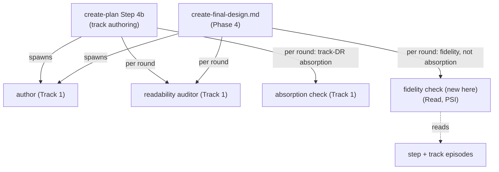

<!-- workflow-sha: ed3fe83cda372f371df18d63268aeb8cf6aebeb0 -->
# Track 2: Reuse the loop at track authoring and Phase 4; collapse the 4a/4b boundary

## Purpose / Big Picture
After this track lands, the same authoring loop runs at track authoring (`create-plan` Step 4b) and at Phase 4 final-design, so no-design tiers get readability help and the final design is checked against what was actually built; the full-tier 4a/4b session boundary collapses into one `create-plan` invocation.

<!-- Reserved for Move 2 — ADDED/MODIFIED/REMOVED triad. Empty until Move 2 lands. -->

This track wires the Track 1 loop into the two authoring points it does not yet
reach. First, `create-plan` Step 4b derives the track files through an author
spawn plus the same inner loop, with track-decision-record absorption as the
second check, so `lite` and `minimal` — which have no design buffer — get the
same readability help. Second, the Phase 4 final-design step swaps the second
check from absorption to a **fidelity check** that confirms `design-final.md`
matches what was built, sourced primarily from the step and track episodes with
PSI covering the residual. Third, because sub-agent authoring already supplies
the context isolation the full-tier Step 4a / Step 4b session boundary existed
to force, the two steps collapse into one `create-plan` invocation — a staged
change to the auto-resume contract that depends hard on Track 1's by-reference
orchestration. Everything here reuses the author, auditor, and absorption
roles built in Track 1; this track adds one new agent definition, the fidelity
check.

## Progress
- [ ] Review + decomposition
- [ ] Step implementation
- [ ] Track-level code review
- [ ] Track completion

## Surprises & Discoveries
<!-- Continuous-log. Empty at Phase 1. -->

## Decision Log
<!-- The track-canonical live decision carrier (D7). Seeded from the frozen
design.md D-records. -->

#### D10: Phase 4 fidelity is primarily doc-against-episodes; PSI covers the diagram, signature, and no-episode-trace residual
- **Alternatives considered**: a PSI-only comparison of `design-final.md` against the as-built code; re-running absorption (log-against-doc) at Phase 4.
- **Rationale**: at Phase 4 the source of truth is the as-built code and its episodes, not the research log. Re-asserting a superseded log decision would be a fidelity bug, because implementation can supersede a planned decision through an inline replan or a scope-down recorded in an episode (S6). The step and track episodes carry both what was built and why it diverged, so checking the doc against the episodes is text-against-text — the same cheap shape as absorption. PSI covers two residuals: precision (an episode may say "added a per-class record helper" while a diagram states an exact signature or draws a specific call arrow) and coverage (when an episode is silent on a behavioral point the final design asserts, fall back to code through PSI rather than trusting an episode-match that was never recorded — gate A8). The existing diagram-to-code verification in `create-final-design.md` runs once at entry and re-runs per round only if a round touched a diagram, which readability edits rarely do.
- **Risks/Caveats**: a silent scope-down that no episode records is the failure the coverage residual guards — the doc could match the episodes while both diverge from the code, so a claim with no episode trace routes to PSI.
- **Implemented in**: this track (the fidelity-check agent and the `create-final-design.md` phase4 wiring).
- **Full design**: design.md §"The phase4 fidelity check".

#### D11 (create-plan facet): The loop wires into `create-plan` Step 4b for track authoring
- **Alternatives considered**: wire the loop only in `edit-design`, leaving `lite` and `minimal` with no readability help.
- **Rationale**: `edit-design` handles `design.md`, which exists only in `full`. In `lite` and `minimal` the durable human-facing carrier is the track files, authored in `create-plan` Step 4b — exactly where dense log-derived prose lands with no design buffer. So the loop runs at both authoring points, keyed by target: `edit-design` for `design.md`, `create-plan` Step 4b for the track files. The roles are reused, target-parameterized — one author prompt, one readability auditor. The author's seed source is the frozen `design.md` in `full` and the research log directly in `lite` and `minimal`; the second check is track-decision-record absorption (matching log or design decisions against the track decision records), so the track cold-read de-warms the same way the design one does.
- **Risks/Caveats**: this is one logical decision (D11) split by authoring point. The `edit-design` facet is Track 1's record; a change to either facet propagates to the other. The auditor's standing anchors on the track path are the plan Component Map and each track's Purpose / Big Picture, because a track slice alone lacks the whole-plan vocabulary.
- **Implemented in**: this track (the `create-plan` Step 4b rework). The `edit-design` facet lives in Track 1.
- **Full design**: design.md §"Track authoring in create-plan Step 4b".

#### D15: Collapse the 4a/4b session boundary into one `create-plan` invocation
- **Alternatives considered**: keep the Step 4a / Step 4b session boundary as the context-isolation mechanism.
- **Rationale**: the boundary exists today to force a `/clear` so Step 4b derives the plan from the frozen design with a cold context. Sub-agent authoring supplies that isolation directly — the plan and track author is a fresh cold spawn reading the frozen committed design regardless of session — so the boundary stops earning its keep and Step 4a can flow into Step 4b in one invocation. This is a real machinery change, not a cosmetic convenience: it rewrites the `create-plan` auto-resume contract (the routing that keys on whether `design.md` is committed-and-clean → 4b or dirty → 4a, and the "Step 4a ends the session" rule). That routing is the schema a running phase reads, so the change is staged as an execution-procedure change under §1.7(b), not a §1.7(k) prose opt-out. The crash-recovery path is re-specified to fire only on a dirty or absent plan after a committed-clean design; the happy path no longer crosses the boundary, and Step 1c's auto-resume becomes crash-recovery-only.
- **Risks/Caveats**: **by-reference orchestration is a hard requirement** (built in Track 1), not a preference adopted alongside. If any author sub-agent ever returns more than a thin summary, the combined session re-accumulates the design and plan context the boundary kept apart, and the collapse regresses context isolation — **if by-reference cannot hold, the boundary is retained** (gate A6). The freeze-and-commit after design authoring stays as the logical gate and the crash checkpoint; only the coinciding session boundary goes away. A very large design can make even the by-reference combined session long; the mid-phase handoff and the context monitor mitigate it as for any long phase.
- **Implemented in**: this track (the `create-plan` Step 1c auto-resume re-spec).
- **Full design**: design.md §"Collapsing the 4a/4b session boundary".

## Outcomes & Retrospective
<!-- Continuous-log. -->

## Context and Orientation
This track depends on Track 1 having landed. It reuses Track 1's author,
readability auditor, and absorption agent definitions, the `edit-design` loop
structure, and the by-reference orchestration contract. Like Track 1, every
edit is staged under
`docs/adr/understandable-design/_workflow/staged-workflow/.claude/` and stays
non-live until the Phase 4 promotion (S7).

What is there today:

- `.claude/skills/create-plan/SKILL.md` Step 4b derives the plan and track
  files inline (the planner authors them), then spawns the `design-review.md`
  cold-read sub-agent with `target=tracks` for the write-time cold-read. Step
  1c is the tier-aware resume check; its `full`-tier branch routes a committed-
  and-clean `design.md` with no plan to Step 4b, and an interrupted Step 4a
  (dirty or uncommitted `design.md`) back into the `edit-design` review loop.
  Step 4a today ends the session once `design.md` is frozen; the user
  re-invokes `/create-plan` and the startup protocol auto-resumes into Step 4b.
- `.claude/workflow/prompts/create-final-design.md` is the Phase 4 final-design
  prompt. It routes `phase4-creation` through `edit-design` and its build-time
  check today is a PSI diagram-to-code verification against the as-built code,
  not a fidelity check against episodes (no absorption check runs at Phase 4
  today).
- The step and track **episodes** (per-step and per-track as-built records under
  the track files' `## Episodes` sections) carry what was built and why it
  diverged from the plan — the fidelity check's primary source.

Non-obvious terminology (defined in design.md §"Core Concepts"): **fidelity
check**, **absorption check**, **dual-clean inner loop**, **code-grounded
author**, **cold readability auditor**.

- **create-plan Step 4b** reuses author + auditor + absorption with
  `target=tracks`; the second check stays absorption (against the track
  decision records).
- **create-final-design** reuses author + auditor + the comprehension gate but
  swaps the second check to the new **fidelity check**, which reads the
  episodes and falls back to PSI for the residual.

## Plan of Work
Three concerns, each able to decompose into its own step at Phase A:

1. **Wire the loop into `create-plan` Step 4b.** Replace the planner-inline
   track derivation with an author spawn that seeds from the frozen `design.md`
   in `full` and the research log in `lite` / `minimal`, then run the same
   dual-clean inner loop with the readability auditor and a track-decision-
   record absorption check as the second check. Set the auditor's standing
   anchors to the plan Component Map and each track's Purpose / Big Picture.
   Apply the one-owner-per-surface rule (S4): the auditor owns the prose axis on
   the track cold-read; the de-warmed comprehension reviewer (from Track 1) runs
   no prose axis here. Keep the freeze-order gate (S3) on the track loop.
2. **Add the fidelity-check agent and wire the Phase 4 path.** Add the
   fidelity-check agent definition (`Read`, mcp-steroid PSI) under the staged
   `.claude/agents/`. Rework `create-final-design.md` so the `phase4-creation`
   loop keeps the author, auditor, and cold comprehension gate but swaps the
   per-round second check from absorption to fidelity: doc-against-episodes
   text matching, with the PSI residual triggered by any `design-final.md`
   claim lacking an episode trace (gate A8). Keep the diagram-to-code
   verification at entry, re-running per round only when a round touched a
   diagram.
3. **Collapse the 4a/4b boundary (D15) — gated on by-reference holding.**
   Rewrite the `create-plan` Step 1c auto-resume routing so Step 4a flows into
   Step 4b in one invocation; re-specify the crash-recovery path to fire only
   on a dirty or absent plan after a committed-and-clean design (Step 1c becomes
   crash-recovery-only). Keep the freeze-and-commit after design authoring as
   the logical gate and crash checkpoint. **Before applying the collapse,
   confirm by-reference orchestration holds** (Track 1 built it): if any author
   spawn returns more than a thin summary, retain the boundary instead.

Ordering constraints: concern 1 (Step 4b loop) and concern 3 (boundary
collapse) both edit `create-plan/SKILL.md`, so co-locate them in this track to
avoid two passes cold-reading the same file. Concern 2 (Phase 4) is
independent and touches disjoint files. The boundary collapse (concern 3) is
the last to apply, since it depends on the Step 4b loop existing and on Track 1's
by-reference contract being validated.

## Concrete Steps
<!-- Phase A placeholder — decomposition writes a thin numbered roster here. -->

## Episodes
<!-- Continuous-log. Phase B sub-step 7 appends one block per completed step. -->

## Validation and Acceptance
Track-level acceptance:

- `create-plan` Step 4b derives the track files via an author spawn plus the
  dual-clean loop, with track-decision-record absorption as the second check
  and the auditor owning the prose axis (the comprehension reviewer runs none).
- In `lite` and `minimal`, the loop runs once on the track files; in `full` it
  runs on `design.md` in Step 4a and again on the track files in Step 4b.
- `create-final-design.md` `phase4-creation` runs the author, auditor, and cold
  comprehension gate, with the **fidelity check** (not absorption) as the second
  check: a `design-final.md` claim contradicted by an episode is reported, and a
  claim with no episode trace routes to PSI rather than passing on an
  episode-match that was never recorded.
- `design-final.md` never re-asserts a log decision that an episode superseded
  (S6).
- After the 4a/4b collapse, a `full`-tier `/create-plan` run authors the design
  and derives the plan in one invocation; Step 1c auto-resume fires only on a
  dirty or absent plan after a committed-and-clean design. By-reference
  orchestration is confirmed (author spawns return thin summaries only) before
  the collapse is applied; otherwise the boundary is retained and this criterion
  is recorded as deferred.

<!-- Phase A placeholder for per-step EARS/Gherkin lines. -->

## Idempotence and Recovery
<!-- Phase A placeholder — names per-step idempotence and recovery paths. -->

## Artifacts and Notes
<!-- Continuous-log (rare). Often empty. -->

## Interfaces and Dependencies
**In-scope files** (all staged under
`docs/adr/understandable-design/_workflow/staged-workflow/.claude/`):

- `.claude/skills/create-plan/SKILL.md` — Step 4b track-authoring loop (author
  spawn + dual-clean loop + track-DR absorption) and the Step 1c auto-resume
  re-spec for the 4a/4b collapse (D15).
- `.claude/workflow/prompts/create-final-design.md` — Phase 4 fidelity-check
  wiring (swap the second check; keep diagram-to-code verification).
- `.claude/agents/` — one new agent definition: the fidelity check (`Read`,
  mcp-steroid PSI). Exact filename set at Phase A.
- `.claude/workflow/planning.md` — touch only if the Step 4b authoring
  description references the retired inline-derivation flow.
- `.claude/workflow/workflow.md` and `.claude/workflow/conventions.md` — touch
  only where the auto-resume contract or the §1.7 staging reads describe the
  4a/4b boundary that the collapse removes.

**Out-of-scope** (Track 1 or separate PRs):

- The author, readability auditor, absorption check, and de-warmed
  comprehension reviewer agent definitions, the `edit-design` loop, and the
  `research.md` / `design-document-rules.md` S2 wording — all Track 1.
- The YTDB-1128 / YTDB-1129 house-style rules and PR-description readability —
  separate PR / issue (Track 1 D19, design non-goals).

**Inter-track dependencies**: this track **depends on Track 1**. It reuses
Track 1's author, readability auditor, and absorption agent definitions, the
`edit-design` loop structure, and — critically for D15 — the by-reference
orchestration contract. Track 1 supplies these prerequisites; nothing
downstream consumes this track's output.

**Track sizing justification (this track is under the ~12-file floor).** This
track holds the three downstream reuse units (the Step 4b track loop, the Phase 4
fidelity check, and the 4a/4b collapse) together rather than splitting them, and
stays separate from Track 1 across the core-to-downstream dependency boundary.
The three units are autonomous and bundling them costs no more to review than
splitting them (the maximize rule), while the cut from Track 1 is the preferred
dependency-boundary cut. The Step 4b loop and the 4a/4b collapse both edit
`create-plan/SKILL.md`, so co-locating them avoids a second pass cold-reading
the same file.

**Signatures / contracts**: the Step 4b and Phase 4 loops spawn the same roles
via the `Agent` tool against their agent definitions, target-parameterized
(`target=tracks` for Step 4b; the episodes path and frozen design for Phase 4).
Per-agent parameters go in a file the agent reads first, keeping spawn prompts
byte-identical (D13/D14, Track 1).

## Invariants & Constraints
- S3: the cold-read does not run while a log-adversarial gate entry is open — on the track path, verified by the freeze-order gate held across the Step 4b loop and the review-hold batch.
- S4: no surface runs the prose AI-tell axis on both the auditor and the comprehension reviewer — on the track cold-read surface, verified by the auditor owning the prose axis and `create-plan` Step 4b spawning the de-warmed comprehension reviewer with no prose axis.
- S6: Phase 4 reflects what was built and never re-asserts a superseded log decision — verified by the fidelity check sourcing from episodes and routing no-episode-trace claims to PSI, and a check that no superseded log decision reappears in `design-final.md`.
- S7 (staging): the new routine stays staged and non-live until the Phase 4 promotion — verified by every `.claude/**` edit landing under `_workflow/staged-workflow/` and the live paths staying at develop state.
- Constraint (§1.7(b) workflow-modifying): the phase ledger `s17` field is `workflow-modifying`; all edits in this track route through the staged subtree.
- Constraint (by-reference, hard for D15): if any author spawn returns more than a thin summary, the 4a/4b boundary is retained rather than collapsed.
