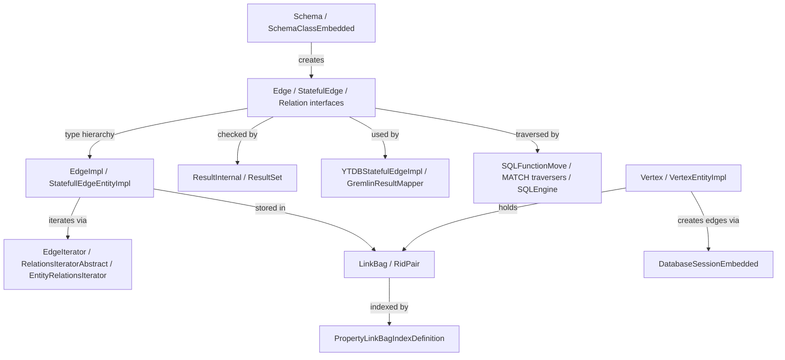

# Unified Edges — Eliminate Lightweight/Stateful Edge Distinction

## ADR Context

### Status

Proposed

### Context

YouTrackDB currently maintains two distinct edge types:

1. **Lightweight edges** — record-less edges stored only as `RidPair(vertexRid, vertexRid)` entries
   in vertex LinkBags. Backed by abstract schema classes. Cannot hold properties. Created via
   `createLightweightEdgeClass()` / `newLightweightEdge()`.

2. **Stateful (heavyweight) edges** — full record-based edges stored as
   `RidPair(edgeRid, vertexRid)` in vertex LinkBags, with a separate edge record holding `out`/`in`
   vertex links and arbitrary user properties. Backed by concrete schema classes. Created via
   `createEdgeClass()` / `newStatefulEdge()`.

The original motivation for lightweight edges was traversal performance: avoiding the cost of
loading edge records when only vertex-to-vertex navigation was needed. However, the **double-sided
LinkBag optimization** (YTDB-542) made this distinction unnecessary. Both edge types now store the
opposite vertex RID as `secondaryRid` in the `RidPair`, enabling O(1) vertex traversal that
bypasses edge record loading entirely — regardless of whether the edge has a record or not.

With the bypass in place, record-based edges offer the best of both worlds:
- **Fast traversal** via `RidPair.secondaryRid` (same as lightweight)
- **Property support** via the edge record
- **Indexable by edge RID** (existing `PropertyLinkBagIndexDefinition` on `primaryRid`)
- **Potential to index by vertex** (new: index on `secondaryRid` — currently not supported)

Maintaining two edge types adds complexity across the entire stack: schema, creation API, deletion,
iteration, Gremlin integration, SQL execution, serialization, and indexing. Unifying to a single
record-based edge type simplifies the codebase and enables full indexing capabilities.

Additionally, the codebase maintains a `Relation<L extends Entity>` interface that abstracts over
both edges and non-edge entity LINK property traversals. `LightweightRelationImpl` wraps raw entity
links in a `getFrom()`/`getTo()` facade, making them "look like" edges for MATCH query traversal
and SQL functions. This abstraction adds indirection without clear value — edges are the primary
relation-tracking mechanism, entity LINK properties are secondary and can be traversed directly via
YQL without the `Relation` wrapper.

The `Element` interface (`com.jetbrains.youtrackdb.internal.core.db.record.record.Element`) is an
empty marker interface with no methods. It sits above `DBRecord` and `Relation` (and is also a
direct superinterface of `Edge`) but is never imported or referenced by name anywhere in the
codebase — only through its concrete subtypes. With `Relation` being deleted and `Edge` being
unified under `Entity`, the `Element` marker serves no purpose and adds a meaningless layer to the
type hierarchy.

### Decision

**Eliminate lightweight edges entirely. All edges become record-based (currently called "stateful").**

**Eliminate the `Element` marker interface.** It is an empty interface with no methods, never
imported or referenced by name in the codebase. Remove it from the `extends` clauses of `DBRecord`
and `Edge`. Delete `Element.java`.

**Eliminate the `Relation` interface and its supporting infrastructure.** Edge-specific methods
(`getFrom()`, `getTo()`, `isLabeled()`, `getEntity()`, `label()`) move directly onto the `Edge`
interface. `EntityImpl.getEntities()` is deleted — its sole production caller
(`SQLFunctionMove.v2v()`) is updated to return `null` for non-vertex, non-edge entities, since
plain entities are not graph elements and should not participate in graph traversal functions.
The `ResultInternal.relation`
field, `isRelation()`/`asRelation()`/`asRelationOrNull()` on `Result`/`Entity`, and all
`Relation`-typed parameters in SQL functions and MATCH traversal code are removed.

Additionally, **add "index by vertex"** support for LinkBag fields, so that edges can be indexed
both by edge RID (`primaryRid`) and by opposite vertex RID (`secondaryRid`). This covers the
indexing capabilities of both former edge types:
- "By edge" index → lookup by edge record RID (existing behavior for stateful edges)
- "By vertex" index → lookup by the connected vertex RID (new capability; analogous to what
  lightweight edges offered implicitly through their `primaryRid == secondaryRid` identity)

### Consequences

- All edges will have a record and a RID; edge classes will always be concrete (non-abstract)
- The `isLightweight()` / `isStateful()` distinction disappears from the API
- The `StatefulEdge` interface merges into `Edge`
- The `EdgeImpl` (lightweight) class is removed; `StatefullEdgeEntityImpl` becomes the sole
  implementation
- The `Element` marker interface is deleted — it was an empty interface never referenced by name
- The `Relation` interface is deleted — `Edge` absorbs its edge-relevant methods directly
- `LightweightRelationImpl` is deleted — no longer needed as a general-purpose `Relation`
  implementation
- `EntityImpl.getEntities()` is deleted — its sole production caller (`SQLFunctionMove.v2v()`)
  is updated to return `null` for non-vertex, non-edge entities
- `EntityRelationsIterator`, `EntityRelationsIterable`, `RelationsIteratorAbstract`,
  `RelationsIterable` are deleted — the `Relation`-parameterized iterator hierarchy is replaced by
  standalone `EdgeIterator`/`EdgeIterable` classes
- `BidirectionalLinksIterable` and `BidirectionalLinkToEntityIterator` are reparameterized from
  `Relation<T>` to `Edge` (only used for edge→vertex conversion)
- `ResultInternal.relation` field is removed; `isRelation()`/`asRelation()`/`asRelationOrNull()`
  are removed from `Result`, `Entity`, `ResultInternal` — edges are accessed via `isEdge()`/`asEdge()`
- Schema: `createLightweightEdgeClass()` is removed; `createEdgeClass()` is the only method
- No migration needed — all current users use record-based edges exclusively. **Assumption**: no
  existing databases contain lightweight edges (i.e., `RidPair` entries where
  `primaryRid == secondaryRid`). If a legacy database with lightweight edges were opened after
  unification, the `EdgeIterator` would attempt to load `primaryRid` as an edge record but find a
  vertex instead, causing incorrect behavior or errors. Detection is implemented as a **read-time
  guard** in the `RidPair` constructor rather than a startup-time or schema-open-time scan — eagerly
  scanning all LinkBags at database open would be prohibitively expensive for large databases. The
  read-time guard throws `IllegalStateException` with a descriptive message the first time a legacy
  `primaryRid == secondaryRid` pair is loaded from disk, which surfaces the problem at the earliest
  possible point without imposing startup overhead.
- LinkBag indexing gains a secondary-RID mode for vertex-based lookups

---

## High-level plan

### Goals

Simplify the YouTrackDB edge subsystem by eliminating the lightweight/stateful edge distinction,
deleting the `Relation` abstraction layer, and adding "index by vertex" support for LinkBag fields.
The result is a single record-based edge type that supports properties, dual indexing (by edge RID
and by vertex RID), and O(1) traversal via the existing double-sided LinkBag optimization.

### Constraints

- **TinkerPop compliance**: All ~1900 Cucumber feature tests must remain green after each track.
  The custom TinkerPop fork (`io.youtrackdb`) is the compliance surface.
- **No migration required**: No existing databases contain lightweight edges. A read-time guard
  in `RidPair` detects legacy `primaryRid == secondaryRid` pairs and throws immediately.
- **Compilation at every commit**: Each commit must compile independently. Interface deletions
  must follow the pattern: migrate call sites → delete implementations → remove dead interface
  methods.
- **No serialization changes**: `EdgeImpl` (lightweight) was record-less and had no serialization
  path. All on-disk edge data is serialized through `EntityImpl`/`StatefullEdgeEntityImpl` (record
  type `'e'`), which is unchanged by unification.
- **Performance**: The double-sided LinkBag bypass means edge record creation cost is amortized —
  traversal performance must not regress (benchmark verification required).
- **Coverage**: 85% line / 70% branch coverage for new/changed code.

### Architecture Notes

#### Component Map



- **Edge / StatefulEdge / Relation** — collapsed: `StatefulEdge` merges into `Edge`;
  `Relation` deleted; `Element` marker deleted. `Edge` absorbs `getFrom()`/`getTo()`
  from `Relation`.
- **EdgeImpl** — deleted: lightweight edge implementation, replaced by unified
  `EdgeEntityImpl` (renamed from `StatefullEdgeEntityImpl`).
- **StatefullEdgeEntityImpl** — renamed to `EdgeEntityImpl`, becomes sole edge implementation.
- **ResultInternal / ResultSet** — modified: `isStatefulEdge()`/`asStatefulEdge()` removed,
  `relation` field removed, `isRelation()`/`asRelation()` removed.
- **YTDBStatefulEdgeImpl** — renamed to `YTDBEdgeImpl`, constructor takes `Edge` instead of
  `StatefulEdge`.
- **EdgeIterator / RelationsIteratorAbstract** — `RelationsIteratorAbstract` inlined into
  `EdgeIterator`; `EntityRelationsIterator`/`EntityRelationsIterable` deleted.
- **LinkBag / RidPair** — `RidPair.isLightweight()` removed; `ofSingle()` factory deleted;
  read-time guard added for legacy pairs.
- **PropertyLinkBagIndexDefinition** — unchanged; new `PropertyLinkBagSecondaryIndexDefinition`
  added for "index by vertex" support.
- **Schema / SchemaClassEmbedded** — `createLightweightEdgeClass()` removed;
  `setAbstract()` no longer enforces abstract-only for edge classes.
- **DatabaseSessionEmbedded** — `newLightweightEdge()` removed; `newStatefulEdge()` renamed to
  `newEdge()`.
- **SQLFunctionMove / MATCH traversers / SQLEngine** — `Relation<?>` pattern matches and
  parameters removed; `getEntities()` deleted; `v2v()` returns `null` for non-graph entities.

#### D1: Single record-based edge type
- **Alternatives considered**: (a) Keep lightweight edges but make them an internal optimization
  invisible to the API; (b) Deprecate lightweight edges gradually over multiple releases.
- **Rationale**: The double-sided LinkBag optimization (YTDB-542) already provides O(1) traversal
  for record-based edges. Lightweight edges no longer offer a performance advantage, only API
  complexity. A clean cut is simpler than deprecation and avoids maintaining two code paths.
- **Risks/Caveats**: If any legacy database contains lightweight edges, the read-time guard will
  throw on first access. No migration tool is provided (assumption: no such databases exist).
- **Implemented in**: Track 1 (call site migration), Track 2 (type hierarchy collapse), Track 3 (implementation unification and RidPair guard), Track 4 (schema and lifecycle cleanup)

#### D2: Delete Relation interface entirely (not just deprecate)
- **Alternatives considered**: (a) Keep `Relation` as a deprecated interface extending `Edge`;
  (b) Rename `Relation` to `EdgeRelation` and keep it as an internal detail.
- **Rationale**: `Relation` abstracts over both edges and non-edge entity LINK traversals, but
  entity LINK traversal via `Relation` has zero test callers and one production caller
  (`SQLFunctionMove.v2v()`). The abstraction adds indirection without value. Deleting it removes
  ~10 files and simplifies the entire iteration and SQL function stack.
- **Risks/Caveats**: `EntityImpl.getEntities()` is deleted — `out()`/`in()`/`both()` on plain
  entities will return `null`. This is correct behavior (plain entities are not graph elements).
- **Implemented in**: Tracks 1, 2

#### D3: Read-time guard for legacy lightweight edges (not startup scan)
- **Alternatives considered**: (a) Startup-time scan of all LinkBags; (b) Schema-open-time
  validation; (c) No guard (silent corruption).
- **Rationale**: Eagerly scanning all LinkBags at database open is prohibitively expensive for
  large databases. A read-time guard in the `RidPair` constructor throws `IllegalStateException`
  with a descriptive message on first access to a legacy `primaryRid == secondaryRid` pair.
- **Risks/Caveats**: The error surfaces lazily — a legacy database may appear to work until the
  specific LinkBag containing lightweight edges is accessed.
- **Implemented in**: Track 3

#### D4: "Index by vertex" via secondary RID index definition
- **Alternatives considered**: (a) Repurpose existing `PropertyLinkBagIndexDefinition` with a
  mode flag; (b) Create a composite index on both primaryRid and secondaryRid.
- **Rationale**: A separate `PropertyLinkBagSecondaryIndexDefinition` class keeps the existing
  index path unchanged and avoids mode-flag complexity. The SQL grammar gets a new
  `BY_VERTEX`/`BY_EDGE` specifier in `CREATE INDEX ... ON ... LINK_BAG [BY_VERTEX|BY_EDGE]`.
- **Risks/Caveats**: New grammar tokens require SQL parser regeneration. The grammar change is
  isolated to the `CREATE INDEX` specifier rule and does not conflict with edge unification changes.
- **Implemented in**: Track 5

### Invariants

- All edges must have a record and a RID after unification — no record-less edges exist
- `RidPair` entries in LinkBags always have `primaryRid != secondaryRid` (edge RID ≠ vertex RID)
- Edge traversal via `RidPair.secondaryRid` must not load the edge record (O(1) bypass preserved)
- Index updates for "index by vertex" must occur inside the same WAL atomic operation as the
  LinkBag modification
- `out()`/`in()`/`both()` on non-vertex, non-edge entities must return `null`

### Integration Points

- Gremlin layer reads edges via `YTDBEdgeImpl` → `Edge` interface → `EdgeEntityImpl`
- SQL `CREATE EDGE` / `DELETE EDGE` statements go through `DatabaseSessionEmbedded.newEdge()` /
  `deleteEdge()`
- MATCH traversers (`MatchEdgeTraverser`, `MatchMultiEdgeTraverser`, `OptionalMatchEdgeTraverser`)
  iterate edges via `EdgeIterator`
- `PropertyLinkBagSecondaryIndexDefinition` integrates with `IndexDefinitionFactory` for "index
  by vertex" creation

### Non-Goals

- Migration tooling for legacy databases with lightweight edges (assumption: none exist)
- Multi-property edge indexes (future work)
- Changes to the on-disk serialization format (record type `'e'` is unchanged)

---

## Checklist

- [x] Track 1: Migrate call sites to unified edge API
  > Migrate all ~25 call sites from `isStatefulEdge()`/`asStatefulEdge()`/`isStateful()` to
  > `isEdge()`/`asEdge()` API. This includes `GraphRepair.java` (which uses `isStatefulEdge()`
  > filters and `asStatefulEdgeOrNull()` — migrated here to `isEdge()`/`asEdge()`). Give
  > `EntityImpl.isEdge()` and `ResultInternal.isEdge()` standalone implementations so they stop
  > delegating to `isStatefulEdge()`. Delete the `EdgeImpl` (lightweight edge implementation)
  > class — all callers already use `Edge`/`Entity` interfaces. Remove the now-dead
  > `isStatefulEdge()`/`asStatefulEdge()`/`isStateful()`/`asStatefulEdgeOrNull()` methods from
  > all interfaces and implementations. Update `ResultSet` methods with `StateFull`/`SateFull`
  > typos in names.
  >
  > **Track episode:**
  > Migrated ~25 call sites across 21 files, deleted EdgeImpl.java, and removed all dead
  > `isStatefulEdge`/`asStatefulEdge`/`isStateful` methods from interfaces and implementations
  > (-271 lines). EdgeImpl deletion required more work than planned — `EdgeIterator` and
  > `DatabaseSessionEmbedded.newLightweightEdgeInternal()` still constructed EdgeImpl, plus
  > 14 tests used the lightweight edge creation API (`Vertex.addLightWeightEdge()` →
  > `newLightweightEdgeInternal()`). Bridge fixes applied: EdgeIterator throws
  > `IllegalStateException` on legacy lightweight edges, `newLightweightEdgeInternal()` throws
  > `UnsupportedOperationException`. Key residuals for downstream tracks: `Edge` interface
  > retains `asStatefulEdge()`/`asStatefulEdgeOrNull()` (Track 2 removes with StatefulEdge),
  > `CreateEdgesStep` retains `isLightweight()` branch (Track 4), `newLightweightEdge()` method
  > chain in DatabaseSessionEmbedded still exists but now fails at the internal method (Track 3
  > cleanup scope slightly reduced).
  >
  > **Step file:** `tracks/track-1.md` (3 steps, 0 failed)

- [ ] Track 2: Delete Relation hierarchy and merge StatefulEdge into Edge
  > Collapse `StatefulEdge` into `Edge` and eliminate the entire `Relation` type hierarchy.
  > Move `StatefulEdge`-specific methods (`getFrom()`/`getTo()` with session param,
  > `getFromVertex()`/`getToVertex()`) onto `Edge`. Replace all `StatefulEdge` type references
  > with `Edge`. Delete `StatefulEdge.java`.
  >
  > Then delete the `Relation` interface and everything that depends on it: `Element.java`
  > (empty marker), `EdgeInternal.java`, `LightweightRelationImpl.java`,
  > `RelationsIteratorAbstract.java`, `RelationsIterable.java`, `EntityRelationsIterator.java`,
  > `EntityRelationsIterable.java`. Inline `RelationsIteratorAbstract` logic into
  > `EdgeIterator`/`EdgeIterable`. Delete `EntityImpl.getEntities()`/
  > `getBidirectionalLinks()`/`getBidirectionalLinksInternal()`. Remove `Relation<?>` pattern
  > matches from `SQLFunctionMove`, `SQLEngine`, MATCH traversers. Reparameterize
  > `BidirectionalLinksIterable`/`BidirectionalLinkToEntityIterator` from `Relation<T>` to
  > `Edge`. Remove `ResultInternal.relation` field and `isRelation()`/`asRelation()` from all
  > interfaces.
  >
  > Approach: (1) Move StatefulEdge methods to Edge, (2) Replace StatefulEdge type refs,
  > (3) Delete StatefulEdge, (4) Remove `isLightweight()` API-level methods (on `Edge`,
  > `Relation` interfaces) and their direct call sites — `EdgeIterator`'s internal
  > lightweight/stateful branching logic is simplified separately in Track 4, (5) Atomic
  > commit deleting Relation + Element + dependent types, reparameterizing iterators, and
  > updating `MultiCollectionIterator`'s `instanceof RelationsIteratorAbstract` check (these
  > files cross-reference each other and cannot be deleted independently).
  >
  > Constraints:
  > - Step 5 must be a single atomic commit because deleted types cross-reference each other.
  >   `MultiCollectionIterator`'s `instanceof RelationsIteratorAbstract` check must be updated
  >   in this same commit since `RelationsIteratorAbstract` is deleted here.
  > - `isLightweight()` call site removal is a separate preceding commit (compiles independently
  >   while `Relation` still exists).
  >
  > **Scope:** ~5 leaves covering StatefulEdge merge, type reference replacement, StatefulEdge
  > deletion, isLightweight removal, Relation hierarchy atomic deletion
  > **Depends on:** Track 1

- [ ] Track 3: Unify edge implementations and creation API
  > Rename `StatefullEdgeEntityImpl` → `EdgeEntityImpl` and `YTDBStatefulEdgeImpl` →
  > `YTDBEdgeImpl`. Add read-time guard in `RidPair` constructor for legacy
  > `primaryRid == secondaryRid` pairs. Remove `RidPair.ofSingle()` factory method.
  > Unify vertex edge creation: collapse `Vertex.addLightWeightEdge()`/`addStateFulEdge()`
  > into single `addEdge()`. Unify `VertexEntityImpl.createLink()` 4-param/5-param overloads.
  > Unify `DatabaseSessionEmbedded`: remove `newLightweightEdge()`, rename
  > `newStatefulEdge()` → `newEdge()`, simplify `addEdgeInternal()`.
  >
  > Approach: renames first (safe refactors), then RidPair guard, then API unification
  > bottom-up (Vertex → DatabaseSession).
  >
  > Constraints:
  > - The `RidPair` guard must throw `IllegalStateException` with a descriptive message
  >   mentioning legacy lightweight edges.
  > - `addEdge()` must always create a record-based edge — no conditional paths.
  >
  > **Scope:** ~5 leaves covering impl renames, RidPair legacy guard, Vertex API unification,
  > VertexEntityImpl link creation simplification, DatabaseSession API unification
  > **Depends on:** Track 2

- [ ] Track 4: Unify schema and edge lifecycle
  > Remove `Schema.createLightweightEdgeClass()` and its implementations. Remove the
  > `setAbstract()` enforcement that prevents concrete edge classes (lightweight edge classes
  > were abstract; this constraint is no longer needed). Unify edge iteration in
  > `EdgeIterator` to remove the internal lightweight/stateful branching logic — all edges
  > are now record-based, so `EdgeIterator` always loads via `primaryRid` (edge RID). (Note:
  > Track 2 removed the `isLightweight()` API methods; this track simplifies the iteration
  > *implementation* that previously discriminated between lightweight and stateful paths.)
  > Simplify edge deletion to remove lightweight-specific paths.
  >
  > Approach: schema changes first, then iteration simplification, then deletion cleanup.
  >
  > Constraints:
  > - Abstract edge classes are still valid for schema inheritance — only the enforcement
  >   that edge classes *must* be abstract (for lightweight) is removed.
  >
  > **Scope:** ~4 leaves covering schema cleanup, iteration unification, deletion
  > simplification, verification
  > **Depends on:** Track 3

- [ ] Track 5: Index by vertex support
  > Add "index by vertex" capability for LinkBag fields, allowing edges to be indexed by
  > the opposite vertex RID (`secondaryRid`) in addition to the existing edge RID
  > (`primaryRid`) index.
  >
  > Create `PropertyLinkBagSecondaryIndexDefinition` that extracts `secondaryRid` from
  > `RidPair` for indexing. Register it in `IndexDefinitionFactory`. Extend the SQL grammar
  > (`YouTrackDBSql.jjt`) with `BY_VERTEX`/`BY_EDGE` specifiers in the `CREATE INDEX`
  > statement. Implement index maintenance (insert/update/delete) for the secondary index
  > in `AbstractLinkBag` change events. Add CRUD tests and index lookup tests.
  >
  > ```mermaid
  > graph LR
  >     SQL[CREATE INDEX ... BY_VERTEX] -->|parsed by| PARSER[SQL Parser]
  >     PARSER -->|creates| SECIDX[PropertyLinkBagSecondaryIndexDefinition]
  >     SECIDX -->|registered in| FACTORY[IndexDefinitionFactory]
  >     LB[AbstractLinkBag] -->|change events| SECIDX
  >     SECIDX -->|extracts secondaryRid| BTREE[BTreeIndex]
  > ```
  >
  > - **SQL Parser** — modified: new `BY_VERTEX`/`BY_EDGE` tokens in `CREATE INDEX` specifier
  > - **PropertyLinkBagSecondaryIndexDefinition** — new: extracts `secondaryRid` from `RidPair`
  > - **IndexDefinitionFactory** — modified: routes `BY_VERTEX` to the new definition class
  > - **AbstractLinkBag** — modified: fires change events to secondary index
  > - **BTreeIndex** — unchanged, existing infrastructure
  >
  > Constraints:
  > - Index updates must be inside the same WAL atomic operation as LinkBag modifications.
  > - Grammar changes are isolated to `CREATE INDEX` specifier rule — no conflict with edge
  >   unification changes in other tracks.
  >
  > **Scope:** ~5 leaves covering secondary index definition, IndexDefinitionFactory
  > registration, SQL grammar extension, index maintenance wiring, CRUD tests
  > **Depends on:** Track 4

- [ ] Track 6: Verification, API cleanup, and documentation
  > Verify all SQL statements (`CREATE EDGE`, `DELETE EDGE`, `out()`/`in()`/`both()`,
  > `outE()`/`inE()`/`bothE()`, MATCH traversers) work correctly with unified edges — most
  > were already updated in Tracks 1–2 as part of call site migration. Verify Gremlin
  > integration (`YTDBEdgeImpl`, `GremlinResultMapper`, `YTDBElementImpl`, `YTDBPropertyImpl`)
  > works correctly. Run TinkerPop Cucumber feature tests (~1900 scenarios). Clean up public
  > API: remove any remaining `StatefulEdge`/`Relation` references from `api/` package and
  > Gremlin DSL classes. Regenerate DSL classes. Update Javadoc. Delete
  > `LightWeightEdgesTest`. Update `DoubleSidedEdgeLinkBagTest` and `LinkBagIndexTest`.
  > Run full integration test suite. Verify `out()`/`in()`/`both()` returns `null` for
  > non-graph entities.
  >
  > Approach: verification passes first (SQL, Gremlin, Cucumber), then API cleanup, then
  > test updates, then full integration run.
  >
  > Constraints:
  > - TinkerPop Cucumber suite requires `-Xms4096m -Xmx4096m`.
  > - Public API changes may require Gremlin DSL regeneration.
  >
  > **Scope:** ~3-4 leaves covering API cleanup and DSL regeneration, test file updates
  > (delete LightWeightEdgesTest, update DoubleSidedEdgeLinkBagTest and LinkBagIndexTest),
  > full test suite run (Cucumber + integration)
  > **Depends on:** Track 5

---

## Risk Assessment

| Risk | Impact | Mitigation |
|------|--------|------------|
| Breaking TinkerPop compliance | High | Run Cucumber suite after each track |
| Performance regression (edge record creation overhead) | Medium | The bypass optimization means record creation cost is amortized; benchmark to verify |
| Large PR size | Medium | Each track is independently testable; can split into multiple PRs per track |
| Abstract edge classes used for schema inheritance | Low | Keep abstract classes for inheritance; just remove the enforcement that edge classes must be abstract |
| `getEntities()` deletion breaks non-vertex LINK traversal via `out()`/`in()`/`both()` | None | `getEntities()` had zero test callers and one production caller. Graph traversal on vertices and edges is unaffected |
| Edge serialization format changes | None | `EdgeImpl` was record-less with no serialization path. All on-disk data goes through `EntityImpl`/`StatefullEdgeEntityImpl` (record type `'e'`), unchanged |

---

## Audit Checklist

All locations that reference the lightweight/stateful distinction or the `Relation` abstraction:

```
Element.java                           — Empty marker interface extended by DBRecord, Relation, Edge (DELETE)
EdgeImpl.java                          — Lightweight edge implementation
LightweightRelationImpl.java           — Base class for lightweight relations (DELETE)
StatefullEdgeEntityImpl.java           — Stateful edge implementation
StatefulEdge.java                      — Interface extending Edge + Entity
Edge.java                              — isLightweight() / isStateful() methods
DBRecord.java                          — isStatefulEdge() / asStatefulEdge() / asStatefulEdgeOrNull()
Entity.java                            — isStatefulEdge() / asStatefulEdge() / asStatefulEdgeOrNull()
Result.java                            — isStatefulEdge() / asStatefulEdge() / asStatefulEdgeOrNull() + isRelation() / asRelation() / asRelationOrNull() declarations + defaults
ResultInternal.java                    — isStatefulEdge() impl, isEdge() delegates to isStatefulEdge(), asEdge()/asEdgeOrNull()/asRelation()/asRelationOrNull() delegate to asStatefulEdge(), convertPropertyValue() isStatefulEdge() check, relation field + constructor + setRelation()
EmbeddedEntityImpl.java                — isStatefulEdge() override returning false (line 60)
EntityImpl.java                        — convertToGraphElement() isStatefulEdge() check, validateEmbedded() isStatefulEdge() check, checkEmbeddable() isStatefulEdge() check, getEntities()/getBidirectionalLinks()/getBidirectionalLinksInternal() returning Iterable<Relation<Entity>> (DELETE all three)
UpdatableResult.java                   — isStatefulEdge() override delegates to asEntity().isStatefulEdge()
ResultSet.java                         — findFirstStateFullEdge() calls asStatefulEdge(); statefulEdgeStream()/edgeStream() call asStatefulEdge(); method names contain "StateFull"/"SateFull" typos
Relation.java                          — Interface: getFrom(), getTo(), isLabeled(), getEntity(), isLightweight(), asEntity(), label() (DELETE)
EdgeInternal.java                      — Type-extending interface (extends Edge + Relation<Vertex>) + static property validation utils
Vertex.java                            — addLightWeightEdge() / addStateFulEdge() methods
VertexEntityImpl.java                  — createLink() 4-param vs 5-param overloads, getBidirectionalLinksInternal() chaining entity relations + edges
DatabaseSessionEmbedded.java           — addEdgeInternal(), newLightweightEdge(), newStatefulEdge()
YTDBVertexImpl.java                    — edges() filter: e.isStateful() + e.asStatefulEdge()
YTDBStatefulEdgeImpl.java              — Gremlin stateful edge wrapper (constructor takes StatefulEdge)
YTDBGraphImplAbstract.java             — edges() lambda: entity.asStatefulEdge()
YTDBGraphStep.java                     — edges() lambda: result.asStatefulEdge()
GremlinResultMapper.java               — mapEntity(): edge.asStatefulEdge(), isStatefulEdge() + asStatefulEdge() + constructs YTDBStatefulEdgeImpl
YTDBElementImpl.java                   — keyIgnored() isStatefulEdge() check
YTDBPropertyImpl.java                  — value() isStatefulEdge() check + asStatefulEdge() + constructs YTDBStatefulEdgeImpl
SQLFunctionAstar.java                  — isStateful() + asStatefulEdge().getProperty()
SQLFunctionShortestPath.java           — isStateful() + asStatefulEdge().getIdentity()
GraphRepair.java                       — isStatefulEdge() filter, asStatefulEdgeOrNull().getFrom/getTo, isStatefulEdge() + asStatefulEdgeOrNull() in vertex link repair
Schema.java                            — createLightweightEdgeClass()
SchemaClassEmbedded.java               — setAbstract() for edge classes
RidPair.java                           — isLightweight() method
PropertyLinkBagIndexDefinition.java    — Indexes by primaryRid only
CreateEdgeExecutionPlanner.java        — SQL CREATE EDGE planning
CreateEdgesStep.java                   — isStateful() check in result mapping
DeleteEdgeExecutionPlanner.java        — SQL DELETE EDGE planning
VertexFromLinkBagIterator.java         — Vertex traversal via LinkBag secondaryRid
AbstractLinkBag.java                   — Change event firing (primaryRid, secondaryRid)
RelationsIteratorAbstract.java         — Parent of EdgeIterator, parameterized on Relation (DELETE)
RelationsIterable.java                 — Parent of EdgeIterable, parameterized on Relation (DELETE)
EntityRelationsIterator.java           — Produces LightweightRelationImpl<Entity> (DELETE)
EntityRelationsIterable.java           — Wraps EntityRelationsIterator (DELETE)
BidirectionalLinksIterable.java        — Wraps Iterable<Relation<T>>, extracts entities by direction
BidirectionalLinkToEntityIterator.java — Converts Relation<T> to T via getFrom()/getTo()
EdgeIterator.java                      — Handles both lightweight and stateful iteration
EdgeIterable.java                      — Extends RelationsIterable<Vertex, EdgeInternal>
SQLFunctionMove.java                   — move(Relation<?>), e2v(Relation<?>), instanceof Relation<?>
SQLFunctionMoveFiltered.java           — instanceof Relation<?>
SQLEngine.java                         — foreachRecord(): result.isRelation() / result.asRelation()
SQLUpdateItem.java                     — res.setRelation(lightweightEdge)
MatchEdgeTraverser.java                — case Relation<?> in toExecutionStream()
MatchMultiEdgeTraverser.java           — instanceof Relation<?>
OptionalMatchEdgeTraverser.java        — next.isRelation() / next.asRelation()
MultiCollectionIterator.java           — instanceof RelationsIteratorAbstract
SQL parser/executor                    — CREATE EDGE, DELETE EDGE
Tests: LightWeightEdgesTest, DoubleSidedEdgeLinkBagTest, LinkBagIndexTest, ResultSetTest, SQLUpdateEdgeTest, GraphRecoveringTest, MatchStepUnitTest, etc.
```

## Files to Delete

- `core/.../db/record/record/Element.java` (Track 2; empty marker interface, never imported)
- `core/.../record/impl/EdgeImpl.java` (Track 1)
- `core/.../record/impl/EdgeInternal.java` (Track 2; static methods moved to `Edge`)
- `core/.../db/record/record/StatefulEdge.java` (Track 2)
- `core/.../db/record/record/Relation.java` (Track 2)
- `core/.../record/impl/LightweightRelationImpl.java` (Track 2)
- `core/.../record/impl/EntityRelationsIterator.java` (Track 2)
- `core/.../record/impl/EntityRelationsIterable.java` (Track 2)
- `core/.../record/impl/RelationsIteratorAbstract.java` (Track 2; inlined into `EdgeIterator`)
- `core/.../record/impl/RelationsIterable.java` (Track 2; inlined into `EdgeIterable`)

## Files to Rename

- `StatefullEdgeEntityImpl.java` → `EdgeEntityImpl.java` (Track 3)
- `YTDBStatefulEdgeImpl.java` → `YTDBEdgeImpl.java` (Track 3)

## New Files

- `core/.../index/PropertyLinkBagSecondaryIndexDefinition.java` (Track 5)
