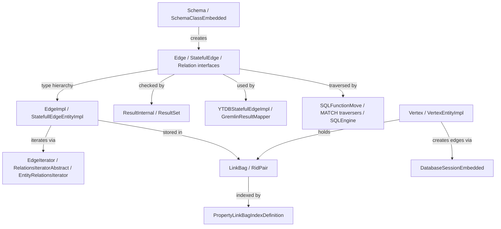

# Unified Edges — Eliminate Lightweight/Stateful Edge Distinction

## High-level plan

### Goals

Simplify the YouTrackDB edge subsystem by eliminating the lightweight/stateful
edge distinction, deleting the `Relation` abstraction layer, and adding "index
by vertex" support for LinkBag fields.

YouTrackDB currently maintains two distinct edge types:

1. **Lightweight edges** — record-less edges stored only as
   `RidPair(vertexRid, vertexRid)` entries in vertex LinkBags. Backed by
   abstract schema classes. Cannot hold properties.

2. **Stateful (heavyweight) edges** — full record-based edges stored as
   `RidPair(edgeRid, vertexRid)` in vertex LinkBags, with a separate edge
   record holding `out`/`in` vertex links and arbitrary user properties.

The **double-sided LinkBag optimization** (YTDB-542) made this distinction
unnecessary. Both edge types now store the opposite vertex RID as
`secondaryRid` in the `RidPair`, enabling O(1) vertex traversal that bypasses
edge record loading entirely — regardless of whether the edge has a record.

The result is a single record-based edge type that supports properties, dual
indexing (by edge RID and by vertex RID), and O(1) traversal via the existing
double-sided LinkBag optimization.

### Constraints

- **TinkerPop compliance**: All ~1900 Cucumber feature tests must remain green
  after each track. The custom TinkerPop fork (`io.youtrackdb`) is the
  compliance surface.
- **No migration required**: No existing databases contain lightweight edges.
  A read-time guard in `RidPair` detects legacy `primaryRid == secondaryRid`
  pairs and throws immediately.
- **Compilation at every commit**: Each commit must compile independently.
  Interface deletions must follow the pattern: migrate call sites → delete
  implementations → remove dead interface methods.
- **No serialization changes**: `EdgeImpl` (lightweight) was record-less and
  had no serialization path. All on-disk edge data is serialized through
  `EntityImpl`/`StatefullEdgeEntityImpl` (record type `'e'`), which is
  unchanged by unification.
- **Performance**: The double-sided LinkBag bypass means edge record creation
  cost is amortized — traversal performance must not regress.
- **Coverage**: 85% line / 70% branch coverage for new/changed code.

### Architecture Notes

#### Component Map



- **Edge / StatefulEdge / Relation** — collapsed: `StatefulEdge` merges into
  `Edge`; `Relation` deleted; `Element` marker deleted. `Edge` absorbs
  `getFrom()`/`getTo()` from `Relation`.
- **EdgeImpl** — deleted: lightweight edge implementation, replaced by unified
  `EdgeEntityImpl` (renamed from `StatefullEdgeEntityImpl`).
- **StatefullEdgeEntityImpl** — renamed to `EdgeEntityImpl`, becomes sole edge
  implementation.
- **ResultInternal / ResultSet** — modified:
  `isStatefulEdge()`/`asStatefulEdge()` removed, `relation` field removed,
  `isRelation()`/`asRelation()` removed.
- **YTDBStatefulEdgeImpl** — renamed to `YTDBEdgeImpl`, constructor takes
  `Edge` instead of `StatefulEdge`.
- **EdgeIterator / RelationsIteratorAbstract** — `RelationsIteratorAbstract`
  inlined into `EdgeIterator`; `EntityRelationsIterator`/
  `EntityRelationsIterable` deleted.
- **LinkBag / RidPair** — `RidPair.isLightweight()` removed;
  `ofSingle()` factory deleted; read-time guard added for legacy pairs.
- **PropertyLinkBagIndexDefinition** — unchanged; new
  `PropertyLinkBagSecondaryIndexDefinition` added for "index by vertex"
  support.
- **Schema / SchemaClassEmbedded** — `createLightweightEdgeClass()` removed;
  `setAbstract()` no longer enforces abstract-only for edge classes.
- **Vertex / VertexEntityImpl** — modified: `addLightWeightEdge()`/
  `addStateFulEdge()` collapsed into single `addEdge()`; `createLink()`
  overloads unified.
- **DatabaseSessionEmbedded** — modified: `newLightweightEdge()` removed;
  `newStatefulEdge()` renamed to `newEdge()`; `addEdgeInternal()` simplified.
- **SQLFunctionMove / MATCH traversers / SQLEngine** — `Relation<?>`
  pattern matches and parameters removed; `getEntities()` deleted;
  `v2v()` returns `null` for non-graph entities.

#### D1: Single record-based edge type
- **Alternatives considered**: (a) Keep lightweight edges but make them an
  internal optimization invisible to the API; (b) Deprecate lightweight edges
  gradually over multiple releases.
- **Rationale**: The double-sided LinkBag optimization (YTDB-542) already
  provides O(1) traversal for record-based edges. Lightweight edges no longer
  offer a performance advantage, only API complexity. A clean cut is simpler
  than deprecation and avoids maintaining two code paths.
- **Risks/Caveats**: If any legacy database contains lightweight edges, the
  read-time guard will throw on first access. No migration tool is provided
  (assumption: no such databases exist).
- **Implemented in**: Track 1 (call site migration), Track 2 (StatefulEdge
  merge), Track 3 (Relation deletion), Track 4 (implementation unification
  and RidPair guard), Track 5 (schema and lifecycle cleanup)

#### D2: Delete Relation interface entirely (not just deprecate)
- **Alternatives considered**: (a) Keep `Relation` as a deprecated interface
  extending `Edge`; (b) Rename `Relation` to `EdgeRelation` and keep it as an
  internal detail.
- **Rationale**: `Relation` abstracts over both edges and non-edge entity LINK
  traversals, but entity LINK traversal via `Relation` has zero test callers
  and one production caller (`SQLFunctionMove.v2v()`). The abstraction adds
  indirection without value. Deleting it removes ~10 files and simplifies the
  entire iteration and SQL function stack.
- **Risks/Caveats**: `EntityImpl.getEntities()` is deleted —
  `out()`/`in()`/`both()` on plain entities will return `null`. This is
  correct behavior (plain entities are not graph elements).
- **Implemented in**: Tracks 1, 2, 3

#### D3: Read-time guard for legacy lightweight edges (not startup scan)
- **Alternatives considered**: (a) Startup-time scan of all LinkBags;
  (b) Schema-open-time validation; (c) No guard (silent corruption).
- **Rationale**: Eagerly scanning all LinkBags at database open is
  prohibitively expensive for large databases. A read-time guard in the
  `RidPair` constructor throws `IllegalStateException` with a descriptive
  message on first access to a legacy `primaryRid == secondaryRid` pair.
- **Risks/Caveats**: The error surfaces lazily — a legacy database may appear
  to work until the specific LinkBag containing lightweight edges is accessed.
- **Implemented in**: Track 4

#### D4: "Index by vertex" via secondary RID index definition
- **Alternatives considered**: (a) Repurpose existing
  `PropertyLinkBagIndexDefinition` with a mode flag; (b) Create a composite
  index on both primaryRid and secondaryRid.
- **Rationale**: A separate `PropertyLinkBagSecondaryIndexDefinition` class
  keeps the existing index path unchanged and avoids mode-flag complexity. The
  SQL grammar gets a new `BY_VERTEX`/`BY_EDGE` specifier in
  `CREATE INDEX ... ON ... LINK_BAG [BY_VERTEX|BY_EDGE]`.
- **Risks/Caveats**: New grammar tokens require SQL parser regeneration. The
  grammar change is isolated to the `CREATE INDEX` specifier rule and does not
  conflict with edge unification changes.
- **Implemented in**: Track 6

#### Invariants

- All edges must have a record and a RID after unification — no record-less
  edges exist
- `RidPair` entries in LinkBags always have `primaryRid != secondaryRid`
  (edge RID != vertex RID)
- Edge traversal via `RidPair.secondaryRid` must not load the edge record
  (O(1) bypass preserved)
- Index updates for "index by vertex" must occur inside the same WAL atomic
  operation as the LinkBag modification
- `out()`/`in()`/`both()` on non-vertex, non-edge entities must return `null`

#### Integration Points

- Gremlin layer reads edges via `YTDBEdgeImpl` -> `Edge` interface ->
  `EdgeEntityImpl`
- SQL `CREATE EDGE` / `DELETE EDGE` statements go through
  `DatabaseSessionEmbedded.newEdge()` / `deleteEdge()`
- MATCH traversers (`MatchEdgeTraverser`, `MatchMultiEdgeTraverser`,
  `OptionalMatchEdgeTraverser`) iterate edges via `EdgeIterator`
- `PropertyLinkBagSecondaryIndexDefinition` integrates with
  `IndexDefinitionFactory` for "index by vertex" creation

#### Non-Goals

- Migration tooling for legacy databases with lightweight edges (assumption:
  none exist)
- Multi-property edge indexes (future work)
- Changes to the on-disk serialization format (record type `'e'` is unchanged)

---

## Checklist

- [x] Track 1: Migrate call sites to unified edge API
  > Migrate all call sites from `isStatefulEdge()`/`asStatefulEdge()`/
  > `isStateful()` to `isEdge()`/`asEdge()` API. Give `EntityImpl.isEdge()`
  > and `ResultInternal.isEdge()` standalone implementations so they stop
  > delegating to `isStatefulEdge()`. Delete `EdgeImpl` (lightweight edge
  > implementation). Remove the now-dead `isStatefulEdge()`/`asStatefulEdge()`/
  > `isStateful()`/`asStatefulEdgeOrNull()` methods from all interfaces and
  > implementations. Update `ResultSet` methods with `StateFull`/`SateFull`
  > typos in names.
  >
  > Constraints:
  > - `EdgeImpl` deletion requires bridging `EdgeIterator` and
  >   `newLightweightEdgeInternal()` (throw on legacy lightweight edges).
  > - Track 1 removes `isStatefulEdge()`/`isStateful()` from non-`Edge`
  >   interfaces. `Edge.asStatefulEdge()`/`asStatefulEdgeOrNull()` are
  >   retained until Track 2 deletes `StatefulEdge`.
  >
  > **Scope:** ~3-4 steps covering call site migration, EdgeImpl deletion
  > with bridge fixes, dead method removal, ResultSet typo renames
  >
  > **Track episode:**
  > Migrated all call sites from `isStatefulEdge()`/`isStateful()` to
  > `isEdge()` across 4 steps. Deleted `EdgeImpl` (lightweight edge
  > implementation) and unified `addEdgeInternal()` to always create
  > record-based edges. Removed dead `isStatefulEdge()`/`isStateful()`
  > from all interfaces. Renamed `addStateFullEdgeClass()` typo in
  > Gremlin DSL.
  >
  > Key discovery: `Edge` interface does not extend `Entity`/`Identifiable`,
  > so ~9 call sites must retain `asStatefulEdge()` casts until Track 2
  > merges `StatefulEdge` into `Edge`. This is expected and does not affect
  > Track 2's approach — it confirms the merge is necessary.
  >
  > Abstract edge classes (from `createLightweightEdgeClass()`) cannot have
  > storage collections, so `newLightweightEdge()` now rejects abstract
  > classes and delegates to `addEdgeInternal()` for concrete classes. The
  > `createLightweightEdgeClass()` method still exists (removed in Track 5).
  >
  > **Step file:** `tracks/track-1.md` (4 steps, 0 failed)
  >
  > **Strategy refresh:** CONTINUE — no downstream impact detected.

- [x] Track 2: Merge StatefulEdge into Edge
  > Collapse `StatefulEdge` into `Edge`. Move `StatefulEdge`-specific methods
  > onto `Edge`. Replace all `StatefulEdge` type references with `Edge`.
  > Delete `StatefulEdge.java`. Remove `isLightweight()` API-level methods.
  >
  > Approach: (1) Move StatefulEdge methods to Edge, (2) Replace StatefulEdge
  > type refs, (3) Delete StatefulEdge, (4) Remove `isLightweight()` call
  > sites.
  >
  > Constraints:
  > - `isLightweight()` call site removal is a separate preceding commit
  >   from the `StatefulEdge` deletion.
  >
  > **Scope:** ~3-4 steps covering StatefulEdge method migration, type
  > reference replacement, StatefulEdge deletion, isLightweight removal
  > **Depends on:** Track 1
  >
  > **Track episode:**
  > Collapsed `StatefulEdge` into `Edge` across 4 steps. Made `Edge` extend
  > `Entity` (resolving Entity/Relation constructor ambiguity with explicit
  > `(Identifiable)` casts at 3 call sites). Removed `isLightweight()` from
  > `Edge` and dead call sites. Mechanically replaced all `StatefulEdge` type
  > references with `Edge` across 22 files. Deleted `StatefulEdge.java` and
  > removed `asStatefulEdge()`/`asStatefulEdgeOrNull()` from all interfaces,
  > adding `isEdge()`/`asEdge()`/`asEdgeOrNull()` to `DBRecord` to fill the
  > gap exposed by removal.
  >
  > Key discovery: `DBRecord` lacked `isEdge()`/`asEdge()`/`asEdgeOrNull()`
  > — they were only on `Entity` and `Result`. This gap was exposed when
  > removing `asStatefulEdge()` from `DBRecord`.
  >
  > Track-level code review passed at iteration 2 (removed dead
  > lightweight-edge code from `VertexEntityImpl` and duplicate
  > `statefulEdge` methods from `ResultSet`).
  >
  > **Step file:** `tracks/track-2.md` (4 steps, 0 failed)

- [ ] Track 3: Delete Relation hierarchy
  > Eliminate the entire `Relation` type hierarchy and everything that depends
  > on it: `Element.java`, `EdgeInternal.java`,
  > `LightweightRelationImpl.java`, `RelationsIteratorAbstract.java`,
  > `RelationsIterable.java`, `EntityRelationsIterator.java`,
  > `EntityRelationsIterable.java`. Inline `RelationsIteratorAbstract` logic
  > into `EdgeIterator`/`EdgeIterable`. Delete
  > `EntityImpl.getEntities()`/`getBidirectionalLinks()`/
  > `getBidirectionalLinksInternal()`. Remove `Relation<?>` pattern matches
  > from SQL functions and MATCH traversers. Reparameterize
  > `BidirectionalLinksIterable`/`BidirectionalLinkToEntityIterator` from
  > `Relation<T>` to `Edge`. Remove `ResultInternal.relation` field and
  > `isRelation()`/`asRelation()` from all interfaces.
  >
  > Approach: (1) Reparameterize BidirectionalLinks types from Relation to
  > Edge, (2) Remove Relation pattern matches from SQL/MATCH, (3) Atomic
  > commit deleting Relation + Element + dependent types (these files
  > cross-reference each other and cannot be deleted independently).
  >
  > Constraints:
  > - The Relation/Element/dependent type deletion must be a single atomic
  >   commit because deleted types cross-reference each other.
  >
  > **Scope:** ~3-4 steps covering BidirectionalLinks reparameterization,
  > SQL/MATCH Relation removal, Relation hierarchy atomic deletion,
  > ResultInternal relation field cleanup
  > **Depends on:** Track 2

- [ ] Track 4: Unify edge implementations and creation API
  > Rename `StatefullEdgeEntityImpl` -> `EdgeEntityImpl` and
  > `YTDBStatefulEdgeImpl` -> `YTDBEdgeImpl`. Add read-time guard in `RidPair`
  > constructor for legacy `primaryRid == secondaryRid` pairs. Remove
  > `RidPair.ofSingle()` factory method. Unify vertex edge creation: collapse
  > `Vertex.addLightWeightEdge()`/`addStateFulEdge()` into single `addEdge()`.
  > Unify `VertexEntityImpl.createLink()` 4-param/5-param overloads. Unify
  > `DatabaseSessionEmbedded`: remove `newLightweightEdge()`, rename
  > `newStatefulEdge()` -> `newEdge()`, simplify `addEdgeInternal()`.
  >
  > Approach: renames first (safe refactors), then RidPair guard, then API
  > unification bottom-up (Vertex -> DatabaseSession).
  >
  > Constraints:
  > - The `RidPair` guard must throw `IllegalStateException` with a
  >   descriptive message mentioning legacy lightweight edges.
  > - `addEdge()` must always create a record-based edge — no conditional
  >   paths.
  >
  > **Scope:** ~5 steps covering impl renames, RidPair legacy guard, Vertex
  > API unification, VertexEntityImpl link creation simplification,
  > DatabaseSession API unification
  > **Depends on:** Track 3

- [ ] Track 5: Unify schema and edge lifecycle
  > Remove `Schema.createLightweightEdgeClass()` and its implementations.
  > Remove the `setAbstract()` enforcement that prevents concrete edge classes.
  > Unify edge iteration in `EdgeIterator` to remove the internal
  > lightweight/stateful branching logic — all edges are now record-based, so
  > `EdgeIterator` always loads via `primaryRid` (edge RID). Simplify edge
  > deletion to remove lightweight-specific paths.
  >
  > Approach: schema changes first, then iteration simplification, then
  > deletion cleanup.
  >
  > Constraints:
  > - Abstract edge classes are still valid for schema inheritance — only the
  >   enforcement that edge classes *must* be abstract (for lightweight) is
  >   removed.
  >
  > **Scope:** ~4 steps covering schema cleanup, iteration unification,
  > deletion simplification, verification
  > **Depends on:** Track 4

- [ ] Track 6: Index by vertex support
  > Add "index by vertex" capability for LinkBag fields, allowing edges to be
  > indexed by the opposite vertex RID (`secondaryRid`) in addition to the
  > existing edge RID (`primaryRid`) index.
  >
  > Create `PropertyLinkBagSecondaryIndexDefinition` that extracts
  > `secondaryRid` from `RidPair` for indexing. Register it in
  > `IndexDefinitionFactory`. Extend the SQL grammar (`YouTrackDBSql.jjt`)
  > with `BY_VERTEX`/`BY_EDGE` specifiers in the `CREATE INDEX` statement.
  > Implement index maintenance (insert/update/delete) for the secondary index
  > in `AbstractLinkBag` change events.
  >
  > ```mermaid
  > graph LR
  >     SQL[CREATE INDEX ... BY_VERTEX] -->|parsed by| PARSER[SQL Parser]
  >     PARSER -->|creates| SECIDX[PropertyLinkBagSecondaryIndexDefinition]
  >     SECIDX -->|registered in| FACTORY[IndexDefinitionFactory]
  >     LB[AbstractLinkBag] -->|change events| SECIDX
  >     SECIDX -->|extracts secondaryRid| BTREE[BTreeIndex]
  > ```
  >
  > - **SQL Parser** — modified: new `BY_VERTEX`/`BY_EDGE` tokens
  > - **PropertyLinkBagSecondaryIndexDefinition** — new: extracts
  >   `secondaryRid` from `RidPair`
  > - **IndexDefinitionFactory** — modified: routes `BY_VERTEX` to the new
  >   definition class
  > - **AbstractLinkBag** — modified: fires change events to secondary index
  > - **BTreeIndex** — unchanged; existing index infrastructure used by the
  >   new secondary definition
  >
  > Constraints:
  > - Index updates must be inside the same WAL atomic operation as LinkBag
  >   modifications.
  > - Grammar changes are isolated to `CREATE INDEX` specifier rule.
  >
  > **Scope:** ~5 steps covering secondary index definition,
  > IndexDefinitionFactory registration, SQL grammar extension, index
  > maintenance wiring, CRUD tests
  > **Depends on:** Track 5

- [ ] Track 7: Verification, API cleanup, and documentation
  > Verify all SQL statements, Gremlin integration, and TinkerPop Cucumber
  > feature tests (~1900 scenarios) work correctly with unified edges. Clean
  > up public API: remove any remaining `StatefulEdge`/`Relation` references
  > from `api/` package and Gremlin DSL classes. Regenerate DSL classes.
  > Delete `LightWeightEdgesTest`. Update `DoubleSidedEdgeLinkBagTest` and
  > `LinkBagIndexTest`. Run full integration test suite.
  >
  > Approach: verification is automated — run the full Cucumber feature test
  > suite, SQL integration tests, and Gremlin integration tests. If failures
  > are found, fix within this track's scope (API cleanup or test expectation
  > updates), or escalate if the fix belongs to an earlier track's domain.
  > Then API cleanup, test updates, and full integration run.
  >
  > Constraints:
  > - TinkerPop Cucumber suite requires `-Xms4096m -Xmx4096m`.
  > - Public API changes may require Gremlin DSL regeneration.
  >
  > **Scope:** ~3-4 steps covering API cleanup and DSL regeneration, test
  > file updates, full test suite run (Cucumber + integration)
  > **Depends on:** Track 6
