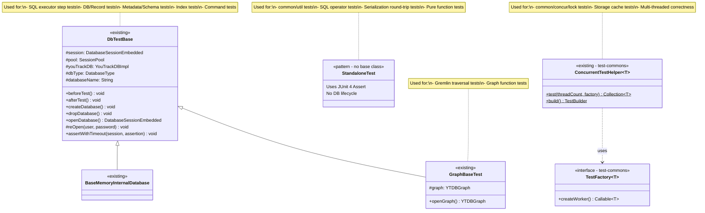
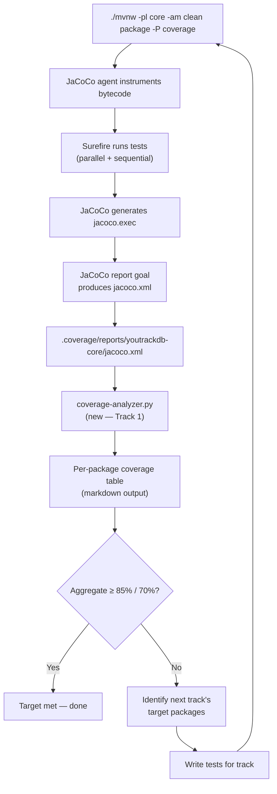
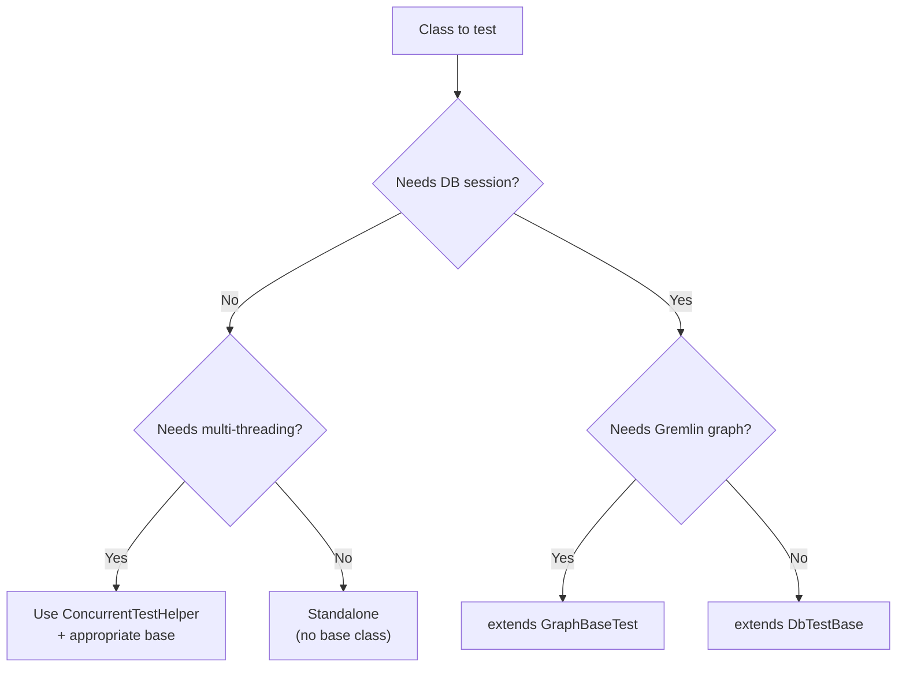
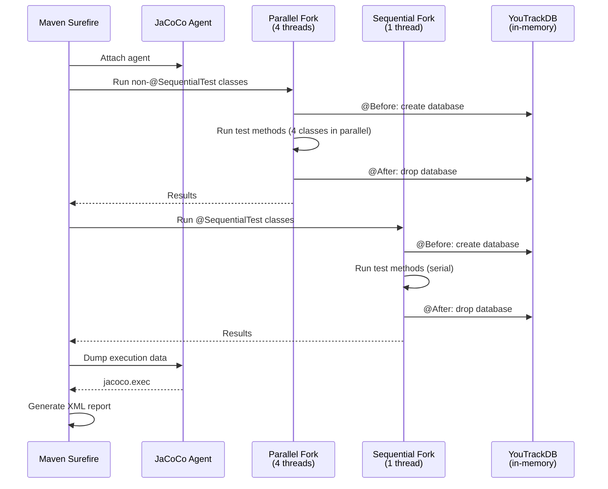

# Unit Test Coverage — Core Module — Design

## Overview

This design covers the testing strategy and infrastructure needed to raise
the `core` module's unit test coverage from 63.6% line / 53.3% branch to
85% line / 70% branch. The solution has two parts:

1. **Coverage measurement infrastructure** — a Python script that parses
   JaCoCo XML reports and produces per-package overall coverage summaries,
   enabling progress tracking across tracks.
2. **Systematic test addition** — 1 infrastructure track plus 21 tracks of
   focused unit tests (22 tracks total), ordered
   by testability tier (pure utilities first, storage internals last), each
   following established test patterns (DbTestBase for DB-dependent tests,
   standalone JUnit 4 for pure logic).

No production code is modified. The only new non-test artifact is the
coverage analyzer script.

## Class Design

The test infrastructure is entirely existing — no new base classes or test
utilities are introduced. Each new test class selects the appropriate
pattern based on its dependency profile:

- **StandaloneTest** (no base class): For pure logic with no database
  dependency. Fastest, most isolated. Used by Tracks 2, 3, 5 (partial),
  6 (partial), 7 (partial), 12, 13, 22 (partial — exceptions,
  compression, config).
- **DbTestBase**: For code that requires a database session (SQL
  execution, schema manipulation, record CRUD). Provides per-test
  database lifecycle via `@Before`/`@After`. Used by Tracks 5 (partial),
  6 (partial), 7 (partial), 8, 9, 10, 11, 14, 15, 16, 17, 18,
  19 (partial), 20, 21, 22 (partial — TX, engine).
- **GraphBaseTest**: For code that requires a Gremlin graph context.
  Extends DbTestBase with graph setup. Used by Track 22 (Gremlin tests).
- **ConcurrentTestHelper**: For multi-threaded correctness tests. Creates
  a thread pool, runs workers, and collects/reports failures. Used by
  Track 4 (concurrency) and Track 20 (storage cache).

## Workflow

### Coverage Measurement and Progress Tracking

Each track follows this cycle: run coverage build → analyze → write tests
→ commit → re-run coverage to verify improvement. The analyzer script
produces a sorted table showing which packages still need work.

### Test Selection Decision Flow

The execution agent uses this decision flow to select the appropriate test
pattern for each class under test. The key criterion is whether the code
under test requires a live database session — if not, standalone is always
preferred.

### Test Execution Architecture

Core module tests run in two surefire executions: a parallel fork (4
threads, all classes except `@SequentialTest`) and a sequential fork
(single thread, `@SequentialTest` only). Each test method gets its own
database instance via DbTestBase's `@Before`/`@After`. JaCoCo instruments
all non-excluded classes and dumps execution data after both forks complete.

New tests should generally NOT be annotated `@SequentialTest` unless they
mutate `GlobalConfiguration` or use static shared state. Parallel execution
is the default and preferred mode.

## Test Parallelism Constraints

The core module runs tests in two surefire forks: a parallel fork (4
threads) and a sequential fork (single thread). Understanding the
boundaries is important for writing correct tests:

- **When to use `@SequentialTest`**: Only when a test mutates
  `GlobalConfiguration` values or static shared state that would affect
  other test classes running concurrently. Tests that only read global
  config or use per-instance state are safe in parallel.
- **`GlobalConfiguration` mutations**: Values set via
  `GlobalConfiguration.setValue()` are JVM-global. If a test changes a
  config value and another test in the parallel fork reads the same value,
  the result is non-deterministic. Always annotate such tests with
  `@SequentialTest` and restore the original value in `@After`.
- **Single-worktree constraint**: Only one `./mvnw test` invocation may
  run per worktree at a time (see CLAUDE.md constraint 3). This means
  the execution agent cannot run coverage builds concurrently — each
  track's verification step must complete before the next begins.
- **Database isolation**: `DbTestBase` creates a fresh in-memory database
  per test method, so database state is isolated. Tests in the parallel
  fork do NOT share a database instance — each `@Before` creates a new one.

## Coverage Analyzer Script

The `coverage-analyzer.py` script is the only new non-test artifact. It
differs from the existing `coverage-gate.py` in a fundamental way:

| Aspect | coverage-gate.py | coverage-analyzer.py |
|--------|-----------------|---------------------|
| **Scope** | Changed lines only (git diff) | All lines in all packages |
| **Purpose** | PR gate (pass/fail) | Progress tracking |
| **Output** | PR comment markdown | Per-package table |
| **CI integration** | Runs on every PR | Run manually or in nightly CI |
| **Git dependency** | Requires git diff against base branch | None — reads XML only |

The analyzer parses `<counter>` elements at the `<package>` level in
JaCoCo XML, computing line and branch coverage per package. It handles the
same JaCoCo exclusions as the coverage profile (parser, GQL gen, Gremlin
API) by skipping matching package paths. Output is a sorted markdown table
plus aggregate totals.

## Testing Serialization Round-Trips

Serialization is the largest single coverage gap area (3,252 uncov lines).
The testing strategy uses **round-trip verification**:

1. Create a document/record with specific property types
2. Serialize to the target format (string or binary)
3. Deserialize back to a document/record
4. Verify all properties match the original

This approach tests both the serialization and deserialization paths in a
single test, effectively doubling coverage per test case. Key
considerations:

- **Type matrix**: Each serializer handles ~20 property types (String,
  Integer, Long, Double, Float, Short, Byte, Boolean, Date, DateTime,
  Decimal, Binary, Embedded, EmbeddedList, EmbeddedSet, EmbeddedMap,
  Link, LinkList, LinkSet, LinkMap). Each type needs at least one
  round-trip test.
- **Null handling**: Every type must be tested with null values — this is
  a common uncovered path in serializers.
- **Nested structures**: Embedded documents within embedded documents,
  collections of collections, links within embedded documents.
- **String serializer specifics**: The string serializer uses a CSV-like
  format with escaping. Special characters (`"`, `,`, `\n`, `#`) in
  string values need dedicated tests.
- **Binary serializer specifics**: Variable-length integer encoding (VarInt),
  type tags, and version headers need edge case tests.

## Testing Storage & Cache Components

Storage components (Tracks 19-21) are the hardest to unit test due to
their reliance on page buffers, file I/O, and concurrent access patterns.
The strategy combines three approaches:

1. **Page-level unit tests** — Test individual page operations
   (read/write/modify) using `ByteBufferPool.acquireDirect()` to allocate
   test pages. Follow the pattern from the existing `CollectionPageTest`:
   acquire buffer → create cache pointer → create cache entry → acquire
   lock → operate on page → release. This tests serialization logic
   within pages without needing full storage lifecycle.

2. **Component lifecycle tests** — Test storage components through their
   public API using a temporary directory for file storage. Create
   component → open → perform operations → close → verify state. This
   covers initialization, normal operation, and shutdown paths.

3. **Concurrency smoke tests** — Use `ConcurrentTestHelper` to run
   multiple threads performing operations on a shared component. These
   are not exhaustive concurrency tests (those belong in integration
   tests) but catch obvious thread-safety issues. Keep thread counts
   low (4-8) and durations short.

The WOWCache (4,457 lines, 68.7% coverage) is the single largest class
in the storage layer. Full unit testing of its internal state machine
(page dirty tracking, async flush, checkpoint coordination) is impractical.
Instead, focus tests on:
- Page allocation and deallocation
- File creation and deletion through the cache
- Checkpoint trigger conditions
- Double-write log integration points

## Testing Concurrency Primitives

The `common/concur/lock` package (405 uncov lines, 45.0% coverage)
contains lock utilities used throughout the codebase. Testing locks
requires careful thread coordination:

- **Basic lock semantics**: Acquire/release, tryLock with timeout,
  reentrant behavior. These are single-threaded tests verifying the
  lock's state machine.
- **Contention tests**: Two or more threads compete for a lock. Use
  `CountDownLatch` or `CyclicBarrier` to synchronize thread start,
  then verify that only one thread holds the lock at a time.
- **Fairness and ordering**: Where applicable, verify that lock
  acquisition order matches arrival order.
- **Edge cases**: Lock release by non-owner thread, double release,
  interrupt during wait.

Use `ConcurrentTestHelper` for the multi-threaded tests. Keep test
durations short (< 5 seconds) to avoid flakiness. Avoid `Thread.sleep()`
for synchronization — use proper synchronization primitives.

## Testing SQL Operators

SQL operators (748 uncov lines, 20.9% coverage) are the lowest-coverage
area in the SQL layer but also among the most testable. Each operator
implements a `evaluateRecord()` or similar method that takes operands and
returns a result.

Testing approach:
- **Type cross-product**: Each operator should be tested with compatible
  type pairs (String×String, Integer×Integer, String×Integer for
  coercion, etc.)
- **Null operands**: Left null, right null, both null
- **Edge values**: Empty strings, zero, negative numbers, max/min values
- **Collation**: Where applicable, test with case-sensitive and
  case-insensitive collation

Operators like `LIKE`, `CONTAINS`, `BETWEEN`, and `IN` have complex
matching semantics that deserve dedicated test methods for each pattern.

