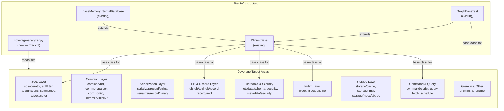

# Unit Test Coverage — Core Module

## Design Document
[design.md](design.md)

## High-level plan

### Goals

Raise the `core` module's unit test coverage from the current baseline
(63.6% line / 53.3% branch) to the project-wide target of **85% line /
70% branch** coverage. This requires covering approximately **19,000
additional lines** and **7,300 additional branches** across 177 packages.

The work is a systematic sweep: identify the lowest-coverage packages,
write focused unit tests for their uncovered code paths, and track
progress using a per-package coverage analyzer.

Tracks 2-22 are mutually independent — they can be reordered during
execution based on priority without affecting correctness. The track
ordering reflects a testability-tier strategy (D1) but is not a hard
dependency chain. Their only shared dependency is Track 1 (coverage
measurement infrastructure).

### Constraints

1. **JUnit 4** — Core module tests use JUnit 4 with `surefire-junit47`
   runner. All new tests must follow this convention.
2. **DbTestBase lifecycle** — Tests requiring a database session must
   extend `DbTestBase` (creates/destroys an in-memory database per test
   method via `@Before`/`@After`). Tests that can run without a database
   should be standalone (no base class).
3. **No parallel test processes** — Only one `./mvnw test` invocation may
   run in a given worktree at a time (see CLAUDE.md).
4. **Spotless formatting** — Run `./mvnw -pl core spotless:apply` before
   every commit.
5. **Coverage verification** — After each track, run
   `./mvnw -pl core -am clean package -P coverage` and verify improvement
   using the coverage analyzer script (Track 1).
6. **Existing test classes preferred** — Add tests to existing test
   classes when the scope fits. Create new classes only when no suitable
   existing class covers the area.
7. **Coverage exclusions** — The following should not receive tests:
   - *JaCoCo exclusions (not measured by JaCoCo):*
     - `**/core/sql/parser/**` (generated SQL parser)
     - `**/core/gql/parser/gen/**` (generated GQL parser)
     - `**/api/gremlin/*.class` (Gremlin API top-level)
   - *Testing exclusions (measured by JaCoCo but not targeted by this plan):*
     - `**/api/gremlin/embedded/schema/**` (Gremlin schema manipulation —
       not ready for testing)
     - `**/api/gremlin/tokens/schema/**` (Gremlin schema tokens — not ready
       for testing)
   Note: The testing exclusions ARE included in JaCoCo reports and will
   affect aggregate coverage numbers. The coverage analyzer should be
   aware of this distinction.
8. **Disk-based test environment** — CI runs tests with
   `-Dyoutrackdb.test.env=ci` (disk storage). Tests must pass in both
   memory and disk modes.
9. **Coverage measurement** — The existing `coverage-gate.py` checks only
   changed lines in PRs. A separate overall coverage analyzer is needed
   (Track 1) to measure and report per-package totals.
10. **Test descriptions** — Every test must have a descriptive method name
    or comment explaining the scenario and expected outcome.
11. **Rebase on `origin/develop` at the start of every track** — This plan
    is very large and long-lived; staying in sync with the remote is
    mandatory to avoid drift and painful late-stage merge conflicts. At the
    beginning of each track (before Phase A):
    1. `git fetch origin` and `git rebase origin/develop`.
    2. Resolve any conflicts in source, tests, or formatting.
    3. Run the full `core` unit-test suite
       (`./mvnw -pl core clean test`) and fix any new failures introduced
       by the rebase — do NOT proceed to Phase A until the suite is green.
    4. If the rebase touches areas covered by integration tests, also run
       `./mvnw -pl core clean verify -P ci-integration-tests`.
    5. Re-run `./mvnw -pl core spotless:apply` to pick up any formatter
       changes on develop.
    Record the pre-rebase and post-rebase SHAs in the track's step file so
    the rebase is auditable. If conflicts force non-trivial rework of
    already-committed steps, ESCALATE — the plan may need adjustment.

### Operational Notes

**`git clean -fd` incident (2026-05-04).** During Track 15 Step 4
spawn the implementer escalated `RESULT: DESIGN_DECISION_NEEDED`
and ran the rulebook's prescribed revert sequence
`git reset --hard HEAD && git clean -fd`. The `git clean -fd`
clause indiscriminately removes every untracked file in the
worktree — by design, the workflow's working files (track step
files, `reviews/`, `design.md`, `implementation-backlog.md`,
baselines) live as **untracked-on-disk** so they're cleaned up
alongside the branch on PR-merge. The revert wiped 50+ workflow
files in one shot, plus rolled back the in-progress
`implementation-plan.md` modifications (Track 13 + Track 14
episodes and strategy-refresh lines) to the last committed state.

**Recovery state (post-incident):**

| File | Status | Recovery source |
|---|---|---|
| `implementation-plan.md` | Fully recovered | IntelliJ Local History (revision before the reset) |
| `tracks/track-1.md` … `track-9.md`, `track-12.md`–`track-15.md` | Fully recovered | IntelliJ Local History |
| `tracks/track-10.md`, `tracks/track-11.md` | Fully recovered | Agent transcripts (read-result history) |
| `track-9-baseline.md`, `track-14-baseline.md` | Fully recovered | Local History / transcripts |
| `design.md` | Fully recovered (336 lines, no gaps) | Agent transcripts |
| `implementation-backlog.md` | 78% recovered (897 of 1149 lines; 252 lines in 3 gaps spanning Track 18 body, Tracks 19/20/21 entirely, two Track 22 inherited-DRY-scope subsections) | Agent transcripts (multi-read stitch) |
| Track 15 Steps 2 + 3 episodes | Re-added from session context | Live orchestrator state |
| `track-15-baseline.md` | **Lost** (no transcript ever read it) | Re-derive at Phase C from a fresh coverage run; aggregate values are preserved in Step 1's episode (76.0% line / 66.5% branch / 179 packages) |
| 48 `reviews/` files | **Lost** (historical review reports for completed tracks) | Not reconstructable; track-level episodes in this plan preserve the strategic summary |
| Track 15 Step 1's backlog absorption updates | **Lost** (added by Step 1 to the deferred-cleanup queue) | Re-derive at Phase C from Step 1's episode prose |

**Reconstruct-on-demand tracks.** The 252 lost backlog lines fall in
three gap regions covering Track 18's body, Tracks 19, 20, 21
entirely, and two subsections of Track 22's inherited-DRY-scope
queue. Each affected track entry below carries a
`> **Operational note:**` pointer when its backlog section is gapped
or its episode-state needs re-derivation. The reconstruction
protocol:

- When Phase A starts for an affected track, before reading the
  backlog, the orchestrator regenerates the track's
  `**What/How/Constraints/Interactions**` block from (a) the
  track's `**Scope:**` indicator in this plan, (b) the design
  document's Component Map cluster mapping for the target packages,
  and (c) any cross-references from earlier track episodes (read
  the `**Track episode:**` blocks of preceding tracks for context
  on patterns and absorptions).
- For Track 22's inherited-DRY-scope gaps: cross-reference the
  `**Track episode:**` blocks for Tracks 7, 8, 9, 10, 11, 12, 13,
  14 in this plan — each track's episode names the absorbed items
  it forwarded to the deferred-cleanup queue. Stitching those
  episode statements back into the backlog gives a faithful
  reconstruction.
- For Track 15 Step 1's missing backlog edits, re-derive at Track
  15 Phase C using Step 1's episode prose (which lives in
  `tracks/track-15.md` and names the per-class deletion contingency
  for the test-only-reachable trio plus the lockstep deletion for
  the fully-dead pair).

**Rulebook fix in flight.** [PR #1022](https://github.com/JetBrains/youtrackdb/pull/1022)
on `origin/develop` lands two corrections to
`.claude/workflow/implementer-rules.md`: (1) forbid `ScheduleWakeup`
inside the implementer (it yielded control without a `RESULT`
block, which surfaced as a separate Phase B contract violation
during the same session), and (2) replace `git clean -fd` with a
snapshot-and-diff revert sequence that preserves the orchestrator's
cross-spawn untracked state. Once the PR merges into `develop`,
the next track's mandatory rebase pulls the fixed rulebook in;
this Operational Notes section can be deleted at that point.

### Architecture Notes

#### Component Map

- **coverage-analyzer.py** (new): Parses JaCoCo XML reports and produces
  per-package overall coverage summaries. Used to track progress across
  tracks. Not a production component — a developer/CI tool.
- **DbTestBase** (existing): Base class for tests requiring a database
  session. Creates an in-memory YouTrackDB instance per test method.
  Used by SQL, DB, Metadata, Index, Command, and Gremlin tests.
- **BaseMemoryInternalDatabase** (existing): Extends DbTestBase. Used when
  tests specifically need in-memory storage guarantees.
- **GraphBaseTest** (existing): Extends DbTestBase, adds Gremlin graph
  setup. Used by Gremlin and graph-related tests.
- **Standalone unit tests** (no base class): Used for pure utility
  classes, serialization round-trips, and any code testable without a
  database. Preferred when possible — faster and more isolated.
- **Coverage target areas**: Nine clusters of packages organized by
  functional area and testability tier. Tracks are ordered so
  highest-testability areas (SQL functions, utilities) come first,
  hardest areas (storage internals) come last.

#### D1: Test-first ordering by testability tier
- **Alternatives considered**: (a) Order by package size (largest gap
  first), (b) Order by functional area (storage, then SQL, then DB),
  (c) Order by testability (easiest first).
- **Rationale**: Option (c) wins because quick wins build momentum,
  validate the approach early, and yield measurable coverage improvements
  per track. Large-gap packages like `sql/executor` (1,735 uncov) are
  medium-testability and scheduled mid-plan. Hard packages like
  `storage/cache` are deferred to late tracks where the remaining gap is
  clearest.
- **Risks/Caveats**: Late tracks targeting storage internals may face
  diminishing returns — some code paths (WAL replay, crash recovery) may
  require integration tests rather than unit tests.
- **Implemented in**: Track ordering (Tracks 2-7 = high testability,
  8-17 = medium, 18-21 = low (storage internals), 22 = mixed
  (final sweep))

#### D2: Standalone tests over DbTestBase where possible
- **Alternatives considered**: (a) All tests extend DbTestBase for
  uniformity, (b) Standalone tests for pure utility code.
- **Rationale**: Option (b) — standalone tests are faster (no DB
  lifecycle), more isolated (no shared state), and better for true unit
  testing. DbTestBase should only be used when the code under test
  genuinely requires a database session.
- **Risks/Caveats**: Some classes appear standalone but internally depend
  on a database context (e.g., `SQLFunction.execute()` often needs a
  session). The execution agent must check imports and dependencies
  before choosing standalone vs. DbTestBase.
- **Implemented in**: All tracks — the execution agent decides per test
  class.

#### D3: Coverage measurement via Python analyzer
- **Alternatives considered**: (a) Modify existing `coverage-gate.py` to
  support overall mode, (b) Create a separate script, (c) Use JaCoCo's
  HTML report.
- **Rationale**: Option (b) — the existing gate script is tightly coupled
  to git diff logic and PR comments. A separate analyzer is simpler,
  avoids risk to the CI gate, and can produce per-package breakdowns
  needed for tracking progress across tracks.
- **Risks/Caveats**: Two scripts to maintain. Mitigated by keeping the
  analyzer simple (read-only, no CI integration beyond optional output).
- **Implemented in**: Track 1

#### D4: Accept lower coverage for storage internals
- **Alternatives considered**: (a) Target 85%/70% uniformly across all
  packages, (b) Accept lower targets for inherently hard-to-test code.
- **Rationale**: Option (b) — packages like `storage/cache/local`
  (WOWCache, 4,457 lines of concurrent cache code),
  `storage/index/sbtree` (B-tree internals), and `storage/impl/local`
  (disk I/O with WAL) require integration-level tests with complex setup.
  Forcing 85% line coverage here would mean either fragile tests or
  excessive mocking. Instead, target ~65-70% line coverage for storage
  and compensate with higher coverage in more testable areas.
- **Risks/Caveats**: Overall 85% target may be tight if storage coverage
  remains low. Mitigated by aggressive coverage in SQL, common, and
  serialization areas.
- **Implemented in**: Tracks 19-21

#### D5: One PR per track
- **Alternatives considered**: (a) One giant PR, (b) One PR per step,
  (c) One PR per track.
- **Rationale**: Option (c) — each track is a coherent unit of work
  targeting a specific area. One PR per track keeps reviews manageable
  (5-7 commits) and allows incremental merging. The `[no-test-number-check]`
  PR title tag can be used since we're adding tests without changing
  production code.
- **Risks/Caveats**: 22 PRs is a lot. Tracks can be batched into larger
  PRs if the team prefers.
- **Implemented in**: All tracks

#### Integration Points

- `coverage-analyzer.py` reads JaCoCo XML from
  `.coverage/reports/youtrackdb-core/jacoco.xml` (produced by
  `./mvnw -pl core -am clean package -P coverage`)
- New tests integrate with existing surefire configuration: parallel fork
  (4 threads) for default tests, sequential fork for `@SequentialTest`
- Tests using `DbTestBase` depend on the in-memory YouTrackDB lifecycle
  managed by `@Before`/`@After`

#### Non-Goals

- **Modifying production code** — Production code changes are permitted
  in two cases: (1) Refactoring of internal classes to increase
  testability, but not public API changes. (2) All bugs found during
  testing or code review must be fixed and covered by regression tests.
- **Integration tests** — This plan targets unit tests only (surefire).
  Integration tests (failsafe, `-P ci-integration-tests`) are out of
  scope.
- **Other modules** — Only the `core` module is in scope. `server`,
  `driver`, `embedded`, `tests`, and `docker-tests` are future work.
- **100% coverage** — The target is 85% line / 70% branch overall. Some
  packages will remain below this if the code is inherently hard to unit
  test. The goal is to raise the aggregate.
- **Gremlin schema manipulation tests** — Classes in
  `api/gremlin/embedded/schema` and `api/gremlin/tokens/schema` are
  excluded — not ready for testing.

## Checklist

- [x] Track 1: Coverage Measurement Infrastructure
  > Create a Python script (`coverage-analyzer.py`) that parses JaCoCo
  > XML reports and produces per-package overall coverage summaries.
  > Unlike the existing `coverage-gate.py` (which checks only changed
  > lines in PRs), this script computes totals across all lines in each
  > package and generates a sorted table of packages by uncovered line
  > count.
  >
  > **Track episode:**
  > Created coverage measurement infrastructure for all subsequent tracks.
  > Added `.github/scripts/coverage-analyzer.py` (185 lines) — parses
  > JaCoCo XML and outputs per-package markdown tables sorted by uncovered
  > lines. Recorded baseline in `coverage-baseline.md`: 63.6% line /
  > 53.3% branch / 177 packages. Baseline confirms plan gap analysis:
  > ~19,000 lines and ~7,300 branches needed to reach 85%/70% targets.
  > No cross-track impact — read-only tooling used by all future tracks.
  >
  > **Step file:** `tracks/track-1.md` (2 steps, 0 failed)
  >
  > **Strategy refresh:** CONTINUE — no downstream impact detected.

- [x] Track 2: Common Pure Utilities
  > Write unit tests for the `common` package's pure utility classes that
  > require no database session. These are self-contained classes with
  > clear inputs/outputs, making them ideal first targets.
  >
  > **Track episode:**
  > Added 432 unit tests across 20 new and 4 extended test files for all 7
  > target packages. Found and fixed a genuine bug in
  > `RawPairLongObject.equals()` (cast to wrong type). Documented several
  > pre-existing issues: `Binary.compareTo` different-length limitations,
  > `ModifiableInteger` overflow bypass, `LRUCache` off-by-one capacity,
  > `ErrorCode` reflection failures, `Streams` dedup asymmetry. Track-level
  > code review identified additional `MultiValue` branch coverage gaps
  > (add/remove/getValue/setValue/contains) suitable for Track 22 final
  > sweep. No cross-track impact — only `common` package tests and one
  > production bug fix.
  >
  > **Step file:** `tracks/track-2.md` (5 steps, 0 failed)
  >
  > **Strategy refresh:** CONTINUE — no downstream impact detected. All
  > discoveries localized to `common` package; `MultiValue` gaps noted for
  > Track 22 final sweep.

- [x] Track 3: Common I/O, Parser & Logging
  > Write unit tests for common infrastructure classes that handle I/O,
  > parsing, and logging. Most of these are pure utilities but some have
  > external dependencies (file system, native libraries).
  >
  > **Track episode:**
  > Added ~250 unit tests across 11 test files (all new except IOUtilsTest
  > extended) covering common/parser (95.4%/90.4%), common/io (87.7%/79.2%),
  > common/profiler/metrics (95.2%/75.8%), and common/log (68.1%/51.1%).
  > Discovered pre-existing bugs: StringParser.indexOfOutsideStrings backward
  > search exits after one position, VariableParser loses default during
  > recursion, IOUtils.isLong("") vacuous-truth bug, FileUtils.getSizeAsNumber("")
  > same pattern, IOUtils.getRelativePathIfAny crashes when base equals URL.
  > Track-level review added @SequentialTest to MetricsRegistryTest for JMX
  > isolation, strengthened vacuous assertions, and added 11 boundary tests.
  > No cross-track impact — only common package test files added.
  >
  > **Step file:** `tracks/track-3.md` (4 steps, 0 failed)
  >
  > **Strategy refresh:** CONTINUE — no downstream impact detected. All
  > discoveries localized to `common` package (parser bugs, I/O vacuous-truth
  > bugs, logging details). Track 4 targets independent subsystems.

- [x] Track 4: Common Concurrency & Memory
  > Write tests for concurrency primitives and direct memory management.
  > These require careful testing with thread synchronization.
  >
  > **Track episode:**
  > Added ~250 unit tests across 22 test files (19 new, 3 extended) for all
  > 4 target packages. Found and fixed 2 production bugs in
  > PartitionedLockManager: `releaseSLock()` called `sharedLock()` instead of
  > `sharedUnlock()`, and `acquireExclusiveLocksInBatch(int[])` allocated a
  > zero-filled array instead of copying input values. Documented pre-existing
  > behaviors: ReadersWriterSpinLock no read→write upgrade, NonDaemonThreadFactory
  > inherits daemon flag, SourceTraceExecutorService bypasses checked exceptions.
  > Coverage: lock 87.0%/71.7% PASS, resource 84.5%/77.8% (0.5% below line),
  > thread 95.6%/92.5% PASS, directmemory 70.1%/59.7% (PROFILE_MEMORY paths).
  > No cross-track impact — only common package tests and 2 production bug fixes.
  >
  > **Step file:** `tracks/track-4.md` (5 steps, 0 failed)
  >
  > **Strategy refresh:** CONTINUE — no downstream impact detected. All
  > discoveries localized to `common` package; directmemory/resource
  > coverage shortfalls accepted (PROFILE_MEMORY paths, 0.5% margin).

- [x] Track 5: SQL Operators & Filters
  > Write tests for SQL operator and filter classes — the lowest-coverage
  > area in the SQL layer (sql/operator at 20.9%, sql/filter at 39.9%).
  >
  > **Track episode:**
  > Added ~560 unit tests across 10 test files (8 new, 2 extended) covering
  > sql/operator, sql/operator/math, and sql/filter. Rewrote Plus/Minus/
  > Multiply/Divide math tests from monolithic to focused. Final coverage:
  > sql/operator 83.0%/75.3% (+17%/+19%), sql/operator/math 91.1%/90.2%,
  > sql/filter 78.0%/64.8%. sql/operator is 2% below line target and
  > sql/filter is 7% below — remaining uncovered paths are BinaryField/
  > EntitySerializer comparator paths and full SQL-execution contexts
  > covered by integration tests. Fixed 2 production bugs with falsifiable
  > regression tests: QueryOperatorContainsValue early-return in condition
  > loop; QueryOperatorTraverse FieldAny.FULL_NAME copy-paste where FieldAll
  > was intended. Documented 9 pre-existing bugs/inconsistencies with
  > WHEN-FIXED markers: And/Or null-right NPE asymmetry; ContainsText
  > ignoreCase never consulted; QueryOperatorEquals dead-code branch;
  > In operator Set.contains() bypasses type coercion; ContainsAll
  > over-counting with duplicate left elements; Instanceof left/right
  > asymmetry; Mod dispatches on left type only (silent truncation);
  > tryDownscaleToInt exclusive-boundary off-by-one; IS DEFINED
  > SQLFilterItemField branch uses Object.toString identity as field-name
  > key. Track-level code review (1 iteration, PASS): applied 13 should-fix
  > improvements — strengthened assertions in SQLFilterClassesTest; added
  > LIKE regex-escape tests for 8 untested chars; MATCHES malformed-regex
  > and null-context tests; IS DEFINED sentinel tests;
  > DefaultQueryOperatorFactoryTest exactly-one-of-class; removed duplicate
  > isSupportingBinaryEvaluate tests and dead createClass setup; added
  > WHEN-FIXED markers to bug-pinning tests. No cross-track impact.
  >
  > **Step file:** `tracks/track-5.md` (6 steps, 0 failed)
  >
  > **Strategy refresh:** CONTINUE — no downstream impact detected. Track 6
  > (SQL Functions) uses independent SQLFunctionFactory dispatch path; all
  > Track 5 discoveries localized to operator/filter subsystem. Carry forward
  > falsifiable-regression + WHEN-FIXED-marker convention.

- [x] Track 6: SQL Functions
  > Write tests for SQL function implementations. Functions are
  > self-contained with clear `execute()` contracts, making them highly
  > testable.
  >
  > **Track episode:**
  > Added 940 `@Test` methods across 83 test files under
  > `core/src/test/java/.../sql/functions/**` covering all nine target
  > subpackages (graph, coll, misc, math, stat, text, conversion, geo,
  > result) plus factory infrastructure. No production code was modified
  > — Track 6 is purely test-additive. All latent bugs and inconsistencies
  > discovered were pinned as falsifiable regressions with `// WHEN-FIXED:`
  > markers (~20 markers total) for Track 22's production-side fixes.
  >
  > Key discoveries with cross-track impact:
  > `CustomSQLFunctionFactory` uses a process-wide `HashMap` mutated
  > without synchronization — latent flakiness under parallel surefire.
  > Mitigated in Track 6 via `@Category(SequentialTest)` + UUID-qualified
  > prefix + alphabetical `@FixMethodOrder`. Production-side fix
  > (`HashMap → ConcurrentHashMap` or `Collections.synchronizedMap` +
  > defensive copy in `getFunctionNames`) deferred to Track 22 along with
  > a concurrent register/lookup contract test (TX2, BC10, TX5).
  > `SQLFunctionRuntime` is coupled to the SQL parser and not unit-testable
  > — explicitly deferred to Tracks 7/8. `misc.SQLFunctionFormat` is dead
  > code (not registered in `DefaultSQLFunctionFactory`) — pinned via
  > `SQLFunctionFormatMiscDeadTest` with a WHEN-FIXED marker flagging it
  > for removal in Track 22. `session.commit()` detaches returned
  > `Iterable<Vertex>` wrappers — graph-dispatcher tests must collect
  > identities into a local `List` before committing (pattern for Tracks
  > 7, 8, 14, 22). `DbTestBase` shares one session across test methods in
  > a class; a test that leaks an open transaction cascade-fails the whole
  > class — established `@After rollbackIfLeftOpen` safety-net idiom
  > (itself a DRY candidate for Track 22, CQ2).
  >
  > Plan deviations: track grew from ~6 scope-indicator steps to 8 actual
  > steps because track-review flagged `SQLMethod*` classes physically
  > under `sql/functions/` (text/, conversion/, coll/, misc/) that JaCoCo
  > attributes to Track 6. Absorbed into steps 4, 6, 8 with the corrected
  > `execute(iThis, record, context, ioResult, params)` signature
  > (different from `SQLFunction.execute` order).
  >
  > Track-level code review ran 3 iterations: iter-1 surfaced 1 blocker
  > (BC1/TX1 — `CustomSQLFunctionFactory` race) + 18 should-fix + 22
  > suggestions, all in-scope resolved across commits `4aad8dd..7e32145`.
  > Iter-2 gate check found one should-fix regression **introduced by
  > iter-1's own fix**: PM-window WHEN-FIXED sentinel's `Assume.assumeTrue`
  > gated on production-mutated result's `AM_PM`, causing silent SKIP on
  > every runner once the bug is fixed. Fixed in `14c72eb` by reading
  > `AM_PM` from the raw input instant; also tightened Astar
  > Identifiable-options test (TB14) to pin the middle hop. Iter-3 final
  > gate (BC+TB dimensions only) PASS with 1 suggestion. Zero open
  > blockers, zero should-fix at track end; ~15 suggestion-grade items
  > legitimately deferred (most map to Track 22's scope).
  >
  > **Step file:** `tracks/track-6.md` (8 steps, 0 failed)
  >
  > **Strategy refresh:** CONTINUE — all cross-track discoveries are deferred
  > cleanly to Track 22 (CustomSQLFunctionFactory race, SQLFunctionFormat
  > dead code, MultiValue gaps, rollbackIfLeftOpen DRY) or are patterns to
  > carry forward (falsifiable-regression + WHEN-FIXED marker, Iterable.
  > commit() detach pattern, SQLMethod.execute signature awareness).
  > SQLFunctionRuntime coverage naturally falls out of Tracks 7/8 SQL
  > execution. No Component Map changes; Track 7's `sql/method/*` scope is
  > disjoint from Track 6's absorbed `sql/functions/*` SQLMethod classes.

- [x] Track 7: SQL Methods & SQL Core
  > Write tests for SQL method implementations and the SQL root/query
  > packages.
  >
  > **Track episode:**
  > Added ~1,200 unit tests across 41 test files (40 new, 1 extended) covering
  > all Track 7 scope packages. Coverage deltas: `sql/method/misc` 58.6%/41.6%
  > → **92.2%/88.0%**; `sql/method` 62.0%/36.2% → **87.1%/81.2%**;
  > `sql/method/sequence` 23.1%/16.7% → **100%/100%**; `sql` (live)
  > 39.7%/34.7% → **80.1%/76.9%** (aggregate capped by pinned dead code for
  > Track 22 deletion); `sql/query` 2.9%/2.6% → **79.1%/57.9%** (exceeded
  > the 30-40% decomposition expectation). Aggregate module coverage
  > 63.6%/53.3% → **70.6%/61.0%** (+7.0pp line / +7.7pp branch).
  >
  > **Production bugs pinned as WHEN-FIXED regressions (~16 entries for
  > Track 22 queue)**: SQLMethodContains `&&→||` guard, SQLMethodNormalize
  > iParams[0↔1] mix-up, SQLMethodLastIndexOf/IndexOf/Prefix/CharAt null-
  > guard asymmetries, SQLMethodField null-unguarded isArray NPE,
  > DefaultSQLMethodFactory.createMethod case-sensitivity mismatch,
  > SQLMethodFunctionDelegate no-no-arg-ctor dead Class<?> registration,
  > AbstractSQLMethod.getParameterValue AIOBEs (empty string, single quote),
  > SQLFunctionRuntime.java:104 type-pun (instanceof checks iCurrentRecord
  > but casts iCurrentResult — CCE hazard), SQLMethodRuntime iEvaluate dead
  > flag, IndexSearchResult.equals two latent NPEs, IndexSearchResult.mergeFields
  > branch-2 drops right's containsNullValues, RuntimeResult.getResult line 73
  > overwrites canExcludeResult, BasicLegacyResultSet + ConcurrentLegacyResultSet
  > iterator strict-`>` guard, BasicLegacyResultSet UOE message copy-paste
  > drift, LiveLegacyResultSet.setCompleted commented-out body,
  > SQLHelper.parseStringNumber suffix-strip bug. Plus 3 concurrency pins
  > (DefaultSQLMethodFactory HashMap race, SQLEngine.registerOperator
  > non-atomic SORTED_OPERATORS clear, SQLEngine.scanForPlugins partial
  > cache clear).
  >
  > **Plan corrections absorbed into Track 22** (via iter-1 update to this
  > file): CQ3/TS5 shared test-fixture extraction; TS3/TS6 oversized-test-
  > class splits; TS4/TS7/TS9 @Parameterized conversions; TX5 multi-threaded
  > race-exercising tests paired with WHEN-FIXED production-side fixes;
  > CQ1/TC3 license-banner cleanup + unicode/Turkish-locale string-method
  > coverage.
  >
  > **Patterns carried forward**: falsifiable regression + WHEN-FIXED marker
  > convention; `@After rollbackIfLeftOpen` safety-net idiom using
  > `getActiveTransactionOrNull() + tx.isActive()`; `session.begin()` +
  > `tx.rollback()` in finally for entity-populating tests; SequentialTest +
  > FixMethodOrder + UUID-qualified marker + snapshot-and-assert for tests
  > that mutate process-wide static state; counting CommandContext wrapper
  > (introduced in iter-2) for fallback-branch mutation-testing where both
  > primary and fallback resolve to identical values.
  >
  > **Cross-track impact**: Minor-to-moderate. No Component Map or Decision
  > Record changes. Track 22's scope expands by ~16 production-fix queue
  > entries + DRY cleanup items (cataloged above). Step 4 bridged Track 6's
  > `sql/functions` package for SQLFunctionRuntime — no artifact duplication.
  > Track 8 (executor) inherits SQLScriptEngine + CommandExecutorSQLAbstract
  > indirect-coverage expectation (deferred from Track 7). Plan grew from
  > ~5 scope-indicator steps to 8 actual steps (matches Track 6 precedent
  > under dimensional review).
  >
  > **Track-level code review**: 2 iterations, 6 dimensions (CQ, BC, TB, TC,
  > TX, TS). Iter-1: 0 blockers / 17 should-fix / 39 suggestions; applied
  > 13 should-fix fixes, deferred remaining to Track 22. Iter-2 gate-check:
  > all 13 iter-1 fixes VERIFIED; 1 new should-fix (TB13 — vacuous variable-
  > fallback test strengthened via counting CommandContext) + 1 suggestion
  > (TS13 — misleading comment corrected) fixed in iter-2. Final verdict:
  > **PASS**. 0 open blockers, 0 open should-fix; ~10 suggestion-grade
  > items deferred or accepted as merge-ready.
  >
  > **Step file:** `tracks/track-7.md` (8 steps, 0 failed)
  >
  > **Strategy refresh:** CONTINUE — no downstream impact detected. Track 7's
  > legacy result-set pins (`core/sql/query`) are disjoint from Track 8's
  > modern `core/sql/executor/resultset` scope. **Correction (per Track 8
  > Phase A reviews):** Track 7's earlier expectation that
  > `SQLScriptEngine` and `CommandExecutorSQLAbstract` would "fall out of
  > Track 8's executor steps" is structurally wrong — both classes live in
  > `core/sql/` (the package Track 7 itself owned), not in
  > `core/sql/executor/*`. `SQLScriptEngine` (192 LOC, 35.8% coverage) is
  > best handled by Track 9 (Command & Script) or Track 22; Track 8 will
  > absorb only `CommandExecutorSQLAbstract`'s trivial 2-method tail
  > opportunistically. Track 22 queue grew by ~16 WHEN-FIXED entries + DRY
  > items (already documented in plan). Carry forward to Track 8:
  > falsifiable-regression + WHEN-FIXED convention; `@After rollbackIfLeftOpen`
  > idiom; `Iterable` detach-after-commit pattern; SequentialTest guard for
  > static-state tests; counting CommandContext wrapper for fallback-branch
  > mutation testing.

- [x] Track 8: SQL Executor & Result Sets
  > Write tests for SQL execution step classes, the SELECT planner, the
  > result-collection wrappers, and the metadata-execution helpers. This is
  > the largest coverage gap in the SQL layer (~2,109 uncov lines) but at
  > medium testability since most production classes here require a live
  > `DatabaseSessionEmbedded` to exercise their uncovered branches.
  >
  > **Track episode:**
  > Added ~19,971 lines of new tests across 52 files covering `core/sql/executor/*`,
  > `core/sql/executor/resultset/*`, and `core/sql/executor/metadata/*`. Purely
  > test-additive except one production change in Step 4 (dead-code removal of five
  > zero-caller package-private helpers in `FetchFromIndexStep.java`).
  >
  > **Key discoveries with cross-track impact:**
  > - **Global-LET stream-exhaustion behavior** (TB15 via iter-2 gate check): a
  >   promoted global-LET `$sub = (SELECT FROM className)` is materialized once but
  >   its stream is consumed by the first outer row's `size()` call, leaving
  >   subsequent rows with an empty view (`row[0].cnt == 3`, `rows[1..].cnt == 0`).
  >   Pinned via observed-shape assertion with `WHEN-FIXED: Track 22` marker —
  >   semantic question (stream-exhaustion vs. per-outer-row resolution) queued
  >   for Track 22.
  > - **Four dead/semi-dead classes** pinned with WHEN-FIXED markers for Track 22
  >   deletion: `InfoExecutionPlan`, `InfoExecutionStep`, `TraverseResult`,
  >   `BatchStep` (BatchStep's public ctor is zero-callers; the `-1` batchSize
  >   fallthrough path is reachable but unused; Step 4's iter-1 fix pinned the
  >   batchSize=0 ArithmeticException under an active tx).
  > - **Test-strategy precedent codified for later tracks**: DbTestBase-by-default
  >   for executor-step tests (per-track D2 override); direct-step tests (stubbed
  >   `AbstractExecutionStep` + manual `ResultInternal` predecessors) for
  >   step-internal branches; SQL round-trip reserved for `SelectExecutionPlanner`
  >   branch coverage; falsifiable-regression + WHEN-FIXED markers for latent
  >   bugs; `@After rollbackIfLeftOpen` safety net on `TestUtilsFixture`;
  >   `// forwards-to: Track NN` convention for cross-track bug pinning.
  >
  > **Plan corrections** (applied via commit `7b9313eb4b`): Track 22 scope expanded
  > to absorb iter-1 deferrals — CQ1/TS1 (hoist `newContext`/`sourceStep`/`drain`
  > into `TestUtilsFixture`), CQ2/TS2 (`uniqueSuffix` hoist), CQ3 (extract
  > `streamOfInts`/`CloseTracker`/`NoOpStep` to shared resultset helper),
  > CQ4 (inline-FQN replacements in `FetchFromIndexStepTest`,
  > `ExecutionStreamWrappersTest`, `SmallPlannerBranchTest`), CQ8/TS8 (remove
  > try/catch/rollback boilerplate where `rollbackIfLeftOpen` covers it), 8
  > corner-case TC pins (TC3–TC9, TC12 — CreateRecord total<0, Update*Step
  > non-ResultInternal pass-through, FetchFromCollection unknown/negative ID,
  > FetchFromClass partial-collections subset, LetExpressionStep subquery-throws,
  > Skip→Limit composition, UpsertStep multi-row, InsertValuesStep rows<tuples),
  > and ~37 suggestion-tier items across CQ5–CQ10, BC1–BC2, TB8–TB9, TC13–TC21,
  > TS3/TS6–TS7/TS9–TS14, TX1/TX3–TX8. Iter-2 additionally surfaced CQ11–CQ13,
  > TS15–TS17, TB16–TB17 which fold into the existing Track 22 entries without
  > needing new bullets.
  >
  > **Track-level code review (3 iterations, max reached; final PASS):**
  > - Iter-1 (6 dimensions: CQ/BC/TB/TC/TS/TX): 2 blockers + 25 should-fix + 37
  >   suggestions. Applied 13 should-fix items in commit `dea1b1a219`
  >   (TB1/TB2 blockers dropped non-falsifiable `"colleciton"||"collection"` and
  >   `createVertex_defaultTargetV` identity-only; TB3–TB7 precision tightens;
  >   TC1, TC2, TC10, TC11 completeness pins; TS4, TS5 javadoc corrections;
  >   TX2 InterruptResultSet daemon-thread + `isAlive()` gate).
  > - Iter-2 (6-dimension gate check): BC/CQ/TC/TS/TX PASS; TB FAIL with 5
  >   new should-fix (TB10–TB14, all siblings of iter-1 patterns the earlier
  >   sweep missed) + TB15 observed-shape pin + TB16/TB17 suggestions. Applied
  >   in commit `a4895ac92e`.
  > - Iter-3 (TB-only gate check): PASS. All iter-2 TB fixes VERIFIED against
  >   production sources (`SelectExecutionPlanner.java:1585`,
  >   `UpdateExecutionPlanner.java:193`, `ResultInternal.java:497-557`,
  >   `SQLMathExpression.java:1353`). Zero new findings.
  > - Final state: 0 open blockers, 0 open should-fix. All 202 tests in the
  >   5 iter-2-touched classes pass; Spotless clean.
  >
  > **Step file:** `tracks/track-8.md` (10 steps, 0 failed)
  >
  > **Strategy refresh:** CONTINUE — Track 8's discoveries (global-LET
  > stream-exhaustion pin TB15, four dead/semi-dead classes, test-strategy
  > precedents) are all already absorbed into Track 22 via commit
  > `7b9313eb4b`. No downstream impact on Tracks 9–21. Phase A of Track 9
  > should decide whether `SQLScriptEngine` / `SQLScriptEngineFactory`
  > (located in `core/sql/`) belong in Track 9's scope or stay deferred
  > to Track 22 — this is a decomposition-level call, not a plan change.

- [x] Track 9: Command & Script
  > Write tests for the command and script execution infrastructure.
  >
  > **Track episode:**
  > Landed comprehensive unit tests for the command and script subsystem
  > across 5 steps / 15 commits / 30 files / ~10,755 inserted lines —
  > purely test-additive, zero production-code changes. Step 4 split
  > into 4a (registries, 1,024 LOC) + 4b (executors + wrappers +
  > bindings, 1,889 LOC) per the anticipated fallback for commits
  > > ~1,500 test LOC. Step-level dimensional reviews ran at iter-1
  > per step (0 blockers overall for Steps 1–3; Step 4 had 2 blockers
  > both fixed in-step; Step 5 had 1 blocker fixed in-step). Track-level
  > Phase C ran 6 dimensional sub-agents (CQ/BC/TB/TC/TS/TX) to
  > iteration 2/3 and PASSED all dimensions: iter-1 surfaced 20
  > should-fix + ~25 suggestions — 13 should-fix fixes applied in
  > `f66b1bc474`; iter-2 gate check VERIFIED all 26 iter-1 items plus
  > 1 new should-fix (CQ5 FQN-leak residue) + 3 promoted suggestions
  > (CQ6 plan-absorption gap, CQ7 comment lag, TB8 reflection-fragility
  > marker), all fixed in `d2bc352a2f` + `68791bcf15`. Final coverage
  > gate: 100.0% line / 100.0% branch on changed production lines
  > (Step 5 verification run).
  >
  > Key discoveries with cross-track impact — all absorbed into
  > Track 22:
  >
  > (a) **~1,770 LOC of `core/command/script` is dead code** reachable
  > only through paths with no production callers (Phase A T1/R1):
  > `CommandExecutorScript` (719 LOC), `CommandScript.execute` stub,
  > `CommandManager`'s legacy class-based dispatch cluster,
  > `ScriptExecutorRegister` SPI, zero-impl `ScriptInterceptor` +
  > `ScriptInjection` register/unregister loops,
  > `ScriptManager.bind(...)` + `bindLegacyDatabaseAndUtil` +
  > `ScriptDocumentDatabaseWrapper` (261 LOC) + `ScriptYouTrackDbWrapper`
  > (42 LOC), `SQLScriptEngine.eval(Reader, Bindings)`. All pinned with
  > `// WHEN-FIXED: Track 22` markers.
  >
  > (b) **Production bugs pinned as WHEN-FIXED regressions** for
  > Track 22 hardening: `BasicCommandContext.copy()` null-child NPE
  > (T4 — zero callers, safest to delete); `executeFunction(unknown-name)`
  > NPE rather than named exception; `Traverse.hasNext`
  > abnormal-termination branch unreachable through normal flow;
  > `TraverseContext.pop` warn-branch only partially pinned (needs
  > LogManager appender capture); `PolyglotScriptBinding.clear()` CME
  > risk on GraalVM upgrade; `ScriptManager.throwErrorMessage`
  > malformed-Rhino NFE/SIOOBE + `"()"` anonymous-function leak;
  > `MapTransformer` registry asymmetry (in `transformers` but not
  > `resultSetTransformers`); Ruby formatter `skip("\r")` NSE on
  > missing CR; `SQLScriptEngine.eval(Reader, Bindings)`
  > `StringReader.ready()`-always-true infinite loop; polyglot Value
  > `asHostObject` CCE on JS primitive arrays.
  >
  > (c) **CHM race RISK-B refuted** (R5): `PolyglotScriptExecutor.
  > resolveContext` uses atomic `computeIfAbsent`. No stage test, no
  > production fix.
  >
  > (d) **DRY-cleanup items added to Track 22**: rollbackIfLeftOpen
  > hoist into `TestUtilsFixture` (CQ1); traverse-domain fixture
  > helpers across five Traverse*Test files into a package-private
  > `TraverseTestFixtures` helper (CQ2); `createStoredFunction`
  > helper across `Jsr223ScriptExecutorTest` /
  > `ScriptLegacyWrappersTest` / `SQLScriptEngineTest` into a
  > package-private helper in `command/script/` or test-commons (CQ3).
  >
  > (e) **Test-infrastructure precedent validated**:
  > `TestUtilsFixture` extension + `@After rollbackIfLeftOpen` safety
  > net carried forward from Tracks 5–8; polyglot-state hygiene pattern
  > (mutate-in-try / restore-in-finally + `@Category(SequentialTest)`
  > for GlobalConfiguration mutations) codified for future script-
  > execution tests; dead-code pins via dedicated `*DeadCodeTest`
  > classes with `// WHEN-FIXED: Track 22 — delete <class>` markers.
  >
  > No deviations affecting Tracks 10–21. Track 22 scope grew
  > substantially via three plan-update commits (`8ed372383d`,
  > `bc8164412c`, `68791bcf15`) — all absorptions are explicitly
  > recorded in the Track 22 section of this plan.
  >
  > **Step file:** `tracks/track-9.md` (5 steps, 0 failed — Step 4
  > split into 4a + 4b per anticipated fallback)
  >
  > **Strategy refresh:** CONTINUE — no downstream impact on Tracks 10–21.
  > All command/script discoveries (dead-code pins, production-bug
  > WHEN-FIXED markers, DRY-cleanup items, `TraverseTest.java` dead
  > locals) are already absorbed into Track 22's section of this plan.
  > Test-infrastructure precedents from Tracks 5–9 (`TestUtilsFixture` +
  > `@After rollbackIfLeftOpen`, polyglot-state hygiene, dead-code pin
  > pattern) continue to apply.

- [x] Track 10: Query & Fetch
  > Write tests for query infrastructure and fetch plan execution.
  >
  > **Track episode:**
  > Added ~4,800 LOC of test code across 12 new/extended files + 1
  > baseline doc covering `core/query`, `core/query/live`, `core/fetch`,
  > `core/fetch/remote`, and the `sql/fetch` callable surface. Purely
  > test-additive: zero production code modified. Track 10 confirmed
  > that **live-query and fetch subsystems are substantially dead code**
  > — cross-module grep found 0 callers in `server/`, `driver/`,
  > `embedded/`, `gremlin-annotations/`, `tests/` modules for
  > `FetchHelper`, `FetchPlan`, `FetchContext`, `FetchListener`, and the
  > entire `core/query/live/` public-static surface (the only live
  > surface is `LiveQueryHookV2.unboxRidbags`, called from
  > `CopyRecordContentBeforeUpdateStep.java:52`). This mirrors Track 9's
  > `CommandExecutorScript` situation and was reframed (per Phase A
  > iter-1) as dead-code pinning via `LiveQueryDeadCodeTest` /
  > `FetchHelperDeadCodeTest` + `// WHEN-FIXED: Track 22` markers —
  > rather than trying to drive live paths that no production code
  > reaches. Step 1 covered query defaults with a Turkish-locale
  > lowercasing pin driven by input characters (U+0130) to avoid a
  > `Locale.setDefault` race with surefire's `<parallel>classes</parallel>`
  > config. `DepthFetchPlanTest` was modernized to `TestUtilsFixture` +
  > `executeInTx` callbacks.
  >
  > Production bugs / known issues pinned for Track 22:
  > `LiveQueryHookV2.calculateProjections` always-returns-empty-or-null
  > (the consequence is that `calculateBefore`/`calculateAfter` load ALL
  > properties regardless of subscriber projection filters); V1 `break`
  > vs V2 `continue` divergent `InterruptedException` handling;
  > `ExecutionStep.java:41` duplicate `getSubSteps()` call whose return
  > value is discarded. Plus six deletion items absorbed: entire
  > `core/query/live/` package, three orphan listener interfaces in
  > `core/query/`, entire `core/fetch/` package, `DepthFetchPlanTest`
  > style modernization consistency, and `ExecutionStep.java:41`
  > duplicate-call cleanup.
  >
  > Track-level code review ran 2 iterations (6 dimensions
  > CQ/BC/TB/TC/TS/TX). Iter-1: 0 blockers / 20 should-fix / ~40
  > suggestions; 13 should-fix fixes applied across `a8c918b74b`
  > (live-query falsifiability + fixture hygiene) and `adc9ce95bb`
  > (fetch/query completeness). Iter-2 gate check PASSED on all 6
  > dimensions with all 13 iter-1 fixes VERIFIED; 3 recommended-tier
  > findings fixed in `3488e0db2e` (whitespace-pin name correction
  > `Accepts→Rejects`, symmetric `getDepthLevel(null, 0)` NPE pin,
  > rename vacuous `…OnClosedSessionIsNoOp→…DoesNotThrow` and drop the
  > vacuous `pendingOps.size()` preservation assertion). Zero open
  > blockers / zero open should-fix at track end. ~25 suggestion-grade
  > items deferred — several fold into Track 22's DRY sweep.
  >
  > Test count: 273 tests across the 12 new/extended classes, all
  > passing. Spotless clean. Coverage gate: 100.0% line / 100.0% branch
  > on changed production lines (trivially, since Track 10 is purely
  > test-additive).
  >
  > No plan corrections to Tracks 11–21. Track 22's queue expanded by
  > ~6 deletion items + ~2 production-fix markers + ~10 DRY/cleanup
  > items, all cataloged in the Track 22 section of this plan (entries
  > already landed in prior commits).
  >
  > **Step file:** `tracks/track-10.md` (4 steps, 0 failed)
  >
  > **Strategy refresh:** CONTINUE — no downstream impact on Tracks 11–21.
  > All Track 10 discoveries (live-query / fetch dead-code reframe, V1/V2
  > `InterruptedException` divergence, `LiveQueryHookV2.calculateProjections`
  > always-empty bug, `ExecutionStep.java:41` duplicate `getSubSteps()`,
  > `DepthFetchPlanTest` modernization) are already cataloged in the
  > Track 22 section of this plan. Test-infrastructure precedents
  > (`TestUtilsFixture` + `executeInTx` callbacks, `@After
  > rollbackIfLeftOpen`, `@Category(SequentialTest)` for global-state
  > mutations, dead-code pinning via `*DeadCodeTest` + WHEN-FIXED markers)
  > continue to apply.

- [x] Track 11: Scheduler
  > Write tests for the task scheduler subsystem.
  >
  > **Track episode:**
  > Added ~3,375 LOC of test code across 8 new files + 1 shared fixture
  > covering `core/schedule` (CronExpression, ScheduledEvent / Builder,
  > SchedulerImpl, SchedulerProxy). Purely test-additive: zero production
  > code modified. Aggregate package coverage rose from baseline 45.7%
  > line / n/a branch to **86.4% line / 75.1% branch** — exceeds the
  > project-wide 85% line / 70% branch target. All R6-style per-file
  > acceptances (drafted in Phase A as `~75% line / ~60% branch` for
  > `SchedulerImpl` and `~75% line / ~55–60% branch` for `ScheduledEvent`)
  > were materially exceeded — actual outer-class coverage 97.4% / 88.9%
  > and 98.1% / 75.0%. The residual gap concentrates in
  > `ScheduledEvent$ScheduledTimerTask` (60.0% / 55.0%) where the
  > retry-loop catch branches and run-time interrupt race are
  > out-of-scope-by-design.
  >
  > Production bugs / known issues pinned for the deferred-cleanup track
  > via falsifiable regression tests with WHEN-FIXED markers: (a)
  > `ScheduledEvent` ctor silently swallows `ParseException` and leaves
  > `cron == null` (paired with the cron-field unsafe-publication
  > finding — `cron` is non-final / non-volatile while reads are
  > timer-locked); (b) `executeEventFunction` retry-loop bug where the
  > 10× loop runs unconditionally because `catch NeedRetryException` is
  > mis-scoped inside the lambda; (c) `SchedulerImpl.onEventDropped` NPE
  > when the dropped-events custom-data map was never populated; (d)
  > `CronExpression` DOM-field parser leniency (e.g., `"0 0 12 5X * ?"`
  > silently dropped trailing `X`). Plus deletion items absorbed:
  > `CronExpression` lazy `TimeZone.getDefault()` fallback in
  > `getTimeZone()` (refined from track plan's broader scope — the
  > `setTimeZone(TimeZone)` setter itself stays live), deprecated
  > `Scheduler.{load, close, create}` interface methods + their three
  > `SchedulerProxy` overrides, and a residual-gap entry covering the
  > two log-and-swallow `catch (Exception)` paths in `SchedulerImpl`
  > plus the interrupt-during-run race (recorded as out-of-scope-by-design
  > rather than as deletion candidates).
  >
  > Track-level code review ran 2 iterations (6 dimensions:
  > CQ/BC/TB/TC/TS/TX). Iter-1: 0 blockers / 3 should-fix (missing
  > SchedulerProxy live-method delegation tests, null-PROP_STATUS
  > branch, getEvents live-mutation observability) / ~17 suggestions;
  > TX returned PASS. Iter-1 fix commit `59520943a7` addressed all 3
  > should-fix items + the higher-value suggestions (DAY_OF_WEEK
  > overflow remap pin, isSatisfiedBy null-time-after pin,
  > all-builder-setters-accept-null parameterized pin, builder
  > reuse-after-build invariant, onEventDropped null-map NPE pin, etc.)
  > and added the new `SchedulerProxyTest` covering live-method
  > delegation. Iter-2 gate-check PASSED on all 5 dimensions
  > (CQ/BC/TB/TC/TS — TX needed no re-run): all iter-1 fixes VERIFIED
  > (or REJECTED where the stronger iter-1 fix made the original
  > suggestion moot), zero open blockers, zero open should-fix, ~17
  > new suggestion-tier findings. Three high-leverage suggestions fixed
  > in `634a8a5a83`: replaced `firstView instanceof ConcurrentHashMap`
  > with `assertEquals(ConcurrentHashMap.class, firstView.getClass())`
  > (strictly more falsifiable — catches subclass-wrapper regressions),
  > replaced 4× vacuous `assertNotNull(<builder-returned ref>)` with
  > load-bearing `assertNotSame(<builder-returned>, <registered>)`
  > assertions pinning the dual-instance invariant, and replaced the
  > inline FQN `EntityImpl` reference in `SchedulerProxyTest` with a
  > regular import.
  >
  > Test count: **161 tests** across 8 new test files (78
  > CronExpression + 16 CronExpressionDeadCode + 10
  > ScheduledEventBuilder + 11 ScheduledEvent + 24 SchedulerImpl + 11
  > SchedulerProxy + 5 SchedulerSurfaceDeadCode + 6 pre-existing
  > SchedulerTest end-to-end) plus the shared `SchedulerTestFixtures`
  > package-private helper. Spotless clean. Coverage gate: 100.0%
  > line / 100.0% branch on changed production lines (trivially, since
  > the track is purely test-additive).
  >
  > No plan corrections to Tracks 12–21. The deferred-cleanup track's
  > existing scheduler-absorption block (committed in `d7395358fc`)
  > already captures the substantive deletion items, production-bug
  > fixes, and out-of-scope-by-design entries. ~14 iter-2 suggestion-
  > tier items (interrupt-with-null-timer branch, tab-separator parse,
  > DST spring-forward test, direct `SchedulerImpl.{create, load}`
  > pins needed once proxy deprecated methods are deleted, plus
  > DRY/cohesion sweep candidates) are recorded in the step-file
  > Iter-2 summary and may be picked up at the deferred-cleanup
  > track's discretion.
  >
  > **Step file:** `tracks/track-11.md` (4 steps, 0 failed)
  >
  > **Strategy refresh:** CONTINUE — no downstream impact on Tracks 12–21.
  > All Track 11 discoveries (scheduler dead code, WHEN-FIXED bug pins,
  > residual-gap acceptances) are scheduler-internal and already cataloged
  > in the Track 22 section of this plan. Test-infrastructure precedents
  > from Tracks 5–11 (`TestUtilsFixture` + `@After rollbackIfLeftOpen`,
  > falsifiable-regression + WHEN-FIXED marker convention, dead-code pins
  > via `*DeadCodeTest` classes, `@Category(SequentialTest)` for static-
  > state mutations, `// forwards-to: Track NN` cross-track bug-pin
  > convention, `Iterable` detach-after-commit pattern) continue to apply.
  > `common/serialization` (146 uncov, 34.5%) is owned by Track 12 per
  > Track 3's explicit deferral — no boundary conflict. Track 8's D2
  > override (DbTestBase-by-default for executor-step tests) is per-track
  > and does not propagate to Track 12; default D2 (standalone over
  > DbTestBase) applies for serialization round-trips except where link/
  > embedded resolution genuinely needs a session.

- [x] Track 12: Serialization — String & Core
  > Write tests for the string record serializer and core serialization
  > infrastructure. The string serializer has very low coverage (30.9%)
  > and is a legacy format.
  >
  > **Track episode:**
  > Added ~8,400 LOC of test code across 24 new/modified test files
  > covering the serialization stack: byte-converters
  > (`SafeBinaryConverter`, `UnsafeBinaryConverter`,
  > `BinaryConverterFactory`), root-level helpers (`BinaryProtocol`,
  > `MemoryStream`, `StreamableHelper` / `StreamableInterface` dead-code
  > surface, `SerializationThreadLocal` dead-code surface), serializer
  > infrastructure (`JSONReader`, `JSONWriter` dead-code surface,
  > `RecordSerializer` interface, `StringSerializerHelper`,
  > `StreamSerializerRID`), the JSON Jackson serializer (3 mode-instance
  > round-trip suites: default + import-instance + import-backwards-compat),
  > the legacy CSV string serializer (dead-code pins + simple-value /
  > embedded-map / static-helper coverage), and `FieldTypesString`. Eight
  > step commits (Step 4 split into 4a + 4b at decomposition time after
  > the `JSONSerializerJackson` test class crossed the 1500-LOC sizing
  > band) plus four iter-1 review-fix commits, one iter-2 review-fix
  > commit, and one plan-update commit absorbing the deferred-cleanup
  > queue — 13 commits total. Purely test-additive: **zero production
  > code modified across all 13 commits.**
  >
  > Coverage outcome (post-Step-6 vs. pre-track baseline):
  > `core/serialization/serializer/record/string` 30.9% → **62.8% line /
  > 58.3% branch**; `core/serialization/serializer` 41.4% → **66.3% /
  > 59.8%**; `core/serialization` (root) 14.2% → **75.9% / 71.8%**;
  > `core/serialization/serializer/record` 0.0% → **78.6%** (no branches);
  > `core/serialization/serializer/stream` 60.9% → **82.6% / 100.0%**;
  > `common/serialization` 82.1% → **83.4% / 62.9%** (corrected
  > post-Step-1 baseline — see below). Aggregate package targets (85%
  > line / 70% branch) are met for the **live subset** of every targeted
  > package; the residual on the three string-serializer packages traces
  > to the legacy `RecordSerializerCSVAbstract` instance API (402 lines,
  > 10.4% covered, dead) and the `JSONSerializerJackson`
  > `IMPORT_BACKWARDS_COMPAT_INSTANCE` legacy 1.x export branches
  > (~5pp residual; matches Phase A's "≤ ~5pp" forecast). Deletion of
  > the dead surface raises `record/string` aggregate to ~83.0% on the
  > same numerator. Coverage gate: **PASSED** — 100.0% line (6/6) /
  > 100.0% branch (2/2) on changed production lines.
  >
  > Step 1 surprise — pre-existing **inert converter tests**: the three
  > `*ConverterTest` files in `common/serialization` had eight `testPut*`
  > methods on the abstract base + eight overrides each on the two
  > subclasses (16 newly-active tests after repair), all of which carried
  > *no* `@Test` annotation, so JUnit 4 silently never ran any of them.
  > Bodies also called `Assert.assertEquals(byte[], byte[])` (resolving
  > to the `Object` overload — reference identity) and used wrong scalar
  > argument order. Step 1 repaired the three files and re-measured: the
  > `common/serialization` baseline jumped from the inflated **34.5% line
  > / 27.1% branch** the original Track 12 plan cited to **82.1% / 61.4%**
  > — the corrected baseline against which subsequent step targets were
  > measured. Iter-1 review fix `4ce8111501` refactored the inert-test
  > surface into the codebase-idiomatic helper-method + subclass `@Test`
  > shape (precedent: `AbstractComparatorTest`).
  >
  > Production bugs / known issues: **none** found. The serialization
  > stack under test has stable, well-established surface. Dead-code
  > surface is *pinned* (not deleted) via `*DeadCodeTest` classes that
  > lock in structural shape (modifiers, signatures, dispatcher tables)
  > so a future refactor either updates the pin in lockstep or fails
  > loudly. Five dead-code deletion items absorbed into the
  > deferred-cleanup track: (a) `RecordSerializerCSVAbstract` instance
  > API, (b) `RecordSerializerStringAbstract` abstract instance API +
  > four unused statics, (c) `JSONWriter`, (d) `Streamable` interface +
  > `StreamableHelper`, (e) `SerializationThreadLocal` listener path
  > (`$1` synthetic inner class). Six residual-coverage gaps forwarded
  > with explicit deferred-cleanup-track rationale: (f) JSON Jackson
  > legacy 1.x export branches, (g) `StringSerializerHelper` parser-token
  > branches, (h) `MemoryStream` record-id paths (re-measured after
  > Tracks 14–15 migrate `RecordId*` / `RecordBytes` callers off the
  > `@Deprecated` class), (i) `UnsafeBinaryConverter` platform-detection
  > cold path, (j) `StreamSerializerRID` deprecated two-arg ctor +
  > wrapper.
  >
  > Track-level code review ran **2 iterations** (7 dimensions:
  > CQ / BC / TB / TC / SE / TS / TX). Iter-1: 0 blockers /
  > ~25 should-fix / ~20 suggestions; fix commit `58dd5bda3d` (8 test
  > files, +270 / -23) addressed all should-fix items via four buckets —
  > test-correctness (`assertEquals → assertSame` for reference identity,
  > drop tautological `assertSame`, split combined boolean), test-isolation
  > (`@After SerializationThreadLocal.INSTANCE.remove()` against surefire
  > worker reuse), diagnostic precision (cause-chain walking on three
  > Jackson rejection tests via `chainMessagesOf`), and boundary
  > completeness (8 boundary pins on MemoryStream / BinaryProtocol /
  > JSONReader unicode-escape edge cases). Iter-2 gate-check: **PASSED**
  > all 7 dimensions; one new should-fix raised — TC21, empty
  > typed-collection JSON round-trip path uncovered. Fix commit
  > `8aa6b4e40f` adds 6 round-trip tests covering the empty-loop branches
  > in `parseLinkList` / `parseLinkSet` / `parseLinkMap` /
  > `parseEmbeddedList` / `parseEmbeddedSet` / `parseEmbeddedMap`
  > (`JSONSerializerJacksonInstanceRoundTripTest` total: 53, was 47).
  > All deferred suggestions across both iterations (CQ / TB / TC / SE /
  > TS / TX) catalogued in the iter-1 / iter-2 step-file sections; the
  > high-leverage structural items (DRY JSON-test base class, security
  > commentary on `Streamable` + `IMPORT_BACKWARDS_COMPAT` permissive
  > flags, `streamableClassLoader` save/restore) are forwarded to the
  > deferred-cleanup track.
  >
  > No plan corrections to subsequent tracks from iter-2. The
  > deferred-cleanup track's existing absorption block (committed in
  > `a6301e4fdb`) already captures all dead-code deletion items, residual
  > coverage gaps with forwarding rationale, and the inert-converter-test
  > repair recorded for traceability. Iter-2's new deferred suggestions
  > (~12 items spanning code-quality cosmetics, test-behavior pin
  > tightening, additional completeness pins, defense-in-depth security
  > pins, and test-structure cleanups) extend the same deferral queue
  > and may be picked up at the deferred-cleanup track's discretion.
  >
  > Test count: **~480 new tests** across 24 new/modified test files
  > plus the 16 newly-active converter tests Step 1 repaired. Spotless
  > clean. Coverage gate: 100.0% line / 100.0% branch on changed
  > production lines (trivially, since the track is purely test-additive).
  >
  > Cross-track impact: **A6 / A9 deferred to Track 13 strategy refresh**
  > — the binary serializer's record-type dispatching may overlap with
  > the deferred-cleanup absorptions; Track 13 will assess at strategy
  > refresh time whether any string-serializer dead-code pinning shape
  > precedes binary-serializer test design. All other Track 12
  > discoveries (corrected baseline, helper-method test refactor pattern,
  > `*DeadCodeTest` shape pinning, falsifiable-regression + WHEN-FIXED
  > marker convention from prior tracks) localize to Track 12 + the
  > deferred-cleanup track.
  >
  > **Step file:** `tracks/track-12.md` (8 steps, 0 failed; Step 4 split into 4a + 4b — both done)
  >
  > **Strategy refresh:** CONTINUE — all Track 12 discoveries either
  > localize to string/core serialization, are already absorbed into
  > Track 22's deferred-cleanup queue, or are test patterns to carry
  > forward. The explicit A6/A9 Track 13 hand-off resolves cleanly:
  > Track 12's `RecordSerializerInterfaceTest` (stub-implementor UOE
  > pin) and `*DeadCodeTest` shape pins (CSV / String-abstract /
  > JSONWriter / Streamable / SerializationThreadLocal) are disjoint
  > from Track 13's binary scope (`RecordSerializerBinary`,
  > `RecordSerializerBinaryV1`, `RecordSerializerNetwork`,
  > `BinarySerializerFactory`); Track 13 adds behavioral round-trip
  > coverage and references the interface test for contract-level
  > pinning rather than duplicating it. **Corrected baseline note:**
  > `common/serialization` rose from the originally-cited 34.5%/27.1%
  > to **83.4%/62.9%** post-Track-12 after Step 1's inert-test repair —
  > Track 13 Phase A must remeasure live coverage of `common/
  > serialization/types` against the post-Track-12 baseline rather
  > than original plan numbers. Carry forward to Track 13:
  > `*DeadCodeTest` shape-pin convention, helper-method + per-subclass
  > `@Test` refactor (`AbstractComparatorTest` precedent), `@After`
  > thread-local/static-state cleanup hygiene, falsifiable-regression
  > + WHEN-FIXED-marker convention, boundary completeness pinning
  > (unicode / empty collections / negative offsets), and `// forwards-
  > to: Track NN` cross-track bug-pin convention.

- [x] Track 13: Serialization — Binary
  > Write tests for the binary record serializer. Binary serialization
  > already has decent coverage (74.8%) but a large absolute gap (850
  > uncov) due to the codebase size.
  >
  > **Track episode:**
  > Added ~9,871 LOC of test code across 25 new test files covering the
  > binary-serializer stack: V1 simple-type and collection round-trips
  > with paired byte-shape pins, EntitySerializerDelta round-trips with
  > wire-format markers, BinaryComparatorV0 cross-type and DATE paths,
  > two index serializers (CompositeKey + IndexMultiValuKey) with
  > WAL-overlay coverage, UUID/Null dispatcher contracts, and binary-
  > serializer dead-code shape pins (`SerializableWrapper`,
  > `RecordSerializationDebug`, `RecordSerializationDebugProperty`,
  > `MockSerializer`). Two new shared fixtures extracted at iter-2:
  > `BinaryComparatorV0TestFixture.field()` and
  > `RecordSerializerBinaryTestFixture.runInTx()`. Purely test-additive
  > across all 17 commits — zero production code modified.
  >
  > Production bugs / latent issues pinned with WHEN-FIXED markers
  > (forwarded to the deferred-cleanup track): `BytesContainer` zero-
  > capacity infinite-loop hang via the byte-array constructor;
  > `SerializableWrapper.fromStream` security gap (no
  > `ObjectInputFilter`, no class allow-list, no length cap on
  > `ObjectInputStream.readObject()`); asymmetric version-byte handling
  > in `RecordSerializerBinary.fromStream(byte[])` (unguarded
  > `serializerByVersion[iSource[0]]` AIOOBE + Base64-of-input WARN-log
  > path that amplifies log-injection); `BinarySerializerFactory.create()`
  > registers a fresh `new NullSerializer()` rather than the singleton;
  > `MockSerializer.preprocess` returns null instead of input;
  > `RecordSerializationDebug*` carries `faildToRead` typo; cluster-id
  > `(short)` cast in LinkSerializer / CompactedLinkSerializer is
  > unreachable through public API but the silent truncation would
  > surface if the upstream `RecordId.checkCollectionLimits` guard
  > relaxed.
  >
  > Dead-code surface pinned for deletion (4 classes via `*DeadCodeTest`
  > shape pins): `SerializableWrapper`, `RecordSerializationDebug`,
  > `RecordSerializationDebugProperty`, `MockSerializer` (sentinel —
  > needs lockstep removal of the `BinarySerializerFactory` registration
  > for `PropertyTypeInternal.EMBEDDED` id `-10`).
  >
  > Track-level code review: 3 iterations (max reached). Iter-1: 0
  > blockers / 31 should-fix / 33 suggestions across CQ/BC/TB/TC/SE/TS,
  > fix sweep `dad3e0764c`. Iter-2: deferred-group fix sweep
  > `ce8be16633` covering G5 (cluster-id boundary reframed as
  > constructor-rejection + max-cluster round-trip), G6 / G7 (shared
  > fixtures), G8 (split bundled `allObjectSize*` / `allDeserialize*`
  > into 11 per-overload `@Test` methods), G9 (Mockito
  > `preprocessReturnsNullEvenForNonNullInput` falsifiability pin), G12
  > (VarInt 9-byte explicit decoded-value), G14 (empty-delta + dry-run
  > null-target), G16 (V1 / Delta SECURITY javadoc), G17
  > (`registerSerializer(null)` NPE), G18 (`Integer.MIN/MAX_VALUE` 5-byte
  > canonical-length). Iter-3 gate-check: all 5 spawned dimensions
  > (CQ/TB/TC/SE/TS) PASS, 6 new suggestions, cosmetic sweep
  > `baf9284ab4` applied 3 trivial mechanical fixes (FQN imports +
  > `assertNull`); 3 design-level suggestions (Javadoc shape, LinkBag
  > middle-byte change-tracker pin gap, CompactedLinkSerializer
  > WAL-overlay max-cluster pin gap) forwarded to the deferred-cleanup
  > track absorption block (entries cc / dd / ee in the backlog).
  >
  > Cross-track impact: minor. All production-bug pins, dead-code shape
  > pins, DRY/refactor candidates (`runInTx` helper, `field()` helper,
  > `assertCanonicalBytes` helper, sibling `*SerializerTest` extension),
  > and residual coverage gaps (B-tree-backed LinkBag/LinkSet write
  > paths, `EntitySerializerDelta` dry-run path, `CompositeKeySerializer`
  > Map-flatten preprocess negative branches) are absorbed into the
  > deferred-cleanup track section of the backlog. Test-infrastructure
  > precedents carried forward and extended with two new shared-fixture
  > extractions for later serialization tracks.
  >
  > **Step file:** `tracks/track-13.md` (7 steps, 0 failed)
  >
  > **Strategy refresh:** CONTINUE — no downstream impact on Tracks 14–21.
  > Track 13's binary-serializer scope is disjoint from Track 14's `core/db`
  > scope. All production-bug pins, dead-code shape pins, and DRY/refactor
  > candidates are already absorbed into the deferred-cleanup track section
  > of the backlog. Test-infrastructure precedents from Tracks 5–13
  > (`*DeadCodeTest` shape pinning, falsifiable-regression + WHEN-FIXED
  > convention, `@After rollbackIfLeftOpen`, shared-fixture extraction at
  > iter-2, `@Category(SequentialTest)` for static-state mutations,
  > `Iterable` detach-after-commit, `// forwards-to: Track NN` cross-track
  > bug pin) continue to apply. Track 14 leans on `DbTestBase` heavily
  > (per-track decomposition call, not a D2 change).

- [x] Track 14: DB Core & Config
  > Write tests for the core database package — database lifecycle,
  > configuration, and record management.
  >
  > **Track episode:**
  > Added ~8,903 LOC of test code across 30 new/extended test files
  > covering `core/db`, `core/db/config`, `core/db/record`,
  > `core/db/record/record`, and `core/db/record/ridbag`. Purely
  > test-additive: zero production code modified across all 9 commits.
  > Final aggregate coverage on the touched packages: `core/db` 71.6%/57.1%
  > (+4.8pp/+4.5pp; falls 3.4pp/4.9pp short of the Step 1 acceptance band
  > with the residual concentrated in `DatabaseSessionEmbedded`'s 636
  > remaining uncov lines, out-of-scope-by-design per the Step 5
  > coverage-gate framing for the 4 618-LOC class); `core/db/config` 0% →
  > **95.4%/100.0%** (the dead-code shape pin drove every public-method
  > branch); `core/db/record` 72.6% → **92.0%/80.0%**; `core/db/record/record`
  > 58.4% → **89.2%/76.4%**; `core/db/record/ridbag` 84.0% → 87.3%/78.3%
  > (B-tree conversion paths require storage-IT-level fixtures, forwarded).
  > Aggregate `core` module: 75.1%/65.8% → **75.9%/66.4%** (+0.8pp/+0.6pp);
  > Phase 1 cumulative through Track 14: +12.3pp line / +13.1pp branch.
  >
  > **Reframe at Phase A**: three independent reviews (technical, risk,
  > adversarial — all PSI-grounded) converged on two blockers and matching
  > should-fix items. The original "drive `db/config` builder round-trips"
  > framing was reframed to dead-code pins + Track 22 deletion absorption
  > after PSI all-scope `ReferencesSearch` confirmed every public class in
  > `core/db/config` (5 dead public classes + 3 dead Builders) has zero
  > production callers across all 5 modules; the same applied to
  > `DatabasePoolBase`, `RecordMultiValueHelper`, `HookReplacedRecordThreadLocal`,
  > `DatabaseLifecycleListenerAbstract`, `LiveQueryBatchResultListener`, and
  > the `EntityHookAbstract`/`RecordHookAbstract` test-only-reachable pair.
  > No code fixes were needed for the Phase A blockers — the reframes
  > absorbed directly into the step file's Description and into the Step
  > decomposition.
  >
  > **Production bugs pinned with WHEN-FIXED markers** (forwarded to
  > Track 22): `LRUCache.removeEldestEntry` off-by-one (`>=` instead of
  > `>` caps `StringCache` at `cacheSize-1`); `DatabaseSessionEmbedded.
  > setCustom(name, null)` latent NPE for any non-clear name (line
  > 552–561 short-circuit chain); misleading TIMEZONE backward-compat
  > comment plus the lowercase-input fallback to GMT; `setCustom`
  > `"" + iValue` stringification bug for `char[]`; `SystemDatabase`
  > latent shape where `openSystemDatabaseSession()` skips `init()`
  > when the DB exists, leaving `serverId` null for callers expecting
  > it populated; `CommandTimeoutChecker.startCommand(Long.MAX_VALUE)`
  > deadline-addition overflow; `setParent`'s child-side null branches
  > in `YouTrackDBConfigImpl`. Each pinned via falsifiable observed-shape
  > regression so a production-side fix naturally breaks the pin.
  >
  > **Dead-code surface pinned for Track 22 deletion** (10 classes via
  > `*DeadCodeTest` shape pins): entire `core/db/config` package
  > (`MulticastConfguration`, `NodeConfiguration`,
  > `UDPUnicastConfiguration` + their three Builders), `DatabasePoolBase`,
  > `DatabasePoolAbstract` (1 dead subclass + 1 test subclass),
  > `RecordMultiValueHelper`, `HookReplacedRecordThreadLocal`,
  > `DatabaseLifecycleListenerAbstract`, `LiveQueryBatchResultListener`,
  > `EntityHookAbstract`/`RecordHookAbstract` (test-only-reachable —
  > deletion contingent on retargeting test subclasses at `RecordHook`
  > directly).
  >
  > **Track-level code review**: 3 iterations, 6 dimensions
  > (CQ/BC/TB/TC/TS/TX). Iter-1 surfaced 5 plan-level blockers (all
  > absorbed as Description reframes — no code fixes) plus 12 should-fix
  > items, fix commit `beb12a22d1`. Iter-2 gate check FAILed CQ/TC/TS/TX
  > with mechanical sweeps the iter-1 fix missed (spawn-helper rollout,
  > 5 boundary tests, defensive @Before assumeNotNull); applied in fix
  > commit `587dfae4e6` (11 files, +241/-44). Iter-3 gate-check **PASSED
  > all 6 dimensions**: 14/14 cumulative iter-1/iter-2 items VERIFIED;
  > 6 new suggestion-tier findings (CQ20/CQ21/TB20/TB21/TC18/TX9)
  > deferred to Track 22 backlog absorption block. Final state: 0 open
  > blockers, 0 open should-fix.
  >
  > **Cross-track impact**: minor. No Component Map or Decision Record
  > changes. Track 22's deferred-cleanup absorption block grew by ~10
  > production-fix WHEN-FIXED markers + ~10 dead-code deletion items +
  > 12 iter-2/iter-3 suggestion-tier entries (TS12-14, TC15-17, TX9,
  > BC12-13, CQ20-21, TB20-21). No propagation to Tracks 15-21.
  >
  > **Patterns carried forward and codified**: corrected-baseline rule
  > (Step 1 always re-measures live coverage rather than trusting
  > plan-cited figures — Track 12 lesson); `*DeadCodeTest` shape-pin
  > convention for classes pending deletion; `@Category(SequentialTest)`
  > for static-state mutations (`SystemDatabase`, `ExecutionThreadLocal`,
  > `HookReplacedRecordThreadLocal`); tracked-`spawn()` helper for
  > worker-thread tests with `@After` join discipline (formalised in
  > iter-2 fix); defensive `@Before Assume.assumeNotNull` for static
  > volatile dispatchers vulnerable to engine-shutdown races; reflective
  > field-stays-null pin pattern for dead-decoration `assertNotNull(probe)`
  > replacement; observed-shape `Map.of(...).toString()` /
  > `List.of(...).toString()` exact-equality for `toString()` contract
  > pins (replaces vacuous `contains("k")` patterns).
  >
  > **Step file:** `tracks/track-14.md` (6 steps, 0 failed)
  >
  > **Strategy refresh:** CONTINUE — Track 14's discoveries are confined to
  > the touched packages or queued in Track 22's deferred-cleanup block. No
  > propagation to Tracks 15–21; no Component Map or Decision Record
  > changes; carry-forward patterns are already absorbed into Track 15's
  > "Carry forward Tracks 5–14 conventions" instruction.

- [ ] Track 15: Record Implementation & DB Tool
  > Write tests for the record implementation layer and database tool
  > utilities. EntityImpl is the core document model; DB tools handle
  > export, import, repair, and compare.
  >
  > **Scope:** ~7 steps covering EntityImpl properties, EntityImpl
  > serialization/comparison, EntityImpl embedded, record root, DB
  > export, DB repair/compare, and verification.
  > **Depends on:** Track 1
  >
  > **Operational note:** Step 1's deferred-cleanup absorption
  > updates to `implementation-backlog.md` were lost in the
  > 2026-05-04 incident — re-add at Phase C from Step 1's episode
  > prose. `track-15-baseline.md` was also lost; re-derive at
  > Phase C from a fresh coverage run. See **Operational Notes**.

- [ ] Track 16: Metadata Schema & Functions
  > Write tests for schema management and function/sequence libraries.
  > Schema operations (classes, properties, cluster selection) are the
  > largest gap; function and sequence libraries are smaller but
  > self-contained.
  >
  > **Scope:** ~6 steps covering schema property operations, schema
  > class operations, cluster selection, function library, sequence
  > library, and verification.
  > **Depends on:** Track 1

- [ ] Track 17: Security
  > Write tests for the security subsystem — authentication,
  > authorization, token management, and encryption.
  >
  > **Scope:** ~6 steps covering password/token, authenticators,
  > roles/permissions, symmetric key, binary tokens/JWT, and
  > verification.
  > **Depends on:** Track 1

- [ ] Track 18: Index
  > Write tests for the index management layer — index engines, index
  > iterators, and index operations.
  >
  > **Scope:** ~5 steps covering index lifecycle, index queries,
  > index iterators, edge cases, and verification.
  > **Depends on:** Track 1
  >
  > **Operational note:** Backlog section partially recovered —
  > only the header survived; body in a gap. Reconstruct at Phase A
  > from the Scope indicator above + the design's Component Map
  > cluster mapping for `core/index*`. See **Operational Notes**.

- [ ] Track 19: Storage Fundamentals
  > Write tests for storage subsystem components that are more testable
  > than the core cache/WAL/impl internals (storage config, memory
  > storage, filesystem, disk, collections, ridbag).
  >
  > **Scope:** ~5 steps covering storage config, memory storage,
  > filesystem/disk, collections, ridbag, and verification.
  > **Depends on:** Track 1
  >
  > **Operational note:** Backlog section entirely in a gap —
  > reconstruct at Phase A from the Scope indicator above + the
  > design's Component Map cluster mapping for `core/storage/{config,
  > memory,fs,disk,collection,ridbag}*`. See **Operational Notes**.

- [ ] Track 20: Storage Cache & WAL
  > Write tests for the write cache (WOWCache), read cache, double-write
  > log, and WAL components. These are complex concurrent subsystems —
  > expect to fall short of 85%/70% targets per D4.
  >
  > **Scope:** ~6 steps covering WOWCache lifecycle, read cache,
  > double-write log, WAL segments, cache eviction, and verification.
  > **Depends on:** Track 1
  >
  > **Operational note:** Backlog section entirely in a gap —
  > reconstruct at Phase A from the Scope indicator above + the
  > design's Component Map cluster mapping for
  > `core/storage/cache*` and `core/storage/impl/local/paginated/wal*`.
  > See **Operational Notes**.

- [ ] Track 21: Storage B-tree & Impl
  > Write tests for B-tree index storage and storage implementation
  > internals. These are the lowest-level storage components, tightly
  > coupled to page-based I/O and WAL operations — expect to fall short
  > of 85%/70% targets per D4.
  >
  > **Scope:** ~5 steps covering B-tree multivalue, B-tree singlevalue,
  > B-tree local, storage impl, and verification.
  > **Depends on:** Track 1
  >
  > **Operational note:** Backlog section entirely in a gap —
  > reconstruct at Phase A from the Scope indicator above + the
  > design's Component Map cluster mapping for
  > `core/storage/index/sbtree*` and `core/storage/impl/local*`.
  > See **Operational Notes**.

- [ ] Track 22: Transactions, Gremlin & Remaining Core
  > Write tests for transaction management, Gremlin integration, and
  > all remaining uncovered core packages. This is the final sweep
  > track and absorbs the deferred-cleanup queue accumulated by earlier
  > tracks (production-bug fixes pinned via WHEN-FIXED markers,
  > dead-code deletions, DRY/refactor candidates, residual coverage
  > gaps). See `implementation-backlog.md` for the full inherited
  > queue.
  >
  > **Scope:** ~6 steps covering transaction management, Gremlin
  > integration, engine lifecycle, exception/compression/config,
  > remaining small packages, and verification; plus ~2-3 steps
  > absorbing the inherited DRY / cleanup scope from Tracks 7–13.
  > **Depends on:** Track 1
  >
  > **Operational note:** Backlog section's What/How/Constraints
  > and a portion of the inherited-DRY-scope queue are recovered;
  > two subsections of the inherited-DRY-scope queue (~150 lines)
  > are in gaps. Stitch the gaps at Phase A by re-reading each of
  > Tracks 7–14's `**Track episode:**` blocks above — every track
  > episode names the items it forwarded to the deferred-cleanup
  > queue. Track 15's lost Step 1 backlog edits also need
  > absorbing here. See **Operational Notes**.

## Final Artifacts
- [ ] Phase 4: Final artifacts (`design-final.md`, `adr.md`)
