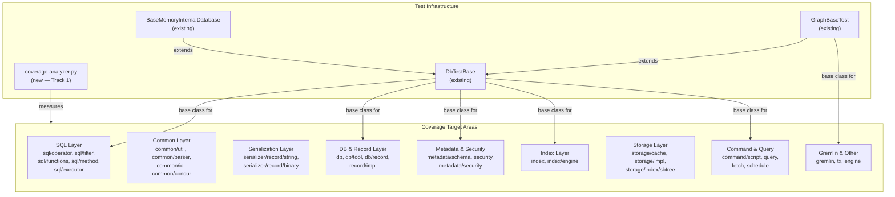

# Unit Test Coverage — Core Module

## Design Document
[design.md](design.md)

## High-level plan

### Goals

Raise the `core` module's unit test coverage from the current baseline
(63.6% line / 53.3% branch) to the project-wide target of **85% line /
70% branch** coverage. This requires covering approximately **19,000
additional lines** and **7,300 additional branches** across 177 packages.

The work is a systematic sweep: identify the lowest-coverage packages,
write focused unit tests for their uncovered code paths, and track
progress using a per-package coverage analyzer.

Tracks 2-22 are mutually independent — they can be reordered during
execution based on priority without affecting correctness. The track
ordering reflects a testability-tier strategy (D1) but is not a hard
dependency chain. Their only shared dependency is Track 1 (coverage
measurement infrastructure).

### Constraints

1. **JUnit 4** — Core module tests use JUnit 4 with `surefire-junit47`
   runner. All new tests must follow this convention.
2. **DbTestBase lifecycle** — Tests requiring a database session must
   extend `DbTestBase` (creates/destroys an in-memory database per test
   method via `@Before`/`@After`). Tests that can run without a database
   should be standalone (no base class).
3. **No parallel test processes** — Only one `./mvnw test` invocation may
   run in a given worktree at a time (see CLAUDE.md).
4. **Spotless formatting** — Run `./mvnw -pl core spotless:apply` before
   every commit.
5. **Coverage verification** — After each track, run
   `./mvnw -pl core -am clean package -P coverage` and verify improvement
   using the coverage analyzer script (Track 1).
6. **Existing test classes preferred** — Add tests to existing test
   classes when the scope fits. Create new classes only when no suitable
   existing class covers the area.
7. **Coverage exclusions** — The following should not receive tests:
   - *JaCoCo exclusions (not measured by JaCoCo):*
     - `**/core/sql/parser/**` (generated SQL parser)
     - `**/core/gql/parser/gen/**` (generated GQL parser)
     - `**/api/gremlin/*.class` (Gremlin API top-level)
   - *Testing exclusions (measured by JaCoCo but not targeted by this plan):*
     - `**/api/gremlin/embedded/schema/**` (Gremlin schema manipulation —
       not ready for testing)
     - `**/api/gremlin/tokens/schema/**` (Gremlin schema tokens — not ready
       for testing)
   Note: The testing exclusions ARE included in JaCoCo reports and will
   affect aggregate coverage numbers. The coverage analyzer should be
   aware of this distinction.
8. **Disk-based test environment** — CI runs tests with
   `-Dyoutrackdb.test.env=ci` (disk storage). Tests must pass in both
   memory and disk modes.
9. **Coverage measurement** — The existing `coverage-gate.py` checks only
   changed lines in PRs. A separate overall coverage analyzer is needed
   (Track 1) to measure and report per-package totals.
10. **Test descriptions** — Every test must have a descriptive method name
    or comment explaining the scenario and expected outcome.

### Architecture Notes

#### Component Map

- **coverage-analyzer.py** (new): Parses JaCoCo XML reports and produces
  per-package overall coverage summaries. Used to track progress across
  tracks. Not a production component — a developer/CI tool.
- **DbTestBase** (existing): Base class for tests requiring a database
  session. Creates an in-memory YouTrackDB instance per test method.
  Used by SQL, DB, Metadata, Index, Command, and Gremlin tests.
- **BaseMemoryInternalDatabase** (existing): Extends DbTestBase. Used when
  tests specifically need in-memory storage guarantees.
- **GraphBaseTest** (existing): Extends DbTestBase, adds Gremlin graph
  setup. Used by Gremlin and graph-related tests.
- **Standalone unit tests** (no base class): Used for pure utility
  classes, serialization round-trips, and any code testable without a
  database. Preferred when possible — faster and more isolated.
- **Coverage target areas**: Nine clusters of packages organized by
  functional area and testability tier. Tracks are ordered so
  highest-testability areas (SQL functions, utilities) come first,
  hardest areas (storage internals) come last.

#### D1: Test-first ordering by testability tier
- **Alternatives considered**: (a) Order by package size (largest gap
  first), (b) Order by functional area (storage, then SQL, then DB),
  (c) Order by testability (easiest first).
- **Rationale**: Option (c) wins because quick wins build momentum,
  validate the approach early, and yield measurable coverage improvements
  per track. Large-gap packages like `sql/executor` (1,735 uncov) are
  medium-testability and scheduled mid-plan. Hard packages like
  `storage/cache` are deferred to late tracks where the remaining gap is
  clearest.
- **Risks/Caveats**: Late tracks targeting storage internals may face
  diminishing returns — some code paths (WAL replay, crash recovery) may
  require integration tests rather than unit tests.
- **Implemented in**: Track ordering (Tracks 2-7 = high testability,
  8-17 = medium, 18-21 = low (storage internals), 22 = mixed
  (final sweep))

#### D2: Standalone tests over DbTestBase where possible
- **Alternatives considered**: (a) All tests extend DbTestBase for
  uniformity, (b) Standalone tests for pure utility code.
- **Rationale**: Option (b) — standalone tests are faster (no DB
  lifecycle), more isolated (no shared state), and better for true unit
  testing. DbTestBase should only be used when the code under test
  genuinely requires a database session.
- **Risks/Caveats**: Some classes appear standalone but internally depend
  on a database context (e.g., `SQLFunction.execute()` often needs a
  session). The execution agent must check imports and dependencies
  before choosing standalone vs. DbTestBase.
- **Implemented in**: All tracks — the execution agent decides per test
  class.

#### D3: Coverage measurement via Python analyzer
- **Alternatives considered**: (a) Modify existing `coverage-gate.py` to
  support overall mode, (b) Create a separate script, (c) Use JaCoCo's
  HTML report.
- **Rationale**: Option (b) — the existing gate script is tightly coupled
  to git diff logic and PR comments. A separate analyzer is simpler,
  avoids risk to the CI gate, and can produce per-package breakdowns
  needed for tracking progress across tracks.
- **Risks/Caveats**: Two scripts to maintain. Mitigated by keeping the
  analyzer simple (read-only, no CI integration beyond optional output).
- **Implemented in**: Track 1

#### D4: Accept lower coverage for storage internals
- **Alternatives considered**: (a) Target 85%/70% uniformly across all
  packages, (b) Accept lower targets for inherently hard-to-test code.
- **Rationale**: Option (b) — packages like `storage/cache/local`
  (WOWCache, 4,457 lines of concurrent cache code),
  `storage/index/sbtree` (B-tree internals), and `storage/impl/local`
  (disk I/O with WAL) require integration-level tests with complex setup.
  Forcing 85% line coverage here would mean either fragile tests or
  excessive mocking. Instead, target ~65-70% line coverage for storage
  and compensate with higher coverage in more testable areas.
- **Risks/Caveats**: Overall 85% target may be tight if storage coverage
  remains low. Mitigated by aggressive coverage in SQL, common, and
  serialization areas.
- **Implemented in**: Tracks 19-21

#### D5: One PR per track
- **Alternatives considered**: (a) One giant PR, (b) One PR per step,
  (c) One PR per track.
- **Rationale**: Option (c) — each track is a coherent unit of work
  targeting a specific area. One PR per track keeps reviews manageable
  (5-7 commits) and allows incremental merging. The `[no-test-number-check]`
  PR title tag can be used since we're adding tests without changing
  production code.
- **Risks/Caveats**: 22 PRs is a lot. Tracks can be batched into larger
  PRs if the team prefers.
- **Implemented in**: All tracks

#### Integration Points

- `coverage-analyzer.py` reads JaCoCo XML from
  `.coverage/reports/youtrackdb-core/jacoco.xml` (produced by
  `./mvnw -pl core -am clean package -P coverage`)
- New tests integrate with existing surefire configuration: parallel fork
  (4 threads) for default tests, sequential fork for `@SequentialTest`
- Tests using `DbTestBase` depend on the in-memory YouTrackDB lifecycle
  managed by `@Before`/`@After`

#### Non-Goals

- **Modifying production code** — Production code changes are permitted
  in two cases: (1) Refactoring of internal classes to increase
  testability, but not public API changes. (2) All bugs found during
  testing or code review must be fixed and covered by regression tests.
- **Integration tests** — This plan targets unit tests only (surefire).
  Integration tests (failsafe, `-P ci-integration-tests`) are out of
  scope.
- **Other modules** — Only the `core` module is in scope. `server`,
  `driver`, `embedded`, `tests`, and `docker-tests` are future work.
- **100% coverage** — The target is 85% line / 70% branch overall. Some
  packages will remain below this if the code is inherently hard to unit
  test. The goal is to raise the aggregate.
- **Gremlin schema manipulation tests** — Classes in
  `api/gremlin/embedded/schema` and `api/gremlin/tokens/schema` are
  excluded — not ready for testing.

## Checklist

- [x] Track 1: Coverage Measurement Infrastructure
  > Create a Python script (`coverage-analyzer.py`) that parses JaCoCo
  > XML reports and produces per-package overall coverage summaries.
  > Unlike the existing `coverage-gate.py` (which checks only changed
  > lines in PRs), this script computes totals across all lines in each
  > package and generates a sorted table of packages by uncovered line
  > count.
  >
  > The script takes the same `--coverage-dir` input as the existing gate
  > and outputs a markdown table with columns: package, line%, branch%,
  > uncovered lines, total lines. It also prints aggregate totals for the
  > entire module.
  >
  > After the script is written, run a baseline coverage build
  > (`./mvnw -pl core -am clean package -P coverage`) and record the
  > baseline numbers in a `coverage-baseline.md` file in this ADR
  > directory.
  >
  > **Scope:** ~3 steps covering script implementation, baseline
  > measurement, and documentation
  >
  > **Track episode:**
  > Created coverage measurement infrastructure for all subsequent tracks.
  > Added `.github/scripts/coverage-analyzer.py` (185 lines) — parses
  > JaCoCo XML and outputs per-package markdown tables sorted by uncovered
  > lines. Recorded baseline in `coverage-baseline.md`: 63.6% line /
  > 53.3% branch / 177 packages. Baseline confirms plan gap analysis:
  > ~19,000 lines and ~7,300 branches needed to reach 85%/70% targets.
  > No cross-track impact — read-only tooling used by all future tracks.
  >
  > **Step file:** `tracks/track-1.md` (2 steps, 0 failed)
  >
  > **Strategy refresh:** CONTINUE — no downstream impact detected.

- [x] Track 2: Common Pure Utilities
  > Write unit tests for the `common` package's pure utility classes that
  > require no database session. These are self-contained classes with
  > clear inputs/outputs, making them ideal first targets.
  >
  > Target packages and their uncovered lines:
  > - `common/util` (296 uncov, 26.4%) — ArrayUtils, Memory, Pair,
  >   Triple, RawPair, Collections, ClassLoaderHelper
  > - `common/collection` (360 uncov, 62.9%) — collection utilities
  > - `common/types` (56 uncov, 34.9%) — type utilities
  > - `common/comparator` (34 uncov, 72.4%) — comparator utilities
  > - `common/factory` (27 uncov, 38.6%) — factory utilities
  > - `common/exception` (29 uncov, 51.7%) — exception utilities
  > - `common/stream` (43 uncov, 50.6%) — stream utilities
  >
  > All tests should be standalone (no DbTestBase). Use JUnit 4
  > assertions. Focus on boundary conditions, null handling, and edge
  > cases.
  >
  > **Scope:** ~5 steps covering util, collection, types/comparator/
  > factory, exception/stream, and verification
  > **Depends on:** Track 1 (for coverage measurement)
  >
  > **Track episode:**
  > Added 432 unit tests across 20 new and 4 extended test files for all 7
  > target packages. Found and fixed a genuine bug in
  > `RawPairLongObject.equals()` (cast to wrong type). Documented several
  > pre-existing issues: `Binary.compareTo` different-length limitations,
  > `ModifiableInteger` overflow bypass, `LRUCache` off-by-one capacity,
  > `ErrorCode` reflection failures, `Streams` dedup asymmetry. Track-level
  > code review identified additional `MultiValue` branch coverage gaps
  > (add/remove/getValue/setValue/contains) suitable for Track 22 final
  > sweep. No cross-track impact — only `common` package tests and one
  > production bug fix.
  >
  > **Step file:** `tracks/track-2.md` (5 steps, 0 failed)
  >
  > **Strategy refresh:** CONTINUE — no downstream impact detected. All
  > discoveries localized to `common` package; `MultiValue` gaps noted for
  > Track 22 final sweep.

- [x] Track 3: Common I/O, Parser & Logging
  > Write unit tests for common infrastructure classes that handle I/O,
  > parsing, and logging. Most of these are pure utilities but some have
  > external dependencies (file system, native libraries).
  >
  > Target packages:
  > - `common/parser` (368 uncov, 27.0%) — parsing utilities
  > - `common/io` (224 uncov, 36.2%) — I/O utilities
  > - `common/log` (161 uncov, 29.7%) — logging utilities
  > - `common/profiler` (84+30 uncov, 44.4%) — profiler metrics
  >
  > Skip `common/console` (212 uncov, 0.0%) — console UI code that
  > requires interactive terminal, not amenable to unit testing. Skip
  > `common/jnr` (208 uncov, 24.1%) — JNR native wrappers that require
  > native library presence. `common/serialization` is covered in
  > Track 12 (Serialization — String & Core).
  >
  > **Scope:** ~4 steps covering parser, io, log/profiler, and
  > verification
  > **Depends on:** Track 1 (for coverage measurement)
  >
  > **Track episode:**
  > Added ~250 unit tests across 11 test files (all new except IOUtilsTest
  > extended) covering common/parser (95.4%/90.4%), common/io (87.7%/79.2%),
  > common/profiler/metrics (95.2%/75.8%), and common/log (68.1%/51.1%).
  > Discovered pre-existing bugs: StringParser.indexOfOutsideStrings backward
  > search exits after one position, VariableParser loses default during
  > recursion, IOUtils.isLong("") vacuous-truth bug, FileUtils.getSizeAsNumber("")
  > same pattern, IOUtils.getRelativePathIfAny crashes when base equals URL.
  > Track-level review added @SequentialTest to MetricsRegistryTest for JMX
  > isolation, strengthened vacuous assertions, and added 11 boundary tests.
  > No cross-track impact — only common package test files added.
  >
  > **Step file:** `tracks/track-3.md` (4 steps, 0 failed)
  >
  > **Strategy refresh:** CONTINUE — no downstream impact detected. All
  > discoveries localized to `common` package (parser bugs, I/O vacuous-truth
  > bugs, logging details). Track 4 targets independent subsystems.

- [ ] Track 4: Common Concurrency & Memory
  > Write tests for concurrency primitives and direct memory management.
  > These require careful testing with thread synchronization.
  >
  > Target packages:
  > - `common/concur/lock` (405 uncov, 45.0%) — lock utilities
  > - `common/concur/resource` (112 uncov, 49.1%) — resource management
  > - `common/thread` (130 uncov, 36.0%) — thread utilities
  > - `common/directmemory` (134 uncov, 68.5%) — direct memory tracking
  >
  > Use `ConcurrentTestHelper` from `test-commons` for multi-threaded
  > tests. Focus on lock acquisition/release semantics, resource
  > lifecycle, and memory allocation/deallocation paths.
  >
  > **Scope:** ~5 steps covering lock utilities, resource management,
  > thread utilities, direct memory, and verification
  > **Depends on:** Track 1 (for coverage measurement)

- [ ] Track 5: SQL Operators & Filters
  > Write tests for SQL operator and filter classes — the lowest-coverage
  > area in the SQL layer (sql/operator at 20.9%, sql/filter at 39.9%).
  >
  > Target packages:
  > - `core/sql/operator` (748 uncov, 20.9%) — SQL comparison operators
  >   (Equals, ContainsKey, ContainsValue, ContainsText, Between, In,
  >   Like, etc.)
  > - `core/sql/operator/math` (83 uncov, 53.6%) — SQL math operators
  > - `core/sql/filter` (579 uncov, 39.9%) — SQL filter evaluation
  >   (SQLFilter, FilterOptimizer, SQLFilterCondition, SQLPredicate,
  >   SQLTarget, etc.)
  >
  > Operators are self-contained: they take operands and return results.
  > Tests should cover type coercion, null handling, and edge cases.
  > Filter tests may need a database session for index analysis.
  >
  > **Scope:** ~6 steps covering comparison operators, math operators,
  > SQLFilter/SQLFilterCondition, FilterOptimizer, remaining filters,
  > and verification
  > **Depends on:** Track 1

- [ ] Track 6: SQL Functions
  > Write tests for SQL function implementations. Functions are
  > self-contained with clear `execute()` contracts, making them highly
  > testable.
  >
  > Target packages (all under `core/sql/functions/`):
  > - `graph` (449 uncov, 53.4%) — graph traversal functions (Both,
  >   BothE, BothV, In, InE, InV, Out, OutE, OutV, Move, PathFinder)
  > - `coll` (198 uncov, 48.6%) — collection functions (Distinct, First,
  >   Last, List, Set, Map, Intersect, UnionAll)
  > - `misc` (196 uncov, 53.0%) — utility functions (Count, If, IfNull,
  >   Coalesce, Date, UUID, Decode, Encode, Assert)
  > - `math` (58 uncov, 73.9%) — math functions (Average, Max, Min, Sum)
  > - `text` (30 uncov, 72.5%) — text functions (Concat, Format, Hash,
  >   Length, Replace, Right, SubString, ToJSON)
  > - `conversion` (29 uncov, 52.5%) — conversion functions (AsDate,
  >   AsDateTime, AsDecimal, Convert)
  > - `root/geo/result/sequence` (22 uncov) — remaining
  >
  > Graph functions require a database session (DbTestBase). Collection,
  > misc, math, and text functions can often be tested standalone.
  >
  > **Scope:** ~6 steps covering graph functions, collection functions,
  > misc functions, math/text/conversion, remaining functions, and
  > verification
  > **Depends on:** Track 1

- [ ] Track 7: SQL Methods & SQL Core
  > Write tests for SQL method implementations and the SQL root/query
  > packages.
  >
  > Target packages:
  > - `core/sql/method/misc` (149 uncov, 58.6%) — string/collection
  >   methods (Contains, Field, IndexOf, LastIndexOf, Normalize, Remove,
  >   Size, Split, ToLowerCase, ToUpperCase, Trim, Type)
  > - `core/sql/method` (62 uncov, 62.0%) — method infrastructure
  > - `core/sql/method/sequence` (30 uncov, 23.1%) — sequence methods
  >   (Current, Next, Reset)
  > - `core/sql` (440 uncov, 39.7%) — SQL root package (SQLEngine,
  >   SQLHelper, CommandExecutorSQLAbstract, etc.)
  > - `core/sql/query` (297 uncov, 2.9%) — SQL query infrastructure
  >   (nearly zero coverage)
  >
  > Methods are similar to functions: they take a value and parameters
  > and return a result. The SQL root and query packages contain command
  > execution infrastructure that needs a database session.
  >
  > **Scope:** ~5 steps covering method/misc, method/sequence, sql root,
  > sql/query, and verification
  > **Depends on:** Track 1

- [ ] Track 8: SQL Executor & Result Sets
  > Write tests for SQL execution step classes and result set
  > implementations. This is the largest coverage gap in the SQL layer
  > (2,188 uncov lines) but at medium testability since most steps
  > require a database session.
  >
  > Target packages:
  > - `core/sql/executor` (1,735 uncov, 74.6%) — execution steps:
  >   CRUD steps (CreateRecord, Delete, UpdateSet, Upsert),
  >   Fetch steps (FetchFromClass, FetchFromIndex, FetchFromRids),
  >   Control flow (Filter, Limit, Skip, If, ForEach),
  >   Advanced (Unwind, Retry, Timeout, Let, SubQuery)
  > - `core/sql/executor/resultset` (313 uncov, 49.2%) — result set
  >   implementations
  > - `core/sql/executor/metadata` (61 uncov, 79.9%) — metadata
  >   execution steps
  >
  > Each execution step has a clear contract: accept input result set,
  > produce output result set. Tests should set up minimal schema/data
  > and verify step behavior through SQL execution.
  >
  > **Scope:** ~7 steps covering CRUD steps, fetch steps, control flow
  > steps, advanced steps, result sets, metadata steps, and verification
  > **Depends on:** Track 1

- [ ] Track 9: Command & Script
  > Write tests for the command and script execution infrastructure.
  >
  > Target packages:
  > - `core/command/script` (691 uncov, 31.4%) — script execution
  >   (PolyglotScriptExecutor, DatabaseScriptManager, ScriptResultSets)
  > - `core/command` (325 uncov, 48.7%) — command infrastructure
  >   (CommandManager, CommandRequestText)
  > - `core/command/traverse` (127 uncov, 62.9%) — traverse command
  >   (Traverse, TraverseContext)
  > - `core/command/script/formatter` (57 uncov, 36.0%) — script
  >   formatting
  > - `core/command/script/transformer` (37 uncov) — script result
  >   transformation
  >
  > Script execution tests may need GraalVM polyglot context. Command
  > and traverse tests need a database session. Focus on the command
  > routing logic and traverse state machine.
  >
  > **Scope:** ~5 steps covering command infrastructure, traverse,
  > script execution, script formatting/transformation, and verification
  > **Depends on:** Track 1

- [ ] Track 10: Query & Fetch
  > Write tests for query infrastructure and fetch plan execution.
  >
  > Target packages:
  > - `core/query` (237 uncov, 38.8%) — query helpers (QueryHelper.like,
  >   BasicResultSet, ExecutionPlan)
  > - `core/query/live` (272 uncov, 13.4%) — live query infrastructure
  >   (LiveQueryQueueThread, LiveQueryListener)
  > - `core/fetch` (248 uncov, 46.6%) — fetch plan execution
  >
  > QueryHelper.like() is a pure function — excellent quick win. Live
  > query tests need threading. Fetch plan tests need a database session
  > with linked records to verify depth-based loading.
  >
  > **Scope:** ~4 steps covering query helpers, live query, fetch plans,
  > and verification
  > **Depends on:** Track 1

- [ ] Track 11: Scheduler
  > Write tests for the task scheduler subsystem.
  >
  > Target packages:
  > - `core/schedule` (598 uncov, 45.7%) — task scheduling
  >   (Scheduler, SchedulerImpl, ScheduledEvent, CronExpression)
  >
  > Schedule tests need the scheduler lifecycle (create, start, schedule
  > event, verify execution, stop). CronExpression is a pure parsing
  > class — good standalone test target. SchedulerImpl manages the
  > timer thread and event queue.
  >
  > **Scope:** ~3 steps covering CronExpression, scheduler lifecycle,
  > and verification
  > **Depends on:** Track 1

- [ ] Track 12: Serialization — String & Core
  > Write tests for the string record serializer and core serialization
  > infrastructure. The string serializer has very low coverage (30.9%)
  > and is a legacy format.
  >
  > Target packages:
  > - `core/serialization/serializer/record/string` (998 uncov, 30.9%)
  >   — string record serializer (CSV-like format)
  > - `core/serialization/serializer` (629 uncov, 41.4%) — serializer
  >   infrastructure (SerializerFactory, record type dispatching)
  > - `core/serialization` (277 uncov, 14.2%) — core serialization root
  > - `common/serialization` (146 uncov, 34.5%) — common serialization
  >   utilities
  > - `core/serialization/serializer/record` (14 uncov, 0.0%) —
  >   record serializer interface
  > - `core/serialization/serializer/stream` (9 uncov, 60.9%) — stream
  >   serializer
  >
  > Test approach: round-trip serialization — create objects, serialize,
  > deserialize, verify equality. Cover type-specific paths (strings,
  > numbers, dates, embedded documents, links, collections).
  >
  > **Scope:** ~6 steps covering string serializer types, string
  > serializer collections/links, serializer infrastructure, common
  > serialization, remaining, and verification
  > **Depends on:** Track 1

- [ ] Track 13: Serialization — Binary
  > Write tests for the binary record serializer. Binary serialization
  > already has decent coverage (74.8%) but a large absolute gap (850
  > uncov) due to the codebase size.
  >
  > Target packages:
  > - `core/serialization/serializer/record/binary` (850 uncov, 74.8%)
  >   — binary record serializer
  > - `core/serialization/serializer/binary/impl/index` (165 uncov,
  >   65.0%) — binary index serialization
  > - `common/serialization/types` (129 uncov, 84.3%) — serialization
  >   type utilities
  > - `core/serialization/serializer/binary` (21 uncov, 65.6%) — binary
  >   serializer root
  > - `core/serialization/serializer/binary/impl` (14 uncov, 90.8%) —
  >   binary impl
  >
  > Focus on uncovered type-specific serialization paths, edge cases
  > in binary encoding (variable-length integers, null handling, embedded
  > document nesting), and index key serialization.
  >
  > **Scope:** ~5 steps covering binary type paths, index serialization,
  > edge cases, common types, and verification
  > **Depends on:** Track 1

- [ ] Track 14: DB Core & Config
  > Write tests for the core database package — database lifecycle,
  > configuration, and record management.
  >
  > Target packages:
  > - `core/db` (1,268 uncov, 66.5%) — database operations
  >   (DatabaseSessionEmbedded, SessionPoolImpl, document helpers)
  > - `core/db/config` (130 uncov, 0.0%) — network/multicast/UDP
  >   configuration (zero coverage)
  > - `core/db/record` (404 uncov, 70.5%) — record management
  > - `core/db/record/record` (71 uncov, 57.2%) — RID and record
  >   internals
  > - `core/db/record/ridbag` (23 uncov, 84.7%) — RID bag operations
  >
  > DB tests require DbTestBase. Focus on session lifecycle, pool
  > management, document CRUD, and configuration builders.
  >
  > **Scope:** ~6 steps covering session lifecycle, pool management,
  > document operations, config builders, record internals, and
  > verification
  > **Depends on:** Track 1

- [ ] Track 15: Record Implementation & DB Tool
  > Write tests for the record implementation layer and database tool
  > utilities.
  >
  > Target packages:
  > - `core/record/impl` (1,412 uncov, 62.6%) — record implementation
  >   (EntityImpl property access, serialization, comparison, dirty
  >   tracking, embedded documents)
  > - `core/record` (90 uncov, 63.3%) — record root
  > - `core/db/tool` (891 uncov, 60.8%) — database tools
  >   (DatabaseExport, DatabaseRepair, DatabaseCompare)
  > - `core/db/tool/importer` (73 uncov, 59.4%) — database import
  >
  > EntityImpl is the core document model — focus on property get/set,
  > type conversion, dirty tracking, and comparison. DB tools handle
  > export/import/repair — test with small databases.
  >
  > **Scope:** ~7 steps covering EntityImpl properties, EntityImpl
  > serialization/comparison, EntityImpl embedded, record root, DB
  > export, DB repair/compare, and verification
  > **Depends on:** Track 1

- [ ] Track 16: Metadata Schema & Functions
  > Write tests for schema management and function/sequence libraries.
  >
  > Target packages:
  > - `core/metadata/schema` (1,278 uncov, 70.7%) — schema operations
  >   (SchemaShared, SchemaPropertyImpl, SchemaClassImpl, cluster
  >   selection strategies, schema proxies)
  > - `core/metadata/function` (74 uncov, 72.2%) — function library
  >   (FunctionLibraryImpl, DatabaseFunction)
  > - `core/metadata/sequence` (75 uncov, 84.3%) — sequence library
  >   (SequenceLibraryImpl, SequenceCached)
  > - `core/metadata/schema/clusterselection` (18 uncov, 63.3%) —
  >   cluster selection strategies
  >
  > Schema tests need a database session to create classes and
  > properties. Focus on property type validation, index creation,
  > cluster selection, and schema evolution.
  >
  > **Scope:** ~6 steps covering schema property operations, schema
  > class operations, cluster selection, function library, sequence
  > library, and verification
  > **Depends on:** Track 1

- [ ] Track 17: Security
  > Write tests for the security subsystem — authentication,
  > authorization, token management, and encryption.
  >
  > Target packages:
  > - `core/metadata/security` (593 uncov, 72.3%) — security metadata
  >   (Role, Identity, SecurityPolicyImpl, resource classes)
  > - `core/security` (548 uncov, 32.1%) — core security
  >   (SecurityManager, TokenSign, password hashing)
  > - `core/security/authenticator` (140 uncov, 25.5%) —
  >   authenticators (DefaultPassword, DatabaseUser)
  > - `core/security/symmetrickey` (282 uncov, 26.6%) — symmetric key
  >   security
  > - `core/metadata/security/binary` (164 uncov, 0.0%) — binary
  >   token serialization
  > - `core/metadata/security/jwt` (10 uncov, 0.0%) — JWT tokens
  > - `core/metadata/security/auth` (9 uncov, 0.0%) — auth info
  > - `core/security/kerberos` (114 uncov, 0.0%) — Kerberos auth
  >
  > Security tests should cover password hashing, token sign/verify,
  > role/permission checks, and authenticator chains. Kerberos tests
  > may need to be limited (no Kerberos infrastructure in test env).
  >
  > **Scope:** ~6 steps covering password/token, authenticators,
  > roles/permissions, symmetric key, binary tokens/JWT, and
  > verification
  > **Depends on:** Track 1

- [ ] Track 18: Index
  > Write tests for the index management layer — index engines, index
  > iterators, and index operations.
  >
  > Target packages:
  > - `core/index` (1,031 uncov, 67.7%) — index management
  >   (IndexManagerAbstract, IndexManagerEmbedded, index lifecycle,
  >   index queries)
  > - `core/index/engine` (126 uncov, 90.1%) — index engine (already
  >   well covered, target remaining edge cases)
  > - `core/index/engine/v1` (71 uncov, 86.1%) — v1 index engine
  > - `core/index/iterator` (85 uncov, 43.3%) — index iterators
  > - `core/index/comparator` (5 uncov, 50.0%) — index comparators
  >
  > Index tests need a database session with schema (create class,
  > create property, create index). Focus on index lifecycle, range
  > queries, composite keys, and iterator behavior.
  >
  > **Scope:** ~5 steps covering index lifecycle, index queries,
  > index iterators, edge cases, and verification
  > **Depends on:** Track 1

- [ ] Track 19: Storage Fundamentals
  > Write tests for storage subsystem components that are more testable
  > than the core cache/WAL/impl internals.
  >
  > Target packages:
  > - `core/storage/config` (359 uncov, 62.5%) — storage configuration
  > - `core/storage/memory` (124 uncov, 59.5%) — memory storage
  > - `core/storage` (66 uncov, 38.9%) — storage root
  > - `core/storage/fs` (62 uncov, 72.9%) — filesystem abstraction
  > - `core/storage/disk` (159 uncov, 83.3%) — disk operations
  > - `core/storage/collection/v2` (127 uncov, 90.3%) — collection v2
  > - `core/storage/collection` (56 uncov, 89.2%) — collection root
  > - `core/storage/ridbag` (86 uncov, 87.1%) — RID bag storage
  > - `core/storage/ridbag/ridbagbtree` (274 uncov, 84.0%) — B-tree
  >   RID bag
  >
  > Storage config and memory storage are testable in isolation.
  > Collection and ridbag components have existing tests to extend.
  >
  > **Scope:** ~5 steps covering storage config, memory storage,
  > filesystem/disk, collections, ridbag, and verification
  > **Depends on:** Track 1

- [ ] Track 20: Storage Cache & WAL
  > Write tests for the write cache (WOWCache), read cache, double-write
  > log, and WAL components. These are complex concurrent subsystems.
  >
  > Target packages:
  > - `core/storage/cache/local` (627 uncov, 68.7%) — WOWCache
  > - `core/storage/cache/local/doublewritelog` (146 uncov, 51.5%) —
  >   DoubleWriteLog implementations
  > - `core/storage/cache` (78 uncov, 76.9%) — cache interfaces
  > - `core/storage/cache/chm` (61 uncov, 89.3%) — LockFreeReadCache,
  >   concurrent hash map cache
  > - `core/storage/impl/local/paginated/wal/cas` (262 uncov, 76.7%)
  >   — CAS-based WAL
  > - `core/storage/impl/local/paginated/wal` (233 uncov, 64.5%) — WAL
  >   core
  >
  > These tests need careful setup (page buffers, cache pointers, lock
  > management). Focus on page lifecycle, cache eviction, double-write
  > log recovery, and WAL segment management. Use existing test patterns
  > from `CollectionPageTest` for low-level page tests.
  >
  > **Scope:** ~6 steps covering WOWCache lifecycle, read cache,
  > double-write log, WAL segments, cache eviction, and verification
  > **Depends on:** Track 1

- [ ] Track 21: Storage B-tree & Impl
  > Write tests for B-tree index storage and storage implementation
  > internals. These are the lowest-level storage components, tightly
  > coupled to page-based I/O and WAL operations.
  >
  > Target packages:
  > - `core/storage/impl/local` (1,190 uncov, 60.9%) — local storage
  >   implementation
  > - `core/storage/index/sbtree/multivalue/v2` (591 uncov, 13.3%) —
  >   multivalue B-tree (very low coverage)
  > - `core/storage/index/sbtree/singlevalue/v3` (437 uncov, 74.0%) —
  >   singlevalue B-tree v3
  > - `core/storage/index/sbtree/singlevalue/v1` (242 uncov, 0.0%) —
  >   singlevalue B-tree v1 (zero coverage, may be legacy)
  > - `core/storage/index/sbtree/local/v1` (102 uncov, 66.6%) — local
  >   B-tree v1
  > - `core/storage/index/sbtree/local/v2` (102 uncov, 66.9%) — local
  >   B-tree v2
  >
  > Focus on B-tree key operations (put, get, range, delete), page
  > splitting/merging, and storage impl lifecycle. Accept that some
  > storage internals may stay below 85% — focus on the most impactful
  > test cases.
  >
  > **Scope:** ~5 steps covering B-tree multivalue, B-tree singlevalue,
  > B-tree local, storage impl, and verification
  > **Depends on:** Track 1

- [ ] Track 22: Transactions, Gremlin & Remaining Core
  > Write tests for transaction management, Gremlin integration, and
  > all remaining uncovered core packages. This is the final sweep track.
  >
  > Target packages (major):
  > - `core/tx` (572 uncov, 61.8%) — transaction management
  > - `core/gremlin` (713+166+57+34 uncov) — Gremlin integration
  >   (excluding schema classes per constraint 7)
  > - `core/engine` (121+21+1 uncov) — engine lifecycle
  > - `core/exception` (230 uncov, 40.9%) — exception hierarchy
  >
  > Target packages (smaller):
  > - `core/id` (125 uncov, 64.2%) — ID generation
  > - `core/compression/impl` (104 uncov, 0.0%) — compression
  > - `core/config` (64 uncov, 66.1%) — configuration
  > - `core/cache` (60 uncov, 71.4%) — cache utilities
  > - Small packages: conflict, dictionary, servlet, replication, type,
  >   collate, api/*
  >
  > TX tests need a database session to verify begin/commit/rollback
  > semantics. Gremlin tests use GraphBaseTest. Engine lifecycle tests
  > verify engine registration via SPI. Remaining packages are a mix
  > of standalone and DB-dependent tests.
  >
  > **Scope:** ~6 steps covering transaction management, Gremlin
  > integration, engine lifecycle, exception/compression/config, remaining
  > small packages, and verification
  > **Depends on:** Track 1

## Final Artifacts
- [ ] Phase 4: Final artifacts (`design-final.md`, `adr.md`)
