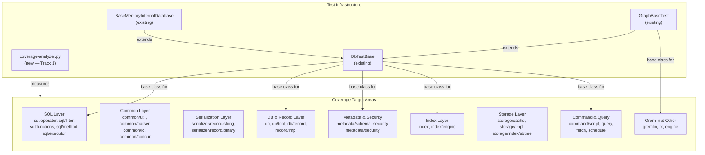

# Unit Test Coverage — Core Module

## Design Document
[design.md](design.md)

## High-level plan

### Goals

Raise the `core` module's unit test coverage from the current baseline
(63.6% line / 53.3% branch) to the project-wide target of **85% line /
70% branch** coverage. This requires covering approximately **19,000
additional lines** and **7,300 additional branches** across 177 packages.

The work is a systematic sweep: identify the lowest-coverage packages,
write focused unit tests for their uncovered code paths, and track
progress using a per-package coverage analyzer.

Tracks 2-22 are mutually independent — they can be reordered during
execution based on priority without affecting correctness. The track
ordering reflects a testability-tier strategy (D1) but is not a hard
dependency chain. Their only shared dependency is Track 1 (coverage
measurement infrastructure).

### Constraints

1. **JUnit 4** — Core module tests use JUnit 4 with `surefire-junit47`
   runner. All new tests must follow this convention.
2. **DbTestBase lifecycle** — Tests requiring a database session must
   extend `DbTestBase` (creates/destroys an in-memory database per test
   method via `@Before`/`@After`). Tests that can run without a database
   should be standalone (no base class).
3. **No parallel test processes** — Only one `./mvnw test` invocation may
   run in a given worktree at a time (see CLAUDE.md).
4. **Spotless formatting** — Run `./mvnw -pl core spotless:apply` before
   every commit.
5. **Coverage verification** — After each track, run
   `./mvnw -pl core -am clean package -P coverage` and verify improvement
   using the coverage analyzer script (Track 1).
6. **Existing test classes preferred** — Add tests to existing test
   classes when the scope fits. Create new classes only when no suitable
   existing class covers the area.
7. **Coverage exclusions** — The following should not receive tests:
   - *JaCoCo exclusions (not measured by JaCoCo):*
     - `**/core/sql/parser/**` (generated SQL parser)
     - `**/core/gql/parser/gen/**` (generated GQL parser)
     - `**/api/gremlin/*.class` (Gremlin API top-level)
   - *Testing exclusions (measured by JaCoCo but not targeted by this plan):*
     - `**/api/gremlin/embedded/schema/**` (Gremlin schema manipulation —
       not ready for testing)
     - `**/api/gremlin/tokens/schema/**` (Gremlin schema tokens — not ready
       for testing)
   Note: The testing exclusions ARE included in JaCoCo reports and will
   affect aggregate coverage numbers. The coverage analyzer should be
   aware of this distinction.
8. **Disk-based test environment** — CI runs tests with
   `-Dyoutrackdb.test.env=ci` (disk storage). Tests must pass in both
   memory and disk modes.
9. **Coverage measurement** — The existing `coverage-gate.py` checks only
   changed lines in PRs. A separate overall coverage analyzer is needed
   (Track 1) to measure and report per-package totals.
10. **Test descriptions** — Every test must have a descriptive method name
    or comment explaining the scenario and expected outcome.
11. **Rebase on `origin/develop` at the start of every track** — This plan
    is very large and long-lived; staying in sync with the remote is
    mandatory to avoid drift and painful late-stage merge conflicts. At the
    beginning of each track (before Phase A):
    1. `git fetch origin` and `git rebase origin/develop`.
    2. Resolve any conflicts in source, tests, or formatting.
    3. Run the full `core` unit-test suite
       (`./mvnw -pl core clean test`) and fix any new failures introduced
       by the rebase — do NOT proceed to Phase A until the suite is green.
    4. If the rebase touches areas covered by integration tests, also run
       `./mvnw -pl core clean verify -P ci-integration-tests`.
    5. Re-run `./mvnw -pl core spotless:apply` to pick up any formatter
       changes on develop.
    Record the pre-rebase and post-rebase SHAs in the track's step file so
    the rebase is auditable. If conflicts force non-trivial rework of
    already-committed steps, ESCALATE — the plan may need adjustment.

### Architecture Notes

#### Component Map

- **coverage-analyzer.py** (new): Parses JaCoCo XML reports and produces
  per-package overall coverage summaries. Used to track progress across
  tracks. Not a production component — a developer/CI tool.
- **DbTestBase** (existing): Base class for tests requiring a database
  session. Creates an in-memory YouTrackDB instance per test method.
  Used by SQL, DB, Metadata, Index, Command, and Gremlin tests.
- **BaseMemoryInternalDatabase** (existing): Extends DbTestBase. Used when
  tests specifically need in-memory storage guarantees.
- **GraphBaseTest** (existing): Extends DbTestBase, adds Gremlin graph
  setup. Used by Gremlin and graph-related tests.
- **Standalone unit tests** (no base class): Used for pure utility
  classes, serialization round-trips, and any code testable without a
  database. Preferred when possible — faster and more isolated.
- **Coverage target areas**: Nine clusters of packages organized by
  functional area and testability tier. Tracks are ordered so
  highest-testability areas (SQL functions, utilities) come first,
  hardest areas (storage internals) come last.

#### D1: Test-first ordering by testability tier
- **Alternatives considered**: (a) Order by package size (largest gap
  first), (b) Order by functional area (storage, then SQL, then DB),
  (c) Order by testability (easiest first).
- **Rationale**: Option (c) wins because quick wins build momentum,
  validate the approach early, and yield measurable coverage improvements
  per track. Large-gap packages like `sql/executor` (1,735 uncov) are
  medium-testability and scheduled mid-plan. Hard packages like
  `storage/cache` are deferred to late tracks where the remaining gap is
  clearest.
- **Risks/Caveats**: Late tracks targeting storage internals may face
  diminishing returns — some code paths (WAL replay, crash recovery) may
  require integration tests rather than unit tests.
- **Implemented in**: Track ordering (Tracks 2-7 = high testability,
  8-17 = medium, 18-21 = low (storage internals), 22 = mixed
  (final sweep))

#### D2: Standalone tests over DbTestBase where possible
- **Alternatives considered**: (a) All tests extend DbTestBase for
  uniformity, (b) Standalone tests for pure utility code.
- **Rationale**: Option (b) — standalone tests are faster (no DB
  lifecycle), more isolated (no shared state), and better for true unit
  testing. DbTestBase should only be used when the code under test
  genuinely requires a database session.
- **Risks/Caveats**: Some classes appear standalone but internally depend
  on a database context (e.g., `SQLFunction.execute()` often needs a
  session). The execution agent must check imports and dependencies
  before choosing standalone vs. DbTestBase.
- **Implemented in**: All tracks — the execution agent decides per test
  class.

#### D3: Coverage measurement via Python analyzer
- **Alternatives considered**: (a) Modify existing `coverage-gate.py` to
  support overall mode, (b) Create a separate script, (c) Use JaCoCo's
  HTML report.
- **Rationale**: Option (b) — the existing gate script is tightly coupled
  to git diff logic and PR comments. A separate analyzer is simpler,
  avoids risk to the CI gate, and can produce per-package breakdowns
  needed for tracking progress across tracks.
- **Risks/Caveats**: Two scripts to maintain. Mitigated by keeping the
  analyzer simple (read-only, no CI integration beyond optional output).
- **Implemented in**: Track 1

#### D4: Accept lower coverage for storage internals
- **Alternatives considered**: (a) Target 85%/70% uniformly across all
  packages, (b) Accept lower targets for inherently hard-to-test code.
- **Rationale**: Option (b) — packages like `storage/cache/local`
  (WOWCache, 4,457 lines of concurrent cache code),
  `storage/index/sbtree` (B-tree internals), and `storage/impl/local`
  (disk I/O with WAL) require integration-level tests with complex setup.
  Forcing 85% line coverage here would mean either fragile tests or
  excessive mocking. Instead, target ~65-70% line coverage for storage
  and compensate with higher coverage in more testable areas.
- **Risks/Caveats**: Overall 85% target may be tight if storage coverage
  remains low. Mitigated by aggressive coverage in SQL, common, and
  serialization areas.
- **Implemented in**: Tracks 19-21

#### D5: One PR per track
- **Alternatives considered**: (a) One giant PR, (b) One PR per step,
  (c) One PR per track.
- **Rationale**: Option (c) — each track is a coherent unit of work
  targeting a specific area. One PR per track keeps reviews manageable
  (5-7 commits) and allows incremental merging. The `[no-test-number-check]`
  PR title tag can be used since we're adding tests without changing
  production code.
- **Risks/Caveats**: 22 PRs is a lot. Tracks can be batched into larger
  PRs if the team prefers.
- **Implemented in**: All tracks

#### Integration Points

- `coverage-analyzer.py` reads JaCoCo XML from
  `.coverage/reports/youtrackdb-core/jacoco.xml` (produced by
  `./mvnw -pl core -am clean package -P coverage`)
- New tests integrate with existing surefire configuration: parallel fork
  (4 threads) for default tests, sequential fork for `@SequentialTest`
- Tests using `DbTestBase` depend on the in-memory YouTrackDB lifecycle
  managed by `@Before`/`@After`

#### Non-Goals

- **Modifying production code** — Production code changes are permitted
  in two cases: (1) Refactoring of internal classes to increase
  testability, but not public API changes. (2) All bugs found during
  testing or code review must be fixed and covered by regression tests.
- **Integration tests** — This plan targets unit tests only (surefire).
  Integration tests (failsafe, `-P ci-integration-tests`) are out of
  scope.
- **Other modules** — Only the `core` module is in scope. `server`,
  `driver`, `embedded`, `tests`, and `docker-tests` are future work.
- **100% coverage** — The target is 85% line / 70% branch overall. Some
  packages will remain below this if the code is inherently hard to unit
  test. The goal is to raise the aggregate.
- **Gremlin schema manipulation tests** — Classes in
  `api/gremlin/embedded/schema` and `api/gremlin/tokens/schema` are
  excluded — not ready for testing.

## Checklist

- [x] Track 1: Coverage Measurement Infrastructure
  > Create a Python script (`coverage-analyzer.py`) that parses JaCoCo
  > XML reports and produces per-package overall coverage summaries.
  > Unlike the existing `coverage-gate.py` (which checks only changed
  > lines in PRs), this script computes totals across all lines in each
  > package and generates a sorted table of packages by uncovered line
  > count.
  >
  > The script takes the same `--coverage-dir` input as the existing gate
  > and outputs a markdown table with columns: package, line%, branch%,
  > uncovered lines, total lines. It also prints aggregate totals for the
  > entire module.
  >
  > After the script is written, run a baseline coverage build
  > (`./mvnw -pl core -am clean package -P coverage`) and record the
  > baseline numbers in a `coverage-baseline.md` file in this ADR
  > directory.
  >
  > **Scope:** ~3 steps covering script implementation, baseline
  > measurement, and documentation
  >
  > **Track episode:**
  > Created coverage measurement infrastructure for all subsequent tracks.
  > Added `.github/scripts/coverage-analyzer.py` (185 lines) — parses
  > JaCoCo XML and outputs per-package markdown tables sorted by uncovered
  > lines. Recorded baseline in `coverage-baseline.md`: 63.6% line /
  > 53.3% branch / 177 packages. Baseline confirms plan gap analysis:
  > ~19,000 lines and ~7,300 branches needed to reach 85%/70% targets.
  > No cross-track impact — read-only tooling used by all future tracks.
  >
  > **Step file:** `tracks/track-1.md` (2 steps, 0 failed)
  >
  > **Strategy refresh:** CONTINUE — no downstream impact detected.

- [x] Track 2: Common Pure Utilities
  > Write unit tests for the `common` package's pure utility classes that
  > require no database session. These are self-contained classes with
  > clear inputs/outputs, making them ideal first targets.
  >
  > Target packages and their uncovered lines:
  > - `common/util` (296 uncov, 26.4%) — ArrayUtils, Memory, Pair,
  >   Triple, RawPair, Collections, ClassLoaderHelper
  > - `common/collection` (360 uncov, 62.9%) — collection utilities
  > - `common/types` (56 uncov, 34.9%) — type utilities
  > - `common/comparator` (34 uncov, 72.4%) — comparator utilities
  > - `common/factory` (27 uncov, 38.6%) — factory utilities
  > - `common/exception` (29 uncov, 51.7%) — exception utilities
  > - `common/stream` (43 uncov, 50.6%) — stream utilities
  >
  > All tests should be standalone (no DbTestBase). Use JUnit 4
  > assertions. Focus on boundary conditions, null handling, and edge
  > cases.
  >
  > **Scope:** ~5 steps covering util, collection, types/comparator/
  > factory, exception/stream, and verification
  > **Depends on:** Track 1 (for coverage measurement)
  >
  > **Track episode:**
  > Added 432 unit tests across 20 new and 4 extended test files for all 7
  > target packages. Found and fixed a genuine bug in
  > `RawPairLongObject.equals()` (cast to wrong type). Documented several
  > pre-existing issues: `Binary.compareTo` different-length limitations,
  > `ModifiableInteger` overflow bypass, `LRUCache` off-by-one capacity,
  > `ErrorCode` reflection failures, `Streams` dedup asymmetry. Track-level
  > code review identified additional `MultiValue` branch coverage gaps
  > (add/remove/getValue/setValue/contains) suitable for Track 22 final
  > sweep. No cross-track impact — only `common` package tests and one
  > production bug fix.
  >
  > **Step file:** `tracks/track-2.md` (5 steps, 0 failed)
  >
  > **Strategy refresh:** CONTINUE — no downstream impact detected. All
  > discoveries localized to `common` package; `MultiValue` gaps noted for
  > Track 22 final sweep.

- [x] Track 3: Common I/O, Parser & Logging
  > Write unit tests for common infrastructure classes that handle I/O,
  > parsing, and logging. Most of these are pure utilities but some have
  > external dependencies (file system, native libraries).
  >
  > Target packages:
  > - `common/parser` (368 uncov, 27.0%) — parsing utilities
  > - `common/io` (224 uncov, 36.2%) — I/O utilities
  > - `common/log` (161 uncov, 29.7%) — logging utilities
  > - `common/profiler` (84+30 uncov, 44.4%) — profiler metrics
  >
  > Skip `common/console` (212 uncov, 0.0%) — console UI code that
  > requires interactive terminal, not amenable to unit testing. Skip
  > `common/jnr` (208 uncov, 24.1%) — JNR native wrappers that require
  > native library presence. `common/serialization` is covered in
  > Track 12 (Serialization — String & Core).
  >
  > **Scope:** ~4 steps covering parser, io, log/profiler, and
  > verification
  > **Depends on:** Track 1 (for coverage measurement)
  >
  > **Track episode:**
  > Added ~250 unit tests across 11 test files (all new except IOUtilsTest
  > extended) covering common/parser (95.4%/90.4%), common/io (87.7%/79.2%),
  > common/profiler/metrics (95.2%/75.8%), and common/log (68.1%/51.1%).
  > Discovered pre-existing bugs: StringParser.indexOfOutsideStrings backward
  > search exits after one position, VariableParser loses default during
  > recursion, IOUtils.isLong("") vacuous-truth bug, FileUtils.getSizeAsNumber("")
  > same pattern, IOUtils.getRelativePathIfAny crashes when base equals URL.
  > Track-level review added @SequentialTest to MetricsRegistryTest for JMX
  > isolation, strengthened vacuous assertions, and added 11 boundary tests.
  > No cross-track impact — only common package test files added.
  >
  > **Step file:** `tracks/track-3.md` (4 steps, 0 failed)
  >
  > **Strategy refresh:** CONTINUE — no downstream impact detected. All
  > discoveries localized to `common` package (parser bugs, I/O vacuous-truth
  > bugs, logging details). Track 4 targets independent subsystems.

- [x] Track 4: Common Concurrency & Memory
  > Write tests for concurrency primitives and direct memory management.
  > These require careful testing with thread synchronization.
  >
  > Target packages:
  > - `common/concur/lock` (405 uncov, 45.0%) — lock utilities
  > - `common/concur/resource` (112 uncov, 49.1%) — resource management
  > - `common/thread` (130 uncov, 36.0%) — thread utilities
  > - `common/directmemory` (134 uncov, 68.5%) — direct memory tracking
  >
  > Use `ConcurrentTestHelper` from `test-commons` for multi-threaded
  > tests. Focus on lock acquisition/release semantics, resource
  > lifecycle, and memory allocation/deallocation paths.
  >
  > **Scope:** ~5 steps covering lock utilities, resource management,
  > thread utilities, direct memory, and verification
  > **Depends on:** Track 1 (for coverage measurement)
  >
  > **Track episode:**
  > Added ~250 unit tests across 22 test files (19 new, 3 extended) for all
  > 4 target packages. Found and fixed 2 production bugs in
  > PartitionedLockManager: `releaseSLock()` called `sharedLock()` instead of
  > `sharedUnlock()`, and `acquireExclusiveLocksInBatch(int[])` allocated a
  > zero-filled array instead of copying input values. Documented pre-existing
  > behaviors: ReadersWriterSpinLock no read→write upgrade, NonDaemonThreadFactory
  > inherits daemon flag, SourceTraceExecutorService bypasses checked exceptions.
  > Coverage: lock 87.0%/71.7% PASS, resource 84.5%/77.8% (0.5% below line),
  > thread 95.6%/92.5% PASS, directmemory 70.1%/59.7% (PROFILE_MEMORY paths).
  > No cross-track impact — only common package tests and 2 production bug fixes.
  >
  > **Step file:** `tracks/track-4.md` (5 steps, 0 failed)
  >
  > **Strategy refresh:** CONTINUE — no downstream impact detected. All
  > discoveries localized to `common` package; directmemory/resource
  > coverage shortfalls accepted (PROFILE_MEMORY paths, 0.5% margin).

- [x] Track 5: SQL Operators & Filters
  > Write tests for SQL operator and filter classes — the lowest-coverage
  > area in the SQL layer (sql/operator at 20.9%, sql/filter at 39.9%).
  >
  > Target packages:
  > - `core/sql/operator` (748 uncov, 20.9%) — SQL comparison operators
  >   (Equals, ContainsKey, ContainsValue, ContainsText, Between, In,
  >   Like, etc.)
  > - `core/sql/operator/math` (83 uncov, 53.6%) — SQL math operators
  > - `core/sql/filter` (579 uncov, 39.9%) — SQL filter evaluation
  >   (SQLFilter, FilterOptimizer, SQLFilterCondition, SQLPredicate,
  >   SQLTarget, etc.)
  >
  > Operators are self-contained: they take operands and return results.
  > Tests should cover type coercion, null handling, and edge cases.
  > Filter tests may need a database session for index analysis.
  >
  > **Scope:** ~6 steps covering comparison operators, math operators,
  > SQLFilter/SQLFilterCondition, FilterOptimizer, remaining filters,
  > and verification
  > **Depends on:** Track 1
  >
  > **Track episode:**
  > Added ~560 unit tests across 10 test files (8 new, 2 extended) covering
  > sql/operator, sql/operator/math, and sql/filter. Rewrote Plus/Minus/
  > Multiply/Divide math tests from monolithic to focused. Final coverage:
  > sql/operator 83.0%/75.3% (+17%/+19%), sql/operator/math 91.1%/90.2%,
  > sql/filter 78.0%/64.8%. sql/operator is 2% below line target and
  > sql/filter is 7% below — remaining uncovered paths are BinaryField/
  > EntitySerializer comparator paths and full SQL-execution contexts
  > covered by integration tests. Fixed 2 production bugs with falsifiable
  > regression tests: QueryOperatorContainsValue early-return in condition
  > loop; QueryOperatorTraverse FieldAny.FULL_NAME copy-paste where FieldAll
  > was intended. Documented 9 pre-existing bugs/inconsistencies with
  > WHEN-FIXED markers: And/Or null-right NPE asymmetry; ContainsText
  > ignoreCase never consulted; QueryOperatorEquals dead-code branch;
  > In operator Set.contains() bypasses type coercion; ContainsAll
  > over-counting with duplicate left elements; Instanceof left/right
  > asymmetry; Mod dispatches on left type only (silent truncation);
  > tryDownscaleToInt exclusive-boundary off-by-one; IS DEFINED
  > SQLFilterItemField branch uses Object.toString identity as field-name
  > key. Track-level code review (1 iteration, PASS): applied 13 should-fix
  > improvements — strengthened assertions in SQLFilterClassesTest; added
  > LIKE regex-escape tests for 8 untested chars; MATCHES malformed-regex
  > and null-context tests; IS DEFINED sentinel tests;
  > DefaultQueryOperatorFactoryTest exactly-one-of-class; removed duplicate
  > isSupportingBinaryEvaluate tests and dead createClass setup; added
  > WHEN-FIXED markers to bug-pinning tests. No cross-track impact.
  >
  > **Step file:** `tracks/track-5.md` (6 steps, 0 failed)
  >
  > **Strategy refresh:** CONTINUE — no downstream impact detected. Track 6
  > (SQL Functions) uses independent SQLFunctionFactory dispatch path; all
  > Track 5 discoveries localized to operator/filter subsystem. Carry forward
  > falsifiable-regression + WHEN-FIXED-marker convention.

- [x] Track 6: SQL Functions
  > Write tests for SQL function implementations. Functions are
  > self-contained with clear `execute()` contracts, making them highly
  > testable.
  >
  > Target packages (all under `core/sql/functions/`):
  > - `graph` (449 uncov, 53.4%) — graph traversal functions (Both,
  >   BothE, BothV, In, InE, InV, Out, OutE, OutV, Move, PathFinder)
  > - `coll` (198 uncov, 48.6%) — collection functions (Distinct, First,
  >   Last, List, Set, Map, Intersect, UnionAll)
  > - `misc` (196 uncov, 53.0%) — utility functions (Count, If, IfNull,
  >   Coalesce, Date, UUID, Decode, Encode, Assert)
  > - `math` (58 uncov, 73.9%) — math functions (Average, Max, Min, Sum)
  > - `text` (30 uncov, 72.5%) — text functions (Concat, Format, Hash,
  >   Length, Replace, Right, SubString, ToJSON)
  > - `conversion` (29 uncov, 52.5%) — conversion functions (AsDate,
  >   AsDateTime, AsDecimal, Convert)
  > - `root/geo/result/sequence` (22 uncov) — remaining
  >
  > Graph functions require a database session (DbTestBase). Collection,
  > misc, math, and text functions can often be tested standalone.
  >
  > **Scope:** ~6 steps covering graph functions, collection functions,
  > misc functions, math/text/conversion, remaining functions, and
  > verification
  > **Depends on:** Track 1
  >
  > **Track episode:**
  > Added 940 `@Test` methods across 83 test files under
  > `core/src/test/java/.../sql/functions/**` covering all nine target
  > subpackages (graph, coll, misc, math, stat, text, conversion, geo,
  > result) plus factory infrastructure. No production code was modified
  > — Track 6 is purely test-additive. All latent bugs and inconsistencies
  > discovered were pinned as falsifiable regressions with `// WHEN-FIXED:`
  > markers (~20 markers total) for Track 22's production-side fixes.
  >
  > Key discoveries with cross-track impact:
  > `CustomSQLFunctionFactory` uses a process-wide `HashMap` mutated
  > without synchronization — latent flakiness under parallel surefire.
  > Mitigated in Track 6 via `@Category(SequentialTest)` + UUID-qualified
  > prefix + alphabetical `@FixMethodOrder`. Production-side fix
  > (`HashMap → ConcurrentHashMap` or `Collections.synchronizedMap` +
  > defensive copy in `getFunctionNames`) deferred to Track 22 along with
  > a concurrent register/lookup contract test (TX2, BC10, TX5).
  > `SQLFunctionRuntime` is coupled to the SQL parser and not unit-testable
  > — explicitly deferred to Tracks 7/8. `misc.SQLFunctionFormat` is dead
  > code (not registered in `DefaultSQLFunctionFactory`) — pinned via
  > `SQLFunctionFormatMiscDeadTest` with a WHEN-FIXED marker flagging it
  > for removal in Track 22. `session.commit()` detaches returned
  > `Iterable<Vertex>` wrappers — graph-dispatcher tests must collect
  > identities into a local `List` before committing (pattern for Tracks
  > 7, 8, 14, 22). `DbTestBase` shares one session across test methods in
  > a class; a test that leaks an open transaction cascade-fails the whole
  > class — established `@After rollbackIfLeftOpen` safety-net idiom
  > (itself a DRY candidate for Track 22, CQ2).
  >
  > Plan deviations: track grew from ~6 scope-indicator steps to 8 actual
  > steps because track-review flagged `SQLMethod*` classes physically
  > under `sql/functions/` (text/, conversion/, coll/, misc/) that JaCoCo
  > attributes to Track 6. Absorbed into steps 4, 6, 8 with the corrected
  > `execute(iThis, record, context, ioResult, params)` signature
  > (different from `SQLFunction.execute` order).
  >
  > Track-level code review ran 3 iterations: iter-1 surfaced 1 blocker
  > (BC1/TX1 — `CustomSQLFunctionFactory` race) + 18 should-fix + 22
  > suggestions, all in-scope resolved across commits `4aad8dd..7e32145`.
  > Iter-2 gate check found one should-fix regression **introduced by
  > iter-1's own fix**: PM-window WHEN-FIXED sentinel's `Assume.assumeTrue`
  > gated on production-mutated result's `AM_PM`, causing silent SKIP on
  > every runner once the bug is fixed. Fixed in `14c72eb` by reading
  > `AM_PM` from the raw input instant; also tightened Astar
  > Identifiable-options test (TB14) to pin the middle hop. Iter-3 final
  > gate (BC+TB dimensions only) PASS with 1 suggestion. Zero open
  > blockers, zero should-fix at track end; ~15 suggestion-grade items
  > legitimately deferred (most map to Track 22's scope).
  >
  > **Step file:** `tracks/track-6.md` (8 steps, 0 failed)
  >
  > **Strategy refresh:** CONTINUE — all cross-track discoveries are deferred
  > cleanly to Track 22 (CustomSQLFunctionFactory race, SQLFunctionFormat
  > dead code, MultiValue gaps, rollbackIfLeftOpen DRY) or are patterns to
  > carry forward (falsifiable-regression + WHEN-FIXED marker, Iterable.
  > commit() detach pattern, SQLMethod.execute signature awareness).
  > SQLFunctionRuntime coverage naturally falls out of Tracks 7/8 SQL
  > execution. No Component Map changes; Track 7's `sql/method/*` scope is
  > disjoint from Track 6's absorbed `sql/functions/*` SQLMethod classes.

- [x] Track 7: SQL Methods & SQL Core
  > Write tests for SQL method implementations and the SQL root/query
  > packages.
  >
  > Target packages:
  > - `core/sql/method/misc` (149 uncov, 58.6%) — string/collection
  >   methods (Contains, Field, IndexOf, LastIndexOf, Normalize, Remove,
  >   Size, Split, ToLowerCase, ToUpperCase, Trim, Type)
  > - `core/sql/method` (62 uncov, 62.0%) — method infrastructure
  > - `core/sql/method/sequence` (30 uncov, 23.1%) — sequence methods
  >   (Current, Next, Reset)
  > - `core/sql` (440 uncov, 39.7%) — SQL root package (SQLEngine,
  >   SQLHelper, CommandExecutorSQLAbstract, etc.)
  > - `core/sql/query` (297 uncov, 2.9%) — SQL query infrastructure
  >   (nearly zero coverage)
  >
  > Methods are similar to functions: they take a value and parameters
  > and return a result. The SQL root and query packages contain command
  > execution infrastructure that needs a database session.
  >
  > **Scope:** ~5 steps covering method/misc, method/sequence, sql root,
  > sql/query, and verification
  > **Depends on:** Track 1
  >
  > **Track episode:**
  > Added ~1,200 unit tests across 41 test files (40 new, 1 extended) covering
  > all Track 7 scope packages. Coverage deltas: `sql/method/misc` 58.6%/41.6%
  > → **92.2%/88.0%**; `sql/method` 62.0%/36.2% → **87.1%/81.2%**;
  > `sql/method/sequence` 23.1%/16.7% → **100%/100%**; `sql` (live)
  > 39.7%/34.7% → **80.1%/76.9%** (aggregate capped by pinned dead code for
  > Track 22 deletion); `sql/query` 2.9%/2.6% → **79.1%/57.9%** (exceeded
  > the 30-40% decomposition expectation). Aggregate module coverage
  > 63.6%/53.3% → **70.6%/61.0%** (+7.0pp line / +7.7pp branch).
  >
  > **Production bugs pinned as WHEN-FIXED regressions (~16 entries for
  > Track 22 queue)**: SQLMethodContains `&&→||` guard, SQLMethodNormalize
  > iParams[0↔1] mix-up, SQLMethodLastIndexOf/IndexOf/Prefix/CharAt null-
  > guard asymmetries, SQLMethodField null-unguarded isArray NPE,
  > DefaultSQLMethodFactory.createMethod case-sensitivity mismatch,
  > SQLMethodFunctionDelegate no-no-arg-ctor dead Class<?> registration,
  > AbstractSQLMethod.getParameterValue AIOBEs (empty string, single quote),
  > SQLFunctionRuntime.java:104 type-pun (instanceof checks iCurrentRecord
  > but casts iCurrentResult — CCE hazard), SQLMethodRuntime iEvaluate dead
  > flag, IndexSearchResult.equals two latent NPEs, IndexSearchResult.mergeFields
  > branch-2 drops right's containsNullValues, RuntimeResult.getResult line 73
  > overwrites canExcludeResult, BasicLegacyResultSet + ConcurrentLegacyResultSet
  > iterator strict-`>` guard, BasicLegacyResultSet UOE message copy-paste
  > drift, LiveLegacyResultSet.setCompleted commented-out body,
  > SQLHelper.parseStringNumber suffix-strip bug. Plus 3 concurrency pins
  > (DefaultSQLMethodFactory HashMap race, SQLEngine.registerOperator
  > non-atomic SORTED_OPERATORS clear, SQLEngine.scanForPlugins partial
  > cache clear).
  >
  > **Plan corrections absorbed into Track 22** (via iter-1 update to this
  > file): CQ3/TS5 shared test-fixture extraction; TS3/TS6 oversized-test-
  > class splits; TS4/TS7/TS9 @Parameterized conversions; TX5 multi-threaded
  > race-exercising tests paired with WHEN-FIXED production-side fixes;
  > CQ1/TC3 license-banner cleanup + unicode/Turkish-locale string-method
  > coverage.
  >
  > **Patterns carried forward**: falsifiable regression + WHEN-FIXED marker
  > convention; `@After rollbackIfLeftOpen` safety-net idiom using
  > `getActiveTransactionOrNull() + tx.isActive()`; `session.begin()` +
  > `tx.rollback()` in finally for entity-populating tests; SequentialTest +
  > FixMethodOrder + UUID-qualified marker + snapshot-and-assert for tests
  > that mutate process-wide static state; counting CommandContext wrapper
  > (introduced in iter-2) for fallback-branch mutation-testing where both
  > primary and fallback resolve to identical values.
  >
  > **Cross-track impact**: Minor-to-moderate. No Component Map or Decision
  > Record changes. Track 22's scope expands by ~16 production-fix queue
  > entries + DRY cleanup items (cataloged above). Step 4 bridged Track 6's
  > `sql/functions` package for SQLFunctionRuntime — no artifact duplication.
  > Track 8 (executor) inherits SQLScriptEngine + CommandExecutorSQLAbstract
  > indirect-coverage expectation (deferred from Track 7). Plan grew from
  > ~5 scope-indicator steps to 8 actual steps (matches Track 6 precedent
  > under dimensional review).
  >
  > **Track-level code review**: 2 iterations, 6 dimensions (CQ, BC, TB, TC,
  > TX, TS). Iter-1: 0 blockers / 17 should-fix / 39 suggestions; applied
  > 13 should-fix fixes, deferred remaining to Track 22. Iter-2 gate-check:
  > all 13 iter-1 fixes VERIFIED; 1 new should-fix (TB13 — vacuous variable-
  > fallback test strengthened via counting CommandContext) + 1 suggestion
  > (TS13 — misleading comment corrected) fixed in iter-2. Final verdict:
  > **PASS**. 0 open blockers, 0 open should-fix; ~10 suggestion-grade
  > items deferred or accepted as merge-ready.
  >
  > **Step file:** `tracks/track-7.md` (8 steps, 0 failed)
  >
  > **Strategy refresh:** CONTINUE — no downstream impact detected. Track 7's
  > legacy result-set pins (`core/sql/query`) are disjoint from Track 8's
  > modern `core/sql/executor/resultset` scope. **Correction (per Track 8
  > Phase A reviews):** Track 7's earlier expectation that
  > `SQLScriptEngine` and `CommandExecutorSQLAbstract` would "fall out of
  > Track 8's executor steps" is structurally wrong — both classes live in
  > `core/sql/` (the package Track 7 itself owned), not in
  > `core/sql/executor/*`. `SQLScriptEngine` (192 LOC, 35.8% coverage) is
  > best handled by Track 9 (Command & Script) or Track 22; Track 8 will
  > absorb only `CommandExecutorSQLAbstract`'s trivial 2-method tail
  > opportunistically. Track 22 queue grew by ~16 WHEN-FIXED entries + DRY
  > items (already documented in plan). Carry forward to Track 8:
  > falsifiable-regression + WHEN-FIXED convention; `@After rollbackIfLeftOpen`
  > idiom; `Iterable` detach-after-commit pattern; SequentialTest guard for
  > static-state tests; counting CommandContext wrapper for fallback-branch
  > mutation testing.

- [x] Track 8: SQL Executor & Result Sets
  > Write tests for SQL execution step classes, the SELECT planner, the
  > result-collection wrappers, and the metadata-execution helpers. This is
  > the largest coverage gap in the SQL layer (~2,109 uncov lines) but at
  > medium testability since most production classes here require a live
  > `DatabaseSessionEmbedded` to exercise their uncovered branches.
  >
  > Target packages (in scope):
  > - `core/sql/executor` (~1,703 uncov, 75.1%) — execution steps and
  >   their associated planners/result wrappers:
  >   - CRUD/write steps: CreateRecord, Delete, UpdateSet, UpdateMerge,
  >     UpdateRemove, Upsert, CopyRecordContentBeforeUpdate, InsertValues
  >   - Fetch steps: FetchFromClass, FetchFromCollection, FetchFromRids,
  >     FetchFromVariable
  >   - **FetchFromIndexStep** (1001 LOC) — handled separately due to size
  >     and combinatorial WHERE-condition × index-definition surface
  >   - Control flow: Filter, Limit, Skip, If, ForEach, ParallelExecStep
  >   - Advanced: Unwind, Retry, Timeout, Let (Expression/Query, Global),
  >     Batch
  >   - **SelectExecutionPlanner** (3,741 LOC, 239 uncov) — exercised
  >     end-to-end via `session.query(sql)` to drive its handle*/index-
  >     selection branches; cannot be unit-tested via direct step
  >     instantiation
  >   - **Result types**: ResultInternal (282 uncov, single-largest gap),
  >     UpdatableResult, TraverseResult — record wrappers used by every
  >     step but classified neither as "step" nor "resultset"
  > - `core/sql/executor/resultset` (~309 uncov, 49.2%) — split into:
  >   - ExecutionStream wrappers (Filter/Map/FlatMap/Iterator/Limited/
  >     Singleton/OnClose/Interrupt/Expire/Multiple/Empty/etc., ~30-70
  >     LOC each)
  >   - Result-collection impls (Link{List,Map,Set}ResultImpl + Embedded
  >     {List,Map,Set}ResultImpl — six pure delegating wrappers,
  >     ~1,190 LOC combined, instantiated only from
  >     `ResultInternal.convert*()` paths)
  > - `core/sql/executor/metadata` (61 uncov, 79.9%) — IndexCandidate /
  >   IndexFinder helper chain
  >
  > Out of scope:
  > - `core/sql/executor/match/**` (93.0%/79.3%, 191 uncov) — already
  >   above the line target; remaining branches are hash-join internals
  >   and integration-test territory. Existing 13 match tests cover the
  >   shape adequately. Defer remaining gap to Track 22 sweep.
  > - `SubQueryStep` — already has a 706-LOC `SubQueryStepTest` covering
  >   predecessor draining, canBeCached matrix, copy semantics, and
  >   prettyPrint indentation. Limit Track 8 to a coverage-delta gap-check.
  > - `SQLScriptEngine`, `SQLScriptEngineFactory` — live in `core/sql/`
  >   (Track 7's package), not in `core/sql/executor/*`. Track 7's
  >   strategy refresh acknowledges this; defer to Track 9 / Track 22.
  >   `CommandExecutorSQLAbstract`'s 2 trivial methods may be hit
  >   incidentally; do not target it.
  >
  > **Test-strategy precedent (locks down ambiguity in original scope):**
  > - **Default to DbTestBase** for executor step tests — this is a
  >   per-track override of D2 (which still applies project-wide to
  >   utility/method/function packages). 76% (72/94) of existing executor
  >   tests already extend DbTestBase, including Track 7's just-landed
  >   `ExpandStepTest`. Standalone tests are reserved for: pure pretty-
  >   print/toString/cacheability tests, the six Link/Embedded collection
  >   wrappers (which only delegate), and structural classes like
  >   `IndexSearchDescriptorCost`. **D2 itself is unchanged** — only its
  >   per-track default is inverted here.
  > - **Direct-step tests** (stub `AbstractExecutionStep` upstream +
  >   manually-built `ResultInternal` predecessors, à la `ExpandStepTest`/
  >   `SubQueryStepTest`/`CartesianProductStepTest`) are the default for
  >   step-internal branch coverage.
  > - **SQL round-trip tests** (`session.query(sql)` / `.command(sql)`)
  >   are reserved for SelectExecutionPlanner branch coverage and for
  >   integration paths that direct-step tests cannot reach.
  > - **Dead-code pinning** mirrors Track 7 Step 5: enumerate zero-caller
  >   classes (`InfoExecutionPlan`, `InfoExecutionStep`, `TraverseResult`,
  >   `BatchStep` are confirmed candidates), pin via WHEN-FIXED markers
  >   pointing Track 22 to delete them, recompute the realistic 85% target
  >   excluding dead LOC.
  > - **Forward-to convention**: failures attributable to `record/impl`
  >   (Track 14/15), `metadata/schema` (Track 16), or `core/db` (Track 14)
  >   are pinned with `// forwards-to: Track NN` and worked around in the
  >   executor test, mirroring Track 6's `Iterable` detach precedent.
  >
  > **Scope:** ~10 steps covering: (1) shared executor test fixture +
  > dead-code pinning, (2) CRUD/write steps, (3) FetchFromClass /
  > FetchFromCollection / FetchFromRids / FetchFromVariable, (4)
  > FetchFromIndexStep (its own step), (5) control-flow steps + Parallel
  > ExecStep, (6) advanced steps (Retry/Timeout/Let/Unwind/Batch), (7)
  > Result types (ResultInternal/UpdatableResult/TraverseResult), (8)
  > resultset ExecutionStream wrappers, (9) resultset Link/Embedded
  > collection impls + metadata helpers, (10) SelectExecutionPlanner SQL
  > round-trip + verification.
  > **Depends on:** Track 1
  >
  > **Track episode:**
  > Added ~19,971 lines of new tests across 52 files covering `core/sql/executor/*`,
  > `core/sql/executor/resultset/*`, and `core/sql/executor/metadata/*`. Purely
  > test-additive except one production change in Step 4 (dead-code removal of five
  > zero-caller package-private helpers in `FetchFromIndexStep.java`).
  >
  > **Key discoveries with cross-track impact:**
  > - **Global-LET stream-exhaustion behavior** (TB15 via iter-2 gate check): a
  >   promoted global-LET `$sub = (SELECT FROM className)` is materialized once but
  >   its stream is consumed by the first outer row's `size()` call, leaving
  >   subsequent rows with an empty view (`row[0].cnt == 3`, `rows[1..].cnt == 0`).
  >   Pinned via observed-shape assertion with `WHEN-FIXED: Track 22` marker —
  >   semantic question (stream-exhaustion vs. per-outer-row resolution) queued
  >   for Track 22.
  > - **Four dead/semi-dead classes** pinned with WHEN-FIXED markers for Track 22
  >   deletion: `InfoExecutionPlan`, `InfoExecutionStep`, `TraverseResult`,
  >   `BatchStep` (BatchStep's public ctor is zero-callers; the `-1` batchSize
  >   fallthrough path is reachable but unused; Step 4's iter-1 fix pinned the
  >   batchSize=0 ArithmeticException under an active tx).
  > - **Test-strategy precedent codified for later tracks**: DbTestBase-by-default
  >   for executor-step tests (per-track D2 override); direct-step tests (stubbed
  >   `AbstractExecutionStep` + manual `ResultInternal` predecessors) for
  >   step-internal branches; SQL round-trip reserved for `SelectExecutionPlanner`
  >   branch coverage; falsifiable-regression + WHEN-FIXED markers for latent
  >   bugs; `@After rollbackIfLeftOpen` safety net on `TestUtilsFixture`;
  >   `// forwards-to: Track NN` convention for cross-track bug pinning.
  >
  > **Plan corrections** (applied via commit `7b9313eb4b`): Track 22 scope expanded
  > to absorb iter-1 deferrals — CQ1/TS1 (hoist `newContext`/`sourceStep`/`drain`
  > into `TestUtilsFixture`), CQ2/TS2 (`uniqueSuffix` hoist), CQ3 (extract
  > `streamOfInts`/`CloseTracker`/`NoOpStep` to shared resultset helper),
  > CQ4 (inline-FQN replacements in `FetchFromIndexStepTest`,
  > `ExecutionStreamWrappersTest`, `SmallPlannerBranchTest`), CQ8/TS8 (remove
  > try/catch/rollback boilerplate where `rollbackIfLeftOpen` covers it), 8
  > corner-case TC pins (TC3–TC9, TC12 — CreateRecord total<0, Update*Step
  > non-ResultInternal pass-through, FetchFromCollection unknown/negative ID,
  > FetchFromClass partial-collections subset, LetExpressionStep subquery-throws,
  > Skip→Limit composition, UpsertStep multi-row, InsertValuesStep rows<tuples),
  > and ~37 suggestion-tier items across CQ5–CQ10, BC1–BC2, TB8–TB9, TC13–TC21,
  > TS3/TS6–TS7/TS9–TS14, TX1/TX3–TX8. Iter-2 additionally surfaced CQ11–CQ13,
  > TS15–TS17, TB16–TB17 which fold into the existing Track 22 entries without
  > needing new bullets.
  >
  > **Track-level code review (3 iterations, max reached; final PASS):**
  > - Iter-1 (6 dimensions: CQ/BC/TB/TC/TS/TX): 2 blockers + 25 should-fix + 37
  >   suggestions. Applied 13 should-fix items in commit `dea1b1a219`
  >   (TB1/TB2 blockers dropped non-falsifiable `"colleciton"||"collection"` and
  >   `createVertex_defaultTargetV` identity-only; TB3–TB7 precision tightens;
  >   TC1, TC2, TC10, TC11 completeness pins; TS4, TS5 javadoc corrections;
  >   TX2 InterruptResultSet daemon-thread + `isAlive()` gate).
  > - Iter-2 (6-dimension gate check): BC/CQ/TC/TS/TX PASS; TB FAIL with 5
  >   new should-fix (TB10–TB14, all siblings of iter-1 patterns the earlier
  >   sweep missed) + TB15 observed-shape pin + TB16/TB17 suggestions. Applied
  >   in commit `a4895ac92e`.
  > - Iter-3 (TB-only gate check): PASS. All iter-2 TB fixes VERIFIED against
  >   production sources (`SelectExecutionPlanner.java:1585`,
  >   `UpdateExecutionPlanner.java:193`, `ResultInternal.java:497-557`,
  >   `SQLMathExpression.java:1353`). Zero new findings.
  > - Final state: 0 open blockers, 0 open should-fix. All 202 tests in the
  >   5 iter-2-touched classes pass; Spotless clean.
  >
  > **Step file:** `tracks/track-8.md` (10 steps, 0 failed)
  >
  > **Strategy refresh:** CONTINUE — Track 8's discoveries (global-LET
  > stream-exhaustion pin TB15, four dead/semi-dead classes, test-strategy
  > precedents) are all already absorbed into Track 22 via commit
  > `7b9313eb4b`. No downstream impact on Tracks 9–21. Phase A of Track 9
  > should decide whether `SQLScriptEngine` / `SQLScriptEngineFactory`
  > (located in `core/sql/`) belong in Track 9's scope or stay deferred
  > to Track 22 — this is a decomposition-level call, not a plan change.

- [ ] Track 9: Command & Script
  > Write tests for the command and script execution infrastructure.
  >
  > Target packages:
  > - `core/command/script` (691 uncov, 31.4%) — script execution
  >   (PolyglotScriptExecutor, DatabaseScriptManager, ScriptResultSets)
  > - `core/command` (325 uncov, 48.7%) — command infrastructure
  >   (CommandManager, CommandRequestText)
  > - `core/command/traverse` (127 uncov, 62.9%) — traverse command
  >   (Traverse, TraverseContext)
  > - `core/command/script/formatter` (57 uncov, 36.0%) — script
  >   formatting
  > - `core/command/script/transformer` (37 uncov) — script result
  >   transformation
  >
  > Script execution tests may need GraalVM polyglot context. Command
  > and traverse tests need a database session. Focus on the command
  > routing logic and traverse state machine.
  >
  > **Scope:** ~5 steps covering command infrastructure, traverse,
  > script execution, script formatting/transformation, and verification
  > **Depends on:** Track 1

- [ ] Track 10: Query & Fetch
  > Write tests for query infrastructure and fetch plan execution.
  >
  > Target packages:
  > - `core/query` (237 uncov, 38.8%) — query helpers (QueryHelper.like,
  >   BasicResultSet, ExecutionPlan)
  > - `core/query/live` (272 uncov, 13.4%) — live query infrastructure
  >   (LiveQueryQueueThread, LiveQueryListener)
  > - `core/fetch` (248 uncov, 46.6%) — fetch plan execution
  >
  > QueryHelper.like() is a pure function — excellent quick win. Live
  > query tests need threading. Fetch plan tests need a database session
  > with linked records to verify depth-based loading.
  >
  > **Scope:** ~4 steps covering query helpers, live query, fetch plans,
  > and verification
  > **Depends on:** Track 1

- [ ] Track 11: Scheduler
  > Write tests for the task scheduler subsystem.
  >
  > Target packages:
  > - `core/schedule` (598 uncov, 45.7%) — task scheduling
  >   (Scheduler, SchedulerImpl, ScheduledEvent, CronExpression)
  >
  > Schedule tests need the scheduler lifecycle (create, start, schedule
  > event, verify execution, stop). CronExpression is a pure parsing
  > class — good standalone test target. SchedulerImpl manages the
  > timer thread and event queue.
  >
  > **Scope:** ~3 steps covering CronExpression, scheduler lifecycle,
  > and verification
  > **Depends on:** Track 1

- [ ] Track 12: Serialization — String & Core
  > Write tests for the string record serializer and core serialization
  > infrastructure. The string serializer has very low coverage (30.9%)
  > and is a legacy format.
  >
  > Target packages:
  > - `core/serialization/serializer/record/string` (998 uncov, 30.9%)
  >   — string record serializer (CSV-like format)
  > - `core/serialization/serializer` (629 uncov, 41.4%) — serializer
  >   infrastructure (SerializerFactory, record type dispatching)
  > - `core/serialization` (277 uncov, 14.2%) — core serialization root
  > - `common/serialization` (146 uncov, 34.5%) — common serialization
  >   utilities
  > - `core/serialization/serializer/record` (14 uncov, 0.0%) —
  >   record serializer interface
  > - `core/serialization/serializer/stream` (9 uncov, 60.9%) — stream
  >   serializer
  >
  > Test approach: round-trip serialization — create objects, serialize,
  > deserialize, verify equality. Cover type-specific paths (strings,
  > numbers, dates, embedded documents, links, collections).
  >
  > **Scope:** ~6 steps covering string serializer types, string
  > serializer collections/links, serializer infrastructure, common
  > serialization, remaining, and verification
  > **Depends on:** Track 1

- [ ] Track 13: Serialization — Binary
  > Write tests for the binary record serializer. Binary serialization
  > already has decent coverage (74.8%) but a large absolute gap (850
  > uncov) due to the codebase size.
  >
  > Target packages:
  > - `core/serialization/serializer/record/binary` (850 uncov, 74.8%)
  >   — binary record serializer
  > - `core/serialization/serializer/binary/impl/index` (165 uncov,
  >   65.0%) — binary index serialization
  > - `common/serialization/types` (129 uncov, 84.3%) — serialization
  >   type utilities
  > - `core/serialization/serializer/binary` (21 uncov, 65.6%) — binary
  >   serializer root
  > - `core/serialization/serializer/binary/impl` (14 uncov, 90.8%) —
  >   binary impl
  >
  > Focus on uncovered type-specific serialization paths, edge cases
  > in binary encoding (variable-length integers, null handling, embedded
  > document nesting), and index key serialization.
  >
  > **Scope:** ~5 steps covering binary type paths, index serialization,
  > edge cases, common types, and verification
  > **Depends on:** Track 1

- [ ] Track 14: DB Core & Config
  > Write tests for the core database package — database lifecycle,
  > configuration, and record management.
  >
  > Target packages:
  > - `core/db` (1,268 uncov, 66.5%) — database operations
  >   (DatabaseSessionEmbedded, SessionPoolImpl, document helpers)
  > - `core/db/config` (130 uncov, 0.0%) — network/multicast/UDP
  >   configuration (zero coverage)
  > - `core/db/record` (404 uncov, 70.5%) — record management
  > - `core/db/record/record` (71 uncov, 57.2%) — RID and record
  >   internals
  > - `core/db/record/ridbag` (23 uncov, 84.7%) — RID bag operations
  >
  > DB tests require DbTestBase. Focus on session lifecycle, pool
  > management, document CRUD, and configuration builders.
  >
  > **Scope:** ~6 steps covering session lifecycle, pool management,
  > document operations, config builders, record internals, and
  > verification
  > **Depends on:** Track 1

- [ ] Track 15: Record Implementation & DB Tool
  > Write tests for the record implementation layer and database tool
  > utilities.
  >
  > Target packages:
  > - `core/record/impl` (1,412 uncov, 62.6%) — record implementation
  >   (EntityImpl property access, serialization, comparison, dirty
  >   tracking, embedded documents)
  > - `core/record` (90 uncov, 63.3%) — record root
  > - `core/db/tool` (891 uncov, 60.8%) — database tools
  >   (DatabaseExport, DatabaseRepair, DatabaseCompare)
  > - `core/db/tool/importer` (73 uncov, 59.4%) — database import
  >
  > EntityImpl is the core document model — focus on property get/set,
  > type conversion, dirty tracking, and comparison. DB tools handle
  > export/import/repair — test with small databases.
  >
  > **Scope:** ~7 steps covering EntityImpl properties, EntityImpl
  > serialization/comparison, EntityImpl embedded, record root, DB
  > export, DB repair/compare, and verification
  > **Depends on:** Track 1

- [ ] Track 16: Metadata Schema & Functions
  > Write tests for schema management and function/sequence libraries.
  >
  > Target packages:
  > - `core/metadata/schema` (1,278 uncov, 70.7%) — schema operations
  >   (SchemaShared, SchemaPropertyImpl, SchemaClassImpl, cluster
  >   selection strategies, schema proxies)
  > - `core/metadata/function` (74 uncov, 72.2%) — function library
  >   (FunctionLibraryImpl, DatabaseFunction)
  > - `core/metadata/sequence` (75 uncov, 84.3%) — sequence library
  >   (SequenceLibraryImpl, SequenceCached)
  > - `core/metadata/schema/clusterselection` (18 uncov, 63.3%) —
  >   cluster selection strategies
  >
  > Schema tests need a database session to create classes and
  > properties. Focus on property type validation, index creation,
  > cluster selection, and schema evolution.
  >
  > **Scope:** ~6 steps covering schema property operations, schema
  > class operations, cluster selection, function library, sequence
  > library, and verification
  > **Depends on:** Track 1

- [ ] Track 17: Security
  > Write tests for the security subsystem — authentication,
  > authorization, token management, and encryption.
  >
  > Target packages:
  > - `core/metadata/security` (593 uncov, 72.3%) — security metadata
  >   (Role, Identity, SecurityPolicyImpl, resource classes)
  > - `core/security` (548 uncov, 32.1%) — core security
  >   (SecurityManager, TokenSign, password hashing)
  > - `core/security/authenticator` (140 uncov, 25.5%) —
  >   authenticators (DefaultPassword, DatabaseUser)
  > - `core/security/symmetrickey` (282 uncov, 26.6%) — symmetric key
  >   security
  > - `core/metadata/security/binary` (164 uncov, 0.0%) — binary
  >   token serialization
  > - `core/metadata/security/jwt` (10 uncov, 0.0%) — JWT tokens
  > - `core/metadata/security/auth` (9 uncov, 0.0%) — auth info
  > - `core/security/kerberos` (114 uncov, 0.0%) — Kerberos auth
  >
  > Security tests should cover password hashing, token sign/verify,
  > role/permission checks, and authenticator chains. Kerberos tests
  > may need to be limited (no Kerberos infrastructure in test env).
  >
  > **Scope:** ~6 steps covering password/token, authenticators,
  > roles/permissions, symmetric key, binary tokens/JWT, and
  > verification
  > **Depends on:** Track 1

- [ ] Track 18: Index
  > Write tests for the index management layer — index engines, index
  > iterators, and index operations.
  >
  > Target packages:
  > - `core/index` (1,031 uncov, 67.7%) — index management
  >   (IndexManagerAbstract, IndexManagerEmbedded, index lifecycle,
  >   index queries)
  > - `core/index/engine` (126 uncov, 90.1%) — index engine (already
  >   well covered, target remaining edge cases)
  > - `core/index/engine/v1` (71 uncov, 86.1%) — v1 index engine
  > - `core/index/iterator` (85 uncov, 43.3%) — index iterators
  > - `core/index/comparator` (5 uncov, 50.0%) — index comparators
  >
  > Index tests need a database session with schema (create class,
  > create property, create index). Focus on index lifecycle, range
  > queries, composite keys, and iterator behavior.
  >
  > **Scope:** ~5 steps covering index lifecycle, index queries,
  > index iterators, edge cases, and verification
  > **Depends on:** Track 1

- [ ] Track 19: Storage Fundamentals
  > Write tests for storage subsystem components that are more testable
  > than the core cache/WAL/impl internals.
  >
  > Target packages:
  > - `core/storage/config` (359 uncov, 62.5%) — storage configuration
  > - `core/storage/memory` (124 uncov, 59.5%) — memory storage
  > - `core/storage` (66 uncov, 38.9%) — storage root
  > - `core/storage/fs` (62 uncov, 72.9%) — filesystem abstraction
  > - `core/storage/disk` (159 uncov, 83.3%) — disk operations
  > - `core/storage/collection/v2` (127 uncov, 90.3%) — collection v2
  > - `core/storage/collection` (56 uncov, 89.2%) — collection root
  > - `core/storage/ridbag` (86 uncov, 87.1%) — RID bag storage
  > - `core/storage/ridbag/ridbagbtree` (274 uncov, 84.0%) — B-tree
  >   RID bag
  >
  > Storage config and memory storage are testable in isolation.
  > Collection and ridbag components have existing tests to extend.
  >
  > **Scope:** ~5 steps covering storage config, memory storage,
  > filesystem/disk, collections, ridbag, and verification
  > **Depends on:** Track 1

- [ ] Track 20: Storage Cache & WAL
  > Write tests for the write cache (WOWCache), read cache, double-write
  > log, and WAL components. These are complex concurrent subsystems.
  >
  > Target packages:
  > - `core/storage/cache/local` (627 uncov, 68.7%) — WOWCache
  > - `core/storage/cache/local/doublewritelog` (146 uncov, 51.5%) —
  >   DoubleWriteLog implementations
  > - `core/storage/cache` (78 uncov, 76.9%) — cache interfaces
  > - `core/storage/cache/chm` (61 uncov, 89.3%) — LockFreeReadCache,
  >   concurrent hash map cache
  > - `core/storage/impl/local/paginated/wal/cas` (262 uncov, 76.7%)
  >   — CAS-based WAL
  > - `core/storage/impl/local/paginated/wal` (233 uncov, 64.5%) — WAL
  >   core
  >
  > These tests need careful setup (page buffers, cache pointers, lock
  > management). Focus on page lifecycle, cache eviction, double-write
  > log recovery, and WAL segment management. Use existing test patterns
  > from `CollectionPageTest` for low-level page tests.
  >
  > **Scope:** ~6 steps covering WOWCache lifecycle, read cache,
  > double-write log, WAL segments, cache eviction, and verification
  > **Depends on:** Track 1

- [ ] Track 21: Storage B-tree & Impl
  > Write tests for B-tree index storage and storage implementation
  > internals. These are the lowest-level storage components, tightly
  > coupled to page-based I/O and WAL operations.
  >
  > Target packages:
  > - `core/storage/impl/local` (1,190 uncov, 60.9%) — local storage
  >   implementation
  > - `core/storage/index/sbtree/multivalue/v2` (591 uncov, 13.3%) —
  >   multivalue B-tree (very low coverage)
  > - `core/storage/index/sbtree/singlevalue/v3` (437 uncov, 74.0%) —
  >   singlevalue B-tree v3
  > - `core/storage/index/sbtree/singlevalue/v1` (242 uncov, 0.0%) —
  >   singlevalue B-tree v1 (zero coverage, may be legacy)
  > - `core/storage/index/sbtree/local/v1` (102 uncov, 66.6%) — local
  >   B-tree v1
  > - `core/storage/index/sbtree/local/v2` (102 uncov, 66.9%) — local
  >   B-tree v2
  >
  > Focus on B-tree key operations (put, get, range, delete), page
  > splitting/merging, and storage impl lifecycle. Accept that some
  > storage internals may stay below 85% — focus on the most impactful
  > test cases.
  >
  > **Scope:** ~5 steps covering B-tree multivalue, B-tree singlevalue,
  > B-tree local, storage impl, and verification
  > **Depends on:** Track 1

- [ ] Track 22: Transactions, Gremlin & Remaining Core
  > Write tests for transaction management, Gremlin integration, and
  > all remaining uncovered core packages. This is the final sweep track.
  >
  > Target packages (major):
  > - `core/tx` (572 uncov, 61.8%) — transaction management
  > - `core/gremlin` (713+166+57+34 uncov) — Gremlin integration
  >   (excluding schema classes per constraint 7)
  > - `core/engine` (121+21+1 uncov) — engine lifecycle
  > - `core/exception` (230 uncov, 40.9%) — exception hierarchy
  >
  > Target packages (smaller):
  > - `core/id` (125 uncov, 64.2%) — ID generation
  > - `core/compression/impl` (104 uncov, 0.0%) — compression
  > - `core/config` (64 uncov, 66.1%) — configuration
  > - `core/cache` (60 uncov, 71.4%) — cache utilities
  > - Small packages: conflict, dictionary, servlet, replication, type,
  >   collate, api/*
  >
  > TX tests need a database session to verify begin/commit/rollback
  > semantics. Gremlin tests use GraphBaseTest. Engine lifecycle tests
  > verify engine registration via SPI. Remaining packages are a mix
  > of standalone and DB-dependent tests.
  >
  > **Additional DRY / cleanup scope inherited from earlier tracks:**
  > - **From Track 7 iter-1 (CQ3, TS5):** Extract shared test fixtures to
  >   `test-commons` (or a package-private `SqlTestFixtures` helper in
  >   `core.sql`): `RecordingFunction` (currently duplicated across
  >   SQLMethodRuntimeTest, SQLFunctionRuntimeTest, RuntimeResultTest,
  >   SQLMethodFunctionDelegateTest), `StubParser` (duplicated in
  >   SQLMethodRuntimeTest and SQLFunctionRuntimeTest), and
  >   `StubMethod`/`ProbeMethod` (DefaultSQLMethodFactoryTest and
  >   SQLMethodRuntimeTest). Consider a builder-pattern `RecordingFunctionBuilder`.
  > - **From Track 7 iter-1 (TS3, TS6):** Split oversized test classes:
  >   `SQLFunctionRuntimeTest` (997 lines) and `SQLMethodRuntimeTest`
  >   (834 lines) each into 3 focused suites (setParameters / execute /
  >   arity+lifecycle); `SQLEngineSpiCacheTest` (903 lines) into
  >   factory-caching / dispatch / registration suites sharing the
  >   `@After verifyNoStaticStateLeak` base.
  > - **From Track 7 iter-1 (TS4, TS7, TS9):** Convert repetitive test
  >   groups to `@Parameterized`: six `SQLMethodAs*Test` classes; 8
  >   `concurrentLegacyResultSet*ThrowsUnsupported` methods in
  >   `SqlQueryDeadCodeTest`; three sequence tests
  >   (SQLMethodCurrent/Next/Reset) via shared abstract base.
  > - **From Track 7 iter-1 (TX5):** Stage multi-threaded race-exercising
  >   tests (CyclicBarrier + CountDownLatch + ConcurrentLinkedQueue) paired
  >   with each WHEN-FIXED production-side race fix: CustomSQLFunctionFactory
  >   HashMap, DefaultSQLMethodFactory HashMap, SQLEngine.registerOperator
  >   non-atomic SORTED_OPERATORS clear, SQLEngine.scanForPlugins partial
  >   cache clear.
  > - **From Track 7 iter-1 (CQ1, TC3):** Normalize malformed nested-asterisk
  >   Apache-2 license banner across 10 `sql/*Test.java` + `sql/query/*Test.java`
  >   files to match the canonical single-asterisk banner. Add unicode /
  >   surrogate-pair / Turkish-locale coverage to the string-method tests
  >   (SQLMethodToLowerCase/ToUpperCase/Trim/Split/CharAt) so a regression
  >   from `Locale.ENGLISH` pinning would be caught.
  > - **From Track 8 Phase C iter-1 (CQ1/TS1, CQ2/TS2, CQ3):** Hoist the
  >   duplicated Track-8 executor-test helpers into `TestUtilsFixture`:
  >   (a) `protected BasicCommandContext newContext()` (duplicated in ~45
  >   executor test files), (b) `protected ExecutionStepInternal
  >   sourceStep(CommandContext, List<? extends Result>)`, (c)
  >   `protected static List<Result> drain(ExecutionStream, CommandContext)`,
  >   (d) `protected static String uniqueSuffix()`. Extract the
  >   `streamOfInts` / `CloseTracker` / `NoOpStep` trio (duplicated across
  >   `ExecutionStreamWrappersTest`, `ExpireTimeoutResultSetTest`,
  >   `InterruptResultSetTest`) into a package-private helper alongside
  >   `LinkTestFixtures` in `core/sql/executor/resultset/` (e.g.
  >   `StreamTestFixtures`). Replace duplicates file-by-file.
  > - **From Track 8 Phase C iter-1 (CQ4):** Replace inline fully-qualified
  >   class names in Track-8 test files with explicit imports — chiefly
  >   `SQLOrBlock` / `SQLNotBlock` in `FetchFromIndexStepTest`,
  >   `DatabaseSessionEmbedded` and `ExecutionStreamProducer` in
  >   `ExecutionStreamWrappersTest`, and the `RID` FQN in
  >   `SmallPlannerBranchTest`.
  > - **From Track 8 Phase C iter-1 (CQ8, TS8):** Audit Track-8 executor
  >   tests for manual `try { … session.commit(); } catch { rollback; throw }`
  >   boilerplate that duplicates the `TestUtilsFixture.rollbackIfLeftOpen`
  >   safety net. Keep explicit `session.rollback()` only where the test
  >   deliberately rolls back as a success-path expectation; drop the
  >   duplicative catch in the rest.
  > - **From Track 8 Phase C iter-1 (TC3, TC4, TC5, TC6, TC7, TC8, TC9,
  >   TC12):** Eight executor corner-case pins deferred to the final sweep:
  >   (TC3) `CreateRecordStep total<0` → empty stream; (TC4) `UpdateRemoveStep`
  >   / `UpdateSetStep` / `UpdateMergeStep` / `UpdateContentStep`
  >   non-`ResultInternal` pass-through path; (TC5) `FetchFromCollection`
  >   unknown / negative collection ID; (TC6) `FetchFromClass` partial
  >   `collections`-filter subset matrix (retain only a subclass's collection
  >   id while excluding the parent's); (TC7) `LetExpressionStep` subquery-
  >   throws exception propagation (parallel pin in `LetQueryStepTest`);
  >   (TC8) direct `SkipExecutionStep → LimitExecutionStep` composition test
  >   (SKIP 2 LIMIT 3 over 6 rows → rows 3-5); (TC9) `UpsertStep` multi-row
  >   upstream matches behavior; (TC12) `InsertValuesStep` rows<tuples
  >   boundary (only first N tuples applied).
  > - **From Track 8 Phase C iter-1 (suggestion tier, 37 items absorbed):**
  >   CQ5–CQ7, CQ9–CQ10 (test-class splits, field-access patterns, license
  >   banner, generator unification); BC1–BC2 (deterministic-clock for
  >   `AccumulatingTimeoutStep`, `reached[0]` assertion simplification);
  >   TB8–TB9 (RID-equality pin in `ResultInternalTest`, WHEN-FIXED javadoc
  >   marker on `onCloseIsNotIdempotentOnRepeatedClose`); TC13–TC21
  >   (Unwind-absent-field, ForEach prev==null, EmbeddedList negative
  >   indices, EmbeddedSet add(null), EmbeddedMap compute/merge exception,
  >   LimitedExecutionStream limit==MAX_VALUE, UpdatableResult toJSON
  >   round-trip, IfStep runtime nested-IF, RetryStep ExecutionThreadLocal
  >   interrupt); TS3, TS6–TS7, TS9–TS14 (test-class splits for
  >   `ResultInternalTest` / `FetchFromIndexStepTest` / `ExecutionStream
  >   WrappersTest`, LinkTestFixtures rename, Step-9 Abstract*Base
  >   rationale note, license banner consistency, short class-name
  >   clarity, SoftThread cleanup comment, RetryStep residual rationale
  >   update); TX1, TX3–TX8 (wall-clock determinism, AtomicBoolean/Integer
  >   hygiene, TimeoutStep RETURN sendTimeout symmetry, RetryStep
  >   concurrent-tx integration-test note, InterruptResultSet mid-iteration
  >   interrupt, ParallelExecStep mid-sub-plan throws propagation).
  > - **From Track 9 Phase A reviews (T1/R1, T2, T3, T4, R2):** Seven dead or
  >   semi-dead command/script code regions pinned via `// WHEN-FIXED: Track 22`
  >   markers in Track 9 Step 1 and Step 5; Track 22 deletes/simplifies:
  >   (a) `CommandExecutorScript` (719 LOC — only reachable through
  >   `SQLScriptEngine.eval(Reader, Bindings)` which has no production callers;
  >   `CommandScript.execute` is a `List.of()` stub with no
  >   `CommandManager.commandReqExecMap` routing);
  >   (b) `CommandScript` (114 LOC — see (a));
  >   (c) `CommandManager`'s class-based legacy dispatch cluster
  >   (`commandReqExecMap` + `configCallbacks` + `registerExecutor(Class,Class,...)`
  >   + `unregisterExecutor(Class)` + `getExecutor(CommandRequestInternal)` —
  >   zero callers; the live path is `scriptExecutors` map + `getScriptExecutor`);
  >   (d) `ScriptExecutorRegister` SPI (zero `META-INF/services` entries, zero
  >   implementations in core);
  >   (e) `ScriptInterceptor` + `ScriptInjection` SPIs if kept with zero-impl
  >   register/unregister loops (consolidated SPI-wiring smoke tests will give
  >   minimal positive coverage; remaining code is production-no-op);
  >   (f) deprecated `ScriptManager.bind(...)` / `bindLegacyDatabaseAndUtil` +
  >   `ScriptDocumentDatabaseWrapper` (261 LOC) + `ScriptYouTrackDbWrapper`
  >   (42 LOC) — reachable only via `Jsr223ScriptExecutor.executeFunction` for
  >   stored JS functions; Track 9 covers the live method subset via a stored-
  >   function test and pins the rest;
  >   (g) `SQLScriptEngine.eval(Reader, Bindings)` — routes to the dead
  >   `CommandScript.execute` stub; only `eval(String, Bindings)` +
  >   `convertToParameters` are live.
  >   Also absorbed: `BasicCommandContext.copy()` null-child NPE (T4, Track 9
  >   Step 2 pins via expect-NPE + WHEN-FIXED); `TraverseTest.java:56-72` dead
  >   `activeTx*` local variables (T9, readability cleanup).
  > - **From Track 9 Step 2 iter-1 dimensional review (5 agents; 0 blockers,
  >   14 should-fix, 14 suggestions):** Most should-fix items fixed in-step
  >   via commit `10eac73c8a`. Deferred to Track 22:
  >   (TB-4) companion positive assertion for `$PARENT.unknownField` —
  >   `BasicCommandContext` has no clean JavaBean field reachable via
  >   `EntityHelper.getFieldValue` reflection, making a falsifiable positive
  >   pin fragile; absorbed with the `copy()` T4 cleanup.
  >   (TC-1) `getVariables()` self-overrides-child precedence test — minor
  >   observable; no production caller depends on the direction today.
  >   (TC-2) `setParentWithoutOverridingChild` test — isolated method, no
  >   callers in core would regress; coverage via Track 22 when SQL
  >   sub-query planners reachable through this method land.
  >   (TC-3) direct `hasVariable` branch tests — indirectly covered by the
  >   TB-3 tightening in `BasicCommandContextTest.testSetVariableExistingInParent`;
  >   re-evaluate during Track 22 if JaCoCo still shows uncovered branches.
  >   Plus ~13 suggestion-tier items (CQ-3..CQ-6 assertNotSame/assertNull
  >   idiom consistency, TS4 shared stub helper, TS5 pre-existing no-javadoc
  >   tests in `SqlScriptExecutorTest`, TS6 expose-wrapper naming, TS7
  >   `_T4Pin` method-name suffix, TB-5 reference-identity mutation pin,
  >   TB-6 setChild-null-idempotency, TB-7 toString regex relaxation, TC-8
  >   convertToParameters single-null corner, TC-9 retry-conflict data
  >   scenario, TC-10 parameterized positional scalars, TC-11 setChild
  >   replacement observable) fold into existing Track 22 DRY/cleanup scope.
  > - **From Track 9 Phase C iter-1 (CQ1, CQ2, CQ3):** Three DRY candidates
  >   deferred after the Phase-C dimensional review of all Track 9 test
  >   files (commit `f66b1bc474`):
  >   (CQ1) Hoist the hand-rolled `@After rollbackIfLeftOpen` safety net
  >   currently duplicated in `TraverseTest`, `TraverseContextTest`, and
  >   the bespoke `restoreAllowedPackagesAndRollbackIfLeftOpen` on
  >   `ScriptManagerTest` / `closeExecutor` on `PolyglotScriptExecutorTest`
  >   into `TestUtilsFixture` so that `DbTestBase`-extending Track-9
  >   tests inherit the sweep without redeclaring it. Covered in spirit
  >   by the Track-8 `TestUtilsFixture` hoist entry above; explicitly
  >   listed here so the Track-9 call sites are not forgotten.
  >   (CQ2) Deduplicate the traverse-domain test fixture helpers shared
  >   across `TraverseTest`, `TraverseContextTest`,
  >   `TraverseRecordProcessTest`, `TraverseRecordSetProcessTest`, and
  >   `TraverseMultiValueProcessTest` (common `newDocumentWith*(...)`
  >   builders, `@After rollbackIfLeftOpen`, traversal-result extraction)
  >   into a package-private `TraverseTestFixtures` helper alongside the
  >   traverse tests.
  >   (CQ3) Extract the `createStoredFunction(session, name, code, language)`
  >   helper used across `Jsr223ScriptExecutorTest`,
  >   `ScriptLegacyWrappersTest`, and `SQLScriptEngineTest` into a
  >   package-private helper in `command/script/` (or `test-commons`)
  >   so the Function-record construction boilerplate is written once.
  >
  > **Scope:** ~6 steps covering transaction management, Gremlin
  > integration, engine lifecycle, exception/compression/config, remaining
  > small packages, and verification; plus ~2-3 steps absorbing the
  > inherited DRY / cleanup scope above (Track 7 + Track 8 + Track 9
  > combined)
  > **Depends on:** Track 1

## Final Artifacts
- [ ] Phase 4: Final artifacts (`design-final.md`, `adr.md`)
