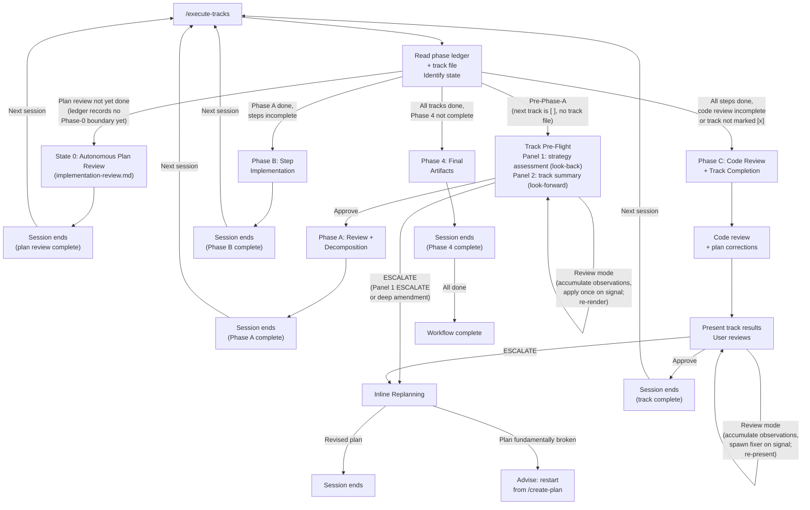

# Execution Workflow

<!--Document index start-->

| Section | Roles | Phases | Summary |
|---|---|---|---|
| §Overview | orchestrator,planner | any | What the execution workflow is and how its phases compose. |
| §Terminology: Phases 0/1/2/3/4 vs Phases A/B/C | any | any | Disambiguates the numeric planning phases from the A/B/C per-track sub-phases. |
| §Session Lifecycle | orchestrator | 2,3A,3B,3C,4 | How one /execute-tracks session starts, advances tracks, and ends. |
| §Startup Protocol (Auto-Resume) | orchestrator | 2,3A,3B,3C,4 | State detection at startup: resume from the phase ledger and track files (a multi-track change also reads the plan). |
| §Track Pre-Flight (Strategy Assessment + Track Summary) | orchestrator | 3A | Per-track strategy check and summary before review and decomposition. |
| §Cross-Track Impact Monitoring | orchestrator | 3B,3C | Watching for changes that ripple into upcoming tracks. |
| §Session Boundary Rules | orchestrator | 2,3A,3B,3C,4 | When to end a session and what to record before stopping. |
| §When to end a session | orchestrator | 2,3A,3B,3C,4 | Triggers that should close the current session cleanly. |
| §Context Consumption Check | orchestrator | 2,3A,3B,3C,4 | Context-window level table and the actions each level demands. |
| §What to do before ending a session | orchestrator | 2,3A,3B,3C,4 | State to persist so the next session resumes without loss. |
| §User Interaction Model | orchestrator | 2,3A,3B,3C,4 | When the orchestrator pauses for user input versus proceeding autonomously. |
| §Failure Handling | orchestrator | 3B,3C | How the orchestrator reacts to implementer failures and gate misses. |
| §Inline Replanning (ESCALATE) | orchestrator | 3A,3C | The ESCALATE back-edge that re-opens planning mid-execution. |
| §Track Skip (`[~]`) | orchestrator | 3A | Marking a track skipped and the conditions that justify it. |
| §Track Completion Protocol | orchestrator | 3C | Steps to close a track: episode, marks, progress update. |
| §Final Artifacts (Phase 4) | orchestrator,final-designer | 4 | Producing the axis-derived durable artifacts with the adversarial-verdict fold; the promotion and cleanup commits. |
| §Conventions | orchestrator | any | Pointer to the shared conventions this workflow relies on. |

<!--Document index end-->

## Overview
<!-- roles=orchestrator,planner phases=any summary="What the execution workflow is and how its phases compose." -->

This is the session entry point for Phase 3 execution. You are a single agent
that reads the plan, determines where execution left off, and either runs
the Track Pre-Flight gate (strategy assessment + track summary) or
resumes track execution.

There are no agent teams or sub-teams. You execute tracks directly. Sub-agents
are used for two distinct purposes:

1. **Self-contained review tasks** (technical/risk/adversarial
   reviews, step-level dim review, track-level code review) where
   fresh perspective or parallel execution is valuable.
2. **Code-touching implementation work** delegated to the
   **implementer** sub-agent. The implementer runs at two levels:
   `level=step` for Phase B per-step implementation
   (`step-implementation.md`) and `level=track` for Phase C
   per-iteration review-fix application
   (`track-code-review.md`). Both share the same rulebook
   (implementer-rules.md:implementer:3B,3C) and prompt
   template; the level switch is a single variable input. The
   orchestrator never edits source files itself in either Phase B
   or Phase C — Maven, Spotless, source-file reads, and IDE traffic
   are absorbed by the implementer's context.

> **House style for chat-scale prose.** User-facing prose produced from this file (status updates, escalation prompts, replanning summaries, review-mode loop turns, handoff notes, whichever apply) follows the AI-tell subset of `.claude/output-styles/house-style.md`: `## Banned sentence patterns`, `## Banned analysis patterns`, `## Orientation`, and `## Plain language`. Structural rules (`§ BLUF lead`, `§ Structural rules` for the ≤200-word section cap, `§ Document-shape rules (design / ADR-specific)`) do not apply to chat-scale prose. See conventions.md:any:any `§1.5` for the workflow-level anchor and tier mapping.

### Terminology: Phases 0/1/2/3/4 vs Phases A/B/C
<!-- roles=any phases=any summary="Disambiguates the numeric planning phases from the A/B/C per-track sub-phases." -->

The overall workflow has five phases:
- **Phase 0 (Research)**: `/create-plan` — interactive research and exploration (same session as Phase 1 design authoring)
- **Phase 1 (Planning)**: `/create-plan` — design-first, split into two
  sub-phases that run in one `/create-plan` invocation:
  - **Step 4a (design authoring)**: author and review `design.md` via
    `edit-design` (`phase1-creation`), informed by Phase 0 findings. The
    review runs adversarial first, then cold-read. The design freezes and is
    committed (`Add initial design`) when the review passes (or the user
    accepts open risks); that freeze-and-commit is the logical gate and the
    crash checkpoint, and the flow continues into Step 4b in the same
    invocation.
  - **Step 4b (plan derivation)**: in the same `/create-plan` invocation,
    derive the implementation plan and track files from the frozen
    `design.md`. `/create-plan` auto-resumes here only as crash recovery —
    when a prior invocation ended after the design commit but before the plan
    derived (`design.md` committed and clean, `implementation-plan.md`
    absent).

  The Step 4a → Step 4b transition no longer crosses a session boundary: the
  context isolation that boundary once forced is supplied by sub-agent
  authoring, since Step 4b derives the plan through a fresh `design-author`
  spawn that reads the frozen committed design regardless of session, and the
  by-reference contract keeps the drafted document out of the orchestrator's
  context. The collapse depends on by-reference holding; if it cannot, the
  boundary is retained. Full flow in `create-plan/SKILL.md` Step 1c / Step 4
  and `planning.md` §Design Document.
- **Phase 2 (Implementation Review)**: runs **autonomously** as the first
  phase of `/execute-tracks` when the startup protocol detects State 0
  (the phase ledger records no phase boundary past the Phase-0→1 gate; D3).
  Two-step review:
  (1) consistency review (design doc ↔ code ↔ plan, autonomous classifier
  with user escalation only for design decisions),
  (2) structural review (plan-internal quality, autonomous classifier).
  Optionally re-invoked via `/review-plan` for manual re-runs after inline
  replanning. Full orchestration in `implementation-review.md` (loaded
  on-demand only when State 0 is active).
- **Phase 3 (Execution)**: `/execute-tracks` — implement and review tracks
- **Phase 4 (Final Artifacts)**: `/execute-tracks` (State D) — produce the axis-derived durable artifacts (`design-final.md` iff a design exists; `adr.md` iff a track reconciled ≥ medium; otherwise a two-line PR-description verdict fold) per `prompts/create-final-design.md`

Within Phase 3, each track goes through three sub-phases:
- **Phase A**: Review + Decomposition (`track-review.md`)
- **Phase B**: Step Implementation (`step-implementation.md`)
- **Phase C**: Code Review + Track Completion (`track-code-review.md`)

**Each session handles exactly one sub-phase of one track.** After completing
a sub-phase, the session ends and the user re-runs `/execute-tracks` to
start the next sub-phase with fresh context. This prevents context
dilution — review context doesn't clutter implementation, and implementation
context doesn't bias the code review.

Phase C includes both the track-level code review and track completion
(episode compilation, user approval, plan file update) in a single session.
This ensures the agent retains full context of which findings were fixed,
which were deferred to other tracks, and what plan corrections were made —
all of which feed into an accurate track episode.

Between sessions, the track file's **Progress** section and step episodes
bridge context. The user clears the session and re-runs `/execute-tracks`
at every phase boundary.

---

## Session Lifecycle
<!-- roles=orchestrator phases=2,3A,3B,3C,4 summary="How one /execute-tracks session starts, advances tracks, and ends." -->



Each session handles **one phase of one track**. Phase boundaries are
mandatory session boundaries — the user clears context and re-runs
`/execute-tracks` after each phase completes. This keeps each session
focused: review context doesn't dilute implementation, and implementation
context doesn't bias code review.

The Track Pre-Flight gate's Panel 1 strategy assessment for a
just-completed track happens at the **start of the next session**,
not the end of the current one — this gives fresh perspective on
cross-track impact.

---

## Startup Protocol (Auto-Resume)
<!-- roles=orchestrator phases=2,3A,3B,3C,4 summary="State detection at startup: resume from the phase ledger and track files (a multi-track change also reads the plan)." -->

Startup is a single dispatch over one JSON blob. Run
`.claude/scripts/workflow-startup-precheck.sh --mode full` once at
turn 1 and route on its output; the script does the branch-divergence
detection, the workflow-SHA drift walk (and its one autonomous
normalization commit), the pending-handoff scan, and the resume-state
computation that this protocol used to spell out inline. The
`emit_json` function in that script is the authoritative field
contract — cite its keys, not any frozen design draft. The gate
*resolution* prose still lives in the reference docs
(`branch-divergence-check.md`, `workflow-drift-check.md`); the
script reports the facts, the agent presents the choice.

A **non-zero script exit** is halt-and-surface, never resume: the
script emits no JSON on a usage error (exit 2), a malformed-checkbox
parse error (exit 3), or an aborted normalization (exit 1). On any
non-zero exit, surface the stderr diagnostic to the user and stop —
do not fall back to re-deriving state, and do not treat a missing
`state` as State 0. The script's no-JSON-on-error contract is total;
a parsed JSON blob is the only license to dispatch.

The dispatch order mirrors the old numbered protocol — divergence,
then drift, then handoffs, then state routing.

1. **Read the plan file for orientation, when present.** When the track
   count exceeds one (`tracks` > 1) an `implementation-plan.md` exists:
   read `docs/adr/<dir-name>/_workflow/implementation-plan.md` (the
   thinned derived-mirror plan) for cross-track orientation; per-track
   files at `plan/track-N.md` load later, when a track enters Phase A or
   its description is amended. For a single-track change (`tracks=1`) there
   is **no plan** (D2): orient from the phase ledger and the single
   `plan/track-1.md`. The
   script computes `state` from the **phase ledger** tail (D3), not from
   plan checkboxes — the ledger owns the top-level phase and active track,
   the track file's `## Progress` owns the within-track sub-state (the
   two-level resume). The agent re-reads the plan (where it exists) to
   inform the user.

2. **Present the divergence gate** from `divergence`. This is turn-1
   work, before any per-commit push — including the handoff-resolution
   commits below. A diverged branch left undetected makes every
   `git push` reject silently and defeats the "push every commit"
   safety net (`commit-conventions.md` § Push every commit).
   - `divergence.detected == true` (both `ahead` and `behind` are
     non-zero counts): load
     branch-divergence-check.md:orchestrator:2,3A,3B,3C and present its
     three resolutions (local-authoritative, remote-authoritative,
     defer). **No default is picked** — the user chooses. The script
     detected; the reference doc owns the resolution UX.
   - `divergence.skipped == true`: no gate. `skip_reason` is
     `"no-upstream"` (branch has no upstream tracking ref) or
     `"fetch-failed"` (offline, removed remote, auth failure, or the
     startup `timeout 10 git fetch` elapsed). Both are normal — the
     per-commit push re-check catches a divergence that a stale fetch
     missed. Proceed.
   - `divergence.detected == false`, not skipped: the branch
     fast-forwards in at most one direction. Proceed.

3. **Present the drift gate** from `drift`. The script ran the
   `conventions.md` `§1.6(h)` artifact walk before steps below read
   those files, so a user-driven migration changes the on-disk
   `_workflow/**` shape first. Branch on `drift.detected` first, then
   sub-branch the `detected == true` kinds:
   - `drift.detected == false` (either `kind` null, meaning no
     stampable artifact on disk, or `kind == "stamped"`, meaning every
     stamp is already current — the steady state for an up-to-date
     branch): no actionable drift. No gate; proceed. The script may
     have just normalized the stamps before reporting this state, so
     check the normalization recital bullet below.
   - `drift.detected == true`, `kind == "stamped"`: real drift —
     `commit_count` workflow commits sit past the stamp base
     (`base_sha`), with `first_commits` carrying the first ten
     `{sha, subject}`. Load
     workflow-drift-check.md:orchestrator,planner:2,3A and force its
     Migrate now / Defer / Suppress pick (no default). It also owns the
     Remote-authoritative re-entry note.
   - `drift.detected == true`, `kind == "unstamped"`: one or more
     artifacts carry no line-1 stamp. Drift is signalled
     unconditionally; route to the `/migrate-workflow` bootstrap that
     gathers a base SHA for the unstamped set. The script never prompts
     (`conventions.md` `§1.6(d)`); the recovery is user-gated with no
     default — the agent presents the bootstrap and the user supplies
     the base SHA.
   - `drift.detected == true`, `kind == "merge-base-failed"`: a stamp
     sits on a pruned or unreachable commit. Treat as the unstamped
     path — the `conventions.md` `§1.6(c)` recovery prompt stays
     agent-side and is likewise user-gated with no default (the agent
     surfaces the failing pair and the user supplies the base SHA).
   - **Recite any autonomous normalization.** When
     `drift.normalization_landed == true`, the script already landed
     its one self-authored commit (the no-drift stamp collapse). Read
     it from `actions_taken` — each entry is
     `{action, commit, subject}` (`action` is
     `"normalize-workflow-sha-stamps"`) — and tell the user the commit
     landed. This is the script's only autonomous mutation;
     force-push and reset stay agent-side and user-gated, so
     `actions_taken` never carries them.

4. **Run the handoff-resume protocol** when `handoffs` is non-empty.
   `handoffs` is the array of handoff-file basenames under
   `docs/adr/<dir-name>/_workflow/`, in **`ls -t` most-recent-first**
   order (the script preserves the mtime sort; resolve each basename
   under the known plan dir). Process them in that order. Load
   mid-phase-handoff.md:orchestrator,planner:0,1,2,3A,3B,3C,4 and follow
   its §Resume protocol: re-present the pending decision (or research
   findings) to the user, delete resolved handoff files and their
   secondary pause pointers (the track-Progress `**PAUSED` line for
   A/B/C; for State 0 / Phase 4 the handoff-file deletion is itself the
   clear, since the ledger `paused=` event is append-only), then return
   to state routing. **While any
   handoff is unresolved, the orchestrator MUST NOT spawn sub-agents,
   re-run gate-checks, or recompile episodes** — the resume freeze
   holds until the handoff set is drained. See `mid-phase-handoff.md`
   for the full resume contract.

5. **Route on `state`.** The script computed the resume state from the
   phase ledger tail and the active track file (D3); `state` is
   `{ "phase": "0"|"A"|"C"|"D"|"Done", "substate": <slug>|null }`.
   There is **no `state.track` field** — re-derive the active track this
   way, gated by the track count (`tracks`):

   - **Multi-track** (`tracks` > 1, a plan exists): read the active track
     from the
     **ledger `track` tail** — the same value the script's ledger path
     read to compute `state.substate` (D3), so the track you display and
     the sub-state you route on always name the same track. Cross-check
     it against the plan's `## Checklist` first-`[ ]` walk: in the normal
     flow they agree (the orchestrator appends `track=N` at the same
     boundary it flips track N-1 to `[x]`), and on a mismatch — a missed
     Checklist flip, or a `track=N` append that landed before the prior
     box was flipped — surface the inconsistency to the user rather than
     silently preferring one source.
   - **Single-track** (`tracks=1`, no plan, no Checklist): the active
     track is **`track-1`** by construction — a single-track change has
     exactly one
     track file, which the script's ledger path defaults to when the
     ledger names no track (D10). There is no `## Checklist` to walk, so
     the multi-track cross-check above does not apply.

   Each resume handles exactly **one phase**; end the session after that
   phase.

   - **`phase == "0"`** — plan review has not passed. The phase ledger
     records no phase boundary past the Phase-0→1 gate (or has no ledger
     yet). Load `implementation-review.md` on-demand and follow its
     autonomous loop (consistency review → structural review,
     classifier-driven auto-fix vs. user escalation). The verdict is
     recorded in `plan-review.md` and a ledger phase entry, not a
     `## Plan Review` plan checkbox (D7). State 0 is the
     first gate — plan review completes before any track work. End the
     session after the gate passes; the next `/execute-tracks` re-evaluates
     from State A.
   - **`phase == "A"`** — the active track has no track file
     yet (pre-Phase-A; rare, since `/create-plan` writes every track
     file at Phase 1 and the only track-file-deleting action leaves
     the track `[~]`). For a multi-track change the active track is the
     first `[ ]` Checklist track; for a single-track change the ledger
     recorded a phase before `plan/track-1.md` was written and the active
     track is `track-1` per the track-count-gated re-derivation above. Run
     the Track
     Pre-Flight gate
     (`track-review.md` § Track Pre-Flight), then Phase A in the same
     session. **Panel 1 (strategy assessment) is conditionally
     skipped** via the `**Strategy refresh:**` idempotency check: the
     very first Phase A entry of the plan skips Panel 1 (no anchor
     track); subsequent entries run both panels. The panel skip is
     internal to the gate — State A is the same state either way.
   - **`phase == "C"`** — mid-track resume; the first `[ ]` track has
     a track file. Route on **`state.substate`** (not `phase`):

     | `state.substate` | Resume action |
     |---|---|
     | `decomposition-pending` | Enter `track-review.md` §Phase A Resume (often a no-op since the track file already has its description from Phase 1), then re-run only missing reviews and decompose. |
     | `section-discrepancy` | A roster step is `[x]` with no matching `## Progress` `Step N` entry — the sub-step-7 writer was interrupted between the roster flip (7.1) and the Progress append (7.2). The roster `[x]` flip is the primary "episode written" marker; reconcile the missing Progress entry from the `## Episodes` block before continuing. See `step-implementation-recovery.md` §Phase B Resume → "Crash between sub-step 7 and sub-step 8". |
     | `failed-step` | The roster carries a `[!]` step. Check if a retry `[ ]` step follows — if yes, resume from the retry. If no retry step, present the failed episode to the user. |
     | `steps-partial` | Resume from the next `[ ]` step (see step-implementation-recovery.md:orchestrator:3B §Phase B Resume for orphan-commit recovery). |
     | `steps-done-review-pending` | All steps `[x]`/`[~]`, code review not yet `[x]`. Run Phase C from the current iteration (single-step tracks skip code review but still run track completion — see track-code-review.md:orchestrator,reviewer-dim-track:3C). |
     | `review-done-track-open` | All steps `[x]`/`[~]`, code review `[x]`, track completion not yet recorded (the ledger has not advanced past phase `C` for this track; for a multi-track change the plan track entry is still `[ ]`). Resume track completion — compile the episode, present to the user for approval. |

     The Track Pre-Flight gate is **skipped** on State C resume: the
     track file's four track-level sections (`## Purpose / Big
     Picture`, `## Context and Orientation`, `## Plan of Work`,
     `## Interfaces and Dependencies`) are already authoritative.
   - **`phase == "D"`** — the ledger tail records phase `D` (every track
     complete, Phase 4 pending). Start or resume Phase 4 per
     `prompts/create-final-design.md`: on a fresh entry, start it; on a
     resume (a Phase-4 `paused` event in the ledger), if both final
     artifacts exist, review and complete, otherwise restart from Step 3 of
     `create-final-design.md`. (The plan `## Final Artifacts` checkbox is
     gone — D7; the Phase-4 start/resume signal comes from the ledger
     `phase` tail.)
   - **`phase == "Done"`** — the ledger tail records phase `Done` (Phase 4
     complete). Nothing to resume.

6. **Inform the user** of the auto-resume decision:
   - Which track you're working on and why (or that plan review is
     pending if State 0).
   - If resuming mid-track: which steps are done, which is next.
   - If Phase 4: whether starting fresh or resuming an interrupted session.
   - If State 0: that the autonomous plan review is about to run and
     only design-decision findings will be surfaced.
   - If State A (fresh Phase A entry): that the Track Pre-Flight gate
     will run before reviews start — see `track-review.md`
     §Track Pre-Flight. The gate combines a strategy assessment
     (look-back, when an earlier track has just completed/skipped)
     with the upcoming track's summary (look-forward).
   - If the script landed a normalization commit (step 3): that the
     commit landed and what it did.

   The user can override: reorder tracks, skip a track, or choose a different
   resume point. But by default, you proceed without waiting for confirmation.

---

## Track Pre-Flight (Strategy Assessment + Track Summary)
<!-- roles=orchestrator phases=3A summary="Per-track strategy check and summary before review and decomposition." -->

Triggered at State A (pre-Phase-A — fresh entry). Combines a
backward-looking strategy assessment (when an earlier track has
just completed or been skipped) with a forward-looking summary of
the upcoming track. The user can apply light edits to remaining
tracks, attach clarifications to the upcoming track, or escalate to
inline replanning — all via the conversational review-mode loop (see
review-mode.md:orchestrator,reviewer-dim-track,reviewer-plan:2,3A,3C). The gate runs in the same
session as Phase A; this is the only exception to mandatory phase
boundaries.

**Full protocol:** track-review.md:decomposer,orchestrator,reviewer-adversarial,reviewer-risk,reviewer-technical:3A § Track Pre-Flight

---

## Cross-Track Impact Monitoring
<!-- roles=orchestrator phases=3B,3C summary="Watching for changes that ripple into upcoming tracks." -->

After each step implementation, the Phase B orchestrator performs a
lightweight self-assessment against the plan, fed by the per-step
implementer's `CROSS_TRACK_HINTS` return field. Triggered inside Phase B,
not at startup.

**Full protocol:** step-implementation.md:orchestrator:3B
§Cross-Track Impact Check.

---

## Session Boundary Rules
<!-- roles=orchestrator phases=2,3A,3B,3C,4 summary="When to end a session and what to record before stopping." -->

### When to end a session
<!-- roles=orchestrator phases=2,3A,3B,3C,4 summary="Triggers that should close the current session cleanly." -->

Phase boundaries are **mandatory** session boundaries. Each session handles
exactly one phase:

- **After State 0 (autonomous plan review)** — both consistency and
  structural reviews have passed, the plan / track files / design have
  been fixed (mechanical fixes auto-applied; design decisions resolved
  by the user), the audit summary is written to `plan-review.md`, the
  `phase=A` ledger boundary is appended (D3/D7), and the workflow-update
  commit has been pushed. Session ends. Next session starts Phase A of
  Track 1.

- **After Phase A (review + decomposition)** — track file is written to disk
  with all steps as `[ ]` and `Review + decomposition` marked `[x]`. Session
  ends. Next session starts Phase B.

- **After Phase B (step implementation)** — all steps are implemented,
  tested, and committed. Episodes are written to the track file on disk.
  `Step implementation` is marked `[x]`. Session ends. Next session starts
  Phase C.

- **After Phase C (code review + track completion)** — review is complete,
  plan corrections saved (if any), user approved track results, the
  completion episode is written to the track file's `## Episodes`, the
  ledger completion boundary is appended (and for a multi-track change the
  plan track entry is collapsed and marked `[x]`). Session ends. The next
  session's Track Pre-Flight gate runs Panel 1 (strategy assessment)
  against this track's episode. If the session is interrupted before user
  approval, the next session re-enters Phase C at the track completion
  stage (all phases `[x]` in the track file, but the ledger has not
  recorded this track's completion boundary; for a multi-track change the
  plan track entry is still `[ ]`).

- **After ESCALATE resolution** — if inline replanning produces a revised
  plan, end the session. The next session starts fresh with the revised plan.

- **Context consumption too high** — if an active context check (see
  §Context Consumption Check below) shows usage at `warning` level (≥40%)
  or above, finish the current unit of work, save progress, and end the
  session.

### Context Consumption Check
<!-- roles=orchestrator phases=2,3A,3B,3C,4 summary="Context-window level table and the actions each level demands." -->

At the end of each intermediate action within a phase (i.e., after every
step except the last one), the agent actively checks its context window
consumption. This replaces passive hook-based monitoring with an explicit
check built into the workflow.

**How to check:**

Run:
```bash
cat /tmp/claude-code-context-usage-$PPID.txt
```

The output looks like: `ctx: 7% level=safe`

**Levels:**

| Level | Trigger | Action |
|---|---|---|
| `safe` | <25% | Continue normally. |
| `info` | 25–39% | Continue, but prefer delegating exploration to sub-agents and avoid reading large files. |
| `warning` | 40–49% | **Do not start next unit of work.** Save progress and ask for session refresh. |
| `critical` | ≥50% | **Do not start next unit of work.** Save progress and ask for session refresh. |

**If the file does not exist or the command fails**, treat as `safe` and
continue normally — the statusline script may not have written the file
yet.

**Required behavior at `warning` or `critical`:**

1. **Do NOT start the next unit of work.** No next step (Phase B), no
   next review iteration (Phase C), no further decomposition (Phase A).
2. **Save all work:**
   - Ensure all code changes are committed
   - Ensure all progress is written to the track file on disk
   - Update the **Progress** section in the track file on disk
   - **Write a handoff file** per
     mid-phase-handoff.md:orchestrator,planner:0,1,2,3A,3B,3C,4 if the pause
     leaves mid-phase state the next session cannot re-derive from
     the plan / track files alone. Mandatory for:
     - between-iteration pauses in Phase C;
     - post-decomposition / between-review pauses in Phase A;
     - mid-research pauses in Phase 0 / 1;
     - mid-section pauses in Phase 4;
     - any pause where verbatim re-present text or partial research
       notes would otherwise be lost.

     The handoff file goes under
     `docs/adr/<dir-name>/_workflow/handoff-<phase>.md`, paired with
     a secondary pause pointer (a track-Progress `**PAUSED` line for
     A/B/C; a ledger `paused=` event for State 0 / Phase 4; skipped for
     Phase 0 / 1 — see `mid-phase-handoff.md` §Secondary marker) and a
     cross-reference in `MEMORY.md`. All
     channels are written in a single commit with a bare imperative
     message such as `Pause <phase> for context refresh — write
     handoff`.
3. **Ask the user for a session refresh:**
   - Inform them of current progress and what remains
   - Instruct: "Context window is running low. Please clear the session
     and re-run `/execute-tracks` to continue with fresh context."

This is **mandatory** — the agent must not continue to the next unit of
work when context consumption is at `warning` level or above.

### What to do before ending a session
<!-- roles=orchestrator phases=2,3A,3B,3C,4 summary="State to persist so the next session resumes without loss." -->

- Ensure all code changes are committed
- Ensure all step episodes are written to the track file under
  `_workflow/plan/`, the **Progress** section is up to date, and
  every workflow-file change has been committed (workflow files are
  tracked under `_workflow/` — see `commit-conventions.md`)
- Run **self-improvement reflection** per
  self-improvement-reflection.md:orchestrator,planner:any.
  This is mandatory for every phase (State 0, A, B, C, 4) and runs
  even on early-exit sessions (context warning, ESCALATE,
  two-failure rule). The phase docs invoke it as the second-to-last
  step before "End the session".
- Run `git push` so the branch's draft PR reflects the final state
  of the session (every commit is pushed; this is the safety net
  for unexpected session-end interruptions). If this push is
  rejected, follow `commit-conventions.md` § Push failure handling
  — a non-fast-forward rejection at session-end is the same
  divergence case as during phase work and routes to
  `branch-divergence-check.md` on first occurrence.
- **Report unpushed commits.** Run
  `git rev-list --count @{u}..HEAD` to count commits not yet pushed
  to the tracked remote. If the count is non-zero, the session-end
  summary MUST list both the count and the commits
  (`git log --oneline @{u}..HEAD`) so the user can act before the
  next session. A silent unpushed list defeats the "push every
  commit" safety net (see `commit-conventions.md` § Push every
  commit). If the branch has no upstream, substitute
  `origin/<branch>` and warn the user that upstream tracking is not
  configured.
- **Report deferred workflow drift.** If the Workflow Drift Check
  (see `workflow-drift-check.md`) recorded a Defer resolution in
  this session, read the `Deferred workflow drift: <count> commits
  since <short-stamp-base-SHA>` TaskCreate todo (or, if TaskCreate
  was unavailable, the same two fields held in in-context
  conversation memory) and recite the title verbatim, followed by an
  instruction to run `/migrate-workflow` from this worktree. The
  todo carries only the count and the short stamp-base SHA — no
  subject lines; the user can re-run § Detection's Phase 1 walk plus
  the Phase 2 `git log` for full context. Suppress and Migrate now
  leave no residue; the marker lives in conversation memory (or the
  todo, if one was created) and is discarded when the session ends.
- Inform the user of the session state so the next `/execute-tracks`
  auto-resumes correctly

---

## User Interaction Model
<!-- roles=orchestrator phases=2,3A,3B,3C,4 summary="When the orchestrator pauses for user input versus proceeding autonomously." -->

Everything within a phase is fully autonomous **except design decisions**
(choices affecting architecture, API shape, or behavioral semantics beyond
what the plan prescribes — pause and ask with alternatives + trade-offs).
**Full escalation protocol:** design-decision-escalation.md:implementer,orchestrator:3A,3B,3C

User interaction points:

| When | What you present | What the user decides |
|---|---|---|
| **Session start** | Auto-resume decision (which track, which phase, or State 0 plan review) | Confirm or override |
| **State 0 design-decision findings** | Batched list of CR/S findings the consistency and/or structural sub-agents classified as `design-decision`, with proposed alternatives and recommendation | Resolve each finding (choose alternative, provide guidance, defer) |
| **Track pre-flight (State A, pre-Phase-A)** | Two-panel summary: Panel 1: strategy assessment (look-back: CONTINUE / ADJUST / ESCALATE) when an earlier track has just completed/skipped; Panel 2: upcoming track summary built from the plan-file entry + the track file's four track-level sections (`## Purpose / Big Picture` intro, `## Context and Orientation` current-state framing plus any track-level diagram, `## Plan of Work` step sequencing, `## Interfaces and Dependencies` in-scope / out-of-scope and inter-track dependencies). Panel 1 is skipped on the very first Phase A entry (no anchor track) and on resume when the strategy-refresh line is already on disk. | Three one-step options per `review-mode.md` § Approval-panel contract: **Approve** (accept and start Phase A with any review-mode-accumulated amendments + clarifications); **Review mode** (conversational refinement loop per `review-mode.md` § Flow; Apply executes `EDIT_PLAN` / `EDIT_STEP_DESC` / `SKIP_TRACK`, buffers `CLARIFY`, answers `QUESTION` inline); **ESCALATE** (Panel 1 ESCALATE accepted, or review mode produced a deep amendment) → inline replanning. Skipped on State C resume. |
| **Phase A/B complete (and State 0 complete)** | Phase summary, what was done, next phase | User clears session, re-runs `/execute-tracks` |
| **Cross-track impact** | Which tracks affected, what broke, recommendation | Continue, pause, or escalate |
| **Track complete (end of Phase C)** | Track episode, step episodes, git log of commits, plan corrections | Three one-step options per `review-mode.md` § Approval-panel contract: **Approve** (write the completion episode to the track file + append the ledger completion boundary; for a multi-track change also collapse the plan entry + mark `[x]`); **Review mode** (conversational refinement loop per `review-mode.md` § Flow; on Apply, `FIX_FINDING` items spawn a fresh implementer with `mode=FIX_REVIEW_FINDINGS`, `QUESTION` items are answered inline); **ESCALATE** → inline replanning. |
| **Step failure (2nd attempt)** | What failed twice, what was tried, options | Retry differently, adjust, or escalate |
| **Design decision needed** | Alternatives with trade-offs, recommendation | Choose an alternative or provide guidance |
| **Self-improvement reflection (every session end)** | 0..N proposed YouTrack issues (capped at 3, deduped against existing `project: YTDB tag: dev-workflow` issues), each with title + Bug/Feature type + one-line summary; skipped with a notice when the YouTrack MCP server is unreachable | Pick which proposals to create in YouTrack (numbers, "all", or "none") |

---

## Failure Handling
<!-- roles=orchestrator phases=3B,3C summary="How the orchestrator reacts to implementer failures and gate misses." -->

Step-level failure handling (revert → failed episode → retry or split),
the two-failure rule, and track-level failure escalation are all triggered
inside Phase B.

**Full protocol:** step-implementation-recovery.md:orchestrator:3B
§Step Failure, §Two-Failure Rule, §Track-Level Failure.

---

## Inline Replanning (ESCALATE)
<!-- roles=orchestrator phases=3A,3C summary="The ESCALATE back-edge that re-opens planning mid-execution." -->

Triggers when the Track Pre-Flight gate produces ESCALATE (Panel 1
strategy assessment ESCALATE accepted by the user, or review mode
produces an `ESCALATE` action item / a Mixed-set Escalate-now per
review-mode.md:orchestrator,reviewer-dim-track,reviewer-plan:2,3A,3C § ESCALATE detection — i.e., the
requested change touches Decision Records, Architecture Notes,
Goals, Constraints, **adding** a new track, or cross-track
interaction surfaces; **removing** a remaining track is light
(`SKIP_TRACK`), not ESCALATE), cross-track impact detects
fundamental assumption failure, or a step failure cannot be
recovered with additional commits. Stops all new steps and enters
a propose → review → iterate cycle.

**Full protocol:** inline-replanning.md:orchestrator:3A,3C

---

## Track Skip (`[~]`)
<!-- roles=orchestrator phases=3A summary="Marking a track skipped and the conditions that justify it." -->

Triggered when a Phase A review sub-agent returns a `skip` severity finding
or the user requests skipping a track at session start / during strategy
refresh. Requires user confirmation — tracks are never skipped autonomously.

**Full protocol:** track-skip.md:orchestrator:3A

---

## Track Completion Protocol
<!-- roles=orchestrator phases=3C summary="Steps to close a track: episode, marks, progress update." -->

Track completion is part of Phase C — it runs in the same session as the
track-level code review, after the review loop and any plan corrections.

**Full protocol:** track-code-review.md:orchestrator,reviewer-dim-track:3C §Track
Completion.

---

## Final Artifacts (Phase 4)
<!-- roles=orchestrator,final-designer phases=4 summary="Producing the axis-derived durable artifacts with the adversarial-verdict fold; the promotion and cleanup commits." -->

After all tracks are complete, a separate session produces the durable
artifacts that survive merge into `develop`. **Which artifacts Phase 4
produces derives from the complexity axes, each carrier tied to the axis
that justifies it (D16; conventions.md:any:any §Per-axis artifact set):**

Each carrier is an **independent** predicate over the axes (not three
mutually-exclusive tiers):

| Carrier | Exists when | Verdict fold |
|---|---|---|
| `design-final.md` (+ `design-mechanics-final.md` if used) | the design gate is yes (a `design.md` exists) | — |
| `adr.md` | ∃ track reconciled ≥ medium | folded into `adr.md` when it exists |
| PR-description verdict summary | no track reached medium (no `adr.md` to write) | folded into the PR description |

`∃ track reconciled ≥ medium` is the durable-ADR boundary: a change with a
medium-or-higher track earns post-merge archaeology under `docs/adr/`
because it has decisions worth recording, while an all-`low` change
documents itself the way any small PR does (its full certificate trail
survives only in the PR's commit history on GitHub). The `adr.md` predicate
reads the **reconciled** per-track tags (the `max(step tags)` values written
to the ledger at the A→C boundary), which are settled by Phase 4. When no
`design.md` exists (`design_gate=no`) there is no `design-final.md` to write;
`adr.md` then carries the architecture decisions and the adversarial verdict
fold alone. The two predicates are independent: the common case pairs
`design-final.md` with `adr.md`, but a rare `design_gate=yes` change whose
tracks all reconciled `low` produces `design-final.md` with no `adr.md` (its
decisions live in the design's D-records), and an all-`low` no-design change
produces neither and folds the verdict into the PR. The old tiers map cleanly —
a former `lite` whose work was all-`low` now drops `adr.md`, a former
single-track change that reached `high` now gets one — and the design+single
cell (`design_gate=yes`, one track) is representable for the first time as
`design-final.md` + `adr.md` with no plan.

**The verdict fold (D10/D16).** The Phase 4 cleanup deletes the research
log for every change, so before the cleanup `git rm` runs, Phase 4 folds the
log's **resolved adversarial gate verdicts** into the change's durable
carrier. The fold reads `research.md`'s `## Adversarial gate record`
section (Track 1's canonical verdict carrier), matching the latest dated
heading per that section's gate-record cadence, and copies the
**verdict / status only** — never decision content (S2: the Phase-4 fold
is the one sanctioned non-decision-content read of the log). When an
`adr.md` exists the fold lands there; otherwise it lands as a two-line
summary in the PR description.

Phase 4 therefore lands, keyed on whether a durable `docs/adr/` carrier
exists (`design-final.md` and/or `adr.md`) and the modification class:

- **Carrier exists, non-workflow-modifying** — two commits (final-artifacts
  with the fold, then cleanup).
- **Carrier exists, workflow-modifying** — three commits (promote-staged-
  workflow, then final-artifacts with the fold, then cleanup).
- **No carrier (all-`low`, no design), non-workflow-modifying** — one commit
  (cleanup only); the fold goes in the PR description, no `docs/adr/`
  final-artifacts commit.
- **No carrier (all-`low`, no design), workflow-modifying** — two commits
  (promote-staged-workflow, then cleanup); the shed removes the fold's
  `adr.md` home and the final-artifacts commit, not the rest of Phase 4.
  Promotion still runs.

The directory-presence guard is `docs/adr/<dir-name>/_workflow/staged-workflow/.claude/`
per conventions.md:any:any `§1.7(c)` *Detection rule*: when
the staged subtree exists, the promotion commit fires; when it is
absent (the default), Phase 4 skips the promotion commit. The promotion
bash itself, the divergence sanity check, and the exact commit
message prefix live in `prompts/create-final-design.md` § Step 4.

1. **Promote-staged-workflow commit** (workflow-modifying plans only).
   When `docs/adr/<dir-name>/_workflow/staged-workflow/.claude/` exists,
   copy the staged subtree onto the live `.claude/workflow/`,
   `.claude/skills/`, and `.claude/agents/` paths, then commit with the
   message prefix
   `Promote workflow changes from docs/adr/<dir-name>/_workflow/staged-workflow`
   per `conventions.md` `§1.7(e)` and the implementer-rules
   live-workflow-path gate's allow-clause. The Phase 4 prompt at
   `prompts/create-final-design.md` § Step 4 carries the full bash,
   the directory-presence guard, and the pre-promotion divergence
   check that halts when the branch has diverged from `develop` per
   `conventions.md` `§1.7(f)` *Rebase-precedes-promotion*. When the
   guard fails, the step is a silent no-op and Phase 4 stays in the
   two-commit shape.
2. **Final-artifacts commit** (when a durable `docs/adr/` carrier exists —
   `design-final.md` when the design gate is yes, `adr.md` when ∃ track
   reconciled ≥ medium, or both; skipped only when neither exists, i.e. an
   all-`low` no-design change). First, when an `adr.md` is being written,
   **fold the resolved adversarial gate verdicts** from
   `research.md`'s `## Adversarial gate record` (latest dated heading,
   verdict/status only) into it. Then stage the change's artifacts
   (`design-final.md` + `design-mechanics-final.md` if applicable when a
   design exists; `adr.md` when ∃ track ≥ medium — either or both) and
   commit with the
   message defined in `prompts/create-final-design.md` § Step 5; push.
   That executor still keys its carrier selection off the tier table until
   the create-final-design re-key lands onto the axes — both files' staged
   edits promote together in the single Phase-4 commit (conventions.md:any:any
   `§1.7(e)`), so the staged workflow is consistent at promotion. The fold
   runs **before** the cleanup
   `git rm` below deletes the log,
   so the verdict trail is captured in the durable carrier first. When no
   `adr.md` exists the verdict fold has no `adr.md` home: it
   is a two-line gate-verdict summary written into the PR description (the
   squash-merge carries it into `develop`'s `git log`), authored before
   the cleanup commit — and when no `design-final.md` exists either, there is
   no final-artifacts commit at all.
3. **Cleanup commit.** Run `git rm -rf docs/adr/<dir-name>/_workflow/`
   followed by `rm -rf docs/adr/<dir-name>/_workflow/`
   to remove every working file under the `_workflow/` subtree
   (plan, `design.md` if present, `design-mechanics.md`, the research log,
   track files, per-track review files under `plan/track-N/reviews/`,
   design-mutations log, and the staged subtree if present). `-f`
   force-deletes the tracked-but-modified `design-mutations.md`; the
   follow-up `rm -rf` clears the untracked cold-read output, per-round
   params, and `.pyc` remnants under `staged-workflow/` that `git rm`
   never reaches. The blanket recursive `git rm -rf` sweeps the tracked
   review-file directories automatically, and the follow-up `rm -rf`
   removes the untracked remnants; no `plan/*`-globbing removal is needed
   (and would risk catching the `plan/track-N.md` files). Both deletions
   run inside this one step, so the cleanup stays a single commit. Commit
   with a message such as `Remove workflow scaffolding`. Push. This commit
   runs for **every** change.

The end-of-session self-improvement reflection runs after the final
Phase 4 commit lands — it creates any approved proposals as YouTrack
issues under `YTDB` with the `dev-workflow` tag and produces **no
commit** on the branch (the YouTrack sink replaces the retired local
`workflow-issues/` buffer). See
self-improvement-reflection.md:orchestrator,planner:any.

After every Phase 4 commit is pushed and reflection has run, **inform
the user that Phase 4 is complete and stop**. If reflection created
any YouTrack issues, list their ids in the completion message. The
user manually flips the draft PR to "ready for review" when satisfied —
Claude does not run `gh pr ready`.

Phase-4 progress is tracked by the phase ledger (D3/D7): the tail
records phase `D` while Phase 4 is pending and phase `Done` once the
final commit lands (see the `phase == "D"` / `phase == "Done"` rows in
the Startup Protocol above). The plan's `## Final Artifacts` section is
gone under the derived-mirror model (D5/D7), so the Phase-4 start/resume
signal reads the ledger `phase` tail and the track-completion episode is
canonical in the track file's `## Episodes`
(track-code-review.md:orchestrator,reviewer-dim-track:3C § Track
Completion), not the plan checkbox.

**Full instructions:** prompts/create-final-design.md:final-designer:4

---

## Conventions
<!-- roles=orchestrator phases=any summary="Pointer to the shared conventions this workflow relies on." -->

This document defines the session lifecycle and cross-track coordination.
For other workflow components, see:

- **`conventions.md`** — shared formats, glossary, plan file structure,
  scope indicators, review iteration protocol
- **`conventions-execution.md`** — execution-specific: episodes, commit
  format, code review, complexity tiers, decomposition rules
- **`commit-conventions.md`** — commit message type prefixes for session
  resume (review fix, episode, track file updates)
- **`track-review.md`** — Phase A: review + decomposition
- **`step-implementation.md`** — Phase B: step implementation (happy path)
- **`track-code-review.md`** — Phase C: code review + track completion
- **`research.md`** — Phase 0 (research: interactive exploration before planning)
- **`planning.md`** — Phase 1 (planning)
- **`implementation-review.md`** — Phase 2 (autonomous implementation review: consistency + structural). **Loaded on-demand only when State 0 is active** (the startup protocol routes there when the phase ledger records no `phase` boundary yet — D3/D7); also loaded on manual `/review-plan` invocation. Non-State-0 sessions never read this file.
- **`prompts/create-final-design.md`** — Phase 4 (final artifacts: `design-final.md`, `adr.md`)

On-demand reference documents (loaded only when their specific situation arises):
- **`inline-replanning.md`** — full ESCALATE replanning protocol
- **`review-iteration.md`** — iteration limits, finding ID prefixes, gate format (loaded when running any review loop)
- **`code-review-protocol.md`** — two-tier dimensional code review (loaded by step-implementation.md:orchestrator:3B and track-code-review.md:orchestrator,reviewer-dim-track:3C)
- **`plan-slim-rendering.md`** — slim plan rendering for sub-agent contexts (loaded when assembling step-level or track-level review sub-agent prompts)
- **`episode-format-reference.md`** — detailed episode format, rules, examples
- **`design-document-rules.md`** — design document rules, examples, structure
- **`design-decision-escalation.md`** — when/how to escalate design decisions to the user
- **`structural-review.md`** — structural review details (loaded by implementation-review.md:orchestrator,reviewer-design,reviewer-plan:2)
- **`track-skip.md`** — full track skip protocol (when `[~]` is triggered)
- **`branch-divergence-check.md`** — the three-resolution divergence gate the Startup Protocol presents when `divergence.detected` is true (detection itself is the script's `--mode full`; this doc owns the local-authoritative / remote-authoritative / defer resolution UX); also re-routed to from `commit-conventions.md` § Push failure handling on the first non-fast-forward rejection in the session
- **`workflow-drift-check.md`** — the three-resolution drift gate the Startup Protocol presents when `drift.kind` is `stamped` with `detected` true (detection and the one autonomous normalization commit are the script's `--mode full`; this doc owns the Migrate now / Defer / Suppress resolution UX); the Remote-authoritative re-entry contract is one-sided pending a symmetric edit to `branch-divergence-check.md`; see the gate file's `## After the choice` section, *Remote-authoritative re-entry — forward-looking note* paragraph
- **`review-agent-selection.md`** — characteristic-based review agent selection (loaded by step-implementation.md:orchestrator:3B and track-code-review.md:orchestrator,reviewer-dim-track:3C)
- **`risk-tagging.md`** — per-step risk criteria and lifecycle (loaded by `track-review.md` during Phase A decomposition; loaded by `step-implementation-recovery.md` only on the rare Phase B upgrade path; **not** loaded by Phase B normal execution or by Phase C — those phases consume the per-step inline `risk:` token from the `## Concrete Steps` roster line directly)
- **`implementer-rules.md`** — Phase B per-step implementer sub-agent rulebook (loaded only by the implementer; orchestrators do not load it)
- **`step-implementation-recovery.md`** — Phase B Resume, non-`SUCCESS` orchestrator handlers, post-commit rollback handlers, Step Failure formats, Two-Failure Rule, Track-Level Failure (loaded by the Phase B orchestrator only when orphan commits are detected at startup or a non-`SUCCESS` implementer return arrives)
- **`ephemeral-identifier-rule.md`** — full forbidden / allowed / rewrite rule for durable content (loaded only when about to author source code, tests, Javadoc, PR title/body, `design-final.md`, or `adr.md`; the `§2.3` stub in `conventions-execution.md` plus the pre-commit gate regex are usually enough)
- **`self-improvement-reflection.md`** — mandatory final step at the end of every session run by a calling skill that opts into reflection (`/execute-tracks` today; `/migrate-workflow` from this work forward). Phase identifiers depend on session-type (see `self-improvement-reflection.md` §Inputs). Reflects on workflow-process friction encountered in the session and creates approved proposals as YouTrack issues under `YTDB` with the `dev-workflow` tag (or skips with a notice when the YouTrack MCP server is unreachable). Produces no commit. Loaded on-demand at end-of-session by every phase doc.
