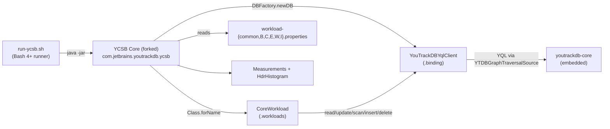

---
source_files:
  - ycsb/src/main/**
  - ycsb/workloads/*.properties
  - ycsb/run-ycsb.sh
  - ycsb/pom.xml
  - ycsb/README.md
related_docs:
  - docs/adr/ycsb/design.md
  - docs/adr/ycsb/design-final.md
---

# YCSB Benchmark Module — Architecture Decision Record

## Summary

The `ycsb/` Maven module packages a forked YCSB (Yahoo Cloud Serving
Benchmark) core framework together with a YouTrackDB YQL driver into a
single uber-jar. It benchmarks YouTrackDB's underlying storage paths
(read, write, scan, insert, delete) with industry-standard YCSB workloads
and a curated set of read/write mixes (workloads B, C, E, W, I). A
companion Bash runner (`run-ycsb.sh`) automates build, load, snapshot,
and two-pass workload execution (max-throughput + coordinated-omission-
corrected latency) with snapshot/restore between runs for reproducibility.

## Goals

1. **Fork and modernize YCSB core** — bring the ~50-class framework to
   Java 21, replace Jackson 1.x with 2.x, remove the abandoned HTrace
   dependency, and convert TestNG tests to JUnit 4. *(Implemented as
   planned; 8 test files / 20 tests converted.)*
2. **Implement a YQL-based driver** (`YouTrackDBYqlClient`) that
   exercises storage paths directly, not the Gremlin translation layer
   or graph traversal. *(Implemented as planned.)*
3. **Provide five named workloads** — B (95/5 read/update), C (100%
   read), E (95% scan + 5% insert), W (50/50 read/update), I (20% read /
   80% insert). *(Implemented. Workload I ended up as 20/80 — an
   insert-dominated mix — matching the "insert-burst" intent.)*
4. **Deliver a single-command runner** that builds, loads, snapshots,
   and runs all workloads twice (max throughput + latency pass) with
   snapshot/restore between runs. *(Implemented; 585-line `run-ycsb.sh`.)*
5. **Ship a `ycsb/README.md`** with enough detail for any engineer to
   run benchmarks without reading source. *(Implemented; ~240 lines,
   10 sections including quick start, three execution paths, and a
   summary JSON sample.)*

## Constraints

- **Java 21** (matches the rest of YouTrackDB).
- **Single module** — forked core + YQL driver in one Maven artifact.
- **Storage-level testing only** — simple parameterized YQL; no complex
  queries or graph traversals.
- **Reproducibility** — inserting workloads must not poison subsequent
  runs. Satisfied by directory-level snapshot/restore.
- **Flat YCSB schema** — single `usertable` class with 10 string fields
  × 100 bytes each.
- **Default dataset** — 3.5M records (~3.5 GB on disk, ~7 GB with
  snapshot); 1M operations per workload run. Both configurable.
- **No cloud provisioning** — script runs on the host it's invoked on.
- **`--add-opens` JVM flags** — the runner must supply the same 12
  flags used by the module's test plugin, otherwise YouTrackDB fails to
  initialize.

Relaxations discovered during execution:
- **Workload I was reframed** from "insert-burst" (implied 100% insert)
  to "insert-burst (20% read / 80% insert)"; mixing a small read share
  keeps the key space reachable and gives YCSB meaningful intra-run
  feedback without changing the benchmark's intent.
- **Coverage gate exclusion** — forked YCSB classes and `YouTrackDBYqlClient`
  are excluded from JaCoCo via the `coverage` profile in `ycsb/pom.xml`
  (lines 137–159). The rationale: the forked framework is upstream
  code, not library code under development, and the YQL driver's
  correctness is verified behaviourally by integration tests rather
  than by line-coverage measurement.

## Architecture Notes

### Component Map

- **`run-ycsb.sh`** — orchestrates build, load, snapshot, and per-workload
  two-pass execution. Parses throughput, computes pass-2 target, emits
  per-workload text files and `summary.json`.
- **YCSB Core (forked)** — `Client`, `ClientThread`, `DBWrapper`,
  `Workload`/`CoreWorkload`, `Measurements`, generator and byte-iterator
  families, exporter implementations. Forked from upstream with package
  rename, Jackson 2.x migration, HTrace removal, TestNG→JUnit 4
  conversion.
- **`YouTrackDBYqlClient`** — `extends DB`; static shared handle +
  `ReentrantLock` + `AtomicInteger` reference counting; YQL statements
  for all five CRUD operations; CME-aware retry for update/delete.
- **`CoreWorkload`** — standard YCSB workload; `DiscreteGenerator` picks
  operations by proportion; `ScrambledZipfianGenerator` generates keys
  under the default zipfian distribution.
- **Workload property files** — one shared defaults file plus five
  per-workload files that override only the operation proportions.
- **`Measurements` + HdrHistogram** — `ConcurrentHashMap`-backed
  singleton; the active implementation per operation is
  `OneMeasurementHdrHistogram` with percentiles 50, 95, 99, 99.9.
- **`youtrackdb-core`** — existing, unmodified; consumed as a Maven
  dependency.

### Decision Records

#### D1: Fork YCSB core into the module
- **Decision**: fork upstream YCSB core into the
  `com.jetbrains.youtrackdb.ycsb` package namespace rather than depend
  on `site.ycsb:core:0.17.0`.
- **Status**: Implemented as planned (Track 1, ~50 classes forked).
- **Rationale**: upstream targets Java 8, depends on Jackson 1.x
  (end-of-life) and HTrace (abandoned Apache incubating project), uses
  TestNG, and had its last release in October 2019. Forking unlocks
  Java 21, Jackson 2.x (already in the parent POM), and JUnit 4
  alignment with the rest of the project.
- **Outcome & caveats**:
  - Four adaptation axes — package rename, Jackson 1→2, HTrace removal,
    TestNG→JUnit 4 — were mechanical and fully completed.
  - A number of pre-existing upstream bugs were surfaced during review
    and left deliberately untouched: `NumberGenerator.lastVal` not
    volatile, `RandomByteIterator.reset()` not resetting `bufOff`,
    `HotspotIntegerGenerator` int truncation, `UniformLongGenerator`
    `Math.abs(Long.MIN_VALUE)` negative modulus, `SequentialGenerator
    .lastValue()` ignoring stored value, `DBWrapper.measure()` NPE on
    null `result`, `DBFactory.newDB()` returning null instead of
    throwing. Fixing them is out of scope for a benchmark fork; they
    do not affect the driver or the workload proportions we ship.
  - Forked tests also had pre-existing quality issues (zero-assertion
    tests, tautological assertions, weak distribution checks) which
    were inherited as-is.

#### D2: Single module (no core/binding split)
- **Decision**: ship one `youtrackdb-ycsb` artifact containing the
  forked core *and* the YQL binding, rather than two sub-modules.
- **Status**: Implemented as planned.
- **Rationale**: only one binding exists and is planned; extraction is
  straightforward if a second binding is added.
- **Outcome & caveats**: none — the uber-jar produced by
  `maven-shade-plugin` is the sole deliverable; `createDependencyReducedPom=false`
  avoids deploy-side complications.

#### D3: YQL driver only (no Gremlin driver)
- **Decision**: ship a YQL-only driver; defer any Gremlin-path binding.
- **Status**: Implemented as planned (Track 2).
- **Rationale**: benchmarks target underlying storage mechanics; LDBC
  SNB benchmarks already cover the Gremlin translation layer.
- **Outcome & caveats**: none; `YouTrackDBYqlClient` uses
  `YTDBGraphTraversalSource.yql(...)` and the transactional wrappers
  exclusively.

#### D4: Directory snapshot/restore for workload isolation
- **Decision**: after the load JVM exits, take a filesystem snapshot of
  the database directory; before each workload pass, delete the current
  database and restore from that snapshot.
- **Status**: Implemented as planned (Track 3).
- **Rationale**: workloads E and I mutate the dataset. Re-loading
  3.5M records is expensive; a `cp -a` is seconds on SSD. Snapshot
  restore yields identical starting state regardless of execution order.
- **Outcome & caveats**:
  - Snapshot creation uses **atomic copy-then-rename**: `cp -a` into
    `${SNAPSHOT_PATH}.tmp.$$` followed by `mv` into place. Without the
    temp-then-rename step, a SIGINT during `cp -a` would leave a
    partial snapshot that a later `--skip-load` would silently consume.
  - The restore path uses `rm -rf` + `cp -a`, never in-place overwrite
    — this avoids stale WAL segments being resurrected.
  - Requires ~7 GB of disk (original + snapshot); acceptable on benchmark
    hosts.

#### D5: Two-pass execution per workload
- **Decision**: run each workload twice — pass 1 at `-target 0` for
  max throughput, pass 2 at `int(T × ratio)` with
  `measurement.interval=intended` for coordinated-omission-corrected
  latency.
- **Status**: Implemented as planned (Track 3).
- **Rationale**: a single run cannot accurately measure both throughput
  and latency. 80% of max (default ratio) sits in the latency "knee".
- **Outcome & caveats**:
  - YCSB's `-target` is `Integer.parseInt`ed — the script truncates the
    float target with `awk 'printf "%d"'` rather than passing e.g.
    `9876.5`.
  - Pass 1 throughput may appear in scientific notation for large
    throughputs; all arithmetic runs under `LC_NUMERIC=C` and uses
    `awk` regex that accepts either form.
  - On pass-1 parse failure or non-positive throughput, pass 2 is
    skipped for that workload; other workloads continue.

#### D6 (new): Driver in `binding` sub-package
- **Decision**: place `YouTrackDBYqlClient` in
  `com.jetbrains.youtrackdb.ycsb.binding` rather than the top-level
  `com.jetbrains.youtrackdb.ycsb` package.
- **Rationale**: matches upstream YCSB's convention (bindings live in
  subpackages), keeps the top-level package focused on forked framework
  classes, and leaves room for a future second binding without renaming.
- **Outcome**: workload-common.properties references
  `com.jetbrains.youtrackdb.ycsb.binding.YouTrackDBYqlClient` as the
  `db` property. The README documents the FQCN explicitly.

#### D7 (new): Atomic snapshotting via `cp -a` + `mv`
- **Decision**: create the snapshot into a `.tmp.$$` sibling and rename
  it into place, rather than copying directly to the final snapshot
  path.
- **Rationale**: `set -euo pipefail` + SIGINT combined with a
  `--skip-load` option creates a silent-corruption window: an
  interrupted `cp -a` leaves a partial but non-empty snapshot that a
  subsequent run would treat as authoritative.
- **Outcome**: `rm -rf "${SNAPSHOT_PATH}.tmp."*` at the start of every
  load phase sweeps leftover temp directories from earlier interrupted
  runs.

#### D8 (new): Graceful per-workload failure propagation
- **Decision**: wrap each `run_ycsb` call in `if ! ... ; then continue;
  fi` so a workload that crashes doesn't abort the entire benchmark.
- **Rationale**: `set -e` + a bare `run_ycsb` call causes any non-zero
  exit to terminate the script, discarding results from completed
  workloads. The explicit conditional pattern lets each workload fail
  independently.
- **Outcome**: every `run_ycsb` invocation in the pass-1/pass-2 loop
  is wrapped; a pass-1 parse failure also skips pass 2 and continues.

#### D9 (new): Configurable database type (`ytdb.dbtype`)
- **Decision**: expose `ytdb.dbtype` (DISK or MEMORY) as a driver
  property, default DISK.
- **Rationale**: unit tests can exercise the driver against MEMORY
  storage for speed and for cases where the host lacks write
  permissions; the runner always uses DISK.
- **Outcome**: `YouTrackDBYqlClient.init()` calls
  `DatabaseType.valueOf(props.getProperty(DB_TYPE_PROPERTY, DB_TYPE_DEFAULT))`;
  tests parameterize to MEMORY where appropriate.

### Invariants & Contracts

- **Single shared `YouTrackDB` / `YTDBGraphTraversalSource`** — the
  first thread to reach `init()` creates them under `initLock`;
  subsequent threads reuse the same instances. Verified by
  `YouTrackDBYqlClientTest.testConcurrentInit`.
- **Last-thread cleanup closes resources exactly once** —
  `clientCount.decrementAndGet() == 0` gates the close. Verified by the
  concurrent-init test tearing down with an explicit cleanup
  sequence.
- **Snapshot consistency** — taken only after the load JVM exits, so
  `cleanup()` has closed the database and flushed WAL. Enforced by
  script ordering.
- **Transactional-source discipline** — all writes use the
  callback-provided `tx` parameter inside `executeInTx`. Enforced by
  code review and by construction in the driver.
- **Schema idempotency** — `CREATE CLASS/PROPERTY/INDEX ... IF NOT
  EXISTS` lets re-running against an existing database (e.g. `--skip-load`)
  succeed without errors.

### Integration Points

- **Parent POM `<modules>`** — adds `<module>ycsb</module>`.
- **`YourTracks.instance(dbPath)`** — creates the embedded `YouTrackDB`
  handle.
- **`YouTrackDB.create(dbName, DatabaseType, user, password, "admin")`**
  — creates the database.
- **`YouTrackDB.openTraversal(dbName, user, password)`** — opens the
  shared traversal source.
- **`YTDBGraphTraversalSource.yql(sql, keyValues...)`** — parameterized
  YQL execution.
- **`YTDBGraphTraversalSource.executeInTx(consumer)`** /
  **`computeInTx(function)`** — transactional wrappers.
- **`maven-shade-plugin`** — produces the uber-jar with `Client` as the
  manifest main class; `ServicesResourceTransformer` preserves SPI
  registrations from `youtrackdb-core`.
- **Resource filtering** — `project.properties` is Maven-filtered to
  stamp the module version for the YCSB banner.

### Non-Goals

- Graph-specific workloads (LDBC SNB already covers graph traversal).
- Gremlin API driver (LDBC covers the Gremlin path).
- Remote server benchmarking (the driver is embedded-mode only via
  `YourTracks.instance`).
- Hetzner / cloud provisioning from the script.
- Cross-database comparisons.

## Key Discoveries

These are the non-obvious facts that emerged during implementation and
are worth carrying forward into future work in this area. They aggregate
both step-level (ground-truth) findings and track-level strategic framing.

### Driver & YQL semantics

- **`SELECT FROM usertable` returns Vertex objects**
  (`YTDBVertexImpl`), not Maps. Only explicit field projection (`SELECT
  field0, field1 FROM ...`) returns Map results. The read/scan paths
  therefore use `vertex.properties()` or `vertex.value(field)` rather
  than map lookups.
- **Duplicate-key `CREATE VERTEX` with a UNIQUE index succeeds
  silently** — no exception is raised. The insert error path is only
  reachable via unrelated exceptions (e.g., connection failure); the
  driver cannot distinguish a duplicate-key no-op from a successful
  insert.
- **`executeInTx()` swallows commit-time exceptions** in `finishTx()`.
  CMEs thrown at commit do not propagate to `executeWithRetry()`. The
  retry is effective only for eager conflict detection during command
  execution. This is documented in the driver's class Javadoc.
- **`yql()` takes alternating key/value pairs**, not positional
  parameters: `yql("... WHERE ycsb_key = :key", "key", keyValue)`. An
  odd number of varargs throws `IllegalArgumentException`.

### Workload property semantics

- **The correct driver property is `ytdb.url`**, not `ytdb.path`. The
  original plan used `ytdb.path`, but the driver reads `ytdb.url`. The
  README and runner align with the driver.
- **Run phases must pass `ytdb.newdb=false`** explicitly. The driver
  defaults `ytdb.newdb` to `true`, which would drop the
  snapshot-restored database on every run pass. The runner sets
  `ytdb.newdb=true` only for load and `ytdb.newdb=false` for every
  subsequent pass.
- **Workload FQCN is `com.jetbrains.youtrackdb.ycsb.workloads.CoreWorkload`**
  (the class is in a `workloads` sub-package), and the driver FQCN is
  `com.jetbrains.youtrackdb.ycsb.binding.YouTrackDBYqlClient`. Both
  appear in `workload-common.properties`.
- **`requestdistribution=zipfian` is common to all five workloads** and
  is shared via `workload-common.properties` rather than duplicated per
  file.

### Runner script hardening

- **YCSB's run flag is `-t`, not `-run`**. The script's `run_ycsb()`
  helper translates its own `run` mode into `-t` for the Java CLI.
- **YCSB `-target` is integer-only** (`Integer.parseInt`). Float
  targets computed via `awk` must be truncated (`printf "%d"`) before
  being passed in.
- **`set -e` + bare `run_ycsb` aborts the entire script** on any
  workload failure. Every invocation is wrapped in `if ! run_ycsb ... ;
  then continue; fi` to keep the benchmark alive.
- **`PIPESTATUS` is unreliable inside `if !`**. The helper captures
  the exit code directly rather than reading `PIPESTATUS` through an
  implicit pipeline.
- **`awk -v` avoids shell injection** for interpolating throughput and
  ratio values into arithmetic expressions.
- **Empty-string is the right missing-value sentinel, not `-`**: bash's
  `${VAR:--1}` fires on empty/unset, so using `""` as sentinel lets us
  render `-` in the human table (via `${VAR:--}`) and `-1` in JSON
  (via `${VAR:--1}`) with one set of parse results. Using `-` as
  sentinel produced invalid JSON with bare `-` tokens.
- **The shade plugin produces `original-*.jar` siblings**. The
  uber-jar resolver explicitly excludes `original-*` (and `*-sources`
  / `*-javadoc`) when globbing for the shaded artifact; naïve globs
  were working only by coincidence.
- **Trailing slash on `--db-path` corrupts the snapshot sibling path**
  (`${DB_PATH}-snapshot` becomes `.../-snapshot` relative to a
  directory). The script strips trailing slashes defensively.
- **Partial snapshots from interrupted `cp -a` can survive and be
  reused**. Atomic copy-then-rename plus a temp-sweep on the next load
  run closes this window.

### Test-infrastructure discoveries

- **Test isolation with static mutable state requires `client = null`
  after manual cleanup** — otherwise `@After` tearDown triggers a
  double decrement of `clientCount`, driving it negative. Track 2's
  track-level code review surfaced this as a blocker; all affected
  tests now follow the pattern.
- **`Measurements.setProperties()` must be called before constructing
  `CoreWorkload`** — the workload's full-round-trip integration test
  depends on this ordering.
- **`run-ycsb.sh` is Bash 4+, not POSIX `sh`** — it uses `set -euo
  pipefail`, `BASH_SOURCE`, arrays, and substring parameter expansion.
  The README labels the prerequisite explicitly.

### Forked-framework housekeeping

- **`UnknownDBException` was not in the original fork plan** but is
  required by `DBFactory`/`Client` — it was forked during Track 1.
- **`CoreWorkload` was placed in the `workloads` sub-package** to
  match upstream structure, which also informs the FQCN documented to
  users.
- **The class is `UniformGenerator`** (not `UniformIntegerGenerator` as
  the plan sketched); `UnknownScannerException` does not exist upstream
  and was skipped.
- **Upstream YCSB used both `org.testng.Assert` and
  `org.testng.AssertJUnit`** — argument order differs between the
  two. The TestNG→JUnit 4 conversion required per-file attention.
- **`TestMeasurementsExporter` used Jackson 1.x `ObjectMapper`**; it
  was converted to `com.fasterxml.jackson.databind.ObjectMapper` as
  part of Step 4 of Track 1.
