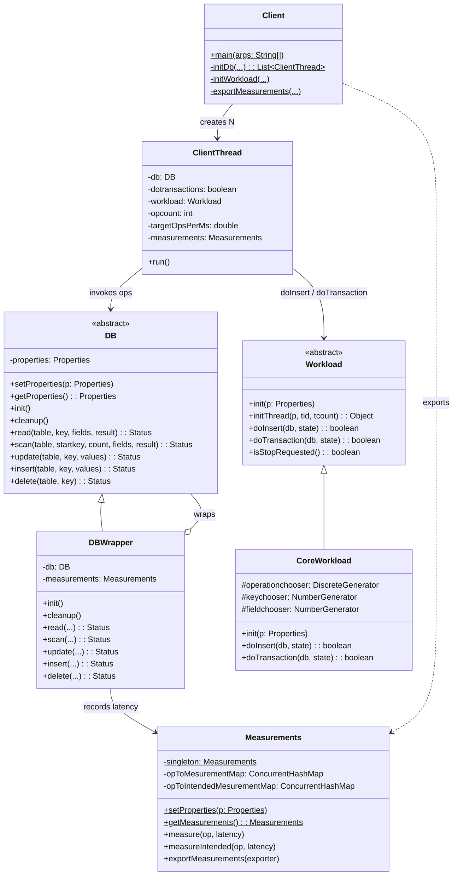
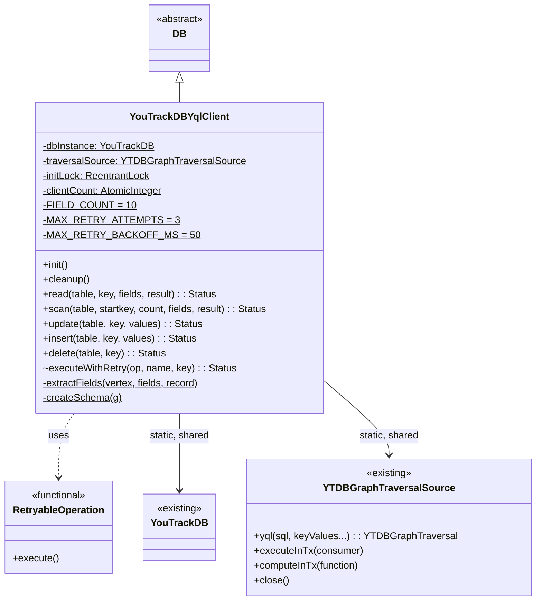

# YCSB Benchmark Module — Final Design

## Overview

The module is a self-contained Maven artifact (`youtrackdb-ycsb`) that packages
a forked YCSB benchmark framework together with a YouTrackDB YQL driver into a
single uber-jar. At runtime, `Client` (`Client.java:276`) spawns N threads —
one per configured worker — each with its own `YouTrackDBYqlClient` instance
wrapped by `DBWrapper` for latency measurement. All client instances share a
single static `YouTrackDB` handle, a single `YTDBGraphTraversalSource`, and a
shared singleton `Measurements` collector. `CoreWorkload` drives operation
selection via a `DiscreteGenerator` using configured proportions, and each
operation is executed as a parameterized YQL statement against the embedded
database.

A companion Bash script, `run-ycsb.sh`, orchestrates the full benchmark
lifecycle: Maven build, data loading, atomic database snapshot, and two-pass
workload execution (max throughput followed by fixed throughput with
coordinated-omission-corrected latency), with snapshot restore between runs.

The implementation matches the original `design.md` in all structural respects.
The notable refinements during execution were:
- Driver class was placed in the `...ycsb.binding` sub-package
  (`YouTrackDBYqlClient.java:17`), not the top-level `ycsb` package.
- `CoreWorkload` lives in `...ycsb.workloads` (mirroring upstream structure).
- The driver exposes six configuration properties (adds `ytdb.dbtype` for
  MEMORY/DISK selection, used in tests).
- All write operations use the callback-provided `YTDBGraphTraversalSource`
  inside `executeInTx(...)`, never the static shared field.
- Workload I proportion is 20% read / 80% insert (workload-I.properties), not
  a 100%-insert burst.

## Class Design

### Forked YCSB Core



The forked core preserves YCSB's architecture with four adaptation axes
applied mechanically across ~50 classes:

- **Package rename** — `site.ycsb` → `com.jetbrains.youtrackdb.ycsb`; imports,
  FQCN strings, and any generated manifest entries updated accordingly.
- **Jackson 1.x → 2.x** — `org.codehaus.jackson.*` replaced with
  `com.fasterxml.jackson.core.*` / `.databind.*`; deprecated
  `JsonFactory.createJsonGenerator()` replaced with `createGenerator()`.
- **HTrace removal** — `Tracer` fields, `TraceScope` wrappers, and
  `scopeString` constants deleted from `DBWrapper` and `Client`; the
  measurement path is unchanged.
- **TestNG → JUnit 4** — `@Test(expectedExceptions = X.class)` converted to
  `@Test(expected = X.class)`; `assertEquals(expected, actual)` parameter
  order normalized; `org.testng.Assert` and `org.testng.AssertJUnit` both
  translated.

Key responsibilities:

- **`DB`** (`DB.java:45`) — Abstract base with `{read, scan, update, insert,
  delete}` plus `init/cleanup`. One instance per client thread.
- **`DBWrapper`** (`DBWrapper.java:34`) — Decorator that measures latency in
  microseconds via `Measurements` for both actual and intended start times
  (`DBWrapper.java:149-164`).
- **`Client`** (`Client.java:276`) — Main entry point: parses CLI, sets
  `Measurements.setProperties`, loads the `Workload` via
  `Class.forName` (`Client.java:501`), spawns N `ClientThread`s via
  `initDb` (`Client.java:401`), joins them, and exports measurements.
- **`ClientThread`** (`ClientThread.java:29`) — Per-thread `Runnable`.
  Drives `workload.doTransaction(db)` or `workload.doInsert(db)` in a tight
  loop, with optional throughput throttling via `LockSupport.parkNanos`
  (`ClientThread.java:162-178`).
- **`CoreWorkload`** (`CoreWorkload.java:94`) — Uses `DiscreteGenerator` to
  pick operation types by proportion (`CoreWorkload.java:921-940`), with a
  configurable `NumberGenerator` (default `ScrambledZipfianGenerator`) for
  keys. Thread-safe and shared across all threads.
- **`Measurements`** (`Measurements.java:29`) — Lazy singleton collecting
  per-operation-type latency via a `ConcurrentHashMap`. The measurement
  implementation is `OneMeasurementHdrHistogram` when
  `measurementtype=hdrhistogram`.

### YouTrackDB YQL Driver



Implementation highlights (`YouTrackDBYqlClient.java`):

- **Static shared state** (lines 90–94): a `ReentrantLock initLock` guards
  one-time init and last-thread cleanup; an `AtomicInteger clientCount`
  tracks live drivers; two `volatile` fields hold the shared `YouTrackDB`
  instance and `YTDBGraphTraversalSource`.
- **`init()`** (lines 97–155): acquires `initLock`; if `dbInstance` is null,
  creates the `YouTrackDB` handle via `YourTracks.instance(url)`, drops and
  recreates the database when `ytdb.newdb=true`, opens the traversal source
  via `db.openTraversal(dbName, user, password)`, and runs `createSchema()`.
  Uses a `success` flag + `finally` block to close resources if
  schema creation throws. Always increments `clientCount`.
- **`cleanup()`** (lines 158–183): acquires `initLock`; decrements
  `clientCount` and — only if the value reaches 0 — closes the traversal
  source and the database, nulling the static fields even on close failure
  (nested `try/finally`).
- **`insert()`** (lines 186–216): wraps a single `CREATE VERTEX usertable
  SET ycsb_key = :key, field0 = :field0, ...` in `executeInTx(tx -> ...)`,
  using the callback's `tx` parameter cast to `YTDBGraphTraversalSource`.
  No retry — upstream YCSB load phase is single-threaded.
- **`read()`** (lines 219–240): uses `computeInTx` and
  `yql("SELECT FROM usertable WHERE ycsb_key = :key", "key", key).tryNext()`.
  On empty returns `Status.NOT_FOUND`; otherwise delegates to
  `extractFields(Vertex, …)`.
- **`scan()`** (lines 243–264): `SELECT FROM usertable WHERE ycsb_key >=
  :startkey ORDER BY ycsb_key ASC LIMIT :count`, then iterates results.
- **`update()`** (lines 267–302): builds dynamic `UPDATE usertable SET ...
  WHERE ycsb_key = :key` under `executeWithRetry()`. Fast-returns
  `Status.OK` when the values map is empty.
- **`delete()`** (lines 305–313): `DELETE VERTEX usertable WHERE ycsb_key
  = :key` under `executeWithRetry()`.
- **`executeWithRetry()`** (lines 330–357, package-private): bounded CME
  retry loop (max 3 attempts, random 1–50ms backoff). On
  `InterruptedException`, resets the interrupt flag and returns
  `Status.ERROR`.
- **`extractFields()`** (lines 370–385): when `fields == null`, iterates
  `vertex.properties()`; otherwise reads each requested field via
  `vertex.value(field)`. Values are wrapped in `StringByteIterator`.
- **`createSchema()`** (lines 398–412): issues `CREATE CLASS usertable IF
  NOT EXISTS EXTENDS V`, `CREATE PROPERTY usertable.ycsb_key IF NOT EXISTS
  STRING`, ten field properties, and `CREATE INDEX usertable.ycsb_key IF
  NOT EXISTS ON usertable (ycsb_key) UNIQUE` — all inside a single
  `executeInTx`.

## Workflow

### End-to-End Benchmark Execution

```mermaid
sequenceDiagram
    participant Script as run-ycsb.sh
    participant Maven
    participant Load as YCSB JVM<br>(load)
    participant FS as Filesystem
    participant Run as YCSB JVM<br>(run)

    Script->>Maven: ./mvnw -pl ycsb -am package -DskipTests -q
    Maven-->>Script: uber-jar at ycsb/target/
    Script->>FS: rm -rf DB_PATH, SNAPSHOT_PATH, *.tmp.*
    Script->>Load: java -jar ... -load -p ytdb.newdb=true
    Load-->>Script: DB on disk, WAL flushed on close
    Script->>FS: cp -a DB_PATH SNAPSHOT.tmp.$$ ; mv -> SNAPSHOT_PATH
    Note over Script: atomic snapshot

    loop For each workload W in [B,C,E,W,I]
        Script->>FS: rm -rf DB_PATH ; cp -a SNAPSHOT_PATH DB_PATH
        Script->>Run: -t -P workload-W.properties -p ytdb.newdb=false -target 0
        Run-->>Script: pass1 text output
        Script->>Script: parse max throughput T (awk)
        Script->>Script: TARGET = int(T × ratio)
        Script->>FS: rm -rf DB_PATH ; cp -a SNAPSHOT_PATH DB_PATH
        Script->>Run: -t -P workload-W -p ytdb.newdb=false -p measurement.interval=intended -target TARGET
        Run-->>Script: pass2 text output with P50/P95/P99/P99.9
    end

    Script->>Script: parse throughput + latency per workload
    Script->>FS: write summary.json, print summary table
```

Each YCSB invocation is a separate JVM (`java -jar ...`) that opens and
closes the database cleanly — the last-thread cleanup in
`YouTrackDBYqlClient.cleanup()` guarantees WAL flush on shutdown, so the
on-disk state is consistent before the snapshot is taken and after every
run.

Key script lines:
- Build and uber-jar resolution: `run-ycsb.sh:332-341` (recognizes
  `youtrackdb-ycsb-*.jar` and explicitly excludes `original-*` sibling
  artifacts produced by the shade plugin).
- Atomic snapshot: `run-ycsb.sh:398-402` (`cp -a` into a `.tmp.$$`
  sibling, then `mv` — prevents partial snapshots from surviving
  interrupted runs).
- Pass 1/2 loop: `run-ycsb.sh:431-490`. Both passes use `ytdb.newdb=false`
  to preserve the snapshot-restored database.
- Throughput parse: `parse_throughput` (`run-ycsb.sh:426-429`) matches
  `[OVERALL], Throughput(ops/sec), <value>`; scientific notation and
  locale decimal separators are handled via `LC_NUMERIC=C awk`.
- Target computation: `awk -v tp=... -v ratio=... 'BEGIN { printf "%d",
  tp * ratio }'` (`run-ycsb.sh:467-468`) — integer truncation satisfies
  YCSB's integer-only `-target` requirement and avoids shell injection.
- Failure handling: each `run_ycsb` call is wrapped in `if ! ... ; then
  continue; fi` so a single workload failure doesn't abort the whole
  script (bypassing the `set -e` behaviour).

### Per-Thread Operation Flow

```mermaid
sequenceDiagram
    participant CT as ClientThread
    participant CW as CoreWorkload
    participant DW as DBWrapper
    participant DRV as YouTrackDBYqlClient
    participant Y as YTDBGraphTraversalSource

    CT->>DW: init()
    DW->>DRV: init()
    Note over DRV: initLock.lock()<br>first thread creates DB,<br>opens traversal, createSchema()<br>clientCount++

    loop opcount times (or until stop)
        CT->>CW: doTransaction(db, state)
        CW->>CW: operationchooser.nextString() → "READ"
        CW->>CW: keychooser.nextValue() → key
        CW->>DW: read("usertable", key, fields, r)
        DW->>DW: ist = measurements.getIntendedStartTimeNs()
        DW->>DW: st = System.nanoTime()
        DW->>DRV: read(...)
        DRV->>Y: computeInTx(tx -> yql("SELECT FROM usertable...", "key", k).tryNext())
        Y-->>DRV: Optional<Vertex>
        DRV->>DRV: extractFields(Vertex, fields, r)
        DRV-->>DW: Status.OK
        DW->>DW: measurements.measure("READ", (en-st)/1000)
        DW->>DW: measurements.measureIntended("READ", (en-ist)/1000)
        DW-->>CW: Status.OK
        CW-->>CT: true
        opt target > 0
            CT->>CT: sleepUntil(start + opsdone × tickNs)
        end
    end

    CT->>DW: cleanup()
    DW->>DRV: cleanup()
    Note over DRV: initLock.lock()<br>clientCount-- ; if 0 close traversal<br>and dbInstance, null statics
```

`DBWrapper.measure()` (`DBWrapper.java:149-164`) records both the raw
`end-start` latency and the *intended-start* latency; the latter is
populated by `ClientThread.throttleNanos` (`ClientThread.java:170-178`)
whenever a target rate is set. With `measurement.interval=intended`, pass
2 reports the coordinated-omission-corrected latency for each operation.

## Thread Safety and Resource Lifecycle

### What

YCSB instantiates one `DB` per thread, but all threads benchmark the same
database. The driver therefore owns shared static state: the `YouTrackDB`
handle, the `YTDBGraphTraversalSource`, a `ReentrantLock`, and an
`AtomicInteger` reference counter.

### Why

- A single database handle avoids duplicated `YouTrackDB.create(...)`
  calls and ensures all threads see the same schema.
- A single `YTDBGraphTraversalSource` amortizes the cost of opening the
  underlying session pool; `yql()` / `executeInTx()` / `computeInTx()` are
  thread-safe per-invocation.
- Reference counting lets each thread's `cleanup()` run independently; only
  the last thread closes the shared resources. This matches YCSB's contract
  that every thread calls `init()` + `cleanup()` exactly once.
- `ReentrantLock` (rather than a `synchronized` block) is chosen because
  `YouTrackDB.create(...)` may re-enter driver code on the same thread;
  `ReentrantLock` is reentrant by default and allows explicit
  `lock()`/`unlock()` framing inside a `try`/`finally`.

### Gotchas

- **Failure-safe init**: `init()` creates the database and traversal source
  *before* publishing them to the static fields. If `createSchema()` or
  any earlier step throws, the partial resources are closed in a `finally`
  block so the next thread's `init()` can retry from a clean state.
- **Last-close via nested finally**: `cleanup()` nulls both `traversalSource`
  and `dbInstance` inside nested `finally` blocks so a close failure
  on the traversal source still releases the database reference
  (`YouTrackDBYqlClient.java:163-176`).
- **Test cleanup double-decrement**: Unit tests that manually call
  `cleanup()` mid-test must then set `client = null` to prevent the
  `@After` tearDown from calling `cleanup()` a second time and driving
  `clientCount` negative. This was surfaced as a blocker in Track 2 and
  captured in the test suite as a standing convention.
- **Transactional source invariant**: inside `executeInTx(tx -> ...)`,
  write operations must use the callback-supplied `tx`
  (cast to `YTDBGraphTraversalSource`), not the static `traversalSource`
  field. The callback's source is bound to the transaction opened by
  `tx.begin()`; using the static field would bypass the transaction.
  The driver honours this across `insert()`, `update()`, `delete()`, and
  `createSchema()`.
- **Silent duplicate inserts**: `CREATE VERTEX` on a key that already
  satisfies the UNIQUE index does *not* throw. Workload I and any concurrent
  insert path therefore cannot distinguish a no-op from a true insert. In
  benchmark practice this is acceptable: YCSB measures latency, not
  correctness of the key space.
- **Eager-only CME retry**: `executeInTx()` swallows commit-time CMEs in
  `finishTx()`. `executeWithRetry()` therefore only catches CMEs thrown
  during command execution — commit-time conflicts surface as silent
  successes. This is documented in the class Javadoc (lines 316–323).

## Snapshot/Restore for Reproducibility

### What

After load completes and the JVM exits, the script atomically copies the
database directory to a sibling snapshot. Before every workload pass, the
current database is deleted and replaced with a fresh copy of the
snapshot.

### Why

Workloads E (5% insert) and I (80% insert) mutate the dataset. Running
them back-to-back without reset would make each workload's results depend
on execution order. Re-loading 3.5M records between runs is prohibitively
slow; a filesystem-level copy (~3.5 GB) finishes in seconds on modern
SSDs and gives an identical starting state every time.

### Gotchas

- **Crash-safe snapshotting**: the script uses `cp -a "$DB_PATH"
  "$SNAPSHOT_PATH.tmp.$$"` followed by `mv` into place
  (`run-ycsb.sh:398-402`). If the script is interrupted mid-copy, the
  partial `.tmp.$$` is cleaned up by the next load phase
  (`run-ycsb.sh:373`) and `--skip-load` never sees it.
- **Trailing-slash hazard**: `DB_PATH="${DB_PATH%/}"` (`run-ycsb.sh:292`)
  strips a trailing slash; otherwise `${DB_PATH}-snapshot` would produce a
  path that violates the sibling invariant.
- **Post-JVM-exit ordering**: the snapshot is taken *after* the load JVM
  exits. Only at that point has `YouTrackDBYqlClient.cleanup()` closed
  the database, flushing WAL and clearing any in-memory dirty pages.
- **`rm -rf` + `cp -a`, not overwrite**: the restore wipes and copies,
  never merges. This avoids leftover WAL segments from the previous run
  resurrecting.

## Two-Pass Execution Model

### What

Each workload runs twice: once at `-target 0` (max throughput) and again
at `-target int(T × ratio)` where `T` is the measured max and `ratio`
defaults to 0.8. The second pass enables `measurement.interval=intended`.

### Why

A single run cannot accurately report both throughput and latency. Max
throughput saturates the system; every operation queues behind the
previous one, so latency numbers are distorted (coordinated omission). A
fixed-throughput pass at 80% of max sits in the "knee" of the latency
curve — loaded enough to stress the system, unloaded enough that latency
reflects service time plus realistic queueing. YCSB's built-in
coordinated-omission correction (enabled by `measurement.interval=intended`)
measures latency from the *intended* start time, not the *actual* start,
so it captures queueing delay that the system couldn't avoid.

### Gotchas

- **Integer-only target**: YCSB's `-target` flag is `Integer.parseInt`ed
  (`Client.java:548`). The script truncates `T × ratio` with `awk
  'printf "%d"'` rather than passing a float.
- **Scientific-notation throughput**: for large throughputs the
  `Throughput(ops/sec)` line may be printed in E-notation; the awk
  parser handles it and downstream arithmetic also runs under
  `LC_NUMERIC=C` to normalize decimal separators.
- **Pass 1 failure fallback**: if pass 1 reports non-positive throughput
  (parse failure or near-zero rate), the script logs an error and skips
  pass 2 for that workload (`run-ycsb.sh:455-460`). Subsequent workloads
  still run — the `continue` keeps the overall benchmark alive.
- **Snapshot restore between passes**: both passes start from the same
  freshly-restored snapshot (`run-ycsb.sh:441` and `run-ycsb.sh:475`);
  the throughput pass may have mutated keys (E, I), so the latency pass
  must start clean.
- **Primary operation for summary**: `primary_operation()`
  (`run-ycsb.sh:509-516`) maps E→SCAN, I→INSERT, otherwise READ. The
  summary table and `summary.json` report latency for exactly that
  operation. Missing values are the empty string in the displayed table
  (rendered as `-` via `${VAR:--}`) and `-1` in JSON (via `${VAR:--1}`).

## Results & Summary JSON

After all workloads run, the script prints a formatted table (Workload /
MaxThroughput / P50 / P95 / P99 / primary op) and writes
`$RESULTS_DIR/summary.json` (`run-ycsb.sh:568-580`). Each entry:

```json
{
  "workload": "B",
  "primaryOperation": "READ",
  "maxThroughputOpsPerSec": 12345.6,
  "p50LatencyUs": 120,
  "p95LatencyUs": 520,
  "p99LatencyUs": 1800
}
```

`-1` is the documented "not available" sentinel for any field that
couldn't be parsed from the underlying YCSB output. Raw per-pass
outputs remain at `$RESULTS_DIR/workload-<W>-pass{1,2}.txt` for manual
analysis.
