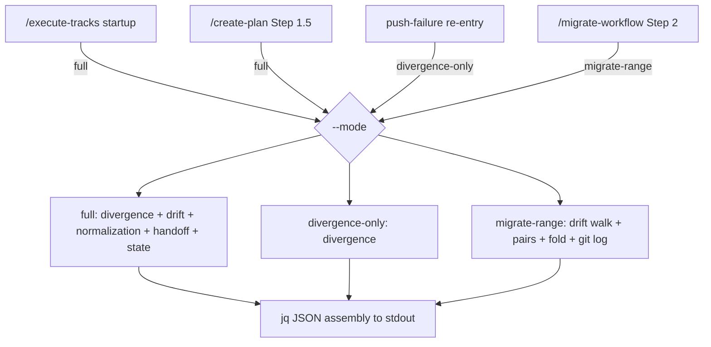
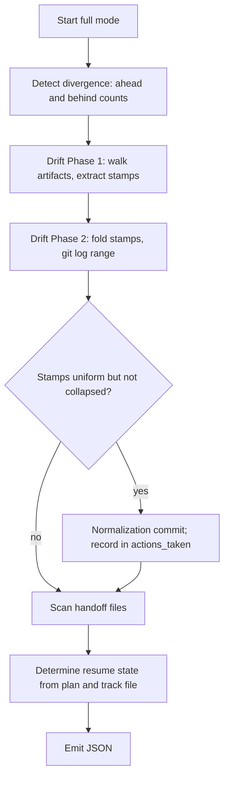
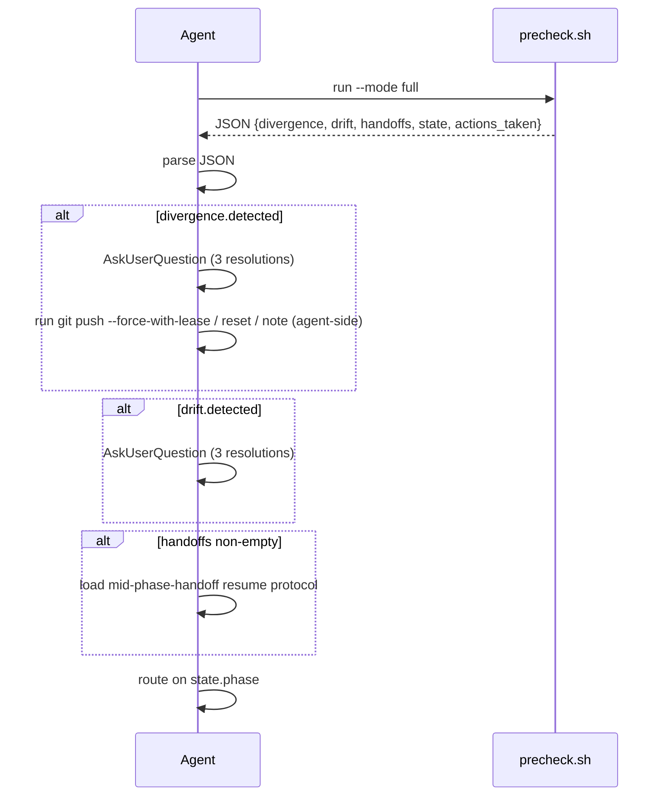
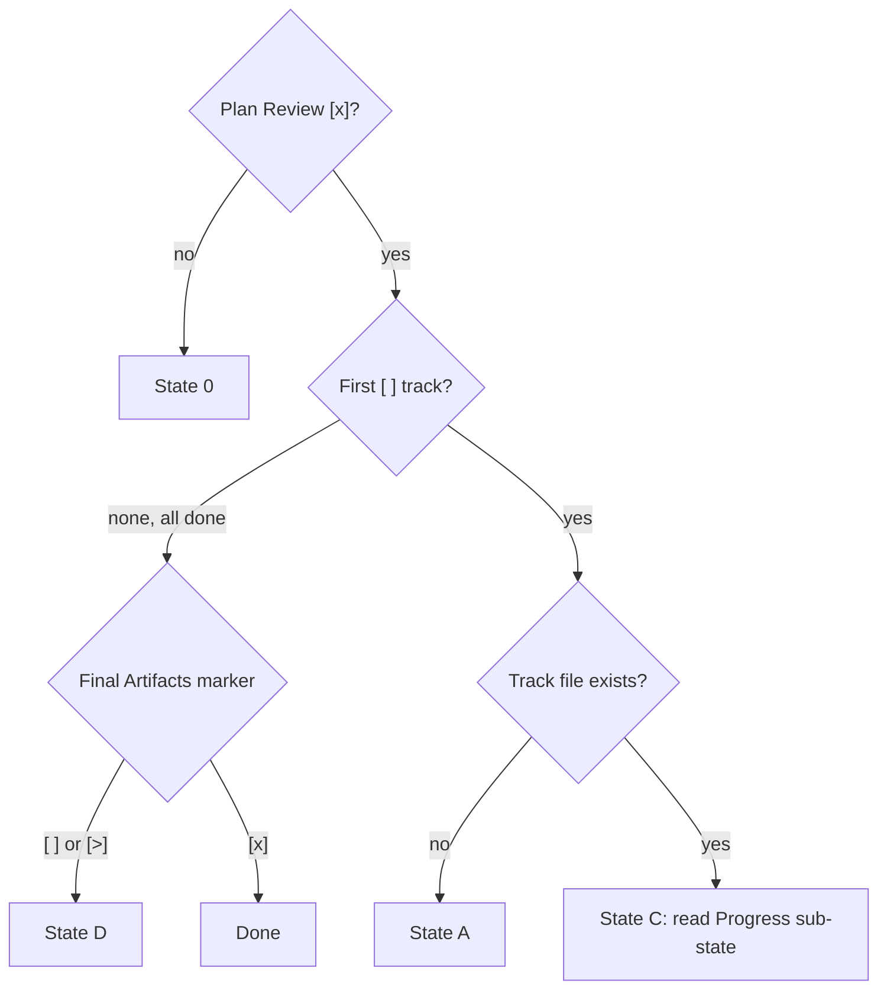

<!-- workflow-sha: 0676e2446f373e969da86da6748c91d442135161 -->
# Workflow startup precheck — Design

## Overview

Today `/execute-tracks` and `/create-plan` read roughly 1,200 lines of gate
prose at every session start. `workflow.md § Startup Protocol`,
`branch-divergence-check.md`, `workflow-drift-check.md`, and the resume bits
of `mid-phase-handoff.md` all load just to answer two questions: which phase
does this session resume into, and is anything blocking it. The bash inside
those files already does the mechanical detection; the agent only interprets
output, prompts the user when a gate fires, and dispatches the resolution.

This design moves that mechanical detection into one script,
`.claude/scripts/workflow-startup-precheck.sh`. The script emits a single
JSON blob describing branch divergence, workflow drift, pending handoffs, and
the resume state, and the agent parses it instead of re-deriving the same
facts from prose. The enabling primitive is that JSON contract: a stable
machine-readable summary that decouples detection (the script's job) from the
conversational gate UX (the agent's job, which the script never owns).

The gate prose shrinks to a short agent-side dispatch rule. Four pieces move
into the script and keep their current on-disk behavior: branch-divergence
detection, the two-phase drift walk, the no-drift normalization commit, and
resume-state determination. The byte-copied artifact walk that
`conventions.md §1.6(h)` owns becomes one script implementation the prose
cites, collapsing four copies to one. The script lives under
`.claude/scripts/`, outside the trees the §1.7 staging convention governs, so
on this branch it is authored live while the six edited prose files are
staged, and both surfaces unify at the Phase 4 promotion.

The rest of this document covers Core Concepts, a Component design diagram and
a Workflow runtime diagram, then one section each for the JSON contract, state
determination, the normalization path, the byte-source consolidation, the
migrate-range reuse, the staging asymmetry, the mid-session re-entry, and the
testing strategy. The D-records (D1 onward) and invariants (S-codes) cited in
each section's References footer are defined in the implementation plan
derived from this design; this design-first draft names them before that plan
exists.

## Core Concepts

This design introduces seven load-bearing ideas. Each is named here and used without re-definition below; the definition pairs the new idea with what it replaces, so the delta from today is visible at a glance.

**Precheck script.** The single bash and jq artifact `workflow-startup-precheck.sh` that runs the mechanical startup detection and emits JSON. Replaces the inline bash scattered across the four gate files. → §"Component design".

**Run mode.** A `--mode {full,divergence-only,migrate-range}` flag that selects which detection runs and which JSON shape the script emits. Replaces the prose-encoded "run all the gate bash in sequence". → §"The JSON contract", §"Mid-session re-entry", §"migrate-range reuse".

**JSON contract.** The stable stdout schema every caller parses. Replaces the agent reading raw git output and interpreting it against a prose table. → §"The JSON contract".

**actions_taken.** The JSON list of mutations the script performed on its own, with no user input. On a startup run that is at most the no-drift normalization commit; force-push and reset stay agent-side because the user gates them. Replaces today's fully silent normalization. → §"No-drift normalization path".

**State determination.** The markdown walk over `implementation-plan.md` and the active track file that computes the resume state and its State C sub-state. Replaces `workflow.md § Startup Protocol` step 5's prose table. → §"State determination".

**Byte-source consolidation.** The artifact-walk bash that `conventions.md §1.6(h)` owns, today copied byte-for-byte into three other places, becomes one script implementation those places call. §1.6(h) keeps the bash as the readable spec. → §"Byte-source consolidation".

**Staging asymmetry.** The script and its tests sit under `.claude/scripts/`, which the §1.7 staging convention does not govern, so they are authored live; the six edited prose files sit under the staged trees and accumulate under `staged-workflow/`. → §"Staging asymmetry".

## Component design

**TL;DR.** One script, three modes, four callers. `full` mode runs the whole startup precheck and is called by `/execute-tracks` and `/create-plan`. `divergence-only` mode re-checks divergence after a mid-session push rejection. `migrate-range` mode emits the stamp-fold range and per-artifact pairs that `/migrate-workflow` Step 2 needs. Every mode ends by emitting JSON through a single jq assembly point.



The script is organized as a set of detection functions and one emit function. `full` mode calls divergence detection, the two-phase drift walk, the no-drift normalization when the drift fold reports uniform-but-uncollapsed stamps, the handoff scan, and state determination, then hands a populated set of shell variables to the jq assembly. `divergence-only` calls only divergence detection. `migrate-range` calls the drift walk and the fold, plus the per-artifact pairing the migration's merge-base-failure recovery needs. Each detection function writes plain shell variables; the jq step is the only place that knows the JSON shape, so the contract has one authoring site.

### Edge cases / Gotchas

- `migrate-range` deliberately skips normalization and state. The migration runs its own session and only needs the range, the pairs, and the unstamped list.
- `full` mode is the only mode that can perform a mutation, the normalization commit. The other two are read-only.
- The four callers are fixed at rollout. A new caller picks an existing mode rather than adding a fourth, unless a genuinely new detection need arises.

### References

- D-records: D1, D2
- Invariants: S2

## Workflow

The runtime has two halves: the script's `full`-mode detection order, and the agent's dispatch loop over the JSON the script returns.



The order matters in one place: normalization runs inside the drift step because it depends on the fold's `BASE_SHA`, and it must land before state determination reads the plan so the working tree is clean when state is computed. Divergence and the handoff scan are independent and could run in any order; the sequence above groups them with the gates they feed.



The agent never sees the gate prose. It runs the script, parses, and presents the conversational gates the script reports without owning. The dispatch order mirrors today's protocol: divergence first, then drift, then handoffs, then state routing.

## The JSON contract

**TL;DR.** `full` mode emits five top-level keys: `divergence`, `drift`, `handoffs`, `state`, and `actions_taken`. `divergence-only` emits `divergence` and `actions_taken`. `migrate-range` emits `drift` extended with per-artifact pairs plus `actions_taken`. jq builds every blob so quoting and escaping are correct by construction.

The `full`-mode shape:

```json
{
  "divergence": { "detected": true, "ahead": 3, "behind": 2, "skipped": false, "skip_reason": null },
  "drift": {
    "detected": true, "kind": "stamped", "base_sha": "abc1234", "commit_count": 5,
    "first_commits": [ { "sha": "abc1234", "subject": "..." } ],
    "normalization_landed": false
  },
  "handoffs": ["handoff-track-4-phaseC.md"],
  "state": { "phase": "C", "track": "track-5", "substate": "Steps [x], code review [x], track still [ ] in plan" },
  "actions_taken": []
}
```

`drift.kind` is one of `stamped`, `unstamped`, or `merge-base-failed`. When `kind` is `unstamped` or `merge-base-failed`, `base_sha`, `commit_count`, and `first_commits` are null or empty, and the agent routes to the `/migrate-workflow` bootstrap per the byte-source consolidation section. `state.phase` is one of `0`, `A`, `C`, `D`, `Done`. `state.substate` is populated only for State C; the section-discrepancy edge carries the literal `section-discrepancy` so the agent runs resume-side reconciliation. `actions_taken` carries one entry when normalization lands (`Normalize workflow-sha stamps to <short>`), otherwise it is empty.

### Edge cases / Gotchas

- `handoffs` preserves the `ls -t` mtime order so the agent resumes most-recent-first.
- `divergence.skipped` is true with a `skip_reason` of `no-upstream` or `fetch-failed` when the upstream or fetch guard trips; `detected` is then false.
- `migrate-range` adds `stamped_artifacts` as `(file, sha)` pairs and `unstamped_files` as a list so the migration can name failing artifacts; it does not emit `state` or `handoffs`.
- jq emits `null` for absent scalars, never the empty string, so the agent's field tests are unambiguous.

### References

- D-records: D2, D3
- Invariants: S2

## State determination

**TL;DR.** The script reads `## Plan Review`, the track checkboxes, and the
active track file's `## Progress` section, then reports `state.phase`
(0/A/C/D/Done) and, for State C, a sub-state string. This is the one piece
that parses markdown rather than git output, so it is the riskiest surface
and the most heavily fixtured.

State follows the same precedence `workflow.md § Startup Protocol` step 5 encodes today. State 0 is checked first: an unchecked or missing `## Plan Review` entry means plan review has not passed. Otherwise the script walks the track checklist in order. The first `[ ]` track decides between State A and State C: no track file means State A (pre-Phase-A), an existing track file means State C (mid-track resume). When every track is `[x]` or `[~]`, the `## Final Artifacts` marker chooses State D (`[ ]` or `[>]`) or Done (`[x]`).



For State C the script reads the track file's `## Progress` checkboxes and maps them to the five sub-states `workflow.md` defines: decomposition pending, steps partial, a failed step, steps done with review pending, and review done with the track still open. The section-discrepancy edge, a roster step flipped `[x]` without its matching Progress entry, is reported as the literal `section-discrepancy` so the agent derives the missing entry from the Episodes block.

### Edge cases / Gotchas

- A `## Plan Review` section that is entirely absent is treated as State 0, identical to an unchecked entry.
- The walk uses the same `[ ]` / `[x]` / `[~]` markers `conventions.md §1.2 § Status markers` defines; a malformed marker is reported as an explicit parse error, not silently coerced.
- State C sub-state detection reads only the active track's file, not every track file, to keep the parse cheap.

### References

- D-records: D7
- Invariants: S1

## No-drift normalization path

**TL;DR.** When every artifact is stamped and the drift `git log` is empty but the stamps sit on more than one distinct SHA, the script rewrites each line-1 stamp to the folded `BASE_SHA` and lands one commit, `Normalize workflow-sha stamps to <short>`. This is the only mutation the script performs without user input, and it is reported in `actions_taken`.

The path is byte-for-byte the existing `workflow-drift-check.md § No-drift normalization` block: recompute the stamped-file list, rewrite line 1 with a printf-and-tail pattern, then verify two diff-shape guards before committing. Guard 1 rejects any hunk that starts off line 1; guard 2 rejects any dirty path inside the active plan's `_workflow/` that the rewrite did not touch. On either mismatch the script restores the stamped files from HEAD and exits non-zero with a diagnostic, landing no commit. On success it stages the stamped files, commits, and appends the commit to `actions_taken`.

### Edge cases / Gotchas

- The path fires only in `full` mode. `divergence-only` and `migrate-range` never mutate.
- The all-or-nothing contract is preserved: either every stamp moves to `BASE_SHA` in one commit, or the working tree is unchanged.
- Surfacing the commit in `actions_taken` is the one behavior delta from today, where the normalization is fully silent. The agent names it in the resume summary; it does not prompt.
- Unrelated dirty files outside the active plan's `_workflow/` do not abort the normalization, matching the existing narrow-scope dirty check on the active plan's subtree.

### References

- D-records: D3
- Invariants: S3

## Byte-source consolidation

**TL;DR.** The artifact-walk bash lives in four places today: `conventions.md §1.6(h)` as the declared source, plus byte-copies in `workflow-drift-check.md § Detection`, the same file's normalization recompute, and `migrate-workflow` Step 2. The script becomes the single implementation. §1.6(h) keeps its bash block as the human-readable spec and gains a pointer to the script; the three copies are replaced by a call to the script.

`conventions.md §1.6` declares itself the single source of truth for the stamp format, the parser idioms, and the walk. Moving the walk entirely out of conventions would weaken that, so the spec stays and the script cites it in a header comment. The contract changes shape: today it is "keep four bash blocks byte-identical", and after this it is "keep the script conforming to the §1.6(h) spec", checkable by a fixture test. The script absorbs the walk, which reads existing stamps at startup and migration, but not §1.6(b), the create-time stamp computation that `/create-plan` and `/edit-design` run when they author artifacts. Reading stamps is a startup concern; computing a new stamp is a creation concern, and the two stay in separate homes.

### Edge cases / Gotchas

- The migration's Step 2 needs the per-artifact `(file, sha)` pairing the drift path does not. That pairing moves into the script's `migrate-range` mode rather than staying as a prose extension.
- `conventions.md` is durable: it survives the Phase 4 cleanup commit into `develop`, so the spec it carries outlives the branch. The script is durable too, since it is committed code, so both spec and implementation persist.
- The anchored stamp regex from §1.6(a1) is the one the script uses; the unanchored variant the design narrative once carried is explicitly rejected.

### References

- D-records: D4, D5
- Invariants: S1

## migrate-range reuse

**TL;DR.** `/migrate-workflow` Step 2 needs the same artifact walk and
stamp-fold the drift gate runs, plus a per-artifact `(file, sha)` pairing for
merge-base-failure recovery, plus the option to fold in a user-supplied
bootstrap SHA for previously-unstamped artifacts. `migrate-range` mode emits
all three; the conversational unstamped-bootstrap prompt stays in the migrate
skill.

`migrate-range` takes an optional `--bootstrap-sha` the migrate skill passes once the user supplies a base SHA for the unstamped set. The mode emits `stamped_artifacts` as `(file, sha)` pairs, `unstamped_files` as a list, `base_sha` from the fold, a `merge_base_failed` flag with the failing pair, and the `git log BASE_SHA..HEAD` commit list. The migrate skill reads those fields instead of re-deriving the walk in prose. The script never prompts: when artifacts are unstamped and no `--bootstrap-sha` is supplied, the mode reports the unstamped list, the skill drives the bootstrap prompt, then re-invokes with the validated SHA.

### Edge cases / Gotchas

- `migrate-range` emits no `state`, `handoffs`, or `divergence` keys; the migration runs in its own session and does not need them.
- The bootstrap SHA is validated by the migrate skill, with the two-subcommand peel-and-reachability check, before it reaches the script, so the script trusts the value it receives.
- The pairing exists only so the migration can name a failing artifact path in its recovery re-prompt; the drift gate, which never re-prompts on a pair, omits it.

### References

- D-records: D2, D4
- Invariants: S1

## Staging asymmetry

**TL;DR.** The plan is workflow-modifying, so its six prose edits accumulate under `staged-workflow/` and promote at Phase 4. The new script and its tests live under `.claude/scripts/`, which §1.7 does not govern, so they are authored live. The two surfaces unify at the Phase 4 promotion: the staged prose that wires in the script promotes while the script already sits live.

§1.7(a) is explicit that only `.claude/workflow/**` and `.claude/skills/**` are stageable. `.claude/scripts/` is neither, so the write routing rule does not touch it and the script is created live during Phase B. This is safe because the live workflow prose stays at develop state for the whole branch under the staging invariant I6, so the branch's own `/execute-tracks` sessions run the existing inline bash path and never call the new script. The script's correctness is verified against a fixture set instead, and the new dispatch path goes live only for the next branch after the merge. The drift gate's pathspec watches `.claude/workflow/` and `.claude/skills/`, not `.claude/scripts/`, so creating the script live raises no drift for other branches in flight, and the §1.7(e) pre-commit gate, which only refuses live workflow and skills matches, does not fire on it.

### Edge cases / Gotchas

- Promotion is additive: the Phase 4 `cp -r` lays staged prose over live paths. The script is already live, so nothing about the script needs promotion.
- A reviewer who asks why the script is not staged reads this section: the staging convention's own scope rule excludes `.claude/scripts/`.
- This branch does not exercise the new path end-to-end, which is structural rather than a gap. The first post-merge workflow-modifying branch is the first to run the script at startup.

### References

- D-records: D1, D6
- Invariants: S1, S4

## Mid-session re-entry

**TL;DR.** `commit-conventions.md § Push failure handling` routes the first non-fast-forward push rejection in a session to the divergence gate. After scripting, the agent carries `divergence.resolution` as a session variable from the startup JSON; on a push rejection it either treats the failure as expected when the resolution was `defer`, or re-runs the script in `divergence-only` mode. No gate prose reloads in either path.

When the startup run reports clean divergence and the user makes no choice, the session variable is unset. A later push rejection then means the remote moved mid-session, so the agent re-runs `divergence-only` to re-detect and present the three resolutions fresh. When the startup run reported divergence and the user chose `defer`, subsequent rejections are expected and the agent records and continues. The Remote-authoritative reset case stays as today: a `git reset --hard` shifts both the divergence and drift ranges, so the agent ends the session and the user re-invokes, rather than re-running the script against a moved HEAD.

### Edge cases / Gotchas

- `divergence-only` mode emits only `divergence` and `actions_taken`, so the re-entry is cheap and recomputes neither drift nor state.
- The session variable lives in the conversation, not on disk, matching the existing in-session resolution semantics.
- The Remote-authoritative re-entry contract is one-sided today; the script does not change that, and the session-end-and-re-invoke path is preserved.

### References

- D-records: D2
- Invariants: S2

## Testing strategy

**TL;DR.** The script gets a fixture-based test harness under `.claude/scripts/tests/`. Fixtures cover the four gate paths (clean, divergence, drift, both) and every `state.phase` output (0, A, C with each sub-state, D, Done), plus the normalization commit's subject and diff shape. Tests assert the JSON shape and the on-disk effect, so behavior parity with today's prose is mechanically checked.

Each fixture is a small constructed git state: a plan dir with `implementation-plan.md` and track files at known checkbox states, and a commit graph that produces the intended divergence or drift. The harness runs the script against the fixture and asserts the emitted JSON plus, for the normalization fixture, the resulting commit subject and the line-1-only diff shape. The byte-source conformance test pins the script's walk against the `conventions.md §1.6(h)` spec so a future spec edit the script misses fails the suite. Tests live under `.claude/scripts/`, outside the staged trees, so they are authored live alongside the script.

### Edge cases / Gotchas

- State C sub-state fixtures cover all five Progress shapes plus the section-discrepancy edge, since state determination is the riskiest surface.
- The normalization fixture asserts both the success commit and the abort-and-restore path: a deliberately malformed rewrite must leave the tree at HEAD.
- The `divergence-only` and `migrate-range` modes get their own fixtures so the reduced JSON shapes are pinned, not just `full`.

### References

- D-records: D7
- Invariants: S1, S3
