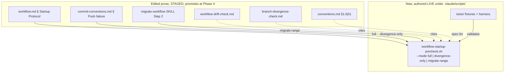

<!-- workflow-sha: 0676e2446f373e969da86da6748c91d442135161 -->
# Workflow startup precheck

## Design Document
[design.md](design.md)

## High-level plan

### Goals

Move the mechanical startup detection that `/execute-tracks` and
`/create-plan` run today into one script,
`.claude/scripts/workflow-startup-precheck.sh`, that emits a single JSON
blob describing branch divergence, workflow drift, pending handoffs, and the
resume state. The agent parses that JSON instead of re-deriving the same
facts from roughly 1,200 lines of gate prose at every session start. The
target is freeing ~20-25K tokens of startup context while keeping every
on-disk behavior identical to today.

Four detection pieces move into the script and keep their current
behavior: branch-divergence detection, the two-phase drift walk, the
no-drift normalization commit, and resume-state determination. The
byte-copied artifact walk that `conventions.md §1.6(h)` owns becomes one
script implementation the prose cites, collapsing four copies to one. The
gate prose shrinks to a short agent-side dispatch rule that runs the script
and routes on its JSON.

### Constraints

- This plan is workflow-modifying: it edits .claude/workflow/** or .claude/skills/**.
- The script and its tests live under `.claude/scripts/`, which the §1.7
  staging convention does not govern (§1.7(a) scopes staging to
  `.claude/workflow/**` and `.claude/skills/**` only). They are authored
  **live**; the six edited prose files are **staged** under
  `staged-workflow/` and promote at the Phase 4 commit. See D6 and
  design.md §"Staging asymmetry".
- The script requires `jq` (present, v1.8.1). No jq-free JSON emitter.
- The script never prompts and never performs force-push or reset. Those
  stay agent-side and user-gated (S2, Non-Goals).
- Behavior parity with today's prose is the binding contract for all four
  gate paths and every resume state (S1), checked by the fixture suite.
- Live `.claude/workflow/**` and `.claude/skills/**` stay at develop state
  for the whole branch until the Phase 4 promotion (S4 / I6), so this
  branch's own `/execute-tracks` sessions run the existing inline-bash
  path, not the new script.

### Architecture Notes

#### Component Map

The plan touches two new live artifacts under `.claude/scripts/` and six
prose surfaces (staged) that today carry the inline detection bash and
will instead call or cite the script.

- **`workflow-startup-precheck.sh`** (new, live) — the single behavioral
  home for startup detection: divergence, the two-phase drift walk, no-drift
  normalization, the handoff scan, and resume-state determination, emitted
  as one JSON blob selected by `--mode`. Detection functions write plain
  shell variables; one jq assembly point owns the JSON shape.
- **`.claude/scripts/tests/`** (new, live) — fixture-based harness that
  asserts the JSON shape and the on-disk effect for the four gate paths
  (clean / divergence / drift / both) and every `state.phase`; pins the
  script's walk against the §1.6(h) spec so a future spec edit the script
  misses fails the suite.
- **`workflow.md § Startup Protocol`** (staged) — collapses from full gate
  prose to a ~30-50-line dispatch rule that runs `--mode full` and routes
  on the JSON.
- **`workflow-drift-check.md`, `branch-divergence-check.md`** (staged) —
  shrink to reference docs; the inline detection bash is replaced by a
  citation of the script.
- **`conventions.md §1.6(h)`** (staged) — keeps the artifact-walk bash as
  the readable spec and gains a pointer to the script implementation.
- **`commit-conventions.md § Push failure handling`** (staged) — a
  mid-session non-fast-forward push re-runs `--mode divergence-only`
  instead of reloading the divergence gate prose.
- **`migrate-workflow/SKILL.md` Step 2** (staged) — reuses `--mode
  migrate-range` for the stamp-fold range and per-artifact `(file, sha)`
  pairs instead of a prose byte-copy of the walk.

#### D1: Script location and language

- **Alternatives considered**: Python implementation; a jq-free hand-rolled
  JSON emitter; a new `.claude/workflow/scripts/` subtree.
- **Rationale**: bash keeps the script's artifact walk close to the
  `conventions.md §1.6(h)` spec it implements; `jq` makes the JSON correct
  by construction (quoting, escaping, `null` for absent scalars);
  `.claude/scripts/` is the existing scripts home alongside
  `statusline-command.sh` and `session-stats.py`.
- **Risks/Caveats**: bash JSON without jq would be fragile — mitigated by
  requiring jq, which is present.
- **Implemented in**: Track 1
- **Full design**: design.md §"Component design", §"Staging asymmetry"

#### D2: Three run modes via a `--mode` flag

- **Alternatives considered**: one always-full JSON blob every caller
  filters down to what it needs.
- **Rationale**: the four callers have disjoint needs — full startup
  detection; a cheap mid-session divergence re-check; the migration's
  range + per-artifact pairs. A `--mode {full,divergence-only,migrate-range}`
  flag keeps each output minimal and selects which detection runs.
- **Risks/Caveats**: mode proliferation — capped by the rule that a new
  caller reuses an existing mode rather than adding a fourth.
- **Implemented in**: Track 1 (mode dispatch + `divergence-only` and
  `migrate-range` outputs), Track 4 (callers wired to pass the mode)
- **Full design**: design.md §"The JSON contract", §"Mid-session re-entry",
  §"migrate-range reuse"

#### D3: `actions_taken` reports autonomous mutations only

- **Alternatives considered**: a two-pass `--apply` mode that performs and
  reports force-push / reset.
- **Rationale**: the script's only autonomous mutation is the no-drift
  normalization commit, which it reports in `actions_taken`. Force-push and
  reset stay agent-side because they are conversational and user-gated
  (force-with-lease can re-reject; reset needs `git log @{u}..HEAD` plus
  confirmation), matching Non-Goal #2 and S2.
- **Risks/Caveats**: the resume recital is split across the script's JSON
  and the agent's own bash — acceptable.
- **Implemented in**: Track 3 (normalization wiring), Track 1 (the
  `actions_taken` JSON field)
- **Full design**: design.md §"No-drift normalization path"

#### D4: §1.6(h) keeps the spec; the script implements it

- **Alternatives considered**: strip the artifact-walk bash from
  `conventions.md §1.6(h)` and point only at the script.
- **Rationale**: §1.6 declares itself the single source of truth for the
  stamp format, parser idioms, and walk; keeping the readable spec there is
  cheap and the parser idioms (§1.6(a1)) live adjacent. The four byte-copies
  (§1.6(h), drift-check Detection, migrate Step 2.0, migrate Step 2)
  collapse to one script implementation plus one spec.
- **Risks/Caveats**: spec / script drift — mitigated by a byte-source
  conformance fixture test (D7).
- **Implemented in**: Track 1 (the walk), Track 4 (the §1.6(h) pointer edit)
- **Full design**: design.md §"Byte-source consolidation", §"migrate-range reuse"

#### D5: Walk-not-compute boundary

- **Alternatives considered**: also absorb §1.6(b) create-time stamp
  computation into the script.
- **Rationale**: the script absorbs the §1.6(h) *walk* (reading existing
  stamps at startup and migration), not the §1.6(b) create-time stamp
  *computation* that `/create-plan` and `edit-design` run when they author
  artifacts. Reading stamps is a startup concern; computing one is a
  creation concern; the two stay in separate homes.
- **Risks/Caveats**: none beyond keeping the boundary clear in the spec.
- **Implemented in**: Track 1
- **Full design**: design.md §"Byte-source consolidation"

#### D6: Staging asymmetry — staged prose, live script

- **Alternatives considered**: stage the script and tests under
  `staged-workflow/` like the prose edits.
- **Rationale**: §1.7(a) scopes staging to `.claude/workflow/**` and
  `.claude/skills/**` only; `.claude/scripts/` is neither, so the write
  routing rule does not touch it and the script is authored live. The two
  surfaces unify at the Phase 4 promotion: staged prose that wires in the
  script promotes while the script already sits live. This branch dogfoods
  the old inline-bash path; the new path goes live only for the next branch
  after merge.
- **Risks/Caveats**: a reviewer may ask why the script is not staged —
  design.md §"Staging asymmetry" answers it from the convention's own scope
  rule.
- **Implemented in**: spans all tracks (Constraints declaration + Track 4
  promotion note)
- **Full design**: design.md §"Staging asymmetry"

#### D7: Fixtures cover every gate path and every state

- **Alternatives considered**: smoke-test only the `full`-mode happy path.
- **Rationale**: state determination is the riskiest surface (it parses
  markdown, not git output), so fixtures cover the four gate paths plus
  every `state.phase` (0 / A / C with each sub-state / D / Done), the
  normalization commit's subject and line-1-only diff shape (including the
  abort-and-restore path), and the §1.6(h) byte-source conformance check.
- **Risks/Caveats**: fixture maintenance cost — bounded; the riskiest
  surface earns the heaviest coverage.
- **Implemented in**: Tracks 1, 2, 3 (each track adds its own fixtures)
- **Full design**: design.md §"Testing strategy", §"State determination"

#### Invariants

- **S1 — Behavior parity.** The script reaches the same on-disk outcomes
  as today's prose for all four gate paths and every resume state. Testable
  via the fixture suite (Tracks 1-3).
- **S2 — Script never prompts.** No `--mode` reads stdin or asks the user;
  the conversational gate UX stays in the agent (Non-Goal #1).
- **S3 — Normalization commit unchanged.** Same subject (`Normalize
  workflow-sha stamps to <short>`), same line-1-only diff shape, same
  all-or-nothing abort-restore as today's `workflow-drift-check.md
  § No-drift normalization`.
- **S4 — I6 staging invariant holds.** Live `.claude/workflow/**` and
  `.claude/skills/**` stay at develop state for the whole branch until the
  Phase 4 promotion.

#### Integration Points

- `/execute-tracks` startup and `/create-plan` Step 1.5 consume `--mode
  full` JSON (`{divergence, drift, handoffs, state, actions_taken}`).
- `commit-conventions.md § Push failure handling` re-runs `--mode
  divergence-only` on a mid-session non-fast-forward push.
- `/migrate-workflow` Step 2 consumes `--mode migrate-range`
  (`stamped_artifacts` pairs, `unstamped_files`, `base_sha`, `git log`
  range, optional `--bootstrap-sha`).

#### Non-Goals

- The script never prompts the user; the three-resolution gate UX stays in
  the agent (S2).
- The script never performs force-push or `git reset`; those stay
  agent-side and user-gated (D3).
- The script does not absorb §1.6(b) create-time stamp computation, which
  stays in `/create-plan` and `edit-design` (D5).
- This branch does not run the new dispatch path end-to-end; the live
  workflow prose stays at develop state and the new path goes live only for
  the first post-merge workflow-modifying branch (S4 / D6).

## Checklist

- [x] Track 1: Detection core, modes, and JSON emit
  > Scaffold `workflow-startup-precheck.sh` with `--mode` plumbing and the
  > single jq emit point, then build the read-only detection: branch
  > divergence, the two-phase drift walk (Phase 1 stamp walk + Phase 2 fold
  > and `git log`), the handoff scan, and the reduced `divergence-only` and
  > `migrate-range` outputs (including `(file, sha)` pairs and an optional
  > `--bootstrap-sha`). Defines the `actions_taken` field that Track 3
  > populates. Detailed description in plan/track-1.md.
  >
  > **Track episode:**
  > Built `workflow-startup-precheck.sh` and a 32-test Python harness as the
  > single behavioral home for session-startup detection: `--mode
  > {full,divergence-only,migrate-range}` dispatch, branch-divergence
  > detection, the two-phase drift walk (Phase 1 byte-copies the `§1.6(h)`
  > artifact walk with the anchored `§1.6(a1)` regex; Phase 2 folds stamps
  > pairwise through `git merge-base` and runs `git log` over the workflow
  > pathspecs), the handoff scan, and the reduced-mode outputs. A single jq
  > assembly point owns the JSON shape, with the explicit empty→null idiom so
  > absent scalars emit `null` rather than `""`.
  >
  > Three downstream seams were plumbed so Tracks 2-4 set a variable rather
  > than re-editing the emitter: `STATE_JSON` stubbed `null` for Track 2's
  > state object, `ACTIONS_TAKEN_JSON` as `[]` for Track 3's normalization
  > commit, and the finalized `migrate-range` shape (`stamped_artifacts
  > [{file,sha}]`, `unstamped_files`, `base_sha`, `log_range [{sha,subject}]`
  > with full `%H` SHAs, `merge_base_failed [{base,sha,files}]`) that Track
  > 4's `migrate-workflow` Step 2 rewrite cites. The merge-base fold is a
  > shared `fold_stamps_to_base("break"|"continue")` function (first-failure
  > for `full`, continue-and-collect for `migrate-range`) that Track 3
  > reuses. A reusable `GitFixture` builder (hermetic `file://` remotes,
  > `GIT_CONFIG` isolation, real-commit helpers) underpins every git-touching
  > test; any precheck test that hits git detection must run inside a fixture
  > or it performs a real network fetch, and because the byte-source resolves
  > `PLAN_DIR=docs/adr/<branch>` with default fixture branch `main`, fixture
  > plan artifacts live under `docs/adr/main/_workflow/`.
  >
  > Track-level review passed at iteration 1 (4 workflow reviewers, baseline
  > skipped on the workflow-only diff, 0 blockers). The Review fix bounded
  > the startup `git fetch` with `timeout 10`, a user-approved tradeoff that
  > accepts a rare, benign behavior-parity break on a slow-but-reachable
  > remote (the downstream per-commit push re-check still catches the
  > divergence) so session startup cannot hang; the script is not yet wired
  > into any startup path this branch, so the risk it removes is latent until
  > a post-merge track wires it. Applying it surfaced a workflow nuance: the
  > ephemeral-identifier pre-commit gate rejected a step label in the new
  > comment because `.claude/scripts/` files are durable content, so the
  > comment was rewritten to name the byte-source rather than a branch-local
  > invariant.
  >
  > Three findings were deferred via plan corrections: the `design.md`
  > migrate-range contract drift (Phase 4 `design-final.md` reconciliation,
  > recorded under Final Artifacts), the uncapped `migrate-range.log_range`
  > (recorded in `track-4.md` for the Step 2 consumer), and the Phase A
  > D1/D2 rationale items (Phase 4 design-final/adr rationale-pass
  > candidates).
  >
  > **Track file:** `plan/track-1.md` (6 steps, 0 failed)
  >
  > **Strategy refresh:** CONTINUE — Track 1 landed the scaffold with the
  > Track 2 seam intact (`emit_json` reads `${STATE_JSON:-null}`, so Track 2
  > sets one variable rather than editing the emitter). No downstream impact
  > on Track 2's parser plan. Track 2 inherits one fixture convention: any
  > git-touching test runs inside Track 1's `GitFixture` builder, and because
  > `PLAN_DIR` resolves to `docs/adr/<branch>` with the fixture default branch
  > `main`, state fixtures live under `docs/adr/main/_workflow/`.

- [ ] Track 2: State determination
  > Build the markdown state parser that reads `## Plan Review`, the track
  > checklist, and the active track file's `## Progress` section, then
  > reports `state.phase` (0 / A / C / D / Done) and, for State C, the
  > five-way sub-state plus the `section-discrepancy` edge. Detailed
  > description in plan/track-2.md.
  > **Scope:** ~4-5 steps covering the State 0/A/C/D/Done precedence walk,
  > the State C sub-state map, the section-discrepancy edge, and the state
  > fixtures.
  > **Depends on:** Track 1

- [ ] Track 3: No-drift normalization and `actions_taken` wiring
  > Port the no-drift normalization path byte-for-byte: recompute the
  > stamped-file list, rewrite each line-1 stamp to the folded `BASE_SHA`
  > with a printf-and-tail pattern, verify the two diff-shape guards, then
  > land one all-or-nothing commit and feed it into `actions_taken`.
  > Detailed description in plan/track-3.md.
  > **Scope:** ~3-4 steps covering the stamp rewrite, the two diff-shape
  > guards + abort-restore, the commit + `actions_taken` wiring, and the
  > normalization fixtures.
  > **Depends on:** Track 1

- [ ] Track 4: Prose consolidation (staged)
  > Rewrite the six prose surfaces to call or cite the script: `workflow.md
  > § Startup Protocol` becomes a ~30-50-line dispatch rule; `workflow-drift-check.md`
  > and `branch-divergence-check.md` shrink to reference docs;
  > `conventions.md §1.6(h)` keeps its spec and gains a script pointer;
  > `commit-conventions.md § Push failure handling` re-enters via
  > `divergence-only`; `migrate-workflow/SKILL.md` Step 2 reuses
  > `migrate-range`. All edits STAGED under `staged-workflow/`; the script's
  > JSON shape must be final before the prose cites it. Detailed description
  > in plan/track-4.md.
  > **Scope:** ~6 steps covering the workflow.md dispatch rewrite, the
  > drift-check and divergence-check shrink, the §1.6(h) pivot, the
  > push-failure re-entry, and the migrate Step 2 reuse.
  > **Depends on:** Tracks 1, 2, 3

## Plan Review
- [x] Plan review (consistency + structural) — passed at iteration 2

**Auto-fixed (mechanical)**: CR1 (should-fix) — corrected the artifact-walk
byte-copy census in plan D4 and design §"Byte-source consolidation"; the
walk's three byte-copies are drift-check Detection, `migrate-workflow`
Step 2.0, and Step 2, not the "drift-check normalization recompute" (a
distinct presence-check loop consolidated by Track 3). CR2 (suggestion) —
reworded track-1 §Interfaces: `.claude/scripts/tests/` already exists, so the
harness is added to it, not created. S1 (should-fix) — trimmed the
over-budget Track 1/2/3 plan-checklist intros to high-level context plus the
track-file pointer, dropping sentences that duplicated each track file's
`## Purpose / Big Picture`.

**Escalated (design decisions)**: none.

## Final Artifacts
- [ ] Phase 4: Final artifacts (`design-final.md`, `adr.md`)

**Phase 4 reconciliation (from Track 1 review, WC1/WC2 — consistency):**
`design.md § "The JSON contract"` describes the `migrate-range` output as
`drift` extended with per-artifact pairs plus `actions_taken`, and is
internally inconsistent on whether `actions_taken` is present. The shipped
script emits a flat object with five keys and no `drift` wrapper or
`actions_taken`: `stamped_artifacts`, `unstamped_files`, `base_sha`,
`log_range`, `merge_base_failed`. `merge_base_failed` is an array of
`{base, sha, files}` objects, not a scalar flag. `design.md` is frozen
during execution, so this was not edited mid-branch; `design-final.md` must
restate the `migrate-range` contract to match the shipped script before
Track 4's citations and the durable design lock it in.

**Phase 4 reconciliation (from Track 2 Phase A review, T7 — consistency):**
`design.md § "State determination"` (TL;DR and body) sources the State C
sub-states from the active track file's `## Progress` section. Track 2's
Phase A review established that three of the five sub-states are actually
discriminated by the `## Concrete Steps` roster (steps-partial / `[!]` /
all-done) and one by the plan-file track checkbox, per the authoritative
live `workflow.md § Startup Protocol` step 5 row contents and
`step-implementation.md` sub-step 7.1 (the roster `[x]` flip is the primary
step-done marker). The live `workflow.md` table header carries the same
`## Progress`-only gloss, so the simplification is upstream and the track
file's refinement is faithful. `design.md` is frozen during execution, so
`design-final.md` must restate the sub-state sources as `## Progress` +
`## Concrete Steps` + the plan-file track checkbox.
