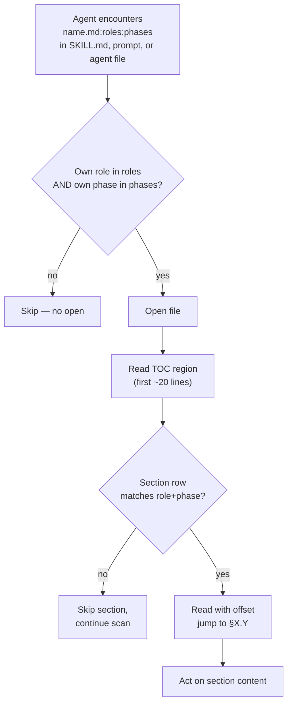

<!-- workflow-sha: 367f5f83f1bce0e98eaeb0679973f9728db64b61 -->
# Per-document TOC + per-section role/phase annotations — Design

## Overview

YouTrackDB's workflow docs are full-file-loaded by the Read tool today, and that one tool accounts for 51.9% of session context across 17 active projects (per YTDB-1023). The orchestrator opens `implementer-rules.md` in full even though the design declares it implementer-only; agents open `conventions.md` in full to learn one rule out of fifteen sections. Section-level filtering is missing.

This design adds three layers of metadata so an agent can decide *whether* to open a file and *which section to jump to* before paying the read cost. The **bootstrap layer** is an instruction block embedded at the top of every workflow-related system prompt (7 SKILL.md files, 11 `.claude/workflow/prompts/*.md`, 20 `.claude/agents/*.md`) — surfaces loaded by the harness or as Agent-tool prompt content without a prior Read call. A fresh sub-agent learns the TOC-aware reading protocol from its own system prompt before it Reads anything. The **file-level layer** is the `name:roles:phases` cross-reference suffix carried in SKILL.md startup read-lists and in agent files' outgoing workflow-doc references; the reader filters by role and phase before opening. The **section-level layer** is an HTML annotation comment on the line after every `##`/`###` heading, mirrored into a machine-extractable `<!--Document index start--> … <!--Document index end-->` table at the top of each file. Both filter layers draw role and phase tokens from locked enums in a new `conventions.md §1.8`.

`CLAUDE.md` is intentionally out of scope. CLAUDE.md is a general-purpose project guide loaded into every session regardless of role or phase; the file-level filter does not apply, and the bootstrap block lives in workflow-related system prompts only.

A mechanical Python script (`workflow-reindex.py`, no LLM) validates the schema at pre-commit and CI time; the `review-workflow-context-budget` agent absorbs the qualitative audit at PR review. A second mechanical script (`measure-read-share.py`) becomes standing Phase 4 infrastructure: every future ADR carries a percentages-only token-usage snapshot for the worktree that ran it.

The rest of this document covers, in order: Core Concepts (vocabulary primer); the files and surfaces out of scope (single consolidated reference); the annotation idiom and TOC region format; the role and phase enums; the cross-reference convention; the bootstrap protocol for agent system prompts; the reindex script; the telemetry script; the CI gate semantics; the migration replay semantics for this change; and the Phase 4 ADR template extension.

## Core Concepts

This design introduces eight load-bearing ideas. Each is named and used without re-definition in the sections that follow.

**TOC region.** A delimited Markdown table directly under the H1 of every annotated file, between `<!--Document index start-->` and `<!--Document index end-->` comments. Lists one row per `##` and one row per `###` heading — no author-judged granularity. The CI gate rebuilds the table from the per-section annotations and fails on divergence. Replaces the implicit "open the file and scan its `##` headings" pattern. → §"Annotation idiom and TOC region".

**Section annotation.** An HTML comment on the line after every `##` and `###` heading carrying `roles=...`, `phases=...`, and `summary="..."`. Invisible to humans, parsed by one regex. The single source of truth for the TOC region above. → §"Annotation idiom and TOC region".

**Role enum.** 15 values naming every distinct calling agent across the workflow: `orchestrator`, `planner`, `implementer`, `decomposer`, `final-designer`, `migrator`, `pr-reviewer`, `reviewer-technical`, `reviewer-risk`, `reviewer-adversarial`, `reviewer-plan`, `reviewer-design`, `reviewer-dim-step`, `reviewer-dim-track`, `any`. Locked in `§1.8`. → §"Role and phase enums".

**Phase enum.** 8 values naming the workflow's phase taxonomy: `0`, `1`, `2`, `3A`, `3B`, `3C`, `4`, `any`. → §"Role and phase enums".

**Cross-reference convention.** Workflow-doc references carry a `roles:phases` suffix so the reader can filter before opening or jumping. Cross-file refs (in SKILL.md startup read-lists and in `.claude/agents/*.md`) use the full `name.md:roles:phases` form and are hand-written, with the script subset-validating each citer's slice against the target heading's current annotation. In-file refs (`§X.Y` and `§X.Y(z)` inside a workflow doc) use the shorter `§X.Y(z):roles:phases` form and are **auto-stamped** by `workflow-reindex.py --write` from the target heading's annotation. `CLAUDE.md` is intentionally excluded (general-purpose, not workflow-specific). → §"Cross-reference convention".

**Bootstrap block.** An instruction block at the top of every workflow-related system prompt — between frontmatter and main body — that names the agent's role and explains the TOC-aware reading protocol in ≤30 lines. Scope: 7 SKILL.md, 11 `.claude/workflow/prompts/*.md`, 20 `.claude/agents/*.md` (38 files total). Closes the chicken-and-egg gap: the cross-ref protocol is defined in `conventions.md §1.8`, but an agent that does not know the protocol would Read §1.8 in full to learn it. → §"Bootstrap protocol for agent system prompts".

**`workflow-reindex.py`.** Mechanical Python script at `.claude/scripts/workflow-reindex.py`. Modes: `--check` (CI / pre-commit) and `--write` (author rebuild of TOC tables). Validates enum tokens and TOC-vs-annotation consistency. No LLM. → §"Reindex script".

**`measure-read-share.py`.** Mechanical Python script at `.claude/scripts/measure-read-share.py`. Runs once per Phase 4 ADR creation, from the worktree only. Outputs a percentages-only Read% snapshot over the worktree's transcript-folder lifetime. Becomes standing infrastructure: every future Phase 4 ADR carries the section. → §"Telemetry script".

## Files and surfaces out of scope

**TL;DR.** The schema covers a specific set of workflow-related Markdown: 31 docs under `.claude/workflow/`, 11 prompts under `.claude/workflow/prompts/`, 7 workflow-referencing SKILL.md, and 20 agent definitions under `.claude/agents/`. Six exclusions are listed below; each one cross-references the mechanism section that owns its authoritative rule. This section is the single anchor a reader new to the design follows when asking "does the schema apply to X?" — the mechanism sections still carry the rule.

### The six exclusions

1. **Agent files lack per-section TOC + annotations.** The 20 `.claude/agents/*.md` files carry the bootstrap block at the top and the cross-file `:roles:phases` suffix on their outgoing workflow-doc references, but no per-section HTML annotation comments and no TOC region. Rationale: agent files are loaded as system prompts when sub-agents spawn; the Read tool never opens them, so per-section annotations would not save Read-tool tokens. → §"Bootstrap protocol" → §"Scope and uniformity"; D6 in the plan.

2. **`CLAUDE.md` is excluded from all three layers.** No section-level annotations, no cross-file suffix on its workflow-doc references, no bootstrap block. Rationale: `CLAUDE.md` is a general-purpose project guide loaded into every session regardless of role or phase. The file-level filter (skip-on-role-mismatch) does not apply because every agent in every phase needs it. → §"Overview"; Non-Goals in the plan.

3. **Phase 4 final artifacts carry no annotations.** `design-final.md`, `design-mechanics-final.md` (when present), and `adr.md` are durable post-merge artifacts under `docs/adr/<dir>/` (outside `_workflow/`). They are committed once and read by humans (PR reviewers, future re-readers, decision auditors), not loaded by sub-agents at runtime. Rationale: the Read-share problem this design solves is about full-file loads in active sessions; Phase 4 artifacts are accessed by humans on GitHub, where token cost is not a factor. → Migration replay semantics §"What this plan changes vs. what migration replays".

4. **Ephemeral `_workflow/**` artifacts carry no annotations.** `implementation-plan.md`, `design.md`, `design-mechanics.md` (when present), `plan/track-N.md`, `design-mutations.md`, and any `handoff-*.md` live under `_workflow/` for the branch's lifetime and are removed in the Phase 4 cleanup commit before merge. Rationale: these files are branch-local working artifacts loaded by orchestrator and implementer agents in specific phases; per-section TOC + annotations on them would impose author-time burden on every plan author for marginal Read-tool savings on already-short working files. The schema's section-level layer is targeted at the durable, frequently-loaded workflow rule files instead. → §"Reindex script" → §"Discovery mechanism" (the script's fixed globs are the inclusion list; `_workflow/**` paths are deliberately absent).

5. **Non-workflow skills carry no bootstrap block.** Skills like `ai-tells`, `run-jmh-benchmarks-hetzner`, `profile-jmh-regressions`, `run`, `verify`, `init`, `review`, `security-review` do not Read files under `.claude/workflow/` or `.claude/skills/` at runtime, so the bootstrap block would be inert text. The 7 workflow-referencing skills (`create-plan`, `execute-tracks`, `edit-design`, `migrate-workflow`, `review-workflow-pr`, `review-plan`, `code-review`) are the explicit allow-list for bootstrap insertion. → §"Bootstrap protocol" → §"Scope and uniformity".

6. **Files with no `^## ` headings carry no TOC region.** A rare but legal shape — a tiny in-scope file (e.g., a one-paragraph helper doc) needs no TOC because there is nothing to enumerate. The reindex script's rule 2 (TOC region present) accepts an empty TOC or omitted TOC for such files. Rule 4 (annotation density) is trivially satisfied with no headings to annotate. → §"Reindex script" → §"Edge cases / Gotchas".

The `.claude/scripts/**` tree is non-Markdown (Python source) and not in any annotation scope by file extension; that exclusion is mechanical rather than a design decision and is named here only for completeness.

### Why a consolidated section

The exclusions are scattered across the document by the mechanism sections that define them: bootstrap scope lives in §"Bootstrap protocol", reindex behaviour in §"Reindex script", Phase 4 boundary in §"Migration replay semantics". A reader new to the design who asks "does this apply to `CLAUDE.md`?" or "what about Phase 4 final artifacts?" should find the answer in one place rather than reading every mechanism section. This section is that single place; the relevant mechanism sections still carry the authoritative rule, and this section cross-references them.

### Edge cases / Gotchas

- A `.claude/agents/*.md` file that grows large enough to consider per-section TOC: the design's answer stays "no per-section annotations for agent files" — the Read tool never opens them. The fix for an oversized agent file is to restructure the file (extract content into a workflow doc the agent Reads on demand) rather than to add annotations to the agent file.
- A skill that today is non-workflow but starts Reading workflow files in the future: the bootstrap-block scope expands by 1 — the reindex script's rule 7 allow-list (currently 7 SKILL.md names) grows in the same commit as the new Read.
- A new `_workflow/**` artifact type a future workflow-format commit adds (beyond the existing six): per the working-tree scope rule, the new type stays unannotated by default. A workflow-format commit that wants the schema to cover a new type explicitly opts in by adding it to the discovery globs.
- The `.claude/scripts/**` tree is non-Markdown and the discovery globs already skip it. The exclusion is mechanical and would only become relevant if someone added a Markdown file under `.claude/scripts/` — the design defines no behaviour for that case; a future maintainer adds it to the discovery globs or leaves it out, but the schema does not need to anticipate non-existent files.
- A reader looking for "what is in scope" finds the inverse view in §"Reindex script" → §"Discovery mechanism" (the fixed globs the script walks). The two views are complementary: this section is the explicit exclusion list with rationale; the discovery globs are the explicit inclusion list without rationale.

### References

- D6: Agent files get refs-only suffix sweep plus bootstrap block (no per-section annotations).
- D8: Bootstrap block embedded in every workflow-related system prompt.

## Annotation idiom and TOC region

**TL;DR.** Every in-scope file carries a TOC region directly under the H1 plus a one-line HTML annotation comment after every `##`/`###` heading. The TOC mirrors the annotations; the reindex script keeps both halves in sync.

### Idiom shape

```markdown
<!-- workflow-sha: <40-char SHA> -->
# Conventions

<!--Document index start-->
| Section | Roles | Phases | Summary |
|---|---|---|---|
| §1.1 Glossary | any | any | Workflow vocabulary, controlled enums. |
| §1.6 Workflow-SHA stamps | orchestrator, migrator | 1,3A,3B,3C,4 | Stamp format, computation, range, unstamped protocol. |
| §1.6(a) Format definition | orchestrator, migrator | 1,3A,3B,3C,4 | Stamp regex, line-1 position contract. |
| §1.6(c) Stamp range definition | migrator | 3A,3B,3C,4 | BASE_SHA..HEAD range, pairwise merge-base fold. |
| §1.7 Staging for workflow-modifying branches | orchestrator, implementer, final-designer | 3A,3B,3C,4 | Staged subtree path layout, marker, reads precedence. |
<!--Document index end-->

## 1.1 Glossary
<!-- roles=any phases=any summary="Workflow vocabulary, controlled enums." -->

| Term | Definition |
|---|---|
...
```

The annotation comment lives on the line **immediately after** the heading. A reader scrolling to a section sees the annotation comment as context; a reader scanning the file's table of contents sees the same metadata aggregated.

### Field rules

- `roles=`: comma-separated list of values from the role enum. At least one value. `roles=any` is allowed.
- `phases=`: comma-separated list of values from the phase enum. At least one value. `phases=any` is allowed.
- `summary="..."`: one-line human-readable description, ≤120 chars, double-quoted. Used as the TOC's summary cell.

### Edge cases / Gotchas

- Headings inside fenced code blocks or HTML comments are not real headings; the reindex script's regex skips them.
- A `##` or `###` heading without an annotation comment on the next line is a CI blocker. `### ` annotations are required at the same density as `## ` annotations — no author-judged granularity. (One exception: the bootstrap-block heading `## Reading workflow files (TOC protocol)`; see §"Bootstrap protocol" → §"Block placement and stability".)
- Annotation values containing quotes inside the summary must escape (`summary="Reads \"index\" entries"`). The author can also rewrite to avoid quotes.
- The TOC's column order is fixed: `Section | Roles | Phases | Summary`.

### References

- D2: Per-section annotation as HTML comment on the line after the heading.

## Role and phase enums

**TL;DR.** Both vocabularies live in `conventions.md §1.8` and are closed at rollout: 15 values name every distinct calling agent across the workflow, 8 values name the workflow's phase taxonomy. Out-of-enum tokens fail CI; future additions require a workflow-format commit.

### Role enum (15 values)

```
any
orchestrator        — /execute-tracks session-level driver (Phases 2, 3A/B/C, 4 orchestration)
planner             — /create-plan agent (Phases 0, 1)
implementer         — per-step implementer (Phase 3B sub-steps 1–3)
decomposer          — Phase 3A step decomposer
final-designer      — Phase 4 final-artifact authoring (prompts/create-final-design.md)
migrator            — /migrate-workflow agent
pr-reviewer         — /review-workflow-pr agent
reviewer-technical  — Phase 3A technical review (prompts/technical-review.md)
reviewer-risk       — Phase 3A risk review
reviewer-adversarial — Phase 3A adversarial review
reviewer-plan       — Phase 2 consistency + structural reviewers (paired role)
reviewer-design     — design-mutation cold-read (prompts/design-review.md)
reviewer-dim-step   — Phase 3B step-level dimensional reviewers (10 baseline + conditional)
reviewer-dim-track  — Phase 3C track-level dimensional reviewers (same 10 + conditional)
```

`reviewer-plan` folds the Phase 2 consistency and structural reviewers into one tag because the pair always run together and the only files that address them separately are their own prompt files (which a sub-agent reads as its own system prompt, so the role tag is moot at that read site). The 6 `review-workflow-*` agents activate as scope-flagged variants of `reviewer-dim-step` / `reviewer-dim-track`; no separate role.

### Phase enum (8 values)

```
0    Research                              (/create-plan interactive exploration)
1    Planning                              (/create-plan plan + design authoring)
2    Plan Review                           (autonomous, /execute-tracks State 0)
3A   Track Review + Decomposition
3B   Step Implementation
3C   Track-Level Code Review + Track Completion
4    Final Artifacts                       (workflow-modifying plans: 3 commits;
                                            non-workflow-modifying: 2 commits)
any  Wildcard
```

### Cross-cutting flows

The phase taxonomy does NOT carve out separate tokens for ESCALATE / inline-replanning (runs within Phase 3A or 3C; tag `phases=3A,3C`), review mode (Track Pre-Flight in 3A or Track Completion in 3C; same tag), or `edit-design` mutations (Phase 1, 3A, 3C, 4; tag the union). `/migrate-workflow` and `/review-workflow-pr` sit outside the phase taxonomy and use `phases=any`.

### Edge cases / Gotchas

- The CI gate accepts enum tokens with zero in-file users — future enum additions before their first author.
- Comma-separated lists must not contain spaces (`roles=orchestrator,implementer`, not `roles=orchestrator, implementer`). The script's regex enforces this.

### References

- D1: Lock the enum at 15 roles + 8 phases.

## Cross-reference convention

**TL;DR.** Workflow-doc references carry a `roles:phases` suffix so the reader can filter before opening (cross-file refs) or before jumping to the cited section (in-file refs). Cross-file refs (in SKILL.md startup read-lists and in `.claude/agents/*.md` files) use the full `name.md:roles:phases` form and are **hand-written**. In-file refs (`§X.Y` and `§X.Y(z)` inside a workflow doc) use the shorter `§X.Y(z):roles:phases` form and are **auto-stamped** by `workflow-reindex.py --write` from the target heading's annotation. `CLAUDE.md` is out of scope (general-purpose project guide, not workflow-specific).

### Format

```
conventions.md:orchestrator,implementer:1,3A,3B,3C       # cross-file, hand-written
step-implementation.md:implementer:3B                    # cross-file, hand-written
implementer-rules.md:implementer:3B,3C                   # cross-file, hand-written
prompts/technical-review.md:reviewer-technical:3A        # cross-file, hand-written
§1.6(c):migrator:3A,3B,3C,4                              # in-file, auto-stamped by --write
§1.7:orchestrator,implementer,final-designer:3A,3B,3C,4  # in-file, auto-stamped by --write
```

The path is relative to the conventional anchor (`.claude/workflow/`, `.claude/skills/`). The suffix's colons separate the three fields (`name.md` / `§X.Y(z)` then `roles` then `phases`); `,`-separated lists inside each field follow the same no-space rule as section annotations. Cross-file refs carry the `.md` filename; in-file refs start at `§` and omit the file part since the reader already knows which file they are in.

### Read-decision flow



The flow's load-bearing properties: the file-level filter avoids the open when neither role nor phase matches; the TOC filter avoids the full-section read when the section's role+phase doesn't match.

### In-file reference auto-stamping

In-file `§X.Y` and `§X.Y(z)` references inside any in-scope workflow doc are auto-stamped by `workflow-reindex.py --write`. The author writes the plain ref (`§1.6(c)`); the script resolves the target heading, reads its annotation comment, derives the matching `roles:phases` suffix, and rewrites the ref in place (`§1.6(c):migrator:3A,3B,3C,4`). The author never types the suffix and never updates it when the target's annotation changes — `--write` is the single source of truth for the stamped form.

**Why auto-stamp in-file but hand-write cross-file.** Two forces pull in opposite directions. Cross-file refs are fewer per file (typically one startup read-list per SKILL.md plus a small outgoing-ref set per agent file) and the citer often cares about a narrow slice of the target's role/phase set, not the full set, so hand-writing the suffix lets the citer record what they care about. In-file refs are common, the target's annotation lives in the same file (so resolving the suffix is mechanical and unambiguous), and the citer almost always means "the target's full annotation" rather than a narrow slice, so auto-stamping eliminates author burden and keeps the suffix in sync with target drift mechanically.

**Cross-file drift detection.** Hand-writing the cross-file suffix preserves the citer's narrower-slice expressiveness; the script subset-validates the slice against the target heading's current annotation (`citer.roles ⊆ target.roles` AND `citer.phases ⊆ target.phases`). Equality is not required — narrower is the design contract. A subset violation surfaces when a target's annotation is tightened (a role removed, a phase dropped) and the citer's slice falls out of subset; the CI error names both sides so the author decides whether to widen the citer or restore the target. The check does not catch citer-too-narrow drift (a valid subset that no longer matches the citer's intent), which stays a human-review concern. Sub-section refs (`name.md§X.Y(z):...`) resolve to that section's annotation directly; file-level refs without a section anchor resolve to the union of every section's annotations in the target file.

**Drift detection.** When a target heading's annotation changes (a role added, a phase tightened), every in-file ref to that heading goes stale until the next `--write` rewrites them. The reindex script's rule 8 (new) flags stamped suffixes that don't match their target's current annotation as a CI blocker; the fix is `workflow-reindex.py --write` (mechanical). Plain (unstamped) in-file refs are also a CI blocker — the author skipped the `--write` step before commit; the same fix applies.

**Cross-file precision.** Cross-file refs may pin a specific sub-section by appending `§X.Y(z)` after the filename: `conventions.md§1.6(c):migrator:3A,3B,3C,4`. Sub-section precision in cross-file form stays hand-written — the cross-file roles/phases describe the citer's slice of the target, not the target's full annotation, so auto-derivation would defeat the precision the citer wanted to express.

**Read-decision flow extension.** The flowchart above covers the cross-file case: the agent reads the ref, file-level-matches against role+phase, opens, then TOC-matches and jumps. For in-file refs the file-level match is trivially satisfied (the agent is already in the file); the reader skips the OPEN and READ_TOC steps, applies the same role+phase check against the suffix, and jumps directly when matched. No diagram update is needed — the in-file path is a special case where the file-level decision is moot.

### Edge cases / Gotchas

- A reference without the `:roles:phases` suffix in scope of the CI gate is a blocker after Track 5 lands.
- The suffix's roles/phases on a cross-file ref describe **the sections the citer cares about**, not every section of the referenced file. A reference can list a narrow subset; the reader still opens the TOC and decides per-section. The script's rule 6 subset-validates the citer's slice against the target heading's current annotation, so a citer that drifts out of subset after a target edit fails CI.
- The suffix's roles/phases on an in-file ref describe **the target heading's current annotation**, not the citer's narrow slice. The `--write` mode rewrites them mechanically; the author does not edit the stamped form by hand.
- A cross-file ref pinning a sub-section (`conventions.md§1.6(c):roles:phases`) stays hand-written even though the section anchor matches in-file shape. The hand-vs-auto split is on cross-file vs in-file, not on the presence of `§X.Y(z)`.
- A reference inside fenced code blocks or example text is excluded from the CI gate by surrounding context (the gate's regex respects code-fence boundaries). The auto-stamp `--write` mode applies the same code-fence exclusion to avoid rewriting refs that appear in example blocks.
- An in-file ref to a heading that does not exist (typo in the section number or letter) is a CI blocker. The script resolves the ref against the file's heading set and surfaces unresolved refs at `--check` time.

### References

- D2: Per-section annotation as HTML comment on the line after the heading.
- D6: Agent files get refs-only suffix sweep plus bootstrap block (no per-section annotations).
- D9: In-file `§X.Y(z)` references auto-stamped by the reindex script with target-derived suffix.
- D10: Subset-validate cross-file ref suffixes against target annotations.

## Bootstrap protocol for agent system prompts

**TL;DR.** Every workflow-related SKILL.md, `.claude/workflow/prompts/*.md`, and `.claude/agents/*.md` carries a ~30-line instruction block above the H1. The block teaches the TOC-aware reading filter so that a spawned sub-agent — which loads with a fresh context window and no inheritance from its parent — applies the filter from its very first Read instead of paying the full-file cost to bootstrap itself.

### Why the bootstrap exists

The TOC protocol defined in §"Cross-reference convention" relies on the agent filtering by role and phase before opening a workflow file. The schema lives in `conventions.md §1.8`. An agent that does not know the protocol Reads `conventions.md` in full to learn it — which defeats the purpose. The bootstrap block embeds enough protocol detail directly in every system prompt that the agent applies the protocol from its first Read onward.

The chicken-and-egg matters specifically because the workflow spawns sub-agents at every review boundary (Phase 2, Phase A, Phase B step-level dim, Phase C track-level dim, Phase 4). Each sub-agent starts with a fresh context window and the parent's TOC-aware reading decisions do not propagate. Without the bootstrap, every spawn pays full-file Read tax to bootstrap its own knowledge of the protocol.

### Bootstrap block content

Embedded at the top of each in-scope file (right after the YAML frontmatter, before the H1 or first body content):

```markdown
## Reading workflow files (TOC protocol)

When you Read any file under `.claude/workflow/` or `.claude/skills/`, follow the protocol in `conventions.md §1.8`:

1. Read the first ~30 lines (TOC region between `<!--Document index start-->` and `<!--Document index end-->`).
2. Match TOC rows where Roles contains your role AND Phases contains your phase.
3. Use `Read(offset, limit)` to read only matched sections.

Your role: <role token from §1.8 role enum>.
Your phase: <fixed for agent files and prompts; auto-resume-derived for SKILL.md>.

Inline refs you find inside workflow files carry the same `name:roles:phases` suffix; apply file-level filtering before opening.
```

Per-file variation: the role token is fixed for agent files (e.g., `reviewer-dim-step` in every dim-step agent) and for prompts (e.g., `reviewer-technical` in `prompts/technical-review.md`). For SKILL.md the phase line names how the orchestrator derives its current phase (e.g., "Your phase: determined by the auto-resume State in `workflow.md` § Startup Protocol").

### Scope and uniformity

- **In scope (38 files).** 7 workflow-referencing SKILL.md (`create-plan`, `execute-tracks`, `edit-design`, `migrate-workflow`, `review-workflow-pr`, `review-plan`, `code-review`); 11 prompts under `.claude/workflow/prompts/`; 20 agent files under `.claude/agents/`.
- **Uniform application.** Every in-scope file carries the block regardless of whether the agent ever Reads a workflow file at runtime. A dim agent that only reads diff and pre-loaded prompt content still carries the block; the cost is ~30 lines of system-prompt text per file, paid against forward refactor safety when future workflow changes add new Read paths in agents that did not have them before.
- **Out of scope.** `CLAUDE.md` (general-purpose, not workflow-specific). Non-workflow skills (`ai-tells`, `run-jmh-benchmarks-hetzner`, `profile-jmh-regressions`, etc.) — those skills do not Read files under `.claude/workflow/` or `.claude/skills/` at runtime; the bootstrap would be inert text.

### Block placement and stability

The block sits between the frontmatter (`---` block on SKILL.md and most agent files; sometimes absent on prompts) and the main body (H1 or first instruction). On files without frontmatter, the block sits at the very top, followed by the H1. On files with a TOC region (the 7 SKILL.md and 11 prompts, which Track 4 annotates), the bootstrap block sits before the TOC region; the TOC region remains directly under the H1 per §"Annotation idiom and TOC region".

When an in-scope file is updated, the block is preserved byte-for-byte unless the role or phase mapping changes. The reindex script's rule 7 validates the block's presence (literal heading match); content is hand-written and not validated.

**Interaction with TOC density rules (3 and 4).** The bootstrap block's literal `## Reading workflow files (TOC protocol)` heading is exempt from §"Reindex script" rule 3 (every `^## ` / `^### ` heading has a TOC row) and rule 4 (every `## ` / `### ` heading carries an annotation comment). The exemption uses the same literal-heading match rule 7 already keys off, so the reindex script holds one carve-out, not three. The bootstrap heading therefore carries no annotation comment and produces no TOC row in any of the 38 in-scope files. Rationale: the heading is byte-identical across every in-scope file, sits structurally above the H1 (the TOC region sits below), and forcing a row would land an identical line in every file's TOC region, clutter that the uniform-density rule does not buy the reader anything to enforce.

### CI enforcement

The reindex script's rule 7 (new): every in-scope SKILL.md, `.claude/workflow/prompts/*.md`, and `.claude/agents/*.md` carries the bootstrap block at the top, identifiable by the literal heading `## Reading workflow files (TOC protocol)`. Missing block → CI failure. The check is presence-only; block content is hand-written.

### Edge cases / Gotchas

- An agent file that genuinely never Reads a workflow file at runtime still carries the block per the uniformity rule. The ~30-line cost is negligible against the YTDB-1023 Read-share baseline.
- A new in-scope file added after rollout must carry the block before its first commit. The reindex script catches the omission at CI time.
- The block's role and phase tokens are the author's responsibility; the reindex script does not validate the tokens against the locked enum at this site. An out-of-enum token surfaces when an annotation or cross-ref elsewhere uses the same token and fails the existing rule 5 check.
- Updating the bootstrap block content across all 38 files is a single coordinated edit — the literal heading is the anchor; the body below it follows a fixed template. A future change to the template applies via `steroid_apply_patch` on the unified heading + body pair.
- The bootstrap heading is the **only** `## ` heading in workflow scope exempt from the rule-3 / rule-4 density contract. Every other `## ` and `### ` heading in any in-scope file carries an annotation comment and a TOC row. Future bootstrap-style instruction blocks added at the top of workflow files (none planned) would need an analogous literal-heading carve-out; the reindex script's exemption list is short by design — one entry today, growing only when a future block lands.

### References

- D8: Bootstrap block embedded in every workflow-related system prompt.

## Reindex script

**TL;DR.** `.claude/scripts/workflow-reindex.py`. Mechanical Python, stdlib only. Modes: `--check` (CI / pre-commit, exit nonzero on findings) and `--write` (rebuild TOC tables in place, idempotent on already-consistent files). Validates enum tokens and TOC-vs-annotation consistency.

### Discovery mechanism

Fixed globs, not a manifest file:

```
.claude/workflow/**/*.md
.claude/workflow/prompts/**/*.md
.claude/skills/{create-plan,execute-tracks,edit-design,migrate-workflow,review-plan,review-workflow-pr,code-review}/SKILL.md
```

Glob list is hard-coded in the script. A manifest file would drift from the actual file set; hardcoded is one update site when scope changes.

### Validation rules

For every in-scope file:

1. **Stamp present.** Line 1 carries the workflow-SHA stamp per `conventions.md §1.6`. Already enforced by drift gate; reindex script re-checks for consistency.
2. **TOC region present.** Exactly one `<!--Document index start-->`/`end-->` pair under the H1.
3. **TOC matches annotations.** Every `^## ` and `^### ` heading has a TOC row; every TOC row maps to a real heading. The `--write` mode rebuilds the TOC from the annotations. **Exempt:** the bootstrap-block heading `## Reading workflow files (TOC protocol)` is excluded by literal-heading match (see §"Bootstrap protocol" → §"Block placement and stability").
4. **Annotation present after every `## ` and every `### ` heading.** No author-judged granularity — `### ` annotations are required at the same density as `## ` annotations. A `## ` or `### ` heading without an annotation comment on the next line is a CI blocker. **Exempt:** same literal-heading match as rule 3.
5. **Annotation fields well-formed.** `roles=`, `phases=`, `summary="..."`. All tokens drawn from the locked enums (script reads the enums from `conventions.md §1.8`).
6. **Cross-file reference suffix (hand-written, subset-validated).** Every workflow-doc reference in `.claude/skills/*/SKILL.md` (the startup read-list and the body) and in `.claude/agents/*.md` carries the `name.md:roles:phases` suffix. The author hand-writes the suffix; the script verifies presence and subset validity. **Subset check:** for each cross-file ref, the citer's `roles` must be a subset of the target heading's current `roles=...`, and the citer's `phases` must be a subset of the target heading's current `phases=...`. Equality is not required — the citer's slice may be narrower than the target's full annotation (the hand-written form's whole point per D9 / D10). Citer-not-a-subset is a CI blocker; the fix is either widen the citer's slice or revisit the target's annotation. **Sub-section resolution:** a ref pinning a sub-section (`name.md§X.Y(z):...`) resolves to that section's annotation directly. **File-level refs:** a ref without an anchor (`name.md:roles:phases`) resolves to the union of every section's annotations in the target file; the citer's slice must be a subset of the union. Refs inside fenced code blocks are excluded. `CLAUDE.md` is explicitly out of scope (general-purpose, not workflow-specific).
7. **Bootstrap block presence on workflow-related system prompts.** Each of the 7 in-scope SKILL.md files (`create-plan`, `execute-tracks`, `edit-design`, `migrate-workflow`, `review-workflow-pr`, `review-plan`, `code-review`), each of the 11 `.claude/workflow/prompts/*.md` files, and each of the 20 `.claude/agents/*.md` files carries the bootstrap block at the top, identifiable by the literal heading `## Reading workflow files (TOC protocol)`. The check is presence-only; block body is hand-written and not validated.
8. **In-file reference suffix (auto-stamped).** Every in-file `§X.Y` and `§X.Y(z)` reference inside an in-scope workflow doc carries the matching `:roles:phases` suffix derived from the target heading's annotation. Two failure modes are blockers: (a) an unstamped plain ref (the author skipped `--write`), (b) a stamped ref whose suffix doesn't match the target heading's current annotation (target drift). Both fix the same way: `workflow-reindex.py --write` rewrites every in-file ref from the current annotations. Refs to a heading that does not exist (typo, removed section) are also a blocker. Refs inside fenced code blocks and example text are excluded from both `--check` validation and `--write` rewriting.

### Exit codes

- `0` — all checks pass.
- `1` — one or more findings (CI failure).
- `2` — script error (invalid argument, missing files, etc.).

### Output format

Findings printed as one line per file:

```
.claude/workflow/conventions.md:142:annotation: roles= field missing
.claude/workflow/step-implementation.md:67:TOC: section "§3.2" present in annotations but missing from TOC
.claude/workflow/conventions.md:215:in-file-ref: §1.6(c) is unstamped — run --write
.claude/workflow/conventions.md:298:in-file-ref: §1.7 stamped suffix migrator:3A drifted from target's current annotation orchestrator,implementer,final-designer:3A,3B,3C,4 — run --write
.claude/workflow/implementer-rules.md:412:in-file-ref: §9.4(c) does not resolve to any heading in this file
.claude/agents/some-agent.md:42:cross-file-ref: conventions.md§1.6:migrator:3A,4 — citer's phase 4 not in target's current phases 3A,3B,3C — widen citer or restore target
```

Path:line:category: explanation. The `in-file-ref:` category covers unstamped, drifted, and unresolved refs (author runs `--write` to fix the first two; the third requires hand-editing the citing prose to point at a real heading). The `cross-file-ref:` category covers subset violations (citer's roles or phases not in the target's annotation), unresolved targets (cited heading doesn't exist), and missing suffix (author skipped the hand-write). Subset violations are fixed by hand-editing either the citer (widen the slice) or the target's annotation (restore the token); `--write` does not touch cross-file refs.

### `--write` semantics

- Rebuilds the TOC region in place from current annotation comments.
- Auto-stamps in-file `§X.Y` and `§X.Y(z)` references by deriving the `:roles:phases` suffix from each target heading's annotation. Plain refs gain the suffix; stamped refs whose suffix has drifted from the target's current annotation are rewritten to the current value.
- Does NOT add or modify per-section annotations or cross-file `name.md:roles:phases` suffixes — those are the author's responsibility.
- Skips refs inside fenced code blocks and example text.
- Halts and reports without rewriting if any in-file ref does not resolve to a heading in the same file (unresolved-ref blocker handled at `--check` time).
- Idempotent: running `--write` twice in a row produces no diff after the first run, because the second run reads the same annotations and writes the same suffixes.

### Edge cases / Gotchas

- A file with no `^## ` headings (rare but possible) needs no TOC region; the gate accepts an empty TOC or omitted TOC for such files.
- A file with a TOC region but no annotations is a CI failure — the TOC has no source of truth to rebuild from.
- Pre-commit hook runs the script only on staged files in scope; CI runs against the full file set.
- The hand-vs-auto split for ref suffixes follows cross-file vs in-file, not the presence of `§X.Y(z)`. A cross-file ref that pins a sub-section (`conventions.md§1.6(c):migrator:3A,3B,3C,4`) stays hand-written; the script's `--write` mode does not touch cross-file refs even when they carry a section anchor.
- An in-file ref that drifts because the target heading's annotation changed lands as a `--check` blocker on the very next CI run after the target's annotation edit — the fix loop is `--write` (one mechanical pass).
- A cross-file ref subset violation that arises because the target's annotation was tightened (a role removed, a phase dropped) lands as a `--check` blocker on the next CI run. The fix is **not** `--write` (it doesn't touch cross-file refs); the author must either widen the citer's slice in the SKILL.md / agent file or restore the target's annotation. The error message names both sides so the choice is informed.

### References

- D5: Reindex script at `.claude/scripts/workflow-reindex.py`, mechanical Python, no LLM.
- D9: In-file `§X.Y(z)` references auto-stamped by the reindex script with target-derived suffix.
- D10: Subset-validate cross-file ref suffixes against target annotations.

## Telemetry script

**TL;DR.** `.claude/scripts/measure-read-share.py`. Runs once per Phase 4 ADR creation, from the worktree only. Outputs a percentages-only Read% snapshot over the worktree's transcript-folder lifetime. Skips when invoked from the main checkout (Phase 4 emits a one-line skip notice). Becomes standing infrastructure: every future Phase 4 ADR carries the section.

### Scope and detection

The script measures `~/.claude/projects/<encoded-cwd>/**/*.jsonl` (recursive — sub-agent transcripts live under `<transcript-stem>/subagents/` and account for the majority of jsonl files on most worktrees, matching `session-stats.py`'s walker shape). `<encoded-cwd>` is the cwd with `/` replaced by `-`; the script resolves the cwd via `Path.cwd().resolve()` first so symlinked worktree roots (e.g. `/home/user/Projects/ytdb/feature -> /workspace/feature`) map to the right encoded folder, and falls back to the raw `Path.cwd()` encoding if the resolved-path folder is missing under `~/.claude/projects/`.

Worktree-vs-main detection routes through the `.git` file-vs-directory shape, not `git worktree list` ordering: the main checkout has `.git` as a directory; every linked worktree has `.git` as a file pointing at `.git/worktrees/<name>`. The script checks `(Path.cwd() / '.git').is_file()`:

- **`.git` is a file** (linked worktree) → proceed with measurement against this worktree's transcript folder only.
- **`.git` is a directory** (main checkout) → emit the main-checkout skip notice, exit 0.
- **`.git` is missing or unreadable** (running outside any git tree, or the cwd is not a checkout) → emit the no-checkout skip notice, exit 0.

The shape check is documented by git (`gitrepository-layout(5)`) and stable across git versions; the porcelain-position heuristic ("first entry is main") is not — a fresh clone whose main checkout is on a feature branch with no `develop` worktree would mislabel that checkout.

### Measurement methodology

For each jsonl transcript in the worktree's folder:

1. Read every line as JSON. Real transcripts on disk carry record types `assistant`, `user`, `mode`, `attachment`, `last-prompt`, `pr-link`, `file-history-snapshot`, and `system`; only `assistant` and `user` records carry the token-bearing content blocks the script tallies. Other record types are skipped.
2. Build a `tool_use_id → (tool_name, tool_input)` index from `assistant`-typed records' `content[].type == "tool_use"` entries in a first pass (or maintain it incrementally during a one-pass walk). `tool_result` content blocks carry only `tool_use_id` — the tool name and original input are recovered through this index.
3. Classify content blocks against the index:

   | Source record | Block shape | Bucket |
   |---|---|---|
   | `assistant` | `text` | Prompts and output |
   | `assistant` | `thinking` | Prompts and output (counted, since it shapes context) |
   | `assistant` | `tool_use` | (not bucketed — indexed only) |
   | `user` | `tool_result` with index entry `name == "Read"` | `Read` (sub-bucket: `tool_input.file_path`) |
   | `user` | `tool_result` with index entry `name in {Bash, Grep, Edit}` | that tool's bucket |
   | `user` | `tool_result` with any other index entry | Other tool results |
   | `user` | plain `text` content | Prompts and output |
   | `attachment` | any | Prompts and output |

   `tool_result.content` is either a string OR a list of blocks (e.g., a list of `text` blocks, or `image` + `text` for Read on a binary). Treat the string and list-of-text cases uniformly; for the `image` block case, count the textual blocks and skip the image blocks.

4. Dedup per record by `uuid` (the cross-record id every transcript line carries). Sub-agent transcripts embed records from their orchestrator; the dedup is required so a record counted in the orchestrator transcript is not re-counted from the sub-agent walk. `session-stats.py`'s `(message.id, requestId)` key is assistant-only — do not reuse it for `tool_result` records, which carry neither field.
5. Sum content tokens per bucket (token count approximated by character count / 4, the standard heuristic; the script documents the approximation).
6. Compute Read share = Read bucket / total context.
7. For the top-files table: rank file paths within the Read bucket; emit top-10. Normalise every path to be repo-relative against the worktree root (`Path.relative_to(Path.cwd())` with a fallback to the raw path tagged `<outside-worktree>` if the path resolves outside). The published ADR must not contain absolute paths under `/home/...` or similar (publication-safety constraint, sibling to I4).

### Output format

```markdown
## Token usage telemetry

Snapshot from this worktree's sessions over its lifetime
(N=<session_count> sessions across <file_count> transcripts).

### Tool mix — share of total session context

| Component             | Share |
|-----------------------|------:|
| `Read` tool results   | <pct>% |
| `Bash` tool results   | <pct>% |
| `Grep` tool results   | <pct>% |
| `Edit` tool results   | <pct>% |
| Other tool results    | <pct>% |
| Prompts and output    | <pct>% |

### Top files by share of `Read` token consumption

| File                                            | Share of Read |
|-------------------------------------------------|--------------:|
| <path>                                          | <pct>% |
| ...                                             | ... |

Generated by `.claude/scripts/measure-read-share.py` against
`~/.claude/projects/<encoded-worktree-cwd>/`.
```

Percentages render to one decimal place with largest-remainder rounding so each column sums to exactly 100.0% (independent `round()` per row drops the sum-to-100 invariant on most distributions).

Skip notice formats (one per distinct cause, so an ADR reader can tell which trigger fired):

```markdown
## Token usage telemetry

Skipped: Phase 4 ran from the main checkout, not a dedicated worktree.
Per-feature telemetry only applies when each plan is executed in its own worktree.
```

```markdown
## Token usage telemetry

Skipped: no transcripts found under this worktree's transcript folder.
The worktree may have been used from an IDE without a Claude Code session log.
```

Rendering discipline: the script buffers the full Markdown section in memory and prints atomically on success; on parse failure mid-walk it prints a skip notice with the per-file error and exits 0 so the ADR commit still succeeds.

### Phase 4 integration

`prompts/create-final-design.md` Step 3 §"Artifact 2: ADR" (the adr.md-write step) invokes the script while composing `adr.md` and embeds its output as a standard `## Token usage telemetry` section in the same write. The section's location in `adr.md` is configurable per prompt but defaults to the end (after rationale, before any appendix). Step 5 (the final-artifacts commit) only stages files already on disk and is not the hook point — composing telemetry there would require a post-commit amendment.

### Edge cases / Gotchas

- A worktree with no transcripts in its folder (e.g., the user worked from an IDE without a session log) → emit skip notice with reason "no transcripts found".
- A transcript that mixes pre-rollout and post-rollout sessions: not detected. The script reports lifetime aggregate; the user interprets in the ADR prose.
- The character-count / 4 token approximation is consistent with `session-stats.py` and `ccusage`; absolute counts are not published, only percentages, so the approximation error doesn't affect the published number.
- Sub-agent transcripts under `<transcript-stem>/subagents/` are included (recursive walk), matching `session-stats.py`.

### References

- D4: Telemetry script runs from worktree only; skips when run from main.

## CI gate semantics

**TL;DR.** Two enforcement surfaces: a pre-commit hook (extended) and a GitHub Actions step (new or extended). Both call `workflow-reindex.py --check`. Author fixes findings with `--write` (mechanical) plus hand-editing (annotations and enum-token corrections).

### Pre-commit hook (local enforcement surface)

Extends `.githooks/pre-commit` (existing Spotless block preserved, workflow-reindex check appended). The new block applies after Spotless and runs `workflow-reindex.py --check` against the staged set, scoped to Markdown under `.claude/workflow/`, `.claude/skills/`, or `.claude/agents/`:

```bash
#!/bin/bash
staged_workflow_files=$(git diff --cached --name-only | grep -E '^\.claude/(workflow|skills)/.*\.md$|^\.claude/agents/.*\.md$')
if [ -n "$staged_workflow_files" ]; then
    python3 .claude/scripts/workflow-reindex.py --check --files "$staged_workflow_files"
fi
```

The hook is opt-in (user installs via `git config core.hooksPath .githooks`); CI catches the failure for users who skip the hook.

### GitHub Actions step

Added to an existing workflow file (or a new dedicated one if no existing workflow covers all PR types). Runs against the full file set:

```yaml
- name: Workflow TOC + annotation check
  run: python3 .claude/scripts/workflow-reindex.py --check
```

PR fails when the script exits nonzero; the failure surfaces the specific files and lines.

### Author fix loop

1. Run `python3 .claude/scripts/workflow-reindex.py --check` locally.
2. For mechanical findings (TOC out of sync with annotations, stamp drift), run `--write`.
3. For annotation findings (missing field, out-of-enum token), hand-edit the file.
4. Commit and push; CI re-runs the check.

### Agent-side absorption

`.claude/agents/review-workflow-context-budget.md` invokes the script during workflow-machinery PR review. The dim-track review for workflow-machinery diffs surfaces script findings as `WB1, WB2, ...` items (the `WB<N>` prefix is introduced by Track 2 per D11; the agent emits it alongside the existing `Critical / Recommended / Minor` severity labels).

### Edge cases / Gotchas

- The pre-commit hook's `staged_workflow_files` filter must use `git diff --cached --name-only --diff-filter=ACMR` to exclude deletions (a deleted file shouldn't fail the gate for itself).
- CI runs in a fresh checkout; the script reads enums from `conventions.md §1.8` in the checked-out tree, so the gate self-bootstraps once §1.8 lands.
- A PR that deletes an in-scope file (rare) must also delete the file's entry from any cross-reference in SKILL.md startup read-lists and agent files; the gate detects the dangling reference.

### References

- D5: Reindex script at `.claude/scripts/workflow-reindex.py`, mechanical Python, no LLM.
- D11: `WB<N>` prefix family for context-budget findings (introduced by Track 2).

## Migration replay semantics

**TL;DR.** This plan changes workflow rules and tooling but does not change `_workflow/**` artifact shape. `/migrate-workflow`'s replay loop has no content to apply onto branch artifacts. Verification on two active branches confirms the drift gate's normalization path runs clean — typically a stamp-rewrite-only commit, or a silent skip if branch stamps are already uniform.

### What this plan changes vs. what migration replays

`/migrate-workflow` replays workflow-format commits onto branches' `_workflow/**` files. Replay applies when a workflow-format commit changes the shape of `_workflow/**` artifacts (e.g., a new mandatory section in `implementation-plan.md`, a renamed section in the track-file template). This plan changes:

- `conventions.md §1.8` — new section in a workflow rule file (read-only schema; no artifact-shape impact).
- `.claude/scripts/workflow-reindex.py`, `.claude/scripts/measure-read-share.py` — new scripts.
- `.claude/agents/**` — refs sweep + bootstrap block on existing agent definitions.
- `.claude/workflow/**`, `.claude/workflow/prompts/**`, 7 skill files — per-section TOC + annotations added; the prompts and SKILL.md files also gain the bootstrap block per §"Bootstrap protocol for agent system prompts".

None of these change the shape of `_workflow/**` artifacts on any branch. The plan's commits land on `develop`; branches that rebase onto develop pick up the new workflow rules naturally via the rebase. Their existing `_workflow/**` artifacts continue to satisfy the new rules without modification.

### What the drift gate sees

A branch with `_workflow/**` artifacts stamped at SHA `<old>` rebases onto develop. The drift gate's Phase 1 walk finds stamps at `<old>`; the Phase 2 fold computes `BASE_SHA=<old>`; `git log <old>..HEAD -- .claude/workflow .claude/skills` returns this plan's commits. The drift gate prompts the user to migrate.

`/migrate-workflow` runs. Its per-commit replay loop steps through this plan's commits; for each, the loop finds no `_workflow/**` artifact-shape change to apply (the commits touch `.claude/workflow/`, `.claude/skills/`, `.claude/scripts/`, `.claude/agents/` — none touch the branch's own `_workflow/**`). The loop completes with no edits to the branch's artifacts. The final step rewrites the stamp on every `_workflow/**` artifact to the new workflow-sha, landing one normalization commit.

### Verification on two branches

The acceptance criterion requires verification on at least two active branches carrying `_workflow/` artifacts. Candidates from the memory file (status as of session start):

- `ytdb-612-rollback-log` — large active plan, multiple tracks in flight.
- `read-cache-concurrency-bug` — Track 5 Phase B complete.
- `ytdb-614-property-map` — Step 4 in progress.
- `failed-wal-recovery` — paused, will resume.

Two branches from this set are picked at Track 5 time. The verification procedure: rebase each onto develop after this plan lands; run `/migrate-workflow`; confirm the migration completes with one stamp-rewrite commit (or silent skip if stamps were uniform); confirm subsequent `/execute-tracks` startup runs clean against the migrated artifacts.

### Edge cases / Gotchas

- A branch whose stamps are non-uniform (a partial migration from an earlier workflow-format commit) hits the no-drift-normalization sub-step rather than full migration. Either path leaves the branch in a usable state; the verification covers both.
- A branch that gained `_workflow/**` artifacts between this plan's start and merge: the migration treats it identically to existing branches — no artifact-shape change to apply, stamp-rewrite-only normalization.
- A branch that has un-pushed local commits to its `_workflow/**` artifacts: `/migrate-workflow`'s existing pre-flight detects the dirty state and halts before any rewrite. No new failure mode introduced by this plan.

### References

- D7: Migration replay is a no-op for this plan; verification confirms drift-gate normalization.

## Phase 4 ADR template extension

**TL;DR.** Every future ADR carries a standard `## Token usage telemetry` section populated by `measure-read-share.py`. The section's prose template lives in `prompts/create-final-design.md`; the script's output is embedded as-is.

### Section placement in `adr.md`

The telemetry section lands at the end of `adr.md`, after `## Key Discoveries`. Concrete order matching the live `prompts/create-final-design.md` § "Artifact 2: ADR" template:

```
# <Plan name> — Architecture Decision Record
## Summary
## Goals
## Constraints
## Architecture Notes
  ### Component Map
  ### Decision Records
  ### Invariants & Contracts
  ### Integration Points
  ### Non-Goals
## Key Discoveries
## Token usage telemetry        ← inserted here
```

The telemetry is metadata about the session shape, not load-bearing ADR content; appending leaves every existing H2 in place and matches the historical post-merge ADRs that already follow this template.

### Standing infrastructure properties

- **Every future ADR runs the script.** Phase 4 prompt invokes `measure-read-share.py` unconditionally. The script's worktree-vs-main detection handles the skip case internally.
- **Output is percentages-only.** Repo is open-source; the script never emits absolute token counts. Skipping anonymization is intentional (single-project scope; no project names to scrub).
- **Format is stable across ADRs.** The template (column headers, top-10 cap, generated-by footer) is fixed in `prompts/create-final-design.md`. Future enhancements (e.g., a `--top=N` override) extend the script's CLI but keep the default rendering stable.

### Cross-ADR comparison

Each ADR's section is a standalone snapshot; the script does not compare against prior ADRs. Trend analysis is a reader exercise (compare percentages across consecutive ADRs); the infrastructure does not automate it.

### Edge cases / Gotchas

- A Phase 4 session that runs from the main checkout (rare; convention is one worktree per feature) emits the skip notice. The ADR still has the section, just with the skip explanation.
- A Phase 4 session that resumes after an interruption: the script is invoked once per Phase 4 run; resuming re-runs it. The output reflects the worktree's full lifetime, so resuming doesn't produce inconsistent snapshots.
- A workflow-modifying plan whose Phase 4 includes the promote-staged-workflow commit (Step 4): telemetry runs in Step 3 (adr.md composition), which precedes Step 4 in the prompt's normal step order, so the promote commit's own session activity is not captured in the snapshot. Since the script measures session-transcript token usage (jsonl files under `~/.claude/projects/<encoded-cwd>/`), not on-disk workflow state, the timing affects which session events the snapshot covers, not whether the promoted workflow content is "visible." The omission is small (one commit's tool-call traffic) and the snapshot reports a percentages-only lifetime aggregate, so the impact on Read% is below measurement precision.

### References

- D4: Telemetry script runs from worktree only; skips when run from main.
