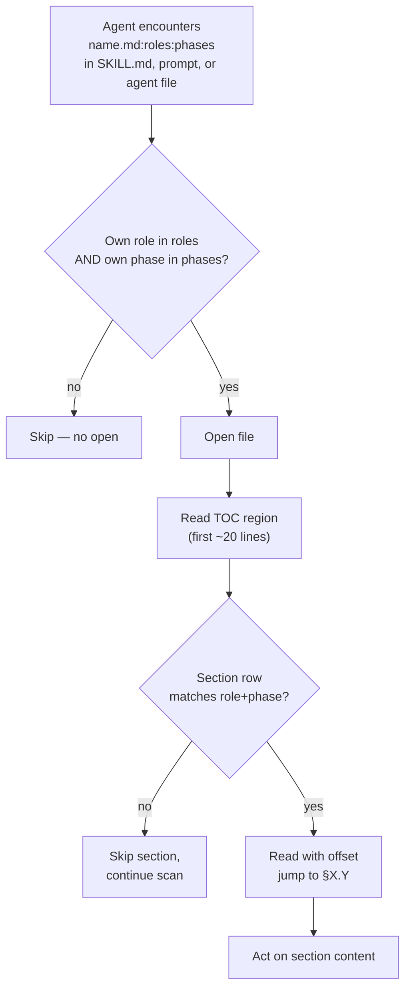

<!-- workflow-sha: 676179cb82295cf15977823a415d5f5476e42526 -->
# Per-document TOC + per-section role/phase annotations — Design

## Overview

YouTrackDB's workflow docs are full-file-loaded by the Read tool today, and that one tool accounts for 51.9% of session context across 17 active projects (per YTDB-1023). The orchestrator opens `implementer-rules.md` in full even though the design declares it implementer-only; agents open `conventions.md` in full to learn one rule out of fifteen sections. Section-level filtering is missing.

This design adds three layers of metadata so an agent can decide *whether* to open a file and *which section to jump to* before paying the read cost. The **bootstrap layer** is an instruction block embedded at the top of every workflow-related system prompt (7 SKILL.md files, 11 `.claude/workflow/prompts/*.md`, 20 `.claude/agents/*.md`) — surfaces loaded by the harness or as Agent-tool prompt content without a prior Read call. A fresh sub-agent learns the TOC-aware reading protocol from its own system prompt before it Reads anything. The **file-level layer** is the `name:roles:phases` cross-reference suffix carried in SKILL.md startup read-lists and in agent files' outgoing workflow-doc references; the reader filters by role and phase before opening. The **section-level layer** is an HTML annotation comment on the line after every `##`/`###` heading, mirrored into a machine-extractable `<!--Document index start--> … <!--Document index end-->` table at the top of each file. Both filter layers draw role and phase tokens from locked enums in a new `conventions.md §1.8`.

`CLAUDE.md` is intentionally out of scope. CLAUDE.md is a general-purpose project guide loaded into every session regardless of role or phase; the file-level filter does not apply, and the bootstrap block lives in workflow-related system prompts only.

A mechanical Python script (`workflow-reindex.py`, no LLM) validates the schema at pre-commit and CI time; the `review-workflow-context-budget` agent absorbs the qualitative audit at PR review. A second mechanical script (`measure-read-share.py`) becomes standing Phase 4 infrastructure: every future ADR carries a percentages-only token-usage snapshot for the worktree that ran it.

The rest of this document covers, in order: Core Concepts (vocabulary primer); the annotation idiom and TOC region format; the role and phase enums; the cross-reference convention; the bootstrap protocol for agent system prompts; the reindex script; the telemetry script; the CI gate semantics; the migration replay semantics for this change; and the Phase 4 ADR template extension.

## Core Concepts

This design introduces eight load-bearing ideas. Each is named and used without re-definition in the sections that follow.

**TOC region.** A delimited Markdown table directly under the H1 of every annotated file, between `<!--Document index start-->` and `<!--Document index end-->` comments. Lists one row per `##` heading (and selected `###` where the author granularizes). The CI gate rebuilds the table from the per-section annotations and fails on divergence. Replaces the implicit "open the file and scan its `##` headings" pattern. → §"Annotation idiom and TOC region".

**Section annotation.** An HTML comment on the line after every `##` and `###` heading carrying `roles=...`, `phases=...`, and `summary="..."`. Invisible to humans, parsed by one regex. The single source of truth for the TOC region above. → §"Annotation idiom and TOC region".

**Role enum.** 15 values naming every distinct calling agent across the workflow: `orchestrator`, `planner`, `implementer`, `decomposer`, `final-designer`, `migrator`, `pr-reviewer`, `reviewer-technical`, `reviewer-risk`, `reviewer-adversarial`, `reviewer-plan`, `reviewer-design`, `reviewer-dim-step`, `reviewer-dim-track`, `any`. Locked in `§1.8`. → §"Role and phase enums".

**Phase enum.** 10 values naming the workflow's phase taxonomy: `0`, `1`, `1a`, `1b`, `2`, `3A`, `3B`, `3C`, `4`, `any`. `1a` and `1b` are reserved for YTDB-975 (in flight) and carry no annotations at rollout. → §"Role and phase enums".

**Cross-reference convention.** Inline references to workflow docs in SKILL.md startup read-lists and in `.claude/agents/*.md` files carry the suffix `name.md:roles:phases`. An agent in role R during phase P reads the suffix and skips files where neither matches, before opening anything. `CLAUDE.md` is intentionally excluded (general-purpose, not workflow-specific). → §"Cross-reference convention".

**Bootstrap block.** An instruction block at the top of every workflow-related system prompt — between frontmatter and main body — that names the agent's role and explains the TOC-aware reading protocol in ≤30 lines. Scope: 7 SKILL.md, 11 `.claude/workflow/prompts/*.md`, 20 `.claude/agents/*.md` (38 files total). Closes the chicken-and-egg gap: the cross-ref protocol is defined in `conventions.md §1.8`, but an agent that does not know the protocol would Read §1.8 in full to learn it. → §"Bootstrap protocol for agent system prompts".

**`workflow-reindex.py`.** Mechanical Python script at `.claude/scripts/workflow-reindex.py`. Modes: `--check` (CI / pre-commit) and `--write` (author rebuild of TOC tables). Validates enum tokens and TOC-vs-annotation consistency. No LLM. → §"Reindex script".

**`measure-read-share.py`.** Mechanical Python script at `.claude/scripts/measure-read-share.py`. Runs once per Phase 4 ADR creation, from the worktree only. Outputs a percentages-only Read% snapshot over the worktree's transcript-folder lifetime. Becomes standing infrastructure: every future Phase 4 ADR carries the section. → §"Telemetry script".

## Annotation idiom and TOC region

**TL;DR.** Every in-scope file carries a TOC region directly under the H1 plus a one-line HTML annotation comment after every `##`/`###` heading. The TOC mirrors the annotations; the reindex script keeps both halves in sync.

### Idiom shape

```markdown
<!-- workflow-sha: <40-char SHA> -->
# Conventions

<!--Document index start-->
| Section | Roles | Phases | Summary |
|---|---|---|---|
| §1.1 Glossary | any | any | Workflow vocabulary, controlled enums. |
| §1.6 Workflow-SHA stamps | orchestrator, migrator | 1,1a,1b,3A,3B,3C,4 | Stamp format, computation, range, unstamped protocol. |
| §1.7 Staging for workflow-modifying branches | orchestrator, implementer, final-designer | 3A,3B,3C,4 | Staged subtree path layout, marker, reads precedence. |
<!--Document index end-->

## 1.1 Glossary
<!-- roles=any phases=any summary="Workflow vocabulary, controlled enums." -->

| Term | Definition |
|---|---|
...
```

The annotation comment lives on the line **immediately after** the heading. A reader scrolling to a section sees the annotation comment as context; a reader scanning the file's table of contents sees the same metadata aggregated.

### Field rules

- `roles=`: comma-separated list of values from the role enum. At least one value. `roles=any` is allowed.
- `phases=`: comma-separated list of values from the phase enum. At least one value. `phases=any` is allowed.
- `summary="..."`: one-line human-readable description, ≤120 chars, double-quoted. Used as the TOC's summary cell.

### Edge cases / Gotchas

- Headings inside fenced code blocks or HTML comments are not real headings; the reindex script's regex skips them.
- A single `##` heading without an annotation comment on the next line is a CI blocker.
- Annotation values containing quotes inside the summary must escape (`summary="Reads \"index\" entries"`). The author can also rewrite to avoid quotes.
- The TOC's column order is fixed: `Section | Roles | Phases | Summary`.

### References

- D2: Per-section annotation as HTML comment on the line after the heading.

## Role and phase enums

**TL;DR.** Two locked enums in `conventions.md §1.8`. 15 roles cover every distinct calling agent across the workflow; 10 phases cover the workflow's phase taxonomy with two slots reserved for YTDB-975 in flight.

### Role enum (15 values)

```
any
orchestrator        — /execute-tracks session-level driver (Phases 2, 3A/B/C, 4 orchestration)
planner             — /create-plan agent (Phases 0, 1)
implementer         — per-step implementer (Phase 3B sub-steps 1–3)
decomposer          — Phase 3A step decomposer
final-designer      — Phase 4 final-artifact authoring (prompts/create-final-design.md)
migrator            — /migrate-workflow agent
pr-reviewer         — /review-workflow-pr agent
reviewer-technical  — Phase 3A technical review (prompts/technical-review.md)
reviewer-risk       — Phase 3A risk review
reviewer-adversarial — Phase 3A adversarial review
reviewer-plan       — Phase 2 consistency + structural reviewers (paired role)
reviewer-design     — design-mutation cold-read (prompts/design-review.md)
reviewer-dim-step   — Phase 3B step-level dimensional reviewers (10 baseline + conditional)
reviewer-dim-track  — Phase 3C track-level dimensional reviewers (same 10 + conditional)
```

`reviewer-plan` folds the Phase 2 consistency and structural reviewers into one tag because the pair always run together and the only files that address them separately are their own prompt files (which a sub-agent reads as its own system prompt, so the role tag is moot at that read site). The 6 `review-workflow-*` agents activate as scope-flagged variants of `reviewer-dim-step` / `reviewer-dim-track`; no separate role.

### Phase enum (10 values)

```
0    Research                              (/create-plan interactive exploration)
1    Planning                              (/create-plan plan + design authoring)
1a   Per-mutation review                   (reserved for YTDB-975 in flight)
1b   Plan derivation                       (reserved for YTDB-975 in flight)
2    Plan Review                           (autonomous, /execute-tracks State 0)
3A   Track Review + Decomposition
3B   Step Implementation
3C   Track-Level Code Review + Track Completion
4    Final Artifacts                       (workflow-modifying plans: 3 commits;
                                            non-workflow-modifying: 2 commits)
any  Wildcard
```

`1a` and `1b` carry zero annotations at rollout because YTDB-975 (which introduces the Phase 1 sub-split) is on a parallel branch (`ytdb-965-dd-decision-log`) and has not merged to `develop`. The slots stay reserved so YTDB-975's eventual landing on `develop` does not force a second workflow-format commit.

### Cross-cutting flows

The phase taxonomy does NOT carve out separate tokens for ESCALATE / inline-replanning (runs within Phase 3A or 3C; tag `phases=3A,3C`), review mode (Track Pre-Flight in 3A or Track Completion in 3C; same tag), or `edit-design` mutations (Phase 1, 3A, 3C, 4; tag the union). `/migrate-workflow` and `/review-workflow-pr` sit outside the phase taxonomy and use `phases=any`.

### Edge cases / Gotchas

- The CI gate accepts enum tokens with zero in-file users — `1a` and `1b` at rollout, future enum additions before their first author.
- Comma-separated lists must not contain spaces (`roles=orchestrator,implementer`, not `roles=orchestrator, implementer`). The script's regex enforces this.

### References

- D1: Lock the enum at 15 roles + 10 phases (with 1a/1b reserved).

## Cross-reference convention

**TL;DR.** Workflow-doc references in SKILL.md startup read-lists and in `.claude/agents/*.md` files carry the suffix `name.md:roles:phases`. The reader matches its own role+phase against the suffix and opens the file only on a hit. `CLAUDE.md` is out of scope (general-purpose project guide, not workflow-specific).

### Format

```
conventions.md:orchestrator,implementer:1,3A,3B,3C
step-implementation.md:implementer:3B
implementer-rules.md:implementer:3B,3C
prompts/technical-review.md:reviewer-technical:3A
```

The path is relative to the conventional anchor (`.claude/workflow/`, `.claude/skills/`). The suffix's colons separate three fields; `,`-separated lists inside each field follow the same no-space rule as section annotations.

### Read-decision flow



The flow's load-bearing properties: the file-level filter avoids the open when neither role nor phase matches; the TOC filter avoids the full-section read when the section's role+phase doesn't match.

### Edge cases / Gotchas

- A reference without the `:roles:phases` suffix in scope of the CI gate is a blocker after Track 5 lands.
- The suffix's roles/phases describe **the sections the citer cares about**, not every section of the referenced file. A reference can list a narrow subset; the reader still opens the TOC and decides per-section.
- A reference inside fenced code blocks or example text is excluded from the CI gate by surrounding context (the gate's regex respects code-fence boundaries).

### References

- D2: Per-section annotation as HTML comment on the line after the heading.
- D6: Agent files get refs-only suffix sweep plus bootstrap block (no per-section annotations).

## Bootstrap protocol for agent system prompts

**TL;DR.** Every workflow-related SKILL.md, `.claude/workflow/prompts/*.md`, and `.claude/agents/*.md` carries a ~30-line instruction block above the H1. The block teaches the TOC-aware reading filter so that a spawned sub-agent — which loads with a fresh context window and no inheritance from its parent — applies the filter from its very first Read instead of paying the full-file cost to bootstrap itself.

### Why the bootstrap exists

The TOC protocol defined in §"Cross-reference convention" relies on the agent filtering by role and phase before opening a workflow file. The schema lives in `conventions.md §1.8`. An agent that does not know the protocol Reads `conventions.md` in full to learn it — which defeats the purpose. The bootstrap block embeds enough protocol detail directly in every system prompt that the agent applies the protocol from its first Read onward.

The chicken-and-egg matters specifically because the workflow spawns sub-agents at every review boundary (Phase 2, Phase A, Phase B step-level dim, Phase C track-level dim, Phase 4). Each sub-agent starts with a fresh context window and the parent's TOC-aware reading decisions do not propagate. Without the bootstrap, every spawn pays full-file Read tax to bootstrap its own knowledge of the protocol.

### Bootstrap block content

Embedded at the top of each in-scope file (right after the YAML frontmatter, before the H1 or first body content):

```markdown
## Reading workflow files (TOC protocol)

When you Read any file under `.claude/workflow/` or `.claude/skills/`, follow the protocol in `conventions.md §1.8`:

1. Read the first ~30 lines (TOC region between `<!--Document index start-->` and `<!--Document index end-->`).
2. Match TOC rows where Roles contains your role AND Phases contains your phase.
3. Use `Read(offset, limit)` to read only matched sections.

Your role: <role token from §1.8 role enum>.
Your phase: <fixed for agent files and prompts; auto-resume-derived for SKILL.md>.

Inline refs you find inside workflow files carry the same `name:roles:phases` suffix; apply file-level filtering before opening.
```

Per-file variation: the role token is fixed for agent files (e.g., `reviewer-dim-step` in every dim-step agent) and for prompts (e.g., `reviewer-technical` in `prompts/technical-review.md`). For SKILL.md the phase line names how the orchestrator derives its current phase (e.g., "Your phase: determined by the auto-resume State in `workflow.md` § Startup Protocol").

### Scope and uniformity

- **In scope (38 files).** 7 workflow-referencing SKILL.md (`create-plan`, `execute-tracks`, `edit-design`, `migrate-workflow`, `review-workflow-pr`, `review-plan`, `code-review`); 11 prompts under `.claude/workflow/prompts/`; 20 agent files under `.claude/agents/`.
- **Uniform application.** Every in-scope file carries the block regardless of whether the agent ever Reads a workflow file at runtime. A dim agent that only reads diff and pre-loaded prompt content still carries the block; the cost is ~30 lines of system-prompt text per file, paid against forward refactor safety when future workflow changes add new Read paths in agents that did not have them before.
- **Out of scope.** `CLAUDE.md` (general-purpose, not workflow-specific). Non-workflow skills (`ai-tells`, `run-jmh-benchmarks-hetzner`, `profile-jmh-regressions`, etc.) — those skills do not Read files under `.claude/workflow/` or `.claude/skills/` at runtime; the bootstrap would be inert text.

### Block placement and stability

The block sits between the frontmatter (`---` block on SKILL.md and most agent files; sometimes absent on prompts) and the main body (H1 or first instruction). On files without frontmatter, the block sits at the very top, followed by the H1. On files with a TOC region (the 7 SKILL.md and 11 prompts, which Track 4 annotates), the bootstrap block sits before the TOC region; the TOC region remains directly under the H1 per §"Annotation idiom and TOC region".

When an in-scope file is updated, the block is preserved byte-for-byte unless the role or phase mapping changes. The reindex script's rule 8 validates the block's presence (literal heading match); content is hand-written and not validated.

### CI enforcement

The reindex script's rule 8 (new): every in-scope SKILL.md, `.claude/workflow/prompts/*.md`, and `.claude/agents/*.md` carries the bootstrap block at the top, identifiable by the literal heading `## Reading workflow files (TOC protocol)`. Missing block → CI failure. The check is presence-only; block content is hand-written.

### Edge cases / Gotchas

- An agent file that genuinely never Reads a workflow file at runtime still carries the block per the uniformity rule. The ~30-line cost is negligible against the YTDB-1023 Read-share baseline.
- A new in-scope file added after rollout must carry the block before its first commit. The reindex script catches the omission at CI time.
- The block's role and phase tokens are the author's responsibility; the reindex script does not validate the tokens against the locked enum at this site. An out-of-enum token surfaces when an annotation or cross-ref elsewhere uses the same token and fails the existing rule 5 check.
- Updating the bootstrap block content across all 38 files is a single coordinated edit — the literal heading is the anchor; the body below it follows a fixed template. A future change to the template applies via `steroid_apply_patch` on the unified heading + body pair.

### References

- D8: Bootstrap block embedded in every workflow-related system prompt.

## Reindex script

**TL;DR.** `.claude/scripts/workflow-reindex.py`. Mechanical Python, stdlib only. Modes: `--check` (CI / pre-commit, exit nonzero on findings) and `--write` (rebuild TOC tables in place, idempotent on already-consistent files). Validates enum tokens and TOC-vs-annotation consistency.

### Discovery mechanism

Fixed globs, not a manifest file:

```
.claude/workflow/**/*.md
.claude/workflow/prompts/**/*.md
.claude/skills/{create-plan,execute-tracks,edit-design,migrate-workflow,review-plan,review-workflow-pr,code-review}/SKILL.md
```

Glob list is hard-coded in the script. A manifest file would drift from the actual file set; hardcoded is one update site when scope changes.

### Validation rules

For every in-scope file:

1. **Stamp present.** Line 1 carries the workflow-SHA stamp per `conventions.md §1.6`. Already enforced by drift gate; reindex script re-checks for consistency.
2. **TOC region present.** Exactly one `<!--Document index start-->`/`end-->` pair under the H1.
3. **TOC matches annotations.** Every `^## ` heading has a TOC row; every TOC row maps to a real heading. The `--write` mode rebuilds the TOC from the annotations.
4. **Annotation present after every `## ` heading.** Selected `### ` headings may also have annotations when the author granularizes; the gate accepts but does not require `### ` annotation density.
5. **Annotation fields well-formed.** `roles=`, `phases=`, `summary="..."`. All tokens drawn from the locked enums (script reads the enums from `conventions.md §1.8`).
6. **Cross-reference suffix on SKILL.md startup read-lists and agent file refs.** Every workflow-doc reference in `.claude/skills/*/SKILL.md` (the startup read-list and the body) and in `.claude/agents/*.md` carries the `:roles:phases` suffix. Refs inside fenced code blocks are excluded. `CLAUDE.md` is explicitly out of scope (general-purpose, not workflow-specific).
7. **Bootstrap block presence on workflow-related system prompts.** Each of the 7 in-scope SKILL.md files (`create-plan`, `execute-tracks`, `edit-design`, `migrate-workflow`, `review-workflow-pr`, `review-plan`, `code-review`), each of the 11 `.claude/workflow/prompts/*.md` files, and each of the 20 `.claude/agents/*.md` files carries the bootstrap block at the top, identifiable by the literal heading `## Reading workflow files (TOC protocol)`. The check is presence-only; block body is hand-written and not validated.

### Exit codes

- `0` — all checks pass.
- `1` — one or more findings (CI failure).
- `2` — script error (invalid argument, missing files, etc.).

### Output format

Findings printed as one line per file:

```
.claude/workflow/conventions.md:142:annotation: roles= field missing
.claude/workflow/step-implementation.md:67:TOC: section "§3.2" present in annotations but missing from TOC
```

Path:line:category: explanation. Author runs `--write` to fix mechanical issues; enum-token corrections are author-driven.

### `--write` semantics

- Rebuilds the TOC region in place from current annotation comments.
- Does NOT add or modify per-section annotations (the author writes those).
- Idempotent: running `--write` twice in a row produces no diff after the first run.

### Edge cases / Gotchas

- A file with no `^## ` headings (rare but possible) needs no TOC region; the gate accepts an empty TOC or omitted TOC for such files.
- A file with a TOC region but no annotations is a CI failure — the TOC has no source of truth to rebuild from.
- Pre-commit hook runs the script only on staged files in scope; CI runs against the full file set.

### References

- D5: Reindex script at `.claude/scripts/workflow-reindex.py`, mechanical Python, no LLM.

## Telemetry script

**TL;DR.** `.claude/scripts/measure-read-share.py`. Runs once per Phase 4 ADR creation, from the worktree only. Outputs a percentages-only Read% snapshot over the worktree's transcript-folder lifetime. Skips when invoked from the main checkout (Phase 4 emits a one-line skip notice). Becomes standing infrastructure: every future Phase 4 ADR carries the section.

### Scope and detection

The script measures `~/.claude/projects/<encoded-cwd>/*.jsonl` where `<encoded-cwd>` is the cwd's absolute path with `/` replaced by `-` (the encoding Claude Code uses for transcript folders).

Worktree-vs-main detection: `git worktree list --porcelain` returns the main worktree first, linked worktrees after. The script reads the list, compares `cwd` to the main worktree path, and:

- **cwd is the main worktree** → emit skip notice, exit 0 with no stats.
- **cwd is a linked worktree** → proceed with measurement against this worktree's transcript folder only.
- **cwd is not in `git worktree list`** → emit skip notice (the script is running outside any git worktree), exit 0.

### Measurement methodology

For each jsonl transcript in the worktree's folder:

1. Read every line as JSON.
2. Classify content blocks:
   - `tool_result` content with `tool_use_id` matching a Read tool call → bucket by `tool_input.file_path`.
   - `tool_result` for any other tool → bucket by tool name.
   - User-prompt text, assistant-output text, system-prompt content → "Prompts and output".
3. Sum content tokens per bucket (token count approximated by character count / 4, the standard heuristic; the script documents the approximation).
4. Compute Read share = Read bucket / total context.
5. For the top-files table: rank file paths within the Read bucket; emit top-10.

### Output format

```markdown
## Token usage telemetry

Snapshot from this worktree's sessions over its lifetime
(N=<session_count> sessions across <file_count> transcripts).

### Tool mix — share of total session context

| Component             | Share |
|-----------------------|------:|
| `Read` tool results   | <pct>% |
| `Bash` tool results   | <pct>% |
| `Grep` tool results   | <pct>% |
| `Edit` tool results   | <pct>% |
| Other tool results    | <pct>% |
| Prompts and output    | <pct>% |

### Top files by share of `Read` token consumption

| File                                            | Share of Read |
|-------------------------------------------------|--------------:|
| <path>                                          | <pct>% |
| ...                                             | ... |

Generated by `.claude/scripts/measure-read-share.py` against
`~/.claude/projects/<encoded-worktree-cwd>/`.
```

Skip notice format:

```markdown
## Token usage telemetry

Skipped: Phase 4 ran from the main checkout, not a dedicated worktree.
Per-feature telemetry only applies when each plan is executed in its own worktree.
```

### Phase 4 integration

`prompts/create-final-design.md` Step 5 (the final-artifacts commit) calls the script before writing `adr.md` and embeds its output as a standard `## Token usage telemetry` section. The section's location in `adr.md` is configurable per prompt but defaults to the end (after rationale, before any appendix).

### Edge cases / Gotchas

- A worktree with no transcripts in its folder (e.g., the user worked from an IDE without a session log) → emit skip notice with reason "no transcripts found".
- A transcript that mixes pre-rollout and post-rollout sessions: not detected. The script reports lifetime aggregate; the user interprets in the ADR prose.
- The character-count / 4 token approximation is consistent with `session-stats.py` and `ccusage`; absolute counts are not published, only percentages, so the approximation error doesn't affect the published number.
- Sub-agent transcripts under `<transcript-stem>/subagents/` are included (recursive walk), matching `session-stats.py`.

### References

- D4: Telemetry script runs from worktree only; skips when run from main.

## CI gate semantics

**TL;DR.** Two enforcement surfaces: a pre-commit hook (new) and a GitHub Actions step (new or extended). Both call `workflow-reindex.py --check`. Author fixes findings with `--write` (mechanical) plus hand-editing (annotations and enum-token corrections).

### Pre-commit hook

Lives at `.githooks/pre-commit` or as an extension of an existing hook. Runs against staged files only:

```bash
#!/bin/bash
staged_workflow_files=$(git diff --cached --name-only | grep -E '^\.claude/(workflow|skills)/.*\.md$|^\.claude/agents/.*\.md$')
if [ -n "$staged_workflow_files" ]; then
    python3 .claude/scripts/workflow-reindex.py --check --files "$staged_workflow_files"
fi
```

The hook is opt-in (user installs via `git config core.hooksPath .githooks`); CI catches the failure for users who skip the hook.

### GitHub Actions step

Added to an existing workflow file (or a new dedicated one if no existing workflow covers all PR types). Runs against the full file set:

```yaml
- name: Workflow TOC + annotation check
  run: python3 .claude/scripts/workflow-reindex.py --check
```

PR fails when the script exits nonzero; the failure surfaces the specific files and lines.

### Author fix loop

1. Run `python3 .claude/scripts/workflow-reindex.py --check` locally.
2. For mechanical findings (TOC out of sync with annotations, stamp drift), run `--write`.
3. For annotation findings (missing field, out-of-enum token), hand-edit the file.
4. Commit and push; CI re-runs the check.

### Agent-side absorption

`.claude/agents/review-workflow-context-budget.md` invokes the script during workflow-machinery PR review. The dim-track review for workflow-machinery diffs surfaces script findings as `WB1, WB2, ...` items.

### Edge cases / Gotchas

- The pre-commit hook's `staged_workflow_files` filter must use `git diff --cached --name-only --diff-filter=ACMR` to exclude deletions (a deleted file shouldn't fail the gate for itself).
- CI runs in a fresh checkout; the script reads enums from `conventions.md §1.8` in the checked-out tree, so the gate self-bootstraps once §1.8 lands.
- A PR that deletes an in-scope file (rare) must also delete the file's entry from any cross-reference in SKILL.md startup read-lists and agent files; the gate detects the dangling reference.

### References

- D5: Reindex script at `.claude/scripts/workflow-reindex.py`, mechanical Python, no LLM.

## Migration replay semantics

**TL;DR.** This plan changes workflow rules and tooling but does not change `_workflow/**` artifact shape. `/migrate-workflow`'s replay loop has no content to apply onto branch artifacts. Verification on two active branches confirms the drift gate's normalization path runs clean — typically a stamp-rewrite-only commit, or a silent skip if branch stamps are already uniform.

### What this plan changes vs. what migration replays

`/migrate-workflow` replays workflow-format commits onto branches' `_workflow/**` files. Replay applies when a workflow-format commit changes the shape of `_workflow/**` artifacts (e.g., a new mandatory section in `implementation-plan.md`, a renamed section in the track-file template). This plan changes:

- `conventions.md §1.8` — new section in a workflow rule file (read-only schema; no artifact-shape impact).
- `.claude/scripts/workflow-reindex.py`, `.claude/scripts/measure-read-share.py` — new scripts.
- `.claude/agents/**` — refs sweep + bootstrap block on existing agent definitions.
- `.claude/workflow/**`, `.claude/workflow/prompts/**`, 7 skill files — per-section TOC + annotations added; the prompts and SKILL.md files also gain the bootstrap block per §"Bootstrap protocol for agent system prompts".

None of these change the shape of `_workflow/**` artifacts on any branch. The plan's commits land on `develop`; branches that rebase onto develop pick up the new workflow rules naturally via the rebase. Their existing `_workflow/**` artifacts continue to satisfy the new rules without modification.

### What the drift gate sees

A branch with `_workflow/**` artifacts stamped at SHA `<old>` rebases onto develop. The drift gate's Phase 1 walk finds stamps at `<old>`; the Phase 2 fold computes `BASE_SHA=<old>`; `git log <old>..HEAD -- .claude/workflow .claude/skills` returns this plan's commits. The drift gate prompts the user to migrate.

`/migrate-workflow` runs. Its per-commit replay loop steps through this plan's commits; for each, the loop finds no `_workflow/**` artifact-shape change to apply (the commits touch `.claude/workflow/`, `.claude/skills/`, `.claude/scripts/`, `.claude/agents/` — none touch the branch's own `_workflow/**`). The loop completes with no edits to the branch's artifacts. The final step rewrites the stamp on every `_workflow/**` artifact to the new workflow-sha, landing one normalization commit.

### Verification on two branches

The acceptance criterion requires verification on at least two active branches carrying `_workflow/` artifacts. Candidates from the memory file (status as of session start):

- `ytdb-612-rollback-log` — large active plan, multiple tracks in flight.
- `read-cache-concurrency-bug` — Track 5 Phase B complete.
- `ytdb-614-property-map` — Step 4 in progress.
- `failed-wal-recovery` — paused, will resume.

Two branches from this set are picked at Track 5 time. The verification procedure: rebase each onto develop after this plan lands; run `/migrate-workflow`; confirm the migration completes with one stamp-rewrite commit (or silent skip if stamps were uniform); confirm subsequent `/execute-tracks` startup runs clean against the migrated artifacts.

### Edge cases / Gotchas

- A branch whose stamps are non-uniform (a partial migration from an earlier workflow-format commit) hits the no-drift-normalization sub-step rather than full migration. Either path leaves the branch in a usable state; the verification covers both.
- A branch that gained `_workflow/**` artifacts between this plan's start and merge: the migration treats it identically to existing branches — no artifact-shape change to apply, stamp-rewrite-only normalization.
- A branch that has un-pushed local commits to its `_workflow/**` artifacts: `/migrate-workflow`'s existing pre-flight detects the dirty state and halts before any rewrite. No new failure mode introduced by this plan.

### References

- D7: Migration replay is a no-op for this plan; verification confirms drift-gate normalization.

## Phase 4 ADR template extension

**TL;DR.** Every future ADR carries a standard `## Token usage telemetry` section populated by `measure-read-share.py`. The section's prose template lives in `prompts/create-final-design.md`; the script's output is embedded as-is.

### Section placement in `adr.md`

The telemetry section appears after the main ADR content (problem statement, decision, outcome) and before any reflective notes. Concrete order in `adr.md`:

```
# <Plan name> — Architecture Decision Record
## Summary
## Problem
## Decision
## Outcome
## Token usage telemetry         ← inserted here
## Notes / Caveats               ← if present
```

The placement keeps the telemetry visible (above the fold for a skimming reader interested in the metric) without displacing the load-bearing ADR content.

### Standing infrastructure properties

- **Every future ADR runs the script.** Phase 4 prompt invokes `measure-read-share.py` unconditionally. The script's worktree-vs-main detection handles the skip case internally.
- **Output is percentages-only.** Repo is open-source; the script never emits absolute token counts. Skipping anonymization is intentional (single-project scope; no project names to scrub).
- **Format is stable across ADRs.** The template (column headers, top-10 cap, generated-by footer) is fixed in `prompts/create-final-design.md`. Future enhancements (e.g., a `--top=N` override) extend the script's CLI but keep the default rendering stable.

### Cross-ADR comparison

Each ADR's section is a standalone snapshot; the script does not compare against prior ADRs. Trend analysis is a reader exercise (compare percentages across consecutive ADRs); the infrastructure does not automate it.

### Edge cases / Gotchas

- A Phase 4 session that runs from the main checkout (rare; convention is one worktree per feature) emits the skip notice. The ADR still has the section, just with the skip explanation.
- A Phase 4 session that resumes after an interruption: the script is invoked once per Phase 4 run; resuming re-runs it. The output reflects the worktree's full lifetime, so resuming doesn't produce inconsistent snapshots.
- A workflow-modifying plan whose Phase 4 includes the promote-staged-workflow commit: the telemetry script runs after promotion (in Step 5, the final-artifacts step), so the post-promotion live `.claude/workflow/**` state is the one being measured.

### References

- D4: Telemetry script runs from worktree only; skips when run from main.
