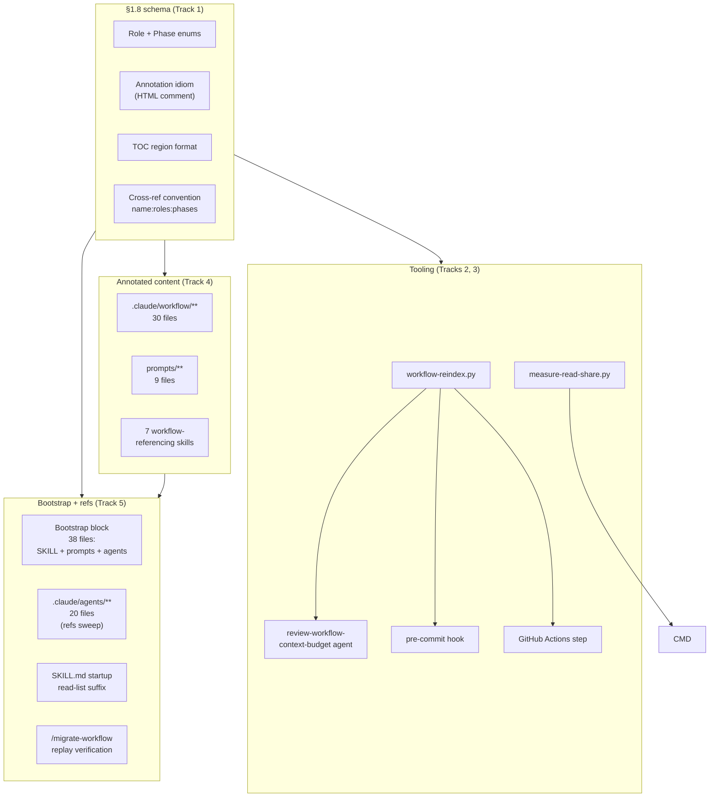

<!-- workflow-sha: 676179cb82295cf15977823a415d5f5476e42526 -->
# Per-document TOC + per-section role/phase annotations

## Design Document
[design.md](design.md)

## High-level plan

### Goals

- Cut the Read tool's share of session context (51.9% portfolio-aggregate baseline cited in YTDB-1023) by giving every agent enough metadata to decide *whether* to open a workflow file and *which section to jump to* before paying the read cost.
- Lock the per-section schema as workflow infrastructure so the anti-pattern (full-file reads when only one section is load-bearing for the calling role and phase) cannot reappear in future workflow documents.
- Ship a standing telemetry mechanism: every future Phase 4 ADR carries a percentages-only token-usage snapshot for its worktree, becoming a trend signal across plans.

### Constraints

- This plan is workflow-modifying: it edits .claude/workflow/** or .claude/skills/**.
- House style applies to every Markdown file authored or modified during the rollout (see conventions.md §1.5).
- Per-section annotations are author-written, not LLM-inferred — LLM-inferred metadata drifts silently. The reindex script is mechanical: scrape, validate, rebuild the TOC. No model in the loop.
- Periodic background runs of the reindex script are explicitly avoided. Checks fire at commit time (pre-commit hook) and CI only.
- All annotation tokens must be drawn from the locked role enum (15 values) and phase enum (10 values, two reserved for YTDB-975). The CI gate fails on out-of-enum tokens.
- The telemetry script publishes percentages only — never absolute token counts. Runs only from a worktree (skipped when invoked from the main checkout). Scope is the worktree's transcript folder over its lifetime.
- This is the first workflow-modifying branch to exercise the §1.7 staging path end-to-end (per conventions.md §1.7(h)). Writes to `.claude/workflow/**` and `.claude/skills/**` route through `_workflow/staged-workflow/`; writes to `.claude/scripts/**`, `.claude/agents/**`, and `.github/workflows/**` go to live paths. `CLAUDE.md` is intentionally out of scope for this plan (general-purpose project guide, not workflow-specific).

### Architecture Notes

#### Component Map

- **Schema layer (Track 1)** — `conventions.md §1.8` is the foundation. Locks the role enum (15 values), phase enum (10 values), per-section annotation idiom, TOC region format, and cross-reference convention. Every other component reads from it.
- **Reindex script + audit agent (Track 2)** — `workflow-reindex.py` is the mechanical Python script that scrapes annotations, rebuilds TOCs, and validates enum tokens. Modes: `--check` (CI / pre-commit) and `--write` (author rebuild). The `review-workflow-context-budget` agent absorbs the audit at PR review time.
- **Telemetry script (Track 3)** — `measure-read-share.py` runs once per Phase 4 ADR creation, from the worktree only. Computes a percentages-only Read% snapshot over the worktree's transcript lifetime; embeds the output in `adr.md`. Updates `prompts/create-final-design.md` to invoke it.
- **Annotated content (Track 4)** — single-commit-style universal rollout of TOC + per-section annotations across 46 files. ~600 annotations, all author-written.
- **Tail (Track 5)** — Bootstrap block insertion across 38 system-prompt files (7 SKILL.md, 11 `.claude/workflow/prompts/*.md`, 20 `.claude/agents/*.md`) plus the `:roles:phases` cross-reference suffix sweep on agent files and SKILL.md startup read-lists. `CLAUDE.md` is intentionally out of scope (general-purpose project guide, not workflow-specific). Migration replay verification on two active branches closes the acceptance criterion.

#### D1: Lock the enum at 15 roles + 10 phases (with 1a/1b reserved)

- **Alternatives considered**: the issue's 10-role enum (folds planner / reviewer-plan / migrator / pr-reviewer / reviewer-design into existing roles); a strict 13-role enum that drops YTDB-975's `1a`/`1b` slots.
- **Rationale**: 15 roles give filter precision the smaller enum loses (e.g., `planner` has a distinct file-load profile from `orchestrator`). `1a`/`1b` are reserved because YTDB-975 is in flight; pre-allocating avoids a second workflow-format commit when YTDB-975 lands.
- **Risks/Caveats**: two phase tokens (`1a`, `1b`) carry zero annotations at rollout. The CI gate must accept enum tokens with no in-file users.
- **Implemented in**: Track 1
- **Full design**: design.md §"Role and phase enums"

#### D2: Per-section annotation as HTML comment on the line after the heading

- **Alternatives considered**: YAML frontmatter at file top (forces a parser per file, drifts from section content); inline annotation in the heading text (breaks Markdown rendering); separate manifest file per workflow doc (drift risk).
- **Rationale**: HTML comment is invisible to humans, parses with a single regex, lives adjacent to the section it describes (no drift between heading and metadata), and Markdown-aware tooling (linters, GitHub renderer) leaves it alone.
- **Risks/Caveats**: long sections push the annotation off-screen, but the in-file TOC mirrors the comment so the cost is recoverable from the top of the file.
- **Implemented in**: Track 1 (schema), Track 4 (rollout)
- **Full design**: design.md §"Annotation idiom and TOC region"

#### D4: Telemetry script runs from worktree only; skips when run from main

- **Alternatives considered**: cross-repo aggregation (anonymization burden, single-project ADR scope makes it unnecessary); rolling 30-day window (less reproducible across ADRs of different durations); raw token counts (open-source repo, privacy posture).
- **Rationale**: each plan = single feature on a single branch by project convention. The worktree's `~/.claude/projects/<encoded-worktree-cwd>/` transcript folder is the right scope; lifetime-of-worktree is the right window; percentages-only is publication-safe. The main-checkout skip prevents meaningless aggregate measurements from accumulated cross-plan history.
- **Risks/Caveats**: ADRs of plans that ran without a dedicated worktree get a skip notice instead of stats — fine, the notice documents the convention.
- **Implemented in**: Track 3
- **Full design**: design.md §"Telemetry script"

#### D5: Reindex script at `.claude/scripts/workflow-reindex.py`, mechanical Python, no LLM

- **Alternatives considered**: dedicated `.claude/skills/reindex-workflow/SKILL.md`; integration into existing `design-mechanical-checks.py`.
- **Rationale**: Python parallel to existing `design-mechanical-checks.py` and `render-slim-plan.py` keeps similar tooling co-located. No LLM call per the issue's "mechanical pass" requirement. Standalone script invokable from pre-commit hooks and CI without spawning a Claude session. SKILL.md form would be over-engineered for a mechanical script.
- **Risks/Caveats**: script must stay portable (Python 3, no special deps beyond stdlib).
- **Implemented in**: Track 2
- **Full design**: design.md §"Reindex script"

#### D6: Agent files get refs-only suffix sweep plus bootstrap block (no per-section annotations)

- **Alternatives considered**: full annotation parity with workflow docs (no Read-tool savings to capture); exclude agent files entirely (loses the outgoing-ref filter benefit); refs-only without bootstrap (leaves the agent unable to use the TOC protocol on its first workflow-file Read).
- **Rationale**: agent `.md` files are loaded as system prompts when sub-agents spawn. The Read tool never opens them, so per-section annotations would not save Read-tool tokens. Outgoing workflow-doc refs still benefit from the `:roles:phases` suffix. A bootstrap block at the top of each agent file teaches the spawned sub-agent the TOC-aware reading protocol before its first workflow-file Read.
- **Risks/Caveats**: structural asymmetry in the codebase (some `.md` files carry TOC, some don't). Mitigated by the schema enumerating which file paths get TOC annotations and which carry the bootstrap.
- **Implemented in**: Track 5

#### D7: Migration replay is a no-op for this plan; verification confirms drift-gate normalization

- **Alternatives considered**: full content migration replay (no `_workflow/**` artifact-shape change to replay); skip verification (acceptance criterion explicitly calls for two-branch verification).
- **Rationale**: this plan changes workflow rules and tooling but does not change `_workflow/**` artifact shape, so `/migrate-workflow` has no content to replay onto branch artifacts. The workflow-sha bump on develop is what other branches' drift gates pick up; their normalization path produces a single stamp-rewrite commit (or skips silently if stamps were already uniform). Verification on at least two active branches confirms the path runs clean.
- **Risks/Caveats**: a branch that gains `_workflow/**` between this plan's start and merge might hit unexpected drift state. Bounded by branch count and time window; surfaced by drift gate's existing prompt.
- **Implemented in**: Track 5
- **Full design**: design.md §"Migration replay semantics"

#### D8: Bootstrap block embedded in every workflow-related system prompt

- **Alternatives considered**: rely only on the file-level cross-ref filter (chicken-and-egg: the cross-ref protocol is defined in `conventions.md §1.8` — the very file the agent is supposed to filter before opening); add a single bootstrap doc loaded once per session (still requires a Read; same problem); embed the bootstrap in `CLAUDE.md` (user-rejected: `CLAUDE.md` is general-purpose, not workflow-specific).
- **Rationale**: system prompts (SKILL.md, `.claude/workflow/prompts/*.md`, `.claude/agents/*.md`) are loaded by the harness or as Agent-tool prompt content without a prior Read call. A spawned sub-agent does not share context with its parent, so the protocol must be present in its own system prompt. A ~30-line bootstrap block at the top of every workflow-related system prompt teaches the agent the TOC-aware reading protocol before its first Read.
- **Risks/Caveats**: ~30 lines of system-prompt overhead per file × 38 files. Negligible against the YTDB-1023 Read-share baseline (51.9% of session context). A bigger risk is drift — a future role/phase rename would leave bootstrap blocks stale. Mitigated by the reindex script's rule 8 (presence check; literal heading match).
- **Implemented in**: Track 5
- **Full design**: design.md §"Bootstrap protocol for agent system prompts"

### Invariants

- I1 — Every annotated `##`/`###` heading is followed by exactly one annotation comment on the next line.
- I2 — Every annotated file carries exactly one TOC region; the TOC's section list matches the file's `^##` headings 1:1 (and selected `^###` where authored).
- I3 — All role and phase tokens in annotations are drawn from the locked enums in `conventions.md §1.8`. Out-of-enum tokens fail CI.
- I4 — `measure-read-share.py` never emits absolute token counts. Output is percentages only, plus session and file count.
- I5 — Every in-scope system-prompt file (7 SKILL.md, 11 `.claude/workflow/prompts/*.md`, 20 `.claude/agents/*.md`) carries the bootstrap block (literal heading `## Reading workflow files (TOC protocol)`) at the top, between frontmatter and main body. The reindex script's rule 8 enforces presence.

### Integration Points

- Pre-commit hook (new) calls `workflow-reindex.py --check` and fails the commit when annotated files diverge from the schema.
- GitHub Actions workflow (new or extended) calls the same script with `--check` for PR validation.
- `.claude/agents/review-workflow-context-budget.md` agent invokes the script during workflow-machinery code review.
- `prompts/create-final-design.md` invokes `measure-read-share.py` before writing `adr.md`; the output is embedded as a standard section.

### Non-Goals

- Cross-repo / cross-project telemetry aggregation. Published ADR section reports this worktree only.
- Annotations on Phase 4 final artifacts (`design-final.md`, `adr.md`). The scheme covers ephemeral `_workflow/**` artifacts not at all; durable post-merge artifacts don't carry annotations.
- Adding annotations for the `1a` / `1b` phase tokens until YTDB-975 lands. Those slots stay reserved without users.
- Backward-compatible support for un-annotated workflow files after rollout. Every in-scope file MUST carry the schema after Track 4 lands.
- `CLAUDE.md` cross-reference suffix application. CLAUDE.md is a general-purpose project guide loaded by every session regardless of role or phase; the file-level filter does not apply. The §1.8 schema, the cross-reference convention, and the bootstrap block all skip CLAUDE.md by design.
- Bootstrap block on non-workflow-related skill files (e.g., `ai-tells`, `run-jmh-benchmarks-hetzner`, `profile-jmh-regressions`). Those skills do not Read files under `.claude/workflow/` or `.claude/skills/` at runtime; the bootstrap would be inert text. Scope is limited to the 7 workflow-referencing SKILL.md files enumerated in Track 5.

## Checklist

- [ ] Track 1: Schema definition (`conventions.md §1.8`)
  > Lock the role enum, phase enum, per-section annotation idiom, TOC region format, and cross-reference convention in a new `§1.8` of `conventions.md`. This section is the foundation every subsequent track reads from; it must land first.
  > **Scope:** ~3 steps covering the §1.8 authoring (enums + idiom + TOC + cross-ref), the §1.1 glossary cross-link, and a worked-example block (one annotated section + one TOC region).

- [ ] Track 2: Reindex script + CI gate + audit agent updates
  > Build `.claude/scripts/workflow-reindex.py` (mechanical Python; `--check` and `--write` modes; stdlib only). Wire a pre-commit hook and a GitHub Actions step. Update `.claude/agents/review-workflow-context-budget.md` to absorb the audit. Tests under `.claude/scripts/tests/`.
  > **Scope:** ~5 steps covering script core (scrape + validate + rebuild), modes and exit codes, hook + CI wiring, audit-agent updates, and tests.
  > **Depends on:** Track 1

- [ ] Track 3: Telemetry script + Phase 4 prompt integration
  > Build `.claude/scripts/measure-read-share.py` — worktree-scoped, lifetime window, percentages-only output, skips when run from the main checkout. Update `prompts/create-final-design.md` to invoke the script and embed its output as a standard "Token usage telemetry" section in `adr.md`. Tests under `.claude/scripts/tests/`.
  > **Scope:** ~4 steps covering script core (jsonl walk + tool-result tally), worktree-vs-main detection, Phase 4 prompt update, and tests.

- [ ] Track 4: Universal annotation rollout (46 files)
  > Author per-section TOC + annotations for every in-scope file: 30 under `.claude/workflow/`, 9 under `.claude/workflow/prompts/`, and 7 workflow-referencing skill files. ~600 annotations, all author-written. Run `workflow-reindex.py --write` to scaffold TOC tables, then hand-correct per-section `roles=`, `phases=`, `summary=`. Land in a single logical batch so the schema becomes universally applicable on one commit (or a small adjacent group; squash-merge collapses anyway).
  > **Scope:** ~6 steps covering workflow root (split into two batches by file count), prompts, skills, validation pass, and a final reindex `--check` green run.
  > **Depends on:** Track 1, Track 2

- [ ] Track 5: Bootstrap block + agent files refs sweep + migration verification
  > Insert the bootstrap protocol block (~30 lines, per design §"Bootstrap protocol for agent system prompts") at the top of 38 system prompts: 7 SKILL.md files, 11 `.claude/workflow/prompts/*.md`, and 20 `.claude/agents/*.md`. Apply the `name:roles:phases` cross-reference suffix to outgoing workflow-doc refs in the 20 agent files and to SKILL.md startup read-lists. Then verify `/migrate-workflow` replays cleanly onto at least two active branches per the acceptance criterion — expected to be a stamp-rewrite-only normalization since this plan doesn't change `_workflow/**` artifact shape.
  > **Scope:** ~6 steps covering bootstrap insertion (38 files, batched by category), agent files refs sweep, SKILL.md read-list suffix sweep, migration replay test on branch A, migration replay test on branch B, final validation.
  > **Depends on:** Track 4

## Plan Review
- [ ] Plan review (consistency + structural) — autonomous; runs as the first phase of `/execute-tracks`

## Final Artifacts
- [ ] Phase 4: Final artifacts (`design-final.md`, `adr.md`)
