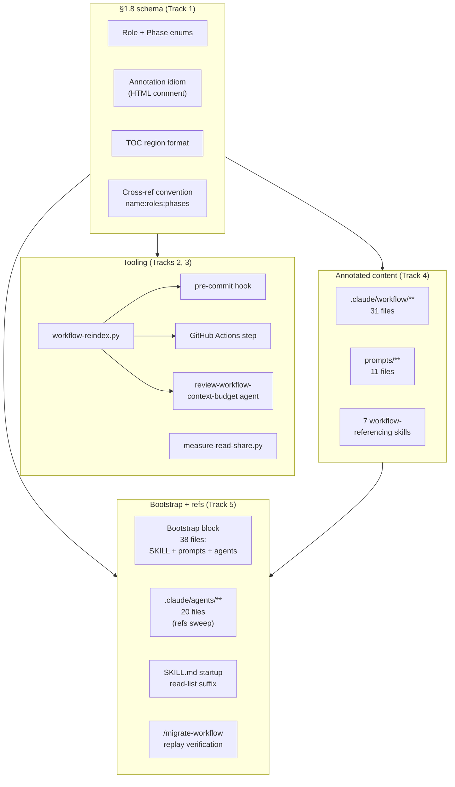

<!-- workflow-sha: 367f5f83f1bce0e98eaeb0679973f9728db64b61 -->
# Per-document TOC + per-section role/phase annotations

## Design Document
[design.md](design.md)

## High-level plan

### Goals

- Cut the Read tool's share of session context (51.9% portfolio-aggregate baseline cited in YTDB-1023) by giving every agent enough metadata to decide *whether* to open a workflow file and *which section to jump to* before paying the read cost.
- Lock the per-section schema as workflow infrastructure so the anti-pattern (full-file reads when only one section is load-bearing for the calling role and phase) cannot reappear in future workflow documents.
- Ship a standing telemetry mechanism: every future Phase 4 ADR carries a percentages-only token-usage snapshot for its worktree, becoming a trend signal across plans.

### Constraints

- This plan is workflow-modifying: it edits .claude/workflow/** or .claude/skills/**.
- House style applies to every Markdown file authored or modified during the rollout (see conventions.md §1.5).
- Per-section annotations are author-written, not LLM-inferred — LLM-inferred metadata drifts silently. The reindex script is mechanical: scrape, validate, rebuild the TOC. No model in the loop.
- Periodic background runs of the reindex script are explicitly avoided. Checks fire at commit time (pre-commit hook) and CI only.
- All annotation tokens must be drawn from the locked role enum (15 values) and phase enum (8 values). The CI gate fails on out-of-enum tokens.
- The telemetry script publishes percentages only — never absolute token counts. Runs only from a worktree (skipped when invoked from the main checkout). Scope is the worktree's transcript folder over its lifetime.
- This is the first workflow-modifying branch to exercise the §1.7 staging path end-to-end (per conventions.md §1.7(h)). Writes to `.claude/workflow/**` and `.claude/skills/**` route through `_workflow/staged-workflow/`; writes to `.claude/scripts/**`, `.claude/agents/**`, and `.github/workflows/**` go to live paths. `CLAUDE.md` is intentionally out of scope for this plan (general-purpose project guide, not workflow-specific).

### Architecture Notes

#### Component Map

- **Schema layer (Track 1)** — `conventions.md §1.8` is the foundation. Locks the role enum (15 values), phase enum (8 values), per-section annotation idiom, TOC region format, and cross-reference convention. Every other component reads from it.
- **Reindex script + audit agent (Track 2)** — `workflow-reindex.py` is the mechanical Python script that scrapes annotations, rebuilds TOCs, and validates enum tokens. Modes: `--check` (CI / pre-commit) and `--write` (author rebuild). The `review-workflow-context-budget` agent absorbs the audit at PR review time.
- **Telemetry script (Track 3)** — `measure-read-share.py` runs once per Phase 4 ADR creation, from the worktree only. Computes a percentages-only Read% snapshot over the worktree's transcript lifetime; embeds the output in `adr.md`. Updates `prompts/create-final-design.md` to invoke it.
- **Annotated content (Track 4)** — single-commit-style universal rollout of TOC + per-section annotations across 49 files (~600 annotations, all author-written), plus conversion of every Markdown link to an in-scope `.md` target into a bare `name.md:roles:phases` cross-file ref and backtick-wrapping of non-annotatable targets (D13).
- **Tail (Track 5)** — Bootstrap block insertion across 38 system-prompt files (7 SKILL.md, 11 `.claude/workflow/prompts/*.md`, 20 `.claude/agents/*.md`) plus the `:roles:phases` cross-reference suffix sweep on agent files and SKILL.md startup read-lists. `CLAUDE.md` is intentionally out of scope (general-purpose project guide, not workflow-specific). Migration replay verification on two active branches closes the acceptance criterion.

#### D1: Lock the enum at 15 roles + 8 phases

- **Alternatives considered**: a smaller 10-role enum from the original issue (folds planner / reviewer-plan / migrator / pr-reviewer / reviewer-design into existing roles); pre-allocating two phase slots (`1a`, `1b`) for YTDB-975's in-flight Phase 1 sub-split.
- **Rationale**: 15 roles give filter precision the smaller enum loses (e.g., `planner` has a distinct file-load profile from `orchestrator`). Pre-allocated phase slots were rejected: they would pre-empt YTDB-975's design choices on its own branch, and the "second workflow-format commit" savings claim does not hold — YTDB-975's eventual merge into develop already trips the drift gate on every active branch, with or without the pre-allocation.
- **Risks/Caveats**: future workflow features needing a new role or phase token require a workflow-format commit; the drift gate then fires on every active branch and routes affected branches through `/migrate-workflow`. The cost is acceptable: the same cost would land whether slots are pre-allocated or not.
- **Implemented in**: Track 1
- **Full design**: design.md §"Role and phase enums"

#### D2: Per-section annotation as HTML comment on the line after the heading

- **Alternatives considered**: YAML frontmatter at file top (forces a parser per file, drifts from section content); inline annotation in the heading text (breaks Markdown rendering); separate manifest file per workflow doc (drift risk).
- **Rationale**: HTML comment is invisible to humans, parses with a single regex, lives adjacent to the section it describes (no drift between heading and metadata), and Markdown-aware tooling (linters, GitHub renderer) leaves it alone.
- **Risks/Caveats**: long sections push the annotation off-screen, but the in-file TOC mirrors the comment so the cost is recoverable from the top of the file.
- **Implemented in**: Track 1 (schema), Track 4 (rollout)
- **Full design**: design.md §"Annotation idiom and TOC region"

*D3 was dropped during Phase 1 design refinement. See `design-mutations.md` Mutation 2.*

#### D4: Telemetry script runs from worktree only; skips when run from main

- **Alternatives considered**: cross-repo aggregation (anonymization burden, single-project ADR scope makes it unnecessary); rolling 30-day window (less reproducible across ADRs of different durations); raw token counts (open-source repo, privacy posture).
- **Rationale**: each plan = single feature on a single branch by project convention. The worktree's `~/.claude/projects/<encoded-worktree-cwd>/` transcript folder is the right scope; lifetime-of-worktree is the right window; percentages-only is publication-safe. The main-checkout skip prevents meaningless aggregate measurements from accumulated cross-plan history.
- **Risks/Caveats**: ADRs of plans that ran without a dedicated worktree get a skip notice instead of stats — fine, the notice documents the convention.
- **Implemented in**: Track 3
- **Full design**: design.md §"Telemetry script"

#### D5: Reindex script at `.claude/scripts/workflow-reindex.py`, mechanical Python, no LLM

- **Alternatives considered**: dedicated `.claude/skills/reindex-workflow/SKILL.md`; integration into existing `design-mechanical-checks.py`.
- **Rationale**: Python parallel to existing `design-mechanical-checks.py` and `render-slim-plan.py` keeps similar tooling co-located. No LLM call per the issue's "mechanical pass" requirement. Standalone script invokable from pre-commit hooks and CI without spawning a Claude session. SKILL.md form would be over-engineered for a mechanical script.
- **Risks/Caveats**: script must stay portable (Python 3, no special deps beyond stdlib).
- **Implemented in**: Track 2
- **Full design**: design.md §"Reindex script"

#### D6: Agent files get refs-only suffix sweep plus bootstrap block (no per-section annotations)

- **Alternatives considered**: full annotation parity with workflow docs (no Read-tool savings to capture); exclude agent files entirely (loses the outgoing-ref filter benefit); refs-only without bootstrap (leaves the agent unable to use the TOC protocol on its first workflow-file Read).
- **Rationale**: agent `.md` files are loaded as system prompts when sub-agents spawn. The Read tool never opens them, so per-section annotations would not save Read-tool tokens. Outgoing workflow-doc refs still benefit from the `:roles:phases` suffix. A bootstrap block at the top of each agent file teaches the spawned sub-agent the TOC-aware reading protocol before its first workflow-file Read.
- **Risks/Caveats**: structural asymmetry in the codebase (some `.md` files carry TOC, some don't). Mitigated by the schema enumerating which file paths get TOC annotations and which carry the bootstrap.
- **Implemented in**: Track 5
- **Full design**: design.md §"Files and surfaces out of scope" (exclusion 1), design.md §"Bootstrap protocol for agent system prompts" → §"Scope and uniformity"
- **Revised by D13**: the cross-file `:roles:phases` suffix is no longer agent-file-exclusive — D13 widens it to every in-scope workflow doc and prompt. D6's agent-file scope (refs-only sweep, no per-section annotations, bootstrap block) is unchanged.

#### D7: Migration replay is a no-op for this plan; verification confirms drift-gate normalization

- **Alternatives considered**: full content migration replay (no `_workflow/**` artifact-shape change to replay); skip verification (acceptance criterion explicitly calls for two-branch verification).
- **Rationale**: this plan changes workflow rules and tooling but does not change `_workflow/**` artifact shape, so `/migrate-workflow` has no content to replay onto branch artifacts. The workflow-sha bump on develop is what other branches' drift gates pick up; their normalization path produces a single stamp-rewrite commit (or skips silently if stamps were already uniform). Verification on at least two active branches confirms the path runs clean.
- **Risks/Caveats**: a branch that gains `_workflow/**` between this plan's start and merge might hit unexpected drift state. Bounded by branch count and time window; surfaced by drift gate's existing prompt.
- **Implemented in**: Track 5
- **Full design**: design.md §"Migration replay semantics"

#### D8: Bootstrap block embedded in every workflow-related system prompt

- **Alternatives considered**: rely only on the file-level cross-ref filter (chicken-and-egg: the cross-ref protocol is defined in `conventions.md §1.8` — the very file the agent is supposed to filter before opening); add a single bootstrap doc loaded once per session (still requires a Read; same problem); embed the bootstrap in `CLAUDE.md` (user-rejected: `CLAUDE.md` is general-purpose, not workflow-specific).
- **Rationale**: system prompts (SKILL.md, `.claude/workflow/prompts/*.md`, `.claude/agents/*.md`) are loaded by the harness or as Agent-tool prompt content without a prior Read call. A spawned sub-agent does not share context with its parent, so the protocol must be present in its own system prompt. A ~30-line bootstrap block at the top of every workflow-related system prompt teaches the agent the TOC-aware reading protocol before its first Read.
- **Risks/Caveats**: ~30 lines of system-prompt overhead per file × 38 files. Negligible against the YTDB-1023 Read-share baseline (51.9% of session context). A bigger risk is drift — a future role/phase rename would leave bootstrap blocks stale. Mitigated by the reindex script's rule 7 (presence check; literal heading match).
- **Implemented in**: Track 5
- **Full design**: design.md §"Bootstrap protocol for agent system prompts"
- **Note (D13):** D13's widening reinforces D8 — once workflow docs and prompts carry cross-file suffixes, a spawned sub-agent needs the bootstrap block to apply the filter from its first Read. The bootstrap scope (38 system-prompt files) is unchanged.

#### D9: In-file `§X.Y(z)` references auto-stamped by the reindex script with target-derived suffix

- **Alternatives considered**: hand-written in-file suffix (uniform with cross-file refs, but every annotation edit forces an N-site author sweep; drift is silent until a reader notices); plain in-file refs (no suffix, no jump filter at the ref site — defeats the section-level layer's purpose for the agent reading inline refs); section-only suffix (only `§X.Y` granularity, no `§X.Y(z)` sub-section precision — loses the sub-section precision the locked density rule depends on).
- **Rationale**: in-file refs are common, target annotations live in the same file (mechanical resolution), and the citer almost always means the target's full annotation rather than a narrow slice. Auto-stamping eliminates author burden and makes drift mechanically detectable. The cross-file case stays hand-written because the citer's slice is genuinely narrower than the target's full annotation in many cases (an orchestrator-and-implementer agent citing `conventions.md §1.6` for the migration-only stamp rule wants `migrator:3A,3B,3C,4` recorded, not the heading's full set); the reindex script subset-validates the slice per D10, catching drift without forcing equality.
- **Risks/Caveats**: drift after a target's annotation edit is bounded by the next CI run; `workflow-reindex.py --write` is the one-step fix. A typo in the section anchor (`§1.6(d)` when only `(a)-(c)` exist) lands as an unresolved-ref blocker rather than silently auto-stamping the wrong heading. Author confusion between hand-vs-auto: the design's Cross-reference convention spells out cross-file vs in-file as the split, with `§X.Y(z)` shape allowed in both forms.
- **Implemented in**: Track 1 (convention in `conventions.md §1.8`), Track 2 (auto-stamp implementation in `workflow-reindex.py`)
- **Full design**: design.md §"Cross-reference convention" → §"In-file reference auto-stamping", design.md §"Reindex script" → §"Validation rules" rule 8
- **Revised by D13**: D9's hand-written-cross-file rule now covers cross-file refs in all workflow docs and prompts, not only agent files / SKILL read-lists. The in-file auto-stamping mechanism (D9's subject) is unchanged.

#### D10: Subset-validate cross-file ref suffixes against target annotations

- **Alternatives considered**: presence-only check (the original design before this enhancement — drift went silently undetected and surfaced only when a reader tripped on a stale suffix); auto-stamping cross-file refs from the target's full annotation (rejected by D9 — destroys the citer's narrower-slice expressiveness, which is the whole point of the hand-written form).
- **Rationale**: D9's rationale already documents cross-file refs as "narrower than the target's full annotation" — that phrasing is a subset relationship and the script can mechanically check it. For each cross-file ref `name.md§X.Y:roles:phases`, the script parses the target's annotation at the cited section and verifies `citer.roles ⊆ target.roles` AND `citer.phases ⊆ target.phases`. Catches the real drift case (target tightened, citer claims a token the target no longer has) without forcing equality. Implementation cost is +30 lines of Python on top of the existing rule 6 parsing.
- **Risks/Caveats**: false negative for the "citer is too narrow" case (a valid subset that no longer matches the citer's intent) — mechanically undetectable, stays a human-review concern. Sub-section refs resolve to that section's annotation directly; file-level refs without a section anchor resolve to the union of every section's annotations in the target file. The CI error names both sides so the author chooses whether to widen the citer or restore the target.
- **Implemented in**: Track 2 (subset check extension to rule 6 in `workflow-reindex.py`)
- **Full design**: design.md §"Reindex script" → §"Validation rules" rule 6, design.md §"Cross-reference convention" → §"In-file reference auto-stamping" (the "Cross-file drift detection" bold paragraph inside)
- **Revised by D13**: the rule 6 subset check now validates cross-file refs in all workflow docs and prompts. Non-annotatable targets (no annotation to validate against) are backtick-wrapped and excluded rather than suffixed.

#### D11: Track 2 introduces the `WC / WP / WI / WH / WB / WS` finding-prefix family on the six `review-workflow-*` agents

- **Alternatives considered**: keep the agents' existing severity-labeled output (`Critical / Recommended / Minor`) without per-finding numeric IDs; scope the prefix to `review-workflow-context-budget` only and accept format asymmetry across the six dim-review agents.
- **Rationale**: the plan/track review prefix family (`CR<N>`, `S<N>`, `T<N>`, `R<N>`, `A<N>`) per `review-iteration.md` already lets reviewers cite findings by ID in PR threads and follow-up commits (`Review fix: WB3 — ...`). The six `review-workflow-*` agents (`consistency`, `prompt-design`, `instruction-completeness`, `hook-safety`, `context-budget`, `writing-style`) currently emit free-prose bullets under `Critical / Recommended / Minor` headings — no per-finding ID. Extending the prefix uniformly to all six (`WC / WP / WI / WH / WB / WS`) aligns the agents with the canonical family already defined in `.claude/workflow/review-iteration.md` § Finding ID prefixes and `.claude/workflow/review-agent-selection.md`. The prefix lives alongside (not instead of) the severity labels: each finding stays under `Critical | Recommended | Minor` and additionally carries the numeric ID.
- **Risks/Caveats**: scope-up vs the original context-budget-only proposal — five additional agent-prompt edits in Track 2 Step 5, all template-bound. PR threads citing the old severity-only format are not affected.
- **Implemented in**: Track 2
- **Full design**: design.md §"CI gate semantics" → §"Agent-side absorption"

#### D12: Reindex script self-bootstraps enum tokens via staged-aware probe of `conventions.md §1.8`

- **Alternatives considered**: hard-coded enum literals in the script with a `--check-enum-sync` validation against `conventions.md §1.8` (simpler bootstrap, but enum changes need edits at two sites); deferring rule 5's enum-token check until Phase 4 promote (leaves a CI-gate hole on this branch and every other workflow-modifying branch until promote).
- **Rationale**: the `§1.7(d)` reads-precedence rule is already the established pattern for resolving `.claude/workflow/**` paths on a workflow-modifying branch — the staged copy is authoritative when present, the live path is the fallback. Extending the same precedence to `workflow-reindex.py` (CI + pre-commit consumers, outside the original "implementer's per-spawn read site only" carve-out) keeps one consistent reads-precedence pattern across the convention, makes the script work correctly on this branch before Phase 4 promote, and avoids hard-coding enum values in two places. T3's hook-regex widening already requires the script to know about staged paths, so the bootstrap probe shares discovery infrastructure.
- **Risks/Caveats**: a probe finding two staged conventions.md candidates (multiple `docs/adr/*/_workflow/staged-workflow/.claude/workflow/conventions.md` matches across multiple workflow-modifying plans in the same worktree) is ambiguous; the script halts with exit 2 rather than picking one. The one-plan-per-branch project convention bounds this to a single match in practice.
- **Implemented in**: Track 2 (Step 1 — bootstrap probe in discovery code; Step 2 — rule 5 reads bootstrap output for enum-token validation)
- **Full design**: design.md §"Reindex script" → §"Discovery mechanism" (consumes the same staged-aware path the bootstrap probe enumerates), conventions.md §1.7(d) (the reads-precedence rule whose scope this DR extends)

#### D13: Cross-file `:roles:phases` suffix convention applies to all workflow docs and prompts (widened during Track 4)

- **Alternatives considered**: narrow-rescope rule_6 so its "missing suffix" check fires only on agent files + SKILL.md startup read-lists (the original D6/D8 scope), leaving workflow-doc/prompt prose and Markdown links unflagged; a script-side allowlist of non-annotatable targets so links to them pass without a suffix and without backticks.
- **Rationale**: Track 4 Step 2 found `workflow-reindex.py` rule_6 flags every non-backticked, non-fenced bare `name.md` token — Markdown link targets, link text, and bare prose mentions — so the Step 9 full-set green `--check` is unreachable while workflow docs carry plain links. The chosen fix converts every Markdown link to an in-scope `.md` target in workflow docs and prompts into the bare `name.md:roles:phases` form, so the load-on-demand filter (the core YTDB-1023 goal) rides at every cross-file reference site, not only agent files. References to non-annotatable targets (`CLAUDE.md`, `MEMORY.md`, `design.md`, `design-mechanics.md`, the Phase 4 final artifacts, `output-styles/house-style.md`, and `.claude/agents/*.md` cited as a target) are backtick-wrapped; the existing §1.8(e) inline-backtick exclusion exempts them with no script change. rule_6 keeps its broad behavior as the intended contract.
- **Risks/Caveats**: a large conversion across the in-scope workflow docs and prompts, and the loss of clickable Markdown links between workflow docs (the suffixed bare ref replaces the link). Reopens Track 1 §1.8(e) (schema widening, landed in the inline-replan commit) and Step 2's 9 already-annotated files (a link-conversion pass). A converted cross-file ref to a not-yet-annotated target stays rule_6-RED until the target is annotated; the full green lands at Step 9. The script-allowlist alternative was rejected to avoid a third script reopen and a drift-prone maintained list; narrow-rescope was rejected because it discards the filter at every workflow-doc ref site.
- **Implemented in**: Track 1 §1.8(e) (revised — inline-replan commit), Track 4 (revised Steps — link-conversion folded into the annotation steps plus a pass over Step 2's files)
- **Full design**: design.md §"Cross-reference convention" reconciliation deferred to Phase 4 `design-final.md` — the frozen Phase-1 narrative still scopes the suffix to agent files + SKILL read-lists, and §"Files and surfaces out of scope" exclusion 1 frames the suffix as an agent-file sweep; both widen at `design-final.md`. conventions.md §1.8(e) carries the live contract.
- **Revised by D14**: D13's "avoid a third script reopen" rationale is superseded. Track 4's first conversion attempt found `build_file_lookup` resolves converted-ref targets live-first (to un-annotated live copies), so converted refs fail rule 6 permanently; D14 makes the lookup staged-aware. D13's suffix-widening scope and backtick-wrap-for-non-annotatable-targets decisions are unchanged.

#### D14: `build_file_lookup` resolves cross-file ref targets staged-first (third reindex reopen)

- **Alternatives considered**: keep the live-first lookup and accept rule 6 subset-RED on every converted ref until Phase 4 promotion (redefining the Step 9 green criterion away, which abandons I7's mechanical validation for cross-file refs); revert D13 to the narrow agent-files-only scope so no converted workflow-doc refs exist (re-opens the original rule_6 ADJUST, since plain links stay missing-suffix-RED).
- **Rationale**: Track 4's first conversion attempt found `workflow-reindex.py`'s `build_file_lookup` keys targets on the bare basename and iterates `IN_SCOPE_GLOBS` live-before-staged with first-match-wins, so a converted ref like `conventions.md§1.7:orchestrator:3B` resolves to the live develop-state copy, which carries no per-section annotations on a workflow-modifying branch, and fails rule 6's subset check permanently. D13's "avoid a third script reopen" rested on the unverified assumption that a converted ref validates against the annotated target; on a workflow-modifying branch the annotated target is the staged copy. The fix extends the staged-first reads-precedence already established for the §1.8 enum bootstrap probe (§1.7(d)/D12) to cross-file ref target resolution: when a basename resolves to both a live and a staged copy, prefer the staged copy keyed by its relative `.claude/...` path. This restores the Idempotence model the plan already describes (the dangling-ref window clears as each staged target is annotated) and keeps I7's mechanical validation alive for cross-file refs.
- **Risks/Caveats**: third reopen of `workflow-reindex.py` (Step 1 was the first this track; Track 2 the original author). Forward-safe: on `develop` and non-workflow-modifying branches no staged copy exists, so the lookup stays pure-live and behaviour is unchanged. A probe finding multiple staged copies of one target across multiple workflow-modifying plans in a single worktree is ambiguous; the lookup reuses the enum probe's exit-2 halt rather than guessing (bounded to one match by the one-plan-per-branch convention). The same live-first resolution would otherwise have hit Track 5's agent-file ref sweep; this fix unblocks both.
- **Implemented in**: Track 4 (new HIGH-risk script-fix step ahead of the conversion batches)
- **Full design**: design.md §"Reindex script" → §"Discovery mechanism" reconciliation deferred to Phase 4 `design-final.md` (joins the deferred-drift basket alongside the D13 cross-ref-convention narrative and the Track 3 discovery-glob drift); conventions.md §1.7(d) (the reads-precedence rule this DR extends), §1.8(e) (the live cross-file-ref contract).
- **Note (D15)**: Track 4's batch-2 conversion attempt surfaced a fourth reopen — `build_file_lookup`'s bare-basename key collides between the workflow-root `structural-review.md` and its `prompts/` namesake. See D15. D14's staged-vs-live target resolution is unchanged.

#### D15: `build_file_lookup` resolves a bare-basename cross-file ref to the workflow-root file when a prompts namesake exists (fourth reindex reopen)

- **Alternatives considered**: add a disambiguating `workflow/<name>.md` ref form to §1.8(e) for collision cases (a new path form authors must remember, asymmetric with the bare-everywhere convention); backtick-wrap the six workflow-root `structural-review.md` refs as if non-annotatable (drops the load-on-demand filter at those sites for a genuinely annotatable target, against D13's filter-everywhere contract, and still needs a DR note).
- **Rationale**: Track 4's batch-2 conversion attempt found that `workflow-reindex.py`'s `build_file_lookup` records the bare-basename key for both a `.claude/workflow/` root file and its `.claude/workflow/prompts/` namesake, and first-match-wins (the prompts path sorts first under the `.claude/workflow/**/*.md` glob) hands the bare key to the prompt. The workflow-root `structural-review.md` then has no reachable cross-file key, so the converted cross-file refs that mean it (`planning.md` ×2, `review-iteration.md`, `conventions.md`, `implementation-review.md`) resolve to the wrong file or fail subset validation permanently. §1.8(e) already states the convention the lookup violates: a workflow-root file is referenced bare, a prompt with the `prompts/` prefix. The fix makes a prompts file claim the bare-basename key only when no workflow-root namesake exists, so the bare key resolves to the workflow-root file. This is a bug fix toward the stated convention; it keeps D13's filter at all those sites. The collision set is bounded and enumerable (one pair today: `structural-review.md`); SKILL.md basenames never appear bare in a cross-file ref, so they are unaffected.
- **Risks/Caveats**: fourth reopen of `workflow-reindex.py` (Step 1 fence-exclusion, Step 3 staged-aware lookup, and Track 2's original author were the prior three). Forward-safe: where the globs yield one file per key (every non-colliding basename, and the whole live tree on `develop`) the new precedence clause is a no-op. The implementation must keep the bare-key fallback for prompts-only basenames (a prompt with no workflow-root namesake retains its bare key) so existing bare prompt refs do not break. Landed as a HIGH-risk script-fix step ahead of the conversion batches, mirroring Step 3 (D14); the same collision would otherwise have hit Track 5's agent-file ref sweep, so this unblocks both.
- **Implemented in**: Track 4 (new HIGH-risk script-fix step ahead of the conversion batches)
- **Full design**: design.md §"Reindex script" → §"Discovery mechanism" reconciliation deferred to Phase 4 `design-final.md` (joins the deferred-drift basket alongside the D13 cross-ref-convention narrative, the D14 staged-resolution drift, and the Track 3 discovery-glob drift); conventions.md §1.8(e) (the bare-vs-`prompts/` cross-file-ref path convention the script behavior conforms to).
- **Note (D16)**: Track 4's skill-annotation attempt surfaced a fifth reopen — `build_file_lookup` records no `<skill-dir>/SKILL.md` key, so a SKILL.md cross-file target is unresolvable. See D16. D15's bare-basename / `prompts/` resolution is unchanged.

#### D16: `build_file_lookup` records a `<skill-dir>/SKILL.md` key so SKILL targets resolve (fifth reindex reopen)

- **Alternatives considered**: backtick-wrap every SKILL.md cross-file target as if non-annotatable (drops the load-on-demand filter at SKILL targets, contradicts §1.8(e)'s "path relative to `.claude/skills/`" rule that names a SKILL.md read-list among the cross-file citers, demotes the seven annotated skill files to second-class targets, edits the committed Step 6 product, and forces Track 5 to backtick-wrap every SKILL ref); fold the key addition into the medium-risk skill-annotation step without its own risk tag or dimensional review (contradicts the D14/D15 precedent that every change to the reindex gate's cross-file resolution is a HIGH-risk step).
- **Rationale**: Track 4's skill-annotation attempt found that `workflow-reindex.py`'s `build_file_lookup` records only a bare-basename key (all seven `SKILL.md` files collide on the single `SKILL.md` key) and a `prompts/<name>` key for prompts; it never records a directory-prefixed `<skill-dir>/SKILL.md` key, though its own docstring claims "SKILL.md targets are linked by directory prefix when needed." So Step 6's ref `edit-design/SKILL.md:final-designer:4` in staged `prompts/create-final-design.md` resolves to `None` and fails rule 6 permanently, regardless of how `edit-design/SKILL.md` is annotated. §1.8(e) already prescribes the resolving form (a target's path is relative to the `.claude/skills/` anchor, so `edit-design/SKILL.md` is the correct ref shape), so the script — not the convention — is the defect; no Track 1 schema reopen is needed. The fix records a `<skill-dir>/SKILL.md` key for each `.claude/skills/<dir>/SKILL.md` file, keyed on the logical `.claude/...` path so a staged skill copy keys identically to its live namesake (matching the staged-precedence and `prompts/<name>` keying D14 established). Same class as D14 (live-first resolution) and D15 (bare-basename collision): a script-resolution gap one layer below the annotation work, where the convention commits to the behavior but the lookup lacks the key.
- **Risks/Caveats**: fifth reopen of `workflow-reindex.py` (Step 1 fence-exclusion, Step 3 staged-aware lookup, Step 4 bare-basename collision, and Track 2's original author were the prior four). Forward-safe: the new key appears only for `.claude/skills/*/SKILL.md` files; on `develop` and non-workflow-modifying branches no cross-file ref cites a `<skill-dir>/SKILL.md` target, so the key is inert. The bare-`SKILL.md` collision stays first-match-wins (SKILL.md is never a valid bare cross-file target — ambiguous across the seven anchors), and the `prompts/<name>` key and the Step 3 logical-path multi-staged exit-2 guard are untouched. Landed as a HIGH-risk script-fix step ahead of the skill-annotation step, mirroring Step 3 (D14) and Step 4 (D15); the same gap would otherwise have hit Track 5's agent-ref sweep for any `<dir>/SKILL.md` target, so this unblocks both.
- **Implemented in**: Track 4 (new HIGH-risk script-fix step ahead of the skill-annotation step)
- **Full design**: design.md §"Reindex script" → §"Discovery mechanism" reconciliation deferred to Phase 4 `design-final.md` (joins the deferred-drift basket alongside the D13 cross-ref-convention narrative, the D14 staged-resolution drift, the D15 collision drift, and the Track 3 discovery-glob drift); conventions.md §1.8(e) (the cross-file-ref path convention the script behavior conforms to — already prescribes the `<skill-dir>/SKILL.md` target form).

### Invariants

- I1 — Every annotated `##`/`###` heading is followed by exactly one annotation comment on the next line.
- I2 — Every annotated file carries exactly one TOC region; the TOC's section list matches every `^##` and every `^###` heading 1:1 (no author-judged granularity; the bootstrap-block heading `## Reading workflow files (TOC protocol)` is the sole literal-heading exception).
- I3 — All role and phase tokens in annotations are drawn from the locked enums in `conventions.md §1.8`. Out-of-enum tokens fail CI.
- I4 — `measure-read-share.py` never emits absolute token counts. Output is percentages only, plus session and file count.
- I5 — Every in-scope system-prompt file (7 SKILL.md, 11 `.claude/workflow/prompts/*.md`, 20 `.claude/agents/*.md`) carries the bootstrap block (literal heading `## Reading workflow files (TOC protocol)`) at the top, between frontmatter and main body. The reindex script's rule 7 enforces presence.
- I6 — Every in-file `§X.Y` and `§X.Y(z)` reference carries a `:roles:phases` suffix matching the target heading's current annotation. `workflow-reindex.py --write` is the sole writer; drift (annotation changed, suffix stale) and plain refs both fail CI under rule 8.
- I7 — Every cross-file `name.md:roles:phases` reference's roles and phases are subsets of the target heading's current annotation (equality not required; narrower is the design contract). Citer-not-a-subset fails CI under rule 6 (subset check). The convention applies to all in-scope workflow docs and prompts (D13); a non-annotatable target is backtick-wrapped and excluded. On a workflow-modifying branch the script resolves the target to its staged copy when present, with bare-basename / `prompts/` collision and `<skill-dir>/SKILL.md` keying handled per D14-D16.

### Integration Points

- Pre-commit hook (existing `.githooks/pre-commit` extended with a workflow-reindex block) calls `workflow-reindex.py --check` and fails the commit when annotated files diverge from the schema.
- GitHub Actions workflow (new or extended) calls the same script with `--check` for PR validation.
- `.claude/agents/review-workflow-context-budget.md` agent invokes the script during workflow-machinery code review.
- `prompts/create-final-design.md` invokes `measure-read-share.py` before writing `adr.md`; the output is embedded as a standard section.

### Non-Goals

- Cross-repo / cross-project telemetry aggregation. Published ADR section reports this worktree only.
- Annotations on Phase 4 final artifacts (`design-final.md`, `adr.md`). The scheme covers ephemeral `_workflow/**` artifacts not at all; durable post-merge artifacts don't carry annotations.
- Backward-compatible support for un-annotated workflow files after rollout. Every in-scope file MUST carry the schema after Track 4 lands.
- `CLAUDE.md` cross-reference suffix application. CLAUDE.md is a general-purpose project guide loaded by every session regardless of role or phase; the file-level filter does not apply. The §1.8 schema, the cross-reference convention, and the bootstrap block all skip CLAUDE.md by design. Under D13, a workflow-doc reference *to* `CLAUDE.md` is backtick-wrapped as a non-annotatable target — CLAUDE.md itself stays outside the suffix convention while rule 6 stays green.
- Bootstrap block on non-workflow-related skill files (e.g., `ai-tells`, `run-jmh-benchmarks-hetzner`, `profile-jmh-regressions`). Those skills do not Read files under `.claude/workflow/` or `.claude/skills/` at runtime; the bootstrap would be inert text. Scope is limited to the 7 workflow-referencing SKILL.md files enumerated in Track 5.

## Checklist

- [x] Track 1: Schema definition (`conventions.md §1.8`)
  > Lock the role enum, phase enum, per-section annotation idiom, TOC region format, and cross-reference convention in a new `§1.8` of `conventions.md`. This section is the foundation every subsequent track reads from; it must land first.
  >
  > **Track episode:**
  > §1.8 lands the foundational schema in the staged `conventions.md`: 15-value role enum, 8-value phase enum, HTML-comment annotation idiom, TOC region format under H1, hand-written cross-file / auto-stamped in-file cross-reference convention, read-decision flow, worked example using a constructed `## 99.1 Demo section`, and References footer. §1.1 gained six glossary rows for the load-bearing terms (Bootstrap block carries dual-anchor phrasing for the design.md → design-final.md transition).
  >
  > Phase C dim-review spawned four reviewers (consistency / context budget / writing style / instruction completeness); 10 of 18 synthesised findings landed in `Review fix: bed762c965` and all gate-checks passed at iter-1. The fix-set covered the typo-recovery rule, out-of-enum recovery, bootstrap-exemption rephrase to pure literal-text match, TOC-region-absence rule for files without `## ` headings, the TOC Section cell format spec, fenced-code-block exclusion in cross-file drift detection, a cross-file-with-sub-section format example, an ownership-label fix in this track file, and a BLUF opener swap. Eight findings deferred for design discussion went un-applied at user approval.
  >
  > **Cross-track signals.** Track 2 reviewers: §1.8 now carries prose anchors for the three CI-blocker shapes the reindex script enforces — rule 2 (TOC absence accepted when file has no `## ` headings), rule 5 (out-of-enum tokens), rule 8 (unresolved or stale `§X.Y(z)` anchors). §1.8(e)'s fenced-code-block exclusion paragraph should match the script's validation traversal. Track 4 reviewers: §1.1 glossary's `Bootstrap block` row names placement as "between the frontmatter (when present) and the H1" — match this phrasing on subsequent bootstrap edits. Outstanding design questions (move Mermaid / worked example / enum descriptions out of always-loaded `conventions.md` to cut bootstrap surface; readable-alone vs scope-pointer tradeoff) are unaddressed and may resurface at Track 4 or Phase 4.
  >
  > **Track file:** `plan/track-1.md` (2 steps, 0 failed)
  >
  > **Strategy refresh:** CONTINUE — no plan rewrites needed. Cross-track signals already captured in Track 1's episode (WI7 summary-cap → Track 2 rule 5; §1.8(g) demo heading + glossary table rows → Track 4 reviewer carve-outs; Bootstrap block dual-anchor phrasing → Track 5 + Phase 4) are absorbed by downstream tracks during their own execution.

- [x] Track 2: Reindex script + CI gate + audit agent updates
  > Build `.claude/scripts/workflow-reindex.py` (mechanical Python, `--check` and `--write` modes, stdlib only) and wire it into a pre-commit hook plus a GitHub Actions step. Update `.claude/agents/review-workflow-context-budget.md` to absorb the audit at PR-review time. Tests live under `.claude/scripts/tests/`.
  >
  > **Track episode:**
  > Track 2 lands `workflow-reindex.py` as the mechanical schema validator (≈2200 lines, stdlib-only Python, modes `--check` / `--write`, exit codes 0/1/2, staged-aware §1.8 bootstrap probe per D12) alongside ≈3100 lines of test coverage; restructures `.githooks/pre-commit` into two named functions so the workflow-reindex block runs unconditionally other than the JetBrains-remote gate, with `--diff-filter=ACMR` and a regex matching both live and staged paths; adds `.github/workflows/workflow-toc-check.yml` (PR-triggered, path-filtered, single step, draft-PR skip); and extends the six `review-workflow-*` agents with a per-finding numeric prefix family.
  >
  > Phase C surfaced a load-bearing inconsistency: Step 5's prefix family used new letters (`CN / HS / PD / IC`) for four of the six agents, but `.claude/workflow/review-iteration.md` already defined the canonical letters (`WC / WP / WI / WH`) for the same review types, and Track 1's own dim-review episode plus the plan's `WI7` citations already used the canonical form. User picked Path A (conform agents to canonical). The Review fix commit `fc2d829421` renamed the four prefixes and closed twelve other findings (context-budget agent gained explicit `--check` precondition, ≤25-vs-full-repo decision rule with `OSError: Argument list too long` fallback, diff-filter step, two-sub-case exit-2 handling, `--files` build regex; pre-commit gained `set -euo pipefail` plus a grep-exit-code discriminator separating "no matches" from real grep failure; CI workflow gained the expected-red-window comment without Track-N citations per the ephemeral-identifier rule; all six agents gained a within-bucket finding-ordering rule). The orchestrator-owned follow-up commit `84db362edc` rewrote D11 in `implementation-plan.md` to declare the canonical family and corrected an em-dash density violation in Step 4's episode. Phase C closed at iteration 1 with zero `STILL OPEN` and zero regressions.
  >
  > A subsequent Completion-gate Review-mode round (user-initiated) layered one more change: `Review fix: a77c27a7ea` silences the new CI gate on draft PRs by adding `ready_for_review` to the `pull_request` activity-types filter and gating the job with `if: github.event.pull_request.draft == false`. The gate is silent during draft iteration and runs the moment the PR is marked ready for review.
  >
  > **Cross-track signals.** The canonical workflow-machinery finding-prefix family is `WC / WP / WI / WH / WB / WS`; the six `review-workflow-*` agents now match `review-iteration.md:43-48` and `review-agent-selection.md:69-74` exactly, and the within-bucket finding-ordering rule (source → File POSIX → line ascending) is the canonical reference shape for any future workflow-machinery dim-review agent. The `.githooks/pre-commit` `set -euo pipefail` adoption means future hook edits must wrap pipelines that legitimately produce non-zero exit codes (`set +e` / `set -e` around the pipeline or `{ ... || true; }`); naïve chained grep will fail the commit. Phase 4 final-design synthesis closes two design.md drifts: §"Discovery mechanism" enumerates 3 globs vs the shipped 6 (D12 added three staged-subtree globs), and §"Pre-commit hook" snippet shows the pre-T3 form. Post-Track-4 cleanup candidate: WB1 (buffering hint for full-repo `--check` output) is conditional on steady-state finding count after Tracks 4+5 land — drop entirely if the count stays under ~200.
  >
  > **Track file:** `plan/track-2.md` (5 steps, 0 failed)
  >
  > **Strategy refresh:** CONTINUE — Track 2's cross-track signals (canonical `WC/WP/WI/WH/WB/WS` prefix family, `set -euo pipefail` hook discipline, two `design.md` drift sites, post-T4 WB1 cleanup candidate) target Phase C dim-reviewers on T4/T5 and Phase 4 design-synthesis cleanup. Track 3 is structurally independent of Tracks 1 and 2 and touches none of those surfaces; no Track 3 plan/track-file edits needed.

- [x] Track 3: Telemetry script + Phase 4 prompt integration
  > Build `.claude/scripts/measure-read-share.py` — worktree-scoped, lifetime window, percentages-only output, skips when run from the main checkout. Update `prompts/create-final-design.md` to invoke the script and embed its output as a standard "Token usage telemetry" section in `adr.md`. Tests under `.claude/scripts/tests/`.
  >
  > **Track episode:**
  > Track 3 ships `measure-read-share.py` — a stdlib-only, worktree-scoped telemetry script that walks the worktree's `~/.claude/projects/<encoded-cwd>/**/*.jsonl` transcripts (sub-agents included), tallies six token buckets with a `char/4` approximation, dedups by `uuid`, and renders a percentages-only Markdown section: a tool-mix table that sums to exactly 100.0% via largest-remainder rounding plus a repo-relative top-N file table. It detects worktree-vs-main by the `.git` file-vs-directory shape, skips (exit 0 with a notice) on main-checkout / no-checkout / no-transcripts / mid-walk-parse-error, and never publishes absolute token counts or absolute paths. The staged Phase 4 prompt `create-final-design.md` now invokes it once per ADR and pastes its stdout as a `## Token usage telemetry` section after `## Key Discoveries`. 27-test stand-alone runner.
  >
  > Phase C ran six `review-workflow-*` agents against the cumulative diff (workflow-only diff → baseline group skipped); 7 of 18 synthesised findings landed in `Review fix: d00cd91f25` and gate-checked clean at iteration 1 (hook-safety, prompt-design, instruction-completeness all VERIFIED, zero regressions). The headline fix: `build_output` passed an unresolved `repo_root`, so the top-files table collapsed to all-`<outside-worktree>` on symlinked worktrees — the exact setup the resolve-then-fallback logic exists for; a regression test that fails without the fix now guards it. The staged prompt gained a shell-level fail-open clause, an exhaustive skip-cause list, a resume-idempotency note, and a fix for a heading-duplication trap (the template no longer carries a literal `## Token usage telemetry` heading that the pasted script output would have duplicated).
  >
  > **Cross-track signals.** Track 4: the `rule_4` fenced-`adr.md`-template-heading question is now a plan correction on Track 4's entry (WB1) — the final reindex `--check` green run needs a `workflow-reindex.py` `rule_4` fenced-block carve-out, since those headings are out-of-scope final-artifact template content per `conventions.md §1.6(f)`; the Phase C fix removed one such heading, so the count is one lower than Step 2's episode recorded. The `--no-verify` interim (Track 2's reindex hook stays RED until Track 4's annotation rollout) applied to every workflow-touching commit this phase. Phase 4 design-synthesis: design.md §"Output format" shows 2 skip-notice templates vs the 4 shipped, and §"Phase 4 integration" still calls the section placement "configurable per prompt" against the now-locked "after `## Key Discoveries`" — both route to `design-final.md`, alongside the Phase A adversarial known-debt set (A3–A5, A9, A13, A15 recorded in the track file's Outcomes section).
  >
  > **Track file:** `plan/track-3.md` (2 steps, 0 failed)
  >
  > **Strategy refresh:** CONTINUE — no plan rewrites needed. Track 3's cross-track signals already land as plan corrections or tactical decomposition detail: WB1 (the `rule_4` fenced-block carve-out in `workflow-reindex.py`) is on Track 4's entry from commit `c024e3c618`; the `--no-verify` interim and the `## 99.1 Demo section` carve-out are Track 4 decomposition concerns; the two `design.md` drift sites route to Phase 4 design-synthesis. No Decision Record, Architecture Note, Goal, or Constraint is weakened, and no new inter-track dependency surfaced.

- [x] Track 4: Universal annotation rollout + cross-ref link conversion (49 files)
  > Author per-section TOC + annotations for every in-scope file (49 total: 31 under `.claude/workflow/`, 11 under `.claude/workflow/prompts/`, 7 workflow-referencing skill files; ~600 annotations, all author-written), and convert every Markdown link to an in-scope `.md` target into a bare `name.md:roles:phases` cross-file ref, backtick-wrapping references to non-annotatable targets, per D13. `workflow-reindex.py --write` scaffolds the TOC tables and auto-stamps in-file refs; the author hand-writes per-section `roles=`, `phases=`, `summary=` and the cross-file suffixes. Lands as a logical batch group (squash-merge collapses anyway) so the schema becomes universally applicable.
  >
  > **Track episode:**
  > Track 4 rolled out per-section TOC regions + role/phase annotations across all 49 in-scope staged files (31 workflow-root docs, 11 prompts, 7 skills; ~600 author-written annotations) and converted every Markdown link to an in-scope `.md` target into the bare `name.md:roles:phases` cross-file form, backtick-wrapping references to non-annotatable targets per D13. The rollout landed in 9 steps; the staged 49-file `--check` is green on rules 2/3/4/5/6/8, with the 49 rule_1 missing-stamp findings the documented Phase-4 promotion residue.
  >
  > The defining surprise was a cascade of four `workflow-reindex.py` reopens, each one layer deeper than the last, surfaced as `DESIGN_DECISION_NEEDED` returns during Phase B and resolved by inline replan: Step 1 excluded fenced headings/delimiters from rules 2/3/4 and added the three TOC-anchor shapes (under-H1, after-frontmatter, top-of-file — the last a dim-review discovery for the 10 prose-first prompts); D13 widened the cross-file suffix convention from agent-files-only to every workflow doc and prompt once rule_6 was found to flag all bare `name.md` tokens; D14 (Step 3) made `build_file_lookup` resolve cross-file targets staged-first, since the live develop-state copy carries no annotations on a workflow-modifying branch; D15 (Step 4) gave the bare-basename key to the workflow-root file when a `prompts/` namesake exists (the `structural-review.md` collision); D16 (Step 7) added a `<skill-dir>/SKILL.md` key so SKILL targets resolve. Steps 1/3/4/7 were HIGH-risk and each passed step-level dimensional review.
  >
  > Phase C ran six `review-workflow-*` dimensional reviewers against the cumulative diff (workflow-only → baseline group skipped); 8 of 12 synthesised findings landed in `Review fix: e57b0b2068` and the 4-dimension gate-check returned all-VERIFIED at iteration 1. The fix-set widened staged `workflow-drift-check.md`'s annotations to include phase 1 (a Phase-1 planner was being told to skip a file its own startup mandates), added five §1.8 schema-completeness clauses (cross-file-with-subsection fenced-only rule, H4-union boundary, `--write` first-touch precondition, literal-`|` constraint, `CLAUDE.md` bare-suffix exemption), converted a §1.8(e) em-dash pair to parentheses, and aligned the live `workflow-reindex.py` rule_2 docstring to all three anchor shapes.
  >
  > **Cross-track signals.** Track 5: the three staged-aware resolution fixes (D14 staged-first, D15 bare-basename collision, D16 SKILL-key) are all live, so Track 5's agent-ref and SKILL read-list sweep to any staged workflow-doc or `<dir>/SKILL.md` target now resolves and subset-validates. A whole-file cross-file suffix's role/phase union is computed from `##`/`###` annotations only — `####` (H4) annotations are excluded, so a Track 5 citer claiming an H4-only token fails the rule_6 subset check. M12 (plan correction on Track 5's entry): the bootstrap-placement wording must cover all three anchor shapes, not the two-shape "between frontmatter and H1" phrasing the glossary/I5 still carry. The §1.8(e) cross-file-with-subsection form does not validate in live prose (the in-file scanner matches the `§X.Y` tail independently), so Track 5 agent refs that pin a sub-section use whole-file `name.md:roles:phases` plus a separate backticked `§X.Y` token. Phase 4 design-final: §"Cross-reference convention" + §"Files and surfaces out of scope" still scope the suffix to agent files (D13 widening pending), and §"Discovery mechanism" predates D14/D15/D16 — all join the deferred-drift basket. Deferred live-script suggestions M10 (`UnicodeDecodeError` hardening in `parse_file`) and M11 (atomic temp-file+rename in `apply_write_plan`) are theoretical on the controlled in-scope set and were left as-is.
  >
  > **Track file:** `plan/track-4.md` (9 steps, 0 failed)

- [ ] Track 5: Bootstrap block + agent files refs sweep + migration verification
  > Insert the bootstrap protocol block (~30 lines, per design §"Bootstrap protocol for agent system prompts") at the top of 38 system prompts: 7 SKILL.md files, 11 `.claude/workflow/prompts/*.md`, and 20 `.claude/agents/*.md`. Apply the `name:roles:phases` cross-reference suffix to outgoing workflow-doc refs in the 20 agent files and to SKILL.md startup read-lists. Then verify `/migrate-workflow` replays cleanly onto at least two active branches per the acceptance criterion — expected to be a stamp-rewrite-only normalization since this plan doesn't change `_workflow/**` artifact shape.
  > **Scope:** ~6 steps covering bootstrap insertion (38 files, batched by category), agent files refs sweep, SKILL.md read-list suffix sweep, migration replay test on branch A, migration replay test on branch B, final validation.
  > **Depends on:** Track 1, Track 2, Track 4
  > **From Track 4 review (M12 / consistency WC1):** Track 5's bootstrap-insertion steps must place the block at each file's TOC anchor and word the placement to cover all three anchor shapes: under-H1, after-frontmatter, and top-of-file (prose-first). The staged `conventions.md` glossary `Bootstrap block` row and invariant I5 here currently say the block sits "between frontmatter and H1", which is inaccurate for the top-of-file shape (no H1, no frontmatter). The glossary/I5 prose fix rides the Phase 4 `design-final.md` deferred-drift basket, but the Track 5 insertion procedure must not inherit the two-shape wording.

## Plan Review
- [x] Plan review (consistency + structural) — passed at iteration 1 (D16 re-validation)

**Auto-fixed (mechanical)**: S1, S2 — two stale step-range references in `plan/track-4.md`'s Concrete Steps roster that the D16 renumber sweep missed (Step 3 note `Steps 4-7` → `Steps 5, 6, 8, 9`; Step 4 note `Steps 5-8` → `Steps 5, 6, 8, 9`), now matching the Plan-of-Work / Idempotence / Validation enumeration.

**Acknowledged, not applied**: CR1 — stale `Step 7`/`Step 8` numbers in two frozen pre-D16 historical entries in `plan/track-4.md` (the Step 6 episode and a 14:30Z Surprises entry, both written before the 15:07Z D16 replan). Episodes are immutable, and rewriting a timestamped historical entry with post-replan numbers would falsify it; the renumber is already recorded in the Decision Log (`old Steps 7-8 → 8-9`) and Progress. The execution agent reads the authoritative roster, so there is zero execution impact.

**Escalated (design decisions)**: none.

**Verified (D16 premise)**: `build_file_lookup` in the live `workflow-reindex.py` records no `<skill-dir>/SKILL.md` key (D16's premise holds); the dangling `edit-design/SKILL.md:final-designer:4` ref exists in staged `create-final-design.md`; staged `conventions.md §1.8(e)` already prescribes the `.claude/skills/`-relative target shape, so the script is the defect and no Track 1 schema reopen is needed; the renumber (new Step 7 = D16 SKILL-key fix, old 7→8, old 8→9) is coherent across every current-state section.

## Final Artifacts
- [ ] Phase 4: Final artifacts (`design-final.md`, `adr.md`)
