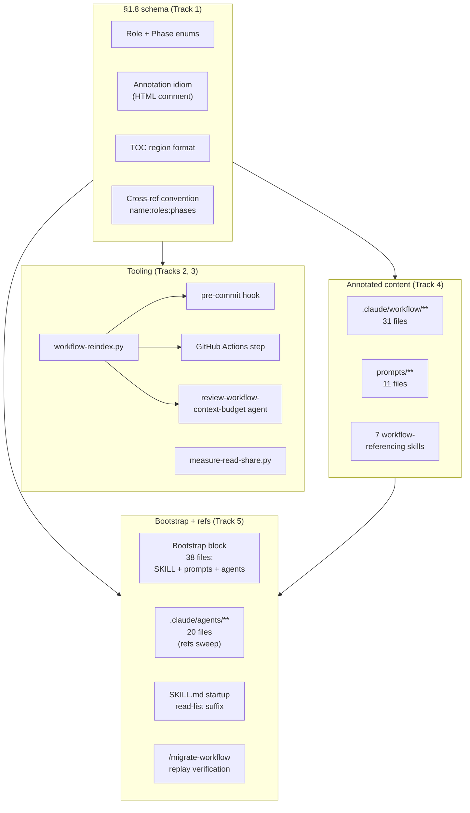

<!-- workflow-sha: 367f5f83f1bce0e98eaeb0679973f9728db64b61 -->
# Per-document TOC + per-section role/phase annotations

## Design Document
[design.md](design.md)

## High-level plan

### Goals

- Cut the Read tool's share of session context (51.9% portfolio-aggregate baseline cited in YTDB-1023) by giving every agent enough metadata to decide *whether* to open a workflow file and *which section to jump to* before paying the read cost.
- Lock the per-section schema as workflow infrastructure so the anti-pattern (full-file reads when only one section is load-bearing for the calling role and phase) cannot reappear in future workflow documents.
- Ship a standing telemetry mechanism: every future Phase 4 ADR carries a percentages-only token-usage snapshot for its worktree, becoming a trend signal across plans.

### Constraints

- This plan is workflow-modifying: it edits .claude/workflow/** or .claude/skills/**.
- House style applies to every Markdown file authored or modified during the rollout (see conventions.md §1.5).
- Per-section annotations are author-written, not LLM-inferred — LLM-inferred metadata drifts silently. The reindex script is mechanical: scrape, validate, rebuild the TOC. No model in the loop.
- Periodic background runs of the reindex script are explicitly avoided. Checks fire at commit time (pre-commit hook) and CI only.
- All annotation tokens must be drawn from the locked role enum (15 values) and phase enum (8 values). The CI gate fails on out-of-enum tokens.
- The telemetry script publishes percentages only — never absolute token counts. Runs only from a worktree (skipped when invoked from the main checkout). Scope is the worktree's transcript folder over its lifetime.
- This is the first workflow-modifying branch to exercise the §1.7 staging path end-to-end (per conventions.md §1.7(h)). Writes to `.claude/workflow/**` and `.claude/skills/**` route through `_workflow/staged-workflow/`; writes to `.claude/scripts/**`, `.claude/agents/**`, and `.github/workflows/**` go to live paths. `CLAUDE.md` is intentionally out of scope for this plan (general-purpose project guide, not workflow-specific).

### Architecture Notes

#### Component Map

- **Schema layer (Track 1)** — `conventions.md §1.8` is the foundation. Locks the role enum (15 values), phase enum (8 values), per-section annotation idiom, TOC region format, and cross-reference convention. Every other component reads from it.
- **Reindex script + audit agent (Track 2)** — `workflow-reindex.py` is the mechanical Python script that scrapes annotations, rebuilds TOCs, and validates enum tokens. Modes: `--check` (CI / pre-commit) and `--write` (author rebuild). The `review-workflow-context-budget` agent absorbs the audit at PR review time.
- **Telemetry script (Track 3)** — `measure-read-share.py` runs once per Phase 4 ADR creation, from the worktree only. Computes a percentages-only Read% snapshot over the worktree's transcript lifetime; embeds the output in `adr.md`. Updates `prompts/create-final-design.md` to invoke it.
- **Annotated content (Track 4)** — single-commit-style universal rollout of TOC + per-section annotations across 49 files. ~600 annotations, all author-written.
- **Tail (Track 5)** — Bootstrap block insertion across 38 system-prompt files (7 SKILL.md, 11 `.claude/workflow/prompts/*.md`, 20 `.claude/agents/*.md`) plus the `:roles:phases` cross-reference suffix sweep on agent files and SKILL.md startup read-lists. `CLAUDE.md` is intentionally out of scope (general-purpose project guide, not workflow-specific). Migration replay verification on two active branches closes the acceptance criterion.

#### D1: Lock the enum at 15 roles + 8 phases

- **Alternatives considered**: a smaller 10-role enum from the original issue (folds planner / reviewer-plan / migrator / pr-reviewer / reviewer-design into existing roles); pre-allocating two phase slots (`1a`, `1b`) for YTDB-975's in-flight Phase 1 sub-split.
- **Rationale**: 15 roles give filter precision the smaller enum loses (e.g., `planner` has a distinct file-load profile from `orchestrator`). Pre-allocated phase slots were rejected: they would pre-empt YTDB-975's design choices on its own branch, and the "second workflow-format commit" savings claim does not hold — YTDB-975's eventual merge into develop already trips the drift gate on every active branch, with or without the pre-allocation.
- **Risks/Caveats**: future workflow features needing a new role or phase token require a workflow-format commit; the drift gate then fires on every active branch and routes affected branches through `/migrate-workflow`. The cost is acceptable: the same cost would land whether slots are pre-allocated or not.
- **Implemented in**: Track 1
- **Full design**: design.md §"Role and phase enums"

#### D2: Per-section annotation as HTML comment on the line after the heading

- **Alternatives considered**: YAML frontmatter at file top (forces a parser per file, drifts from section content); inline annotation in the heading text (breaks Markdown rendering); separate manifest file per workflow doc (drift risk).
- **Rationale**: HTML comment is invisible to humans, parses with a single regex, lives adjacent to the section it describes (no drift between heading and metadata), and Markdown-aware tooling (linters, GitHub renderer) leaves it alone.
- **Risks/Caveats**: long sections push the annotation off-screen, but the in-file TOC mirrors the comment so the cost is recoverable from the top of the file.
- **Implemented in**: Track 1 (schema), Track 4 (rollout)
- **Full design**: design.md §"Annotation idiom and TOC region"

*D3 was dropped during Phase 1 design refinement. See `design-mutations.md` Mutation 2.*

#### D4: Telemetry script runs from worktree only; skips when run from main

- **Alternatives considered**: cross-repo aggregation (anonymization burden, single-project ADR scope makes it unnecessary); rolling 30-day window (less reproducible across ADRs of different durations); raw token counts (open-source repo, privacy posture).
- **Rationale**: each plan = single feature on a single branch by project convention. The worktree's `~/.claude/projects/<encoded-worktree-cwd>/` transcript folder is the right scope; lifetime-of-worktree is the right window; percentages-only is publication-safe. The main-checkout skip prevents meaningless aggregate measurements from accumulated cross-plan history.
- **Risks/Caveats**: ADRs of plans that ran without a dedicated worktree get a skip notice instead of stats — fine, the notice documents the convention.
- **Implemented in**: Track 3
- **Full design**: design.md §"Telemetry script"

#### D5: Reindex script at `.claude/scripts/workflow-reindex.py`, mechanical Python, no LLM

- **Alternatives considered**: dedicated `.claude/skills/reindex-workflow/SKILL.md`; integration into existing `design-mechanical-checks.py`.
- **Rationale**: Python parallel to existing `design-mechanical-checks.py` and `render-slim-plan.py` keeps similar tooling co-located. No LLM call per the issue's "mechanical pass" requirement. Standalone script invokable from pre-commit hooks and CI without spawning a Claude session. SKILL.md form would be over-engineered for a mechanical script.
- **Risks/Caveats**: script must stay portable (Python 3, no special deps beyond stdlib).
- **Implemented in**: Track 2
- **Full design**: design.md §"Reindex script"

#### D6: Agent files get refs-only suffix sweep plus bootstrap block (no per-section annotations)

- **Alternatives considered**: full annotation parity with workflow docs (no Read-tool savings to capture); exclude agent files entirely (loses the outgoing-ref filter benefit); refs-only without bootstrap (leaves the agent unable to use the TOC protocol on its first workflow-file Read).
- **Rationale**: agent `.md` files are loaded as system prompts when sub-agents spawn. The Read tool never opens them, so per-section annotations would not save Read-tool tokens. Outgoing workflow-doc refs still benefit from the `:roles:phases` suffix. A bootstrap block at the top of each agent file teaches the spawned sub-agent the TOC-aware reading protocol before its first workflow-file Read.
- **Risks/Caveats**: structural asymmetry in the codebase (some `.md` files carry TOC, some don't). Mitigated by the schema enumerating which file paths get TOC annotations and which carry the bootstrap.
- **Implemented in**: Track 5
- **Full design**: design.md §"Files and surfaces out of scope" (exclusion 1), design.md §"Bootstrap protocol for agent system prompts" → §"Scope and uniformity"

#### D7: Migration replay is a no-op for this plan; verification confirms drift-gate normalization

- **Alternatives considered**: full content migration replay (no `_workflow/**` artifact-shape change to replay); skip verification (acceptance criterion explicitly calls for two-branch verification).
- **Rationale**: this plan changes workflow rules and tooling but does not change `_workflow/**` artifact shape, so `/migrate-workflow` has no content to replay onto branch artifacts. The workflow-sha bump on develop is what other branches' drift gates pick up; their normalization path produces a single stamp-rewrite commit (or skips silently if stamps were already uniform). Verification on at least two active branches confirms the path runs clean.
- **Risks/Caveats**: a branch that gains `_workflow/**` between this plan's start and merge might hit unexpected drift state. Bounded by branch count and time window; surfaced by drift gate's existing prompt.
- **Implemented in**: Track 5
- **Full design**: design.md §"Migration replay semantics"

#### D8: Bootstrap block embedded in every workflow-related system prompt

- **Alternatives considered**: rely only on the file-level cross-ref filter (chicken-and-egg: the cross-ref protocol is defined in `conventions.md §1.8` — the very file the agent is supposed to filter before opening); add a single bootstrap doc loaded once per session (still requires a Read; same problem); embed the bootstrap in `CLAUDE.md` (user-rejected: `CLAUDE.md` is general-purpose, not workflow-specific).
- **Rationale**: system prompts (SKILL.md, `.claude/workflow/prompts/*.md`, `.claude/agents/*.md`) are loaded by the harness or as Agent-tool prompt content without a prior Read call. A spawned sub-agent does not share context with its parent, so the protocol must be present in its own system prompt. A ~30-line bootstrap block at the top of every workflow-related system prompt teaches the agent the TOC-aware reading protocol before its first Read.
- **Risks/Caveats**: ~30 lines of system-prompt overhead per file × 38 files. Negligible against the YTDB-1023 Read-share baseline (51.9% of session context). A bigger risk is drift — a future role/phase rename would leave bootstrap blocks stale. Mitigated by the reindex script's rule 7 (presence check; literal heading match).
- **Implemented in**: Track 5
- **Full design**: design.md §"Bootstrap protocol for agent system prompts"

#### D9: In-file `§X.Y(z)` references auto-stamped by the reindex script with target-derived suffix

- **Alternatives considered**: hand-written in-file suffix (uniform with cross-file refs, but every annotation edit forces an N-site author sweep; drift is silent until a reader notices); plain in-file refs (no suffix, no jump filter at the ref site — defeats the section-level layer's purpose for the agent reading inline refs); section-only suffix (only `§X.Y` granularity, no `§X.Y(z)` sub-section precision — loses the sub-section precision the locked density rule depends on).
- **Rationale**: in-file refs are common, target annotations live in the same file (mechanical resolution), and the citer almost always means the target's full annotation rather than a narrow slice. Auto-stamping eliminates author burden and makes drift mechanically detectable. The cross-file case stays hand-written because the citer's slice is genuinely narrower than the target's full annotation in many cases (an orchestrator-and-implementer agent citing `conventions.md §1.6` for the migration-only stamp rule wants `migrator:3A,3B,3C,4` recorded, not the heading's full set); the reindex script subset-validates the slice per D10, catching drift without forcing equality.
- **Risks/Caveats**: drift after a target's annotation edit is bounded by the next CI run; `workflow-reindex.py --write` is the one-step fix. A typo in the section anchor (`§1.6(d)` when only `(a)-(c)` exist) lands as an unresolved-ref blocker rather than silently auto-stamping the wrong heading. Author confusion between hand-vs-auto: the design's Cross-reference convention spells out cross-file vs in-file as the split, with `§X.Y(z)` shape allowed in both forms.
- **Implemented in**: Track 1 (convention in `conventions.md §1.8`), Track 2 (auto-stamp implementation in `workflow-reindex.py`)
- **Full design**: design.md §"Cross-reference convention" → §"In-file reference auto-stamping", design.md §"Reindex script" → §"Validation rules" rule 8

#### D10: Subset-validate cross-file ref suffixes against target annotations

- **Alternatives considered**: presence-only check (the original design before this enhancement — drift went silently undetected and surfaced only when a reader tripped on a stale suffix); auto-stamping cross-file refs from the target's full annotation (rejected by D9 — destroys the citer's narrower-slice expressiveness, which is the whole point of the hand-written form).
- **Rationale**: D9's rationale already documents cross-file refs as "narrower than the target's full annotation" — that phrasing is a subset relationship and the script can mechanically check it. For each cross-file ref `name.md§X.Y:roles:phases`, the script parses the target's annotation at the cited section and verifies `citer.roles ⊆ target.roles` AND `citer.phases ⊆ target.phases`. Catches the real drift case (target tightened, citer claims a token the target no longer has) without forcing equality. Implementation cost is +30 lines of Python on top of the existing rule 6 parsing.
- **Risks/Caveats**: false negative for the "citer is too narrow" case (a valid subset that no longer matches the citer's intent) — mechanically undetectable, stays a human-review concern. Sub-section refs resolve to that section's annotation directly; file-level refs without a section anchor resolve to the union of every section's annotations in the target file. The CI error names both sides so the author chooses whether to widen the citer or restore the target.
- **Implemented in**: Track 2 (subset check extension to rule 6 in `workflow-reindex.py`)
- **Full design**: design.md §"Reindex script" → §"Validation rules" rule 6, design.md §"Cross-reference convention" → §"In-file reference auto-stamping" (the "Cross-file drift detection" bold paragraph inside)

#### D11: Track 2 introduces the `WC / WP / WI / WH / WB / WS` finding-prefix family on the six `review-workflow-*` agents

- **Alternatives considered**: keep the agents' existing severity-labeled output (`Critical / Recommended / Minor`) without per-finding numeric IDs; scope the prefix to `review-workflow-context-budget` only and accept format asymmetry across the six dim-review agents.
- **Rationale**: the plan/track review prefix family (`CR<N>`, `S<N>`, `T<N>`, `R<N>`, `A<N>`) per `review-iteration.md` already lets reviewers cite findings by ID in PR threads and follow-up commits (`Review fix: WB3 — ...`). The six `review-workflow-*` agents (`consistency`, `prompt-design`, `instruction-completeness`, `hook-safety`, `context-budget`, `writing-style`) currently emit free-prose bullets under `Critical / Recommended / Minor` headings — no per-finding ID. Extending the prefix uniformly to all six (`WC / WP / WI / WH / WB / WS`) aligns the agents with the canonical family already defined in `.claude/workflow/review-iteration.md` § Finding ID prefixes and `.claude/workflow/review-agent-selection.md`. The prefix lives alongside (not instead of) the severity labels: each finding stays under `Critical | Recommended | Minor` and additionally carries the numeric ID.
- **Risks/Caveats**: scope-up vs the original context-budget-only proposal — five additional agent-prompt edits in Track 2 Step 5, all template-bound. PR threads citing the old severity-only format are not affected.
- **Implemented in**: Track 2
- **Full design**: design.md §"CI gate semantics" → §"Agent-side absorption"

#### D12: Reindex script self-bootstraps enum tokens via staged-aware probe of `conventions.md §1.8`

- **Alternatives considered**: hard-coded enum literals in the script with a `--check-enum-sync` validation against `conventions.md §1.8` (simpler bootstrap, but enum changes need edits at two sites); deferring rule 5's enum-token check until Phase 4 promote (leaves a CI-gate hole on this branch and every other workflow-modifying branch until promote).
- **Rationale**: the `§1.7(d)` reads-precedence rule is already the established pattern for resolving `.claude/workflow/**` paths on a workflow-modifying branch — the staged copy is authoritative when present, the live path is the fallback. Extending the same precedence to `workflow-reindex.py` (CI + pre-commit consumers, outside the original "implementer's per-spawn read site only" carve-out) keeps one consistent reads-precedence pattern across the convention, makes the script work correctly on this branch before Phase 4 promote, and avoids hard-coding enum values in two places. T3's hook-regex widening already requires the script to know about staged paths, so the bootstrap probe shares discovery infrastructure.
- **Risks/Caveats**: a probe finding two staged conventions.md candidates (multiple `docs/adr/*/_workflow/staged-workflow/.claude/workflow/conventions.md` matches across multiple workflow-modifying plans in the same worktree) is ambiguous; the script halts with exit 2 rather than picking one. The one-plan-per-branch project convention bounds this to a single match in practice.
- **Implemented in**: Track 2 (Step 1 — bootstrap probe in discovery code; Step 2 — rule 5 reads bootstrap output for enum-token validation)
- **Full design**: design.md §"Reindex script" → §"Discovery mechanism" (consumes the same staged-aware path the bootstrap probe enumerates), conventions.md §1.7(d) (the reads-precedence rule whose scope this DR extends)

### Invariants

- I1 — Every annotated `##`/`###` heading is followed by exactly one annotation comment on the next line.
- I2 — Every annotated file carries exactly one TOC region; the TOC's section list matches every `^##` and every `^###` heading 1:1 (no author-judged granularity; the bootstrap-block heading `## Reading workflow files (TOC protocol)` is the sole literal-heading exception).
- I3 — All role and phase tokens in annotations are drawn from the locked enums in `conventions.md §1.8`. Out-of-enum tokens fail CI.
- I4 — `measure-read-share.py` never emits absolute token counts. Output is percentages only, plus session and file count.
- I5 — Every in-scope system-prompt file (7 SKILL.md, 11 `.claude/workflow/prompts/*.md`, 20 `.claude/agents/*.md`) carries the bootstrap block (literal heading `## Reading workflow files (TOC protocol)`) at the top, between frontmatter and main body. The reindex script's rule 7 enforces presence.
- I6 — Every in-file `§X.Y` and `§X.Y(z)` reference carries a `:roles:phases` suffix matching the target heading's current annotation. `workflow-reindex.py --write` is the sole writer; drift (annotation changed, suffix stale) and plain refs both fail CI under rule 8.
- I7 — Every cross-file `name.md:roles:phases` reference's roles and phases are subsets of the target heading's current annotation. Citer-not-a-subset fails CI under rule 6 (subset check). Equality is not required — narrower is the design contract.

### Integration Points

- Pre-commit hook (existing `.githooks/pre-commit` extended with a workflow-reindex block) calls `workflow-reindex.py --check` and fails the commit when annotated files diverge from the schema.
- GitHub Actions workflow (new or extended) calls the same script with `--check` for PR validation.
- `.claude/agents/review-workflow-context-budget.md` agent invokes the script during workflow-machinery code review.
- `prompts/create-final-design.md` invokes `measure-read-share.py` before writing `adr.md`; the output is embedded as a standard section.

### Non-Goals

- Cross-repo / cross-project telemetry aggregation. Published ADR section reports this worktree only.
- Annotations on Phase 4 final artifacts (`design-final.md`, `adr.md`). The scheme covers ephemeral `_workflow/**` artifacts not at all; durable post-merge artifacts don't carry annotations.
- Backward-compatible support for un-annotated workflow files after rollout. Every in-scope file MUST carry the schema after Track 4 lands.
- `CLAUDE.md` cross-reference suffix application. CLAUDE.md is a general-purpose project guide loaded by every session regardless of role or phase; the file-level filter does not apply. The §1.8 schema, the cross-reference convention, and the bootstrap block all skip CLAUDE.md by design.
- Bootstrap block on non-workflow-related skill files (e.g., `ai-tells`, `run-jmh-benchmarks-hetzner`, `profile-jmh-regressions`). Those skills do not Read files under `.claude/workflow/` or `.claude/skills/` at runtime; the bootstrap would be inert text. Scope is limited to the 7 workflow-referencing SKILL.md files enumerated in Track 5.

## Checklist

- [x] Track 1: Schema definition (`conventions.md §1.8`)
  > Lock the role enum, phase enum, per-section annotation idiom, TOC region format, and cross-reference convention in a new `§1.8` of `conventions.md`. This section is the foundation every subsequent track reads from; it must land first.
  >
  > **Track episode:**
  > §1.8 lands the foundational schema in the staged `conventions.md`: 15-value role enum, 8-value phase enum, HTML-comment annotation idiom, TOC region format under H1, hand-written cross-file / auto-stamped in-file cross-reference convention, read-decision flow, worked example using a constructed `## 99.1 Demo section`, and References footer. §1.1 gained six glossary rows for the load-bearing terms (Bootstrap block carries dual-anchor phrasing for the design.md → design-final.md transition).
  >
  > Phase C dim-review spawned four reviewers (consistency / context budget / writing style / instruction completeness); 10 of 18 synthesised findings landed in `Review fix: bed762c965` and all gate-checks passed at iter-1. The fix-set covered the typo-recovery rule, out-of-enum recovery, bootstrap-exemption rephrase to pure literal-text match, TOC-region-absence rule for files without `## ` headings, the TOC Section cell format spec, fenced-code-block exclusion in cross-file drift detection, a cross-file-with-sub-section format example, an ownership-label fix in this track file, and a BLUF opener swap. Eight findings deferred for design discussion went un-applied at user approval.
  >
  > **Cross-track signals.** Track 2 reviewers: §1.8 now carries prose anchors for the three CI-blocker shapes the reindex script enforces — rule 2 (TOC absence accepted when file has no `## ` headings), rule 5 (out-of-enum tokens), rule 8 (unresolved or stale `§X.Y(z)` anchors). §1.8(e)'s fenced-code-block exclusion paragraph should match the script's validation traversal. Track 4 reviewers: §1.1 glossary's `Bootstrap block` row names placement as "between the frontmatter (when present) and the H1" — match this phrasing on subsequent bootstrap edits. Outstanding design questions (move Mermaid / worked example / enum descriptions out of always-loaded `conventions.md` to cut bootstrap surface; readable-alone vs scope-pointer tradeoff) are unaddressed and may resurface at Track 4 or Phase 4.
  >
  > **Track file:** `plan/track-1.md` (2 steps, 0 failed)
  >
  > **Strategy refresh:** CONTINUE — no plan rewrites needed. Cross-track signals already captured in Track 1's episode (WI7 summary-cap → Track 2 rule 5; §1.8(g) demo heading + glossary table rows → Track 4 reviewer carve-outs; Bootstrap block dual-anchor phrasing → Track 5 + Phase 4) are absorbed by downstream tracks during their own execution.

- [x] Track 2: Reindex script + CI gate + audit agent updates
  > Build `.claude/scripts/workflow-reindex.py` (mechanical Python, `--check` and `--write` modes, stdlib only) and wire it into a pre-commit hook plus a GitHub Actions step. Update `.claude/agents/review-workflow-context-budget.md` to absorb the audit at PR-review time. Tests live under `.claude/scripts/tests/`.
  >
  > **Track episode:**
  > Track 2 lands `workflow-reindex.py` as the mechanical schema validator (≈2200 lines, stdlib-only Python, modes `--check` / `--write`, exit codes 0/1/2, staged-aware §1.8 bootstrap probe per D12) alongside ≈3100 lines of test coverage; restructures `.githooks/pre-commit` into two named functions so the workflow-reindex block runs unconditionally other than the JetBrains-remote gate, with `--diff-filter=ACMR` and a regex matching both live and staged paths; adds `.github/workflows/workflow-toc-check.yml` (PR-triggered, path-filtered, single step, draft-PR skip); and extends the six `review-workflow-*` agents with a per-finding numeric prefix family.
  >
  > Phase C surfaced a load-bearing inconsistency: Step 5's prefix family used new letters (`CN / HS / PD / IC`) for four of the six agents, but `.claude/workflow/review-iteration.md` already defined the canonical letters (`WC / WP / WI / WH`) for the same review types, and Track 1's own dim-review episode plus the plan's `WI7` citations already used the canonical form. User picked Path A (conform agents to canonical). The Review fix commit `fc2d829421` renamed the four prefixes and closed twelve other findings (context-budget agent gained explicit `--check` precondition, ≤25-vs-full-repo decision rule with `OSError: Argument list too long` fallback, diff-filter step, two-sub-case exit-2 handling, `--files` build regex; pre-commit gained `set -euo pipefail` plus a grep-exit-code discriminator separating "no matches" from real grep failure; CI workflow gained the expected-red-window comment without Track-N citations per the ephemeral-identifier rule; all six agents gained a within-bucket finding-ordering rule). The orchestrator-owned follow-up commit `84db362edc` rewrote D11 in `implementation-plan.md` to declare the canonical family and corrected an em-dash density violation in Step 4's episode. Phase C closed at iteration 1 with zero `STILL OPEN` and zero regressions.
  >
  > A subsequent Completion-gate Review-mode round (user-initiated) layered one more change: `Review fix: a77c27a7ea` silences the new CI gate on draft PRs by adding `ready_for_review` to the `pull_request` activity-types filter and gating the job with `if: github.event.pull_request.draft == false`. The gate is silent during draft iteration and runs the moment the PR is marked ready for review.
  >
  > **Cross-track signals.** The canonical workflow-machinery finding-prefix family is `WC / WP / WI / WH / WB / WS`; the six `review-workflow-*` agents now match `review-iteration.md:43-48` and `review-agent-selection.md:69-74` exactly, and the within-bucket finding-ordering rule (source → File POSIX → line ascending) is the canonical reference shape for any future workflow-machinery dim-review agent. The `.githooks/pre-commit` `set -euo pipefail` adoption means future hook edits must wrap pipelines that legitimately produce non-zero exit codes (`set +e` / `set -e` around the pipeline or `{ ... || true; }`); naïve chained grep will fail the commit. Phase 4 final-design synthesis closes two design.md drifts: §"Discovery mechanism" enumerates 3 globs vs the shipped 6 (D12 added three staged-subtree globs), and §"Pre-commit hook" snippet shows the pre-T3 form. Post-Track-4 cleanup candidate: WB1 (buffering hint for full-repo `--check` output) is conditional on steady-state finding count after Tracks 4+5 land — drop entirely if the count stays under ~200.
  >
  > **Track file:** `plan/track-2.md` (5 steps, 0 failed)
  >
  > **Strategy refresh:** CONTINUE — Track 2's cross-track signals (canonical `WC/WP/WI/WH/WB/WS` prefix family, `set -euo pipefail` hook discipline, two `design.md` drift sites, post-T4 WB1 cleanup candidate) target Phase C dim-reviewers on T4/T5 and Phase 4 design-synthesis cleanup. Track 3 is structurally independent of Tracks 1 and 2 and touches none of those surfaces; no Track 3 plan/track-file edits needed.

- [ ] Track 3: Telemetry script + Phase 4 prompt integration
  > Build `.claude/scripts/measure-read-share.py` — worktree-scoped, lifetime window, percentages-only output, skips when run from the main checkout. Update `prompts/create-final-design.md` to invoke the script and embed its output as a standard "Token usage telemetry" section in `adr.md`. Tests under `.claude/scripts/tests/`.
  > **Scope:** ~4 steps covering script core (jsonl walk + tool-result tally), worktree-vs-main detection, Phase 4 prompt update, and tests.

- [ ] Track 4: Universal annotation rollout (49 files)
  > Author per-section TOC + annotations for every in-scope file (49 total: 31 under `.claude/workflow/`, 11 under `.claude/workflow/prompts/`, 7 workflow-referencing skill files; ~600 annotations, all author-written). `workflow-reindex.py --write` scaffolds the TOC tables; the author hand-corrects per-section `roles=`, `phases=`, `summary=`. Lands as a single logical batch (or a small adjacent group; squash-merge collapses anyway) so the schema becomes universally applicable at one commit.
  > **Scope:** ~6 steps covering workflow root (split into two batches by file count), prompts, skills, validation pass, and a final reindex `--check` green run.
  > **Depends on:** Track 1, Track 2
  > **From Track 3 review (WB1):** the final reindex `--check` green run must resolve how `rule_4` treats the fenced `adr.md`-template headings inside `prompts/create-final-design.md` (e.g. `Summary`, `Goals`, … `Token usage telemetry`). These are final-artifact template content, out of scope for annotations per `conventions.md §1.6(f)` and the Non-Goals, yet `rule_4` flags them as un-annotated headings. The fix is a `workflow-reindex.py` `rule_4` fenced-code-block carve-out (reopening Track 2's script), not author annotations. Track 3's Phase C `Review fix:` removed one such heading (the telemetry section's literal heading became a comment placeholder), so the count is one lower than Track 3 Step 2's episode recorded.

- [ ] Track 5: Bootstrap block + agent files refs sweep + migration verification
  > Insert the bootstrap protocol block (~30 lines, per design §"Bootstrap protocol for agent system prompts") at the top of 38 system prompts: 7 SKILL.md files, 11 `.claude/workflow/prompts/*.md`, and 20 `.claude/agents/*.md`. Apply the `name:roles:phases` cross-reference suffix to outgoing workflow-doc refs in the 20 agent files and to SKILL.md startup read-lists. Then verify `/migrate-workflow` replays cleanly onto at least two active branches per the acceptance criterion — expected to be a stamp-rewrite-only normalization since this plan doesn't change `_workflow/**` artifact shape.
  > **Scope:** ~6 steps covering bootstrap insertion (38 files, batched by category), agent files refs sweep, SKILL.md read-list suffix sweep, migration replay test on branch A, migration replay test on branch B, final validation.
  > **Depends on:** Track 1, Track 2, Track 4

## Plan Review
- [x] Plan review (consistency + structural) — passed: consistency at iteration 3, structural at iteration 2

**Auto-fixed (mechanical)**:
- CR3: file count corrected 30→31 (plan + design + track-4).
- CR4: prompts count corrected 9→11, cascading to 46→49 totals.
- CR5: `.githooks/pre-commit` framing "extend, not new" in track-2.md (partial — CR8 closed remaining sites).
- CR6: D6 gained the `**Full design**` link.
- CR8: pre-commit-hook framing rewrite completed across four remaining sites (design.md §"CI gate semantics" TL;DR + §"Pre-commit hook" subsection, implementation-plan.md Integration Points, track-2.md Interfaces in-scope set).
- CR10: design.md §"Agent-side absorption" gained parenthetical naming D11 as WB-prefix introduction source; §"CI gate semantics" References footer gained the D11 cite.
- S1: phase enum value count corrected 10→8 at `### Constraints` and Component Map Schema-layer bullet.
- S2: Track 2 and Track 4 plan-file intro paragraphs compressed to ≤3 sentences.
- S3: Track 5 `**Depends on:**` widened from Track 4 only to Track 1, Track 2, Track 4.

**Escalated (design decisions)**:
- CR1: telemetry invocation hook point — user picked Step 3 §"Artifact 2: ADR".
- CR2: orphan TELE → CMD edge in design.md Mermaid — user picked drop entirely.
- CR7: WB<N> per-finding prefix — user picked introduce; D11 added motivating the prefix.
- CR9: D11 missing `**Full design**` link — user picked anchor at design.md §"CI gate semantics" → §"Agent-side absorption".
- S4: D3 numbering gap — user picked add one-line breadcrumb between D2 and D4 pointing at `design-mutations.md` Mutation 2.
- S5: Track 4 plan-file annotation for Track 3 execution-order coupling — user rejected (`**Depends on:**` carries structural deps only).

## Final Artifacts
- [ ] Phase 4: Final artifacts (`design-final.md`, `adr.md`)
