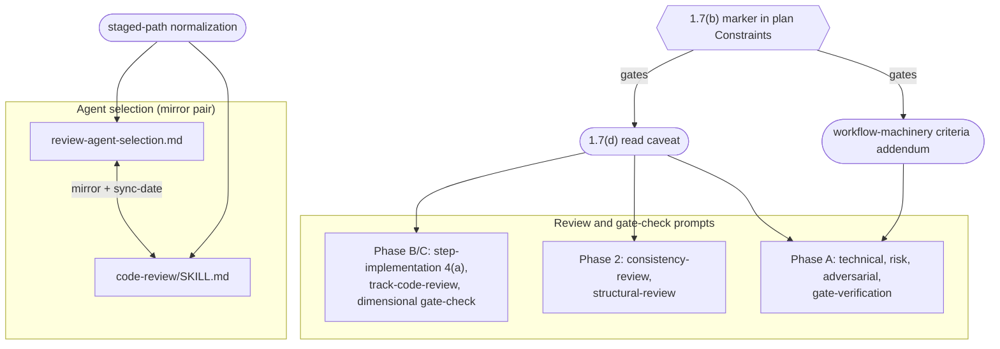
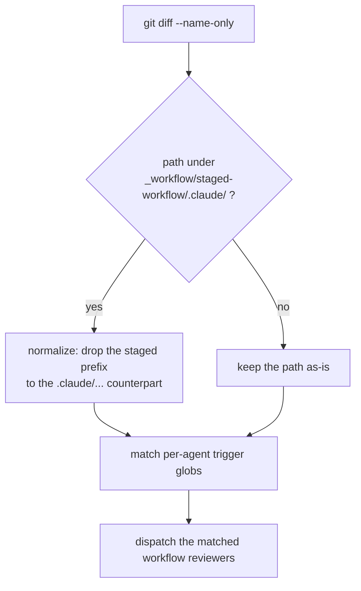
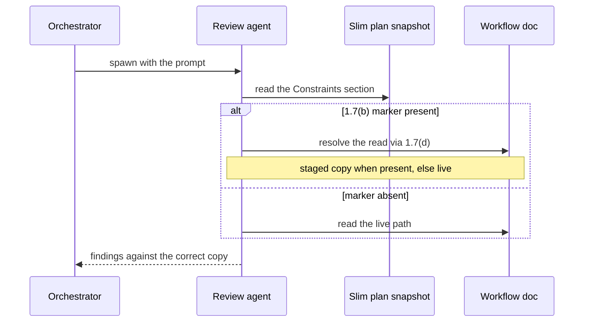

<!-- workflow-sha: f97512c02f4dbaaf66c7382397907580fd54391b -->
# Staging-aware review machinery — Design

## Overview

The development workflow reviews its own machinery at three points: a
plan-level review before execution (Phase 2), a track-level review before
each track is decomposed (Phase A), and a dimensional code review of each
track's diff (Phase B/C). An orchestrator picks which agents fire for a
given change, and each spawned agent reads the relevant workflow documents
to judge it. Every part addresses workflow files by their live `.claude/...`
path.

The `§1.7` staging convention changed where that content lives during a
branch. On a plan that edits `.claude/workflow/**` or `.claude/skills/**`,
every authored edit accumulates under
`docs/adr/<dir>/_workflow/staged-workflow/.claude/...`, and the live files
stay at develop's state until one Phase 4 promotion. The review machinery
never learned this, so it goes stale on such plans in three ways.

Selection goes stale: the triggers that pick which dimensional reviewers
fire match literal changed file paths, and a staged path begins with
`docs/adr/...`, so three reviewers never match and fail to launch. Reading
goes stale: every review and gate prompt hands its agent the live path, so
an agent checking a change against a rule the branch already rewrote reads
develop's version and reports a phantom mismatch. Phase A goes further
stale: its technical, risk, and adversarial reviewers apply Java criteria
(find-class on named symbols, WAL and crash edge cases, data migrations)
that have nothing to bind to on a track that edits prose.

This design closes all three. Selection strips the staged prefix before
matching triggers. Every review and gate prompt gains a caveat, gated on the
plan's workflow-modifying marker, that resolves a workflow document through
the `§1.7(d)` precedence: the staged copy when present, the live file
otherwise. The Phase A reviewers gain an addendum, also gated on the marker,
that re-points their criteria from Java to prose.

The work splits into three pieces, one per issue: the selection fix, the
read fix across every review prompt including Phase A, and the Phase A
criteria fix. Core Concepts, Class Design, and Workflow come first, then a
section per fix and the invariants that bind them.

## Core Concepts

This design introduces seven load-bearing ideas. Each is named once here and
used without redefinition below; the entry pairs the concept with what it
replaces so the delta from the baseline is visible.

**Staged subtree.** The copy of the workflow files that a branch authors,
kept under `docs/adr/<dir>/_workflow/staged-workflow/.claude/...` while a
workflow-modifying plan runs. Promotion at Phase 4 copies it over the live
tree. Replaces the model where a branch edited `.claude/...` in place.
→ §"Read-side staging awareness".

**Workflow-modifying marker.** The fixed sentence in a plan's
`### Constraints` that flags the plan as one that edits `.claude/workflow/**`
or `.claude/skills/**`. Its presence turns on staging and, in this design,
gates both the read caveat and the Phase A addendum. Defined in
`conventions.md §1.7(b)`. → §"Read-side staging awareness".

**Per-agent trigger.** The glob in the selection rules that decides which
workflow reviewer fires for a given changed file. Six reviewers exist; two
always run, the other four are gated on these globs. Lives in
`review-agent-selection.md` and its mirror in `code-review/SKILL.md`.
→ §"Selection-side staging awareness".

**Staged-path normalization.** Stripping the
`…/_workflow/staged-workflow/` prefix from a changed path before matching it
against the trigger globs, so a staged file is treated as its live
equivalent for selection. New in this design.
→ §"Selection-side staging awareness".

**§1.7(d) reads precedence.** The rule that a reader resolves a workflow
file to its staged copy when one exists and to the live file otherwise. As
written `§1.7(d)` scopes that precedence to the implementer and excludes
reviewers; this design amends it so review agents on a workflow-modifying plan
follow it too, so the read caveat invokes a rule that covers them. Defined in
`conventions.md §1.7(d)`. → §"Read-side staging awareness".

**Phase A track review.** The pre-decomposition review layer: track-scoped
technical, risk, and adversarial reviewers plus a gate-verification
reviewer, run before a track is broken into steps. Their criteria assume
Java code today. Distinct from the Phase B/C dimensional review that the
selection and read fixes also touch.
→ §"Phase A criteria for workflow-machinery tracks".

**Mirror invariant.** The constraint that `review-agent-selection.md` and
the matching steps of `code-review/SKILL.md` change together in one commit,
with a sync-date bump. The selection fix touches both.
→ §"Consistency invariants and self-application".

## Class Design

This change adds no Java types. The components are workflow documents, the
rules inside them, and the two cross-file mirrors. The diagram models that
topology so the later sections can refer to it.

Three additions, three reach. The normalization rule (selection, YTDB-1032)
lands in the mirror pair. The read caveat (YTDB-1038) lands in every review
and gate prompt across all three layers. The criteria addendum (YTDB-1046)
lands in the three Phase A criteria reviewers only; the Phase A
gate-verification reviewer is criteria-agnostic and takes the read caveat
alone. The marker gates the caveat and the addendum; the normalization rule
is keyed off the staged prefix and needs no marker, because staged paths
exist only on plans that carry the marker anyway.

## Workflow

Two flows change. The first is how the orchestrator selects dimensional
review agents for a diff; the second is how any spawned review agent
resolves a workflow-document read. The read flow is the same for a Phase A
reviewer, a Phase 2 plan reviewer, and a Phase B/C dimensional reviewer.

### Selection flow

On a plan that does not modify the workflow, no staged path exists, so the
decision always takes the `no` branch and behavior is unchanged. On a
workflow-modifying plan, a staged file normalizes to its live name and
matches the globs its live counterpart would, so every reviewer that should
fire does.

### Read flow

The agent checks the plan's Constraints for the marker before it reads any
workflow document. The slim plan snapshot retains the Constraints section
verbatim, so the marker is visible from the snapshot the agent already
loads. When the marker is absent, the precedence rule reduces to reading the
live path, so the caveat is inert on ordinary plans and on a fresh plan
review where no staged copy exists yet.

## Selection-side staging awareness

**TL;DR.** On a workflow-modifying plan, the staged copy of a file is where
the change lives, but the trigger globs match the live `.claude/...` path. A
staged path begins with `docs/adr/...`, so three workflow reviewers never
match and fail to launch. A short normalization rule, added to the selection
rules and their mirror, strips the staged prefix before the globs run.

The file-set definition already counts anything under `docs/adr/<dir>/` as
workflow-machinery, so the two always-run reviewers (consistency, context
budget) fire on a staged diff, and the writing-style reviewer fires through
its `docs/adr/**/*.md` glob. The gap is the other three reviewers, whose
globs name `.claude/...` paths only:

- `review-workflow-prompt-design`: `.claude/skills/*/SKILL.md`,
  `.claude/agents/*.md`, `.claude/workflow/prompts/*.md`
- `review-workflow-instruction-completeness`: the above plus
  `.claude/workflow/*.md`
- `review-workflow-hook-safety`: `.claude/hooks/*.sh`, `.claude/scripts/**`,
  `.claude/settings*.json`

A staged edit to `.claude/workflow/conventions.md` lands at
`docs/adr/<dir>/_workflow/staged-workflow/.claude/workflow/conventions.md`,
which matches none of those globs, so the instruction-completeness reviewer
that should judge it never launches.

The fix is path normalization. Before matching the per-agent globs, the
selection logic strips the `docs/adr/<dir>/_workflow/staged-workflow/`
prefix from any changed path and matches the remainder. A staged file then
evaluates exactly as its live counterpart would. The rule goes in
`§Workflow-machinery override` of `review-agent-selection.md` and the
mirrored Step 5d of `code-review/SKILL.md`, with the sync-date bumped in
both. D1 records why one normalization rule beats editing each glob.

### Edge cases / Gotchas

- The writing-style reviewer already fires on staged paths through
  `docs/adr/**/*.md`. Normalization makes that intentional and removes the
  reliance on an incidental overlap; the writing-style outcome does not
  change.
- Normalization is scoped to the exact two-level
  `…/_workflow/staged-workflow/.claude/` prefix. A path that merely contains
  `.claude/` lower down does not normalize.
- The file-set categorization is unchanged: a staged file was already
  workflow-machinery by the `docs/adr/<dir>/` rule. Only the per-agent
  trigger step needed the prefix strip.

### References

- D-records: D1
- Invariants: S1
- Related: YTDB-1032

## Read-side staging awareness

**TL;DR.** Every review and gate prompt tells its agent where to read the
plan, the track file, and the workflow docs, and names the live `.claude/...`
path. On a workflow-modifying plan the agent should read the staged copy. A
caveat, gated on the marker and added to all nine prompts across the three
review layers, sends the agent through `§1.7(d)` precedence.

The caveat reaches every prompt that judges a change against workflow-rule
content:

- Phase B/C dimensional review: the canonical context block in
  `step-implementation.md` sub-step 4(a), its parallel copy in
  `track-code-review.md`, and `dimensional-review-gate-check.md`.
- Phase 2 plan review: `consistency-review.md` and `structural-review.md`.
- Phase A track review: `technical-review.md`, `risk-review.md`,
  `adversarial-review.md`, and `review-gate-verification.md`.

It is one short block inside the fenced prompt body of the two context
blocks, plus a one-line mirror in each of the seven other prompts. It says,
in effect: when the plan's `### Constraints` carries the `§1.7(b)` marker,
resolve every read of a `.claude/workflow/**` or `.claude/skills/**` file
through `§1.7(d)`, taking the staged copy under `_workflow/staged-workflow/`
when present and the live file otherwise.

The caveat self-gates on the marker, so the orchestrator no longer
hand-injects it per review (D2). The agent detects the marker from the slim
plan snapshot, which retains the `### Constraints` section verbatim because
the renderer copies the plan's strategic header unchanged and only filters
the track checklist. Placing the caveat in the prompt body, not as a
document section, keeps it out of the host file's section structure (D3).

The caveat invokes `§1.7(d)`, but `§1.7(d)` as written scopes its staged-first
precedence to the implementer's per-spawn read site and excludes reviewers, on
the rationale that no such consumer has a staged copy to read. On a
workflow-modifying plan that rationale is the YTDB-1038 bug itself: the
reviewer does have a staged copy, and reading live is what produces the
phantom mismatch. So this work amends `§1.7(d)` to bring review agents on a
workflow-modifying plan into the precedence scope and drops the stale
rationale, rather than wording the caveat to override a rule whose own text
still excludes reviewers. The amendment rides in Track 2 alongside the caveat.

### Edge cases / Gotchas

- At a fresh State-0 plan review no staged copy exists yet, so `§1.7(d)`
  resolves to the live file and the caveat changes nothing. The same is true
  at Phase A of the first track. It bites on a re-run `/review-plan`
  mid-execution, on a later track's Phase A, and in Phase B/C, once staging
  has produced copies.
- The two context blocks are parallel copies, not a shared include, so the
  caveat must be added to both with matching meaning. See S2.
- The gate prompts (`dimensional-review-gate-check.md`,
  `review-gate-verification.md`) already list the diff, plan, and track file
  as inputs; the caveat rides next to that input block.
- On a plan that does not modify the workflow, the marker is absent and the
  caveat stays inert.

### References

- D-records: D2, D3
- Invariants: S2
- Related: YTDB-1038

## Phase A criteria for workflow-machinery tracks

**TL;DR.** The Phase A reviewers (technical, risk, adversarial) review a
track for Java soundness: find-class on every named symbol, WAL and crash
edge cases, data-format migrations, hot callers. A workflow-machinery track
edits prose, so those criteria misfire and the named-symbol check raises
phantom `NOT FOUND` blockers. A marker-gated addendum re-points the criteria
to prose; the same three reviewers self-adapt.

`track-review.md §Complexity Assessment` selects which reviews run by step
count and code cues, with no workflow branch, so a workflow-machinery track
gets the Java reviewers unchanged. On such a track the names in the track
file are workflow docs and `§`-anchors, not Java FQNs. The technical
reviewer's rule to verify every named class via `findClass` then has no
valid target, and the WAL, crash, migration, and caller criteria have
nothing to bind to.

The addendum is one block per criteria reviewer
(`technical-review.md`, `risk-review.md`, `adversarial-review.md`), gated on
the same marker the read caveat uses. It re-points the criteria:

- verify named references as file paths and `§`-anchors with grep and Read,
  not as Java FQNs via `findClass`, so a missing target is no longer a
  phantom blocker;
- replace WAL, crash, migration, and hot-caller concerns with rule coherence
  and non-contradiction, instruction completeness, prompt-design soundness,
  context-budget impact, and breakage of dependent prompts or agents.

The same three reviewers still run; they read the marker and switch criteria,
mirroring how the read caveat self-gates (D4). The Phase A
gate-verification reviewer is criteria-agnostic and takes the read caveat
alone, no addendum. This fix builds on the read caveat reaching the same
prompts, so it lands after the read-side work.

### Edge cases / Gotchas

- The complexity-assessment dispatch is untouched: the same technical / risk
  / adversarial reviewers run, so a track that mixes prose and code still
  gets a single reviewer that applies both lenses by reading the marker plus
  the track's in-scope files.
- A workflow-machinery track names no Java symbols, so the read caveat and
  the addendum cooperate: the caveat points the reviewer at the staged copy,
  the addendum tells it to verify that copy's `§`-anchors as paths.
- `review-gate-verification.md` re-checks prior findings rather than
  generating criteria, so it needs no addendum.

### References

- D-records: D4
- Invariants: S3
- Related: YTDB-1046

## Consistency invariants and self-application

**TL;DR.** Three invariants hold the change together: the selection rules
and their `/code-review` mirror change in one commit (S1), the two context
blocks carry the same caveat (S2), and the read caveat and the Phase A
addendum stay uniform across the prompts that carry them (S3). The fix also
cannot fix its own review: this branch stages its edits, so its own Phase A
and Phase C read the live, unfixed machinery, which the `§1.7(h)`
forward-only rule predicts.

The mirror invariant (S1) is stated in `review-agent-selection.md
§Maintenance`: that file and Steps 5a/5b/5d/6 of `code-review/SKILL.md`
mirror each other verbatim, every edit updates both in the same commit, and
the `<!-- Last sync-checked … -->` date is bumped. No script enforces it;
`review-workflow-consistency` catches drift at Phase C. The selection fix
touches a mirrored section, so it is bound by this rule.

The parallel-block invariant (S2) covers the read fix. `step-implementation.md`
sub-step 4(a) and `track-code-review.md` hold separate but parallel copies
of the context block. The caveat must land in both with the same meaning, or
a Phase C review would behave differently from its Phase B counterpart.

The uniformity invariant (S3) covers the breadth of the read and Phase A
fixes. The read caveat lands in nine prompts and the addendum in three; each
must read the same across its set, or a reviewer's behavior would depend on
which prompt spawned it. The three fixes share one trigger, the `§1.7(b)`
marker, so a future change to the marker's spelling touches every site at
once.

Self-application is the last point. This plan edits the workflow, so per
`§1.7` it stages its own edits and the live machinery stays at develop's
state until Phase 4. Its own Phase A and Phase B/C reviews run against the
unfixed live rules.

The orchestrator absorbs this by injecting the staging and prose-criteria
guidance into review prompts during this branch's execution, the same manual
steps the fix removes for later plans. The fix takes effect for the first
workflow-modifying plan opened after this branch promotes, which the
forward-only rule in `§1.7(h)` describes.

### Edge cases / Gotchas

- `workflow-reindex.py --check` validates the TOC and stamp schema of the
  live tree; it does not validate the mirror and does not see staged copies
  during the branch. The mirror is the consistency reviewer's job; the
  staged copies are checked at Phase 4 promotion.
- Promotion is additive: the Phase 4 `cp -r` carries additions and edits,
  not deletions. These fixes only add text, so promotion is safe.

### References

- D-records: D1, D2, D4
- Invariants: S1, S2, S3
