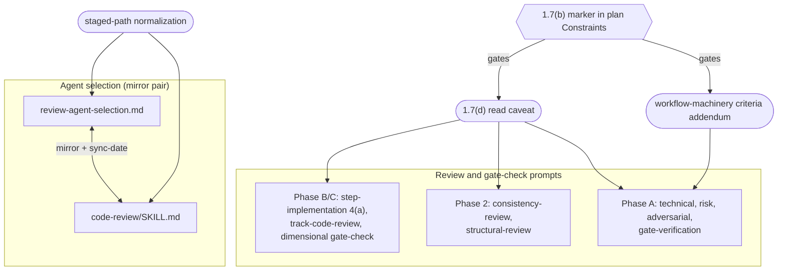

<!-- workflow-sha: f97512c02f4dbaaf66c7382397907580fd54391b -->
# Staging-aware review machinery

## Design Document
[design.md](design.md)

## High-level plan

### Goals

The workflow reviews its own machinery at three points: a plan-level review
before execution (Phase 2), a track-level review before each track is
decomposed (Phase A), and a dimensional code review of each track's diff
(Phase B/C). Every part addresses workflow files by their live `.claude/...`
path. The `§1.7` staging convention broke that assumption: on a plan that
edits `.claude/workflow/**` or `.claude/skills/**`, the authored edits live
under `docs/adr/<dir>/_workflow/staged-workflow/.claude/...` and the live
files stay at develop's state until one Phase 4 promotion. The review
machinery never learned this and goes stale on such plans in three ways.

This plan closes all three, one issue per gap:

- **YTDB-1032 (selection).** The per-agent triggers match the live
  `.claude/...` path, but a staged path begins with `docs/adr/...`, so three
  workflow reviewers never match and fail to launch. Fix: strip the staged
  prefix before matching triggers.
- **YTDB-1038 (reading).** Every review and gate prompt hands its agent the
  live path, so an agent checking a change against a rule the branch already
  rewrote reads develop's version and reports a phantom mismatch. Fix: a
  marker-gated caveat in every prompt that routes reads through `§1.7(d)`
  precedence (staged copy when present, else live).
- **YTDB-1046 (Phase A criteria).** The Phase A technical, risk, and
  adversarial reviewers apply Java criteria (find-class on named symbols, WAL
  and crash edge cases, data migrations) that have nothing to bind to on a
  track that edits prose. Fix: a marker-gated addendum re-pointing those
  criteria to prose.

### Constraints

This plan is workflow-modifying: it edits .claude/workflow/** or .claude/skills/**.

- All Phase B edits route through `docs/adr/<dir>/_workflow/staged-workflow/`
  per `§1.7`; the live `.claude/...` tree stays at develop's state until the
  Phase 4 promotion (the I6 invariant, `§1.7(g)`).
- **Self-application carve-out (`§1.7(h)`).** This branch stages its own
  edits, so its own Phase A and Phase B/C reviews run against the unfixed
  live machinery. The orchestrator hand-injects the staging and
  prose-criteria guidance during this branch's execution — the same manual
  steps these fixes remove for later plans. The fixes take effect for the
  first workflow-modifying plan opened after this branch promotes.
- The selection mirror must stay in lockstep (S1): `review-agent-selection.md`
  and the matching steps of `code-review/SKILL.md` change in one commit with
  the `<!-- Last sync-checked … -->` date bumped.
- The read caveat and the Phase A addendum must read uniformly across the
  prompts that carry them (S3); all three fixes key off the single `§1.7(b)`
  marker.
- Promotion is additive: the Phase 4 `cp -r` carries additions and edits, not
  deletions. These fixes only add text, so promotion is safe.
- House style (`house-style.md`) applies to every edited Markdown surface.

### Architecture Notes

#### Component Map

This change adds no Java types. The components are workflow documents, the
rules inside them, and the two cross-file mirrors. The diagram models that
topology; the full version with per-edge prose is in design.md §"Class
Design".

- **Selection mirror pair** (`review-agent-selection.md` ↔
  `code-review/SKILL.md`): the normalization rule (NORM) lands in both, bound
  by the S1 sync-date constraint. Track 1.
- **Prompt layers** (Phase B/C dimensional, Phase 2 plan, Phase A track): the
  read caveat (CAVEAT) reaches all three; the addendum (ADD) reaches the
  Phase A criteria reviewers only. Tracks 2 and 3.
- **Marker** (`§1.7(b)` sentence in the plan's `### Constraints`): the single
  gating signal for CAVEAT and ADD, surfaced to review agents through the
  slim plan snapshot. NORM keys off the staged prefix and needs no marker —
  staged paths exist only on plans that carry the marker anyway.

#### D1: Selection — staged-path normalization over per-glob editing

- **Alternatives considered**: extend each literal trigger glob in both mirror
  files to also match the staged `docs/adr/.../staged-workflow/.claude/...`
  prefix; vs one prefix-strip normalization rule applied before the globs run.
- **Rationale**: one normalization rule is DRY — a single rule per mirror file
  instead of editing three reviewers' globs across both mirrors — and a staged
  file then evaluates exactly as its live counterpart would. This is the
  issue's "cheaper" path.
- **Risks/Caveats**: normalization is scoped to the exact two-level
  `…/_workflow/staged-workflow/.claude/` prefix; a path that merely contains
  `.claude/` lower down must not normalize.
- **Implemented in**: Track 1
- **Full design**: design.md §"Selection-side staging awareness"

#### D2: Read caveat self-gates on the marker, not orchestrator injection

- **Alternatives considered**: the orchestrator hand-injects the staged-read
  caveat into each review prompt per review; vs a static caveat embedded in
  the prompt templates that self-gates on the `§1.7(b)` marker.
- **Rationale**: self-gating removes the per-review manual step, which is a
  YTDB-1038 acceptance criterion. The agent detects the marker from the slim
  plan snapshot, which retains `### Constraints` verbatim.
- **Risks/Caveats**: relies on the slim plan retaining `### Constraints`.
  Verified this session — `render-slim-plan.py` copies the strategic header
  `pre` block unchanged and filters only the track checklist. The caveat
  invokes `§1.7(d)`, which as written scopes precedence to the implementer and
  excludes reviewers; Track 2 therefore amends `§1.7(d)` to bring review agents
  on a workflow-modifying plan into that precedence scope. The alternative —
  wording the caveat to override `§1.7(d)` while leaving its text stale — was
  rejected for leaving a self-contradiction in the conventions source.
- **Implemented in**: Track 2
- **Full design**: design.md §"Read-side staging awareness"

#### D3: Caveat rides in the fenced prompt body, not a document section

- **Alternatives considered**: add the caveat as a new `##` document section
  in each host file; vs a short block inside the fenced prompt body.
- **Rationale**: the prompt body keeps the caveat out of the host file's
  section structure, so no TOC row or per-section annotation churns across the
  nine host files.
- **Risks/Caveats**: the two Phase B/C context blocks are parallel copies, not
  a shared include, so the block lands in both with matching meaning (S2).
- **Implemented in**: Track 2
- **Full design**: design.md §"Read-side staging awareness"

#### D4: Phase A criteria via marker-gated addendum

- **Alternatives considered**: new workflow-aware Phase A prompt files; a
  complexity-assessment dispatch swap in `track-review.md`; vs a marker-gated
  addendum inside the existing technical/risk/adversarial prompts.
- **Rationale**: the addendum adds no new files and no dispatch change. The
  same three reviewers self-adapt by reading the marker, mirroring how the
  read caveat self-gates, so a track mixing prose and code gets one reviewer
  applying both lenses.
- **Risks/Caveats**: `review-gate-verification.md` re-checks prior findings
  rather than generating criteria, so it is criteria-agnostic and takes the
  read caveat alone, no addendum.
- **Implemented in**: Track 3
- **Full design**: design.md §"Phase A criteria for workflow-machinery tracks"

#### Invariants

- **S1 (selection mirror).** `review-agent-selection.md` (§Workflow-machinery
  file set, §Per-agent file-pattern triggers, §Workflow-machinery override)
  and `code-review/SKILL.md` Steps 5a/5b/5d/6 change in one commit with the
  `<!-- Last sync-checked … -->` date bumped. Enforced by
  `review-workflow-consistency` at Phase C; no script checks it. (Track 1)
- **S2 (parallel-block).** The canonical context block in
  `step-implementation.md` sub-step 4(a) and its parallel copy in
  `track-code-review.md` carry the same caveat, or a Phase C review behaves
  differently from its Phase B counterpart. (Track 2)
- **S3 (uniformity).** The read caveat reads the same across all nine prompts,
  and the Phase A addendum the same across the three criteria prompts; all
  three fixes key off the single `§1.7(b)` marker. (Tracks 2 + 3)

#### Integration Points

- The `§1.7(b)` marker in the plan's `### Constraints` is the gating signal
  for the read caveat and the Phase A addendum, surfaced to review agents via
  the slim plan snapshot (`render-slim-plan.py` retains `### Constraints`).
- Selection normalization plugs into `review-agent-selection.md`
  §Workflow-machinery override and the mirrored `code-review/SKILL.md` Step 5d,
  ahead of the per-agent glob match.

#### Non-Goals

- This branch does not fix its own Phase A/C review (self-application
  carve-out, `§1.7(h)`); the orchestrator hand-injects during execution.
- No new Phase A prompt files and no change to the `track-review.md`
  complexity-assessment dispatch (D4).
- `workflow-reindex.py --check` gains no mirror check and no staged-copy
  awareness (adjacent gap, noted in design.md §"Consistency invariants and
  self-application" edge cases).
- Does not fix the `create-plan` SKILL design-vs-plan ordering the user
  flagged (separate PR).

## Checklist
- [ ] Track 1: Selection-side staging awareness (YTDB-1032)
  > On a workflow-modifying plan the per-agent triggers match the live
  > `.claude/...` path while the change lives under the staged prefix, so
  > `review-workflow-prompt-design`, `-instruction-completeness`, and
  > `-hook-safety` never match and fail to launch (consistency and
  > context-budget always run; writing-style already fires via
  > `docs/adr/**/*.md`). A staged-path normalization rule strips the prefix
  > before the globs run. Detailed description in plan/track-1.md.
  > **Scope:** ~2 steps covering the staged-path normalization rule + mirror sync.

- [ ] Track 2: Read-side staged-read caveat (YTDB-1038)
  > Every review and gate prompt names the live `.claude/...` path, so on a
  > workflow-modifying plan an agent reads develop's version of a rule the
  > branch already rewrote and reports a phantom mismatch. A marker-gated
  > caveat in all nine prompts routes reads through `§1.7(d)` precedence
  > (which this track first amends to cover review agents, not just the
  > implementer).
  > Detailed description in plan/track-2.md.
  > **Scope:** ~4 steps covering the `§1.7(d)` amendment plus the caveat across nine review/gate prompts.

- [ ] Track 3: Phase A criteria addendum (YTDB-1046)
  > The Phase A technical, risk, and adversarial reviewers apply Java criteria
  > that misfire on a prose track and raise phantom `NOT FOUND` blockers. A
  > marker-gated addendum re-points the criteria to prose; the same three
  > reviewers self-adapt. Detailed description in plan/track-3.md.
  > **Scope:** ~2 steps covering the workflow-machinery criteria addendum in technical/risk/adversarial.
  > **Depends on:** Track 2

## Plan Review
- [x] Plan review (consistency + structural) — passed; consistency at iteration 2, structural at iteration 1

**Auto-fixed (mechanical)**: CR1 — clarified track-1.md Plan of Work step 1
(the per-agent globs live in §Per-agent file-pattern triggers / SKILL.md
Step 5b; the override section / Step 5d is where the normalization preamble
lands). CR2 — no edit; the plan's short-form `§Workflow-machinery override`
reference matches §Maintenance's own usage. CR4 — disambiguated
`structural-review.md` → `prompts/structural-review.md` in track-2.md
(a same-named driver doc exists at `.claude/workflow/structural-review.md`).

**Escalated (design decisions)**: CR3 — track-1.md said to bump the
`<!-- Last sync-checked … -->` date "in both files," but that stamp is
single-canonical in `review-agent-selection.md §Maintenance`; user chose the
single-canonical reading, fixed at 4 sites (SKILL.md carries no such comment).
CR5 — the Track 2 read caveat routes review agents through `§1.7(d)`, but
`§1.7(d)` as written scopes precedence to the implementer and excludes
reviewers; user chose to amend `§1.7(d)` in Track 2 (bring review agents into
the precedence scope, drop the stale rationale), applied to track-2.md, the
Track 2 scope line + D2 Risks/Caveats, and design.md (edit-design Mutation 3).
S1 — design.md Core Concepts "Per-agent trigger" one-liner undercounts the
glob-gated reviewers (three, not four); user chose leave-as-is (the canonical
§Selection-side section is correct; the entry is a non-authoritative summary).

## Final Artifacts
- [ ] Phase 4: Final artifacts (`design-final.md`, `adr.md`)
