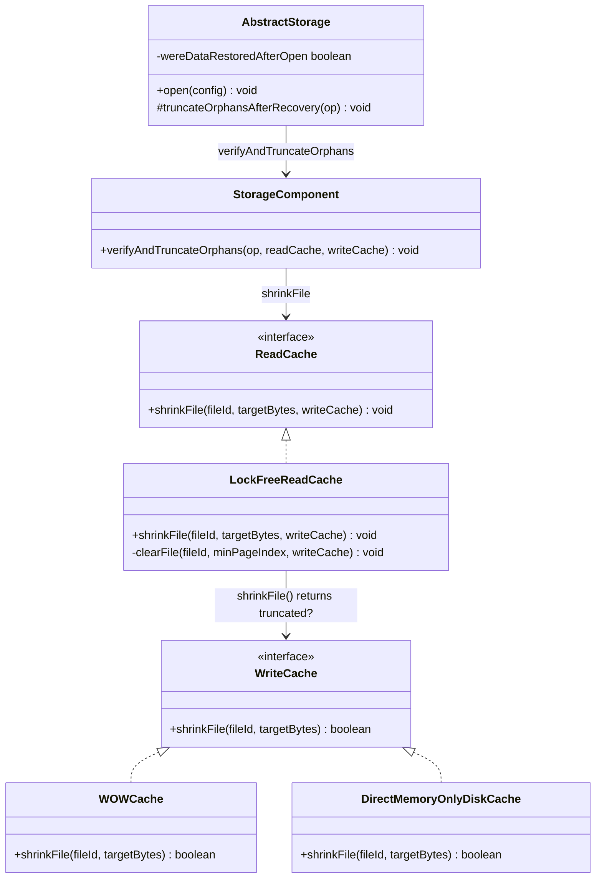
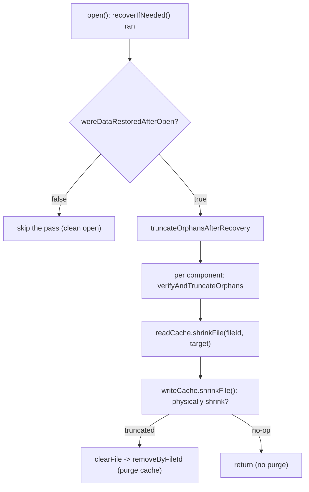

<!-- workflow-sha: 795f7e1902017877bd158df977a01e3ddb436a42 -->
# Speed up open() on databases with many collections — Design

## Overview

YouTrackDB today runs a recovery-time orphan-truncation pass on every disk
`open()`, regardless of whether the database was closed cleanly. The pass walks
every entry-point-equipped component and, for each one, dispatches a
`shrinkFile` that always sweeps the entire read-cache section map and rehashes.
With the cache holding one entry-point page per component, the per-open cost
grows with the square of the collection count. A 4000-collection database takes
over two minutes to reopen, and a sampling profiler attributes 97% of that to a
single hash-map sweep.

This design removes the cost on two independent axes. The first skips the pass
entirely on a clean open: a disk orphan (a physical page past a component's
logical horizon) can only be produced by a crash, so a database that replayed
no write-ahead log on open has no orphan to truncate. The second makes the pass
cheap on the crash-recovery path it still runs on: the read-cache purge fires
only when the write-cache layer actually dropped pages.

Two enabling changes carry the design. A gate on the existing
`wereDataRestoredAfterOpen` flag (set only when `open()` replayed the WAL) wraps
the pass dispatch. A `boolean` return on `WriteCache.shrinkFile` lets the
read-cache layer skip its hash-map purge when nothing was truncated.

What else changes: the `open()` dispatch site gains the gate; the `shrinkFile`
SPI return type ripples to its two implementations and six test mocks; the
read-cache-concurrency-bug ADR (whose D6/I6 recorded the pass as unconditional)
is amended to record the refined gating. The incremental-restore dispatch stays
unconditional, and the in-memory engine is unaffected.

The rest of this document covers the core vocabulary, the touched classes and
the runtime flow, then four focused sections: why the dirty gate is safe, the
orphan lifecycle across crash and recovery, the read-cache purge skip, and the
relationship to the prior ADR.

## Core Concepts

This design turns on four ideas. Each is named here and used without
re-definition below.

**Orphan page.** A physical page on disk past a component's logical horizon
(`entryPoint.logicalPages`), so the file is physically larger than the component
counts. Produced when a physical extend becomes durable but its matching logical
advance is lost. → §"Crash recovery and the orphan lifecycle".

**The orphan pass.** `AbstractStorage.truncateOrphansAfterRecovery`, dispatched
near the end of `open()`. It iterates every entry-point-equipped component and
shrinks each file back to its logical horizon, re-establishing the invariant
that physical never exceeds logical. → §"Why the dirty gate is safe".

**Dirty gate.** A guard on the pass dispatch keyed to `wereDataRestoredAfterOpen`,
the flag set only when `open()` replayed the WAL. A clean open replays nothing,
so the flag stays false and the pass is skipped. Replaces the unconditional
dispatch. → §"Why the dirty gate is safe".

**No-op shrink.** A `shrinkFile` call whose target size is at least the current
file size, so nothing is dropped on disk. Today the read-cache purge runs anyway;
this design skips it. Replaces the unconditional purge. → §"Read-cache purge skip".

## Class Design

The two changed contracts are the `WriteCache.shrinkFile` return type (now
`boolean truncated`) and the `AbstractStorage.open()` use of the existing
`wereDataRestoredAfterOpen` field. `LockFreeReadCache.shrinkFile` keeps its
signature; only its internal decision to call `clearFile` becomes conditional.
`StorageComponent.verifyAndTruncateOrphans` and the orchestrator
`truncateOrphansAfterRecovery` are untouched: the gate sits above the
orchestrator at the `open()` call site, and the purge skip sits below the
component helper inside the read-cache layer.

## Workflow

The flowchart shows both axes on one path. The gate (Axis A) decides whether the
pass runs at all; for a clean open it does not. When the pass does run (crash
recovery), each component's `shrinkFile` consults the write-cache result and
purges the read cache only on a real truncate (Axis B). A clean component on the
crash-recovery path therefore reaches `NOPURGE` and pays no hash-map sweep.

## Why the dirty gate is safe

**TL;DR.** A disk orphan can only be produced by a crash, and a crash always
leaves the storage dirty, so an open that replayed no WAL faces no orphan. The
gate on `wereDataRestoredAfterOpen` skips the pass exactly when there is nothing
to truncate, and runs it on every WAL-replay open, which preserves the
physical-never-exceeds-logical invariant.

The pass dispatch sits at `AbstractStorage.open()` after `recoverIfNeeded()`.
That method sets `wereDataRestoredAfterOpen = true` only when `isDirty()` holds
at entry, then replays the WAL and flushes. By the dispatch site the dirty flag
has been cleared by the flush, so the flag, not a fresh `isDirty()` read, is the
correct signal for "this open replayed the WAL".

The safety argument rests on a single premise about rollback. On the disk
engine, `allocatePageForWrite` produces a stub overlay with a null cache pointer
and performs no physical work. Every physical extend, dirty-page install, and
`EnsurePageIsValidInFileTask` submission happens inside `commitChanges`, which
`AtomicOperationsManager.endAtomicOperation` invokes only when the operation is
not rolling back. A rolled-back transaction therefore writes nothing to disk and
dirties no cache page. The remaining way to reach a physical-greater-than-logical
state is a crash that makes a physical extend durable while losing the matching
logical advance from a discarded WAL unit, and a crash sets the dirty flag that
drives the next open into WAL replay.

Three independent reviews confirmed the premise by tracing every disk-write
primitive back to its callers and finding none reachable from a rolled-back,
cleanly-closed transaction. The load-bearing line is the rollback check at
`endAtomicOperation`, which skips `commitChanges` wholesale; the `if (!rollback)`
inside `commitChanges` guards only snapshot-buffer flushing and would not protect
the physical apply on its own.

### Edge cases / Gotchas

- The premise lives in the caller (`endAtomicOperation`), not inside
  `commitChanges`. A future refactor that made `commitChanges` callable on a
  rolled-back operation would break the gate's safety silently. S2 pins this
  with an assertion so the break surfaces as a test failure.
- `wereDataRestoredAfterOpen` is never reset. On a reused storage instance it
  could read stale-true, which only forces an unnecessary (and now cheap) pass.
  It can never read stale-false, so the gate never skips a needed pass.
- Incremental restore keeps an unconditional dispatch in
  `postProcessIncrementalRestore`: it always replayed pages and must always
  re-establish the invariant.
- The crash-only premise also rests on reads never extending a file.
  `WOWCache.loadOrAdd`, reached on the read path through
  `LockFreeReadCache.doLoad`, does extend for any `pageIndex >= currentSize`.
  But every production read is bounded below the file's extent (by the
  component's logical horizon via `getLastPage`/entry point, by physical size
  for EP-less components, or by a stored page pointer), so a correct component
  never triggers it. A read reaches an out-of-range index only under a
  pre-existing `logical > physical` state, which is itself crash-only and
  repaired by WAL replay. The premise thus reduces to component correctness
  plus crash recovery, both already in force; the gate neither introduces nor
  weakens them.

### References

- D-records: D1
- Invariants: S1, S2
- The rollback premise and the three verification passes are summarized in this
  branch's Phase 4 ADR.

## Crash recovery and the orphan lifecycle

**TL;DR.** An orphan exists only between the crash that created it and the first
WAL-replay open that follows. That open is dirty by construction, so the gated
pass runs and truncates the orphan before any non-recovery transaction. After a
clean close there is no orphan, so the next clean open has nothing to do.

A transaction that extends a file logs its page operations and its logical-counter
advance in one WAL atomic unit. A crash before the unit's end record discards the
unit on replay, so the logical advance is lost. If the physical extend reached
disk (through a flushed dirty page or an ensure-valid task), the file is now
physically longer than the component counts: an orphan.

The next open sees a dirty flag, replays the WAL, sets
`wereDataRestoredAfterOpen`, and reaches the gated dispatch with the flag true.
The pass runs, reads each component's logical horizon from its entry point, and
shrinks the file back to that horizon. The orphan is gone before the storage
opens for normal use. A subsequent graceful close writes no new orphan, so the
following clean open skips the pass and still satisfies the invariant.

### Edge cases / Gotchas

- The pass is best-effort: a per-component failure logs a warning and continues.
  Under the gate, a component whose truncation failed at the one dirty reopen is
  not retried on a later clean reopen. That component's entry point was
  unreadable, so it is already corrupt and handled by the storage-corruption
  runbook; losing the cross-clean-cycle retry does not widen the failure.
- WAL replay applies a closed unit's page operations without consulting a
  rollback flag, but a rolled-back transaction writes no closed end record, so
  its unit is discarded rather than replayed.

### References

- D-records: D1
- Invariants: S1

## Read-cache purge skip

**TL;DR.** The read-cache purge inside `shrinkFile` evicts cache entries for
pages that were physically dropped. When the write-cache layer drops nothing,
there is nothing to evict, so the purge is pure waste. A `boolean truncated`
return lets the read-cache layer skip the hash-map sweep on a no-op shrink, which
removes the profiled hotspot on the crash-recovery path and on any clean
component the pass visits.

`LockFreeReadCache.shrinkFile` validates its target, delegates to
`writeCache.shrinkFile`, then today always computes a `minPageIndex` and calls
`clearFile`, which sweeps every read-cache section under its write lock and
rehashes. `WOWCache.shrinkFile` already returns early when the target is at least
the current file size, but its `void` return hides that no-op from the caller, so
the sweep runs regardless.

The change threads the no-op signal up: `WOWCache.shrinkFile` returns `false` on
its early return and `true` after a real truncate; `DirectMemoryOnlyDiskCache`
returns `false`; `LockFreeReadCache.shrinkFile` runs `clearFile` only on a `true`
result. The purge is correct to skip on a no-op because no pages were dropped, so
no cache entry can be stale. The unconditional purge paths used by
`truncateFile`, `closeFile`, and `deleteFile` are untouched, since those always
drop pages.

### Edge cases / Gotchas

- The argument-validity guards in `LockFreeReadCache.shrinkFile` stay above the
  delegate, so a malformed target still fails fast before any truncate.
- The six test `WriteCache` mocks override `shrinkFile`; each returns `false`
  under the new contract. None drives a real disk truncate.
- `ConcurrentLongIntHashMap.removeByFileId` is unchanged. It is simply no longer
  called on a no-op; its own structure stays as-is because genuine orphans are
  rare and few.

### References

- D-records: D2
- Invariants: S3

## Relationship to the read-cache-concurrency-bug ADR

**TL;DR.** The prior ADR (D6 / I6) recorded the orphan pass as unconditional and
explicitly forbade `isDirty`-gating, on the argument that an orphan could survive
a crash then a clean reopen then a clean reclose. This design refines that record:
the disk-engine pass is now gated on WAL replay, justified by the rollback
zero-footprint premise that the prior ADR did not establish.

The prior invariant I6 stated that after `open()` returns, every entry-point
component satisfies logical-not-greater-than-physical, established by the
unconditional pass. The gated pass preserves I6 by a narrower argument: the pass
still runs on every open that could face an orphan, which is exactly the
WAL-replay opens. The "survives a clean reclose" scenario the prior ADR feared
does not arise on disk, because the first (dirty) reopen after the crash already
runs the pass and truncates the orphan before the clean reclose.

The amendment updates the D6 rationale and the I6 note in the
read-cache-concurrency-bug `adr.md`, and the matching "Unconditional, not
`isDirty`-gated" bullet in its `design-final.md`, each pointing at YTDB-1039 for
the rollback premise and the gating change.

### Edge cases / Gotchas

- The amendment is documentation only; it changes no behavior in the prior PR's
  code beyond the gate this plan adds.
- The in-memory engine's rollback-orphan behavior, also noted in the prior ADR,
  stays out of scope: its `shrinkFile` is a no-op and its pass does nothing.

### References

- D-records: D1
- Invariants: S1, S2
