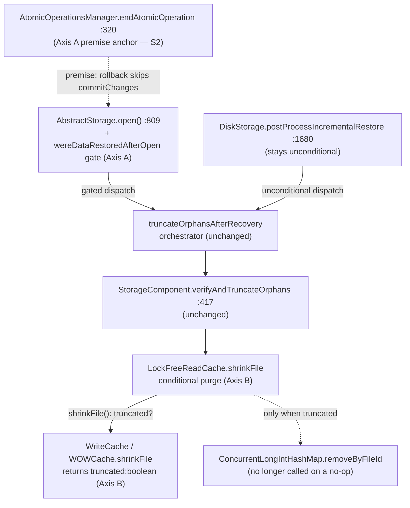

<!-- workflow-sha: 795f7e1902017877bd158df977a01e3ddb436a42 -->
# Speed up open() on databases with many collections (YTDB-1039)

## Design Document
[design.md](design.md)

## High-level plan

### Goals

Opening a cleanly-closed disk database is O(N²) in collection count: the
recovery-time orphan-truncation pass (`AbstractStorage.truncateOrphansAfterRecovery`)
runs unconditionally on every open and, per EP-equipped component, calls
`LockFreeReadCache.shrinkFile` → `clearFile` → `ConcurrentLongIntHashMap.removeByFileId`,
which linearly sweeps the whole read-cache section capacity even when it removes
nothing. During the pass the cache holds ~O(N) entry-point pages, so N sweeps × O(N)
capacity dominates (the issue profiles 97.2% of reopen in `removeByFileId`, 4000
collections = 137 s).

This plan attacks the cost on two axes:

- **Axis A — skip the pass on a clean open.** Disk orphans are crash-only
  (verified, see D1). Gate the open-time pass on `wereDataRestoredAfterOpen`
  (true only when this open replayed WAL). A graceful close → clean reopen
  then skips the pass entirely: O(1).
- **Axis B — make the pass cheap when it does run.** On the crash-recovery
  path the pass still runs; make each per-component dispatch O(1) when nothing
  is truncated by skipping the read-cache purge whenever the write-cache layer
  truncated nothing.

The two compose: Axis A removes the cost for the common clean reopen (the issue's
reproduction); Axis B keeps crash recovery on a large-collection database from
paying the same O(N²) penalty.

### Constraints

- **Crash safety is paramount.** Axis A overturns a documented invariant
  (read-cache-concurrency-bug ADR D6 / I6: "must not be `isDirty`-gated"). It
  is admissible only because a rolled-back disk transaction leaves zero physical
  footprint (independently confirmed by three PSI-backed sub-agents), so a disk
  orphan can arise only from a crash, which always sets the dirty flag. The
  change must land behind a crash-injection regression test and an assertion
  that pins the load-bearing premise (S2).
- **Disk engine only.** The in-memory engine's `shrinkFile` is a no-op, so
  neither axis changes in-memory behavior; the in-memory rollback-orphan
  behavior is out of scope.
- **Incremental restore stays unconditional.** `DiskStorage.postProcessIncrementalRestore`
  (`:1680`) keeps calling the pass unconditionally — it always restored pages.
- **No on-disk format change.** Axis A uses an existing in-memory signal; it
  does not bump `StorageStartupMetadata` (see D1, rejected alternative).
- 2-space indent, 100-col, braces always, Spotless-clean; JDK 21.

### Architecture Notes

#### Component Map

- **`AbstractStorage.open()` (`:809`)** — wrap the pass dispatch in
  `if (wereDataRestoredAfterOpen)`. This is the whole of Axis A's behavior
  change; the orchestrator and per-component helpers are untouched. [Track 2]
- **`DiskStorage.postProcessIncrementalRestore` (`:1680`)** — left unconditional;
  incremental restore always replays pages so it must always re-establish I6. [Track 2]
- **`WriteCache` / `WOWCache.shrinkFile`** — change the SPI to return
  `boolean truncated` (true iff the file was physically shrunk; false on the
  `fileSize <= targetBytes` no-op). [Track 1]
- **`LockFreeReadCache.shrinkFile`** — call `clearFile`/`removeByFileId` only
  when the write-cache layer returned `truncated == true`. This is the change
  that eliminates the `removeByFileId` hotspot. [Track 1]
- **`AtomicOperationsManager.endAtomicOperation` (`:320`)** — not modified, but
  it is the anchor of invariant S2 (a rolled-back op never enters `commitChanges`).
  Track 2 pins it with an assertion/test so a future refactor cannot silently
  break Axis A's premise. [Track 2]

#### D1: Gate the open-time orphan pass on `wereDataRestoredAfterOpen` (Axis A)

- **Alternatives considered**: (a) keep unconditional (status quo — O(N²) on
  clean reopen); (b) persistent "orphan-free" marker in `StorageStartupMetadata`
  (v5) plus a close-time confirming pass — rejected: the rollback-zero-footprint
  proof makes the simpler gate correct, and the marker adds an on-disk format
  bump and close-time cost for no extra benefit; (c) re-read `isDirty()` at the
  dispatch — rejected: `recoverIfNeeded → flushAllData → clearStorageDirty`
  already cleared it by `:809`, so `wereDataRestoredAfterOpen` is the correct
  "did WAL replay happen" signal.
- **Rationale**: a disk orphan (physical > logical) can only be produced by a
  crash that makes a physical extend durable while losing the logical advance;
  a rolled-back TX has zero physical footprint, so a cleanly-closed database is
  orphan-free. A crash always leaves `isDirty()==true`, so it always sets
  `wereDataRestoredAfterOpen`. Gating on it therefore preserves I6 (S1) while
  skipping the pass on every clean reopen.
- **Risks/Caveats**: overturns ADR D6/I6 (mitigated by a crash-injection
  regression test and the ADR update); loses the cross-clean-cycle retry of a
  best-effort truncation failure (the affected component is already corrupt — see
  design §"Read-cache purge skip" edge cases); premise pinned at
  `endAtomicOperation:320` via S2.
- **Implemented in**: Track 2
- **Full design**: design.md §"Why the dirty gate is safe"

#### D2: Skip the read-cache purge when nothing was physically truncated (Axis B)

- **Alternatives considered**: keep the unconditional `removeByFileId` purge
  (status quo); give `ConcurrentLongIntHashMap` a secondary `fileId` index so
  `removeByFileId` is O(matches) instead of O(capacity) — rejected as
  unnecessary once the purge is skipped on no-ops (the structural cost only
  matters on genuine orphans, which are rare and few).
- **Rationale**: the read-cache purge exists only to evict cache entries for
  pages that were physically dropped. When `WOWCache.shrinkFile` no-ops
  (`fileSize <= targetBytes`), no pages were dropped, so there is nothing to
  evict. A `boolean truncated` return from `WriteCache.shrinkFile` lets
  `LockFreeReadCache.shrinkFile` skip `clearFile`/`removeByFileId` entirely.
- **Risks/Caveats**: SPI signature change ripples to `WOWCache`,
  `DirectMemoryOnlyDiskCache`, and 5 test mocks (all mechanical, PSI-confirmed).
- **Implemented in**: Track 1
- **Full design**: design.md §"Read-cache purge skip"

#### Invariants

- **S1 (preserves I6).** After `AbstractStorage.open()` returns, every
  EP-equipped disk component satisfies `entryPoint.logicalPages <= physicalPages`.
  The dirty gate preserves this: the pass still runs on every WAL-replay open,
  which is the only path that can create an orphan.
- **S2 (Axis A premise).** A rolled-back atomic operation never enters
  `commitChanges` (anchored at `AtomicOperationsManager.endAtomicOperation:320`),
  so it performs no `AsyncFile` extend, dirties no real cache page, and submits
  no `EnsurePageIsValidInFileTask`. Pinned by an assertion/test in Track 2.
- **S3 (Axis B correctness).** The `shrinkFile` read-cache purge runs iff the
  write-cache layer physically truncated. Skipping it on a no-op leaves no stale
  cache entries (no pages were dropped).

#### Integration Points

- Axis A gate reads `wereDataRestoredAfterOpen` (set only at `recoverIfNeeded:4682`).
- `WriteCache.shrinkFile` gains a `boolean` return; impls `WOWCache`,
  `DirectMemoryOnlyDiskCache`, and 5 test `WriteCache` mocks update.

#### Non-Goals

- In-memory engine (`DirectMemoryOnlyDiskCache.shrinkFile` is a no-op — unchanged).
- A structural O(matches) `removeByFileId` (secondary `fileId` index) — unneeded after Axis B.
- Persistent orphan-free marker / `StorageStartupMetadata` v5 — rejected (D1).
- The pre-existing torn-write / OS-writeback durability gap (separate ticket; noted in the read-cache-concurrency-bug design-final).

## Checklist
- [ ] Track 1: Axis B — skip the read-cache purge on a no-op shrink
  > Make the recovery-time orphan pass O(1) per component when nothing is
  > truncated, so crash recovery on a large-collection database no longer pays
  > the O(N²) `removeByFileId` penalty. Change `WriteCache.shrinkFile` to report
  > whether it physically truncated, and have `LockFreeReadCache.shrinkFile`
  > purge the read cache only when it did. Detailed description in plan/track-1.md.
  > **Scope:** ~4-5 steps covering the `WriteCache.shrinkFile` boolean SPI + `WOWCache` impl, the `DirectMemoryOnlyDiskCache` + test-mock updates, the `LockFreeReadCache` conditional purge, and skip-on-no-op + crash-recovery tests.

- [ ] Track 2: Axis A — gate the open-time pass on `wereDataRestoredAfterOpen`
  > Skip the orphan pass entirely on a clean (non-WAL-replay) open so a
  > gracefully-closed database reopens in O(1). Gate the `open()` dispatch on
  > `wereDataRestoredAfterOpen`, pin the load-bearing premise (S2) with an
  > assertion, prove safety with a crash-injection regression test, and update
  > the read-cache-concurrency-bug ADR D6/I6 to reflect the refined gating.
  > Detailed description in plan/track-2.md.
  > **Scope:** ~4-5 steps covering the gate at `open():809` + comment, the `endAtomicOperation` premise assertion, the crash-injection regression test, and the ADR D6/I6 + design-final update.
  > **Depends on:** Track 1

## Plan Review
- [x] Plan review (consistency + structural) — passed at iteration 1

**Auto-fixed (mechanical)**: CR1 — test-mock count "6" → "5" (PSI `OverridingMethodsSearch` on `WriteCache.shrinkFile`: 2 production + 5 test = 7 overriders), corrected in plan §D2 Risks + §Integration Points, design.md §Overview + §"Read-cache purge skip", track-1 §Plan of Work + §Interfaces. CR2 — S2 anchor `endAtomicOperation:323` → `:320` (the actual `if (!operation.isRollbackInProgress())` guard line; call `:321`, else-branch `:323`), corrected in plan Component Map + §D1 + §Invariants S2 and track-2 §Context + §Interfaces.

**Escalated (design decisions)**: none.

## Final Artifacts
- [ ] Phase 4: Final artifacts (`design-final.md`, `adr.md`)
