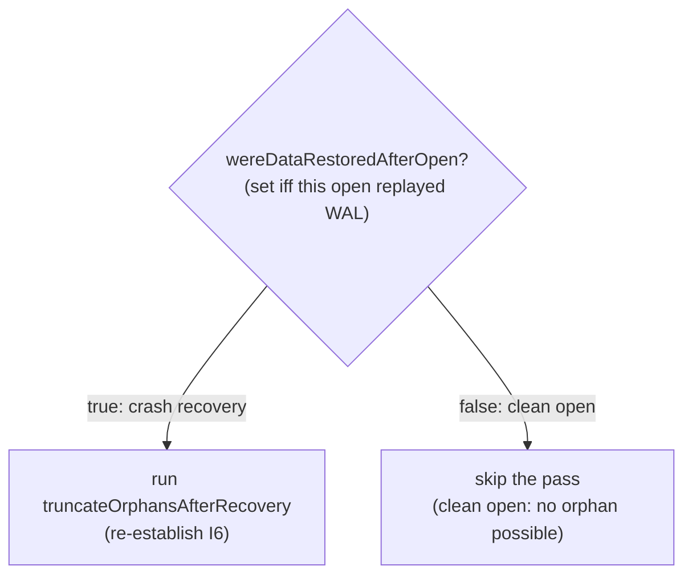

<!-- workflow-sha: 9a34db786e015e1a0c6d7c4d80932afbddda6a0b -->
# Track 2: Axis A — gate the open-time pass on `wereDataRestoredAfterOpen`

## Purpose / Big Picture
A gracefully-closed disk database reopens in O(1): the orphan pass is skipped entirely on a clean (non-WAL-replay) open.

<!-- Reserved for Move 2 — ADDED/MODIFIED/REMOVED triad. Empty until Move 2 lands. -->

Skip the orphan pass entirely on a clean (non-WAL-replay) open so a
gracefully-closed database reopens in O(1). Gate the `open()` dispatch on
`wereDataRestoredAfterOpen`, pin the load-bearing premise (S2) with an
assertion, prove safety with a crash-injection regression test, and update the
read-cache-concurrency-bug ADR D6/I6 to reflect the refined gating.

## Progress
- [ ] Review + decomposition
- [ ] Step implementation
- [ ] Track-level code review
- [ ] Track completion

## Surprises & Discoveries
<!-- Continuous-log. Promoted by the orchestrator from per-step "What was
discovered" when the finding affects future steps or other tracks. Empty
at Phase 1. -->

## Decision Log
<!-- Continuous-log. Execution-time decisions: inline-replan choices,
scope-downs, dependency reveals, gate-override reasons. -->

<!-- Reserved for Move 1 — per-track inlined Decision Records. -->

## Outcomes & Retrospective
<!-- Continuous-log. Review iteration outcomes and the track-completion
summary at Phase C. -->

## Context and Orientation

`AbstractStorage.open()` dispatches the orphan pass at `:809`:
```java
atomicOperationsManager.executeInsideAtomicOperation(this::truncateOrphansAfterRecovery);
```
preceded by a comment (`:802-808`) that explicitly states the pass is
unconditional and **not** gated by `wereDataRestoredAfterOpen`, citing the
"orphan survives crash → clean reopen → clean reclose" argument from the
read-cache-concurrency-bug ADR (D6 / I6, adr.md:512, design-final.md:840).

The verification done in research refutes that argument for the disk engine:

- `wereDataRestoredAfterOpen` (boolean, `AbstractStorage`) is set `true` only at
  `recoverIfNeeded():4682`, which runs only when `isDirty()` (a crash). It is
  read via a getter at `:3924` and is never reset. By the dispatch at `:809`,
  `recoverIfNeeded → flushAllData → clearStorageDirty` has already cleared the
  dirty flag, so `isDirty()` reads false even on a crash reopen —
  `wereDataRestoredAfterOpen` is the correct "did this open replay WAL" signal.
- A rolled-back disk TX leaves zero physical footprint (S2): the physical-apply
  path runs only inside `commitChanges`, and `AtomicOperationsManager.endAtomicOperation:320`
  calls `commitChanges` only `if (!operation.isRollbackInProgress())`. The
  `if (!rollback)` inside `commitChanges` (`:1077`) guards only snapshot-buffer
  flushing, not the physical apply — so the real protection is the caller's skip.
- Therefore a disk orphan (physical > logical) can only result from a crash that
  made a physical extend durable while losing the logical advance, and a crash
  always leaves `isDirty()==true` at the next open. An `isDirty()==false` open
  faces no orphans.

`DiskStorage.postProcessIncrementalRestore:1680` calls the pass too; it always
restored pages and must stay unconditional.



**Deliverables.** The gate at `open():809`; an assertion/test pinning S2; a
crash-injection regression test proving the dirty path re-establishes I6 and the
clean path is orphan-free; an update to ADR D6/I6 + design-final's "Unconditional"
bullet recording the refinement.

**Terminology.** "dirty gate" = `if (wereDataRestoredAfterOpen)` around the pass
dispatch. "premise S2" = a rolled-back op never enters `commitChanges`.

## Plan of Work

1. Gate the dispatch at `AbstractStorage.open():809`:
   `if (wereDataRestoredAfterOpen) { executeInsideAtomicOperation(this::truncateOrphansAfterRecovery); }`.
   Rewrite the `:802-808` comment to state the new rationale (disk orphans are
   crash-only; the pass runs whenever WAL replay happened; cite S1/S2). Leave
   `postProcessIncrementalRestore:1680` unconditional. Consider resetting
   `wereDataRestoredAfterOpen` on close for instance-reuse hygiene — Phase A to
   confirm whether storage instances are ever reopened (stale-`true` is safe,
   only forcing an unnecessary cheap pass).
2. Pin premise S2: add an assertion (or a focused unit test) at/around
   `AtomicOperationsManager.endAtomicOperation` that a rolled-back operation does
   not reach `commitChanges`, so a future refactor cannot silently break Axis A.
3. Crash-injection regression test (disk engine): (a) produce an orphan via a
   crash mid-commit, reopen (dirty) → assert the pass ran and I6 holds; (b) a TX
   that allocates then rolls back, followed by a graceful close → reopen (clean)
   → assert no orphan exists (physical == logical for every EP component) and the
   pass was skipped. Reuse the harnesses in `AbstractStorageTruncateOrphansAfterRecoveryTest`
   / `TruncateOrphansAfterRecoveryIT`.
4. Update the read-cache-concurrency-bug durable ADR: amend D6/I6 (adr.md) and
   the design-final "Unconditional, not `isDirty`-gated" bullet (design-final.md)
   to record that the disk-engine pass is now gated on WAL-replay, with a pointer
   to YTDB-1039 and the rollback-zero-footprint rationale.

Ordering: step 1 is the behavior change; step 3 validates it; steps 2 and 4 can
follow in any order. Invariant to preserve: S1 (I6 still holds after open()).

## Concrete Steps
<!-- Phase A placeholder — decomposition writes a thin numbered roster here. -->

## Episodes
<!-- Continuous-log. Phase B sub-step 7 appends one block per completed step. Empty at Phase 1. -->

## Validation and Acceptance

- A gracefully-closed disk database reopened with a fresh manager instance skips
  the orphan pass (no per-component `verifyAndTruncateOrphans` dispatch) and
  reopen cost is independent of collection count.
- A crash that creates a physical orphan is still repaired: the next (dirty)
  reopen runs the pass and leaves every EP-equipped component at
  `logicalPages <= physicalPages` (S1 / I6).
- A rolled-back-then-cleanly-closed session leaves no on-disk orphan (asserted by
  inspecting physical vs logical for the touched component).
- An assertion/test fails if a rolled-back operation ever reaches `commitChanges` (S2).
- The read-cache-concurrency-bug ADR D6/I6 and design-final text reflect the new gating.

<!-- Phase A placeholder for per-step EARS/Gherkin lines. -->

<!-- Reserved for Move 3 — EARS or Gherkin acceptance lines used verbatim as test method names. Empty until Move 3 lands. -->

## Idempotence and Recovery
<!-- Phase A placeholder — names per-step idempotence and recovery paths once steps are decomposed. -->

## Artifacts and Notes
<!-- Continuous-log (rare). Often empty. -->

## Interfaces and Dependencies

**In scope (production):**
- `core/.../storage/impl/local/AbstractStorage.java` — gate at `:809` + comment `:802-808`.
- `core/.../storage/impl/local/paginated/atomicoperations/AtomicOperationsManager.java`
  — S2 assertion at/near `endAtomicOperation:320` (no behavior change).

**In scope (tests + docs):**
- `AbstractStorageTruncateOrphansAfterRecoveryTest`, `TruncateOrphansAfterRecoveryIT` — crash/clean reopen scenarios.
- `docs/adr/read-cache-concurrency-bug/adr.md` (D6, I6) and
  `docs/adr/read-cache-concurrency-bug/design-final.md` (the "Unconditional" bullet) — refinement note.

**Out of scope:**
- `DiskStorage.postProcessIncrementalRestore:1680` (stays unconditional).
- `truncateOrphansAfterRecovery` orchestrator body and per-component helpers (unchanged).
- In-memory engine (`shrinkFile` no-op; gating has no effect there).
- Any `StorageStartupMetadata` format change (rejected in D1).

**Signatures:** no new signatures. The gate reads the existing
`wereDataRestoredAfterOpen` field; the S2 guard is an assertion, not an API change.

**Dependencies:**
- **Depends on Track 1** — the crash-recovery path exercised by the regression
  test runs the cheap (Axis B) pass; sequencing Track 1 first lands the
  guaranteed win before the riskier gate and validates both axes together.
