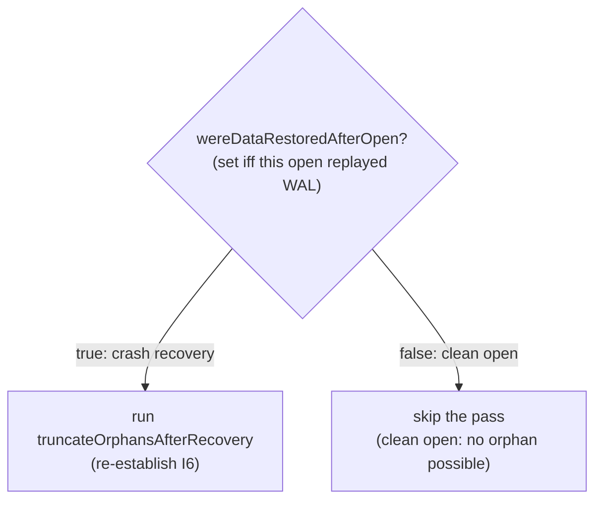

<!-- workflow-sha: 795f7e1902017877bd158df977a01e3ddb436a42 -->
# Track 2: Axis A — gate the open-time pass on `wereDataRestoredAfterOpen`

## Purpose / Big Picture
A gracefully-closed disk database reopens in O(1): the orphan pass is skipped entirely on a clean (non-WAL-replay) open.

<!-- Reserved for Move 2 — ADDED/MODIFIED/REMOVED triad. Empty until Move 2 lands. -->

Skip the orphan pass entirely on a clean (non-WAL-replay) open so a
gracefully-closed database reopens in O(1). Gate the `open()` dispatch on
`wereDataRestoredAfterOpen`, pin the load-bearing premise (S2) with an
assertion, prove safety with a crash-injection regression test, and update the
read-cache-concurrency-bug ADR D6/I6 to reflect the refined gating.

## Progress
- [x] Review + decomposition
- [ ] Step implementation
- [ ] Track-level code review
- [ ] Track completion
- [x] 2026-06-01T14:27Z [ctx=info] Review + decomposition complete
- [x] 2026-06-01T15:05Z [ctx=safe] Step 1 complete (commit acfe1445f7)
- [x] 2026-06-01T15:50Z [ctx=info] Step 2 complete (commit 1f0c3e0e3e; dim-review PASS iter 2)
- [x] 2026-06-01T16:15Z [ctx=info] Step 3 complete (commit 597c1c08aa; dim-review PASS iter 2)
- [x] 2026-06-01T16:23Z [ctx=info] Step 4 implementer turn ended without a RESULT block (clean tree, no commit); recovered by resuming the same agent per user choice (RESULT_MISSING — consumed one attempt)
- [x] 2026-06-01T16:46Z [ctx=info] Step 4 complete (commit d955c194a1; medium, no dim-review; recovered from RESULT_MISSING)

## Surprises & Discoveries
<!-- Continuous-log. Promoted by the orchestrator from per-step "What was
discovered" when the finding affects future steps or other tracks. Empty
at Phase 1. -->

- 2026-06-01T15:05Z Step 1 discovered: deleting `dirty.fl` + `dirty.flb` before
  reopen forces a WAL-replay (dirty) reopen of a gracefully-closed DB — the
  reusable lever for Step 4's dirty-reopen leg. Scoped failsafe IT runs must use
  `failsafe:integration-test failsafe:verify -P ci-integration-tests
  -Dit.test=<Class> -DfailIfNoTests=false` (full `verify` exceeds the foreground
  budget). See Episodes §Step 1.
- 2026-06-01T15:50Z Step 2 review surfaced two Step 4 test strengthenings to fold
  into Step 4's clean-reopen leg: (a) replace the tautological "allocate-rollback,
  assert physical==logical" assertion with the dual of the Step 1 fabrication
  tests — fabricate a physical orphan on a clean-closed file, reopen WITHOUT
  `forceDirtyReopen`, assert the orphan SURVIVES (pins the gate's defining
  behavior); (b) add an empty-WAL dirty-reopen test asserting the pass still runs
  on a dirty-but-orphan-free reopen. See Episodes §Step 2.
- 2026-06-01T16:15Z Step 3 discovered: the ephemeral-identifier gate forbids the
  working labels "S2" / "Axis A" in durable source. Step 5's ADR / design-final
  amendments land under `docs/adr` (durable), so they must restate the
  rollback-zero-footprint invariant in prose and anchor to YTDB-1039, not cite the
  bare labels. See Episodes §Step 3.
- 2026-06-01T16:46Z Step 4 added a reusable production observation hook: a
  package-private, null-guarded `AbstractStorage.orphanTruncationDispatchCountForTests`
  counter (read from same-package tests via an `(AbstractStorage)` cast) that any
  future open-path test can use to assert whether the orphan pass dispatched. Trap
  for future open-path tests: Mockito `CALLS_REAL_METHODS` skips field
  initializers, so the counter is null on a mock — increment sites must null-guard
  to avoid NPEing mock-based orchestrator tests. See Episodes §Step 4.

## Decision Log
<!-- Continuous-log. Execution-time decisions: inline-replan choices,
scope-downs, dependency reveals, gate-override reasons. -->

<!-- Reserved for Move 1 — per-track inlined Decision Records. -->

- **Phase A: test-migration scope expansion (T1/R1, blocker).** The gate
  invalidates the existing orphan-fabrication test technique. 28 scenarios in
  `TruncateOrphansAfterRecoveryIT` plus
  `StorageBackupMTRestoreIT.truncateOrphansAfterRecoveryFiresOnReopenAfterTargetSideFabrication`
  fabricate an orphan on a gracefully-closed file and assert truncation on the
  next reopen. That reopen is clean (`wereDataRestoredAfterOpen == false`), so
  the gate skips the pass and every truncate-assertion fails. Resolution: Step 1
  migrates the reproductions to a genuinely-dirty WAL-replay reopen, and
  `StorageBackupMTRestoreIT` joins scope. The genuine clean-reopen path is
  covered by the new orphan-free rollback scenario (Step 4b), not by an
  artificial fabricated-orphan-on-clean-close. PR may need `[no-test-number-check]`
  if the migration consolidates rather than net-adds scenarios.
- **Phase A: do not reset `wereDataRestoredAfterOpen` on close (T3/R4/A2).** PSI
  shows a second production consumer, `IndexManagerEmbedded.autoRecreateIndexesAfterCrash:541`,
  already reads the un-reset getter with the same "did this open replay WAL"
  semantics. Resetting on close would broaden the blast radius to crash-time
  index rebuild for no correctness gain. Step 2 records the field as a shared
  signal and does not reset it.
- **Phase A: refine D1's lost-retry rationale (A1/R3).** `verifyAndTruncateOrphans`
  has two throw sites: an entry-point read failure (genuinely corrupt component)
  and a physical-truncate `IOException` that can be transient on a fully
  readable component. The plan's "already corrupt" dismissal covers only the
  first. Honest statement: a transient truncate failure on a healthy component
  is the one genuinely-lost cross-cycle retry, accepted as bounded because it is
  loud (WARN at the failed reopen) and re-armed by any later crash. Step 2's
  comment and Step 5's ADR amendment state this; the immutable plan-file D1 is
  unchanged (rationale refinement, not a decision reversal).
- **Phase A: S2 has two halves (A3).** The design proves both the write-path
  half (rollback never reaches `commitChanges`) and the read-extend half (no
  production read extends a file outside crash recovery). Step 3's assertion
  pins the write-path half; the read-extend half is a component-correctness
  invariant, not assertable. Recorded so the implementer does not mistake the
  Step 3 assertion for full S2 coverage.

## Outcomes & Retrospective
<!-- Continuous-log. Review iteration outcomes and the track-completion
summary at Phase C. -->

- [x] Technical: PASS at iteration 2 (4 findings T1-T4, all accepted) — T1
  blocker (the gate breaks the clean-close orphan-fabrication tests; migrate the
  28 `TruncateOrphansAfterRecoveryIT` scenarios + `StorageBackupMTRestoreIT` to a
  dirty WAL-replay reopen, add the latter to scope); T2 (name the
  `LocalPaginatedStorageRestoreFromWALIT` harness for the dirty leg); T3
  (resolve reset-on-close as do-not-reset — second consumer
  `IndexManagerEmbedded:541`); T4 (ADR amendment preserve-with-scoping;
  `IndexHistogramSpillRecoveryIT` + the orchestrator unit test unaffected).
- [x] Risk: PASS at iteration 2 (5 findings R1-R5, all accepted) — R1 = T1 (same
  fabrication-test blocker); R2 (clean-path "pass skipped" needs an explicit
  dispatch-observation hook, not file size); R3 (record the lost best-effort
  cross-cycle retry in the gate comment); R4 (second getter consumer); R5
  (prefer a focused unit test / spy over a bare assert for S2, cover both
  rollback paths, note the JaCoCo-assert coverage exclusion).
- [x] Adversarial: PASS at iteration 2 (4 findings A1-A4, all accepted) — A1
  (the "already corrupt" dismissal is too strong: a transient `shrinkFile`
  IOException on a readable component is the one genuinely-lost retry; bounded,
  loud WARN, assert the WARN); A2 = T3/R4 (do not reset; second consumer); A3
  (carry S2's read-extend half into the track file — Step 3 pins only the
  write-path half); A4 (cite `flushAllData -> clearStorageDirty` in the gate
  comment). No blocker on the design — all three reviews confirm the gate is sound.
- [x] Gate verification: PASS at iteration 2 (all 9 deduplicated findings
  VERIFIED via PSI, no regressions). PSI re-confirmed the load-bearing facts:
  the getter has exactly one other consumer
  (`IndexManagerEmbedded.autoRecreateIndexesAfterCrash:541`);
  `verifyAndTruncateOrphans` has two throw sites
  (`readLogicalPageCountFromEntryPoint` vs `shrinkFile`); both rollback entries
  at `endAtomicOperation:267` and `:310-314`. One non-blocking nit NF1 (stale
  `clearStorageDirty` line number) fixed by dropping the line number. Plan-file
  D1 left unedited (rationale refinement only).

## Context and Orientation

`AbstractStorage.open()` dispatches the orphan pass at `:809`:
```java
atomicOperationsManager.executeInsideAtomicOperation(this::truncateOrphansAfterRecovery);
```
preceded by a comment (`:802-808`) that explicitly states the pass is
unconditional and **not** gated by `wereDataRestoredAfterOpen`, citing the
"orphan survives crash → clean reopen → clean reclose" argument from the
read-cache-concurrency-bug ADR (D6 / I6, adr.md:512, design-final.md:840).

The verification done in research refutes that argument for the disk engine:

- `wereDataRestoredAfterOpen` (boolean, `AbstractStorage`) is set `true` only at
  `recoverIfNeeded():4682`, which runs only when `isDirty()` (a crash). It is
  read via a getter at `:3924` and is never reset. By the dispatch at `:809`,
  `recoverIfNeeded → flushAllData → clearStorageDirty` has already cleared the
  dirty flag, so `isDirty()` reads false even on a crash reopen —
  `wereDataRestoredAfterOpen` is the correct "did this open replay WAL" signal.
- A rolled-back disk TX leaves zero physical footprint (S2): the physical-apply
  path runs only inside `commitChanges`, and `AtomicOperationsManager.endAtomicOperation:320`
  calls `commitChanges` only `if (!operation.isRollbackInProgress())`. The
  `if (!rollback)` inside `commitChanges` (`:1077`) guards only snapshot-buffer
  flushing, not the physical apply — so the real protection is the caller's skip.
- Therefore a disk orphan (physical > logical) can only result from a crash that
  made a physical extend durable while losing the logical advance, and a crash
  always leaves `isDirty()==true` at the next open. An `isDirty()==false` open
  faces no orphans.

`DiskStorage.postProcessIncrementalRestore:1680` calls the pass too; it always
restored pages and must stay unconditional.



**Deliverables.** The gate at `open():809`; an assertion/test pinning S2; a
crash-injection regression test proving the dirty path re-establishes I6 and the
clean path is orphan-free; an update to ADR D6/I6 + design-final's "Unconditional"
bullet recording the refinement.

**Terminology.** "dirty gate" = `if (wereDataRestoredAfterOpen)` around the pass
dispatch. "premise S2" = a rolled-back op never enters `commitChanges`.

**Phase A findings folded in (see `## Decision Log`).** Three facts shape the
work below:

- `wereDataRestoredAfterOpen` is a *shared* signal. Besides the new gate, its
  getter is read by `IndexManagerEmbedded.autoRecreateIndexesAfterCrash:541` to
  gate post-crash index rebuild. The field is written once
  (`recoverIfNeeded:4682`) and never reset. Phase A resolves Step 2's "consider
  resetting on close" question as **do not reset**: stale `true` only forces an
  unnecessary, now-O(1) pass, and the second consumer already tolerates the
  un-reset field.
- S2 has two halves. The track premise (a rolled-back op never reaches
  `commitChanges`) is the *write-path* half. The design also proves a
  *read-extend* half: no correct production read extends a file outside crash
  recovery (`WOWCache.loadOrAdd`'s extend branches stay below the component's
  logical horizon; design §"Why the dirty gate is safe"). Step 3's assertion
  pins the write-path half only; the read-extend half is a component-correctness
  invariant, not assertable.
- The lost cross-cycle retry is bounded, not free. The pass is best-effort:
  `verifyAndTruncateOrphans` swallows `StorageException`/`IOException` (WARN,
  continue). A transient truncate `IOException` on a *readable* component is the
  one case the gate stops retrying on later clean reopens; it is accepted
  because it is loud and re-armed by any later crash.

## Plan of Work

The track lands in five steps. Test migration precedes the gate so no commit
leaves the suite red; the gate's correctness is then guarded by the migrated
dirty-reopen tests plus the new clean-path regression test.

1. **Migrate the orphan-fabrication tests to a dirty (WAL-replay) reopen.**
   `TruncateOrphansAfterRecoveryIT` (28 scenarios) and
   `StorageBackupMTRestoreIT.truncateOrphansAfterRecoveryFiresOnReopenAfterTargetSideFabrication`
   fabricate an orphan on a gracefully-closed file and assert truncation on the
   next reopen. That reopen is clean, so post-gate the pass is skipped and every
   truncate-assertion fails. Convert their shared scenario helpers so the
   orphan-bearing reopen is genuinely dirty (`wereDataRestoredAfterOpen == true`):
   reuse the process-kill / `copyDataFromTestWithoutClose` WAL-replay mechanism
   from `LocalPaginatedStorageRestoreFromWALIT`, or set the storage dirty before
   reopen. Pre-gate these stay green (the unconditional pass truncates on the
   dirty reopen); they then guard Step 2. Test-only, no production change.
2. **Gate the dispatch at `AbstractStorage.open():809`:**
   `if (wereDataRestoredAfterOpen) { executeInsideAtomicOperation(this::truncateOrphansAfterRecovery); }`.
   Rewrite the `:802-808` comment: disk orphans are crash-only (S1/S2); the pass
   runs whenever WAL replay happened; `recoverIfNeeded -> flushAllData ->
   clearStorageDirty` clears the dirty flag before `:809`, so the field
   (not a re-read `isDirty()`) is the correct signal; record that the gate drops
   the best-effort cross-clean-cycle retry and why that is bounded-acceptable.
   Do **not** reset the field on close (shared with `IndexManagerEmbedded`).
   Leave `postProcessIncrementalRestore:1680` unconditional.
3. **Pin premise S2 (write-path half) at `AtomicOperationsManager.endAtomicOperation:320`.**
   Add an `assert` that a rolled-back operation does not reach `commitChanges`,
   AND a focused unit test (spy on `AtomicOperationBinaryTracking.commitChanges`)
   covering both rollback entries: the inbound-error path (`:267`) and the
   index-delta-persist-failure flip (`:310-314`). The unit test carries the
   regression value (the `assert` lines are excluded by `coverage-gate.py`'s
   JaCoCo-assert handling). Note in a comment that S2's read-extend half is a
   separate component-correctness invariant.
4. **Crash-injection + clean-reopen regression test.** (a) Dirty reopen: produce
   an orphan and force a WAL-replay reopen, then assert the pass ran and I6 holds
   (physical >= logical for the touched EP component). (b) Clean reopen: an
   `executeInTx` that allocates then rolls back, followed by a graceful close,
   then a clean reopen, then assert no orphan exists (physical == logical) AND
   the pass was skipped. "Pass skipped" needs an explicit observation hook (a
   test-visible dispatch flag/counter, or a spy/log-capture asserting
   `truncateOrphansAfterRecovery` was NOT invoked on the clean reopen and WAS on
   the dirty one); file size alone cannot distinguish "skipped" from "ran and
   found nothing." (c) Assert the WARN is logged when a truncate fails (simulated
   transient `shrinkFile` / `AsyncFile.shrink` failure), so the bounded
   lost-retry case stays operator-visible.
5. **Documentation corrections.** (a) Amend the read-cache-concurrency-bug ADR
   (D6/I6) and the design-final "Unconditional, not `isDirty`-gated" bullet to
   **preserve-with-scoping**: the disk engine is now WAL-replay-gated (cite
   YTDB-1039, the rollback-zero-footprint proof, and the bounded lost-retry
   carve-out); the rule still holds for any engine where a clean close could
   leave a physical orphan. Do not delete the rule outright. (b) Fix the stale
   `WOWCache.loadOrAdd` Javadoc ("no production callers yet"): it is wired via
   `LockFreeReadCache.doLoad`. (c) Note that `IndexHistogramSpillRecoveryIT`
   (asserts orphan survival) and the unit-level
   `AbstractStorageTruncateOrphansAfterRecoveryTest` (calls the orchestrator
   directly) are unaffected by the gate.

Ordering: Step 1 before Step 2 (keeps the suite green); Step 3 is file-independent
of Step 2 and may proceed in parallel; Step 4 after Step 2 (it tests the gated
behavior); Step 5 last. Invariant to preserve throughout: S1 (I6 still holds
after `open()`).

## Concrete Steps
<!-- Phase A decomposition — thin numbered roster; per-step episodes live in ## Episodes. -->

1. Migrate orphan-fabrication tests (`TruncateOrphansAfterRecoveryIT`, `StorageBackupMTRestoreIT`) to a dirty (WAL-replay) reopen so the repair path still runs post-gate — risk: medium (test infrastructure: shared scenario fixtures across two IT files)  [x] commit: acfe1445f7
2. Gate `AbstractStorage.open():809` on `wereDataRestoredAfterOpen`, rewrite the `:802-808` comment, do not reset the shared field, leave `postProcessIncrementalRestore:1680` unconditional — risk: high (crash-safety/durability: gates the recovery-time orphan pass in AbstractStorage; overturns read-cache-concurrency-bug I6)  [x] commit: 1f0c3e0e3e *(file-independent of Step 3)*
3. Pin S2 write-path half at `AtomicOperationsManager.endAtomicOperation:320` via `assert` + focused unit test (spy) covering the inbound-error and persist-failure rollback paths — risk: high (override: no production behavior change, but pins the load-bearing Axis A crash-safety premise; warrants the crash-safety dimensional review)  [x] commit: 597c1c08aa *(file-independent of Step 2)*
4. Crash-injection + clean-reopen regression test: dirty-reopen pass-ran/I6, clean-reopen no-orphan + pass-skipped (observation hook), WARN-on-truncate-failure — risk: medium (test infrastructure: extends shared crash-injection + orphan harnesses)  [x] commit: d955c194a1
5. Documentation corrections: read-cache-concurrency-bug ADR D6/I6 + design-final (preserve-with-scoping), stale `WOWCache.loadOrAdd` Javadoc, unaffected-tests note — risk: low (docs)  [ ]

## Episodes
<!-- Continuous-log. Phase B sub-step 7 appends one block per completed step. Empty at Phase 1. -->

### Step 1 — commit acfe1445f7, 2026-06-01T15:05Z [ctx=safe]
**What was done:** Migrated the five orphan-fabrication scenarios in
`TruncateOrphansAfterRecoveryIT` and the open-side fabrication test in
`StorageBackupMTRestoreIT` to a genuinely-dirty WAL-replay reopen, so the
open-time orphan pass still runs once Axis A gates it on
`wereDataRestoredAfterOpen`. A new `forceDirtyReopen` helper deletes the
`dirty.fl` / `dirty.flb` clean-shutdown markers after fabrication and before
reopen; the eight clean-shutdown no-op scenarios stay unmodified (they assert no
shrink across a clean reopen, which holds whether the pass no-ops or is skipped).
The migrated tests pass green against the current un-gated production code (28/28
+ 3/3, failsafe), so they guard Step 2's gate.

**What was discovered:** The dirty signal is the absence of the `dirty.fl`
marker, not its contents. With the marker gone, `DiskStorage.checkIfStorageDirty`
(at `AbstractStorage.open():749`) takes the `!startupMetadata.exists()` branch,
recreates the marker, and the following `recoverIfNeeded():764` replays the WAL
and sets `wereDataRestoredAfterOpen=true` before the orphan pass at `:809`.
`dirty.flb` is the backup marker `StorageStartupMetadata.open()` falls back to,
so both must be removed to keep the dirty signal unambiguous. This
delete-the-markers idiom is the reusable lever for Step 4's dirty-reopen leg. Run
logs confirmed the recovery path fired on every migrated scenario ("was not
closed properly ... recover from write ahead log" → "Data restore procedure is
started" → "Storage data recover was completed").

**Key files:**
- `core/src/test/java/com/jetbrains/youtrackdb/internal/core/storage/impl/local/TruncateOrphansAfterRecoveryIT.java` (modified)
- `core/src/test/java/com/jetbrains/youtrackdb/internal/core/storage/impl/local/paginated/StorageBackupMTRestoreIT.java` (modified)

**Critical context:** Scoped failsafe IT runs must use `./mvnw -pl core
failsafe:integration-test failsafe:verify -P ci-integration-tests
-Dit.test=<Class> -DfailIfNoTests=false` after a separate `test-compile` stage.
The full `verify` lifecycle re-runs the whole core surefire unit phase before
failsafe and exceeds the 10-minute foreground budget; the goal-scoped invocation
finishes in under a minute. Steps 2 and 4 re-run these ITs and need this.

### Step 2 — commit 1f0c3e0e3e, 2026-06-01T15:50Z [ctx=info]
**What was done:** Gated the recovery-time orphan-truncation pass dispatch at
`AbstractStorage.open()` on `if (wereDataRestoredAfterOpen)` (gate in commit
`5ae34d58`, comment-attribution review fix in `1f0c3e0e3e`). A gracefully-closed
disk database that replays no WAL now skips the pass entirely, so reopen cost no
longer scales with collection count. The preceding comment was rewritten to carry
the full rationale: disk orphans are crash-only (a rolled-back transaction leaves
zero physical footprint, and no correct production read extends a file outside
crash recovery); the pass runs whenever WAL replay happened; the field, not a
re-read `isDirty()`, is the signal because `recoverIfNeeded -> flushAllData ->
clearStorageDirty` clears the dirty flag before the dispatch; the field is shared
with `IndexManagerEmbedded.autoRecreateIndexesAfterCrash`, set once and never
reset, so it is left alone on close; the gate drops the best-effort
cross-clean-cycle retry of a transient truncate failure, bounded-acceptable
because that failure is loud (WARN) and re-armed by any later crash.
`DiskStorage.postProcessIncrementalRestore:1680` stays unconditional. The only
production change is the gate + comment in `AbstractStorage.java`; the Step 1
guard ITs stay green (29/29) and changed-line coverage is 100%/100% across both
gate branches. Step-level dimensional review (7 agents) passed at iteration 2
after one crash-safety should-fix (comment attributed the truncate-`IOException`
swallow to the per-component `verifyAndTruncateOrphans`, which propagates it; the
swallow is in the orchestrator `truncateOrphansAfterRecovery`).

**What was discovered:** PSI confirmed the field has exactly one write site
(`recoverIfNeeded:4702`, never reset) and one other production consumer of the
getter (`IndexManagerEmbedded.autoRecreateIndexesAfterCrash:541`), matching the
Phase A do-not-reset decision. Review surfaced two Step 4 test-design
strengthenings (out of scope here, carried forward): (a) the planned clean-reopen
assertion (allocate-rollback-clean-close, assert `physical == logical`) is a
tautology against the gate's own premise; add the dual of the Step 1 fabrication
tests instead — fabricate a physical orphan on a gracefully-closed file, reopen
WITHOUT `forceDirtyReopen`, and assert the orphan tail SURVIVES, which pins the
gate's defining behavior and fails if a future change re-runs the pass on the
clean path; (b) add an empty-WAL dirty-reopen boundary test that forces a dirty
reopen of an orphan-free DB and asserts the pass WAS dispatched and
`physical == logical`, pinning "dirty implies pass runs" independent of orphan
presence. Coverage tooling: the full core unit suite under `-P coverage` exceeds
the foreground budget on this host; a curated open-path unit subset under
`package -P coverage` regenerates `jacoco.xml` in budget, and `coverage-gate.py`
merges unit + IT reports, so both gate branches were covered by the unit subset
alone.

**Key files:**
- `core/src/main/java/com/jetbrains/youtrackdb/internal/core/storage/impl/local/AbstractStorage.java` (modified)

**Critical context:** Step 5's planned ADR amendment (overturning
read-cache-concurrency-bug D6/I6) must mirror the corrected wording: the
orchestrator `truncateOrphansAfterRecovery` swallows the truncate `IOException`
with a WARN, while the per-component `verifyAndTruncateOrphans` propagates it. Do
not re-import the old inverted phrasing.

### Step 3 — commit 597c1c08aa, 2026-06-01T16:15Z [ctx=info]
**What was done:** Pinned the write-path half of the
rollback-leaves-no-physical-footprint premise that the open-time gate (Step 2)
depends on. Added a production Java `assert !operation.isRollbackInProgress()` at
the `commitChanges` call site in `AtomicOperationsManager.endAtomicOperation`
(assert in commit `cd7072fff5`), so a future refactor that merges the rollback
branches, moves the call, or weakens the predicate trips under `-ea` instead of
silently breaking the gate's crash-safety argument. A new
`EndAtomicOperationRollbackSkipsCommitTest` (Mockito spy on `commitChanges`)
covers both rollback entries — the inbound-error path and the
index-delta-persist-failure flip — and asserts `commitChanges` plus the
commit-only side effects (`persistOperation`, WAL `addEventAt`) never fire on
rollback; a clean-path positive control asserts `commitChanges` IS reached so the
never-assertions cannot pass vacuously. Because `coverage-gate.py` excludes
`assert` lines, the regression value lives in the test. No production behavior
change. Step-level review (7 agents) passed at iteration 2 after four findings
(Review fix `597c1c08aa`): make the dedicated test earn its place over the
pre-existing `EndAtomicOperationPersistHookTest` (intentional-overlap Javadoc +
the sibling-omitted negative-state assertions), pin the persist-failure throw
identity (`assertSame` + `fail`), correct the positive-control Javadoc, and use
exact `commitChanges` matchers.

**What was discovered:** The ephemeral-identifier pre-commit gate forbids the
plan's working labels "S2" / "Axis A" in durable source — the first draft (class
`EndAtomicOperationS2PremiseTest`, comments citing "premise S2" / "Axis A")
tripped it. The invariant was restated in prose and anchored to YTDB-1039. The
dedicated test was initially a strict behavioral subset of
`EndAtomicOperationPersistHookTest`; it now earns its place via the commit-only
negative-state assertions the sibling omits plus an explicit intentional-overlap
Javadoc note. Tooling: this IDE build lacks the steroid `runMavenTests` helper,
so targeted reruns fall back to foreground `./mvnw`.

**Key files:**
- `core/src/main/java/com/jetbrains/youtrackdb/internal/core/storage/impl/local/paginated/atomicoperations/AtomicOperationsManager.java` (modified)
- `core/src/test/java/com/jetbrains/youtrackdb/internal/core/storage/impl/local/paginated/atomicoperations/EndAtomicOperationRollbackSkipsCommitTest.java` (new)

**Critical context:** Step 5's ADR amendment lands under `docs/adr` (durable,
survives merge), so it MUST avoid the "S2" / "Axis A" labels per the
ephemeral-identifier rule — restate the rollback-zero-footprint invariant in
prose; the YTDB-1039 issue ID is the allowed durable anchor.

### Step 4 — commit d955c194a1, 2026-06-01T16:46Z [ctx=info]
**What was done:** Added the crash-injection + clean-reopen regression suite to
`TruncateOrphansAfterRecoveryIT`, proving the open-time gate is both correct and
safe across five scenarios: (a) a dirty WAL-replay reopen with a real orphan runs
the pass and re-establishes `logical <= physical`; (e) an orphan-free dirty
reopen still dispatches the pass (dispatch follows WAL replay, not orphan
presence); (b) a rolled-back-then-cleanly-closed session leaves no orphan and
skips the pass; (d) the dual of the Step 1 fabrication tests proves a clean
reopen does NOT repair a pre-existing physical orphan (the fabricated tail
survives); (c) a transient truncate failure is logged as a WARN. The observation
hook is a package-private, null-guarded dispatch counter on `AbstractStorage`
(`orphanTruncationDispatchCountForTests`) plus a getter, with the public
`wereDataRestoredAfterOpen()` as a corroborating signal — file size alone cannot
distinguish "pass skipped" from "pass ran and truncated nothing". IT 33/33, the
sibling orchestrator unit test 10/10, changed-line coverage 100%/100%. This step
recovered from a `RESULT_MISSING` contract violation: the first spawn's turn
ended mid-exploration with no `RESULT` block (clean tree, no commit), and the
same agent was resumed per user choice to finish and emit the block.

**What was discovered:** Mockito `CALLS_REAL_METHODS` mocks skip field
initializers, so the new counter is null on a mock; an unguarded increment NPE'd
all 10 methods of the off-limits sibling
`AbstractStorageTruncateOrphansAfterRecoveryTest` (which invokes the real
`truncateOrphansAfterRecovery` on a mock). A null guard on the increment fixes
both with zero real-storage behavior change and without modifying the sibling
test. The dispatch-counter getter is package-private, reachable from the IT only
via an `(AbstractStorage)` cast (`DiskStorage` is in a different package).
`slf4j-jdk14` (JUL) is the resolved core test SLF4J binding, so (c) captures the
orchestrator's WARN via a root-logger JUL handler.

**What changed from the plan:** none. Scenario (c) was realized at the
orchestrator-catch level via the Mockito harness + JUL capture rather than a real
`AsyncFile.shrink` failure, which cannot be forced transiently on a healthy file
— the "least invasive mechanism that works" the plan called for.

**Key files:**
- `core/src/main/java/com/jetbrains/youtrackdb/internal/core/storage/impl/local/AbstractStorage.java` (modified)
- `core/src/test/java/com/jetbrains/youtrackdb/internal/core/storage/impl/local/TruncateOrphansAfterRecoveryIT.java` (modified)

**Critical context:** The dispatch counter `orphanTruncationDispatchCountForTests`
is the canonical observation hook for "did the open-time orphan pass dispatch". It
counts both the gated `open():809` dispatch and the unconditional
`postProcessIncrementalRestore:1680` dispatch, and is never reset. Step 5's ADR /
design-final amendments must keep restating the rollback-zero-footprint invariant
in prose anchored to YTDB-1039 (no "S2" / "Axis A" labels in durable docs).

## Validation and Acceptance

- A gracefully-closed disk database reopened with a fresh manager instance skips
  the orphan pass (no per-component `verifyAndTruncateOrphans` dispatch) and
  reopen cost is independent of collection count.
- A crash that creates a physical orphan is still repaired: the next (dirty)
  reopen runs the pass and leaves every EP-equipped component at
  `logicalPages <= physicalPages` (S1 / I6).
- A rolled-back-then-cleanly-closed session leaves no on-disk orphan (asserted by
  inspecting physical vs logical for the touched component) AND the pass was
  skipped on the clean reopen (asserted via the dispatch-observation hook, not
  file size alone).
- The migrated `TruncateOrphansAfterRecoveryIT` / `StorageBackupMTRestoreIT`
  scenarios assert truncation on a genuinely-dirty (WAL-replay) reopen; no
  remaining scenario asserts truncation on a clean reopen.
- A simulated transient truncate failure (`shrinkFile` / `AsyncFile.shrink`
  throws) logs a WARN, so the one genuinely-lost retry case stays
  operator-visible.
- A focused unit test fails if a rolled-back operation reaches `commitChanges`
  (S2 write-path half), covering both the inbound-error and the
  index-delta-persist-failure rollback entries.
- The read-cache-concurrency-bug ADR D6/I6 and design-final text are amended
  preserve-with-scoping (disk engine WAL-replay-gated; rule retained for engines
  where a clean close could leave an orphan).

<!-- Phase A placeholder for per-step EARS/Gherkin lines. -->

<!-- Reserved for Move 3 — EARS or Gherkin acceptance lines used verbatim as test method names. Empty until Move 3 lands. -->

## Idempotence and Recovery

- Step 1 (test migration): idempotent. Re-running the migrated ITs is
  side-effect-free; an interrupted partial migration leaves un-migrated
  scenarios that still pass pre-gate, so the suite is never left red mid-step.
- Step 2 (gate): the gate is a pure predicate on an existing field; re-applying
  the `if` is a no-op. Recovery from a mis-formed gate is a one-line revert, and
  the Step 1 dirty-reopen tests fail loudly if the gate is wrong.
- Step 3 (S2 pin): the `assert` and unit test add no durable state; idempotent.
- Step 4 (regression test): each scenario creates and tears down its own DB;
  re-runnable in isolation.
- Step 5 (docs): pure text edits; idempotent.

## Artifacts and Notes
<!-- Continuous-log (rare). Often empty. -->

## Interfaces and Dependencies

**In scope (production):**
- `core/.../storage/impl/local/AbstractStorage.java` — gate at `:809` + comment `:802-808`.
- `core/.../storage/impl/local/paginated/atomicoperations/AtomicOperationsManager.java`
  — S2 assertion at/near `endAtomicOperation:320` (no behavior change).
- `core/.../storage/cache/local/WOWCache.java` — `loadOrAdd` Javadoc-only correction
  (stale "no production callers yet" note; the primitive is wired via
  `LockFreeReadCache.doLoad`). No behavior change.

**In scope (tests + docs):**
- `TruncateOrphansAfterRecoveryIT` (28 scenarios) and
  `StorageBackupMTRestoreIT.truncateOrphansAfterRecoveryFiresOnReopenAfterTargetSideFabrication`
  — migrate orphan-fabrication reproductions to a dirty (WAL-replay) reopen.
- `LocalPaginatedStorageRestoreFromWALIT` — source of the process-kill /
  `copyDataFromTestWithoutClose` WAL-replay harness reused for the dirty reopen.
- `AbstractStorageTruncateOrphansAfterRecoveryTest` — orchestrator-dispatch unit
  coverage; bypasses `open()`, so unaffected by the gate (kept as-is).
- `docs/adr/read-cache-concurrency-bug/adr.md` (D6, I6) and
  `docs/adr/read-cache-concurrency-bug/design-final.md` (the "Unconditional"
  bullet) — preserve-with-scoping refinement note.

**Aware of (not modified):**
- `IndexManagerEmbedded.autoRecreateIndexesAfterCrash:541` — second production
  consumer of the `wereDataRestoredAfterOpen` getter; the reason the field is
  not reset on close.
- `IndexHistogramSpillRecoveryIT` — asserts a fabricated orphan survives reopen
  (IHM has no truncation hook); the gate reinforces, not breaks, it.

**Out of scope:**
- `DiskStorage.postProcessIncrementalRestore:1680` (stays unconditional).
- `truncateOrphansAfterRecovery` orchestrator body and per-component helpers (unchanged).
- In-memory engine (`shrinkFile` no-op; gating has no effect there).
- Any `StorageStartupMetadata` format change (rejected in D1).

**Signatures:** no new signatures. The gate reads the existing
`wereDataRestoredAfterOpen` field; the S2 guard is an assertion, not an API change.

**Dependencies:**
- **Depends on Track 1** — the crash-recovery path exercised by the regression
  test runs the cheap (Axis B) pass; sequencing Track 1 first lands the
  guaranteed win before the riskier gate and validates both axes together.

## Base commit
9f136a7e21875e5ad0580e1edf7bf5ded94207f4
